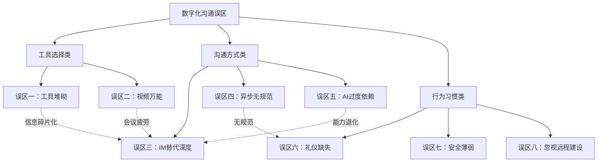
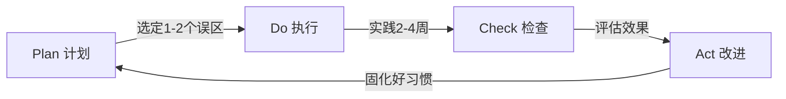

# 第四节：常见误区——数字化沟通中的典型陷阱与纠正路径

> 工具的普及不等于能力的提升。组织在数字化沟通上投入大量资源采购平台、培训员工，但麦肯锡2024年的调研显示，**61%的员工认为公司的数字沟通工具反而增加了他们的工作负担**，而非提升效率。问题不在工具本身，而在使用工具的方式——人们把线下沟通的坏习惯带到了线上，又在数字环境中养成了新的坏习惯。

本节系统梳理数字化沟通中最常见的八大误区，每个误区从**心理学机制**、**典型场景**、**深层危害**、**纠正方法**四个维度展开，帮助读者识别、诊断、纠正自身和团队的沟通问题。

---

## 一、误区全景图：八大误区的逻辑关系

在逐一拆解之前，先建立整体认知框架。八大误区可以归为三类：

| 类别 | 误区 | 核心矛盾 |
|------|------|----------|
| **工具选择** | 误区一（工具堆砌）、误区二（视频万能） | 工具能力与场景需求的错配 |
| **沟通方式** | 误区三（IM替代深度沟通）、误区四（异步无规范）、误区五（AI过度依赖） | 媒介特性与信息复杂度的不匹配 |
| **行为习惯** | 误区六（数字礼仪缺失）、误区七（安全意识薄弱）、误区八（忽视远程团队建设） | 数字素养与协作文化的缺失 |

这三类误区往往不是孤立出现的——工具选择错误会放大沟通方式的问题，而行为习惯的缺失又会让前两类问题雪上加霜。理解这个框架，有助于在诊断问题时找到根因，而非头痛医头。



---

## 二、误区一：工具越多越好——"全平台覆盖"的信息碎片化陷阱

### 典型表现

团队同时部署微信（外部客户）、钉钉（内部通知）、飞书（文档协作）、Slack（技术讨论）、邮件（正式沟通）、Jira（任务跟踪）、Notion（知识库）、腾讯会议（视频会议）等8个以上平台。员工每天需要在5-6个窗口之间反复切换，经常出现"那条消息是发在哪个群里的？"的困惑。

一个真实场景：产品经理在飞书文档里写了需求变更，技术负责人在钉钉群里讨论了影响评估，项目经理在Jira上更新了工单状态，测试工程师在微信上问了一句"这个改了没"——四个人对同一件事的认知各不相同，因为他们获取信息的渠道完全不同。

### 心理学机制：注意力切换的认知代价

工具过多的问题本质上是**注意力残留**（Attention Residue）问题。明尼苏达大学Sophie Leroy教授的研究表明，当人从一个任务切换到另一个任务时，前一个任务的思维惯性会残留在认知中，降低后续任务的效率和质量。每个工具的切换都是一次任务切换：打开微信意味着进入"即时回复"的心理模式，切换到Jira意味着进入"结构化思考"模式，切换到飞书文档意味着进入"深度阅读"模式。

频繁切换的量化影响：
- **每次切换的恢复时间**：从一次工具切换中恢复到深度工作状态，平均需要**15-23分钟**（Gloria Mark, UC Irvine, 2023）
- **认知错误率上升**：在多工具环境下工作，认知错误率比单一工具环境高出**40%**
- **信息遗漏率**：当信息分散在3个以上平台时，重要信息遗漏率从5%上升到**22%**

### 深层危害

1. **信息孤岛化**：不同团队成员在不同平台上形成信息壁垒，跨部门协作变成"信息考古"
2. **决策延迟**：关键决策所需的信息分散在多处，汇总和确认的时间成本成倍增加
3. **知识流失**：当某个平台被弃用或员工离职时，该平台上积累的沟通记录和知识随之消失
4. **新人融入困难**：新员工需要同时学习多个工具的使用规范和信息查找路径，上手周期从1周拉长到3-4周
5. **订阅成本叠加**：每个平台的人均年费从几百到几千元不等，8个平台的总成本可能超过人均万元

### 纠正方法

**第一步：工具审计（Tool Audit）**

用以下矩阵对团队当前使用的所有工具进行评估：

| 功能类别 | 当前工具 | 月活跃用户 | 重叠工具 | 评估结论 |
|----------|----------|-----------|----------|----------|
| 即时通讯 | 微信+钉钉+Slack | 50/45/20 | 3个 | 保留1个主力 |
| 文档协作 | 飞书+Notion+石墨 | 40/25/10 | 3个 | 保留1个主力 |
| 视频会议 | 腾讯会议+Zoom | 35/15 | 2个 | 保留1个主力 |
| 任务管理 | Jira+飞书项目 | 30/25 | 2个 | 保留1个主力 |
| 知识库 | Notion+Confluence | 25/20 | 2个 | 保留1个主力 |

**第二步：建立"3+1"工具栈模型**

精简到不超过4个核心平台：
- **1个信息中枢**：承载即时通讯、通知、轻量讨论（如飞书或钉钉）
- **1个协作平台**：承载文档、知识库、项目管理（如Notion或飞书文档）
- **1个专业工具**：承载特定职能（如Jira给开发团队、Salesforce给销售团队）
- **1个外部通道**：承载客户沟通（如企业微信或邮件）

**第三步：制定工具使用规范**

```markdown
# [团队名称] 工具使用规范 v1.0

## 信息分类路由表
| 信息类型 | 首选平台 | 备选平台 | 不应使用 |
|----------|----------|----------|----------|
| 日常沟通 | 飞书消息 | - | 微信群 |
| 文档协作 | 飞书文档 | Notion | 邮件附件 |
| 任务分配 | 飞书项目 | Jira | 群消息 |
| 正式通知 | 邮件 | 钉钉公告 | 微信群 |
| 紧急事项 | 电话 | 飞书电话 | 任何文字消息 |

## 信息冗余规则
- 重要决策：信息中枢 + 文档平台同步记录
- 日常沟通：只在信息中枢，不跨平台复制
- 正式文档：只在协作平台，通过链接分享
```

**第四步：季度审计机制**

每季度用一个30分钟的会议，检查：
- 各平台的月活跃数据（低于30%团队使用率的工具考虑淘汰）
- 信息遗漏投诉次数（趋势上升说明工具栈仍有问题）
- 新成员上手时间（目标：1周内能独立查找所有信息）

---

## 三、误区二：视频会议万能化——"所有事都开个会"的时间黑洞

### 典型表现

微软2024年工作趋势报告指出，自2020年以来，**普通知识工作者每周参加的视频会议数量增长了153%**。典型症状包括：

- 日历被会议占满，连续7-8小时无法进行深度工作
- 一个"简单同步"的会议开了45分钟却没有结论
- 会议中一半人在看其他屏幕处理别的事
- 会议结束后没有人记得具体的行动项和负责人
- 同一个议题在不同会议上被反复讨论

某互联网公司的真实数据：调研显示，员工平均每天参加4.2个会议，每周21个，总时长16.8小时。但其中**67%的参会者认为至少一半的会议"完全可以不开"**。

### 心理学机制：群体惰性与社交压力

为什么明知很多会议没必要，大家还是在开？根源在于两个心理机制：

1. **群体惰性（Social Loafing）**：在群体环境中，个体的责任感降低。会议给人一种"大家一起讨论了"的虚假安全感，实际上可能谁都没有真正思考。法国农业工程师Max Ringelmann在1913年发现，拔河比赛中，群体越大，个人使出的力气越小——这在会议室里同样适用。

2. **邀约社交压力**：拒绝会议邀约在职场文化中被视为"不配合"或"不重视"。研究显示，**78%的员工接受会议邀约的原因不是"需要参加"，而是"不好意思拒绝"**（Harvard Business Review, 2023）。

3. **沉没成本谬误**：既然已经安排了这个会议，就算没有实质内容也要开完——"来都来了"的会议室版本。

### 会议决策树（升级版）

这个沟通是否需要实时讨论？
│
├─ 否 → 信息传递类
│       ├─ 单向通知 → 文档/公告/邮件
│       ├─ 进度同步 → 状态更新工具（飞书项目/Jira看板）
│       └─ 简单问答 → 即时消息
│
└─ 是 → 实时讨论类
        ├─ 是否需要看到对方的视觉/情感线索？
        │   ├─ 否 → 是否需要多人参与？
        │   │   ├─ 否 → 电话/语音通话（1对1）
        │   │   └─ 是 → 语音会议（无视频）
        │   └─ 是 → 视频会议
        │       ├─ 参会人数 ≤ 5 → 开放讨论
        │       ├─ 参会人数 6-15 → 结构化会议（主持人+议程）
        │       └─ 参会人数 > 15 → 考虑拆分为多个小会
        │
        └─ 会前必须完成的清单：
            □ 议程提前24小时发送
            □ 明确目标（决策/讨论/同步/头脑风暴）
            □ 指定主持人和记录人
            □ 设定时长上限（默认30分钟，非60分钟）
            □ 筛选必要参会人（可选人不强制出席）

### 纠正方法：从"会议驱动"转向"文档驱动"的异步工作流

**原则：能异步解决的，绝不同步开会。**

具体操作：

1. **推行"文档先行"文化**：任何需要讨论的议题，先写一份简短的决策文档（包括背景、方案选项、推荐方案、讨论要点），在协作平台上开放评论。只有当评论中出现**实质性分歧**且无法通过文字解决时，才安排会议。

2. **实施"无会议日"**：每周设置1-2天为"无会议日"（如周三和周五），除非客户紧急需求，不安排任何内部会议。Atlassian公司在实施"无会议周三"后，员工深度工作时间增加了**35%**。

3. **缩短默认会议时长**：将默认会议时长从60分钟改为30分钟。Parkinson定律表明，工作会膨胀到填满所有可用时间——会议也一样。30分钟的会议比60分钟的会议更聚焦、更高效。

4. **强制会议纪要**：每次会议必须在结束前5分钟完成一份包含以下要素的纪要：
   - 讨论了什么（2-3句话概括）
   - 决定了什么（明确的结论）
   - 谁负责什么（行动项 + 负责人 + 截止日期）
   - 下一步是什么（后续跟进安排）

5. **会议成本计算器**：在会议邀请页面显示预估成本。例如：8人参加1小时会议，假设平均时薪200元，这个会议的人力成本是1600元。这个数字会让组织者更审慎地决定是否真的需要开会。

---

## 四、误区三：即时通讯替代深度沟通——"碎片化聊天"的效率幻觉

### 典型表现

一个技术方案的讨论在群里来来回回50多条消息，涉及3个子话题的混杂讨论，参与者各执一词，结论模糊。产品经理在群里发了一段长消息阐述需求，技术负责人回复了8条短消息逐条回应，项目经理又发了5条消息补充背景——这些消息散布在两小时的时间跨度中，中间还穿插了其他人发的不相关消息。

第二天，需要回顾这个讨论时，没有人能在消息历史中快速找到完整的讨论脉络。

### 心理学机制：媒介丰富度理论

Richard Daft和Robert Lengel在1986年提出的**媒介丰富度理论**（Media Richness Theory）指出，不同的沟通媒介传递信息的能力（"丰富度"）是不同的。媒介丰富度取决于四个维度：

1. **反馈速度**：能否即时获得回应
2. **多渠道线索**：是否包含语音语调、面部表情、肢体语言
3. **语言多样性**：能否使用自然语言和符号语言
4. **个人化程度**：能否针对接收者进行定制化表达

即时通讯在这四个维度上的得分都不高——尤其是"多渠道线索"几乎为零。当沟通涉及复杂概念、模糊需求或情感话题时，纯文字的即时消息无法承载足够的信息量，导致误解和效率低下。

### 沟通复杂度分级与媒介匹配

| 复杂度等级 | 特征 | 推荐媒介 | 不推荐媒介 |
|-----------|------|----------|-----------|
| **Level 1：简单通知** | 事实性信息，无需讨论 | 即时消息、公告 | 会议、邮件 |
| **Level 2：轻量问答** | 简单问题，预期简短回答 | 即时消息、电话 | 会议 |
| **Level 3：方案讨论** | 需要交换多个观点，有分歧 | 语音/视频会议 | 纯文字消息 |
| **Level 4：深度分析** | 复杂问题，需要数据支撑 | 文档协作+会议 | 即时消息 |
| **Level 5：敏感对话** | 人事、绩效、冲突、谈判 | 面对面/视频1对1 | 任何文字形式 |

### 纠正方法

**1. 建立"升级触发"规则**

当即时通讯对话出现以下信号时，应立即升级沟通渠道：
- 消息来回超过**5轮**仍未达成共识
- 出现**2次以上**的"你没理解我的意思"或"我再解释一下"
- 涉及**3个以上**需要权衡的方案选项
- 涉及**利益冲突**或**情感因素**
- 参与者中有人开始**情绪化表达**（感叹号变多、用词变激烈）

**升级路径**：即时消息 → 语音通话 → 视频会议 → 面对面沟通

**2. 推行"结构化长消息"**

如果确实需要在即时通讯中讨论稍复杂的话题，使用结构化模板：

【主题】XX方案讨论
【背景】（1-2句话说明上下文）
【问题】（明确提出要讨论的问题）
【我的想法】（清晰列出观点，带编号）
【需要你】（明确期望对方做什么：反馈/决策/执行）

**3. 敏感话题的"零文字"原则**

以下场景**绝对不要**使用文字消息：
- 绩效反馈（正面和负面都一样）
- 人事变动通知
- 团队冲突调解
- 薪资和晋升讨论
- 任何可能引起情绪反应的消息

文字消息没有语调、没有表情、没有停顿——你写的每一句话都会被对方以最悲观的方式解读。

---

## 五、误区四：忽视异步沟通的规范——"发了就行"的低质量输出

### 典型表现

异步沟通的本质是"发送者不在场时，信息依然能被准确理解"。但现实中，大量异步信息因为缺少规范而失效：

- 文档标题写"方案v2"，看不出是什么方案、哪个版本
- 邮件主题写"关于那个事情"，收件人不知道是哪个事情
- 录屏视频23分钟，关键操作在第17分钟，没有时间戳
- 飞书文档里写了一大段文字，没有标题、没有结构、没有结论
- 消息发出后10分钟没收到回复，就在群里追问"看到了吗？"

### 为什么异步沟通比同步沟通更难

同步沟通有即时反馈回路——你看到对方困惑的表情可以立刻补充说明。异步沟通没有这个回路，信息必须**自包含**（self-contained），即：接收者不需要额外上下文就能理解信息的全部含义。

这对发送者的要求反而更高：你必须假设接收者不知道任何前置信息，用最少的文字提供完整的上下文。这和大多数人的直觉相反——人们通常觉得"发消息比开会简单"，实际上恰恰相反。

### 异步沟通的"CRISP"标准

一套实用的异步信息质量检查标准：

| 维度 | 要求 | 反面示例 | 正面示例 |
|------|------|----------|----------|
| **C**ontext（上下文） | 提供足够的背景信息 | "这个方案不太好" | "关于Q3用户增长方案，我认为获客成本假设偏高——目前CAC是45元，方案里假设30元" |
| **R**equirement（需求） | 明确期望对方做什么 | "你看看这个" | "请在周三前确认这个技术方案是否可行，如有问题请列出具体反对点" |
| **I**ntent（意图） | 说明为什么发这条消息 | 发了一段截图没有说明 | "截图是线上告警面板，红色标记的是今天第3次出现的超时错误，需要排查" |
| **S**tructure（结构） | 使用标题、列表、分段 | 一大段纯文字 | 用编号列表、粗体关键词、分段组织 |
| **P**riority（优先级） | 标注紧急程度和期望时间 | 不标注，对方不知道要不要立刻看 | "【一般】本周内回复即可" 或 "【紧急】需要在2小时内确认" |

### 纠正方法：为每种异步场景建立模板

**1. 文档模板**

```markdown
# [文档标题] — [日期] — [版本]

## 一句话摘要
用一句话说明这个文档的核心内容。

## 背景
为什么写这个文档？解决什么问题？

## 核心内容
（正文，使用H3/H4分层）

## 结论/建议
明确的结论或行动建议。

## 待讨论项
有争议或需要他人决策的点，用 [ ] 标记。
```

**2. 邮件主题规范**

主题格式：`[动作词] 主题关键词 — 截止日期`

- `[审批] Q3预算方案 — 7月1日前回复`
- `[知悉] 本周五团建安排 — 无需回复`
- `[讨论] 新版本发布计划 — 欢迎留言意见`
- `[紧急] 线上服务异常处理 — 需立即查看`

**3. 录屏规范**
- 时长控制在**5分钟以内**
- 前15秒说明"这个录屏讲什么"和"谁需要看"
- 如果超过5分钟，在描述中标注关键时间戳
- 附上一份3-5句话的文字摘要

**4. 消息发送后的"等待规则"**
- 发送消息后，除非标注"紧急"，**至少等待4个工作小时**再追问
- 追问时使用友好语气："在你方便的时候看一下就好~"，而不是"？"
- 如果确实紧急，用电话而不是再次发消息

---

## 六、误区五：AI工具过度依赖——"AI代写一切"的能力退化陷阱

### 典型表现

到2026年，AI写作助手已经深度嵌入日常工作流。但过度依赖的问题也日益突出：

- 所有邮件都由AI生成，语气千篇一律，同事开始用"这是AI写的吧"来调侃
- AI回复客户投诉时使用了过于模板化的措辞，客户感受不到诚意
- 员工将公司内部数据、客户隐私信息、未公开的财务数据粘贴到公共AI平台上
- 翻译专业文档时完全依赖AI，遗漏了行业术语的微妙差异（如"consideration"在法律语境下是"对价"而不是"考虑"）
- AI生成的技术方案看起来专业，但包含过时的API引用和不存在的库函数

### 心理学机制：自动化偏差与技能萎缩

**自动化偏差（Automation Bias）**是指人类倾向于过度信任自动化系统的输出，即使输出明显有误。在AI写作场景中表现为：人们对AI生成的内容降低审查标准，认为"AI应该比我写得好"。

**技能萎缩（Skill Atrophy）**是自动化偏差的长期后果：当人们不再练习某项技能时，这项技能会退化。医学领域已有先例——过度依赖影像诊断AI的放射科医生，在AI辅助系统不可用时，诊断准确率下降了**33%**（Lancet Digital Health, 2024）。沟通能力同样会萎缩：长期依赖AI写邮件的人，自己提笔写一封得体的邮件会越来越吃力。

### AI使用的"三不原则"与"三必做"

**三不原则：**

| 不做什么 | 为什么 | 违反后果 |
|----------|--------|----------|
| **不无脑转发** | AI可能包含事实错误、偏见、过时信息 | 传播错误信息，损害专业信誉 |
| **不输入机密** | 公共AI平台可能存储和使用输入数据 | 数据泄露，可能违反合规要求 |
| **不放弃思考** | 长期依赖导致自身判断力和表达力退化 | 丧失核心竞争力 |

**三必做：**

| 做什么 | 怎么做 | 检查标准 |
|--------|--------|----------|
| **必审校** | AI生成后至少通读一遍，检查事实、语气、适用性 | 能否向他人解释每一句话的含义？ |
| **必个性化** | 在AI基础上加入个人风格、具体案例、情感温度 | 这段文字能否被识别出是你写的？ |
| **必学习** | 每次使用AI后反思"我从中学到了什么表达方式" | 下次遇到类似场景，能否独立写出？ |

### AI辅助沟通的正确工作流

步骤1：明确沟通目标
  ├── 目标是什么？（告知/说服/请求/协商）
  ├── 对象是谁？（上下级/客户/同事/公开场合）
  └── 语气要求？（正式/轻松/严肃/温暖）

步骤2：自己先写一版草稿
  ├── 写出核心观点和关键信息
  └── 不追求完美，先有骨架

步骤3：用AI优化和扩展
  ├── "请帮我润色以下文字，保持原意但提升可读性"
  ├── "请帮我补充可能遗漏的角度"
  └── "请帮我检查是否有逻辑漏洞"

步骤4：人工终审
  ├── 检查事实准确性（AI可能编造数据）
  ├── 调整语气和风格（加入个人特色）
  ├── 验证敏感信息（确保不包含机密数据）
  └── 代入接收者视角（"如果我收到这封邮件，会怎么理解？"）

步骤5：发送并复盘
  └── 收到回复后反思效果，积累经验

### 敏感信息保护清单

以下信息**绝对不能**输入公共AI平台：
- 客户个人信息（姓名、联系方式、购买记录）
- 公司未公开的财务数据
- 内部战略规划和商业机密
- 员工薪资和绩效信息
- 法律案件的相关资料
- 源代码中的安全密钥和凭证
- 未公开的产品设计和技术方案

如果公司有私有化部署的AI服务，确认数据不会外传后再使用。

---

## 七、误区六：数字礼仪缺失——"消息只是文字"的社交盲区

### 典型表现

数字礼仪问题往往不是恶意的，而是发送者没有意识到自己的行为对他人造成的影响：

- 周六晚上11点发工作消息，附一句"明天记得处理"
- 群聊里连续发送10条碎片消息，每条只有几个字
- 一条消息300字不加标点不分段
- 未经允许发送60秒语音消息，对方在嘈杂环境中无法收听
- 在500人大群里@所有人发一个只有10人关心的话题
- 收到消息后"已读不回"，三天后才回复一句"好的"
- 在emoji可以表达的场景中写一段严肃的文字（如同事分享快乐时回复"收到，感谢告知"）

### 心理学机制：去个体化效应与共情缺失

**去个体化效应（Deindividuation）**：在线上沟通中，人们看不到对方的面部表情和肢体语言，容易把对方简化为"一个头像"而非"一个有情感的人"。这降低了社交约束，使人更容易做出在面对面场景中不会做的事情——比如深夜发工作消息、粗暴地拒绝请求。

**共情缺口**：哥伦比亚大学的研究发现，发送者在发送消息时，往往**高估了接收者理解自己意图的能力**——发送者认为自己的语气和意图很清晰，但接收者实际能准确感知的只有一半左右。文字消息丢失了93%的情感信号（Albert Mehrabian的7-38-55法则中，语调占38%，肢体语言占55%）。

### 纠正方法：建立团队数字沟通公约

**通用数字礼仪清单：**

发送前检查：
  □ 现在是非工作时间吗？如果是，这条消息是否紧急到必须现在发？
    → 不紧急：设为定时发送（次日工作时间）
    → 紧急：在消息开头说明"抱歉深夜打扰，因为XX原因需要现在告知"
  □ 这条消息适合发文字还是语音？
    → 10人以上的群聊：不要发语音
    → 对方在会议/出差中：不要发语音
    → 如果发语音：先问一句"方便听语音吗？"
  □ 这条消息是否需要@所有人？
    → 只有以下情况才@所有人：紧急通知、全员福利、不可错过的截止日期
    → 其他情况@具体的人

收到消息后：
  □ 收到需要行动的消息 → 确认并给预计完成时间："收到，预计周三前完成"
  □ 收到需要思考的消息 → 先回复收到："收到，我看看然后回复你"
  □ 确实没时间处理 → 回复一个简短的acknowledgment而不是沉默

群聊礼仪：
  □ 回复特定某人时使用"引用回复"功能
  □ 不要在一个群聊中混杂多个不相关话题
  □ 在群聊中讨论超过5分钟时，考虑私聊或创建子话题
  □ 每条消息表达一个完整的意思，不要拆成碎片

**语音消息使用规范：**

| 场景 | 是否适合语音 | 替代方案 |
|------|------------|----------|
| 快速确认一件简单的事 | ✅ 适合（10秒以内） | 文字也可以 |
| 解释一个复杂操作 | ✅ 适合（配截图） | 录屏更好 |
| 群聊中的讨论 | ❌ 不适合 | 文字 |
| 传递具体数据/链接 | ❌ 绝对不适合 | 文字 |
| 情感交流、安慰 | ✅ 适合 | - |
| 紧急通知 | ❌ 不适合 | 电话 |

---

## 八、误区七：信息安全意识薄弱——"方便优先"的风险累积

### 典型表现

信息安全问题往往不是一次大事故，而是无数次"小方便"的累积：

- 为了方便外部合作方查看，把共享链接设为"所有人可编辑"且永不过期
- 在公开群聊中贴出客户合同截图，里面有客户的个人信息
- 用个人微信传输公司文件，因为"公司微信传输慢"
- 在咖啡厅用公共Wi-Fi参加公司内部会议，讨论未发布的产品计划
- 离职员工的账号权限没有及时清理，3个月后仍然可以访问内部系统
- 为了"快速对齐"，在消息中直接贴出数据库密码和API密钥

IBM《2024年数据泄露成本报告》显示，**74%的数据泄露涉及人为因素**，其中"无意的内部人员错误"是最大的单一原因，而非外部黑客攻击。

### 信息分级与渠道选择

| 信息敏感度 | 定义 | 允许的沟通渠道 | 示例 |
|-----------|------|--------------|------|
| **公开级** | 可以对外公开 | 任何渠道 | 产品公开文档、招聘信息 |
| **内部级** | 公司内部可共享 | 企业通讯工具+内部文档平台 | 内部流程、会议纪要 |
| **机密级** | 仅特定人员可访问 | 加密通道+权限控制 | 薪资数据、战略规划 |
| **绝密级** | 极少数人可接触 | 面对面或端到端加密 | 并购计划、未公开财报 |

### 纠正方法：可执行的安全习惯

**1. 链接分享安全检查**

分享文档链接前，逐项检查：
- 权限设置是否为"最小必要"（查看权限而非编辑权限）
- 是否设置了过期时间（建议外部链接不超过30天）
- 是否需要密码访问（敏感文档必须）
- 接收者是否都是应该看到这个文档的人

**2. 消息安全检查**

发送可能包含敏感信息的消息前：
- 是否在正确的群聊/私聊中？（检查是否发错了群）
- 是否包含了不必要的敏感细节？（脱敏处理）
- 如果这条消息被截图转发到外部，是否会造成损害？
- 是否可以通过文档链接替代直接贴出内容？

**3. 设备与账号安全基线**

- 工作设备启用磁盘加密（BitLocker/FileVault）
- 使用密码管理器，不重复使用密码
- 启用双因素认证（优先使用硬件密钥或认证器App，不用短信）
- 不在公共Wi-Fi上处理机密信息，必要时使用VPN
- 离开工位时锁定屏幕（Win+L / Ctrl+Cmd+Q）

**4. 权限生命周期管理**

入职时：
  → 根据角色分配最小必要权限
  → 记录权限清单

角色变更时：
  → 审查旧权限是否仍然需要
  → 移除不再适用的权限

项目结束时：
  → 项目文档设置为只读或归档
  → 撤销外部协作者的访问权限
  → 撤销临时授予的特殊权限

离职时：
  → 当天禁用账号（不是删除，先禁用）
  → 审查是否有未归还的设备或资料
  → 90天后确认无问题再删除账号

---

## 九、误区八：忽视远程团队建设——"只要干活就行"的组织冷漠

### 典型表现

远程团队的沟通误区不是"沟通太少"，而是"只有工作沟通"：

- 团队频道里只有任务分配、进度汇报和问题讨论
- 成员之间互不了解——不知道对方的爱好、家庭、生活状态
- 新成员入职一周后，还不知道该找谁问非工作问题
- 团队里有人连续两周没在群里说过话，没有人在意
- 年度员工满意度调查显示，远程员工的"归属感"得分比办公室员工低**40%**

Buffer的《2024远程工作状态报告》指出，远程工作者最大的挑战不是生产力（远程工作效率通常更高），而是**孤独感（23%）和与团队断联感（16%）**。

### 心理学机制：弱关系的重要性

社会学家Mark Granovetter在1973年提出的**弱关系理论**指出，"弱关系"（非亲密的社交连接）在信息流通和社会支持中扮演着关键角色。在传统办公室中，弱关系通过茶水间闲聊、午餐偶遇、电梯寒暄自然形成。远程环境中，这些"偶遇"场景完全消失，弱关系需要被主动创造。

没有弱关系的团队，信息流动受阻——人们只和"需要沟通"的人沟通，跨部门协作变得困难。更严重的是，当团队成员之间只有工作关系时，冲突更容易升级——因为没有情感缓冲，一次工作分歧可能直接破坏合作关系。

### 纠正方法：从"纯工作"到"有温度"的远程团队

**1. 创建"非工作"空间**

在团队通讯工具中建立专属的非工作频道，保持活跃：
- #随手拍：分享日常生活照片（宠物、美食、风景）
- #今日推荐：推荐歌曲、书籍、播客
- #午间闲聊：午餐时间的轻松话题
- #成就分享：非工作成就（跑完半马、学会新菜）

关键：这些频道必须有**管理者参与**——如果只有基层员工在发，管理层从不互动，这些频道很快会变成"自言自语"。

**2. "虚拟咖啡"（Virtual Coffee）机制**

- 使用随机配对工具（如Donut for Slack，或飞书的类似功能）
- 每周自动配对2-3对成员进行15-20分钟的非正式视频聊天
- 聊天内容不限于工作——可以是周末计划、兴趣爱好、最近看的电影
- 不强制参加，但鼓励参与

**3. 新成员融入计划**

远程新人入职的第一周，安排以下"连接"：

| 时间 | 活动 | 目的 |
|------|------|------|
| 第1天 | 欢迎视频会议（全组15分钟） | 正式介绍，让所有人认识新成员 |
| 第1天 | 指定1位"伙伴"（Buddy） | 非工作问题的第一联络人 |
| 第1周 | 与每位团队成员1对1聊天（各15分钟） | 建立个人连接 |
| 第1周 | 发布团队"成员档案" | 照片+爱好+一个有趣的事实 |
| 第2周 | 参加一次非工作频道的活动 | 自然融入社交氛围 |

**4. 定期线下活动**

纯线上无法完全替代面对面的深度连接：
- **季度团建**：每年至少2-4次线下聚会（可以和公司季度会议结合）
- **年度全员会**：如果团队分布在全国各地，每年至少1次全员线下聚会
- **区域小聚**：同城成员每月1次非正式聚餐

**5. 可量化的情感检查**

每月用一个简单的匿名问卷（3个问题，1分钟完成）监测团队健康度：
1. "过去一个月，你感到被团队支持吗？"（1-5分）
2. "过去一个月，你和非直属同事有过有意义的交流吗？"（是/否）
3. "如果可以改变一件事来改善团队氛围，你会改什么？"（开放式）

跟踪分数趋势，下降时及时干预。

---

## 十、误区诊断工具：自我检查清单

在了解了八大误区之后，用以下清单对自身和团队进行诊断。如果勾选超过5项，说明你的团队在数字化沟通上存在显著的改进空间。

### 工具选择维度

- [ ] 团队使用3个以上的即时通讯工具
- [ ] 经常出现"这条消息发在哪里了"的困惑
- [ ] 新成员需要1周以上才能搞清楚该用哪个工具
- [ ] 不同团队使用不同的工具完成同一件事

### 会议效率维度

- [ ] 日均会议超过3个
- [ ] 会议经常超时
- [ ] 会后没有明确的行动项和负责人
- [ ] 你经常在会议中做其他事情

### 沟通质量维度

- [ ] 复杂问题在群聊中讨论50条消息仍未解决
- [ ] 收到的文档/邮件经常需要追问才能理解意图
- [ ] 敏感话题通过文字消息处理
- [ ] AI生成的内容经常未经修改直接发送

### 礼仪与安全维度

- [ ] 经常收到非工作时间的非紧急消息
- [ ] 群聊中频繁被@所有人打扰
- [ ] 文档共享链接没有设置过期时间
- [ ] 不确定离职员工的账号权限是否已清理

### 团队建设维度

- [ ] 团队成员之间只有工作沟通
- [ ] 远程员工的满意度低于办公室员工
- [ ] 新成员融入超过1个月才能"找到感觉"
- [ ] 团队里有成员超过一周没有非工作交流

---

## 十一、从误区到习惯：持续改进的框架

识别误区只是第一步，真正改变需要系统的习惯养成。推荐使用**PDCA循环**（Plan-Do-Check-Act）推动沟通习惯的持续改进：



**具体执行建议：**

1. **不要同时改**：一次只聚焦1-2个误区，贪多嚼不烂
2. **设定量化目标**：不说"减少会议"，而说"每周会议从20个减少到12个"
3. **找一个搭档**：和团队中的一位同事互相监督，每周分享进展
4. **庆祝小进步**：第一周把会议从20个降到16个，也值得肯定
5. **记录和复盘**：每月回顾一次，哪些改善了、哪些回到了旧习惯、为什么

---

> **核心要义**：数字化沟通中的误区往往不是"不知道正确做法"，而是"知道但做不到"。问题的根源不在认知，而在习惯。纠正误区的关键不是学习新知识，而是**用新习惯替代旧习惯**。选一个最困扰你的误区，从今天开始，用上面的方法坚持21天——习惯一旦形成，改变就不再是负担。
