# 第六节：本章小结

## 知识体系全景回顾

本章按照"道法术器"的逻辑层层递进，构建了完整的数字化沟通能力体系。从理论基础到核心技巧，从实战案例到常见误区，从刻意练习到深度拓展，每一个环节都不是孤立的知识点，而是整个能力拼图中不可或缺的一块。

回顾全章内容，知识脉络可以用一张图来概括：

```mermaid
graph TD
    A[数字化沟通能力体系] --> B[道：理论认知]
    A --> C[法：方法框架]
    A --> D[术：实操技巧]
    A --> E[器：工具选择]

    B --> B1[媒体丰富度理论]
    B --> B2[媒体同步性理论]
    B --> B3[技术接受模型]
    B --> B4[CMC理论]
    B --> B5[分布式团队理论]
    B --> B6[注意力管理框架]

    C --> C1[异步优先原则]
    C --> C2[工具精简原则]
    C --> C3[规范先行原则]
    C --> C4[安全第一原则]

    D --> D1[视频会议全生命周期]
    D --> D2[即时协作规范]
    D --> D3[异步沟通体系]
    D --> D4[AI辅助沟通]
    D --> D5[混合办公策略]

    E --> E1[视频会议平台]
    E --> E2[即时协作工具]
    E --> E3[文档协作工具]
    E --> E4[AI工具生态]
    E --> E5[项目管理平台]

    style A fill:#1a1a2e,stroke:#e94560
    style B fill:#16213e,stroke:#0f3460
    style C fill:#16213e,stroke:#0f3460
    style D fill:#16213e,stroke:#0f3460
    style E fill:#16213e,stroke:#0f3460
```

以下将从六个维度对本章核心内容进行深度整合与提炼。

---

## 一、理论框架的深层理解

### 六大理论的内在关联

本章介绍的六大理论并非相互独立的学术概念，而是一个有机整体。理解它们之间的关系，比单独记忆每个理论更有价值。

**媒体丰富度理论与媒体同步性理论是工具选择的"双维度标尺"。** 媒体丰富度理论回答"用什么工具传递信息最有效"——复杂、模糊、情感性强的沟通需要高丰富度媒体（视频会议、面对面），而简单、明确、事实性的沟通可以用低丰富度媒体（邮件、文档）。媒体同步性理论则在此基础上增加了时间维度——即使同样丰富度的沟通，也存在"需要实时互动"和"可以异步处理"的区分。两个理论交叉使用，才能在面对具体沟通场景时做出精准的工具选择。

**技术接受模型是组织推广工具的"路线图"。** 很多团队引入了优秀的工具却用不起来，根本原因在于忽视了感知有用性和感知易用性这两个关键变量。员工不是不愿意用新工具，而是没有看到足够的价值，或者学习成本太高。理解了TAM模型，就知道推广新工具时应该先用实际案例展示价值（提升感知有用性），再提供充分培训降低门槛（提升感知易用性），最后借助意见领袖的示范效应影响使用态度。

**CMC理论揭示了数字沟通的独特优势。** 早期观点认为数字化沟通因缺少非语言线索而"先天不足"，但Walther的社会信息处理理论和超人际沟通模型纠正了这一偏见。人们会发展出表情符号、标点符号、回复节奏等替代性表达方式；在异步场景中，发送者有更多时间精心编辑信息，接收者有更多空间理性消化内容，这反而可以在某些场景中产生比面对面沟通更好的效果。关键在于：不是弥补"缺陷"，而是发挥"特长"。

**分布式团队沟通理论是远程协作的"操作系统"。** 时间-空间矩阵将沟通分为四种模式（同地同步、同地异步、异地同步、异地异步），每种模式都有对应的工具和方法。分布式认知理论进一步指出，远程团队的认知过程分布在成员、工具和环境之间——这意味着选择什么样的工具、建立什么样的规范，直接决定了团队能否形成共享心智模型。

**注意力管理框架是信息时代的"生存技能"。** Herbert Simon在1971年的预言——"信息的丰富导致注意力的贫乏"——在今天已经完全应验。知识工作者每天花近一半时间在邮件和内部沟通上，真正用于深度工作的时间不足40%。信息分级、时间块管理、工具分流、静默优先，这四个策略不是可选的"效率技巧"，而是信息时代维持专业能力的必要条件。

### 理论到实践的转化路径

理论的价值在于指导决策。以下是六大理论在实际工作中的典型应用场景：

| 工作场景 | 适用理论 | 决策依据 | 推荐工具 |
|----------|----------|----------|----------|
| 处理团队成员之间的冲突 | 媒体丰富度理论 | 冲突调解需要高丰富度媒体传递情感和非语言信息 | 视频会议（优于电话和文字） |
| 跨时区团队的项目推进 | 媒体同步性理论 | 时差使得同步沟通成本过高，应以异步为主 | 异步文档 + 录屏 + 定期同步会议 |
| 向全公司推广新协作平台 | 技术接受模型 | 需要同时提升感知有用性和感知易用性 | 试点+培训+标杆案例 |
| 建立远程团队信任 | CMC理论 | 远程团队需要发展替代性的社会线索传递方式 | 视频会议+非工作频道+虚拟团建 |
| 提升团队知识共享效率 | 分布式认知理论 | 知识不应只存在于个人头脑中，需要外部化 | 团队Wiki+文档协作+知识库 |
| 应对信息过载和"消息疲劳" | 注意力管理框架 | 需要建立信息分级和工具分流机制 | 消息分级+静默时段+工具精简 |

---

## 二、工具体系的系统化认知

### 工具全景图与选型逻辑

本章涉及的沟通工具覆盖六大类别，每类工具都有明确的适用场景和使用边界：

| 工具类别 | 代表工具 | 核心价值 | 最佳使用场景 | 常见误用 |
|----------|----------|----------|-------------|----------|
| 视频会议 | Zoom、Teams、腾讯会议、飞书会议 | 实时互动、视觉交流、情感传递 | 战略讨论、冲突调解、创意头脑风暴、1对1深度沟通 | 用作日常信息传达（应改用异步方式） |
| 即时协作 | Slack、飞书、钉钉、企业微信 | 快速沟通、频道管理、信息流转 | 日常协调、快速问答、状态更新、紧急通知 | 用作深度讨论（应转为文档或会议） |
| 文档协作 | Notion、飞书文档、Google Docs | 深度思考、异步协作、知识沉淀 | 方案讨论、需求文档、会议纪要、知识库建设 | 写完不通知相关人员（应主动@并设置阅读截止） |
| 录屏工具 | Loom、OBS Studio | 视觉演示、异步讲解、可回放 | 操作演示、代码审查、Bug报告、工作交接 | 录制过长（应控制在5分钟以内） |
| AI辅助 | ChatGPT、Claude、Grammarly、DeepL | 效率提升、质量保证、语言转换 | 邮件草拟、翻译、文案润色、会议纪要整理 | 直接发送AI生成内容（必须人工审核） |
| 数字白板 | Miro、FigJam、飞书白板 | 可视化协作、创意激发 | 头脑风暴、流程设计、用户旅程、决策矩阵 | 缺少事先设计（应提前准备模板和结构） |
| 项目管理 | Jira、Notion、飞书项目、Trello | 进度跟踪、任务分配、知识管理 | 项目规划、任务分配、进度跟踪、复盘总结 | 信息孤岛（应与沟通工具建立联动） |

### 工具选择的核心决策逻辑

选择工具时，不要问"哪个工具功能最强"，而要问"这个沟通任务的本质需求是什么"。以下是决策的核心逻辑：

**第一步：判断同步性需求。** 这个沟通是否需要实时互动？如果双方需要即时反馈、讨论、决策，选择同步工具（视频会议、电话、即时消息）。如果信息可以被异步处理，优先考虑异步工具（文档、邮件、录屏）。

**第二步：判断丰富度需求。** 这个沟通是否涉及复杂信息、情感表达、模糊议题？如果是，选择高丰富度媒体（视频会议优于电话，电话优于文字）。如果是简单的信息传递、数据分享、通知确认，低丰富度媒体完全足够。

**第三步：判断持久性需求。** 这个沟通的结果是否需要被记录、检索、复用？如果是，选择文档化工具（协作文档、项目管理系统）。如果是一次性沟通，即时消息或语音通话即可。

**第四步：判断受众规模。** 是1对1沟通、小团队沟通还是大规模信息传达？不同规模对工具的要求完全不同——1对1深度沟通适合视频会议，小团队协作适合即时协作工具，大规模信息传达适合文档+通知的组合。

---

## 三、核心原则的深度提炼

### 原则一：异步优先

"异步优先"是本章最核心的原则之一，但它的含义常常被误解。异步优先不是"不要开会"，而是"默认使用异步方式，仅在满足特定条件时才切换为同步"。

**需要同步沟通的场景（满足任一即可）：**
- 需要实时讨论和反馈，无法通过文字高效完成
- 涉及情感交流、冲突调解、信任建立
- 需要在限定时间内做出紧急决策
- 需要多人同时关注同一信息进行协作（如头脑风暴）

**应该使用异步沟通的场景（绝大多数日常工作）：**
- 信息传达、进度汇报、状态更新
- 需要时间思考和准备的讨论
- 跨时区协作
- 需要留下记录和可追溯性的沟通
- 不需要所有人同时在场的决策（收集意见即可）

异步优先的价值在于：它保护了每个人的"深度工作时间"。Cal Newport在《Deep Work》中指出，知识工作者的核心价值在于深度思考和创造性工作，而频繁的同步沟通是深度工作的最大敌人。每一次不必要的会议，不仅消耗了参会者的时间，还打断了他们的注意力——研究表明，从被打断到重新进入深度工作状态，平均需要23分钟。

### 原则二：工具精简

工具精简的核心是"每类功能只保留一个主力工具"。这不仅仅是为了减少学习成本，更重要的是解决信息碎片化问题。当团队成员需要在5个不同平台之间来回切换时，信息遗漏几乎是必然的。

**工具精简的实施步骤：**

1. **盘点**：列出团队当前使用的所有沟通工具，标注每个工具的主要用途
2. **评估**：识别功能重叠的工具，找出冗余
3. **选择**：每类功能只保留一个主力工具，选择标准是"团队多数人已经在用且满意度高"
4. **迁移**：制定迁移计划，设定过渡期，逐步将所有人迁移到精简后的工具栈
5. **固化**：制定工具使用规范，明确每个工具的使用场景和规则

### 原则三：规范先行

规范的价值不在于约束，而在于降低沟通成本。当团队成员都清楚"这类信息应该发在哪里""会议纪要应该包含哪些要素""@某人意味着什么"时，沟通效率会显著提升。

**需要建立规范的关键领域：**
- 消息格式和回复规范（结构化、行动导向、合理使用@）
- 会议规范（议程模板、时间控制、会后跟进）
- 文档规范（命名规则、目录结构、权限管理）
- 工具使用规范（每个工具的适用场景、使用边界）

### 原则四：安全第一

信息安全不是"附加项"，而是数字化沟通的"底线"。本章反复强调：在享受工具便利的同时，始终关注信息安全。这包括但不限于：
- 不在公共渠道讨论敏感商业信息
- 不在AI工具中输入包含客户数据、财务数据的内容
- 定期检查和更新权限设置
- 对可疑链接和附件保持警惕
- 遵守数据保护法规和公司合规要求

### 原则五：人本导向

工具为人服务，而不是人围着工具转。当某个工具或流程让人感到负担而不是便利时，应该重新审视它存在的必要性。数字化沟通的最终目标不是"用上最先进的工具"，而是"实现最有效的沟通"。

---

## 四、常见误区的系统化纠正

本章第四节详细剖析了数字化沟通中的八大常见误区。以下是每个误区的核心纠正思路：

| 误区 | 核心问题 | 纠正方向 |
|------|----------|----------|
| 工具越多越好 | 信息碎片化，注意力分散 | 精简工具栈，建立信息中枢 |
| 视频会议万能化 | "会议地狱"，深度工作时间被压缩 | 使用会议决策树，默认异步优先 |
| 即时通讯替代深度沟通 | 重要讨论被碎片化消息淹没 | 建立沟通升级机制（即时→文档→会议） |
| 异步规范缺失 | 文档没人看，邮件没人回 | 建立异步沟通的"规则引擎" |
| AI过度依赖 | 失去个人沟通风格，产生错误信息 | 将AI定位为"助手"而非"替代品" |
| 数字礼仪缺失 | 深夜@所有人，语音轰炸 | 建立团队数字礼仪公约 |
| 信息安全薄弱 | 数据泄露、权限失控 | 建立安全意识培训和定期审查机制 |
| 忽视远程团队建设 | 信任缺失、归属感弱 | 建立虚拟团建和非工作交流机制 |

这些误区的共同根源是：**只关注工具的功能，忽视了工具使用的方式。** 解决方案不是换工具，而是建立规范、培养习惯、形成文化。

---

## 五、能力评估与自我诊断

### 数字化沟通能力自评矩阵

以下评估矩阵帮助读者快速定位自己在数字化沟通各维度上的能力水平。请诚实评估每一项，找出最需要提升的领域。

| 能力维度 | 初级（1-3分） | 中级（4-6分） | 高级（7-10分） | 自评分数 |
|----------|--------------|--------------|---------------|----------|
| 工具选择 | 根据习惯使用固定工具 | 能根据场景选择合适工具 | 建立了完整的工具选择决策框架 | ____ |
| 视频会议 | 能参加会议 | 能主持高效会议 | 能设计会议体系和培养团队习惯 | ____ |
| 异步沟通 | 会发邮件和文档 | 建立了异步沟通规范 | 形成了异步优先的团队文化 | ____ |
| AI辅助 | 偶尔用AI翻译 | 将AI融入日常工作流 | 建立了AI辅助沟通的最佳实践体系 | ____ |
| 信息安全 | 有基本的安全意识 | 执行安全规范 | 能识别风险并建立防护机制 | ____ |
| 信息管理 | 经常信息过载 | 有基本的信息分级习惯 | 建立了系统化的注意力管理机制 | ____ |
| 团队规范 | 无明确规范 | 有基本的沟通规范 | 规范被团队内化为习惯 | ____ |
| 跨文化沟通 | 仅使用母语沟通 | 能用英语进行基本协作 | 能应对多语言、多文化场景 | ____ |

**评分说明：**
- **8-16分（初级）**：建议完整学习本章所有内容，从理论基础开始
- **17-40分（中级）**：建议重点学习第二至第四节，强化实操能力
- **41-80分（高级）**：建议关注深度拓展部分，探索前沿趋势和组织级优化

### 快速能力诊断问题清单

回答以下12个问题，每个"否"扣1分（基础分12分）：

1. 你能用一句话解释"媒体丰富度理论"的核心含义吗？
2. 你能根据沟通场景在30秒内选择合适的工具吗？
3. 你的团队有明确的沟通工具使用规范吗？
4. 你主持的视频会议有议程、有纪要、有行动项跟进吗？
5. 你的团队默认使用异步方式传递非紧急信息吗？
6. 你知道哪些信息不适合在AI工具中输入吗？
7. 你有系统化的信息分级和注意力管理机制吗？
8. 你能在5分钟内录制一份清晰的异步讲解视频吗？
9. 你知道如何在Notion或类似工具中建立团队知识库吗？
10. 你的团队有信息安全定期审查机制吗？
11. 你能在跨文化场景中选择合适的沟通方式和工具吗？
12. 你了解AI辅助沟通的最新发展趋势吗？

**得分解读：**
- **10-12分**：数字化沟通能力扎实，可以进入深度拓展阶段
- **7-9分**：基础良好，建议针对薄弱环节重点提升
- **4-6分**：需要系统学习，建议按标准路径完整学习本章
- **0-3分**：建议从理论基础开始，逐步建立认知框架

---

## 六、行动指南：分阶段能力提升路线

### 第一阶段：立即行动（本周内完成）

这些行动不需要额外投入，只需改变习惯：

- [ ] **盘点工具栈**：列出你和团队当前使用的所有沟通工具，标记每个工具的主要用途和使用频率。识别功能重叠的工具，思考是否可以精简
- [ ] **启动一次异步沟通**：将下一次计划中的同步会议改为异步方式——用文档发起讨论，设定24小时收集意见的截止时间，对比效果
- [ ] **录制一段3分钟的Loom视频**：选择一个你最近需要向同事解释的问题，用录屏工具录制讲解视频，替代原本需要安排会议或写长文的方式
- [ ] **审查一次信息安全**：检查你的即时协作工具权限设置，确认是否有不必要的外部人员在群组中，清理过期的共享链接

### 第二阶段：本月内完成

这些行动需要一定的时间投入，但回报显著：

- [ ] **建立团队沟通规范V1.0**：参考本章的模板和最佳实践，制定一份简洁的沟通工具使用规范，覆盖工具选择、消息格式、会议规则、文档标准四个维度。不需要完美，先发布V1.0，再迭代
- [ ] **完成3次视频会议主持练习**：参考第五节的练习一，录制并回放自己主持的视频会议，每次记录3个做得好的地方和3个需要改进的地方
- [ ] **尝试2次AI辅助沟通**：用ChatGPT或类似工具辅助完成一次邮件草拟和一次文档润色，记录效率提升和质量变化
- [ ] **制作1个数字白板协作模板**：在Miro或FigJam中创建一个团队头脑风暴模板，包括问题定义区、创意发散区、投票筛选区、行动计划区

### 第三阶段：季度内完成

这些行动需要团队层面的推动，是能力从"个人"扩展到"团队"的关键：

- [ ] **建立异步沟通模板库**：收集和整理团队常用的异步沟通模板（方案评审、问题汇报、决策请求、工作交接等），建立可复用的模板库
- [ ] **完成工具精简和迁移**：根据盘点结果，推动团队完成工具精简，设定过渡期，制定迁移计划
- [ ] **建立信息安全审查机制**：每季度进行一次信息安全自查，包括权限审核、数据分类、安全培训
- [ ] **培养团队的异步沟通文化**：通过示范和引导，让团队逐步接受异步优先的沟通理念。这需要时间和耐心，但一旦形成习惯，效果是持续的

### 第四阶段：持续优化

数字化沟通能力的提升是一个持续过程，以下习惯值得长期坚持：

- [ ] **每季度复盘沟通效率**：回顾过去三个月的沟通模式，识别瓶颈和改进空间
- [ ] **持续关注AI等新技术的应用**：AI在沟通领域的应用正在快速演进，保持学习和尝试的习惯
- [ ] **定期更新团队沟通规范**：随着团队规模变化、工具更新、业务调整，沟通规范需要定期修订
- [ ] **分享和传授沟通经验**：将你在数字化沟通中积累的经验分享给同事和新成员，教学相长

---

## 七、从本章到全书的知识衔接

### 与沟通表达基础的关联

本章的工具与技术是沟通表达能力在数字化场景中的延伸。第一章到第四章建立的倾听、表达、反馈等基础能力，在数字化环境中同样适用——只是载体和形式发生了变化。例如：
- "倾听"在线上转化为"认真阅读文档和消息，不遗漏关键信息"
- "清晰表达"在线上转化为"结构化写作、标注重点、明确行动项"
- "反馈"在线上转化为"及时回复、确认收到、提供有建设性的评论"

### 与跨文化沟通的关联

在跨国企业中，沟通工具的选择和使用还需要考虑文化因素。高语境文化（如中国、日本）的团队可能更依赖视频会议和即时通讯，因为这些工具能传递更多的上下文信息；低语境文化（如美国、德国）的团队可能更习惯文档化和异步沟通，因为它们强调信息的明确性和可追溯性。

### 与冲突管理的关联

当团队中出现沟通问题或冲突时，工具选择至关重要。媒体丰富度理论明确指出，复杂、模糊、情感性强的沟通应选择高丰富度媒体。这意味着：如果团队成员之间存在误解或冲突，发一条文字消息或写一封邮件往往会让问题恶化——应该切换到视频会议或面对面沟通。

### 与领导力的关联

对于团队管理者而言，数字化沟通能力直接影响团队效能。McKinsey的研究表明，高效使用社交技术的团队，知识工作者的生产力可以提升20-25%。管理者不仅要掌握工具，更要建立团队的沟通文化——这需要以身作则、制定规范、持续优化。

---

## 进一步学习资源

### 书籍推荐

| 书名 | 作者 | 核心价值 | 推荐理由 |
|------|------|----------|----------|
| 《Remote Not Distant》 | Gustavo Razzetti | 远程团队沟通实践指南 | 系统讲解远程团队的沟通策略和文化建设 |
| 《The Long-Distance Leader》 | Kevin Eikenberry, Wayne Turmel | 远程领导力 | 专注于远程环境下的领导力实践 |
| 《Deep Work》 | Cal Newport | 深度工作与注意力管理 | 理解为什么"异步优先"如此重要 |
| 《The Culture Map》 | Erin Meyer | 跨文化沟通 | 理解不同文化在沟通方式上的差异 |
| 《Nonviolent Communication》 | Marshall B. Rosenberg | 非暴力沟通 | 数字化环境中的沟通同样需要非暴力沟通的原则 |

### 在线资源

- **GitLab远程工作手册**（https://handbook.gitlab.com/）：全球最大的全远程公司之一的完整工作手册，涵盖沟通规范、工具使用、异步协作的最佳实践
- **Basecamp Shape Up方法论**：项目管理和异步协作的实操方法论，适合技术团队参考
- **Harvard Business Review远程工作专题**：持续更新的远程工作和数字化沟通研究成果

### 工具学习路径

| 学习阶段 | 推荐工具 | 学习目标 | 预计时间 |
|----------|----------|----------|----------|
| 入门 | Zoom/Teams + 企业微信/钉钉 | 掌握基本的视频会议和即时协作 | 1周 |
| 进阶 | Slack/飞书 + Notion + Loom | 建立异步沟通能力 | 2周 |
| 高级 | Miro/FigJam + AI工具 + Jira | 掌握可视化协作和AI辅助 | 3周 |
| 专家 | 工具整合 + 自动化流程 + 团队规范 | 建立团队级的沟通系统 | 持续 |

---

## 章末寄语

> 数字化沟通工具正在快速演进——从文字到视频，从人工到AI，从平面到立体（元宇宙），从手动到脑机接口。但无论技术如何变化，有效沟通的本质从未改变：**理解对方的需求，清晰表达自己的想法，在互动中建立信任。**
>
> 掌握工具是手段，提升沟通质量才是目的。工具可以让人沟通得更快，但只有理解、同理心和真诚，才能让人沟通得更好。
>
> 愿每位读者都能在数字化浪潮中，成为高效、温暖的沟通者。不是被工具裹挟，而是让工具为己所用；不是被信息淹没，而是在信息中保持清醒；不是被距离阻隔，而是跨越距离建立真正的连接。
