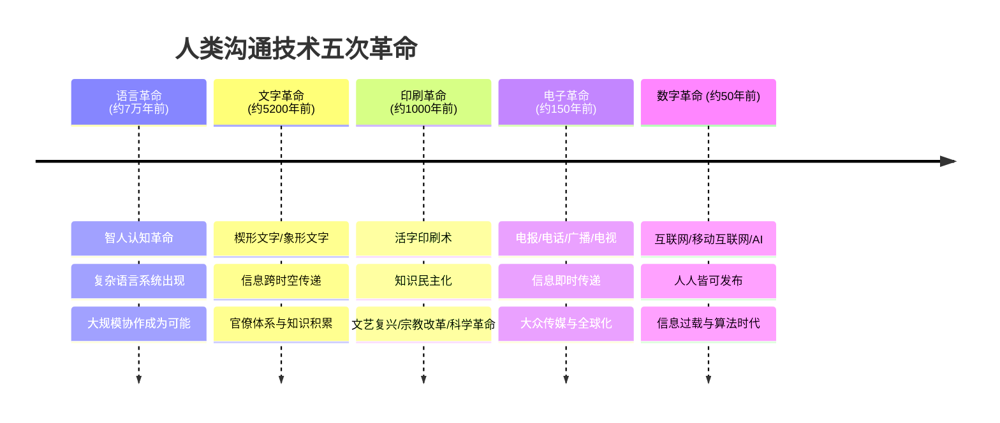
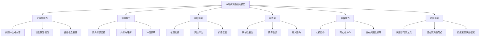
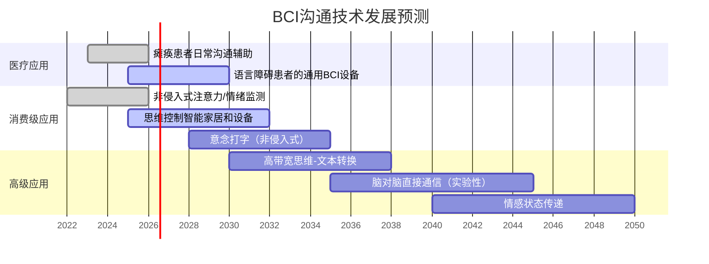

# 第二十九章 沟通工具与技术 · 深度拓展

> 深度拓展部分将视野从当下工具拉长到人类沟通技术的整个演化脉络，并前瞻AI、元宇宙、脑机接口等前沿技术对沟通范式的颠覆性影响。本节不只是"看看未来"，而是为读者建立一套面向未来10-20年的认知框架和行动指南——面对即将到来的技术变革，你今天该做什么准备。

***

## 一、沟通技术的演化规律

### 1.1 五次沟通革命的时间线

人类沟通技术经历了五次根本性革命，每一次都重塑了社会结构、权力分配和思维方式：



**语言革命（约7万年前）**——认知革命使智人获得了讨论"不存在的事物"的能力：神话、法律、货币、国家。这种虚构现实的能力是人类大规模合作的基础。尤瓦尔·赫拉利在《人类简史》中指出，150人的社交上限（邓巴数）通过语言和共同叙事被打破，人类开始建立数万人的组织。语言革命的核心突破不是声音本身，而是**符号化思维**——用一个声音符号指代一个抽象概念。

**文字革命（约公元前3200年）**——苏美尔人的楔形文字最初用于记录粮食库存和商业交易，而非文学创作。文字的本质突破是**信息的外部存储**——知识不再依赖个人记忆，可以跨代积累。甲骨文（约公元前1200年）的出现使中国成为独立发展出文字的文明之一。腓尼基字母表（约公元前1050年）则将文字从少数祭司和书吏的垄断中解放出来——22个字母就能记录所有语音，学习门槛从数年降到数月。

**印刷革命（约1040年）**——毕昇发明泥活字印刷术时，中国已有成熟的雕版印刷传统。古腾堡1440年发明的金属活字印刷术之所以影响更为深远，是因为它与拉丁字母的天然适配——少量字模就能组合出所有单词。印刷术的真正革命性在于**知识传播的边际成本趋近于零**：手抄一本《圣经》需要数月，印刷一本只需数天。这直接催生了宗教改革（马丁·路德的《九十五条论纲》在两周内传遍欧洲）、科学革命（牛顿的《自然哲学的数学原理》迅速在欧洲学者间传播）和启蒙运动。

**电子革命（1837年至今）**——莫尔斯电报首次实现了信息传递速度超越物理运输速度。贝尔电话（1876年）使双向实时语音通信成为可能。马可尼无线电（1895年）开启了广播时代。电视（1927年）结合视觉和听觉，成为20世纪最具影响力的传播媒介。电子革命的核心突破是**消除时间延迟**——从数天的信件到数秒的电话，信息传递进入了即时时代。

**数字革命（1969年至今）**——ARPANET、电子邮件、万维网、社交媒体、智能手机、大语言模型——数字革命的核心突破是**消除信息不对称**和**赋予每个人发布能力**。一条推文可以在几小时内被数亿人看到，一个普通人可以通过YouTube频道获得比传统媒体更大的影响力。

### 1.2 三次革命背后的共同规律

纵观五次沟通革命，可以提炼出三个反复出现的规律，这些规律对理解当下和未来的沟通技术变革至关重要：

**规律一：每次革命都伴随着权力的重新分配。** 文字革命创造了"识字精英"阶层；印刷革命打破了教会的知识垄断；社交媒体革命消解了传统媒体的把关人角色。每一次，掌握新技术的群体获得话语权的提升，而固守旧范式的群体则被边缘化。这意味着：在AI时代，能够有效利用AI工具的人将获得显著的沟通优势。

**规律二：每次革命都创造了新的问题。** 印刷术带来了虚假信息（最早的"黄色新闻"出现在19世纪末的廉价报纸上）；电话带来了隐私焦虑；社交媒体带来了信息茧房和心理健康危机。技术本身是中性的，但它改变的沟通环境会创造新的风险。这提醒我们：面对AI、元宇宙等新技术，不能只看便利，必须同时预见并准备应对它带来的新问题。

**规律三：旧技术不会消亡，而是退居特定场景。** 电话没有消灭信件，电子邮件没有消灭电话，视频会议没有消灭面对面沟通。每种沟通技术都找到了自己最擅长的生态位。这意味着：未来的新技术（AI、元宇宙、BCI）不会完全取代当前的沟通方式，而是会在特定场景中占据主导地位，形成更复杂的工具生态。

### 1.3 从历史规律看当下变革

将上述规律应用到当前的技术变革，可以得出几个关键判断：

- AI将重新分配沟通权力——能够有效使用AI的人获得效率优势，不能使用的人被边缘化
- AI将创造新的沟通问题——深度伪造、信息过载、认知依赖等
- 当前的沟通工具不会消亡——视频会议、邮件、即时消息都会继续存在，只是使用场景会被重新划分

理解这些规律，有助于我们在面对新技术时做出更理性的判断：既不过度恐惧，也不盲目乐观，而是清醒地识别机遇和风险。

***

## 二、AI对沟通的深层重塑

### 2.1 AI沟通技术的当前版图

截至2025年，AI在沟通领域的应用已经形成了清晰的技术版图：

| 技术类别 | 代表产品 | 核心能力 | 成熟度 | 对沟通的影响程度 |
|----------|----------|----------|--------|-----------------|
| 大语言模型 | ChatGPT、Claude、Gemini | 文本理解与生成、对话、翻译、摘要、写作 | 高 | ★★★★★ |
| 语音识别 | Whisper、讯飞听写、飞书妙记 | 实时语音转文字、多语言识别、说话人分离 | 高 | ★★★★☆ |
| 语音合成 | ElevenLabs、Azure TTS、Fish Audio | 高质量语音克隆、多语种合成、情感语音 | 中高 | ★★★☆☆ |
| 图像生成 | DALL-E、Midjourney、Stable Diffusion | 文生图、图像编辑、视觉概念设计 | 中高 | ★★★☆☆ |
| 视频生成 | Sora、Runway、可灵 | 文生视频、视频编辑、虚拟形象 | 中 | ★★☆☆☆ |
| 实时翻译 | DeepL、Google Translate、同传设备 | 文本翻译、实时口译、文档翻译 | 高 | ★★★★☆ |
| 内容审核 | 各平台自研系统 | 有害内容识别、垃圾信息过滤、合规检查 | 中高 | ★★★☆☆ |
| 推荐算法 | 各平台自研系统 | 内容推荐、社交匹配、信息过滤 | 高 | ★★★★★ |

### 2.2 AI重塑沟通的四个维度

AI不只是一个新工具，它正在从根本上改变沟通的四个维度：

**维度一：内容生产。** AI能够生成高质量的文本、图像、音频和视频内容。这意味着内容生产的门槛急剧降低——以前需要专业写作能力才能写出通顺的商务邮件，现在AI可以在几秒内生成。但这也意味着**内容将严重过剩**，辨别内容质量和来源真实性的能力将变得极其重要。

一个具体的例子：某互联网公司的市场团队以前需要3天写一篇产品推广文章（调研1天、写作1天、审校1天），现在使用AI辅助后，流程变为：AI生成初稿（5分钟）→ 人工修改和个性化调整（2小时）→ AI检查语法和一致性（5分钟）→ 人工终审（30分钟）。总时间从3天缩短到3小时。但效率提升的同时，团队面临的新挑战是：如何确保AI生成的内容具有品牌独特性和情感温度？

**维度二：信息过滤。** 推荐算法决定了我们看到什么信息、与谁连接、关注什么话题。这是AI对沟通影响最深远但最隐蔽的维度。当你在微信朋友圈、微博、抖音上浏览时，你看到的内容不是随机的，而是算法根据你的历史行为、社交关系和平台利益筛选后的结果。

这意味着什么？你和你的同事可能在同一个微信群里，但你们在各自的信息流中看到的世界可能完全不同。算法创造了"个性化的现实"，这在提升信息效率的同时，也制造了认知分歧和社会极化的温床。

**维度三：语言边界。** AI翻译技术正在迅速消除语言障碍。DeepL的翻译质量在多数语言对上已经接近专业翻译水平。这意味着跨语言沟通将变得越来越无障碍——你可以用中文写一封邮件，对方收到的是高质量的英文版本。

但这里有一个容易被忽视的问题：翻译不只是语言转换，更是文化转换。AI可以准确翻译"这个方案需要再推敲一下"的字面意思，但它可能无法传达这句话在中国商务语境中的微妙含义（可能是委婉的否定）。文化语境的翻译是AI翻译的最后壁垒。

**维度四：人机交互。** 从命令行到图形界面，从触摸屏到语音助手，从语音助手到自然语言对话——人机交互的演进方向是越来越接近人与人之间的自然沟通。ChatGPT等大语言模型的出现，使得普通人可以通过自然语言与计算机进行复杂的信息交互，这彻底改变了"使用技术"的门槛。

### 2.3 AI辅助沟通的实战指南

对于当下的职场人来说，AI辅助沟通已经不是"未来的事"，而是"今天就要用的事"。以下是经过验证的实战应用场景和操作方法：

**场景一：邮件和文档撰写**

```text
Prompt模板（中文商务邮件）：
你是一位专业的商务沟通顾问。请帮我撰写一封[目的]邮件。
- 收件人：[职位/关系]
- 核心诉求：[具体事项]
- 语气：[正式/友好/紧急]
- 特殊要求：[如需要包含数据、截止日期等]

请生成邮件正文，控制在[字数]字以内。
```

实际使用时，建议采用"AI起草 + 人工修改"的流程，而非直接使用AI生成的内容。原因有三：AI不了解具体的组织文化和人际关系背景；AI的表达缺乏个人风格和情感温度；AI可能产生事实性错误。最佳实践是让AI生成框架和初稿，然后人工添加个性化内容、修正事实、调整语气。

**场景二：会议纪要和行动项提取**

Zoom、飞书、腾讯会议等平台已经内置了AI会议纪要功能。但要获得高质量的会议纪要，需要在会前做两件事：

1. **提前提供会议背景**：在会议开始前，将议程、参会人员名单和讨论要点输入AI纪要系统，帮助AI理解上下文
2. **会后立即人工校验**：AI生成的纪要可能存在关键信息遗漏或理解偏差，尤其是涉及专业术语、数字数据和具体承诺时，必须在会后30分钟内人工校验

某跨国公司的实践表明，使用AI纪要工具后，会议后的行动项遗漏率从42%降低到15%，但仍有15%的遗漏需要人工补救。这15%往往是最重要的战略决策和关键承诺——恰恰不能遗漏的。

**场景三：跨语言沟通**

在跨语言邮件沟通中，推荐的流程是：

1. 用母语撰写完整的想法和内容（确保表达的准确性和完整性）
2. 使用DeepL或GPT-4进行翻译
3. **关键步骤**：请目标语言的母语者审阅，特别是检查文化适配性——语气是否合适、表达是否自然、是否有文化冲突的表述
4. 对于重要文档，使用反向翻译验证——将译文翻译回原文，检查信息是否丢失

**场景四：内容创意和头脑风暴**

AI是极好的头脑风暴伙伴。当你需要为一个项目想方案时，可以这样使用：

```text
Prompt模板（头脑风暴）：
我正在[项目背景]，需要[具体需求]。
请从以下5个角度各提出3个方案：
1. 传统方案（保守可靠）
2. 创新方案（突破常规）
3. 低成本方案（资源有限）
4. 技术驱动方案（利用新技术）
5. 跨界方案（借鉴其他行业）

每个方案用2-3句话描述核心思路，并评估可行性（高/中/低）。
```

### 2.4 AI沟通的五重伦理困境

AI在沟通领域的应用带来了五个核心伦理困境，每一个都没有简单的答案：

**困境一：真实性危机。** 当AI可以生成与人类写作无法区分的文本时，"谁写的"变得无法判断。学术论文、新闻报道、产品评论、社交媒体帖子——任何文本内容都可能是AI生成的。这动摇了信息信任的基础。2024年的一项研究发现，人类判断一段文本是否由AI撰写的准确率仅为52%——几乎等同于瞎猜。

**困境二：算法偏见的隐蔽性。** AI系统继承并可能放大训练数据中的偏见。在招聘场景中，AI筛选简历可能无意识地偏向某些性别、种族或教育背景的候选人。在内容推荐中，算法可能强化对特定群体的刻板印象。更危险的是，算法偏见往往以"客观数据"的面目出现，比人类偏见更难察觉和纠正。

**困境三：注意力的商品化。** 推荐算法的目标是最大化用户参与度（engagement），而非用户福祉。这导致系统倾向于推送引发强烈情绪反应的内容——愤怒、恐惧、惊奇——因为这些情绪最能驱动点击和分享。麻省理工学院2018年的一项研究发现，在Twitter上，虚假新闻的传播速度是真实新闻的6倍，传播范围是真实新闻的20倍。这不是偶然，而是算法机制的必然结果。

**困境四：人际能力的萎缩。** 当AI可以替我们写邮件、做翻译、甚至进行情感对话时，我们自身的沟通能力可能逐渐退化。就像GPS导航使很多人丧失了方向感一样，AI沟通助手可能使我们丧失某些基本的沟通技能——组织语言的能力、跨文化敏感度、甚至面对面交流的舒适感。

**困境五：权力的不对称。** AI沟通工具的开发和控制权集中在少数科技公司手中。这些公司决定了AI的行为准则、内容过滤标准和数据使用方式。普通用户在使用这些工具时，实际上是在按照科技公司设计的规则进行沟通——这是另一种形式的权力不对称。

### 2.5 AI时代的沟通能力模型

在AI时代，人类需要培养以下六种沟通能力，这些能力是AI目前无法替代的：



**元认知能力**——能够跳出信息本身，评估信息的来源、动机和可信度。在AI生成内容泛滥的时代，这是一种基础生存技能。具体训练方法：每次阅读一篇文章时，问自己三个问题——(1)这个信息的原始来源是什么？(2)作者/发布者的动机是什么？(3)有没有反面证据？

**情感能力**——AI可以模拟情感表达，但真正的情感连接需要人类的在场感和真实性。在远程工作和数字化沟通日益普及的今天，能够在屏幕两端建立真实的情感连接，将成为稀缺且高价值的能力。

**判断能力**——在复杂情境中做出平衡各方利益的决策，是人类独有的能力。AI可以提供数据和选项，但最终的价值判断——什么是"对"的、什么是"公平"的——仍然需要人类来做出。

**创造力**——AI可以生成"正确"的内容，但真正原创、深刻、触动人心的表达仍然需要人类的创造力。创造力不是凭空产生新想法，而是在已有的知识和经验之间建立新的连接——这是人类认知的核心优势。

**协作能力**——未来的工作越来越多地是人与AI的协作。能够有效地给AI下达指令（prompt engineering）、评估AI的输出质量、将AI的工作与自己的工作无缝衔接，将成为一种核心职业能力。

**适应能力**——AI工具在快速迭代，今天的最佳实践明天可能就过时了。保持学习新工具、适应新范式的能力，比掌握任何一个具体工具更重要。

***

## 三、元宇宙中的沟通革命

### 3.1 元宇宙的本质与当前状态

元宇宙不是某个具体的产品，而是一种**持续存在的、共享的、三维虚拟空间**的概念。它本质上是互联网的下一代形态——从二维的"浏览"升级为三维的"沉浸"。

截至2025年，元宇宙的发展呈现出明显的分化：

| 维度 | 早期炒作阶段（2021-2023） | 当前务实阶段（2024-2025） |
|------|--------------------------|--------------------------|
| 硬件 | 笨重的VR头显，价格高 | Meta Quest 3、Apple Vision Pro等混合现实设备，体验显著提升 |
| 应用 | 概念炒作、虚拟地产投机 | 企业协作、远程培训、工业仿真等垂直场景落地 |
| 用户 | 猎奇心理驱动，留存率低 | 企业和专业用户为主，使用场景明确 |
| 技术 | 延迟高、画质差、交互笨拙 | 空间计算、手势识别、眼动追踪成熟度提升 |
| 经济 | NFT泡沫 | 关注实际商业价值而非投机 |

### 3.2 元宇宙沟通的五个新特性

元宇宙中的沟通与传统数字沟通有五个本质区别：

**特性一：空间感知。** 在传统视频会议中，所有人被压缩在一个二维矩形中。在元宇宙中，沟通发生在三维空间里——人有位置关系，声音有方向和距离衰减，注意力有焦点和余光。这种空间感恢复了面对面沟通中的许多自然机制：你可以走到角落里进行私聊，可以在圆桌会议中看到所有人的肢体语言，可以站到白板前指着图表讲解。

斯坦福大学虚拟人类交互实验室（VHIL）的研究表明，在VR环境中进行的团队讨论，参与者的记忆保持率比视频会议高出约30%，对他人观点的理解深度高出约25%。空间感不是"锦上添花"，而是沟通质量的重要影响因素。

**特性二：化身表达。** 在元宇宙中，每个人以数字化身（Avatar）的形式出现。化身不仅是视觉形象，更是沟通的载体——化身的姿态、表情、动作和距离都在传递信息。

一个关键的研究发现来自苏黎世大学的实验：当参与者的化身在VR对话中保持适当的眼神接触和开放姿态时，对方感受到的信任度比视频通话中更高。相反，化身的回避姿态和封闭姿态会比视频中更明显地传递出不信任信号。这说明元宇宙中的非语言沟通既保留了面对面沟通的丰富性，又增加了一层"可设计性"——你可以有意识地调整化身的表达。

**特性三：环境即沟通。** 元宇宙中的虚拟环境本身就是沟通的一部分。在一个安静的虚拟会议室中讨论预算，与在一个虚拟咖啡馆中闲聊，氛围完全不同。更进一步，团队可以在虚拟工厂中讨论生产流程，在虚拟手术室中培训医疗技能，在虚拟城市中规划交通——环境成为沟通的直接素材，而非仅仅是背景。

**特性四：多人协同创作。** 元宇宙支持多人同时在同一空间中进行协同创作——共同搭建一个建筑模型、共同绘制一张思维导图、共同编辑一个产品原型。这种"共同操作"比传统的屏幕共享和文档协作更加直观和高效。

**特性五：持续存在。** 元宇宙不会"关闭"——你在虚拟空间中留下的笔记、搭建的模型、创建的工具会持续存在。这意味着沟通可以是异步的：你在虚拟白板上写下的想法，同事几个小时后进入同一个空间时可以直接看到并回应。

### 3.3 元宇宙沟通的实战场景

以下场景已在企业实践中得到验证：

**场景一：远程产品评审。** 某汽车设计公司在元宇宙中进行新车内饰评审。设计师和工程师戴上VR头显后，进入一个1:1比例的虚拟车内空间，可以坐进驾驶位感受仪表盘布局，打开手套箱检查空间，甚至模拟不同光线下的视觉效果。参与者表示，这种评审方式比看3D渲染图的效果好10倍——"你不是在看设计，你是在体验设计。"评审会议的时间从传统的3小时缩短到1小时，因为问题在现场就能发现和讨论。

**场景二：跨时区团队建设。** 某跨国科技公司的远程团队每月在元宇宙中进行一次"虚拟团建"——有时是虚拟密室逃脱，有时是虚拟烧烤聚会，有时只是在一个虚拟咖啡馆里随意聊天。团队负责人反馈，这种虚拟团建显著改善了团队成员之间的信任关系——"以前我们只是同事头像和名字，现在我感觉自己真的认识这些人。"

**场景三：沉浸式培训。** 某航空公司在元宇宙中训练飞行员处理紧急情况。学员可以在虚拟驾驶舱中经历引擎故障、恶劣天气、系统报警等场景，而不承担任何实际风险。这种培训的效果远超书本学习和模拟器训练——学员的肌肉记忆和决策速度都有显著提升。

**场景四：虚拟会议空间。** Meta的Horizon Workrooms、微软的Mesh、NVIDIA的Omniverse等平台已经提供了可用的虚拟会议解决方案。虽然这些产品目前还远未达到理想状态，但它们代表了未来会议形态的方向。使用建议：如果团队成员已经有VR设备，可以尝试将月度团队会议或创意头脑风暴迁移到虚拟空间中，但不要替代所有视频会议——信息传递型会议仍然适合传统的视频方式。

### 3.4 元宇宙沟通的现实挑战

在乐观展望的同时，必须正视以下挑战：

**硬件舒适度。** 当前的VR头显虽然大幅改进，但佩戴1小时以上仍会产生不适感——重量压迫、热量积聚、眼部疲劳。这是限制元宇宙在长时间工作场景中应用的最大物理障碍。

**技术成熟度。** 虚拟环境中的文本输入仍然比物理键盘慢得多，化身的表情捕捉精度有限，多人同时在线时的网络延迟仍然影响体验。这些技术瓶颈需要3-5年才能显著改善。

**数字鸿沟。** 高质量的VR设备价格在3000-30000元之间，加上对网络带宽和计算能力的要求，元宇宙的沉浸体验将首先服务于资源充足的企业和个人。如果元宇宙成为"新常态"的沟通方式，这种设备门槛可能加剧社会不平等。

**心理影响。** 长时间的虚拟沉浸可能产生"虚拟现实宿醉"（VR hangover）——回到现实后的方向感失调、情绪波动、现实感减弱。此外，虚拟身份与真实身份的分裂可能带来身份认同困扰。

**安全与伦理。** 元宇宙中的虚拟骚扰、数据隐私、虚拟财产权等问题需要全新的法律框架。2022年的一项调查发现，超过40%的VR社交平台用户曾经历过虚拟骚扰——这个问题不能等到技术成熟后再解决。

***

## 四、脑机接口：沟通的终极边界

### 4.1 BCI技术的三个层次

脑机接口（Brain-Computer Interface，BCI）在大脑和外部设备之间建立直接通信通道，绕过传统的肌肉运动和感觉器官。当前BCI技术分为三个层次：

| 层次 | 方式 | 信号质量 | 安全风险 | 代表机构 | 当前进展 |
|------|------|----------|----------|----------|----------|
| 非侵入式 | EEG帽、近红外光谱 | 低-中 | 极低 | OpenBCI、Emotiv | 消费级EEG设备已上市，可用于注意力监测和简单控制 |
| 半侵入式 | 颅内电极、皮层表面电极 | 中-高 | 中 | Synchron | Stentrode设备已进入人体临床试验 |
| 侵入式 | 皮层内微电极阵列 | 最高 | 较高 | Neuralink、BrainGate | 2024年Neuralink完成首例人体植入，患者可用意念控制电脑光标 |

### 4.2 BCI在沟通领域的里程碑进展

**里程碑一：瘫痪患者的语音恢复。** 2023年，斯坦福大学团队开发的BCI系统使一位因肌萎缩侧索硬化症（ALS）丧失说话能力的患者，以每分钟62个单词的速度通过意念"说话"——这个速度接近正常对话语速（每分钟120-150个单词）的40%。2024年，加州大学旧金山分校的团队将这个速度提升到每分钟78个单词，且错误率降至25%以下。这意味着BCI正在从实验室走向实际可用的沟通工具。

**里程碑二：思维转文字的突破。** 2023年，德克萨斯大学奥斯汀分校的团队利用fMRI（功能性磁共振成像）和AI解码器，成功将受试者的大脑活动转化为连续的文本。虽然这项技术目前需要大型fMRI设备（价格数百万元），但它证明了一个关键原理：人类的思维活动可以通过非侵入式方法被AI解码为语言。

**里程碑三：脑对脑通信的初步验证。** 2019年，华盛顿大学团队实现了三人之间的脑电信号传递——通过BCI网络，一个人的想法被编码为信号，通过网络传输到另一个人的大脑中。这个实验虽然极其简单（仅传递二进制选择），但它证明了"脑对脑通信"在物理上是可行的。

### 4.3 BCI沟通的时间线预测

基于当前的技术进展速度，以下是BCI在沟通领域的可能发展时间线：



**2025-2030年**：BCI将在医疗领域实现突破性应用——帮助ALS患者、脊髓损伤患者和中风患者恢复日常沟通能力。消费级EEG设备将变得更小更准确，可以集成到耳机、帽子等日常穿戴设备中，用于注意力管理、情绪监测和简单的意念控制。

**2030-2035年**：非侵入式BCI的信号解析精度将大幅提升，可能实现"意念打字"——用户佩戴普通头戴设备就能以接近正常打字的速度输入文字。这将彻底改变移动办公和特殊场景下的信息输入方式。

**2035-2045年**：高带宽的侵入式BCI可能实现思维到文本的直接转换，速度超过手工打字和语音输入。脑对脑直接通信可能在实验室条件下实现。

**2045年以后**：如果技术继续按照当前速度发展，情感状态传递和集体意识等概念可能进入实验阶段——但这些预测的不确定性极高。

### 4.4 BCI沟通的深层伦理问题

BCI带来的伦理挑战远比AI更深刻，因为它触及了人类存在最基本的层面：

**思想隐私。** 如果思想可以被读取，"内心世界"这个最后的隐私堡垒将被打破。你的每一个想法、每一种情绪、每一个秘密都可能被外部设备获取。这需要全新的隐私权定义——"思想隐私权"或"神经权利"（neuro rights）。智利已经在2021年成为世界上第一个将神经权利写入宪法的国家。

**认知自主。** 如果BCI不仅能读取信息，还能向大脑输入信息（双向BCI），那么"我的想法真的是我自己的吗？"将成为一个严肃的问题。外部设备输入的信息、情感或冲动，与自己的思想之间的界限在哪里？

**人类增强的公平性。** 如果BCI技术能让人更快地学习、更强地记忆、更高效地沟通，那么只有富人能负担得起这项技术时，将创造出"增强人类"和"普通人类"之间的鸿沟——这种差距比任何已有的社会不平等都更加根本。

**身份的连续性。** 如果BCI连接到云端，你的部分记忆和认知能力存储在外部设备中，"你"的边界在哪里？如果你的BCI设备被黑客入侵，你的思想被修改，"你"还是你吗？

这些问题不是科幻小说，而是BCI技术发展路线图上真实的伦理挑战。值得欣慰的是，学术界和政策制定者已经开始讨论这些问题。2024年，联合国教科文组织启动了"神经技术伦理"全球咨询，旨在为BCI等神经技术建立国际伦理框架。

***

## 五、数字素养：未来社会的基础设施

### 5.1 数字素养的完整框架

数字素养不仅是"会用电脑"，而是在数字环境中有效、安全、负责任地生活的综合能力。欧盟DigComp 2.2框架将其定义为五大能力领域，以下是每个领域的详细展开：

**能力一：信息与数据素养**

在信息过载的时代，核心能力不是"获取信息"，而是"过滤信息"。具体包括：

- **搜索能力**：使用精确关键词、布尔运算符、高级搜索语法在海量信息中快速定位所需内容
- **评估能力**：判断信息的来源可靠性、时效性、客观性和准确性。使用"信源评估四问法"——谁说的？什么时候说的？有什么证据？有什么动机？
- **管理能力**：使用知识管理工具（如Notion、Obsidian）建立个人信息体系，避免重复搜索和信息丢失
- **数据素养**：理解基本的统计概念，能够解读数据图表，识别数据操纵和统计误导

**能力二：数字沟通与协作**

- **跨平台规范**：理解不同平台的沟通文化——邮件的正式性、微信的即时性、微博的公开性、飞书的协作性
- **多媒体表达**：能够综合运用文字、图片、视频、数据可视化等多种形式进行有效表达
- **异步协作**：掌握在不同时区、不同节奏下与他人协作的方法——清晰的文档、明确的承诺、有效的跟进
- **数字礼仪**：理解不同文化背景下的数字沟通礼仪——回复时效、表情符号的使用、语气的把握

**能力三：数字内容创作**

- **文字创作**：能够撰写结构清晰、逻辑严密的文档、报告和文章
- **视觉设计**：掌握基本的设计原则，能够制作清晰的信息图、演示文稿和社交媒体素材
- **音视频制作**：能够使用录屏、剪辑、配音等工具制作培训视频和产品演示
- **AI辅助创作**：能够有效使用AI工具提升创作效率，同时保持内容的原创性和准确性

**能力四：信息安全**

- **密码管理**：使用密码管理器，为每个账号设置独立的强密码
- **双重验证**：为所有重要账号启用两步验证（2FA）
- **钓鱼识别**：能够识别钓鱼邮件、虚假网站和社交工程攻击
- **数据备份**：建立定期备份机制，确保重要数据不会因设备故障或勒索软件而丢失
- **隐私管理**：定期检查和调整各平台的隐私设置，控制个人信息的可见范围

**能力五：数字问题解决**

- **故障排除**：能够诊断和解决常见的技术问题——网络连接、软件安装、设备配对
- **工具选型**：能够根据需求评估和选择合适的数字工具
- **流程优化**：能够识别工作流程中的低效环节，并利用数字工具进行优化
- **持续学习**：保持对新技术和新工具的学习热情，能够快速上手新平台

### 5.2 虚假信息识别的实操方法

在AI生成内容泛滥的时代，虚假信息识别是一种基础生存技能。以下是一套可操作的识别流程：

**第一步：检查来源（10秒）**

- 这条信息来自哪里？是官方媒体、自媒体、还是匿名账号？
- 这个来源在其他话题上是否可靠？
- 是否有原始出处？还是"据说""网友爆料"？

**第二步：交叉验证（30秒）**

- 用关键词在搜索引擎中查找，是否有其他独立来源报道了相同信息？
- 来自不同立场的多个来源是否都确认了这个信息？
- 是否有权威的事实核查机构（如较真平台、Snopes、FactCheck.org）已经核实过？

**第三步：内容分析（1分钟）**

- 标题是否与正文内容一致？是否存在标题党现象？
- 数据是否有明确来源？"研究表明"——哪个研究？发表在哪里？
- 论证逻辑是否严密？是否存在因果倒置、以偏概全、诉诸权威等逻辑谬误？
- 是否大量使用情绪化语言（"震惊""真相""终于曝光"）？

**第四步：AI生成内容检测**

- 文本是否过于"完美"和"均匀"——没有个人风格、没有口语化表达、没有不完美的真实感？
- 是否使用了AI常用的表达模式——过度使用"此外""值得注意的是""总而言之"等过渡词？
- 信息是否包含过于精确的数字（AI有时会编造看似具体但实际不存在的数据）？
- 可以使用AI检测工具（如GPTZero、Originality.ai）进行辅助判断，但要注意这些工具的准确率并非100%

### 5.3 数字健康的实践框架

数字健康不是"少用手机"这么简单，而是一个系统性的实践框架：

**框架一：时间管理**

- **屏幕时间审计**：使用手机自带的屏幕时间功能或第三方App（如Forest、Tide），记录一周内各类App的使用时长
- **时间预算**：根据审计结果，为不同类型的App设定每日使用上限。建议：社交媒体 ≤ 30分钟/天，短视频 ≤ 20分钟/天
- **无屏幕时段**：设定固定的无屏幕时段——起床后30分钟、用餐时间、睡前1小时

**框架二：信息管理**

- **信息断食**：每周选择半天完全断开信息输入——不看新闻、不刷社交媒体、不查邮件。这不是偷懒，而是给大脑处理和整合已有信息的时间
- **信息源精简**：将信息来源控制在可管理的数量——不超过3个新闻App、不超过5个公众号/博客的定期订阅
- **通知管理**：关闭所有非必要通知，只保留电话和重要联系人的消息通知。每一条通知都是对你注意力的一次"抢劫"

**框架三：关系管理**

- **数字边界**：与同事和客户建立清晰的数字沟通边界——工作时间外不回复工作消息（紧急情况除外），不在休息日打开工作邮箱
- **设备共处规则**：与家人和朋友在一起时，约定"设备放下"的时间——至少在用餐和深度对话时放下手机
- **线上线下的平衡**：确保每周有一定比例的社交是面对面进行的——不是因为面对面"更好"，而是因为它使用了不同的沟通通道和社交技能

**框架四：自我觉察**

- **使用意图检查**：每次拿起手机前，问自己"我现在要用手机做什么？"如果答不出来，说明你是无意识地在刷屏
- **情绪觉察**：注意使用社交媒体后的情绪变化。如果某个App经常让你感到焦虑、嫉妒或愤怒，考虑减少使用或取消关注引发负面情绪的账号
- **定期反思**：每月进行一次"数字生活盘点"——哪些数字习惯让我受益？哪些在消耗我？哪些应该调整？

### 5.4 数字素养教育的实施路径

数字素养教育不能停留在"开设一门课"的层面，而需要覆盖从学校到职场的全生命周期：

**学校阶段**

- **幼儿园-小学**：通过游戏化教学建立基本的数字安全意识——不向陌生人透露个人信息、不点击不明链接、不在网上发布不当内容
- **初中-高中**：系统教授信息搜索与评估、数据解读、网络安全、数字公民责任等核心能力
- **大学**：将数字素养融入各专业课程——不是单独开设一门"计算机课"，而是在历史课中教学生如何评估在线史料的可靠性，在心理学课中教学生理解算法对认知的影响，在商学院中教学生利用数据分析做出决策

**职场阶段**

- **新员工入职**：将数字素养纳入入职培训——公司使用的工具体系、信息安全规范、数字沟通礼仪
- **持续培训**：每季度组织一次数字素养工作坊——新工具上手、安全威胁通报、最佳实践分享
- **管理层培训**：为管理者提供专项培训——如何建立团队的数字沟通规范、如何评估和引入新工具、如何管理混合办公团队的信息流

**社区阶段**

- **老年人数字技能**：通过社区中心和图书馆为老年人提供智能手机使用、网络购物安全、在线就医等实用技能培训
- **家长数字素养**：帮助家长理解孩子使用的数字平台和工具，建立健康的家庭数字使用规范
- **公共数字服务**：确保政府公共服务的设计考虑不同数字素养水平的用户——界面简洁、操作指引清晰、提供非数字化的替代方案

### 5.5 从数字素养到"AI素养"

随着AI技术的快速发展，传统的"数字素养"已经不够——我们需要升级到"AI素养"。AI素养的核心能力包括：

**理解AI的能力边界**——AI擅长什么（模式识别、语言生成、数据分析），不擅长什么（创造性思维、伦理判断、理解真实世界因果关系）。过度信任和过度恐惧都是对AI的误解。

**有效使用AI的技能**——能够编写清晰的prompt，评估AI输出的质量，将AI集成到工作流程中。这是2025年最热门的职业技能之一。

**识别AI风险的意识**——能够识别AI生成的虚假信息、理解算法偏见的存在、意识到AI对隐私和就业的影响。

**参与AI治理的能力**——作为公民，能够理解AI政策的基本概念，参与关于AI监管的社会讨论，对AI的应用边界提出自己的意见。

***

## 六、行动指南：面对未来，今天做什么

### 6.1 个人行动清单

面对沟通技术的快速变革，以下是按时间维度排列的个人行动建议：

**本月立即行动**

- [ ] 建立一个AI辅助沟通的工作流程——从邮件撰写或会议纪要开始
- [ ] 进行一次"信息源审计"——列出你目前的信息来源，评估每个来源的可靠性
- [ ] 设定屏幕使用时间目标，并开始记录实际使用时间
- [ ] 为所有重要账号启用两步验证（2FA）

**本季度计划**

- [ ] 学习并实践至少一种AI工具在日常沟通中的应用（如ChatGPT辅助写作、DeepL翻译、飞书妙记）
- [ ] 为团队制定一份简明的沟通工具使用规范
- [ ] 尝试一次VR/AR体验（如Apple Vision Pro体验店、Meta Quest设备），了解元宇宙的当前水平
- [ ] 阅读一本关于AI和沟通的书籍（推荐：《AI Superpowers》Kai-Fu Lee、《The Alignment Problem》Brian Christian）

**年度规划**

- [ ] 建立个人知识管理系统（如Obsidian、Notion），将有价值的信息结构化保存
- [ ] 培养"元认知"习惯——定期反思自己的信息消费模式和数字使用习惯
- [ ] 关注BCI和神经技术的最新进展，了解它们对沟通可能产生的影响
- [ ] 参加数字素养或AI素养相关的在线课程或工作坊

### 6.2 组织行动清单

对于团队管理者和组织决策者：

**短期（1-3个月）**

- 盘点团队当前的沟通工具栈，识别冗余和缺失
- 建立团队的AI辅助沟通规范——哪些场景可以使用AI、如何审核AI生成的内容
- 进行一次信息安全培训，覆盖钓鱼识别、密码管理、数据保护

**中期（3-12个月）**

- 评估元宇宙协作工具在团队中的适用性——如果团队有跨时区协作需求，可以试用VR会议工具
- 建立团队的异步沟通文化——默认异步，仅在必要时同步
- 引入AI辅助工具提升团队沟通效率——会议纪要、邮件翻译、内容审核

**长期（1-3年）**

- 将数字素养和AI素养纳入员工发展体系
- 建立沟通工具的定期评估和迭代机制
- 关注BCI等前沿技术的发展，为可能的沟通范式变革做准备

***

> **深度拓展总结**：沟通技术的演化从未停止，而我们正处于一个加速变革的关键节点。AI正在重塑内容生产、信息过滤和人机交互的基本范式；元宇宙正在为远程沟通增加空间感和沉浸感；脑机接口正在探索绕过语言直接传递思维的可能性。面对这些变革，最重要的不是追赶每一个新技术，而是培养底层的适应能力——批判性思维、情感智慧、数字素养和持续学习的习惯。技术在变，但有效沟通的本质不变：理解对方，清晰表达，建立信任。
