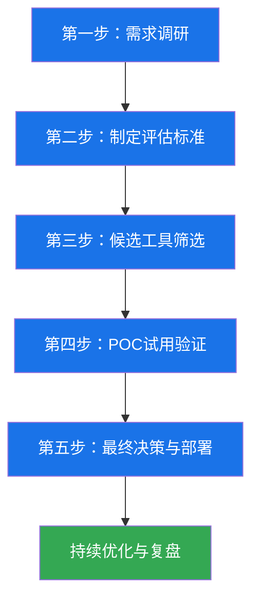
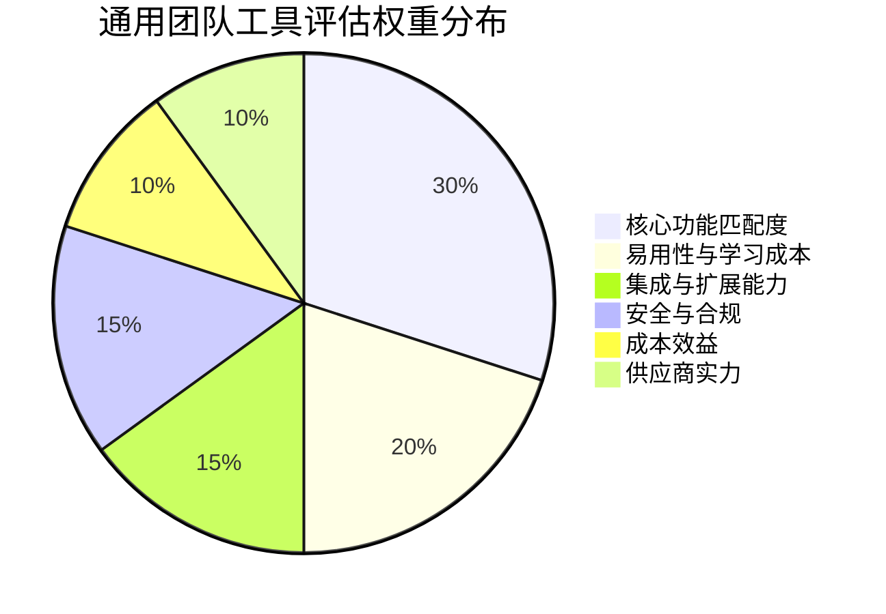
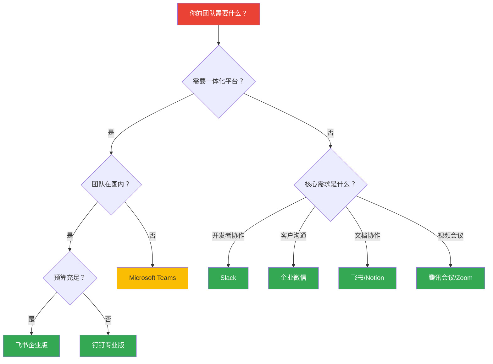

## 沟通工具选型决策清单

工具选型不是"看看功能列表、选个最全的"这么简单。一个错误的工具选择，会导致团队协作效率下降30%-50%，迁移成本可能是初始部署成本的3-5倍。本章提供一套完整的选型方法论，从需求分析到最终决策，确保你选到真正适合团队的沟通工具。

### 为什么需要系统化的选型流程

很多团队选工具靠"拍脑袋"——老板用过钉钉就上钉钉，同事推荐飞书就试飞书。这种随意选型的后果往往在半年到一年后才暴露：

- **功能冗余**：付了企业版的钱，80%的功能没人用
- **数据孤岛**：工具之间无法打通，信息散落在五六个平台
- **用户抵触**：工具太复杂，团队成员私下用微信沟通，官方工具形同虚设
- **迁移痛苦**：发现不合适后换工具，历史数据丢失、工作流重建

系统化选型的核心是：**先明确需求，再匹配工具**。不是找"最好的"工具，而是找"最合适的"工具。

### 选型决策五步法

---

### 第一步：需求调研

在打开任何工具的官网之前，先回答以下问题：

#### 组织画像

| 维度 | 需要明确的信息 | 示例 |
|------|---------------|------|
| 团队规模 | 当前人数、未来12个月预计增长 | 当前50人，预计增长到80人 |
| 组织结构 | 扁平化还是多层级、是否跨地域 | 3个部门，北京+上海双办公室 |
| 行业属性 | 是否有特殊合规要求（金融/医疗/政务） | 金融行业，需满足等保三级 |
| 现有工具栈 | 已经在用哪些工具，能否替换 | 已用企业微信做客户沟通，Jira做项目管理 |
| 预算范围 | 年度预算上限、人均预算 | 年预算15万，人均200元/月 |

#### 使用场景梳理

不同岗位对沟通工具的需求差异巨大：

- **管理层**：需要审批流、数据看板、跨部门通知
- **产品/设计**：需要文档协作、原型评审、版本管理
- **开发团队**：需要代码集成、CI/CD通知、技术讨论频道
- **销售/客服**：需要CRM集成、客户沟通记录、移动端优先
- **HR/行政**：需要考勤打卡、公告发布、问卷调查

**操作建议**：给每个部门发一份需求调研问卷，收集真实需求而非猜测。问卷应包含：

1. 你日常最频繁的沟通场景是什么？（多选）
2. 现有工具最让你头疼的三个问题是什么？
3. 如果新工具只能实现一个功能，你希望是什么？
4. 你每天在沟通工具上花费多少时间？其中多少是"无效沟通"？

---

### 第二步：制定评估标准

#### 完整评估维度与权重分配

不同类型的团队，各维度的权重应该不同。以下是通用权重参考：

#### 核心功能评估（权重30%）

这部分是选型的硬门槛，不达标直接淘汰：

**即时通讯能力**
- [ ] 支持文字、图片、文件、语音、视频消息
- [ ] 支持群聊、话题/频道、私聊等多种沟通模式
- [ ] 支持消息搜索（全文搜索、按人/时间/类型筛选）
- [ ] 支持消息引用、回复、表情回应
- [ ] 支持消息撤回与编辑（有时间窗口限制）
- [ ] 支持@提醒、置顶消息、消息免打扰
- [ ] 支持消息已读/未读状态查看

**音视频会议**
- [ ] 支持多人视频会议（至少50人同时在线）
- [ ] 支持屏幕共享（含指定窗口共享）
- [ ] 支持会议录制与回放
- [ ] 支持虚拟背景、降噪、美颜
- [ ] 支持会中文字聊天、举手、投票
- [ ] 支持预约会议与日历集成
- [ ] 画面延迟低于200ms，音频延迟低于150ms

**文档协作**
- [ ] 支持在线文档、表格、幻灯片创建与编辑
- [ ] 支持多人实时协同编辑
- [ ] 支持版本历史与回滚
- [ ] 支持评论、批注、@提及
- [ ] 支持文档权限管理（查看/编辑/仅限特定人）
- [ ] 支持文档模板库

**任务与项目管理**
- [ ] 支持任务创建、分配、跟踪
- [ ] 支持看板、列表、甘特图等多种视图
- [ ] 支持任务与聊天消息关联
- [ ] 支持截止日期提醒与进度追踪
- [ ] 支持工作流自动化（如审批流）

#### 易用性评估（权重20%）

工具再强大，如果团队不愿意用，就是废铁：

- [ ] **上手时间**：新员工能否在30分钟内掌握基本操作
- [ ] **界面直观性**：核心功能是否在2次点击内可达
- [ ] **移动端体验**：手机端功能是否与桌面端基本一致
- [ ] **通知管理**：是否支持精细化的通知控制（按频道/时段/类型）
- [ ] **中文支持**：界面、文档、客服是否全面中文化
- [ ] **无障碍支持**：是否支持屏幕阅读器、高对比度模式
- [ ] **离线能力**：断网后能否查看历史消息、编辑文档

#### 集成与扩展能力（权重15%）

单一工具无法满足所有需求，集成能力决定了工具的上限：

- [ ] **API开放度**：是否提供完整的REST API/GraphQL API
- [ ] **Webhook支持**：能否通过Webhook接收/发送事件通知
- [ ] **应用市场**：是否有丰富的第三方应用集成
- [ ] **自定义机器人**：能否创建自定义Bot实现自动化
- [ ] **SSO单点登录**：是否支持SAML/OAuth/LDAP等企业认证
- [ ] **数据导入导出**：能否从现有工具迁移数据、能否导出备份

#### 安全与合规（权重15%）

对于处理敏感信息的团队，这是硬性门槛：

- [ ] **数据加密**：传输加密（TLS 1.2+）、存储加密（AES-256）
- [ ] **数据主权**：数据存储在哪里（中国大陆/海外），是否支持私有化部署
- [ ] **权限体系**：是否支持细粒度的权限管理（组织/部门/群组/文件级别）
- [ ] **审计日志**：是否记录关键操作日志，日志保留时长
- [ ] **合规认证**：是否通过等保2.0/3.0、ISO 27001、SOC 2等认证
- [ ] **数据保留策略**：是否支持消息/文件的自动归档与删除策略
- [ ] **设备管理**：是否支持远程擦除、设备白名单、水印防泄密

#### 成本效益（权重10%）

不要只看标价，要算总拥有成本（TCO）：

- [ ] **定价模式**：按人头/按功能/按用量，哪种更适合你的增长曲线
- [ ] **免费版限制**：免费版能满足多少需求，何时必须升级
- [ ] **隐性成本**：培训成本、迁移成本、管理员维护成本
- [ ] **规模折扣**：大团队是否有折扣，年付vs月付的差价
- [ ] **退出成本**：如果将来要换工具，数据能否完整导出

#### 供应商实力（权重10%）

工具选型也是选合作伙伴：

- [ ] **市场地位**：供应商的市场份额、品牌口碑
- [ ] **财务健康**：供应商是否盈利或有充足融资（避免工具突然关停）
- [ ] **产品路线图**：是否有清晰的功能迭代计划
- [ ] **客户案例**：是否有同行业、同规模的成功案例
- [ ] **服务支持**：响应时效、专属客户经理、技术支持等级

---

### 第三步：候选工具筛选

基于评估标准，筛选出3-5个候选工具进入深度对比。以下是2024-2025年主流沟通工具的横向对比：

#### 主流工具功能矩阵

| 功能维度 | 飞书 | 钉钉 | 企业微信 | Slack | Microsoft Teams |
|---------|------|------|---------|-------|----------------|
| **即时通讯** | ★★★★★ | ★★★★☆ | ★★★★☆ | ★★★★★ | ★★★★☆ |
| **音视频会议** | ★★★★★ | ★★★★☆ | ★★★☆☆ | ★★★★☆ | ★★★★★ |
| **文档协作** | ★★★★★ | ★★★★☆ | ★★★☆☆ | ★★★☆☆ | ★★★★★ |
| **项目管理** | ★★★★☆ | ★★★★☆ | ★★☆☆☆ | ★★★☆☆ | ★★★★☆ |
| **审批流程** | ★★★★☆ | ★★★★★ | ★★★★☆ | ★☆☆☆☆ | ★★☆☆☆ |
| **开放API** | ★★★★★ | ★★★★☆ | ★★★★☆ | ★★★★★ | ★★★★★ |
| **移动端体验** | ★★★★☆ | ★★★★★ | ★★★★★ | ★★★☆☆ | ★★★☆☆ |
| **AI能力** | ★★★★★ | ★★★★☆ | ★★★☆☆ | ★★★★☆ | ★★★★★ |
| **私有化部署** | ✅ | ✅ | ✅ | ❌ | ✅ |
| **适合规模** | 50-10000+ | 10-5000+ | 5-5000+ | 20-5000+ | 100-50000+ |

#### 按团队类型推荐

**初创团队（5-20人）**
- 首选：飞书（免费版功能最全，一体化程度高）
- 备选：钉钉（审批流强，适合有管理需求的团队）
- 理由：初创团队人少事多，需要一个工具搞定尽可能多的事

**中型企业（50-500人）**
- 首选：飞书/钉钉企业版（国内合规，功能完整）
- 备选：企业微信（如果有大量外部客户沟通需求）
- 理由：需要完善的权限管理、审计日志、部门隔离

**大型企业/跨国团队（500+人）**
- 首选：Microsoft Teams（全球部署成熟，Office 365深度集成）
- 备选：Slack（开发者文化强的组织）+ 飞书（国内团队）
- 理由：需要全球化部署、多时区协作、企业级安全合规

**技术团队**
- 首选：Slack（集成生态最强，开发者工具最丰富）
- 备选：飞书（国内替代，API能力出色）
- 理由：需要与GitHub、Jira、CI/CD等开发工具深度集成

---

### 第四步：POC试用验证

选出2-3个候选工具后，不要直接采购，先做POC（Proof of Concept）验证：

#### POC执行计划

**时长**：2-4周（太短无法体验真实工作流，太长浪费时间）

**参与人员**：每个部门选2-3个代表，覆盖管理层和一线员工

**验证场景**：至少覆盖以下5个核心场景：

| 场景编号 | 验证场景 | 评估要点 | 权重 |
|---------|---------|---------|------|
| S1 | 日常沟通 | 发消息、建群、搜索历史消息的流畅度 | 25% |
| S2 | 周会/评审 | 预约会议、屏幕共享、录制回放的质量 | 20% |
| S3 | 文档协同 | 创建文档、多人编辑、权限控制的体验 | 20% |
| S4 | 跨部门协作 | @其他部门、共享文件、任务流转的效率 | 20% |
| S5 | 移动办公 | 手机端操作、推送通知、离线查看的体验 | 15% |

#### POC评分表模板

为每个场景打分（1-5分），最终加权计算总分：

工具A总分 = S1×0.25 + S2×0.20 + S3×0.20 + S4×0.20 + S5×0.15
工具B总分 = S1×0.25 + S2×0.20 + S3×0.20 + S4×0.20 + S5×0.15

**评分标准**：
- 5分：超出预期，体验流畅，无明显问题
- 4分：满足需求，偶有小问题但不影响使用
- 3分：基本可用，但有明显不便之处
- 2分：勉强可用，需要频繁变通或绕路
- 1分：无法满足需求，严重影响工作效率

#### POC期间的关键观察点

- **自然采纳率**：不强制使用的情况下，有多少人主动切换到新工具
- **求助频率**：团队成员需要多少次帮助才能完成基本操作
- **吐槽收集**：记录所有负面反馈，分类统计（功能缺失/操作复杂/性能问题）
- **惊喜发现**：记录超出预期的好体验，这些是说服团队的关键论据

---

### 第五步：最终决策与部署

#### 决策矩阵

将POC结果填入决策矩阵，加权计算最终得分：

| 评估维度 | 权重 | 工具A得分 | 工具A加权 | 工具B得分 | 工具B加权 |
|---------|------|----------|----------|----------|----------|
| 核心功能 | 30% | ? | ? | ? | ? |
| 易用性 | 20% | ? | ? | ? | ? |
| 集成能力 | 15% | ? | ? | ? | ? |
| 安全合规 | 15% | ? | ? | ? | ? |
| 成本效益 | 10% | ? | ? | ? | ? |
| 供应商实力 | 10% | ? | ? | ? | ? |
| **总分** | **100%** | — | **?** | — | **?** |

#### 部署检查清单

确定工具后，按以下清单推进部署：

- [ ] **基础设施准备**：确认网络带宽、服务器资源（如私有化部署）
- [ ] **组织架构搭建**：导入组织架构、设置部门与角色
- [ ] **权限策略制定**：明确各级别的权限范围
- [ ] **数据迁移**：从旧工具迁移历史数据（聊天记录、文件、联系人）
- [ ] **集成对接**：对接现有系统（OA、CRM、HR系统等）
- [ ] **培训计划**：分批次培训，先管理员后普通用户
- [ ] **试运行期**：新旧工具并行1-2周，收集问题
- [ ] **正式切换**：设定切换日期，旧工具设置只读，新工具全面启用
- [ ] **效果复盘**：切换后1个月、3个月各做一次使用效果评估

---

### 常见选型误区

#### 误区一：功能越多越好

**真相**：功能越多，学习曲线越陡，团队抵触越大。一个用得好的简单工具，胜过一个没人用的全能工具。

**正确做法**：优先满足80%的核心需求，剩余20%通过集成解决。

#### 误区二：只看价格不看TCO

**真相**：一个每年省5万的工具，如果需要额外投入20万做培训和迁移，实际上是亏的。

**正确做法**：计算3年总拥有成本，包括许可费、培训费、迁移费、维护费、机会成本。

#### 误区三：老板拍板就行

**真相**：管理层和一线员工的需求往往完全不同。老板觉得好用的审批功能，员工可能根本不需要；员工依赖的代码集成，老板可能完全不了解。

**正确做法**：让各部门代表参与POC，最终决策权不只在一个人手里。

#### 误区四：一步到位的幻想

**真相**：没有一个工具能完美满足所有需求，而且需求会随时间变化。

**正确做法**：选一个能覆盖当前80%需求、且API开放的工具，剩余需求通过集成逐步补齐。

#### 误区五：忽视数据迁移成本

**真相**：很多团队选型时只关注新工具的功能，忽略了从旧工具迁移数据的难度。历史聊天记录、文件、工作流都是资产。

**正确做法**：在POC阶段就测试数据导入能力，评估迁移工作量和数据完整度。

#### 误区六：跟风选型

**真相**：同行用了某个工具不代表适合你。组织规模、文化、工作方式都不同。

**正确做法**：参考同行经验，但决策基于自己的需求调研和POC验证。

---

### 选型决策速查表

如果你时间紧迫，可以用以下速查表快速缩小范围：

---

### 实战案例：100人技术公司的选型过程

**背景**：某互联网公司，100人，3个研发团队+产品+设计+运营，之前用微信群+石墨文档+腾讯会议，信息分散严重。

**需求调研结果**（Top 5需求）：
1. 统一沟通入口，替代微信群（92%的人提到了）
2. 文档协作与知识沉淀（78%）
3. 与Jira/GitHub集成（65%，主要是研发）
4. 会议录制与纪要自动生成（58%）
5. 移动端体验要好（51%）

**候选工具**：飞书、钉钉、Slack

**POC结果**：

| 场景 | 飞书 | 钉钉 | Slack |
|------|------|------|-------|
| 日常沟通 | 4.5 | 4.0 | 4.5 |
| 音视频会议 | 4.8 | 3.8 | 3.5 |
| 文档协作 | 4.7 | 3.5 | 2.5 |
| 代码集成 | 4.0 | 3.0 | 4.8 |
| 移动端体验 | 4.0 | 4.5 | 3.0 |
| **加权总分** | **4.4** | **3.8** | **3.7** |

**最终决策**：选择飞书。核心原因：
- 文档协作能力远超其他选项，解决了"信息分散"的核心痛点
- API开放度高，后续可以集成Jira和GitHub
- 会议功能强大，录制+AI纪要正好满足需求
- 钉钉的审批流虽然强，但该公司扁平化管理，不太需要
- Slack虽然开发者友好，但文档能力弱、国内访问不稳定

**部署过程**：
- 第1周：搭建组织架构，配置权限，导入历史文件
- 第2周：分部门培训（先IT部门试点，再全员推广）
- 第3-4周：新旧工具并行，微信群逐步迁移
- 第2个月：关闭旧工具写入权限，飞书全面启用

**3个月后复盘**：
- 信息查找时间平均减少40%（从"翻微信群"变成"搜索"）
- 会议效率提升（AI纪要替代了人工记录）
- 文档沉淀量增长3倍（因为创建文档变简单了）
- 唯一抱怨：部分老员工仍然习惯在微信群发消息，需要持续引导

---

### 工具选型的关键原则总结

1. **需求驱动**：先调研需求，再看工具，不要被功能列表带跑
2. **用户为本**：让真正使用工具的人参与决策，而非只听管理层意见
3. **小步验证**：POC试用比任何评测文章都可靠
4. **着眼长远**：考虑3年后的团队规模和需求变化
5. **拥抱不完美**：没有完美工具，选最接近需求的，剩下的用集成补齐

工具只是手段，沟通的本质是信息的有效传递。再好的工具，如果团队没有良好的沟通习惯，也只是摆花架子。选对工具是第一步，建好沟通规范才是长期工程。
