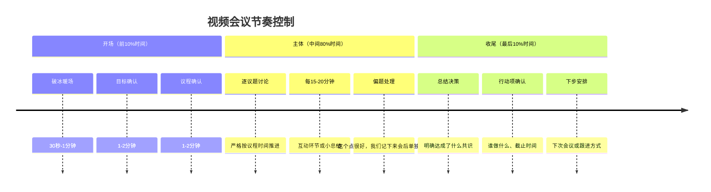
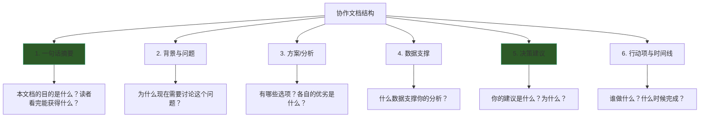
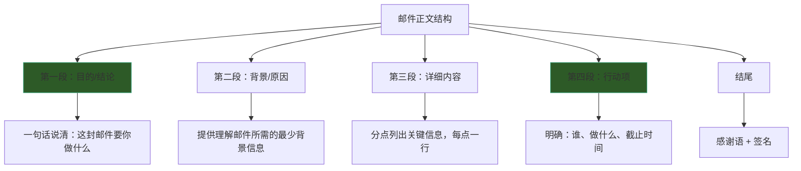
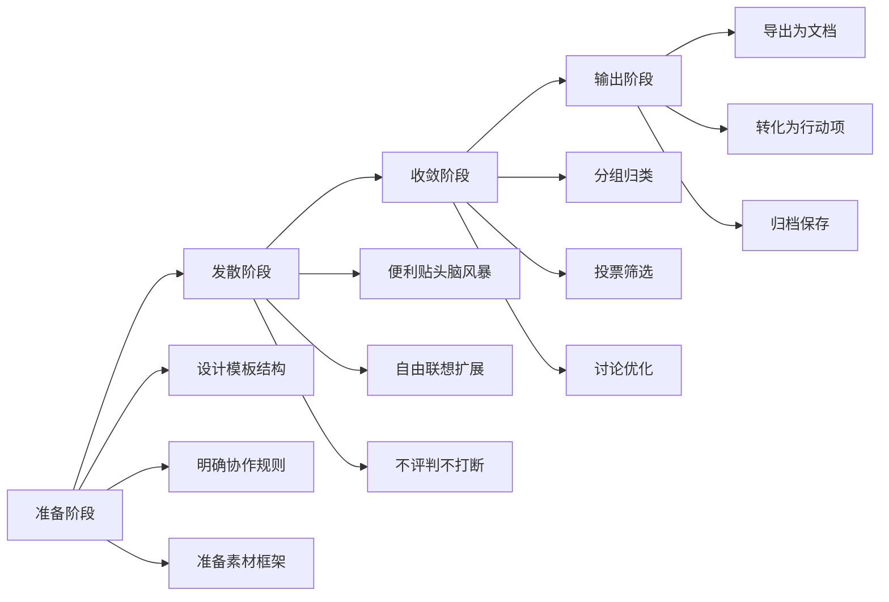
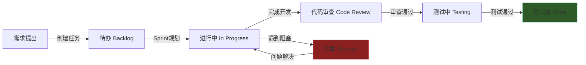

## 数字化沟通工具实战指南

数字化沟通工具不是"会点按钮"就够了。同一个Zoom，有人用它高效决策、会后即执行，有人用它开两小时的无效会议。同一个飞书，有人用它建立清晰的信息流，有人被消息洪流淹没到无法专注。差异不在工具本身，而在使用工具的方法论。

本指南是第二十九章"核心技巧"的实操总纲，覆盖视频会议、即时协作、异步沟通、AI辅助、数字白板、项目管理、混合办公七大工具域，每个域都从"选什么→怎么用→怎么管→怎么避坑"四个层次展开。理论依据（媒体丰富度理论、媒体同步性理论等）见本章理论基础部分，这里聚焦可落地的操作方法。

### 一、视频会议沟通：全生命周期管理

视频会议是媒体丰富度最高的数字沟通方式——它同时传递语言、语调、面部表情和肢体语言。根据Daft和Lengel的媒体丰富度理论，高模糊性和高情感需求的沟通场景（战略讨论、冲突调解、绩效面谈）应优先选择视频会议。但高丰富度也意味着高成本：参会者的时间、注意力和"Zoom疲劳"都是真实代价。因此，视频会议的核心原则是：**能不开就不开，要开就开好**。

#### 1. 会前准备：决定会议成败的80%

大多数低效会议的问题在开始前就已注定——目标模糊、议程缺失、关键人缺席。会前准备的质量直接决定会议效能。

**技术准备清单**

| 检查项 | 标准 | 不达标时的应对 |
|--------|------|---------------|
| 网络上行带宽 | ≥5Mbps（1080p视频需≥10Mbps） | 切换有线连接，或降低视频分辨率 |
| 摄像头 | 画面清晰、角度合适 | 使用手机作为备用摄像头 |
| 麦克风 | 无杂音、无回声 | 使用耳机麦克风，或开启软件降噪 |
| 扬声器 | 音量充足、无啸叫 | 使用耳机代替外放 |
| 软件版本 | 最新稳定版 | 提前10分钟更新 |
| 备用方案 | 手机热点 + 电话拨入号码 | 提前测试热点可用性 |

**会前沟通规范：会议邀请的结构化模板**

一份专业的会议邀请应包含六个要素：目标、议程、时间、参会人、准备材料、会议链接。缺少任何一个都会降低会议效率。

会议邀请模板
━━━━━━━━━━━━━━━━━━━━━━━━━━━━━━━━━━━━━━━━━━━━━━━━
主题：[动词] + [对象] — 例如"评审Q3营销方案"而非"营销会议"
时间：2024-06-25 14:00-15:00 (UTC+8)
时长：60分钟
目标：本次会议要达成的具体成果（非"讨论XX"，而是"决定XX"）
议程：
  1. Q3营销方案汇报 — 张三 — 15min
  2. 预算分配讨论 — 全员 — 20min
  3. 执行时间线确认 — 李四 — 15min
  4. 行动项总结 — 主持人 — 10min
准备材料：
  - Q3营销方案草案（附件）
  - 上季度ROI数据（链接）
参会人：@张三 @李四 @王五 @赵六（标注必选/可选）
会议链接：https://zoom.us/j/xxx
会议密码：xxx
━━━━━━━━━━━━━━━━━━━━━━━━━━━━━━━━━━━━━━━━━━━━━━━━

**会前检查三问**（主持人在发出邀请前自问）：

1. **这个会能用文档代替吗？** 如果只是单向信息传达（通知、汇报），写一份结构化文档发给相关人即可，节省所有人的时间。
2. **参会人都是必须的吗？** Amazon的"两个披萨原则"（参会人数不超过两个披萨能喂饱的人数，通常6-8人）同样适用于视频会议。人越多，每人发言时间越少，参与感越低。非核心人员可以通过会后纪要了解结果。
3. **每个人都知道自己要准备什么吗？** 模糊的"请参会"会导致有人带着充分准备来，有人空手来。在邀请中明确每个人的准备责任。

#### 2. 会中主持：节奏控制与互动促进

**开场黄金三分钟**

开场的质量决定整场会议的基调。主持人应做到四件事：

1. **提前2分钟进入**，测试屏幕共享、音频、视频，确保技术无问题
2. **暖场但不拖沓**——一句轻松话题（"今天北京下雨了，你们那边呢？"）拉近距离，但不超过30秒
3. **重申会议目标和预期成果**——"今天我们要在60分钟内确定Q3营销方案和预算分配"
4. **明确会议规则**——"发言前请举手，非发言时请静音，屏幕共享时请关闭通知"

**会议节奏控制的三段式框架**

**在线互动促进的六种方法**

视频会议最大的敌人是"隐形参会者"——开着会但全程沉默、分心做其他事。以下方法可以有效激活参与：

| 方法 | 操作方式 | 适用场景 | 注意事项 |
|------|---------|---------|---------|
| 点名发言 | "小王，你在这个问题上有什么看法？" | 讨论冷场时 | 给对方2-3秒准备时间，不要突然袭击 |
| 投票功能 | 使用Zoom/Teams内置投票或Mentimeter | 需要快速收集多数意见 | 投票前确保选项清晰完整 |
| 聊天框互动 | "大家在聊天框里各写一个关键词" | 大型会议、收集多元观点 | 主持人需及时读出聊天内容 |
| 分组讨论 | 将参会者分成3-4人小组讨论5分钟 | 深度讨论、创意激发 | 明确讨论问题和汇报要求 |
| 轮流发言 | 按顺序每人30秒-1分钟 | 进度同步、状态汇报 | 设定严格时间限制 |
| 白板协作 | 共享白板让所有人实时标注 | 头脑风暴、流程梳理 | 提前设计白板结构 |

**屏幕共享的最佳实践**

屏幕共享是视频会议中最常用的功能，也是最容易出错的环节：

- **共享前**：关闭无关标签页和通知弹窗（Slack通知弹出私人消息是常见尴尬），确认共享的是正确的窗口而非整个屏幕
- **共享中**：放大关键区域（浏览器缩放150%以上），鼠标指针指向当前讲解的内容，口头同步说明"请看屏幕左上角"
- **共享后**：停止共享时确认操作成功，避免会议结束后屏幕内容仍在共享

#### 3. 会后跟进：将讨论转化为行动

**会议纪要模板**

会议纪要
━━━━━━━━━━━━━━━━━━━━━━━━━━━━━━━━━━━━━━━━━━━━━━━━
会议主题：Q3营销方案评审会
日期：2024-06-25 14:00-15:00
参会人：张三、李四、王五、赵六
主持人：张三 ｜ 记录人：李四

议题一：Q3营销方案汇报
- 讨论要点：方案聚焦社交媒体渠道，预算占比60%
- 决策结果：通过社交媒体为主、线下活动为辅的方案
- 待解决：线下活动预算需财务部确认

议题二：预算分配讨论
- 讨论要点：总预算200万，各渠道分配比例
- 决策结果：社媒120万、线下50万、内容30万
- 行动项：赵六 — 6月28日前提交详细预算明细

行动项汇总：
  1. 赵六：提交详细预算明细 — 截止6月28日
  2. 李四：完成社媒渠道执行计划 — 截止7月1日
  3. 王五：联系线下活动供应商报价 — 截止7月3日

下次会议：2024-07-05 14:00（确认执行计划）
━━━━━━━━━━━━━━━━━━━━━━━━━━━━━━━━━━━━━━━━━━━━━━━━

会后24小时内发送纪要是铁律。超过24小时，参会者的记忆衰减超过50%，行动项的执行意愿也会大幅下降。纪要发送后，在下一次会议开始时先回顾上次的行动项完成情况，形成闭环。

#### 4. 跨时区会议的特殊处理

分布式团队面临的最大挑战之一是时区差异。一个横跨北京、柏林、纽约的团队，三地工作时间的重叠窗口可能只有2-3小时。

**跨时区会议策略：**

| 策略 | 具体做法 | 适用情况 |
|------|---------|---------|
| 轮换制 | 每次会议轮流照顾不同时区，不总是同一时区的同事牺牲休息时间 | 定期例会 |
| 重叠窗口优先 | 使用World Time Buddy等工具找到所有人可用的重叠时段 | 固定团队 |
| 异步优先 | 能用文档/录屏解决的不开同步会议，只在需要实时讨论时开同步会 | 跨3个以上时区 |
| 录制+摘要 | 会议全程录制，AI生成摘要后发送给未参会者 | 无法全员到场 |
| 分区子会 | 先按时区分组讨论，再在重叠时段汇总 | 大型跨区域项目 |

#### 5. 对抗Zoom疲劳

斯坦福大学2021年的研究识别了Zoom疲劳的四大成因：过多的直视眼神接触、看到自己的实时画面、身体活动受限、认知负荷过高。对应的缓解策略：

- **限制每日视频会议数量**：建议不超过4个，连续会议间留出10-15分钟缓冲
- **关闭自我视图**：Zoom和Teams都支持隐藏自己的画面——持续看到自己的脸会产生"照镜子焦虑"
- **切换语音模式**：非必要讨论时关闭摄像头，使用语音+屏幕共享模式
- **使用画廊视图的"隐藏非发言者"**：减少同时看到多人面部带来的认知负荷
- **站起来开会**：使用手机加入会议，在不影响音质的前提下站立或缓慢走动
- **设置"无会议日"**：每周至少一天不安排任何视频会议，用于深度工作

### 二、即时协作工具：信息流设计与通知管理

即时协作工具（Slack、飞书、钉钉、企业微信）是团队日常沟通的"数字办公室"。它们的优势是快速、低摩擦，但劣势同样明显——信息碎片化、通知过载、深度讨论被稀释。用好即时协作工具的核心不是"怎么发消息"，而是**怎么设计信息流**。

#### 1. 频道/群组的信息架构设计

频道结构是团队信息流的骨架。设计不当会导致信息找不到、通知太多、重要信息被淹没。

**推荐的三层频道架构：**

```mermaid
graph TD
    A[频道架构] --> B[第一层：组织级]
    A --> C[第二层：团队级]
    A --> D[第三层：项目级]

    B --> B1[#announcements 公告]
    B --> B2[#general 综合讨论]
    B --> B3[#random 闲聊/团建]

    C --> C1[#team-engineering]
    C --> C2[#team-design]
    C --> C3[#team-marketing]

    D --> D1[#proj-website-redesign]
    D --> D2[#proj-mobile-app-v2]
    D --> D3[#proj-q3-campaign]

    style B fill:#2d5a27,stroke:#4a8
    style C fill:#3a3a5c,stroke:#668
    style D fill:#4a3a2a,stroke:#a86
```

**频道命名规范**（统一前缀，便于搜索和筛选）：

| 前缀 | 含义 | 示例 | 典型通知设置 |
|------|------|------|-------------|
| #ann- | 公告通知 | #ann-company | 所有人接收 |
| #team- | 团队频道 | #team-engineering | 团队成员接收 |
| #proj- | 项目频道 | #proj-mobile-v2 | 项目成员接收 |
| #help- | 求助频道 | #help-frontend | 有空的人回复 |
| #social- | 社交频道 | #social-lunch | 不推送通知 |
| #bot- | 自动化 | #bot-ci-alerts | 按规则推送 |

**频道生命周期管理**：

- 创建时：明确频道目的、受众、通知规则，在频道描述中写明
- 运行中：定期清理过时消息，置顶重要信息
- 结束时：项目结束后归档频道，保留信息但停止通知

#### 2. 消息撰写的四层规范

即时消息看似随意，但高质量的消息和低质量的消息之间的差距巨大。"我觉得可以"这样的回复，在接收者看来等于什么都没说。

**消息撰写的STRUCTURE原则：**

| 原则 | 说明 | 好的示例 | 差的示例 |
|------|------|---------|---------|
| **S**ubject（主题化） | 重要消息开头用【】标注主题 | 【Q3预算】需要各位确认以下分配… | 大家看看这个 |
| **T**hread（线索化） | 回复时使用线程功能，不污染主频道 | 点击消息→回复在线程中 | 直接在频道里连发5条回复 |
| **R**equest（行动化） | 明确说明需要对方做什么 | @小李 请在周五前确认报价 | 小李你看看 |
| **U**rgency（紧急度标注） | 标注紧急程度，帮对方安排优先级 | 【紧急】生产环境数据库连接异常 | 数据库好像有问题 |
| **C**ontext（上下文） | 提供足够背景信息 | 附上截图、链接、相关文档 | 就是那个东西出问题了 |
| **T**ime（时间） | 明确截止时间 | 请在今天17:00前回复 | 尽快 |
| **U**nit（精简） | 一条消息一个主题 | 不要把三件事塞进一条消息 | 对了还有那个事… |
| **R**espect（礼貌） | 使用@时考虑对方时间 | 先看对方状态再@ | 无限@所有人 |
| **E**moji（表情辅助） | 用表情符号辅助表达 | ✅ 已完成 / ❌ 需修改 / ⏳ 进行中 | 纯文字无重点 |

**消息回复的对比示范：**

✓ 好的回复方式：
"关于方案A和方案B的选择，我的分析是：
1. 方案A：开发周期2周，用户转化率预计提升15%，但需要额外的服务器成本约2万/月
2. 方案B：开发周期1周，转化率预计提升8%，无额外成本
综合ROI考虑，建议采用方案A。@小李 从技术角度你觉得2周能完成吗？"

✗ 不好的回复方式：
"我觉得可以"
"嗯"
"👍"（无上下文的单个表情）
"方案A吧"

#### 3. 通知管理：从信息过载到信息掌控

即时协作工具最大的隐性成本是通知。Gartner调查显示，知识工作者平均每6.5分钟被通知打断一次，而被打断后恢复专注平均需要23分钟。通知管理不是"关闭所有通知"，而是**建立分层通知策略**。

**通知分层管理框架：**

| 层级 | 触发条件 | 通知方式 | 示例 |
|------|---------|---------|------|
| 紧急 | 系统故障、安全事件 | 推送+声音+震动 | @channel 生产环境告警 |
| 重要 | 直接@我、关键字提及 | 推送+声音 | @你的消息、私信 |
| 普通 | 所在频道的新消息 | 静默推送，定期查看 | #team-engineering 的讨论 |
| 低优 | 社交频道、机器人频道 | 不推送，主动查看 | #social-random、#bot-ci |

**不同平台的通知配置要点：**

- **Slack**：利用"通知计划"功能设定勿扰时段；为关键频道设置"所有新消息"通知，普通频道设为"仅@提及"；使用关键字通知追踪与自己相关的讨论
- **飞书**：利用"专注模式"屏蔽非紧急通知；设置"特别关注"列表，只接收关键联系人的实时通知；善用"稍后处理"功能暂存非紧急消息
- **钉钉**：使用DING功能处理真正紧急的事项（避免滥用）；开启"消息免打扰"但保留@提及通知；利用"待办"功能将消息转化为任务

#### 4. 状态管理：你的在线状态就是一种沟通

状态管理常被忽视，但它实际上是团队协调的基础设施。一个"🔴 会议中"的状态，可以避免同事连续发消息后因为你没回复而焦虑。

**状态使用规范：**

| 状态 | 含义 | 配套行为 |
|------|------|---------|
| 🟢 在线 | 可随时沟通 | 5分钟内回复消息 |
| 🟡 专注中 | 深度工作，非紧急请留言 | 2小时内回复 |
| 🔴 会议中/勿扰 | 不要打扰 | 会后统一处理 |
| 🔵 外出/出差 | 不在工位 | 注明预计返回时间 |
| ⏰ 离开X分钟 | 短暂离开 | 设置自动恢复时间 |

状态设置的黄金法则：**如果你设置了"专注中"但秒回消息，同事会认为你的状态不准确，以后不再尊重你的状态。** 状态必须与行为一致，才能建立信任。

### 三、异步沟通：深度思考的时间保护

异步沟通是被严重低估的沟通方式。Basecamp（现37signals）的创始人Jason Fried在《It Doesn't Have to Be Crazy at Work》中指出：同步沟通（会议、即时消息）是注意力的窃贼，异步沟通（文档、邮件、录屏）才是深度工作的守护者。异步沟通的核心优势在于：**给每个人充分的思考时间，避免"会议室里声音最大的人赢"的问题。**

#### 1. 文档协作：用文字代替会议

**协作文档的六层结构：**

一份优秀的协作文档不是信息的堆砌，而是引导读者从背景到结论的完整思考路径：

**协作文档的最佳实践：**

| 实践 | 说明 | 反面做法 |
|------|------|---------|
| 使用评论而非直接修改 | 尊重原作者的意图，通过评论提出建议 | 直接覆盖他人内容 |
| 修改前说明意图 | 在评论区或文档顶部写明"我计划修改XX，原因是YY" | 静默修改，其他人不知道改了什么 |
| 使用建议模式 | Google Docs/飞书文档的"建议模式"让修改可审阅 | 直接在编辑模式下改 |
| 版本标注 | 重大修改时在文档顶部标注版本号和修改摘要 | 无法追溯修改历史 |
| 定期归档 | 过时文档移入"归档"文件夹，保持工作区整洁 | 过时文档和活跃文档混在一起 |
| 设置提醒 | 在文档中设置评审截止日期，自动提醒相关人员 | 文档发出去就没人管了 |

**用文档代替会议的判断标准：**

并非所有讨论都适合用文档代替。以下决策框架帮助你判断：

| 条件 | 适合文档 | 适合会议 |
|------|---------|---------|
| 信息方向 | 单向传达或少量反馈 | 需要多方向深度讨论 |
| 时间敏感度 | 不需要即时回应（24-48小时内回复即可） | 需要立即决策 |
| 情感因素 | 无冲突、无敏感话题 | 有分歧需要调解 |
| 参与人数 | >8人（会议效率急剧下降） | 3-8人 |
| 复杂度 | 方案可结构化呈现 | 需要实时追问和澄清 |

#### 2. 录屏沟通：异步的视觉表达

录屏是介于文档和会议之间的沟通方式——它保留了视觉演示的优势，同时给予接收者自主安排观看时间的灵活性。对于跨时区团队，录屏几乎是必备技能。

**录屏的适用场景与不适用场景：**

| 适合录屏 | 不适合录屏 |
|----------|-----------|
| 复杂操作的步骤演示 | 需要双向讨论的问题 |
| 代码审查和Bug复现 | 敏感的人事/绩效话题 |
| 产品功能反馈（截图+标注不够清晰时） | 简单的文字就能说清的事 |
| 跨时区的工作交接 | 需要立即得到回应的紧急事项 |
| 新员工onboarding指引 | 涉及机密信息的内容 |

**录屏的规范流程：**

1. **准备阶段**（录制前2分钟）：列好要说的要点，关闭无关标签页和通知，调整录屏区域
2. **开头**（前15秒）：说明录制目的——"这个录屏是为了演示XX功能的三个使用步骤"
3. **过程**（3-5分钟）：操作过程中同步语音讲解，鼠标移动要慢，关键步骤放大显示
4. **结尾**（最后15秒）：总结关键要点——"总结一下，这里有三个关键步骤：第一…第二…第三…"
5. **补充**：在录屏链接旁附上文字版要点摘要（方便无法观看视频的人）

**录屏工具对比与选型：**

| 工具 | 核心优势 | 局限性 | 最佳适用场景 | 价格 |
|------|---------|--------|-------------|------|
| Loom | 一键录制、自动转文字、视频评论 | 免费版限制5分钟 | 日常沟通、产品反馈 | 免费/付费 |
| OBS Studio | 专业级录制、高度自定义、多场景切换 | 学习曲线较陡 | 正式培训、教程制作 | 免费 |
| 钉钉/飞书录屏 | 与协作平台深度集成 | 功能较基础 | 团队内部沟通 | 含在平台内 |
| Screen Studio | macOS专属、自动缩放、专业效果 | 仅支持Mac | 产品演示、技术分享 | 付费 |
| Camtasia | 录制+编辑一体化 | 价格较高 | 专业培训视频 | 付费 |

#### 3. 邮件沟通：正式沟通的底线规范

邮件在即时通讯时代看似"过时"，但在正式沟通、外部联络、跨组织协作中仍然不可替代。邮件的核心价值在于：**它是正式的、可追溯的、有明确责任归属的沟通方式。**

**邮件主题的公式化写法：**

邮件主题是收件人决定是否打开、何时打开的关键。一个好的主题应包含三个要素：**类型标签 + 核心内容 + 行动指引/时间要求**。

✓ 好的主题：
"[Action Required] Q3预算审批 — 请于周五17:00前反馈"
"[FYI] 客户反馈汇总 — 第三方项目（6月第4周）"
"[Decision] 方案A已批准 — 下周启动执行"
"[Invite] 7月5日产品评审会 — 请确认出席"

✗ 不好的主题：
"请看一下"
"关于那个事情"
"转发"
"会议"（哪个会议？什么时候？）
"Hi"（是垃圾邮件还是重要通知？）

**邮件正文的倒金字塔结构：**

收件人平均只花11秒扫描一封邮件。把最重要的信息放在最前面：

**邮件礼仪的常见错误：**

| 错误 | 为什么是错的 | 正确做法 |
|------|------------|---------|
| 用"回复所有人"发个人意见 | 污染所有收件人的收件箱 | 只回复需要知道的人 |
| 邮件正文超过500字 | 阅读负担过重，关键信息被淹没 | 超过500字改用文档+邮件附链接 |
| 附件名"文档1.docx" | 收件人无法从文件名判断内容 | 使用"项目名_文档类型_日期_v1.docx"格式 |
| 周五下午5点发紧急邮件 | 对方可能周一才看到 | 紧急事务用即时通讯或电话 |
| 用邮件进行来回讨论 | 邮件不适合多轮讨论 | 3轮内未解决→转会议或文档 |

### 四、AI辅助沟通：从工具到工作流

AI不是替代你沟通的"自动回复机器人"，而是帮你更高效地准备、组织和优化沟通内容的"智能助手"。正确使用AI辅助沟通的关键是：**人负责决策和关系，AI负责草拟和优化。**

#### 1. 大语言模型在沟通中的应用场景

| 场景 | 具体用法 | 注意事项 |
|------|---------|---------|
| 邮件起草 | 给出要点，让AI生成初稿，人工调整语气和细节 | 不要直接发送AI生成的邮件，必须人工审核 |
| 会议纪要 | 录音转文字后，让AI提取要点、行动项、决策 | AI可能遗漏或误记关键数字，需要人工校对 |
| 方案撰写 | 给出框架和关键数据，让AI扩展成完整文档 | AI可能编造数据，所有数字必须人工核实 |
| 翻译 | 使用DeepL或GPT进行多语言翻译 | 专业术语需要人工校准 |
| 文案润色 | 将草稿交给AI优化表达和结构 | 保持个人风格，不要让所有文字都像AI写的 |
| 代码文档 | 让AI根据代码生成注释和README | 需要验证技术准确性 |

#### 2. 高效提示词的CRISPE框架

与AI沟通本身就是一种沟通能力。提示词的质量直接决定AI输出的质量。

**CRISPE框架：**

| 要素 | 说明 | 示例 |
|------|------|------|
| **C**apacity（角色） | 设定AI的专业身份 | "你是一位资深的项目经理" |
| **R**equest（任务） | 明确具体任务 | "请帮我写一封催促邮件" |
| **I**nsight（背景） | 提供必要的上下文 | "项目延期了一周，对方还没交付设计稿" |
| **S**tyle（风格） | 指定输出风格 | "语气要坚定但不失礼貌" |
| **P**ersonality（个性） | 品牌或个人风格 | "符合我们公司专业但亲切的沟通风格" |
| **E**xperiment（迭代） | 要求多个版本或优化 | "请给出3个不同语气的版本" |

**实际提示词示例：**

角色：你是一位资深的客户沟通专家
任务：请帮我写一封邮件，催促客户确认设计稿
背景：
- 我们在6月10日发送了设计稿初稿
- 约定的反馈时间是6月17日
- 现在已经过去一周，客户没有回复
- 项目整体时间线比较紧张
- 客户是长期合作伙伴，关系良好
要求：
- 语气坚定但保持友好
- 说明延期对项目时间线的影响
- 提供具体的截止日期（6月28日）
- 附上方便客户反馈的方式（邮件回复或电话讨论）
- 控制在200字以内
输出：请提供邮件正文（不含主题行）

#### 3. AI工具选型矩阵

| 工具 | 核心能力 | 最佳使用场景 | 中文能力 | 价格 |
|------|---------|-------------|---------|------|
| ChatGPT (GPT-4o) | 通用写作、翻译、分析 | 邮件、方案、文档 | 良好 | 免费/付费 |
| Claude | 长文本处理、深度分析 | 长文档审阅、复杂方案 | 良好 | 免费/付费 |
| DeepL | 高质量翻译 | 跨语言文档翻译 | 优秀 | 免费/付费 |
| Grammarly | 英文语法和风格优化 | 英文邮件、报告 | 仅英文 | 免费/付费 |
| 通义千问 | 中文写作、会议纪要 | 中文场景 | 优秀 | 免费 |
| Notion AI | 文档内嵌AI | 笔记、文档协作中的AI辅助 | 良好 | 含在Notion中 |
| 飞书智能伙伴 | 平台内AI | 飞书生态内的沟通辅助 | 优秀 | 含在飞书中 |

#### 4. AI使用的安全红线

**绝对不能做：**
- 将客户合同、财务数据、商业机密输入公共AI服务
- 未审核就直接发送AI生成的内容
- 让AI代替你做涉及人际关系的敏感决策
- 用AI生成虚假数据或伪造证据

**必须做到：**
- 敏感信息使用企业级AI服务（有数据隔离和安全保障）
- 所有AI输出至少通读一遍再使用
- 在团队中明确标注哪些内容经过AI辅助
- 定期检查AI工具的数据使用政策

### 五、数字白板协作：可视化思考

数字白板将传统白板的自由度与数字工具的可保存、可分享、可协作优势结合，是头脑风暴、流程设计、用户旅程映射等场景的理想工具。

#### 1. 白板工具选型

| 工具 | 核心优势 | 最佳适用场景 | 生态集成 | 价格 |
|------|---------|-------------|---------|------|
| Miro | 功能最全面，模板丰富 | 复杂协作、大规模工作坊 | 独立平台，广泛集成 | 免费/付费 |
| FigJam | 轻量易用，设计团队友好 | 快速头脑风暴、设计评审 | 与Figma深度集成 | 免费/付费 |
| 飞书白板 | 与飞书生态深度集成 | 飞书用户团队内部协作 | 飞书全家桶 | 含在飞书中 |
| Excalidraw | 开源、手绘风格、轻量 | 快速草图、技术讨论 | 独立/可嵌入 | 免费 |
| Mural | 企业级协作、模板库 | 大型组织的结构化工作坊 | 广泛集成 | 付费 |

#### 2. 白板协作的四阶段流程

**各阶段实操要点：**

**准备阶段**：主持人在会议前设计好白板模板——包括标题区域、便利贴区域、投票区域、总结区域。模板结构化能避免参与者不知从何下手。明确协作规则：每人写几张便利贴、投票规则是什么、时间限制多长。

**发散阶段**：要求每人独立写便利贴（避免从众效应），每张便利贴只写一个想法，不评判不打断。典型时间：5-10分钟。

**收敛阶段**：将相似的便利贴归类到同一主题下，每人分配3-5个投票点，投给最认同的方案。投票结果公开后，对排名靠前的方案进行深度讨论。

**输出阶段**：白板内容如果只停留在白板上就等于白做了。会后必须将白板内容转化为结构化文档（方案文档、行动项列表、决策记录），并通过邮件或协作工具发送给所有相关人。

### 六、项目管理工具中的沟通

项目管理工具（Jira、Notion、飞书项目、Trello）不仅是任务跟踪系统，更是团队沟通的基础设施。一个写得好的任务卡片，比一场15分钟的口头说明更清晰。

#### 1. 任务描述的INVEST原则

| 原则 | 说明 | 好的任务描述 | 差的任务描述 |
|------|------|-------------|-------------|
| **I**ndependent（独立） | 任务之间尽量减少依赖 | "完成用户注册API（不依赖登录模块）" | "做注册那个功能" |
| **N**egotiable（可协商） | 描述需求而非固定方案 | "实现用户注册功能，支持手机号或邮箱" | "用手机号做注册" |
| **V**aluable（有价值） | 说明为什么做这个任务 | "支持手机号注册，预计提升注册转化率20%" | "加手机号注册" |
| **E**stimable（可估算） | 提供足够信息以估算工作量 | 包含技术方案、接口定义、UI稿 | "做个注册页面" |
| **S**mall（小） | 拆分为可在一个迭代内完成的粒度 | "完成注册表单前端" + "完成后端验证" | "完成整个用户系统" |
| **T**estable（可测试） | 验收标准明确 | 列出3-5条验收标准 | "做好了就行" |

**标准任务模板：**

任务卡片模板
━━━━━━━━━━━━━━━━━━━━━━━━━━━━━━━━━━━━━━━━━━━━━━━━
标题：[动词] + [对象] + [目标]
      例如："实现用户手机号注册功能，支持验证码验证"

描述：
  背景：[为什么要做这个任务]
  需求：[具体需求描述]
  技术方案：[简要技术方案或设计稿链接]

验收标准：
  □ 用户可以通过手机号接收验证码完成注册
  □ 验证码有效期5分钟，过期需重新获取
  □ 同一手机号24小时内最多获取5次验证码
  □ 注册成功后自动登录并跳转到首页

优先级：P1（高）
负责人：@张三
协作人：@李四（后端）@王五（前端）
截止日期：2024-07-05
关联任务：#123（登录功能）#124（用户信息页面）
━━━━━━━━━━━━━━━━━━━━━━━━━━━━━━━━━━━━━━━━━━━━━━━━

#### 2. 项目管理工具中的信息流转

项目管理工具的价值在于信息的有序流转，而非信息的堆积。以下是一个典型的信息流转链路：

每个状态转换都应有明确的沟通动作：
- **进入"进行中"**：负责人在任务下评论"开始处理，预计X天完成"
- **遇到阻塞**：立即在任务下标注阻塞原因和需要谁的帮助
- **提交代码审查**：附上PR链接和自测结果
- **测试不通过**：测试人员在任务下写明失败的测试用例和复现步骤
- **完成**：负责人更新最终结果，关闭相关子任务

### 七、混合办公沟通策略

混合办公（部分时间远程、部分时间到办公室）是后疫情时代的常态。它的沟通挑战在于：**同一个团队中，有人在办公室、有人在家、有人在出差，如何确保信息对称？**

#### 1. 同步与异步的平衡矩阵

| 沟通类型 | 建议方式 | 频率 | 工具 | 注意事项 |
|----------|---------|------|------|---------|
| 战略讨论 | 同步（线下优先） | 按需 | 线下会议室/Zoom | 需要深度讨论和情感交流的议题 |
| 进度同步 | 异步为主 | 每日 | 飞书文档/Notion | 日报模板化，减少撰写负担 |
| 1对1沟通 | 同步（视频） | 每周 | Zoom/Teams | 管理者与直属下属的固定1:1 |
| 创意头脑风暴 | 同步（线下优先） | 按需 | Miro/线下白板 | 视觉化工具辅助 |
| 全员大会 | 线下+直播 | 每月 | Zoom+线下 | 确保远程参会者有平等参与感 |
| 技术讨论 | 异步（文档） | 按需 | Notion/飞书文档 | 给所有人充分的思考时间 |
| 紧急事件 | 同步 | 按需 | 电话/即时消息 | 明确升级路径 |

#### 2. 信息对称机制

混合办公最大的风险是"信息不对称"——在办公室的人获得了额外的非正式信息（茶水间闲聊、午餐讨论），而远程的人被排除在外。

**确保信息对称的五项制度：**

1. **远程优先原则**：即使所有人在办公室，也通过数字工具记录讨论和决策——确保不在场的人能看到完整信息
2. **会议默认录制**：所有团队会议默认录制，24小时内上传到共享空间
3. **决策文档化**：所有重要决策必须在协作工具中记录，包括决策背景、讨论过程和最终结论
4. **非正式信息共享**：鼓励在团队频道中分享"非正式信息"（行业动态、竞品信息、有趣发现），弥补远程人员缺失的"茶水间信息"
5. **轮岗制度**：如果团队有固定办公日，确保远程和现场的讨论机会均等

#### 3. 每日/每周信息同步模板

**每日异步日报模板：**

日报 — [姓名] — [日期]
━━━━━━━━━━━━━━━━━━━━━━━━━━━━
今日完成：
  ✅ [任务1] — 简要说明进度
  ✅ [任务2] — 简要说明进度

明日计划：
  📋 [任务3] — 预计完成时间
  📋 [任务4] — 需要XX的配合

阻塞/风险：
  ⚠️ [问题描述] — 需要@谁的帮助
━━━━━━━━━━━━━━━━━━━━━━━━━━━━

### 八、信息安全与数字沟通素养

数字化沟通的便利性不应以牺牲信息安全为代价。一次不经意的信息泄露可能导致不可挽回的损失。

#### 1. 信息安全的核心准则

| 准则 | 具体要求 | 常见违规 |
|------|---------|---------|
| 信息分级 | 将信息分为公开、内部、机密、绝密四级 | 在公开频道讨论未公开的财务数据 |
| 渠道匹配 | 不同密级的信息使用对应安全级别的渠道 | 通过微信传输客户合同 |
| 权限最小化 | 只授予完成工作所需的最小权限 | 所有人都有公司文件夹的编辑权限 |
| 链接时效 | 共享链接设置过期时间 | 永久有效的共享链接被外泄 |
| 设备安全 | 工作设备启用锁屏、加密 | 在公共场所的电脑未锁屏即离开 |
| 密码管理 | 使用密码管理器，不同平台不同密码 | 所有平台使用同一个密码 |

#### 2. 数字沟通礼仪的核心原则

数字沟通缺少面对面交流的非语言线索（表情、语气、肢体语言），因此更容易产生误解。以下原则可以减少沟通摩擦：

- **尊重状态**：同事设置了"🔴 勿扰"就不要发消息，除非是真正的紧急情况。什么是"真正的紧急情况"？系统故障、安全事故、客户投诉——而不是"领导问了一个问题"
- **延迟回复不等于不尊重**：不要因为对方2小时没回消息就焦虑或追问。每个人都有自己的工作节奏
- **回复时效承诺**：自己设定一个回复标准（如24小时内），并在团队中公开，让同事有合理预期
- **非工作时间克制**：晚上10点发的工作消息，即使你注明"不急"，接收者仍然会产生压力。利用定时发送功能，在工作时间发出
- **正面解读**：文字消息缺少语气信息，"好的"可能意味着同意、敷衍、不满等多种含义。不要过度解读，有疑问直接确认
- **感谢要及时**：同事帮了忙，在公开频道中@感谢，比私下发一句"谢谢"更有价值——它同时传递了认可和正向文化

### 九、工具整合与选型策略

#### 1. 工具整合的分层架构

一个成熟的团队不应该使用10个各自独立的工具，而应该构建一个有层次、有集成的工具栈。

```mermaid
graph TD
    A[沟通工具栈] --> B[核心层：主要工作平台]
    A --> C[协作层：文档与项目管理]
    A --> D[辅助层：专业工具]
    A --> E[集成层：自动化连接]

    B --> B1[飞书/Slack/钉钉 — 选一个作为主阵地]
    C --> C1[Notion/飞书文档 — 知识管理]
    C --> C2[Jira/飞书项目 — 任务管理]
    D --> D1[Zoom/Teams — 视频会议]
    D --> D2[Loom — 录屏]
    D --> D3[Grammarly/DeepL — 写作辅助]
    E --> E1[Zapier/飞书集成 — 工具间自动化]
    E --> E2[Webhook — 消息自动推送]

    style B fill:#2d5a27,stroke:#4a8
    style E fill:#3a3a5c,stroke:#668
```

**工具选型的核心原则：**

1. **少即是多**：工具越少，学习成本越低，信息越集中。能用一个平台解决的不用两个
2. **生态优先**：优先选择在一个生态内集成度高的工具组合（如飞书全家桶、Microsoft 365全家桶）
3. **需求驱动**：先明确团队的沟通需求，再选择工具——而不是先选工具再找需求
4. **渐进引入**：新工具逐步引入，给团队充分的学习和适应时间

#### 2. 常见工具组合方案

| 团队类型 | 推荐组合 | 理由 |
|----------|---------|------|
| 中国创业团队 | 飞书全家桶 + Zoom | 一体化程度高，学习成本低 |
| 跨国技术团队 | Slack + Notion + GitHub + Zoom | 工具链成熟，国际协作友好 |
| 传统企业数字化 | 钉钉 + 腾讯文档 + 腾讯会议 | 符合国内企业使用习惯 |
| 设计团队 | Figma + FigJam + Slack + Notion | 设计协作深度集成 |
| 开源社区 | Discord + GitHub + HackMD | 社区协作工具链成熟 |

### 十、从入门到精通的进阶路径

#### 1. 初级：建立基本素养（第1-2周）

- 熟练使用团队指定的核心协作工具
- 掌握消息撰写的基本规范（主题化、结构化、行动化）
- 能够参与视频会议并规范发言
- 理解同步和异步的区别，知道什么时候该用什么方式
- 设置合理的通知策略，不被消息淹没

#### 2. 中级：提升效率（第3-8周）

- 能够主持高效的视频会议，包括议程设计、节奏控制、会后跟进
- 熟练使用文档协作进行异步讨论，减少不必要的会议
- 掌握录屏沟通，能够清晰地用视频讲解复杂内容
- 善用AI工具辅助邮件、文档、翻译等日常工作
- 能够设计合理的频道/群组信息架构

#### 3. 高级：系统优化（第9周以后）

- 能够在团队层面设计和推广沟通规范
- 掌握工具选型和整合策略，为团队构建高效的工具栈
- 能够诊断团队的沟通问题（信息过载、信息断层、工具滥用）并提出改进方案
- 在同步与异步之间灵活切换，最大化团队的整体沟通效率
- 建立个人的数字沟通工作流，实现"信息进来→处理→输出"的闭环

```mermaid
graph LR
    A[入门：会用工具] --> B[中级：用好工具]
    B --> C[高级：设计系统]
    C --> D[专家：塑造文化]

    A --> A1["掌握基本操作
    遵守团队规范"]
    B --> B1["提升效率
    减少会议
    异步优先"]
    C --> C1["设计信息流
    优化工具栈
    制定规范"]
    D --> D1["影响组织文化
    培养团队习惯
    持续改进"]

    style A fill:#3a3a5c,stroke:#668
    style B fill:#4a3a2a,stroke:#a86
    style C fill:#2d5a27,stroke:#4a8
    style D fill:#2d5a5a,stroke:#4aa
```

***

> **核心要义**：数字化沟通工具只是提升效率的手段，真正重要的是建立清晰的沟通规范和良好的协作习惯。工具会更新换代，但"选择对的工具、用对的方式、建立对的规范"这一底层方法论不会过时。先理解原理（见本章理论基础），再掌握技巧（本指南），最后通过刻意练习（见本章练习方法）将知识内化为能力——这才是数字化沟通能力的完整成长路径。
