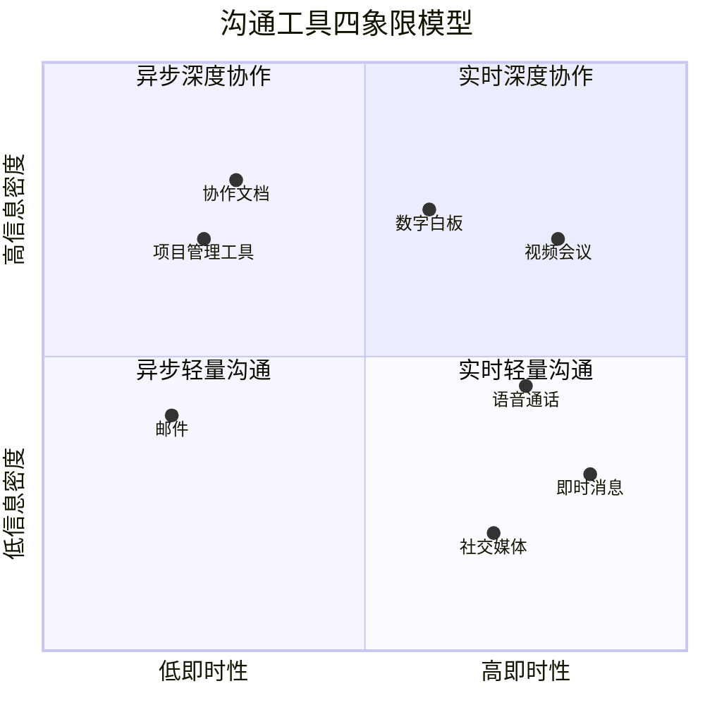
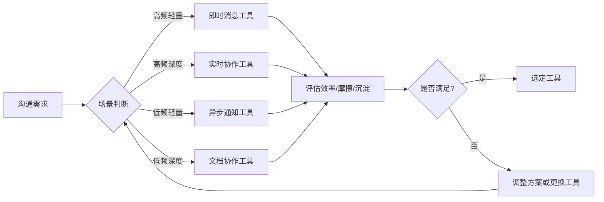
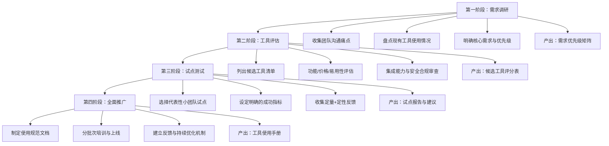
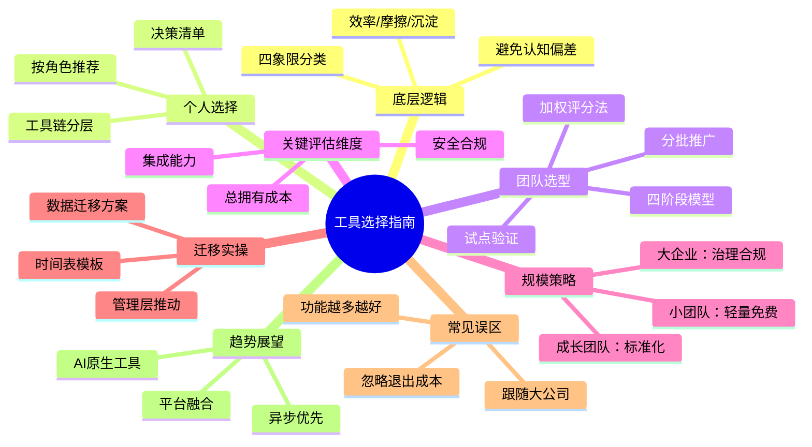

## 九、数字化沟通工具选择指南

工具选择的本质不是"哪个工具最好"，而是"哪个工具最适合当前的沟通场景、团队规模和协作模式"。一个三人创业团队和一个五百人企业，对沟通工具的需求截然不同；一个设计师和一个后端工程师，日常依赖的工具链也完全不同。本章提供一套系统化的选择框架，帮助个人和团队做出理性、可验证的工具决策。

### 9.1 工具选择的底层逻辑

#### 9.1.1 沟通工具的本质分类

数字化沟通工具并非铁板一块。按照信息传递的时间维度和交互深度，可以将其分为四大象限：

| 象限 | 特征 | 代表工具 | 适用场景 |
|------|------|----------|----------|
| 实时轻量沟通 | 即时性强，信息密度低 | 微信、飞书消息、Slack、钉钉 | 日常问答、快速确认、闲聊 |
| 实时深度协作 | 即时性强，信息密度高 | Zoom、腾讯会议、Miro白板 | 头脑风暴、方案评审、紧急问题处理 |
| 异步轻量沟通 | 即时性弱，信息密度低 | 邮件、公告、RSS | 通知、周报、非紧急事务 |
| 异步深度协作 | 即时性弱，信息密度高 | Notion、Google Docs、GitHub | 文档撰写、代码审查、项目规划 |

理解这个分类的意义在于：**选工具之前，先确认你的沟通场景落在哪个象限**。很多人犯的第一个错误，就是用实时轻量工具（微信）去处理异步深度协作的事情（方案讨论），结果信息碎片化、上下文丢失、无法回溯。

#### 9.1.2 工具选择的三个核心维度

任何工具选择决策，都需要在三个维度上取得平衡：

**维度一：沟通效率**

沟通效率 = 有效信息量 / 投入时间

- 低效场景：在微信群里用60秒语音讨论技术方案，信息密度极低，无法检索
- 高效场景：在Notion里写一份结构化方案文档，附带评论和@提及相关人，所有人可以异步审阅

**维度二：协作摩擦**

协作摩擦 = 完成一次协作需要的步骤数 × 每步的认知负担

- 高摩擦：A在微信发了文件 → B找不到 → A重新发 → B修改后发回 → A找不到最新版本
- 低摩擦：A在Google Docs共享链接 → B直接编辑 → 自动保存版本历史 → 一键对比差异

**维度三：知识沉淀**

知识沉淀 = 有价值信息中被结构化保存并可被未来检索的比例

- 无沉淀：微信聊天记录里有大量有价值的决策过程，但三个月后没人能找到
- 强沉淀：Notion项目页面记录了所有决策、变更和讨论，新人入职直接阅读即可理解全貌

#### 9.1.3 避免"工具万能论"和"工具无用论"

两种常见的认知偏差需要警惕：

- **工具万能论**：认为引入一个新工具就能解决所有沟通问题。事实是，工具只是放大器——好的沟通习惯通过工具变得更好，坏的沟通习惯通过工具传播得更快。一个团队如果习惯用60秒语音轰炸群聊，换到Slack上照样会用语音消息轰炸频道。
- **工具无用论**：认为沟通问题都是人的问题，工具无关紧要。事实是，工具的设计深刻影响行为模式。一个没有"话题/Thread"功能的聊天工具，会天然导致多人讨论时信息交叉混乱；一个没有版本历史的文档工具，会天然导致协作时的恐惧心理（"万一改坏了呢"）。

正确的心态是：**工具是环境，环境塑造行为。选择工具就是在选择你希望团队成员形成的沟通习惯。**

### 9.2 个人工具选择矩阵

个人工具选择的核心原则是"少而精"——控制工具数量在5-8个，每个工具承担明确的功能定位，避免功能重叠导致的心智负担。

#### 9.2.1 按角色分层推荐

**知识工作者（文案/策划/运营/管理）**

| 需求场景 | 推荐工具 | 选择理由 | 备选方案 |
|----------|----------|----------|----------|
| 日常即时沟通 | 微信 + 飞书 | 微信覆盖外部联系人，飞书处理内部协作 | 钉钉、企业微信 |
| 深度写作与笔记 | Notion 或 Obsidian | Notion适合团队协作场景，Obsidian适合个人知识管理 | 语雀、Logseq |
| 文档协作 | 飞书文档 或 Google Docs | 实时协作、评论、版本历史 | 腾讯文档、石墨文档 |
| 视频会议 | 腾讯会议 或 Zoom | 腾讯会议国内网络稳定性好，Zoom国际化程度高 | 飞书会议、Google Meet |
| 项目管理 | 飞书多维表格 或 Notion Database | 灵活可定制，学习成本低 | Teambition、Tower |
| 社交媒体运营 | 各平台原生工具 + 新榜/蝉妈妈 | 数据分析精准，原生工具无延迟 | 蚁坊、飞瓜 |

**技术开发者**

| 需求场景 | 推荐工具 | 选择理由 | 备选方案 |
|----------|----------|----------|----------|
| 代码协作 | GitHub | 行业标准，PR/Issue/Actions生态完善 | GitLab、Gitee |
| 技术文档 | Markdown + MkDocs/Hugo | 纯文本可版本控制，静态站点部署简单 | Docusaurus、VuePress |
| API调试 | Postman 或 Insomnia | 接口管理、环境变量、团队共享 | Apifox、Hoppscotch |
| 日常沟通 | Slack 或 飞书 | 频道组织清晰，集成能力强 | Discord、Telegram |
| 知识管理 | Obsidian | 双向链接、本地存储、插件丰富 | Logseq、Roam Research |
| 终端效率 | iTerm2 + Oh My Zsh | 分屏、快捷键、主题定制 | Warp、Alacritty |

**设计与创意工作者**

| 需求场景 | 推荐工具 | 选择理由 | 备选方案 |
|----------|----------|----------|----------|
| UI/UX设计 | Figma | 实时协作、组件库、开发者标注 | Sketch、Adobe XD |
| 设计交付 | 蓝湖 或 Figma Dev Mode | 自动标注、切图、样式代码 | Zeplin |
| 灵感收集 | Eagle 或 Pinterest | 分类管理、标签系统、颜色筛选 | Pixave、Inboard |
| 视频剪辑 | 剪映 或 Premiere Pro | 剪映快速出片，PR专业制作 | Final Cut Pro、DaVinci Resolve |
| 沟通协作 | 飞书 或 企业微信 | 设计评审、反馈收集、版本管理 | Slack |

#### 9.2.2 工具选择决策清单

在决定是否引入一个新工具之前，用以下清单逐项检查：

工具引入决策清单
━━━━━━━━━━━━━━━━━━━━━━━━━━━━━━━━━━━━━━━━━━━━━

□ 需求验证
  - 我真的需要一个新工具，还是现有工具能解决？    [ ]
  - 这个需求的频率如何？每天/每周/偶尔？          [ ]
  - 如果不引入，最坏结果是什么？                  [ ]

□ 功能评估
  - 核心功能是否满足我的需求？                    [ ]
  - 是否支持我现有的工作流？                      [ ]
  - 学习成本如何？我能投入多少时间上手？          [ ]

□ 生态评估
  - 是否与我现有工具集成？（如日历、邮箱）        [ ]
  - 我的协作者是否已经在使用？                    [ ]
  - 数据能否导出？（避免锁定效应）                [ ]

□ 成本评估
  - 免费版是否够用？付费版的性价比如何？          [ ]
  - 隐性成本：学习时间、迁移成本、维护成本        [ ]
  - 替代方案的成本对比                            [ ]

□ 安全评估
  - 数据存储在哪里？是否合规？                    [ ]
  - 是否支持两步验证？                            [ ]
  - 隐私政策是否可接受？                          [ ]

□ 退出评估
  - 如果不满意，能否轻松迁移数据？                [ ]
  - 是否有明确的替代方案？                        [ ]
  - 迁移成本有多高？                              [ ]

━━━━━━━━━━━━━━━━━━━━━━━━━━━━━━━━━━━━━━━━━━━━━
如果超过3项打叉，建议暂缓引入。

#### 9.2.3 个人工具链构建原则

**原则一：一个功能只用一个工具**

不要同时用Notion、Obsidian、语雀、印象笔记来管理知识——这会导致"我的笔记到底在哪里"的永恒焦虑。选定一个主力工具，把所有相关内容集中到那里。

**原则二：核心工具与辅助工具分层**

工具分层架构：
┌─────────────────────────────────┐
│  核心层（每天使用，不可替代）    │  2-3个
│  例：飞书、Notion、Obsidian     │
├─────────────────────────────────┤
│  专业层（特定场景使用）          │  2-3个
│  例：Figma、GitHub、Postman     │
├─────────────────────────────────┤
│  外围层（偶尔使用，随时可替换）  │  2-4个
│  例：腾讯会议、蓝湖、剪映       │
└─────────────────────────────────┘

**原则三：优先选择集成度高的平台**

如果团队已经在用飞书，那么飞书文档、飞书多维表格、飞书会议就是天然的首选——因为它们之间的数据可以无缝流转，减少了在不同工具间复制粘贴的摩擦。优先选择"全家桶"生态，其次才是跨生态的"最佳单品"。

### 9.3 团队工具选型系统方法

团队工具选型与个人选择的最大区别在于：**你不是在为自己选工具，而是在为一群习惯、技能水平、偏好各不相同的人选工具**。这意味着"好用"的主观判断必须让位于系统化的评估流程。

#### 9.3.1 选型四阶段模型

#### 9.3.2 第一阶段：需求调研的实操方法

需求调研不是"问大家想要什么工具"，而是"观察大家在什么地方遇到了困难"。

**方法一：沟通痛点问卷**

设计一份结构化问卷，覆盖以下维度：

团队沟通痛点调研问卷
━━━━━━━━━━━━━━━━━━━━━━━━━━━━━━━━━━━━━━━━━━━━━

1. 信息查找
   - 你是否经常找不到之前的对话记录或文件？     [ ] 从不 [ ] 偶尔 [ ] 经常 [ ] 总是
   - 找到一条历史信息通常需要多长时间？          [ ] <1分钟 [ ] 1-5分钟 [ ] 5-30分钟 [ ] 找不到

2. 协作效率
   - 多人同时编辑一份文档的体验如何？            [ ] 很好 [ ] 还行 [ ] 很差 [ ] 无法协作
   - 从讨论到形成结论通常需要多长时间？          [ ] <1小时 [ ] 半天 [ ] 1-3天 [ ] >3天

3. 信息过载
   - 每天收到的各类通知/消息大约有多少条？       [ ] <50 [ ] 50-200 [ ] 200-500 [ ] >500
   - 其中与你工作相关的占比大约多少？            [ ] >80% [ ] 50-80% [ ] 20-50% [ ] <20%

4. 工具切换
   - 你日常工作中需要在几个工具之间切换？       [ ] 1-2个 [ ] 3-4个 [ ] 5-6个 [ ] >6个
   - 工具切换是否打断了你的工作流？              [ ] 从不 [ ] 偶尔 [ ] 经常 [ ] 总是

5. 远程/混合办公
   - 远程工作时，你是否感到与团队脱节？          [ ] 从不 [ ] 偶尔 [ ] 经常 [ ] 总是
   - 异步沟通（文档、留言）在你团队中的使用率？  [ ] >80% [ ] 50-80% [ ] 20-50% [ ] <20%

━━━━━━━━━━━━━━━━━━━━━━━━━━━━━━━━━━━━━━━━━━━━━

**方法二：工具使用现状审计**

统计团队当前使用的所有工具及其实际使用情况：

| 工具名称 | 使用人数 | 使用频率 | 主要用途 | 付费金额/月 | 满意度(1-5) | 痛点描述 |
|----------|----------|----------|----------|-------------|-------------|----------|
| 微信 | 50/50 | 每天 | 日常沟通 | 免费 | 2.5 | 信息太杂、文件过期、无法检索 |
| 钉钉 | 45/50 | 每天 | 考勤+通知 | ¥2,000 | 3.0 | 功能冗余、员工抵触 |
| 腾讯文档 | 30/50 | 每周 | 协作文档 | 免费 | 3.5 | 功能偏简单、大文档卡顿 |
| ... | ... | ... | ... | ... | ... | ... |

**方法三：关键人物访谈**

选择3-5位有代表性的人物进行一对一深度访谈：
- 团队负责人：了解战略层面的协作需求
- 新员工：了解工具学习曲线和入职体验
- 高频协作者：了解日常协作中的摩擦点
- IT管理员：了解安全、合规、维护的实际困难

#### 9.3.3 第二阶段：工具评估的量化框架

避免凭感觉选工具。使用加权评分法，让决策过程可追溯、可讨论：

**评分维度与权重建议**

| 评估维度 | 权重 | 评分标准（1-5分） |
|----------|------|-------------------|
| 核心功能匹配度 | 25% | 5=完全满足核心需求；1=严重缺失 |
| 易用性/学习成本 | 20% | 5=30分钟上手；1=需要一周培训 |
| 集成能力 | 15% | 5=与现有工具无缝集成；1=完全孤岛 |
| 价格/性价比 | 15% | 5=免费或极具性价比；1=远超预算 |
| 数据安全与合规 | 10% | 5=通过等保/ISO认证；1=无安全措施 |
| 可扩展性 | 10% | 5=支持API/插件/自定义；1=封闭系统 |
| 客户支持 | 5% | 5=7×24中文支持；1=仅英文邮件 |

**评分表示例：团队即时通讯工具选型**

| 评估维度(权重) | 飞书 | 钉钉 | 企业微信 | Slack |
|---------------|------|------|----------|-------|
| 核心功能(25%) | 5 | 4 | 3 | 5 |
| 易用性(20%) | 4 | 3 | 4 | 4 |
| 集成能力(15%) | 5 | 4 | 4 | 5 |
| 性价比(15%) | 4 | 3 | 4 | 3 |
| 安全合规(10%) | 4 | 4 | 5 | 4 |
| 可扩展性(10%) | 5 | 3 | 3 | 5 |
| 客户支持(5%) | 4 | 4 | 4 | 3 |
| **加权总分** | **4.45** | **3.55** | **3.65** | **4.25** |

> 注意：以上评分为示例性质，实际评分应基于团队真实需求和最新产品版本。权重也需要根据团队实际情况调整——对数据安全要求极高的金融团队，安全合规的权重可能需要提到25%以上。

#### 9.3.4 第三阶段：试点测试的关键细节

试点测试是整个选型过程中最容易走过场的环节。以下是确保试点有效的关键做法：

**试点团队选择原则**

- 人数控制在5-15人，太小缺乏代表性，太大难以管理
- 团队中应包含不同角色（技术/产品/运营/管理）
- 应包含"技术乐观者"和"技术保守者"——只选积极分子会导致试点结果偏乐观
- 最好选择一个真实项目作为载体，而非模拟场景

**试点时间与成功指标**

- 试点周期：2-4周。太短无法暴露问题，太长影响正常工作
- 必须在试点前定义可量化的成功指标：

试点成功指标示例：
━━━━━━━━━━━━━━━━━━━━━━━━━━━━━━━━━━━━━━━━━━━━━
定量指标：
  - 日活使用率 > 80%（即80%以上试点成员每天使用）
  - 信息查找时间 < 2分钟（相比试点前的基线）
  - 会议时长减少 > 15%（通过异步协作替代部分会议）
  - 跨时区协作满意度 > 3.5/5

定性指标：
  - "我会向其他同事推荐这个工具" — 同意率 > 70%
  - "这个工具让我的工作更高效" — 同意率 > 60%
  - 关键痛点是否被解决（对照第一阶段的痛点清单）

━━━━━━━━━━━━━━━━━━━━━━━━━━━━━━━━━━━━━━━━━━━━━

**试点期间的反馈收集**

- 每周一次简短反馈问卷（5分钟内完成）
- 试点结束时一次深度访谈
- 记录所有"我希望这个工具能……"的需求——这些是后续评估的关键输入
- 特别关注"沉默的大多数"——不主动反馈的人往往代表了最真实的使用体验

#### 9.3.5 第四阶段：全面推广的执行策略

试点成功不代表全面推广会顺利。大范围推广面临的挑战完全不同：

**分批次推广策略**

推广批次规划：
━━━━━━━━━━━━━━━━━━━━━━━━━━━━━━━━━━━━━━━━━━━━━

第1批（第1-2周）：试点团队 + IT支持团队
  → 积累内部经验，培养"超级用户"
  → 整理常见问题FAQ

第2批（第3-4周）：技术团队 + 产品团队
  → 这些团队对新工具接受度最高
  → 验证与开发工具链的集成

第3批（第5-6周）：运营 + 市场 + 职能部门
  → 需要针对性的培训（不同角色用法不同）
  → 准备角色专属使用指南

第4批（第7-8周）：管理层 + 全员
  → 管理层的使用是最大的推动力
  → 管理层不用 = 团队不会认真用

━━━━━━━━━━━━━━━━━━━━━━━━━━━━━━━━━━━━━━━━━━━━━

**使用规范文档要点**

推广新工具时，必须同步发布一份简明的使用规范，包括：

1. **工具定位**：这个工具用来做什么，不用来做什么
2. **频道/空间组织规则**：如何创建群组、频道、项目空间
3. **消息规范**：什么信息用什么方式发（文本/文档/语音/视频）
4. **响应时间期望**：不同渠道的期望响应时间
5. **通知设置指南**：如何配置通知避免信息过载
6. **安全规范**：哪些信息不能在这个工具上传递

**抵抗变革的应对策略**

工具迁移中常见的抵抗及应对：

| 常见抵抗 | 根本原因 | 应对策略 |
|----------|----------|----------|
| "我用微信挺好的" | 习惯惯性 + 看不到收益 | 展示新工具解决的具体痛点，而非泛泛谈"效率" |
| "又学一个新工具" | 学习疲劳 | 提供30分钟快速上手指南，安排1对1辅导 |
| "领导都在微信，我用别的有什么用" | 上行下效 | 确保管理层率先使用，用行动而非通知推动 |
| "旧工具的数据怎么办" | 数据焦虑 | 提供明确的数据迁移方案和时间表 |
| "这个工具比旧的还难用" | 体验退步 | 收集具体反馈，与工具厂商沟通或调整配置 |

### 9.4 工具评估的关键维度深度解析

#### 9.4.1 集成能力评估

现代沟通工具的价值很大程度上取决于它能与多少其他工具互联。一个功能再强大的孤岛工具，也不如一个中等功能但高度互联的工具。

**集成能力评估框架**

集成能力分级：
━━━━━━━━━━━━━━━━━━━━━━━━━━━━━━━━━━━━━━━━━━━━━

Level 1 — 数据导出
  支持将数据导出为通用格式（CSV/JSON/Markdown）
  评估：能否导出？导出是否完整？

Level 2 — 单向集成
  支持通过Webhook/Zapier将事件推送到其他工具
  评估：支持哪些触发事件？是否有频率限制？

Level 3 — 双向集成
  与其他工具实现数据双向同步
  评估：同步是实时的还是批量的？冲突如何处理？

Level 4 — 平台化
  提供开放API和应用市场，支持自定义集成
  评估：API文档质量？Rate Limit？OAuth支持？

Level 5 — 生态系统
  拥有丰富的第三方应用市场和开发者社区
  评估：应用数量？社区活跃度？更新频率？

━━━━━━━━━━━━━━━━━━━━━━━━━━━━━━━━━━━━━━━━━━━━━

**常见工具的集成生态对比**

| 工具 | 集成等级 | 代表性集成 | 开放API |
|------|----------|------------|---------|
| 飞书 | Level 5 | 200+应用市场，支持自建应用 | 有，文档完善 |
| Slack | Level 5 | 2400+应用，行业最丰富 | 有，文档极好 |
| 钉钉 | Level 4 | 100+应用，主要面向国内场景 | 有，文档尚可 |
| 企业微信 | Level 4 | 与微信生态互通，50+应用 | 有，限制较多 |
| Teams | Level 5 | 深度集成Microsoft 365全家桶 | 有，文档完善 |

#### 9.4.2 数据安全与合规评估

对于处理敏感信息的团队（金融、医疗、政务、出海企业），数据安全不是"加分项"，而是"一票否决项"。

**安全评估检查清单**

数据安全评估清单
━━━━━━━━━━━━━━━━━━━━━━━━━━━━━━━━━━━━━━━━━━━━━

一、数据存储
  □ 数据存储位置是否合规？（境内/境外）
  □ 是否支持私有化部署？
  □ 数据加密方式？（传输加密TLS + 存储加密AES-256）
  □ 数据保留策略是否可配置？

二、访问控制
  □ 是否支持SSO（单点登录）？
  □ 是否支持细粒度权限控制（行/列/字段级别）？
  □ 是否支持两步验证（2FA/MFA）？
  □ 是否支持IP白名单？

三、审计与合规
  □ 是否提供完整的操作审计日志？
  □ 是否通过等保2.0/ISO 27001/SOC 2认证？
  □ 是否支持GDPR合规（如有海外业务）？
  □ 数据删除是否彻底（包括备份）？

四、安全事件响应
  □ 是否有明确的安全事件响应流程？
  □ 历史上是否有重大安全事件？如何处理的？
  □ 是否提供安全白皮书或渗透测试报告？

━━━━━━━━━━━━━━━━━━━━━━━━━━━━━━━━━━━━━━━━━━━━━

#### 9.4.3 总拥有成本（TCO）分析

工具的真实成本远不止订阅费。一个全面的TCO分析应包括：

| 成本类型 | 具体内容 | 估算方法 |
|----------|----------|----------|
| 订阅费 | 月/年费 × 用户数 | 查看官网定价 |
| 隐藏费用 | 超额用量、高级功能、存储扩容 | 仔细阅读定价页面的小字部分 |
| 迁移成本 | 数据迁移、流程重建、并行期双重付费 | 估算2-4周的人力投入 |
| 培训成本 | 培训材料制作、讲师时间、员工学习时间 | 按人均4-8小时估算 |
| 集成成本 | API对接开发、中间件购买 | 按开发人天估算 |
| 维护成本 | IT管理员日常维护、权限管理、问题处理 | 按每周2-4小时估算 |
| 退出成本 | 数据导出、替代方案迁移、业务中断风险 | 提前评估数据导出能力 |

**TCO计算示例**

案例：50人团队从钉钉迁移到飞书

显性成本：
  飞书标准版：¥0/人/月（50人以下免费）
  飞书商业版：¥50/人/月 × 50 = ¥2,500/月（如需高级功能）
  
隐性成本：
  数据迁移：2人天 × ¥1,500 = ¥3,000
  培训：全员2小时 × 50人 × ¥100/时 = ¥10,000
  并行期（2周）：双重维护的人力 ≈ ¥5,000
  IT配置与集成：3人天 × ¥1,500 = ¥4,500

  一次性总成本 ≈ ¥22,500
  年度持续成本 ≈ ¥30,000（如选商业版）

对比留在钉钉的年成本：
  钉钉专业版 ≈ ¥9,800/年 × 1（按50人规模）

迁移决策：需要评估飞书带来的效率提升是否值得额外的投入。
如果飞书能减少20%的会议时间（约每月节省40小时 × 50人），
则ROI在3个月内即可回正。

### 9.5 不同规模团队的工具选型策略

#### 9.5.1 3-10人初创/小团队

**核心原则：轻量、免费、低维护**

小团队最大的约束是时间和精力，不应该在工具管理上花费太多。优先选择：
- 有慷慨免费额度的工具
- 学习曲线平缓的工具
- 尽量在一个平台内解决所有需求

**推荐组合**

方案A（国内团队）：
  飞书（即时通讯 + 文档 + 视频会议 + 多维表格）+ GitHub（代码）+ Figma（设计）
  → 3个工具覆盖90%需求

方案B（国际团队）：
  Slack（通讯）+ Notion（文档 + 项目管理）+ Google Workspace（邮件 + 日历 + Drive）+ GitHub
  → 4个工具覆盖95%需求

方案C（预算极低）：
  微信（通讯）+ 腾讯文档（协作）+ 腾讯会议（视频）+ GitHub（代码）
  → 基本免费，功能够用

#### 9.5.2 10-100人成长型团队

**核心原则：标准化、可管理、可扩展**

这个阶段的核心挑战是：团队快速扩张，新人不断加入，如果没有标准化的工具和流程，信息混乱会指数级恶化。

关键需求：
- 统一的通讯平台（禁止用个人微信讨论工作）
- 结构化的知识管理（新人能自助获取信息）
- 基本的权限管理（离职员工权限及时回收）
- 项目管理可视化（管理者能看全局进度）

**推荐组合**

飞书/钉钉（统一通讯 + 文档 + OKR）+ Jira/Linear（项目管理）+ 
GitLab/GitHub（代码 + CI/CD）+ Figma（设计）+ Confluence/语雀（知识库）

#### 9.5.3 100人以上大型团队/企业

**核心原则：治理、安全、合规、生态**

大团队的工具选型已经不是一个技术决策，而是一个组织治理决策。需要考虑：
- IT统一管控能力（MDM、SSO、审计日志）
- 数据安全与合规（等保、行业监管要求）
- 供应商谈判（企业级定价通常有大幅折扣）
- 组织架构适配（多部门、多子公司、多地域）
- 长期战略（3-5年的产品路线图是否匹配）

**关键评估维度**

| 维度 | 要求 | 评估方法 |
|------|------|----------|
| 管理后台 | 组织架构管理、批量操作、策略下发 | 要求厂商演示管理后台 |
| 安全合规 | 等保认证、数据驻留、审计日志 | 要求提供安全白皮书和认证证书 |
| 企业集成 | AD/LDAP同步、SSO、与ERP/OA对接 | POC验证集成可行性 |
| SLA保障 | 可用性>99.9%、数据备份、灾难恢复 | 要求签署SLA协议 |
| 专属支持 | 专属客户经理、响应时间承诺、培训支持 | 了解支持等级和响应时效 |

### 9.6 工具迁移实操指南

#### 9.6.1 迁移前的准备工作

工具迁移最大的风险不是技术问题，而是"人不用"。迁移前必须做好三件事：

**第一，获得管理层的明确支持**

如果管理层不带头使用新工具，迁移几乎必然失败。理想情况是：
- 一位高管在全员会议上宣布迁移决定，说明原因
- 管理层在迁移日期后停止使用旧工具处理公务
- 将新工具使用情况纳入管理者的关注指标

**第二，制定详细的时间表**

工具迁移时间表模板（以即时通讯工具迁移为例）
━━━━━━━━━━━━━━━━━━━━━━━━━━━━━━━━━━━━━━━━━━━━━

T-4周：准备阶段
  - 完成新工具的组织配置（部门、权限、空间）
  - 导入组织架构和成员账号
  - 制作迁移指南和培训材料
  - 确定各部门的"迁移大使"（每部门1-2人）

T-3周：通知与培训
  - 全员邮件/公告通知迁移计划
  - 分部门进行培训（线上/线下各一场）
  - 发布"快速上手"指南（纸质+电子版）
  - 开通迁移支持热线/群组

T-2周：并行运行
  - 新旧工具同时使用
  - 旧工具群组中张贴迁移公告和新工具链接
  - 迁移大使主动帮助同事解决问题
  - 每日收集反馈，快速调整

T-1周：过渡期
  - 旧工具设置自动回复，引导至新工具
  - 关闭旧工具中的非必要群组
  - 重要信息确认已迁移完毕
  - 最后一轮全员提醒

T日：正式切换
  - 旧工具停止公务使用
  - 全员确认切换完成
  - 应急支持团队就位

T+2周：收尾
  - 评估迁移效果
  - 旧工具数据归档
  - 总结经验教训

━━━━━━━━━━━━━━━━━━━━━━━━━━━━━━━━━━━━━━━━━━━━━

**第三，解决数据迁移问题**

不同工具之间的数据迁移难度差异巨大：

| 迁移类型 | 难度 | 关键挑战 | 建议策略 |
|----------|------|----------|----------|
| 即时通讯记录 | 高 | 格式不兼容、文件过期、@引用失效 | 放弃完整迁移，只归档重要对话 |
| 文档/知识库 | 中 | 格式转换、链接失效、权限重建 | 使用官方迁移工具 + 人工校验 |
| 项目管理数据 | 中 | 字段映射、状态转换、评论关联 | 先迁移活跃项目，历史项目归档 |
| 日历/邮件 | 低 | 主流工具大多支持标准格式导入 | 使用CalDAV/IMAP标准协议 |
| 代码仓库 | 低 | Git本身是分布式，天然支持 | git clone --mirror + git push |

#### 9.6.2 迁移后的持续优化

工具迁移不是一次性事件，而是一个持续优化的过程。迁移后1-3个月内的关键动作：

**第一周**：每日快速检查
- 是否有部门/团队没有真正切换？
- 是否有高频使用场景没有被覆盖？
- 收集"我做不到XXX"的反馈，优先解决

**第一个月**：使用数据分析
- 日活用户数 / 月活用户数（DAU/MAU比率）
- 各功能模块的使用率
- 消息量/文档创建量的趋势
- 与旧工具的使用数据对比

**第三个月**：全面评估
- 回顾迁移前定义的成功指标是否达成
- 收集正负面反馈，形成改进清单
- 决定是否调整工具配置或增减功能模块
- 更新使用规范文档

### 9.7 工具选择中的常见误区

#### 误区一：功能越多越好

**表现**：选择功能最全面的工具，认为"有总比没有好"。

**真相**：功能越多，学习成本越高，用户越容易迷失。一个团队只用了工具20%的功能，却为100%的功能付费，这是巨大的浪费。更重要的是，过多的功能会增加认知负担——"这个功能在哪里？""这个按钮是干什么的？"

**纠正方法**：评估工具时，先列出团队真正需要的5-10个核心功能，只看这些功能的完成度。一个在核心功能上做到极致的工具，胜过一个什么都能做但都做得平庸的工具。

#### 误区二：跟随大公司选工具

**表现**："字节跳动用飞书，所以我们也用飞书""谷歌用Slack，所以我们也用Slack"。

**真相**：大公司的工具选择是基于他们的组织规模、业务场景和IT基础设施。一个10000人公司的最佳选择，对一个50人团队来说可能是过度工程化。

**纠正方法**：参考同行业、同规模、同发展阶段公司的选择，但最终决策必须基于自己团队的实际需求评估。

#### 误区三：忽略退出成本

**表现**：选工具时只看"好不好用"，不看"能不能走"。

**真相**：任何工具都可能在某一天不再适合你的团队。如果数据无法完整导出、格式不兼容、迁移成本极高，你就被锁死在这个工具上了。这在SaaS工具的世界里被称为"供应商锁定（Vendor Lock-in）"。

**纠正方法**：在选型评估中加入"退出成本"维度。优先选择：
- 支持标准数据格式导出的工具
- 有官方迁移工具的工具
- 数据所有权归用户所有的工具
- 开源或有开源替代方案的工具

#### 误区四：一刀切强推

**表现**：IT部门选定工具后，要求所有人统一使用，不允许例外。

**真相**：不同角色的工作方式差异巨大。让设计师和后端工程师用完全相同的工具链，就像让厨师和建筑工人用同一套工具。过度统一会导致某些角色的效率反而下降。

**纠正方法**：区分"统一层"和"自由层"。统一层（如即时通讯、视频会议、项目管理）全公司必须一致；自由层（如笔记工具、代码编辑器、设计工具）允许各部门根据需求自主选择，只要求能与统一层集成。

#### 误区五：只关注初始体验，忽视长期使用

**表现**：试用几天觉得"很好用"就做决定。

**真相**：工具的初始体验（onboarding）和长期使用体验（daily driver）往往差异巨大。很多工具的免费版在试用时体验极好，但实际使用中会遇到用量限制、功能限制、性能瓶颈。

**纠正方法**：试用期至少2周，覆盖至少一个完整的工作周期。在试用中刻意测试：
- 高频场景下的效率（每天用100次以上的操作）
- 大数据量下的表现（1000+条消息的群组、100+页的文档）
- 弱网络环境下的表现
- 移动端和桌面端的一致性

### 9.8 2024-2025年工具趋势与展望

#### 9.8.1 AI原生沟通工具的崛起

AI正在从根本上改变沟通工具的形态。以下趋势值得关注：

**AI会议助手**
- 自动转录 + 摘要 + 行动项提取（如飞书妙记、Otter.ai、Fireflies.ai）
- 实时翻译字幕（如腾讯会议AI翻译、Google Meet实时字幕）
- 会议效果分析（发言时间分布、互动频率、决策追踪）

**AI文档协作**
- 一句话生成文档框架（Notion AI、飞书智能伙伴）
- 基于团队知识库的智能问答（"我们上个季度的营收目标是多少？"）
- 自动化工作流（"当文档状态变为'已完成'时，自动通知审批人"）

**AI信息过滤**
- 智能通知优先级排序（重要消息优先提醒，噪音自动静音）
- 跨平台信息聚合与摘要（"今天你需要关注的3件事"）
- 智能搜索（自然语言搜索历史对话和文档）

#### 9.8.2 异步优先文化的普及

后疫情时代，"异步优先（Async-first）"正在成为全球知识工作者的共识：

- **Loom的爆发式增长**：用短视频替代会议，接收者在自己的时间观看
- **Notion/Linear的异步设计**：默认异步讨论，需要实时才发起会议
- **GitLab的异步实践**：全球2000+员工分布在65+国家，80%的协作通过文档异步完成

**异步优先的核心原则**
1. 默认异步，除非有充分理由才发起实时会议
2. 用文档代替口头汇报——写下来，所有人随时可查
3. 明确响应时间期望——不是所有消息都需要秒回
4. 记录一切——讨论的过程和结论都要沉淀为文档

#### 9.8.3 平台融合与超级应用

工具的边界正在模糊化：

- **飞书/钉钉/企业微信**：从IM工具演化为一站式工作平台（通讯 + 文档 + 项目 + OKR + 审批 + HR）
- **Notion**：从笔记工具演化为全能工作空间（文档 + 数据库 + Wiki + 项目管理 + AI）
- **Figma**：从设计工具演化为协作平台（设计 + 原型 + 开发交付 + 白板 + Slides）

这个趋势的启示是：**未来团队的工具数量会进一步减少，每个工具的功能边界会进一步扩大。** 选择工具时，要关注它的发展方向——它正在成为什么，而不仅仅是它现在是什么。

### 9.9 本节核心要点回顾

> **核心心法**：工具选择没有"最优解"，只有"当前最适合的解"。建立定期审视机制（每半年一次），随着团队规模、业务形态和技术环境的变化，动态调整工具组合。选工具的终极目标不是拥有最好的工具，而是让团队的沟通效率和协作体验持续提升。
