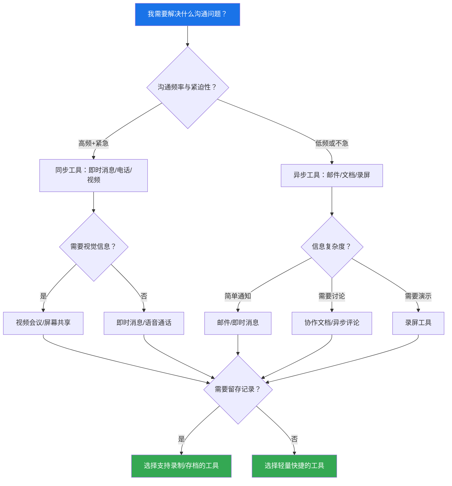
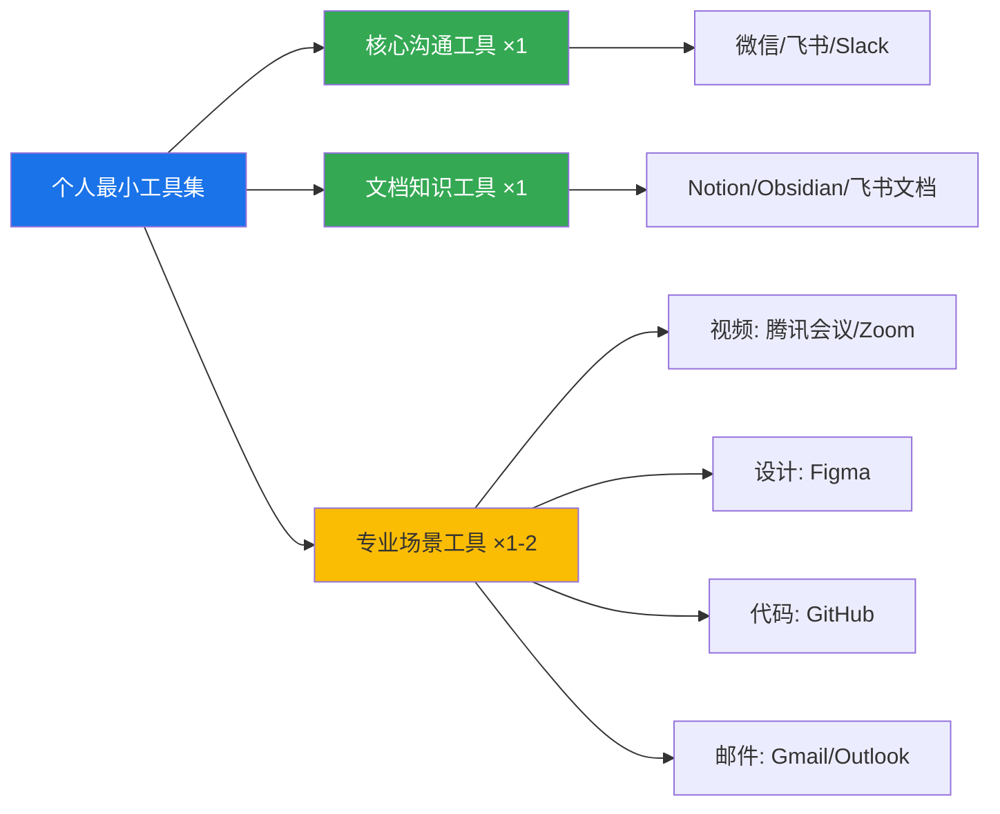
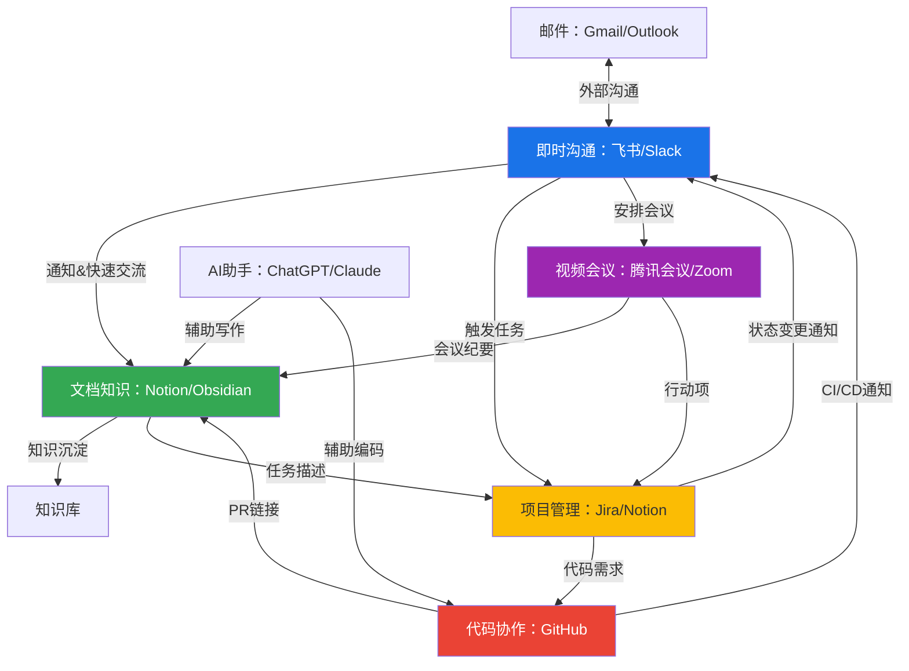

## 九、数字化沟通工具选择指南

面对市场上数百款沟通工具，个人和小型团队常常陷入"选择困难症"——装了太多工具导致注意力碎片化，或者只用一个工具勉强应对所有场景导致效率低下。选择工具的本质不是"哪个工具最好"，而是"哪些工具组合能让你的沟通效率最大化"。本节提供一套系统的个人工具选择方法论，从决策框架到分场景推荐，从生态搭建到常见误区，帮助你构建最适合自己的数字化沟通工具箱。

### 9.1 为什么工具选择需要方法论

很多人选工具的方式是"朋友推荐"或"大家都在用"。这种方式看似省事，实际上隐含了三个认知陷阱：

**陷阱一：把流行当合适。** 飞书在中国互联网公司很流行，但如果你的核心工作是与海外客户沟通，Slack和Zoom才是更合理的选择。工具的流行度反映的是其目标用户群体的规模，不是它对你的适配度。

**陷阱二：把功能当能力。** 一个工具功能再多，如果你不会用或者用不上，那些功能就等于不存在。Obsidian的插件生态极其强大，但如果你只是想记笔记，自带的Notion完全够用，反而学习Obsidian的时间成本是一种浪费。

**陷阱三：把拥有当善用。** 装了20个沟通App不等于拥有高效的沟通能力。McKinsey的研究表明，知识工作者平均每天在不同工具之间切换的次数超过100次，每次切换需要约23分钟才能恢复到之前的专注状态。工具过多本身就是效率杀手。

方法论的价值在于：它帮你跳出这三个陷阱，用系统化的思维找到真正适合自己的工具组合。

### 9.2 个人工具选择决策框架

选择个人沟通工具，核心是回答四个问题：

#### 决策矩阵：场景-工具匹配

在具体选工具之前，先用以下矩阵定位你的核心需求。每一行是一个典型沟通场景，每一列是评估维度。根据你的实际情况打分（1-5分），总分最高的工具就是你的首选：

| 评估维度 | 权重说明 |
|---------|---------|
| 场景匹配度 | 该工具是否专门为这个场景设计 |
| 学习成本 | 从零开始到熟练使用需要多长时间 |
| 协作对象覆盖率 | 你的沟通对象（同事/客户/朋友）是否也在用 |
| 数据可迁移性 | 未来换工具时，数据能否导出 |
| 跨平台一致性 | 手机/电脑/网页端的体验是否一致 |
| 费用 | 免费版能否满足需求，付费版性价比 |

#### "最小工具集"原则

个人工具选择的黄金法则是：**用最少的工具覆盖最多的场景**。工具数量越少，上下文切换越少，信息越集中，效率越高。

推荐的个人最小工具集结构：

核心思路是"1+1+N"：1个核心沟通工具处理80%的日常沟通，1个文档知识工具做信息沉淀，N个专业工具（尽量控制在2个以内）处理特定场景。超过5个日常使用的沟通工具，就应该考虑做减法。

### 9.3 分场景工具深度分析

#### 9.3.1 日常即时沟通

**核心需求**：快速发送文字/图片/文件，支持群聊和私聊，消息搜索方便。

**主流工具对比**：

| 工具 | 消息类型 | 群聊上限 | 消息搜索 | 文件大小限制 | 特色功能 | 适合人群 |
|------|---------|---------|---------|------------|---------|---------|
| 微信 | 文字/图片/语音/视频/文件 | 500人 | 仅文本，不支持高级筛选 | 200MB（文件传输助手） | 小程序生态、支付生态 | 国内通用人群，个人社交 |
| 飞书 | 文字/图片/语音/视频/文件/富文本 | 无上限 | 全文搜索，支持类型/人/时间筛选 | 4GB | 表情回应、话题群、Pin消息 | 互联网/科技团队 |
| 企业微信 | 文字/图片/语音/视频/文件 | 2000人 | 支持基本搜索 | 100MB | 客户联系、朋友圈、微信互通 | 需要连接微信客户的团队 |
| 钉钉 | 文字/图片/语音/视频/文件 | 3000人 | 支持多维度搜索 | 4GB | 已读回执、DING消息、考勤打卡 | 传统企业、有管理需求的团队 |
| Slack | 文字/图片/视频/文件/代码块 | 无上限 | 全文搜索，支持高级语法 | 1GB（付费版） | Thread、Workflow Builder、2600+集成 | 技术团队、海外协作 |
| Microsoft Teams | 文字/图片/视频/文件 | 25000人 | 全文搜索 | 250GB/用户 | Office 365深度集成、Copilot AI | Office生态企业、跨国团队 |

**选型建议**：

- **如果你的工作圈子在国内且没有特殊需求**：微信是最安全的选择，因为它几乎100%覆盖了你的沟通对象。但微信的信息管理能力很弱——群消息不能按话题归类，文件容易过期，搜索体验差。解决方案是把微信当"沟通入口"，重要信息及时转存到文档工具。
- **如果你在科技/互联网公司**：飞书是综合体验最好的选择。它的消息、文档、日历、项目管理一体化程度极高，切换成本低。
- **如果你需要与海外团队协作**：Slack在开发者社区有最强的集成生态，几乎所有的开发工具（GitHub、Jira、CI/CD）都有原生集成。Microsoft Teams则适合已经在Office 365生态中的团队。
- **如果你需要连接客户**：企业微信是唯一能直接触达微信用户的企业工具，客户不需要额外安装任何App。

#### 9.3.2 深度写作与知识管理

**核心需求**：长文写作、笔记整理、知识体系构建、多端同步。

**工具深度对比**：

| 特性 | Notion | Obsidian | 飞书文档 | 语雀 | Typora |
|------|--------|----------|---------|------|--------|
| **编辑方式** | 块编辑器 | Markdown | 块编辑器 | 块编辑器+Markdown | 纯Markdown |
| **双向链接** | ✅ | ✅（核心功能） | ❌ | ✅ | ❌ |
| **知识图谱** | ❌ | ✅（核心功能） | ❌ | 部分支持 | ❌ |
| **协作能力** | 实时多人协作 | 有限（需付费同步） | 实时多人协作 | 实时多人协作 | 无 |
| **数据存储** | 云端 | 本地文件（.md） | 云端 | 云端 | 本地文件 |
| **数据可迁移性** | 中等（可导出） | 极高（纯文本文件） | 中等 | 中等 | 极高（纯文本文件） |
| **插件生态** | 丰富（模板+集成） | 极其丰富（2000+插件） | 有限 | 有限 | 有限 |
| **离线使用** | 有限 | 完全支持 | 有限 | 有限 | 完全支持 |
| **搜索能力** | 全文搜索 | 全文搜索+标签+链接 | 全文搜索 | 全文搜索 | 本地搜索 |
| **适合场景** | 团队知识库、项目管理 | 个人知识管理、研究 | 团队协作文档 | 技术文档、团队知识库 | 个人写作 |
| **价格** | 免费版够用，$8/月起 | 核心免费，同步$4/月 | 免费 | 免费版够用 | $14.99一次性 |

**选型建议**：

- **个人知识管理首选Obsidian**：数据存在本地，Markdown格式永不过时，双向链接和知识图谱帮你构建第二大脑。缺点是协作能力弱，适合个人使用。
- **团队协作首选Notion**：All-in-one的工作空间，能同时管理笔记、项目、数据库。缺点是数据在云端，深度依赖网络。
- **国内团队如果已经在用飞书**：飞书文档的体验已经很好，不需要额外引入工具。它的@提及、评论、任务分配与飞书IM深度打通，信息流转最顺畅。
- **技术写作/开源文档**：Typora+GitHub是经典组合，纯Markdown文件用Git做版本管理，可以与静态网站生成器（Hugo/Jekyll）无缝衔接。

**深度写作的核心工作流**：

无论选择哪个工具，以下工作流都适用：

1. **输入层**：随时捕获想法和素材。用手机端快速记录，不要在意格式，重要的是不丢失灵感。
2. **处理层**：每天或每周固定时间整理素材。分类、打标签、建立关联。这一步决定了知识能否被高效检索。
3. **输出层**：写作时从知识库中提取素材，组装成结构化的文章/文档。好的知识管理工具能大幅降低"从零开始写"的心理负担。
4. **回顾层**：定期浏览知识图谱，发现不同知识点之间的隐藏关联。这是Obsidian这类工具的核心价值——它能帮你看到"笔记A和笔记C之间有一条你没注意到的路径"。

#### 9.3.3 视频会议与远程协作

**核心需求**：稳定清晰的音视频、屏幕共享、会议录制、实时字幕。

**主流工具对比**：

| 特性 | 腾讯会议 | Zoom | 飞书会议 | Microsoft Teams | Google Meet |
|------|---------|------|---------|----------------|-------------|
| **免费版时长** | 60分钟 | 40分钟 | 60分钟 | 60分钟 | 60分钟 |
| **免费版人数** | 300人 | 100人 | 50人 | 100人 | 100人 |
| **视频质量** | 高清1080p | 高清1080p | 高清1080p | 高清1080p | 高清1080p |
| **屏幕共享** | ✅ 多种模式 | ✅ 多种模式 | ✅ 多种模式 | ✅ 多种模式 | ✅ 基础模式 |
| **会议录制** | 云录制+本地录制 | 云录制+本地录制 | 云录制+本地录制 | 云录制 | 云录制（付费） |
| **AI纪要** | ✅ | ✅ | ✅ | ✅ Copilot | ✅ Gemini |
| **虚拟背景** | ✅ | ✅ | ✅ | ✅ | ✅ |
| **降噪能力** | 优秀 | 优秀 | 优秀 | 良好 | 良好 |
| **国内访问** | 极佳 | 需要优化 | 极佳 | 一般 | 需要工具 |
| **预约会议** | ✅ 日历集成 | ✅ 日历集成 | ✅ 飞书日历 | ✅ Outlook | ✅ Google日历 |
| **适合场景** | 国内通用 | 海外协作 | 飞书生态用户 | Office 365用户 | Google Workspace用户 |

**视频会议的隐藏成本**：

选择视频会议工具时，人们往往只关注功能列表，忽略了三个关键的隐藏成本：

1. **网络依赖成本**：Zoom在国内的连接质量不稳定，经常需要第三方加速工具。这不只是额外的费用问题，更是开会时突然断线的信任成本。如果你的团队主要在国内，优先选择腾讯会议或飞书会议。
2. **录制与存储成本**：免费版的云录制空间通常很小（1-5GB），如果每周开3-4次会议，一个月就会用完。提前评估你的录制需求，选择存储空间足够的版本。
3. **AI功能的付费门槛**：很多工具的AI纪要、实时翻译功能只在付费版提供。如果这些功能对你很重要，需要把它们纳入成本计算。

#### 9.3.4 异步沟通工具

**核心需求**：在不同时在线的情况下高效传递复杂信息。

异步沟通是远程工作中最被低估的能力。GitLab（全远程公司）的数据显示，他们的员工80%以上的沟通是异步完成的，这使得分布在全球各地的2000多名员工能够高效协作，而不需要大量同步会议。

**异步沟通工具矩阵**：

| 场景 | 推荐工具 | 关键技巧 |
|------|---------|---------|
| 需求/方案讨论 | 飞书文档/Notion/Google Docs | 用评论功能代替会议讨论，所有意见留痕可追溯 |
| 代码审查 | GitHub PR / GitLab MR | 写清楚修改背景和意图，用inline comment逐行讨论 |
| 操作演示 | Loom / 钉钉录屏 / 飞书录屏 | 控制在3-5分钟，先说结论再演示过程 |
| 正式通知 | 邮件（Gmail/Outlook） | 主题行写清"【需回复/仅知悉】+关键信息"，正文用结构化格式 |
| 进度同步 | 飞书/Slack的Standup Bot | 每天固定时间发送"昨日完成/今日计划/阻塞项" |
| 知识分享 | 语雀/Notion知识库 / 飞书知识库 | 建立统一的分类体系和标签规范，确保可检索 |

**异步沟通的黄金法则**：

1. **一次说完**：异步消息最忌讳"一句一句发"。把背景、问题、你尝试过的方案、你期望的帮助，一次性写清楚。
2. **结构化表达**：用标题、列表、加粗来组织信息，让对方能快速扫读重点。
3. **设定期望回复时间**：在消息中说明"这个不急，本周内回复即可"或"希望今天下午前收到反馈"，避免双方的焦虑。
4. **提供上下文**：不要假设对方记得之前的讨论。异步沟通的关键是"自包含"——每条消息都应该包含足够的上下文信息。

#### 9.3.5 邮件工具

邮件在即时通讯时代看似过时，但在以下场景中仍然不可替代：

- **正式商务沟通**：合同确认、报价、法律文件等需要留痕的场景
- **跨组织沟通**：给客户、供应商、合作伙伴发消息，邮件是通用协议
- **订阅与通知**：技术文档更新、系统告警、Newsletter
- **异步长文讨论**：比即时消息更适合表达复杂观点

**主流邮件客户端对比**：

| 特性 | Gmail | Outlook | Foxmail | 网易邮箱大师 |
|------|-------|---------|---------|------------|
| **搜索能力** | 极强，支持自然语言 | 强，支持高级筛选 | 一般 | 一般 |
| **智能分类** | 自动分类（社交/促销/更新） | Focused Inbox | 无 | 无 |
| **日历集成** | Google Calendar深度集成 | Outlook Calendar深度集成 | 腾讯日历 | 无 |
| **第三方集成** | 2000+ Add-ons | 1000+ Add-ins | 有限 | 有限 |
| **AI功能** | Gemini辅助撰写/摘要 | Copilot辅助撰写/摘要 | 无 | 无 |
| **国内使用** | 需要工具 | 畅通 | 畅通 | 畅通 |
| **适合人群** | 海外协作、开发者 | 企业用户、Office生态 | 国内个人用户 | 国内个人用户 |

**邮件效率提升技巧**：

1. **模板化**：把常见的邮件类型（项目更新、会议邀请、回复咨询）做成模板，只修改关键信息。
2. **定时发送**：很多邮件客户端支持定时发送功能。如果你习惯在深夜写邮件，设置为工作日上午9点发出，既不影响你的工作节奏，也不会给对方造成"半夜收到工作消息"的压力。
3. **过滤器和标签**：设置自动过滤规则，让不同类型的邮件自动归类。例如：来自Jira的通知自动标记为"工程"，来自特定客户的邮件自动标记为"高优先级"。
4. **批量处理**：不要来一封看一封。设定固定的邮件处理时间（如每天上午10点和下午3点），集中处理。两次之间关闭邮件通知。

#### 9.3.6 代码与技术协作工具

**核心需求**：代码版本管理、代码审查、CI/CD集成、技术讨论。

| 工具 | 代码托管 | PR审查 | CI/CD | 项目管理 | 私有仓库免费额度 | 适合场景 |
|------|---------|--------|-------|---------|---------------|---------|
| GitHub | ✅ | ✅ | GitHub Actions | Issues + Projects | 无限私有仓库 | 开源项目、个人开发者 |
| GitLab | ✅ | ✅ | 内置CI/CD | 内置看板 | 无限私有仓库 | 需要自托管、DevOps一体化 |
| Gitee | ✅ | ✅ | 有限 | Issues | 有限（需审核） | 国内访问快，合规需求 |
| Bitbucket | ✅ | ✅ | Pipelines | Jira集成 | 5人免费 | Atlassian生态用户 |

**选型建议**：

- **个人/开源项目**：GitHub是事实标准，社区生态最强。
- **国内团队且有合规要求**：Gitee企业版支持国内数据存储。
- **需要完整DevOps流程**：GitLab的一体化程度最高，从代码到部署全在同一个平台。

#### 9.3.7 设计协作工具

| 工具 | 核心能力 | 协作方式 | 价格 | 适合场景 |
|------|---------|---------|------|---------|
| Figma | UI设计、原型、设计系统 | 实时多人协作 | 免费版够用 | 产品设计团队 |
| 蓝湖 | 设计稿标注、切图 | 设计师上传，开发查看 | 免费版够用 | 设计→开发交付 |
| MasterGo | UI设计、原型 | 实时多人协作 | 国产，免费版功能多 | 国内替代Figma |
| 即时设计 | UI设计、矢量编辑 | 实时多人协作 | 完全免费 | 国内个人/小团队 |

#### 9.3.8 项目管理工具

| 工具 | 核心范式 | 适合团队规模 | 学习成本 | 特色 |
|------|---------|------------|---------|------|
| Jira | Scrum/Kanban | 20-10000+ | 高 | 最强大的敏捷管理，开发团队首选 |
| Notion | 灵活数据库 | 1-500 | 中 | 自定义程度极高，All-in-one |
| 飞书项目 | 看板/甘特图 | 5-500 | 低 | 与飞书IM深度集成 |
| Trello | 看板 | 1-100 | 极低 | 最简单的看板工具，上手即用 |
| Linear | Scrum/Kanban | 1-500 | 低 | 速度极快，开发者体验最佳 |

### 9.4 构建个人工具生态系统

选择工具不是孤立的决策，而是构建一个相互协作的生态系统。工具之间的数据流通能力，往往比单个工具的功能更重要。

#### 9.4.1 工具集成的理想模型

在这个模型中，信息在不同工具之间自动流转，不需要人工在工具之间复制粘贴。实现这种集成的关键是：

1. **选择有开放API的工具**：Slack、飞书、Notion、GitHub都有完善的API和Webhook支持。
2. **使用连接器**：Zapier、IFTTT、飞书的连接器平台可以在不同工具之间建立自动化管道。
3. **统一入口**：尽量让一个工具承担"中枢"角色——所有通知汇总到这里，所有操作从这里发起。

#### 9.4.2 按职业角色的推荐工具组合

**产品经理**：
- 沟通：飞书（或企业微信，如果需要连接客户）
- 文档：飞书文档 或 Notion（PRD、用户故事、竞品分析）
- 设计协作：Figma（原型）+ 蓝湖（交付）
- 项目管理：飞书项目 或 Jira
- 数据分析：飞书多维表格 或 Airtable
- 总工具数：4-5个

**软件开发者**：
- 沟通：Slack（技术社区）+ 飞书/钉钉（公司内部）
- 代码：GitHub（个人/开源）+ 公司Git平台
- 文档：Obsidian（个人笔记）+ 公司知识库
- 项目管理：Jira 或 Linear
- CI/CD：GitHub Actions 或 GitLab CI
- 总工具数：4-5个

**自由职业者**：
- 沟通：微信（国内客户）+ 邮件（海外客户）+ Zoom（视频会议）
- 文档：Notion（项目管理+笔记二合一）
- 财务：记账工具
- 总工具数：3-4个

**内容创作者**：
- 沟通：微信 + 各平台私信管理
- 写作：Obsidian 或 Typora（长文）+ Notion（选题管理）
- 设计：Canva（配图）
- 分发：各平台原生发布工具
- 总工具数：3-4个

### 9.5 常见工具选择误区与纠正

#### 误区一：工具越多越专业

**典型症状**：手机上装了飞书、钉钉、企业微信、Slack、Discord、Telegram、WhatsApp，每天在7个App之间来回切换，每个群消息都是99+。

**纠正方法**：执行"工具瘦身"。列出你日常使用的所有沟通工具，标注每个工具的核心用途和每日使用频率。然后问自己：哪些工具的核心用途是重叠的？能否合并？通常可以把7个工具精简到3-4个，核心原则是"一个功能只用一个工具"。

**判断标准**：如果你每天打开某个工具的次数不到1次，或者打开后只是扫一眼就关掉，这个工具大概率可以被替代或删除。

#### 误区二：追新不追稳

**典型症状**：每个新出的效率工具都要试一试，频繁切换工具导致数据分散在各处。

**纠正方法**：设定"工具冷静期"。当一个新工具引起你的兴趣时，先不做任何操作，等一周。如果一周后你仍然觉得它能解决你当前工具无法解决的问题，再做评估。迁移工具的成本远高于你想象的——不只是数据迁移，还有重新学习操作、重新建立工作流、通知协作对象切换工具的隐性成本。

#### 误区三：免费就不用付费

**典型症状**：只用免费版，宁可忍受功能限制和广告干扰，也不愿为专业工具付费。

**纠正方法**：算一笔账。如果你的日薪是500元，一个付费工具每天帮你节省30分钟，一个月就是150分钟≈125元的产出。如果这个工具月费低于125元，它就是赚钱的，不是花钱的。对职业人士来说，工具投资是ROI最高的投资之一。

但也要避免另一个极端——不要为了"可能有用的功能"而付费。先用免费版足够长时间（至少1个月），确认你确实需要那些付费功能，再升级。

#### 误区四：忽视数据可迁移性

**典型症状**：所有笔记都写在一个App里，从来没想过如果这个App关停了怎么办。

**纠正方法**：选择数据格式开放的工具。Markdown文件、CSV、HTML是通用格式，任何工具都能读取。优先选择能导出这些格式的工具。Obsidian的数据就是本地的Markdown文件，即使Obsidian本身消失了，你的笔记依然完好。Notion支持导出为Markdown和CSV。飞书文档支持导出为Word和PDF。

**备份习惯**：每季度做一次数据导出备份，保存到独立的存储位置（本地硬盘+云盘双备份）。

#### 误区五：功能强迫症

**典型症状**：为了使用一个工具的"高级功能"，花大量时间学习和配置，实际工作中这些功能的使用频率不到5%。

**纠正方法**：遵循"80/20法则"——一个工具80%的价值来自20%的核心功能。先把核心功能用熟，确认你真的需要高级功能后再深入学习。Obsidian有2000+插件，但90%的人只需要5-10个核心插件。Notion有无穷的模板和公式，但高效的使用方式通常只需要掌握数据库和关联两个核心概念。

#### 误区六：忽视协作对象的使用习惯

**典型症状**：你精心选择了最好的工具，但你的沟通对象不用它，结果你不得不同时维护两个工具。

**纠正方法**：工具选择要考虑"协作对象覆盖率"。如果你的客户都用微信，你就必须有微信——不管你个人多么不喜欢微信的工作方式。如果你的团队都用飞书，你就应该用飞书——即使你个人更喜欢Slack。沟通工具的核心价值在于"连接"，一个没人用的完美工具不如一个大家都在用的普通工具。

### 9.6 工具迁移实战指南

更换沟通工具是一项系统工程，处理不当会导致信息丢失、团队混乱、效率下降。以下是从一个工具迁移到另一个工具的完整流程：

#### 迁移前评估

在决定迁移之前，先回答以下问题：

| 评估维度 | 关键问题 | 风险等级 |
|---------|---------|---------|
| 数据资产 | 现有工具中有多少历史数据需要迁移？ | 数据量越大，风险越高 |
| 工作流依赖 | 有多少工作流依赖现有工具？ | 自动化流程越多，风险越高 |
| 外部协作 | 是否有外部人员（客户/供应商）在用现有工具？ | 涉及外部人员，风险高 |
| 团队接受度 | 团队成员对新工具的态度如何？ | 抵触情绪越大，风险越高 |
| 时间窗口 | 是否有业务淡季可以执行迁移？ | 业务高峰期迁移，风险极高 |

#### 迁移执行步骤

**第一阶段：准备期（1-2周）**

1. 成立迁移小组，指定负责人
2. 盘点现有工具中的所有数据资产（聊天记录、文件、工作流、集成）
3. 在新工具中搭建组织架构和权限体系
4. 测试数据导入功能，确认哪些数据能自动迁移，哪些需要手动处理
5. 制作迁移操作手册和FAQ文档

**第二阶段：试运行期（2-3周）**

1. 选择1-2个团队先行试用新工具
2. 新旧工具并行运行，所有新任务在新工具中创建
3. 收集试运行期间的问题和反馈
4. 迭代优化新工具的配置和使用规范
5. 解决集成和数据迁移中的技术问题

**第三阶段：全员切换期（1-2周）**

1. 正式通知全员切换日期（至少提前1周）
2. 分批次培训，先培训各部门的关键用户（Key User），再由关键用户培训本部门
3. 切换日当天，旧工具设为只读模式（能看不能发）
4. 安排专人值班，实时解答使用问题
5. 每天收集Top 5问题，快速迭代FAQ

**第四阶段：稳定期（1个月）**

1. 关闭旧工具的访问权限（在确认所有数据已迁移后）
2. 进行满意度调查
3. 整理最佳实践文档
4. 复盘迁移过程，记录经验教训

#### 数据迁移的常见问题

| 问题 | 原因 | 解决方案 |
|------|------|---------|
| 聊天记录格式丢失 | 不同工具的消息格式不兼容 | 用第三方迁移工具（如Slack到飞书的迁移脚本），或接受"新起点"，只迁移关键文件 |
| 文件链接失效 | 旧工具中的文件链接指向旧系统的URL | 提前导出所有文件到网盘，在新工具中重建索引 |
| 工作流需要重建 | 自动化规则是工具特定的 | 在迁移前记录所有自动化规则，在新工具中逐一重建 |
| 权限体系不兼容 | 不同工具的权限模型不同 | 重新设计权限体系，利用这个机会清理过时的权限配置 |

### 9.7 高级话题：工具效率的量化评估

选好工具并使用一段时间后，如何知道这个选择是否正确？以下是几个可以量化的评估指标：

#### 效率指标

| 指标 | 测量方法 | 基准值 | 优化目标 |
|------|---------|--------|---------|
| 信息查找时间 | 从"想找某条信息"到"找到"的平均时间 | >2分钟（差）→ <30秒（好） | 减少50% |
| 工具切换次数 | 每天在不同工具之间切换的次数 | >50次（差）→ <20次（好） | 减少60% |
| 会议时长占比 | 每周在会议中的时间占比 | >40%（差）→ <25%（好） | 减少30% |
| 消息响应时间 | 收到消息到回复的平均时间 | 无标准，取决于场景 | 同步<5分钟，异步<4小时 |
| 知识沉淀率 | 重要信息被记录到知识库的比例 | <30%（差）→ >70%（好） | 提升到80% |

#### 定期审计清单

每季度花1小时做一次工具审计：

1. 列出你日常使用的所有沟通工具，标注使用频率
2. 检查是否有工具已经3个月以上没有使用——可以卸载
3. 检查是否有功能重叠的工具——可以合并
4. 检查是否有新的集成可以实现——减少手动操作
5. 检查数据备份是否最新
6. 评估当前工具是否仍然满足需求——需求会随工作内容变化

### 9.8 本节要点

1. **工具选择的核心原则**是"最少工具覆盖最多场景"，推荐"1+1+N"结构：1个核心沟通工具+1个文档知识工具+N个专业工具（控制在2个以内）。

2. **选工具先选场景**：明确你80%的沟通场景是什么，然后找到最适合这些场景的工具。不要被"功能最多"或"最新最酷"的工具带跑。

3. **协作对象的使用习惯是硬约束**：你个人偏好再强烈，如果沟通对象不用你的工具，它就没有价值。优先选择覆盖率高的工具。

4. **数据可迁移性是长期安全网**：选择数据格式开放、支持导出的工具。每季度做一次数据备份。

5. **定期审计，持续优化**：每季度花1小时审视你的工具栈，砍掉不用的、合并重叠的、补充缺失的。工具体系不是一成不变的，它应该随着你的工作内容和协作对象的变化而进化。

6. **工具是手段，沟通才是目的**：再好的工具也无法弥补糟糕的沟通习惯。选对工具只是第一步，建立良好的沟通规范——结构化表达、异步优先、及时反馈——才是长期工程。
