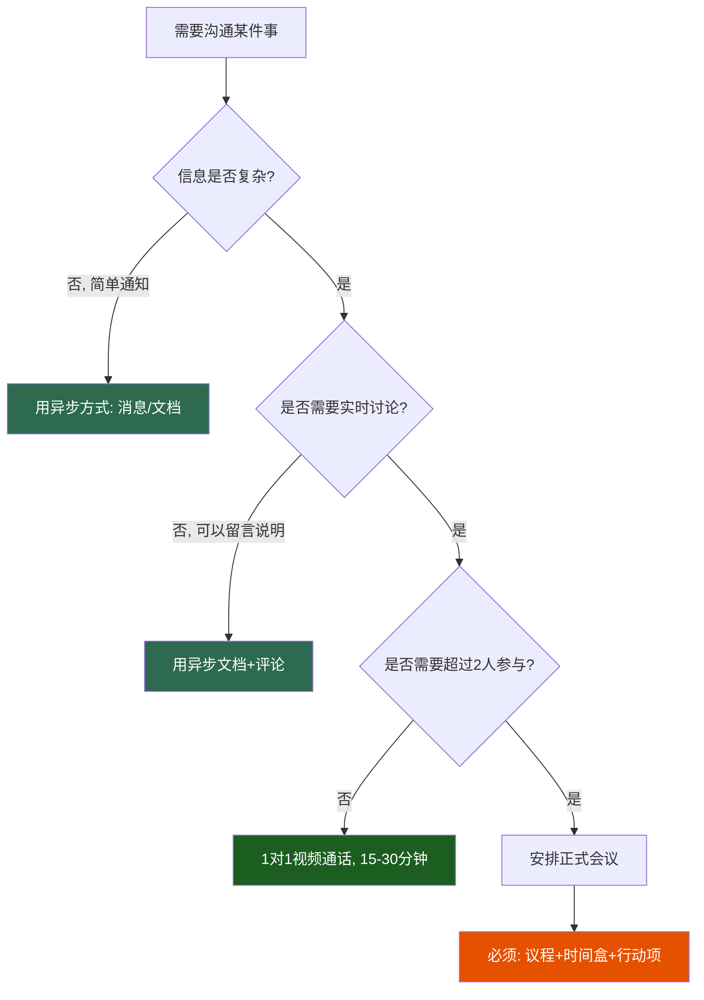

## 十、远程办公沟通最佳实践

远程办公不是把线下办公搬到线上那么简单。当团队成员分布在不同时区、使用不同工具、在不同环境下工作时，沟通的底层逻辑发生了根本性变化。本节从理论框架出发，系统讲解远程团队如何建立高效的沟通机制，涵盖沟通节奏设计、异步协作方法、会议效率提升、信任文化建设、工具选型、常见误区等核心议题。

### 10.1 远程沟通的底层逻辑

#### 10.1.1 信息丰富度理论与远程沟通

Daft 和 Lengel 提出的**信息丰富度理论（Information Richness Theory）**指出，不同沟通渠道传递信息的能力存在显著差异。面对面沟通是最丰富的渠道——它同时传递语言、语调、表情、肢体语言和环境线索；而电子邮件是最贫乏的渠道之一，只能传递文字。

远程办公的核心挑战在于：**大多数日常沟通被迫从高丰富度渠道迁移到低丰富度渠道**。当你在 Slack 上发一条消息时，对方看不到你的表情，听不到你的语气，无法判断你是在开玩笑还是在表达不满。这种信息缺失会导致误判、摩擦和信任损耗。


**核心原则：选择与信息复杂度匹配的渠道。** 简单通知用异步消息，复杂讨论用视频会议，重要决策用文档记录。渠道选错的代价远比你想象的大——一条需要来回20条消息才能澄清的问题，一个5分钟的视频通话就能解决。

#### 10.1.2 同步与异步的平衡

远程沟通最大的认知误区是：**以为所有沟通都必须实时进行。** 事实上，GitLab（全球最大的全远程公司，2000+员工分布在65个国家）的核心沟通哲学是"异步优先（Async-first）"。

| 维度 | 同步沟通 | 异步沟通 |
|------|----------|----------|
| **定义** | 双方同时在线，实时交互 | 发送后对方在方便时回复 |
| **典型场景** | 视频会议、电话、实时聊天 | 文档、邮件、工单、PR评论 |
| **优势** | 即时反馈、情感连接、快速决策 | 深度思考、跨时区协作、可追溯 |
| **劣势** | 打断专注、时区限制、信息丢失 | 反馈延迟、可能产生误解 |
| **适用场景** | 紧急问题、头脑风暴、冲突调解、1对1 | 状态更新、代码审查、方案讨论、决策记录 |

**经验法则：** 如果一条消息可以等2小时再回复，它就应该是异步的。如果等2小时会造成实质性损失，才需要同步。

### 10.2 沟通节奏设计

没有节奏的远程团队会陷入两个极端：要么信息过载（每天50条@所有人），要么信息真空（几天不知道队友在做什么）。好的沟通节奏像心跳——有规律、有强度、有间歇。

#### 10.2.1 每日节奏

每日沟通节奏（推荐模板）：
├── 09:00-09:15  异步日报
│   ├── 在飞书/Notion/Slack提交
│   ├── 今日计划（3条以内核心任务）
│   ├── 昨日完成事项
│   └── 阻塞/需要帮助的事项
├── 09:30-09:45  15分钟站会（仅同步紧急事项）
│   ├── 严格15分钟，超时转入专项讨论
│   ├── 每人发言不超过2分钟
│   └── 仅讨论阻塞项和协调事项，不汇报进度
├── 工作中  即时消息
│   ├── 非紧急事务用异步方式（标记"不紧急"标签）
│   ├── 紧急事务标注[紧急]前缀
│   └── 设置专注时间段，关闭通知
├── 17:30-17:45  异步日报（收尾）
│   ├── 今日完成事项
│   └── 明日计划预览
└── 按需    1对1视频沟通
    └── 每周至少一次，30分钟

**关键细节：** 站会不是汇报会。很多远程团队把站会变成了每个人轮流念自己的任务列表，这完全是浪费时间。站会的核心价值是**暴露阻塞和协调依赖**。如果某人没有任何阻塞，一句"一切正常，继续推进"就够了。

#### 10.2.2 每周节奏

每周沟通节奏：
├── 周一 10:00   周度计划文档
│   ├── 团队目标对齐
│   ├── 本周关键任务分配
│   └── 跨团队依赖确认
├── 周三 14:00   团队同步会（视频，45分钟）
│   ├── 前15分钟：进度速览
│   ├── 中间20分钟：核心议题深度讨论
│   └── 后10分钟：行动项确认与下周预览
├── 周五 16:00   周度回顾文档
│   ├── 本周成果总结
│   ├── 遇到的问题与解决方案
│   └── 下周计划预览
└── 按需    跨团队协调会
    └── 提前24小时发送议程

#### 10.2.3 每月与每季度节奏

- **月初（第1个工作日）**：月度OKR设定，不超过3个目标，每个目标3个关键结果
- **月中（第15日）**：月度进度回顾，识别偏差并调整
- **月末（最后1个工作日）**：月度总结与下月计划
- **每季度**：线下团建（强烈建议）。Buffer（全远程公司）的数据显示，每季度线下聚会的团队，员工满意度比纯线上团队高23%，离职率低17%

### 10.3 异步沟通的实操方法

异步沟通是远程团队的命脉，但大多数团队做不好。最常见的问题是：写出来的信息别人看不懂，或者信息散落在各处无法追溯。

#### 10.3.1 异步沟通的SMART文档法

每一条重要的异步沟通都应该遵循SMART结构：

| 要素 | 含义 | 示例 |
|------|------|------|
| **S**pecific（具体） | 不说"优化性能"，说"将首页加载时间从3.2s降到1.5s" | "将API响应时间P99从800ms降到200ms" |
| **M**easurable（可衡量） | 有明确的判断标准 | "用户注册转化率从12%提升到18%" |
| **A**ctionable（可行动） | 收到的人知道该做什么 | "请在周五前完成XX方案的评审" |
| **R**ecorded（有记录） | 信息留在可追溯的地方 | 在Notion页面而非Slack私聊中讨论 |
| **T**ime-bound（有时限） | 明确截止时间和期望回复时间 | "希望在明天下午3点前收到反馈" |

#### 10.3.2 异步决策框架

远程团队的一个常见痛点是决策推进缓慢。推荐使用**DACI决策框架**来加速异步决策：

- **D（Driver）**：推动者，负责收集信息、推动决策、确保执行
- **A（Approver）**：审批者，最终拍板的人（通常只有1人）
- **C（Contributors）**：贡献者，提供输入和专业意见
- **I（Informed）**：知会者，决策做出后通知的人

异步决策流程模板：
━━━━━━━━━━━━━━━━━━━━━━━━━━━━━━
决策主题：[简明描述]
推动者：[@姓名]
审批者：[@姓名]
截止日期：[YYYY-MM-DD HH:MM]

背景：
[为什么需要做这个决策，不超过3段]

方案选项：
A. [方案名称] — 优点/缺点/风险
B. [方案名称] — 优点/缺点/风险
C. [方案名称] — 优点/缺点/风险

我的建议：[推荐方案及理由]

需要各位贡献者在 [日期] 前反馈：
1. 你倾向哪个方案？
2. 有没有遗漏的选项或风险？
━━━━━━━━━━━━━━━━━━━━━━━━━━━━━━

#### 10.3.3 状态更新的标准化

不要让团队成员每天绞尽脑汁想"日报写什么"。提供标准化模板：

```markdown
## 日报 - [姓名] - [日期]

### ✅ 完成
- 用户认证模块重构完成，PR #234 已提交review
- 修复了订单页面的分页bug（issue #567）

### 🚧 进行中
- 支付接口对接（预计明天完成）
- 性能测试报告编写（进度60%）

### 🚫 阻塞
- 需要运维团队提供生产环境的API密钥（已@运维组，等待中）

### 💡 备注
- 发现支付回调接口文档有歧义，已联系第三方确认
```

### 10.4 远程会议的效率提升

远程会议是成本最高的沟通形式。6个人开1小时的会，实际消耗的是6个人小时。如果这个会没有产出，那就是6个人小时的浪费。

#### 10.4.1 会前：能不开会就不开会

**判断是否需要开会的决策树：**



**会前准备清单：**

- [ ] 会议目的是否明确？（"同步进度"不是目的，"决定是否采用方案A"才是）
- [ ] 议程是否提前24小时发送？
- [ ] 参会人员是否都是必要的？（亚马逊的"两个披萨原则"：参会人数不超过两个披萨能喂饱的人数，通常6-8人）
- [ ] 准备材料是否提前发送并留出阅读时间？
- [ ] 会议时间是否考虑了所有参会者的时区？（推荐使用World Time Buddy工具）
- [ ] 技术设备是否测试过？（摄像头、麦克风、屏幕共享）

#### 10.4.2 会中：严格时间管理

| 技巧 | 具体做法 | 效果 |
|------|----------|------|
| **时间盒（Timeboxing）** | 每个议题设定时间上限，用计时器倒计时 | 防止讨论发散，一个1小时的会通常能压缩到40分钟 |
| **指定主持人** | 非议题负责人担任主持人，控制节奏 | 让参与者专注内容，而非操心流程 |
| **实时记录员** | 每次会议指定一人做会议纪要 | 确保决策和行动项不遗漏 |
| **摄像头策略** | 鼓励打开摄像头，但不强制 | 提高参与感和注意力，但尊重个人隐私 |
| **举手机制** | 使用平台的举手功能，避免多人同时说话 | 解决远程会议中最常见的"抢话"问题 |
| **停车板（Parking Lot）** | 记录偏离议题的讨论点，会后单独处理 | 保持会议聚焦，不丢失有价值的想法 |

**数字白板的使用：** Miro、FigJam、飞书白板等工具可以将讨论可视化。当团队在讨论方案选择时，把选项列在白板上，用便利贴收集意见，比纯口述高效得多。

#### 10.4.3 会后：30分钟黄金窗口

会议结束后30分钟内，必须完成以下事项：

1. **发送会议纪要**：包含参会人、讨论要点、决策结果、行动项
2. **行动项格式**：`[负责人] [具体事项] [截止日期]`，例如：`@张三 完成支付接口对接方案文档 周五前`
3. **会议录音**：如果平台支持，自动录制并分享给未能参会的人
4. **后续跟进**：指定一人在截止日期前检查行动项完成情况

```markdown
## 会议纪要模板

**会议主题：** [主题]
**时间：** [YYYY-MM-DD HH:MM-HH:MM]
**参会人：** [姓名列表]
**缺席者：** [姓名及原因]

### 讨论要点
1. [议题1]：[讨论内容摘要]
2. [议题2]：[讨论内容摘要]

### 决策结果
- 决定采用方案A，原因是...
- 暂缓方案B的讨论，待XX条件成熟后再议

### 行动项
| 负责人 | 事项 | 截止日期 | 状态 |
|--------|------|----------|------|
| @张三 | 完成方案A的技术设计文档 | 6/30 | 待开始 |
| @李四 | 联系第三方确认API限制 | 6/28 | 待开始 |

### 下次会议
- 时间：[日期]
- 预设议题：[议题预告]
```

### 10.5 远程团队的信任建设

信任是远程团队的基础设施。没有信任，异步沟通会变成互相监控，会议会变成表演汇报。建设信任需要系统性的方法，不能指望偶尔的团建活动。

#### 10.5.1 信任的四个维度

| 维度 | 含义 | 建设方法 |
|------|------|----------|
| **能力信任** | 相信队友能完成工作 | 明确职责、展示专业成果、代码review互评 |
| **意图信任** | 相信队友的动机是好的 | 透明沟通、默认正面解读、了解个人背景 |
| **契约信任** | 相信队友会遵守承诺 | 按时交付、及时沟通延迟、承诺管理 |
| **情感信任** | 感到安全、可以坦诚 | 虚弱时刻的接纳、非工作交流、庆祝与关怀 |

#### 10.5.2 六个信任建设实践

**1. 定期1对1视频沟通**

管理者与每位团队成员每周进行一次30分钟的1对1视频通话。这不是工作汇报会，而是了解对方的状态、困难和成长需求。推荐议程：
- 前10分钟：个人状态（最近怎么样？有什么开心或困扰的事？）
- 中10分钟：工作进展与障碍（需要什么帮助？）
- 后10分钟：成长与发展（想学什么？职业规划？）

**2. 虚拟咖啡时间（Virtual Coffee）**

使用Donut（Slack插件）或类似工具，每周随机配对两名团队成员进行15分钟的非工作闲聊。Buffer公司的数据显示，定期虚拟咖啡时间的团队，成员之间的信任评分高出31%。话题可以包括：最近看的电影、周末计划、宠物照片、家乡美食。

**3. 共享个人空间**

在团队频道中设置"生活分享"专区。鼓励成员分享：工作环境照片、午餐照片、旅行经历、兴趣爱好。这看似无关紧要，实际上是建立情感连接的重要途径。人不是机器，了解队友是一个"人"有助于在工作中给予更多理解和包容。

**4. 庆祝成就与里程碑**

公开表彰优秀表现。具体做法：
- 每周五设置"感谢时刻"，每人感谢一位帮助过自己的队友
- 项目里程碑达成时发送团队贺信
- 生日和工作周年纪念日送上祝福
- 使用Bonusly等peer-to-peer奖励工具

**5. 透明决策（Default to Transparency）**

GitLab的公司文化核心是"默认透明"。所有文档、会议纪要、决策过程默认对全员可见。这减少了"信息就是权力"的政治游戏，让每个人都能了解决策的背景和逻辑。具体做法：
- 重要决策在公开频道讨论，而非私聊
- 使用ADR（Architecture Decision Records）记录技术决策
- 管理层周报对全员公开

**6. 线下聚会（Offsite）**

每季度至少一次线下团建，每次2-3天。内容包括：工作坊、战略讨论、团建活动、自由社交。Automattic（WordPress母公司，全远程公司）每年组织一次全员线下聚会（Grand Meetup），被认为是公司文化最重要的投资之一。

### 10.6 工具选型与配置

远程沟通工具不是越多越好。工具过多会导致信息碎片化——A消息在Slack，B文档在Notion，C任务在Jira，D代码在GitHub，E设计在Figma。关键是建立清晰的"工具职责分工"。

#### 10.6.1 工具矩阵

| 沟通需求 | 推荐工具 | 备选 | 使用规范 |
|----------|----------|------|----------|
| **即时消息** | Slack / 飞书 / 企业微信 | Discord / Teams | 频道命名规范、@使用规范、通知策略 |
| **视频会议** | Zoom / 腾讯会议 / 飞书 | Google Meet / Teams | 录制策略、背景虚化、静音礼仪 |
| **文档协作** | Notion / 飞书文档 | Confluence / 语雀 | 文档模板、版本管理、权限控制 |
| **项目管理** | Jira / Linear / 飞书项目 | Trello / Asana | 工作流定义、标签体系、自动化 |
| **代码协作** | GitHub / GitLab | Gitee / Bitbucket | PR规范、Review流程、分支策略 |
| **设计协作** | Figma | 蓝湖 / MasterGo | 评审流程、版本管理、交付规范 |
| **白板** | Miro / FigJam | 飞书白板 / boardmix | 模板库、会议记录、异步协作 |

#### 10.6.2 通知管理策略

远程工作者最大的生产力杀手是**通知过载**。推荐分层通知策略：

通知优先级分层：
├── 🔴 P0 紧急（立即通知，震动+铃声）
│   ├── 生产环境故障
│   ├── 安全事件
│   └── 直接@我且标注[紧急]
├── 🟡 P1 重要（静默推送，1小时内查看）
│   ├── 直接@我的消息
│   ├── 我负责的PR有review评论
│   └── 日程提醒
├── 🟢 P2 普通（应用图标角标，每天查看2-3次）
│   ├── 频道消息（未@我）
│   ├── 文档评论
│   └── 任务状态更新
└── ⚪ P3 低优（关闭通知，主动查看）
    ├── 全员公告
    ├── 社交频道
    └── 非我参与的讨论

**实操建议：** 设置"专注时间"（通常每天2-3个时段，每次1-2小时），在此期间关闭所有非P0通知。在状态中设置"专注中，紧急请打电话"。Slack/飞书都支持定时勿扰模式。

### 10.7 跨时区协作

当团队分布在3个以上时区时，沟通难度呈指数级上升。以下是经过验证的跨时区协作策略。

#### 10.7.1 重叠时间窗口

找出所有团队成员的共同在线时间窗口（通常2-4小时），将所有同步沟通安排在这个窗口内。例如：

团队分布：
├── 北京（UTC+8）  工作时间 09:00-18:00
├── 东京（UTC+9）  工作时间 09:00-18:00
├── 柏林（UTC+1）  工作时间 09:00-18:00
└── 纽约（UTC-5）  工作时间 09:00-18:00

重叠窗口：
├── 北京/东京 17:00-18:00 = 柏林 10:00-11:00 = 纽约 04:00-05:00（不可行）
└── 最佳方案：北京/东京 09:00-10:00 = 柏林 前一天 02:00-03:00 = 纽约 前一天 20:00-21:00
    → 实际上需要轮换不便时间，不能总是让同一时区的人牺牲

#### 10.7.2 时区公平原则

- **轮换会议时间**：如果固定一个时区的不方便时间，按月轮换
- **异步优先**：跨时区的讨论默认用异步文档，只在必要时安排同步会议
- **录制一切**：跨时区会议必须录制，让错过的人能在自己的工作时间回看
- **24小时响应规则**：异步消息发出后，接收方应在24小时内回复（至少一个确认收到的反应）

### 10.8 远程沟通的常见误区

#### 误区一：用消息数量衡量参与度

**错误做法：** 在Slack上活跃的人被认为"工作积极"，沉默的人被认为"摸鱼"。

**正确理解：** 远程工作中的深度专注（Deep Work）需要大段不被打断的时间。最优秀的工程师往往是消息最少的人——因为他们把时间花在了写代码上，而不是在频道里聊天。衡量参与度应该看产出质量，不是消息数量。

#### 误区二：把所有沟通搬到视频会议

**错误做法：** 每天5-6个视频会议，每个30-60分钟，实际工作时间只剩2-3小时。

**正确理解：** 视频会议应该是最后手段，不是第一选择。先问"这个问题能不能用一条消息或一个文档解决？"。Shopify在2023年进行了"会议清算"——删除了所有定期会议，要求每个会议重新申请才能恢复，结果减少了33%的会议时间。

#### 误区三：缺乏沟通边界

**错误做法：** 凌晨12点在群里@人，期望立即回复；周末发送工作消息。

**正确理解：** 远程办公不等于24小时在线。建立明确的沟通边界：
- 设置团队的"核心在线时间"（如10:00-16:00），核心时间内期望及时响应
- 核心时间外的消息默认不要求即时回复
- 使用定时发送功能，把非工作时间的消息延后到工作时间发送
- 在个人状态中标注工作时间

#### 误区四：忽视文档沉淀

**错误做法：** 所有讨论都在即时消息中进行，信息随着消息流滚动消失。

**正确理解：** 即时消息是"用完即弃"的沟通载体。任何有长期价值的信息——决策、方案、流程、规范——都应该沉淀到文档系统中。Notion、飞书文档、Confluence等工具的价值不在于实时沟通，而在于知识积累。一个新人入职时，能通过文档了解过去所有重要决策的来龙去脉，这才是远程团队的知识资产。

#### 误区五：过度监控

**错误做法：** 安装截屏监控软件、要求每小时汇报进度、追踪鼠标活动。

**正确理解：** 监控摧毁信任。当员工知道自己被监控时，他们会花更多精力"看起来在工作"而非真正工作。替代方案是：明确产出目标、定期检查里程碑、建立透明的进度看板。GitLab的做法是——你不需要知道员工是否在电脑前，你只需要知道他们的工作是否按时交付。

### 10.9 远程沟通的进阶策略

#### 10.9.1 沟通契约（Communication Charter）

为团队制定一份沟通契约，明确约定沟通的规则和期望：

```markdown
## 团队沟通契约 v1.0

### 渠道使用规范
- 日常沟通：飞书群聊（响应时间：核心工作时间内2小时）
- 任务协作：Jira看板（每日更新状态）
- 文档沉淀：Notion（所有决策和方案必须有文档记录）
- 代码协作：GitHub（PR review 24小时内完成）
- 紧急事项：电话（仅限生产故障和安全事件）

### 会议规范
- 所有会议必须有议程，提前24小时发送
- 会议默认时长30分钟，最长不超过60分钟
- 会议必须有纪要，30分钟内发出
- 可以拒绝没有议程的会议邀请

### 响应期望
- @我的消息：核心时间内2小时回复
- 非@我的消息：不要求即时回复
- 非工作时间的消息：下一个工作日回复

### 通知策略
- 核心工作时间（10:00-16:00）：保持在线
- 专注时间（每人每天至少2小时）：关闭通知
- 非工作时间：勿扰模式
```

#### 10.9.2 远程入职（Remote Onboarding）

新成员入职远程团队的前两周至关重要。推荐的入职流程：

- **第1天**：IT设备配置、工具账号开通、导师（Buddy）介绍
- **第1周**：阅读团队沟通契约、项目文档、代码库概览；与团队核心成员进行1对1视频介绍
- **第2周**：完成1-2个小型任务、参加所有团队会议、提交第一份PR
- **第1个月**：独立负责一个功能模块、完成入职反馈问卷

**关键点：** 为新人指定一位入职导师（Buddy），不是直属上级，而是一位可以问"傻问题"的同伴。远程环境中，新人最大的困难是"不知道该问谁"和"不好意思打扰别人"。导师的存在降低了沟通的门槛。

#### 10.9.3 冲突的远程处理

远程环境中的冲突比线下更难处理，因为文字消息容易被误解，且缺乏面对面的温度。处理原则：

1. **文字冲突升级为语音**：当文字讨论出现情绪化迹象时，立即转为视频通话
2. **假设正面意图**：文字消息没有语气，默认对方是善意的
3. **私下处理**：不要在公开频道解决个人冲突
4. **使用"我"陈述**：说"我觉得这个方案有风险"而非"你的方案有问题"
5. **引入中立方**：如果双方无法达成一致，请第三方介入调解

### 10.10 本节小结

远程办公沟通的核心不是工具，而是**机制和习惯**。好的远程沟通需要：

- **节奏**：日/周/月的沟通节奏，像心跳一样规律
- **异步优先**：能异步就异步，同步会议是最后手段
- **文档沉淀**：所有有价值的信息必须沉淀到文档系统
- **信任建设**：通过透明、关怀、线下聚会系统性建设信任
- **边界管理**：明确沟通边界，尊重个人专注时间和休息时间
- **持续优化**：定期回顾沟通效果，收集团队反馈，迭代改进

记住：远程团队沟通的终极目标不是"信息传递"，而是**让每个人都能在最好的状态下做最好的工作**。当沟通机制设计得当，远程团队的生产力可以超过同地办公团队——GitLab、Automattic、Buffer等公司已经证明了这一点。
