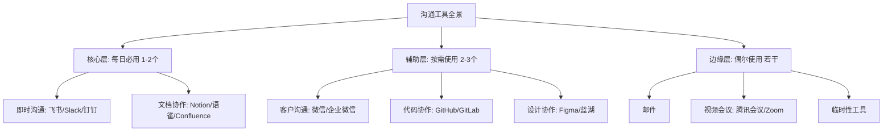
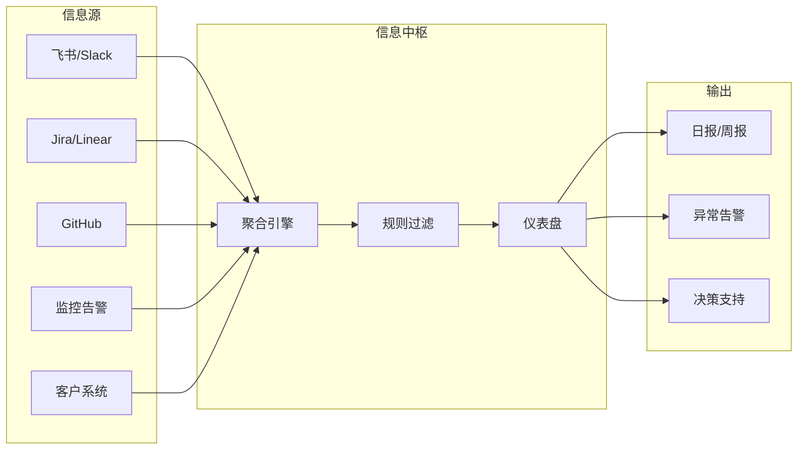
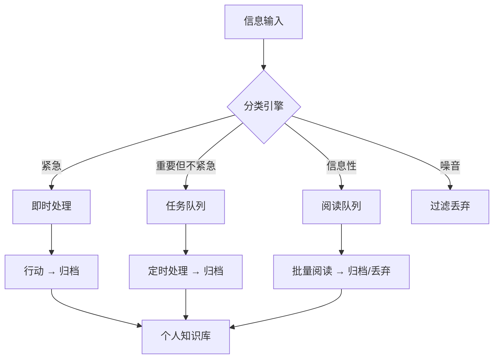

## 十一、跨平台沟通整合策略

现代职场人的沟通工具清单正在失控：微信处理日常沟通和客户关系，飞书或钉钉承载内部协作，Slack对接海外团队，邮件处理正式事务，GitHub管理代码评审，Notion沉淀文档，Figma协调设计，Jira追踪任务……一个人同时活跃在5-8个平台是常态，10个以上也不罕见。信息碎片化不是工具太多造成的，而是缺乏系统性的整合策略。本章从信息架构、工具分工、自动化集成、注意力管理四个维度，构建一套可落地的跨平台沟通整合方案。

### 11.1 信息碎片化的本质与代价

#### 11.1.1 碎片化的三种表现

信息碎片化并非简单的"消息太多"，它有三种典型表现：

**上下文割裂**：同一个项目的信息分散在三个平台。产品需求在Notion，技术讨论在飞书群，设计评审在Figma评论区。要理解一个决策的来龙去脉，需要在三个工具间反复跳转，每次都丢失上下文。

**注意力断裂**：每切换一次平台，大脑需要15-23分钟才能重新进入深度工作状态（Gloria Mark，加州大学尔湾分校研究）。如果一天切换平台20次，理论上你已经失去了5-8小时的深度工作能力。

**决策信息丢失**：关键决策往往在即时消息中产生，但即时消息的生命周期极短。三个月后没人记得当初为什么选择了方案A而不是方案B，因为那段对话已经被几百条新消息淹没了。

#### 11.1.2 碎片化的真实成本

以下是一个典型中层管理者的时间分配分析：

| 活动 | 日均耗时 | 其中碎片化导致的额外耗时 |
|------|---------|------------------------|
| 查看各平台消息 | 45分钟 | +20分钟（切换+回忆上下文） |
| 寻找历史信息 | 30分钟 | +15分钟（不确定信息在哪个平台） |
| 重复传递信息 | 25分钟 | +15分钟（跨平台搬运） |
| 处理通知干扰 | 40分钟 | +25分钟（不相关通知打断工作） |
| **合计** | **140分钟** | **+75分钟（约35%的工作时间）** |

每天损失超过1小时在纯粹的信息管理开销上，这还不包括因上下文不完整导致的决策质量下降。

### 11.2 工具分层架构：核心-辅助-边缘模型

#### 11.2.1 三层分类法

解决碎片化的第一步不是找更好的聚合工具，而是建立清晰的工具分层。每个工具应该有明确的角色定位：



**核心层**是你每天打开的第一个和最后一个工具，承载80%的工作沟通。选择标准：团队覆盖率最高、功能最全面、与工作流集成最深。

**辅助层**处理特定领域的专业沟通，每天使用但不作为主要信息流入口。

**边缘层**是低频但不可替代的工具，如正式邮件、外部会议等。

#### 11.2.2 工具选择的决策矩阵

选择核心平台时，用以下矩阵评估：

| 评估维度 | 权重 | 飞书 | 钉钉 | Slack | 企业微信 |
|---------|------|------|------|-------|---------|
| 团队覆盖率 | 30% | 8 | 7 | 5 | 9 |
| 文档协作能力 | 20% | 9 | 6 | 4 | 5 |
| 第三方集成 | 15% | 8 | 7 | 9 | 6 |
| 搜索能力 | 15% | 8 | 6 | 9 | 5 |
| 自动化支持 | 10% | 8 | 7 | 9 | 6 |
| 外部协作 | 10% | 7 | 5 | 8 | 8 |
| **加权总分** | **100%** | **8.0** | **6.5** | **6.6** | **6.7** |

评分说明：以上为示例评分，实际选择需根据你的团队环境调整权重。核心原则是——不要追求"最好的工具"，而是追求"团队能统一使用的工具"。一个覆盖率100%的80分工具，远好于覆盖率30%的100分工具。

#### 11.2.3 常见的工具分工方案

**方案A：国内互联网团队**

| 层级 | 工具 | 职责 |
|------|------|------|
| 核心 | 飞书 | 即时沟通、文档、项目管理、审批 |
| 辅助 | 企业微信 | 客户沟通、外部合作方 |
| 辅助 | GitHub | 代码协作、技术评审 |
| 边缘 | 邮件 | 正式通知、合同往来 |
| 边缘 | 腾讯会议 | 视频会议 |

**方案B：跨国远程团队**

| 层级 | 工具 | 职责 |
|------|------|------|
| 核心 | Slack | 即时沟通、集成中枢 |
| 核心 | Notion | 文档、知识库、项目管理 |
| 辅助 | GitHub | 代码协作 |
| 辅助 | Linear/Jira | 任务追踪 |
| 边缘 | Zoom | 视频会议 |
| 边缘 | 邮件 | 外部沟通 |

**方案C：自由职业者/小团队**

| 层级 | 工具 | 职责 |
|------|------|------|
| 核心 | 微信 | 80%沟通 |
| 核心 | 飞书文档 | 文档协作 |
| 辅助 | 邮件 | 正式事务 |
| 边缘 | 腾讯会议 | 客户会议 |

### 11.3 信息流转协议

工具分层解决了"用什么"的问题，信息流转协议解决"信息怎么走"的问题。

#### 11.3.1 信息发布三原则

**单一信源原则**：每条信息只在一个平台创建原始版本，其他平台通过链接引用。违反这条原则的典型场景：同一篇文档在微信群发一次、在飞书群发一次、邮件又发一次，后续修改只改了其中一处，导致版本混乱。

正确做法：
1. 文档在 Notion 创建 → 生成链接
2. 飞书群发通知 + Notion 链接
3. 需要邮件通知的，邮件正文写摘要 + Notion 链接
4. 所有讨论和修改集中在 Notion 进行

错误做法：
1. 文档在 Notion 创建
2. 复制全文到微信群
3. 复制全文到邮件
4. Notion 更新后，微信群和邮件的版本过时

**层级通知原则**：信息的紧急程度决定通知渠道。

| 紧急程度 | 通知方式 | 响应期望 | 典型场景 |
|---------|---------|---------|---------|
| 紧急（P0） | 电话 + 核心平台@ | 5分钟内 | 线上事故、客户投诉 |
| 重要（P1） | 核心平台@ | 30分钟内 | 需要今天决策的事项 |
| 一般（P2） | 核心平台消息 | 当天回复 | 常规协作 |
| 低（P3） | 文档/任务系统 | 1-3天 | 信息同步、非紧急反馈 |

**闭环确认原则**：跨平台信息必须有确认机制。在A平台发送的信息，如果需要B平台的人响应，必须在A平台收到确认才算闭环。

#### 11.3.2 信息归档流程

建立固定的归档节奏，而不是"有空再整理"（你永远不会有空）：

**每日（5分钟）**：
- 将当天即时消息中的关键决策截图或复制到文档系统
- 将待办事项从聊天记录提取到任务管理工具

**每周（30分钟）**：
- 整理本周各平台的重要信息到周报或知识库
- 清理已完结的群聊和临时频道
- 检查是否有信息只存在于某个平台而未归档

**每月（1小时）**：
- 审视工具使用情况，是否有平台可以退出
- 检查归档文档的组织结构是否合理
- 备份关键信息（特别是平台可能停止服务的风险）

#### 11.3.3 信息检索策略

当需要找回某条信息时，按以下顺序检索：

1. 明确信息类型 → 选择最可能的平台
   - 代码相关 → GitHub/GitLab
   - 设计决策 → Figma + 设计群
   - 产品需求 → Notion/Jira
   - 日常讨论 → 核心即时通讯

2. 使用平台内搜索（先试精确关键词，再试模糊搜索）

3. 如果不确定在哪个平台 → 使用跨平台搜索工具
   - Raycast（Mac）全局搜索
   - Alfred + Workflow
   - 各平台 CLI 工具（slack-cli, notion-cli 等）

4. 如果仍找不到 → 问当时参与的人（最后手段）

### 11.4 自动化集成：让信息自己流动

手动在平台间搬运信息是最低效的做法。通过自动化工具建立平台间的"管道"，让信息按规则自动流转。

#### 11.4.1 常见集成场景

**场景1：GitHub PR通知→飞书/Slack**

当代码仓库有新PR或PR被合并时，自动发送通知到团队频道。

```yaml
# GitHub Webhook 配置示例
# 或使用 GitHub Actions
name: Notify on PR
on:
  pull_request:
    types: [opened, closed, review_requested]
jobs:
  notify:
    runs-on: ubuntu-latest
    steps:
      - name: Send to Feishu
        uses: foxundermoon/feishu-action@v2
        with:
          url: ${{ secrets.FEISHU_WEBHOOK }}
          msg_type: interactive
          content: |
            PR ${{ github.event.pull_request.title }}
            状态: ${{ github.event.pull_request.state }}
            链接: ${{ github.event.pull_request.html_url }}
```

**场景2：Jira/Linear任务状态变更→核心沟通平台**

任务从"进行中"变为"待评审"时，自动通知相关评审人。

**场景3：客户微信消息→内部工单系统**

通过企业微信API，将客户消息自动同步到内部工单系统，避免信息在微信中沉没。

**场景4：会议纪要自动分发**

视频会议结束后，自动将会议录制、纪要、待办事项分发到相关群组和任务系统。

#### 11.4.2 集成工具对比

| 工具 | 适用场景 | 技术门槛 | 成本 | 特点 |
|------|---------|---------|------|------|
| Zapier | 通用SaaS集成 | 低 | $20/月起 | 5000+应用模板，可视化配置 |
| Make(Integromat) | 复杂流程 | 中 | $9/月起 | 流程可视化更强，逻辑分支更灵活 |
| n8n | 自部署、技术团队 | 中高 | 免费(自部署) | 开源，可自部署，数据不出内网 |
| 飞书开放平台 | 飞书生态 | 中 | 免费 | 飞书原生集成，机器人+Webhook |
| 钉钉开放平台 | 钉钉生态 | 中 | 免费 | 钉钉原生集成，连接器市场 |
| 自建Webhook | 定制需求 | 高 | 仅开发成本 | 完全可控，适合有开发能力的团队 |

#### 11.4.3 自动化集成的实施路径

不要一开始就追求全面集成。按以下优先级逐步推进：

**第一阶段（第1周）**：通知聚合
- 将各平台的通知统一推送到核心平台的一个频道
- 实现：各平台Webhook → 核心平台通知频道

**第二阶段（第2-3周）**：任务同步
- 实现跨平台任务状态同步（如GitHub Issue ↔ Jira ↔ 飞书任务）
- 实现：双向Webhook + 状态映射

**第三阶段（第4周+）**：智能路由
- 根据消息内容自动判断应该推送到哪个频道、通知哪个人
- 实现：消息分类规则 + 条件路由

### 11.5 注意力管理与通知策略

跨平台沟通最大的敌人不是信息量，而是通知对注意力的侵蚀。

#### 11.5.1 通知分层配置

对每个平台的通知进行精细配置，而不是简单的"开"或"关"：

**核心平台通知设置**：
- @我：即时通知（声音+弹窗）
- 所在频道的消息：静默推送（仅角标）
- 其他频道：完全关闭

**辅助平台通知设置**：
- @我：静默推送
- 其他：完全关闭
- 每天固定2-3个时间段集中查看

**边缘平台通知设置**：
- 全部关闭
- 每天查看1次或需要时主动打开

#### 11.5.2 专注时间保护

每日时间块模板：

09:00-09:15  信息扫描（快速浏览各平台未读，标记需处理的）
09:15-11:30  深度工作（关闭所有通知，仅保留电话作为紧急通道）
11:30-12:00  消息处理（集中回复上午积累的消息）
14:00-14:15  信息扫描
14:15-16:30  深度工作
16:30-17:00  消息处理 + 归档
17:00-17:30  跨平台信息同步（将今天的重要信息归档到文档系统）

关键原则：**批量处理消息，而不是实时响应每一条**。除非你的角色要求实时响应（如运维值班、客户支持），否则延迟30分钟回复一条消息几乎不会产生任何负面影响，但被打断30分钟的深度工作会产生巨大损失。

#### 11.5.3 减少不必要的平台切换

平台切换的最大诱因是"不确定信息在哪个平台"。解决方案：

1. **约定频道规则**：团队约定什么类型的信息在什么平台发布，形成肌肉记忆
2. **使用全局搜索工具**：Mac的Spotlight/Alfred，Windows的Everything，或各平台的CLI工具
3. **设置固定查看时段**：不要随时打开所有平台，而是按时间表集中处理

### 11.6 团队级整合策略

个人的整合策略只能解决自己的问题，团队需要制度化的整合方案。

#### 11.6.1 团队沟通公约

每个团队应该有一份明确的沟通公约，至少包含：

```markdown
# 团队沟通公约（模板）

## 工具定义
- 主要沟通工具：[飞书/Slack/钉钉]
- 文档协作工具：[Notion/语雀/飞书文档]
- 任务管理工具：[Jira/Linear/飞书项目]
- 代码协作工具：[GitHub/GitLab]

## 信息发布规则
1. 所有正式决策必须在文档工具中有记录
2. 即时消息中的决策，24小时内同步到文档
3. 跨部门信息通过邮件或文档链接，不截图转发

## 响应时间约定
- @消息：30分钟内回复（工作时间）
- 普通消息：4小时内回复
- 非工作时间：次日10:00前回复

## 会议规范
- 会议必须有议程，提前24小时发送
- 会议纪要24小时内发布到文档系统
- 待办事项同步到任务管理工具

## 信息归档
- 每周五下午为"信息整理时间"
- 已完结项目的群聊归档并设置只读
- 重要文档在知识库中有索引页
```

#### 11.6.2 信息中枢架构

对于中大型团队，建议建立信息中枢——一个统一的信息仪表盘，汇聚各平台的关键信息：



信息中枢的实现方式：
- **轻量级**：用飞书多维表格或Notion数据库，通过API定时拉取各平台数据
- **中量级**：用n8n/Make搭建数据管道，配合Grafana展示
- **重量级**：自建Dashboard，对接各平台API，实时聚合

### 11.7 常见误区与纠正

**误区1："工具越多越高效"**

纠正：每增加一个工具，信息碎片化程度指数级上升。工具数量的最优解通常是"够用的最少数量"。一个团队同时使用飞书+钉钉+企业微信+Slack，不是"覆盖全面"，而是"自找麻烦"。

**误区2："把所有消息转发到一个平台就解决了"**

纠正：消息转发只是改变了信息的位置，没有改变信息的结构。无差别转发到一个频道的结果是那个频道变成信息垃圾场。正确的做法是按类型、按项目、按紧急程度分流。

**误区3："自动化可以解决一切"**

纠正：自动化能解决信息搬运问题，但不能解决信息质量问题。如果源头的信息本身就是混乱的，自动化只会更快地传播混乱。先建立规范，再自动化。

**误区4："通知全部关闭就能专注"**

纠正：完全关闭通知会导致遗漏重要信息，产生焦虑感，反而降低效率。正确的做法是精细配置——紧急的即时通知，重要的批量处理，不相关的永久关闭。

**误区5："个人不需要整合策略，公司统一就行"**

纠正：公司层面的工具统一只是基础。个人还需要建立自己的信息管理习惯——如何在统一的工具中高效检索、如何管理自己的注意力、如何建立个人知识库。公司给你飞书，但不会教你怎么用飞书不被消息淹没。

### 11.8 进阶：构建个人沟通操作系统

当基础的工具分层和信息流转已经内化后，可以进一步构建个人的"沟通操作系统"——一套自动化的信息管理流水线。

#### 11.8.1 个人信息流架构



#### 11.8.2 自动化工具链

一个实用的个人自动化工具链示例：

1. **IFTTT/n8n**：监控各平台关键事件（如被@、关键词出现）
2. **Todoist/滴答清单**：自动将跨平台待办汇总到统一任务列表
3. **Readwise/微信读书笔记**：自动同步各平台的标注和笔记
4. **Obsidian/Logseq**：个人知识库，汇聚所有平台的归档信息

#### 11.8.3 定期审视与优化

每季度花1小时审视你的跨平台沟通状况：

- 哪些平台你已经一周没打开过了？考虑退出
- 哪些自动化规则已经失效？修复或删除
- 哪些信息仍然在手动搬运？补充自动化
- 团队的沟通公约是否还在执行？推动更新
- 你的深度工作时间是否得到了保护？调整通知策略

整合策略不是一次性工程，而是持续优化的过程。随着团队规模变化、项目阶段切换、工具生态演进，你的整合方案也需要相应调整。关键是要有"审视-调整-验证"的习惯，而不是设好之后就放任不管。
