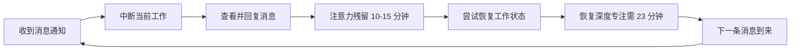
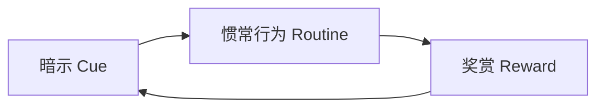
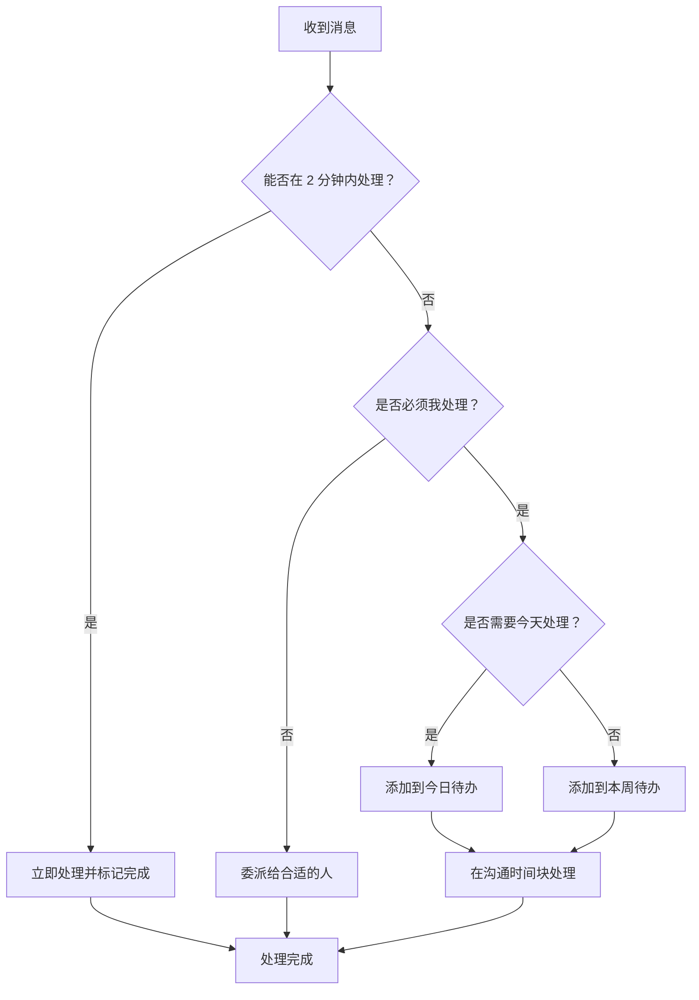
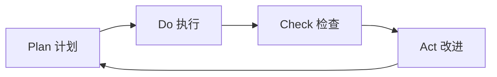

## 十三、数字沟通的个人效能

数字沟通已经成为现代人最核心的工作方式之一。然而，工具的便利性掩盖了一个残酷的事实：大多数人在数字沟通中投入了大量时间，却收获了极低的回报。研究数据显示，知识工作者平均每天花 2.5 小时处理邮件、1.8 小时在即时通讯工具上、1.2 小时在会议中，真正用于深度工作的时间不足 3 小时。问题不在于沟通工具本身，而在于缺乏系统化的个人效能管理。

本章从时间管理、习惯养成、信息过载应对、专注力保护、个人工作流设计、自动化提效、效能度量七个维度，构建一套完整的数字沟通个人效能体系。

### 13.1 沟通时间管理

#### 13.1.1 为什么需要专门管理沟通时间

人类大脑不具备真正的多任务处理能力。加州大学欧文分校的研究表明，从即时通讯中断恢复到原来的工作状态平均需要 23 分 15 秒。这意味着如果你每 20 分钟查看一次消息，你实际上从未真正进入过深度工作状态。

更隐蔽的问题是**注意力残留效应**（Attention Residue）：即使你只花了 30 秒回复一条消息，你的大脑在接下来的 10-15 分钟内仍然会分出一部分认知资源去想那条消息的内容。这种残留效应导致深度思考的质量持续下降，而你往往意识不到。



因此，沟通时间管理的核心目标不是"多处理消息"，而是**保护深度工作时间的同时高效完成必要沟通**。

#### 13.1.2 时间块划分法

时间块划分（Time Blocking）是将一天的时间划分为不同功能区间的管理方法。针对数字沟通，推荐以下结构：

| 时间块 | 功能定位 | 沟通行为 | 通知状态 |
|--------|---------|---------|---------|
| 08:30-09:00 | 沟通启动 | 扫描紧急消息、规划今日沟通任务 | 开启 |
| 09:00-11:30 | 深度工作第一段 | 仅处理标注为紧急的消息 | 关闭 |
| 11:30-12:00 | 沟通处理批次 | 批量回复累积消息、处理邮件 | 开启 |
| 12:00-13:30 | 午休 | 轻量浏览、非紧急消息延后 | 选择性 |
| 13:30-14:00 | 沟通处理批次 | 处理上午累积的非紧急消息 | 开启 |
| 14:00-16:00 | 深度工作第二段 | 仅处理标注为紧急的消息 | 关闭 |
| 16:00-16:30 | 沟通处理批次 | 批量回复、跟进待办事项 | 开启 |
| 16:30-17:00 | 沟通收尾 | 回顾今日沟通、规划明日事项 | 开启 |

**关键原则**：

- **批次处理**（Batching）：将消息回复集中在固定时间段，而非随到随回。研究表明，批次处理可以将沟通效率提升 40%，同时将注意力切换次数减少 60%。
- **紧急通道保留**：深度工作期间关闭大部分通知，但为真正紧急的渠道（如直属上级的直接消息）保留通知。
- **固定节奏感**：每天在相同时间处理消息，形成稳定的预期，让同事知道你的响应节奏。

#### 13.1.3 艾森豪威尔矩阵在消息分类中的应用

不是所有消息都值得同等对待。将艾森豪威尔矩阵适配到消息管理：

                    紧急                    不紧急
           ┌─────────────────────┬─────────────────────┐
    重要   │  立即处理            │  安排专门时间处理     │
           │  · 生产事故通知       │  · 战略规划讨论       │
           │  · 客户紧急投诉       │  · 项目复盘总结       │
           │  · 上级直接询问       │  · 能力提升学习       │
           ├─────────────────────┼─────────────────────┤
    不重要 │  快速委派或模板回复   │  批量处理或删除       │
           │  · 日常流程确认       │  · 群聊闲聊           │
           │  · 常规审批通知       │  · 营销推广信息       │
           │  · 信息抄送           │  · 已完成的讨论       │
           └─────────────────────┴─────────────────────┘

**实操建议**：为每个象限设置不同的通知策略和处理频率。重要且紧急的消息使用震动+声音提醒；重要不紧急的消息静默显示在待办列表中；不重要的消息关闭通知，集中在批次时间处理。

#### 13.1.4 深度工作的保护策略

卡尔·纽波特在《深度工作》中提出的四种深度工作模式，适用于不同性格和工作场景：

**模式一：修道院模式**——完全隔离数字沟通，适合需要长期专注的创作型工作。适用场景：写书、架构设计、深度研究。实践中一周安排 1-2 个"修道日"。

**模式二：双模式**——将时间分为"深度期"和"浅层期"，深度期以周为单位。适用场景：项目开发冲刺期。例如一周深度编码、一周集中沟通。

**模式三：节奏模式**——每天固定时段深度工作，形成习惯节奏。适用场景：大多数知识工作者。本节推荐的时间块划分即属于此模式。

**模式四：新闻记者模式**——随时切入深度工作，需要较高训练水平。适用场景：经验丰富且自控力极强的人。不推荐初学者使用。

**实操工具配置**：

```bash
# macOS: 使用"聚焦模式"自动在深度工作时段关闭通知
# 创建名为"深度工作"的专注模式
# 允许的通知：仅来自"紧急联系人"列表

# Windows: 使用"专注助手"
# 设置为"仅优先通知"

# 通用方案：使用手机的"屏幕使用时间"功能
# 在深度工作时段限制社交媒体和即时通讯应用
```

### 13.2 沟通习惯养成

#### 13.2.1 习惯回路模型

查尔斯·杜希格在《习惯的力量》中提出，所有习惯都遵循"暗示→惯常行为→奖赏"的回路。将这一模型应用到数字沟通习惯的养成中：



**设计良好沟通习惯的步骤**：

1. **识别暗示**：什么触发了你去查看消息？时间（每隔 15 分钟）、通知声、还是无聊感？理解暗示才能设计干预。
2. **设计惯常行为**：用高效行为替代低效行为。例如将"收到通知就查看"替换为"在固定批次时间统一处理"。
3. **设置即时奖赏**：完成一个批次的消息处理后，给自己一个小奖励（休息 5 分钟、喝杯咖啡），强化行为回路。

#### 13.2.2 每日核心习惯

以下五个每日习惯构成数字沟通效能的基石：

**习惯一：晨间沟通规划（5-10 分钟）**

每天开始工作的第一个 10 分钟，不处理任何消息，而是先做规划：
- 扫描所有渠道，识别今天必须处理的重要消息
- 评估需要回复的消息数量，预估所需时间
- 将沟通任务安排到当天的时间块中
- 标记 1-3 件需要主动发起的沟通事项

这个习惯的威力在于：将被动响应转变为主动规划，掌控沟通节奏而非被消息推着走。

**习惯二：先写草稿再发送**

对于超过三句话的消息，先在草稿区写好，检查以下四点后再发送：
- 目的是否明确？读者能否一眼看出需要做什么？
- 信息是否完整？是否缺少了对方需要知道的背景？
- 语气是否适当？是否可能被误解？
- 长度是否合理？能否更简洁？

**习惯三：消息"两分钟法则"**

借鉴 GTD 方法论：如果一条消息可以在两分钟内回复，立即处理；如果需要更长时间，将其添加到待办事项中，在专门的沟通时间块中处理。避免"先看后忘"的问题。

**习惯四：主动结束对话**

数字沟通中最常见的低效模式是"拖泥带水"——对话已经达成共识，但双方都不愿意明确结束。养成主动结束的习惯：
- 达成共识后发送总结："好的，那我们确认：A 负责 X，B 负责 Y，截止日期是 Z。如有变化再沟通。"
- 不需要回复的消息不回复。"收到""好的""谢谢"这类纯礼节性回复在数字沟通中是噪音。

**习惯五：每日沟通复盘（5 分钟）**

在一天工作结束前，花 5 分钟回顾：
- 今天有哪些沟通花了太多时间？原因是什么？
- 有哪些消息应该更早/更晚处理？
- 有没有遗漏的重要消息？
- 明天需要提前准备的沟通有哪些？

#### 13.2.3 每周沟通效能周期

将视野从每日提升到每周，建立周期性的沟通管理节奏：

| 星期 | 重点任务 | 时间投入 |
|------|---------|---------|
| 周一 | 制定本周沟通计划：梳理待跟进事项、预判本周重要沟通、安排深度工作时段 | 30 分钟 |
| 周二-周四 | 按照每日习惯执行，保持稳定的沟通节奏 | 每日 5 分钟规划 |
| 周五 | 本周沟通复盘：回顾效率指标、整理归档、识别改进点 | 30 分钟 |
| 周末 | 可选：清理非工作渠道的消息，为下周做好准备 | 15 分钟 |

#### 13.2.4 习惯养成的时间线与心理学

伦敦大学学院的研究表明，新习惯的自动化平均需要 66 天，而非流行的"21 天"说法。不同习惯的养成时间差异很大（18-254 天），取决于行为的复杂程度和个人差异。

**阶段一：刻意期（第 1-21 天）**

这个阶段需要高度自觉，每次执行都需要提醒自己。使用物理提醒物（如桌上的便利贴）或数字提醒（手机闹钟）。关键是不要追求完美——即使某天忘记了，第二天继续即可，不要因为一天的遗漏而放弃整个习惯。

**阶段二：过渡期（第 22-45 天）**

习惯开始变得稍微自然，但仍需有意识的维护。这个阶段最容易放弃，因为新鲜感消退但自动化尚未形成。解决方案是找到一个"问责伙伴"——和同事互相监督沟通习惯的执行。

**阶段三：自动化期（第 46-66 天及以上）**

习惯开始自动执行，不再需要强烈的意志力维持。但仍然建议每周检查一次，防止在压力大的时期退化。

**关键策略：习惯叠加**（Habit Stacking）

将新习惯附加在已有习惯之上，利用已有的神经通路降低执行阻力：
- "当我每天早上打开电脑后（已有习惯），我会先花 10 分钟做沟通规划（新习惯）"
- "当我准备发送一条长消息时（已有习惯），我会先在草稿区写好并检查（新习惯）"
- "当我关闭工作应用时（已有习惯），我会花 5 分钟做沟通复盘（新习惯）"

### 13.3 信息过载应对策略

#### 13.3.1 信息过载的量化认知

信息过载不是主观感受，而是可以量化的认知负荷问题。心理学家乔治·米勒提出的工作记忆容量为 7±2 个信息单元，而数字沟通每天产生的信息单元远超此限。

**自我诊断清单**——你是否正在经历信息过载？

- 每天打开消息应用后，感到焦虑或不知从何看起
- 经常忘记回复重要消息，或者已经回复但忘记了内容
- 在不同消息渠道之间反复切换，但每条都没有深入处理
- 感觉"永远处理不完"的消息
- 阅读消息的速度越来越快，但理解质量越来越低
- 晚上回想一天的工作，发现大部分时间花在了"看消息"上

如果以上症状符合三条以上，你需要立即采取信息过载应对措施。

#### 13.3.2 信息分诊系统

借鉴急诊室的分诊（Triage）理念，建立消息处理优先级系统：

**第一级：立即处理（红色标签）**

条件：涉及生产事故、客户危机、上级直接且明确的询问、有硬性截止时间且即将到期的事项。处理方式：立即中断当前工作处理，或在最近的 15 分钟间隙中处理。每日这类消息不应超过 3-5 条，如果经常超过，说明团队的紧急沟通标准需要重新定义。

**第二级：本日处理（黄色标签）**

条件：需要今天回复但没有明确截止时间的消息、需要协调但不紧急的事项、需要查阅资料后回复的专业问题。处理方式：在沟通时间块中集中处理。建议使用待办工具或消息应用的"标记/星标"功能。

**第三级：本周处理（绿色标签）**

条件：可以等待的讨论、信息分享、非紧急的反馈请求。处理方式：在周计划中安排专门时间。

**第四级：存档/忽略（灰色标签）**

条件：已完成的讨论、与你无关的抄送、重复信息、营销推送。处理方式：批量标记已读或删除。

#### 13.3.3 减少信息输入源

应对信息过载最有效的方法不是提高处理速度，而是减少输入量。具体措施：

**退群审计**：每季度检查一次所在的所有群聊，退出不再有价值的群。标准：过去一个月内你在该群中有价值的互动是否超过 3 次？如果没有，退出。

**通知分级**：为不同渠道设置不同的通知级别：

级别 1（即时通知 + 震动）：直属上级、核心项目群
级别 2（静默通知，角标显示）：其他工作群、邮件
级别 3（无通知，手动查看）：非工作群、订阅信息
级别 4（关闭）：营销推送、已静音群

**订阅源清理**：邮件订阅、RSS 订阅、公众号关注等，每年清理一次。对于过去三个月未打开的内容源，果断取消订阅。

**沟通渠道收敛**：减少使用的沟通工具数量。如果团队同时使用微信、钉钉、飞书、邮件、Slack，信息必然分散。推动团队统一到 1-2 个核心渠道。

### 13.4 专注力保护与数字断舍离

#### 13.4.1 注意力经济的底层逻辑

赫伯特·西蒙在 1971 年就预言了当今的困境："信息的丰富导致注意力的贫乏。"在数字沟通场景中，你的注意力是所有平台和应用争夺的稀缺资源。每一次查看通知、切换应用、回复消息，都在消耗你的认知预算。

**注意力成本计算**：

假设你每天查看消息 50 次，每次中断平均花费 2 分钟（包括查看和注意力残留），那么：
- 直接时间成本：50 × 2 = 100 分钟
- 注意力残留成本（每次 10 分钟残留，但只有 50% 的中断导致显著残留）：25 × 10 = 250 分钟
- 总认知成本：约 350 分钟，接近 6 小时

这意味着你一天中可能有一半以上的认知资源被数字沟通的中断消耗掉了，而其中大部分是不必要的。

#### 13.4.2 环境设计策略

与其依赖意志力抵抗诱惑，不如从环境设计上降低干扰：

**物理环境**：
- 工作时将手机放在视线之外（抽屉里或另一个房间）
- 使用实体笔记本记录想到的待办事项，而非拿起手机打开应用
- 如果在家办公，设立专门的"深度工作区"，在这个区域不处理消息

**数字环境**：
- 将消息应用从手机主屏幕移到第二屏或文件夹中，增加打开的阻力
- 使用浏览器插件屏蔽非工作网站（如 Cold Turkey、Freedom）
- 关闭所有应用的红点提示，改为定时查看
- 使用独立的设备处理工作沟通和个人沟通，避免交叉干扰

**社交环境**：
- 在即时通讯的个人签名中注明你的响应时间："工作日 9:00-18:00，通常在 4 小时内回复"
- 在团队中推广"异步优先"的沟通文化
- 对于不紧急的事项，明确告诉对方"我会在 X 时间前回复你"，给自己争取缓冲

#### 13.4.3 数字断舍离的三步法

**第一步：盘点**

列出你所有使用的数字沟通渠道和应用，记录每个渠道的日均使用时间和消息量。使用手机的"屏幕使用时间"功能获取客观数据。

**第二步：评估**

对每个渠道打分（1-5 分）：

| 评估维度 | 权重 | 说明 |
|---------|------|------|
| 信息价值 | 30% | 该渠道提供的信息对你工作的实际帮助程度 |
| 不可替代性 | 25% | 该渠道的信息是否可以通过其他渠道获取 |
| 时间成本 | 25% | 处理该渠道消息所花费的时间 |
| 情绪消耗 | 20% | 该渠道对你情绪状态的负面影响程度 |

**第三步：精简**

- 总分 < 2 分的渠道：立即退出或卸载
- 总分 2-3 分的渠道：降低通知级别，减少查看频率
- 总分 3-4 分的渠道：保持现状，定期复查
- 总分 > 4 分的渠道：重点维护，确保不遗漏

### 13.5 个人沟通工作流设计

#### 13.5.1 工作流设计的原则

个人沟通工作流是一套将消息从"收到"到"处理完成"的标准化流程。好的工作流遵循三个原则：

- **确定性**：每条消息都有明确的处理路径，不需要每次重新决策
- **轻量级**：流程本身不能比直接处理消息更耗时
- **可进化**：能够根据实际使用情况持续优化

#### 13.5.2 消息处理五步流程



#### 13.5.3 快速回复模板库

为高频场景准备预设模板，可以将回复时间缩短 60% 以上：

**场景一：收到请求但需要时间处理**

收到，我需要查看一下相关资料/和团队确认，预计 [具体时间] 前给你答复。

**场景二：需要更多信息才能回复**

明白你的需求。为了更好地处理，能否补充以下信息：
1. [具体问题 1]
2. [具体问题 2]
3. [具体问题 3]

**场景三：拒绝请求（保持关系）**

感谢你想到我。不过目前 [具体原因]，暂时无法承接。建议你可以 [替代方案]。如果后续情况变化，随时再沟通。

**场景四：确认共识、结束对话**

好的，总结一下我们的共识：
- [要点 1]
- [要点 2]
- [要点 3]
如有遗漏或需要调整，随时说。

**场景五：非工作时间收到消息**

收到，我明天 [具体时间] 第一时间处理。

**使用建议**：将这些模板保存在笔记应用的快捷输入中（如 Obsidian 模板、Notion 快捷方式），或者使用文本扩展工具（如 macOS 的文本替换、Windows 的 AutoHotkey、跨平台的 Espanso）设置缩写快捷键。

#### 13.5.4 跨平台消息管理方案

当你需要同时管理多个沟通平台时，使用以下策略实现统一收口：

**方案一：统一收件箱工具**

使用聚合工具（如 Franz、Rambox、Station）将多个消息应用集中在一个界面中，避免在不同应用间切换带来的注意力损耗。

**方案二：信息汇总到任务管理工具**

将需要行动的消息手动或通过自动化（如 Zapier、IFTTT、n8n）同步到统一的任务管理工具中（如 Todoist、滴答清单、Notion）。在任务管理工具中统一规划处理时间，而非在每个消息应用中分别管理。

**方案三：邮件+即时通讯的双轨策略**

- 正式、需要留痕、非紧急的沟通走邮件
- 即时、简短、需要快速响应的沟通走即时通讯
- 在邮件中设好签名注明："紧急事项请通过 [即时通讯工具] 联系我"

### 13.6 自动化与工具提效

#### 13.6.1 自动化的适用边界

不是所有沟通都适合自动化。自动化适用于模式化、重复性高、对个性化要求低的场景。不适用于需要情感共鸣、创意讨论、敏感话题的场景。

#### 13.6.2 常见自动化场景

**场景一：自动回复与状态设置**

大多数即时通讯工具和邮件客户端都支持自动回复功能。善用场景：
- 休假期间设置自动回复，说明紧急联系方式
- 深度工作期间设置状态为"专注中，X 点后回复"
- 出差期间设置回复预期时间

**场景二：消息分类与过滤**

```python
# 邮件过滤规则示例（以 Gmail 为例）
# 规则 1：来自特定发件人的邮件自动标记为重要
from:manager@company.com → 标记：重要，星标

# 规则 2：包含特定关键词的邮件自动归类
subject:(周报 OR 月报) → 标签：定期报告，跳过收件箱

# 规则 3：自动归档通知类邮件
from:noreply@company.com → 标签：系统通知，标记已读，跳过收件箱
```

**场景三：常用回复快捷键**

使用文本扩展工具将常用回复片段映射为简短触发词：

# Espanso 配置示例（~/.config/espanso/match/base.yml）
matches:
  - trigger: ";收到"
    replace: "收到，我查看一下，稍后回复你。"
  - ";确认"
    replace: "确认没问题，按计划执行。如有变化再沟通。"
  - ";稍后"
    replace: "收到，我现在在处理其他事情，预计半小时内回复你。"

**场景四：定时发送**

很多邮件客户端（如 Gmail、Outlook）和即时通讯工具支持定时发送。利用这个功能：
- 在工作时间内撰写所有邮件，但设定在第二天早上 9:00 发送，避免在深夜给对方造成压力
- 将一周的非紧急消息集中到周一上午发送，减少对同事的碎片化打扰

#### 13.6.3 键盘快捷键投资

学习核心工具的键盘快捷键是性价比最高的提效投资。以下是最值得掌握的快捷键：

**通用快捷键**：

| 操作 | Windows/Linux | macOS |
|------|-------------|-------|
| 搜索消息 | Ctrl+F | Cmd+F |
| 标记为已读 | Ctrl+Shift+U | Cmd+Shift+U |
| 回复 | Ctrl+R | Cmd+R |
| 转发 | Ctrl+Shift+F | Cmd+Shift+F |
| 撤销发送 | Ctrl+Z | Cmd+Z |
| 切换对话 | Ctrl+Tab | Cmd+Tab |

**高效操作技巧**：
- 使用 `@` 提及特定人而非发到群聊中打扰所有人
- 使用消息引用功能回复特定消息，避免上下文丢失
- 使用消息置顶/固定功能标记重要信息，而非反复翻找
- 使用搜索功能而非手动翻找历史消息

### 13.7 沟通效能度量与持续改进

#### 13.7.1 核心效能指标

不度量就无法改进。以下指标可以帮助你量化数字沟通的效能：

**时间类指标**：
- **日均沟通时间**：每天花在消息处理上的总时间。目标：控制在总工作时间的 30% 以内。
- **批次处理率**：在固定时间块中处理的消息占比。目标：超过 80% 的消息在批次时间中处理。
- **平均响应延迟**：从收到消息到回复的平均时间。目标：非紧急消息 4 小时内，紧急消息 15 分钟内。

**质量类指标**：
- **一次性解决率**：消息往来中，在第一次回复就解决问题的比例。目标：超过 70%。
- **往返次数**：解决一个问题平均需要的消息往返次数。目标：不超过 3 次。
- **遗漏率**：需要回复但被遗漏的消息比例。目标：低于 2%。

**体验类指标**：
- **深度工作保护率**：计划的深度工作时间中，实际不被打断的比例。目标：超过 85%。
- **沟通满意度**：主观评估（1-10 分），你对当天沟通效率的满意程度。目标：7 分以上。

#### 13.7.2 每周效能回顾模板

```markdown
# 每周沟通效能回顾

## 本周数据
- 日均沟通时间：___ 分钟
- 批次处理率：___%
- 平均响应延迟：___ 小时
- 一次性解决率：___%
- 深度工作保护率：___%
- 沟通满意度（1-10）：___

## 本周亮点
- [做得好的沟通场景]
- [有效的策略或习惯]

## 本周问题
- [花时间最多但价值最低的沟通]
- [被遗漏或延误的重要消息]

## 下周改进
- [具体改进措施 1]
- [具体改进措施 2]

## 习惯追踪
- [ ] 每日晨间沟通规划
- [ ] 消息批次处理
- [ ] 每日沟通复盘
- [ ] 长消息先写草稿
```

#### 13.7.3 持续改进的 PDCA 循环

将戴明环应用到个人沟通效能的持续改进中：



- **Plan（计划）**：每周初设定一个具体的沟通改进目标，例如"本周尝试将消息回复集中在三个批次"
- **Do（执行）**：在一周内按计划执行，记录遇到的困难和意外情况
- **Check（检查）**：周末回顾数据和体验，评估改进效果
- **Act（改进）**：保留有效的改进，调整无效的改进，纳入下周计划

每轮 PDCA 循环只需要关注一个改进点。试图同时改变多个习惯会导致注意力分散、每个习惯都无法坚持。一年 52 周，如果每周改进一个小点，一年后你的沟通效能将产生质的飞跃。

### 13.8 常见误区与纠正

**误区一：秒回是负责任的表现**

事实：秒回训练了别人对你即时响应的期望，导致你被越来越频繁地打断。真正负责任的做法是在约定的时间内高质量地回复，而非无时无刻地在线。

**误区二：关闭通知会错过重要事情**

事实：可以为真正紧急的渠道保留通知，同时关闭其余 90% 的噪音。大多数人发现，关闭非必要通知后，实际"错过"的重要消息几乎为零。

**误区三：同时处理多个消息可以提高效率**

事实：频繁切换会消耗大量认知资源。研究显示，与批次处理相比，实时处理模式的出错率高出 50%，满意度低 30%。

**误区四：所有消息都需要回复**

事实：大量消息只是信息传递，不需要回复。"收到""OK""谢谢"这类纯礼节性回复在多数场景下是噪音。如果你不回复对方也能知道你已知悉，那就不需要回复。

**误区五：工具越多，沟通越高效**

事实：每增加一个沟通工具，就增加一个信息分散的渠道。最优方案是将沟通工具收敛到最少数量，并在每个工具中建立清晰的使用规则。

**误区六：沟通效能只关乎速度**

事实：速度只是效能的一个维度。回复质量、信息准确度、情绪管理、关系维护同样重要。一条花 10 分钟精心撰写的消息，可能比 10 条秒回的消息产生更大的价值。
