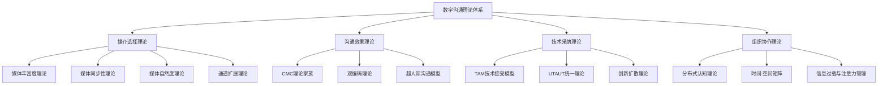
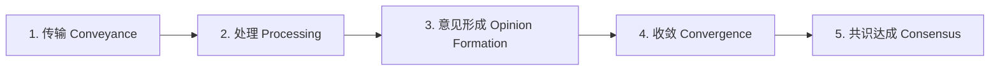
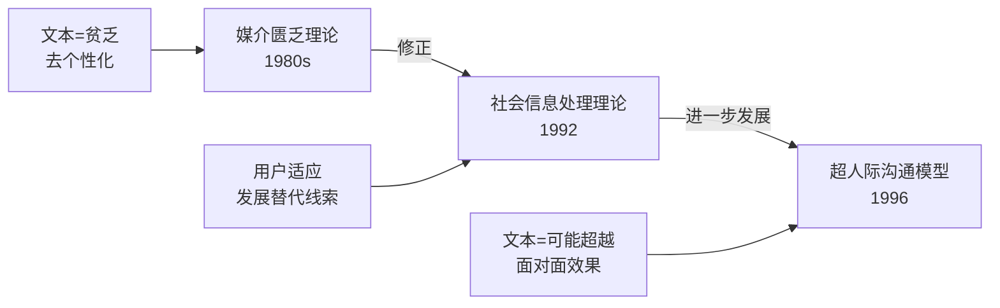
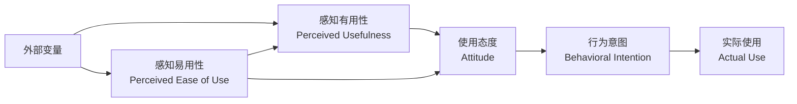
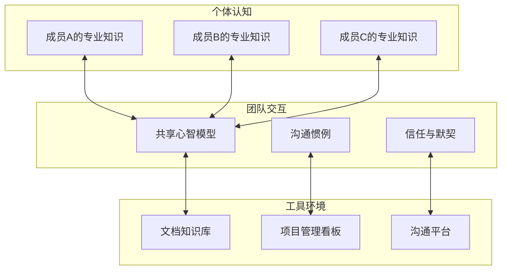
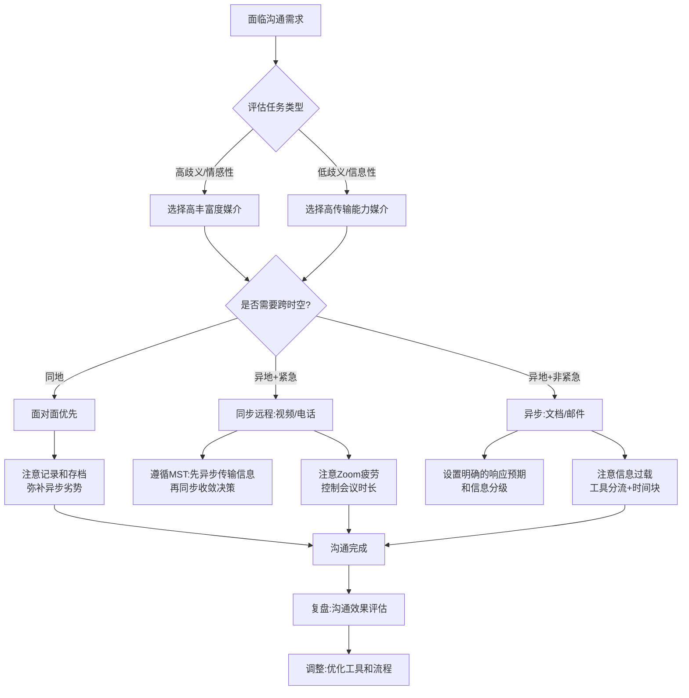

## 数字沟通的理论框架

理解数字沟通不能只停留在"用微信还是发邮件"的表层选择。每一种工具选择背后，都有一套学术理论在支撑。本章系统梳理数字沟通的核心理论框架，帮助读者从"凭感觉选工具"升级为"基于理论做决策"。

这些理论并非彼此孤立，它们各自解答了数字沟通的不同侧面：

### 一、媒体丰富度理论（Media Richness Theory）

#### 理论起源与核心主张

媒体丰富度理论由 Richard Daft 和 Robert Lengel 于 1986 年在《组织科学》（Organization Science）上正式提出，最初用于解释组织内部的沟通媒介选择行为。该理论的核心主张可以概括为一句话：**不同的沟通媒介具有不同的信息传递能力，而有效的沟通要求媒介的丰富度与任务的歧义性相匹配**。

这里的"丰富度"（Richness）是一个技术术语，指的是媒介在单一时间单位内能够传递的信息量和信息类型。注意，丰富度不等于"信息量大"——一封长篇邮件的信息量可能很大，但它的丰富度远低于一次五分钟的面对面交谈。

#### 四维评估模型

Daft 和 Lengel 提出，媒体丰富度由四个维度共同决定：

| 维度 | 定义 | 高丰富度示例 | 低丰富度示例 |
|------|------|-------------|-------------|
| **反馈即时性** | 能否快速获得对方回应并修正理解偏差 | 面对面交谈（秒级反馈） | 电子邮件（小时/天级反馈） |
| **多通道传递** | 是否同时利用语言、语调、表情、肢体等多种信息通道 | 视频通话（视觉+听觉+语言） | 纯文本消息（仅语言通道） |
| **语言多样性** | 是否支持自然语言、数字、图表、比喻等多种表达形式 | 面对面讨论白板图解 | 标准化表单填写 |
| **个人化程度** | 是否能传递情感温度、个人关注和社交线索 | 一对一谈话（眼神、触碰） | 群发通知邮件 |

这四个维度并非独立运作，而是相互叠加。例如，视频会议在"多通道传递"上得分很高，但由于网络延迟可能导致"反馈即时性"打折扣，综合丰富度仍然低于面对面交谈。

#### 媒介丰富度谱系

根据四维评估，主流沟通媒介可以排列成以下谱系：

高丰富度 ◄─────────────────────────────────────────────────────────► 低丰富度

面对面  >  一对一视频  >  电话  >  群组视频  >  即时消息  >  邮件  >  正式报告/文档
 │           │           │          │            │          │          │
 有肢体语言   有面部表情    有语调      有视觉线索     有表情符号    纯文字      纯文字
 实时反馈     实时反馈      实时反馈    半实时反馈     半实时反馈    延迟反馈     无反馈
 多通道       多通道        单通道      多通道         单通道       单通道       单通道

#### 任务-媒介匹配模型

理论的核心实践价值在于"匹配"——不同类型的任务需要不同丰富度的媒介：

| 任务类型 | 歧义程度 | 推荐媒介丰富度 | 具体工具示例 |
|---------|---------|--------------|-------------|
| 冲突调解、敏感话题反馈 | 高歧义 | 高丰富度 | 面对面、一对一视频 |
| 战略讨论、创意脑暴 | 高歧义 | 高丰富度 | 面对面、小组视频 |
| 项目进度同步 | 中歧义 | 中丰富度 | 视频会议、电话 |
| 数据报表分享 | 低歧义 | 低丰富度 | 邮件、文档链接 |
| 公告通知、制度发布 | 低歧义 | 低丰富度 | 邮件、公告系统 |
| 行政审批、流程确认 | 无歧义 | 最低丰富度 | OA系统、表单 |

一个典型的错配案例：某公司通过邮件进行绩效面谈。邮件的低丰富度导致员工无法读取管理者的语调和表情，一封措辞客观的反馈邮件被员工解读为"领导在批评我"，引发了不必要的离职情绪。如果换为面对面或视频沟通，同样的内容通过语调和表情的辅助，效果会完全不同。

#### 理论的局限与修正

媒体丰富度理论并非完美，后续研究指出了几个重要局限：

1. **个体差异被忽略**：该理论假设所有人对媒介丰富度的感知是一致的，但实际上，习惯使用文字沟通的数字原住民可能认为即时消息的丰富度并不低。
2. **媒介能力（Media Capability）与媒介使用（Media Use）的区别**：Daft 等人最初强调的是媒介的客观能力，但实际使用中，人们往往不按照理论预测来选择媒介——组织规范、个人偏好、可用性等因素都会影响选择。
3. **信息类型未细分**：该理论将"信息"视为单一整体，但实际沟通中，任务信息和社会情感信息可能需要不同的媒介。

Markus（1994）提出了"批判性 mass"理论来补充：即使某个媒介的丰富度不高，如果组织中大多数人都在使用它（如企业微信），那么不用它反而会造成沟通障碍。工具选择不仅是丰富度的匹配，还受到社会网络效应的制约。

### 二、媒体同步性理论（Media Synchronicity Theory）

#### 从丰富度到同步性的范式转移

2008 年，Alan R. Dennis 和 Joseph S. Valacich 在《信息系统研究》（Information Systems Research）上发表了媒体同步性理论（MST），对传统的媒体丰富度理论提出了重要修正。MST 的核心观点是：**沟通效果的好坏不取决于媒介的"丰富度"，而取决于媒介能否支持沟通任务所需的"同步性"水平**。

这里的"同步性"（Synchronicity）指的是：**两个人或多人同时关注同一信息、并同时进行心理处理的程度**。

#### 两个核心能力

MST 将媒介的能力拆解为两个独立维度：

| 能力 | 定义 | 影响因素 | 高能力工具 | 低能力工具 |
|------|------|---------|-----------|-----------|
| **传输能力（Conveyance）** | 传递大量多样化信息的能力 | 带宽、格式多样性、存储能力 | 文档协作平台、邮件 | 电话、简短消息 |
| **共同关注能力（Convergence）** | 多人同时聚焦同一信息并达成共识的能力 | 反馈速度、并行注意力支持 | 视频会议、共享白板 | 邮件、论坛帖子 |

关键洞察在于：**传输能力和共同关注能力往往是负相关的**。擅长传递大量信息的媒介（如文档）通常不擅长让大家实时聚焦达成共识；擅长实时聚焦的媒介（如电话）则不适合传递复杂的数据和图表。

#### 五阶段沟通模型

MST 认为任何有效的沟通都包含五个信息处理阶段：

不同阶段对同步性的需求不同：

| 阶段 | 需要的同步性 | 需要的能力 | 最佳媒介 |
|------|------------|-----------|---------|
| 信息传输 | 低 | 高传输能力 | 邮件、文档、录屏视频 |
| 信息处理 | 低 | 独处思考时间 | 个人阅读、异步评论 |
| 意见形成 | 中 | 适度交流 | 线程讨论、异步投票 |
| 意见收敛 | 高 | 高共同关注能力 | 视频会议、实时白板 |
| 达成共识 | 高 | 实时反馈确认 | 面对面会议、投票 |

#### 同步性光谱的实际应用

MST 最实用的贡献是给出了一个清晰的决策框架——不要一刀切地选择"同步"或"异步"，而是根据沟通的不同阶段灵活切换：

**场景：一个跨部门的产品需求评审**

| 阶段 | 执行方式 | 工具选择 | 原因 |
|------|---------|---------|------|
| 需求文档分发 | 异步 | Confluence/飞书文档 | 传输大量信息，需要阅读时间 |
| 疑问收集 | 异步 | 文档评论区/邮件 | 各自独立思考，不互相干扰 |
| 需求评审会议 | 同步 | 视频会议+共享屏幕 | 需要实时聚焦、争论、收敛 |
| 会议纪要确认 | 异步 | 文档评论+签字确认 | 给时间复核，避免口头承诺遗忘 |
| 最终需求锁定 | 同步 | 简短确认会议或群内@确认 | 需要所有人同时确认 |

这种"同步-异步交替"的工作模式，比全程开会议或全程发邮件的效果都要好得多。

#### 与媒体丰富度理论的核心区别

| 对比维度 | 媒体丰富度理论（MRT） | 媒体同步性理论（MST） |
|---------|---------------------|---------------------|
| 核心关注 | 媒介本身的信息传递能力 | 沟通过程的同步性需求 |
| 推荐逻辑 | 复杂任务→高丰富度媒介 | 不同阶段→不同同步性水平 |
| 对异步媒介的态度 | 低丰富度=能力弱 | 高传输能力=不可替代 |
| 对文本消息的态度 | 丰富度低，不适合复杂沟通 | 如果不需要收敛阶段，完全够用 |
| 适用范围 | 一对一或简单场景 | 团队协作和复杂决策 |

### 三、其他重要媒介选择理论

#### 媒体自然度理论（Media Naturalness Theory）

Kock（2005）从进化心理学角度提出了媒体自然度理论，认为人类的大脑经过数百万年的进化，最适应面对面沟通（自然沟通）。任何偏离面对面的媒介都会增加认知负荷：

| 自然度维度 | 面对面（基准） | 视频会议 | 电话 | 文字消息 |
|-----------|-------------|---------|------|---------|
| 面对面视觉接触 | 有 | 部分（摄像头≠眼神） | 无 | 无 |
| 听觉同步性 | 有 | 有 | 有 | 无 |
| 身体语言表达 | 完整 | 部分（上半身） | 无 | 无 |
| 面部表情识别 | 完整 | 有限（画质/延迟） | 无 | 无 |
| 语言符号丰富度 | 完整 | 完整 | 完整 | 仅文字+表情符号 |
| **认知负荷增加** | 基准（0%） | 约15-25% | 约20-30% | 约40-60% |

实践启示：对于需要深度情感连接的沟通（如心理咨询、冲突调解、一对一辅导），应优先选择高自然度的媒介。而对于任务导向、信息传递为主的沟通，自然度不是首要考虑因素。

#### 通道扩展理论（Channel Expansion Theory）

Carlson 和 Zmud（1999）提出了一个重要补充：**媒体丰富度不是媒介的固有属性，而是随着用户经验增长而变化的**。一个经常使用邮件进行复杂沟通的团队，其成员会逐渐发展出丰富的邮件沟通"暗语"和惯例，使邮件对他们而言变得更加"丰富"。

这意味着：工具的丰富度可以被"训练"出来。一个团队如果长期使用飞书文档进行异步协作，会逐渐发展出一套高效的文档沟通惯例（如特定的评论符号、@规则、状态标记），使得飞书文档在该团队中的实际沟通效果远高于理论预测。

### 四、计算机中介沟通理论（Computer-Mediated Communication）

#### CMC理论的演变历程

CMC理论的发展经历了三个阶段，从"媒介匮乏"到"超人际沟通"，反映了人们对数字沟通理解的不断深化：

#### 媒介匮乏理论（Cues Filtered Out, CFO）

早期CMC研究的主流观点认为，文本沟通缺乏非语言线索（面部表情、语调、肢体语言），导致两个后果：

1. **去个性化**：沟通更关注任务本身，忽视人际关系维护
2. **社会线索减少**：更容易产生误解、冲突和极端言论

这一理论在早期互联网研究中占主导地位，也解释了为什么网上论坛和邮件列表中更容易出现激烈的言语冲突。

#### 社会信息处理理论（Social Information Processing, SIP）

Joseph Walther 在 1992 年提出了 SIP 理论，对 CFO 进行了重要修正。SIP 的核心观点是：**人类有强烈的社交需求，即使在缺乏非语言线索的媒介中，也会主动寻找和创造替代性的社会线索**。

在数字沟通中，人们发展出了一套丰富的"替代线索"系统：

| 传统非语言线索 | 数字替代方式 | 示例 |
|-------------|------------|------|
| 面部表情 | 表情符号/emoji | 🙂😊😢😡 |
| 语调 | 标点符号、大小写、语气词 | "好的！！！" vs "好的" |
| 语速/节奏 | 打字速度、消息间隔 | 秒回=急切，很久才回=冷淡/忙碌 |
| 肢体语言 | 贴纸/GIF/动作描述 | "手动点赞""激动地搓手" |
| 空间距离 | 消息长度、主动频率 | 长消息=重视，短消息=随意 |
| 眼神接触 | 在线状态、已读标记 | 显示"对方正在输入..."=专注 |

SIP 理论指出，虽然这些替代线索传递信息的速度较慢（需要更多时间来积累足够的线索），但最终可以达到与面对面沟通相当的社会关系深度。关键变量是**时间和互动频率**。

#### 超人际沟通模型（Hyperpersonal Model）

Walther 在 1996 年提出了一个更激进的观点：**在某些条件下，CMC 甚至可以产生比面对面沟通更强烈的印象和更亲密的关系**。

这一效果由四个因素共同促成：

| 因素 | 机制 | 典型场景 |
|------|------|---------|
| **发送者选择性自我呈现** | 有时间精心编辑信息，只展示最好的自己 | 花10分钟写一条看起来"随意"的消息 |
| **接收者理想化投射** | 缺乏负面线索，接收者会用想象补全对方形象 | 只看到文字，想象对方声音好听/性格温柔 |
| **异步沟通降低焦虑** | 不需要即时反应，减少社交焦虑 | 内向者在文字沟通中表达更自如 |
| **信道回环强化** | 发送者发现精心编辑得到了正面反馈，于是更加精心 | 收到好评后投入更多精力经营线上形象 |

超人际效应在以下场景中特别明显：
- 网络恋爱初期（只看到对方精心编辑的一面）
- 远程面试（候选人有充分准备时间）
- 社交媒体人设经营（选择性展示生活亮点）
- 专业论坛上的专家形象（通过文字积累权威感）

但也带来风险：当线上关系转到线下时，"理想化泡沫"可能破裂。管理者在远程招聘时需要意识到，文字沟通中的"超人际印象"可能导致对候选人能力的高估。

### 五、技术接受与采纳理论

#### TAM 技术接受模型

Fred Davis 于 1989 年在 MIT 提出的技术接受模型（TAM）是信息技术采纳研究中被引用最多的理论之一。TAM 回答的核心问题是：**为什么人们会选择使用或拒绝使用某个新工具？**

各变量的操作化定义：

| 变量 | 定义 | 衡量问题示例 |
|------|------|------------|
| 感知有用性（PU） | 使用该工具能提升工作绩效的程度 | "使用飞书能让我更快完成协作任务" |
| 感知易用性（PEOU） | 使用该工具所需的努力程度 | "飞书的操作界面容易上手" |
| 使用态度（ATT） | 对使用该工具的正面或负面情感 | "我觉得使用飞书是一件愉快的事" |
| 行为意图（BI） | 计划使用该工具的意愿强度 | "我打算在接下来的项目中使用飞书" |
| 实际使用（AU） | 实际使用频率和深度 | 过去一周使用飞书的次数和时长 |

TAM 的大量实证研究得出了几个稳定结论：

1. **感知有用性是使用意愿最强的预测因子**——人们首先关心"有没有用"
2. **感知易用性既直接影响使用意愿，也通过感知有用性间接影响**——如果一个工具好用，人们也会觉得它更有用
3. **感知易用性的影响随时间衰减**——使用初期，易用性很重要；使用一段时间后，有用性成为主导因素

#### TAM 在沟通工具推广中的应用策略

| 推广阶段 | 重点策略 | 具体做法 |
|---------|---------|---------|
| 试用期（0-2周） | 强化感知易用性 | 提供3分钟上手视频、一键导入联系人、简化注册流程 |
| 引入期（2-8周） | 展示感知有用性 | 用具体案例展示效率提升数据，设置"每周效率报告" |
| 推广期（2-6月） | 影响使用态度 | 培养种子用户、让意见领袖带头使用、分享成功故事 |
| 深化期（6月+） | 促进行为改变 | 将工具使用纳入工作流程、建立使用规范和激励 |

#### UTAUT 统一接受与使用技术理论

Venkatesh 等人在 2003 年整合了 TAM 及其 7 个竞争理论，提出了 UTAUT 模型，补充了几个 TAM 遗漏的关键变量：

| UTAUT新增变量 | 定义 | 对沟通工具的影响 |
|-------------|------|---------------|
| **绩效期望** | 使用工具能帮助完成工作的程度（≈PU） | "飞书能让我更高效地和团队沟通" |
| **努力期望** | 使用工具的容易程度（≈PEOU） | "飞书的界面我不用学就能用" |
| **社会影响** | 重要他人认为应该使用该工具的程度 | "老板和同事都在用飞书，我不用不行" |
| **促进条件** | 组织提供的技术支持和基础设施 | "公司配了高速网络，IT部门随时解答问题" |

UTAUT 还发现了调节变量的作用：
- **性别**：男性更受绩效期望影响，女性更受努力期望和社会影响影响
- **年龄**：年轻人对新技术的接受度更高，更少受促进条件制约
- **经验**：初期经验影响后续使用意愿，首次体验至关重要
- **自愿性**：强制使用vs自愿使用对社会影响的敏感度不同

#### 创新扩散理论（Diffusion of Innovations）

Everett Rogers 的创新扩散理论虽然不专门针对沟通工具，但提供了理解"为什么有些人很快接受新工具而有些人死活不用"的框架。

技术采纳者分为五类：

| 类型 | 占比 | 特征 | 对沟通工具推广的策略 |
|------|------|------|-------------------|
| 创新者（Innovators） | 2.5% | 冒险精神强，愿意尝试任何新东西 | 让他们成为首批测试者 |
| 早期采纳者（Early Adopters） | 13.5% | 意见领袖，社交影响力大 | 培养为工具推广大使 |
| 早期多数（Early Majority） | 34% | 务实，看到实际效果后才采纳 | 展示具体案例和数据 |
| 晚期多数（Late Majority） | 34% | 怀疑，迫于社会压力才采纳 | 群体压力+培训支持 |
| 落后者（Laggards） | 16% | 传统保守，抵触变革 | 只能强制或等待自然淘汰 |

推广沟通工具的关键是跨越"鸿沟"——从早期采纳者（16%）到早期多数（34%）之间存在一个采纳率增长的停滞期。跨越方法是：找到一个"灯塔客户"或"杀手级应用场景"，让务实的多数人看到不可否认的价值。

### 六、分布式团队沟通理论

#### 时间-空间矩阵

Dennis 等人提出的时间-空间矩阵是理解远程协作最直观的框架。它将团队沟通按照两个维度——时间（同步/异步）和空间（同地/异地）——分为四个象限：

| | **同地（Colocated）** | **异地（Distributed）** |
|---|---|---|
| **同步** | 面对面会议、走廊讨论 | 视频会议、电话会议、实时协作编辑 |
| **异步** | 共享白板、便签墙、公告栏 | 异步文档协作、邮件列表、项目管理工具 |

每个象限都有其独特的沟通特征和挑战：

**同地+同步（面对面会议）**
- 优势：信息带宽最高，信任建立最快，共识达成效率最高
- 劣势：时间和空间成本高，难以存档和追溯，容易跑题

**异地+同步（视频会议）**
- 优势：突破地理限制，保留视觉和听觉线索，支持屏幕共享
- 劣势：技术依赖（网络/设备），"Zoom疲劳"，跨时区协调困难，多人会议中轮流发言效率低

**同地+异步（办公室公告栏/共享白板）**
- 优势：不需要协调时间，信息持久可见，支持并行处理
- 劣势：容易被忽视，反馈延迟，物理空间限制

**异地+异步（文档协作/邮件）**
- 优势：完全不受时间和空间限制，支持深度思考，自动留痕
- 劣势：缺乏社会线索，容易产生误解，收敛速度最慢

#### 分布式认知理论（Distributed Cognition）

Edwin Hutchins 在 1995 年对海军舰艇的研究中提出了分布式认知理论。该理论认为，认知不仅发生在个体大脑中，还分布在团队成员、工具和环境之间。

在远程团队中，分布式认知有三个关键层面：

1. **个体认知层**：每个成员的专业知识和技能
2. **团队交互层**：成员之间的信息共享和协调机制
3. **工具-环境层**：沟通工具、协作平台、知识库等外部认知资源

有效的远程沟通工具不仅要传递信息，还要支持三个层面之间的认知流动：

实践启示：远程团队最容易犯的错误是只关注"工具层"（买了最好的协作软件），却忽视了"交互层"的建设（没有建立共享心智模型和沟通惯例）。工具只是管道，管道里流动的认知才是关键。

### 七、信息过载与注意力管理

#### 信息过载的理论根源

Herbert Simon 在 1971 年就预见了数字时代的核心矛盾："信息的丰富导致注意力的贫乏"（A wealth of information creates a poverty of attention）。

信息过载在数字沟通中表现为：

| 过载类型 | 表现 | 典型场景 |
|---------|------|---------|
| **消息数量过载** | 每天收到数百条消息，无法逐一阅读 | 50+个未读群聊、数百封未读邮件 |
| **渠道分散过载** | 信息分散在10+个平台上，切换成本高 | 同时使用微信、飞书、钉钉、邮件、Slack |
| **上下文切换过载** | 频繁在不同话题间切换，认知资源耗尽 | 每5分钟被一条消息打断深度工作 |
| **决策疲劳** | 大量需要回复和判断的消息消耗决策能力 | 每条消息都需要思考"要不要回复、怎么回复" |

#### 注意力管理的四层框架

基于以上分析，有效的注意力管理需要在四个层面同时发力：

**第一层：信息分级**

使用"紧急-重要"矩阵对消息进行分级处理：

| | **重要** | **不重要** |
|---|---|---|
| **紧急** | 立即处理（生产事故、客户投诉） | 快速委派或延后（非关键但有时限的请求） |
| **不紧急** | 预约时间处理（战略讨论、技能学习） | 批量处理或忽略（群聊闲聊、无关通知） |

**第二层：时间块管理**

将工作时间划分为"深度工作"和"沟通窗口"两种模式：

- **深度工作块**（如 9:00-11:30）：关闭所有消息通知，只保留电话作为紧急通道
- **沟通窗口**（如 11:30-12:00、14:00-14:30）：集中处理消息、回复邮件、参加短会
- **会议块**（如 15:00-17:00）：集中安排需要同步讨论的会议

关键原则：**不要让沟通工具控制你的时间表，而是你主动决定何时沟通**。

**第三层：工具分流**

为不同类型的信息指定唯一的处理通道，避免信息散落在多处：

| 信息类型 | 指定通道 | 处理规则 |
|---------|---------|---------|
| 紧急事件 | 电话/短信 | 秒级响应 |
| 日常工作协调 | 企业IM（飞书/钉钉） | 1小时内响应 |
| 正式文件和决策 | 邮件 | 当天回复 |
| 知识沉淀和文档 | 协作文档平台 | 异步处理 |
| 社交闲聊 | 个人IM（微信） | 空闲时处理 |

**第四层：静默优先原则**

默认使用异步沟通，仅在以下情况切换为同步：
- 需要即时反馈的紧急问题
- 需要实时收敛的决策讨论
- 需要情感支持的敏感对话
- 信息歧义度高、异步沟通可能加剧误解

经验法则：**如果一个问题用一封5分钟写的邮件能解决，就不要发起一个30分钟的会议**。

### 八、数字化沟通伦理

数字化沟通伦理不仅是"礼貌"问题，更是影响沟通效果和组织信任的系统性因素。缺乏伦理意识的数字沟通会直接损害团队协作效能。

#### 五项核心伦理原则及其实践标准

**1. 透明性（Transparency）**

| 做法 | 伦理的 | 不伦理的 |
|------|--------|---------|
| 身份 | 使用真实身份沟通 | 匿名发送含糊指令 |
| 意图 | 明确说明沟通目的 | 假借名义套取信息 |
| 立场 | 表达真实观点 | 表面同意背后反对 |
| 决策 | 公开决策过程和依据 | 黑箱操作、事后通知 |

**2. 尊重性（Respect）**

数字沟通中的尊重具体体现在对他人时间和注意力的尊重：

- 不在深夜或休息时间发送非紧急消息（设置定时发送）
- 不在群聊中@所有人发布非全局性信息
- 不在长消息中埋藏需要对方执行的任务（用清单前置关键行动项）
- 会议前发送议程，会议后发送纪要，避免"开会来讨论，散会没结论"
- 尊重对方的"请勿打扰"状态

**3. 隐私性（Privacy）**

| 场景 | 正确做法 | 错误做法 |
|------|---------|---------|
| 转发消息 | 征得发送者同意 | 未经许可转发私人对话 |
| 截图分享 | 脱敏处理，隐去身份信息 | 直接截图传播含个人信息的对话 |
| 会议录屏 | 事先告知参会者并获得同意 | 秘密录屏 |
| 群聊拉人 | 说明群组目的，征得现有成员同意 | 不告知直接拉人进群 |

**4. 真实性（Authenticity）**

- 不传播未经核实的信息（尤其是工作相关的数据和决策）
- 不利用文字沟通的"超人际效应"刻意营造虚假印象
- 在异步沟通中如实反映进度，不夸大也不隐瞒
- 当沟通产生误解时，主动澄清而非任其发酵

**5. 包容性（Inclusivity）**

数字沟通中的包容性关注的是"技术可及性"和"文化可及性"：

- 确保选择的工具对所有团队成员可用（不是所有人都有最新设备或高速网络）
- 考虑跨文化沟通差异（如某些文化中直接拒绝被视为不礼貌）
- 为有身体障碍的成员提供无障碍沟通选项（如字幕、文字替代）
- 在异步沟通中照顾跨时区成员的作息（不在某人的深夜安排同步会议）

### 九、理论综合应用框架

上述理论不是孤立的学术概念，它们共同构成了一个完整的决策框架。在实际工作中，我们可以将这些理论整合为一个"数字沟通决策流程"：

#### 日常沟通决策速查表

面对一个具体的沟通场景，快速决策的步骤是：

| 步骤 | 判断问题 | 如果是 | 如果否 |
|------|---------|--------|--------|
| 1 | 这个信息紧急吗？ | 选择同步媒介 | 选择异步媒介 |
| 2 | 信息歧义度高吗？ | 选择高丰富度/自然度媒介 | 文字即可 |
| 3 | 需要多人实时收敛吗？ | 安排同步会议 | 文档异步协作 |
| 4 | 对方和我在同一时区吗？ | 可选同步或异步 | 优先异步 |
| 5 | 需要留痕存档吗？ | 选择可记录的媒介 | 灵活选择 |
| 6 | 涉及情感或敏感话题吗？ | 优先高自然度媒介 | 按效率选择 |

#### 不同组织规模的理论应用重点

| 组织阶段 | 核心挑战 | 重点理论 | 行动建议 |
|---------|---------|---------|---------|
| 初创团队（5人以下） | 沟通工具选择 | TAM + 媒介丰富度 | 选择1-2个主工具，深度使用 |
| 成长期（5-30人） | 流程规范化 | 媒体同步性 + 工具分流 | 建立同步-异步结合的沟通规范 |
| 扩张期（30-200人） | 信息过载 | 注意力管理 + 分布式认知 | 实施信息分级和时间块管理 |
| 大型组织（200人+） | 跨部门协作障碍 | 创新扩散 + UTAUT | 组织级工具推广策略和培训体系 |

***

> **本章小结**：数字沟通的理论框架从媒介选择、技术采纳、认知分布和伦理规范四个维度，为我们理解"为什么这样沟通"和"如何更好地沟通"提供了科学基础。这些理论的终极指向是一致的：**沟通工具是手段，人与人之间的理解与信任才是目的**。在接下来的章节中，我们将把这些理论转化为具体的操作技巧和工具使用方法。
