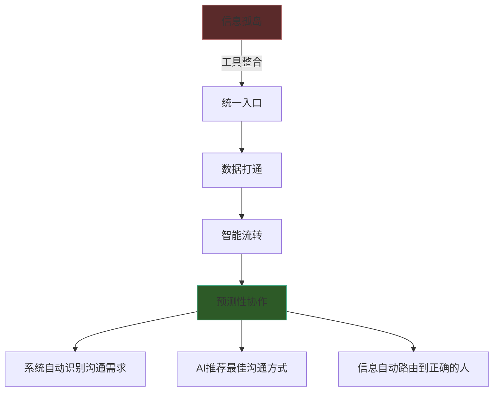
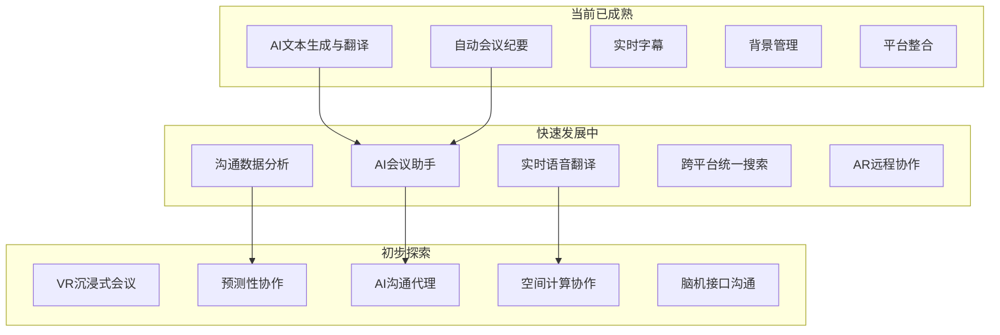

## 八、数字化沟通的发展趋势

数字化沟通正处于一个前所未有的加速变革期。2023年，全球企业协作软件市场规模达到473亿美元，预计到2030年将突破1,200亿美元（Grand View Research, 2024）。然而，真正的变革不在于市场规模的扩张，而在于底层逻辑的重构——从"工具替代人工"走向"工具增强认知"，从"信息传递"走向"意义共建"。

理解这些趋势不是为了追逐热点，而是为了做出前瞻性的决策：今天选择的工具架构、制定的沟通规范、培养的团队能力，需要在三到五年后仍然适用。本节将从七个维度系统分析数字化沟通的发展方向，帮助读者建立面向未来的认知框架。

### 8.1 人工智能与沟通：从辅助到协作

人工智能正在经历从"工具"到"协作者"的角色跃迁。这一变化的深度远超大多数人的想象。

#### 8.1.1 大语言模型重塑信息生产

2022年底ChatGPT的发布标志着一个分水岭。在此之前，AI在沟通领域的应用主要集中在规则驱动的自动化（如邮件模板、自动回复）；在此之后，AI具备了理解上下文、生成连贯文本、甚至模拟特定风格的能力。

**当前能力图谱：**

| 能力层级 | 具体应用 | 成熟度 | 代表工具 |
|----------|----------|--------|----------|
| L1 文本生成 | 邮件草拟、报告生成、文案创作 | 高 | ChatGPT、Claude、文心一言 |
| L2 内容优化 | 语法纠错、风格调整、语气匹配 | 高 | Grammarly、Notion AI |
| L3 跨语言沟通 | 实时翻译、本地化适配 | 中高 | DeepL、Google Translate |
| L4 语义理解 | 情感分析、意图识别、摘要提取 | 中 | 各平台内置AI |
| L5 对话管理 | 智能客服、会议引导、冲突调解 | 中低 | ChatGPT Enterprise、Copilot |
| L6 认知增强 | 决策支持、知识推理、创意激发 | 低 | 处于研究阶段 |

**对沟通的深层影响：**

大语言模型带来的不仅是效率提升，更是沟通范式的转变。当每个人都能在30秒内生成一封专业的商务邮件时，"写作能力"的竞争优势被大幅削弱，而"提问能力"（Prompt Engineering）和"判断能力"（评估AI输出的质量）成为新的核心竞争力。

具体而言，AI对沟通的影响体现在三个层面：

**第一，降低表达门槛。** 过去，将模糊的想法转化为清晰的文字需要较强的写作能力。现在，AI可以帮助任何人将零散的要点组织成结构化的文档。这意味着沟通的瓶颈从"表达"转移到了"思考"——你能否提出正确的问题、提供准确的输入、判断输出的质量。

**第二，加速信息流转。** AI可以在几秒钟内完成过去需要数小时的信息处理工作：将一份50页的报告提炼为5个关键要点，将一场2小时的会议录音转化为结构化的纪要，将一封英文邮件翻译成地道的中文。这种加速使得信息在组织内的流转速度大幅提升。

**第三，改变沟通预期。** 当AI使得快速生成高质量内容成为可能，人们对响应速度和内容质量的预期也随之提高。过去"三天内回复邮件"是可以接受的，现在"当天回复"逐渐成为基线。这种预期变化对个人的时间管理能力和组织的流程设计提出了新的要求。

#### 8.1.2 AI会议助手的进化路径

AI会议助手正在经历三个阶段的进化：

**阶段一（已成熟）：记录与总结。** Otter.ai、飞书妙记、Zoom AI Companion等工具已经能够自动转录会议内容、提取关键要点、生成结构化纪要。Gartner预测，到2025年底，75%的企业级视频会议将配备AI自动生成纪要功能。

**阶段二（快速发展中）：分析与洞察。** 新一代工具不仅能记录"说了什么"，还能分析"怎么说的"——谁发言最多、讨论偏离主题的时间比例、决策点是否明确、行动项是否被遗漏。Microsoft Copilot已经在Teams中提供了"会议回顾"功能，能够标注讨论的情绪走向和关键转折点。

**阶段三（初步探索）：主动参与。** AI开始从被动记录者变为主动参与者。例如，在会议偏离主题时提醒主持人，在讨论陷入僵局时建议替代方案，在决策时自动调取相关的数据和历史记录。Zoom在2024年推出的"AI Companion 2.0"已经具备了会前自动准备议程、会中实时建议、会后自动分配任务的能力。

**阶段四（未来方向）：代理参与。** AI代理代替人类参加低优先级会议，提取关键信息并同步给缺席者。Microsoft在2024年Build大会上展示了"Teams AI Agent"的概念原型，允许用户设置AI代理参加特定类型的会议，并在需要人类决策时发出通知。

#### 8.1.3 AI客服与人机协作的新平衡

AI客服的部署已经从"成本削减工具"演变为"客户体验增强器"。Gartner的研究显示，部署AI客服的企业中，82%报告客户满意度有所提升，但前提是AI被正确配置和持续优化。

**关键设计原则：**

- **透明性**：始终告知用户正在与AI交互，不伪装成人类
- **无缝切换**：当AI无法处理时，应能平滑转接人工客服，并传递完整的上下文
- **持续学习**：基于人工客服处理的复杂案例，不断扩展AI的知识边界
- **情感识别**：当检测到用户情绪激动时，优先转接人工客服

#### 8.1.4 AI使用的伦理边界

AI在沟通中的广泛使用也带来了新的伦理挑战：

**真实性问题。** 当AI可以生成与人类无异的文本时，如何确保沟通的真实性？学术界已经出现了"AI检测器"工具，但在职场沟通中，这种检测既不现实也不必要。更务实的做法是建立组织层面的AI使用规范——哪些场景可以使用AI辅助、哪些场景必须由人类原创、AI生成的内容是否需要标注。

**隐私问题。** AI工具需要处理大量的沟通数据才能提供服务，这些数据的存储、使用和保护是核心关切。2023年三星因员工将公司机密代码粘贴到ChatGPT而禁止内部使用，这一事件引发了全球企业对AI工具数据安全的重新审视。

**依赖性风险。** 过度依赖AI可能导致人类自身沟通能力的退化。就像GPS导航削弱了人们的认路能力一样，AI写作助手可能削弱人们的写作和思考能力。保持"人机协作"而非"人机替代"的定位，是应对这一风险的关键。

### 8.2 虚拟现实与增强现实：空间计算时代的沟通

空间计算（Spatial Computing）正在将数字沟通从二维屏幕拓展到三维空间。Apple Vision Pro在2024年的发布标志着这一领域的商业化拐点。

#### 8.2.1 沉浸式会议：超越视频通话

传统视频会议的核心局限在于"平面感"——所有人被压缩到一个二维网格中，缺乏空间感和临场感。VR会议试图解决这一问题。

**技术现状：**

| 平台 | 核心特点 | 硬件要求 | 适用场景 |
|------|----------|----------|----------|
| Meta Horizon Workrooms | 虚拟办公桌、手势追踪 | Meta Quest 3 | 日常团队会议 |
| Microsoft Mesh | 与Teams集成、3D化身 | HoloLens 2 / Quest | 企业级协作 |
| Spatial | 轻量化、Web端支持 | Quest / WebXR | 创意头脑风暴 |
| Arthur | 企业安全、大型虚拟空间 | Quest / PC VR | 大型团队活动 |

**实际效果与局限：**

斯坦福大学虚拟人类互动实验室（VHIL）2023年的研究发现，VR会议在"团队凝聚力"和"非语言信息传递"两个维度上显著优于传统视频会议（提升约30%），但在"信息传递准确性"上没有显著差异，且长时间佩戴头显会导致"VR疲劳"（VR Fatigue），30分钟后舒适度显著下降。

**务实建议：** VR会议当前最适合以下场景——创意头脑风暴、产品原型评审、跨地域团队建设、新员工入职体验。对于日常的进度同步和信息传递，传统视频会议仍然是更高效的选择。

#### 8.2.2 AR协作：在现实世界上叠加数字层

AR协作的实用价值比VR更高，因为它不需要用户脱离现实环境，而是在真实工作场景中叠加数字信息。

**典型应用场景：**

- **远程技术支持**：工程师佩戴AR眼镜，远程专家可以在工程师的视野中绘制标注、指向具体零件。Microsoft Dynamics 365 Remote Assist已经在制造业和医疗领域广泛应用。
- **空间设计评审**：建筑师和室内设计师可以在真实空间中叠加设计方案的3D模型，团队成员可以"走进"设计中进行评审。
- **培训与模拟**：新员工可以在AR环境中模拟操作复杂设备，无需占用实际生产设备。

#### 8.2.3 虚拟空间中的社交与信任建设

元宇宙（Metaverse）概念虽然经历了炒作周期的起伏，但其核心理念——在虚拟空间中建立有意义的人际连接——仍然具有长期价值。关键的洞察是：**虚拟空间的价值不在于模拟现实，而在于创造现实无法提供的体验。**

例如，GitLab（全球最大的全远程公司之一）在2023年实验了虚拟办公室空间，员工可以在虚拟空间中"路过"同事的工位、发起非正式的闲聊。这种"偶遇式沟通"在传统远程办公中是缺失的，但对团队信任建设至关重要。

### 8.3 语音与视频技术的进化

语音和视频技术的进步正在消除数字沟通中的诸多障碍。

#### 8.3.1 实时语音翻译：打破语言壁垒

实时语音翻译是AI在沟通领域最具变革性的应用之一。其核心流程是：语音识别 → 文本翻译 → 语音合成，整个过程在1-2秒内完成。

**技术现状对比：**

| 平台 | 支持语言数 | 延迟 | 准确率（高资源语言） | 特色 |
|------|-----------|------|---------------------|------|
| Google Interpreter Mode | 44 | 1-2秒 | ~95% | 集成在Google Meet中 |
| Microsoft Translator | 60+ | 1-3秒 | ~93% | Teams集成、多人多语言 |
| DeepL（语音模式） | 33 | 1-2秒 | ~96%（欧洲语言） | 翻译质量最高 |
| 讯飞听见 | 中英日韩等 | <1秒 | ~97%（中文场景） | 中文场景优化 |

**实际挑战：** 尽管技术进步显著，实时语音翻译在以下场景中仍然面临挑战——专业术语密集的技术讨论、方言和口音较重的对话、需要理解文化语境的商务谈判。在这些场景中，专业翻译人员仍然不可替代。

#### 8.3.2 视频技术的智能化

视频技术的进化不仅体现在画质提升（4K/8K），更体现在智能化功能上：

**背景管理。** 从简单的背景模糊到AI驱动的背景替换、虚拟灯光调整、眼神接触矫正（NVIDIA Maxine、Apple Center Stage），视频技术正在帮助用户在任何环境下都能呈现专业形象。

**智能取景。** 自动追踪发言者、智能裁剪多人画面、根据内容自动调整构图。Zoom的"智能画廊"（Smart Gallery）可以将会议室中的每个人单独框取，让远程参与者获得与面对面等效的视觉体验。

**情绪与参与度分析。** AI可以分析会议参与者的面部表情、语调变化和注意力状态，为主持人提供实时反馈。例如，当检测到大多数参与者注意力下降时，提示主持人调整节奏或发起互动。

#### 8.3.3 自动字幕与无障碍沟通

自动字幕已经从"辅助功能"演变为"标准功能"。2024年，几乎所有主流视频会议平台都内置了实时字幕功能，支持多种语言。

**更深层的意义：** 自动字幕不仅服务于听障人士，还在以下场景中发挥重要作用——嘈杂环境中的视频通话、非母语参与者的理解辅助、会议内容的即时搜索和引用、以及作为AI纪要的底层数据源。

### 8.4 工具整合与平台化：从碎片到生态

#### 8.4.1 超级应用与平台聚合

数字化沟通工具正在经历从"单点工具"到"平台生态"的整合。这一趋势在全球和中国市场呈现出不同的形态。

**全球趋势：** Microsoft通过将Teams与Office 365、SharePoint、Power Platform深度整合，打造了覆盖沟通、协作、自动化的一体化平台。Google Workspace同样将Gmail、Meet、Docs、Chat整合为统一生态。Slack在被Salesforce收购后，正在与CRM系统深度集成。

**中国趋势：** 飞书（Lark）、钉钉、企业微信三大平台都在走"一站式"路线——将即时通讯、视频会议、文档协作、项目管理、审批流程、CRM等功能集成在一个平台中。这种模式的优势是减少工具切换成本，劣势是可能陷入"大而全但不够精"的困境。

**整合的核心逻辑：**

#### 8.4.2 跨设备无缝体验

用户在一天中可能使用手机、平板、电脑、智能手表、会议室系统等多种设备进行沟通。无缝的跨设备体验意味着：

- **状态同步**：在手机上开始的对话可以无缝切换到电脑上继续，包括草稿、未读状态、历史记录
- **情境感知**：系统根据当前使用的设备和场景自动调整通知策略（例如，手机端收到紧急消息推送，电脑端收到详细内容）
- **输入适配**：根据设备特性自动调整输入方式（手机语音输入、电脑键盘输入、会议设备手势控制）

#### 8.4.3 统一搜索与知识管理

当沟通数据分散在多个平台中时，"找到某条特定信息"成为巨大的时间黑洞。IDC的研究显示，知识工作者平均每周花9.3小时搜索和收集信息。

**解决方向：**

- **跨平台搜索引擎**：如Glean、Moveworks等工具可以跨越Slack、邮件、文档、CRM等多个系统进行统一搜索
- **知识图谱**：将分散的沟通记录、文档、任务关联为结构化的知识网络，支持语义搜索而非关键词匹配
- **自动知识沉淀**：AI自动从日常沟通中提取有价值的知识点，归档到团队知识库中

### 8.5 数据驱动的沟通优化

#### 8.5.1 沟通分析的兴起

组织开始像分析业务数据一样分析沟通数据。Microsoft Viva Insights、Worklytics等工具可以提供团队层面的沟通模式分析：

- **会议负荷分析**：每人每周花多少时间在会议上？会议的投入产出比如何？
- **协作网络分析**：信息在团队中的流转路径是什么？是否存在信息瓶颈或孤岛？
- **深度工作时间**：员工有多少连续的不被打扰的工作时间？这一数字的趋势如何？
- **跨部门协作**：不同部门之间的沟通频率和质量如何？

#### 8.5.2 个性化沟通体验

AI使得"千人千面"的沟通体验成为可能：

- **智能通知管理**：根据消息的紧急程度、发送者的重要性、接收者当前的工作状态，自动调整通知策略
- **内容摘要定制**：同一份文档，为不同角色的读者生成不同粒度的摘要
- **沟通风格适配**：AI分析对方的沟通风格偏好（简洁vs详细、正式vs轻松），建议调整自己的表达方式

#### 8.5.3 预测性协作

最前沿的方向是"预测性协作"——系统在人类意识到需求之前就主动发起沟通和协作。例如：

- 项目管理系统检测到某个任务即将延期，自动通知相关方并建议召开紧急会议
- CRM系统发现客户近期的沟通频率下降，自动提醒销售人员进行回访
- 知识管理系统发现新加入的团队成员频繁搜索某类文档，自动推荐相关的培训资源和联系人

### 8.6 信息安全与隐私保护

数字化沟通的深入发展使得信息安全和隐私保护成为不可回避的议题。

#### 8.6.1 零信任架构下的沟通安全

传统的"边界安全"模型（信任内部网络，防御外部威胁）已不适应远程办公和云服务的时代。零信任架构（Zero Trust Architecture）的核心原则是"永不信任，始终验证"。

**在沟通工具中的应用：**

- **端到端加密**：Signal Protocol、WhatsApp、iMessage等已实现端到端加密，但企业级工具（如Slack、Teams）的加密方案通常更为复杂，需要在安全性和可管理性之间平衡
- **数据驻留控制**：GDPR、中国的《个人信息保护法》等法规要求数据存储在特定的地理区域内，这直接影响跨国企业选择沟通工具的决策
- **访问控制精细化**：基于角色的权限管理、信息分级、阅后即焚等功能成为企业级沟通工具的标准配置

#### 8.6.2 AI带来的新安全挑战

AI工具的引入创造了新的攻击面：

- **提示注入攻击（Prompt Injection）**：恶意用户通过精心构造的输入，操控AI工具泄露敏感信息或执行非预期操作
- **数据投毒**：攻击者通过污染训练数据，影响AI工具的行为
- **深度伪造（Deepfake）**：AI生成的虚假音频和视频可能被用于欺诈和社工攻击

#### 8.6.3 隐私增强技术

差分隐私（Differential Privacy）、联邦学习（Federated Learning）、同态加密（Homomorphic Encryption）等技术正在被引入沟通工具，在不暴露个人数据的前提下提供智能化服务。Apple在iOS中应用的差分隐私技术就是一个典型范例。

### 8.7 跨文化数字沟通的全球化

#### 8.7.1 工具偏好的地域差异

不同地区对沟通工具有着截然不同的偏好，这反映了深层的文化差异：

| 地区 | 主流工具 | 特点 | 文化背景 |
|------|----------|------|----------|
| 北美 | Slack、Teams、Email | 邮件文化浓厚，工具功能导向 | 注重个人空间和异步沟通 |
| 欧洲 | Teams、Email、WhatsApp | 重视隐私合规（GDPR影响） | 守时和书面记录文化 |
| 中国 | 飞书、钉钉、企业微信、微信 | 超级应用模式，即时通讯主导 | 关系导向，重视即时响应 |
| 日本 | LINE Works、Teams、Email | 礼仪严格，层级分明 | 正式性与非正式性的平衡 |
| 东南亚 | WhatsApp、LINE、Telegram | 移动优先，群组社交 | 群体文化，社交驱动 |

#### 8.7.2 异步沟通能力成为全球化核心素养

当团队成员分布在多个时区时，异步沟通能力从"加分项"变为"必备项"。GitLab（2,000+员工分布在65+国家）的实践表明，全异步沟通模式的成功依赖于：

- **文档优先文化**：所有重要决策和讨论都必须有书面记录
- **清晰的异步协议**：明确规定响应时间预期（例如，非紧急消息24小时内回复）
- **结构化的信息格式**：使用标准化的文档模板，减少理解成本
- **录屏替代会议**：用5分钟的录屏视频替代30分钟的同步会议

### 8.8 趋势总览与前瞻

将上述趋势整合为一张全景图：

**三个关键判断：**

**判断一：AI不会取代人类沟通，但会重塑沟通的方式。** AI将接管信息处理层面的工作（翻译、摘要、转录、分类），让人类将更多精力投入到高价值的沟通活动——建立信任、处理冲突、激发创意、做出决策。

**判断二：工具整合的终局不是"一个平台做所有事"，而是"不同工具无缝协作"。** 即使是飞书、钉钉这样的超级应用，也无法覆盖所有场景。API经济和开放平台生态将使得不同工具之间能够像乐高积木一样灵活组合。

**判断三：沟通能力的定义正在被重新书写。** 传统的沟通能力（表达清晰、善于倾听、说服力强）仍然重要，但新的能力维度正在加入——AI协作能力、异步沟通能力、跨文化数字素养、信息过滤与注意力管理。未来的"沟通高手"不仅要会说话，还要会选工具、管信息、训AI。

***

> **本节小结：** 数字化沟通的七大趋势——AI深度融合、空间计算、音视频智能化、平台整合、数据驱动、安全隐私、全球互联——正在共同重塑人类的沟通方式。理解这些趋势的核心价值不在于预测未来，而在于指导当下的决策：选择有前瞻性的工具架构、培养适应变化的团队能力、建立灵活而不失稳定的沟通规范。工具会持续迭代，但有效沟通的核心原则——清晰、共情、尊重、信任——是永恒的。
