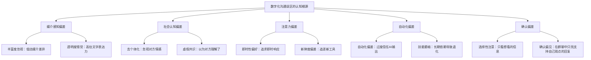
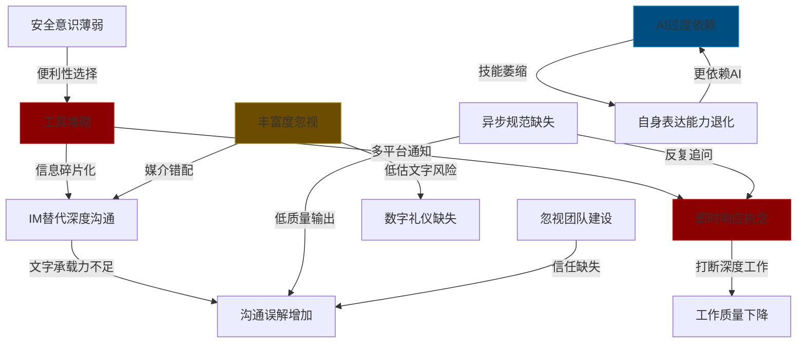

## 九、数字化沟通的常见误区

> 数字化沟通中的误区，表面上是"方法不对"，根子里是"认知偏差"。人类大脑进化于面对面交流的环境，却要在一个没有语调、没有表情、没有边界的数字世界中沟通——认知系统与技术环境的错配，是所有误区的源头。本节从认知心理学和传播学理论出发，系统剖析数字化沟通误区的形成机制，为后续的实操纠正提供理论根基。

### 9.1 误区的认知科学根源

在逐一拆解具体误区之前，先建立一个统一的分析框架：数字化沟通中的误区不是随机发生的，它们背后有系统的认知偏差和心理学机制在驱动。

#### 9.1.1 认知偏差与沟通失误的关系

认知心理学研究表明，人类决策和行为受到数百种系统性认知偏差的影响。在数字化沟通场景中，以下五类偏差最为活跃：

这五类偏差并非彼此独立——它们往往同时作用、相互放大。例如，"透明度错觉"让人高估文字消息的表达力（媒介感知偏差），而去个体化效应让人忽视接收者的情感需求（社会认知偏差），两者叠加的结果就是：发送者写了一段自以为很清楚的消息，接收者却读出了完全不同的意思。

#### 9.1.2 技术可供性理论视角

James Gibson在1977年提出的**可供性**（Affordance）概念，后来被传播学者延伸为**技术可供性理论**（Technology Affordance Theory），为理解数字化沟通误区提供了一个有力的分析框架。

**可供性**指的是技术环境为用户提供的行动可能性。不同的沟通工具具有不同的可供性，这些可供性既赋能也限制了用户的沟通行为：

| 沟通工具 | 关键可供性 | 赋能效果 | 限制效果 | 容易引发的误区 |
|----------|-----------|----------|----------|--------------|
| 即时通讯 | 即时性、碎片化、低门槛 | 快速沟通、低摩擦交流 | 信息碎片化、深度不足 | 用IM替代深度沟通 |
| 视频会议 | 视觉线索、同步互动、多人参与 | 情感传递、实时讨论 | 时间刚性、会议疲劳 | 视频会议万能化 |
| 协作文档 | 持久性、可编辑、版本控制 | 异步协作、知识沉淀 | 缺乏即时反馈、编辑冲突 | 忽视异步规范 |
| AI助手 | 生成速度、知识广度、模板化 | 效率提升、质量保证 | 幻觉风险、同质化 | AI过度依赖 |
| 邮件 | 正式性、可追溯、异步 | 正式记录、跨组织沟通 | 反馈延迟、信息堆积 | 邮件过载 |

技术可供性理论揭示了一个关键洞察：**误区的产生不是因为用户"笨"或"懒"，而是因为工具的可供性引导了特定的行为模式。** 即时通讯的即时性可供性天然地鼓励碎片化交流；视频会议的多人参与可供性天然地鼓励"所有人都来开会"。认识到这一点，才能从"指责个人行为"转向"设计更好的沟通系统"。

#### 9.1.3 双加工理论与沟通模式选择

Daniel Kahneman在《思考，快与慢》中提出的**双加工理论**（Dual Process Theory）可以解释人们在选择沟通方式时的决策过程：

- **系统1（快思考）**：自动化、直觉性、低认知负荷。当人们收到一条消息需要回复时，系统1倾向于选择"最快的路径"——直接打字回复、发起一个会议、复制粘贴之前用过的模板。这种快速决策在简单场景中是高效的，但在复杂场景中容易踩坑。

- **系统2（慢思考）**：分析性、反思性、高认知负荷。面对复杂沟通场景时，系统2会分析：这个话题需要什么丰富度的媒介？接收者在什么状态下会读到这条消息？用什么结构组织信息最清晰？

**大多数数字化沟通误区的共同特征是：在应该启动系统2的场景中，人们却依赖系统1做出了直觉性决策。** 比如，一个复杂的架构决策，系统1会说"开个会讨论一下吧"（最省力的路径），但系统2会分析：也许应该先写一份异步文档，让每个人有时间独立思考，再安排一个有针对性的会议。

认识到这一点，纠正误区的核心方法不是"告诉用户正确做法"（用户可能已经知道），而是**设计决策提示和流程卡点**，在关键时刻"唤醒"系统2。这正是后续各误区"纠正方法"部分的底层逻辑。

### 9.2 误区一：工具堆砌——"越多越好"的丰富度幻觉

#### 理论机制：注意力残留与切换代价

工具过多的问题，本质上是**注意力残留**（Attention Residue）问题。明尼苏达大学Sophie Leroy教授在2009年的研究中发现，当人从任务A切换到任务B时，关于任务A的认知惯性会残留在工作记忆中，降低任务B的执行效率和质量。这种残留效应在任务A未完成时尤为强烈。

将这一发现应用到数字化沟通场景：每切换一个工具，就是一次任务切换。打开微信意味着进入"即时回复"的心理模式，切换到飞书文档意味着进入"深度阅读"模式，切换到Jira意味着进入"结构化思考"模式。UC Irvine的Gloria Mark教授在2023年的研究中量化了这种代价：**从一次干扰中恢复到深度工作状态，平均需要23分钟**。

当团队同时使用5个以上沟通工具时，每个员工每天面临数十次工具切换，累计的认知代价是巨大的：

| 同时使用工具数 | 日均切换次数 | 累计切换耗时（分钟） | 信息遗漏率 |
|---------------|------------|-------------------|-----------|
| 2-3个 | 8-12次 | 30-50 | 5% |
| 4-5个 | 15-25次 | 60-100 | 12% |
| 6-8个 | 30-50次 | 120-200 | 22% |
| 8个以上 | 50次以上 | 200分钟以上 | 30%以上 |

#### 信息碎片化与组织记忆丧失

从分布式认知理论的视角看，工具堆砌还会导致**组织记忆的碎片化**。分布式认知理论认为，团队的知识不仅存储在个人大脑中，还分布在工具、文档和沟通记录中。当这些知识分散在多个平台上时，任何单个平台都无法成为"可信赖的信息源"，团队成员被迫在多个平台之间"考古"式搜索——这本质上是分布式认知系统的架构失败。

更严重的是，当某个平台被弃用或员工离职时，该平台上积累的沟通脉络和隐性知识随之消失。这不像丢失一个文件那么明显，而是像从大脑中删除了一个区域——相关的记忆碎片还在其他地方，但它们之间的连接断裂了。

#### 纠正的理论原则

基于上述分析，纠正工具堆砌的核心原则是**认知经济性原则**（Cognitive Economy Principle）：在满足沟通需求的前提下，最小化工具数量和切换频率。具体方法是建立"工具分层架构"——将沟通需求分为几个层次，每个层次指定一个主力工具，而不是为每个需求场景都创建一个新工具。详细的纠正步骤和模板见第四节误区一。

### 9.3 误区二：即时响应执念——"秒回文化"的注意力灾难

#### 理论机制：即时性偏好与认知隧道

人类认知系统存在一种根深蒂固的**即时性偏好**（Present Bias）——人们系统性地高估即时回报的价值，低估延迟回报的价值。在沟通场景中，这种偏好表现为：发出消息后期望立即得到回复，收到消息后感到必须立即回复。

这种偏好与即时通讯工具的可供性完美耦合——"已读"标记、打字状态指示器、推送通知，这些设计特征都在强化"即时响应"的行为模式。从操作性条件反射的角度看，即时回复带来了即时的社会奖励（对方的认可、焦虑的消除），而延迟回复带来了不确定性惩罚——这形成了一种行为强化循环。

#### 深度工作与心流的代价

Cal Newport在《深度工作》（Deep Work）中系统论证了一个核心观点：在知识经济时代，深度工作能力是稀缺而珍贵的。深度工作需要**持续的、不被打断的注意力集中**，而即时响应文化从根本上破坏了这种能力。

Mihaly Csikszentmihalyi的**心流理论**（Flow Theory）进一步阐明了问题的严重性。心流状态——完全沉浸在某项活动中的最优体验——需要以下条件：

1. 明确的目标
2. 即时的反馈
3. 挑战与技能的平衡
4. **不被打断的注意力集中**

第四个条件被即时响应文化彻底摧毁。研究表明，从心流状态中被打断后，恢复到心流状态平均需要**15-25分钟**。如果一个人每天被打断20次（在即时通讯文化中这很常见），理论上他一天中根本没有时间进入心流状态。

| 工作模式 | 日均深度工作时间 | 心流状态次数 | 知识产出质量 |
|----------|----------------|------------|------------|
| 即时响应模式 | 1.5-2小时 | 0-1次 | 基准 |
| 批量响应模式（每2小时检查一次） | 4-5小时 | 2-3次 | 提升60-80% |
| 深度工作优先模式（固定时间响应） | 6-7小时 | 3-4次 | 提升100-150% |

#### 异步优先原则的理论依据

从媒体同步性理论的视角看，纠正即时响应执念的关键是认识到：**同步性是一种资源，应该用在真正需要的场景中，而不是默认状态。** Dennis和Valacich在2008年提出的媒体同步性理论区分了两种沟通需求：

- **信息传递**（Information Transfer）：将事实性信息从A传到B。这种需求对同步性要求低，异步方式通常更高效。
- **信息收敛**（Information Convergence）：多人需要就模糊或有分歧的问题达成共识。这种需求对同步性要求高，需要实时交互。

即时响应文化的根本错误是将所有沟通都当作"信息收敛"来处理——即使是一条简单的状态更新，也期望对方实时看到并回应。正确的做法是将"信息传递"回归异步，只在"信息收敛"场景中使用同步沟通。

### 9.4 误区三：丰富度忽视——媒介选择的认知惰性

#### 理论机制：透明度错觉与媒介惯性

**透明度错觉**（Illusion of Transparency）是心理学家Thomas Gilovich等人在1998年系统研究的一种认知偏差——人们系统性地高估他人理解自己内心状态的能力。在数字化沟通中，这种错觉表现为：发送者认为自己在文字消息中的语气、意图和情感是"显而易见的"，但接收者实际能准确感知的远比发送者预期的少。

哥伦比亚大学的Michael Morris和同事们的研究发现了一个惊人的数据：**发送者对自身消息语气清晰度的评分，平均比接收者对同一条消息的理解准确度高出40%。** 换句话说，你以为自己说得很清楚，但对方接收到的信息只有你以为的一半。

Albert Mehrabian在1971年提出的**7-38-55法则**（虽然这个数字经常被误读和过度泛化）揭示了一个基本事实：在涉及情感和态度的沟通中，语言内容只占信息传递的一小部分，语调（38%）和肢体语言（55%）承担了绝大部分情感信号。纯文字消息剥离了语调和肢体语言两个通道，只保留了最弱的那一个。

#### 媒介丰富度匹配的系统性失败

回到Daft和Lengel的媒体丰富度理论，误区三的本质是**媒介丰富度与信息复杂度的系统性错配**。这种错配有两种表现形式：

**错配类型一：丰富度不足（Under-richest）**——用低丰富度媒介处理高复杂度信息。典型场景：
- 在群聊中讨论技术架构决策
- 用文字消息进行绩效反馈
- 通过邮件调解团队冲突

**错配类型二：丰富度过剩（Over-richest）**——用高丰富度媒介处理低复杂度信息。典型场景：
- 开一个60分钟的会议来同步一个简单的进度更新
- 打电话告诉对方一个链接
- 安排视频会议来宣布一个已确定的决定

两种错配都会造成效率损失，但在实践中，第一种错配更常见、危害更大——因为它直接导致误解、冲突和决策质量下降。

#### 沟通复杂度分级模型

为了系统性地解决丰富度忽视问题，需要建立一个**沟通复杂度分级模型**，将每种沟通场景映射到最合适的媒介：

| 复杂度等级 | 特征描述 | 信息不确定性 | 情感负载 | 推荐丰富度 | 典型媒介 |
|-----------|---------|------------|---------|-----------|---------|
| Level 1：通知 | 单向信息传递，无需讨论 | 低 | 无 | 低 | 公告、邮件、即时消息 |
| Level 2：协调 | 简单双向信息交换 | 低-中 | 低 | 中低 | 即时消息、电话 |
| Level 3：讨论 | 需要交换多个观点 | 中 | 中 | 中高 | 语音会议、视频会议 |
| Level 4：决策 | 有分歧的复杂问题 | 高 | 中-高 | 高 | 视频会议 + 会前文档 |
| Level 5：敏感对话 | 人事、冲突、谈判 | 高 | 高 | 最高 | 面对面 / 视频1对1 |

这个模型的理论基础是**信息丰度需求理论**——信息的不确定性和模糊性越高，沟通所需的媒介丰富度就越高。当信息简单明确时，低丰富度媒介完全足够；当信息复杂模糊且涉及情感时，必须使用高丰富度媒介才能有效传递完整信息。

### 9.5 误区四：异步规范缺失——"自包含"能力的系统性欠缺

#### 理论机制：共同知识幻觉与认知负荷转移

异步沟通失效的深层原因涉及两个认知机制：

**共同知识幻觉**（Illusion of Shared Knowledge）：发送者假设接收者拥有与自己相同的背景知识，因此省略了大量"显而易见"的上下文。但这些被省略的上下文对理解完整信息至关重要。Stigler和Loewenstein在教育经济学中的研究将这种现象称为"知识的诅咒"（Curse of Knowledge）——知道一件事之后，就很难想象不知道这件事是什么感觉。

在异步沟通中，这种幻觉的危害被放大：同步沟通有即时反馈回路——你看到对方困惑的表情可以立刻补充说明。异步沟通没有这个安全网，信息一旦发出，接收者要么自行脑补缺失的上下文（可能导致误解），要么追问（增加沟通轮次和时间成本）。

**认知负荷转移**：大多数人的直觉是"发消息比开会简单"，但恰恰相反。同步沟通中，发送者可以通过语调、手势、即时反馈来补充信息，认知负荷是分布式的、实时的。异步沟通要求发送者在**发送的一瞬间**就提供完整的、自包含的信息，所有认知负荷集中在发送者身上。这要求发送者具备更强的换位思考能力和文字组织能力。

Richard Mayer的**认知负荷理论**（Cognitive Load Theory）为理解这一问题提供了框架。认知负荷分为三类：

| 负荷类型 | 定义 | 在异步沟通中的表现 |
|----------|------|-------------------|
| 内在认知负荷 | 信息本身的复杂度 | 讨论的技术/业务难度 |
| 外在认知负荷 | 信息呈现方式增加的负荷 | 消息结构混乱、缺少上下文 |
| 关联认知负荷 | 用于学习和理解的投入 | 接收者自行脑补缺失信息 |

异步规范缺失的问题在于：它增加了接收者的外在认知负荷（混乱的信息结构）和关联认知负荷（需要自行补全上下文），挤占了用于理解核心信息的认知资源。

#### 自包含原则与CRISP标准

基于上述分析，有效异步沟通的核心原则是**自包含**（Self-Contained）：接收者不需要任何额外上下文就能理解信息的全部含义。这意味着发送者必须承担"角色采择"（Perspective Taking）的认知工作——站在接收者的角度思考：我知道什么？不知道什么？需要知道什么？

实操层面，可以用**CRISP标准**作为异步信息的质量检查框架：

- **C**ontext（上下文）：提供接收者理解信息所需的全部背景
- **R**equirement（需求）：明确期望对方做什么
- **I**ntent（意图）：说明为什么发这条消息
- **S**tructure（结构）：使用标题、列表、分段组织信息
- **P**riority（优先级）：标注紧急程度和期望响应时间

详细的异步沟通模板和场景化指南见第四节误区四。

### 9.6 误区五：AI过度依赖——自动化偏差与技能萎缩

#### 理论机制：自动化偏差的系统性风险

**自动化偏差**（Automation Bias）是指人类倾向于过度信任自动化系统的输出，即使输出明显有误。这一概念最早在航空领域被发现——飞行员过度依赖自动驾驶系统，在系统出错时未能及时接管——如今在AI辅助沟通领域同样适用。

Parasuraman和Riley在1997年的经典研究中将自动化偏差的表现分为两类：

1. **遗漏型错误**（Errors of Omission）：自动化系统没有给出提示，人也就不去检查——"AI没有标记问题，说明没有问题"。
2. **委托型错误**（Errors of Commission）：自动化系统给出了错误建议，人不加辨别地采纳——"AI建议这样写，应该没问题"。

在AI辅助沟通场景中，这两种错误都频繁出现：
- 遗漏型：AI翻译没有标注存疑的术语，用户就直接使用了错误的翻译
- 委托型：AI生成的邮件包含过时的数据引用，用户未经核实就发送了

#### 技能萎缩的长期效应

比自动化偏差更隐蔽的长期风险是**技能萎缩**（Skill Atrophy）。当人们长期依赖某种外部工具而不练习某项技能时，这项技能会退化。这一现象在多个领域已有实证：

- **航空领域**：过度依赖自动驾驶的飞行员，在手动操作时的熟练度下降（FAA 2013年报告）
- **医疗领域**：过度依赖影像诊断AI的放射科医生，在AI不可用时诊断准确率下降33%（Lancet Digital Health, 2024）
- **导航领域**：长期使用GPS的人，空间导航能力和方向感显著弱于使用纸质地图的人（Science, 2020）

将这一逻辑延伸到沟通领域：长期依赖AI写邮件的人，自己提笔写一封得体的邮件会越来越吃力；长期依赖AI翻译的人，自身的跨语言表达能力会退化。技能萎缩不是突然发生的，而是一个渐进的、不易察觉的过程——等到你意识到自己"已经不会写了"的时候，退化已经相当严重了。

#### AI辅助沟通的"人机协作"理论模型

纠正AI过度依赖的关键不是拒绝AI，而是建立一个**人机协作的分工模型**，明确哪些工作交给AI、哪些必须由人完成：

| 工作环节 | 适合AI | 适合人类 | 核心理由 |
|----------|--------|---------|---------|
| 初稿生成 | ✅ | — | AI擅长快速生成结构化文本 |
| 事实核查 | — | ✅ | AI可能编造事实，必须人工验证 |
| 语气调整 | 辅助 | ✅ | 语气是关系和情境的函数，AI难以把握 |
| 敏感信息处理 | — | ✅ | 涉及隐私和安全，不可委托AI |
| 专业术语校准 | 辅助 | ✅ | AI可能使用错误的行业术语 |
| 个性化表达 | — | ✅ | 个人风格是沟通信任的基础 |
| 多语言翻译 | ✅ | 审校 | AI翻译快速但需人工校准专业语境 |
| 文档结构化 | ✅ | 审核 | AI擅长格式化，但结构逻辑需人工判断 |

核心原则：**AI做"粗活"，人做"判断"。** AI的价值在于处理认知负荷低但耗时的工作（生成初稿、格式化、翻译），人专注于需要判断力和情感智慧的环节（事实核查、语气调整、个性化表达）。

### 9.7 误区六至八：行为习惯层面的系统性缺陷

除了上述五个与认知机制直接相关的误区外，数字化沟通中还有三个根植于行为习惯的系统性误区。这些误区的共同特征是：不是"不知道正确做法"，而是"知道但做不到"——问题在于习惯系统，而非认知系统。

#### 9.7.1 数字礼仪缺失——去个体化效应与共情缺口

**去个体化效应**（Deindividuation）是社会心理学中的一个经典概念，由Festinger等人在1952年提出，后经Zimbardo系统发展。在线上沟通中，人们看不到对方的面部表情和肢体语言，对方被简化为"一个头像和一行文字"而非"一个有情感的人"。这种心理距离降低了社交约束，使人更容易做出在面对面场景中不会做的事情。

共情缺口进一步加剧了这个问题。研究表明，发送者在发送消息时系统性地**高估了接收者理解自己意图的能力**——你以为你的语气是友好的，但接收者可能读出了冷漠甚至敌意。文字消息丢失了语调（38%的情感信号）和肢体语言（55%的情感信号），只保留了语言内容这个最弱的通道。

纠正的理论原则：**在发送任何可能产生情感解读的消息之前，执行"共情模拟"——想象自己是接收者，在不知道发送者心情和上下文的情况下，会如何解读这条消息。**

#### 9.7.2 信息安全意识薄弱——便利性偏见与风险感知偏差

人们在信息安全问题上存在两种系统性的风险感知偏差：

1. **乐观偏差**（Optimism Bias）：人们系统性地低估自己遭遇负面事件的概率。"数据泄露不会发生在我身上"是典型的乐观偏差。

2. **当下偏差**（Present Bias）：人们对即时便利的偏好远超对未来风险的考量。"现在方便最重要，安全问题以后再说"——但"以后"永远不会到来。

IBM《2024年数据泄露成本报告》的数据显示，74%的数据泄露涉及人为因素，其中"无意的内部人员错误"是最大的单一原因。这意味着信息安全的最大威胁不是外部黑客，而是内部人员的便利性选择。

#### 9.7.3 忽视远程团队建设——弱关系理论与社会连接需求

社会学家Mark Granovetter在1973年提出的**弱关系理论**（Strength of Weak Ties）指出，非亲密的社交连接在信息流通和社会支持中扮演着关键角色。在传统办公室中，弱关系通过茶水间闲聊、午餐偶遇、电梯寒暄自然形成。远程环境中，这些"偶遇"场景完全消失，弱关系需要被主动创造和维护。

Buffer的《2024远程工作状态报告》指出，远程工作者最大的挑战不是生产力，而是**孤独感（23%）和与团队断联感（16%）**。当团队成员之间只有工作关系时，信息流动受阻，冲突更容易升级——因为没有情感缓冲，一次工作分歧可能直接破坏合作关系。

### 9.8 误区的系统性关联与诊断框架

#### 误区之间的因果链条

八大误区不是孤立存在的，它们之间存在因果链条和放大效应：

理解这些因果链条对于诊断和纠正至关重要——如果只解决表面症状（比如"减少会议数量"），但不解决根因（比如"工具堆砌导致信息碎片化，信息碎片化又倒逼开会来同步"），问题会反复出现。

#### 基于理论的误区诊断模型

综合上述理论分析，建立一个四维诊断模型，帮助个人和团队识别自身最突出的误区：

| 诊断维度 | 检查问题 | 对应误区 | 理论依据 |
|----------|---------|----------|---------|
| **媒介匹配度** | 是否为每种沟通场景选择了合适丰富度的媒介？ | 误区三（丰富度忽视） | 媒体丰富度理论 |
| **注意力保护度** | 是否有效保护了深度工作时间？ | 误区二（即时响应执念） | 深度工作理论、心流理论 |
| **信息自包含度** | 异步信息是否无需追问即可理解？ | 误区四（异步规范缺失） | 认知负荷理论、共同知识幻觉 |
| **工具效率度** | 当前工具栈是否最小化了切换成本？ | 误区一（工具堆砌） | 注意力残留理论 |
| **人机分工度** | AI是否用于辅助而非替代人的判断？ | 误区五（AI过度依赖） | 自动化偏差、技能萎缩理论 |
| **社交温度度** | 沟通中是否保留了人际温度和情感连接？ | 误区六（数字礼仪）/误区八（远程建设） | 去个体化效应、弱关系理论 |
| **安全合规度** | 是否在便利性和安全性之间取得了平衡？ | 误区七（安全意识薄弱） | 乐观偏差、当下偏差 |

#### 从误区到纠正的理论路径

认知科学的研究表明，改变行为模式有两条路径：

**路径一：认知干预**——通过教育和意识提升，让人们认识到自身的认知偏差。这条路径见效快（一次培训就能让人"知道"问题），但维持短（如果没有系统支持，两周内就会回到旧习惯）。

**路径二：环境设计**——通过改变技术环境和流程规范，让"正确的行为"成为阻力最小的路径。这条路径见效慢（需要组织层面的系统变革），但效果持久。

最有效的方法是两者结合：

1. **先认知干预**：让团队理解误区背后的认知机制（本节内容）
2. **再环境设计**：建立工具规范、沟通协议、流程卡点（第四节内容）
3. **持续强化**：通过定期回顾和反馈机制，将新行为固化为习惯

```mermaid
graph LR
    A[认知干预] -->|建立意识| B[行为改变]
    C[环境设计] -->|降低阻力| B
    B -->|持续练习| D[习惯固化]
    D -->|内化为默认模式| E[沟通文化升级]

    style A fill:#2d5a27,stroke:#4a8
    style C fill:#3a3a5c,stroke:#668
    style E fill:#5a2d4a,stroke:#a48
```

### 9.9 理论小结

数字化沟通误区不是"坏习惯"那么简单——它们根植于人类认知系统的固有局限性：注意力残留让我们在工具切换中损耗效率，透明度错觉让我们高估文字的表达力，自动化偏差让我们盲目信任AI的输出，即时性偏好让我们牺牲深度工作换取虚假的"高效感"。

理解这些认知机制的价值在于：它让我们从"自责"转向"自知"。误区不是因为你不够聪明或不够努力，而是因为你的大脑在用旧的操作系统处理新的技术环境。认识到这一点，纠正误区的方法就不再是"靠意志力硬撑"，而是**通过环境设计和流程机制来弥补认知系统的短板**——让正确的行为成为阻力最小的路径。

具体来说：
- **媒介匹配问题**（误区三）→ 建立沟通复杂度分级与媒介匹配矩阵
- **注意力保护问题**（误区二）→ 设定异步优先策略和无会议时间段
- **异步质量问题**（误区四）→ 采用CRISP标准和场景化模板
- **工具精简问题**（误区一）→ 执行工具审计和3+1工具栈模型
- **AI使用问题**（误区五）→ 建立人机协作分工和三不三必原则
- **行为习惯问题**（误区六、七、八）→ 制定团队沟通公约和安全基线

这些具体的纠正方法和实操模板，将在第四节"常见误区"中详细展开。本节提供的理论框架，是理解那些方法"为什么有效"的基础——知道原理，才能灵活运用，而不是机械地套用固定流程。

***
