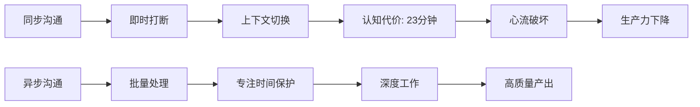
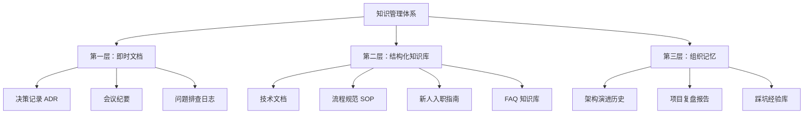
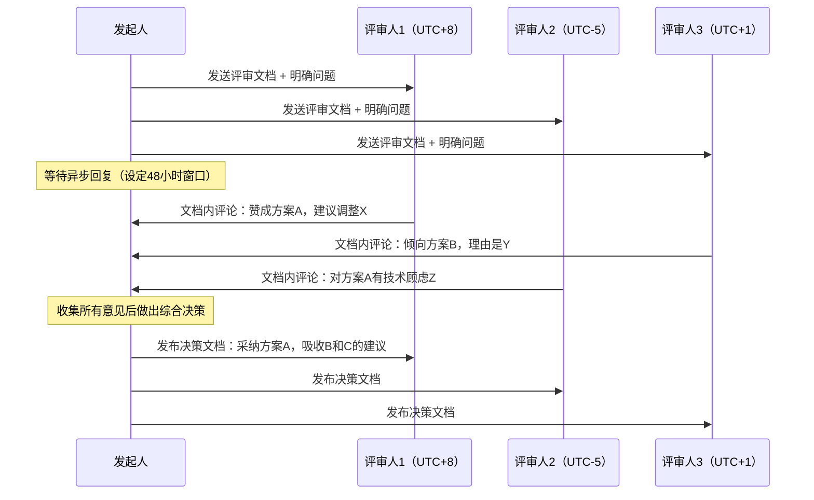

## 十、异步沟通的深度实践

### 10.1 重新理解异步沟通：不只是"晚点回复"

大多数人对异步沟通的理解停留在"收到消息不立刻回复"。这个理解只触及了表层。异步沟通的本质是一种**信息传递范式**——发送者在接收者不在场的情况下完整表达意图，接收者在自己选择的时间进行处理和回应，整个过程不要求双方同时在线。

这个定义包含三个关键要素：

**时间解耦**——发送和接收发生在不同时刻。发送者无需等待接收者就绪，接收者无需打断当前工作来响应。这不是偷懒，而是对双方认知资源的尊重。

**上下文自包含**——异步消息必须携带足够的上下文信息，使接收者无需追问就能理解并行动。一条好的异步消息等价于一个微型的"问题描述文档"，包含背景、现状、期望和行动项。

**意图完整性**——异步沟通要求发送者在发出消息前完成完整的思考。你不能用"在吗？"开头然后等对方回复后再组织语言，你必须一次性把事情说清楚。这个约束反向提升了发送者的思考质量。

#### 10.1.1 同步与异步的认知科学基础

为什么异步沟通在某些场景下远优于同步沟通？答案藏在人类认知机制中。

**上下文切换的认知代价**。加州大学欧文分校的 Gloria Mark 教授在研究中发现，知识工作者被打断后平均需要**23分钟15秒**才能完全恢复到被打断前的专注状态。这不是夸张——当你从深度编码状态被一条"在吗？"拉出来，你的大脑需要时间重新加载工作记忆中的所有变量、逻辑链路和设计意图。每一次非必要的同步打断，都是一次认知资源的强制回收。

**工作记忆的容量限制**。心理学家 George Miller 提出的"7±2法则"表明，人的工作记忆同时只能处理有限的信息块。同步沟通——尤其是会议和实时聊天——持续向工作记忆注入新信息，导致认知过载。异步沟通允许接收者按自己的节奏消化信息，将新内容与已有知识整合后再回应。

**心流状态的保护**。心理学家 Mihaly Csikszentmihalyi 提出的"心流"概念描述了一种完全沉浸于任务的最佳认知状态。心流状态的进入需要约15分钟不被打扰的时间，而破坏它只需要一条即时消息。异步沟通是保护团队心流状态的制度性手段。



#### 10.1.2 异步沟通的适用边界

异步沟通不是万能的。明确它的适用边界，才能正确使用。

| 维度 | 适合异步 | 适合同步 |
|------|----------|----------|
| 信息类型 | 事实陈述、文档分享、状态更新、决策请求 | 头脑风暴、情感支持、冲突调解、复杂谈判 |
| 时间敏感度 | 不需要立即回应（容忍2-48小时延迟） | 需要即时互动（几分钟内必须有结果） |
| 情感强度 | 低情感负载的事务性沟通 | 高情感负载的人际沟通 |
| 复杂度 | 问题明确、选项有限、可独立分析 | 问题模糊、需要多轮探索、涉及多方利益 |
| 决策类型 | 信息收集、方案评审、技术决策 | 战略方向、危机应对、人事决策 |

一个实用的判断标准：**如果你能在一封邮件中把事情说清楚，就不要开会议。如果一个议题需要超过3轮异步讨论才能达成共识，就切换到同步沟通。**

### 10.2 异步消息的结构化写作框架

异步沟通的质量瓶颈不在工具，而在写作能力。一条结构化的异步消息应该让接收者在30秒内完成"理解-判断-行动"的认知过程。

#### 10.2.1 SCQA 消息结构

借鉴麦肯锡的金字塔写作原理，异步消息推荐使用 SCQA 结构：

SCQA 异步消息框架
━━━━━━━━━━━━━━━━━━━━━━━━━━━━━━━━
Situation（背景）：发生了什么/当前状态是什么
  → 一句话交代上下文，让接收者快速进入场景

Complication（问题/冲突）：出了什么问题/有什么分歧
  → 指出关键矛盾或需要解决的问题

Question（问题）：需要回答什么/需要做什么决策
  → 明确你需要对方做的事情

Answer（建议/方案）：你的建议/需要的行动项
  → 给出你的思考和建议，降低对方的认知负担

附加信息：
  [优先级] 🔴紧急 🟡重要 🟢一般 🔵参考
  [期望回复] 具体日期/时间
  [相关链接] 文档/代码/设计稿链接
━━━━━━━━━━━━━━━━━━━━━━━━━━━━━━━━

#### 10.2.2 不同场景的消息模板

**场景一：技术方案评审请求**

Subject: [评审请求] 用户认证模块重构方案

背景：
当前用户认证模块基于 session-cookie 方案，已运行3年。
近期遇到两个问题：（1）多端登录状态不一致；（2）token 刷新机制导致约2%的用户登录中断。

问题：
需要将认证方案迁移到 JWT + Refresh Token 架构。

我的建议：
采用渐进式迁移方案，分三个阶段：
阶段一（1周）：新建 JWT 签发服务，与现有 session 服务并行
阶段二（2周）：客户端逐步切换到 JWT，保留 session 降级路径
阶段三（1周）：下线 session 服务，清理遗留代码

详细方案文档：[链接]
技术风险评估：[链接]

需要你做的：
1. 评审方案的技术可行性
2. 确认阶段二的客户端改动范围是否可接受
3. 如果有补充意见，在文档中直接评论

[优先级] 🟡重要
[期望回复] 周五（6月27日）前

**场景二：跨时区工作交接**

Subject: [工作交接] API 网关性能优化 - Day 3 进展

今日完成：
✅ 完成压测基线数据采集（详见附件 benchmark-baseline.csv）
✅ 识别出主要瓶颈：数据库连接池在高并发下阻塞（P99 延迟从 50ms 飙升到 800ms）
✅ 尝试方案A：增大连接池上限到 200，效果不佳（P99 降到 600ms，内存占用增长40%）

明日计划：
→ 尝试方案B：引入连接池复用 + 请求队列机制
→ 参考链接：[同类问题的业界解决方案]

阻塞项：
无，但需要确认：生产环境的数据库实例规格是多少？这决定了连接池的合理上限。

已知风险：
当前压测覆盖了正常流量模式，但未覆盖突发流量（如定时任务触发的批量请求），
建议后续补充压测场景。

[优先级] 🟢一般
[期望回复] 你的工作时间段开始时确认即可

**场景三：决策请求**

Subject: [决策请求] 前端框架选型 - React vs Vue

背景：
新项目"智能报表平台"前端技术栈待定。团队现有 Vue 项目3个，React 项目1个。

选项对比：
┌─────────┬──────────────┬──────────────┐
│ 维度    │ React        │ Vue          │
├─────────┼──────────────┼──────────────┤
│ 团队熟练│ 2人精通      │ 5人精通      │
│ 生态丰富│ ⭐⭐⭐⭐⭐   │ ⭐⭐⭐⭐     │
│ 长期维护│ Meta支持     │ 社区驱动     │
│ 学习成本│ 中等         │ 较低         │
│ 与现有项│ 需新学       │ 可复用经验   │
└─────────┴──────────────┴──────────────┘

我的建议：
选择 Vue 3 + Composition API。理由：
1. 团队5人精通 vs 2人精通，协作成本更低
2. 新项目可复用现有 Vue 项目的组件库和工程化配置
3. Vue 3 的 Composition API 弥补了 Vue 2 在大型项目中的短板

反面观点：
React 生态更丰富，如果项目未来需要大量第三方组件，React 可能更有优势。

需要你做的：
确认技术选型方向，或者指出需要进一步论证的点。

[优先级] 🟡重要
[期望回复] 本周内

#### 10.2.3 消息质量自检清单

发出异步消息前，用以下清单自检：

□ 接收者能否在不追问的情况下理解这条消息？
□ 是否明确说明了"需要对方做什么"？
□ 是否给出了期望的回复时间？
□ 是否标注了优先级？
□ 消息长度是否合理？（太短=信息不足，太长=核心被淹没）
□ 是否避免了"在吗？""方便吗？"等无效开场？
□ 相关链接和附件是否已包含？
□ 语气是否专业且不带情绪压力？

### 10.3 录屏沟通：异步沟通的杀手级工具

文字擅长传递结构化信息，但有些场景——操作演示、UI 交互、代码走查——文字的表达效率极低。录屏（asynchronous video）填补了这个空白。它结合了视频的直观性和异步的灵活性，是远程团队提升沟通效率的利器。

#### 10.3.1 录屏的核心优势

**降低解释成本**。一个30秒的录屏可以替代500字的步骤描述，而且消除了文字描述中的歧义。"点击右上角的那个按钮"——哪个按钮？录屏一目了然。

**保留语调和上下文**。文字消息容易被误读语气。录屏中的语调、停顿、强调，都能传递文字无法承载的情感和意图信息。

**可反复回看**。会议的录音很少有人回看，但一个3分钟的操作录屏可以被反复播放、暂停、对照操作。这是知识传递的高效载体。

#### 10.3.2 录屏的适用场景与最佳实践

| 场景 | 录屏时长建议 | 关键要点 |
|------|-------------|----------|
| Bug 复现演示 | 1-2 分钟 | 清晰展示触发条件和预期 vs 实际行为 |
| 代码审查讲解 | 3-5 分钟 | 聚焦关键变更，解释设计意图而非逐行念代码 |
| 产品功能演示 | 2-4 分钟 | 以用户故事为线索，展示核心使用流程 |
| 方案设计讲解 | 5-8 分钟 | 配合架构图/流程图，先讲全局再讲细节 |
| 新人培训 | 每段 3-5 分钟 | 按主题拆分，不做45分钟长视频 |
| 工作交接 | 5-10 分钟 | 结构化为：项目概览→关键决策→已知问题→后续计划 |

#### 10.3.3 录屏脚本的深度结构

一个高质量的录屏不是即兴发挥，而是有脚本的结构化表达：

录屏脚本模板（进阶版）
━━━━━━━━━━━━━━━━━━━━━━━━━━━━━━━━

一、开场锚定（15-30秒）
   "我是 [姓名]，本次录屏目的是 [一句话说清]，预计 [X] 分钟。"
   → 开场必须回答三个问题：你是谁？你要说什么？我要听多久？

二、上下文铺设（30秒-1分钟）
   "这个需求/问题的背景是……"
   "相关的上下文是……"
   → 确保观众在不追问的情况下能理解后续内容

三、核心内容（2-5分钟）
   根据内容类型选择结构：

   类型A - 操作演示：
   Step 1 → 操作 → 结果 → 解释为什么
   Step 2 → 操作 → 结果 → 解释为什么
   ...

   类型B - 方案讲解：
   全局架构图 → 逐层深入 → 关键设计决策 → 取舍分析

   类型C - 问题分析：
   现象描述 → 复现步骤 → 根因分析 → 修复方案

四、总结与行动项（15-30秒）
   "总结一下，核心要点是 [1-2-3]"
   "需要你做的行动是 [具体事项]，期望回复时间是 [时间]"

五、后期处理（建议）
   - 添加章节标记（便于跳转到特定部分）
   - 添加字幕（方便在不方便开声音的场景观看）
   - 倍速选项（让赶时间的观众1.5x快速浏览）
━━━━━━━━━━━━━━━━━━━━━━━━━━━━━━━━

#### 10.3.4 录屏工具选型

| 工具 | 平台 | 核心特点 | 适用场景 | 价格 |
|------|------|----------|----------|------|
| Loom | Web/桌面/移动端 | 自动生成字幕，支持评论和表情反馈 | 团队异步沟通首选 | 免费版25条/月 |
| OBS Studio | 桌面 | 开源免费，高度可定制，支持多场景切换 | 需要精细控制的录制 | 免费 |
| 录咖（Reccloud） | Web | 中文友好，支持在线编辑和云存储 | 国内团队 | 免费基础版 |
| Screen Studio | macOS | 自动缩放光标区域，画面精美 | Mac 用户的产品演示 | $89买断 |
| Kap | macOS | 开源轻量，快速录制GIF/MP4 | 快速录制短片段 | 免费 |
| 飞书妙记 | Web | 飞书生态内无缝集成，自动转文字 | 飞书用户 | 随飞书套餐 |

**选择建议**：如果你的团队使用飞书/钉钉/企业微信，优先使用其内置的录屏功能，因为它与消息系统无缝集成，分享零成本。如果需要跨平台或更专业的录制，Loom 和 OBS Studio 是最成熟的选择。

### 10.4 知识管理：异步沟通的基础设施

异步沟通的前提是信息可检索。如果每次异步沟通的结果都沉没在聊天记录中，团队就会反复问同样的问题、反复做同样的决策。知识管理是异步沟通的基础设施。

#### 10.4.1 文档化的三层架构



**第一层：即时文档——捕捉当下决策**

每次做出重要决策时，花5分钟记录以下内容。这就是业界广泛采用的 ADR（Architecture Decision Record）模式：

```markdown
# ADR-001: 选择 PostgreSQL 作为主数据库

## 状态：已采纳

## 背景：
项目需要一个关系型数据库存储用户数据和交易记录。
数据量预估：首年 500万用户，日均交易 100万笔。

## 决策：
选择 PostgreSQL 15，不选择 MySQL 8.0。

## 理由：
1. PostgreSQL 的 JSONB 类型适合存储半结构化的用户画像数据
2. 窗口函数和 CTE 支持更完善，报表查询开发效率更高
3. 团队2名核心成员有5年+ PostgreSQL 生产经验
4. MySQL 8.0 的 Group Replication 在我们的场景下配置复杂度更高

## 被否定的方案：
MySQL 8.0 + InnoDB Cluster —— 功能上可以满足需求，但团队学习成本更高

## 后续行动：
- 完成 PostgreSQL 高可用方案设计（Patroni + etcd）
- 制定数据库开发规范（命名、索引、查询优化）
```

**第二层：结构化知识库——沉淀可复用知识**

知识库不是把所有文档堆在一起，而是按受众和用途组织：

团队知识库结构：
├── 📖 新人指南/
│   ├── 开发环境搭建（含踩坑记录）
│   ├── 代码规范与 Git 工作流
│   ├── 常用工具和账号申请清单
│   └── 第一周任务清单
├── 📋 流程规范/
│   ├── 代码审查规范
│   ├── 发布流程 SOP
│   ├── 事故响应流程
│   └── 需求评审模板
├── 📊 项目文档/
│   ├── [项目A] 需求文档 + 技术方案 + 复盘
│   ├── [项目B] ...
│   └── ...
├── 💡 技术方案/
│   ├── 架构设计文档
│   ├── ADR 决策记录
│   └── 技术选型对比
├── ❓ FAQ/
│   ├── 开发环境 FAQ
│   ├── 部署发布 FAQ
│   └── 业务逻辑 FAQ
├── 📝 会议纪要/
│   └── 按日期归档
└── 🎯 OKR 与复盘/
    ├── 季度 OKR
    └── 项目复盘报告

**第三层：组织记忆——避免重复踩坑**

最容易被忽视但价值最高的层。每一次线上事故、每一个被否决的方案、每一个"早知道就不这样做了"的瞬间，都是组织的宝贵记忆。

```markdown
# 踩坑记录 #047：Redis 缓存穿透导致数据库雪崩

## 时间：2024-03-15
## 影响：核心接口 P99 延迟从 50ms 飙升到 12s，影响约 30% 用户

## 根因：
热点商品缓存过期后，大量并发请求直接穿透到数据库。
数据库连接池耗尽，导致所有请求排队，形成雪崩效应。

## 修复措施：
1. 紧急：对热点 key 设置永不过期 + 后台异步刷新
2. 长期：引入布隆过滤器拦截无效请求 + 缓存预热机制

## 经验教训：
- 缓存设计必须考虑"缓存击穿"和"缓存雪崩"场景
- 热点数据需要单独的缓存策略（不同于普通数据）
- 上线前需要做缓存失效的压力测试
```

#### 10.4.2 文档的"保鲜"机制

文档最怕的不是没有，而是过时。一份过时的文档比没有文档更有害，因为它会误导人。以下机制可以保持文档的时效性：

**文档责任人制度**。每份文档指定一个 Owner，负责定期检查和更新。当文档相关的系统/流程发生变化时，Owner 是第一责任人。

**文档审查周期**。核心文档（流程规范、新人指南）每季度审查一次。技术方案在项目里程碑节点审查。FAQ 按需更新但至少每半年审查一次。

**过期标记机制**。在文档头部添加"最后更新时间"和"下次审查时间"。超过审查时间未更新的文档，自动标记为"⚠️ 可能过时，请核实后再使用"。

**文档即代码**。将文档放在代码仓库中（如 docs/ 目录），通过 Pull Request 流程管理变更。这样文档的修改有记录、有审查、有版本历史。

### 10.5 异步协作的高级实践

#### 10.5.1 异步会议：不同时区也能高效协作

传统会议要求所有人同时在场，这对跨时区团队是噩梦。异步会议（Async Meeting）用文档替代会议室，用评论替代发言。

**异步站会模板**：

```markdown
# 🗓️ 异步站会 - 2026-06-25

## 张三（前端，UTC+8）
### 昨天完成：
- 完成用户列表页的搜索功能开发（PR #234）
- 修复了分页组件在 Safari 下的样式问题

### 今天计划：
- 开始开发用户详情页
- Code Review 李四的 PR #230

### 阻塞项：
- 需要后端提供用户详情 API 的接口文档

## 李四（后端，UTC+5）
### 昨天完成：
- 用户详情 API 开发完成，接口文档已更新到 Swagger
- 优化了用户列表查询的 SQL（P99 从 200ms 降到 45ms）

### 今天计划：
- 开始开发权限管理模块
- 处理测试环境的数据库连接问题

### 阻塞项：
无
```

**异步评审流程**：



#### 10.5.2 异步决策框架

不是所有决策都适合异步做出。以下框架帮助你判断：

**适合异步决策的条件**：
1. 问题已被清晰定义，不需要多轮探索
2. 决策选项是有限的（2-4个），且每个选项都有明确的利弊
3. 决策影响范围可控，不涉及组织战略方向
4. 所有必要的信息已经收集完毕
5. 参与决策的人不超过5人

**RACI 异步决策模板**：

```markdown
# 决策：[标题]

## 背景
[简要描述问题和背景]

## 选项
### 方案A：[名称]
- 优势：...
- 劣势：...
- 成本：...
- 风险：...

### 方案B：[名称]
- 优势：...
- 劣势：...
- 成本：...
- 风险：...

## RACI 角色
- Responsible（负责执行）：张三
- Accountable（最终决策）：李四
- Consulted（需要咨询意见）：王五、赵六
- Informed（需要知晓结果）：全体

## 征求意见
请 Consulted 的同事在 [日期] 前在本文档评论区发表意见。
请说明你支持哪个方案，以及理由。

## 决策记录
[日期]：最终决策为方案X，理由是...
采纳了王五关于...的建议。
```

#### 10.5.3 异步沟通的节奏管理

异步不等于无序。缺乏节奏的异步沟通会变成信息黑洞——消息发出去了，不知道什么时候能收到回复。建立明确的沟通节奏是异步协作的关键。

**团队沟通契约**：

```markdown
# 团队异步沟通契约 v1.0

## 回复时效承诺
- 🔴 紧急（系统故障、线上事故）：30分钟内响应
  → 紧急消息使用电话/短信，不依赖异步渠道
- 🟡 重要（阻塞他人工作的问题）：4小时内响应
- 🟢 一般（日常协作）：24小时内响应
- 🔵 参考（FYI 类信息）：无需回复，有空时阅读

## 消息处理时间窗口
- 每天固定3个消息处理时段：10:00、14:00、17:00
- 每个时段处理时长：15-30分钟
- 非紧急消息不在处理时段外打扰他人

## 信息分发规范
- 需要所有人知晓的：发到团队频道
- 需要特定人行动的：直接 @ 对方
- 仅供参考的：发到 #FYI 频道或知识库
- 话题讨论超过3轮未达成共识：安排15分钟同步会议

## 文档协作规范
- 方案评审使用文档评论，不用消息
- 重要决策使用 ADR 模板记录
- 文档修改通过 PR 流程管理
```

#### 10.5.4 异步 Code Review 的最佳实践

Code Review 是开发者日常最重要的异步协作活动之一。很多团队的 Code Review 效率低下，不是因为流程问题，而是因为沟通方式问题。

**提交者应该做的**：

1. PR 描述使用以下模板：

   ## 改动目的
   [一句话说明这个 PR 做了什么，为什么要做]

   ## 改动内容
   - 文件 A：做了什么改动，为什么
   - 文件 B：做了什么改动，为什么

   ## 测试情况
   - 单元测试：新增/修改了哪些，覆盖率变化
   - 集成测试：如何手动验证的
   - 边界情况：考虑了哪些边界情况

   ## 需要特别关注的
   - 哪些地方的设计决策需要评审者确认
   - 哪些已知的遗留问题不在本 PR 范围内

2. PR 大小控制在 200-400 行以内
3. 每个 PR 解决一个问题，不做"大杂烩"式提交
4. 提交前自行 Review 一遍，修复明显问题

**评审者应该做的**：

1. 先理解意图，再审查代码
   → 先读 PR 描述和关联的 Issue
   → 不要跳过描述直接看 diff

2. 区分评论的严重程度
   - [blocker]：必须修改才能合并
   - [suggestion]：建议修改，但不阻塞合并
   - [question]：疑问，需要作者解释
   - [nit]：小问题，作者自行决定是否修改
   - [praise]：做得好的地方（不要吝啬正面反馈）

3. 评论要有上下文和理由
   ❌ "这里有问题"
   ✅ "这个正则表达式在输入包含特殊字符时会失败（如 'test@email+tag.com'），
      建议使用 RFC 5322 兼容的正则：[正则]"

4. 在 24 小时内完成 Review

### 10.6 异步沟通的常见误区与纠正

#### 误区一：异步沟通 = 不需要回复

**表现**：收到消息后觉得"反正是异步的，不着急"，然后彻底忘记回复。

**纠正**：异步不等于不需要回复，只是不需要**立即**回复。你需要在承诺的时间窗口内回复。忘记回复是对发送者时间的不尊重。建议设置固定的消息处理时段，确保每条需要回复的消息都被处理。

#### 误区二：把所有沟通都变成异步

**表现**：团队成员之间的信任问题、情感冲突、紧急事故也试图用异步方式处理。

**纠正**：异步沟通有明确的适用边界（见10.1.2节）。高情感负载的沟通（如绩效反馈、冲突调解）必须同步进行。紧急事故必须电话或当面沟通。用异步方式处理不适合异步的场景，会导致问题恶化。

#### 误区三：异步消息写得像即时消息

**表现**：用聊天的方式写异步消息——"在吗？""有个问题想问你""就是那个上次说的事情"。

**纠正**：异步消息应该像一封迷你邮件，结构完整、上下文自包含。发送者需要假设接收者没有任何上下文，把所有必要信息一次性说清楚。使用 SCQA 结构（见10.2.1节）。

#### 误区四：信息过载——发太多消息

**表现**：每想到一个点就发一条消息，一天给同一个人发20条碎片化消息。

**纠正**：异步沟通的价值在于**批量处理**。把你的想法组织好，整合成一条结构化消息再发送。如果你发现自己在一个小时内给同一个人发了超过3条消息，停下来，整理一下，合并成一条完整的消息。

#### 误区五：缺乏情感温度

**表现**：异步消息过于简短和机械化，让人感觉"冷冰冰的"。

**纠正**：在保持专业的同时，适当加入人情味。一句"辛苦了""做得很好""感谢你的快速回复"不会增加多少字数，但能显著改善协作关系。但要注意分寸——异步消息不是写小说，不要为了"温度"而让消息变得冗长。

#### 误区六：文档写了就等于知识沉淀了

**表现**：花大量时间写文档，但文档散落在各处、格式不统一、从不更新。

**纠正**：文档的价值在于被找到和被使用。一份找不到或过时的文档比没有文档更有害。建立统一的知识库结构（见10.4.1节），指定文档责任人，定期审查更新。

### 10.7 工具生态：构建你的异步沟通技术栈

异步沟通不是靠一个工具实现的，而是靠一套工具协同运作。以下是构建异步沟通技术栈的分层建议：

#### 10.7.1 核心工具层

| 需求 | 推荐工具 | 国内替代 | 选择要点 |
|------|----------|----------|----------|
| 异步消息 | Slack、Discord | 飞书、钉钉、企业微信 | 关键看线程功能是否完善 |
| 文档协作 | Notion、Confluence | 飞书文档、语雀、腾讯文档 | 关键看评论和版本历史功能 |
| 项目管理 | Linear、Jira | 飞书项目、禅道 | 关键看与消息系统的集成度 |
| 录屏沟通 | Loom | 飞书妙记、录咖 | 关键看分享和评论体验 |
| 代码协作 | GitHub、GitLab | Gitee、Coding | 关键看 PR Review 体验 |

#### 10.7.2 工具选择的核心原则

**一个工具做好一件事**。不要期望一个工具解决所有问题。Slack 做消息，Notion 做文档，GitHub 做代码，各司其职。All-in-one 工具通常每样功能都做到80分，但没有一样做到95分。

**集成比功能更重要**。一个能与你的消息系统、文档系统、代码系统无缝集成的工具，比一个功能更强但孤立的工具更有价值。工具之间的信息流转越顺畅，异步沟通的效率越高。

**降低使用门槛**。如果一个工具需要专门培训才能使用，它就不会被广泛采用。选择直觉化、上手快的工具。工具是用来降低沟通成本的，不是增加使用成本的。

#### 10.7.3 消息路由策略

不同类型的信息应该走不同的通道，而不是全部塞进一个群聊：

信息路由规则：

紧急事故 ──→ 电话/短信（不走异步通道）
需要行动 ──→ 任务系统（Jira/Linear/飞书项目）
需要讨论 ──→ 文档评论（Notion/飞书文档）
需要知晓 ──→ 消息频道的特定频道（#announcements）
日常闲聊 ──→ 水群（#random）
知识沉淀 ──→ 知识库（Wiki/文档中心）

这个路由策略的核心思想是：**让信息去到它应该去的地方，而不是让所有人去到所有信息面前。**

### 10.8 异步沟通的文化建设

工具和流程可以复制，文化不能。异步沟通的最终落地取决于团队文化。

#### 10.8.1 从"秒回文化"到"深度回应文化"

很多团队有一种隐性的"秒回文化"——不回消息被视为不积极、不投入。这种文化的危害在于：它强迫每个人保持"永远在线"的状态，牺牲深度工作时间来换取表面的响应速度。

改变这种文化需要从管理者做起：

1. **管理者以身作则**。不要在非工作时间发消息期望回复，不要因为回复慢就表达不满。
2. **明确时间预期**。每条消息标注期望回复时间，消除"不知道对方急不急"的焦虑。
3. **奖励深度产出，而非响应速度**。绩效考核看代码质量、方案质量、问题解决能力，不看消息回复速度。
4. **建立"专注时间"制度**。每天设定2-3小时的"免打扰时间"，这段时间关闭消息通知，专注于深度工作。

#### 10.8.2 异步沟通能力的培养

异步沟通是一种技能，不是天生就会的。团队需要刻意培养以下能力：

**结构化写作能力**。不是每个人都能写出清晰的异步消息。提供模板（如10.2节的 SCQA 框架），组织写作培训，在 Code Review 中对 PR 描述的质量也提出要求。

**上下文构建能力**。养成"假设对方什么都不知道了"的思维习惯。在发送消息前问自己：如果我是第一次看到这个问题，我能理解这条消息吗？

**信息筛选能力**。不是所有信息都需要通知所有人。学会判断信息的受众范围，避免"群发所有人"的懒惰做法。

**主动同步意识**。异步沟通不是"发完就不管了"。当你的工作状态发生变化、遇到阻塞、完成里程碑时，主动更新相关信息，让协作者不需要来问你。

#### 10.8.3 度量异步沟通的效果

你无法改善你无法度量的东西。以下指标帮助你评估团队异步沟通的健康度：

| 指标 | 健康范围 | 警告信号 | 度量方式 |
|------|----------|----------|----------|
| 消息平均响应时间 | 4-24小时 | 超过48小时或要求秒回 | 消息系统统计 |
| 会议频率变化 | 逐月减少或持平 | 逐月增加 | 日历统计 |
| 文档更新频率 | 每周有更新 | 超过1个月无更新 | 知识库统计 |
| Code Review 周期 | 24小时内完成 | 超过72小时 | Git 平台统计 |
| "在吗？"消息占比 | <5% | >20% | 消息抽样分析 |
| 异步决策成功率 | >70%首次达成共识 | <50%需转同步 | 决策记录统计 |

### 10.9 本节小结

异步沟通不是一个工具、一个技巧、一个习惯——它是一种**工作方式的范式转换**。从"随时待命"到"深度专注"，从"即兴发挥"到"结构化表达"，从"口头传达"到"文档沉淀"，每一步都需要认知、技能和文化的同步提升。

核心要点回顾：

1. **理解本质**：异步沟通是时间解耦+上下文自包含+意图完整性的三位一体
2. **掌握框架**：用 SCQA 结构写消息，用模板降低写作门槛
3. **善用录屏**：用视频替代冗长的文字描述，提升信息传递效率
4. **建设知识库**：三层架构（即时文档→结构化知识库→组织记忆）确保知识可复用
5. **避免误区**：异步不是不回复、不是万能、不是冷冰冰
6. **培养文化**：从管理者做起，奖励深度产出而非响应速度
7. **持续度量**：用数据驱动异步沟通实践的改进

异步沟通的终极目标不是消灭同步沟通，而是让每一次同步沟通都有更高的价值——因为所有能异步解决的事情已经异步解决了，剩下的都是真正需要面对面深度交互的高质量对话。

***
