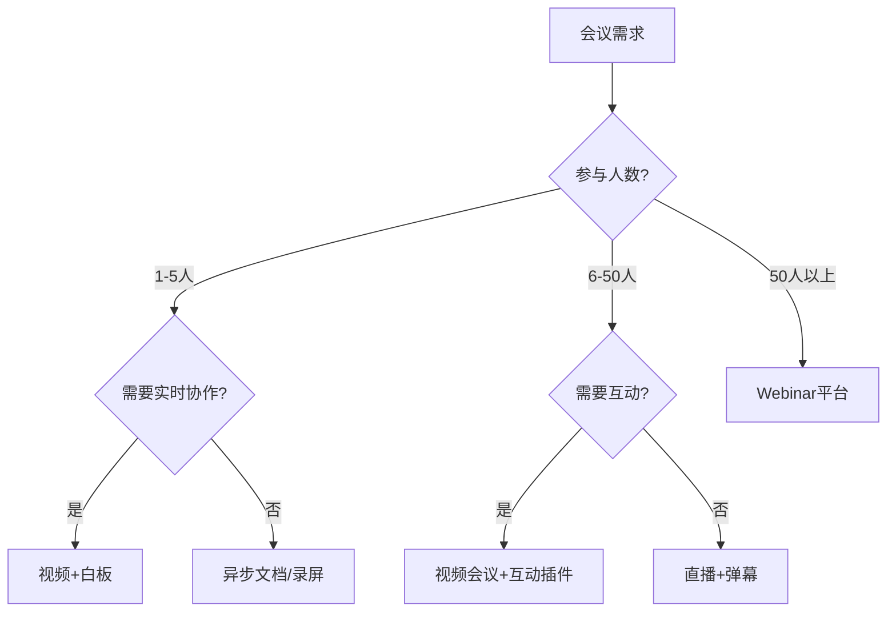
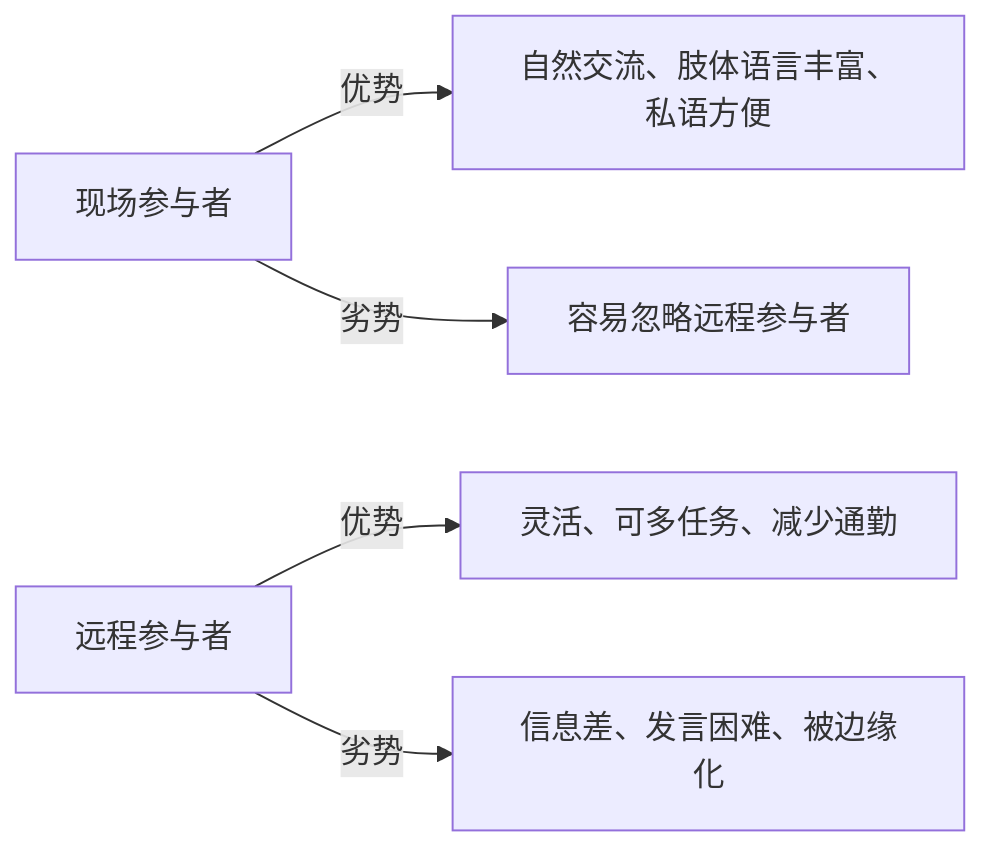

## 十一、会议技术的深度应用

会议是组织协作中最昂贵的活动之一——一场6人、1小时的会议，隐性成本可达数千元（按人力成本折算）。然而，大多数团队对会议技术的使用仍停留在"打开摄像头、共享屏幕"的原始阶段。本章将系统性地拆解会议技术的深度应用，从工具选型、流程设计到效能优化，帮助你把每一分钟的会议时间都转化为可衡量的价值产出。

### 11.1 会议类型与工具匹配矩阵

不同类型的会议有着截然不同的协作需求。选错工具就像用锤子拧螺丝——能用，但效率极低。

#### 11.1.1 六大核心会议类型

| 会议类型 | 核心目标 | 推荐工具组合 | 关键要素 | 时长建议 |
|----------|----------|-------------|----------|----------|
| 头脑风暴 | 发散创意、激发灵感 | Miro/FigJam + 视频会议 | 匿名投稿、实时投票、可视化画布 | 45-60分钟 |
| 决策会议 | 达成共识、确定方向 | 视频会议 + 协作文档（飞书/Notion） | 议程清晰、决策记录、投票机制 | 30-50分钟 |
| 状态同步 | 信息对齐、进度透明 | 异步文档 + 站会工具（Geekbot） | 结构化模板、异步优先、简洁高效 | 15-25分钟 |
| 1对1沟通 | 反馈辅导、关系维护 | 视频/电话（关闭其他应用） | 私密安全、双向对话、行动承诺 | 25-45分钟 |
| 培训分享 | 知识传递、能力建设 | 视频 + 录屏（OBS/Loom）+ 互动工具（Slido） | 互动问答、录播存档、测验验证 | 45-90分钟 |
| 项目复盘 | 经验总结、持续改进 | 协作文档 + 白板 + 投票 | 匿名反馈、根因分析、行动项追踪 | 60-90分钟 |

#### 11.1.2 工具选型决策框架

选择会议工具时，需要评估以下四个维度：

1. **参与规模**：5人以内用轻量工具（腾讯会议、飞书），50人以上需要Webinar功能（Zoom Webinar、钉钉直播）
2. **协作深度**：纯信息传达用异步文档即可；需要实时共创则必须用白板+视频
3. **跨地域性**：跨国会议优先选择低延迟、多语言支持的平台（Zoom、Microsoft Teams）
4. **安全等级**：涉及敏感信息的会议需端到端加密（Signal、自建Jitsi），避免使用免费公共平台



### 11.2 视频会议平台深度对比

#### 11.2.1 主流平台功能矩阵

| 功能 | Zoom | 飞书 | 钉钉 | 腾讯会议 | Teams | Google Meet |
|------|------|------|------|---------|-------|-------------|
| 最大参会人数（免费） | 100 | 50 | 100 | 300 | 100 | 100 |
| 屏幕共享 | ✅多屏 | ✅多屏 | ✅ | ✅ | ✅多屏 | ✅ |
| 虚拟背景 | ✅ | ✅ | ✅ | ✅ | ✅ | ✅ |
| AI实时字幕 | ✅ | ✅ | ✅ | ✅ | ✅ | ✅ |
| AI会议纪要 | ✅ | ✅ | ✅ | ✅ | ✅Copilot | ✅Duet |
| 分组讨论（Breakout） | ✅ | ✅ | ✅ | ❌ | ✅ | ✅ |
| 白板内置 | ✅ | ✅ | ✅ | ❌ | ✅Whiteboard | ✅Jamboard |
| 端到端加密 | ✅可选 | ❌ | ❌ | ❌ | ✅可选 | ❌ |
| 录制回放 | ✅云端+本地 | ✅云端 | ✅云端 | ✅云端 | ✅云端 | ✅云端 |
| 第三方集成 | 2000+ | 100+ | 200+ | 50+ | 700+ | 200+ |

#### 11.2.2 选型建议

- **国内团队优先**：飞书（一体化体验最佳）或钉钉（企业管理功能最强）
- **国际团队优先**：Zoom（兼容性最广）或Teams（微软生态集成）
- **技术团队**：飞书（文档+会议+项目一体化）+ Jitsi（自建高安全需求）
- **预算敏感**：腾讯会议免费版（国内300人上限最高）或Google Meet

### 11.3 AI驱动的会议技术革命

AI正在从根本上改变会议的工作方式。2024年以后，不使用AI会议工具就像2010年不使用智能手机——你可以不用，但你会被用的人甩开。

#### 11.3.1 AI会议纪要工具深度评测

| 工具 | 核心能力 | 语言支持 | 价格 | 适用场景 |
|------|---------|---------|------|---------|
| 飞书妙记 | 实时转写、自动摘要、关键词提取、待办识别 | 中文优秀 | 飞书套件内 | 国内团队首选 |
| 钉钉闪记 | 转写、摘要、字幕 | 中文优秀 | 钉钉套件内 | 阿里生态用户 |
| Otter.ai | 实时转写、说话人识别、搜索 | 英文为主 | $8.33/月起 | 英文会议 |
| Fireflies.ai | 多平台录制、CRM集成、情感分析 | 多语言 | $10/月起 | 销售/客户会议 |
| 讯飞听见 | 高精度转写、多语种翻译 | 中英文 | 按分钟计费 | 正式会议记录 |
| 通义听悟 | 转写、摘要、章节划分、关键词 | 中文优秀 | 免费额度 | 阿里云生态用户 |

#### 11.3.2 AI会议纪要的最佳实践

**会前配置**：
- 上传会议议程和相关文档，帮助AI理解上下文
- 配置专有名词词典（公司术语、产品名称、人名），提升转写准确率
- 设置自动录制和纪要生成的触发规则

**会中优化**：
- 发言人主动说"我是XX"帮助AI区分说话人
- 关键决策点用"结论是……"引导AI识别决策
- 行动项用"XX负责，在XX之前完成"的结构化表达，方便AI提取待办

**会后处理**：
- 人工审核AI生成的纪要，修正关键错误（AI准确率通常在85-95%）
- 将行动项同步到项目管理工具（Jira、飞书项目、Linear）
- 将纪要归档到知识库（Notion、Confluence），建立可搜索的会议历史

#### 11.3.3 AI实时翻译的应用

跨国团队的会议语言障碍正在被AI实时翻译打破：

- **Zoom AI Companion**：支持36种语言的实时翻译字幕
- **Microsoft Teams**：Copilot支持40+语言的实时翻译
- **腾讯同传**：中英日韩等主流语言实时翻译
- **使用技巧**：翻译字幕延迟约2-3秒，发言时适当放慢语速，每段话控制在30秒以内

### 11.4 会议流程工程化

高效会议不是靠"大家自觉"，而是靠流程工程。

#### 11.4.1 会议三阶段框架

**会前（Pre-meeting）—— 占会议价值的50%**

```markdown
## 会议议程模板

### 基本信息
- **会议主题**：[具体、明确的主题，不是"周会"而是"Q3产品路线图评审"]
- **日期时间**：YYYY-MM-DD HH:MM - HH:MM（注明时区）
- **参会人**：[列出必选和可选参会人]
- **会议链接**：[视频会议URL]
- **前置阅读**：[文档链接，要求会前24小时阅读完毕]

### 议程安排
| 时间 | 议题 | 负责人 | 类型 | 目标 |
|------|------|--------|------|------|
| 0-5min | 开场确认 | 主持人 | 流程 | 确认议程、调整优先级 |
| 5-20min | 议题A：[标题] | 张三 | 讨论 | 达成XX共识 |
| 20-35min | 议题B：[标题] | 李四 | 决策 | 确定XX方案 |
| 35-45min | 行动项确认 | 主持人 | 流程 | 明确负责人和截止时间 |
```

**会中（During meeting）—— 四个关键控制点**

1. **开局控制**（前3分钟）：主持人重申目标、议程、时间分配，询问是否有议程调整
2. **节奏控制**：每个议题设倒计时，到时提醒"还有2分钟，我们需要做出结论"
3. **发言控制**：使用"举手"功能或排队机制，避免多人同时发言的混乱
4. **记录控制**：指定记录员或开启AI纪要，实时记录决策和行动项

**会后（Post meeting）—— 24小时黄金期**

```markdown
## 会议纪要模板

### 会议信息
- 日期：YYYY-MM-DD
- 参会人：[名单]
- 缺席人：[名单]

### 关键决策
1. [决策内容] —— 决策人：XX，日期：XX
2. [决策内容] —— 决策人：XX，日期：XX

### 行动项
| 行动项 | 负责人 | 截止日期 | 状态 |
|--------|--------|---------|------|
| [具体可执行的行动] | XX | YYYY-MM-DD | 待开始 |
| [具体可执行的行动] | XX | YYYY-MM-DD | 待开始 |

### 待讨论/下次跟进
- [未完成议题，注明原因和下次计划]

### 下次会议
- 日期：YYYY-MM-DD HH:MM
- 预计议题：[列表]
```

#### 11.4.2 会议角色分工

一场高效会议至少需要三个角色：

| 角色 | 职责 | 技能要求 |
|------|------|---------|
| 主持人（Facilitator） | 控制议程节奏、引导讨论方向、确保每个人发言机会均等、处理冲突 | 强沟通力、时间管理、冲突调解 |
| 记录员（Scribe） | 实时记录决策和行动项、会后整理纪要、追踪行动项完成情况 | 快速笔记、逻辑归纳、细节关注 |
| 时间官（Timekeeper） | 严格把控每个环节的时间、及时提醒超时、建议议程调整 | 时间感知、果断提醒 |

**注意**：在小团队中，主持人可以兼任时间官，但记录员最好由AI工具辅助——人工记录员容易陷入"记录"而非"参与"的困境。

### 11.5 无会议日的系统化实践

"无会议日"不是简单地"不安排会议"，而是一种系统性的深度工作保护机制。

#### 11.5.1 实施框架

**第一步：选择无会议日**
- 推荐周三和周五作为无会议日（避免周一的启动会议和周四的跨部门协调被挤压）
- 全公司统一执行，而非个别团队自行决定

**第二步：制定例外规则**

| 紧急程度 | 定义 | 处理方式 |
|----------|------|---------|
| P0-致命 | 生产事故、重大安全漏洞、法律危机 | 即时召开，不受限制 |
| P1-紧急 | 客户重大投诉、跨团队阻塞 | 当天可安排，但不超过30分钟 |
| P2-重要 | 项目评审、方案讨论 | 排到下一个非无会议日 |
| P3-常规 | 周会、1对1、知识分享 | 严格排到非无会议日 |

**第三步：配套措施**
- 日历工具设置自动拒绝规则（Google Calendar的Focus Time、飞书的专注模式）
- 异步沟通渠道强化：文档评论、Loom录屏、飞书话题群
- 管理者以身作则，不在无会议日安排任何非P0会议

#### 11.5.2 效果验证

根据Asana《2023 Anatomy of Work》报告，实施无会议日的团队：
- 深度工作时间增加 **35%**
- 员工压力水平下降 **26%**
- 会议数量减少 **33%**（因为更多会议被异步替代）
- 项目交付准时率提升 **15%**

关键指标监测方法：通过日历分析工具（Clockwise、Reclaim）跟踪每周会议时间占比，目标控制在总工作时间的 **35%以内**。

### 11.6 会议疲劳的科学应对

会议疲劳不是"懒"或"不专业"，它有明确的神经科学基础。

#### 11.6.1 会议疲劳的神经机制

视频会议疲劳（"Zoom Fatigue"）已被斯坦福大学Jeremy Bailenson教授团队系统研究。其核心机制包括：

1. **过度眼神接触**：视频会议中，所有人同时"注视"你，这在面对面交流中不会发生。大脑将此解读为高度社交压力或潜在威胁
2. **认知负荷倍增**：你需要同时处理语言内容、面部表情、屏幕内容、聊天框信息，远超面对面会议的认知负荷
3. **自我审视效应**：持续看到自己的实时画面，相当于"对着镜子社交"，引发自我评价焦虑
4. **运动受限**：长时间固定在摄像头前，身体运动范围被限制在画面内，违反人类自然交流时的运动习惯

#### 11.6.2 六步应对策略

**策略一：缩短会议时长**
- 25分钟替代30分钟，50分钟替代60分钟——这5-10分钟的间隙用于切换上下文、休息眼睛、补充水分
- Google Calendar设置"Speedy Meetings"自动执行此规则

**策略二：关闭自我视图**
- Zoom、飞书、Teams均支持"隐藏自我视图"，消除持续自我审视的压力
- 这是最简单、最有效的单个调整

**策略三：启用"仅音频"模式**
- 不是所有会议都需要开摄像头。信息同步类会议、长时间工作坊，可以关闭视频
- 研究表明，关闭视频后参与者的疲劳感降低 **50%**，而信息传达效果几乎不受影响

**策略四：20-20-20护眼法则**
- 每20分钟，看20英尺（约6米）以外的物体，持续20秒
- 可以用浏览器插件（如Eye Care 20 20 20）设置定时提醒

**策略五：站立会议（Stand-up Meeting）**
- 限时15分钟的站立会议天然控制时长
- 虚拟站立会议：参与者关闭椅子（站起来用手机加入），或者约定"站立即发言、坐下即结束"
- 最佳场景：每日站会、进度同步、快速决策

**策略六：会议密度管理**
- 连续会议不应超过2小时，中间必须插入至少15分钟休息
- 每天会议总时长控制在 **4小时以内**（这是大多数人的认知耐力极限）
- 使用日历工具的"会议密度检测"功能（Clockwise、Reclaim自动优化）

#### 11.6.3 组织层面的干预

| 干预措施 | 实施难度 | 效果 | 适用范围 |
|----------|---------|------|---------|
| 默认25/50分钟会议 | 低 | 高 | 全组织 |
| 每周无会议日 | 中 | 高 | 全组织 |
| 会议必要性审批 | 高 | 高 | 管理层主导 |
| 异步优先文化 | 高 | 极高 | 渐进推广 |
| 摄像头自愿制 | 低 | 中 | 立即执行 |
| 会议ROI审计 | 中 | 中 | 季度执行 |

### 11.7 异步会议技术

不是所有会议都需要实时进行。异步会议（Async Meeting）是将会议内容通过非实时方式传递和讨论的技术。

#### 11.7.1 适用场景

- **跨时区团队**：东京、伦敦、旧金山的团队不可能找到所有人都舒服的实时会议时间
- **信息传达型会议**：CEO月度更新、产品发布说明、政策宣导——不需要实时讨论
- **深度讨论型议题**：技术方案评审、战略规划——参与者需要时间独立思考

#### 11.7.2 异步会议工具栈

| 工具类型 | 推荐工具 | 用途 |
|----------|---------|------|
| 录屏讲解 | Loom、飞书妙记、钉钉闪记 | 代替"站着讲PPT"的会议 |
| 异步讨论 | Twist（主题式）、Slack Huddle、飞书话题群 | 代替"大家坐下来聊"的会议 |
| 异步投票 | 飞书投票、Doodle、Typeform | 代替"举手表决"的会议 |
| 异步文档评审 | Google Docs评论、Notion评论、飞书文档评论 | 代替"逐页讲解"的评审会 |
| 异步决策 | Loomio、Discourse | 代替"集体讨论后决策"的会议 |

#### 11.7.3 Loom录屏实践指南

Loom是异步会议的核心工具之一。一段3分钟的Loom视频，往往能替代一场30分钟的会议。

**录制技巧**：
1. 开头10秒说清"这段视频的目标是什么、你需要做什么"
2. 屏幕共享时放大关键区域（Ctrl+滚轮），不要让观众自己找
3. 每段视频控制在 **5分钟以内**——超过5分钟，观看完成率骤降至 **50%以下**
4. 结尾明确说明"需要你做什么、截止时间是什么"

**协作流程**：
录屏发送 → 对方异步观看 → 在时间戳评论 → 录制者回复
→ 如有分歧 → 安排15分钟实时讨论
→ 无分歧 → 执行行动项

### 11.8 混合会议技术

混合会议（Hybrid Meeting）——部分参与者在会议室、部分远程接入——是最容易翻车的会议形式。

#### 11.8.1 混合会议的核心矛盾



#### 11.8.2 混合会议最佳实践清单

**硬件层面**：
- 会议室部署全向麦克风（如Jabra Speak 750、Poly Trio），确保远程参与者能听清每个人
- 使用智能摄像头（如Meeting Owl、Poly Studio），自动跟踪发言者
- 会议室屏幕显示远程参与者的画面，而非只显示共享内容
- 每个现场参与者都打开笔记本电脑加入会议，确保远程参与者能看到每个人

**流程层面**：
- 主持人指定一位"远程代言人"（Remote Advocate），负责关注聊天框、代表远程参与者发言
- 所有投票和讨论通过线上工具进行（即使现场参与者也在飞书/Slack中操作），确保平等参与权
- 会前将所有资料电子化分享，现场不用纸质材料
- 讨论时优先邀请远程参与者发言——现场参与者随时可以插话，远程参与者做不到

**文化层面**：
- "要么全部远程，要么全部现场"永远优于混合——如果必须混合，投入硬件和流程保障
- 不要在会前/会后的"走廊对话"中做决策——这些决策对远程参与者不可见
- 会议纪要必须在24小时内发出，补偿远程参与者的信息劣势

### 11.9 会议安全与隐私

会议中讨论的内容可能涉及商业机密、个人隐私或敏感数据。

#### 11.9.1 安全风险清单

| 风险类型 | 具体场景 | 防护措施 |
|----------|---------|---------|
| 未授权录制 | 参会者私自录制并外泄 | 禁止外部录制工具、平台录制需全员同意 |
| 屏幕信息泄露 | 共享屏幕时暴露通知、书签、标签页 | 共享前关闭通知、只共享特定窗口 |
| 会议号泄露 | 链接被转发导致"会议轰炸" | 启用等候室、设置密码、限制参会人 |
| AI纪要泄露 | 转录内容被第三方AI工具存储 | 选择数据本地化的AI工具、审查隐私政策 |
| 背景信息泄露 | 虚拟背景后的家庭环境、白板内容 | 使用虚拟背景、模糊背景、检查白板内容 |

#### 11.9.2 敏感会议安全操作规范

1. **高管会议/战略会议**：使用端到端加密平台（Zoom E2E Encryption模式、Signal群组通话），禁止AI纪要，仅允许指定记录员人工记录
2. **客户会议**：录制前必须获得客户书面同意（部分国家/地区有录音法律要求），录制文件存储在权限受控的区域
3. **全员大会**：启用等候室+身份验证，关闭"自行取消静音"，仅允许主持人控制发言权

### 11.10 会议效能度量

不能度量就不能改进。会议效能需要可量化的指标体系。

#### 11.10.1 会议效能指标框架

| 指标 | 计算方法 | 健康基准 | 优化方向 |
|------|---------|---------|---------|
| 会议时间占比 | 会议总时长 / 工作总时长 | < 35% | 超标则推行异步替代 |
| 会议准时率 | 准时开始的会议 / 总会议数 | > 90% | 设置日历自动锁定 |
| 行动项完成率 | 已完成行动项 / 总行动项 | > 80% | 项目管理工具追踪 |
| 参会人数合理性 | 必要参会人 / 实际参会人 | > 70% | 严格区分必选/可选 |
| 会议满意度 | 参会者评分（1-5分） | > 3.5 | 定期匿名调查 |
| 异步替代率 | 被异步替代的会议 / 原计划会议 | > 20% | 渐进推广异步文化 |

#### 11.10.2 会议ROI计算

每场会议都可以用以下公式计算ROI：

会议ROI = (会议产出价值 - 会议成本) / 会议成本 × 100%

会议成本 = Σ(参会者时薪 × 会议时长) + 工具成本 + 准备时间成本
会议产出价值 = 避免的损失 + 加速的决策 + 解决的问题的价值

示例：
- 6人参加的1小时产品评审会
- 平均时薪200元/人
- 会议成本 = 6 × 200 × 1 = 1,200元
- 如果这次会议发现了一个上线后会损失50万元的Bug
- 会议ROI = (500,000 - 1,200) / 1,200 × 100% = 41,567%

对于ROI为负的会议（即"开了和没开一样"的会议），应该直接取消或改为异步。

### 11.11 常见误区与纠正

| 误区 | 真相 | 纠正方法 |
|------|------|---------|
| "会议越多说明团队越忙碌、越重要" | 会议是成本，不是产出。高效团队的会议更少 | 用"产出"而非"会议数量"衡量团队效能 |
| "所有人的日程都要顾到" | 完美时间不存在，过度协调浪费更多时间 | 使用日历工具自动寻找最优时间，接受不完美 |
| "会议必须开摄像头" | 研究表明强制开摄像头增加疲劳感，降低参与度 | 信息同步类会议允许关闭摄像头 |
| "会议越长越深入" | 超过50分钟后注意力急剧下降，产出趋近于零 | 严格限时，深度议题拆分为多次短会议 |
| "AI纪要可以完全替代人工" | AI准确率85-95%，关键决策仍需人工确认 | AI初稿 + 人工审核 = 最佳组合 |
| "会议纪要发了就等于执行了" | 没有追踪的行动项完成率不到30% | 行动项必须同步到项目管理工具，设置提醒 |
| "技术能解决所有会议问题" | 工具只是放大器，流程和文化才是根基 | 先优化流程，再用工具固化 |

### 11.12 进阶：会议技术的趋势与展望

#### 11.2.1 会议AI Agent

2025-2026年，AI Agent将从"记录者"进化为"参与者"：
- **会前Agent**：自动分析参会者日历、生成个性化议程建议、预读相关文档并生成摘要
- **会中Agent**：实时检测讨论偏离议程、自动提醒超时、在被问到时调取数据回答问题
- **会后Agent**：自动生成结构化纪要、识别未解决的冲突、追踪行动项并在截止日期前提醒

#### 11.2.2 空间计算与会议

Apple Vision Pro和Meta Quest等空间计算设备正在重新定义"会议室"：
- 3D虚拟会议室中的空间音频让多人发言更自然
- 虚拟白板和3D模型的实时协作比2D屏幕共享更直观
- 但设备成本和舒适度仍是大规模普及的障碍

#### 11.2.3 全息会议

微软Mesh、Cisco Webex Holograme等全息会议技术已进入企业试点阶段。在不远的未来，远程参与者将以3D全息形象出现在现场会议室中，彻底消除"远程"和"现场"的体验差距。

### 11.13 本章小结

会议技术的深度应用，本质上是对"组织注意力"的系统性管理。核心原则只有三条：

1. **不开不必要的会**——能异步解决的不实时，能文档解决的不开会，能5人解决的不拉10人
2. **开了就要有效**——议程明确、角色到位、时间受控、决策清晰、行动项有追踪
3. **持续度量改进**——用数据驱动会议文化变革，让每一分钟的会议时间都有可衡量的价值

从今天开始，审视你的下一场会议：它真的需要开吗？如果需要，你能让它比上一次高效10%吗？
