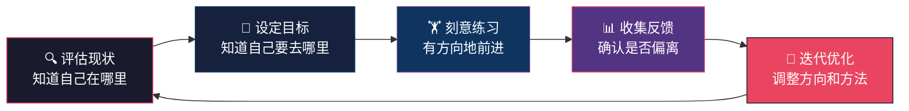
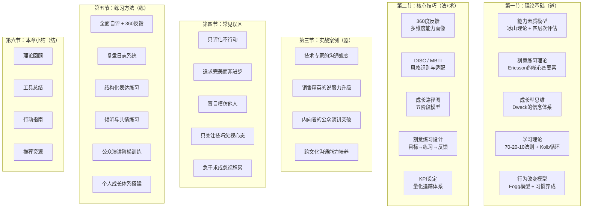
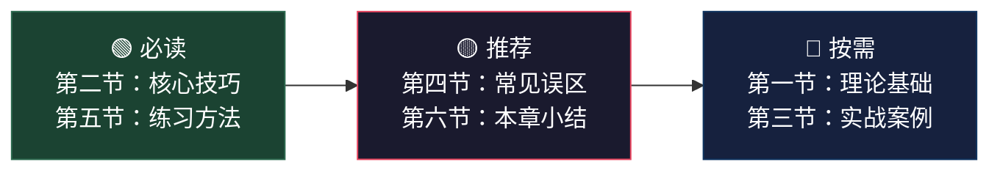

# 第三十章：沟通能力评估与成长

## 为什么需要这一章

在前面二十九章中，你已经系统学习了沟通的理论、技巧、场景应用和心理机制。但有一个关键问题始终悬而未决：**你怎么知道自己到底进步了多少？**

大多数沟通类书籍到此就结束了——它们教你技巧，却不管你学完之后是原地踏步还是真正蜕变。本章填补的正是这个缺口。管理大师彼得·德鲁克说过："你无法管理你无法衡量的东西。"沟通能力同样如此。如果你无法评估自己的沟通水平，就无法制定有效的提升计划；如果你没有系统的成长框架，再多的技巧学习也只是碎片化的知识堆积。

本章是全书的收尾章节，也是最具"杠杆效应"的一章。它的价值不在于教你新技巧，而在于帮你把前面学到的所有知识**转化为可衡量、可持续、可复制的成长能力**。读完本章后，你将拥有一个完整的"评估→诊断→练习→反馈→迭代"闭环系统，这个系统将在你合上这本书之后继续运转，驱动你持续精进。

## 核心框架：评估-成长闭环

本章围绕一个核心模型展开——**评估-成长闭环**。它的逻辑很简单：先评估现状，再设定目标，然后刻意练习，接着收集反馈，最后迭代优化。但每一个环节都有科学的方法论支撑。

这个闭环的威力在于它的**自我驱动性**。一旦你建立了这个系统，它不需要外部动力就能持续运转。每一次沟通实践都是一次评估机会，每一次反馈都是一次成长契机。

## 章节内容全景

本章分为六节，按照"道→法→术→器→练→结"的逻辑层层递进：

### 各节内容详解

#### 第一节：理论基础——理解"为什么"

这一节不是枯燥的理论堆砌，而是为你建立评估与成长的**底层操作系统**。五个理论模型各有分工：

| 理论 | 回答的问题 | 核心洞察 |
|------|-----------|---------|
| 能力素质模型（McClelland冰山模型） | 沟通能力由哪些层次构成？ | 水面以上的知识和技能容易评估，水面以下的态度和习惯才是决定性因素 |
| 刻意练习理论（Ericsson） | 如何高效提升沟通能力？ | 1万小时不是万能的，关键在于练习的质量——明确目标、专注投入、即时反馈、持续挑战 |
| 成长型思维（Dweck） | 用什么心态面对成长？ | "我不擅长沟通"是固定型思维的陷阱；"我正在提升沟通能力"才是成长型思维的起点 |
| 70-20-10学习法则 | 学习的最佳来源是什么？ | 70%来自实践、20%来自社交学习、10%来自正式培训——只上课远远不够 |
| Fogg行为模型 | 如何让改变真正发生？ | 行为 = 动机 × 能力 × 触发器，三者缺一不可 |

这些理论不是孤立存在的。它们之间的关系是：**冰山模型帮你识别需要评估什么，刻意练习告诉你如何高效提升，成长型思维给你面对困难的心理韧性，70-20-10法则指导你从哪里获取学习资源，Fogg模型确保你的改变计划能真正落地。**

#### 第二节：核心技巧——掌握"怎么做"

理论理解之后，这一节给你可以直接使用的工具和方法：

**测评工具部分**提供三大工具的详细使用指南：

- **360度反馈**：不是随便找几个人问问就行。本节会教你如何选择评估人（上级、同事、下属、客户的配比）、如何设计评估问卷（行为描述而非模糊印象）、如何分析反馈数据（自评与他评的差距分析）、如何制定行动计划。你还会获得一份完整的问卷模板，拿来就能用。

- **DISC行为风格评估**：了解自己是D型（支配型）、I型（影响型）、S型（稳健型）还是C型（谨慎型），以及如何根据不同类型调整沟通策略。本节包含自评问卷和详细的类型分析。

- **MBTI沟通风格分析**：从四个维度（能量来源、信息获取、决策方式、生活方式）理解你的沟通偏好，以及16种人格类型的沟通调整策略。

**成长路径设计部分**提供一个五阶段成长模型和具体的路径图模板，帮你从"无意识的不胜任"一路走到"大师级水平"。

**刻意练习设计部分**教你如何将Ericsson的理论转化为可执行的练习方案，包括练习焦点选择、活动设计、反馈机制建立的完整流程。

**KPI设定部分**提供三级指标体系（沟通效果、沟通效率、沟通能力成长），让你用数据说话。

**复盘日志部分**提供每日和每周的复盘模板，帮你建立"经验→反思→改进"的日常习惯。

#### 第三节：实战案例——看别人怎么做到的

四个真实场景的成长故事，覆盖不同类型的沟通挑战：

| 案例 | 核心挑战 | 成长策略 | 6个月成果 |
|------|---------|---------|----------|
| 技术专家张工 | 沉默寡言，360度评分2.1分 | DISC诊断 + Toastmasters + 结构化表达训练 | 评分提升至3.8分，从"难以沟通"到"清晰易懂" |
| 销售精英李经理 | 客户沟通强但内部协作弱 | 从"说服者"到"影响者"的风格转型 | 跨部门协作评分从2.5提升至4.0 |
| 讲师王老师 | 极度恐惧公众演讲 | 认知行为疗法 + 阶梯式暴露训练 | 在200人学术会议上获"最佳演讲奖" |
| 跨国公司陈总 | 跨文化沟通障碍 | 语言能力 + 文化敏感度双线提升 | 建立高效的跨时区协作机制 |

每个案例都不是"成功学鸡汤"，而是包含完整的**起点诊断→问题分析→计划制定→关键转折点→量化成果→经验总结**，你可以直接借鉴其中的方法论。

#### 第四节：常见误区——避开那些坑

识别了八个最常见的评估与成长误区，每个误区都包含典型表现、问题分析和纠正方法：

1. **只评估不行动**——测评报告成了"收藏品"
2. **追求完美而非进步**——完美主义是成长的最大敌人
3. **盲目模仿他人**——"东施效颦"式的沟通学习
4. **只关注技巧忽视心态**——沟通能力 = 技巧 × 心态
5. **忽视反馈的价值**——把反馈当批评，关上了成长的大门
6. **急于求成忽视积累**——期望"速成"，三周没进步就放弃
7. **练习脱离实践**——练习室里的高手，实战中的新手
8. **独自成长忽视社群**——沟通能力的提升也需要社交支持

这一节的价值在于**提前预警**。很多人在成长过程中踩过这些坑，但往往要等到付出代价之后才意识到。提前了解这些误区，可以帮你少走大量弯路。

#### 第五节：练习方法——动手开始练

八个精心设计的练习方案，覆盖评估、反馈、复盘、表达、倾听、演讲、体系搭建和思维培养：

| 练习 | 目标 | 投入时间 | 难度 |
|------|------|---------|------|
| 沟通能力全面自评 | 建立能力基准线 | 2小时 | ⭐ |
| 360度反馈收集 | 获取多维度反馈 | 2-3周 | ⭐⭐ |
| 沟通复盘日志 | 建立日常反思习惯 | 每日5-10分钟 | ⭐ |
| 结构化表达练习 | 提升表达逻辑性 | 每日15分钟 | ⭐⭐ |
| 积极倾听练习 | 提升倾听和同理心 | 每次对话 | ⭐⭐ |
| 公众演讲阶梯训练 | 突破演讲恐惧 | 12周计划 | ⭐⭐⭐ |
| 个人成长体系搭建 | 建立长期成长系统 | 3小时 | ⭐⭐ |
| 成长型思维培养 | 内化成长心态 | 持续进行 | ⭐⭐ |

每个练习都提供了完整的步骤说明、模板和评估标准，不需要额外的工具或资源，读完就能开始。

#### 第六节：本章小结——带走什么

回顾全章核心要点，提供一份**分层行动指南**（本周、本月、本季度、本年度），以及精心筛选的推荐资源（书籍、实践平台、测评工具）。

## 本章的阅读建议

### 如果你是第一次阅读

建议按顺序阅读。先建立理论框架（第一节），再掌握工具方法（第二节），然后通过案例加深理解（第三节），接着了解常见误区（第四节），最后动手练习（第五节）。理论→方法→案例→避坑→实操，这个顺序是经过设计的，每一节都为下一节打基础。

### 如果你时间有限

按优先级阅读：

先读第二节和第五节，掌握工具和练习方法，马上开始行动。理论和案例可以后续补充。

### 如果你是管理者或培训师

重点关注第一节的理论模型（用于设计培训方案）、第二节的360度反馈和KPI体系（用于团队评估）、第四节的常见误区（用于辅导他人避坑）。

## 学习目标

通过本章学习，你将能够：

1. **掌握专业测评工具**：熟练使用360度反馈、DISC、MBTI等工具评估沟通能力，不仅能自评，还能帮助团队成员进行评估
2. **绘制成长路径图**：基于五阶段模型建立清晰的沟通能力成长路线，明确从当前位置到目标位置的每一步
3. **运用刻意练习方法论**：基于Ericsson的理论设计有效的沟通练习方案，区分"有效练习"和"无效重复"
4. **构建终身学习框架**：建立包含每日复盘、每周练习、每月学习、每季度评估的持续成长机制
5. **设定沟通能力KPI**：为自己的沟通能力建立可量化的评估指标，用数据追踪成长进度
6. **培养成长型思维**：识别固定型思维的陷阱，用成长型思维面对沟通中的挑战和失败
7. **建立复盘习惯**：通过系统的复盘日志记录和分析沟通表现，将经验转化为能力
8. **设计个人成长体系**：整合评估、练习、反馈、迭代四个环节，构建适合自己的沟通能力持续提升系统

## 适用读者

| 读者类型 | 核心收获 | 重点章节 |
|---------|---------|---------|
| 希望系统提升沟通能力的职场人士 | 获得一套完整的自评和成长工具 | 全章通读，重点第二节和第五节 |
| 负责团队沟通能力培养的管理者 | 学会如何评估和提升团队沟通水平 | 第一节、第二节、第三节 |
| 沟通教练和培训师 | 获得科学的评估框架和练习方案 | 第一节、第二节、第四节、第五节 |
| 对自我提升有追求的学习者 | 建立终身学习和持续成长的系统 | 第二节、第五节、第六节 |

***

> **导读提示**：本章是全书的收尾章节，旨在帮你把前面二十九章学到的知识和技能**转化为持续成长的能力**。阅读只是起点，行动才是关键。建议你在阅读本章后，立即从第五节的练习中选择1-2个开始执行，并在一周内完成第一次沟通能力自评。记住：**小步持续的改进，胜过大步间歇的努力。**
