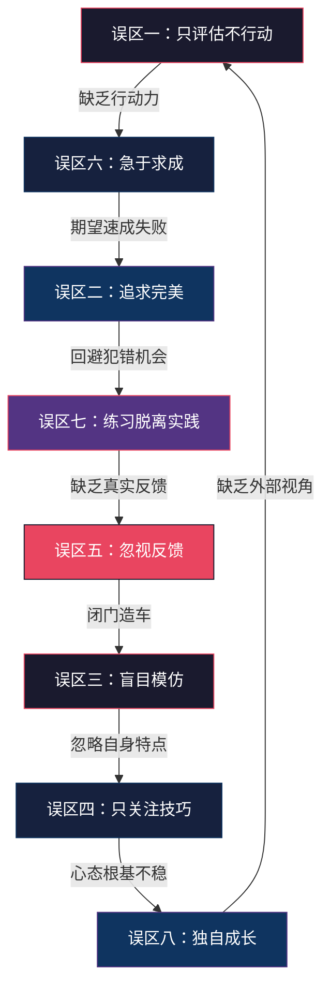
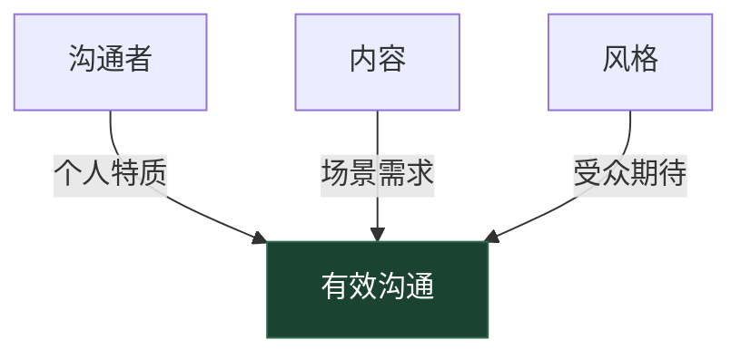
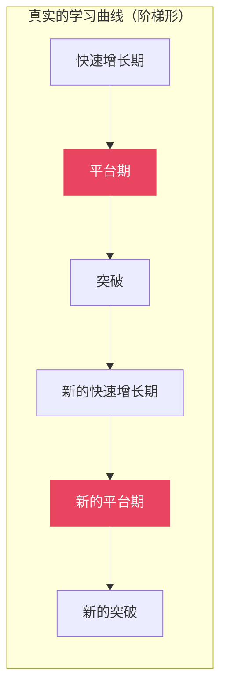

# 第四节：常见误区

## 为什么误区比技巧更值得重视

在沟通能力的评估与成长过程中，**避开一个错误比学会一个技巧更有价值**。原因很简单：技巧的收益是线性的——你多学一个技巧，能力提升一点点；但误区的代价是指数级的——一个根深蒂固的错误认知，可能让你在错误的方向上浪费数月甚至数年的时间和精力。

心理学中有一个概念叫「确认偏误」（Confirmation Bias）：一旦你形成了某种认知，你会不自觉地寻找支持这个认知的证据，忽略反驳它的事实。误区之所以危险，正是因为它会自我强化——你越按错误的方式做，越觉得自己做得对，直到撞了南墙才幡然醒悟。

本节系统梳理了沟通能力评估与成长中最常见的八大误区。每个误区都包含**识别信号、深层原因分析、阶段化表现、纠正方案和预防策略**五个层面，帮你不仅能纠错，还能防患于未然。

## 误区全景图

八个误区并非孤立存在，它们之间存在因果链和强化回路。理解它们的关联，比单独理解每个误区更重要：

从图中可以看到：这些误区会形成一个**恶性循环**。你可能从任何一个点进入，但如果不能及时打断，就会被卷入下一个误区。好消息是，打破循环中的任何一环，都能阻断整个链条。

### 快速自检清单

在深入阅读之前，先用这张表做一个快速自检。对每个问题回答「是」或「否」，统计你的「是」的数量：

| 序号 | 自检问题 | 是/否 |
|:----:|---------|:-----:|
| 1 | 我做过沟通能力测评，但没有根据结果制定具体行动计划 | |
| 2 | 我经常因为觉得自己"还没准备好"而回避沟通机会 | |
| 3 | 我在模仿某位沟通高手的风格，但感觉不太自然 | |
| 4 | 我学了很多沟通技巧，但实际沟通时还是靠本能反应 | |
| 5 | 当别人给我负面反馈时，我的第一反应是解释或反驳 | |
| 6 | 我希望在1-3个月内看到沟通能力的显著提升 | |
| 7 | 我主要在安全环境中练习沟通，很少在真实高压场景中尝试 | |
| 8 | 我基本是一个人在学习沟通，没有学习伙伴或导师 | |

**评分标准：**

- **0-2个「是」**：你的成长心态健康，继续保持警惕即可
- **3-4个「是」**：已经踩中部分误区，需要有意识地调整
- **5-6个「是」**：误区正在严重影响你的成长效率，需要系统性纠正
- **7-8个「是」**：你的成长系统几乎处于停滞状态，需要从根本上重建

---

## 误区一：只评估不行动——测评报告成了「收藏品」

### 识别信号

- 做过DISC、MBTI、盖洛普优势、360度反馈等多种测评，报告存在电脑里再也没打开过
- 对测评结果的反应是「嗯，说得挺准的」，然后就没有然后了
- 收藏了大量关于沟通能力提升的文章和课程，但从没开始执行
- 觉得「做了测评」本身就是一种进步
- 下次遇到类似问题时，会去做一份新测评，而不是回顾旧报告的建议

### 深层原因分析

这种误区背后的心理机制是**「替代效应」**（Substitution Effect）——大脑会自动用一个容易的行为替代一个困难的行为。做测评是容易的：点击链接、回答问题、等待报告生成。但将测评结果转化为行动是困难的：需要分析差距、制定计划、付出持续努力。大脑倾向于完成容易的任务并获得「我已经在努力了」的满足感。

行为经济学家Dan Ariely在《Predictably Irrational》中指出：人类对「已完成」的状态有天然的偏好。当你完成一份测评时，大脑会将其标记为「已完成的任务」，产生满足感，从而降低了执行后续行动的动机。

更深层的原因是**对改变的恐惧**。测评结果可能揭示你不愿面对的弱点，而行动意味着要直面这些弱点。拖延行动，本质上是拖延面对不适感。

### 阶段化表现

| 成长阶段 | 典型表现 | 后果 |
|---------|---------|------|
| 新手期 | 做了测评但不理解结果含义，不知道如何转化为行动 | 测评结果被遗忘 |
| 成长期 | 理解结果，也制定了计划，但执行了1-2周就放弃 | 反复制定计划又放弃，形成挫败感 |
| 进阶期 | 只关注自己擅长的评估维度，回避弱势维度的提升 | 能力发展不均衡，瓶颈期延长 |

### 纠正方案

**第一步：建立「测评-行动」的强制连接**

不要把「做测评」和「制定行动计划」当成两个独立任务。在做测评之前，就先在日历上安排好「行动计划制定时间」——测评完成后48小时内，必须有1-2小时专门用于分析结果和制定计划。

**第二步：使用「3-2-1行动计划模板」**

每次收到测评结果后，用这个模板在48小时内完成：

【3个关键发现】
1. _______________（最突出的优势，继续强化）
2. _______________（最明显的短板，优先改善）
3. _______________（最意外的发现，需要重新审视）

【2个行动计划】
1. 针对短板 _______________：
   - 具体行动：_______________
   - 执行频率：_______________
   - 第一步截止日期：_______________
   - 验证标准：_______________

2. 针对优势 _______________：
   - 具体行动：_______________
   - 执行频率：_______________
   - 第一步截止日期：_______________
   - 验证标准：_______________

【1个承诺】
我在____月____日前完成第一步行动，并在完成后重新评估变化。

**第三步：设定「最小可行行动」**

不要试图一次性解决所有问题。从测评结果中选择**一个**最关键的差距，设定一个极小的、不可能失败的第一步行动。比如：

- 如果测评显示「倾听能力不足」，第一周的行动不是「提升倾听能力」（太模糊），而是「每次会议中至少复述一次对方的观点」（具体、可执行、可验证）

### 预防策略

- **将测评与练习绑定**：选择本身就包含行动计划的测评工具（如本书第五节的练习方案），而不是只给结论的测评
- **找到问责伙伴**：将测评结果和行动计划分享给一位信任的同事或导师，定期汇报执行情况
- **建立「测评档案」**：在固定位置保存所有测评结果，每季度回顾一次，追踪变化趋势

---

## 误区二：追求完美而非进步——完美主义是成长的最大敌人

### 识别信号

- 在重要沟通场合前花大量时间准备，但准备的内容远超实际需要
- 一次沟通中出现一个小失误，整场表现就被判定为「失败」
- 因为「还没准备好」而反复推迟公开演讲、团队汇报等机会
- 对自己的评分远低于他人对你的评分（自评与他评差距超过1.5分）
- 准备时间与执行时间的比例超过3:1

### 深层原因分析

心理学家Carol Dweck在《Mindset》中区分了两种思维模式：**固定型思维**认为能力是天生的，失败意味着能力不足；**成长型思维**认为能力可以通过努力提升，失败是学习的机会。完美主义者通常是固定型思维的持有者——他们害怕犯错，因为犯错意味着暴露「能力不足」的真相。

完美主义还有另一个隐藏的「好处」：它为你提供了不行动的借口。「我还没准备好」是一个听起来很负责任的理由，但实际上它和「我懒得做」产生的结果完全一样——什么都没发生。

Brené Brown在《The Gifts of Imperfection》中指出：完美主义不是自我提升的引擎，而是自我毁灭的引擎。完美主义的核心恐惧是：「如果我展示出不完美的一面，别人会怎么看待我？」这种恐惧会导致两个后果：要么过度准备直到精疲力竭，要么干脆回避一切可能暴露不完美的机会。

### 阶段化表现

| 成长阶段 | 完美主义的具体表现 | 对成长的影响 |
|---------|-------------------|------------|
| 新手期 | 「我必须把所有沟通技巧都学会了才能开始实践」 | 永远停留在理论学习阶段 |
| 成长期 | 「这次汇报有一个数据说错了，整个汇报都毁了」 | 对失败过度反应，打击自信 |
| 进阶期 | 「我的演讲风格还不够独特，等我找到自己的风格再上台」 | 用高标准作为不行动的借口 |

### 纠正方案

**方案一：建立「进步日志」**

每天记录一个沟通中的「小进步」，无论多小。关键是将注意力从「哪里还不够好」转移到「今天比昨天好在哪里」。

日期：____
今天的一次沟通：_______________
比上次进步的地方：_______________
下次可以尝试的改进：_______________
对自己的肯定：_______________

坚持21天后回顾，你会惊讶于自己的累积进步。

**方案二：设定「足够好」标准**

在每次沟通前，预先设定一个「足够好」的标准——不是「完美」的标准，而是「可以接受」的标准。达到这个标准后，就给自己正面评价。

例如，对于一次团队汇报：
- 完美标准（不要用）：「内容全面、逻辑清晰、表达流畅、互动自然、没有任何口误、时间控制精准」
- 足够好标准（用这个）：「核心观点传达清楚、时间控制在±2分钟内、至少回答了2个提问」

**方案三：实施「暴露疗法」**

主动创造「低风险失败」的机会，让自己习惯不完美的感觉：

1. **第1周**：在非正式场合（如午餐聊天）主动分享一个不成熟的想法
2. **第2周**：在小组会议中发言，允许自己说完后补充修正
3. **第3周**：在较大场合做一次简短分享（5分钟），不追求完美
4. **第4周**：主动请求他人对你的一次沟通给出负面反馈，练习接受不完美

**方案四：重新定义「失败」**

使用「失败复盘模板」替代「失败自责」：

| 项目 | 内容 |
|------|------|
| 发生了什么 | 客观描述事实，不加评判 |
| 我学到了什么 | 这次经历教会了我什么 |
| 下次我会怎么做 | 具体的改进措施 |
| 这次的亮点 | 即使不完美，也一定有做得好的地方 |

### 预防策略

- **给自己设定「准备时间上限」**：一次15分钟的汇报，准备时间不超过1小时（4倍原则）
- **追踪「准备-表现」比**：如果准备时间持续超过执行时间的5倍，说明完美主义在拖累你
- **找一个「不完美榜样」**：观察那些沟通能力强但并不完美的人，学习他们如何处理失误

---

## 误区三：盲目模仿他人——「东施效颦」式的沟通学习

### 识别信号

- 看到某位领导/博主的演讲风格很好，就试图完全复制
- 学习了一套「标准话术」，在所有场景中机械套用
- 使用了别人的幽默方式，但效果很差（别人笑，但不是因为觉得好笑）
- 模仿某人的肢体语言，但感觉僵硬不自然
- 觉得「只要我学会了他的方法，我就能像他一样成功」

### 深层原因分析

模仿是人类学习的基本机制，这本身没有问题。问题在于**盲目模仿**——不区分「可以借鉴的」和「必须个性化的」。

沟通效果取决于三个要素的匹配：

当你盲目模仿他人时，你只复制了「风格」这一个维度，却忽略了「个人特质」和「场景需求」这两个维度。结果就像穿着别人的衣服——衣服本身没问题，但尺寸和气质不匹配。

神经语言程序学（NLP）中的「模仿」（Modeling）技术强调：有效的模仿不是复制表面行为，而是**理解行为背后的策略和信念**。一个优秀的演讲者之所以优秀，不是因为他说话时喜欢走动（表面行为），而是因为他通过走动来调节自己的能量和与观众的连接（内在策略）。

### 具体案例分析

**案例：模仿乔布斯的演讲风格**

很多人看了乔布斯的演讲后模仿他的风格：简洁的PPT、戏剧性的停顿、「One more thing」的结尾。但乔布斯的风格之所以有效，是因为它与三个因素完美匹配：

1. **个人特质**：乔布斯有极强的现实扭曲力场和产品直觉，他的自信是内在的，不是装出来的
2. **内容匹配**：苹果的产品发布会天然具有戏剧性（革命性创新），简洁风格放大了产品本身的冲击力
3. **受众期待**：科技发布会的观众期待惊喜和创新，这种风格正好满足了期待

如果你是一个做内部流程汇报的项目经理，完全模仿乔布斯的风格就会显得格格不入——你的内容不具有戏剧性，你的受众期待的是信息密度而非惊喜感，你的个人气质可能更适合沉稳可靠而非戏剧化。

### 纠正方案

**第一步：区分「原则」和「风格」**

| 可以借鉴的（原则） | 不应照搬的（风格） |
|------------------|-----------------|
| 结构化表达（PREP法则） | 某种特定的开场方式 |
| 用故事传递信息 | 某种特定的故事类型 |
| 控制信息量（一次一个重点） | 某种特定的幻灯片设计 |
| 观察听众反应并调整节奏 | 某种特定的肢体语言 |
| 用对比和类比简化复杂概念 | 某种特定的语调和语速 |

**第二步：建立「个人沟通风格档案」**

通过以下维度了解自己的自然沟通风格：

能量类型：高能量（热情外向） / 中能量（沉稳自信） / 低能量（深沉内敛）
表达偏好：叙事型（讲故事） / 分析型（列数据） / 感染型（调动情绪）
节奏特征：快节奏（信息密集） / 中节奏（张弛有度） / 慢节奏（深度思考）
互动方式：主导型（引导对话） / 协作型（共同探索） / 响应型（认真倾听后回应）

没有哪种类型比其他类型更好。关键是在自己的自然风格基础上优化，而不是推翻重来。

**第三步：「筛选-适配-迭代」三步法**

1. **筛选**：观察3-5位你欣赏的沟通者，列出他们各自的核心技巧（不是风格，是技巧）
2. **适配**：从这些技巧中选择2-3个与你的个人风格兼容的，用你自己的方式重新演绎
3. **迭代**：在实践中检验效果，保留有效的，放弃不适合的

例如，你欣赏A的逻辑清晰和B的故事感染力，但你的自然风格是分析型。那么你可以借鉴A的逻辑框架（与你兼容），但把B的故事技巧转化为「用数据讲故事」（适配你的风格），而不是直接模仿B的叙事方式。

### 预防策略

- **每季度做一次「风格审计」**：回顾自己最近的沟通，哪些是自然流露，哪些是刻意模仿？刻意模仿的部分效果如何？
- **建立「技巧实验」心态**：把每次尝试新技巧都当作实验，有成功有失败是正常的
- **警惕「速成模板」**：任何声称「一套模板适用于所有人」的沟通方法，都值得怀疑

---

## 误区四：只关注技巧忽视心态——沟通能力 = 技巧 × 心态

### 识别信号

- 学了大量的沟通框架（PREP、STAR、金字塔原理），但实际沟通时还是「脑子一片空白」
- 在安全环境中练习得很好，但面对重要人物或高压场景时表现骤降
- 过度关注「说什么」和「怎么说」，忽略了「为什么说」和「为谁说」
- 沟通技巧熟练但缺乏真诚感，给人「油滑」或「套路」的印象
- 在沟通前花大量时间准备话术，但不花时间调整自己的情绪状态

### 深层原因分析

这个误区可以用一个公式来说明：

沟通效果 = 技巧熟练度 × 心态匹配度 × 0~1（真诚系数）

技巧是乘数，心态也是乘数，真诚是系数。当心态匹配度为零时（比如极度紧张），技巧再高也无法发挥作用。当真诚系数接近零时（比如完全在背稿），即使技巧完美，沟通效果也会大打折扣。

哈佛商学院Amy Cuddy的研究表明：在高压情境下，**心态准备比技巧准备更能预测表现**。她发现，在重要演讲前做「权力姿势」（Power Posing）2分钟的演讲者，其表现评分比做了额外2分钟技巧练习的演讲者高出20%以上。原因在于：心态准备直接影响你的激素水平（降低皮质醇、提升睾酮），而激素水平直接影响你的自信、流畅度和临场反应能力。

### 四种核心心态问题的诊断与纠正

#### 心态问题一：害怕被评判

**诊断信号**：沟通前反复想象最坏的结果；沟通时过度关注听众的表情变化；说完一句话后立刻在心里评价自己「这句话说得不好」。

**深层机制**：这是「聚光灯效应」（Spotlight Effect）在作祟——我们高估了别人对我们的关注程度。心理学实验表明，人们对你犯的错误的记忆，只有你自己记忆的50%。

**纠正方法**：

认知重构练习：

原始想法：「他们一定觉得我说得很差」
↓ 事实检验
证据支持：_______________________________
证据反驳：_______________________________
↓ 重新评估
更合理的解读：「他们可能在想自己的事情，
大多数人不会太在意我的一个小失误」
↓ 行为调整
下次沟通的注意力焦点：放在传递价值上，
而不是放在监控自己的表现上

#### 心态问题二：追求控制

**诊断信号**：提前准备大量应对方案；对沟通中的意外变化感到焦虑；无法接受「我不知道」；沟通时语气偏强硬，倾向于引导而非对话。

**深层机制**：追求控制的本质是对不确定性的恐惧。但沟通天然是双向的、不可完全预测的活动。试图控制沟通的每一个细节，反而会让你失去灵活性和对话感。

**纠正方法**：

采用「70%准备法」——只准备70%的内容，预留30%的空间给即兴发挥和对方的输入。具体做法：

1. 确定沟通的**核心信息**（最多3个点）
2. 准备支撑核心信息的**关键论据**
3. 预留空间：准备2-3个**开放性问题**，将对话引向对方
4. 接受意外：当出现意料之外的情况时，用「这是一个好问题，让我想想……」来争取思考时间，而不是硬套准备好的答案

#### 心态问题三：急于表现

**诊断信号**：在对话中频繁打断对方；急于表达自己的观点；在会议中第一个发言的频率过高；倾听时明显心不在焉（在组织自己的发言）。

**纠正方法**：练习「3秒法则」——在对方说完之后，默数3秒再开口。这3秒的作用是：（1）确认对方真的说完了；（2）给自己时间消化对方的信息；（3）让你的回应更有针对性。

#### 心态问题四：害怕冲突

**诊断信号**：面对不同意见时选择沉默或附和；回避敏感话题；在对方明显错误时不敢指出；沟通结束时表面和谐但问题未解决。

**纠正方法**：将「冲突」重新定义为「建设性张力」。建设性张力不是对抗，而是通过坦诚交换不同观点来找到更好的解决方案。练习使用这样的框架：

「我理解你的观点是 _______________。
从我的角度看 _______________。
我好奇的是，这两种看法之间有没有
一个更好的方案？」

### 预防策略

- **每次重要沟通前做2分钟心态准备**：闭眼、深呼吸、明确自己的意图（「我这次沟通的目的是为对方提供价值」）
- **每周做一次「心态审计」**：回顾本周的沟通，哪些时候心态影响了表现？具体是什么心态？
- **建立「心态锚点」**：找到一个能快速让你进入最佳状态的锚点（一句自我暗示、一个动作、一段回忆），在重要沟通前激活

---

## 误区五：忽视反馈的价值——把反馈当批评，关上了成长的大门

### 识别信号

- 收到正面反馈时心情愉悦，收到负面反馈时心情低落甚至愤怒
- 对负面反馈的第一反应是解释或反驳，而不是感谢和思考
- 不主动寻求反馈，等待别人「忍不住」了才告诉你
- 收到反馈后没有后续行动，反馈石沉大海
- 将反馈等同于对自己的评价，而不是对行为的观察

### 深层原因分析

反馈接收困难的根源在于**自我保护机制**。心理学中的「自我一致性理论」（Self-Consistency Theory）指出：人类有维护自我认知一致性的强烈动机。当反馈与自我认知不一致时（比如你认为自己是好沟通者，但别人说你总是打断别人），大脑会将其视为威胁，触发防御反应。

这种防御反应有三种典型模式：

| 防御模式 | 表现 | 后果 |
|---------|------|------|
| 否认 | 「他们不了解情况」「这是他们的偏见」 | 失去改进机会 |
| 合理化 | 「我是为了效率才打断的」「这种风格在我们行业很正常」 | 固化不良习惯 |
| 攻击 | 「你自己沟通能力也不怎么样」 | 损害关系，无人再给反馈 |

三种模式的共同后果是：**给反馈的人越来越少，你获得的成长信号越来越少，能力停滞但自我感觉良好**——这是最危险的状态。

### 反馈的科学接收框架

**第一步：分离事实和评判**

任何反馈都包含两个层面——事实（具体行为）和评判（主观评价）。你的任务是提取事实，搁置评判。

原始反馈：「你上次的汇报太啰嗦了，抓不住重点。」

事实层面：汇报时间超出预期，有3个地方偏离主题
评判层面：「太啰嗦」「抓不住重点」（带有情绪色彩）

提取出的事实：
- 汇报时长：35分钟（预期20分钟）
- 偏离主题：3处（具体是哪些？需要确认）
- 听众感受：信息量过大，难以抓住重点

行动：下次汇报控制在20分钟内，每5分钟回到核心主题

**第二步：建立「反馈四问」习惯**

收到任何反馈后（无论正面还是负面），问自己四个问题：

1. **这个反馈描述的是什么具体行为？**（区分行为和人格）
2. **这个反馈来自谁？他对这个领域的观察是否可信？**（评估反馈源的可靠性）
3. **如果这个反馈是真的，对我有什么价值？**（提取成长信息）
4. **我可以采取什么最小行动来回应这个反馈？**（转化为行动）

**第三步：主动构建反馈系统**

不要等待反馈来找你，要主动去寻找反馈。以下是四个层级的反馈获取方式：

| 层级 | 方式 | 频率 | 成本 |
|:----:|------|------|------|
| L1 | 自我复盘（沟通后立即记录） | 每次沟通后 | 5分钟 |
| L2 | 信任同事的即时反馈 | 每周至少1次 | 低 |
| L3 | 结构化360度反馈 | 每季度1次 | 中 |
| L4 | 专业沟通教练的评估 | 每半年1次 | 高 |

建议从L1和L2开始，建立反馈习惯后再升级到L3和L4。

### 预防策略

- **建立「反馈感谢」的条件反射**：无论反馈内容如何，第一句话永远是「谢谢你告诉我」
- **设立「反馈收集日」**：每月固定一天，向3-5位同事主动征求沟通反馈
- **建立反馈追踪表**：记录收到的反馈、你的反应、采取的行动和结果，每季度回顾

---

## 误区六：急于求成，忽视积累——期望「速成」，三周没进步就放弃

### 识别信号

- 参加了一个周末培训，期望下周工作中的沟通就有质的飞跃
- 读完一本沟通书籍后觉得「我已经学完了」，但实际应用时发现做不到
- 设定了不切实际的成长目标（如「一个月内成为优秀演讲者」）
- 坚持练习2-3周后看不到明显效果，就认为方法无效而放弃
- 频繁更换学习方法和工具，每种方法都浅尝辄止

### 深层原因分析

这个误区的根源是**对学习曲线的错误认知**。大多数人以为学习是一条平滑的上升曲线——投入多少时间，就获得多少进步。但真实的学习曲线是阶梯形的：

平台期（图中红色部分）是最危险的阶段——你持续投入时间和精力，但看不到明显进步。大多数人在平台期放弃，认为方法无效或自己「不是这块料」。但实际上，平台期正是能力在深层整合和巩固的时期，突破就在平台期之后。

Anders Ericsson在《Peak》中指出：专业技能的培养需要长期的刻意练习，且进步速度因人而异、因阶段而异。他研究了小提琴、国际象棋、外科手术等多个领域，发现从入门到基本熟练通常需要6-12个月的持续刻意练习，从熟练到精通需要2-5年，从精通到大师级需要10年以上。**没有任何领域存在真正的「速成」路径。**

### 纠正方案：建立合理的期望管理框架

**方案一：设定「里程碑」而非「终点」**

不要设定模糊的长期目标（如「成为优秀沟通者」），而是设定具体的、可验证的短期里程碑：

第1个月里程碑：
□ 完成沟通能力自评，建立基准线
□ 建立每日沟通复盘习惯（每天5分钟）
□ 在3次团队会议中练习结构化表达

第3个月里程碑：
□ 请求3位同事提供书面反馈
□ 在1次团队会议中做正式汇报（15分钟以上）
□ 掌握并内化2个沟通框架（如PREP、STAR）

第6个月里程碑：
□ 完成360度反馈评估，对比初始基准线
□ 在1次跨部门会议中主导讨论
□ 建立稳定的沟通练习-反馈循环

第12个月里程碑：
□ 沟通能力自评提升1-2个等级
□ 在1次较大场合（50人以上）做分享
□ 成为团队中公认的沟通标杆

**方案二：追踪「过程指标」而非「结果指标」**

在成长初期，结果指标（如演讲水平评分）变化缓慢，容易让人失去动力。转而追踪过程指标——那些直接反映你的投入程度的指标：

| 过程指标 | 追踪方式 | 目标 |
|---------|---------|------|
| 每日复盘完成率 | 在日历上标记 | ≥80% |
| 每周练习次数 | 计数 | ≥3次 |
| 主动沟通机会次数 | 记录 | ≥5次/周 |
| 反馈收集频率 | 记录 | ≥1次/周 |
| 新技巧尝试次数 | 记录 | ≥2个/月 |

当过程指标持续达标时，结果指标的提升只是时间问题。

**方案三：建立「成长储蓄」心态**

把每次练习和实践想象成往银行存款。单次存款看起来微不足道，但长期积累的复利效应是惊人的。

每天15分钟刻意练习：
1周 = 1.75小时
1个月 = 7.5小时
1年 = 90小时

90小时的刻意练习，足以让你从「新手」成长为「熟练」。

### 预防策略

- **在开始前就设定合理的时间预期**：告诉自己「我给自己6个月的时间来评估这个方法是否有效」
- **找一个「过来人」交流**：了解他们在成长过程中经历的平台期和突破
- **建立「每月回顾」机制**：每月对比一次自己的变化，通常会发现比你以为的进步更多

---

## 误区七：练习脱离实践——练习室里的高手，实战中的新手

### 识别信号

- 在培训课堂或练习小组中表现很好，但回到工作场景就「打回原形」
- 只在安全、可控的环境中练习（如对着镜子练习、和朋友模拟）
- 练习的内容与实际工作场景差异很大
- 练习变成了「舒适区内的重复」——反复练习已经会的内容，回避不会的内容
- 练习时感觉「很好」，但实战中经常遇到意料之外的情况

### 深层原因分析

这个误区涉及心理学中的**「迁移困难」**（Transfer Problem）——在一个环境中习得的技能，不一定能自动迁移到另一个环境。

认知科学的研究表明，技能迁移的关键在于**编码特异性**（Encoding Specificity）：你在什么环境下学习，就最容易在类似环境下提取和使用。在安静的培训教室里练习的沟通技巧，很难在嘈杂的会议室、高压的谈判桌上或突发的客户投诉中自动激活。

更深层的问题是**「能力幻觉」**（Illusion of Competence）。在练习环境中，变量是可控的：你知道对方会说什么、没有意外打断、时间充裕。这种「知道怎么做」和「在压力下能做到」之间的差距，就是能力幻觉的来源。它比纯粹的「不会」更危险，因为它让你停止了进一步努力。

### 纠正方案

**方案一：设计「渐进式压力暴露」练习**

不要一步跳到最困难的场景，而是按照压力等级逐步增加难度：

Level 1（安全区）：
  对着镜子或录音练习，无人观察
  → 目标：熟悉内容，建立基本流畅度

Level 2（低压力）：
  向信任的朋友/家人练习，获得温和反馈
  → 目标：习惯「有观众」的感觉

Level 3（中压力）：
  在小组会议中主动发言，发表简短观点
  → 目标：在真实工作场景中应用基础技巧

Level 4（较高压力）：
  主持一次团队会议或做一次正式汇报
  → 目标：在中等压力下保持技巧运用

Level 5（高压力）：
  在跨部门会议或高层面前做重要演示
  → 目标：在高压下依然能发挥水平

每一级至少练习3次并感到相对舒适后，再进入下一级。

**方案二：实施「实战即练习」策略**

将工作中的每次沟通都视为练习机会，而不是「正式表演」。这个心态转换至关重要——当你把每次沟通都当作「考试」，你会紧张、过度准备、害怕犯错；当你把它当作「练习」，你会放松、愿意尝试、允许犯错。

具体做法：

1. **每次重要沟通前**，选择一个具体的练习焦点（如「这次会议我要练习用数据支撑观点」）
2. **沟通中**，有意识地将注意力分配一部分到练习焦点上（其余注意力放在沟通本身）
3. **沟通后**，花2分钟记录练习焦点的执行情况

**方案三：增加练习中的「意外变量」**

在练习环境中人为制造干扰和意外，缩小练习与实战的差距：

- **模拟打断**：请练习伙伴在你发言时随机提问或质疑
- **时间压力**：将准备时间压缩到正常的一半，练习即兴表达
- **角色切换**：让对方扮演不同类型的听众（友善型、质疑型、冷漠型）
- **意外场景**：练习伙伴在对话中突然切换话题，测试你的应变能力

### 预防策略

- **每次学习新技巧后，在24小时内至少在真实场景中尝试1次**——即使不完美，也比等「准备好了」再用强
- **定期审计练习和实战的比例**：如果练习时间远超实战时间，需要调整
- **建立「实战复盘」习惯**：在真实沟通后记录「哪些练习中学到的技巧用上了，哪些没用上，为什么」

---

## 误区八：独自成长，忽视社群——沟通能力的提升也需要社交支持

### 识别信号

- 一个人默默地学习沟通技巧，从不和他人交流学习心得
- 不愿意让别人知道自己在「提升沟通能力」（觉得丢人）
- 没有可以坦诚交流沟通问题的学习伙伴或导师
- 遇到沟通困惑时，只能自己想或搜索网络答案
- 长期独自练习，无法获得外部视角和真实反馈

### 深层原因分析

这个误区看似矛盾——你在学习沟通，却选择了一种最不「沟通」的方式来学习。背后的逻辑是：

1. **脆弱性恐惧**：承认自己需要提升沟通能力，等于承认自己的弱点。在社交环境中暴露弱点，会引发不安全感。
2. **独立性偏好**：很多人倾向于独立解决问题，认为求助是能力不足的表现。
3. **社交成本**：加入社群、寻找导师需要投入社交精力，这对内向者来说尤其困难。

但沟通能力的特殊性在于：**它是一种只能在社交环境中验证和提升的能力**。你可以独自学习数学、编程、写作，但你无法独自学习沟通。就像游泳不能只看书不下水一样，沟通不能只学习不实践，更不能只实践不获得反馈。

### 社群支持的三个层级

**层级一：学习伙伴（最低成本）**

找到1-2位志同道合的学习伙伴，建立固定的学习节奏：

学习伙伴协作框架：
- 每周1次30分钟线上/线下交流
- 分享本周的沟通挑战和学习心得
- 互相给1个具体的正面反馈和1个改进建议
- 共同设定下周的练习焦点
- 每月1次深度复盘，回顾月度成长

**层级二：实践社群（中等成本）**

加入专门的沟通练习社群。最知名的是Toastmasters International（国际演讲会），它提供一个结构化的、支持性的练习环境：

| 特点 | 说明 |
|------|------|
| 安全的练习环境 | 所有人都在学习，犯错是被鼓励的 |
| 结构化的成长路径 | 从入门到高级，有清晰的项目和评估标准 |
| 多维度的反馈 | 每次演讲都获得书面和口头反馈 |
| 多样的角色机会 | 可以练习演讲、主持、评估、即兴表达等多种角色 |
| 成本 | 通常每半年100-300元人民币 |

除了Toastmasters，还可以考虑：企业内部的演讲俱乐部、行业交流社群中的分享环节、线上读书会的讨论练习。

**层级三：专业导师（较高成本）**

一位好的沟通导师能帮你：

1. **识别盲区**：你自己看不到的问题，导师一眼就能发现
2. **加速成长**：避免走弯路，直击核心问题
3. **提供个性化方案**：根据你的特点定制提升路径
4. **给予心理支持**：在平台期或挫折时提供鼓励和方向

寻找导师的标准：

- 在你目标的沟通场景中具有丰富经验
- 能够给出具体、可操作的反馈（而不仅仅是「说得不错」）
- 愿意投入时间定期交流（至少每月1次）
- 与你的价值观和风格兼容

### 纠正方案

**如果你是内向者**：从线上社群开始，降低社交门槛。先在文字社群中活跃，再逐步参与语音交流，最后过渡到线下活动。

**如果你觉得「找人帮忙丢人」**：重新定义这件事——你不是在「求助」，你是在「建立学习联盟」。每个人都有需要提升的领域，主动寻找学习伙伴恰恰体现了你的成长型思维。

**如果你找不到合适的人**：从以下渠道开始：
- 在公司内部找一位同样希望提升沟通能力的同事
- 在行业社群中发起「沟通成长小组」
- 在社交媒体上关注沟通领域的专业人士，参与其社群讨论
- 报名参加结构化的沟通培训课程（课堂上的同学就是天然的学习伙伴）

### 预防策略

- **从一开始就建立社交学习习惯**，不要等到独自学习遇到瓶颈才想到社群
- **成为反馈的给予者**：主动为他人提供沟通反馈，这反过来会提升你自己的反馈能力
- **建立「成长圈子」**：3-5人的小型学习群体，比大社群更有效，因为互动深度更高

---

## 误区之间的关联与叠加效应

理解了八个误区之后，更重要的是理解它们如何**相互作用和叠加**。在实际成长过程中，人们往往不是只踩中一个误区，而是同时踩中多个。

### 常见的误区组合

**组合一：评估-行动断裂型**

> 误区一（只评估不行动）+ 误区六（急于求成）

这类人做了大量测评和学习，但没有行动。一旦被迫行动，又期望立即看到结果。结果是：做了很多「准备工作」，但实际能力提升为零。

**破解关键**：强制自己在测评后48小时内采取第一个微小行动，同时接受「进步需要时间」的现实。

**组合二：完美-模仿陷阱型**

> 误区二（追求完美）+ 误区三（盲目模仿）

这类人既要求自己完美，又在模仿他人的完美形象。双重压力之下，他们要么过度准备、精疲力竭，要么干脆回避一切沟通机会。

**破解关键**：接受自己的自然风格，在自己的基础上改进，而不是试图变成另一个人。

**组合三：技巧-心态失衡型**

> 误区四（只关注技巧）+ 误区五（忽视反馈）

这类人沉迷于学习新技巧，但不调整心态，也不接受反馈。结果是：技巧越来越多，但实际应用效果没有提升，因为他们忽略了心态和外界视角。

**破解关键**：将心态训练与技巧训练并行，同时建立定期反馈机制。

**组合四：孤立-脱节型**

> 误区七（练习脱离实践）+ 误区八（独自成长）

这类人独自练习，且只在安全环境中练习。没有外部反馈，也没有真实场景的检验。他们的能力「看起来」在提升，但实际上只是在舒适区内的重复。

**破解关键**：加入学习社群，获取外部反馈；同时将练习嵌入真实工作场景。

### 误区诊断矩阵

如果你不确定自己踩中了哪些误区的组合，用这个矩阵进行交叉诊断：

                单独存在时           与其他误区叠加时
误区一           行动力不足           +误区六→表面忙碌实则停滞
误区二           机会减少             +误区三→双重压力导致回避
误区三           表达不自然           +误区四→技巧堆砌无灵魂
误区四           高压下失效           +误区五→无法通过反馈改进心态
误区五           成长缓慢             +误区八→闭门造车的恶性循环
误区六           频繁放弃             +误区一→反复制定计划不执行
误区七           学用脱节             +误区六→因为看不到效果而放弃
误区八           视角受限             +误区七→练习质量无法保证

---

## 从误区到正途：系统性纠正框架

### 第一阶段：认知觉醒（第1-2周）

**目标**：意识到自己踩中了哪些误区

**行动**：

1. 完成本节开头的「快速自检清单」
2. 阅读每个误区的「识别信号」，标记自己符合的项目
3. 用「误区诊断矩阵」分析自己是否存在误区叠加

### 第二阶段：最小干预（第3-4周）

**目标**：针对最严重的1-2个误区，采取最小可行纠正行动

**行动**：

| 你踩中的误区 | 最小纠正行动 |
|------------|------------|
| 误区一 | 从最近一份测评报告中提取1个行动，在48小时内执行 |
| 误区二 | 设定一个「足够好」标准，在下次沟通中使用 |
| 误区三 | 列出你的自然沟通风格的3个特点，承诺不改变它们 |
| 误区四 | 每次重要沟通前做2分钟心态准备 |
| 误区五 | 向一位同事征求1条沟通反馈，练习说「谢谢」 |
| 误区六 | 设定一个1个月的里程碑，承诺至少坚持到那时再评估 |
| 误区七 | 在下周的一次真实工作沟通中，选择1个技巧焦点练习 |
| 误区八 | 找到1位学习伙伴，约定每周交流30分钟 |

### 第三阶段：系统重建（第2-3个月）

**目标**：建立防误区的成长系统

**行动**：

1. 建立「每日复盘 → 每周练习 → 每月反馈 → 每季评估」的节奏
2. 加入或组建一个3-5人的沟通成长小组
3. 为自己设计「渐进式压力暴露」的练习计划
4. 建立反馈追踪表，每月回顾

### 第四阶段：持续精进（第4个月起）

**目标**：将防误区意识内化为习惯

**行动**：

1. 每季度做一次「误区自检」，确保没有重新滑入旧误区
2. 每半年更新一次成长路径图，根据新的能力水平调整目标
3. 开始帮助他人识别和纠正误区（教是最好的学）

---

## 进阶内容：误区背后的成长心理学

### 「能力-信心」曲线与误区的关系

心理学家Noel Burch提出了著名的「能力-信心」四阶段模型（也叫「意识能力四阶段」），它与误区的发生有直接关系：

| 阶段 | 最容易踩中的误区 | 原因 |
|------|----------------|------|
| 阶段一（无意识不胜任） | 误区五（忽视反馈）、误区八（独自成长） | 不知道自己有问题，不寻求外部视角 |
| 阶段二（有意识不胜任） | 误区二（追求完美）、误区六（急于求成） | 看到了差距，产生焦虑和急于弥补的冲动 |
| 阶段三（有意识胜任） | 误区三（盲目模仿）、误区四（忽视心态） | 开始有意识地运用技巧，容易过度关注技巧而忽略内在 |
| 阶段四（无意识胜任） | 误区一（只评估不行动）、误区七（练习脱离实践） | 能力已经内化，容易停止刻意练习和自我评估 |

了解自己处于哪个阶段，就能提前预判最容易踩中的误区，做到**主动防御**。

### 「成长型思维」vs「固定型思维」与误区的对应

Carol Dweck的成长型思维理论为理解误区提供了另一个视角：

固定型思维的陷阱          → 对应的误区
─────────────────────────────────────
「能力是天生的」          → 误区二（追求完美，因为觉得不够完美就是能力不行）
「失败说明我不行」        → 误区六（急于求成，因为失败意味着能力不足）
「我不需要帮助」          → 误区八（独自成长，因为求助等于示弱）
「我应该自然就会」        → 误区一（只评估不行动，因为觉得好沟通者不需要练习）
「模仿成功者就行了」      → 误区三（盲目模仿，因为觉得复制路径就能复制结果）
「技巧学得越多越好」      → 误区四（忽视心态，因为把能力等同于知识量）
「反馈都是主观的」        → 误区五（忽视反馈，因为不愿面对可能的负面评价）
「练好就行了」            → 误区七（脱离实践，因为觉得能力可以脱离场景存在）

培养成长型思维，是从根本上预防所有误区的最有效方法。当你真正相信「能力可以通过努力提升」时，你会自然地：接受不完美的自己、主动寻求反馈、在实践中学习、保持耐心和持续性。

---

## 本节核心要点总结

| 误区 | 一句话概括 | 最关键的纠正行动 |
|------|-----------|----------------|
| 只评估不行动 | 测评报告 ≠ 成长 | 48小时内启动第一个微小行动 |
| 追求完美 | 完美是进步的敌人 | 设定「足够好」标准，允许不完美 |
| 盲目模仿 | 复制风格 ≠ 复制效果 | 了解自己的自然风格，在此基础上优化 |
| 只关注技巧 | 技巧 × 心态 = 效果 | 每次重要沟通前做2分钟心态准备 |
| 忽视反馈 | 反馈是成长的燃料 | 主动征求反馈，第一反应永远是「谢谢」 |
| 急于求成 | 学习曲线是阶梯形 | 追踪过程指标，设定合理的里程碑 |
| 练习脱离实践 | 学以致用才有意义 | 24小时法则——学到就用 |
| 独自成长 | 沟通能力需要社交支持 | 找到1位学习伙伴，每周交流30分钟 |

*** 

> **最后的提醒**：误区之所以被称为「误区」，是因为它们看起来很合理，甚至很「负责任」。追求完美有什么错？多学技巧有什么错？独自努力有什么错？单独看，都没错。但当它们成为你成长的**障碍**时，你需要有勇气放下这些「合理的执念」，接受一个不完美但在持续进步的自己。沟通能力的成长是一场马拉松，而非百米冲刺。识别误区、避开误区、从误区中学习——这个过程本身就是最宝贵的沟通能力。
