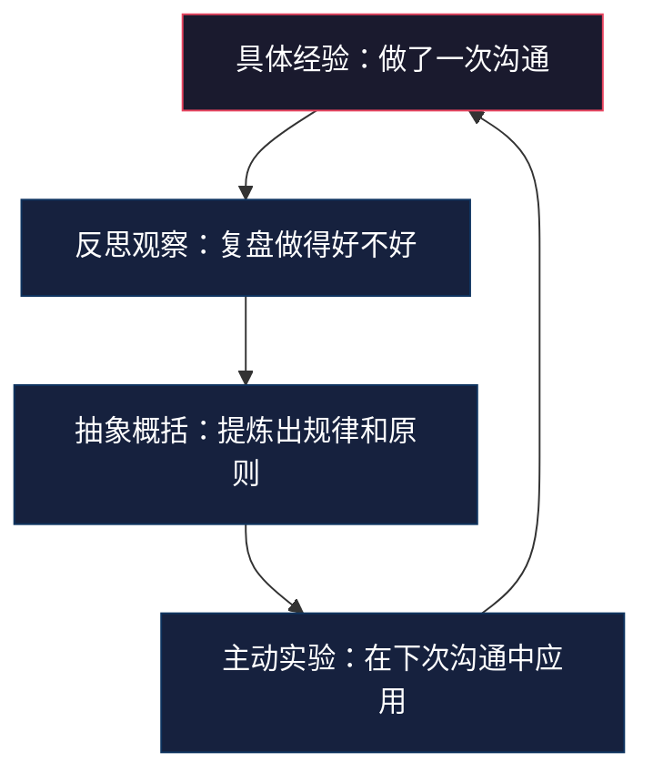
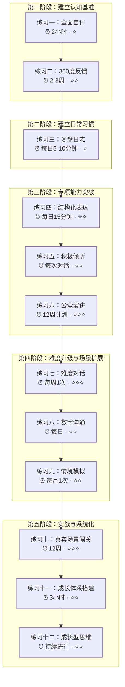
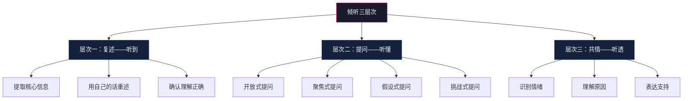
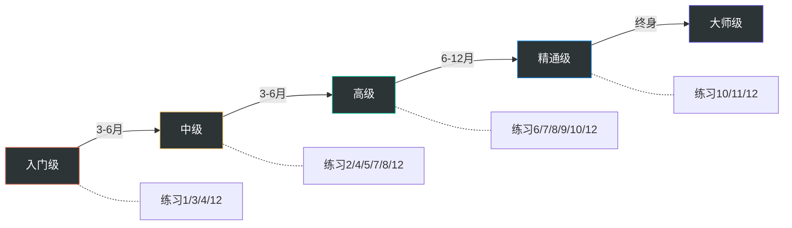

# 第五节：练习方法

## 从知道到做到：沟通能力的系统化练习方案

**案例导入**：张伟是一名技术能力出色的后端工程师，入职三年代码质量始终团队第一，但每次项目评审会上他的发言总是让人昏昏欲睡——先花10分钟铺垫技术背景，然后才含糊地说出结论，同事们私下叫他"绕弯子"。直到一次晋升答辩被拒，评委的反馈只有一句话："技术深度足够，但无法让非技术人员理解你的价值。"这次打击让他意识到：**沟通能力不是锦上添花，而是职业发展的天花板**。他开始按照本节的体系化方案练习：第一周完成DISC自评发现自己是典型的C型（谨慎型）——习惯用数据说话，但忽略了听众的情感需求；第二周开始每天用PREP法则练习60秒口头表达；第三周在团队会议中主动做了一次结构化汇报。六个月后，他在公司年度技术峰会上做了200人规模的主题演讲，获得了"最佳技术分享奖"。评委的评语变成了："技术深度和表达清晰度兼具。"

这个案例验证了一个关键事实：**沟通能力不是天赋，而是可以通过结构化练习习得的技能**。张伟的转变不是因为他"突然变外向了"，而是因为他找到了正确的方法并坚持练习。

前四节完成了"道"（理论基础）、"法"（核心技巧）、"术"（实战案例）、"器"（误区规避）的铺垫，本节进入整个闭环中投入产出比最高的环节——**练**。理论再精妙，不练习就是空中楼阁；技巧再实用，不反复操练就无法内化为本能。

刻意练习理论的提出者K. Anders Ericsson在《刻意练习》一书中反复强调一个核心观点：**天赋决定起点，练习决定高度**。他研究了小提琴手、国际象棋大师、运动员等领域的顶尖表现者，发现他们无一例外地经历了大量结构化的刻意练习——不是简单的重复，而是有目标、有反馈、有挑战的针对性训练。沟通能力的提升完全遵循同样的规律。

### 理论基础：为什么"练"比"学"更重要

沟通能力是一种**程序性知识**，而非陈述性知识。你可以通过阅读学会"PREP法则是什么"（陈述性知识），但只有通过反复实践才能学会"在紧张的会议中自然地使用PREP法则"（程序性知识）。两者的习得机制完全不同——前者靠记忆，后者靠练习。

认知科学将这一差异称为"知道"（knowing）与"做到"（doing）之间的鸿沟。你可以在5分钟内读完PREP法则的说明，但可能需要50次练习才能在真实场景中自然运用。这不是因为你"笨"，而是因为程序性知识的习得需要建立神经通路——反复练习让相关神经元之间的连接越来越强，最终达到"自动化"的程度。就像学开车：刚开始需要刻意想"踩离合、挂挡、松离合、给油"，熟练后这些动作完全自动化，你甚至不记得自己是怎么完成的。

David Kolb的经验学习循环理论描述了能力习得的完整闭环：

大多数人的问题是：只停留在"具体经验"阶段——每天做无数次沟通，但从不反思、从不提炼、从不刻意应用。本节的12项练习，本质上是帮你在Kolb循环的每个阶段都有工具可用。

所有沟通技能的学习都经历Dreyfus模型的四个阶段：

| 阶段 | 状态 | 行动 | 典型困惑 |
|------|------|------|---------|
| 无意识无能力 | "我不知道我不知道" | 通过自评和360反馈建立觉察 | "我沟通挺好的啊，有什么问题？" |
| 有意识无能力 | "我知道我做不到" | 通过刻意练习建立新技能 | "道理我都懂，就是做不好"——这是最容易放弃的阶段 |
| 有意识有能力 | "我能做到，但需要刻意想" | 在更多场景中练习，扩大适用范围 | "开会时能做到，日常聊天还是会忘" |
| 无意识有能力 | "我自然而然就做到了" | 挑战更高难度场景，继续精进 | 新技能变成了自动化的"默认行为" |

大多数人卡在第二阶段——因为"知道自己不行"是最痛苦的。正确的应对方式是：接受这个痛苦，把它视为"成长的信号"而非"失败的标志"。每一次"我做不到"的体验，都是大脑在建立新神经通路的过程——就像肌肉在锻炼后的酸痛，不是"受伤"，而是"变强"。

**练习设计的四条原则**：

| 原则 | 含义 | 在本节中的体现 |
|------|------|---------------|
| 明确目标 | 每次练习聚焦一个具体技能，而非笼统的"提升沟通" | 每项练习开头都标明"练习目标"和"适用阶段" |
| 即时反馈 | 练习后立即知道做得好不好、哪里需要改进 | 提供自评清单、同伴反馈模板、复盘日志 |
| 难度递进 | 始终在"舒适区边缘"练习——不无聊、不崩溃 | 每项练习分入门→进阶→精通三个层次 |
| 大量重复 | 同一技能在不同场景反复练习，直到自动化 | 提供4-8周的渐进练习计划 |

### 练习体系总览

本节设计了十二个递进式练习方案，按照"自我认知→外部校准→日常习惯→专项突破→难度升级→数字场景→模拟训练→实战闯关→系统搭建→心态重塑"的逻辑排列。每个练习都包含统一的五层结构：

| 层次 | 说明 | 对应问题 |
|------|------|----------|
| 理论依据 | 权威研究和心理学机制 | 为什么这个练习有效？ |
| 操作步骤 | 具体到每一步怎么做 | 我应该从哪里开始？ |
| 实操模板 | 拿来就用的表格/清单/框架 | 有没有可以直接用的工具？ |
| 进阶变体 | 入门/进阶/专业三个层级 | 我当前水平适合哪个版本？ |
| 常见陷阱 | 典型错误和纠正方法 | 练习时容易踩哪些坑？ |

**使用建议**：不必一次做完所有练习。建议先完成练习一（建立基准线），然后根据自评结果选择最薄弱的2-3个专项练习，坚持4周形成习惯后再扩展。练习三（复盘日志）和练习十二（成长型思维）属于"底层习惯"，建议从第一天就开始培养。练习七到练习九是"难度扩展"阶段，适合有一定基础后再进入。

---

### 练习一：沟通能力全面自评

**练习目标**：建立沟通能力的基准线，明确"我现在在哪里"

**为什么需要自评**：没有基准线的练习是盲目的。你可能在某个维度已经足够强，却花大量时间重复练习；也可能在某个维度严重不足，却因为"感觉还行"而忽视它。自评的作用是用结构化的方式，替代模糊的自我感觉，为后续所有练习提供方向。

**适用阶段**：入门（所有水平的练习者都应从自评开始）

#### 第一步：完成DISC行为风格评估（30分钟）

DISC模型由心理学家William Moulton Marston于1928年提出，将人的行为风格分为四种类型。理解自己的类型是调整沟通方式的基础——它解释了"为什么我总是用这种方式沟通"以及"为什么有些人和我沟通特别费劲"。

| 类型 | 核心驱动力 | 沟通优势 | 沟通盲点 | 典型口头禅 | 在团队中的角色 |
|------|-----------|---------|---------|-----------|-------------|
| D（支配型） | 结果与控制 | 决策果断、直奔主题 | 忽视他人感受、过于强势 | "直接说结论" | 推动者、决策者 |
| I（影响型） | 认可与社交 | 热情感染力强、善于激励 | 缺乏细节、时间管理差 | "太棒了！" | 气氛营造者、联络人 |
| S（稳健型） | 稳定与和谐 | 耐心倾听、可靠可信 | 回避冲突、决策缓慢 | "我们再想想" | 稳定器、执行者 |
| C（谨慎型） | 准确与质量 | 逻辑严密、数据驱动 | 过于纠结细节、缺乏温度 | "数据怎么说" | 分析师、质量把关人 |

完成DISC自评后，回答以下问题来深化认知：

1. 我的主类型是____，副类型是____
2. 这个类型在沟通中的三个典型行为是：
   - ________________________
   - ________________________
   - ________________________
3. 这个类型最容易与哪种类型产生冲突？为什么？
   ________________________
4. 我需要刻意补偿的盲点是什么？
   ________________________

知道自己类型后，最实际的应用是"翻译"——把自己的沟通偏好"翻译"成对方能接受的版本：

| 你的类型 | 与D型沟通时 | 与I型沟通时 | 与S型沟通时 | 与C型沟通时 |
|----------|------------|------------|------------|------------|
| D型 | 直接切入正题，聚焦结果 | 先寒暄几句再谈正事 | 给对方充足的时间思考 | 用数据和逻辑支撑你的观点 |
| I型 | 精简表达，突出结果 | 充分互动，保持热情 | 放慢节奏，不要催促 | 准备好具体的数据和细节 |
| S型 | 主动表达立场，别只附和 | 积极回应，多给正面反馈 | 耐心等待，营造安全感 | 用条理清晰的方式呈现信息 |
| C型 | 先说结论，再补充细节 | 适当放松，不要过于严肃 | 给出确定性，减少模糊 | 展示你的分析过程和依据 |

#### 第二步：完成MBTI人格类型评估（30分钟）

MBTI从四个维度描述人格偏好，每个维度都深刻影响沟通风格：

| 维度 | 偏好A | 偏好B | 对沟通的具体影响 | 典型冲突 |
|------|-------|-------|-----------------|---------|
| 能量来源 | E（外向）：在交流中获取能量 | I（内向）：在独处中恢复能量 | E型倾向于边说边想，I型倾向于想好再说 | E型觉得I型"不回应"，I型觉得E型"太吵" |
| 信息获取 | S（感觉）：关注具体事实 | N（直觉）：关注可能性 | S型需要"看到了什么"，N型需要"意味着什么" | S型觉得N型"不切实际"，N型觉得S型"没想象力" |
| 决策方式 | T（思考）：基于逻辑判断 | F（情感）：基于价值观判断 | T型问"合不合理"，F型问"合不合适" | T型觉得F型"太感性"，F型觉得T型"太冷血" |
| 行动方式 | J（判断）：喜欢计划和确定性 | P（感知）：喜欢灵活性和开放性 | J型希望"定下来"，P型希望"再看看" | J型觉得P型"不靠谱"，P型觉得J型"太死板" |

**关键认知**：MBTI不是标签，而是偏好。一个INTJ不是"不会共情"，而是"默认倾向于逻辑分析"。了解偏好后，你可以有意识地在需要时切换模式。

#### 第三步：综合分析与报告撰写（1小时）

将DISC和MBTI的结果交叉分析，撰写自我评估报告：

沟通能力自评报告
━━━━━━━━━━━━━━━━━━━━━━━━━━

一、我的沟通风格画像
  DISC类型：____  主导驱动力：____
  MBTI类型：____  关键偏好：____
  综合描述：我是一个____型的沟通者，
  核心优势是____，最大盲点是____

二、八维度能力自评（1-5分）

  1. 表达清晰度：____
     评判标准：能否在2分钟内让对方理解一个复杂概念
  2. 倾听能力：____
     评判标准：能否在对话后准确复述对方的核心观点
  3. 说服影响力：____
     评判标准：提出的建议被采纳的比例
  4. 冲突处理：____
     评判标准：能否在冲突中既维护关系又解决问题
  5. 公众演讲：____
     评判标准：能否在50人以上场合自信表达
  6. 书面沟通：____
     评判标准：邮件/文档是否一次就能让对方理解
  7. 跨文化沟通：____
     评判标准：能否与不同背景的人有效协作
  8. 情绪管理：____
     评判标准：在压力/冲突下能否保持理性沟通

三、关键事件回顾（过去6个月）
  最成功的沟通事件：
    场景：________________
    我做了什么：________________
    结果：________________
    成功原因：________________

  最失败的沟通事件：
    场景：________________
    我做了什么：________________
    结果：________________
    失败原因：________________
    如果重来，我会：________________

四、成长目标（未来6个月）
  主要目标：________________
  次要目标：________________
  衡量指标：________________
  第一个月的具体行动：________________
━━━━━━━━━━━━━━━━━━━━━━━━━━

**自评的常见陷阱**：

| 陷阱 | 表现 | 纠正方法 | 心理学原理 |
|------|------|---------|-----------|
| 邓宁-克鲁格效应 | 能力越低的人越倾向于给自己打高分 | 用具体事件而非感觉来打分 | 元认知能力不足导致无法准确评估自己 |
| 聚光灯效应 | 过度放大自己的某次失败 | 收集他人反馈来校准自我认知 | 高估他人对自己的关注度 |
| 虚假谦虚 | 故意给自己打低分以显得"谦虚" | 诚实面对自己，包括优势 | 社会期望偏差 |
| 幸存者偏差 | 只回忆成功案例 | 刻意回忆失败案例来平衡 | 显著性偏差——成功事件更容易被记住 |
| 近因效应 | 被最近一两次沟通经历过度影响 | 回顾至少3个月的沟通经历 | 最近的记忆权重被高估 |

**自评结果的使用方法**：自评报告完成后，最重要的一步是将八维度得分可视化。画一个雷达图（八边形，每个顶点代表一个维度），用不同颜色标记"当前得分"和"目标得分"，两者的差距就是你的成长空间。然后按照差距大小排序，选择差距最大的1-2个维度作为未来3-6个月的重点练习方向。

---

### 练习二：360度反馈收集

**练习目标**：获取多维度的沟通能力反馈，校准自评偏差

**为什么需要360度反馈**：心理学研究表明，自我评估的准确度只有约30%。你在会议上觉得自己"简洁有力"，同事可能觉得你"打断别人"；你觉得自己"温和友善"，下属可能觉得你"不敢表态"。360度反馈是一面多角度的镜子，帮你看到自我的盲区。

**适用阶段**：入门至进阶

#### 第一步：设计反馈问卷（1小时）

问卷设计的质量直接决定反馈的有效性。好的问卷应该同时包含量化评分和开放性描述——量化数据告诉你"差多少"，开放性描述告诉你"差在哪里"。

360度沟通能力反馈问卷
━━━━━━━━━━━━━━━━━━━━━━━━━━

【说明】本问卷用于帮助被评估人了解自己的沟通风格和
能力水平。请根据您与TA的日常互动，选择最符合的选项。
问卷完全匿名，结果仅用于被评估人的个人发展。

第一部分：行为描述评分（1=从不 2=偶尔 3=有时
4=经常 5=总是）

A. 表达与传递
  A1. 能用简洁的语言解释复杂问题    [1 2 3 4 5]
  A2. 表达时逻辑清晰、层次分明      [1 2 3 4 5]
  A3. 能根据听众调整表达方式         [1 2 3 4 5]

B. 倾听与理解
  B1. 在对话中认真倾听他人意见       [1 2 3 4 5]
  B2. 能准确理解他人的核心诉求       [1 2 3 4 5]
  B3. 不会随意打断他人发言           [1 2 3 4 5]

C. 影响与说服
  C1. 能用数据和案例支持自己的观点   [1 2 3 4 5]
  C2. 在讨论中能有效推动决策         [1 2 3 4 5]
  C3. 在不同意时也能尊重对方         [1 2 3 4 5]

D. 冲突与协作
  D1. 在意见分歧时能保持冷静         [1 2 3 4 5]
  D2. 能在冲突中寻找双赢方案         [1 2 3 4 5]
  D3. 主动化解团队中的沟通障碍       [1 2 3 4 5]

第二部分：开放式问题

1. 与TA沟通时，您最欣赏的一个优点是什么？
   ________________________________

2. 如果TA能在一件事上改进沟通方式，
   您会建议什么？
   ________________________________

3. 用一个词形容与TA的沟通体验：____
━━━━━━━━━━━━━━━━━━━━━━━━━━

#### 第二步：选择评估人（30分钟）

| 角色 | 建议人数 | 能观察到的维度 | 选择标准 | 常见盲区 |
|------|---------|---------------|---------|---------|
| 直接上级 | 1-2人 | 影响力、战略沟通、汇报能力 | 与你有频繁工作互动的上级 | 只看到"汇报场景"，不了解日常沟通 |
| 平级同事 | 3-5人 | 协作沟通、日常表达、倾听 | 选择不同类型的合作关系（密切/一般/跨部门） | 关系好的可能美化，关系差的可能夸大 |
| 直接下属 | 2-3人 | 领导沟通、反馈给予、倾听 | 选择敢于说真话的下属 | 可能因权力关系不敢给真实反馈 |
| 外部合作方 | 1-2人 | 专业沟通、跨文化沟通 | 有深度合作经历的客户或合作伙伴 | 观察场景有限，可能只看到"正式面" |
| 个人关系 | 1-2人 | 情绪管理、日常沟通习惯 | 能坦诚交流的朋友或家人 | 可能缺乏专业沟通场景的观察 |

**选择评估人的注意事项**：
- 不要只选择"关系好"的人，他们倾向于给高分
- 不要只选择"职位高"的人，他们的观察维度有限
- 确保评估人覆盖你日常沟通的主要场景
- 提前沟通目的，强调"帮助成长"而非"评价好坏"
- 如果团队氛围不够信任，优先使用匿名在线问卷工具（如腾讯问卷、金数据）

#### 第三步：收集反馈（1-2周）

反馈收集邮件模板：
━━━━━━━━━━━━━━━━━━━━━━━━━━
主题：邀请参与我的沟通能力反馈（匿名，约10分钟）

Hi [姓名]，

我正在系统性地提升自己的沟通能力，
希望能获得你的真实反馈。

这份问卷完全匿名，大约需要10分钟。
你的反馈将帮助我了解自己的优势和盲点。

问卷链接：[链接]
截止日期：[日期，建议给7-10天]

非常感谢你的帮助！
━━━━━━━━━━━━━━━━━━━━━━━━━━

**跟进策略**：
- 发送后第3天：感谢已提交的人（不透露谁提交了）
- 发送后第5天：提醒未提交的人（仅提醒一次）
- 发送后第7天：截止，不再催促
- 目标回收率：70%以上为有效样本

#### 第四步：分析反馈与制定行动计划（2小时）

**反馈处理的心理建设**：收到负面反馈时的正常反应是防御——"他们不了解情况""那次是特殊情况"。这是大脑的自我保护机制，心理学称之为"认知失调"——当外部信息与自我认知冲突时，大脑会自动寻找理由来维护现有认知。

正确的做法是：
1. **先记录，不评判**：把所有反馈原封不动地记下来
2. **等待24小时**：让情绪消退后再分析——神经科学研究表明，情绪反应的半衰期约为90分钟
3. **关注行为描述而非情绪表达**：把"他觉得我态度差"转化为"他观察到我在XX场景下做了XX行为"
4. **寻找共识**：如果3个人中有2个人提到了同一个问题，大概率是真实的
5. **区分"风格"和"能力"**：有人喜欢你直接，有人觉得你太冲——这是风格差异，不一定是能力问题

**反馈的进阶应用——"差距模式"分析法**：

| 模式 | 自评 vs 他评 | 含义 | 行动建议 |
|------|-------------|------|---------|
| 盲区型 | 自评高，他评低 | 你不知道自己有问题 | 最需要关注——用具体事件校准认知 |
| 谦虚型 | 自评低，他评高 | 你低估了自己的优势 | 建立自信，发挥已有优势 |
| 共识型（强） | 双方都高 | 这是你的真正优势 | 保持并精进，可以作为个人品牌 |
| 共识型（弱） | 双方都低 | 这是公认的成长空间 | 优先安排练习计划 |

**360反馈的复用建议**：不要只做一次。建议每6个月做一次完整版，每3个月做一次"迷你版"（只问3个核心问题：最大的优点、最大的改进点、一个关键词）。迷你版可以帮助你追踪改进进度，而完整版可以发现新的盲区。

---

### 练习三：沟通复盘日志

**练习目标**：建立日常反思习惯，将每次沟通转化为学习机会

**为什么复盘是最高杠杆的练习**：大多数人每天进行数十次沟通，但从不复盘。这意味着他们重复犯同样的错误，错过同样的学习机会。复盘日志的本质是"用5分钟换5年经验"——每天花5分钟反思，3年后的沟通能力将远超从不反思的人。神经科学研究支持这一观点：睡眠期间大脑会对当天的经验进行"重播"和"整合"，而复盘日志相当于在重播之前就标记了"哪些经验值得整合"——这大幅提升了学习效率。

**适用阶段**：所有阶段（入门就开始，终身持续）

#### 每日复盘：PREP-Plus法（5-10分钟）

PREP-Plus是在经典PREP复盘法基础上增加"情绪觉察"和"行动锚定"两个维度。为什么加这两个维度？因为沟通失败最常见的原因不是"不知道该怎么做"，而是"在情绪影响下忘了该怎么做"。情绪觉察帮你识别情绪模式，行动锚定帮你在下次遇到类似场景时自动触发正确行为。

每日沟通复盘日志
━━━━━━━━━━━━━━━━━━━━━━━━━━
日期：____  今日沟通总时长：约____分钟

今日最重要的一次沟通：
  场景：____
  对象：____
  目标：____

PREP-Plus复盘：

P（Point-目标）：这次沟通我想达成什么？
  ________________________

R（Reason-效果）：实际效果如何？
  □ 超出预期  □ 达成预期  □ 部分达成  □ 未达成
  具体表现：________________

E（Example-细节）：哪些具体行为导致了这个结果？
  做得好的：
  1. ________________________
  2. ________________________
  做得不好的：
  1. ________________________
  2. ________________________

P（Point-改进）：下次遇到类似场景，我会：
  ________________________

Plus1（情绪觉察）：这次沟通中我的情绪变化是：
  开始时：____  高潮时：____  结束时：____
  情绪对沟通的影响：________________

Plus2（行动锚定）：明天我要刻意练习的一个行为是：
  ________________________
━━━━━━━━━━━━━━━━━━━━━━━━━━

**复盘的关键原则**：

| 原则 | 含义 | 反面示例 | 正面示例 |
|------|------|---------|---------|
| 及时性 | 在沟通结束后30分钟内完成 | 超过24小时后大脑会自动"美化"记忆 | 会议结束立刻花5分钟记录 |
| 具体性 | 记录可观察的行为和事实 | "沟通不太顺利" | "当我说到预算超支时，对方开始看手机" |
| 行为导向 | 关注"我做了什么"而非"我是什么样的人" | "我表达不清楚" | "我在解释技术方案时没有用对方能理解的类比" |
| 平衡视角 | 既记录亮点也记录不足 | 只关注做错的部分 | 同样记录"这次复述对方观点做得很到位" |
| 行动转化 | 每条复盘必须产出一个改进行动 | "下次注意" | "下次解释技术方案前先准备一个生活类比" |

#### 每周深度回顾（30分钟）

每周日或周一早上，花30分钟回顾本周的所有日志，重点进行**模式识别**——把所有"未达成预期"的复盘按场景分类（会议发言？一对一反馈？还是跨部门协调？），聚类最多的场景就是你的"薄弱场景"。同时统计不同场景下的情绪分布——哪些场景容易触发焦虑？情绪模式往往指向深层的能力缺口或价值观冲突。

---

### 练习四：刻意练习——结构化表达

**练习目标**：提升表达的逻辑性、清晰度和说服力

**为什么结构化表达是第一优先级**：在所有沟通技能中，结构化表达的投入产出比最高。无论是一对一交流、会议发言还是邮件撰写，结构化的表达都能显著提升信息传递效率。麦肯锡的研究表明，结构化表达可以将信息理解率从40%提升到85%以上。大脑处理信息的方式本身就是结构化的——当你给信息一个"骨架"，听众的认知负荷大幅降低，记忆留存率显著提升。

**适用阶段**：入门至进阶

#### 方法一：PREP法则深度练习

PREP法则（Point-Reason-Example-Point）是最基础也最实用的表达结构。入门者容易犯的错误是"知道公式但用不好"，问题通常出在Reason和Example环节。

**标准PREP示例分析**：

话题：为什么团队应该采用代码审查制度？

P（观点）："我建议团队引入代码审查制度。"

R（理由）："因为代码审查能在代码进入生产环境之前
  发现缺陷，降低线上故障率。"
  ↑ 好的Reason：具体、可验证、与观点直接相关

E（举例）："上个季度，我们在A项目中引入了代码审查，
  线上Bug数量从每月12个降低到了3个，降幅达75%。
  而同期没有采用审查的B项目，Bug数量基本不变。"
  ↑ 好的Example：有数据、有对比、有时间范围

P（重申）："所以，引入代码审查能直接降低我们的
  线上故障率，建议从下个迭代开始试行。"
  ↑ 好的重申：包含具体行动建议，不只是重复观点

**常见PREP缺陷与修正**：

| 缺陷 | 错误示例 | 修正后 | 问题根源 |
|------|---------|--------|---------|
| Reason太抽象 | "因为这对团队有好处" | "因为代码审查能将Bug发现率提升60%，减少返工时间" | 缺乏具体数据支撑 |
| Example太模糊 | "很多公司都这么做" | "Google的代码审查覆盖率超过90%，这是其高质量的基石之一" | 用模糊权威替代具体证据 |
| Example与Reason重复 | R和E说的是同一件事 | R说原理（为什么），E说证据（具体案例） | 没分清"论点"和"论据"的区别 |
| 重申只是重复 | 重复说了一遍观点 | 加入行动建议或新的视角 | 不理解"重申"的价值在于"升级"而非"重复" |

**PREP进阶练习计划**：

第1周：基础PREP
  每天1个话题，写下来，不计时
  重点：确保四个部分完整且不重复

第2周：口头PREP
  每天1个话题，说出来，控制在90秒内
  重点：语言流畅、不卡顿

第3周：即兴PREP
  随机话题（让朋友或AI出题），30秒准备后表达
  重点：快速组织、核心信息不遗漏

第4周：高压力PREP
  在会议中主动发言，使用PREP结构
  重点：在真实场景中自然运用

**PREP的"微练习"技巧**：不需要额外时间，只需要改变意识——等电梯时用PREP在心里组织接下来要跟同事说的话；通勤时随机选一个话题用PREP组织表达；午休时跟同事聊天用PREP组织分享内容；睡前用PREP回顾今天最重要的一件事。

#### 方法二：金字塔原理实战练习

金字塔原理由Barbara Minto在麦肯锡工作期间提出，适合表达复杂信息。核心规则是"结论先行，以上统下，归类分组，逻辑递进"。为什么"结论先行"如此重要？因为听众的注意力是稀缺资源——如果你先铺垫5分钟再给结论，听众可能在第2分钟就已经走神了。

练习任务：将以下信息用金字塔原理重组

原始信息（散乱的）：
"我们的客户满意度下降了。客服响应时间太长。
产品有几个Bug一直没修。最近一次更新引入了
新的问题。竞品推出了新功能。我们的价格
比竞品高20%。客户投诉量增加了35%。
我们的市场份额从15%降到了12%。"

金字塔结构：

核心结论：客户满意度下降需要紧急应对，
否则将面临持续的市场份额流失

├── 论点1：客户满意度指标全面恶化
│   ├── 论据1.1：客户满意度评分下降
│   ├── 论据1.2：客户投诉量增加35%
│   └── 论据1.3：市场份额从15%降至12%
│
├── 论点2：内部运营问题是根本原因
│   ├── 论据2.1：客服响应时间过长
│   ├── 论据2.2：产品Bug积压未修
│   └── 论据2.3：最近更新引入新问题
│
└── 论点3：外部竞争压力加剧恶化
    ├── 论据3.1：竞品推出新功能
    └── 论据3.2：我们价格高于竞品20%

**金字塔的两种重要变体**：

**SCQA结构**（适合讲故事/汇报）：S（Situation-情境）→ C（Complication-冲突）→ Q（Question-问题）→ A（Answer-答案）。通过"冲突"制造认知张力，让听众产生"想知道答案"的欲望。适用场景：向管理层汇报问题、提出方案建议。

**SCQA完整工作示例**：

场景：向CEO汇报客服系统升级方案

S（情境）："我们的客服系统已经运行了3年，
  目前支撑着每天约2000个客户咨询。"

C（冲突）："但最近6个月，系统故障频率从每月1次
  增加到每周2-3次，客户平均等待时间从3分钟
  增加到了15分钟，客户满意度从85%降到了62%。"

Q（问题）："如何在不中断服务的前提下，
  彻底解决系统稳定性问题？"

A（答案）："建议分三阶段升级：第一阶段（2周）
  优化现有系统的关键瓶颈；第二阶段（4周）
  部署新的客服系统并与旧系统并行运行；
  第三阶段（2周）完成切换和旧系统下线。
  预算约45万，预计3个月内客户满意度恢复到80%以上。"

关键技巧：
  - S要简洁，只说必要的背景
  - C要具体，用数据制造紧迫感
  - Q要自然，让听众觉得"确实该问这个问题"
  - A要完整，包含方案、预算、时间线、预期效果

**MECE原则**（适合分析问题）：Mutually Exclusive, Collectively Exhaustive，即"相互独立，完全穷尽"。每次分析问题前，检查你的分类是否MECE——"产品问题→功能不好用→竞品更便宜"是错误的（"功能不好用"包含在"产品问题"中），正确分类是"产品层面→服务层面→市场层面"。

**MECE检验练习**：

练习任务：分析"项目延期"的原因

错误分类（不MECE）：
  1. 需求不清晰
  2. 技术难度大
  3. 需求变更频繁 ← 与"需求不清晰"重叠
  4. 人手不够
  5. 工期太紧 ← 与"人手不够"可能重叠

正确分类（MECE）：
  按项目管理要素分类——
  1. 范围管理：需求蔓延、范围镀金
  2. 资源管理：人手不足、技能不匹配
  3. 进度管理：估算偏差、依赖阻塞
  4. 风险管理：技术风险未识别、外部依赖未对齐

检验方法：
  - 用"So What"测试：每个子项能否独立支撑父论点？
  - 用"重叠测试"：任意两个子项之间是否有交集？
  - 用"穷尽测试"：所有子项加起来是否覆盖了全部情况？

#### 方法三：STAR法则——叙述型表达

STAR（Situation-Task-Action-Result）法则适合叙述具体经历和案例。在汇报工作、面试回答、讲述项目经验时，STAR能帮你把"流水账"变成"有说服力的叙述"。进阶用法是STAR-L（加Lesson），在标准STAR之后加上"从这次经历中学到了什么"，让叙述从"讲述过去"升级为"展示成长"。

**结构化表达的常见误区**：

| 误区 | 表现 | 后果 | 纠正方法 |
|------|------|------|---------|
| 为结构而结构 | 生硬套用框架，听起来像在背公式 | 听众感到不自然、缺乏真诚感 | 先理解内容，再选择合适的结构 |
| 结构过载 | 一次表达中套用3-4个框架 | 信息层次过多，听众跟不上 | 一次表达只用一个主框架 |
| 忽略听众 | 不根据听众调整结构 | 技术人员听不懂你的"金字塔" | 对技术同事用"问题-方案-验证"，对管理层用"结论-论据" |
| 只练书面不练口头 | 书面表达很清晰，口头表达还是混乱 | 正式场合表现好，日常沟通依然差 | 每周至少3次口头结构化表达练习 |

---

### 练习五：刻意练习——积极倾听

**练习目标**：提升倾听能力、共情能力和提问能力

**为什么倾听是最被低估的沟通技能**：大多数人认为"会说话"等于"会沟通"，但研究显示，高效沟通者花在倾听上的时间是说话时间的2倍以上。国际倾听协会的研究表明，人们在倾听时只能保留25%-50%的信息——这意味着你听到的"一半内容"可能已经被错误理解。更深层的原因是：倾听是建立信任的最短路径。当一个人感到"被听见"，他的防御心理会降低、合作意愿会提升。很多沟通问题的根源不是"说不清楚"，而是"没有先听清楚"。

**适用阶段**：入门至精通

#### 倾听的三层次模型

#### 层次一：复述练习——先学会"听到"

复述是倾听能力的入门训练。目标不是像录音机一样重复，而是提取对方的核心意思并用自己的话重新表达。这个练习训练的是"注意力分配"能力——把注意力从"我接下来要说什么"转移到"对方正在说什么"。

复述练习的标准流程：

对方发言结束后：
1. 内部处理（3秒）：提取核心观点，忽略细节
2. 标记开头："让我确认一下我理解的是否正确——"
3. 复述核心："你说的是____"
4. 补充细节："特别是关于____这一点"
5. 询问确认："我理解的对吗？"

练习示例：

对方："最近项目压力太大了，需求一直在变，
  产品经理说客户那边又提了新需求，我们团队
  加了两周班了，但进度还是赶不上，我真不知道
  这个项目还能不能按时交付。"

复述："让我确认一下——你感到项目压力很大，
  主要是因为需求持续变化导致团队即使加班也
  跟不上进度，你对能否按时交付感到担忧。
  对吗？"

  ↑ 提取了3个核心信息：压力大、需求变、交付担忧
  ↑ 忽略了"两周班""产品经理说"等细节
  ↑ 用自己的话重新组织，而非原话重复

**复述的常见错误**：

| 错误类型 | 示例 | 正确做法 | 为什么会犯这个错 |
|----------|------|---------|----------------|
| 鹦鹉学舌 | 原话重复对方的话 | 用自己的话重新表达 | 大脑在"复读"而非"理解" |
| 过度解读 | "你是不是想辞职？" | 只复述对方明确表达的内容 | 投射了自己的担忧到对方身上 |
| 丢失情感 | 只复述事实，忽略情绪 | 同时捕捉事实和情感 | 没有意识到情绪也是"信息"的一部分 |
| 急于回应 | 复述完马上给建议 | 先确认理解正确再回应 | "解决问题"的冲动压过了"理解问题"的耐心 |

#### 层次二：提问练习——学会"听懂"

好的提问能让对方说得更多、说得更深，帮你从"听到"升级到"听懂"。提问的本质不是"获取信息"，而是"引导思考"——一个好的问题能让对方自己发现答案。

| 提问类型 | 适用场景 | 示例 | 心理机制 |
|----------|---------|------|---------|
| 开放式提问 | 对话开头，需要了解全貌 | "能具体说说发生了什么吗？" | 降低对方防御心理，建立安全感 |
| 聚焦式提问 | 信息模糊，需要具体化 | "你说的'压力大'具体是指什么？" | 帮对方从情绪表达切换到事实描述 |
| 假设式提问 | 探索解决方案 | "如果需求不再变，你们有信心按时交付吗？" | 用假设降低现实压力，激发创造性思考 |
| 挑战式提问 | 对方思路受限，需要突破 | "有没有可能换个角度看这个问题？" | 温和地制造认知冲突，推动深度思考 |

**提问的禁忌**：

| 禁忌 | 示例 | 为什么有害 | 替代方式 |
|------|------|-----------|---------|
| 连环追问 | "为什么？""然后呢？""具体呢？" | 让对方感到被审讯 | 穿插复述和共情，让对话有呼吸感 |
| 诱导性提问 | "你不觉得这个方案有问题吗？" | 预设了答案，限制了对方思考 | "你对这个方案怎么看？" |
| 封闭式连续使用 | "是不是？""对不对？""好不好？" | 对方只能答是或否，无法展开 | 用开放式提问打开话题，再用封闭式确认 |
| 假提问真表达 | "你不觉得我们应该换个方向吗？" | 这不是提问，是包装成问句的意见 | 直接表达意见，再真诚地征求对方看法 |

#### 层次三：共情练习——学会"听透"

共情是倾听的最高层次——不仅能听懂对方说了什么，还能理解对方没说的、以及为什么这么说。共情不是"同情"（"你好可怜"），也不是"认同"（"你说得对"），而是"理解"（"我明白你为什么会有这种感受"）。

共情回应的三层结构：

第一层：识别情绪（对方的感受是什么？）
  "你看起来很沮丧/焦虑/失望"

第二层：理解原因（为什么有这种感受？）
  "因为投入了很多努力但结果不如预期"

第三层：表达支持（我能做什么？）
  "我能理解你的感受。你现在最需要什么？"

共情回应示例：

对方："这个方案被驳回了三次了，我实在不知道
  还要怎么改。"

缺乏共情的回应：
  ✗ "别灰心，下次一定能过"（廉价安慰——否定对方的挫败感）
  ✗ "你要不换个思路？"（急于给建议——跳过了理解阶段）
  ✗ "领导就是这样的"（转移话题——回避了对方的情绪）

有共情的回应：
  ✓ "被驳回三次确实让人很沮丧。你在这份方案上
     投入了很多心血，我能理解这种反复修改的疲惫。
     你觉得这次被驳回的主要原因是什么？"

  ↑ 先认可情绪，再表达理解，最后引导对方思考
  ↑ "你觉得"把主动权交还给对方

**共情的关键原则**：
1. **先共情后解决**：对方在情绪中时，任何建议都是噪音。神经科学研究表明，当杏仁核被激活（情绪激动状态），前额叶皮层（理性思考区域）的功能会被抑制——对方在情绪中时，根本听不进建议
2. **不要比惨**："我也遇到过"——这把焦点从对方转移到了你身上
3. **不要否定感受**："你不应该这么想"——感受没有对错，只有"存在"和"不存在"
4. **允许沉默**：共情后给对方几秒钟消化，不要急着填满沉默。沉默不是尴尬，是空间
5. **共情≠同意**：理解对方的感受不等于认同对方的判断

---

### 练习六：刻意练习——公众演讲

**练习目标**：从"能讲"到"会讲"到"讲得好"，系统提升公众表达能力

**为什么公众演讲值得专门练习**：公众演讲是沟通能力的"压力测试"——在高压力、多观众、有时间限制的条件下，你所有的沟通弱点都会被放大。LinkedIn的调查显示，公众演讲能力是职场晋升中排名前三的软技能。

**适用阶段**：入门至精通

#### 第一阶段：消除恐惧（第1-2周）

大多数人对公众演讲的恐惧程度超过对死亡的恐惧。这种恐惧的根源是"被评判的焦虑"——害怕出错、害怕被嘲笑、害怕失控。从进化心理学的角度看，这种恐惧源于远古时代"被群体排斥等于死亡"的本能。理解这一点很重要：你的紧张不是"弱点"，而是"进化遗留"——它不再适用于现代社会，但可以被重新解读。

**紧张管理的S.T.O.P技术**：
- **S**（Stop）：暂停，不要在紧张中继续说
- **T**（Take a breath）：深呼吸3次，4秒吸-7秒呼
- **O**（Observe）：观察自己的身体反应，不评判
- **P**（Proceed）：从下一个要点重新开始

#### 消除恐惧的阶梯练习：

| 阶梯 | 时间 | 任务 | 目标 | 关注点 |
|------|------|------|------|--------|
| 第一阶 | 第1天 | 对镜子说2分钟 | 适应"有人在看"的感觉 | 不要在意好不好看，只关注信息是否表达清楚 |
| 第二阶 | 第3天 | 录音自听3分钟 | 适应"自己的声音" | 骨传导和空气传导的音色差异是正常的，多听几次就好 |
| 第三阶 | 第5天 | 录像自看3分钟 | 同时观察语言和非语言表现 | 记录2个亮点和2个改进点 |
| 第四阶 | 第7天 | 向一个信任的人讲5分钟 | 适应"真实观众"的存在 | 观察对方的反应，但不要因此中断 |
| 第五阶 | 第10天 | 向2-3个人讲5分钟 | 适应"小群体"的压力 | 提前准备要点，但不要写逐字稿 |
| 第六阶 | 第14天 | 在团队会议中主动发言3分钟 | 在正式场景中练习 | 使用PREP结构，控制时间 |

**视频自审的"三遍看法"**：录像自看是公众演讲练习中反馈质量最高的方法，但大多数人只看一遍就放弃了——因为"看自己"很不舒服。正确的方法是看三遍，每遍聚焦不同维度。

第一遍：整体印象（不暂停）
  看完后回答：
  - 如果我是观众，我会给这个演讲打几分？
  - 最吸引我的一个瞬间是什么？
  - 最让我走神的一个瞬间是什么？

第二遍：语言维度（可以暂停）
  每2分钟暂停一次，检查：
  - 语速是否在180-220字/分钟？
  - 是否有口头禅（"然后""就是""对吧"）？
  - 关键信息前是否有停顿？
  - 结论是否清晰、不模糊？

第三遍：非语言维度（关掉声音）
  只看画面，检查：
  - 眼神：是在看人还是看天花板/PPT？
  - 手势：是自然配合还是不停摆弄？
  - 站姿：是稳定自信还是来回踱步？
  - 表情：是自然放松还是紧绷僵硬？

#### 第二阶段：内容构建（第3-4周）

好的演讲不是信息的堆砌，而是故事的讲述。认知心理学研究表明，人类大脑对故事的记忆效率是纯信息的22倍——这就是为什么你能记住十年前看过的电影情节，却记不住上周看过的报告数据。

**演讲内容的"三幕结构"**：

| 部分 | 时间占比 | 任务 | 方法 | 忌讳 |
|------|---------|------|------|------|
| 第一幕：开头 | 10%-15% | 抓住注意力，建立连接 | 提问开场、故事开场、数据开场、对比开场 | "大家好，今天我要讲的是____"（平淡无奇） |
| 第二幕：主体 | 70%-80% | 传递核心信息 | 核心观点不超过3个（Miller's Law），每个用"论点-论据-案例"展开，每8-10分钟插入互动 | 信息堆砌、没有过渡、没有互动 |
| 第三幕：结尾 | 10%-15% | 强化记忆，引导行动 | 总结回顾、行动号召、首尾呼应、金句收尾 | "我的分享就到这里"（虎头蛇尾） |

**TED演讲结构解密**：分析1000+场TED演讲后，研究者发现成功的TED演讲遵循一个共同模式——Hook（钩子，前30秒制造好奇心）→ Roadmap（路线图，一句话概括核心信息）→ Body（主体，每10分钟一个模块：论点+故事+数据+过渡）→ Call to Action（行动号召，最后1分钟）→ Memorable Close（记忆点结尾，最后30秒留下值得记住的话）。

#### 第三阶段：表达打磨（第5-8周）

**声音控制的四个维度**：

| 维度 | 正常范围 | 强调时 | 练习方法 |
|------|---------|--------|---------|
| 语速 | 每分钟180-220字 | 关键信息放慢到150字，过渡部分加快到240字 | 用手机计时朗读200字文字，控制在60秒左右 |
| 音量 | 最后一排能听清 | 强调时提高20%，亲密感时降低20% | 在不同大小的空间练习，感受音量需求 |
| 语调 | 陈述用平调，提问用升调 | 强调重点用重音+停顿 | 同一句话用不同语调说，感受含义差异 |
| 停顿 | 要点之间2-3秒 | 强调之后1-2秒，提问之后3-5秒 | 在演讲稿上标注停顿符号，刻意练习 |

**肢体语言的三个关键区域**：

| 区域 | 应该做的 | 避免做的 | 心理效应 |
|------|---------|---------|---------|
| 眼神 | 与不同区域的观众轮流对视，每人3-5秒 | 盯着天花板、PPT或某一个人 | 眼神接触建立信任感和参与感 |
| 手势 | 肩部以上自然展开，与内容配合 | 双手插兜、抱胸、不停摆弄东西 | 手势增强信息的记忆锚点 |
| 站姿 | 双脚与肩同宽，重心稳定 | 来回踱步、身体摇晃、倚靠讲台 | 稳定的站姿传递自信信号 |

#### 第四阶段：应变能力（第9周+）

| 阶段 | 周次 | 核心任务 | 每日投入 | 里程碑 |
|------|------|---------|---------|--------|
| 消除恐惧 | 第1周 | 对镜说话、录音自听 | 10分钟 | 能对镜说满3分钟不中断 |
| 消除恐惧 | 第2周 | 录像自看、对1-3人讲 | 15分钟 | 完成一次5分钟的小范围分享 |
| 内容构建 | 第3周 | 学习三幕结构、拆解TED演讲 | 20分钟 | 写出一篇5分钟演讲的完整大纲 |
| 内容构建 | 第4周 | 撰写并修改演讲稿 | 20分钟 | 完成一篇可交付的演讲稿 |
| 表达打磨 | 第5周 | 语速和音量控制练习 | 15分钟 | 录音对比：语速控制在180-220字/分钟 |
| 表达打磨 | 第6周 | 语调和停顿练习 | 15分钟 | 关键信息前能自然停顿2秒 |
| 表达打磨 | 第7周 | 眼神和手势练习 | 15分钟 | 录像检查：无多余小动作 |
| 表达打磨 | 第8周 | 综合彩排 | 20分钟 | 完成一次完整的5分钟演讲彩排 |
| 应变能力 | 第9周 | 忘词/故障应对练习 | 15分钟 | 能在忘词后5秒内自然恢复 |
| 应变能力 | 第10周 | 即兴演讲练习 | 15分钟 | 随机话题30秒准备后讲2分钟 |
| 实战检验 | 第11周 | 真实场景演讲（小规模） | 30分钟 | 在20人以上场合完成一次演讲 |
| 复盘精进 | 第12周 | 收集反馈、制定精进计划 | 30分钟 | 完成演讲能力评估报告 |

| 突发情况 | 错误做法 | 正确做法 | 预防方法 |
|---------|---------|---------|---------|
| 忘词 | 停下来反复回忆、道歉 | 喝水给自己3-5秒缓冲，用过渡句跳过 | 在卡片上写3-5个关键词（不要写全文） |
| 设备故障 | 手忙脚乱修设备 | "看来设备想让我们回归最原始的交流方式"，用白板/口头替代 | 提前备份到U盘和云端，重要演讲前30分钟到场测试 |
| 答不上来 | 编造答案、支支吾吾 | "这个问题很好，我目前没有确切答案，演讲后研究一下回复你" | 提前想5-10个可能被问到的问题并准备答案 |
| 观众走神 | 继续按计划讲 | 突然改变节奏，插入互动，讲一个简短故事 | 每8-10分钟设计一个互动节点 |
| 时间不够 | 加快语速疯狂赶进度 | 砍掉次要内容，保留核心论点，跳到总结 | 准备"精简版"和"完整版"两套内容 |

---

### 练习七：刻意练习——难度对话

**练习目标**：在冲突、拒绝、批评、谈判等高难度场景中保持有效沟通

**为什么需要专门练习难度对话**：难度对话是沟通能力的"终极考验"。在日常交流中表现良好的人，在面对冲突、拒绝或批评时可能完全失控。难度对话的难点不在于"说什么"，而在于"如何在情绪高压下依然保持理性"。

哈佛谈判项目的研究表明，人们在难度对话中犯的最大错误是"立场之争"——双方各执一词，争论"谁对谁错"，而忽略了背后的"利益和需求"。从神经科学角度看，难度对话触发了大脑的威胁检测系统——杏仁核将"对方的不同意见"解读为"人身攻击"，从而激活"战或逃"反应。这解释了为什么你在冲突中会说出事后后悔的话：前额叶皮层（理性控制中心）暂时被杏仁核"劫持"了。

**适用阶段**：进阶至精通

**难度对话的"入场前检查清单"**：

□ 我的目的是什么？（解决问题 vs 赢得争论）
□ 对方可能的立场和利益是什么？
□ 我的BATNA（最佳替代方案）是什么？
□ 我的"情绪触发点"是什么？（对方说什么会让我失控）
□ 我的"暂停策略"是什么？（感到失控时怎么做）
□ 我准备了哪些具体的行为描述（而非评判）？

#### 场景一：给出负面反馈——SBIC反馈法

SBIC（Situation-Behavior-Impact-Change）是给出负面反馈的黄金框架：

S（Situation）：描述具体情境
  "在昨天下午的项目评审会上——"

B（Behavior）：描述具体行为（非评判性）
  "你连续三次打断了小李的发言——"
  ✗ 错误说法："你总是不尊重别人"（"总是"是全称量化，容易引发防御）

I（Impact）：描述行为的影响
  "这让小李后面没有再主动发言，
   也影响了团队对这个方案的完整讨论——"

C（Change）：明确期望的改变
  "下次会议上，我建议先听完对方的完整观点
   再回应。你觉得这个建议可行吗？"

**反馈的"三明治"陷阱**：很多人听过"三明治反馈法"（正面-负面-正面），但它有一个致命问题：当你说完第一句正面评价后，对方已经知道"坏话要来了"，后面的正面评价也会被忽略。更有效的方法是"直接但善意"——开篇就说"我想跟你聊一个需要改进的地方"，全程保持尊重的语气，结束时给对方选择权和行动空间。

#### 场景二：接受负面反馈——L.A.S.T原则

L（Listen）：完整听完，不打断
  - 身体前倾，保持眼神接触，做笔记表示重视
  - 心里默念"这是学习机会"
  - 即使你不同意，也不要中途打断

A（Acknowledge）：认可对方的感受和勇气
  "谢谢你告诉我这些，我知道这不容易说出口"
  - 认可不等于同意——只是认可对方"愿意反馈"这件事

S（Seek to understand）：询问细节，确保理解
  "你说我在会议上太强势，能举个具体的例子吗？"
  - 用开放式提问获取更多细节

T（Take action）：承诺具体的改变
  "我理解了。以后在团队讨论中，我会先征求大家
   意见再表达自己的看法。两周后我再来找你确认
   是否有改善。"
  - 行动要具体、可衡量、有时间节点

#### 场景三：提出不同意见——YES-BUT到YES-AND

✗ YES-BUT模式（先肯定后否定）：
  "你说的有道理，但是我觉得我们应该换个方向"
  → 对方听到的：前半句是废话，重点在"但是"之后

✓ YES-AND模式（先肯定后补充）：
  "你说的方案在成本控制上确实很好，
   我想在此基础上补充一个关于风险控制的视角——"
  → 对方听到的：我的观点被认可，同时有新信息

具体句式：
- "我同意你的____，同时我注意到____"
- "从你的角度来看确实如此，如果从____角度来看____"
- "你的方案在____方面很出色，如果能加上____会更好"

#### 场景四：艰难谈判——四大核心技巧

| 技巧 | 核心思想 | 具体操作 | 心理学原理 |
|------|---------|---------|-----------|
| 锚定效应 | 先提出比预期更高的要求 | 用数据支撑锚点，让步时逐步递减 | 人以第一个听到的数字为"锚点"，后续判断围绕锚点调整 |
| 利益而非立场 | 从"我要什么"转向"我为什么想要" | 立场："我要求加薪20%"；利益："我希望收入匹配贡献" | 利益可以有多种满足方式，立场只有对立 |
| BATNA | 明确谈不成时的替代方案 | BATNA越强，心理优势越大；评估对方的BATNA | 没有BATNA的谈判者容易被迫让步 |
| 情绪管理 | 最大的敌人是自己的情绪 | 对方用"激将法"时暂停3秒再回应，用非暴力沟通框架 | 情绪激动时前额叶被"劫持"，理性决策能力下降 |

#### 场景五：艰难拒绝——三层结构

拒绝之所以困难，是因为人类天生害怕被排斥——哈佛大学的研究表明，社会排斥激活的大脑区域与身体疼痛相同。我们害怕说"不"会破坏关系、失去机会、被贴上"不好相处"的标签。但真正的关系经得起拒绝，经不起的是勉强答应后的敷衍和积怨。

**三层拒绝结构**（每层递进，层层缓冲）：

第一层：表达理解（建立情感连接，不直接说"不"）
  "我理解这个项目很重要，也很感谢你想到我"
  心理学原理：先共情让对方感到被尊重，降低后续拒绝的"冲击力"

第二层：明确拒绝+给出客观理由
  "但我目前手上已经有3个紧急任务，如果再接这个项目，可能两边都做不好"
  关键：理由基于客观事实，而非主观意愿；用"我选择"替代"我不能"

第三层：提供替代方案（把"关上的门"变成"打开的窗"）
  "你看这样行不行：我可以推荐小李来做，或者等下个月我腾出手后再来支持"
  关键：替代方案要具体可行，不是敷衍的"下次一定"

**场景对话示例**：

| 场景 | ❌ 错误示范 | ✅ 正确示范 |
|------|-----------|-----------|
| 同事请求帮忙加班 | "不好意思啊...那个...我可能不太方便...下次吧"（模糊拖延） | "我理解这个任务紧急（第一层）。但我今晚已经有家庭承诺，无法调整（第二层）。我可以明天早上优先帮你review，或者你现在把问题发我，我先给你思路（第三层）。" |
| 朋友借钱 | "我最近也挺紧的..."（暗示但不明确，对方可能继续追问） | "我很理解你现在的困难（第一层）。但我给自己定了规矩，不在朋友间涉及金钱往来，这是我的原则（第二层）。我可以帮你看看有没有其他资源，比如XX平台的低息贷款（第三层）。" |
| 领导安排额外任务 | "好的好的"（然后做不完或质量差） | "谢谢您的信任（第一层）。目前我手上有A和B两个优先任务，如果加上这个C，可能影响交付质量（第二层）。您看能否调整优先级，或者让小王协助分担一部分？（第三层）" |
| 客户提出超范围需求 | "这个...我得问问领导..."（推卸而非拒绝） | "感谢您提出这个想法（第一层）。这个功能不在当前合同范围内，增加需要额外的开发周期和预算（第二层）。我们可以先记录下来，纳入下一期规划讨论，或者我出一个简化方案看看能否满足核心需求（第三层）。" |

**拒绝常见错误**：

| 错误 | 问题 | 正确做法 |
|------|------|---------|
| 过度道歉（3次以上"对不起"） | 显得心虚，对方反而施压 | 道歉1次即可，重点放在理由和替代方案 |
| 给虚假希望（"下次一定"） | 没有下次就别说，否则透支信任 | 只承诺你真正能做到的事 |
| 用"我不能"而非"我选择" | "我不能"暗示有人阻止你，对方会试图绕过 | "我选择不这样做"——这是你的主权决定 |
| 理由过多（列5个原因） | 越解释越像找借口，每个理由都成为攻击点 | 一个有力的理由胜过五个软弱的理由 |

**不同场景的拒绝技巧**：

- **职场拒绝**：聚焦优先级和资源限制，用数据说话——"目前带宽为X，新增需要砍掉Y"
- **亲友拒绝**：强调关系重要性，把拒绝定位为"保护关系"而非"拒绝人"——"正因为我珍惜我们的关系，才不想勉强答应后做不好"
- **客户拒绝**：始终回到合同/规则框架，提供替代路径——"按现有流程无法实现，但我可以帮您看看其他方案"

**练习**：回忆最近3次你不想答应但还是答应了的事，用三层结构重新设计你的拒绝话术，写下来并大声练习。

#### 场景六：情绪降温——DE-ESCALATE框架

当对话中对方情绪升级（声音变大、语气变冲、开始人身攻击），你需要先降温再继续。大多数人犯的错误是"用道理对抗情绪"——在对方情绪激动时讲逻辑，等于火上浇油。

D（Defuse-拆弹）：降低威胁感
  "我理解你现在的感受，这件事确实让人很不舒服"
  关键：不要说"你冷静一下"——这句话从来不起作用，反而暗示对方"不冷静"

E（Empathize-共情）：识别对方的核心诉求
  "你最担心的是____，对吗？"
  关键：准确识别诉求能迅速降低防御心理

E（Explore-探索）：找到共同目标
  "我们都不希望____，对吧？"
  关键：建立"同一阵营"的感觉，而非"你对我对"

S（Slow down-减速）：主动放慢节奏
  放慢语速、降低音量、增加停顿
  "我们一步一步来——先确认____"
  关键：你的节奏会"传染"给对方

C（Clarify-澄清）：确认事实，剥离情绪
  "让我确认一下事实：发生了____，导致了____"
  关键：用"发生了什么"替代"你觉得怎样"

A（Acknowledge-认可）：认可对方的合理部分
  "你提到的____确实是一个问题"
  关键：认可不等于全盘接受，但能让对方感到"被听见"

L（Limit-设限）：温和但坚定地设定对话边界
  "我理解你的不满，但我们用攻击性语言无法解决问题。
   我们能不能回到____这个具体问题上？"
  关键：设限不是压制，是保护双方的沟通空间

A（Align-对齐）：回到共同目标
  "我们的目标都是____，接下来一起看看怎么做"
  关键：把"你vs我"变成"我们vs问题"

T（Transition-转向行动）：从情绪转向解决方案
  "接下来我们可以做三件事：1.____ 2.____ 3.____
   你觉得先从哪个开始？"
  关键：给对方选择权，恢复掌控感

E（Engage-持续关注）：降温后保持跟进
  "今天的讨论很重要，下周我们再碰一次看看进展"
  关键：一次降温不够，持续关注才能防止"复燃"

**降温的关键禁忌**：

| 禁忌 | 为什么有害 | 替代做法 |
|------|-----------|---------|
| "你冷静一下" | 暗示对方"不冷静"，反而激化 | 用自己的冷静行为"传染"对方 |
| "你听我解释" | 在情绪中，对方不想"听"，想"被听" | 先听完对方，再表达自己的视角 |
| 以牙还牙 | 对方冲你也冲，对话彻底失控 | 深呼吸3秒，提醒自己"我的目标是解决问题" |
| 立刻道歉 | 仓促道歉显得敷衍，且可能承认了不该承认的 | 先理解对方的诉求，再有针对性地回应 |

---

### 练习八：数字沟通——文字表达的刻意练习

**练习目标**：提升在即时消息、邮件、文档等文字场景中的沟通效率

**为什么数字沟通需要专门练习**：在现代职场中，60%-80%的沟通发生在文字渠道（微信、邮件、Slack、飞书等）。加州大学洛杉矶分校（UCLA）的Albert Mehrabian教授的研究表明，在情感态度的传递中，语言内容只占7%，语气占38%，肢体语言占55%。文字沟通砍掉了93%的情感信息通道，只剩下那7%的文字内容。同一个句子，加上不同的标点符号，含义完全不同——"好的。"和"好的~"和"好的！"传递的情绪截然不同。

**适用阶段**：入门至精通

#### 场景一：即时消息沟通

**即时消息的黄金法则**：

| 法则 | 错误示例 | 正确示例 | 原因 |
|------|---------|---------|------|
| 一次说完 | "在吗？""有个事""就是那个项目""进度怎样" | "Hi，想确认一下XX项目的最新进度，方便时回复我" | 连续消息制造焦虑，打断对方思路 |
| 重要信息前置 | 三段背景后才说需要什么 | "【需要你确认3件事】1. 方案A还是B？2. 截止日期？3. 预算？" | 对方可能只看前两行 |
| 给回复框架 | "你觉得这个方案怎么样？" | "这个方案你看两个点：1. 时间线？2. 预算？OK的话我直接推进" | 降低对方的认知负荷 |
| 区分回复/知会 | 不标注 | 需要回复："请今天下班前确认"；仅供知会："FYI，无需回复" | 避免对方不确定是否需要回复 |

**即时消息中的"语气管理"**：

| 你发的内容 | 你本意 | 对方可能的理解 | 改进方式 |
|-----------|--------|-------------|---------|
| "好的。" | 同意 | 不高兴/冷淡 | "好的！"或"好的~" |
| "嗯" | 知道了 | 敷衍/不满 | "收到，谢谢" |
| "你看着办" | 信任对方 | 不在乎/推卸 | "你来决定，我相信你的判断" |
| "这个不行" | 需要修改 | 否定/批评 | "方向对的，如果能改一下XX会更好" |
| "..." | 思考中 | 无语/不满 | 换成具体的话，不要用省略号 |
| "？？？" | 不理解 | 生气/质问 | "这个我没太理解，能再说明一下吗？" |

#### 场景二：邮件写作——DARK结构

D（Direct-直接）：开头一句话说清目的
  ✗ "感谢您百忙之中阅读这封邮件..."
  ✓ "这封邮件是为了确认下周三的项目评审会议安排"

A（Action-行动）：明确你需要对方做什么
  ✗ "希望您能关注一下这个问题"
  ✓ "请在本周五前完成以下两件事：1. 确认参会名单 2. 提交进度报告"

R（Reason-理由）：简要说明为什么
  "因为客户方的决策层下周要听取汇报"

K（Key info-关键信息）：补充必要的上下文
  附件、参考链接、背景信息

**邮件主题的写法**：
- ✗ "关于项目的事情"（模糊）
- ✓ "【需确认】3月15日项目评审会议安排"（明确——知道是什么、需要什么行动）
- ✓ "【FYI】本周团队周报"（标注类型——知会型，无需回复）
- ✓ "【紧急】服务器告警，请10分钟内确认"（标注紧急度）

#### 场景三：文档写作——倒金字塔结构

| 层次 | 内容 | 要求 |
|------|------|------|
| 第一层（摘要） | 核心结论和建议 | 一段话说清，让读者决定是否需要读下去 |
| 第二层（正文） | 详细论证 | 用标题组织层级，每个段落第一句话是该段结论，数据放在正文而非附录 |
| 第三层（附录） | 补充材料 | 详细数据、技术细节、参考资料 |

**文档的"可扫描性"设计**：使用粗体标记关键词、项目符号列出并列信息、表格对比多个方案、每3-5段插入一个小标题、长文档加目录和页码、重要结论用引用块突出。

#### 场景四：异步协作——线程与文档沟通

在远程和混合办公环境中，大量沟通发生在异步渠道（Slack线程、飞书话题、GitHub PR评论、Notion评论）。异步沟通的核心挑战是：你不在对方身边，无法通过语气和表情补充信息，且对方可能在几小时后才看到你的消息。

异步沟通的五个核心原则：

1. 完整上下文原则
   ✗ "这个怎么办？"（对方不知道"这个"是什么）
   ✓ "PR #123 中 auth.ts 第45行的 token 过期逻辑，
      我担心会导致用户在高峰期被误踢。建议改为
      sliding window 策略，你怎么看？"
   关键：异步消息必须自包含，不依赖"你刚才说的"

2. 明确行动项原则
   ✗ "大家讨论一下这个方案"（谁做什么？什么时候？）
   ✓ "@张三 请评估技术可行性，周五前回复
      @李四 请确认预算范围，周三前回复
      我周五汇总后做决定"
   关键：每条异步消息都应让读者知道"我需要做什么"

3. 线程纪律原则
   - 新话题开新线程，不要在别人的线程里"跑题"
   - 回复时引用原消息的关键部分（特别是线程很长时）
   - 一个决策点一个线程，不要把三个问题塞进一条消息
   - 解决后用 emoji 或"已解决"标记，避免重复讨论

4. 时间预期管理原则
   - 紧急事项用同步渠道（电话/即时消息），不要发邮件等回复
   - 非紧急事项标注"不急，本周内回复即可"
   - 跨时区协作：在消息中注明"我的工作时间是 GMT+8 9:00-18:00"
   - 长讨论约定"24小时无回复则默认同意"的决策规则

5. 会议纪要标准格式
   ━━━━━━━━━━━━━━━━━━━━━━━━━━
   会议：XX项目周同步会
   日期：2025-03-15
   参会人：张三、李四、王五

   决议（Decisions）：
   1. 功能A采用方案B，预计4月1日上线
   2. 预算从10万追加到15万

   行动项（Action Items）：
   | 谁 | 做什么 | 截止日期 |
   |----|--------|---------|
   | 张三 | 输出方案B技术文档 | 3月20日 |
   | 李四 | 提交预算追加申请 | 3月18日 |

   待讨论（Parking Lot）：
   - 功能C的技术选型（下周讨论）
   ━━━━━━━━━━━━━━━━━━━━━━━━━━

**异步沟通的常见错误**：

| 错误 | 场景 | 后果 | 正确做法 |
|------|------|------|---------|
| 消息轰炸 | 连发10条短消息说一件事 | 对方手机不停震动，信息碎片化 | 先整理再发送，一条消息说清一件事 |
| 意图不明 | 发一个链接+ "看看这个" | 对方不知道要看什么、为什么要看 | "看看这个——第3节的数据和我们上周的假设矛盾，你怎么看？" |
| 时区盲区 | 凌晨2点发消息@对方要求"尽快回复" | 打扰对方休息，制造焦虑 | 标注优先级和期望回复时间 |
| 决策模糊 | 讨论了30条消息，没人说"决定" | 讨论无果，下一轮又重新开始 | 指定决策人，约定截止时间，到期后由决策人拍板 |

---

### 练习九：情境模拟训练

**练习目标**：在安全环境中模拟高难度沟通场景，积累"准实战"经验

**为什么情境模拟有效**：情境模拟的核心价值是"低风险试错"。你可以在模拟中犯错、失败、尝试各种策略，而不承担真实后果。飞行员在模拟器中飞数千小时才上真飞机，外科医生在尸体上练数百刀才上手术台——沟通能力的训练也应该遵循"先模拟后实战"的原则。从学习科学的角度看，情境模拟激活了**情境认知**——知识在真实或仿真的情境中学习时，记忆更深、迁移更容易。

**适用阶段**：进阶

#### 模拟一：跨部门协调会

场景设定：
  你是产品部的项目经理，需要协调研发部和设计部
  一起推进一个新功能。研发部觉得需求不清晰，
  设计部觉得技术限制太多，三方各执一词。

角色分配：
  角色A（你）：产品项目经理，推动三方达成共识
  角色B：研发负责人，关注技术可行性和工期
  角色C：设计负责人，关注用户体验和设计完整性

模拟规则：
  1. 准备阶段（10分钟）：每个角色拿到背景卡和核心诉求
  2. 模拟阶段（20分钟）：自由进行会议讨论
  3. 复盘阶段（15分钟）：讨论哪些策略有效、哪些时刻出现了障碍

背景卡示例（角色B - 研发负责人）：
  真实诉求：希望需求文档写清楚，不想反复修改
  隐藏顾虑：团队最近已经超负荷，不想接更多需求
  情绪状态：对上次需求变更导致返工感到不满
  愿意让步的点：可以接受分两期交付
  底线：不能接受"边做边改"的工作方式

#### 模拟二：客户投诉处理

场景设定：
  VIP客户因产品bug导致数据丢失，情绪激动，
  要求赔偿并威胁换供应商。

难度分级：
  初级：客户只是表达不满 → 练习倾听、共情、道歉
  中级：客户开始威胁，要求赔偿 → 练习情绪管理、利益谈判
  高级：客户同时在社交媒体投诉 → 练习多线程处理、危机公关

评分维度（各1-5分）：
  情绪管理：能否在对方激动时保持冷静
  共情表达：能否让对方感到被理解
  问题解决：能否提出让双方都接受的方案
  后续跟进：是否提出了防止再发的措施

#### 模拟三：绩效面谈

场景设定：
  你需要与一位绩效不达标的下属面谈。
  技术能力很强，但协作能力差，多次与同事冲突。

特殊条件：
  - 这位下属是你的前任领导推荐进来的
  - 下属认为自己的技术贡献被低估
  - 团队中有人已经开始因为这个问题考虑离职

挑战目标：
  1. 让对方认识到问题的存在
  2. 不打击对方的技术积极性
  3. 制定具体的改进计划
  4. 维护双方的信任关系

#### 模拟四：远程会议沟通

场景设定：
  跨时区线上项目同步会。参会者包括中国团队（3人）、
  美国团队（2人）、印度团队（2人）。英语是工作语言。

特殊挑战：
  - 网络延迟导致"抢话"和"空档"
  - 有人全程关摄像头，不确定是否在听
  - 时差导致有人精力不佳

练习重点：
  1. 开场2分钟内明确会议目标和议程
  2. 每个议题结束后用1分钟总结确认
  3. 主动邀请沉默的参会者发言
  4. 会议结束前确认：谁、做什么、什么时候

**情境模拟的常见陷阱**：

| 陷阱 | 表现 | 正确做法 |
|------|------|---------|
| 模拟太"客气" | 双方都不好意思制造冲突，变成"友好聊天" | 扮演"对手"的人应尽量还原真实场景的难度 |
| 跳过复盘 | 模拟完觉得"还行"就结束 | 复盘才是模拟的核心价值——没有复盘等于白做 |
| 只模拟成功场景 | 总假设对话会顺利进行 | 加入"意外"——对方突然发火、有人中途离场 |

**情境模拟通用评估量表**：

每次模拟结束后，用以下量表进行自评和互评（1-5分）。评分不是为了"打分"，而是为了定位具体的改进点。

| 维度 | 1分（差） | 3分（中） | 5分（优） | 评估方法 |
|------|----------|----------|----------|---------|
| 目标达成 | 完全偏离目标 | 部分达成目标 | 完全达成且有额外收获 | 对照事前设定的目标清单 |
| 情绪管理 | 被情绪主导，说出后悔的话 | 偶尔失控但能恢复 | 全程保持冷静和理性 | 录像回看关键情绪节点 |
| 倾听质量 | 全程在想自己说什么 | 能听到对方的主要观点 | 能捕捉对方的隐含需求和情绪 | 尝试复述对方的核心诉求 |
| 结构化表达 | 逻辑混乱，想到什么说什么 | 有基本结构但偶有跳跃 | 全程结构清晰，过渡自然 | 对照PREP/金字塔框架检查 |
| 灵活应变 | 遇到意外完全卡住 | 能应对但反应较慢 | 从容应对，甚至将意外转化为优势 | 观察"对手"抛出意外时的反应 |
| 关系维护 | 对话后关系恶化 | 对话后关系不变 | 对话后关系加深、信任增加 | 对话结束后询问对方感受 |

---

### 练习十：真实场景闯关

**练习目标**：在真实场景中逐步升级挑战难度，将模拟中习得的技能迁移到实战

**为什么需要闯关**：模拟练习再好，也无法完全替代真实场景。真实场景闯关遵循维果茨基的**最近发展区**理论：最有效的学习发生在"你已经能做到"和"你努力一下能做到"之间的区域。闯关设计的核心就是帮你找到那个"刚刚好"的挑战区。

**适用阶段**：进阶至精通

真实场景闯关路径：

第一关：低风险一对一（1-2周）
  场景：与关系较好的同事闲聊时，刻意练习
  技能：复述、开放式提问、共情回应
  成功标准：对方没感觉到你"在练习"，但对话质量有提升

第二关：小组讨论（第3-4周）
  场景：3-5人的团队讨论中
  技能：PREP结构发言、YES-AND表达不同意见、主动总结他人观点
  成功标准：发言被采纳或引发有意义的讨论

第三关：正式会议（第5-6周）
  场景：10人以上的正式会议
  技能：金字塔原理准备发言、在有领导的场合保持自信、被挑战时冷静回应
  成功标准：获得正面反馈（"今天你的发言很有条理"）

第四关：高难度对话（第7-8周）
  场景：真实的绩效面谈、冲突调解、谈判
  技能：SBIC反馈法、L.A.S.T接受反馈、YES-AND表达不同意见
  成功标准：对话达成建设性结果

第五关：公众演讲（第9-12周）
  场景：50人以上的正式场合
  技能：三幕结构、声音和肢体控制、应变能力
  成功标准：演讲评分≥4分（5分制），收到正面反馈

**闯关日志模板**：

真实场景闯关日志
━━━━━━━━━━━━━━━━━━━━━━━━━━
关卡：第____关
日期：____
场景：________________

事前准备：
  我要练习的技能：________________
  我的预期策略：________________
  可能的困难：________________

实际过程：
  发生了什么：________________
  我做了什么：________________
  对方的反应：________________

事后评估：
  □ 闯关成功  □ 部分成功  □ 闯关失败
  成功/失败原因：________________
  下次改进：________________
  关键学习：________________
━━━━━━━━━━━━━━━━━━━━━━━━━━

**闯关的常见陷阱**：

| 陷阱 | 表现 | 正确做法 |
|------|------|---------|
| 闯关失败后放弃 | 一次失败就认为"我不适合" | 记录细节，24小时后用"观察者视角"分析，降低一关重新练习 |
| 跳关 | 从第一关直接跳到第四关 | 每一关至少练习2-3次且成功率超过70%后再进入下一关 |
| 只关注二元结果 | 非"成功"即"失败" | "部分成功"同样有巨大学习价值——知道下一步该练什么了 |

---

### 练习十一：建立个人成长体系

**练习目标**：搭建可持续的沟通能力成长系统，避免"三天打鱼两天晒网"

**为什么需要体系化**：零散练习的问题是坚持不住。一个有效的成长体系应该像健身计划一样——有明确的频率、有渐进的难度、有可衡量的结果。研究表明，有结构化计划的学习者，技能提升速度是无计划学习者的2-3倍（Locke和Latham的目标设定理论）。James Clear在《Atomic Habits》中提出的行为改变四法则完全适用：让习惯显而易见（Cue）、让习惯有吸引力（Craving）、让习惯简单易行（Response）、让习惯令人满足（Reward）。

**适用阶段**：所有阶段

#### Step 1：建立学习档案

个人沟通成长档案
━━━━━━━━━━━━━━━━━━━━━━━━━━

基本信息：
  姓名：____  职位：____
  DISC类型：____  MBTI类型：____

基线评估（每半年更新一次）：
  日期：____
  评估方式：□ 自评  □ 360反馈  □ 专业测评
  各维度得分：
    表达：____  倾听：____  说服：____  冲突：____
    演讲：____  书面：____  跨文化：____  情绪：____

成长目标：
  3个月目标：________________
  衡量标准：________________
  6个月目标：________________
  衡量标准：________________
  1年目标：________________
  衡量标准：________________
━━━━━━━━━━━━━━━━━━━━━━━━━━

#### Step 2：设计个人练习时间表

| 频率 | 内容 | 时间投入 |
|------|------|---------|
| 每日 | 沟通复盘日志（PREP-Plus法）+ 识别明日可练习的具体场景 | 5-10分钟 |
| 每周 | 一项刻意练习（结构化表达/倾听/演讲轮换）+ 与学习伙伴交流 + 阅读一篇沟通相关文章 | 1-2小时 |
| 每月 | 一次情境模拟练习 + 与沟通导师会面 + 回顾月度复盘日志 | 2-4小时 |
| 每季度 | 360度反馈（或迷你版）+ 更新成长档案 + 参加沟通培训 | 半天 |
| 每年 | 全面评估 + 制定新年度成长计划 + 回顾年度成长历程 | 1-2天 |

#### Step 3：构建支持系统

| 支持角色 | 功能 | 频率 | 如何找到 | 选择标准 |
|----------|------|------|---------|---------|
| 学习伙伴 | 互相练习、反馈、督促 | 每周1次 | 同事、朋友、线上社群 | 愿意坦诚反馈、有相似的成长意愿 |
| 沟通导师 | 指导方向、点评成长 | 每月1次 | 行业前辈、专业教练 | 沟通能力明显强于你、愿意投入时间 |
| 练习社群 | 提供练习场景和反馈 | 每周1-2次 | Toastmasters、公司内部俱乐部 | 有结构化的练习流程、反馈文化好 |

**Toastmasters简介**：Toastmasters International是全球最大的非营利性演讲和领导力发展组织，在140多个国家拥有超过16000个俱乐部。其核心活动是每周一次的俱乐部会议，成员通过准备演讲和即兴演讲来练习公众表达能力，并获得结构化的反馈。查找附近的俱乐部：https://www.toastmasters.org

#### Step 4：建立"进步可视化"机制

进步可视化工具：

1. 能力雷达图（每季度更新）
   用八维度雷达图展示沟通能力的变化轨迹
   当你看到"倾听"维度从2.5提升到3.8时，动力自然就来了

2. 沟通事件评分表
   每次重要沟通后打1-5分，记录在日历中
   月末回顾时，你能看到分数的上升趋势

3. 关键指标追踪
   - 会议发言被采纳的比例
   - 邮件平均回复时间（越短说明越清晰）
   - 冲突解决的平均耗时
   - 演讲后收到正面反馈的次数

---

### 练习十二：成长型思维培养

**练习目标**：将成长型思维内化为自动化的心理模式

**为什么思维模式是所有练习的基础**：斯坦福大学心理学家Carol Dweck的研究表明，人的能力发展受两种思维模式的深刻影响。固定型思维认为能力是天生的、不可改变的；成长型思维认为能力可以通过努力和学习来提升。一个有趣的实验：Dweck让两组学生做测试，一组被夸"你真聪明"（固定型暗示），另一组被夸"你真努力"（成长型暗示）。结果：被夸聪明的孩子选择了更简单的任务（害怕失败暴露"不聪明"），而被夸努力的孩子选择了更难任务（把挑战视为成长机会）。**你对自己说的话，决定了你的行为选择**。

**适用阶段**：所有阶段（应与所有其他练习并行进行）

#### 日常思维转换练习

| 场景 | 固定型思维（自动反应） | 成长型思维（刻意转换） | 转换后的行动 |
|------|----------------------|---------------------|-------------|
| 演讲紧张 | "我不适合在公众面前讲话" | "紧张是身体在帮我集中注意力" | 使用S.T.O.P技术管理紧张 |
| 沟通失败 | "我就是不会沟通" | "这次失败暴露了一个需要改进的具体点" | 复盘失败原因，制定改进计划 |
| 收到负面反馈 | "他们在针对我" | "这个反馈指出了我的一个盲区" | 用L.A.S.T框架处理反馈 |
| 看到别人演讲好 | "他天生就有表达天赋" | "他一定经过了大量的练习" | 观察并学习他的具体技巧 |
| 面对新挑战 | "这超出我的能力范围" | "这是我成长的机会" | 将目标分解为可执行的小步骤 |

#### "思维觉察日记"练习

每次遇到沟通挑战时，记录以下内容：

1. 情境：发生了什么？
   ________________________

2. 自动思维（第一反应）：
   "我当时想：________________"

3. 情绪：这个想法让我感到____

4. 证据检验：
   支持这个想法的证据：________________
   反驳这个想法的证据：________________

5. 替代思维（成长型）：
   "换一个角度：________________"

6. 新情绪：替代思维让我感到____

7. 新行动：基于替代思维，我决定____

#### "失败简历"练习

每月花20分钟，记录本月所有沟通失败和挫折，提取学习价值。这个练习的目的是：让失败"正常化"——失败是成长的必经之路；提取失败中的学习价值——每次失败都是数据点；追踪失败模式——反复出现的失败模式指向系统性问题；积累勇气——当你看过100次失败还活得好好的，第101次就不会那么怕了。

**成长型思维的长期养成**：固定型思维不会消失，但可以通过反复练习让成长型思维成为"默认反应"。研究表明，一个新思维模式的内化大约需要21-66天的持续练习。

**成长型思维的常见陷阱**：

| 陷阱 | 表现 | 正确做法 |
|------|------|---------|
| 变成"自我安慰" | "没关系，下次会好的"——泛泛地"积极向上" | 成长型思维的核心是**从失败中提取具体的改进点** |
| 期望瞬间改变 | 期待一夜之间改变几十年的思维模式 | 允许"倒退"的时刻，重要的是觉察到并重新转换 |
| 对别人用固定型思维 | 自己练习成长型思维，却对他人用"他就是不擅长沟通"的评判 | 成长型思维应该是"全面的"——不仅适用于自己 |

---

### 练习方案选择指南

### 平台期突破指南

练习过程中几乎所有人都会遇到"平台期"——练习了2-3个月后，感觉能力停滞不前，甚至怀疑"是不是方法不对"。平台期不是失败的信号，而是**大脑在巩固已有技能**的证据。神经科学研究表明，技能习得存在"突触修剪"过程——大脑在淘汰不高效的神经连接、强化高效的连接，这个过程表现出来就是"停滞"。

**平台期诊断清单**：

| 症状 | 可能原因 | 解决方案 |
|------|---------|---------|
| 每次练习都"还行"但没进步 | 练习难度停留在舒适区 | 提升难度——从书面PREP升级到即兴口头PREP，从1对1升级到小组讨论 |
| 知道该怎么做但做不到 | 程序性知识尚未自动化 | 增加重复次数——同一场景练习10次以上直到不需思考 |
| 不同练习之间没有协同 | 练习过于分散，缺乏整合 | 设计"整合练习"——在一次真实会议中同时运用结构化表达+倾听+情绪管理 |
| 反馈质量下降 | 自评已经"失准"，需要外部校准 | 启动新一轮360反馈，或找一位新的观察者 |
| 动力明显下降 | 练习变得枯燥，缺乏新鲜感 | 切换练习形式（从书面变角色扮演），或设立一个"闯关挑战"增加趣味性 |
| 能力"退步"的感觉 | 已有技能在新场景中失效 | 正常现象——说明你在扩展能力边界，继续练习即可 |

**突破平台期的三个高级策略**：

1. **交叉练习**（Interleaving）：不要连续三天练习同一技能，而是交替练习不同技能。研究表明，交叉练习虽然"感觉上"更困难，但长期记忆和迁移效果优于集中练习。例如：周一练习结构化表达，周二练习倾听，周三练习情绪管理，周四循环。

2. **教授他人**（Protégé Effect）：把你学到的技能教给别人——哪怕只是跟朋友分享"PREP法则怎么用"。教学过程中你需要把隐性知识显性化，这会暴露你理解中的盲点。认知心理学称之为"生成效应"——自己产出的知识比被动接收的知识记忆更深。

3. **刻意不适**（Deliberate Discomfort）：主动选择让你不舒服的场景练习。如果你总是跟熟悉的人练习，换一个陌生人；如果你总是在小范围练习，换一个大场合；如果你总是准备充分后才发言，试试即兴表达。舒适区之外才是成长区。

### AI辅助练习方案

在没有练习伙伴或导师的情况下，AI工具可以成为强大的练习辅助。以下是经过验证的AI辅助练习方法：

**场景一：AI模拟对话练习**

提示词模板：

你是一位沟通教练，现在扮演以下角色与我对话：
角色：[愤怒的客户/挑剔的领导/沉默的下属/犹豫的合作伙伴]
性格特点：[具体描述]
核心诉求：[TA想要什么]
情绪状态：[TA现在的情绪]
隐藏顾虑：[TA不会直接说的担忧]

规则：
1. 保持角色一致性，不要跳出角色
2. 对我的每句话给出真实的反应（包括负面反应）
3. 对话结束后，给我一份详细的反馈报告，包括：
   - 我做得好的3个点
   - 我需要改进的3个点
   - 具体的话术改进建议

现在开始对话。

**场景二：AI复盘助手**

提示词模板：

我今天经历了一次沟通，情况如下：
场景：[描述]
我说了：[原话或大意]
对方反应：[描述]
结果：[达成/未达成目标]

请帮我分析：
1. 我的表达结构是否清晰？（对照PREP/金字塔原理）
2. 我是否充分倾听了对方？
3. 我的情绪管理是否到位？
4. 如果重来，你会建议我怎么说？（给出具体话术）

**场景三：AI即兴演讲教练**

提示词模板：

你是一位演讲教练。给我一个随机话题（职场/生活/社会议题均可），
我有30秒准备时间，然后用PREP法则做90秒口头表达。
我说完后，请从以下维度给我评分（1-5分）和具体改进建议：
1. 观点是否清晰
2. 理由是否有力
3. 案例是否具体
4. 语言是否流畅
5. 时间控制是否合理

给我一个话题。

**AI辅助练习的注意事项**：
- AI是练习工具，不是替代品——最终要在真实场景中验证
- AI的反馈质量取决于你提供的上下文——描述越详细，反馈越精准
- 定期切换AI模型——不同模型的"对话风格"不同，能模拟更多类型的人
- AI无法完全模拟真实人类的情绪波动——难度对话的练习仍需真人参与

### 进度追踪工具箱

有效练习需要有效的追踪。以下是三套实用的追踪工具：

**工具一：沟通能力成长仪表盘（每月更新）**

沟通能力月度仪表盘
━━━━━━━━━━━━━━━━━━━━━━━━━━
月份：____年____月

本月练习统计：
  复盘日志天数：____/30天
  刻意练习次数：____次
  情境模拟次数：____次
  真实场景闯关：____关

八维度能力变化（与上月对比）：
  表达清晰度：____→____  ↑/↓/→
  倾听能力：____→____    ↑/↓/→
  说服影响力：____→____  ↑/↓/→
  冲突处理：____→____    ↑/↓/→
  公众演讲：____→____    ↑/↓/→
  书面沟通：____→____    ↑/↓/→
  跨文化沟通：____→____  ↑/↓/→
  情绪管理：____→____    ↑/↓/→

本月关键突破：
  1. ________________________
  2. ________________________

本月最大挑战：
  ________________________

下月重点练习方向：
  1. ________________________
  2. ________________________
━━━━━━━━━━━━━━━━━━━━━━━━━━

**工具二：关键沟通事件评分卡（每次重要沟通后填写）**

事件名称：________________
日期：____  场景：□会议 □一对一 □演讲 □谈判 □其他____

评分（1-5分）：
  目标达成度：____
  结构化程度：____
  倾听质量：____
  情绪管理：____
  灵活应变：____

综合得分：____/25

使用的技巧/框架：________________
做得最好的一点：________________
最需要改进的一点：________________
下次同类场景我会：________________

**工具三：练习习惯追踪表（打印贴在显眼处）**

        一  二  三  四  五  六  日
第1周   □   □   □   □   □   □   □
第2周   □   □   □   □   □   □   □
第3周   □   □   □   □   □   □   □
第4周   □   □   □   □   □   □   □

□ = 完成当日练习（复盘日志 + 一项刻意练习）
连续打卡7天 = 奖励自己一次
连续打卡21天 = 习惯基本形成
连续打卡66天 = 习惯自动化（研究平均值）

### 从练习到精通的成长路线图

```mermaid
graph TB
    subgraph "第1-4周：建立基础"
        A1["完成自评\n建立基准线"] --> A2["开始复盘日志\n每日5-10分钟"]
        A2 --> A3["PREP法则练习\n从书面到口头"]
        A3 --> A4["启动360反馈\n收集外部视角"]
    end
    subgraph "第5-12周：专项突破"
        B1["结构化表达\n金字塔/SCQA"] --> B2["积极倾听\n三层次练习"]
        B2 --> B3["难度对话\nSBIC/L.A.S.T"]
        B3 --> B4["数字沟通\nDARK结构"]
    end
    subgraph "第13-24周：实战验证"
        C1["情境模拟\n月度1次"] --> C2["真实闯关\n五级递进"]
        C2 --> C3["公众演讲\n12周计划"]
        C3 --> C4["二次360反馈\n校准进步"]
    end
    subgraph "第25周+：持续精进"
        D1["个人成长体系\n系统化维护"] --> D2["成为他人导师\n教是最好的学"]
        D2 --> D3["终身精进\n突破更高层级"]
    end
    A4 --> B1
    B4 --> C1
    C4 --> D1

    style A1 fill:#1a1a2e,stroke:#e94560,color:#fff
    style A2 fill:#1a1a2e,stroke:#e94560,color:#fff
    style A3 fill:#1a1a2e,stroke:#e94560,color:#fff
    style A4 fill:#1a1a2e,stroke:#e94560,color:#fff
    style B1 fill:#16213e,stroke:#0f3460,color:#fff
    style B2 fill:#16213e,stroke:#0f3460,color:#fff
    style B3 fill:#16213e,stroke:#0f3460,color:#fff
    style B4 fill:#16213e,stroke:#0f3460,color:#fff
    style C1 fill:#0a3d62,stroke:#38ada9,color:#fff
    style C2 fill:#0a3d62,stroke:#38ada9,color:#fff
    style C3 fill:#0a3d62,stroke:#38ada9,color:#fff
    style C4 fill:#0a3d62,stroke:#38ada9,color:#fff
    style D1 fill:#2d3436,stroke:#6c5ce7,color:#fff
    style D2 fill:#2d3436,stroke:#6c5ce7,color:#fff
    style D3 fill:#2d3436,stroke:#6c5ce7,color:#fff
```

### 练习方法速查表

当你不确定"现在该练什么"时，查这张表：

| 遇到的情况 | 推荐练习 | 关键技巧 | 预期投入 |
|-----------|---------|---------|---------|
| 说不清楚、别人听不懂 | 练习四：结构化表达 | PREP法则、金字塔原理 | 每日15分钟，4周见效 |
| 总是急于表达、不听别人说 | 练习五：积极倾听 | 复述→提问→共情三层次 | 每次对话练习，2-4周见效 |
| 害怕当众讲话、一上台就紧张 | 练习六：公众演讲 | S.T.O.P技术、阶梯脱敏 | 12周系统计划 |
| 一遇到冲突就失控或逃避 | 练习七：难度对话 | SBIC反馈法、DE-ESCALATE框架 | 每周1次模拟，持续练习 |
| 邮件/消息总是被误解 | 练习八：数字沟通 | DARK结构、语气管理 | 每日实践，2周见效 |
| 不知道自己的沟通问题在哪 | 练习一+二：自评+360反馈 | DISC评估、差距模式分析 | 2-3周完成 |
| 练习了一段时间没进步 | 平台期突破指南 | 交叉练习、教授他人、刻意不适 | 调整策略后继续 |
| 坚持不下来、三天打鱼两天晒网 | 练习十一：成长体系 | 习惯绑定、进步可视化 | 3小时搭建系统 |
| 一失败就自我否定 | 练习十二：成长型思维 | 思维觉察日记、失败简历 | 持续进行 |

### 练习误区警示

在大量实践中，以下误区反复出现，值得单独列出警示：

| 误区 | 表现 | 后果 | 正确做法 |
|------|------|------|---------|
| 追求"速成" | 希望一周内改变沟通能力 | 失望后放弃 | 接受"2-4周觉察、2-3月提升、6月+精通"的现实时间线 |
| 只学不练 | 读了10本沟通书但从不实践 | "知道"和"做到"之间的鸿沟永远无法跨越 | 每读一个技巧，当天就在一次真实对话中使用 |
| 只练不复盘 | 每天做大量沟通但从不反思 | 重复犯同样的错误，进步缓慢 | 每天5分钟复盘日志，这是投入产出比最高的习惯 |
| 全面铺开 | 同时练习12个项目 | 注意力分散，每项都浅尝辄止 | 同时聚焦2-3项，坚持4-6周后再扩展 |
| 只在"练习时间"练 | 把沟通练习当作独立的任务 | 练习与日常脱节，迁移困难 | 把每一次真实沟通都当作练习机会——电梯里的寒暄、微信上的回复 |
| 忽视底层心态 | 只练技巧不练思维 | 固定型思维会在关键时刻瓦解所有技巧 | 练习十二（成长型思维）必须与其他练习并行 |
| 照搬他人方法 | 看到别人用某个框架成功就照搬 | 忽略了场景和个体差异 | 理解原理后根据自己的场景和风格调整 |
| 害怕失败 | 只在安全环境中练习 | 永远无法应对真实挑战 | 遵循闯关路径，逐步提升挑战难度 |

### 常见问题与解答

不同水平的读者应该从不同的练习组合开始：

| 当前水平 | 推荐练习组合 | 每周投入时间 | 预期成长周期 | 关键里程碑 |
|----------|-------------|-------------|-------------|-----------|
| 入门级（自评1-2分） | 练习一→三→四→十二 | 2-3小时 | 3-6个月达到中级 | 能在日常对话中自然使用PREP |
| 中级（自评3分） | 练习二→四→五→七→八→十二 | 3-4小时 | 3-6个月达到高级 | 能在难度对话中保持冷静并有效沟通 |
| 高级（自评4分） | 练习六→七→八→九→十→十二 | 4-5小时 | 6-12个月达到精通 | 能在50人以上场合自信演讲 |
| 精通级（自评5分） | 练习十→十一→十二（持续精进） | 2-3小时（维护） | 终身精进 | 成为他人的沟通导师 |

### 四周快速启动计划

如果你觉得上面的内容太多不知从何开始，以下是一个"最小可行"的四周启动计划。每天只需要15-20分钟，四周后你会建立三个核心习惯：觉察、结构、倾听。

| 周次 | 每日任务（15-20分钟） | 周末任务（30分钟） | 本周目标 | 检验标准 |
|------|---------------------|-------------------|---------|---------|
| 第1周 | 晚间写PREP-Plus复盘日志（练习三）：记录当天最重要的一次沟通，用PREP-Plus五维度复盘 | 完成DISC自评（练习一第一步），识别自己的行为风格类型 | 建立"觉察"——开始注意到自己的沟通模式 | 能说出自己本周沟通中"做得最好"和"做得最差"的一件事及原因 |
| 第2周 | 用PREP法则组织1次工作中的表达（练习四）：写下来→说出来→对同事说 | 完成八维度自评报告（练习一第三步），画出能力雷达图 | 建立"结构"——让表达有骨架 | 在90秒内用PREP结构清晰表达一个观点，无卡顿 |
| 第3周 | 每次对话中练习1次复述（练习五层次一）：提取核心→用自己的话重述→确认 | 发起一次360反馈（练习二），邀请5-8位评估人填写问卷 | 建立"倾听"——先理解再表达 | 在对话后能准确复述对方的3个核心信息点 |
| 第4周 | 在1次真实会议中用PREP发言 + 会后立即复盘 | 回顾4周日志，识别模式和进步，制定下一步计划 | 整合"实战"——将练习融入日常 | 会议发言后收到至少1条正面反馈 |

**每日练习时间线参考**（适用于工作日）：

08:30  通勤时：用PREP在心里组织今天要汇报的一个话题
12:30  午休后：回顾上午的一次沟通，脑中做PREP-Plus复盘
18:00  下班前：花5分钟写下今天的沟通复盘日志
21:30  睡前：用PREP回顾今天最有价值的一件事（脑中即可）

**四周后的下一步**：
- 根据360反馈结果和自评报告，选择最薄弱的1-2个维度
- 从练习四到练习八中选择对应的专项练习
- 坚持每日复盘日志（这是所有练习的"底层操作系统"）
- 每月增加一个新的练习项目，逐步扩展能力边界

### 常见问题与解答

**Q：我同时练习多项技能，还是专注一项？**

A：建议同时聚焦2-3项，而非全面铺开。原因有两个：第一，注意力是有限资源，同时练习太多会导致每项都浅尝辄止；第二，技能之间有协同效应——练习"结构化表达"的同时也会提升"公众演讲"。推荐组合：一项"输出型"技能（表达/演讲）+ 一项"输入型"技能（倾听/共情）+ 持续的复盘日志。

**Q：练习多久才能看到效果？**

A：取决于练习的频率和质量。如果每天坚持15分钟高质量练习（复盘日志 + 一项刻意练习），大多数人在2-4周内能感受到明显变化——主要是"觉察力"的提升（开始注意到自己以前注意不到的沟通细节）。能力的实质性提升通常需要2-3个月。一般的能力成长曲线呈"S型"：起步期（1-2个月）进步最快；平台期（2-4个月）最容易放弃但坚持过去就是突破；突破期（4-6个月）突然发现"以前很难的事变简单了"；成熟期（6个月+）进步变慢但持续，进入精进阶段。

**Q：练习过程中遇到瓶颈怎么办？**

A：瓶颈通常有两种类型：**技能瓶颈**——某项技能练到了当前水平的天花板，解决方案是找一个比你强的导师或学习伙伴，获得外部视角的指导，或者切换练习方式（如果一直在"写"中练习表达，试试在"说"中练习）。**动机瓶颈**——练习变得枯燥、动力下降，解决方案是换一种练习形式（比如从书面练习换成角色扮演），或者给自己设一个"闯关挑战"增加趣味性，也可以回顾自己的"进步可视化"图表，看到已经走过的路。

**Q：没有练习伙伴怎么办？**

A：以下替代方案：
1. **AI对话练习**：用AI模拟不同性格的对话对象，练习倾听、提问、共情。你可以设定AI扮演"愤怒的客户""挑剔的领导""沉默的下属"等角色
2. **录音/录像自评**：把自己的一次发言录下来，对照评估清单自评。大多数人对"听到自己的声音"和"看到自己的表现"的反应本身就是强有力的反馈
3. **线上社群**：Toastmasters、沟通成长社群等都有线上活动，可以远程参与
4. **观察学习**：观察身边沟通能力强的人，分析他们做了什么、为什么有效，然后在自己的对话中模仿其中一个具体技巧

**Q：如何保持长期动力？**

A：三个策略：**可视化进步**——用雷达图、评分表等工具让进步"看得见"，当数据告诉你"你的倾听能力从2.5提升到了3.8"，动力自然就来了；**社交承诺**——告诉朋友或同事你在练习沟通，社交压力会帮你坚持，更进一步找一个"成长伙伴"互相汇报每周的练习成果；**绑定习惯**——把沟通练习绑定到已有的习惯上（比如每天午餐后写复盘日志），利用已有的"触发器"驱动新行为，比靠意志力坚持可靠得多。

还有一个心理学技巧——"身份认同"：不要把自己定义为"一个在练习沟通的人"，而是定义为"一个重视沟通的人"。前者暗示你还没有这个能力，后者暗示这是你身份的一部分。当你把自己视为"重视沟通的人"，坚持练习就不再需要额外的意志力——因为它符合你的身份。

**Q：我是内向的人，能学会公众演讲吗？**

A：绝对可以。内向和害羞是两回事——内向是能量来源的偏好（独处恢复能量），害羞是对社交场景的恐惧。很多优秀的演讲者都是内向性格——比尔·盖茨、沃伦·巴菲特、苏珊·凯恩（《安静》的作者）。内向者在演讲中有一个独特优势：他们通常准备更充分、思考更深入、表达更沉稳。内向者不需要变成外向者，只需要学会在需要的时候"表演"外向——就像演员在舞台上扮演角色一样。

**Q：沟通能力和性格有关吗？性格能改吗？**

A：沟通能力与性格有关，但不是由性格决定的。性格是"倾向"，能力是"技能"。一个天生安静的人可以学会在需要时有效表达，一个天生急躁的人可以学会在需要时耐心倾听。关键是：不要试图改变你的性格，而是在性格的基础上发展技能。外向者不需要变成内向者才能学会倾听，内向者不需要变成外向者才能学会演讲——他们只需要在自己的舒适区之外拓展一片新区域。

**Q：如何利用AI工具辅助沟通练习？**

A：AI工具是"没有练习伙伴"时的最佳替代方案，也是有伙伴时的补充工具。以下是经过验证的AI辅助练习方法：

| 练习类型 | AI使用方式 | 具体操作 | 注意事项 |
|----------|-----------|---------|---------|
| 难度对话模拟 | 让AI扮演特定角色进行对话 | "请你扮演一个愤怒的客户，你的订单延迟了3天，我现在来处理你的投诉" | 明确告诉AI角色的性格、情绪状态和核心诉求 |
| 结构化表达 | 让AI用PREP/金字塔框架评估你的表达 | "请用PREP框架评估以下发言，指出R和E环节的不足" | AI的评估比自我评估更客观，但缺乏真实场景的压力感 |
| 即兴演讲 | 让AI随机出题并点评 | "给我一个随机话题，我用PREP结构表达后请点评" | 设定准备时间限制（如30秒），模拟真实压力 |
| 360反馈分析 | 让AI帮你分析反馈数据 | "以下是5个人的反馈，请帮我识别共识型和盲区型差距" | AI擅长模式识别，但最终解读需要结合你的实际场景 |
| 邮件/文档润色 | 让AI检查结构和语气 | "请检查这封邮件是否符合DARK结构，语气是否过于生硬" | 不要让AI代写——练习的核心是你自己写 |

**Q：年龄大了还能提升沟通能力吗？**

A：大脑的神经可塑性终身存在——60岁的人仍然可以建立新的神经通路。事实上，年龄带来两个沟通练习的独特优势：**丰富的经验库**——你有更多的人生经历可以作为案例和素材；**更强的自我认知**——你更清楚自己的模式和弱点。研究显示，40岁以上的人在"共情倾听"和"冲突调解"维度的表现普遍优于年轻人——因为这些技能需要生活阅历的支撑。唯一的差异是：年龄越大，改变自动化行为所需的时间可能越长（但绝非不可能）。用Ericsson的话说："问题不是你能不能改变，而是你愿不愿意投入高质量的练习。"

**Q：在远程/混合办公环境下，练习方法需要调整吗？**

A：远程环境下，练习的重点应从"面对面技巧"转向"文字表达"和"异步沟通"。具体调整：复盘日志增加"文字沟通"维度（今天发的哪条消息效果最好/最差？）；结构化表达练习从口头PREP扩展到邮件DARK结构和即时消息练习；倾听练习通过视频会议进行——练习在"延迟+画面卡顿"的条件下准确理解对方；每两周增加一次"线上情境模拟"——用视频通话模拟跨时区会议、远程冲突处理等场景。远程环境还有一个隐藏优势：文字沟通留下了完整的"痕迹"，便于事后复盘——不像口头沟通，说完了就没了。

### 练习频率速查表

下表汇总了12个练习的推荐频率和时间投入，方便制定个人计划：

| 练习 | 推荐频率 | 单次时间 | 最低坚持周期 | 可与其他练习并行 |
|------|---------|---------|------------|----------------|
| 练习一：全面自评 | 每半年1次 | 2小时 | 一次性完成 | — |
| 练习二：360度反馈 | 完整版每半年1次，迷你版每季度1次 | 完整版2小时+收集1-2周 | 一次性完成 | — |
| 练习三：复盘日志 | 每日 | 5-10分钟 | 终身持续 | 与所有练习并行 |
| 练习四：结构化表达 | 每日 | 15分钟 | 4周 | 与练习五、八并行 |
| 练习五：积极倾听 | 每次对话 | 不额外占用时间 | 4周 | 与练习四、七并行 |
| 练习六：公众演讲 | 每日 | 15-30分钟 | 12周 | 建议单独进行 |
| 练习七：难度对话 | 每周1次 | 30分钟 | 8周 | 与练习五并行 |
| 练习八：数字沟通 | 每日 | 不额外占用时间 | 4周 | 与练习四并行 |
| 练习九：情境模拟 | 每月1次 | 1-2小时 | 3次以上 | 与练习十交替 |
| 练习十：真实场景闯关 | 每周1次 | 30分钟 | 12周 | 与练习九交替 |
| 练习十一：成长体系 | 每季度更新 | 1-2小时 | 一次性搭建 | — |
| 练习十二：成长型思维 | 每日觉察 | 不额外占用时间 | 终身持续 | 与所有练习并行 |

---

### 结语：从今天的一次复盘开始

回顾本节的核心框架——12项练习覆盖了从自我认知到实战精进的完整链条。但不要被"12"这个数字吓到。你真正需要记住的只有三件事：

**第一，从基准线开始**。不知道自己在哪里，就不知道该往哪里走。花2小时完成练习一（全面自评），这是一切的起点。

**第二，从复盘日志开始**。每天5分钟的PREP-Plus复盘日志，是所有练习的"底层操作系统"。没有它，再好的练习方法都是空中楼阁。如果你只做一件事，就做这一件。

**第三，从今天开始**。不要等"准备好了"再开始——你永远不会"准备好"。打开手机备忘录，花5分钟回忆今天最重要的一次沟通，用PREP-Plus框架写下复盘。这就是你的第一步。

Ericsson在《刻意练习》中反复强调：**刻意练习的质量远重要于数量**。每天高质量的15分钟，胜过低质量的2小时。而练习十二（成长型思维）是所有练习的"操作系统"——没有它，再好的方法也会被固定型思维的自我怀疑所瓦解。

回到本节开头张伟的故事：他的转变不是因为天赋，而是因为方法加坚持。你也可以。从今天的一次复盘日志开始。
