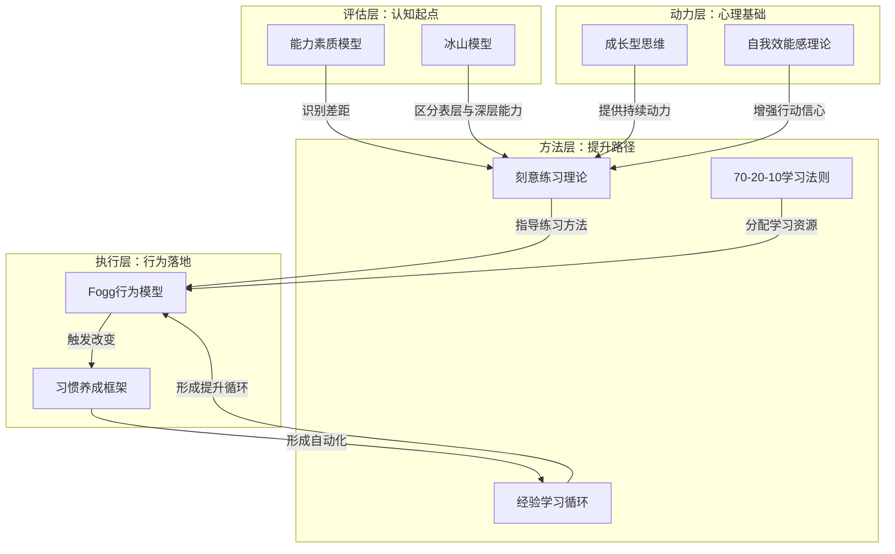
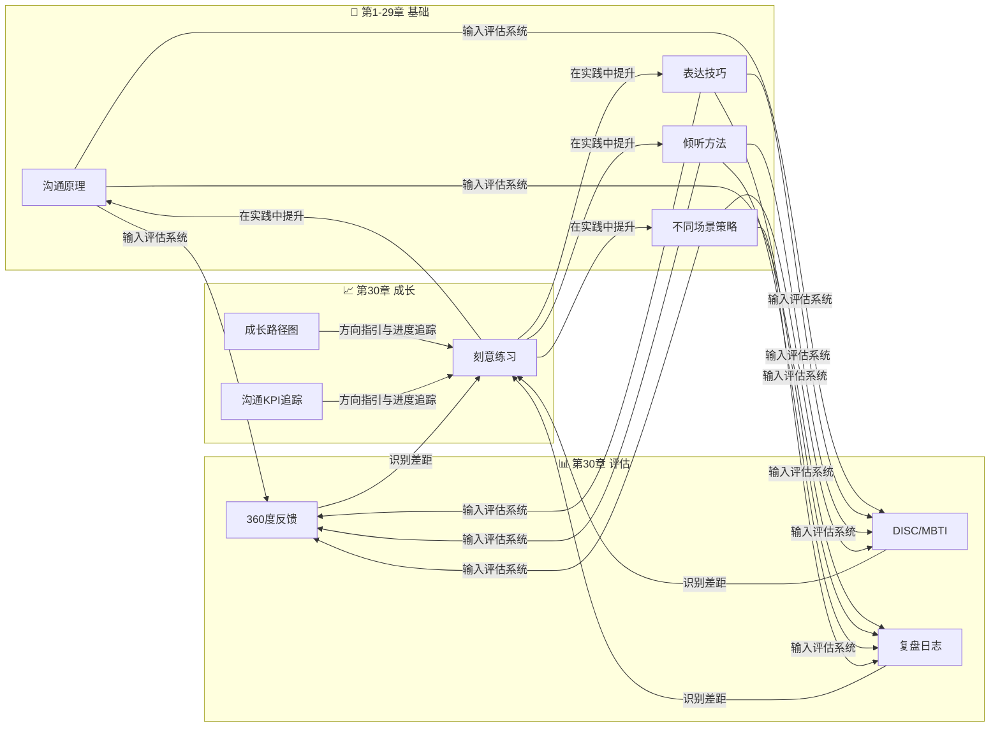

# 第六节：本章小结

## 全书终章：核心要点总回顾

本章作为全书的收尾章节，构建了一套从评估到成长的完整闭环体系。以下从理论支柱、工具矩阵、成长路径、误区规避、行动框架五个维度，系统回顾本章核心内容。

### 知识体系全景图

本章的五大理论支柱构成了沟通能力评估与成长的底层逻辑，它们之间的内在关联如下：

**各理论的定位与作用**：

| 理论 | 核心学者 | 解决什么问题 | 在本章中的角色 |
|------|----------|-------------|---------------|
| 能力素质模型 | McClelland (1973) | 沟通能力由哪些要素构成 | 提供评估的内容框架 |
| 刻意练习理论 | Anders Ericsson (1993) | 如何高效提升特定技能 | 提供练习的方法论 |
| 成长型思维 | Carol Dweck (2006) | 如何看待能力和失败 | 提供持续成长的心理引擎 |
| 自我效能感理论 | Bandura (1977) | 如何建立沟通自信 | 提供信心建设的路径 |
| 70-20-10学习法则 | Lombardo & Eichinger | 学习资源如何分配 | 提供学习投入的配比原则 |
| 经验学习循环 | Kolb (1984) | 经验如何转化为能力 | 提供知识内化的循环机制 |
| Fogg行为模型 | BJ Fogg (2009) | 如何促成行为的改变 | 提供行动落地的操作模型 |
| 习惯养成框架 | James Clear (2018) | 如何形成稳定的沟通习惯 | 提供长期坚持的策略工具 |

### 测评工具选用指南

本章介绍了三种核心测评工具，各有不同的定位和适用场景。读者应根据自身需求选择合适的工具组合：

| 工具 | 最适用场景 | 最佳时机 | 投入成本 | 产出价值 |
|------|-----------|---------|---------|---------|
| 360度反馈 | 职场沟通能力全面评估 | 每半年一次 | 高（需协调多人参与） | 多维度视角，发现盲区 |
| DISC测评 | 了解自身沟通风格偏好 | 每年一次 | 低（在线测评30分钟） | 快速定位风格类型 |
| MBTI测评 | 理解人格与沟通深层关联 | 每1-2年一次 | 中（需专业解读） | 深入理解沟通动机 |

**组合使用建议**：

- **入门组合**（成本最低）：DISC + 自评 → 快速定位风格，适合初次评估者
- **标准组合**（推荐）：360度反馈 + DISC + 沟通复盘日志 → 全面覆盖多维评估
- **深度组合**（高阶）：360度反馈 + MBTI + 盖洛普优势 + 情商测评 → 最深度的自我认知

### 五阶段成长模型详解

从新手到大师的五个阶段不仅是能力层次的划分，更对应着不同的学习策略和注意力分配方式：

| 阶段 | 状态特征 | 核心任务 | 典型时长 | 标志性突破 | 最大风险 |
|------|---------|---------|---------|-----------|---------|
| 阶段一：无意识的不胜任 | 不知道自己不知道 | 接受反馈、打开认知边界 | 数周至数月 | 第一次意识到自己有提升空间 | 防御心理，拒绝接受 |
| 阶段二：有意识的不胜任 | 知道自己不知道 | 系统学习理论、观察榜样 | 3-6个月 | 能准确诊断自己的薄弱环节 | 焦虑和挫败感导致放弃 |
| 阶段三：有意识的胜任 | 知道自己知道 | 刻意练习、建立操作规范 | 6-12个月 | 在安全环境中稳定应用 | 练习与实践脱节 |
| 阶段四：无意识的胜任 | 不知道自己知道 | 融会贯通、自然运用 | 1-3年 | 在真实场景中自动化反应 | 自满导致停止进步 |
| 阶段五：大师级水平 | 创造性运用 | 教授他人、创新方法论 | 3年以上 | 形成独特的个人风格 | 固守经验，拒绝新方法 |

**关键认知**：
- 每个阶段的跨越都不容易，需要克服特定阶段的瓶颈
- 大多数人停留在阶段三（有意识的胜任），真正进入阶段四需要至少1年的持续练习
- 阶段划分不是绝对的，不同沟通技能可能处于不同阶段

### 八大常见误区速查

本章第四节详细分析了评估与成长中的典型误区，以下速查表帮助读者快速对照自查：

| # | 误区 | 识别信号 | 矫正一句话 |
|---|------|---------|-----------|
| 1 | 只评估不行动 | 测评报告收藏夹 | 测评后48小时内制定第一个行动 |
| 2 | 追求完美而非进步 | "还不够好"反复否定 | 进步比完美更重要，完成比完美优先 |
| 3 | 盲目模仿他人 | 刻意模仿某人的说话方式 | 借鉴技巧，形成个人风格 |
| 4 | 只关注技巧忽视心态 | 技巧熟练但临场紧张 | 技巧 × 心态，缺一不可 |
| 5 | 忽视反馈价值 | 收到反馈后不行动 | 反馈是免费的成长燃料 |
| 6 | 急于求成 | 短期没进步就放弃 | 以年为周期做规划 |
| 7 | 练习脱离实践 | 安全环境表现好、实战就垮 | 把每一次真实沟通当作练习 |
| 8 | 独自成长 | 一个人默默练习 | 寻找学习伙伴和社群 |

### 沟通KPI指标体系

本章介绍了沟通KPI的理念，以下是完整的指标体系参考：

| 指标类别 | 具体指标 | 衡量方式 | 建议目标 |
|---------|---------|---------|---------|
| 过程指标 | 刻意练习次数 | 每周记录 | 每周≥3次 |
| 过程指标 | 沟通复盘次数 | 日志统计 | 每日复盘≥1次 |
| 过程指标 | 反馈请求次数 | 主动询问 | 每月≥4次 |
| 结果指标 | 沟通满意度评分 | 会后匿名评分 | 4.5/5分以上 |
| 结果指标 | 360度反馈得分变化 | 周期性对比 | 每半年提升≥0.3分 |
| 结果指标 | 关键沟通场景成功率 | 场景达成率 | 从50%提升至80%+ |

### 全书知识整合：沟通能力的完整体系

本章的核心价值在于将前面各章的知识点串联成一个可持续提升的闭环系统。以下展示全书的横向整合：

**核心洞见**：如果前29章构建了沟通的"知识库和技能库"，本章则提供了"操作系统"——一个让这些知识和技能自动运行、持续迭代的机制。没有这个操作系统，学过的技巧会随时间遗忘；有了它，每一次沟通都在为能力添砖加瓦。

### 行动框架：构建你的个人沟通成长系统

以下是本章内容的最终集成——一个可以立即启动的个人沟通成长系统搭建步骤：

**第一步：完成基线评估（第1周）**
- 完成DISC或MBTI自我测评，了解自己的沟通风格
- 撰写第一份沟通能力自我评估报告（评分+优势+待提升领域）
- 开始日常沟通复盘日志的记录
- 发送第一轮360度反馈问卷（至少覆盖5位评估人）

**第二步：设定成长目标（第2周）**
- 分析360度反馈结果，找出1-2个重点提升领域
- 设定3个月的SMART目标（具体、可衡量、可达成、相关、有时限）
- 绘制个人沟通能力成长路径图
- 寻找1位学习伙伴或导师

**第三步：启动刻意练习（第1-3个月）**
- 设计针对重点提升领域的刻意练习方案
- 每周至少3次、每次20分钟的专注练习
- 每次练习后完成反思记录
- 每周与学习伙伴进行互评

**第四步：建立反馈循环（长期）**
- 每月复盘沟通KPI完成情况
- 每季度更新成长路径图
- 每半年进行第二次360度反馈评估
- 每年参加一次进阶培训或沟通社群活动

### 反思性问题（自我诊断）

完成本章阅读后，请用以下问题检验自己的理解深度：

1. **评估层面**：我能准确说出自己在哪个沟通维度上最强、哪个最弱吗？我有多久没有系统评估过自己的沟通能力了？
2. **认知层面**：我目前处于五阶段成长模型的哪个阶段？这个判断的依据是什么？
3. **方法层面**：我的"刻意练习"方案是否做到了"明确目标+专注投入+即时反馈+持续挑战"四个要素齐全？
4. **心态层面**：当沟通失败时，我的第一反应是防御性解释，还是分析原因寻找改进方向？
5. **系统层面**：我有没有一套完整的评估-练习-反馈-复盘的闭环机制？还是只在心血来潮时才做一次练习？
6. **社交层面**：我有学习伙伴或导师吗？我是否主动寻求过他人的反馈？
7. **长期层面**：我能否清晰地画出自己未来12个月的沟通能力成长路径？

### 全书结语：沟通之路，终身修行

亲爱的读者，你走过了漫长的学习旅程——从沟通的基本原理，到各场景的具体技巧，再到最后一章的系统评估与持续成长。但请记住一个事实：**阅读只是开始，实践才是关键**，而持续实践则需要本章建立的成长系统来驱动。

本书30章内容，本质上是给出了一个完整的框架：**前29章告诉你"沟通是什么、怎么做"，第30章告诉你"如何让自己持续地变得更好"**。两者缺一不可。没有前29章的知识储备，成长系统缺乏内容；没有第30章的系统机制，学过的技能会随时间退化。

沟通能力的提升不是一条有终点的直线，而是一个螺旋上升的循环。每一个循环中，你评估自己、发现差距、刻意练习、获得反馈、继续提升——每一次循环都让你的沟通能力站上一个新台阶。这个循环没有终点，但它会让你在每一次沟通中都更加自信、从容、有效。

最后，请记住沟通的本质不是炫技，而是真诚地理解他人，清晰地表达自己，用心地建立连接。技巧可以学习，但真诚需要修炼。愿你在沟通的道路上，既掌握体系化的方法论，也保有初心的温度，最终成为那个既能高效解决问题，也能温暖人心的沟通者。

> **最后一句话**：从今天开始，用本章学到的方法，启动你的第一个人沟通成长计划。三年后的你会感谢今天开始的自己。