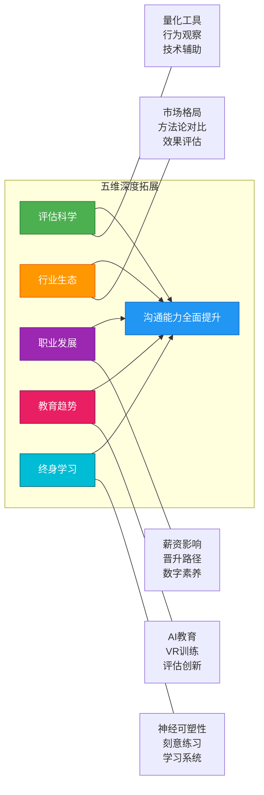
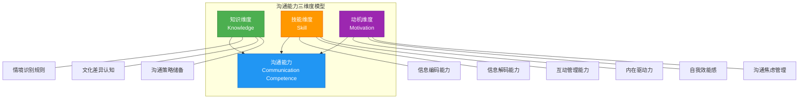
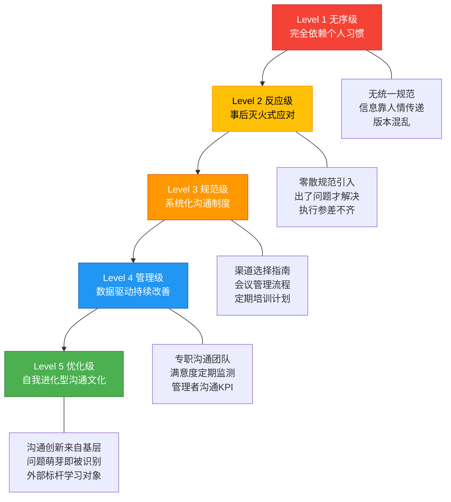
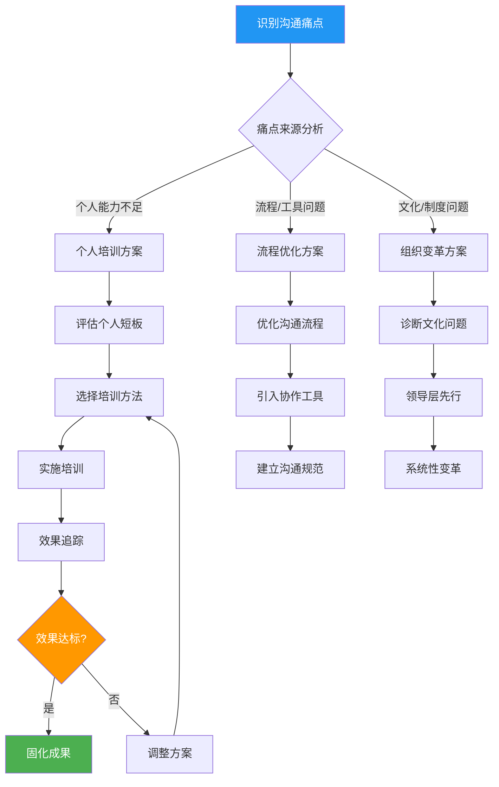
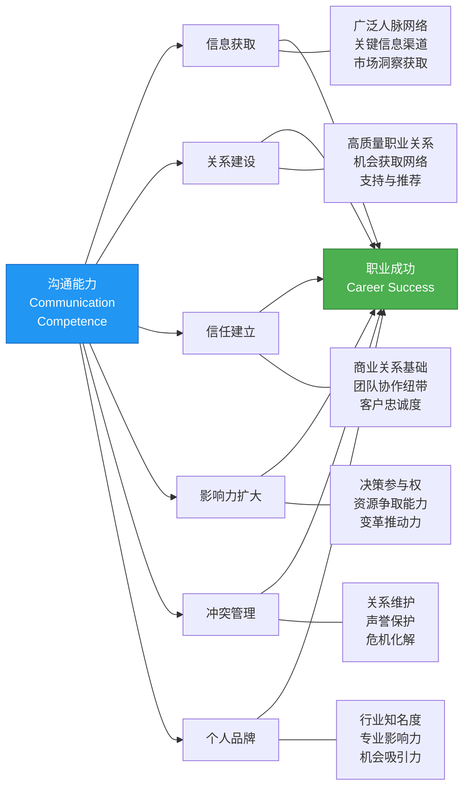
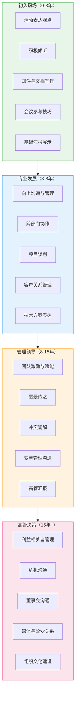
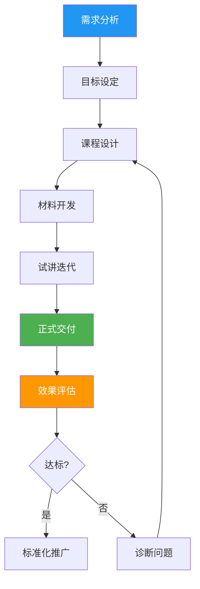
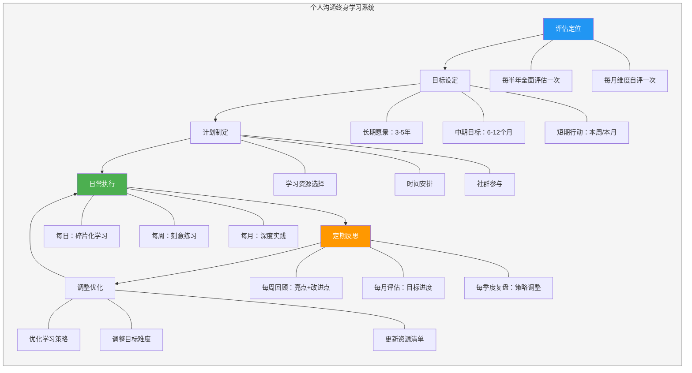

# 第三十章 沟通能力评估与成长 · 深度拓展

本节从评估科学、行业生态、职业发展、教育趋势和终身学习五个维度，对沟通能力评估与成长进行深度拓展。每个维度都包含理论基础、方法工具、实操框架和前瞻分析，帮助读者建立完整的认知体系并付诸实践。

---

## 一、沟通能力的量化评估方法

### 1.1 沟通能力评估的理论基础

沟通能力（Communication Competence）的评估需要建立在坚实的理论基础之上。评估不是"感觉这个人挺会说话"的模糊印象，而是一套可测量、可验证、可重复的科学系统。

**斯皮茨伯格-库帕克模型（Spitzberg-Cupach Model）**

这是沟通能力领域最具影响力的理论框架，由布莱恩·斯皮茨伯格（Brian Spitzberg）和威廉·库帕克（William Cupach）在1984年提出，至今仍是学术研究和实践评估的基石。该模型认为沟通能力是三个核心维度的交集——只有三者同时具备，才构成真正的沟通能力：

**知识（Knowledge）**：对沟通规则、情境规范和文化差异的理解。知识维度不是指"知道沟通很重要"这种常识，而是指深层的情境性知识——在什么场合用什么语气、面对什么对象用什么措辞、遇到什么冲突用什么策略。具体包含三个层次：程序性知识（知道如何做）、陈述性知识（知道是什么）、条件性知识（知道何时何地做）。一个具备丰富沟通知识的人，能够在进入一个新环境的前30秒内快速扫描情境线索，判断"这里什么是合适的"。

**技能（Skill）**：在实际沟通中有效运用知识的能力。技能维度是知识的行为化——你可能知道所有沟通技巧，但在高压情境下能否用出来，取决于技能的自动化程度。技能包含三个层级：基础技能（清晰发音、连贯表达、基本倾听）、中级技能（说服、谈判、冲突调解）、高级技能（危机沟通、变革领导、跨文化协调）。技能必须通过大量练习才能从"有意识的运用"转化为"自动化的反应"。

**动机（Motivation）**：愿意并渴望进行有效沟通的内在驱动力。动机是常被忽视但极其关键的维度——一个人可能知识丰富、技能娴熟，但如果缺乏沟通意愿，所有能力都无法发挥。动机受到三个因素影响：内在兴趣（是否享受沟通过程）、自我效能感（是否相信自己能做好）、沟通焦虑（是否因紧张而回避沟通）。研究表明，沟通焦虑是阻碍沟通能力发展的首要心理障碍，约15-20%的成年人存在不同程度的沟通焦虑。

**三维度的交集效应**：沟通能力不是三个维度的简单相加，而是三者的交集。一个知识丰富但技能不足的人（"纸上谈兵型"），一个技能娴熟但动机缺乏的人（"有能力但不用型"），或一个动机强烈但知识匮乏的人（"热情但鲁莽型"），都不能算作沟通能力强。只有三个维度都达到一定水平，才能形成真正的沟通能力。

**拜拉姆跨文化交际能力模型（Byram's Model of Intercultural Communicative Competence）**

迈克尔·拜拉姆（Michael Byram）在1997年提出的跨文化交际能力模型，在全球化深入的今天具有越来越高的实用价值。该模型包含五个相互关联的要素：

- **知识要素（savoirs）**：了解自己文化和对方文化的社交规范、价值体系、社会制度和历史背景。不仅仅是"知道日本人鞠躬"这种表面知识，而是理解"为什么日本社会强调等级秩序"背后的文化逻辑
- **解释与关联技能（savoir comprendre）**：能够将来自另一种文化的信息和实践与自己文化进行比较和关联，识别异同并解释原因
- **发现与互动技能（savoir apprendre/faire）**：能够在跨文化互动中获取新的文化知识，并将已有知识应用于实际沟通
- **态度要素（savoir être）**：对文化差异保持好奇心和开放性，愿意悬置对自己文化的怀疑，以对方的视角理解世界
- **批判性文化意识（savoir s'engager）**：能够以批判性视角审视自己和对方文化的价值观、信仰和行为规范

拜拉姆模型的独特贡献在于：它将跨文化沟通能力从"技能"层面提升到"意识"层面——真正的跨文化能力不是"知道该怎么做"，而是"能够从对方的文化视角思考"。

**动态意义管理模型（Dynamic Meaning Management Model）**

这一较新的理论框架强调沟通能力不是静态的特质，而是在互动过程中动态建构的。每一次沟通都是一个"意义协商"的过程——参与者共同建构沟通的意义，而非单向传递信息。该模型的核心观点包括：沟通能力是"涌现的"（emergent），即在互动中动态产生而非预先存在于个体中；沟通能力是"关系性的"（relational），即取决于互动双方的配合而非单方表现；沟通能力是"情境性的"（contextual），即在不同情境中表现不同。

这一模型的实际启示是：评估沟通能力不能只评估个体，还要评估互动过程——一个人在不同搭档面前可能表现出完全不同的沟通水平。

**多层次评估体系**：

在此基础上，我们可以构建三个层面的评估体系：

**认知层面评估**：测量个体对沟通原则、策略和技巧的知识掌握程度。常用方法包括纸笔测验、情境判断测试和案例分析题。认知评估的优势在于标准化程度高、评分客观、成本低，适合大规模施测。但缺点是无法直接反映实际行为表现——一个在纸面上能选出"最佳沟通策略"的人，在现实中未必能执行。适用场景：培训前测、大规模筛查、学术研究。

**行为层面评估**：观察和测量实际沟通行为的质量和效果。常用方法包括行为观察、角色扮演评估、真实场景录像分析和模拟情境测试。行为评估能够直接反映沟通能力的外在表现，效度最高，但成本高、标准化难度大、观察者一致性需要严格训练。适用场景：高管评估、关键岗位选拔、培训效果追踪。

**结果层面评估**：评估沟通行为带来的具体成果和影响。常用指标包括任务完成效率（沟通后行动的速度和准确度）、关系质量评分（合作满意度、信任程度）、冲突解决成功率（和平解决 vs 升级恶化）、目标达成率（沟通目标的实现程度）和信息传递准确率（接收方对信息的理解与发送方意图的一致性）。结果评估是最接近"真实价值"的维度，但需要较长的观察周期（通常3-6个月），且结果受到多种因素影响，难以完全归因于沟通能力。

**三层面之间的关系**：认知层面是基础——不懂规则就无法正确行动；行为层面是核心——知识最终要通过行为来体现；结果层面是验证——行为的有效性需要通过结果来检验。三个层面之间存在正向循环：好的结果增强动机，增强的动机促进更多学习，更多的学习提升行为质量，更好的行为带来更好的结果。反之，任何一个层面的短板都会形成负向循环——知识不足导致行为失误，行为失误导致差结果，差结果削弱动机。

### 1.2 标准化评估工具详解

标准化评估工具是沟通能力评估的"标尺"，每种工具都有其特定的测量范围、适用场景和使用限制。选择错误的工具，就像用体温计量身高——工具本身没问题，但你用错了场景。

**沟通适应性量表（Communication Adaptability Scale，CAS）**

CAS测量个体在不同沟通情境中调整沟通方式的能力——这是跨文化工作者、销售人员、管理者的核心能力。CAS包含六个维度：人际感知（准确判断他人的情绪和需求，如从对方微皱的眉头判断出他有不同意见）、社交经验（在不同社交场合积累的经验，如知道在商务晚宴和团队聚餐中的沟通差异）、社交舒适度（在社交互动中的放松程度，不是装出来的从容，而是真正的自在）、互动清晰度（表达的清晰程度，信息传递的准确度）、互动礼貌性（遵守社交礼仪的程度，如不打断、不抢话、恰当回应）和适当性（行为与情境匹配的程度，如在严肃会议中不开玩笑）。

CAS的常模数据：美国大学生样本均分约130分（满分180分），标准差约15分。中国本土化研究显示，中国受试者在"社交舒适度"维度得分普遍低于西方样本，而在"互动礼貌性"维度得分偏高，这反映了中国文化的高语境特征——更注重关系和谐，但在自我表达的自在程度上存在文化压力。

**沟通能力测评量表（Communication Competence Scale，CCS）**

CCS由维曼（Wiemann）于1977年开发，是目前使用最广泛的沟通能力自评工具之一，已在全球超过20个文化背景下进行了信效度验证。CCS包含五个维度：移情（理解他人感受和视角的能力，不只是"我理解你的感受"这种口头表达，而是真正能站在对方的立场思考问题）、行为灵活性（根据情境调整行为的能力，如同一个人能在董事会用数据说话，也能在团队午餐时讲笑话）、互动管理（控制对话节奏和方向的能力，包括适时引导话题、合理分配发言时间、有效总结讨论成果）、社交放松（在社交互动中的自信和放松程度）和适当性（行为符合社交规范的程度）。

CCS的计分采用5点李克特量表，总分范围30-150分。得分在120分以上通常表示沟通能力良好，90-120分表示中等水平，90分以下表示需要重点关注。CCS的一个重要优势是它经过了跨文化验证——在日本、韩国、中国、德国、巴西等国家的研究都显示了良好的信效度，这使它成为国际培训项目的首选评估工具。

**组织沟通满意度问卷（Communication Satisfaction Questionnaire，CSQ）**

CSQ由唐斯（Downs）和黑森（Hazen）于1977年开发，是组织沟通研究中使用最频繁的评估工具。与前两个工具不同，CSQ评估的不是个人的沟通能力，而是组织内部沟通系统的质量——它测量的是"在这个组织中沟通做得怎么样"，而非"这个人沟通做得怎么样"。CSQ包含八个维度：组织整合（员工对组织整体信息流通的满意度）、媒体质量（沟通渠道是否有效——会议是否高效、邮件是否清晰、报告是否有价值）、组织信息水平（员工是否获得了做好工作所需的信息）、与下属的沟通、与同事的沟通、与上级的沟通、个人反馈（获得工作表现反馈的程度）和沟通氛围（组织中开放、信任的沟通文化）。

CSQ在组织诊断中的价值：它可以快速定位组织沟通的瓶颈所在。例如，如果"与上级的沟通"维度得分显著低于其他维度，说明组织存在严重的向上沟通障碍——可能是管理者不够开放，也可能是缺少有效的反馈渠道。CSQ的结果可以直接指导组织沟通改善的优先级排序。

**跨文化沟通能力量表（Intercultural Communication Competence Scale）**

评估个体在跨文化情境中的沟通适应能力。该量表包含五个维度：文化敏感性（对文化差异的觉察和尊重程度，不是"我知道中国人喜欢喝茶"这种表面知识，而是能理解"为什么高语境文化中直接拒绝被视为不礼貌"背后的深层逻辑）、语言能力（外语能力和跨文化语言运用能力，包括语用能力——知道在什么场合说什么话）、非语言意识（对不同文化非语言信号的理解，如日本人点头不一定是同意，可能只是表示"我在听"）、文化知识（对目标文化的了解程度，包括历史、价值观、社会规范）和跨文化动机（进行跨文化互动的意愿，是否愿意走出舒适区接触不同文化）。

**沟通恐惧量表（Personal Report of Communication Apprehension，PRCA-24）**

PRCA-24由麦克罗斯基（McCroskey）开发，是测量沟通焦虑的金标准工具。它测量个体在四种沟通情境中的焦虑水平：小组讨论（是否害怕在小组中发言）、会议发言（是否害怕在正式会议上表达观点）、二人对话（是否害怕一对一的深入交流）和公开演讲（是否害怕面对多人讲话）。PRCA-24共24个题目，采用5点李克特量表计分，总分范围24-120分。得分解释：24-50分=低焦虑（沟通自如）、51-80分=中等焦虑（某些情境下有紧张感）、81-120分=高焦虑（严重阻碍沟通行为）。

PRCA-24的核心价值在于：沟通焦虑是阻碍沟通能力发展的首要心理障碍。一个高焦虑的人即使掌握了所有沟通技巧，在实际场景中也会因为紧张而无法发挥。识别和量化焦虑水平是制定干预方案的前提——轻度焦虑可以通过系统脱敏（逐步暴露于焦虑情境）来缓解，重度焦虑可能需要认知行为疗法（CBT）甚至药物治疗的辅助。

**倾听能力量表（Listening Competence Scale）**

由福特（Ford）、沃尔文（Wolvin）和查克（Chung）等学者开发，评估个体在不同倾听场景中的能力表现。量表涵盖四种核心倾听类型：理解性倾听（准确接收和理解信息的能力，如在技术会议中听懂复杂的技术方案）、批判性倾听（评估信息的逻辑性和可靠性的能力，如在新闻报道中辨别事实和观点）、治疗性倾听（为他人提供情感支持的能力，如朋友倾诉时的回应方式）和欣赏性倾听（享受审美和娱乐体验的能力，如欣赏音乐会、听故事）。

大多数人在四种倾听类型上发展不均衡——技术人员通常在理解性倾听上得分很高，但在治疗性倾听上得分偏低；销售人员可能在治疗性倾听上表现出色，但在批判性倾听上存在短板。识别自己的倾听能力分布，是制定针对性提升计划的基础。

**工具选择决策矩阵**：

| 评估工具 | 测量焦点 | 适用对象 | 施测难度 | 时间成本 | 信效度 | 推荐场景 |
|---------|---------|---------|---------|---------|-------|---------|
| CAS | 沟通适应性 | 通用 | 低 | 15分钟 | 高 | 跨文化培训前测 |
| CCS | 人际沟通能力 | 通用 | 低 | 20分钟 | 高 | 个人发展评估 |
| CSQ | 组织沟通满意度 | 组织成员 | 中 | 25分钟 | 高 | 组织诊断 |
| PRCA-24 | 沟通焦虑 | 通用 | 低 | 10分钟 | 高 | 焦虑筛查 |
| 跨文化量表 | 跨文化能力 | 跨文化工作者 | 中 | 30分钟 | 中高 | 外派前评估 |
| 倾听能力量表 | 倾听技能 | 通用 | 低 | 15分钟 | 中高 | 倾听专项评估 |
| 拜拉姆模型 | 跨文化交际 | 国际化人才 | 高 | 45分钟 | 中高 | 深度跨文化评估 |

**选择工具时的常见误区**：

误区一：用自评工具做选拔决策。自评工具受主观偏差影响大，不能作为招聘或晋升的唯一依据。正确做法：自评工具用于"发展"（识别提升方向），他评和行为观察用于"选拔"（做出人事决策）。

误区二：只用一种工具就下结论。任何单一工具都只能测量沟通能力的某个侧面，就像只量血压不能判断整体健康状况一样。正确做法：至少结合两种不同类型的工具（如一个自评+一个行为观察），获得更全面的能力画像。

误区三：忽视工具的文化适应性。很多经典量表是在西方文化背景下开发的，直接翻译使用可能存在文化偏差。正确做法：优先选用经过本土化验证的版本，关注中国样本的常模数据。

误区四：混淆"状态"和"特质"评估。沟通焦虑（PRCA-24测量的是特质焦虑，即跨情境的一般性倾向）和情境焦虑（在特定场景中的紧张反应）是不同的。一个人可能特质焦虑不高，但在面对董事会汇报时仍然会高度紧张。正确做法：结合特质评估和情境评估，才能全面了解个体的焦虑模式。

### 1.3 行为观察法的系统实施

行为观察法是沟通能力评估中效度最高的方法——直接观察实际行为比自评问卷更接近真实能力水平。自评问卷测量的是"你认为自己沟通能力如何"，行为观察测量的是"你实际的沟通行为如何"，两者之间往往存在显著差距。研究表明，自评与他评的相关系数通常只有0.30-0.50，这意味着自评只能解释真实能力变异的9-25%。

但行为观察法的实施需要严格的标准化流程，否则容易受到观察者偏见的影响——一个带有"光环效应"的观察者，可能因为被观察者外表讨喜就给所有沟通行为打高分。

**结构化观察的核心流程**：

**第一步，确定观察目标**。明确本次观察要评估的具体沟通维度（如说服力、倾听质量、非语言表达等），每个维度需要有明确的行为定义和评分标准。模糊的观察目标会导致观察焦点分散、结果不可靠。

错误示例："观察这个人的沟通能力"——太模糊，无法操作。
正确示例："评估这个人在5分钟汇报中的逻辑清晰度、语言流畅度和眼神互动质量"——聚焦、可操作。

**第二步，设计行为编码表**。行为编码表是结构化观察的核心工具，它将抽象的"沟通能力"转化为可观察、可计数的具体行为指标。一个完整的行为编码表应包含以下三类指标：

**语言行为指标**：
- 语句清晰度：使用简单直接的句式 vs 复杂晦涩的表达。评估方法：统计每句话的平均字数（短句清晰度通常更高）、是否有明确的主谓宾结构
- 逻辑结构：有明确的论点-论据-结论结构 vs 跳跃式论述。评估方法：画出发言的逻辑树，检查是否有逻辑跳跃或重复
- 用词精确度：使用准确的术语和概念 vs 模糊笼统的表述。评估方法：统计模糊词汇（"大概""可能""一些"）的出现频率
- 说服力：使用数据、案例、逻辑推理等说服手段。评估方法：统计数据引用次数、案例使用次数、逻辑推理链条的完整度
- 情感表达：适当表达情感和态度，增强信息感染力。评估方法：评估情感词汇的使用频率和适切性

**非语言行为指标**：
- 眼神接触：与对话者保持适当的眼神接触（约60-70%的时间）。过高会显得逼视，过低会显得回避
- 面部表情：表情与内容情感一致，丰富自然。评估方法：检查是否存在"表情-内容不一致"（如讲述好消息时面无表情）
- 手势使用：手势与语言内容协调，增强表达效果。避免无意义的重复性手势（如不停摸头发、转笔）
- 身体姿态：开放自信的姿态（挺胸、双臂自然放置），避免封闭防御性姿态（交叉双臂、身体后倾）
- 空间距离：与对话者保持适当的人际距离（社交距离约1.2-3.6米，个人距离约0.45-1.2米）

**互动行为指标**：
- 倾听质量：表现出专注倾听（点头、回应、提问）。评估方法：统计回应性行为的频率和适切性
- 提问技巧：提出开放式问题（"你怎么看？"）引导深入讨论，而非封闭式问题（"对吧？"）获得简单确认
- 反馈给予：及时、具体、建设性的反馈。评估方法：检查反馈是否包含具体行为描述和改进建议
- 轮换管理：合理的发言轮换，不打断、不垄断。评估方法：统计发言时间占比和打断次数
- 冲突处理：建设性地处理分歧，寻找共同点。评估方法：观察是否使用了"是的，同时..."而非"但是..."

**第三步，选择观察情境**。观察情境的选择直接影响评估结果的外部效度。常见的情境选择：

| 情境类型 | 控制程度 | 生态效度 | 成本 | 适用场景 |
|---------|---------|---------|------|---------|
| 标准化角色扮演 | 高 | 低 | 中 | 候选人横向对比 |
| 自然情境观察 | 低 | 高 | 低 | 真实工作表现评估 |
| 模拟任务情境 | 中 | 中 | 中高 | 培训效果评估 |
| 录像回放分析 | 高 | 中 | 低 | 详细行为编码 |

建议至少在两种不同类型的情境中进行观察，以获得更全面的能力画像。单一情境可能产生"情境特异性"——一个人在角色扮演中表现优秀，但在真实会议中可能完全不同。

**第四步，培训观察者**。观察者培训是保证观察信度的关键环节。培训内容包括：行为编码标准的理解和记忆（使用标准定义手册）、评分尺度的统一校准（对同一段录像进行独立评分，讨论差异直到统一）、常见观察偏见的识别和避免（光环效应、近因效应、宽大倾向、相似效应等）。建议观察者之间的一致性系数（inter-rater reliability）达到0.80以上才可正式使用——低于0.80说明编码标准不够清晰或观察者培训不到位。

**360度评估的详细实施指南**：

360度评估通过收集来自多个角度的反馈，获得比单一视角更全面的沟通能力画像。其核心价值在于：自我认知与他人认知的差距分析。研究表明，最有效的领导者通常是"自我认知准确者"——他们的自评与他评高度一致。而自评远高于他评的"自我膨胀者"和自评远低于他评的"自我贬低者"，在领导效能上都表现较差。

| 评估来源 | 观察优势 | 观察局限 | 权重建议 |
|---------|---------|---------|---------|
| 自我评估 | 了解内在动机和意图 | 可能存在自我美化倾向 | 15% |
| 上级评估 | 观察与外部利益相关者的沟通 | 不了解与平级/下属的沟通 | 25% |
| 同事评估 | 观察日常协作沟通 | 可能受关系亲疏影响 | 25% |
| 下属评估 | 观察领导沟通和反馈能力 | 可能存在恐惧偏见 | 20% |
| 客户评估 | 观察对外沟通和服务能力 | 样本量可能不足 | 15% |

实施360度评估的关键要点：

**匿名性**：确保评估者的匿名性，这是获得真实反馈的前提。研究表明，非匿名评估会导致30-40%的反馈失真——评估者出于面子、关系维护或恐惧报复的心理，倾向于给出偏正面的评价。技术手段：使用第三方评估平台（如问卷星的匿名设置），确保管理员也无法追踪到具体评估者。

**样本量**：每个评估来源至少需要3-5个评估者，样本量过小会导致个别极端评分影响整体结果。如果某类来源只有1-2个评估者，建议在报告中标注"样本量不足，仅供参考"。

**反馈面谈**：评估结果应通过专业的反馈面谈传递，而非仅仅发送报告。面谈的核心目标：帮助被评估者理解反馈（"同事给你的'倾听能力'打分偏低，具体表现是他们在分享时你经常看手机"）、接受反馈（管理防御反应，引导客观看待）、制定行动计划（"下次会议尝试把手机放在包里，会后记录你的观察"）。反馈面谈的黄金比例：70%倾听+30%引导，不要替被评估者做解读。

**周期性**：建议每6-12个月进行一次360度评估，追踪能力变化趋势。首次评估建立基线，后续评估追踪进步。关键指标不是绝对分数，而是变化趋势——即使分数不高，持续上升的趋势说明发展计划有效。

### 1.4 场景化沟通能力评估

标准化量表和行为编码表提供了结构化的评估框架，但真实世界的沟通发生在具体的业务场景中——一个在量表上得分很高的人，在面对真实的客户投诉、突发的技术故障汇报或高压的董事会质询时，表现可能完全不同。场景化评估弥补了标准化工具的"生态效度"短板，通过还原真实业务场景来测量沟通能力的"实战表现"。

**场景化评估的核心原理**：

场景化评估基于"情境判断测试"（Situational Judgment Test, SJT）的理论基础——SJT是工业组织心理学中预测工作绩效最有效的工具之一，其效度系数达到0.35-0.45，高于结构化面试（0.30-0.40）和认知能力测试（0.25-0.35）。在沟通能力评估中，SJT的变体形式是"沟通情境模拟"——给被评估者呈现真实的沟通挑战，观察其实际应对行为。

场景化评估与标准化量表的关键区别：

| 对比维度 | 标准化量表 | 场景化评估 |
|---------|----------|----------|
| 测量内容 | "你知道该怎么做" | "你实际会怎么做" |
| 生态效度 | 中（脱离真实场景） | 高（接近真实场景） |
| 标准化程度 | 高（统一题目和评分） | 中高（需要结构化设计） |
| 成本 | 低 | 中高 |
| 适用规模 | 大规模 | 小规模或关键岗位 |
| 评分客观性 | 高（自评或标准化评分） | 中（需要训练有素的评估者） |

**六大核心场景及评估方案**：

**场景一：高压汇报场景**。模拟向上级或客户做关键汇报的场景，典型情境包括项目延期汇报、预算超支说明、技术故障报告等高压内容。

设计要点：
- 给被评估者一份包含复杂信息的材料（如项目状态报告），限时15分钟准备，然后做5分钟口头汇报
- 设置"刁难提问"环节——由评估者扮演上级提出尖锐问题（"为什么延期了？""这个方案有什么风险？""竞争对手已经做到了，我们为什么不行？"）
- 观察指标：信息组织逻辑性（是否按重要性排序而非时间顺序）、压力下的语言控制（语速变化、填充词频率）、问题应对策略（是防御性回应还是建设性回应）、非语言表现（是否保持眼神接触、姿态是否开放）

评分标准示例：

| 行为表现 | 5分（优秀） | 3分（合格） | 1分（需改进） |
|---------|-----------|-----------|-------------|
| 信息组织 | 结论先行，逻辑清晰，重点突出 | 有基本结构但重点不够突出 | 流水账式叙述，听众需要自行提炼重点 |
| 压力应对 | 从容回应尖难问题，转换为展示机会 | 能够回应但略显紧张 | 回避问题、防御性回应或情绪化 |
| 语言控制 | 语速适中，无明显填充词，用词精准 | 偶有填充词，基本表达清晰 | 大量填充词，语句不完整，逻辑跳跃 |
| 时间管理 | 在规定时间内完成，节奏控制好 | 略有超时但不影响核心信息传递 | 严重超时或未完成核心内容 |

**场景二：冲突调解场景**。模拟调解两方冲突的场景，典型情境包括团队成员之间的任务分配冲突、跨部门的资源争夺、客户与公司的纠纷等。

设计要点：
- 由两位演员（或评估团队成员）分别扮演冲突双方，被评估者作为调解者介入
- 冲突双方各自陈述立场后，被评估者引导对话并推动解决方案的达成
- 时长控制在15-20分钟
- 观察指标：中立性（是否偏向某一方）、倾听质量（是否真正理解双方的核心诉求）、引导能力（是否能从立场之争引导到利益共创）、方案质量（提出的解决方案是否兼顾双方利益）

**场景三：跨文化沟通场景**。模拟与不同文化背景的人进行商务沟通的场景。

设计要点：
- 被评估者需要与来自不同文化背景的"客户"进行商务洽谈
- 设置文化差异导致的误解场景（如对方使用间接表达方式，被评估者需要"听懂"潜台词）
- 观察指标：文化敏感度（是否注意到文化差异信号）、适应性（是否调整了自己的沟通方式）、误解处理（在文化误解发生时的应对策略）

**场景四：危机沟通场景**。模拟组织面临危机时的沟通场景，典型情境包括产品安全事故、数据泄露、负面舆情等。

设计要点：
- 给被评估者一份危机事件简报，限时10分钟准备
- 被评估者需要完成三个任务：内部团队通报（如何安抚团队情绪）、外部媒体声明（如何控制舆论）、客户通知（如何维护客户信任）
- 观察指标：信息传递的准确性（是否传达了关键信息）、情绪管理（是否在压力下保持冷静和专业）、利益相关者管理（是否考虑到了不同受众的需求）、危机叙事能力（是否将危机转化为展示组织责任感的机会）

**场景五：技术方案评审场景**。模拟技术方案评审中需要说服不同专业背景决策者的场景。

设计要点：
- 被评估者需要向由技术专家和非技术管理者组成的"评审委员会"介绍一个技术方案
- 设置两种不同的提问风格：技术专家关注技术细节和风险，非技术管理者关注成本和业务影响
- 被评估者需要在两种风格之间切换，确保双方都能理解和认可方案
- 观察指标：受众适配能力（是否根据提问者调整表达方式）、技术翻译能力（是否能将技术概念转化为业务语言）、异议处理（是否能建设性地回应反对意见）

**场景六：远程协作场景**。模拟跨时区远程团队的协作沟通场景。

设计要点：
- 被评估者需要协调分布在三个不同时区的团队成员完成一个紧急任务
- 仅能使用异步沟通工具（邮件、即时消息、协作文档），不能使用同步会议
- 设置信息不完整和时间紧迫的条件
- 观察指标：信息组织能力（消息是否一次说清）、协调效率（是否能快速对齐各方）、时间管理（是否合理分配任务和截止时间）、文档化能力（是否将决策和进展清晰记录）

**场景化评估的实施注意事项**：

第一，标准化与灵活性的平衡。场景化评估的标准化程度低于量表，但可以通过"结构化评分表+评估者培训"来提高信度。建议为每个场景制定详细的评分量表（rubric），明确定义每个分数等级对应的具体行为表现。评估者之间的一致性系数应达到0.75以上。

第二，场景选择的代表性。选择的场景应与被评估者的实际工作场景高度相关——对销售评估客户沟通场景，对技术管理者评估方案汇报场景，对HR评估冲突调解场景。不相关的场景会降低评估的效度。

第三，伦理与心理安全。场景化评估可能引发被评估者的焦虑和压力反应。实施前应充分告知评估目的（用于发展而非选拔）、场景内容（不含人身攻击或侮辱性内容）和结果使用方式。评估后应提供及时的反馈和心理支持。

### 1.5 技术辅助评估的前沿应用

技术正在深刻改变沟通能力评估的方式，从传统的主观判断走向数据驱动的客观分析。一个经验丰富的培训师评估一场演讲，可能关注的是"印象"和"感觉"；而技术工具评估同一场演讲，给出的是"语速147词/分钟""填充词出现12次""眼神接触占比58%"——这种客观性是人工评估难以企及的。

**语音分析技术**

利用AI技术分析语音的声学特征，从声波中提取沟通质量的客观指标。核心分析维度：

| 声学指标 | 含义 | 优秀标准（中文） | 需要改进 |
|---------|------|---------------|---------|
| 语速 | 每分钟词数 | 200-250字/分钟 | <150或>300 |
| 语调变化 | 基频标准差 | 丰富多变 | 单调平直 |
| 音量变化 | 动态范围 | 6-10dB变化 | 过于均匀或忽大忽小 |
| 停顿分布 | 停顿次数/位置/时长 | 策略性停顿（关键信息前后） | 无意义停顿过多 |
| 填充词频率 | "嗯""啊""就是说"占比 | <5% | >15% |

语音分析的核心发现：优秀的演讲者不一定是"说话快"的人，而是"节奏感好"的人。他们在重要内容前会停顿0.5-1秒（让听众准备接收重要信息），在次要内容间过渡流畅（保持信息流），在强调点上会调整语速和音量（引导注意力）。相反，说话很快但没有节奏变化的人，听众反而容易疲劳和走神。

工具推荐：IBM Watson Tone Analyzer（英文为主）、Microsoft Azure Speech Services（多语言支持）、国内的科大讯飞语音分析平台（中文优化）。

**面部表情分析技术**

基于保罗·艾克曼（Paul Ekman）的面部动作编码系统（FACS），利用计算机视觉技术实时识别和分析面部表情。FACS将面部肌肉运动分解为44个基本动作单元（AU），通过AU的组合来识别不同表情。

可识别的基本表情包括：快乐（AU6+AU12：嘴角上扬+眼角皱纹）、悲伤（AU1+AU4+AU15：眉毛内侧上扬+眉头皱起+嘴角下拉）、愤怒（AU4+AU5+AU7+AU23+AU24：眉头紧皱+上眼睑提升+下眼睑紧绷+嘴唇紧闭）、恐惧（AU1+AU2+AU4+AU5+AU20+AU26：眉毛提升+眉头皱起+上眼睑提升+嘴唇拉伸+下巴下拉）、惊讶（AU1+AU2+AU5+AU26：眉毛提升+上眼睑提升+下巴下拉）、厌恶（AU9+AU15：鼻子皱起+嘴角下拉）和轻蔑（AU12R+AU14R：单侧嘴角上扬）。

在沟通评估中，面部表情分析可以量化三个关键指标：情感表达的丰富性（是否只有"微笑+面无表情"两种状态）、表情与内容的一致性（讲述悲伤故事时是否表现出相应的情感）和微表情的控制能力（是否在不适当的时候流露出真实情绪，如在听到反对意见时瞬间闪过愤怒表情）。

**语言文本分析技术**

利用自然语言处理（NLP）技术分析书面和口头沟通的语言特征。核心分析维度：用词丰富度（Type-Token Ratio，即独立词汇数/总词汇数，反映词汇多样性）、信息密度（每句包含的有效信息量，高密度表达用更少的词传递更多信息）、情感倾向（正向/负向/中性情感比例，优秀的沟通者通常保持60-70%正向情感）、逻辑连贯性（连接词如"因此""但是""此外"的使用频率和类型，反映逻辑组织能力）和可读性指数（Flesch-Kincaid等可读性公式的中文变体，评估文本的易读程度）。

**眼动追踪技术**

在演讲和展示场景中，利用眼动追踪设备（如Tobii Eye Tracker）分析演讲者与听众的眼神互动模式。可分析的指标包括：注视点分布（是否均匀覆盖全场听众，还是只看某几个区域）、眼神停留时间（在个别听众身上的停留是否过长，超过3秒可能造成不适）、回避行为（是否存在某些区域系统性回避，如不看后排或不看领导席）和瞳孔变化（反映认知负荷和情绪唤醒水平，瞳孔放大通常表示紧张或兴奋）。

眼动追踪揭示了一个常见问题：很多演讲者以为自己在看全场，但追踪数据显示他们的视线集中在"安全区域"——通常是中间偏左的几个位置。通过眼动追踪的反馈，演讲者可以有意识地训练自己的视线扫描模式。

**AI驱动的综合评估平台**

新兴的AI评估平台将上述多种技术整合，提供多维度的实时评估。例如，Orai和Speeko等应用可以实时分析用户的演讲练习，提供关于语速、填充词、语调变化等方面的即时反馈。企业级平台如Quantum Capture和HireVue则将多模态分析应用于面试和评估中心场景。

**技术评估的伦理边界**：技术辅助评估虽然客观，但也引发了重要的伦理问题。面部表情分析的准确度受到文化差异的影响（东亚人的表情普遍比西方人更含蓄，可能导致误判）；AI评估可能嵌入训练数据的偏见（如对某种口音或方言的歧视）；持续的音视频监控可能侵犯隐私权。使用技术评估工具时，必须确保：获得被评估者的知情同意、明确数据使用范围和存储期限、提供人工复核机制（技术评估结果不能作为唯一决策依据）、定期审查算法偏见。

**生理信号测量技术**

除了语音、表情和文本分析，新兴的生理信号测量技术正在为沟通能力评估提供前所未有的客观维度。这些技术直接测量沟通活动中的生理反应，绕过了主观报告的偏差问题。

| 生理指标 | 测量设备 | 在沟通评估中的含义 | 应用场景 | 成本 |
|---------|---------|------------------|---------|------|
| 皮肤电导（GSR） | 手环/指夹传感器 | 反映情绪唤醒水平，高GSR通常表示紧张或兴奋 | 演讲焦虑评估、谈判压力测量 | 低（200-500元） |
| 心率变异性（HRV） | 胸带/智能手表 | 反映自主神经系统调节能力，高HRV与情绪调节能力正相关 | 高压沟通中的情绪管理评估 | 中（500-2000元） |
| 皮质醇水平 | 唾液检测 | 反映压力激素水平，沟通前后的皮质醇变化反映压力适应 | 沟通焦虑的生物学标记 | 中高（需实验室） |
| 脑电图（EEG） | 便携式EEG设备 | 反映注意力分配和认知负荷，前额叶活动与执行功能相关 | 倾听时的注意力分配、复杂信息处理评估 | 高（5000-50000元） |
| 眼动数据 | 眼动仪 | 注视模式反映信息处理策略和社交注意力分配 | 演讲者视线管理、社交注意力模式 | 中高（3000-30000元） |

**生理信号在沟通评估中的三个前沿应用**：

**压力适应曲线**：通过连续监测演讲者的心率变异性（HRV），可以绘制出整场演讲的压力变化曲线。优秀的演讲者通常在开场2-3分钟后HRV恢复到基线水平，说明他们能够快速适应演讲压力；而高焦虑者的HRV可能全程低于基线，说明持续处于应激状态。这一指标比自我报告的焦虑水平更客观，也更能反映真实的压力管理能力。

**倾听质量的生理标记**：利用EEG测量倾听者在接收信息时的脑电活动模式，可以区分"真倾听"和"假倾听"。真正的倾听伴随着较高的Alpha波抑制（表示深度认知加工）和额叶-颞叶的同步活动（表示信息整合），而"假装在听"时这些模式显著减弱。虽然这一技术目前主要用于研究，但随着便携式EEG设备（如Muse、Emotiv）的价格下降和精度提升，未来可能成为倾听能力评估的常规工具。

**共情反应的生理指标**：皮肤电导和心率的共变模式可以反映一个人在倾听他人叙述时的共情反应程度。高共情者在听到他人的情感经历时，会出现与叙述者类似的生理反应模式（生理同步），而低共情者的生理反应则与叙述者"脱节"。这一指标在心理咨询师、社会工作者和医护人员的沟通能力评估中具有重要应用价值。

**数据合规与隐私保护的法律框架**：

在中国，使用技术工具进行沟通能力评估必须遵守《个人信息保护法》（PIPL，2021年11月1日施行）和《数据安全法》（2021年9月1日施行）的相关规定。沟通评估涉及的语音、视频和文本数据属于"敏感个人信息"，处理时需要遵循以下法律要求：

| 法律要求 | 具体内容 | 在沟通评估中的应用 |
|---------|---------|-----------------|
| 知知同意 | 处理个人信息前须告知目的、方式和范围，取得个人同意 | 评估前发放知情同意书，说明数据收集范围、使用目的和存储期限 |
| 最小必要 | 只收集与评估目的直接相关的数据 | 不录制与评估无关的闲聊内容，不收集家庭住址等无关信息 |
| 存储限制 | 数据保留期限不超过实现目的所需的时间 | 评估完成后6个月内删除原始音视频数据，仅保留评分结果 |
| 安全保障 | 采取技术措施防止数据泄露 | 加密存储评估数据，限制访问权限，定期安全审计 |
| 跨境传输 | 向境外提供个人信息需取得单独同意或通过安全评估 | 跨国企业的评估数据如果需要传回总部，需进行安全评估 |

**最佳实践建议**：在使用任何技术评估工具前，制定《沟通能力评估数据管理规范》，明确数据收集、存储、使用和销毁的全流程管理规则。评估数据应与人事档案分开存储，评估结果仅用于发展目的，不得作为唯一的人事决策依据。对于AI评估工具，应定期审查其算法是否存在文化偏见、性别偏见或口音偏见，并保留人工复核的通道。

**技术评估工具对比**：

| 技术类型 | 代表工具 | 评估维度 | 准确度 | 成本 | 实时性 | 隐私风险 |
|---------|---------|---------|-------|------|-------|---------|
| 语音分析 | Watson/讯飞 | 语速/语调/停顿 | 高 | 中 | 是 | 低 |
| 表情分析 | Affectiva/Face++ | 情感表达/微表情 | 中高 | 中高 | 是 | 高 |
| 文本分析 | NLP平台 | 用词/逻辑/情感 | 高 | 低 | 是 | 低 |
| 眼动追踪 | Tobii | 眼神互动/注意力 | 高 | 高 | 是 | 中 |
| 综合平台 | Orai/Speeko | 多维度 | 中高 | 中 | 是 | 中 |

### 1.6 自我评估工具的深度应用

自我评估是沟通能力发展的起点——你必须先知道自己的现状，才能规划成长路径。但自我评估的最大陷阱是"不知道自己不知道"——你可能意识不到自己在某个维度上的问题，因为你从未被反馈过。约瑟夫·卢夫特和哈里·英格拉姆的"乔哈里窗"模型揭示了这个现象：我们的自我认知存在四个区域——开放区（自己和他人都知道的）、盲区（他人知道但自己不知道的）、隐藏区（自己知道但他人不知道的）和未知区（自己和他人都不知道的）。自我评估的目标是扩大开放区、缩小盲区。

**沟通日志的系统化方法**：

沟通日志不是简单的"今天和谁聊了什么"的流水账，而是一套结构化的反思系统。它借鉴了医学领域的"临床日志"和体育领域的"训练日志"方法论——通过结构化的记录和定期回顾，将模糊的经验转化为可分析的数据。

一个高质量的沟通日志应包含以下字段：

| 字段 | 说明 | 示例 |
|------|------|------|
| 日期时间 | 沟通发生的时间 | 2024-03-15 14:30 |
| 情境类型 | 工作会议/客户拜访/团队讨论/一对一面谈 | 项目进度汇报会 |
| 沟通对象 | 职位、关系、人数 | 部门总监+5位同事 |
| 沟通目标 | 这次沟通想达成什么 | 争取项目延期2周 |
| 使用策略 | 采用了哪些沟通策略 | 数据支撑+案例类比+情感共鸣 |
| 效果评估 | 目标达成度（1-10分） | 8分——同意延期1周 |
| 情绪状态 | 沟通前/中/后的感受 | 紧张→自信→满意 |
| 非语言表现 | 自己注意到的非语言行为 | 保持了较好的眼神接触 |
| 对方反应 | 对方的关键反应和反馈 | 总监多次点头，提出一个反对意见 |
| 改进点 | 如果重来一次会怎么做 | 应该准备一个备选方案 |
| 学到了什么 | 这次沟通的核心收获 | 用数据说话比用感受说服更有效 |

**日志分析的进阶方法**：建议每周花15分钟回顾本周的沟通日志，寻找以下模式：哪个情境类型的效果评分最高/最低？哪些沟通策略最有效？情绪状态与效果评分之间有什么关联？最常见的改进点是什么？这些模式分析能帮助你识别"沟通舒适区"和"沟通盲区"，为下一步的学习提供方向。

建议每天花5-10分钟记录1-2个重要沟通事件，坚持3个月以上就能看到明显的模式识别和能力提升。6个月以上的沟通日志积累，就是一份宝贵的个人沟通能力发展档案。

**录音/录像回顾的实操方法**：

录音/录像是最诚实的"教练"——它不会因为面子问题而美化你的表现。大多数人第一次看到自己的演讲录像时都会感到震惊："我真的这样说话的吗？"这种"震惊"正是自我认知突破的开始。

有效回顾录音/录像的五步法：

**第一步，录制**。在获得对方同意的前提下（这是伦理底线），录制会议发言、演讲练习、重要对话等。建议使用手机或笔记本电脑的内置录制功能即可，无需专业设备。录制时的注意事项：将设备放在不会分散注意力的位置（不要让摄像头正对自己的脸）、确保音频清晰（距离嘴部1-2米为佳）、如果是视频录制注意光线充足。

**第二步，首轮观看**。不要带批判眼光，像第一次看一样自然观看，记录整体感受——哪里流畅、哪里卡壳、哪里效果好、哪里效果差。首轮观看的目的是建立"整体印象"，不要在这一轮就试图分析细节。

**第三步，聚焦分析**。选择1-2个重点维度进行深入分析。以下是不同维度的具体分析方法：

- **口头禅分析**：专门统计"嗯""啊""那个""就是说""对吧"等填充词的出现频率和位置。用手机计数器逐一记录，或使用讯飞听见等语音转文字工具辅助。分析填充词出现的规律：是否在思考下一句话时出现？是否在紧张时出现？是否在转换话题时出现？
- **逻辑结构分析**：画出你发言的逻辑树——主论点是什么？支持论据有哪些？论据之间是什么关系（并列/递进/因果）？是否有跳跃或重复？是否有未被支撑的论断？
- **非语言分析**：关注手势是否与语言内容协调、身体是否有不安的小动作（晃腿、摸头发、转笔）、表情是否与内容情感一致、视线是否覆盖全场。
- **互动分析**：如果是一对一或小组沟通，分析你与对方的互动模式——你发言占比多少？你提问了几次？你对对方的回应是否及时且有深度？

**第四步，量化对比**。将分析结果量化记录，如"本次演讲填充词出现15次（上次23次）""眼神接触占比约50%（目标60%）""发言时间占比75%（应该控制在50%左右）"。量化数据能够清晰地呈现进步轨迹，避免"感觉好像有进步"的模糊判断。

**第五步，制定改进计划**。基于分析结果，明确下一次沟通的1-2个改进目标。不要贪多，每次聚焦改进一个点，持续积累。改进目标要具体且可操作——不是"说得更好"，而是"在每个论点转换处停顿1秒"。

**自评问卷的科学使用**：

使用标准化自评问卷时，需要警惕以下常见偏差：

- **社会赞许偏差**：倾向于选择"看起来更好"的答案，而非真实情况。例如，问卷问"你是否经常打断别人"，即使你确实经常打断，也可能选择"偶尔"而非"经常"。
- **近期偏差**：过度受最近几次沟通经历的影响，而非整体水平。如果你昨天刚做了一次成功的汇报，可能会高估自己的沟通能力；如果昨天刚经历了失败的谈判，可能会低估自己。
- **文化偏差**：某些文化背景下的人倾向于选择中间值（避免极端表态）或极端值（表达强烈态度），这不代表真实的沟通能力差异。
- **模糊性偏差**：对问卷题目理解不同导致回答偏离真实情况。例如，"经常"是每周几次？"有时"是每月几次？每个人的理解不同。

克服偏差的方法：邀请信任的朋友或同事进行"交叉验证"——你自评后，请他们用同样的问卷对你进行他评，比较两份结果的差异。差异最大的维度，往往是你自我认知最不准确的领域，也是最需要外部反馈来校准的领域。

**自评与他评方法的系统对比**：

| 对比维度 | 自评方法 | 他评方法 | 最佳实践 |
|---------|---------|---------|---------|
| 测量内容 | "我认为自己如何" | "别人认为我如何" | 两者结合，关注差距 |
| 数据来源 | 本人主观判断 | 上级/同事/下属/客户 | 多来源交叉验证 |
| 优势 | 成本低、可频繁使用、了解内在动机 | 更接近真实表现、减少自我美化偏差 | 自评用于日常监测，他评用于关键节点 |
| 局限 | 受社会赞许偏差、近期偏差影响大 | 受评估者关系亲疏、匿名性影响 | 意识到各自的偏差来源 |
| 适用场景 | 日常学习反思、快速筛查 | 年度评估、晋升决策、培训效果追踪 | 根据目的选择方法 |
| 频率建议 | 每周/每月 | 每季度/每半年 | 自评高频、他评低频 |
| 成本 | 极低（时间成本5-15分钟） | 中等（组织协调+评估者时间） | 预算有限时优先自评 |
| 信效度 | 中等（受主观偏差影响） | 中高（多来源可提高信度） | 两者差距>1.5分时深入分析 |

**关键原则**：自评和他评不是互相替代的关系，而是互补的关系。自评揭示"你想成为什么样的沟通者"（意图层面），他评揭示"别人眼中你是什么样的沟通者"（效果层面）。两者的差距本身就是最有价值的评估信息——差距越大的维度，越需要外部反馈来校准自我认知。

### 1.7 评估结果的深度应用

评估不是目的，评估结果的应用才是目的。一份精心收集的评估报告如果被束之高阁，就只是浪费时间的数据收集练习。以下是评估结果的四大应用场景：

**个人发展计划（IDP）的制定**：

基于评估结果制定个人发展计划时，使用SMART原则确保目标的可执行性。以下是一个沟通能力发展计划的模板示例：

| 评估维度 | 当前水平 | 目标水平 | 差距分析 | 发展行动 | 时间节点 | 验证方式 |
|---------|---------|---------|---------|---------|---------|---------|
| 公众演讲 | 3/10 | 6/10 | 缺乏结构化表达训练 | 加入Toastmasters，每周练习 | 6个月 | 完成10次正式演讲 |
| 倾听能力 | 5/10 | 7/10 | 容易打断他人 | 练习3秒停顿法则 | 3个月 | 同事反馈评分提升 |
| 书面表达 | 4/10 | 7/10 | 邮件冗长、逻辑不清 | 学习金字塔写作法 | 4个月 | 邮件回复效率提升50% |
| 冲突处理 | 2/10 | 5/10 | 回避冲突或情绪化 | 学习非暴力沟通 | 3个月 | 成功处理2次冲突 |

**IDP制定的常见错误**：目标太多（同时提升5个维度，精力分散导致全部失败）、目标太虚（"提升沟通能力"不是可执行的目标）、没有验证方式（不知道什么时候算"达标了"）、时间线太紧（期望一个月内从3分提升到8分，不现实）。

**组织培训需求分析**：

在组织层面，沟通能力评估结果可以用于识别培训需求。具体方法是将评估结果按部门、职级、岗位类型进行交叉分析，找出共性短板和个性需求。

分析框架示例：

| 部门 | 平均分 | 最弱维度 | 最强维度 | 培训优先级 |
|------|-------|---------|---------|----------|
| 技术部 | 65 | 向上沟通(52) | 书面表达(78) | 高——技术方案汇报培训 |
| 销售部 | 78 | 倾听能力(62) | 说服力(85) | 中——深度倾听培训 |
| 市场部 | 82 | 跨部门协作(65) | 公众演讲(88) | 低——选择性提升 |
| 人力资源 | 75 | 冲突处理(60) | 同理心(82) | 中——冲突管理培训 |

**人才选拔与晋升参考**：

在招聘和晋升决策中，沟通能力评估可以作为重要的参考依据。但需要注意以下原则：评估工具的选择应与岗位要求匹配——客户经理岗位需要重点评估说服力和关系建设能力，技术管理岗位需要重点评估技术表达和跨部门协作能力。单一评估工具的结果不应作为决定性依据，建议综合使用自评、他评和行为观察三种方法。评估结果必须与其他信息（技术能力、绩效表现、领导潜力）结合考虑，不能因为沟通能力得分高就忽视其他方面的不足。

**效果追踪与ROI计算**：

通过前后测对比，可以评估培训和发展活动的效果。效果追踪的关键是建立基线数据——在培训开始前进行一次全面评估，培训结束后3个月、6个月、12个月分别进行追踪评估。

ROI的计算公式：

培训ROI =（培训后绩效提升带来的价值 - 培训总成本）/ 培训总成本 × 100%

绩效提升的价值计算示例：某销售团队培训后平均成交率提升15%，团队月均销售额100万元，提升15%即15万元/月，年化180万元。培训总成本（讲师费+场地+误工）为30万元。ROI =（180-30）/ 30 × 100% = 500%。

但需要注意：ROI计算的难点在于"归因"——绩效提升是培训的效果，还是市场环境变化、产品升级、竞争对手退出等因素的综合结果？建议使用对照组设计（一组接受培训，一组不接受）来隔离培训的独立贡献，或至少使用多因素回归分析来控制混淆变量。

### 1.8 评估结果的误区与纠偏

即使使用了正确的评估工具和方法，评估结果仍然可能产生误导。以下是评估实践中最常见的五种误区及其纠偏方法：

**误区一：分数崇拜——把分数当终点**

很多人拿到评估报告后，只关注总分和排名，而忽略了分数背后的行为信息。一个CCS得分120分的人可能在"移情"维度上满分但在"互动管理"维度上刚刚及格——总分掩盖了关键的短板。

纠偏方法：永远先看分维度得分，再看总分。总分是"体检结论"，分维度得分才是"检查报告"。关注得分差异超过1.5个标准差的维度——这些差异点才是最有价值的发展方向。

**误区二：一次性评估——把快照当全貌**

一次评估只能反映特定时间点的状态，而沟通能力受情境、情绪、身体状态等多种因素影响。一个在周一精力充沛时做的评估，和周五下午疲惫时做的评估，结果可能差异显著。

纠偏方法：建立"评估时间线"——至少在三个不同时间点进行评估（如不同周的周一上午、周三下午、周五上午），取平均值作为基线。对于关键评估（如晋升前的能力评估），建议在不同情境下进行两次以上评估。

**误区三：工具迷信——把工具当权威**

过度依赖某一种评估工具，认为工具给出的结果就是"真理"。实际上，任何单一工具都只能测量沟通能力的某个侧面——CAS测量适应性，PRCA-24测量焦虑，CSQ测量组织满意度——没有一个工具能给出完整的画面。

纠偏方法：使用"三角验证"策略——至少结合三种不同类型的评估（如一个自评量表+一个他评工具+一次行为观察），当三者结论一致时，结果可信度最高；当三者结论矛盾时，矛盾本身就是有价值的信息——说明存在自我认知偏差或情境因素影响。

**误区四：归因错误——把相关当因果**

"沟通能力强的人收入高"不等于"提升沟通能力就能提高收入"。评估结果中存在大量的混淆变量——行业、公司、岗位、经济环境、个人机遇等都影响最终结果。将所有正面结果归因于沟通能力，或把所有负面结果归因于沟通不足，都是过度归因。

纠偏方法：在解读评估结果时，始终问自己"还有什么其他因素可能影响了这个结果？"。在制定发展计划时，区分"沟通能力可控因素"和"外部环境不可控因素"，聚焦于前者。

**误区五：忽视情境——把平均当常态**

一个人在不同情境中的沟通表现可能差异巨大。在技术讨论中侃侃而谈的人，在客户晚宴上可能沉默寡言；在一对一谈话中温和耐心的人，在全员大会上可能紧张急躁。用"平均表现"来概括一个人的沟通能力，会抹杀这些重要的情境差异。

纠偏方法：建立"情境能力矩阵"——列出自己常面对的沟通情境（工作汇报、客户沟通、团队讨论、冲突调解、社交闲聊等），分别评估自己在每个情境中的表现。这个矩阵能帮你发现"沟通舒适区"（高分情境）和"沟通恐慌区"（低分情境），从而制定更精准的提升计划。

| 评估误区 | 核心问题 | 纠偏策略 | 检验方法 |
|---------|---------|---------|---------|
| 分数崇拜 | 只看总分忽略维度 | 先看分维度再看总分 | 检查是否有维度差异>1.5SD |
| 一次性评估 | 把快照当全貌 | 多时间点评估取平均 | 至少3次不同时间评估 |
| 工具迷信 | 把工具当真理 | 三角验证策略 | 自评+他评+行为观察 |
| 归因错误 | 把相关当因果 | 区分可控和不可控因素 | 问"还有什么因素" |
| 忽视情境 | 把平均当常态 | 情境能力矩阵 | 分情境评估各维度 |

### 1.9 行业差异化沟通评估

不同行业对沟通能力的需求存在显著差异——用同一套评估标准衡量所有行业，就像用同一把尺子量身高和体重，工具没问题但维度错了。理解行业差异，才能制定精准的评估方案和提升路径。

**行业沟通需求差异矩阵**：

| 行业 | 核心沟通能力 | 评估重点 | 典型场景 | 评估权重 |
|------|------------|---------|---------|---------|
| 互联网/技术 | 技术表达、跨部门协作、远程沟通 | 代码评审沟通、技术方案汇报、异步协作效率 | PR评审、技术分享、Scrum会议 | 技术表达40%、协作30%、演讲30% |
| 金融/投资 | 数据说服、风险沟通、合规表达 | 投资建议陈述、风险披露、客户面谈 | 投委会汇报、客户路演、合规审查 | 数据说服35%、合规表达35%、关系维护30% |
| 医疗/健康 | 共情告知、风险解释、团队协调 | 病情告知、多学科会诊、患者教育 | 医患沟通、MDT讨论、手术知情同意 | 共情40%、准确性35%、协调25% |
| 教育/培训 | 知识传递、启发引导、反馈给予 | 课堂教学、学生辅导、家长沟通 | 授课、教研讨论、家长会 | 传递35%、引导35%、反馈30% |
| 销售/商务 | 需求挖掘、异议处理、关系建设 | 客户拜访、商务谈判、方案展示 | 首次拜访、价格谈判、方案汇报 | 需求挖掘35%、说服35%、关系30% |
| 制造/工程 | 精确指令、安全沟通、跨层级协调 | 生产调度、安全交底、质量会议 | 班前会、质量分析会、安全培训 | 精确性40%、安全沟通30%、协调30% |
| 法律/合规 | 逻辑论证、风险表述、谈判协商 | 法庭陈述、合同谈判、法律咨询 | 庭审、合同审查、法律意见书 | 逻辑40%、精确性35%、谈判25% |

**互联网/技术行业的深度评估方案**：

技术行业沟通的特殊性在于：沟通对象通常具有高度专业背景，"说人话"和"说技术话"的切换能力至关重要。一个优秀的技术沟通者需要同时做到两件事——对技术人员精确严谨，对非技术人员通俗易懂。

评估要点：
- **技术方案汇报**：能否在10分钟内将复杂技术方案讲清楚？评估标准包括：问题定义是否清晰（"我们要解决什么问题"）、方案逻辑是否完整（"为什么选这个方案"）、技术风险是否坦诚（"这个方案有什么风险"）、非技术人员是否能听懂（"CTO能懂，CEO也能懂"）
- **代码评审沟通**：能否在代码评审中给出建设性而非攻击性的反馈？评估标准包括：反馈是否具体（指出哪行代码有什么问题，而非"代码质量差"）、是否提供建议而非仅批评（"建议用策略模式替代if-else链"）、语气是否尊重（"这个实现可以工作，但有个优化空间"而非"这写的是什么"）
- **跨部门协作**：能否在技术团队和产品/设计/运营之间建立有效沟通？评估标准包括：是否能将技术限制翻译为业务影响（"这个需求如果现在做，会延迟两周上线，影响Q3收入"）、是否能理解非技术部门的真实需求（产品说"加个按钮"，背后的真实需求是什么）

**医疗行业的深度评估方案**：

医疗行业沟通的特殊性在于：信息的准确性直接关系到生命安全，而沟通对象（患者）通常处于焦虑和信息不对称的状态。医疗沟通评估需要同时关注"专业准确性"和"人文关怀"两个维度。

评估要点：
- **病情告知能力**：能否在传递坏消息时兼顾准确性和人文关怀？评估标准包括：是否遵循SPIKES六步法（Setting-环境准备、Perception-了解患者认知、Invitation-获得告知许可、Knowledge-传递信息、Emotions-回应情绪、Summary-总结计划）、是否使用患者能理解的语言（避免过度专业术语）、是否给予情感支持（不是"你的检查结果不好"然后沉默，而是"我知道这个消息很难接受，我们一起来看看接下来的方案"）
- **知情同意沟通**：能否确保患者真正理解治疗方案的风险和收益？评估标准包括：是否用通俗语言解释（而非照读知情同意书）、是否确认理解（"你能用自己的话告诉我，这个手术的主要风险是什么吗"）、是否尊重患者的自主决策权
- **多学科会诊沟通**：能否在不同科室之间高效协调？评估标准包括：病历陈述是否结构化（SOAP格式：Subjective-主观、Objective-客观、Assessment-评估、Plan-计划）、是否尊重各科室的专业判断、是否能协调不同意见形成统一方案

**金融行业的深度评估方案**：

金融行业沟通的特殊性在于：需要在合规框架内进行有效的信息传递和风险沟通。过于乐观的表述可能构成误导，过于保守的表述可能错失业务机会——分寸感是金融沟通的核心能力。

评估要点：
- **风险沟通能力**：能否清晰、准确地传达金融产品的风险？评估标准包括：是否使用标准化的风险等级语言（如R1-R5风险等级）、是否避免使用"保证收益""稳赚不赔"等违规用语、是否确保客户真正理解风险（"您能告诉我，如果市场下跌20%，您的投资可能亏损多少"）
- **数据说服能力**：能否用数据支撑投资建议或业务决策？评估标准包括：数据来源是否权威可靠、数据分析逻辑是否完整、是否呈现多种情景分析（乐观/中性/悲观）、是否坦诚说明数据的局限性
- **合规表达能力**：能否在监管框架内进行有效的业务沟通？评估标准包括：是否了解最新监管要求、沟通内容是否留有合规记录、是否存在承诺收益或隐瞒风险的表述

**远程/分布式团队的深度评估方案**：

远程和混合办公模式的普及催生了一套全新的沟通评估需求。远程团队的沟通挑战在于：缺乏面对面互动导致信任建立更难、异步沟通增加误解风险、时区差异压缩协作窗口、信息过载与信息孤岛并存。

评估要点：
- **异步沟通质量**：能否在不依赖实时互动的情况下高效传递信息？评估标准包括：消息是否一次说清楚（避免反复追问"你什么意思"）、是否使用结构化格式（标题、要点、编号，让读者快速定位关键信息）、是否明确标注行动项和截止时间（"请在周五前回复"而非"尽快回复"）、是否区分了"需要你行动"和"仅供知晓"的信息
- **虚拟会议效能**：能否在线上会议中有效组织讨论和决策？评估标准包括：会前是否有明确议程和预读材料、会中是否控制了发言节奏（不让少数人垄断也不让多数人沉默）、是否使用了投票/白板/分组讨论等互动工具保持参与度、会后是否有清晰的会议纪要和行动跟踪
- **文档化能力**：能否将隐性知识转化为可查阅的文档？评估标准包括：关键决策是否有书面记录（为什么做这个决定、考虑了哪些因素、放弃了哪些方案）、流程和规范是否有持续更新的文档、新人入职时能否通过文档快速上手
- **信任建设能力**：能否在缺乏面对面互动的情况下建立信任？评估标准包括：是否主动分享工作进度（而非等到被问才说）、是否在非工作话题上有适当的社交互动（远程团队的"茶水间闲聊"）、是否对同事的异步消息保持合理的响应时间（不超过工作日4小时）

远程沟通评估的独特挑战：传统的面对面行为观察法不再适用，需要依赖数字痕迹分析——消息响应时间、文档贡献量、会议参与度、协作工具使用模式等数字化指标可以作为评估的补充维度。但需注意：数字痕迹只是行为的代理指标，不能等同于沟通质量——一个回复消息很快的人可能只是在"刷存在感"，而非在进行高质量沟通。

**跨国企业的深度评估方案**：

跨国企业的沟通评估需要纳入语言能力和跨文化适应两个额外维度。评估要点：
- **英语商务沟通能力**：能否在英语环境中进行有效的商务沟通？评估标准包括：是否能在英语会议中清晰表达观点（不是"能说英语"，而是"能在压力下用英语说服别人"）、商务邮件是否专业得体（格式、语气、措辞是否符合国际商务惯例）、是否能理解英语语境中的文化暗示（如英国人的含蓄拒绝"I'll think about it"通常意味着"不行"）
- **跨文化会议主持能力**：能否在多元文化背景的会议中有效引导讨论？评估标准包括：是否照顾到不同文化的发言习惯（有些文化习惯等待被点名才发言，有些文化习惯主动插话）、是否能识别和处理文化冲突（如直接文化的成员批评了含蓄文化的成员，导致后者"退出"讨论）、是否能在不同文化间建立共识
- **时区敏感性**：能否在跨时区协作中表现出对同事的尊重？评估标准包括：是否将关键会议安排在所有参与方的工作时间内（而非只考虑自己的方便）、是否在异步沟通中标注清楚时区（"北京时间下午3点"而非"下午3点"）、是否对不同时区同事的响应时间有合理预期

### 1.10 组织沟通能力评估的成熟度模型

个体评估解决的是"一个人沟通能力如何"的问题，但组织面临的更深层挑战是"整个组织的沟通体系处于什么水平"。组织沟通能力成熟度模型（Organizational Communication Maturity Model, OCMM）提供了一个五级诊断框架，帮助组织识别自身在沟通体系建设上所处的阶段，并明确下一步的提升方向。

**Level 1——无序级（Ad Hoc）**：组织中没有统一的沟通规范和标准。沟通方式完全取决于个人习惯——有人用邮件、有人用微信、有人当面说、有人不说。信息传递靠"人情"而非"机制"——关系好的人信息通畅，关系疏远的人信息断层。典型症状：同一个信息在不同部门有不同版本、重要决策没有书面记录、新人入职后"不知道该问谁"。评估特征：组织沟通满意度（CSQ）通常低于40分。

**Level 2——反应级（Reactive）**：组织已经意识到沟通问题，开始零散地引入一些沟通规范（如"重要事项必须邮件确认"），但缺乏系统性。沟通改善是"灭火式"的——出了问题才去解决，而非主动预防。典型症状：有邮件规范但无人遵守、有会议制度但会议低效、有反馈渠道但员工不敢用。评估特征：CSQ约40-55分，"沟通氛围"维度得分最低。

**Level 3——规范级（Defined）**：组织建立了系统化的沟通规范和流程。有明确的沟通渠道选择指南（什么信息用什么渠道）、有标准化的会议管理流程（议程-纪要-行动跟踪）、有定期的沟通培训计划。但执行层面仍有参差——规范存在，但不同团队的执行力度不同。典型症状：制度齐全但"两张皮"（制度一套、实际一套）、跨部门沟通仍有摩擦、向上沟通渠道不畅。评估特征：CSQ约55-70分，"与上级的沟通"维度通常是短板。

**Level 4——管理级（Managed）**：组织不仅有规范，还有持续的监控和改善机制。定期进行沟通满意度调查、有专职的组织沟通团队、有数据驱动的沟通改善计划。沟通能力被纳入管理者的能力评估标准。典型症状：沟通改善有预算、有KPI、有负责人；员工主动反馈沟通问题的意愿高；跨部门协作顺畅。评估特征：CSQ约70-85分，各维度得分相对均衡。

**Level 5——优化级（Optimizing）**：组织的沟通体系具备自我进化能力。沟通文化深入人心——每个人都是沟通质量的维护者而非旁观者。组织能够快速适应新的沟通挑战（如远程工作转型、跨文化团队整合、AI工具引入）。典型症状：沟通创新来自基层而非顶层、沟通问题在萌芽状态就被识别和解决、外部机构主动来学习沟通经验。评估特征：CSQ持续85分以上，且呈上升趋势。

**组织成熟度评估的实施方法**：

第一步，组建评估小组。由HR、组织发展（OD）专业人员和各部门代表组成3-5人评估小组。评估小组需要接受OCMM框架的培训（约2小时），确保对五个层级的理解一致。

第二步，多源数据收集。收集三类数据：定量数据（CSQ问卷得分、内部沟通工具使用数据、会议效率统计）、定性数据（员工焦点小组访谈、管理者深度访谈、跨部门协作案例分析）和制度审查（现有沟通制度的完整性和执行情况）。

第三步，对标定级。将收集到的数据与五个层级的典型特征进行对标，确定组织当前所处的层级和子维度得分。注意：组织整体可能处于某个层级，但不同维度可能处于不同层级——例如"制度建设"在Level 3但"执行落地"在Level 2。

第四步，制定提升路线图。从当前层级向更高层级提升，需要针对性的改善举措。每个层级的提升通常需要6-12个月，且不能跳级——必须先巩固当前层级的基础，才能向更高层级迈进。

| 当前层级 | 提升重点 | 典型举措 | 预计周期 |
|---------|---------|---------|---------|
| Level 1→2 | 建立基本规范 | 制定沟通渠道指南、建立会议基本制度 | 3-6个月 |
| Level 2→3 | 系统化建设 | 引入沟通培训体系、建立跨部门协作流程 | 6-12个月 |
| Level 3→4 | 数据驱动管理 | 建立沟通满意度监测机制、将沟通纳入管理者KPI | 6-12个月 |
| Level 4→5 | 文化内化 | 培养基层沟通创新、建立自我进化机制 | 12-24个月 |

**评估结果的常见偏差与校正**：

在实际评估中，以下偏差需要特别注意并进行校正：

**宽大偏差**：员工倾向于给出偏正面的评价，尤其是当评估结果可能被管理者看到时。校正方法：确保匿名性、使用行为频率而非满意度的题目（"你的上级多久与你进行一次一对一沟通？"比"你对与上级的沟通满意吗？"更客观）、引入客观行为数据（如实际的会议时长、邮件响应时间）作为校验。

**近因偏差**：评估结果过度受最近事件影响。如果评估前一周刚发生了一次糟糕的全员会议，沟通满意度可能会系统性偏低。校正方法：在评估说明中明确"请回顾过去3个月的整体情况"、在时间选择上避免重大事件前后。

**部门文化偏差**：不同部门的评分标准可能不同——销售部门天生更"乐观"，技术部门天生更"挑剔"。校正方法：分部门进行基线对比（自己跟自己比），而非跨部门直接对比绝对分数。

### 1.11 数字时代的沟通评估框架

随着远程工作和数字化协作成为常态，传统的面对面沟通评估框架已不足以覆盖现代职场的全部沟通场景。数字时代催生了一整套新的评估维度，这些维度在五年前还几乎不存在，但今天已经成为衡量沟通能力的重要标尺。

**文字沟通能力评估**：

在即时消息、邮件和协作文档主导的工作环境中，文字沟通能力的重要性不亚于口头表达。评估文字沟通能力需要关注以下维度：

| 评估维度 | 具体指标 | 优秀标准 | 常见问题 |
|---------|---------|---------|---------|
| 信息完整性 | 是否一次说清，减少来回追问 | 读者无需追问即可行动 | 信息碎片化，需5次以上追问 |
| 结构清晰度 | 是否使用标题、要点、编号 | 关键信息在30秒内可找到 | 大段无结构文字 |
| 情感校准 | 语气是否得体、友好 | 读起来感觉像面对面交流 | 生硬命令式，被误读为不满 |
| 响应时效 | 是否在合理时间内回复 | 工作消息4小时内响应 | 经常"已读不回"超过24小时 |
| 信息分层 | 是否区分紧急/重要/常规 | 紧急事项有明确标记 | 所有消息都用相同语气发送 |

实操评估方法：收集被评估者过去一个月的代表性文字沟通样本（邮件、即时消息、文档），由评估者按照上述维度打分。重点关注两个指标：信息往返次数（完成一个协调任务需要多少次消息交换——越少越好）和误解率（对方需要追问或澄清的比例——越低越好）。

**虚拟会议表现评估**：

线上会议已经成为工作日常，但虚拟环境对沟通能力提出了独特的挑战。评估虚拟会议表现需要关注：

- **注意力管理**：是否能保持"虚拟在场感"——打开摄像头、保持眼神接触（看镜头而非屏幕）、及时回应（点头、表情反馈、文字回复）
- **技术掌控力**：是否能熟练使用会议工具的功能（屏幕共享、白板、投票、分组讨论），技术问题是否影响沟通流畅度
- **参与度管理**：在虚拟环境中，沉默比面对面更不明显——评估被观察者是否主动参与讨论、是否在适当时候发言、是否使用聊天窗口补充观点
- **虚拟疲劳管理**：是否能控制会议时长（建议虚拟会议不超过60分钟）、是否在长时间会议中安排休息、是否使用互动工具（投票、白板、分组）打破单向信息传递

**异步协作能力评估**：

在跨时区团队中，异步沟通（不同时在线的沟通方式）是常态。评估异步协作能力需要关注：

- **文档化能力**：是否将决策、讨论和行动方案清晰记录，让不在场的同事也能了解上下文
- **交接质量**：工作交接时是否提供充分的上下文信息，而非简单地说"你接着做"
- **状态可见性**：是否主动更新工作进度（如在项目管理工具中标记状态），减少他人追问的需要
- **跨时区敏感性**：是否考虑到不同时区同事的作息，合理安排沟通时间

**AI协作能力评估**：

随着AI工具在工作中的广泛应用，评估一个人与AI协作的效率已成为新兴的评估维度：

- **提示工程能力**：向AI描述需求的清晰度和精确度。评估方法：让被评估者使用AI完成一个标准任务，比较其提示质量和AI输出质量
- **输出审核能力**：判断AI生成内容的质量和准确性的能力。评估方法：提供包含错误的AI生成内容，看被评估者能否识别
- **人机协作流程**：是否能合理地将AI融入工作流程（如用AI做初稿、人做精修），而非过度依赖或完全排斥

---

## 二、沟通培训行业深度分析

### 2.1 行业概况与市场格局

全球沟通培训市场正处于快速增长期，市场规模和结构都在发生深刻变化。

**全球市场规模**：全球企业培训市场规模已超过4000亿美元（2026年数据），其中沟通技能培训占据约15-20%的份额，市场规模约为600-800亿美元。预计到2030年，沟通培训市场将以年均8-10%的速度增长，主要增长动力来自：新兴市场的企业培训需求增长（东南亚、印度、非洲等地区的企业培训市场正在快速崛起）、数字培训技术的普及（降低了培训的地理和成本壁垒）和远程工作的常态化（虚拟沟通技能成为必备能力）。

**中国市场特征**：中国沟通培训市场呈现出以下特征——市场规模约700-1200亿人民币（2026年估计），增长率高于全球平均水平（年均12-15%）；市场高度碎片化，头部企业市场份额不超过5%，大量中小培训机构和个人教练共存；线下培训仍占据主导地位（约50-55%），但线上培训增长迅速（从2019年的约20%增长到2026年的约45-50%）；企业客户占比约70%，个人客户占比约30%；价格区间跨度大，从几十元的线上微课到数百万元的企业定制培训项目。

**推动市场增长的核心因素**：

| 驱动因素 | 影响机制 | 影响程度 | 持续性 |
|---------|---------|---------|-------|
| 数字化转型 | 远程协作增加对虚拟沟通技能的需求 | 高 | 长期 |
| 全球化深化 | 跨文化沟通能力成为职场必备技能 | 高 | 长期 |
| AI技术发展 | 人机协作催生新的沟通能力需求 | 中高 | 长期 |
| 软技能重视 | 企业认识到软技能对绩效的关键作用 | 高 | 长期 |
| 代际差异 | Z世代进入职场带来新的沟通方式和期望 | 中 | 中期 |
| 心理健康关注 | 沟通能力与心理健康的关系受到重视 | 中 | 长期 |
| 自媒体繁荣 | 内容创作需要表达和传播能力 | 中高 | 长期 |

**AI对培训行业的颠覆性影响**：AI正在从三个维度改变沟通培训行业——降低内容生产成本（AI可以快速生成培训材料、案例和练习场景）、个性化学习体验（AI根据每个学习者的水平和风格定制学习路径）、提供24/7的练习伙伴（AI可以随时扮演客户、上级、同事等角色进行对话练习）。这导致传统培训的"内容传授"功能价值下降，而"反馈指导"和"社群支持"功能的价值上升——因为这些是AI目前难以完全替代的。

### 2.2 培训方法论的全面对比

沟通培训方法论在过去二十年经历了从"以讲师为中心"到"以学习者为中心"的根本转变。

**传统课堂培训**：以讲师为中心的知识传授模式，通过讲座、案例分析、角色扮演和小组讨论进行教学。优势在于互动性强、反馈即时、学习氛围好、适合复杂技能训练。劣势在于成本高（场地、差旅、讲师费用）、规模受限（通常20-30人/班）、时间固定（需要所有人同时到场）、学习效果高度依赖讲师水平（同一个课程，不同讲师的效果可能差2-3倍）。适用场景：高管沟通培训、团队沟通工作坊、需要高度互动的技能培训。

**在线学习平台**：包括MOOCs（如Coursera、edX的沟通课程）、企业学习管理系统（LMS）和知识付费平台（如得到、知乎Live）。优势在于灵活便捷、成本低（通常是线下培训的1/5-1/10）、可规模化（一门课可以服务数万人）、支持自定进度学习。劣势在于互动性弱、完课率低（通常不超过15%，行业平均约8-12%）、缺乏即时反馈、不适合需要大量实践的技能训练。适用场景：知识传授、基础概念学习、理论框架了解。

**混合式学习（Blended Learning）**：结合线上自学和线下互动的模式，取两者之长。典型的混合式学习设计是：线上完成理论知识学习（翻转课堂模式，学员在课前通过视频、文章学习理论），线下进行实践练习和深度讨论（课堂时间全部用于实操，不再用于讲座）。这是当前企业培训中最受欢迎的模式，因为它兼顾了效率和效果。学习效果比纯线下培训提高20-30%，比纯线上培训提高40-60%（根据ATD的研究数据）。

**微学习（Microlearning）**：短小精悍的学习单元（3-10分钟），利用碎片时间进行学习。微学习的核心理念是"少量多次"比"大量少次"更有效——认知心理学研究表明，短时间的高频学习比长时间的低频学习有更好的记忆保持率（间隔效应，spacing effect）。微学习适合技能强化（每天一个沟通小技巧）、知识更新（每周一个沟通新趋势）和日常学习习惯的培养，但不适合系统性的能力构建——就像碎片化阅读无法替代深度阅读一样。

**沉浸式学习**：利用VR/AR技术创建沉浸式沟通场景，提供真实的练习体验。例如，VirtualSpeech等VR应用可以模拟会议室演讲、客户谈判、跨文化交流等场景，学习者在虚拟环境中进行练习并获得实时反馈（如观众的注意力分布、自己的手势使用等）。沉浸式学习的核心优势是"安全的失败环境"——学习者可以在虚拟场景中犯错、失败，而不会产生真实后果。这降低了学习焦虑，增加了尝试的勇气。已有研究显示，VR培训的参与度比传统培训高75%，知识保持率高40%。局限在于设备成本高（一套VR设备约3000-8000元）、内容开发周期长（一个定制化VR培训场景需要3-6个月开发）、技术成熟度仍在提升中。

**教练辅导（Coaching）**：一对一或小组的专业教练辅导，提供个性化的反馈和指导。教练辅导是所有培训方法中效果最显著的——国际教练联合会（ICF）的调查显示，86%的企业表示教练辅导的投资回报率令人满意，平均ROI达到7倍。教练辅导的核心价值在于"针对性"——教练根据你的具体问题、具体场景和具体目标进行个性化指导，而非通用性的知识传授。但教练辅导也是成本最高的方法，通常每小时500-5000元不等，高管教练甚至可达每小时10000元以上。适用场景：高管沟通能力提升、关键人才发展、特定沟通问题的突破（如长期的演讲恐惧、反复出现的沟通冲突）。

**方法论选择决策矩阵**：

| 方法论 | 学习效果 | 成本 | 可规模化 | 互动性 | 个性化 | 推荐场景 |
|-------|---------|------|---------|-------|-------|---------|
| 传统课堂 | 高 | 高 | 低 | 高 | 中 | 团队工作坊 |
| 在线学习 | 中 | 低 | 高 | 低 | 低 | 知识传授 |
| 混合式学习 | 高 | 中 | 中 | 中高 | 中 | 企业系统培训 |
| 微学习 | 中低 | 低 | 高 | 低 | 中 | 日常技能强化 |
| 沉浸式VR | 高 | 高 | 低 | 高 | 中 | 场景模拟练习 |
| 教练辅导 | 最高 | 最高 | 极低 | 最高 | 最高 | 关键人才发展 |

### 2.3 行业主要参与者深度分析

**国际机构的模式分析**：

**Dale Carnegie Training（卡耐基培训）**：全球最大的培训公司之一，在90多个国家设有分支机构。核心方法论是"体验式学习+同伴反馈"——学员在课堂上进行实际演练（如即兴演讲、角色扮演），然后由同伴和讲师提供即时反馈。这种方法的优势是学习效果好（行为改变率高达80%），劣势是课程标准化程度高，难以针对个人需求进行定制。单次培训费用通常在5000-20000元。适合人群：有一定经济基础、希望系统提升沟通能力的职场人士。

**Toastmasters International（国际演讲会）**：全球最大的演讲和领导力发展组织，在140多个国家拥有超过16,000个俱乐部和超过36万名会员。Toastmasters的核心模式是"同伴学习+结构化路径"——会员通过担任不同角色（演讲者、评估者、计时员、主持人等）获得全方位的沟通锻炼。最大的优势是成本极低（半年会费约600元人民币）且实践机会丰富（每周都有练习机会）。劣势是学习完全自主，缺乏专业教练指导；俱乐部质量参差不齐，好的俱乐部能提供极高的价值，差的俱乐部可能流于形式。适合人群：愿意长期投入时间、喜欢同伴学习模式的任何人。

**中国市场的生态格局**：

中国沟通培训市场的参与者可以分为以下几类：

- **专业培训机构**：如新励成、卡耐基中国、影响力教育训练集团等，提供系统的沟通技能培训课程，以线下小班教学为主（每班10-20人）。优点是系统性强、实践环节多，缺点是价格偏高（单个课程3000-15000元）、课程质量高度依赖讲师
- **知识付费平台**：得到、混沌大学、喜马拉雅、知乎等提供的沟通类课程，以线上录播或直播形式为主。优点是价格亲民（几十到几百元）、时间灵活，缺点是互动性弱、完课率低、难以提供个性化反馈
- **企业内训部门**：大型企业自建的培训体系，根据企业需求定制课程。优点是高度定制化、与业务场景紧密结合，缺点是需要较高的前期投入（培训团队建设、课程开发）
- **个人教练/顾问**：独立的沟通教练和顾问，提供一对一或小团体辅导。优点是高度个性化，缺点是价格差异大（每小时200-5000元不等）、质量参差不齐、缺乏标准化保障
- **高校商学院**：MBA/EMBA项目中的管理沟通课程，理论性较强。优点是学术严谨、证书有认可度，缺点是实践性偏弱、时间成本高（通常需要2-3年）

### 2.4 培训效果评估的科学框架

培训效果评估是沟通培训行业最大的痛点之一——很多培训机构无法证明其培训的实际效果。"学员满意度高"不代表"学员能力提升了"，"课程内容好"不代表"回到工作中用得上"。

以下是柯克帕特里克四级评估模型在沟通培训中的应用：

| 评估层级 | 评估内容 | 评估方法 | 评估时间 | 难度 |
|---------|---------|---------|---------|------|
| L1-反应层 | 学员对培训的满意度和参与度 | 课后问卷、NPS评分 | 培训结束时 | 低 |
| L2-学习层 | 知识和技能的掌握程度 | 前后测对比、技能演示评估 | 培训前后 | 中 |
| L3-行为层 | 学习内容在工作中的应用程度 | 行为观察、360度评估、主管反馈 | 培训后3-6个月 | 高 |
| L4-结果层 | 培训对业务指标的影响 | 绩效数据分析、ROI计算 | 培训后6-12个月 | 很高 |

在沟通培训中，L1和L2层级的评估相对容易实现（课后问卷和前后测是标准操作），但L3和L4层级的评估面临以下挑战：沟通能力的行为改变是渐进的，需要较长的观察周期（3-6个月甚至更长）；影响沟通效果的变量很多（市场环境、团队变化、个人状态等），难以隔离培训的单独贡献；很多沟通效果（如关系质量、信任程度、沟通文化）难以量化。

**实用的评估建议**：不要追求完美的ROI计算（那几乎是不可能的），而是建立一个"证据链"——从学员满意度（L1）到知识测试成绩提升（L2）到关键行为变化的观察记录（L3）到业务指标的相关性分析（L4），形成一个逐层递进的证据体系。每一层的证据不需要完美，但多层叠加后就能形成有力的论证。

**培训ROI的完整追踪案例**：

某制造企业（500人规模）发现其销售团队的客户投诉率持续上升，初步诊断为"客户沟通能力不足"。企业投入45万元开展为期6个月的沟通培训项目。以下是完整的四级评估追踪：

L1反应层：课后问卷平均满意度4.6分（5分制），NPS值62（优秀水平）。但这只是"起点证据"——满意度高不代表有效果。

L2学习层：培训前后测对比，学员在"倾听能力"维度平均提升28%，"异议处理"维度平均提升35%，"情绪管理"维度平均提升22%。模拟场景测试中，学员的沟通策略选择准确率从培训前的52%提升到78%。

L3行为层：培训后3个月，通过主管观察和客户反馈追踪。主管报告：82%的学员在客户沟通中表现出明显的行为改变（如使用了"先倾听再回应"的模式、减少了防御性回应）。客户反馈：对销售沟通的满意度评分从3.2分提升到4.1分（5分制）。

L4结果层：培训后6个月，客户投诉率从月均12.3次下降到5.7次（降幅54%），客户续约率从71%提升到83%（增幅12个百分点），销售团队月均成交额提升18%。年化ROI计算：投诉处理成本节省约20万，续约率提升带来的增量收入约120万，成交额提升带来的增量收入约200万。总收益约340万，总投入45万，ROI =（340-45）/ 45 × 100% ≈ 656%。

这个案例的关键启示：L1和L2是"必要但不充分"的证据——没有L3和L4，你无法证明培训真正改变了行为和业务结果。但L3和L4需要时间和资源来追踪，这正是很多培训机构和企业选择性忽略的部分。

### 2.5 选择培训项目的实用清单

面对琳琅满目的沟通培训项目，如何选择适合自己的？以下是系统的评估清单：

**需求确认清单**：
- [ ] 明确自己的核心短板（通过前文的评估工具识别，而非凭感觉）
- [ ] 明确学习目标（提升哪方面、提升到什么程度、用什么指标衡量）
- [ ] 明确时间预算（每周能投入多少小时，持续多长时间）
- [ ] 明确金钱预算（可承受的费用范围，注意隐性成本如差旅、误工）
- [ ] 明确学习偏好（线上/线下/混合、自学/互动、大班/小班/一对一）

**项目评估清单**：
- [ ] 课程内容是否覆盖自己的核心短板（看课程大纲，不看宣传文案）
- [ ] 教学方法是否包含足够的实践环节（实践时间占比应不低于50%）
- [ ] 讲师/教练的资质和经验如何（看其专业背景、培训经验、学员评价）
- [ ] 是否提供个性化反馈和指导（大班课程通常无法提供）
- [ ] 是否有学员效果数据（而非仅有满意度数据——"98%学员满意"不等于"98%学员提升了"）
- [ ] 课程结束后是否有持续支持（如社群、复训、练习资源）
- [ ] 费用是否在预算范围内（总费用=课程费+差旅费+误工费+材料费）
- [ ] 时间安排是否与自己的日程兼容（如果经常出差，线下固定时间的课程不适合）

**培训项目中的红旗信号**：承诺"速成"（"三天让你成为沟通高手"——沟通能力的提升需要长期练习，速成承诺不现实）、只展示"满意度"数据而不展示"能力提升"数据、讲师只讲理论不做示范（"教游泳的人不下水"）、没有试听或体验课（好课程不怕你试）、过度使用"成功学"话术（"改变命运""人生翻转"）。

### 2.6 沟通培训的投入产出决策框架

面对有限的时间和预算，如何做出最优的培训投资决策？以下是一个系统化的决策框架，帮助个人和组织将培训资源投入到回报最高的地方。

**个人培训投资决策矩阵**：

| 投入级别 | 预算范围 | 时间投入 | 预期效果 | 适合人群 | 典型选择 |
|---------|---------|---------|---------|---------|---------|
| 零成本 | 0元 | 每周2-3小时 | 基础提升（3-6个月见效） | 预算有限但时间充裕 | Toastmasters、YouTube教程、免费MOOC、沟通日志 |
| 低成本 | 500-3000元 | 每周3-5小时 | 明显提升（2-4个月见效） | 有学习意愿的职场人士 | 知识付费课程、线上训练营、专业书籍+练习社群 |
| 中等投入 | 3000-15000元 | 每周5-8小时 | 显著提升（1-3个月见效） | 需要快速提升的管理者 | 线下工作坊、短期训练营、小组教练 |
| 高投入 | 15000-50000元 | 每周8-12小时 | 突破性提升（1-2个月见效） | 高管、关键岗位人才 | 一对一教练、定制化培训、高管沟通项目 |
| 顶级投入 | 50000元以上 | 持续投入 | 系统性转变（持续6-12个月） | C-level高管、企业创始人 | 长期一对一教练、海外培训、MBA沟通模块 |

**投入产出的"杠杆效应"分析**：

并非所有沟通技能的投资回报率都相同。以下是基于大量培训数据的"杠杆效应"分析——哪些技能投入最少但回报最高：

- **最高杠杆技能：结构化表达**。投入时间约20-30小时的系统学习和练习，即可在工作汇报、邮件写作、方案展示等场景中产生显著改善。这是大多数人"投入产出比"最高的技能——因为它改善的不是某一次沟通，而是所有沟通的基础框架。推荐学习金字塔原理、MECE法则、PREP法（Point-Reason-Example-Point）。
- **高杠杆技能：积极倾听**。投入时间约15-20小时的有意识练习，即可明显改善人际关系和协作效率。倾听能力的提升不需要特殊工具或培训，只需要每天的有意识练习——在每次对话中提醒自己"先听完再回应"，练习"3秒停顿法则"（对方说完后等3秒再开口）。
- **中等杠杆技能：公众演讲**。需要约50-100小时的系统训练才能产生显著改善，投入周期较长但回报持久。一旦掌握了公众演讲能力，在职业发展的各个阶段都会持续受益。
- **长周期技能：跨文化沟通**。需要长期的文化浸入和实践积累，短期培训效果有限。但如果职业发展需要频繁的跨文化互动，长期投入是必要的。

**组织培训投资的决策流程**：

**常见的投资误区**：

误区一：盲目追求名师。名师的课程质量通常有保障，但不一定适合你的具体需求。一个专注于"高管领导力沟通"的名师，对一个需要"技术方案表达"的工程师来说可能不是最佳选择。正确做法：先明确需求，再匹配讲师。

误区二：重培训轻练习。很多组织投入大量预算在培训课程上，但培训结束后没有配套的练习和跟进机制。研究表明，没有后续练习的培训，知识保持率在30天后会下降到10%以下。正确做法：培训预算的分配应该是"40%课程+40%练习支持+20%效果评估"。

误区三：一次培训解决问题。沟通能力的提升是长期过程，不可能通过一次培训"一劳永逸"。正确做法：将培训视为"启动器"而非"解决方案"——培训启动学习过程，后续需要持续的练习、反馈和支持。

### 2.7 真实案例：评估驱动的能力蜕变

抽象的理论和工具需要真实的案例来具象化。以下是三个基于真实情境改编的案例，展示了评估工具如何驱动实际的能力提升——从"发现问题"到"制定方案"到"执行改进"到"验证效果"的完整闭环。

**案例一：技术总监的向上沟通突破**

**背景**：张工（化名），35岁，某互联网公司技术总监，带领20人团队。技术能力极强，但多次晋升VP的提名都未通过。上级反馈一致：技术没问题，但"讲不清楚"。

**评估诊断**：
- CCS自评得分：98分（中等偏低），其中"互动管理"维度仅56分
- PRCA-24得分：72分（中等焦虑），在"会议发言"情境中焦虑最高
- 360度评估结果：上级评价"汇报缺乏重点，经常跑题"；同事评价"技术讨论很好，但跨部门会议说不清在做什么"；下属评价"一对一很好，大会紧张"
- 行为观察：在一次15分钟的技术方案汇报中，使用了11次"那个""嗯"，语速在紧张时加速到320字/分钟，逻辑结构为流水账式（按时间顺序而非重要性排序）

**差距分析**：核心问题不是"不会说话"，而是"不会结构化表达"+ "汇报场景焦虑"。

**干预方案**（6个月IDP）：
1. 学习金字塔原理和PREP法，每次汇报前用结构化模板准备（第1-2月）
2. 每次汇报录像回看，重点分析填充词和逻辑结构（全程）
3. 加入公司内部演讲练习小组，每两周做一次5分钟练习汇报（第1-4月）
4. 与直属上级约定"汇报前预沟通"——重大汇报前先用5分钟和上级对齐核心信息（第2月起）
5. 学习"电梯汇报"技巧——30秒说清楚核心结论（第3-4月）

**效果追踪**：

| 时间节点 | CCS得分 | PRCA-24 | 填充词频率 | 汇报满意度(上级) |
|---------|---------|---------|----------|--------------|
| 基线 | 98 | 72 | 11次/15分钟 | 5/10 |
| 3个月 | 112 | 61 | 6次/15分钟 | 7/10 |
| 6个月 | 125 | 48 | 3次/15分钟 | 8.5/10 |

**结果**：6个月后，张工成功晋升为VP。他在反思中说："我不是不会表达，而是以前不知道怎么把技术翻译成业务语言。评估让我看到了自己的盲区——我一直以为'说不清楚'是别人的理解力问题，没想到是我自己的表达结构问题。"

**案例二：销售经理的倾听能力重建**

**背景**：李经理（化名），30岁，某消费品公司区域销售经理，业绩一直中上但无法突破。客户反馈："李经理很热情，但总是在我说完之前就急着推荐产品。"

**评估诊断**：
- 倾听能力量表：治疗性倾听82分（良好），但批判性倾听仅48分、理解性倾听仅55分
- 行为观察（客户拜访录像）：在30分钟的客户拜访中，李经理的发言占比达72%，打断客户6次，提出的解决方案有3个是基于客户没有表达的需求
- 自评vs他评差距：自评"倾听能力"8/10，上级评4/10，客户评3/10——自我认知盲区巨大

**差距分析**：核心问题是"假倾听"——看起来在听，但实际上在组织自己接下来要说什么。这导致他错过了客户的真实需求，推荐的方案总是"差一点"。

**干预方案**（3个月IDP）：
1. 学习"3秒停顿法则"——客户说完后等3秒再回应（第1周起）
2. 每次客户拜访后立即记录"客户原话"——不是自己的理解，而是客户说了什么（第1周起）
3. 练习"复述确认"——用自己的话复述客户的需求，确认理解是否正确（第1-2月）
4. 每周与主管复盘一次客户拜访录音，重点分析"我打断了几次""我遗漏了什么信息"（全程）
5. 将发言占比目标从72%降到50%以下（第2-3月）

**效果追踪**：

| 时间节点 | 理解性倾听 | 批判性倾听 | 发言占比 | 打断次数/30分钟 | 客户满意度 |
|---------|----------|----------|---------|-------------|----------|
| 基线 | 55 | 48 | 72% | 6次 | 3/10 |
| 6周 | 64 | 58 | 58% | 3次 | 5/10 |
| 3个月 | 73 | 65 | 45% | 1次 | 8/10 |

**结果**：3个月后，李经理的季度业绩提升了35%——不是因为他学会了更好的话术，而是因为他学会了倾听。客户反馈从"总在推销"变成了"真正理解我的需求"。他在总结中写道："我以为销售的关键是'说'，没想到是'听'。当我真正开始听客户说话时，推荐方案变得自然而然。"

**案例三：新人的沟通焦虑脱敏**

**背景**：小王（化名），24岁，应届毕业生入职某科技公司。PRCA-24得分98分（高焦虑），尤其在"会议发言"和"公开演讲"场景中。入职三个月，从未在超过5人的会议上主动发言。

**评估诊断**：
- PRCA-24各维度：小组讨论75分、会议发言102分、二人对话62分、公开演讲108分
- 沟通焦虑根源分析（通过认知行为评估）：主要不是能力不足（技术能力评分中上），而是"害怕出错被评价"的认知模式
- 自评"沟通能力"3/10，同事评6/10——自我评价远低于实际水平

**干预方案**（4个月IDP，采用系统脱敏+认知重构）：
1. **第一阶段（第1月）——安全环境练习**：在3人小组中做2分钟技术分享（每周2次），收集正面反馈
2. **第二阶段（第2月）——渐进扩展**：在5-8人的团队会议中做3分钟汇报（每周1次），使用"3秒停顿"和结构化模板控制焦虑
3. **第三阶段（第3月）——真实场景**：在10-15人的部门会议中做5分钟分享（每两周1次），练习前做5分钟正念呼吸
4. **第四阶段（第4月）——挑战场景**：在30人以上的公司分享会上做10分钟演讲（1次）
5. **全程**：每次发言后记录"实际发生了什么"vs"我担心会发生什么"，用事实反驳灾难化思维

**效果追踪**：

| 时间节点 | PRCA-24 | 主动发言次数/月 | 最大听众规模 | 自评/他评 |
|---------|---------|-------------|-----------|----------|
| 基线 | 98 | 0 | 3人 | 3/10 vs 6/10 |
| 1个月 | 88 | 4次 | 5人 | 4/10 vs 6/10 |
| 2个月 | 76 | 6次 | 8人 | 5/10 vs 6.5/10 |
| 3个月 | 63 | 4次 | 15人 | 6/10 vs 7/10 |
| 4个月 | 52 | 5次 | 35人 | 7/10 vs 7.5/10 |

**结果**：4个月后，小王的PRCA-24从98分降到52分（从高焦虑降到中低水平），自评与他评的差距从3分缩小到0.5分——自我认知准确度显著提升。最让他意外的发现是："我以为大家会笑话我，但实际上同事们根本没注意到我的紧张——灾难化思维让我白白焦虑了三个月。"

**三个案例的共同启示**：

1. **评估是改变的起点**：三个人的共同点是在评估之前都认为自己"大概知道问题在哪"，但评估揭示了他们没有意识到的盲区
2. **量化数据打破模糊判断**：不是"感觉有进步"，而是"填充词从11次降到3次""发言占比从72%降到45%"
3. **自评与他评的差距是最有价值的信号**：差距最大的维度，恰恰是最需要外部反馈来校准的领域
4. **改变需要结构化方案和时间**：没有捷径，但有了清晰的路径，每一步都算数

**案例四：跨文化远程团队的信任重建**

**背景**：某跨国科技公司在北京、硅谷和班加罗尔三地设有研发团队。合并后一年，三地团队协作效率持续下降，跨时区会议中频繁出现误解和冲突。北京团队觉得"硅谷同事太直接，开会像吵架"；硅谷团队觉得"北京同事太含蓄，永远听不到真实意见"；班加罗尔团队觉得自己"被忽视，会议中插不上话"。项目交付延期率达40%。

**评估诊断**：
- 组织沟通满意度（CSQ）：整体满意度仅52分（满分100），其中"与跨地区同事沟通"维度最低（38分）
- 跨文化沟通能力量表：三地团队平均分均低于60分，其中"文化敏感性"维度最低
- 行为观察（会议录像分析）：在一次90分钟的跨时区项目会议中，硅谷成员平均每人发言18分钟，北京成员平均每人发言6分钟，班加罗尔成员平均每人发言4分钟；硅谷成员打断他人12次，北京成员使用间接表达（如"可能需要再研究一下"）达8次——其中6次实际上是反对意见但未被识别
- 数字沟通分析：Slack消息中，硅谷成员的平均消息长度是北京成员的3.2倍；北京成员的消息中包含表情符号的比例是硅谷成员的5倍；紧急事项通知中，30%未标注时区

**差距分析**：核心问题是"文化假设冲突"+"异步沟通基础设施缺失"+"信任赤字"。三地团队对"好的沟通"有不同的文化定义，但从未建立统一的沟通协议。

**干预方案**（6个月组织沟通改善计划）：

第一阶段（第1-2月）——认知校准：为三地团队开展"跨文化沟通工作坊"（线上，分三次进行以覆盖三个时区），使用拜拉姆模型进行能力评估，建立共同的文化认知框架。核心活动：每个团队用英文制作一个5分钟视频，介绍自己文化的沟通"潜规则"——"当我们说'可能需要再研究一下'时，通常意味着""当我们开会不说话时，不代表同意，而是""当我们发消息用很多表情符号时，意思是"。

第二阶段（第2-3月）——协议建立：制定《跨时区沟通协议》，内容包括：会议必须有书面议程和预读材料（提前24小时发）、每个会议轮流由不同地区的成员主持、使用"红绿灯"机制确保所有人参与（绿灯=我有话说、黄灯=我需要时间思考、红灯=我有不同意见）、异步消息必须标注时区和期望回复时间、重要决策必须有书面记录并用三种语言的关键句式确认理解。

第三阶段（第4-6月）——信任建设：实施"虚拟咖啡时间"计划——每周随机配对两位不同地区的成员进行15分钟的非工作聊天（用AI翻译工具辅助）。建立"跨文化导师"制度——每位新成员配一位其他地区的导师，帮助理解对方文化的沟通方式。

**效果追踪**：

| 指标 | 基线 | 3个月 | 6个月 |
|------|------|-------|-------|
| CSQ整体满意度 | 52 | 64 | 78 |
| 跨地区沟通维度 | 38 | 55 | 72 |
| 会议发言均衡度（标准差） | 极高 | 中等 | 低 |
| 项目延期率 | 40% | 22% | 8% |
| 跨文化能力量表平均分 | 58 | 67 | 76 |

**结果**：6个月后，项目延期率从40%降至8%，三地团队的沟通满意度提升了50%。最大的改变不是流程，而是认知——硅谷团队学会了"沉默不等于同意"，北京团队学会了"直接表达不等于无礼"，班加罗尔团队学会了"主动争取发言权不等于不尊重"。正如该项目负责人所说："我们不是在学英语或中文，我们是在学'如何在多元文化中共同工作'这种全新的能力。"

---

## 三、沟通能力与职业成功的深层关系

### 3.1 研究证据的系统梳理

大量研究证实了沟通能力与职业成功之间的显著关联。以下是对核心研究证据的系统梳理：

**薪资影响的纵向研究**：哈佛大学的一项长达30年的纵向研究发现，沟通能力排名前25%的员工，其终身收入比排名后25%的员工高出约50万至100万美元。这一差距在职业生涯的中后期尤为明显——因为高级职位对沟通能力的要求更高，沟通能力强的人更容易获得晋升到高级职位的机会。匹兹堡大学的卡内基梅隆研究进一步发现，在控制了技术能力和工作经验等变量后，沟通能力仍然是预测薪资水平的最强变量之一。

**晋升速度的实证数据**：一项对500名企业高管的调查显示，85%的成功高管将"有效沟通"列为职业成功最重要的因素，超过专业技能（72%）和领导力（68%）。另一项针对中国企业管理者的调查发现，在从中层管理者晋升到高层管理者的过程中，沟通能力的重要性超过了专业能力——63%的受访者表示，他们在晋升过程中面临的最大挑战是"如何有效地向高层传达信息和影响决策"。

**领导效能的相关性研究**：多项元分析研究表明，领导者的沟通能力与其领导效能的相关系数在0.65-0.75之间（中高度相关），远高于其他因素如专业背景（0.25-0.35）和工作年限（0.20-0.30）。这一发现的实践意义是：企业在选拔领导者时，应该将沟通能力作为核心评估标准，而非仅仅关注候选人的专业资历。

**创业成功的关键因素**：哈佛商学院的研究发现，在风险投资决策中，创始人的沟通和表达能力是最重要的评估因素之一，甚至超过了商业模式的创新性。投资者通常在前5分钟就形成了对创始人的判断，而这5分钟内的沟通质量（自信程度、逻辑清晰度、激情感染力）直接影响投资决策。

**职业满意度的预测作用**：沟通能力与工作满意度呈正相关（r = 0.40-0.50），这一关系的机制是多路径的——良好的沟通能力有助于建立积极的工作关系、有效处理冲突、获得更多的发展机会和认可，这些因素共同促进了工作满意度的提升。

### 3.2 沟通能力影响职业成功的六条路径

沟通能力并非直接决定职业成功，而是通过六条中介路径发挥作用。理解这些路径有助于更有针对性地提升沟通能力：

**路径一：信息获取**。善于沟通的人能够更有效地获取关键信息和资源。他们知道如何提问（提对问题比回答问题更重要）、如何倾听（从对方的言语和非言语中提取信息）、如何在非正式场合获取有价值的信息（茶歇时的闲聊往往比正式会议的信息更真实）。在信息时代，能够比竞争对手更早、更准确地获取信息，本身就是一种巨大的竞争优势。具体表现：在会议中捕捉到未被明说的意图（"虽然他说'可以考虑'，但语气和表情表明他其实不同意"），在行业交流中获得前沿趋势洞察，在一对一沟通中了解同事的真实想法和团队的真实状态。

**路径二：关系建设**。沟通能力是建立和维护职业关系的基础。研究表明，职场中的"强关系"（close ties）提供情感支持和深度合作机会，"弱关系"（weak ties）提供新信息和跨界机会。沟通能力强的人能够同时发展这两种关系，构建一个既有深度又有广度的职业网络。领英（LinkedIn）的数据显示，在获得高级职位机会的因素中，"内部推荐"占据40%以上的比重——而内部推荐的前提是良好的职业关系。

**路径三：信任建立**。信任是所有商业关系的基石，而信任的建立主要依赖于沟通。梅里尔（Merrill）和里德（Reid）的信任公式：信任 = 可信度 + 可靠性 + 亲近感 / 自我导向。其中，可信度（你说的是否准确、你是否真的懂你所说的东西）和亲近感（你是否让人感到舒适、你是否关心对方的利益）直接取决于沟通能力。自我导向（你是否只关心自己的利益）越低，信任度越高。高信任度的关系意味着更低的交易成本（不需要反复确认和防备）、更快的决策速度（不需要层层审批和验证）和更强的合作深度（愿意共享信息和资源）。

**路径四：影响力扩大**。有效的沟通能够扩大个人的影响力范围。影响力的核心不是"权力"（权力只能让人服从，不能让人认同），而是"说服"——让别人自愿接受你的观点和建议。影响力的具体表现包括：你的提议在会议上更容易获得支持（不是因为你职位高，而是因为你说得有道理）、你的意见在决策中被更多考虑（不是因为你声音大，而是因为你论证充分）、你能够推动跨部门的协作和变革（不是因为你有权力命令，而是因为你能让各方看到共同利益）。

**路径五：冲突管理**。职场冲突是不可避免的，但冲突的处理方式决定了它的影响是破坏性的还是建设性的。良好的沟通能力使你能够：及时识别冲突的早期信号（语气变化、回避行为、流言增加）、在冲突升级前进行干预（"我注意到你们在这个问题上有不同看法，我们来聊聊"）、在冲突中保持理性和尊重（对事不对人，不人身攻击）、找到双方都能接受的解决方案（寻找共同利益，而非争论立场）。冲突管理能力是高级管理者的核心能力之一——研究显示，高管每周花25-40%的时间在处理各种冲突上。

**路径六：个人品牌**。沟通是个人品牌建设的核心工具。你的每一次发言、每一封邮件、每一次展示都在塑造你的个人品牌。一个善于表达、善于倾听、善于写作的人，更容易建立"专业、可信赖、有影响力"的个人品牌。个人品牌的本质是"当别人在你不在场时如何评价你"——而这个评价主要基于他们与你沟通的经历。个人品牌是吸引机会的磁铁：当有好的项目、晋升机会、合作可能时，人们首先想到的是那些在他们心中建立了正面品牌的人。

### 3.3 不同职业阶段的沟通需求演变

沟通能力的需求随着职业发展而不断演变。理解每个阶段的核心需求，有助于进行有针对性的准备：

**初入职场阶段（0-3年）—— 木桶效应显著**：这个阶段的核心任务是建立沟通基本功。任何一个维度的严重不足都可能成为职业发展的瓶颈。一个技术能力很强但完全无法做展示汇报的人，很难获得晋升机会；一个专业功底扎实但无法与同事协作的人，很难融入团队。关键行动：主动争取汇报机会（不要等被指名，主动说"我来汇报"）、加入演讲社团（Toastmasters等，提供安全的练习环境）、向优秀同事学习（观察他们的沟通方式，主动请教）、系统学习邮件和文档写作（金字塔原理、MECE法则等结构化写作方法）。

**专业发展阶段（3-8年）—— 影响力技能升级**：这个阶段的重点从"表达自己"转向"影响他人"。向上沟通（manage up）成为核心能力——如何让上级理解你的工作价值（不是等上级来了解，而是主动呈现）、如何争取资源和机会（用数据和逻辑说服，而非用情绪和抱怨）、如何在不同意见中坚持正确主张（有理有据，不卑不亢）。关键行动：学习非暴力沟通（观察-感受-需要-请求四步法）、练习跨部门协作（理解不同部门的思维方式和利益诉求）、培养商业谈判能力（不是讨价还价，而是利益共创）、建立客户关系管理技能。

**管理领导阶段（8-15年）—— 从个人到团队**：成为管理者后，沟通的核心从"自己的表达"转向"团队的沟通"。你需要：传达愿景和方向（让团队知道去哪里，不是发一封邮件说"我们的目标是X"，而是反复讲、用故事讲、用行动证明）、激励和赋能（让团队有动力和能力，不是用奖金激励，而是让每个人看到自己的工作意义）、调解冲突（维护团队和谐，不是各打五十大板，而是找到冲突的根源并解决它）、管理变革（带领团队适应变化，不是发通知说"明天开始用新系统"，而是解释为什么变、变什么、怎么变、对你有什么好处）。关键行动：学习领导力沟通模型（情境领导、教练式领导等）、练习教练式对话（不是告诉下属怎么做，而是通过提问引导他自己找到答案）、掌握变革沟通框架（科特的八步变革模型）、提升公众演讲能力（从部门会议到全公司大会）。

**高管决策阶段（15年+）—— 战略沟通视野**：高管的沟通是战略层面的沟通。核心能力包括：利益相关者管理（平衡不同利益群体的需求，如股东要利润、员工要福利、社会要责任）、危机沟通（在危机中保护组织声誉，不是"无可奉告"，而是快速、透明、负责的沟通）、董事会沟通（用最精炼的语言传达复杂信息，"电梯汇报"能力——30秒内说清楚核心信息）、媒体关系（代表组织面对公众，每一句话都可能被引用和放大）、组织文化建设（通过沟通塑造组织文化——你强调什么、奖励什么、批评什么，都在塑造文化）。

### 3.4 数字时代的新沟通能力需求

数字化转型催生了一批全新的沟通能力需求，这些能力在十年前几乎不存在，但在今天已经成为职场必备：

**虚拟演示能力**：远程工作时代，虚拟演示（线上会议、网络研讨会、远程汇报）成为日常工作的一部分。虚拟演示面临独特的挑战——观众注意力更易分散（平均注意力时长从线下的15-20分钟下降到线上的8-10分钟，部分研究甚至更低至3-5分钟）、非语言信号被弱化（只能看到头肩部，大量肢体语言信息丢失）、技术问题随时可能出现（网络卡顿、音频失真、共享屏幕失败）。

虚拟演示的实操策略：
- 每3-5分钟设置一个互动点（提问、投票、小测验、举手表决），保持观众参与度
- 使用更丰富的视觉辅助工具（动画、视频片段、实时白板），弥补非语言信号的缺失
- 提前进行技术测试和应急预案准备（测试网络、准备热点、录好备份版本）
- 将演讲内容精简20-30%——线上注意力更短，信息密度需要更高但时长需要更短
- 使用"双屏策略"——一个屏幕看演讲稿/提示，另一个屏幕看观众反应

**异步沟通能力**：远程和跨时区工作使得异步沟通（邮件、文档、消息）变得越来越重要。异步沟通的核心挑战是缺乏实时反馈，信息误解的可能性增加——你写的一句话，在不同读者眼中可能有完全不同的理解。

高效异步沟通的原则：
- 一次说清楚（避免来回追问，信息完整性比简洁更重要）
- 结构化表达（使用标题、要点、编号，让读者可以快速定位关键信息）
- 明确期望（截止时间、回复要求、后续步骤，不要让对方猜你需要什么）
- 情感校准（书面信息容易被误解语气，适当使用表情符号或语气词来传达友好态度，避免生硬的命令式语气被解读为不满或敌意）
- 分层信息（核心结论在开头，详细论述在后面，让忙碌的人只看开头就够）

**数字素养**：选择和使用合适的数字沟通工具，理解不同工具的适用场景和使用礼仪。例如：紧急事项用即时消息（需要立即回应的，如"服务器宕机了"）、正式决策用邮件（需要留痕的，如"同意这个方案，请执行"）、复杂讨论用视频会议（需要来回交流的，如"我们讨论一下新产品的方向"）、信息共享用协作文档（需要持续更新的，如"项目需求文档"）、日常协调用项目管理工具（需要跟踪进度的，如"这个任务谁负责，什么时候完成"）。

**AI协作沟通**：随着AI工具（如ChatGPT、Copilot等）在工作中的广泛应用，如何有效地与AI进行"沟通"成为一项新的能力。这包括三个层面：

提示工程（Prompt Engineering）：如何清晰地向AI描述需求。核心技巧包括：明确角色（"你是一位资深的产品经理"）、具体任务（"请帮我分析这个需求的可行性"）、提供上下文（"我们的产品是面向B端的SaaS工具"）、指定输出格式（"请用表格形式呈现"）、给出示例（"参考这个范例的风格"）。

AI输出评估：如何判断AI生成内容的质量和准确性。AI会"一本正经地胡说八道"——它生成的内容看起来非常专业和自信，但可能包含事实错误、逻辑谬误或过时信息。评估AI输出的关键能力：事实核查（关键数据和事实需要独立验证）、逻辑检验（推理链条是否完整）、偏见识别（AI可能嵌入训练数据的偏见）、适用性判断（AI的建议是否适合你的具体场景）。

人机协作流程：如何将AI融入工作流程以提高效率。最佳实践是"AI做初稿，人做精修"——让AI快速生成框架和初稿，然后由人进行审核、修改和个性化调整。这种协作模式可以将某些工作的效率提升3-5倍，但前提是人具备足够的专业判断力来审核AI的输出。

### 3.5 代际沟通：弥合职场中的年龄鸿沟

随着Z世代（1997-2012年出生）大规模进入职场，代际沟通问题成为组织沟通中不可忽视的挑战。目前职场中至少同时存在四代人：婴儿潮一代（1946-1964，少数仍在职场）、X世代（1965-1980，通常是高层管理者）、千禧一代/Y世代（1981-1996，通常是中层和骨干）、Z世代（1997-2012，通常是新人和初级岗位）。

**代际沟通差异的本质**：代际差异不是"年轻人不懂事"或"老一辈思想僵化"，而是不同成长环境塑造了不同的沟通偏好和价值观。每一代人在其成长的关键时期经历了不同的技术环境、经济条件和社会文化，这些经历深刻影响了他们的沟通方式。

| 维度 | X世代（65-80） | 千禧一代（81-96） | Z世代（97-12） |
|------|------------|-------------|------------|
| 首选沟通方式 | 面对面→电话→邮件 | 即时消息→邮件→面对面 | 即时消息→视频→语音 |
| 信息处理偏好 | 线性、详细、完整 | 结构化、要点式 | 视觉化、碎片化、多媒体 |
| 反馈期望 | 定期绩效评估（年度/半年） | 频率更高的反馈（季度/月度） | 持续即时反馈（每周甚至每天） |
| 权威观 | 尊重层级和资历 | 尊重能力和贡献 | 平等对话，质疑权威 |
| 工作沟通风格 | 正式、专业、公事公办 | 高效但不排斥人情味 | 轻松、真实、拒绝官僚 |
| 技术适应度 | 逐步适应数字工具 | 数字原住民的第一代 | 完全的数字原住民 |

**跨代沟通的实操策略**：

**向上沟通（年轻→年长）**：
- 邮件比即时消息更受尊重——发给上级的重要信息用邮件而非微信
- 避免使用过多网络用语和缩写——"yyds""绝绝子"在跨代沟通中可能适得其反
- 尊重面对面交流的价值——如果上级提议"当面聊聊"，这不是低效，而是一种信任信号
- 汇报时提供完整上下文——不要假设对方和你一样实时在线、了解所有背景

**向下沟通（年长→年轻）**：
- 不要只用邮件——即时消息和协作工具同样重要
- 反馈要及时具体——不要等到年终考核才给出反馈
- 解释"为什么"而不仅仅是"做什么"——Z世代对权威的服从建立在理解之上
- 接受非正式的表达方式——一个同事在群里用表情包回复不代表不尊重你

**平行沟通（同代或跨代同事）**：
- 在团队中建立"沟通协议"——明确哪些信息用什么渠道发、紧急事务怎么通知、多久回复算合理
- 不要用自己的沟通偏好评判他人——"他总发微信不发邮件"不代表不专业，可能只是习惯不同
- 在会议中照顾不同参与风格——年长者可能习惯在会上发言，年轻人可能更倾向于会后在群里补充

---

## 四、沟通教育的未来趋势

### 4.1 技术驱动的教育变革

技术正在从五个维度重塑沟通教育的形态：

**AI个性化学习路径**：AI技术使得"千人千面"的学习体验成为可能。与传统的一刀切课程不同，AI可以根据每个学习者的水平、风格和需求，动态调整学习路径和内容。例如，如果你在"结构化表达"方面较弱但"情感感染力"较强，AI会自动增加结构化表达的练习量，同时减少情感感染力的训练。这种个性化学习的效率比标准化学习提高40-60%。

具体应用场景：
- **发音纠正**：AI实时分析发音，针对个人口音特点提供定制练习（如针对方言区学习者的特定音素训练）
- **写作优化**：AI分析个人写作风格，提供针对性的改进建议（如"你的句子平均长度32字，建议控制在20字以内"）
- **演讲训练**：AI评估演讲的多维度表现（语速、语调、填充词、逻辑结构），生成个性化的提升计划
- **对话练习**：AI扮演不同角色（客户、上级、同事、难缠的供应商），提供无限的练习场景，且不会因为你的失败而评判你

**VR/AR沉浸式训练**：虚拟现实技术正在突破传统培训的场景限制。学习者可以在VR环境中体验从日常对话到危机谈判、从小型会议到千人演讲的各种场景。VR培训的核心优势在于"安全的失败环境"——在虚拟场景中犯错不会产生真实后果，这极大地降低了学习焦虑，增加了尝试的勇气和频率。

已有的商业应用案例：
- VirtualSpeech：提供VR演讲练习、面试模拟、会议场景训练，支持Meta Quest等主流VR头显
- STRIVR：沃尔玛等大企业使用VR培训员工的客户服务沟通技能，培训时间缩短了50%，知识保持率提高了10-15%
- Mursion：提供AI+真人混合的VR模拟训练，用于领导力和沟通发展，由真人演员通过数字替身与学习者互动

**实时反馈系统**：AI驱动的实时反馈系统能够在练习过程中提供即时指导，而非等到练习结束后才给出反馈。实时反馈的价值在于：它能够在错误行为发生的那一刻进行纠正，避免错误行为被重复强化。研究表明，即时反馈的效果比延迟反馈高30-50%——就像学开车时教练在副驾驶座上即时纠正方向盘，比事后看录像回顾效果好得多。

**自然语言交互式学习**：大语言模型（LLM）使得与AI进行自然语言对话式学习成为可能。学习者可以：与AI进行角色扮演（模拟困难对话、客户投诉、绩效面谈等场景，AI可以扮演各种性格和立场的角色）、与AI进行辩论练习（锻炼论证和反驳能力，AI不会因为输了辩论而生气）、让AI扮演面试官进行面试模拟（提供不同难度和风格的面试体验）、让AI作为写作教练提供修改建议（逐句分析逻辑、用词和表达效果）。

**智能学习分析**：AI可以追踪和分析学习者的完整学习行为数据——在哪些内容上花了更多时间、哪些练习的错误率最高、学习模式有什么规律——从而提供精准的学习洞察和优化建议。例如，如果系统发现你在"说服性演讲"练习中反复在"数据论证"环节失分，会自动推荐相关学习资源和练习任务。

### 4.2 教育理念的四大转变

沟通教育正在经历从理念到方法的全面转变：

**从知识传授到能力培养**：传统沟通教育的重心是"教知识"——教授沟通理论、技巧和框架。但知识不等于能力——很多人读了100本沟通书籍，实际沟通能力并没有显著提升。这就像看了100本游泳教材却从未下过水一样荒谬。未来的沟通教育将重心从"教知识"转向"练能力"——通过大量的实践、反馈和反思来提升实际沟通能力。核心原则是"做中学"（Learning by Doing）——知识通过实践转化为技能，技能通过重复转化为习惯。具体实施：课程中实践时间占比不低于60%，每个知识点都要配套练习任务，每次练习都要有即时反馈。

**从标准化到个性化**：每个人的沟通优势、短板和学习风格都不同。一个标准化的课程无法满足所有人的需求——就像一个尺码的衣服无法适合所有人一样。未来的沟通教育将更加个性化：基于评估结果定制学习路径（不是所有人都从第一课开始）、根据学习进度动态调整难度（学得快的人跳过基础，学得慢的人多做练习）、针对个人场景设计练习内容（销售练客户沟通，管理者练团队沟通）、提供个性化的反馈和指导（不是通用的"说得好"，而是针对你的具体问题的建议）。

**从课堂到终身**：沟通能力的发展不是一次性教育能完成的，而是贯穿整个职业生涯的持续过程。一张文凭或一次培训不能"一劳永逸"地解决沟通能力问题——就像去一次健身房不能让你终身健康一样。未来的教育模式将更加注重终身学习支持：提供持续的学习资源（而非课程结束就"毕业"）、社群支持（学习者社区，持续的同伴学习和交流）和进阶路径（从初级到中级到高级，有清晰的成长阶梯）。

**从技能到素养**：沟通教育的终极目标不仅是技能训练，更是综合素养的培养。真正的沟通高手不仅"会说话"，更具备：批判性思维（能够分析和评估信息，不人云亦云）、情感智慧（能够理解和管理自己和他人的情绪，而非被情绪操控）、文化敏感性（能够理解和尊重差异，而非用自己的标准评判一切）、伦理意识（能够判断沟通行为的道德边界，如不操纵、不欺骗、不利用信息不对称获取不正当利益）。这些素养决定了一个人的沟通行为是"技巧性的表演"还是"真诚的交流"——受众能感受到两者的区别。

### 4.3 综合课程设计框架：从需求到交付的全流程

沟通教育的课程设计需要一套系统化的框架，确保从需求分析到效果评估的每个环节都有据可依。以下是一个经过实践验证的课程设计全流程框架，适用于企业内训、公开课和个人学习计划的设计。

**需求分析的四层模型**：

| 分析层次 | 分析内容 | 分析方法 | 输出成果 |
|---------|---------|---------|---------|
| 组织层 | 企业战略对沟通能力的需求 | 高管访谈、战略文档分析 | 能力模型框架 |
| 岗位层 | 不同岗位的沟通能力要求 | 工作分析、关键事件访谈 | 岗位能力清单 |
| 个人层 | 个体的能力差距 | 评估工具测评、360度反馈 | 个人发展计划 |
| 学习层 | 学习偏好和约束条件 | 学习风格问卷、时间预算调查 | 学习方案参数 |

**课程设计的ADDIE模型在沟通教育中的应用**：

**分析（Analysis）**：明确学习目标——学员完成课程后"能做什么"，而非"知道什么"。沟通课程的目标必须是行为层面的——"能够在5分钟内完成结构化汇报"而非"了解汇报的结构化方法"。使用布鲁姆认知目标分类法的高阶动词（分析、评价、创造）而非低阶动词（记忆、理解）。

**设计（Design）**：确定课程结构和学习路径。沟通课程的最佳结构是"螺旋式"——核心技能在不同难度层级反复出现，每次加深一层。例如，"结构化表达"技能的螺旋设计：第1周学习基本框架（PREP法）→ 第3周在小组汇报中练习 → 第6周在客户演示中应用 → 第10周在高管汇报中进阶运用。

**开发（Development）**：开发教学材料和练习场景。沟通课程的核心开发工作是"场景库"建设——真实、有代表性、有梯度的练习场景。场景库应包含：低风险场景（日常对话、团队讨论）→ 中风险场景（客户拜访、跨部门协调）→ 高风险场景（危机沟通、高管汇报、媒体采访）。

**实施（Implementation）**：交付课程。沟通课程的最佳实施方式是"翻转课堂"——学员先在线学习理论知识（视频、文章、测验），课堂时间100%用于实践练习和反馈。每节课的黄金比例：讲解10%、示范10%、练习50%、反馈30%。

**评估（Evaluation）**：使用前文所述的柯克帕特里克四级模型进行效果评估。

### 4.4 新兴教学方法的实践指南

**体验式学习的实施框架**：体验式学习的核心理念是"在真实或仿真的情境中学习"。科布（Kolb）的体验学习循环包括四个阶段：具体经验（在真实场景中行动）→ 反思观察（回顾和反思行动的效果）→ 抽象概念化（从经验中提炼规律和原则）→ 主动实验（将新认知应用于下一次实践）。这个循环不是一次性的，而是螺旋上升的——每次实践都比上一次更有深度。

在沟通教育中的具体应用：
- 安排学员参与真实的商业谈判（有导师陪同指导，不是旁观者，而是参与者）
- 组织社区调解实践活动（学员在真实社区中担任调解角色，处理真实的人际纠纷）
- 让学员策划和执行一场真实的公共演讲活动（从主题选择到观众邀请到演讲实施，完整体验）
- 设计跨文化沟通项目（与海外学员进行真实的文化交流项目，处理真实的文化差异和误解）

**同伴学习的社群构建指南**：

Toastmasters的成功证明了同伴学习在沟通教育中的巨大价值。构建一个有效的沟通学习社群需要以下要素：

| 要素 | 说明 | 具体做法 |
|------|------|---------|
| 固定节奏 | 定期聚会形成习惯 | 每周或双周固定时间聚会 |
| 结构化流程 | 每次聚会有明确的议程 | 热身→正式练习→评估→总结 |
| 角色轮换 | 每个人都有不同的角色体验 | 演讲者、评估者、计时员、主持人 |
| 安全氛围 | 允许犯错，鼓励尝试 | 建立"无评判"的练习环境 |
| 进阶路径 | 有清晰的成长阶梯 | 初级→中级→高级→导师 |
| 反馈文化 | 学会给予和接受反馈 | 学习"三明治反馈法"等技巧 |

**游戏化学习的设计原则**：游戏化学习利用游戏机制来提高学习的趣味性和参与度。有效的游戏化设计应包含以下要素：积分系统（每完成一个练习获得积分，积分可兑换学习资源）、等级体系（从新手到大师的成长路径，每个等级有明确的能力要求）、挑战任务（限时或限条件的特殊任务，如"在3分钟内说服AI扮演的顽固客户"）、排行榜（适度的竞争激励，但要避免过度竞争导致焦虑）、成就徽章（完成里程碑的荣誉奖励，如"首次完成10分钟演讲""连续练习30天"）。需要注意的是，游戏化是"调味品"而非"主菜"——学习的核心仍然是实践和反馈，游戏化只是让这个过程更有吸引力。过度游戏化会导致学习者追求积分而非能力提升，本末倒置。

### 4.5 评估方式的创新方向

**过程性评估取代终结性评估**：传统的评估方式是一次性考试或测评，但沟通能力是一种"活"的能力，无法通过一次测评全面反映——就像你不能通过一次体能测试来判断一个人一年的运动水平。过程性评估关注学习过程中的进步和努力，而非最终的"分数"。具体做法：为每个学员建立能力成长档案，记录每次练习的表现数据和进步轨迹。评估的重点从"你现在在什么水平"转变为"你从哪里来、进步了多少"。

**真实性评估取代标准化测试**：纸笔测试无法有效评估沟通能力——沟通能力是一种行为能力，必须在行为中才能被观察和评估。真实性评估的实施方式包括：在真实的商业场景中观察学员表现（而非模拟场景）、要求学员提交真实的沟通作品（演讲视频、会议记录、项目汇报、客户沟通邮件等）、安排学员完成真实的沟通任务（如客户洽谈、团队会议主持、冲突调解）。真实性评估的挑战在于标准化难度大，但可以通过结构化评分量表和多评估者机制来提高可靠性。

**多元化评估取代单一来源评估**：结合自我评估（了解内在动机和自我认知）、同伴评估（了解同龄人的视角和感受）、导师评估（获得专业的指导方向）和AI评估（提供客观的数据分析），构建多维度的能力画像。每种评估来源都有其独特价值和固有偏差——自我评估反映主观认知，同伴评估反映社交印象，导师评估反映专业判断，AI评估反映客观行为数据。四者交叉验证，才能得到最准确的能力画像。

**作品集评估的实施方法**：要求学员建立个人的"沟通作品集"（Communication Portfolio），收集和展示在学习过程中的代表性作品——演讲视频（从第一次到最后一次，展示成长轨迹）、写作样本（邮件、报告、方案，展示写作能力的发展）、会议主持录像（展示互动管理能力）、冲突调解记录（展示冲突处理能力）、反馈给予记录（展示给予和接受反馈的能力）。作品集评估的优势在于：它不仅展示了能力水平，还展示了成长轨迹（从"不会"到"会"的过程比"会"更有价值）；它不仅是评估工具，还是学习工具（制作作品集的过程本身就是深度反思的过程）；它不仅是学习记录，还是职业发展的"证据"——在面试或晋升时，一个有说服力的作品集比任何证书都更有说服力。

### 4.6 跨文化视角下的沟通教育

随着全球化和远程工作的普及，沟通教育需要纳入更深层的跨文化视角。不同文化背景下，"好的沟通"的定义存在根本性差异——在一种文化中被视为"直接高效"的沟通方式，在另一种文化中可能被视为"粗鲁无礼"。

**高语境与低语境文化的教育差异**：

爱德华·霍尔（Edward Hall）提出的高语境/低语境文化框架对沟通教育有深远影响：

| 维度 | 高语境文化（中国、日本、韩国） | 低语境文化（美国、德国、北欧） |
|------|---------------------------|---------------------------|
| 信息传递 | 大量信息通过语境、关系和非语言信号传递 | 信息主要通过明确的语言文字传递 |
| 表达风格 | 含蓄、间接、留有余地 | 直接、明确、一目了然 |
| 冲突处理 | 避免公开对抗，保全面子 | 直面冲突，对事不对人 |
| 反馈方式 | 间接暗示、正向引导 | 直接指出问题，明确改进方向 |
| 决策沟通 | 先建立关系和共识，再做决策 | 先呈现数据和逻辑，再做决策 |
| 教育重点 | 倾听弦外之音、读懂潜台词、维护关系和谐 | 清晰表达观点、结构化论证、有效辩论 |

**跨文化沟通教育的实操方法**：

- **文化映射练习**：让学员列出自己文化中的沟通"潜规则"（如中国人的"改天请你吃饭"通常不是真的邀请，而是表达友好），然后与其他文化进行对比，发现差异和可能的误解来源
- **情境翻译练习**：同一个沟通目标（如"拒绝一个不合理的要求"），在不同文化中应该如何表达？中国文化可能说"这个方案可能需要再研究一下"，美国文化可能说"I appreciate the suggestion, but I don't think this is feasible because..."
- **跨文化角色扮演**：让学员扮演不同文化背景的角色进行对话，亲身体验文化差异带来的沟通挑战
- **文化冲突案例分析**：分析真实的跨文化沟通失败案例（如某跨国并购因文化冲突失败），从中提取教训

### 4.7 沟通教育的伦理考量

随着AI和大数据技术在沟通教育中的应用，伦理问题变得日益重要。教育者和技术开发者需要在效率与伦理之间找到平衡。

**数据隐私与知情同意**：AI评估系统会收集大量的语音、视频和文本数据。学员需要清楚知道：哪些数据被收集、数据如何存储和使用、谁有权访问这些数据、数据保留多长时间。最佳实践是提供"分层同意"——基础功能只需要最少数据，高级分析功能需要额外的数据授权。

**算法偏见与公平性**：AI评估系统可能嵌入训练数据的偏见。例如，语音分析系统可能对某种口音或方言给出更低的评分，面部表情分析系统可能对东亚人的含蓄表情产生误判。应对措施：使用多元化的训练数据、定期进行偏见审计、提供人工复核机制、公开算法的评估标准。

**评估结果的合理使用**：评估结果应该用于"发展"（帮助学员识别提升方向）而非"标签化"（给人贴上"沟通能力差"的标签）。评估是快照，不是判决——它反映的是某个时间点的状态，而非永久不变的特质。教育者需要帮助学员正确理解评估结果：低分不意味着"你不行"，而是意味着"这里有成长空间"。

### 4.8 元宇宙时代的沟通教育前瞻

随着元宇宙概念从炒作走向落地，虚拟世界中的沟通教育正在从"想象"变为"可触及的现实"。虽然完全成熟的元宇宙沟通教育可能还需要5-10年，但其核心要素已经在当前的VR/AR培训中初见端倪。

**虚拟身份与沟通表现**：在元宇宙中，人们通过"数字替身"（avatar）进行沟通。这带来了一个独特的现象——虚拟身份的"去抑制效应"。研究表明，当人们以虚拟形象出现时，可能会更愿意尝试新的沟通方式、更大胆地表达观点，也可能更容易产生攻击性言行。这对沟通教育意味着：元宇宙可以成为"安全的练习空间"，但同时也需要教育者关注虚拟沟通中的伦理边界。

**空间音频与沉浸感**：元宇宙的空间音频技术可以模拟真实的空间听觉体验——你在虚拟会议室中走近某人时，他的声音会变得更清晰和亲近；你转头时，声音的方向也会相应变化。这种沉浸感可以显著提升虚拟沟通的真实感，弥补当前视频会议"二维平面"体验的不足。

**触觉反馈与非语言沟通**：未来的触觉反馈手套可以让虚拟握手、拍肩膀等非语言互动具有物理感知。这将在一定程度上弥补虚拟沟通中"身体感"的缺失——在远程工作中，"无法握手""无法拍肩膀"是非语言沟通最大的损失，触觉反馈技术有望弥补这一缺陷。

**跨物理-虚拟沟通**：混合现实（MR）技术将允许物理世界和虚拟世界的无缝融合——你可以在现实的办公室里，同时与远在地球另一端的同事的全息投影面对面交流。这种"临场感"（telepresence）将从根本上改变远程沟通的体验，使得地理距离对沟通的影响进一步减小。

**对当前教育者的启示**：虽然元宇宙沟通教育尚未全面到来，但教育者现在就应该：关注VR/AR培训工具的发展和应用，逐步将虚拟场景训练纳入课程体系，帮助学习者适应在虚拟环境中进行有效沟通，以及思考虚拟沟通的伦理框架——在虚拟世界中，什么是"好的沟通"？

**元宇宙沟通教育的阶段性发展路线**：

| 阶段 | 时间框架 | 核心技术 | 沟通教育应用 | 成熟度 |
|------|---------|---------|------------|--------|
| 当前（2026-2028） | 已落地 | VR头显+语音AI | 沉浸式演讲练习、面试模拟、客户服务场景训练 | 商用早期 |
| 近期（2028-2030） | 原型验证 | AI数字替身+情感计算 | AI角色扮演（自动模拟不同性格的沟通对象）、实时情感反馈 | 实验室/试点 |
| 中期（2030-2033） | 逐步商用 | 触觉反馈+空间计算 | 虚拟握手/肢体语言训练、全息会议模拟 | 早期商用 |
| 远期（2033+） | 愿景阶段 | 脑机接口+全感官模拟 | 直接的"共情体验"——感受对方的情绪状态 | 概念验证 |

**元宇宙对沟通教育的三个颠覆性改变**：

第一，**安全的失败空间成为常态**。传统沟通训练中，"丢脸"是最大的心理障碍——你害怕在同事面前出丑、在客户面前说错话、在领导面前表现不佳。元宇宙彻底消除了这个障碍：在虚拟场景中，你的失误不会被记录在同事的记忆中，你的尴尬不会成为办公室的笑谈。研究显示，VR练习环境中的学习者尝试次数是真实环境的3-5倍，因为他们不怕"搞砸"。

第二，**无限的场景多样性**。传统培训受限于场地和演员——你不可能真的安排一个愤怒的客户、一个刁钻的投资人或一个说日语的合作伙伴来配合你练习。在元宇宙中，AI可以瞬间生成任何你需要的沟通场景和角色，从"友好但要求苛刻的客户"到"沉默寡言但内心有想法的团队成员"，从"严厉但公正的绩效面谈"到"充满敌意的媒体采访"。

第三，**数据驱动的精确反馈**。在元宇宙中，每一次沟通练习都可以被完整记录和分析——不仅是你的语言内容，还包括你的眼神轨迹、手势频率、身体姿态、语速变化、情绪波动。这些数据汇聚成一个"沟通能力数据仪表盘"，让你看到自己的能力变化趋势，而不仅仅是某一次的"感觉"。

---

## 五、终身学习的科学基础与实践系统

### 5.1 神经可塑性：终身学习的生物学基础

神经可塑性（Neuroplasticity）是终身学习最重要的科学基础。它告诉我们一个根本性的事实：**大脑在整个生命周期中都保持着改变和适应的能力**——虽然可塑性随年龄增长而下降，但从未完全消失。即使在60岁、70岁、80岁，大脑仍然能够形成新的神经连接、强化已有的通路、甚至生成新的神经元（在海马体等特定区域）。

**关键研究证据**：

伦敦大学学院的埃莉诺·马奎尔（Eleanor Maguire）教授的开创性研究发现，伦敦出租车司机的海马体（与空间记忆和导航相关的脑区）比普通人显著更大，且海马体的大小与驾驶年限呈正相关——驾龄越长，海马体越大。这一发现有力地证明了持续的学习和训练能够改变大脑的物理结构。更令人振奋的是，后续研究发现，退休的出租车司机的海马体出现了可逆性的缩小，这说明大脑的改变是"用进废退"的——持续使用才能维持。

其他关键研究发现：
- **音乐家的听觉和运动皮层**：长期音乐训练使听觉皮层和运动皮层的灰质体积增加，手指对应区域的皮层表面积扩大。而且，开始训练越早，改变越显著——但成年后开始训练也能产生可测量的改变
- **双语者的执行功能**：双语者的大脑前额叶执行功能区域比单语者更活跃，具有更好的注意力控制和任务切换能力。这一发现甚至延伸到"后天双语者"——成年后学习第二语言的人也能获得类似的认知增强
- **冥想者的前额叶变化**：长期正念冥想练习者的大脑前额叶皮层和海马体灰质密度增加，杏仁核（与恐惧和焦虑相关的脑区）活动减弱。8周的正念训练就能产生可测量的大脑结构改变（哈佛医学院Sara Lazar团队的研究）
- **运动与认知**：规律的有氧运动（如跑步、游泳、快走）能够促进海马体的神经发生（新神经元的生成），改善学习和记忆能力。每周150分钟的中等强度运动，持续6个月，就能使海马体体积增加约2%（相当于逆转1-2年的年龄相关萎缩）

**对沟通能力发展的启示**：

这些发现传递了一个积极的信息：**无论你现在多大年纪，你的大脑仍然有能力通过学习和练习而改变**。沟通能力不是一种"天赋"，而是一种可以通过系统训练而发展的"技能"。每一次沟通练习都在强化相关的神经网络——前额叶的执行控制（帮助你在压力下保持清晰思维）、颞叶的语言处理（帮助你更快速地组织和理解语言）、镜像神经元系统的共情能力（帮助你理解他人的感受和意图）。坚持练习，这些神经连接就会变得越来越强，沟通行为就会变得越来越自然和流畅。

### 5.2 学习的四大科学原理

以下四个经过严格实证检验的学习原理，构成了高效学习的科学基础：

**原理一：间隔重复（Spaced Repetition）**

艾宾浩斯（Hermann Ebbinghaus）的遗忘曲线是心理学中最著名的发现之一：学习后的遗忘速度先快后慢——学习后20分钟内遗忘42%，1小时后遗忘56%，1天后遗忘66%，1周后遗忘75%。间隔重复——在逐渐增长的时间间隔后复习——能够显著对抗遗忘，将长期记忆保持率从20%提升到90%以上。

遗忘曲线的科学本质：新学习的信息最初储存在短期记忆中（容量有限，保持时间短），需要通过"复述"和"编码"才能转化为长期记忆（容量几乎无限，保持时间长）。间隔重复的核心机制是"提取练习"（retrieval practice）——每次主动回忆都在强化从长期记忆中提取信息的神经通路，使下一次提取更容易。

在沟通学习中的应用：
- 学习一个新的沟通技巧后，在1天后、3天后、1周后、2周后、1个月后分别复习和练习
- 每次复习不要简单重读笔记，而要主动回忆（retrieval practice）——闭上眼睛回忆技巧的要点，然后对照检查。主动回忆的效果比被动重读高50-100%
- 使用Anki等间隔重复软件管理学习卡片，自动安排最佳复习时间
- 将间隔重复融入日常：每天早上花5分钟回忆昨天学到的沟通要点，每周花15分钟回顾本周的沟通学习

**原理二：刻意练习（Deliberate Practice）**

安德斯·埃里克森（Anders Ericsson）的研究表明，卓越表现不是天赋的结果，而是长时间刻意练习的结果——这一发现后来被马尔科姆·格拉德威尔在《异类》中总结为"一万小时定律"。但需要注意的是，不是任何练习都叫"刻意练习"——漫无目的的重复不会带来进步。一个人可能做了20年饭，但厨艺并没有显著提升，因为他在用同样的方法做同样的菜。同样，一个人可能沟通了20年，但沟通能力并没有显著提升，因为他在用同样的方式进行同样的沟通。

刻意练习的四个关键要素：
- **明确的改进目标**：不是笼统地"提升沟通能力"，而是具体地"提升在紧张时的语速控制能力""减少口头禅的使用频率""在汇报中增加数据支撑"
- **专注的注意力**：在练习时全神贯注于目标行为，而非机械地完成任务。研究表明，专注的1小时练习比心不在焉的3小时练习效果更好
- **即时的反馈**：在练习过程中或练习后立即获得反馈（来自教练、同伴、录音/录像或AI工具）。没有反馈的练习就像在黑暗中打靶——你不知道自己偏了多远
- **反复的练习和修正**：根据反馈调整行为，反复练习直到目标行为成为习惯。一个沟通技巧从"知道"到"能用"通常需要20-50次有意识的练习

**原理三：生成效应（Generation Effect）**

认知心理学的研究发现，主动生成信息比被动接收信息的记忆效果更好——这被称为"生成效应"。这一效应的神经机制是：主动生成需要更深层的认知加工（组织、整合、表达），这些加工在大脑中形成了更丰富的神经连接，使记忆更牢固、提取更容易。

在沟通学习中的应用：
- 自己准备一次演讲，比听别人讲10次演讲学习效果更好
- 写一篇沟通技巧的文章教给别人，比读10篇相关文章学得更深
- 为一个沟通困境提出解决方案，比听导师讲解方案记忆更持久
- 在角色扮演中主动应对困难场景，比看视频案例学习效果更好

核心原则：**学习的最好方式是"教"**。当你需要向别人解释一个概念时，你必须真正理解它、组织它、表达它——这个过程本身就是深度学习。费曼学习法的核心就是这个原理：用最简单的语言向一个外行解释一个概念，如果你解释不清楚，说明你自己还没有真正理解。

**原理四：情境学习（Contextual Learning）**

在与实际应用场景相似的情境中学习，知识的迁移效果更好。这解释了为什么模拟练习和案例分析比纯理论讲授更有效——前者更接近真实应用场景，知识更容易被"激活"和"迁移"。认知心理学将这一现象称为"编码特异性原则"（encoding specificity）——在什么情境下学习的知识，在相似情境下最容易被提取。

在沟通学习中的应用：
- 如果你想提升会议沟通能力，就在模拟会议场景中练习（而非在演讲台上练习）
- 如果你想提升客户沟通能力，就在模拟客户对话中练习（而非在同事间练习）
- 如果你想提升公众演讲能力，就在尽量接近真实演讲环境的条件下练习（有观众、有投影、有时间限制、有提问环节）
- 如果你想提升跨文化沟通能力，就在真实的跨文化场景中练习（而非只学习文化理论）

### 5.3 成长型思维的深度实践

卡罗尔·德韦克（Carol Dweck）教授的成长型思维理论对沟通能力的发展具有深远影响。她的研究发现，人们对能力的信念（mindset）直接影响了他们的学习行为和最终成就——信念不是"想法"那么简单，它是行为的底层操作系统。

**两种思维模式的对比**：

| 维度 | 固定型思维 | 成长型思维 |
|------|-----------|-----------|
| 核心信念 | 能力是天生的、固定不变的 | 能力可以通过努力和学习来发展 |
| 面对挑战 | 回避，因为挑战可能暴露能力不足 | 拥抱，因为挑战是成长的机会 |
| 面对失败 | 沮丧，认为失败证明能力不足 | 反思，认为失败是学习的素材 |
| 面对努力 | 认为需要很多努力说明能力差 | 认为努力是通往精通的必经之路 |
| 面对批评 | 防御或忽视 | 从中提取有价值的反馈 |
| 面对他人成功 | 感到威胁 | 获得灵感和学习 |
| 最终结果 | 停滞不前 | 持续进步 |

**沟通能力的成长型思维转换**：

| 固定型思维表达 | 成长型思维表达 |
|--------------|--------------|
| "我不擅长公开演讲" | "我目前的公开演讲技能还有提升空间" |
| "我就是不会社交" | "我还没有找到适合自己的社交方式" |
| "我不适合做管理" | "我需要发展领导沟通能力" |
| "我性格内向，不适合演讲" | "内向的人可以发展出独特的演讲风格" |
| "我年纪大了，学不会了" | "我的大脑仍然有能力学习和改变" |
| "我上次搞砸了，我不行" | "我从上次经历中学到了什么" |

**培养成长型思维的具体行动**：
- 每天记录一个"成长时刻"——今天的沟通中有什么进步，哪怕很小（"今天在会议上主动发言了一次"）
- 将"我不会"改为"我还不会"——一个"还"字，改变了整个信念框架。"我不会演讲"是一个终结性的判断，"我还不会演讲"是一个过程性的描述
- 定期回顾自己的进步轨迹——看看3个月前的自己和现在的差距。进步是渐进的，如果不刻意对比，很难察觉
- 向身边的"成长型思维榜样"学习——观察他们如何面对挑战和失败，他们的语言和行为模式是什么
- 建立"失败档案"——记录每次失败的经历、从中学到的教训和后续的改进。失败不是终点，而是学习的起点

### 5.4 自我调节学习的完整框架

自我调节学习（Self-Regulated Learning，SRL）是终身学习的核心能力。齐默尔曼（Barry Zimmerman）的SRL模型包含三个循环递进的阶段，每个阶段都有具体的操作步骤：

**第一阶段：计划（Forethought Phase）**

| 步骤 | 具体操作 | 沟通学习示例 |
|------|---------|------------|
| 目标设定 | 设定具体、可衡量的学习目标 | "3个月内能够独立完成15分钟的结构化演讲" |
| 自我效能评估 | 评估自己是否有信心完成目标 | "目前能做5分钟演讲，15分钟需要突破紧张和结构问题" |
| 策略规划 | 选择合适的学习策略和资源 | "加入Toastmasters + 每周录像练习 + 阅读演讲书籍" |
| 资源识别 | 识别需要的学习资源和支持 | "需要一个演讲教练、一本好的教材、一个练习社群" |

**第二阶段：执行（Performance Phase）**

| 步骤 | 具体操作 | 沟通学习示例 |
|------|---------|------------|
| 专注执行 | 全神贯注地执行学习计划 | 练习时关闭手机，专注于当前的演讲练习 |
| 自我监控 | 实时监控学习进度和质量 | 记录每次练习的时长、流畅度、紧张程度 |
| 策略调整 | 根据监控结果调整策略 | 发现录像回看效果不佳，改为找朋友现场反馈 |
| 元认知调控 | 监控自己的思维过程 | "我现在是不是在逃避困难的部分？" |

**第三阶段：反思（Self-Reflection Phase）**

| 步骤 | 具体操作 | 沟通学习示例 |
|------|---------|------------|
| 目标评估 | 评估目标达成情况 | "15分钟演讲已完成，但流畅度还需提升" |
| 因果分析 | 分析成功和失败的原因 | "紧张的主要原因是准备不充分和缺乏观众练习" |
| 情感调节 | 管理与结果相关的情绪 | "虽然没有达到理想效果，但比3个月前进步很大" |
| 下轮规划 | 为下一轮学习设定新目标 | "下一个目标：提升即兴演讲能力" |

**中国本土化的学习工具与资源**：

上述SRL框架需要具体的工具来支撑执行。以下是中国学习者可直接使用的本土化工具生态：

| 工具类型 | 推荐工具 | 用途 | 费用 |
|---------|---------|------|------|
| 间隔重复 | Anki（免费开源）、墨墨背单词、不背单词 | 管理沟通知识点卡片，自动安排复习 | 免费-98元/年 |
| 沟通日志 | flomo（浮墨笔记）、Notion、飞书文档 | 结构化记录每日沟通反思 | 免费-99元/年 |
| 录像回看 | 手机自带录制、OBS Studio（免费） | 录制演讲/会议，事后回看分析 | 免费 |
| 语音分析 | 讯飞听见、通义听悟、飞书妙记 | 语音转文字、语速分析、填充词统计 | 免费-按量付费 |
| AI练习伙伴 | ChatGPT、Kimi、通义千问 | 模拟客户/上级/同事角色进行对话练习 | 免费-20元/月 |
| 演讲练习 | Toastmasters中国（北京/上海/深圳等城市均有俱乐部）、头马演讲俱乐部 | 每周结构化演讲练习+同伴反馈 | 约600元/半年 |
| 在线课程 | 得到APP、混沌学园、B站优质UP主、知乎Live | 系统学习沟通理论和方法 | 几十-几百元 |
| 习惯追踪 | 小日常、Habitica、微信小程序"打卡" | 追踪每日沟通练习的坚持情况 | 免费 |

工具选择原则：不要追求"最贵"或"最全"，而是选择你最可能坚持使用的工具。一个你每天都在用的免费工具，远比一个买了会员却从不打开的付费平台更有价值。核心原则是"工具服务于习惯"——先建立每天练习的习惯，再用工具来优化效率。

### 5.5 学习社群的系统构建

终身学习不是一个人的旅程。学习社群能够显著提高学习效果和坚持率——研究显示，有学习伙伴或社群支持的学习者，完成课程的概率比独自学习者高出5倍。

**学习社群的核心价值**：

**社会支持**：学习过程充满挫折和困难，社群中的情感支持和鼓励能够帮助学习者度过低谷期。当你想放弃时，看到其他成员还在坚持，本身就是一种强大的激励。

**问责机制**：定期的学习小组会议和同伴承诺创造了外部问责——你知道下一次聚会需要展示自己的练习成果，这种"温和的压力"大大降低了拖延和放弃的可能性。

**多元视角**：不同背景、不同行业的学习者带来不同的视角和经验。一个销售员和一个工程师看待"说服力"的角度可能完全不同，这种多元视角丰富了学习的深度和广度。

**实践机会**：学习社群本身就是最好的练习场景——你可以在安全的环境中练习演讲、辩论、谈判等技能，获得同伴的即时反馈。

**构建沟通学习社群的实操指南**：

第一步，找到3-5个志同道合的伙伴。不需要人多——质量比数量重要。理想的伙伴特征：有明确的提升意愿、愿意定期投入时间、能够给予建设性反馈、不会因为面子而只说好话。

第二步，建立固定的聚会节奏。建议每周或双周固定时间聚会，每次60-90分钟。固定的节奏形成习惯，习惯保证坚持。如果成员经常缺席，聚会的承诺力就会下降，最终社群会瓦解。建议设置"最低出勤率"（如每4次聚会至少出席3次）。

第三步，设计结构化的流程。每次聚会的参考流程：

0:00-0:05  开场热身（轮流分享本周的一个沟通亮点）
0:05-0:15  技能聚焦（本周学习的沟通技巧讲解和讨论）
0:15-0:45  实践练习（轮流进行演讲/角色扮演/辩论练习）
0:45-0:55  反馈环节（使用"三明治反馈法"互相评估）
0:55-1:00  总结行动（确定下次聚会的准备任务）

第四步，建立反馈文化。好的反馈不是"你说得很好"或"你说得不好"，而是具体的、可操作的、建设性的。教会每个成员使用"三明治反馈法"：先说一个优点（面包），再说一个改进点（馅料），最后再说一个优点（面包）。更高级的反馈方式是"SBI模型"：情境（Situation）— "在你刚才的演讲中"、行为（Behavior）— "当你讲到数据部分时"、影响（Impact）— "我感到信息很清晰，但语速有点快，让我来不及消化"。

第五步，设置进阶路径。从初级到高级的清晰成长阶梯能够提供持续的动力。例如：初级（完成5次2分钟演讲，掌握基本表达结构）→ 中级（完成5次5分钟结构化演讲，掌握逻辑论证和故事讲述）→ 高级（完成5次10分钟说服性演讲，掌握情感感染和互动管理）→ 导师（指导新成员并完成高级项目，如组织一次公开演讲活动）。

### 5.6 克服终身学习的五大障碍

知道该学习和真正去学习之间，存在着巨大的鸿沟。以下是终身学习中最常见的五大障碍及其具体应对策略：

**障碍一：时间不足**

这是最常被提到的障碍，但实际上"没有时间"通常意味着"这件事不是我的优先级"。应对策略：
- **碎片化学习**：利用通勤、午休、等待的碎片时间进行学习（听播客、看微课、读文章）。每天30分钟的碎片时间，一年累计超过180小时——足够完成一门系统的沟通培训课程
- **习惯叠加**：将学习与已有习惯绑定——例如"每次晨会前花10分钟练习一个沟通技巧""每次等电梯时回忆一个沟通知识点"
- **时间审计**：记录一周的时间使用情况，找出被浪费的时间（刷手机、无效会议、过度社交媒体等）。大多数人每天浪费2-3小时在低价值活动上
- **"两分钟法则"**：如果一个学习任务不到两分钟就能完成，立刻做，不要拖延

**障碍二：缺乏动力**

学习动力不足通常是因为看不到即时的回报——沟通能力的提升是一个渐进的过程，很难在短期内感受到明显的变化。应对策略：
- **设立里程碑奖励**：每完成一个学习阶段，给自己一个小奖励（不是等最终目标达成才奖励）
- **记录进步轨迹**：定期对比前后表现（录像、评分、反馈），用数据证明进步。当你说"好像没什么进步"时，看数据——"填充词从23次降到12次，这叫没进步？"
- **找到学习伙伴**：社群的支持和问责能够显著提升动力
- **连接个人意义**：将学习目标与自己真正在乎的事情连接——"提升沟通能力不是为了完成任务，而是为了成为一个更好的领导者/父亲/伴侣"

**障碍三：不知道学什么**

信息爆炸时代，学习资源太多反而成了障碍。应对策略：
- **做评估**：使用前文的评估工具识别自己的核心短板，而非凭感觉猜测
- **聚焦优先级**：不要同时学习太多维度，每次聚焦1-2个重点。试图同时提升5个维度，结果往往是全部失败
- **遵循80/20法则**：找出对提升沟通效果贡献最大的20%的技能，优先学习。对于大多数人，这20%是：结构化表达、积极倾听、有效提问
- **寻求专业建议**：向导师、教练或有经验的同事请教学习路径，避免自己在海量资源中迷失

**障碍四：缺乏反馈**

没有反馈的学习是盲目的——你不知道自己做得对不对、好不好。应对策略：
- **录像回看**：最廉价但有效的反馈方式
- **学习社群**：同伴反馈是最容易获得的反馈来源
- **AI工具**：利用AI工具（如ChatGPT作为对话练习伙伴、语音分析工具评估演讲）获得即时的、数据化的反馈
- **专业教练**：在关键能力突破时寻求专业教练的指导

**障碍五：习惯难以养成**

学习不是一次性的行为，而是需要长期坚持的习惯。行为科学家BJ·福格（BJ Fogg）的微习惯理论提供了一个有效的解决方案：将学习行为缩小到"不可能失败"的程度。例如：
- "每天练习演讲1小时" → "每天大声朗读1分钟"
- "每周写一篇沟通反思" → "每天写一句话的沟通反思"
- "每月读一本沟通书籍" → "每天读2页"

当微习惯建立后（通常需要21-66天，平均约66天），再逐渐增加强度。关键原则：**一致性比强度更重要**——每天做1分钟比偶尔做1小时效果更好。因为习惯的力量不在于单次行为的强度，而在于重复的频率。每天1分钟的朗读，一年累计超过6小时——更重要的是，它建立了"每天练习"的神经通路。

### 5.7 构建个人终身学习系统

将上述所有原理和方法整合为一个可执行的个人终身学习系统：

**系统的六大执行原则**：

**原则一：明确目标，分层规划**。设定长期的沟通能力发展愿景（3-5年后你希望成为什么样的沟通者），将其分解为可执行的中期目标（6-12个月），再细化为每周的具体行动。目标要遵循SMART原则——具体（Specific）、可衡量（Measurable）、可实现（Achievable）、相关（Relevant）、有时限（Time-bound）。模糊的目标（"提升沟通能力"）无法执行，具体的目标（"3个月内能在部门会议上做5分钟的清晰汇报"）才能指导行动。

**原则二：建立习惯，融入日常**。将沟通练习融入日常生活——每天的对话都是练习机会（"今天的对话中我有没有认真倾听？"），每次会议都是学习场景（"这次会议中谁的表达最有说服力？为什么？"），每封邮件都是写作训练（"这封邮件能不能更简洁、更清晰？"）。不要把"练习沟通"当成一件需要专门安排时间的大事，而要把它当成一种生活方式。

**原则三：多元资源，立体学习**。利用多种学习资源构建立体化的学习体验——书籍提供理论框架（读经典，如《关键对话》《非暴力沟通》《金字塔原理》《高效能人士的七个习惯》），课程提供系统训练（线上或线下的结构化课程），教练提供个性化的指导（一对一教练解决个人瓶颈），社群提供练习和反馈（Toastmasters等同伴学习社群），实践项目提供真实的锻炼机会（主动争取汇报、谈判、调解等机会）。不要只依赖单一学习渠道。

**原则四：定期反思，持续优化**。建立定期反思的习惯——每周花15分钟回顾本周的沟通亮点和改进点，每月花30分钟评估发展目标的进展，每季度花1小时进行深度复盘和策略调整。反思是将经验转化为学习的关键环节，没有反思的实践只是重复——"十年经验"可能只是一年经验重复了十次。反思的核心问题：这周/月/季度我做了什么？效果如何？为什么？下一步怎么调整？

**原则五：保持好奇，拥抱变化**。对新的沟通理念、工具和方法保持开放和好奇的态度。沟通环境和技术在不断变化——AI、VR、远程工作等新技术和新模式正在改变沟通的方式和规则。保持学习的心态，不断更新自己的知识和技能。但同时要有判断力——不是每个新工具都值得花时间学习，不是每个新趋势都会长期持续。用"80%经典+20%前沿"的策略分配学习资源。

**原则六：拥抱不适，主动挑战**。真正的成长发生在舒适区之外。主动寻求挑战性的沟通机会——困难的对话（如绩效面谈、冲突调解）、陌生的场合（如跨行业会议、国际论坛）、新的角色（如从听众变成演讲者、从执行者变成协调者）。每一次跨出舒适区的尝试，都在扩展你的能力边界。记住：**不适感是成长的信号，而非退缩的理由**。如果你在每次沟通中都感到轻松自如，说明你没有在成长——你在重复已知，而非探索未知。

### 5.8 沟通能力评估与成长的常见障碍及突破

在评估和提升沟通能力的过程中，存在一些系统性的障碍。识别这些障碍并掌握突破方法，是确保成长计划不半途而废的关键。

**障碍一：自我认知盲区（"不知道自己不知道"）**

这是最根本的障碍——你意识不到自己的问题，就无法针对性地改进。研究表明，约60-70%的人对自己的沟通能力存在不同程度的高估，尤其在倾听能力和非语言表达方面。

突破方法：
- 建立"认知校准"机制——每季度进行一次自评与他评的对比，关注差异最大的维度
- 录制自己的真实沟通场景（获得同意后），用第三方视角观看——你会发现自己从未注意到的口头禅、小动作和表达模式
- 主动向信任的同事请求"沟通反馈"——不是泛泛地问"我沟通怎么样"，而是具体地问"上次汇报中，你觉得我哪里讲得不够清楚？"

**障碍二：评估焦虑（"害怕被评价"）**

很多人回避沟通能力评估，因为害怕结果不好。这种焦虑本身就是一个沟通能力问题——它反映了对"被评判"的恐惧。

突破方法：
- 将评估重新定义为"体检"而非"考试"——体检发现问题是好事，因为它让你有机会及早干预
- 从非威胁性的评估开始——先做自评问卷，再做录像回看，最后才接受他人评估
- 记住评估的目的是"发展"而非"选拔"——除非是招聘或晋升场景，否则评估结果只用于帮助你成长

**障碍三：知行脱节（"知道但做不到"）**

很多人读了很多沟通书籍、参加了很多培训，但在实际沟通中仍然用不出来。这是因为知识到行为之间存在一条巨大的鸿沟——从"认知理解"到"行为自动化"需要大量的刻意练习。

突破方法：
- 每次学习一个新技巧后，立即在24小时内找到一个真实场景去练习——学习后的24小时是"行动窗口期"
- 使用"微练习"策略——不需要等到完美的练习机会，日常对话就是练习场。今天学了"3秒停顿法则"，午饭时的闲聊就可以练习
- 建立"练习伙伴"制度——找一个同事或朋友，互相监督和反馈练习情况

**障碍四：环境阻力（"周围不支持"）**

你的成长环境可能不支持你的改变——同事可能对你的"新沟通风格"感到不适应，领导可能觉得你"突然变得奇怪"。

突破方法：
- 渐进式改变而非突然转变——不要一夜之间从"沉默型"变成"话痨型"，每次只调整一个维度
- 向周围的人解释你的成长计划——"我在学习提升沟通能力，可能有些地方会尝试新的方式，请多给反馈"
- 寻找支持性环境——加入Toastmasters或学习社群，在安全环境中练习新技能，然后逐步迁移到工作场景

**障碍五：倦怠与放弃（"坚持不下去"）**

沟通能力的提升是渐进的，短期内看不到明显效果容易导致放弃。

突破方法：
- 设置短期里程碑——不要等到"成为沟通高手"才庆祝，"第一次在会议上主动发言"就值得记录
- 使用"进度可视化"——制作一个简单的进步追踪表，记录每次练习的关键指标，看着数据向好的方向变化本身就是动力
- 允许"弹性坚持"——偶尔错过练习不意味着失败，关键是不要连续错过。"断一天可以，断一周不行"

### 5.9 沟通能力自测速查清单

以下清单用于快速评估自己的沟通能力现状，找出需要重点关注的维度。对每个项目诚实评分：1=完全不符合、2=偶尔符合、3=基本符合、4=经常符合、5=完全符合。

**表达能力自测**：

- [ ] 我能在3句话内说清楚一个观点的核心（结构化表达）
- [ ] 我的汇报/演讲有清晰的开头、主体和结尾（逻辑组织）
- [ ] 我能根据听众调整表达方式——对技术人员讲技术，对管理层讲业务（听众适配）
- [ ] 我的邮件/文档简洁明了，读者不需要追问就能理解（书面表达）
- [ ] 我能在1分钟内完成一个有说服力的电梯演讲（电梯演讲）
- [ ] 我使用具体数据和案例支撑观点，而非空泛表态（论据支撑）

**倾听能力自测**：

- [ ] 在对话中，我能准确复述对方的核心观点（理解性倾听）
- [ ] 我能在对方说完后等3秒再回应，而不是急于接话（停顿控制）
- [ ] 我能通过提问引导对方展开更深入的表达（提问引导）
- [ ] 我能区分对方的"事实陈述"和"情感表达"并分别回应（情感识别）
- [ ] 在多人讨论中，我能注意到沉默者并邀请他们发言（包容性倾听）
- [ ] 我能在倾听时放下手机、关闭其他窗口、保持眼神接触（注意力管理）

**非语言能力自测**：

- [ ] 我的眼神接触比例在60-70%左右（眼神管理）
- [ ] 我的手势与语言内容协调，没有多余的重复性小动作（手势控制）
- [ ] 我的语速适中（200-250字/分钟），重要内容前有停顿（节奏控制）
- [ ] 我的面部表情与内容情感一致（表情协调）
- [ ] 我保持开放的身体姿态，避免交叉双臂等防御性动作（姿态管理）

**互动能力自测**：

- [ ] 我能在冲突中保持冷静，对事不对人（冲突管理）
- [ ] 我能给予具体、建设性的反馈，而非笼统的"好"或"不好"（反馈质量）
- [ ] 我能根据不同对象调整沟通风格——对上级、同事、下属的沟通方式不同（风格灵活）
- [ ] 我在会议中的发言时间占比合理（20-30%），不垄断也不沉默（参与平衡）
- [ ] 我能在沟通中识别并管理自己的情绪，不被情绪驱动行为（情绪管理）

**数字沟通能力自测**：

- [ ] 我的文字消息一次说清，不需要反复追问才能推进（信息完整性）
- [ ] 我的邮件结构清晰，关键信息在30秒内可找到（结构清晰度）
- [ ] 我能在虚拟会议中保持"虚拟在场感"——摄像头、眼神、回应（虚拟参与）
- [ ] 我能合理选择沟通渠道——紧急事项用即时消息，正式决策用邮件（渠道选择）
- [ ] 我能有效地使用AI工具辅助工作，并能判断AI输出的质量（AI协作）

**评分解读**：

本清单共28个项目，每项1-5分，总分范围28-140分。

| 总分范围 | 水平判断 | 建议行动 |
|---------|---------|---------|
| 120-140分 | 沟通能力优秀 | 保持优势，关注新兴能力（如AI协作、虚拟演示、元宇宙沟通） |
| 100-119分 | 沟通能力良好 | 识别2-3个短板，制定针对性提升计划，可尝试教练辅导突破瓶颈 |
| 75-99分 | 沟通能力中等 | 系统学习沟通基础，加入Toastmasters等练习社群，每周刻意练习 |
| 56-74分 | 沟通能力待提升 | 优先解决最影响工作的1-2个维度，从结构化表达和积极倾听入手 |
| 55分以下 | 沟通能力需重点关注 | 建议寻求专业教练指导，建立系统性提升计划，先解决沟通焦虑 |

**分维度诊断**：除了总分外，还应关注各维度的得分分布。计算五个维度（表达、倾听、非语言、互动、数字沟通）各自的平均分（满分5分），找出得分最低的1-2个维度作为优先提升方向。如果各维度得分差异超过1.5分，说明发展不均衡，需要针对性补短板；如果各维度得分相近但总分偏低，说明需要系统性提升而非单点突破。

**从自测到行动的转化路径**：

| 自测结果 | 第一步行动 | 推荐工具 | 预期见效周期 |
|---------|-----------|---------|------------|
| 表达维度得分最低 | 学习金字塔原理+PREP法，每天练习1次结构化表达 | 《金字塔原理》、讯飞听见语音分析 | 2-4周 |
| 倾听维度得分最低 | 实践"3秒停顿法则"，每次对话后记录对方核心观点 | 沟通日志（flomo/Notion） | 2-3周 |
| 非语言维度得分最低 | 录像回看，每次演讲后分析手势/眼神/表情 | 手机录制+OBS Studio | 3-6周 |
| 互动维度得分最低 | 加入Toastmasters，每周练习给予和接受反馈 | Toastmasters俱乐部 | 4-8周 |
| 数字沟通维度得分最低 | 审视自己的邮件/消息风格，学习结构化写作 | 《金字塔原理》、邮件模板 | 1-2周 |

---

> **本章总结**
>
> 沟通能力的评估与成长是一个融合了科学方法、行业实践和个人努力的系统工程。本章从五个维度进行了深度拓展：
>
> **一、评估科学**——从斯皮茨伯格-库帕克三维度模型到标准化量表（CAS、CCS、CSQ、PRCA-24），从行为观察法的系统实施到场景化沟通评估（六大核心场景），再到AI驱动的技术评估（含数据合规与隐私保护），从自我评估工具到行业差异化评估方案、组织沟通成熟度模型和数字时代评估框架，构建了从个体到组织、从传统到数字的完整评估方法体系。
>
> **二、行业生态**——分析了全球和中国沟通培训市场的格局、六大培训方法论的对比、培训效果的科学评估框架（柯克帕特里克四级模型）以及培训投资的投入产出决策模型。关键发现：中国市场规模约700-1200亿人民币，年增长12-15%；混合式学习效果比纯线下高20-30%、比纯线上高40-60%；培训预算应按"40%课程+40%练习支持+20%效果评估"分配。
>
> **三、职业成功**——用实证数据揭示了沟通能力与薪资（前25%终身收入多50-100万美元）、晋升（85%高管认为沟通最重要）、领导效能（相关系数0.65-0.75）的深层关系，梳理了六条中介路径（信息获取、关系建设、信任建立、影响力扩大、冲突管理、个人品牌），分析了从初入职场到高管决策四个阶段的沟通需求演变，以及虚拟演示、异步沟通、AI协作等数字时代的新能力需求。
>
> **四、教育趋势**——从AI个性化学习、VR沉浸式训练到跨文化沟通教育和评估伦理考量，呈现了沟通教育从知识到能力、从标准到个性、从课堂到终身、从技能到素养的四大转变。课程设计需遵循ADDIE模型，黄金比例为讲解10%、示范10%、练习50%、反馈30%。
>
> **五、终身学习**——以神经可塑性为生物学基础（大脑在整个生命周期中都保持改变能力），以间隔重复（将长期记忆保持率从20%提升到90%）、刻意练习（明确目标+专注注意力+即时反馈+反复修正）、生成效应（"教"是最好的学）、情境学习（在真实场景中学习迁移效果最佳）为科学原理，以成长型思维和自我调节学习为实践框架，构建了可执行的个人终身学习系统。
>
> **五条核心启示**：
> 1. 沟通能力是可以量化评估的，选择合适的评估工具是成长的起点——你无法改善你无法衡量的东西
> 2. 沟通能力与职业成功之间的关系已被大量实证研究证实，提升沟通能力是最有价值的职业投资之一
> 3. 终身学习不是一句口号，而是建立在神经科学和认知心理学之上的可执行系统
> 4. 评估的最终目的不是打分，而是驱动行动——每一份评估报告都应该转化为具体的个人发展计划
> 5. 沟通能力的提升没有捷径，但有最短路径——结构化表达和积极倾听是投入产出比最高的两个起点
>
> **21天启动计划**：
>
> | 天数 | 行动 | 用时 |
> |------|------|------|
> | 第1天 | 用本章末尾的自测清单评估现状，记录各维度得分 | 10分钟 |
> | 第2天 | 找出得分最低的维度，阅读该维度对应的工具和方法 | 30分钟 |
> | 第3天 | 录制一段3分钟的自我介绍视频，作为成长基线 | 15分钟 |
> | 第4-7天 | 每天练习"3秒停顿法则"——在每次对话中等3秒再回应 | 日常 |
> | 第8天 | 回看第3天的视频，用行为编码表分析，记录发现 | 20分钟 |
> | 第9-14天 | 每天用结构化模板（PREP法）准备一次工作汇报或邮件 | 10分钟/天 |
> | 第15天 | 邀请一位信任的同事做"沟通反馈"——问一个具体问题 | 15分钟 |
> | 第16-21天 | 加入Toastmasters或组建3人学习小组，开始每周练习 | 1小时/周 |
> | 第21天 | 再次录制3分钟自我介绍视频，与第3天的视频对比 | 15分钟 |
>
> 三个月后回头看，你会感谢今天的自己。沟通能力的提升是一场马拉松，但每一步都有数据证明你在进步。
