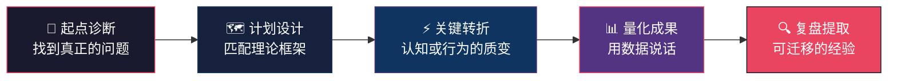
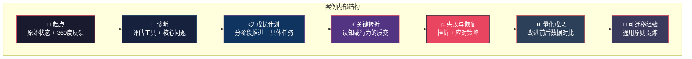
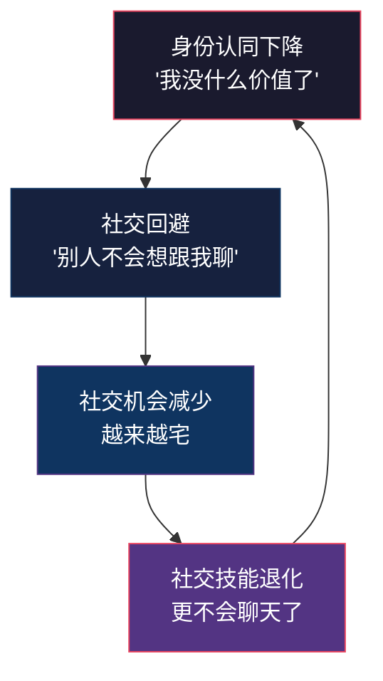
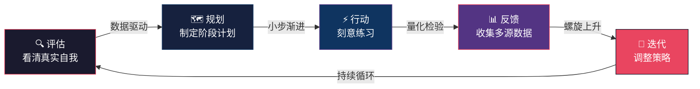

## 从新手到大师的沟通成长故事

理论和工具的价值，最终要通过真实的人和真实的故事来验证。本节收录六个覆盖不同职业阶段、不同沟通挑战的成长案例。它们不是"成功学鸡汤"，而是完整的**诊断→规划→执行→转折→成果→复盘**实录。每个案例都标注了使用的核心理论和工具，方便你对照前面章节的方法论进行迁移。

### 为什么案例比理论更有效

认知科学研究给出了明确答案：人类大脑对"故事"的记忆效率是对"事实"的22倍（斯坦福大学商学院研究，2007年）。这不是说理论不重要，而是说**理论需要通过故事才能真正被理解和内化**。

本章六个案例分别对应六种典型的沟通困境：

| 困境类型 | 对应案例 | 核心矛盾 | 适合读者 |
|---------|---------|---------|---------|
| 技术精英型 | 案例一：张工 | 技术深度 vs 表达清晰度 | 工程师、程序员、科研人员 |
| 能力偏科型 | 案例二：李经理 | 对外沟通强 vs 对内沟通弱 | 销售、商务、客户经理 |
| 恐惧回避型 | 案例三：王老师 | 能力具备 vs 恐惧压制 | 恐惧公众演讲的任何职业 |
| 文化冲突型 | 案例四：陈总 | 本地经验 vs 全球协作 | 跨国公司员工、海归、外贸从业者 |
| 表达赤字型 | 案例五：赵明 | 技术天才 vs 表达灾难 | 创始人、技术负责人、产品经理 |
| 身份断裂型 | 案例六：刘阿姨 | 社交资本流失 vs 重建需求 | 退休人员、职业转型者、搬迁者 |

**快速自测：哪个案例最像你？**

花30秒做这个选择：回忆最近一次沟通不顺利的场景，你的第一反应是什么？

- A. "我说得很清楚啊，他们为什么听不懂？" → 读**案例一**或**案例五**
- B. "客户那边没问题，就是内部太难协调了。" → 读**案例二**
- C. "我知道要说什么，但一站起来就紧张得不行。" → 读**案例三**
- D. "我英语没问题，但总觉得和外国同事对不上频道。" → 读**案例四**
- E. "我不缺能力，就是不知道怎么让别人理解我的价值。" → 读**案例五**
- F. "我现在的生活圈子太小了，不知道怎么认识新朋友。" → 读**案例六**

### 阅读指南：如何从案例中提取最大价值

读案例不要只看"结果"，要关注三件事：

1. **起点诊断**——他们用了什么方法准确识别了自己的问题？（对应本章第二节的评估工具）
2. **计划设计**——他们的成长计划为什么有效？拆解了哪些关键变量？
3. **转折时刻**——什么事件或认知转变真正推动了质变？（往往不是"更努力"，而是"换了个思路"）

**每个案例都包含以下结构**，方便你快速定位关键信息：

> **阅读建议**：如果你时间有限，优先阅读与自己最相似的案例，然后直接跳到"六个案例的横向对比分析"和"从案例到行动"两个总结部分。完整阅读所有六个案例会获得更深层的理解——因为很多洞察来自对比不同案例之间的共性和差异。

---

### 案例一：技术专家的沟通蜕变之路

> **关键词**：技术精英、结构化表达、受众意识、从沉默到发声
> **核心理论**：DISC行为风格、MBTI人格类型、金字塔原理、成长型思维
> **难度**：⭐⭐⭐（中等，需要持续6个月的刻意练习）

#### 起点：沉默的技术骨干

张工是一家互联网公司的高级工程师，技术能力出众——架构设计、代码审查、故障排查都是团队顶尖水平。但在360度反馈中，同事们对他的技术能力打了4.8分（满分5分），沟通能力却只有2.1分。

这不是个案。根据Google的Project Oxygen研究，技术能力只是优秀工程师的必要条件之一，而"善于沟通"在高效能工程师的行为清单中排名第三。张工面临的困境代表了一个庞大的群体：**技术精英型沟通短板**。

典型评语原封不动地摘录如下：

| 反馈来源 | 原始评语 |
|---------|---------|
| 上级 | "技术很强，但很难从他那里得到清晰的解释。每次周报都是一堆技术术语，看不懂他在做什么。" |
| 同级 | "开会时基本不说话，不知道他的想法。等出了问题才知道他其实早就预见到了，但没说。" |
| 下属 | "Code review的评论写得像论文，读起来很费劲。有时候看不懂就干脆跳过了。" |
| 产品经理 | "跟他沟通需求像对牛弹琴——我说业务需求，他回我技术限制，永远对不上频道。" |

这些评语指向同一个核心矛盾：**技术深度和表达清晰度之间存在巨大落差**。

#### 诊断：沟通能力评估

张工使用了本章第二节介绍的三重评估工具：

**第一层：DISC行为风格测评**

结果：典型的C型（谨慎型），得分分布为 D=15%、I=10%、S=25%、C=50%。C型的核心特征是注重细节、追求准确、偏好逻辑推理，但风险是过度关注技术细节而忽略受众感受，不善于主动表达和情感交流。

**第二层：MBTI人格类型**

结果：INTJ（内向-直觉-思考-判断）。这个类型的沟通特点可以用一张表概括：

| 维度 | 张工的倾向 | 沟通中的表现 |
|------|----------|------------|
| 能量来源：内向(I) | 偏好独处思考 | 不主动发言，会议中沉默 |
| 信息获取：直觉(N) | 关注全局和模式 | 跳过细节直接给结论，别人跟不上 |
| 决策方式：思考(T) | 逻辑优先 | 忽视他人情感需求，表达"冷冰冰" |
| 生活方式：判断(J) | 计划性强 | 不喜欢即兴讨论，偏好提前准备 |

**第三层：自我反思分析**

结合测评结果，张工识别出四个核心问题：

1. **主动沟通意识缺失**——习惯"等别人来问"而非"主动同步信息"
2. **受众意识薄弱**——所有人面前用同一套技术语言，不分场合
3. **公众表达焦虑**——超过5人场合就紧张，思路混乱
4. **书面表达缺乏结构**——邮件和文档没有层次，信息密度太高

用能力素质模型（冰山模型）来定位：张工在"知识"层面（水面以上）是满分，但在"态度"和"习惯"（水面以下）存在严重短板。这恰好印证了一个关键洞察——**沟通能力的瓶颈往往不在技巧层面，而在认知和习惯层面**。

#### 成长计划：6个月分阶段推进

张工制定了为期6个月的成长计划，严格遵循70-20-10学习法则（70%实践、20%社交学习、10%正式培训）：

**第1-2月：建立基础（10%正式学习 + 习惯萌芽）**

正式学习（每周5小时）：
├── 阅读《金字塔原理》，做每章思维导图笔记
├── 完成Toastmasters的CC（Competent Communicator）前4个项目
└── 学习并背诵PREP法则（Point-Reason-Example-Point）

日常练习（每日15分钟）：
├── 用PREP法则写一段工作日志（100字以内说清一件事）
├── 对着镜子练习1分钟自我介绍（计时）
└── 每天主动跟一位同事说一句工作之外的话

反馈机制：
├── 请一位信任的同事每周给一次口头反馈
└── 每周日回顾本周的沟通表现，记录在复盘日志中

**第3-4月：实践应用（70%实战 + 20%社交学习）**

实战任务：
├── 主动在团队会议中发言（每次至少1次，发言前用30秒组织语言）
├── 承担一次技术分享的演讲任务（30人规模）
├── 用"说人话"的方式向产品经理解释一个技术方案
└── 每周撰写一篇技术博客（500-800字，面向初级工程师）

社交学习：
├── 观察团队中沟通最好的同事，记录TA的3个具体行为
├── 请那位同事吃饭，直接问"你怎么做到让别人听懂的？"
└── 参加Toastmasters每周例会，观摩优秀演讲者的技巧

**第5-6月：精进提升（综合应用 + 体系固化）**

高阶任务：
├── 主持一次团队技术评审会（需要引导讨论而非单向输出）
├── 完成360度反馈的二次评估，量化对比
├── 向新入职的同事提供入职指导（测试"教别人"的能力）
└── 总结成长经验，建立《个人沟通手册》v1.0

体系固化：
├── 将复盘日志升级为结构化模板
├── 设定季度沟通能力KPI（会议发言次数、分享满意度、邮件回复率）
└── 找到一位沟通导师，建立每月一次的交流机制

#### 关键转折点：向高管汇报

在第3个月，张工被安排向公司CTO和三位VP汇报一个技术架构升级方案。这是他第一次面对如此重要的听众，也是他成长计划中的"压力测试"。

**准备过程**（用时约20小时）：

1. **受众分析**——提前找项目经理了解高管的关注点。结论：CTO关注系统稳定性和技术债，VP关注业务影响和成本。于是他把"技术先进性"从第一页移到最后一页。
2. **结构重组**——采用"问题-方案-价值"三段式，而不是常见的"背景-技术-实现"三段式。先讲业务痛点（3分钟），再讲方案概要（5分钟），最后讲预期收益（2分钟）。
3. **可视化改造**——把原来15页的技术架构图缩减为3页，每页只传达一个核心信息。用颜色编码区分"不变/变化/新增"三个维度。
4. **模拟演练**——对着镜子练习10遍，录像回放3次，修正了3个口头禅（"就是说"、"然后呢"、"对吧"）。请两位同事模拟提问，准备了8个可能的问题和回答。

**汇报结果**：

CTO的原话是："这是我第一次真正理解这个技术方案的价值。之前的邮件我看了三遍都没看懂。"方案当场通过，预算增加20%。

张工在复盘日志中写道："我终于明白了一件事——**向高管汇报不是展示我有多懂技术，而是帮他们做出正确的决策**。当我把视角从'我要说什么'切换到'他们需要听什么'，一切都变了。"

这个认知转变用成长型思维理论来解释：张工从"固定型思维"（"我就是不善表达的人"）转向了"成长型思维"（"我可以学会用对方听得懂的方式表达"）。这个转变比任何技巧都重要。

#### 失败与恢复：计划执行中的挫折

张工的成长并非一帆风顺。第2个月他遭遇了两次重大挫折：

**挫折一：首次技术分享的"滑铁卢"**

张工在团队内部做了一次30分钟的技术分享，结果反响很差。同事们反馈："前10分钟还能跟上，后面完全听不懂了。""感觉他在读论文。"

他的第一反应是自我怀疑："我果然不适合做演讲。"这是典型的固定型思维回归。他的应对策略是：

1. **把失败数据化**——回看录像，标注"观众注意力下降"的时间点，发现第12分钟开始大量使用术语是分水岭
2. **找到具体问题而非否定整体**——不是"我不适合演讲"，而是"我需要练习在第10分钟之后保持通俗性"
3. **缩小改进范围**——下次分享只练一件事：在15分钟之后仍然用类比而非术语

**挫折二：主动发言的"尴尬时刻"**

第3周的一次项目会上，张工按照计划主动发言，但他准备的内容太长，讲了2分钟还没到重点，产品经理开始看手机，项目经理打断他说："张工，能简单说一下结论吗？"

这次尴尬让他一度想放弃"主动发言"的练习。他的恢复方法是：

1. **接受尴尬是成长的代价**——告诉自己"每一次尴尬都是一次校准，让我更了解听众的耐心阈值"
2. **调整发言策略**——以后发言前先在笔记本上写一句话总结，先说结论，再视情况展开
3. **给自己复盘积分**——每次尴尬的发言记1分，每10分奖励自己一顿好吃的，把"尴尬"转化为"进步的计量单位"

#### 6个月后的变化

| 维度 | 改进前 | 改进后 | 提升幅度 |
|------|--------|--------|---------|
| 360度沟通评分 | 2.1 | 3.8 | +81% |
| 会议发言频率 | 几乎不发言 | 每次会议至少发言2次 | 从0到N |
| 技术分享满意度 | 3.0 | 4.5 | +50% |
| 邮件可读性评分 | 2.2 | 4.0 | +82% |
| 同事反馈关键词 | "难以沟通""高冷" | "清晰易懂""愿意分享" | 质变 |

#### 可迁移经验

1. **从"不知道自己不知道"到"知道自己不知道"是最重要的第一步**——很多人卡在"无意识的不胜任"阶段（第一章能力素质模型的四阶段理论），连自己沟通有问题都不知道。
2. **刻意练习比泛泛练习有效10倍**——张工不是"多说话"就好了，而是每次练习都有明确焦点（这次练结构，下次练语速，再下次练眼神接触）。
3. **录像回放是最诚实的反馈来源**——你以为自己说话很清楚，看完录像才发现有12个"嗯"和8个"就是说"。
4. **找到适合自己的沟通风格，而非模仿他人**——C型（谨慎型）不需要变成I型（影响型），而是找到"有条理的清晰表达"这个C型的天然优势区间。
5. **失败是数据，不是判决**——每次挫折都包含可量化、可改进的具体信息。把"我不行"拆解为"我在第X分钟开始超载"，问题就从情绪变成了工程。

---

### 案例二：销售精英的说服力升级

> **关键词**：能力偏科、风格切换、说服者→影响者、服务型领导
> **核心理论**：DISC行为风格、利益相关者分析、双赢谈判、关键对话
> **难度**：⭐⭐⭐⭐（较高，需要根本性的行为模式转变）

#### 起点：经验丰富的"独狼型"销售

李经理是一家B2B SaaS公司的销售总监，从业15年，个人业绩连续5年排名前三。她的客户谈判能力极强——能准确捕捉客户痛点，快速给出解决方案，促成签约。但在晋升VP的评估中，公司提出了两个硬伤：**战略影响力不足**和**跨部门协作能力薄弱**。

这揭示了一个常见盲区：**对外沟通能力和对内沟通能力是两种不同的技能**。很多销售精英擅长"说服陌生人"，却在"影响熟人"上频频碰壁。

#### 诊断与分析

360度反馈揭示了一个"能力偏科"的画像：

| 维度 | 评分 | 评语摘要 |
|------|------|---------|
| 客户沟通 | 4.5 | "客户关系维护一流，谈判能力强" |
| 上级汇报 | 4.0 | "数据清晰，结论明确" |
| 跨部门协作 | 2.5 | "强势，不考虑别人的时间和资源限制" |
| 下属管理 | 2.8 | "命令式管理，不听下属意见" |
| 倾听能力 | 2.3 | "总是在等别人说完就急着给结论" |

DISC评估显示她是高度D型（支配型），得分分布为 D=65%、I=20%、S=10%、C=5%。D型的核心优势是果断、结果导向、敢于决策，但风险也明显——忽视他人感受、过于强势、容易把"推动"变成"压迫"。

用一个比喻来理解：李经理是一辆跑车——在高速公路上（客户谈判）风驰电掣，但在城市小巷里（跨部门协作）横冲直撞。问题不在于车不好，而在于需要根据不同路况切换驾驶模式。

#### 成长计划：从"说服者"到"影响者"

核心转变模型：
说服者（Persuader）──→ 影响者（Influencer）
  "我说你听"              "我们一起想"
  "听我的没错"            "你怎么看？"
  "给我结果"              "我来帮你解决障碍"
  "赢-输"                 "赢-赢"

**第1月：自我觉察（建立镜子）**

核心任务：看清自己的"自动驾驶"模式
├── 录像分析：录制3次会议发言，逐分钟标注"我在什么时候打断了别人"
├── 行为日志：每天记录3次"我直接下结论"的时刻，标注当时的情境
├── 学习同理心倾听的3个层次（听事实→听情绪→听需求）
└── 阅读《关键对话》，重点标注第5-7章（营造安全氛围、控制情绪、开始行动）

关键练习：
在每次发言前，先用手指计数——听到3个不同人的观点后才开口。
这个物理动作打断了她的"自动反应"模式。

**第2-3月：行为调整（换挡驾驶）**

核心任务：在安全环境中练习新的沟通模式
├── 用提问替代直接下结论：把"我们应该这样做"改成"我们有哪些选项？"
├── 练习共情表达模板：
│   ├── "我理解你的顾虑是..."（确认对方情绪）
│   ├── "从你的角度看..."（换位思考信号）
│   └── "我们怎么一起解决这个问题？"（共同拥有感）
├── 每周与一位跨部门同事进行一次15分钟的非正式交流（午餐或咖啡）
│   目的：不是谈工作，而是了解对方的角色、压力和优先级
└── 给下属开"反向反馈会"：邀请团队匿名反馈"我最希望李经理改变的一个行为"

**第4-5月：技能深化（升级装备）**

核心任务：从"行为调整"升级为"能力内化"
├── 学习利益相关者分析矩阵（权力-利益四象限），应用到日常工作中
├── 练习"双赢谈判"技巧：先问"你最重要的三个诉求是什么？"
├── 在项目协调中实践"引导式"而非"指挥式"沟通
│   ├── 指挥式："市场部周三前给我方案"
│   └── 引导式："这个项目的时间线，你们觉得怎么安排最合理？"
└── 寻找一位资深VP作为导师，每月一次午餐交流

**第6月：成果检验（考试+复盘）**

核心任务：在真实高压场景中检验新能力
├── 推进一个涉及5个部门的产品发布项目
├── 项目结束后收集所有协作方的匿名反馈
├── 与导师复盘成长历程，识别下一个成长点
└── 更新个人领导力发展计划

#### 关键转折点：五部门联合项目

在第4个月，李经理负责协调一个涉及产品、研发、市场、客服、财务五个部门的产品发布项目。这种跨部门项目以前她也做过，但方式是直接分配任务、设定截止时间、到期催收。结果通常按时交付，但协作方怨声载道。

这次她完全换了一种方式：

**第一步：一对一摸底（而非群发邮件）**

她花了一周时间跟五个部门的负责人分别进行30分钟一对一谈话。不是谈"你要做什么"，而是问三个问题：
- "你目前最大的资源压力是什么？"
- "这个项目对你部门的优先级排第几？"
- "什么样的协作方式会让你觉得舒服？"

结论让她吃惊：研发部正在赶另一个紧急项目，市场部人手短缺，客服部还没有收到任何产品信息。这些问题如果按照以前的方式，要到项目中期才会暴露。

**第二步：联合工作坊（而非任务分配会）**

她组织了一个2小时的联合工作坊，流程是：
1. 各部门用5分钟介绍自己的约束和需求（25分钟）
2. 共同画出项目依赖关系图（30分钟）
3. 讨论并投票决定时间线（30分钟）
4. 明确每个节点的负责人和沟通频率（20分钟）
5. 约定"遇到问题先找我，不要等周会"（5分钟）

关键细节：在讨论时间线时，研发部提出需要多两周。以前李经理会直接否决，这次她说："研发部的顾虑我理解。市场部，如果研发延后两周，你们的推广计划受影响吗？"市场部想了想说可以调整，问题自然解决。

**第三步：过程中的"服务型领导"**

项目执行过程中，她做了三件事：
1. 每天早上花10分钟看各协作群的进展，主动发现并消除障碍
2. 当两个部门出现分歧时，她不"拍板"，而是引导双方自己找到解决方案
3. 项目中期做了一次匿名满意度调查，根据反馈及时调整

**结果**：项目按时高质量完成，各部门对协作过程的满意度达到4.2分（以前类似项目的平均分是2.8分）。更意外的是，有三个部门的负责人主动跟她的上级说："以后跨部门项目都想跟李经理合作。"

#### 失败与恢复：旧习惯的反弹

李经理的成长过程中，最危险的不是"学不会新方法"，而是"压力下自动退回旧模式"。

**反弹事件一：季度冲刺期的"原形毕露"**

第3个月底，季度业绩压力剧增。在一次项目协调会上，因为研发部延迟交付，李经理当场发火："你们到底能不能按时交？不能的话我找外包！"

这句话让之前3个月建立的信任瞬间归零。研发部负责人私下跟同事说："说了这么多'我们一起想'，到了关键时刻还不是一样。"

恢复策略：
1. **当天道歉，不找借口**——会后立刻找研发部负责人单独谈话："刚才我的方式不对，压力不是理由。你的时间线顾虑，我们重新谈。"
2. **建立"压力预警机制"**——当季度业绩压力达到7/10以上时，自动启动"冷静缓冲"——所有跨部门沟通先写下来，隔30分钟再发
3. **把这次反弹写进个人复盘日志**——不是为了自责，而是为了识别"触发退回旧模式的压力阈值"

**关键教训**：行为模式的转变不是线性的，而是螺旋式的。每一次反弹都是校准的机会——让你更清楚"旧模式的触发条件"是什么。

#### 6个月后的变化

| 维度 | 改进前 | 改进后 | 提升幅度 |
|------|--------|--------|---------|
| 跨部门协作评分 | 2.5 | 4.0 | +60% |
| 下属管理评分 | 2.8 | 4.2 | +50% |
| 倾听能力评分 | 2.3 | 3.9 | +70% |
| 战略影响力 | "待提升" | "达标" | 质变 |
| 下属主动分享意愿 | 低（怕被否定） | 高（感到被尊重） | 质变 |

#### 可迁移经验

1. **对外沟通和对内沟通是两种不同的技能**——说服客户用的是"推力"（说服技巧），影响团队用的是"引力"（信任和尊重）。很多人的沟通能力其实是"半边天"。
2. **D型人格的优势不需要丢弃，而是需要加一个"切换开关"**——在需要快速决策的场景保持果断，在需要协作的场景切换为引导式。这不是改变性格，而是扩展行为模式。
3. **"先了解约束，再制定计划"比"先定计划，再强推执行"效率高得多**——这背后是利益相关者分析的思维方式。
4. **最有效的反馈来自"最不舒服的人"**——那些不敢当面提意见的下属和跨部门同事，他们的匿名反馈才是最有价值的成长线索。
5. **行为转变的螺旋性**——压力下退回旧模式是正常的。关键是缩短"退回"的时间，建立快速恢复的机制。

---

### 案例三：内向者的公众演讲突破

> **关键词**：公众演讲恐惧、认知行为疗法、阶梯式暴露、从恐惧到享受
> **核心理论**：CBT认知行为疗法、Yerkes-Dodson定律、恐惧等级理论、自我效能感
> **难度**：⭐⭐⭐⭐⭐（最高，需要直面深层恐惧）

#### 起点：恐惧公众演讲的大学讲师

王老师是一位大学讲师，学术能力出色——发表过12篇SCI论文，主持过2项国家自然科学基金项目。但面对超过20人的场合，她就会出现明显的生理反应：声音发抖、手心出汗、思维混乱、心跳加速。

她曾经因此放弃了一次国际学术会议的特邀报告机会——那篇论文被接收为口头报告率只有5%的亮点论文，但她宁可让导师代讲，也不敢自己上台。

**恐惧的本质**：公众演讲恐惧（Glossophobia）是最常见的社交恐惧之一，影响约75%的人口。对于王老师来说，恐惧的根源不是"不会讲"，而是灾难化思维——"如果我讲砸了，所有人都会觉得我的研究不行，我的学术生涯就完了。"

#### 成长历程：12周阶梯式突破

王老师的治疗方案融合了认知行为疗法（CBT）和阶梯式暴露训练，分为三个阶段：

**第一阶段：认知重建（第1-4周）——拆掉内心的炸弹**

这一步不急着上台，先在认知层面"拆弹"。

核心任务：识别并挑战灾难化思维

练习1：恐惧审计
├── 列出所有"如果...就完了"的灾难化假设
│   例如："如果我忘词了，所有人都会笑话我"
│   例如："如果我的声音发抖，别人会觉得我不专业"
├── 对每个假设做三栏分析：
│   ├── 灾难化想法：忘词了→所有人笑话→学术声誉受损
│   ├── 证据检验：你参加过多少次别人的演讲？别人忘词时你笑了吗？
│   └── 替代想法：忘词了→暂停几秒看笔记→继续讲→大多数人不会在意
└── 每天做一次"恐惧温度计"自评（0-10分），记录变化趋势

练习2：暴露等级清单
从最不恐惧到最恐惧排列：
1. 对镜子朗读论文（恐惧度：2/10）
2. 对1个朋友讲研究内容（恐惧度：3/10）
3. 录制讲解视频（恐惧度：4/10）
4. 在5人小组中分享（恐惧度：5/10）
5. 在20人研讨会上发言（恐惧度：6/10）
6. 在50人场合做报告（恐惧度：7/10）
7. 在100人学术会议上做报告（恐惧度：8/10）
8. 在200人+场合做特邀报告（恐惧度：9/10）

**第二阶段：技能建设（第5-8周）——打磨武器**

在认知层面"拆完弹"之后，开始在技能层面"磨刀"。

演讲结构训练：
├── 学习"钩子-问题-方案-证据-呼吁"五段式结构
├── 每次练习只改进一个方面（第一周练开场，第二周练过渡，第三周练结尾）
└── 目标：形成"肌肉记忆"，上台不需要想结构

肢体语言训练：
├── 站姿：双脚与肩同宽，重心均匀分布
├── 手势：用开放式手势（手掌朝上）替代防御性手势（双手交叉）
├── 眼神：用"三角法"——每次看一个区域3-5秒，轮流扫视全场
└── 移动：每讲完一个要点，向前走一步（表示推进），而非来回踱步（表示焦虑）

声音控制训练：
├── 每天做5分钟"腹式呼吸"练习
├── 用手机录音，检查语速（目标：每分钟150-170字）
└── 练习"停顿"的力量——关键结论后停顿2秒，比加速更有力

**第三阶段：实战突破（第9-12周）——战场检验**

阶梯式暴露实战：
├── 第9周：在教研室做一次15分钟的学术分享（8人）
│   └── 恐惧温度计：5/10 → 实际体验：3/10（比想象中轻松）
├── 第10周：在学院做一次30分钟的学术报告（50人）
│   └── 恐惧温度计：7/10 → 实际体验：5/10（紧张但在控制中）
├── 第11周：在校际学术会议上做报告（100人）
│   └── 恐惧温度计：8/10 → 实际体验：6/10（开始享受）
└── 第12周：录制一次15分钟的公开课视频（面向不特定观众）
    └── 恐惧温度计：6/10 → 实际体验：4/10（基本自如）

#### 四个关键技巧（实战总结）

**技巧1：4-7-8呼吸法——生理镇定剂**

上台前和演讲中的焦虑暂停时使用：用鼻子吸气4秒，屏住呼吸7秒，用嘴缓慢呼气8秒。重复3次。这个方法激活副交感神经系统，降低心率和皮质醇水平。王老师的实测数据：做完3轮后，心率从110次/分降到82次/分。

**技巧2：准备程度曲线——自信的数学公式**

自信程度与准备程度正相关，但不是线性关系，而是呈S型曲线：

准备程度（小时）    自信程度
    0-5小时         低（心里没底）
    5-15小时        中（基本能讲）
    15-25小时       高（从容应对）
    25小时以上      边际收益递减（过度准备反而僵化）

王老师的经验：一个30分钟的报告，准备20小时是最佳投入点——包括内容梳理8小时、幻灯片制作6小时、模拟演练6小时。

**技巧3：观众视角转换——从"被审判"到"给礼物"**

恐惧演讲的核心心理模式是"被审判"——"他们在评判我"。转换视角为"给礼物"——"我有一个有价值的东西要分享给他们"。这个认知转换简单但强大。王老师的做法是在演讲前默念："这些人花时间来听我讲，是因为他们觉得我的研究有价值。我要做的就是把价值传递给他们。"

**技巧4：接受不完美——最反直觉的高效策略**

观众对演讲者失误的容忍度远高于演讲者自己的想象。研究显示，听众通常只能注意到演讲者自认为的"重大失误"的30%。王老师在一次报告中把一个关键数据说错了，她在心里觉得"完了"，但会后没有任何人提到这个问题。接受不完美反而让她更放松，表现更好。

#### 失败与恢复：暴露过程中的崩溃时刻

王老师在阶梯暴露训练中并非一路向上。第6周她遭遇了一次"暴露回退"——

**崩溃事件**：在教研室的一次5人分享中，她的声音突然发抖，越想控制越抖，最后不得不停下来喝了口水。她觉得"所有人都看到了我的窘态"，之后整整一周拒绝任何练习。

这次崩溃的恢复过程本身就是一次重要的学习：

1. **允许自己暂停**——不是放弃，而是给自己3天的"恐惧假期"，不去想演讲的事
2. **跟治疗师复盘**——治疗师指出，她的崩溃不是因为"能力不够"，而是因为跳过了暴露等级中的一个台阶（从3人直接到5人，中间缺少4人过渡）
3. **补充过渡台阶**——在3人和5人之间加入"4人+录像"的过渡练习
4. **把崩溃写进暴露日记**——记录触发条件、生理反应、恢复时间，这些数据对后续训练非常有价值

**关键洞察**：暴露训练的"回退"不是失败，而是信息。它告诉你哪里需要更多的过渡台阶。

#### 6个月后的成果

| 维度 | 改进前 | 改进后 |
|------|--------|--------|
| 最大听众规模 | 不敢超过20人 | 成功在200人学术会议上完成报告 |
| 演讲焦虑评分 | 9/10（极度恐惧） | 3/10（适度紧张，属于正常范围） |
| 学术影响 | 放弃会议报告 | 获得"最佳演讲奖" |
| 职业发展 | 只做幕后研究 | 主动申请成为学院教学培训师 |
| 论文影响力 | 有好成果但传播有限 | 报告后收到3个国际合作邀请 |

#### 可迁移经验

1. **恐惧不是敌人，逃避恐惧才是**——每次逃避都会强化"我很害怕"的信念，形成恶性循环。阶梯式暴露训练的核心逻辑是"用成功经验覆盖恐惧记忆"。
2. **认知重建比技巧训练更重要**——很多人的演讲问题不是"不会讲"，而是"不敢讲"。先把内心的炸弹拆掉，技巧才有用武之地。
3. **360度反馈在恐惧场景中的应用**——王老师每次演讲后都请3位听众填写匿名反馈表，用真实数据替代内心的灾难化想象。
4. **适度紧张是好事**——Yerkes-Dodson定律告诉我们，适度的紧张（3-5/10）反而能提升表现。目标不是"消除紧张"，而是"把紧张控制在最佳区间"。
5. **暴露训练允许回退**——在阶梯式暴露中遭遇崩溃不是失败，而是数据。分析触发条件，补充过渡台阶，然后继续前进。

---

### 案例四：跨文化沟通能力培养

> **关键词**：文化维度、文化谦逊、风格适应、语言精度
> **核心理论**：Hofstede文化维度理论、Erin Meyer文化地图、高/低语境文化理论
> **难度**：⭐⭐⭐⭐（较高，需要长期积累文化敏感度）

#### 背景：文化鸿沟中的中国区负责人

陈总是某跨国公司的中国区负责人，管辖200人的团队，需要频繁与美国总部（战略决策）、欧洲分部（产品设计）和东南亚团队（运营执行）沟通。他在公司工作了8年，英语流利，但跨文化沟通仍然是他最大的痛点。

具体表现：
- 与美国总部开会时，他的"含蓄表达"经常被误读为"不表态"
- 与欧洲团队协作时，他的人情世故被误解为"不专业"
- 与东南亚团队沟通时，他的"结果导向"被视为"不尊重关系"

这些不是语言问题，而是**文化维度差异**。用霍夫斯泰德（Hofstede）的文化维度理论来分析：

| 文化维度 | 中国 | 美国 | 德国 | 泰国 | 对沟通的影响 |
|---------|------|------|------|------|------------|
| 权力距离 | 高(80) | 低(40) | 低(35) | 高(64) | 中国→美国：需要更直接地表达不同意见 |
| 个人主义 | 低(20) | 高(91) | 高(67) | 低(20) | 中国→美国：用"我"而非"我们"来表述立场 |
| 不确定性规避 | 中(30) | 低(46) | 高(65) | 中(64) | 中国→德国：需要更详细的数据和计划 |
| 长期导向 | 高(87) | 低(26) | 高(83) | 中(32) | 中国→美国：不要总说"长远来看"，关注当下 |
| 放纵度 | 中(24) | 高(68) | 中(40) | 中(53) | 中国→美国：适当加入轻松元素 |

**补充：高语境 vs 低语境文化**

Hofstede的维度之外，Edward Hall的高/低语境理论同样关键：

| 维度 | 高语境文化（中国、日本、泰国） | 低语境文化（美国、德国、北欧） |
|------|---------------------------|---------------------------|
| 信息传递 | 大量信息在语境、关系、非言语中 | 信息主要在明确的语言中 |
| 表达方式 | 含蓄、暗示、需要"读空气" | 直接、明确、"说什么就是什么" |
| 冲突处理 | 回避正面冲突，保全面子 | 直面冲突，认为这是解决问题的方式 |
| 决策方式 | 先建立关系，再谈事情 | 先谈事情，关系是副产品 |

陈总的核心困境是：**他在高语境文化中如鱼得水，但在低语境文化中频频碰壁**。

#### 成长策略：三条战线并进

**战线一：语言能力——从"能说"到"会说"**

日常练习（每日30分钟）：
├── 早上15分钟：听BBC/CNN新闻，模仿语调和节奏
├── 中午10分钟：用英语写一封工作邮件（注意商务英语的格式和用词）
└── 晚上5分钟：复盘今天用英语沟通的一个场景，记录可以改进的表达

进阶训练（每周2小时）：
├── 每周与英语母语者进行1次30分钟的视频交流
│   重点练习：表达不同意见（"I see your point, but..."）
│   重点练习：请求澄清（"Could you help me understand..."）
│   重点练习：总结共识（"So to summarize what we've agreed..."）
└── 学习商务英语写作规范：
    ├── 邮件：BLUF原则（Bottom Line Up Front）——结论先行
    ├── 报告：Executive Summary不超过半页
    └── 会议纪要：Action Items必须有Owner和Deadline

**战线二：文化能力——从"知道"到"理解"到"适应"**

知识积累（持续进行）：
├── 精读Erin Meyer《文化地图》（The Culture Map），重点理解8个文化维度
├── 研究各区域同事的文化背景，建立"文化档案卡"
│   例如：
│   ├── 美国同事（Sarah）：直接表达、重视个人贡献、喜欢开门见山
│   ├── 德国同事（Hans）：注重计划和数据、不喜欢即兴变更、邮件回复详细
│   └── 泰国同事（Somchai）：重视和谐、避免当面否定、喜欢先建立关系
└── 参加公司内部的跨文化沟通培训（如有）

实践应用（每次国际会议前做文化功课）：
├── 美国会议：准备数据和结论，发言简洁有力，主动表达立场
├── 欧洲会议：提前发送详细议程和背景资料，尊重流程
├── 东南亚会议：先寒暄建立关系，不要直接进入正题
└── 混合会议：用"翻译者"心态——主动确认不同文化背景的人是否理解一致

**战线三：关系建设——从"工作关系"到"信任关系"**

与美国总部：
├── 在正式会议前找时间闲聊（天气、体育、周末活动）
├── 理解"直接"不等于"粗鲁"，学会用"我觉得"替代"你应该"
└── 主动分享中国的业务数据，用数据建立信任

与欧洲分部：
├── 尊重他们的流程和时间线，不要用中国的速度去要求
├── 邮件沟通注意格式和礼仪（称呼、正文、落款）
└── 有机会去欧洲出差时，主动邀请同事共进晚餐

与东南亚团队：
├── 每次通话前花5分钟聊聊生活（家庭、节日、天气）
├── 提出不同意见时用"I wonder if we could also consider..."
│   而不是直接说"No"
└── 在公开场合给予肯定和表扬，批评私下一对一

#### 关键收获：跨文化沟通的四个层次

通过半年的实践，陈总总结出了跨文化沟通能力的四个层次：

| 层次 | 描述 | 陈总的进步 |
|------|------|----------|
| 第一层：语言能力 | 能用对方的语言交流 | 已具备，但需提升商务用语精度 |
| 第二层：文化认知 | 了解对方文化的沟通规则 | 从"模糊知道"到"系统理解" |
| 第三层：风格适应 | 能根据不同文化调整自己的沟通方式 | 核心成长点，从"一种风格走天下"到"看人下菜碟" |
| 第四层：文化谦逊 | 承认自己不了解，主动学习，不预设判断 | 最重要的收获——"我不知道"比"我知道"更有力量 |

其中最深刻的一个领悟是关于**"文化谦逊"（Cultural Humility）**。有一次陈总在美国总部开会，一位美国同事提出了一个他认为"完全不合理"的方案。他差点脱口而出"这在中国行不通"，但他克制住了，改口说："我很好奇，你们是怎么考虑中国市场这个变量的？"结果对方给了一个他没想到的角度，最终方案比他自己的版本更好。

**"文化谦逊"的核心是：不预设自己的文化经验是正确的，而是把每次跨文化互动都当作学习机会。**

#### 失败与恢复：文化误解的真实代价

陈总在成长过程中犯过一个严重的文化错误——

**错误事件**：在一次与德国团队的视频会议中，德国同事提出了一个产品方案。陈总觉得方案有明显缺陷，但按照中国文化习惯，他没有当场指出，而是会后发了一封详细邮件列出问题。

德国同事的反应出乎他意料：他们在下一次会议上公开质疑陈总"为什么不在会上说？会后发邮件是不是不信任我们？"在德国文化中，会上不说会后说被视为"背后捅刀"。

恢复策略：
1. **立刻解释文化差异**——在下一次会议开场时坦诚："上次我选择了会后邮件的方式，是因为在中国文化中，当面直接否定别人可能让人不舒服。但我理解在你们的文化中，直接讨论更受尊重。以后我会在会上直接说。"
2. **建立"文化纠错"的团队规范**——跟国际团队约定：任何人觉得对方的沟通方式有问题，可以随时指出，不会被视为不礼貌
3. **把这个错误写进个人"文化错题本"**——记录触发条件、文化假设、实际后果、正确做法

#### 6个月后的变化

| 维度 | 改进前 | 改进后 |
|------|--------|--------|
| 美国总部对他的评价 | "含蓄，难以读懂" | "清晰且有建设性" |
| 欧洲团队协作效率 | 项目平均延迟2周 | 基本按时交付 |
| 东南亚团队满意度 | 3.2/5 | 4.3/5 |
| 被邀请参与战略决策的频率 | 每季度1次 | 每月1-2次 |
| 个人跨文化自信度 | 5/10 | 8/10 |

---

### 案例五：创业者的沟通能力跃迁

> **关键词**：技术天才、故事思维、电梯演讲、情感共鸣、融资路演
> **核心理论**：叙事理论、非暴力沟通、利益相关者沟通、情绪管理
> **难度**：⭐⭐⭐⭐（较高，需要从根本上重建表达逻辑）

#### 背景：技术天才的"表达赤字"

赵明是一位技术型创业者，博士毕业于清华大学计算机系，创办了一家AI医疗影像公司。他的技术能力毋庸置疑——核心算法的准确率比行业平均高15个百分点，获得了3项发明专利。

但他在"非技术沟通"上的表现可以用灾难来形容：
- **融资路演**：连续被6家投资机构拒绝，反馈都是"听不懂你在做什么"
- **团队管理**：核心工程师离职率高达30%，离职面谈中频繁出现"感觉不被理解"
- **客户沟通**：产品演示时医生们频频走神，签约转化率只有8%

一位资深投资人私下跟他说了一句刺耳但真实的话："**你的技术很好，但我听不懂你在说什么。如果你不能让一个聪明但不懂技术的人理解你的价值，你的公司走不远。**"

#### 问题诊断：四个维度的沟通缺陷

通过录像回放和360度反馈，赵明发现了四个核心问题：

| 问题维度 | 具体表现 | 根因分析 |
|---------|---------|---------|
| 表达过于技术化 | 面对投资人时花80%时间解释算法原理 | 缺乏"受众切换"能力——一套话术走天下 |
| 缺乏故事性 | 路演全是数据和图表，没有让人记住的叙事 | 技术思维训练的是"严谨"而非"打动人" |
| 倾听不足 | 团队会议中别人还没说完就急着给答案 | 习惯性地把"思考"等同于"已经有答案了" |
| 情绪管理薄弱 | 面对质疑时语气变防御性，面部表情紧张 | 把"质疑我的方案"等同于"质疑我的能力" |

用能力素质模型分析：赵明在"知识"（算法、技术）和"技能"（编码、研究）上接近满分，但在"自我认知"（知道自己表达有问题）和"动机"（为什么别人应该听懂）这两个冰山以下的维度上存在严重盲区。

#### 成长计划：6个月的"沟通创业"

赵明把沟通能力的提升当作另一个创业项目来管理——有目标、有里程碑、有复盘。

**第1-2月：基础改造——学会"说人话"**

核心任务：建立"受众意识"这个底层操作系统

练习1：电梯演讲实验室
├── 用30秒说清公司价值（10个版本，每个版本侧重点不同）
│   ├── 对投资人："我们用AI帮医院减少80%的影像漏诊"
│   ├── 对医生："一双不知疲倦的眼睛，帮你盯着每一张片子"
│   ├── 对患者："AI帮你发现问题，让治疗更早开始"
│   └── 对记者："用技术让每一个患者得到最好的诊断"
├── 每个版本对着非技术背景的人测试，直到对方10秒内能复述核心价值
└── 记录最有效的表达方式，形成"话术库"

练习2：类比思维训练
├── 学习用类比解释技术概念：
│   ├── "我们的AI就像一个永不疲倦的资深医生"
│   ├── "模型训练就像教小孩认字——看的样本越多，识别越准"
│   └── "深度学习就像大脑的神经网络，层层抽象"
├── 每天找一个技术概念，用类比解释给非技术家人听
└── 建立"技术-类比"对照表（积累100个类比）

练习3：录像回放×10
├── 录制10个版本的融资路演（每次改进一个方面）
├── 每次录像后标注：哪里观众可能走神？哪里信息密度太高？
└── 请3位非技术朋友看录像，收集"我哪里没听懂"的反馈

**第3-4月：实战打磨——从练习室到战场**

核心任务：在真实场景中检验和迭代

路演实战：
├── 向5位非技术背景的朋友做路演，收集详细反馈
├── 参加2次创业路演活动（不要求融资，只要求真实舞台经验）
├── 每次路演后做结构化复盘：
│   ├── 哪个故事引起了共鸣？（记录）
│   ├── 哪个数据让投资人点头？（记录）
│   ├── 哪个环节走神了？（分析原因）
│   └── Q&A环节哪些问题没答好？（准备标准答案）
└── 建立"投资人常见问题库"（50个问题+标准回答）

团队沟通改造：
├── 在团队会议中练习"先听后说"——用计时器确保每人发言时间不少于自己
├── 学习"非暴力沟通"四步法：观察→感受→需要→请求
│   例如：不说"你这个方案有问题"
│        改说"我看到这个方案在边缘案例上没有覆盖（观察），
│             我有点担心上线后的稳定性（感受），
│             因为我们的用户对可靠性要求很高（需要），
│             能不能我们一起过一遍边界情况？（请求）"
├── 每周与1位核心团队成员做30分钟一对一（不谈任务，只谈感受和成长）
└── 学习情绪管理技巧——面对质疑时的"3秒暂停"法则：
    被质疑 → 深呼吸（3秒）→ 确认对方的问题 → 再回应

**第5-6月：精进提升——建立个人沟通体系**

核心任务：固化成果，形成可持续的沟通能力

融资路演：
├── 完成一次正式的融资路演（邀请3位投资人做模拟问答）
├── 根据反馈迭代最终版本
└── 建立个人的"故事库"——10个覆盖不同场景的故事

团队管理：
├── 引入"一对一"沟通机制（每月每位核心成员至少1次）
├── 建立团队沟通规范（会议规则、反馈规则、决策规则）
└── 培养2位团队成员的沟通能力（用"教别人"来深化自己的理解）

客户沟通：
├── 重新设计产品演示流程——从"展示功能"变为"讲故事+演示功能"
├── 收集10位医生的使用反馈，用他们的语言重写产品介绍
└── 录制3个版本的产品演示视频，测试哪个版本转化率最高

#### 关键转折点：一次改变命运的路演

在第3个月，赵明在一个创业大赛上用全新的方式做了一次路演。他没有从技术开始，而是讲了一个故事：

> "去年，我的一位医生朋友告诉我一件事。他每天看300张CT片子，看到第200张的时候，眼睛已经开始模糊了。他说，'我知道我可能会漏掉什么，但我太累了。'去年，他漏诊了一例早期肺癌。那位患者是两个孩子的母亲。"
>
> "我们做这家公司，不是因为AI很酷，而是因为我们需要一双永远不会疲倦的眼睛，帮每一个医生盯着每一张片子。"

全场安静了5秒，然后爆发出掌声。一位资深投资人当场说："我终于明白你们在做什么了。"

这个路演之后，赵明的公司收到了4家投资机构的TS（投资意向书）。他的转变用一个公式来表达：

旧模式：技术能力 → 数据 → 逻辑 → "你应该投我"
新模式：情感共鸣 → 故事 → 价值 → "我们一起改变这件事"

#### 失败与恢复：路演的至暗时刻

赵明在第2个月的一次创业路演活动中遭遇了最尴尬的失败——

**至暗时刻**：他按照新学的"故事+数据"结构做了一次路演，但紧张之下，故事讲到一半突然忘词了。他站在台上沉默了5秒，然后尴尬地笑了一下说"我忘了下一句"，接着开始直接念PPT。台下的投资人开始低头看手机。

这次失败让他整整消沉了一周。他在复盘日志中写道："我是不是根本不适合做路演？技术出身的人是不是永远学不会讲故事？"

恢复策略：
1. **区分"方法对了但执行不好"和"方法本身不对"**——他的路演结构没问题，问题是排练次数不够。结论：不是方法错了，是练习不够
2. **把"忘词"变成预案**——以后每次路演准备3个"救命句"，忘词时用这些万能过渡句衔接
3. **在更安全的环境重新积累成功经验**——接下来两周每天对镜子练一遍，然后对家人练，最后对3个朋友练
4. **把这次失败写进"投资人常见问题库"**——不是问答，而是"如果忘词了怎么办？"的标准应对方案

**关键教训**：在从练习室走向战场的过程中，第一次公开失败几乎是不可避免的。重要的是把它当作"校准"而非"否定"。

#### 成果

| 维度 | 改进前 | 改进后 | 变化 |
|------|--------|--------|------|
| 融资结果 | 连续被6家拒绝 | A轮融资超额30% | 从0到1 |
| 团队满意度 | 6.2/10 | 8.5/10 | +37% |
| 核心员工离职率 | 30%/年 | 8%/年 | -73% |
| 客户签约转化率 | 8% | 22% | +175% |
| 行业影响力 | 无 | 被邀请在行业峰会做主题演讲 | 从0到1 |

#### 可迁移经验

1. **技术能力再强，如果不能有效表达，价值会大打折扣**——赵明的技术一直没有变，变的只是表达方式。同样的技术，用不同的方式说，商业价值相差10倍。
2. **故事是最强大的沟通工具**——人脑天生对故事敏感。一个好的故事能让抽象变具体，让技术变温暖，让数据变有意义。这不是"煽情"，而是用人类最古老的沟通方式传递信息。
3. **"先听后说"不是浪费时间，而是提高效率**——赵明以前以为快速给出答案是高效，后来发现花5分钟倾听反而能减少50%的返工。
4. **情绪管理是沟通的"基础设施"**——再好的内容，如果用防御性语气说出来，效果为零。"3秒暂停"法则看似简单，但需要反复练习才能内化。
5. **不同的受众需要不同的"电梯演讲"版本**——同一份技术，对投资人、医生、患者、记者应该有完全不同的30秒版本。这不是"见人说人话"，而是"用对方的语言传递价值"。

---

### 案例六：退休老人的社交沟通重建

> **关键词**：身份断裂、社交资本重建、兴趣社交、社区融入
> **核心理论**：社会资本理论、身份认同理论、阶梯式暴露、给予者社交
> **难度**：⭐⭐⭐（中等，需要耐心和持续行动）

#### 背景：从"刘经理"到"退休阿姨"的身份断裂

刘阿姨今年62岁，刚从某国企中层管理岗位退休一年。退休前，她每天忙于工作——主持会议、协调项目、接待客户、管理下属，社交圈主要是同事。退休后，她突然发现自己不知道怎么跟人聊天了。

这不是夸张。以前的同事联系越来越少——她发微信过去，回复越来越慢，内容越来越短。小区里的邻居她不认识，每天的生活就是买菜、做饭、看电视。她的老伴还在上班，白天家里只有她一个人。

用社会学的术语来说，刘阿姨经历的是**"社会资本的断崖式流失"**。退休前，她的社交网络90%建立在职场关系上；退休后，这些关系迅速萎缩，而她没有建立新的社交网络来填补空缺。

#### 问题分析：四个层面的挑战

| 层面 | 具体问题 | 影响 |
|------|---------|------|
| 社交场景 | 从职场社交转向社区社交，规则完全不同 | 不知道"聊什么""怎么开始" |
| 身份认同 | 从"刘经理"变成"退休阿姨"，自我价值感下降 | 觉得"自己没用了"，不敢主动社交 |
| 话题储备 | 与年轻人没有共同语言，与同龄人不熟悉 | "尬聊"后快速冷场 |
| 社交技能退化 | 长时间不社交后，基本社交技能生锈 | 对主动与人交流感到焦虑和恐惧 |

这四个层面叠加在一起，形成了一个恶性循环：

#### 成长策略：四步重建社交生活

**第一步：重建身份认同（第1-2周）——找回"我是谁"**

身份认同是所有社交行为的基础。如果刘阿姨觉得自己"没用了"，她就不会主动与人交流。所以第一步不是"学聊天技巧"，而是重建"我有价值"的信念。

练习：价值清单
├── 列出退休前积累的所有技能和经验
│   ├── 管理技能：团队协调、项目管理、冲突调解
│   ├── 行业知识：30年的国企管理经验
│   ├── 生活技能：厨艺精湛、养生知识丰富、理财有方
│   └── 人际技能：善于倾听、乐于助人、有耐心
├── 思考这些技能在退休后的应用场景
│   ├── 管理技能→社区活动组织
│   ├── 行业知识→帮年轻人解答职场问题
│   ├── 生活技能→教邻居做菜、分享养生知识
│   └── 人际技能→做志愿者、调解邻里纠纷
└── 每天早上对自己说："我有很多可以分享的价值"

**第二步：从最小的社交开始（第3-6周）——打破冰层**

不要一开始就想着"交朋友"。先从最简单的、没有风险的社交互动开始：

社交阶梯（从低风险到高风险）：

第1周：微笑+点头
├── 在小区散步时，跟遇到的每一个人微笑点头
├── 不需要说话，只需要一个友好的表情
└── 目标：每天至少5次微笑互动

第2-3周：简单寒暄
├── 在菜市场跟摊贩多聊几句（"今天白菜新鲜啊""生意怎么样"）
├── 在电梯里跟邻居打招呼（"您住几楼？""今天天气不错"）
└── 目标：每天至少2次1分钟以上的对话

第4-6周：加入集体活动
├── 参加社区组织的免费活动（健康讲座、节日庆祝）
├── 在广场舞队伍边上先看两天，第三天加入
├── 在小区花园里跟带孩子的老人聊天（"孙子多大了？"）
└── 目标：每周参加1次集体活动

**第三步：发展新兴趣（第7-16周）——找到社交媒介**

兴趣是最好的社交媒介。有共同兴趣的人不需要"找话题"，因为话题自然就来了。

兴趣探索路径：

方向1：运动类
├── 广场舞：入门门槛低，社交属性强，每天固定时间活动
├── 太极拳：健康养生，同龄人多，练习中自然产生交流
└── 健步走：可以边走边聊，不需要特殊技能

方向2：学习类
├── 老年大学：书法、绘画、摄影、声乐（选择一门）
├── 手机使用班：学习微信、抖音、支付宝（跟年轻人有共同语言）
└── 社区读书会：讨论书籍的同时锻炼表达能力

方向3：服务类
├── 社区志愿者：帮助他人是建立社交关系的最自然方式
├── 社区调解员：利用管理经验调解邻里纠纷
└── 帮子女带孙辈的邻居搭把手：最快速的社交破冰方式

**第四步：建立新的社交圈（第17-24周）——从认识人到交朋友**

社交圈构建策略：

第17-20周：从"认识"到"熟悉"
├── 在兴趣班中主动跟3-5个人建立"打招呼"的关系
├── 记住他们的名字和基本信息（住哪里、家里几口人）
├── 每次活动后在微信群里分享照片或感受
└── 主动提供小帮助（"我多做了点心，给你带一份"）

第21-24周：从"熟悉"到"朋友"
├── 主动邀请1-2位聊得来的人一起散步、买菜
├── 在微信群里分享自己的拿手菜（照片+做法）
├── 组织一次小型聚会（4-6人，在家里或小区花园）
└── 开始建立"每周固定活动"的节奏

#### 失败与恢复：社交尝试中的尴尬

刘阿姨在重建社交的过程中也遭遇过尴尬——

**尴尬事件一**：她鼓起勇气参加了一个社区书法班，但第一节课上其他学员都在聊"上次课的内容"和"老师上次留的作业"，她完全插不上话。课间休息时她想找人聊天，但大家都在看手机或者跟熟人说话。她觉得自己"像个外人"，第二周就没去了。

恢复策略：
1. **把"尴尬"重新定义为"正常的破冰期"**——任何新人加入一个已有的社交圈，前两周都会觉得格格不入，这不是她的问题
2. **降低第一次的期望值**——第一次去不是"交朋友"，而是"让自己出现在那个环境里"就成功了
3. **找到一个"锚点"**——第二次去的时候，她主动跟老师请教了一个问题，跟老师建立了第一次互动。第三次，她带了自己做的点心分享，瞬间打开了话题

**尴尬事件二**：她在小区微信群里分享了自己的养生食谱，但没有人回复。她觉得"没人感兴趣"，想退群。

恢复策略：
1. **理解群聊的社交节奏**——微信群里"已读不回"是常态，不代表没人看
2. **换一种分享方式**——下次分享时加上"大家有没有自己的养生秘方？欢迎交流"，把单向输出变成双向互动
3. **耐心等待种子发芽**——两周后，一位邻居私信她问了一个养生问题。再后来，越来越多的人开始在群里@她

#### 半年后的变化

| 维度 | 改进前 | 改进后 |
|------|--------|--------|
| 社交圈大小 | 0个新朋友 | 5个好朋友+20个熟人 |
| 每周社交活动次数 | 0 | 3-4次 |
| 身份认同 | "退休阿姨" | "热心刘阿姨""社区健康顾问" |
| 自我价值感 | 低落 | 充实和满足 |
| 情绪状态 | 孤独、焦虑 | 积极、有期待感 |
| 社区影响力 | 无 | 被推选为楼栋长 |

刘阿姨最自豪的一件事是：她在社区微信群里分享了自己30年积累的养生食谱，被邻居们称为"社区健康顾问"。现在每周都有人来请教她怎么做菜、怎么养生。她说："退休前我是'刘经理'，退休后我成了'刘老师'——被需要的感觉比什么都重要。"

#### 可迁移经验

1. **沟通能力的提升不分年龄，任何时候开始都不晚**——62岁的刘阿姨和28岁的赵明走的是同一条路：诊断→计划→行动→反馈→迭代。区别只在起点和目标，不在方法论。
2. **身份认同是社交行为的底层驱动力**——如果一个人觉得自己"没价值"，再好的社交技巧也用不出来。所以"学技巧"之前先"建信念"。
3. **兴趣是社交的天然媒介**——不需要刻意"找话题"。有共同兴趣的人在一起，话题自然就来了。这是社交的最短路径。
4. **帮助他人是建立社交关系的最自然方式**——刘阿姨分享养生知识、帮邻居带东西、组织社区活动，这些都是"先给予"的社交策略。心理学研究表明，"给予者"比"索取者"更容易建立深度社交关系。
5. **社交能力像肌肉一样，不用就退化，用了就恢复**——刘阿姨退休后社交能力"退化"了，但通过有意识的练习，半年就恢复甚至超越了退休前的水平。

---

### 六个案例的横向对比分析

这六个案例覆盖了不同年龄、不同职业、不同沟通挑战，但它们有一些共同的模式值得提取。

#### 案例全景对照表

| 案例 | 核心挑战 | 评估工具 | 成长策略 | 关键转折 | 6个月核心指标 | 涉及理论 |
|------|---------|---------|---------|---------|-------------|---------|
| 张工（技术专家） | 沉默寡言，不主动表达 | DISC(C型)+MBTI(INTJ)+360反馈 | 结构化表达+Toastmasters | 向高管汇报成功 | 360评分2.1→3.8 | 金字塔原理、PREP法则 |
| 李经理（销售精英） | 对外强对内弱，风格强势 | DISC(D型)+360反馈+行为录像 | 从说服者到影响者的风格转换 | 五部门协作项目 | 跨部门评分2.5→4.0 | 利益相关者分析、双赢谈判 |
| 王老师（内向讲师） | 极度恐惧公众演讲 | 恐惧温度计+CBT评估 | 认知重建+阶梯式暴露 | 200人会议获最佳演讲奖 | 焦虑度9/10→3/10 | CBT、Yerkes-Dodson定律 |
| 陈总（跨国高管） | 跨文化沟通障碍 | 文化维度分析+反馈收集 | 语言+文化+关系三线并进 | 文化谦逊的认知转变 | 被邀战略决策频率×4 | Hofstede维度、文化地图 |
| 赵明（创业者） | 技术天才的表达赤字 | 录像回放+360反馈+投资人反馈 | 故事思维+倾听训练+情绪管理 | 路演讲故事引爆共鸣 | 融资超额30%，签约率+175% | 叙事理论、非暴力沟通 |
| 刘阿姨（退休老人） | 社交断崖，身份认同危机 | 自我反思+价值清单 | 身份重建→小步社交→兴趣社交 | 成为"社区健康顾问" | 新朋友5个，社交圈20人 | 社会资本理论、阶梯暴露 |

#### 四个跨案例共性模式

**模式一：评估先行，计划随后**

六个案例无一例外都是从"准确诊断"开始的。张工用DISC+MBTI了解自己的行为模式，李经理用360反馈发现"能力偏科"，王老师用恐惧量表量化焦虑程度。没有准确的诊断，成长计划就是盲人摸象。

这对应本章核心闭环的第一步——"评估现状"。工具不一定要高级，关键是诚实地面对自己的真实水平。

**模式二：认知转变先于行为改变**

每个案例中最重要的转折点都不是"学到了一个新技巧"，而是"认知发生了根本转变"：
- 张工："从'我要说什么'切换到'他们需要听什么'"
- 李经理："从'说服者'到'影响者'"
- 王老师："从'被审判'到'给礼物'"
- 陈总："文化谦逊——我不了解的比我了解的多"
- 赵明："故事比数据更有力量"
- 刘阿姨："退休不是结束，是新开始"

这对应成长型思维理论——当一个人从"我不擅长沟通"（固定型思维）转变为"我可以学会沟通"（成长型思维），改变就已经发生了一半。

**模式三：阶梯式推进，而非一步登天**

所有案例都遵循了"小步渐进"的原则：
- 王老师不是直接上200人的台，而是从5人→20人→50人→100人→200人
- 刘阿姨不是直接去交朋友，而是从微笑→寒暄→活动→认识→朋友
- 赵明不是直接做融资路演，而是先对镜子练→对朋友练→小型路演→正式路演

这对应Fogg行为模型——行为=动机×能力×触发器。"小步"降低了"能力"门槛，让改变更容易发生。

**模式四：反馈闭环是成长的发动机**

六个案例中的每一次进步都伴随着反馈：
- 张工：录像回放、同事反馈、360度二次评估
- 李经理：跨部门匿名反馈、一对一反馈
- 王老师：听众反馈表、恐惧温度计自评
- 陈总：国际同事的反馈、项目协作满意度
- 赵明：投资人反馈、团队满意度调查
- 刘阿姨：新朋友的回应、社区活动参与度

没有反馈的练习是"盲练"——你可能在重复错误100次而不自知。这对应本章评估-成长闭环的第三步——"收集反馈"。

**模式五：失败是数据，不是判决**（六个案例的共同教训）

六个案例中，每个人都在成长过程中遭遇了至少一次重大挫折：张工的首次分享"滑铁卢"，李经理的季度冲刺期反弹，王老师的暴露回退，陈总的文化误解代价，赵明的路演忘词，刘阿姨的书法班尴尬。但他们都把失败转化为可操作的数据，而非自我否定的理由。

这是最容易被忽视但最重要的共性——**成长型沟通者和放弃型沟通者的区别，不在于谁失败得更少，而在于谁从失败中提取了更多信息**。

#### 选择你的成长路径

不同基础的读者应该从不同的起点开始。以下是三种推荐路径：

| 路径 | 适合人群 | 推荐案例 | 时间投入 | 预期成果 |
|------|---------|---------|---------|---------|
| 入门 | 沟通基础薄弱，不确定自己的问题在哪 | 案例一（张工）、案例六（刘阿姨） | 每周2-3小时，持续3个月 | 建立基本的结构化表达和主动沟通习惯 |
| 进阶 | 知道自己的问题但不知道怎么改 | 案例二（李经理）、案例三（王老师） | 每周3-5小时，持续6个月 | 在特定沟通场景中实现质变 |
| 高阶 | 整体能力不错，想在特定领域突破 | 案例四（陈总）、案例五（赵明） | 每周5-10小时，持续6-12个月 | 建立个人沟通体系，成为领域内的沟通标杆 |

---

### 常见陷阱与反模式

从六个案例中提炼出的五个最常见陷阱，如果你正在制定自己的沟通成长计划，请务必避开：

| 陷阱 | 表现 | 后果 | 正确做法 |
|------|------|------|---------|
| 跳过诊断直接行动 | "我知道问题在哪，直接练就好" | 练错方向，浪费时间 | 先做DISC/MBTI/360反馈，用数据定位问题 |
| 追求一步到位 | "我要在3个月内变成沟通高手" | 目标太大，受挫后放弃 | 分阶段设定里程碑，每个阶段只聚焦1-2个改进点 |
| 只学不练 | 读了10本沟通书但从不实践 | 知识停留在认知层面 | 70-20-10法则：70%实践、20%社交学习、10%正式培训 |
| 忽视反馈 | 练了很多但从不收集反馈 | 在错误中循环 | 每次练习后收集量化反馈（评分、录音、录像） |
| 退回旧模式后自我否定 | "我又发火了，我果然改不了" | 固定型思维回归 | 接受螺旋式成长，分析触发条件，缩短恢复时间 |

---

### 从案例到行动：你的成长启动清单

读完六个故事，最重要的不是"被感动"，而是"开始做"。以下是基于六个案例提炼的行动清单，按难度递增排列：

#### 本周就能做的（投入1-2小时）

| 行动 | 对应案例 | 预期收获 | 具体步骤 |
|------|---------|---------|---------|
| 做一次DISC或MBTI自评 | 张工、李经理 | 了解自己的沟通风格倾向 | 搜索免费DISC测试（如123test.com），用20分钟完成，记录结果 |
| 录一段5分钟的自我演讲并回放 | 所有案例 | 第一次"看见"自己的真实表现 | 用手机录制一段5分钟的工作汇报，回看时标注3个改进点 |
| 列出3位最了解你的人，请他们各说3个你的沟通优点和缺点 | 所有案例 | 获得初步的"360反馈" | 用微信发一条消息："我在做沟通能力自评，能帮我指出3个优点和3个不足吗？" |
| 记录一天中3次沟通失败的时刻，分析原因 | 赵明、李经理 | 开始建立"沟通复盘"意识 | 晚上花10分钟回顾今天的沟通场景，用"情境→行为→结果→改进"四栏记录 |
| 用30秒向一位朋友介绍你正在做的工作 | 赵明 | 练习"电梯演讲" | 计时30秒，让朋友复述你说的内容，检验是否清晰 |

#### 本月可以推进的（投入每周3-5小时）

| 行动 | 对应案例 | 预期收获 | 具体步骤 |
|------|---------|---------|---------|
| 制定3个月的沟通成长计划 | 所有案例 | 从"知道"到"有计划" | 参考本节案例的分阶段结构，制定自己的3个月计划，每周设定具体练习 |
| 每天用PREP法则写一段工作日志 | 张工 | 建立结构化表达习惯 | 每天选一个工作事件，用"观点-原因-例子-总结"四句话写100字日志 |
| 每周主动与1位不太熟的同事/邻居聊天 | 刘阿姨、陈总 | 扩大社交舒适区 | 周一选定目标，找一个自然的切入点（请教、分享、赞美），完成一次5分钟对话 |
| 阅读《关键对话》或《金字塔原理》 | 张工、李经理 | 建立理论基础 | 每天读20页，每章写一个核心要点和一个应用场景 |
| 在一次会议中练习"先听后说" | 赵明、李经理 | 打破"急于给答案"的习惯 | 在下一次会议中设定规则：至少听3个人说完再开口 |

#### 本季度需要持续投入的（系统性成长）

| 行动 | 对应案例 | 预期收获 | 具体步骤 |
|------|---------|---------|---------|
| 完成正式的360度反馈并制定改进计划 | 所有案例 | 获得准确的能力基准线 | 使用本章的360反馈模板，邀请5-10位同事填写，用1周时间分析结果 |
| 加入Toastmasters或类似的演讲练习社群 | 张工、王老师 | 获得持续练习的环境和反馈 | 搜索当地的Toastmasters俱乐部，参加一次例会作为观察者，然后决定是否加入 |
| 承担一次需要"说服"或"影响"他人的任务 | 李经理、赵明 | 在真实场景中检验成长 | 主动申请一次项目汇报、客户演示或团队分享，把任务当作成长的机会 |
| 建立个人沟通复盘日志系统 | 所有案例 | 把成长变成日常习惯 | 使用固定模板（日期、场景、目标、结果、反思、改进），每天花5分钟填写 |

### 沟通成长的底层模型：五阶段闭环

六个案例的故事各不相同，但它们遵循同一个底层模型。这个模型可以作为你制定个人成长计划的框架：

**为什么这个闭环一旦建立就不再需要外部动力？**

因为闭环中的每一步都产生"内在奖励"：评估让你看清自己（好奇心驱动），规划给你掌控感（安全感驱动），行动产生微小进步（成就感驱动），反馈验证方向（确定性驱动），迭代优化效率（精通感驱动）。这五种内在奖励叠加在一起，形成了自我维持的动力系统——你不再需要"坚持"，因为成长本身就是奖励。

### 案例启示：写在最后的话

沟通能力的成长是一个个性化的过程。每个人都有不同的起点和目标，关键是找到适合自己的成长路径，并坚持刻意练习。

以上六个案例展示了不同类型的成长故事——技术专家学会了表达，销售精英学会了倾听，内向者征服了舞台，跨国高管跨越了文化鸿沟，创业者学会了讲故事，退休老人重建了社交生活。但它们的底层逻辑是相同的：

**准确诊断 → 系统计划 → 持续练习 → 及时反馈 → 迭代优化**

这个闭环一旦建立，就不再需要外部动力，它会自我驱动，持续运转。

如果你只记住一件事，请记住这个：**沟通能力不是天赋，而是可以系统性提升的技能。六个不同的人，六种不同的困境，走的是同一条路。区别只在于起点和目标，不在方法论。现在，轮到你了。**

---

### 延伸阅读

以下书籍与本节案例中使用的理论和方法直接对应：

| 书籍 | 作者 | 对应案例 | 核心价值 |
|------|------|---------|---------|
| 《金字塔原理》 | Barbara Minto | 张工 | 结构化表达的底层方法论，从思维到写作到演讲的全套框架 |
| 《关键对话》 | Kerry Patterson 等 | 李经理、赵明 | 高风险、高情绪、高分歧对话的系统应对策略 |
| 《文化地图》 | Erin Meyer | 陈总 | 基于8个维度的跨文化沟通量化分析框架 |
| 《非暴力沟通》 | Marshall Rosenberg | 赵明、李经理 | 消除语言中的评判和暴力，建立基于需要的沟通模式 |
| 《演讲的力量》 | Chris Anderson / TED | 王老师、赵明 | TED官方演讲方法论，从内容设计到舞台呈现 |
| 《影响力》 | Robert Cialdini | 李经理、赵明 | 说服力的六大心理学原则及其防御策略 |
| 《社交天性》 | Matthew Lieberman | 刘阿姨 | 社交行为的神经科学基础，理解人类为什么需要连接 |
| 《终身成长》 | Carol Dweck | 所有案例 | 成长型思维vs固定型思维，所有改变的认知基础 |
| 《刻意练习》 | Anders Ericsson | 所有案例 | 科学练习方法论，从新手到大师的路径设计 |
| 《习惯的力量》 | Charles Duhigg | 张工、李经理 | 行为习惯的形成机制，如何建立新习惯、打破旧习惯 |
