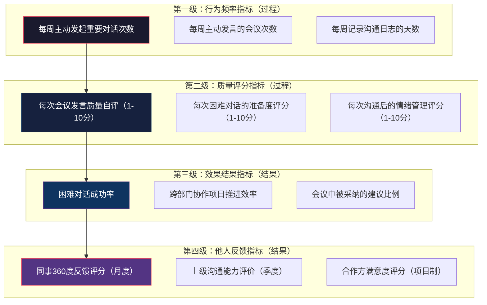
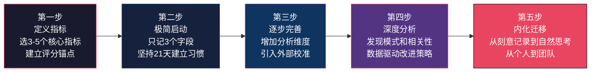

## 案例八：个人沟通成长的量化追踪

> "你无法改善你无法衡量的东西。"——彼得·德鲁克

前面七个案例展示了不同背景的人如何提升沟通能力，但它们有一个共同的局限：成长的描述主要依赖主观感受和定性反馈。本案例将展示一种完全不同的路径——**用数据驱动沟通能力的持续进化**。主角小林是一名产品经理，她把产品思维中的"数据驱动决策"方法论迁移到了个人成长领域，建立了一套完整的沟通能力量化追踪系统。这套系统不仅帮她在三个月内实现了显著提升，更重要的是，它成为了一个可持续运转的自我进化引擎。

### 背景：为什么选择量化追踪

#### 传统成长方式的困境

小林在决定系统提升沟通能力之前，尝试过几种常见的方法：

- **读书学习**：读了《非暴力沟通》《关键对话》等经典书籍，笔记做了不少，但实际行为变化不大
- **参加培训**：公司组织了一次两天的沟通培训，课堂上感觉收获满满，一周后回到原样
- **自我反思**：偶尔在日记中记录"今天某次沟通做得不好"，但缺乏系统的分析和改进计划

这些方法的共同问题是**反馈模糊**。读了一本书，不知道自己到底进步了多少；参加了一次培训，不确定哪些技能真正内化了；反思了一次沟通，没有数据支撑无法判断改进方向是否正确。

#### 产品经理思维的迁移

小林作为产品经理，日常工作中最核心的方法论就是"定义指标→追踪数据→分析原因→迭代优化"。她意识到，这套方法论完全可以迁移到个人成长领域：

| 产品管理思维 | 沟通成长迁移 |
|-------------|-------------|
| 定义北极星指标 | 确定沟通能力的核心衡量维度 |
| 建立数据埋点 | 在日常沟通中记录关键数据 |
| 分析用户行为 | 分析自己的沟通模式和习惯 |
| A/B测试 | 尝试不同沟通策略并对比效果 |
| 迭代发布 | 持续调整改进计划 |

这种迁移不是生搬硬套，而是抓住了本质——**无论是产品优化还是个人成长，核心逻辑都是"测量→假设→实验→验证"的科学方法**。

### 量化指标体系的设计

#### 设计原则

小林在设计指标体系时，遵循了SMART原则和产品经理的指标设计方法论：

1. **可衡量（Measurable）**：每个指标必须有明确的数值或评分标准，不能是"沟通变好了"这种模糊描述
2. **可行动（Actionable）**：指标的变化必须能指向具体的改进行动，不能是"为了追踪而追踪"
3. **可比较（Comparable）**：指标需要支持跨时间段的对比，能看到趋势变化
4. **不干扰行为（Non-intrusive）**：数据采集不能过于繁琐，否则无法坚持
5. **多维度覆盖（Comprehensive）**：单一指标容易造成"指标作弊"，需要多维度交叉验证

#### 四级指标体系

小林最终设计了一套四级指标体系，从过程指标到结果指标层层递进：

**第一级：行为频率指标（过程指标）**

这些指标衡量的是"你有没有做"，是最基础的执行层指标：

| 指标名称 | 定义 | 采集方式 | 目标值 |
|---------|------|---------|-------|
| 每周主动发起重要对话次数 | 主动找同事/领导讨论工作问题、提出建议、寻求反馈的次数 | 每天结束时在日志中记录 | 从8次/月提升到15次/月 |
| 每周主动发言的会议次数 | 在团队会议中主动发言（不包括被点名回答）的会议数量 | 会议后立即记录 | 从2次/周提升到5次/周 |
| 沟通日志完成天数 | 当天是否完成了沟通日志记录 | Notion打卡 | 从3天/周提升到7天/周 |

**第二级：质量评分指标（过程指标）**

这些指标衡量的是"你做得怎么样"，从单纯的"做了"升级为"质量如何"：

| 指标名称 | 评分标准 | 采集方式 |
|---------|---------|---------|
| 会议发言质量 | 1-3分：说了但没说清；4-6分：基本清楚但缺乏深度；7-8分：逻辑清晰有见地；9-10分：有影响力地推动了讨论方向 | 每次会议后立即自评 |
| 困难对话准备度 | 1-3分：完全没有准备；4-6分：准备了要点但不充分；7-8分：准备了完整方案和应对预案；9-10分：模拟演练了对话过程 | 困难对话前自评 |
| 情绪管理评分 | 1-3分：情绪主导了沟通；4-6分：意识到情绪但没能有效管理；7-8分：成功管理了情绪保持理性；9-10分：将情绪转化为沟通的正向力量 | 每次沟通后自评 |

**第三级：效果结果指标（结果指标）**

这些指标衡量的是"沟通的产出如何"，是从过程到结果的关键跳跃：

| 指标名称 | 定义 | 采集方式 |
|---------|------|---------|
| 困难对话成功率 | 达成预期目标或双方满意收场的困难对话占比 | 每次困难对话后记录结果 |
| 会议建议采纳率 | 你提出的建议/方案在会议中被认可或采纳的比例 | 每次会议后记录 |
| 跨部门协作推进效率 | 需要跨部门协作的项目任务，按预期时间节点完成的比例 | 项目管理工具追踪 |

**第四级：他人反馈指标（结果指标）**

这些指标是"外部验证"，避免自评偏差：

| 指标名称 | 采集频率 | 采集方式 |
|---------|---------|---------|
| 同事360度反馈评分 | 每月 | 匿名问卷（5-8位同事） |
| 上级沟通能力评价 | 每季度 | 一对一沟通中获取 |
| 合作方满意度 | 每个项目结束 | 简短的3题问卷 |

#### 指标之间的关系

这四级指标并非孤立存在，它们之间存在清晰的因果链：

**行为频率 → 质量评分 → 效果结果 → 他人反馈**

- 如果行为频率上升但质量评分没有提升，说明练习方式有问题（"量变没有引发质变"）
- 如果质量评分上升但效果结果没有改善，说明评分标准需要校准（"自我感觉良好但实际并非如此"）
- 如果效果结果改善但他人反馈滞后，说明需要时间积累认知转变（"成果需要时间被看见"）

小林每周会检查这四级指标的变化方向是否一致。如果出现不一致的情况，比如"行为频率高→质量评分低"，她会深入分析是练习方法不对，还是评分标准太严格。这种分析能力是量化追踪的真正价值——**数据不是目的，数据驱动的洞察才是目的**。

### 追踪工具与系统搭建

#### 工具选型

小林评估了多种工具方案，最终选择了Notion作为主平台：

| 工具方案 | 优点 | 缺点 | 适合场景 |
|---------|------|------|---------|
| 纸质笔记本 | 书写自由，无设备依赖 | 无法自动统计，不便检索 | 喜欢手写的人 |
| Excel表格 | 灵活计算，图表方便 | 界面不友好，移动端不便 | 喜欢结构化数据的人 |
| Notion | 数据库+日历+模板一体化 | 学习成本较高 | 需要系统化追踪的人 |
| 专业习惯追踪App（如Habitica） | 游戏化激励 | 无法自定义复杂指标 | 需要外部激励的人 |
| 自建系统（如Obsidian+Dataview） | 完全可定制 | 技术门槛高 | 有技术背景的人 |

**Notion数据库设计**

小林在Notion中创建了一个名为"沟通成长追踪"的数据库，包含以下属性：

沟通日志数据库：
├── 日期（Date）
├── 沟通类型（Select）：会议发言 / 一对一 / 困难对话 / 社交闲聊 / 书面沟通
├── 沟通对象（Multi-select）：直属领导 / 跨部门同事 / 团队成员 / 客户 / 其他
├── 主动程度（Select）：主动发起 / 被动参与 / 被动回应
├── 发言质量自评（Number, 1-10）
├── 情绪管理评分（Number, 1-10）
├── 困难对话成功（Checkbox）
├── 关键事件记录（Text）
├── 做得好的点（Text）
├── 需要改进的点（Text）
└── 下次行动（Text）

月度汇总数据库：
├── 月份（Date）
├── 主动对话次数（Rollup/手动统计）
├── 会议发言平均质量（Formula/手动计算）
├── 困难对话成功率（Formula）
├── 同事反馈评分（Number）
├── 本月最大进步点（Text）
├── 本月最大瓶颈（Text）
└── 下月改进计划（Text）

#### 数据采集流程

小林设计了一套轻量化的数据采集流程，确保每天只需要5-10分钟就能完成：

**每日流程（5分钟）：**

步骤1：回顾当天的重要沟通（1分钟）
  - 今天有哪些值得注意的沟通？
  - 哪次沟通最值得记录？

步骤2：填写沟通日志（3分钟）
  - 填写沟通类型、对象、主动程度
  - 给发言质量和情绪管理打分
  - 用一句话记录关键事件
  - 写下"做得好的"和"需要改进的"

步骤3：设置明天的沟通意图（1分钟）
  - 明天有哪些重要沟通？
  - 明天想重点练习什么？

**每周回顾流程（30分钟，周日晚上）：**

步骤1：数据汇总（10分钟）
  - 统计本周各项指标数据
  - 计算平均值、最高值、最低值
  - 与上周数据对比

步骤2：模式分析（10分钟）
  - 本周哪些沟通类型表现最好/最差？
  - 有没有重复出现的问题模式？
  - 哪些改进措施有效？哪些无效？

步骤3：制定下周计划（10分钟）
  - 基于数据分析，确定下周的1-2个改进重点
  - 设定下周的具体目标值
  - 记录需要寻求的帮助或资源

#### 关键字段的评分校准

自评打分是量化追踪中最容易出偏差的环节。小林在第一个月就发现了这个问题——她的打分标准在不断漂移。第1周觉得"没打断对方"就值得打7分，到第4周时"没打断对方"只值5分了，因为她的标准在提高。

为了解决这个问题，她建立了一套**评分锚点（Anchor）系统**，为每个分数段定义了具体的行为描述：

**发言质量评分锚点：**

1-2分：说了但完全不清楚对方在说什么，或者说了之后引起误解
3-4分：基本表达了观点，但逻辑不够清晰，需要对方追问才能理解
5-6分：观点清晰，逻辑基本通顺，但缺乏深度或没有考虑对方立场
7-8分：逻辑清晰，有数据或案例支撑，考虑了对方的立场和关注点
9-10分：不仅清晰表达了观点，还成功推动了讨论方向，产生了实质影响

**情绪管理评分锚点：**

1-2分：情绪完全失控，说了后悔的话，或者沉默逃避
3-4分：意识到情绪波动但没能有效管理，语气或表情流露了负面情绪
5-6分：在大部分时间保持了理性，但有一两个瞬间情绪有些失控
7-8分：成功管理了情绪，在压力下保持了冷静和专业
9-10分：不仅管理了情绪，还将紧张/不满转化为建设性的表达

**评分校准的另一个方法是"录音回测"**。小林每周会选择1-2次重要沟通进行录音（征得对方同意后），然后在周末回听并重新打分。如果自评分数和回听后的真实评分差距超过2分，她会调整下周的评分标准。经过一个月的校准，她的自评准确度从偏差2-3分缩小到了偏差1分以内。

### 三个月追踪数据与深度分析

#### 原始数据

| 指标维度 | 第1月 | 第2月 | 第3月 | 变化趋势 |
|---------|------|------|------|---------|
| 每月主动发起重要对话次数 | 8次 | 12次 | 15次 | ↑ 87.5% |
| 每月主动发言的会议次数 | 6次 | 10次 | 14次 | ↑ 133% |
| 会议发言质量平均分（1-10） | 6.2 | 7.1 | 7.8 | ↑ 25.8% |
| 困难对话成功率 | 40% | 55% | 70% | ↑ 75% |
| 困难对话准备度平均分 | 4.5 | 6.8 | 8.2 | ↑ 82.2% |
| 情绪管理平均分 | 5.8 | 6.9 | 7.5 | ↑ 29.3% |
| 会议建议采纳率 | 25% | 40% | 55% | ↑ 120% |
| 同事360度反馈评分 | 6.5/10 | 7.2/10 | 8.0/10 | ↑ 23.1% |
| 沟通日志完成天数 | 15天 | 24天 | 28天 | ↑ 86.7% |

#### 第一月：建立基线与习惯养成

**数据特征**：各项指标处于较低水平，但关键是建立了数据采集的习惯。

**深度分析**：

第一月最大的挑战不是提升沟通能力，而是**坚持记录数据**。前两周小林几乎每天都会忘记填写日志，完成率只有43%。她分析了原因：不是因为懒，而是因为记录流程太重——每次要填写10多个字段，感觉像是在做作业。

她的解决方案是**简化记录流程**：

优化前（每次5-10分钟，10+字段）：
  → 完成率43%

优化后（每次2-3分钟，3个核心字段）：
  - 今天最重要的1次沟通是什么？（一句话）
  - 发言质量打分（1-10）
  - 明天想改进什么？（一句话）
  → 完成率提升到72%

第三周起恢复完整记录：
  → 完成率维持在65%

这个发现很重要：**数据采集的完整性不如连续性重要**。如果因为记录太重而放弃，那一个月的数据为零；如果简化记录能坚持下来，至少有数据可供分析。

**第一个月的关键发现**：

1. **"被动参与"是默认模式**：80%的沟通是被动参与（别人发起），只有20%是主动发起。这说明小林的沟通习惯是"等待被叫"而非"主动出击"
2. **困难对话回避率高**：60%的困难对话被拖延或回避，只有40%真正面对了。回避的主要原因是"不知道怎么开口"
3. **准备度和成功率高度相关**：准备度评分>6分的困难对话，成功率达到75%；准备度<5分的，成功率只有20%。这个数据让小林第一次深刻理解了"准备决定结果"

#### 第二月：刻意练习与模式突破

**数据特征**：各项指标开始明显上升，特别是行为频率指标。

**深度分析**：

基于第一月的数据洞察，小林在第二月做了两个关键调整：

**调整一：建立"主动沟通"触发机制**

她发现自己不是不想主动沟通，而是经常"忘了"。解决方案是设置触发器：

触发机制设计（基于Fogg行为模型）：
├── 早上到公司后，查看日历，标记今天需要主动沟通的1-2件事
├── 每次会议开始前，确定一个"主动发言点"
├── 遇到不确定的问题，设定"5分钟规则"——5分钟想不出来就去问人
└── 每天下班前，检查今天的主动沟通目标是否完成

**调整二：建立"困难对话"准备模板**

针对第一月发现的"不知道怎么开口"问题，她设计了一个标准化的准备流程：

困难对话准备清单（5分钟版）：
1. 这次对话我要达成什么目标？（一句话）
2. 对方最关心的是什么？（换位思考）
3. 对方可能的反对意见是什么？（预判反驳）
4. 我的核心论据是什么？（数据/案例支撑）
5. 如果对方情绪激动，我的应对策略是什么？（情绪预案）
6. 我用什么方式开场？（选择开场策略）

这个模板的效果立竿见影：第二月的困难对话准备度从4.5提升到6.8，成功率从40%提升到55%。

**第二月的关键发现**：

1. **主动沟通的"滚雪球效应"**：当小林开始主动沟通后，同事也开始更多地主动找她。第二月的"被动参与"中，有30%是同事主动找她讨论问题（以前几乎没有）。这说明主动沟通会带来正向的社交反馈循环
2. **质量提升比频率提升慢**：行为频率（主动对话次数）从8提升到12（+50%），但质量评分从6.2只提升到7.1（+14.5%）。这符合"先量后质"的成长规律——先把频率拉上来，质量会在后续持续提升
3. **情绪管理是最大的隐藏瓶颈**：通过交叉分析发现，发言质量评分低于6分的会议中，有70%同时伴随着情绪管理评分低于6分。也就是说，很多时候"说得不好"不是因为表达能力不足，而是因为情绪干扰了表达

#### 第三月：系统优化与能力跃迁

**数据特征**：各项指标持续上升，且质量指标的增速开始超过频率指标。

**深度分析**：

第三月是小林的"能力跃迁月"。她在前两个月的积累基础上，做了三个关键优化：

**优化一：从"日记录"到"周分析"**

前两个月小林的注意力主要在每日记录上，第三月她开始投入更多时间做每周的深度分析：

每周深度分析模板：
1. 本周最高分的3次沟通，共同特征是什么？
2. 本周最低分的3次沟通，共同问题是什么？
3. 本周尝试了什么新方法？效果如何？
4. 有没有反复出现的模式（好的或坏的）？
5. 下周最值得投入的1个改进方向是什么？

**优化二：引入"沟通复盘伙伴"**

小林找到了团队中一位沟通能力很强的同事，每周做一次15分钟的沟通复盘。复盘方式很简单：

复盘伙伴对话模板：
小林："这周我印象最深的一次沟通是[具体事件]，我给自己打了[分数]分。你觉得这个评分合理吗？"
同事：给出自己的评价和观察
小林："你觉得我在这个场景下还可以怎么做得更好？"
同事：给出具体建议
小林："下周我准备重点练习[具体方面]，你能帮我观察吗？"

这种外部视角的引入，帮助小林校准了自评偏差，也获得了她自己看不到的盲区反馈。

**优化三：建立"沟通策略A/B测试"**

小林把产品A/B测试的思维应用到了沟通策略上。比如在跨部门沟通中，她测试了两种开场方式：

策略A：开门见山
"我需要你们部门在本周五前提供数据报告。"
结果：3次中2次获得配合，1次遭到抵触

策略B：先给背景再提需求
"我们在做的项目对贵部门的数据分析也有价值，想协调一下数据报告的交付时间，你们本周五前方便吗？"
结果：3次全部获得配合

通过这种系统化的对比测试，小林逐步建立了一套"经数据验证"的沟通策略库，而不是依赖直觉和经验。

**第三月的关键发现**：

1. **"准备度"是困难对话成功率的最强预测因子**：三个月的数据交叉分析显示，准备度评分与困难对话成功率的相关系数达到0.82。也就是说，只要你认真准备了，成功率就会显著提高——这比任何技巧都重要
2. **情绪管理存在"触发点"模式**：通过分析情绪管理低分的沟通场景，小林发现75%的情绪失控发生在两个场景——被当众质疑和与强势性格的同事冲突。识别出这个模式后，她可以针对性地准备这两个场景的情绪预案
3. **同事反馈的变化滞后于行为变化约2-3周**：小林在第二月中旬就开始明显改变沟通方式，但同事的360度反馈评分直到第三月初才反映出这个变化。这意味着成长需要耐心——**行为改变先发生，外部认知随后跟上**

### 关键转折点与里程碑事件

#### 里程碑一：第一次"数据驱动"的复盘

第一月第三周，小林第一次用数据分析了自己的沟通模式。她发现一个令她震惊的事实：在所有被她评为"效果差"的沟通中，有60%的共同特征是"没有提前准备"。而她一直以为自己"表达能力不行"。

**这个发现改变了她的改进方向**——从"提升表达能力"转向"提升准备质量"。表达能力当然重要，但对于她当时的水平来说，准备不足是更大的瓶颈。如果不是量化数据，她可能会花大量时间去练习演讲技巧，而忽略了真正的问题。

#### 里程碑二：第一次"困难对话"成功

第二月第二周，小林需要和一位强势的跨部门同事就项目延期问题进行沟通。以往她会回避这种对话，但这次她按照准备模板做了充分准备：

目标：让对方同意将截止日期延后一周
对方关注：不被问责、项目进度不被影响
对方可能反对："你们总是延期"
核心论据：延期原因是需求变更（有邮件记录），延长一周可以避免质量风险
情绪预案：如果对方发火，保持平静，用数据回应而非情绪
开场策略："关于XX项目，我有一个方案想跟你商量，能让项目质量有保障。"

对话结果：对方同意延期，并主动提出帮忙协调资源。小林的困难对话成功率从25%直接跳到了40%。

这次成功给了小林巨大的信心——**数据不仅帮助她看到了问题，还帮她找到了解决方案，而且方案是有效的**。

#### 里程碑三：从"被动记录"到"主动预测"

到第三月，小林发现自己不再需要等到晚上才记录数据，而是在沟通之前就能预测这次沟通的可能结果。比如她看到日历上有一个与某位同事的需求评审会，她会提前评估：

预测模型（第三月内化）：
- 对象特征：该同事偏向C型（谨慎型），注重细节
- 场景特征：需求评审，对方可能提出大量细节问题
- 预测准备度：需要准备详细的需求文档和数据支撑
- 预测情绪管理评分：低风险（对方性格温和）
- 预测发言质量：需要提前准备3个关键决策点的解释

这种"预测能力"说明量化追踪已经从外在工具内化为思维模式——小林不再需要刻意记录数据，她的大脑已经习惯了用数据思考沟通。

### 常见挑战与解决方案

在实施量化追踪的过程中，小林遇到了以下几个典型挑战：

#### 挑战一：数据记录坚持不下来

**现象**：第一月记录完成率只有43%

**原因分析**：记录字段太多，流程太重

**解决方案**：
1. **极简启动法**：第一个月只记录3个核心字段（事件、打分、一句话反思），不要追求完整
2. **绑定已有习惯**：把记录绑定在"睡前刷手机"这个已有习惯之前——刷手机之前先花2分钟记录
3. **视觉化激励**：在Notion中设置完成率进度条，每次看到从43%涨到50%，会产生成就感
4. **降低完美预期**：允许自己记录"今天没什么特别的，普通的一天"，不要每天都要求写出深刻反思

#### 挑战二：自评分数不准确

**现象**：自评分数与录音回测分数差距2-3分

**原因分析**：评分标准不一致，受当天心情影响

**解决方案**：
1. **建立评分锚点**：为每个分数段定义具体的行为描述（见前文）
2. **定期录音回测**：每周选1-2次重要沟通录音，然后重新打分校准
3. **引入外部校准**：找一个"复盘伙伴"，定期对齐评分标准
4. **使用相对评分法**：如果绝对评分困难，可以用"这次比上次好/差"的相对评分

#### 挑战三：数据量多了反而不知道看什么

**现象**：第二月末积累了大量数据，但面对一堆数字不知道该关注什么

**原因分析**：没有建立分析框架

**解决方案**：
1. **关注趋势而非绝对值**：不要纠结"为什么今天只有6分"，而是看"这个月的平均分是否在上升"
2. **使用"红绿灯"系统**：绿色（上升趋势）=继续保持，黄色（持平）=需要关注，红色（下降趋势）=需要立即分析原因
3. **聚焦1-2个指标**：每个月选1-2个最重要的指标重点关注，不要试图同时改善所有指标
4. **建立"数据仪表盘"**：在Notion中创建一个单页面，用图表展示关键指标的趋势变化

#### 挑战四：感觉在"机械地"追踪，失去了沟通的自然感

**现象**：过于关注指标后，沟通变得不自然，像是在"完成任务"

**原因分析**：过于关注量化指标，忽略了沟通的本质是人与人的连接

**解决方案**：
1. **区分"训练模式"和"自然模式"**：不是每次沟通都需要记录和评估。每天只选1-2次重要沟通做详细追踪，其余的正常沟通
2. **定期"断联"**：每周给自己1-2天完全不记录数据的时间，让大脑从"分析模式"回到"自然模式"
3. **关注感受而非数字**：在日志中增加一个"今天的沟通让我感觉如何"的字段，提醒自己沟通的本质是连接而非表演
4. **数据是手段不是目的**：如果追踪数据让你焦虑了，减少追踪频率。成长是长期的事，不需要每天都在"优化"

### 这套方法的适用边界

量化追踪方法虽然有效，但并非万能。小林在实践中也认识到了它的适用边界：

#### 最适合的场景

- **有明确提升目标的人**：比如"想提升跨部门沟通能力"，目标越具体，量化追踪越有效
- **习惯用数据思考的人**：产品经理、数据分析师、工程师等职业背景的人更容易接受和坚持
- **已经有一定沟通基础的人**：完全零基础的人可能更适合先学习基本技巧，再引入量化追踪
- **需要在短期内看到效果的人**：比如即将面临述职、路演、晋升评估等关键场景

#### 不太适合的场景

- **沟通焦虑严重的人**：如果每次沟通都已经很紧张了，再加一个"记录数据"的压力可能会适得其反
- **过度追求完美的人**：量化追踪可能会变成另一种形式的"自我苛责"，需要有意识地防止
- **社交场景为主的人**：量化追踪更适合工作场景的结构化沟通，在社交闲聊中使用会显得刻意
- **缺乏时间管理能力的人**：虽然每天只需要5-10分钟，但如果连这5分钟都挤不出来，建议先解决时间管理问题

### 进阶：从个人追踪到团队赋能

小林在个人实践成功后，开始尝试将这套方法推广到团队中：

#### 团队级量化追踪

团队沟通健康度仪表盘：
├── 团队会议效率（平均时长 / 决策产出比）
├── 跨团队协作满意度（月度匿名调查）
├── 信息传递准确率（接收方理解度 vs 发送方意图）
├── 冲突解决周期（从冲突发生到解决的平均天数）
└── 团队心理安全感（月度匿名评分）

#### 知识沉淀

小林将三个月的数据分析经验沉淀为了一份"个人沟通成长手册"，包含：

1. **指标定义库**：每个指标的定义、评分标准、采集方法
2. **分析模板库**：日/周/月的分析模板
3. **改进策略库**：针对不同问题模式的改进方案
4. **工具使用指南**：Notion数据库的搭建和使用教程

这份手册成了团队新成员的"沟通成长指南"，新入职的产品经理可以参照这套方法快速建立自己的成长系统。

### 方法论总结：数据驱动沟通成长的五步法

小林的实践提炼为以下五步法，可供任何想要量化追踪沟通成长的人参考：

**核心原则**：

1. **先连续后完整**：坚持记录比记录完整更重要
2. **先频率后质量**：先把行为频率拉上来，质量会在实践中自然提升
3. **先自评后校准**：先建立自评习惯，再通过录音和外部反馈校准
4. **先分析后行动**：不要急于改变，先通过数据看清问题模式
5. **先个人后团队**：先在个人层面验证方法有效性，再考虑推广

> **本案例的核心启示**：沟通能力的成长不需要依赖模糊的"感觉"和"经验"。通过科学的指标设计、轻量的数据采集、系统的模式分析，你可以像优化产品一样优化自己的沟通能力。数据不会说谎——它会告诉你真正的问题在哪里，什么方法真正有效，以及你到底进步了多少。当你能够用数据证明自己的成长时，那种确定感和掌控感，本身就是持续成长最强大的动力。

***
