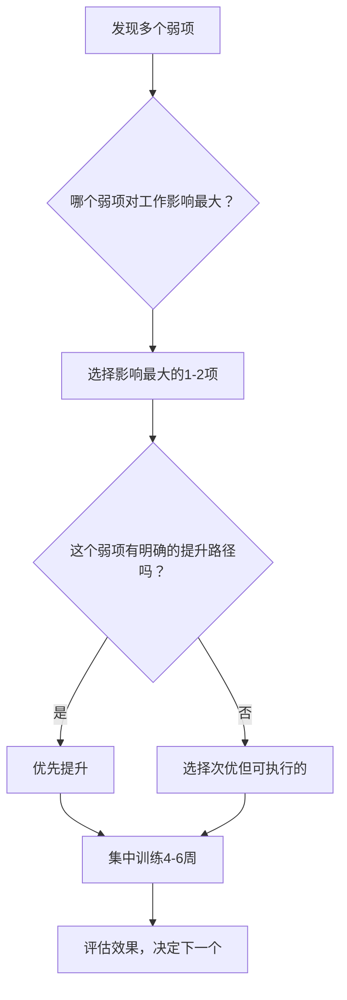
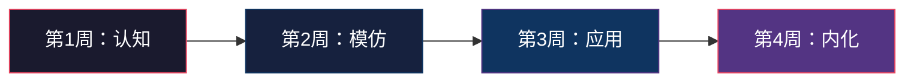

## 沟通能力评估与成长的常见问题

在前几节中，我们系统讲解了沟通能力评估的方法论、实战案例和量化追踪。但实际执行过程中，几乎每个人都会遇到一些困惑和障碍。本节整理了最高频的 20 个问题，按照"评估—计划—执行—突破—长期坚持"五个阶段分类，帮你扫除成长路上的绊脚石。

### 一、评估阶段的常见问题

#### Q1：如何知道自己是否真的在进步？

这是最常见也最关键的问题。没有客观衡量标准，很容易陷入"感觉没进步→丧失信心→放弃"的恶性循环。

**量化指标法**：建立一套可追踪的指标体系，用数据代替感觉。

| 指标类别 | 具体指标 | 追踪方式 | 频率 |
|---------|---------|---------|------|
| 行为指标 | 主动发起重要对话的次数 | 每日记录 | 每日 |
| 行为指标 | 会议中主动发言的次数 | 会议后记录 | 每次会议 |
| 效果指标 | 困难对话的成功率（达成预期结果） | 事后评估 | 每周汇总 |
| 反馈指标 | 同事/上级对沟通表现的评分 | 匿名问卷 | 每月一次 |
| 自评指标 | 沟通舒适度自评（1-10分） | 日志记录 | 每日 |

**对比基准法**：进步不是跟别人比，而是跟过去的自己比。具体操作：

1. 在开始训练的第 1 天，录一段 3 分钟的即兴表达（手机录音即可）
2. 每个月在相同条件下录一段
3. 每季度做一次横向对比，关注以下维度：
   - 逻辑清晰度：听众能否在听完后复述你的核心观点？
   - 语言流畅度：每分钟出现多少次"嗯""那个""就是说"等填充词？
   - 情感感染力：语调是否有起伏，还是平铺直叙？

**他人反馈法**：自评存在盲区，必须引入外部视角。每季度向 3-5 位与你有频繁沟通的人收集反馈，核心问题包括：

- "我最近在沟通上有什么变化？"
- "你觉得我在哪方面有明显进步？"
- "如果只能改进一点，你建议我改进什么？"

> **关键提醒**：进步往往是非线性的。前 4-6 周可能感觉不到明显变化（这是"平台期"），但神经通路正在重塑。坚持到第 8-12 周，通常会迎来一个"突破点"——突然发现自己在某个场景下表现得比以前好很多。

#### Q2：做了一堆测评，结果大同小异，怎么判断哪个更有参考价值？

不同的测评工具测量的是不同维度，不能简单比较。核心区别如下：

| 测评工具 | 测量维度 | 适用场景 | 局限性 |
|---------|---------|---------|--------|
| 360度反馈 | 他人对你沟通行为的感知 | 职场沟通能力评估 | 依赖评估人的主观判断 |
| DISC | 行为风格偏好 | 了解自己的沟通风格倾向 | 不能衡量沟通效果 |
| MBTI | 认知和决策偏好 | 理解沟通中的心理机制 | 类型容易被误读为固定标签 |
| 情商测评（EQ-i） | 情绪管理与社交能力 | 评估共情和情绪调节能力 | 文化偏差 |
| 沟通能力自评量表 | 主观自评 | 快速建立基准线 | 存在自我美化倾向 |

**实操建议**：不要一次做太多测评。正确的顺序是：

1. 先做一次全面自评（建立基准线）
2. 做一次 360度反馈（校准自评偏差）
3. 根据发现的主要短板，选择 1 个专项测评深入诊断
4. 每半年重复一次，对比变化

#### Q3：360度反馈收集不到真实反馈怎么办？

这是一个极其常见的困境。你问同事"我沟通有什么问题"，对方通常会说"挺好的""没什么问题"。这不是因为你真的没有问题，而是因为大多数人不愿意直接指出他人的问题。

**解决策略**：

**策略一：改变提问方式**

避免问"我有什么问题"这种开放式问题，改为结构化的行为描述：

- 不要问："我的表达清楚吗？"
- 要问："上次项目汇报中，你能复述出我提到的三个关键结论吗？"
- 不要问："我沟通有什么问题？"
- 要问："如果用1-10分评价我在上次跨部门会议中的倾听表现，你打几分？扣分的原因是什么？"

**策略二：创建安全的反馈环境**

- 匿名收集：使用在线问卷工具，让反馈者知道答案是匿名的
- 先自我暴露：主动分享自己发现的不足，降低对方的顾虑
- 选择信任度高的对象：先从关系好的同事开始，建立反馈习惯
- 表达感谢：收到任何反馈后，真心感谢并在下次沟通中展现变化

**策略三：观察行为信号**

如果语言反馈获取困难，观察非语言信号：

- 开会时别人是否经常打断你？（可能是表达冗长的信号）
- 你发的邮件是否经常需要追问才能得到回复？（可能是信息不清晰）
- 别人是否经常误解你的意思？（可能是表达逻辑有问题）
- 在你说话时，别人是否频繁看手机？（可能是缺乏吸引力）

#### Q4：测评结果显示我在多个维度都很弱，应该先提升哪个？

这是一个优先级排序问题。同时提升所有维度是最常见的错误——精力分散导致哪个都提升不明显，最终丧失信心。

**优先级排序原则**：

**具体判断标准**：

- **高频使用** 优先于 低频使用：每天都要用的技能比偶尔用的更值得优先提升
- **可改变性高** 优先于 低：例如"结构化表达"比"声音音色"更容易通过训练改善
- **杠杆效应大** 优先于 小：提升后能带动其他能力提升的优先（如倾听能力提升后，共情、理解、回应都会改善）

> **推荐起始点**：如果不知道从哪里开始，优先提升**倾听能力**。倾听是所有沟通能力的基座——听清楚了才能回应准确，理解对方了才能共情到位，消化信息了才能表达清晰。而且倾听能力的提升相对容易感知，能快速建立信心。

---

### 二、计划阶段的常见问题

#### Q5：提升沟通能力需要多长时间？

根据 Anders Ericsson 的刻意练习理论和大量实践经验，沟通能力的提升遵循以下时间框架：

| 阶段 | 时间跨度 | 预期变化 | 关键任务 |
|------|---------|---------|---------|
| 习惯建立期 | 第 1-4 周 | 建立日常练习习惯，意识觉醒 | 每日记录沟通日志，开始结构化练习 |
| 初步改善期 | 第 5-12 周 | 在特定场景下表现改善 | 针对 1-2 个弱项集中练习 |
| 能力稳定期 | 第 4-6 个月 | 新行为模式稳定，不需要刻意提醒 | 扩展到更多场景，开始内化 |
| 风格形成期 | 第 7-12 个月 | 形成个人沟通风格 | 在多种场景中灵活运用 |
| 持续精进期 | 1 年以上 | 不断突破新瓶颈 | 高阶技巧学习，跨场景迁移 |

**重要认知**：这不意味着你需要等 12 个月才能看到效果。很多练习的效果是即时的——比如学会 PREP 表达法（Point-Reason-Example-Point），下次开会就能用上，效果立竿见影。但要让这种能力成为本能反应，需要反复练习直到内化。

#### Q6：怎么制定一个不会半途而废的提升计划？

80% 的自我提升计划在 3 周内放弃。根本原因不是意志力不够，而是计划设计有缺陷。

**让计划坚持下去的五个设计原则**：

**原则一：从"小到不可能失败"开始**

- 不要说"每天练习30分钟演讲"
- 要说"每天在一次对话中刻意使用结构化表达"
- 起始量控制在 5-10 分钟以内

**原则二：绑定已有习惯（习惯叠加）**

公式：当 [已有习惯] 之后，我就 [新习惯]

例如：
- 当我每天坐到工位之后，我就回顾昨天的一次沟通并写下反思
- 当我每次开完会之后，我就用30秒评估自己的发言质量
- 当我每天睡前刷手机之前，我就记录今天最好的一次沟通

**原则三：降低环境摩擦力**

- 把沟通日志模板放在桌面最显眼的位置（实体或电子）
- 手机首页放录音 App，方便随时录下即兴表达练习
- 把练习融入工作场景，而不是额外安排时间

**原则四：设置里程碑奖励**

| 里程碑 | 奖励建议 |
|--------|---------|
| 连续记录 7 天沟通日志 | 买一本一直想看的书 |
| 完成第一轮 360 度反馈收集 | 请自己吃一顿好的 |
| 在一次重要会议中成功运用新技巧 | 买一件小装备 |
| 连续练习 90 天 | 更大的自我奖励 |

**原则五：预设"破戒恢复方案"**

计划中断是必然的，不是失败。关键是中断后如何恢复：

- 如果中断 1 天：正常，无需自责，第二天继续
- 如果中断 3 天：立刻降低练习强度（从 15 分钟降到 5 分钟），先恢复节奏
- 如果中断 1 周：不回顾错过的天数，从今天重新开始，降低难度
- 如果中断 1 个月：重新评估计划是否太大，简化后重新启动

#### Q7：每天工作已经很忙了，真的有时间做沟通训练吗？

这个问题的背后假设是：沟通训练需要额外时间。事实上，最有效的沟通训练不是"抽出时间专门练"，而是"把每次日常沟通变成练习场"。

**零额外时间训练法**：

| 日常场景 | 隐形训练内容 | 所需时间 |
|---------|-------------|---------|
| 早会/站会 | 练习 30 秒结构化表达 | 0 分钟（本来就要发言） |
| 回复同事消息 | 练习清晰简洁的书面表达 | 多花 10 秒思考 |
| 一对一会议 | 练习积极倾听（复述对方观点） | 0 分钟（改变方式即可） |
| 午餐聊天 | 练习提问技巧和共情回应 | 0 分钟（改变方式即可） |
| 通勤路上 | 听沟通类播客或回顾昨日沟通 | 10-15 分钟 |
| 工作汇报 | 练习 PREP 结构化表达 | 多花 2 分钟准备 |

**碎片时间高效利用方案**：

- **2 分钟**：回顾今天的一次沟通，思考"如果重来一次，我会怎么说"
- **5 分钟**：用手机录一段 1 分钟的即兴表达，回听并自我评估
- **10 分钟**：阅读一篇关于沟通技巧的文章或看一段TED演讲片段
- **15 分钟**：写一篇完整的沟通复盘日志

> **核心理念**：沟通训练的投入不是时间量，而是注意力量。你不需要更多时间，你需要的是在已有沟通中多投入一点注意力。

---

### 三、执行阶段的常见问题

#### Q8：学了很多技巧，一到实战就忘怎么办？

"知道"和"做到"之间存在巨大鸿沟，心理学上称之为"知识诅咒"——你以为自己掌握了，但大脑还没形成自动化反应。

**解决方法：单点突破法**

不要试图同时使用多个技巧。每次只聚焦一个技巧，按以下步骤内化：

**第 1 周·认知**：学习这个技巧的原理和步骤，在纸上写下来，贴在工位上。

**第 2 周·模仿**：观察别人如何使用这个技巧，找到 3 个范例（可以是TED演讲视频、同事的优秀表现），分析他们的具体做法。

**第 3 周·应用**：在低风险场景中刻意使用（如日常聊天、非正式会议），每次使用后花 30 秒记录效果。

**第 4 周·内化**：提高使用频率，在更多场景中尝试。如果某个技巧在一个月内用不到 10 次，说明选择的技巧与你的实际场景不匹配，换一个。

**具体的"遗忘急救包"**：

在手机备忘录中建立一个"沟通技巧速查卡"，包含你正在练习的 2-3 个技巧的核心要点，每个技巧不超过 3 行。在重要沟通前 2 分钟快速浏览。

#### Q9：练习了一段时间，效果突然停滞了怎么办？

练习停滞（"平台期"）是所有技能学习的必经阶段，不是你变笨了，而是大脑在整合新的神经通路。

**平台期的科学解释**：

人的学习曲线不是直线上升的，而是阶梯式的——快速进步 → 停滞 → 突破 → 再快速进步 → 再停滞。停滞期通常出现在练习的第 3-4 周和第 8-10 周，这正是旧习惯被打破、新习惯尚未形成的关键时刻。

**突破平台期的四种策略**：

**策略一：改变练习变量**

如果你一直在练习结构化表达，但效果停滞，尝试改变练习条件：

- 改变场景：从书面练习转为口头，从一对一转为一对多
- 改变难度：增加时间压力（从 3 分钟准备缩到 1 分钟）
- 改变内容：换一个你不熟悉的主题来练习

**策略二：引入新的反馈源**

之前的反馈来源可能已经"审美疲劳"或无法发现新的问题。引入新的观察者：

- 请一位你不常合作的同事观察你的会议表现
- 录视频回看自己的肢体语言和表情
- 参加新的社群活动（如Toastmasters），获取全新视角

**策略三：回炉基础**

平台期有时是因为基础不牢。退回去检查：

- 你的倾听习惯是否扎实？很多时候"表达"停滞是因为"输入"不够
- 你的心理状态是否健康？焦虑和疲劳会显著影响沟通表现
- 你的练习频率是否下降？日常练习量的减少往往导致平台期

**策略四：设定"微突破"目标**

不要盯着"成为优秀的沟通者"这种大目标，设定一个具体的、可在一个周末内完成的微目标：

- "这个周末，在家庭聚餐中主动引导一次 10 分钟的深度对话"
- "明天的周会，用金字塔结构汇报工作"
- "今天下午的 1 对 1，全程不打断对方说话"

#### Q10：年龄大了还能提升沟通能力吗？

这个问题背后隐藏的是固定型思维："我的沟通能力是天生的/定型的"。答案是：**当然可以，而且年龄大反而有独特优势**。

**年龄带来的沟通优势**：

- **共情能力更强**：神经科学研究表明，人的共情能力在 40-60 岁达到峰值。你经历过的困难、挫折和痛苦，都是共情的素材库
- **情绪调节更好**：随着年龄增长，前额叶皮层的成熟度更高，意味着你在高压沟通场景中更容易保持冷静
- **社交经验更丰富**：你已经处理过各种类型的社交场景，这些经验可以被有意识地提炼和优化
- **可信度更高**：研究表明，人们倾向于认为年长者的话语更有分量

**不同年龄段的提升策略**：

| 年龄段 | 优势 | 挑战 | 推荐策略 |
|--------|------|------|---------|
| 20-30岁 | 学习能力强，可塑性高 | 经验不足，容易紧张 | 大量实践，多参加社交和公开表达 |
| 30-40岁 | 有一定职场经验，更了解自己 | 工作忙，时间紧 | 融入工作场景的零散练习 |
| 40-50岁 | 共情力强，情绪稳定 | 习惯固化，改变阻力大 | 从"微调"开始，不追求大变革 |
| 50岁以上 | 经验丰富，人格魅力 | 担心"学不会新东西" | 发挥优势，专注深度而非广度 |

#### Q11：内向的人也能成为优秀的沟通者吗？

这是一个极其普遍的误解。内向不等于不善沟通，外向不等于善于沟通。内向和外向的本质区别是能量来源不同，不是沟通能力的高低。

**内向者的沟通优势**：

- **深度思考**：内向者在表达前会经过更充分的思考，说出来的话通常更有深度
- **善于倾听**：内向者天然更关注对方而非自己，这是高质量沟通的核心能力
- **观察力强**：内向者更容易捕捉到非语言信号和微妙的情绪变化
- **深度关系**：内向者虽然社交圈较小，但关系质量通常更高
- **书面表达**：内向者在书面沟通中往往表现出色

**内向者的沟通策略**：

1. **选择适合自己的沟通方式**：不需要强迫自己成为"社交达人"。一对一深度交流、书面沟通、有准备的演讲，都是有效沟通
2. **管理社交能量**：重要沟通安排在精力充沛的时段。会议前后给自己独处时间充电
3. **提前准备**：内向者在有准备的情况下表现更好。重要会议前，提前列出你想表达的 2-3 个要点
4. **利用倾听优势**：先深度倾听，再精准回应。内向者的"少说多听"在很多场景下是优势而非劣势
5. **设定合理的社交目标**：不需要像外向者那样频繁社交。每周 2-3 次高质量的深度交流，远比每天的浅层寒暄更有价值

> **案例**：苏珊·凯恩（Susan Cain）在《安静：内向性格的竞争力》中指出，世界上约 30%-50% 的人是内向者。很多杰出的沟通者——包括奥巴马、比尔·盖茨、沃伦·巴菲特——都是内向者。他们不是"克服"了内向，而是找到了适合自己的沟通方式。

---

### 四、突破阶段的常见问题

#### Q12：如何克服在重要场合的紧张和焦虑？

沟通紧张不是性格缺陷，而是一种正常的生理反应——你的身体进入了"战斗或逃跑"模式。完全消除紧张既不现实也不必要（适度紧张反而能提升表现）。关键在于将紧张控制在可管理的范围内。

**即时应对技巧（紧张发生时）**：

| 技巧 | 操作方法 | 生理原理 |
|------|---------|---------|
| 4-7-8 呼吸法 | 吸气 4 秒，屏气 7 秒，呼气 8 秒，重复 3 次 | 激活副交感神经，降低心率 |
| 渐进式肌肉放松 | 从脚到头，依次紧绷再放松各肌肉群 | 释放肌肉紧张，打破焦虑循环 |
| 接地技术 | 说出 5 样看到的、4 样摸到的、3 样听到的 | 将注意力从焦虑转移到当下 |
| 重新标签 | 将"我很紧张"重新定义为"我很兴奋" | 紧张和兴奋的生理反应几乎相同 |

**长期训练方案（从根源降低紧张）**：

1. **阶梯式暴露训练**：从低压力场景开始，逐步升级
   - 第 1-2 周：在镜子前练习表达
   - 第 3-4 周：录视频给自己看
   - 第 5-6 周：在 1-2 位信任的朋友面前练习
   - 第 7-8 周：在小型团队会议中主动发言
   - 第 9-12 周：在更大的场合中表达

2. **认知重构**：改变对紧张场景的认知
   - "所有人都在评判我" → "大多数人希望我讲好"
   - "我可能会出错" → "出错也没关系，我可以纠正"
   - "我必须完美" → "我只需要传达核心信息"

3. **充分准备**：紧张的一大来源是"未知感"。准备越充分，未知越少
   - 熟悉场地和设备
   - 准备好开场白（前 30 秒最紧张）
   - 预演可能的提问和突发情况

#### Q13：如何在冲突中保持有效沟通？

冲突场景是沟通能力的"高考"——在情绪高涨时保持冷静和有效表达，是最具挑战性的沟通能力。

**冲突沟通的 HEAR 模型**：

| 步骤 | 含义 | 具体做法 | 示例 |
|------|------|---------|------|
| H - Halt（暂停） | 感到情绪激动时，先暂停 | 深呼吸 3 秒，放下防御姿态 | "让我想一下你刚才说的..." |
| E - Empathize（共情） | 先理解对方的感受和立场 | 复述对方的核心观点和感受 | "我理解你觉得这个方案有风险..." |
| A - Assert（表达） | 清晰表达自己的立场 | 用"我"开头，描述事实和感受 | "我看到的是...我感到担心因为..." |
| R - Resolve（解决） | 引导对话走向解决方案 | 提出具体建议，寻求共识 | "我们能不能试试...你看怎么样？" |

**冲突中的致命错误**：

- **人身攻击**："你总是这样" → 只讨论行为，不评价人格
- **翻旧账**："上次你也是..." → 聚焦当前问题
- **绝对化用语**："你从来不""你永远都" → 用具体事实替代
- **冷暴力**：沉默对抗 → 即使需要冷静期，也明确告知"我需要 10 分钟冷静一下"

#### Q14：跨文化/跨代际沟通有什么特别的注意事项？

**跨文化沟通的关键差异**：

| 维度 | 高语境文化（中日韩等） | 低语境文化（美德澳等） |
|------|---------------------|---------------------|
| 信息传递 | 隐含在上下文中，需要"读空气" | 直接明确表达，不需要猜测 |
| 拒绝方式 | "我再考虑一下""可能有点困难" | "No, that won't work" |
| 反馈方式 | 先肯定再建议，语气委婉 | 直接指出问题，就事论事 |
| 决策过程 | 注重关系和面子 | 注重效率和逻辑 |
| 时间观念 | 灵活，关系优先 | 严格，日程优先 |

**跨代际沟通的差异与融合**：

- 与年长者沟通：尊重经验，多请教而非质疑，书面沟通偏向正式
- 与同龄人沟通：相对随意，可以直入主题
- 与年轻者沟通：平等对话，避免居高临下的说教语气，接受新的表达方式

---

### 五、长期坚持的常见问题

#### Q15：提升到什么程度才算"够用"？

这取决于你的具体目标。不需要在所有场景中都成为沟通高手。

**分层目标设定**：

| 目标层级 | 描述 | 适用人群 |
|---------|------|---------|
| 基础级 | 能清晰表达自己的想法，日常沟通无障碍 | 所有职场人士 |
| 进阶级 | 能在复杂场景中有效沟通（冲突、谈判、演讲） | 中层管理者、客户经理 |
| 专业级 | 能通过沟通影响他人决策，建立个人影响力 | 高管、培训师、销售人员 |
| 大师级 | 能在任何场景中自如沟通，形成独特个人风格 | 沟通教练、公众人物 |

**实用检验标准**：问自己以下问题，如果多数答案是"是"，说明你的沟通能力已经"够用"：

- 你的想法是否经常被误解？（如果很少被误解，说明表达清晰）
- 你能否在 3 分钟内让陌生人理解你的专业领域？（如果能，说明有结构化表达能力）
- 与你意见不同的人，在跟你讨论后是否愿意继续对话？（如果是，说明你尊重差异）
- 你能否在冲突中保持冷静并找到解决方案？（如果能，说明有情绪管理能力）
- 别人是否愿意主动找你沟通重要的事情？（如果是，说明你建立了信任）

#### Q16：如何避免"学了就忘"？

遗忘是正常的。德国心理学家赫尔曼·艾宾浩斯的遗忘曲线表明，新知识如果不复习，1 周后会忘记 77%。但对抗遗忘有明确的方法。

**知识固化四步法**：

1. **学后 24 小时内使用**：学到新技巧后，必须在 24 小时内找到机会使用至少一次。哪怕是在跟朋友聊天时用上，也比不使用强
2. **7 天内重复 3 次**：一个技巧在 7 天内使用 3 次，就能将遗忘率降低到 20% 以下
3. **教会别人**：将学到的内容用自己的话讲给别人听。教学是最高效率的学习方式
4. **定期回顾**：每月花 30 分钟回顾本月学到的技巧和使用情况，标记哪些已经内化、哪些需要继续练习

**建立个人"沟通知识库"**：

使用笔记工具（Notion、Obsidian、甚至手机备忘录）建立以下分类：

沟通知识库
├── 技巧卡片（每个技巧一页，包含：要点、适用场景、示例）
├── 复盘日志（每日记录一次关键沟通的复盘）
├── 反馈记录（收集到的反馈和改进行动）
├── 金句收藏（好的表达方式、精彩的话术）
└── 案例库（自己的成功和失败案例）

#### Q17：一个人练习太孤独了，怎么找到练习伙伴？

沟通能力的提升本质上是社交能力的提升，独自练习有明显天花板。

**寻找练习伙伴的五个渠道**：

1. **Toastmasters International**：全球最大的演讲和领导力练习社群，在中国有数百个分会。每周聚会 1-2 次，包含即兴演讲、备稿演讲和评估反馈。这是最成熟的沟通练习平台，强烈推荐
2. **公司内部练习小组**：找 3-5 位志同道合的同事，每周午餐时间进行 30 分钟的沟通练习（如即兴表达、案例讨论、角色扮演）
3. **线上社群**：豆瓣、知乎、小红书上有很多沟通练习小组。有些会组织线上演讲、读书分享等活动
4. **一对一练习伙伴**：找一位处于类似成长阶段的朋友，约定每周互相反馈
5. **沟通教练/导师**：如果预算允许，专业教练能提供最精准的反馈和指导

#### Q18：如何在不引起他人注意的情况下"悄悄"提升沟通能力？

有些人不想让别人知道自己在"刻意"提升沟通能力，担心显得刻意或尴尬。这完全可以做到，因为大多数沟通提升方法是"隐形"的。

**隐形提升方法**：

- **改变倾听方式**：不需要任何人知道，你只需要在对话中更专注地听，更多地使用复述和确认——对方只会觉得"跟你聊天很舒服"，不会觉得你在"练技巧"
- **优化书面表达**：邮件、消息、文档的写作质量提升，完全是幕后操作
- **观察学习**：观察优秀沟通者的做法（开会时留意领导如何处理冲突），不需要任何人知道
- **自我复盘**：每天花 5 分钟在心里回顾今天的沟通表现，完全是内心的功课
- **阅读学习**：在手机上看沟通类文章或书籍，跟看新闻没有任何区别

> 事实上，当你的沟通方式悄悄改变后，大多数人只会觉得"你最近好像变了"，但不会知道你做了什么。这正是最好的结果——他们只感受到了效果，没有感受到你的刻意。

#### Q19：经济条件有限，有没有免费或低成本的提升方案？

沟通能力的提升不需要昂贵的课程或工具。以下方案要么免费，要么成本极低：

| 方案 | 成本 | 效果 | 说明 |
|------|------|------|------|
| Toastmasters | 会费约 500-1000 元/半年 | ⭐⭐⭐⭐⭐ | 性价比最高的系统训练方案 |
| 录音/录像自评 | 免费 | ⭐⭐⭐⭐ | 用手机即可，效果出乎意料 |
| 沟通日志 | 免费 | ⭐⭐⭐⭐ | 纸笔或手机备忘录即可 |
| 360度反馈（自行收集） | 免费 | ⭐⭐⭐⭐ | 用微信/问卷星自制问卷 |
| TED/播客学习 | 免费 | ⭐⭐⭐ | 大量优质免费内容 |
| 镜子练习 | 免费 | ⭐⭐⭐ | 练习表情管理和肢体语言 |
| 公园即兴演讲 | 免费 | ⭐⭐⭐ | 找人少的地方大声练习 |
| 图书馆借书 | 免费 | ⭐⭐⭐ | 经典沟通书籍随时可借 |

**推荐的免费学习资源**：

- **播客**：《得到·沟通训练营》试听、《TED Talks Daily》、《沟通的艺术》系列
- **视频**：TED 演讲（官网免费）、B站上的沟通技巧类 UP 主
- **书籍**：《非暴力沟通》《关键对话》《沟通的艺术》—— 图书馆均可借到
- **App**：Speechify（练习语速）、Otter.ai（语音转文字，分析自己的表达）

#### Q20：怎么判断自己是否需要找专业教练？

不是所有人都需要专业教练。以下自测清单帮你判断：

**需要教练的信号**（满足 3 项以上建议找教练）：

- [ ] 已经自我练习 3 个月以上但没有明显进步
- [ ] 面临特定的职业挑战（如晋升答辩、重要演讲、客户谈判）
- [ ] 有明确的沟通"顽疾"（如严重的演讲焦虑、冲突回避）
- [ ] 周围没有能给出专业反馈的人
- [ ] 需要在短时间内（1-3个月）快速提升
- [ ] 已经尝试了各种自助方法但效果不佳

**不需要教练的情况**：

- 刚开始学习，还在探索阶段（先自学 2-3 个月）
- 只是想了解沟通知识，没有强烈的提升需求
- 有 Toastmasters 或公司内部的高质量练习资源
- 预算有限（先用免费方案，等有明确瓶颈再找教练）

**选择教练的标准**：

1. **有认证资质**：ICF（国际教练联合会）认证是行业标准
2. **有相关经验**：了解你所在的行业和场景
3. **方法论清晰**：能说清楚他的训练体系和评估方法
4. **提供试课**：大多数专业教练提供 1 次免费试课
5. **可衡量成果**：能承诺可追踪的改善指标

---

### 六、特殊场景的常见问题

#### Q21：远程/线上沟通能力如何评估和提升？

远程工作环境下，沟通的评估和训练方式需要调整。

**线上沟通的独特挑战**：

- 非语言信号大量缺失（只能看到上半身，肢体语言受限）
- 互动节奏变化（网络延迟、轮流发言困难）
- 注意力更易分散（多屏幕、消息通知）
- 信任建立更难（缺少面对面的温度）

**线上沟通能力评估维度**：

| 评估维度 | 具体指标 | 评估方式 |
|---------|---------|---------|
| 文字沟通 | 消息/邮件的清晰度、完整度 | 抽查 10 条消息，请同事评分 |
| 视频会议 | 发言的结构化程度、互动质量 | 会议后自我评估 + 同事反馈 |
| 异步协作 | 文档/任务描述的完整度 | 检查是否有补充说明的追问 |
| 情感传递 | 线上沟通中是否传递了温度 | 匿名反馈收集 |

**线上沟通提升要点**：

- **文字表达精炼化**：每条消息检查是否包含"做什么、为什么、什么时候、标准是什么"四要素
- **视频会议参与度**：摄像头开启，积极使用文字聊天互动，发言前先说名字
- **异步沟通规范化**：重要信息用结构化格式（如要点清单），避免大段纯文字
- **情感表达有意识化**：缺少面对面交流时，更需要主动表达关心和认可

#### Q22：沟通能力评估结果能否用于职业发展？

完全可以，而且应该这样做。沟通能力是职场中最被低估的核心竞争力。

**沟通能力与职业发展的映射关系**：

| 沟通能力维度 | 对应的职业发展能力 | 可展示的成果 |
|------------|------------------|-------------|
| 结构化表达 | 汇报能力、演示能力 | 会议发言被认可的频率 |
| 倾听与共情 | 团队管理能力 | 下属满意度、团队氛围 |
| 说服与影响 | 跨部门协作、向上管理 | 项目推动成功率 |
| 冲突处理 | 领导力 | 团队冲突解决案例 |
| 跨文化沟通 | 国际化能力 | 海外项目参与经验 |

**如何在绩效评估中展示沟通成长**：

1. 用数据说话："本季度跨部门协作评分从 3.2 提升到 4.1"
2. 用案例说话："在 X 项目中，通过改善需求沟通方式，减少了 3 轮返工"
3. 用他人反馈说话："360度反馈中，同事对我的沟通满意度提升了 25%"
4. 用对比说话："相比半年前，我现在能在更短的时间内达成会议共识"

---

### 快速参考：问题与解决方案速查表

| 阶段 | 核心问题 | 一句话解答 |
|------|---------|-----------|
| 评估 | 如何知道在进步？ | 建立量化指标 + 定期 360度反馈 + 对比录音 |
| 评估 | 测评太多不知看哪个？ | 先做自评 → 再做 360反馈 → 根据短板选专项测评 |
| 评估 | 收集不到真实反馈？ | 改变提问方式（具体行为描述）+ 匿名收集 |
| 评估 | 多个弱项先练哪个？ | 高频 + 可改变 + 杠杆效应大 → 优先练倾听 |
| 计划 | 需要多长时间？ | 1-3月建习惯，3-6月见效果，6-12月成风格 |
| 计划 | 计划总是坚持不了？ | 从小到不可能失败 + 绑定已有习惯 + 降低摩擦力 |
| 计划 | 太忙没时间练？ | 把每次日常沟通变成练习场，零额外时间 |
| 执行 | 学了就忘怎么办？ | 单点突破法：认知→模仿→应用→内化，每步 1 周 |
| 执行 | 进入平台期怎么办？ | 改变练习变量 + 引入新反馈源 + 回炉基础 |
| 执行 | 年龄大了还能提升吗？ | 当然可以，共情力和经验是年龄的礼物 |
| 执行 | 内向能成为好沟通者吗？ | 内向是优势不是劣势，关键是找到适合自己的方式 |
| 突破 | 重要场合紧张怎么办？ | 4-7-8呼吸法 + 阶梯式暴露训练 + 认知重构 |
| 突破 | 冲突中如何保持有效？ | HEAR模型：暂停→共情→表达→解决 |
| 突破 | 跨文化/跨代际沟通？ | 高语境读空气 vs 低语境直接表达；尊重+平等 |
| 坚持 | 提升到什么程度够用？ | 想法不被误解 + 3分钟让人理解 + 冲突中冷静 |
| 坚持 | 怎么防止遗忘？ | 学后24h内使用 + 7天内重复3次 + 教会别人 |
| 坚持 | 太孤独了怎么办？ | Toastmasters + 同事练习小组 + 一对一伙伴 |
| 坚持 | 不想被发现"在练"？ | 改变倾听方式、优化书面表达、自我复盘——全是隐形的 |
| 坚持 | 没预算怎么办？ | Toastmasters + 录音自评 + 沟通日志 + 免费资源 |
| 坚持 | 需要找教练吗？ | 自学3月无进步 + 有明确职业挑战 → 建议找 |
| 特殊 | 线上沟通怎么练？ | 文字精炼化 + 视频参与度 + 异步规范化 |
| 特殊 | 评估结果能用于职业发展？ | 用数据+案例+他人反馈展示沟通成长 |

***

> **最后的忠告**：沟通能力的提升不是一场考试，没有"及格线"和"满分"。它是一段持续终身的旅程。每多一次有意识的练习，每多一次真诚的反馈，每多一次失败后的复盘，你都在向前走一小步。这些小步积累起来，就是巨大的蜕变。不要追求完美，追求进步就好。
