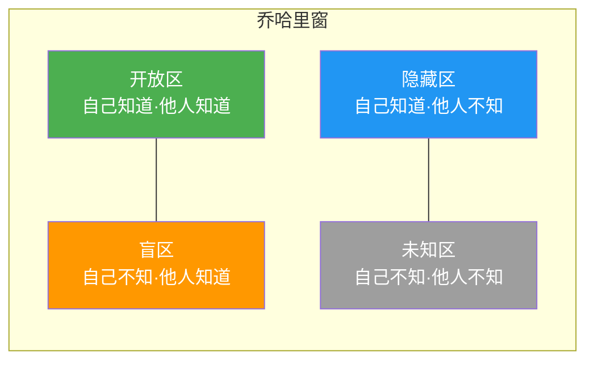
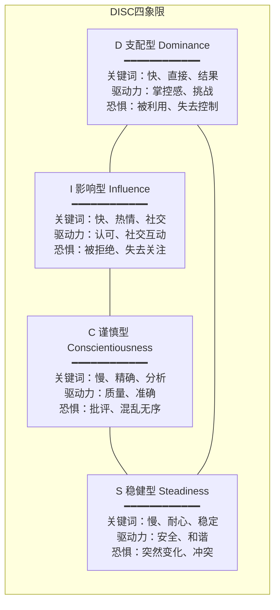
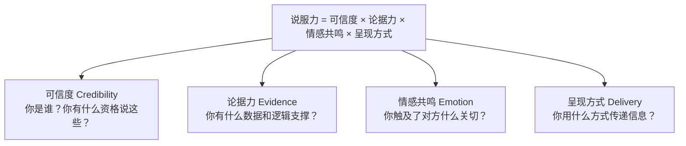
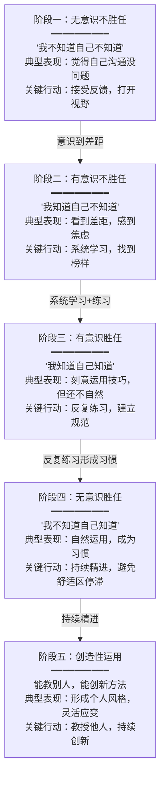
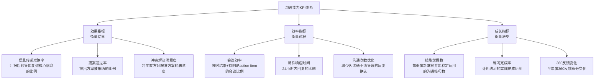

# 沟通能力评估与成长的实用方法

> 不经评估的能力提升是盲目的，不经练习的评估是空洞的。沟通能力的真正成长，需要"评估—规划—练习—反馈—迭代"的完整闭环。

本章提供一套从测评到精通的完整工具箱。无论你是刚意识到沟通需要提升的初学者，还是希望突破瓶颈的资深职场人，都能在这里找到可落地的方法和工具。

## 一、为什么需要系统评估沟通能力

大多数人高估自己的沟通水平。心理学中的"邓宁-克鲁格效应"（Dunning-Kruger Effect）指出：能力不足的人往往最缺乏自我评估的元认知能力。康奈尔大学的研究表明，约65%的人认为自己的沟通能力高于平均水平——这在统计学上是不可能的。

### 1.1 主观感受 vs 客观能力的鸿沟

| 维度 | 主观感受（常见错觉） | 客观事实（研究数据） |
|------|---------------------|---------------------|
| 表达清晰度 | "我说得很清楚了" | MIT研究：听众平均只能记住演讲者30%的核心信息 |
| 倾听能力 | "我在认真听" | 人们平均只用25%的注意力倾听，其余在思考如何回应 |
| 非语言沟通 | "我的肢体语言没问题" | UCLA的梅拉比安法则：55%的信息通过肢体语言传递，多数人对此无意识 |
| 冲突处理 | "我处理得不错" | CPP Global调查：职场人每周平均花2.8小时处理冲突，其中大部分处理方式低效 |

### 1.2 系统评估的三个核心价值

**第一，建立基线（Baseline）。** 没有起点数据，就无法衡量进步。就像体重管理需要先称体重一样，沟通提升需要先知道"我现在在哪里"。

**第二，识别盲点（Blind Spots）。** 自我认知的局限是最大的成长障碍。360度反馈的核心价值不是告诉你已知的优势，而是揭示你从未意识到的短板。心理学家Joseph Luft和Harrington Ingham提出的"乔哈里窗"模型（Johari Window）将自我认知分为四个区域：

系统评估的核心目的就是**缩小盲区**——通过他人反馈，把"别人看得到、你不知道"的行为模式变成你的已知信息。

**第三，指导投入方向。** 沟通能力包含多个子维度，盲目练习效率低下。评估帮助你找到"投入产出比"最高的提升领域——通常是你评分最低但对职业发展影响最大的那个维度。

## 二、五大沟通能力评估工具详解

### 2.1 360度反馈评估

360度反馈（360-Degree Feedback）是目前企业界使用最广泛的领导力与沟通能力评估方法。《财富》500强中约90%的企业采用某种形式的360度评估。其核心原理是：**单一视角的评估永远存在偏差，多源反馈可以相互校正。**

#### 评估维度设计

不是所有沟通子能力都值得评估。根据哥伦比亚商学院Michael Lombardo的研究，以下7个维度对职业发展的影响最大：

| 维度 | 定义 | 权重建议 | 为什么重要 |
|------|------|---------|-----------|
| 表达清晰度 | 将复杂信息转化为易懂语言的能力 | 20% | 影响信息传递效率，是所有沟通的基础 |
| 倾听能力 | 理解他人观点并准确回应的能力 | 15% | 哈佛研究：倾听能力与领导力正相关系数达0.72 |
| 说服影响力 | 用数据和逻辑改变他人观点的能力 | 15% | 直接影响提案通过率和资源获取能力 |
| 冲突处理 | 在分歧中找到建设性解决方案的能力 | 15% | 减少团队内耗，提升协作效率 |
| 跨文化沟通 | 与不同背景的人有效沟通的能力 | 10% | 全球化时代的核心竞争力 |
| 书面沟通 | 通过文字清晰表达的能力 | 10% | 邮件、报告、文档是职场主要沟通载体 |
| 非语言沟通 | 通过肢体语言、语调传递信息的能力 | 10% | 传递55%以上的信息，多数人无意识 |
| 情绪管理 | 在压力下保持理性沟通的能力 | 5% | 情绪失控瞬间可以毁掉长期积累的信任 |

#### 完整实施流程

**第一步：确定评估人（Rater Selection）**

选人比问卷设计更重要。根据Gartner的研究，评估人的质量直接决定反馈的有效性。

评估人选择标准：
━━━━━━━━━━━━━━━━━━━━━━━━━━━━━━━━━━━━━━━━━━━━━━━━━━
必选角色：
  ├── 直接上级（1-2人）：观察你的工作产出和沟通效果
  ├── 平级同事（3-5人）：日常协作中的沟通体验
  └── 自我评估（1人）：自我认知的参照基准

可选角色（视岗位性质）：
  ├── 直接下属（2-3人）：管理沟通和向下传达的效果
  ├── 跨部门同事（1-2人）：跨团队沟通能力
  └── 客户/合作伙伴（1-2人）：外部沟通能力

排除原则：
  ✗ 不选与你有直接利益冲突的人
  ✗ 不选共事不满3个月的人（观察不够充分）
  ✗ 不选只说好话的"老好人"（反馈无价值）
━━━━━━━━━━━━━━━━━━━━━━━━━━━━━━━━━━━━━━━━━━━━━━━━━━

**第二步：设计评估问卷**

问卷设计的核心原则是**行为化描述**——不要问"他的沟通能力如何？"，而要问"他能否在5分钟内解释清楚一个复杂的技术方案？"。行为化描述能将主观判断转化为可观察、可评分的具体行为。

360度反馈问卷（完整版）
━━━━━━━━━━━━━━━━━━━━━━━━━━━━━━━━━━━━━━━━━━━━━━━━━━

评分标准：1=几乎不  2=偶尔  3=有时  4=经常  5=几乎总是

【表达清晰度】
Q1: 能用简洁的语言解释复杂概念                    [  ]
    → 行为锚点：能让非技术人员理解技术方案的核心逻辑
Q2: 演讲/汇报时逻辑清晰、层次分明                  [  ]
    → 行为锚点：听众能在演讲结束后复述3个以上关键要点
Q3: 书面表达准确、无歧义                           [  ]
    → 行为锚点：邮件/文档发出后很少需要二次解释
Q4: 能根据受众调整表达方式                          [  ]
    → 行为锚点：对技术人员和对管理层讲同一件事，用不同的语言

【倾听能力】
Q5: 在对话中不打断他人，让对方完整表达              [  ]
    → 行为锚点：能在对方说完前克制住插话的冲动
Q6: 能准确复述他人的核心观点                        [  ]
    → 行为锚点：用自己的话转述对方观点，对方确认"对，就是这个意思"
Q7: 能识别他人话语背后的情绪和未说出的需求          [  ]
    → 行为锚点：当同事说"这个方案还行"时，能听出其中的保留意见
Q8: 提问精准，能引导对话深入                        [  ]
    → 行为锚点：提出的问题能帮助对方厘清思路而非打乱对方

【说服影响力】
Q9: 能用数据和案例支持自己的观点                    [  ]
    → 行为锚点：提案时引用具体数字而非"我觉得""大概"
Q10: 能识别对方的核心关切并针对性回应               [  ]
    → 行为锚点：不是重复自己想说的，而是解决对方真正担心的
Q11: 在讨论中能有效影响他人决策                     [  ]
    → 行为锚点：过去3个月至少有1次成功说服团队改变方向

【冲突处理】
Q12: 在意见分歧时能保持冷静和专业                   [  ]
    → 行为锚点：对方情绪激动时自己不被带入
Q13: 能找到双方都能接受的解决方案                   [  ]
    → 行为锚点：解决过的冲突没有留下长期积怨
Q14: 能区分"对事"和"对人"，批评不针对个人           [  ]
    → 行为锚点：批评具体行为而非人格特质

【开放式问题】
Q15: 你认为此人最突出的沟通优势是什么？_______________
Q16: 如果只能改进一个沟通方面，你建议是什么？___________
Q17: 请描述一次此人的出色/糟糕的沟通场景：______________

━━━━━━━━━━━━━━━━━━━━━━━━━━━━━━━━━━━━━━━━━━━━━━━━━━

**第三步：数据分析与解读**

收集数据后，重点分析三个差异：

1. **自评与他评的差距。** 自评高于他评=过度自信领域；自评低于他评=隐藏优势。
2. **不同评估人之间的差距。** 上级评分高但同事评分低=可能"向上管理"做得好但平级协作有问题。
3. **同一维度内不同行为的差距。** 某些Q高分但某些Q低分=该维度内部不均衡。

结果解读矩阵：
━━━━━━━━━━━━━━━━━━━━━━━━━━━━━━━━━━━━━━━━━━━━━━━━━━

            自评高于他评          自评等于他评          自评低于他评
           ┌─────────────┐    ┌─────────────┐    ┌─────────────┐
  高分     │ 隐藏的优势   │    │  真实的优势  │    │ 谦虚的强者  │
 (4-5分)   │ 适当展示     │    │  持续保持    │    │ 更自信些    │
           └─────────────┘    └─────────────┘    └─────────────┘
           ┌─────────────┐    ┌─────────────┐    ┌─────────────┐
  中等     │ 有提升空间   │    │  正常水平    │    │ 自我要求高  │
 (3-3.9分) │ 重点改进     │    │  选择性提升  │    │ 不必苛求    │
           └─────────────┘    └─────────────┘    └─────────────┘
           ┌─────────────┐    ┌─────────────┐    ┌─────────────┐
  低分     │ ⚠ 最需关注   │    │  紧急改进    │    │ 有自知之明  │
 (1-2.9分) │ 盲点领域     │    │  刻意练习    │    │ 先建立信心  │
           └─────────────┘    └─────────────┘    └─────────────┘

━━━━━━━━━━━━━━━━━━━━━━━━━━━━━━━━━━━━━━━━━━━━━━━━━━

#### 案例：张经理的360度评估

张明是某互联网公司的技术经理，自认为沟通能力"至少中上"。360度评估结果令他意外：

- **表达清晰度**：自评4.5，上级评4.0，同事评3.2，下属评2.8
- **倾听能力**：自评4.0，同事评3.5，下属评2.5

开放式反馈中最集中的描述是："讲技术方案时太快太深，非技术人员跟不上"和"开会时经常在别人说完之前就给出结论"。

张明基于评估制定了3个月改进计划：每次技术分享前用"小白测试"（找一个非技术朋友听一遍，看能否理解）；开会时强制自己在对方说完后默数3秒再回应。3个月后复评，表达清晰度的同事评分从3.2提升到3.8，下属评分从2.8提升到3.5。

### 2.2 DISC沟通风格评估

DISC模型由心理学家William Moulton Marston于1928年提出，至今仍是全球使用最广泛的行为风格评估工具之一。它将人的行为倾向分为四个维度：

#### DISC自评实测（12题快速版）

以下12题帮你快速定位自己的DISC类型。每题选一个**最像你**的选项（不是你想成为的样子）：

Q1. 开会时我通常：
    A. 主动推动议程，催促做决定              → D
    B. 活跃气氛，分享故事和想法              → I
    C. 安静倾听，需要时才发言                → S
    D. 提出数据和风险点                      → C

Q2. 接到紧急任务时我的第一反应是：
    A. 立刻行动，边做边调整                  → D
    B. 先找人讨论，集思广益                  → I
    C. 确认清楚要求再开始                    → S
    D. 列出计划和检查清单再动手              → C

Q3. 处理冲突时我倾向于：
    A. 正面交锋，把问题摊开说                → D
    B. 用幽默或转移话题化解                  → I
    C. 妥协退让，维护关系                    → S
    D. 用事实和规则说话                      → C

Q4. 别人评价我最多的是：
    A. "执行力强"                           → D
    B. "有感染力"                           → I
    C. "靠谱稳定"                           → S
    D. "专业严谨"                           → C

Q5. 我最不能接受的工作环境是：
    A. 层级森严、决策缓慢                    → D
    B. 沉闷单调、缺乏互动                    → I
    C. 频繁变动、缺乏安全感                  → S
    D. 混乱无序、标准模糊                    → C

Q6. 向领导汇报时我习惯：
    A. 先说结论，再讲关键数据                → D
    B. 先讲背景故事，再引出观点              → I
    C. 按时间线完整陈述                      → S
    D. 准备详尽的数据和分析报告              → C

Q7. 我做决策的方式：
    A. 快速决断，凭直觉和经验                → D
    B. 听取大家意见后决定                    → I
    C. 谨慎权衡，倾向于维持现状              → S
    D. 详细分析利弊后再决定                  → C

Q8. 我最享受的社交场景是：
    A. 高效的商务会议                        → D
    B. 热闹的聚会和团建                      → I
    C. 三五好友的小聚                        → S
    D. 有深度的一对一交流                    → C

Q9. 别人犯错时我倾向于：
    A. 直接指出并要求改正                    → D
    B. 委婉提醒，不当面批评                  → I
    C. 私下沟通，给对方留面子                → S
    D. 拿出规范/标准说明哪里不对             → C

Q10. 我的工作空间通常是：
     A. 功能性为主，不太在意整洁             → D
     B. 有个人风格，可能有点乱               → I
     C. 整齐温馨，物品固定位置               → S
     D. 分类清楚，每样东西有固定位置         → C

Q11. 面对高风险机会我通常：
     A. 果断抓住，高风险高回报               → D
     B. 感兴趣就尝试，不太怕失败             → I
     C. 观望为主，等别人先试                 → S
     D. 充分研究风险后再决定                 → C

Q12. 我给人的第一印象通常是：
     A. 有气场、做事果断                     → D
     B. 热情开朗、容易亲近                   → I
     C. 温和友善、让人安心                   → S
     D. 沉稳专业、不苟言笑                   → C

**统计方法**：分别数A/B/C/D的数量，数量最多的字母就是你的主导类型。如果两个字母数量接近，说明你是混合型。

#### 针对不同类型的沟通策略

| 与你沟通的人是… | 你该这样做 | 绝对不要做 |
|----------------|-----------|-----------|
| **D型（支配型）** | 先说结论和结果，给选项而非指令，尊重其时间 | 空话铺垫、犹豫不决、过度寒暄 |
| **I型（影响型）** | 先建立情感连接，给予认可和赞美，留出社交时间 | 只谈数据、忽略感受、过于严肃 |
| **S型（稳健型）** | 给充分准备时间，逐步推进变化，强调稳定保障 | 突然改变计划、施加压力、催促决策 |
| **C型（谨慎型）** | 提供详细数据和逻辑，尊重其分析过程，书面沟通为主 | 模糊表达、催促决定、忽略细节 |

#### 案例：跨类型协作

市场部的李薇是典型的I型（热情、爱聊天），技术部的王磊是典型的C型（严谨、重数据）。两人的协作冲突不断——李薇觉得王磊"冷冰冰的，不好合作"，王磊觉得李薇"不靠谱，开会不说正事"。

解决方法：李薇在给王磊发邮件时加入关键数据和时间线（用C型的语言），王磊在开会时先花2分钟聊几句近况（用I型的语言）。两人从"互相看不惯"变成"互补搭档"，项目推进效率提升40%。

### 2.3 MBTI沟通风格分析

MBTI（Myers-Briggs Type Indicator）是全球使用最广泛的人格评估工具，每年约有250万人参加测试。虽然学术界对其信效度存在争议，但作为理解沟通差异的框架，它依然有实用价值。

#### 四个维度对沟通的深层影响

**E（外向）vs I（内向）——能量流向**

这不是"爱不爱说话"的区别，而是**思维能量的来源**不同。E型人通过外部互动整理思路——"让我想想"对他们来说意味着"让我说出来想想"。I型人通过内部思考整理思路——"让我想想"意味着"给我独处的时间"。

| 场景 | E型人的表现 | I型人的表现 |
|------|-----------|-----------|
| 头脑风暴 | 喜欢即兴讨论，在碰撞中产生想法 | 更倾向于先独立思考再分享 |
| 会议发言 | 边想边说，可能话还没想完就开口 | 想清楚了才说，可能错过发言时机 |
| 社交充电 | 会议后精力充沛 | 会议后需要独处恢复 |
| 邮件风格 | 可能打电话更快，邮件写得简短 | 邮件详细周全，不喜欢突然来电 |

**S（感觉）vs N（直觉）——信息过滤器**

这是最容易被忽视但对沟通影响最大的维度。S型人和N型人听同一场报告，记住的东西可能完全不同。

同一场景：产品经理介绍新功能

S型人听到的：
├── 功能A的上线时间是下月15号
├── 需要后端配合的工作量是2周
├── 目前已知的3个技术难点
└── 具体的验收标准有5条

N型人听到的：
├── 这个功能的战略意义是什么
├── 未来可能会演化出什么新场景
├── 和竞品的差异化在哪里
└── 整体的产品愿景方向

与S型人沟通：提供具体数据、时间线、执行步骤。不要只说"我们要提升用户体验"，要说"把页面加载时间从3秒降到1秒以内"。

与N型人沟通：提供愿景、趋势、可能性。不要一上来就淹没在细节里，先给全局画面。

**T（思考）vs F（情感）——决策引擎**

T型人和F型人做决策时调用的"心理程序"不同：

面对一个下属连续迟到的问题：

T型的决策路径：
  数据 → "本月迟到8次，超过团队平均水平" 
  逻辑 → "影响了站会效率和团队纪律"
  行动 → 约谈，明确告知后果

F型的决策路径：
  感受 → "他最近是不是遇到了什么困难？"
  关系 → "直接批评会不会伤害关系？"
  行动 → 先关心近况，再委婉提出

两种方式没有对错之分，但如果不理解对方的决策引擎，就会产生误解：T型觉得F型"感情用事、不专业"，F型觉得T型"冷漠无情、不近人情"。

**J（判断）vs P（感知）——时间管理器**

J型人喜欢"有结论"——每次会议结束前，他们会确认："所以我们接下来的action items是什么？"

P型人喜欢"留空间"——他们会觉得"不用现在把所有事都定死，留点灵活度"。

| 维度 | J型偏好 | P型偏好 |
|------|--------|--------|
| 会议节奏 | 按议程走，严格控时 | 随讨论深入灵活调整 |
| 截止日期 | 提前完成，不喜欢最后时刻 | 截止日前是最佳状态 |
| 计划程度 | 喜欢详细计划再执行 | 喜欢边做边调，拥抱变化 |
| 沟通风格 | 喜欢明确的结论和下一步 | 喜欢开放的讨论和可能性 |

### 2.4 正念倾听评估（Mindful Listening Assessment）

这个工具专门评估最容易被忽视的能力——倾听质量。大多数人以为"我在听"就够了，但倾听有五个层次，绝大多数人卡在第2层：

倾听五层次模型：
━━━━━━━━━━━━━━━━━━━━━━━━━━━━━━━━━━━━━━━━━━━━━━━━━━

层次5：共情式倾听（Empathic Listening）
  │ 能感受到对方话语背后的情感和需求
  │ "你听起来对这个方案很担心，能具体说说是哪部分让你不安吗？"
  │ → 仅5%的人能稳定达到此层次
  │
层次4：专注式倾听（Attentive Listening）
  │ 全程保持注意力，不走神，不做其他事
  │ 能在对方说完后准确复述核心观点
  │ → 约15%的人
  │
层次3：选择性倾听（Selective Listening）
  │ 听到了，但只关注自己感兴趣或认同的部分
  │ 选择性忽略不符合自己观点的信息
  │ → 约30%的人
  │
层次2：假装倾听（Pretend Listening）
  │ 点头、"嗯""对"，但脑子在想别的
  │ 对方说完了完全不知道说了什么
  │ → 约40%的人 ← 大多数人在此层
  │
层次1：忽视（Ignoring）
  │ 完全没在听，可能在看手机或想别的事
  │ → 约10%的人

━━━━━━━━━━━━━━━━━━━━━━━━━━━━━━━━━━━━━━━━━━━━━━━━━━

**倾听质量自测（快速版）**

在最近一次重要对话中，以下情况符合几项？（符合越少，倾听质量越高）

1. 对方说话时我在想自己接下来要说什么
2. 对方还没说完我就插话了
3. 我无法用自己的话复述对方的核心观点
4. 对方说话时我在看手机或电脑
5. 我只记住了对方说的事实，没有注意到他的情绪
6. 我在心里对对方的话做了评价（同意/不同意）而不是先理解
7. 我错过了对方的非语言信号（表情、语气变化）
8. 我把话题转移到了自己的经历上

0-1项：倾听水平优秀。2-3项：基本合格，有提升空间。4-5项：明显需要改进。6项以上：倾听是你的首要改进目标。

### 2.5 说服力评估（The Persuasion Audit）

说服力不等于口才好。真正的说服力由四个要素组成，缺一不可：

**说服力自评清单**

| 检查项 | 你的状态 |
|--------|---------|
| 提案时能引用具体数据而非"我觉得" | □ 是 □ 否 |
| 能在30秒内说出你的核心论点 | □ 是 □ 否 |
| 知道对方最大的顾虑是什么 | □ 是 □ 否 |
| 准备了至少一个具体案例/故事 | □ 是 □ 否 |
| 想过对方可能的反对意见并准备了回应 | □ 是 □ 否 |
| 有明确的行动呼吁（你希望对方做什么） | □ 是 □ 否 |
| 考虑了最佳的沟通时机 | □ 是 □ 否 |
| 书面提案有清晰的结构和视觉呈现 | □ 是 □ 否 |

5个以上"是"：说服力基础扎实。3-4个"是"：有提升空间，重点补短板。2个以下"是"：说服力是你的紧急改进项。

## 三、沟通能力成长路径图

### 3.1 五阶段成长模型

沟通能力的成长遵循"无意识不胜任→有意识胜任→无意识胜任→创造性运用"的路径。这不是线性的——在某些维度你可能已经是第四阶段，而在另一些维度你还在第一阶段。

#### 每个阶段的具体表现与突破策略

**阶段一→阶段二的突破：获得"照镜子"的机会**

这个阶段最大的障碍是"不知道自己不知道"。突破方法：

- **录像回放。** 录下自己的一次演讲或会议发言，用第三人视角观看。大多数人第一次看自己录像时会震惊——"原来我说了这么多'然后''对吧'"。
- **寻求直言反馈。** 找一个你信任的人，问三个具体问题："我在沟通中最明显的问题是什么？""如果只能改进一点，你建议改什么？""你有没有见过我沟通效果特别差的场景？"
- **对比标杆。** 找一个你认为沟通能力出色的人，仔细观察他/她在同一场景下的表现差异。

**阶段二→阶段三的突破：从"知道"到"做到"**

这个阶段最大的障碍是"知道该怎么做但做不出来"。突破方法：

- **单一技能训练。** 不要同时练习5个技巧。选择1个，练2周，练到肌肉记忆，再换下一个。
- **降低环境难度。** 先在低风险场景练习（朋友聊天），再逐步挑战高风险场景（向上汇报）。
- **建立触发机制。** 在特定场景前给自己一个心理提示——例如开会前默念"先听后说"。

**阶段三→阶段四的突破：从"刻意"到"自然"**

这个阶段最大的障碍是"技巧感太强，显得不自然"。突破方法：

- **增大练习量。** 安德斯·艾利克森在《刻意练习》中指出：从"有意识胜任"到"自动化"需要约1000次有质量的重复。
- **合并技能。** 当单个技巧已经内化后，开始组合运用——例如同时运用"结构化表达+非语言配合+情绪管理"。
- **接受回退。** 压力大时可能退回到阶段三，这是正常现象。越练习，回退越少。

**阶段四→阶段五的突破：从"会用"到"会教"**

"教是最好的学"——能把自己会的东西教给别人，说明你真正理解了底层原理。

- **写下来。** 把你的沟通方法论写成文章或内部分享文档。
- **带徒弟。** 主动帮助沟通能力较弱的同事。
- **创造新方法。** 基于你的实践经验，开发适合特定场景的沟通框架。

### 3.2 个人成长路径图模板

以下模板可以直接填写使用。建议打印出来贴在工位旁，每周更新一次。

沟通能力成长路径图
━━━━━━━━━━━━━━━━━━━━━━━━━━━━━━━━━━━━━━━━━━━━━━━━━━

【基本信息】
姓名：_______________  日期：_______________
岗位：_______________  评估周期：_______________

【当前水平自评】（用1-5分评估）

  表达清晰度：[ ]分  → 所处阶段：□阶段一 □阶段二 □阶段三 □阶段四 □阶段五
  倾听能力：  [ ]分  → 所处阶段：□阶段一 □阶段二 □阶段三 □阶段四 □阶段五
  说服影响力：[ ]分  → 所处阶段：□阶段一 □阶段二 □阶段三 □阶段四 □阶段五
  冲突处理：  [ ]分  → 所处阶段：□阶段一 □阶段二 □阶段三 □阶段四 □阶段五
  非语言沟通：[ ]分  → 所处阶段：□阶段一 □阶段二 □阶段三 □阶段四 □阶段五
  书面沟通：  [ ]分  → 所处阶段：□阶段一 □阶段二 □阶段三 □阶段四 □阶段五

【6个月目标】

  重点提升领域1：_______________
    当前分数：___ → 目标分数：___
    所处阶段：___ → 目标阶段：___

  重点提升领域2：_______________
    当前分数：___ → 目标分数：___
    所处阶段：___ → 目标阶段：___

【月度里程碑】

  第1个月：学习理论 + 完成首次360度评估
    具体行动：_______________________________________________
    完成标志：_______________________________________________

  第2个月：开始刻意练习 + 建立反馈机制
    具体行动：_______________________________________________
    完成标志：_______________________________________________

  第3个月：进入实战场景 + 收集实践反馈
    具体行动：_______________________________________________
    完成标志：_______________________________________________

  第4个月：中期复盘 + 调整练习计划
    具体行动：_______________________________________________
    完成标志：_______________________________________________

  第5个月：深化练习 + 拓展新领域
    具体行动：_______________________________________________
    完成标志：_______________________________________________

  第6个月：二次360度评估 + 对比成长
    具体行动：_______________________________________________
    完成标志：_______________________________________________

【支持资源】

  导师/教练：_______________（联系方式：_______________）
  学习伙伴：_______________（联系方式：_______________）
  学习材料：_______________________________________________
  练习机会：_______________________________________________

━━━━━━━━━━━━━━━━━━━━━━━━━━━━━━━━━━━━━━━━━━━━━━━━━━

## 四、刻意练习：把评估结果转化为能力提升

评估只是起点，刻意练习才是把"知道自己差"变成"真的变好"的唯一路径。安德斯·艾利克森（Anders Ericsson）在研究了小提琴手、棋手、运动员等领域的顶尖高手后发现：**决定水平高低的不是天赋，而是刻意练习的质量和数量。**

### 4.1 刻意练习的四个核心要素

刻意练习 ≠ 简单重复

简单重复：每天和人聊天 → 10年后沟通能力可能没有本质提升
刻意练习：针对薄弱点设计练习 + 获得即时反馈 + 持续调整 → 快速提升

四个核心要素：
━━━━━━━━━━━━━━━━━━━━━━━━━━━━━━━━━━━━━━━━━━━━━━━━━━

1. 明确的练习目标
   ✗ "提升沟通能力"（太模糊）
   ✓ "在3分钟内用PREP法则介绍自己的项目"（具体可衡量）

2. 高度专注
   ✗ 边开会边练习倾听（分心）
   ✓ 每天10分钟专注练习"不打断他人"

3. 即时反馈
   ✗ 练完了不知道练得对不对
   ✓ 录像回放 / 同伴反馈 / 导师点评

4. 舒适区边缘
   ✗ 一直练习已经会的（没挑战）
   ✗ 一步挑战最难的（会崩溃）
   ✓ 比当前能力高一点点的挑战

━━━━━━━━━━━━━━━━━━━━━━━━━━━━━━━━━━━━━━━━━━━━━━━━━━

### 4.2 五种高效沟通刻意练习方法

#### 练习一：3分钟结构化表达（针对"表达清晰度"）

**PREP法则**：Point（观点）→ Reason（原因）→ Example（例子）→ Point（重申观点）

练习方案：
━━━━━━━━━━━━━━━━━━━━━━━━━━━━━━━━━━━━━━━━━━━━━━━━━━
频率：每周3次，每次20分钟
方式：
  1. 随机抽取一个话题（见下方话题库）
  2. 计时3分钟，用PREP结构录制视频
  3. 回放视频，评估：结构是否清晰？时间是否控制好？语言是否简洁？
  4. 根据评估改进，重新录制一次

话题库（随机抽取）：
  ├── 为什么远程办公比坐班更好/更差
  ├── 人工智能对我们行业的影响
  ├── 你最近读的一本书值得推荐吗
  ├── 团队应该采用OKR还是KPI
  ├── 如果你能改变公司的一件事，你改什么
  └── （自定义与工作相关的话题）

评估标准：
  □ 30秒内亮出核心观点        （是/否）
  □ 原因有1-2个且逻辑清晰      （是/否）
  □ 例子具体、可感知            （是/否）
  □ 最后重申观点且有力度        （是/否）
  □ 总时长控制在2.5-3.5分钟     （是/否）
  □ 没有明显的口头禅/停顿       （是/否）

达标标准：连续3次练习中有5项以上为"是"
━━━━━━━━━━━━━━━━━━━━━━━━━━━━━━━━━━━━━━━━━━━━━━━━━━

#### 练习二：黄金沉默练习（针对"倾听能力"）

练习方案：
━━━━━━━━━━━━━━━━━━━━━━━━━━━━━━━━━━━━━━━━━━━━━━━━━━
频率：每天至少1次真实对话场景
规则：
  1. 对方说完后，强制等待2秒再回应（在心里默数"一千零一、一千零二"）
  2. 回应前先用自己的话复述对方的核心意思
     句式："你的意思是……对吗？"
     或者："我理解你的顾虑是……"
  3. 每天记录：做到了几次，没做到几次

进阶版本（第2-4周）：
  4. 在复述中加入对方的情绪识别
     句式："听起来你对这件事很担心/很有信心/有些失望？"
  5. 提出一个深化问题（而非转移话题或给建议）
     句式："你刚才提到XX，能再展开说说吗？"

日志模板：
  日期：____
  场景：____
  是否做到等2秒：□是 □否
  是否做了复述：  □是 □否
  对方反应：____（如：感觉被认真倾听了）
  自我反思：____

━━━━━━━━━━━━━━━━━━━━━━━━━━━━━━━━━━━━━━━━━━━━━━━━━━

#### 练习三：电梯演讲挑战（针对"说服影响力"）

电梯演讲（Elevator Pitch）要求你在60-90秒内说服一个陌生人。这个练习的核心价值是**逼你提炼精华**——如果你不能在90秒内说清楚一个想法，说明你自己还没有想清楚。

练习方案：
━━━━━━━━━━━━━━━━━━━━━━━━━━━━━━━━━━━━━━━━━━━━━━━━━━
频率：每周2次
模板：

  "你知道 [目标人群的痛点] 吗？
   [数据/案例] 显示这个问题影响了 [具体数字]。
   我们/我发现 [你的解决方案/观点]，
   通过 [核心方法]，可以 [具体收益]。
   [行动呼吁]。"

示例（产品经理推销新功能）：
  "你知道我们30%的用户在注册流程中流失吗？
   上周的数据确认了这个数字，相当于每月损失8万潜在付费用户。
   我设计了一个3步简化注册流程，
   通过合并手机号验证和个人信息填写，能把注册步骤从6步减到3步。
   预计能把流失率降到15%以下，每月多带来4万用户。
   我希望下周能在产品评审会上展示方案，需要15分钟。"

练习步骤：
  1. 选一个你正在推进的项目/想法
  2. 用上面的模板写成文字稿
  3. 计时朗读，确保90秒内
  4. 找一个不了解你项目的同事，用口头版讲给他听
  5. 问他："你听完之后，最清楚的是什么？最模糊的是什么？"
  6. 根据反馈调整，再讲给另一个人听

━━━━━━━━━━━━━━━━━━━━━━━━━━━━━━━━━━━━━━━━━━━━━━━━━━

#### 练习四：冲突模拟（针对"冲突处理"）

冲突处理能力只能在"真实冲突或高仿真模拟"中练习。以下是安全的模拟练习方法：

练习方案：
━━━━━━━━━━━━━━━━━━━━━━━━━━━━━━━━━━━━━━━━━━━━━━━━━━
频率：每两周1次，每次30分钟
方式：找一个学习伙伴，轮流扮演冲突双方

模拟场景库：
  场景1：你的同事连续3次在会议上否决你的方案
  场景2：下属当众质疑你的决定
  场景3：客户对交付结果不满，要求赔偿
  场景4：跨部门合作中，对方总是延迟交付
  场景5：上级在截止日前突然改需求

冲突处理框架（练习中使用）：
  第1步：暂停（控制情绪）
    → 深呼吸3次，或说"让我整理一下思路"
  第2步：确认事实（对齐信息）
    → "让我确认一下我理解的情况……"
  第3步：表达感受（非暴力沟通）
    → "当____的时候，我感到____，因为我需要____"
  第4步：探索需求（挖掘真正关切）
    → "你最在意的是什么？"
  第5步：共同解决（协商方案）
    → "我们有没有一个方案，能同时满足你关心的____和我关心的____？"

每轮模拟后的复盘问题：
  1. 在冲突中，你的情绪是什么时候开始升高的？
  2. 你有没有跳过框架中的某个步骤？
  3. 对方在模拟中的哪个瞬间感到被理解了？
  4. 下次同样的场景，你会怎么调整？

━━━━━━━━━━━━━━━━━━━━━━━━━━━━━━━━━━━━━━━━━━━━━━━━━━

#### 练习五：镜像练习（针对"非语言沟通"）

练习方案：
━━━━━━━━━━━━━━━━━━━━━━━━━━━━━━━━━━━━━━━━━━━━━━━━━━
频率：每周2次，每次15分钟

练习A：录像自检
  1. 录下自己与人对话或做演讲的视频（至少5分钟）
  2. 静音观看——只看肢体语言
  3. 记录：
     □ 眼神接触频率（是否频繁看向别处？）
     □ 手势（是否自然？是否有无意识的小动作？）
     □ 表情（是否与内容匹配？是否过于僵硬或夸张？）
     □ 站姿/坐姿（是否开放？是否前倾表示兴趣？）
     □ 空间使用（是否固定不动或过度走动？）

练习B：名人分析
  1. 找一段你认为沟通能力出色的演讲视频（TED、苹果发布会等）
  2. 关闭声音，只看肢体语言，记录观察
  3. 打开声音，对比：他的肢体语言如何强化了语言信息？
  4. 选择1-2个你觉得最有价值的动作，下次练习时使用

练习C：日常觉察
  每天选1次对话，刻意关注自己的：
  - 眼神接触：是否保持60-70%的时间
  - 微笑频率：是否在合适的时机微笑
  - 点头：是否用点头表示"我在听"
  - 身体朝向：是否面向对方，而不是侧身或后仰

━━━━━━━━━━━━━━━━━━━━━━━━━━━━━━━━━━━━━━━━━━━━━━━━━━

### 4.3 沟通能力KPI设定与追踪

没有衡量就没有改进。以下是可落地的沟通KPI框架：

**追踪方法建议**：

- **每周**：记录沟通复盘日志（见下一节），统计练习完成率
- **每月**：检查效率指标，与上月对比
- **每季度**：进行一次非正式的360反馈（简单问卷，5分钟填写）
- **每半年**：进行一次完整的360度评估，全面对比

## 五、沟通复盘日志：每日精进的关键工具

复盘日志是沟通能力提升的"核武器"——它把每天的沟通经验从"转瞬即逝的事件"变成"可积累的经验资产"。

### 5.1 为什么复盘日志有效

认知心理学中的"元认知监控"理论指出：对自身思维过程的觉察和反思，是能力提升的加速器。每天花5-10分钟复盘当天的沟通，比每周花1小时集中反思更有效——因为细节记忆在24小时内会衰退60%以上（艾宾浩斯遗忘曲线）。

### 5.2 完整复盘模板

沟通复盘日志
━━━━━━━━━━━━━━━━━━━━━━━━━━━━━━━━━━━━━━━━━━━━━━━━━━

日期：____年____月____日
场景类型：□ 会议  □ 演讲  □ 谈判  □ 一对一  □ 冲突  □ 其他____
沟通对象：________________
沟通目标：________________

【回顾：发生了什么】
（客观描述事实，不加评价。像回放录像一样记录。）
_________________________________________________________
_________________________________________________________

【分析：为什么会这样】
  做得好的地方：
    1. _______________________________________________
       → 为什么做得好？具体是什么行为/策略起了作用？
    2. _______________________________________________
       → 同上

  需要改进的地方：
    1. _______________________________________________
       → 根本原因是什么？是知识不足、练习不够、还是情绪干扰？
    2. _______________________________________________
       → 同上

  意外发现：
    _______________________________________________
    （有没有观察到什么意想不到的反应或模式？）

【总结：学到了什么】
  一句话总结今天的最大收获：
  _________________________________________________________

  这个收获如何应用到未来的场景中：
  _________________________________________________________

【行动：下次怎么做】
  下次遇到类似场景，我会：
    → 具体行为1：__________________________________________
    → 具体行为2：__________________________________________
    → 需要提前准备的：____________________________________

━━━━━━━━━━━━━━━━━━━━━━━━━━━━━━━━━━━━━━━━━━━━━━━━━━

### 5.3 复盘案例

沟通复盘日志
━━━━━━━━━━━━━━━━━━━━━━━━━━━━━━━━━━━━━━━━━━━━━━━━━━

日期：2024年3月15日
场景类型：☑ 会议
沟通对象：产品团队（6人）
沟通目标：说服团队采用新的用户反馈收集流程

【回顾：发生了什么】
准备了一个15页的PPT介绍新流程。会议开始后花了12分钟讲背景和
数据分析。讲到第8页时，产品经理小王打断说"能不能直接说结论"。
被打断后有点慌，加快了速度，后面的内容讲得比较粗糙。最终团队
同意试行，但看起来更像是"算了先答应"而非真正的认同。

【分析：为什么会这样】
  做得好的地方：
    1. 准备充分，数据部分有说服力
       → 数据是上周的实际用户反馈统计，可信度高
    2. 被打断后没有情绪化，保持了专业态度
       → 之前做过的"黄金沉默"练习帮了忙

  需要改进的地方：
    1. 开场太长，铺垫太多，没有快速亮出结论
       → 根本原因：习惯先讲过程再讲结论（S型人倾向），
         但团队里有D型同事需要先看结论
    2. PPT页数太多，信息密度过高
       → 根本原因：想一次把所有信息都塞进去，
         没有区分"必须知道"和"参考了解"
    3. 没有争取真正的认同就草草收场
       → 根本原因：被打断后的焦虑让我急于结束

  意外发现：
    小李虽然没说话，但全程在记笔记——可能比表面看起来更感兴趣。
    下次可以会后单独跟进。

【总结：学到了什么】
  一句话：先说结论，再给支撑；15页PPT应该砍到5页。
  应用：所有正式汇报都用"倒金字塔结构"——结论→关键数据→细节附录

【行动：下次怎么做】
  → 第一张PPT放结论和核心数据，不放目录和背景
  → PPT不超过7页，详细数据作为附件备用
  → 被打断时用"好，我直接说结论"过渡，而不是慌张加速
  → 会后单独跟进小李，了解他的想法

━━━━━━━━━━━━━━━━━━━━━━━━━━━━━━━━━━━━━━━━━━━━━━━━━━

## 六、沟通导师制度：借力加速成长

### 6.1 为什么需要导师

自学最大的问题是**盲区不可知**——你不知道自己不知道什么。导师的价值不是教你怎么说话（那是培训课的事），而是**在你练习的过程中给出实时反馈，指出你自己的感知无法捕捉到的问题**。

研究表明，有导师指导的专业人士，能力提升速度比自学快2-3倍（Center for Creative Leadership, 2019）。

### 6.2 寻找沟通导师的五个标准

| 标准 | 说明 | 如何判断 |
|------|------|---------|
| 领域匹配 | 在你想提升的领域有实战经验 | 观察他/她在该场景下的表现 |
| 反馈能力 | 能给出具体、可操作的建议 | 听他/她给别人的反馈是否具体 |
| 时间意愿 | 愿意投入时间定期指导 | 直接沟通期望和时间安排 |
| 风格匹配 | 沟通风格与你的学习方式兼容 | 不一定要风格相同，但要能互相理解 |
| 坦诚度 | 愿意说真话而非只说好话 | 观察他/她在其他场合是否敢于直言 |

### 6.3 导师互动的高效框架

每次导师会议（建议每2周一次，30-45分钟）：
━━━━━━━━━━━━━━━━━━━━━━━━━━━━━━━━━━━━━━━━━━━━━━━━━━

会前准备（提前1天发给导师）：
  1. 过去两周练习了什么？完成率如何？
  2. 有哪些成功/失败的沟通场景？简要描述
  3. 遇到了什么具体困难？
  4. 本次最想讨论的1-2个问题

会议结构：
  开场（5分钟）：快速同步近况
  核心（20-30分钟）：
    - 讨论你准备的1-2个问题
    - 导师点评你的沟通复盘日志
    - 模拟练习 + 实时反馈
  结尾（5分钟）：
    - 确认下次前的练习任务
    - 约定下次时间

会后行动：
  1. 当天整理会议笔记，提炼关键收获
  2. 更新个人成长路径图
  3. 24小时内给导师发感谢信息

━━━━━━━━━━━━━━━━━━━━━━━━━━━━━━━━━━━━━━━━━━━━━━━━━━

### 6.4 没有正式导师怎么办

不是每个人都能找到合适的正式导师。替代方案：

- **同行互助小组**：3-4个水平相近的人组成学习小组，每周轮流做"主讲人+反馈官"
- **虚拟导师**：选择1-2个你认为沟通出色的人（可以是公众人物），系统观看他们的演讲/访谈，分析其技巧
- **AI辅助**：利用AI工具模拟沟通场景进行练习，获得结构化反馈
- **书籍+实践**：读一本沟通经典（如《关键对话》《非暴力沟通》），每周选一个技巧练习

## 七、终身学习框架：把成长变成习惯

### 7.1 微习惯体系

沟通能力的提升不是"一次培训解决"的事，而是需要持续积累的终身工程。关键是把练习融入日常，而不是"想起来才练"。

沟通成长微习惯体系：
━━━━━━━━━━━━━━━━━━━━━━━━━━━━━━━━━━━━━━━━━━━━━━━━━━

【每日（5-10分钟）】 ← 建立最小习惯单元
  □ 选择当天1次重要对话进行快速复盘（写3句话即可）
    → 哪里做得好？哪里可以更好？下次怎么改？
  □ 阅读一篇沟通相关文章/观看一个短视频
    → 不求多，每天1篇，365天=365个新知识点
  □ 练习1个微技巧
    → 今天的对话中有意识地练习1个技巧（如"不打断"）

【每周（1-2小时）】 ← 刻意练习主战场
  □ 完成1次完整的刻意练习（3分钟演讲/冲突模拟等）
  □ 与学习伙伴进行1次互评反馈
  □ 写1篇详细的沟通复盘日志
  □ 更新个人成长追踪表

【每月（2-4小时）】 ← 复盘与调整
  □ 与导师/学习伙伴做1次深度复盘
  □ 参加1次沟通相关的学习活动（分享会/工作坊/读书会）
  □ 检查沟通KPI数据，对比上月
  □ 调整下月练习重点

【每季度（半天）】 ← 阶段性评估
  □ 进行一次简化版360度反馈（3-5个关键问题）
  □ 更新个人成长路径图
  □ 评估是否需要调整学习方向
  □ 阅读1本沟通经典书籍

【每半年（1-2天）】 ← 全面评估
  □ 进行完整360度反馈评估
  □ 对比半年前的数据，量化成长
  □ 制定下半年成长计划
  □ 回顾并更新学习资源库

【每年（1-2天）】 ← 年度战略复盘
  □ 全面评估沟通能力，与职业目标对齐
  □ 制定新年度成长战略
  □ 回顾年度成长历程，庆祝进步

━━━━━━━━━━━━━━━━━━━━━━━━━━━━━━━━━━━━━━━━━━━━━━━━━━

### 7.2 推荐学习资源

| 类型 | 资源 | 适合阶段 | 核心价值 |
|------|------|---------|---------|
| 书籍 | 《关键对话》科里·帕特森 | 阶段二-三 | 高风险对话的系统方法论 |
| 书籍 | 《非暴力沟通》马歇尔·卢森堡 | 阶段二-四 | 情感需求驱动的沟通框架 |
| 书籍 | 《金字塔原理》芭芭拉·明托 | 阶段二-三 | 结构化思考和表达的基础 |
| 书籍 | 《影响力》罗伯特·西奥迪尼 | 阶段三-四 | 说服心理学的六大原则 |
| 书籍 | 《刻意练习》安德斯·艾利克森 | 阶段二-五 | 理解练习的科学原理 |
| 课程 | TED演讲分析（免费） | 阶段二-五 | 学习顶级演讲者的表达技巧 |
| 练习 | Toastmasters演讲俱乐部 | 阶段三-四 | 有结构的演讲练习+同伴反馈 |
| 工具 | 录像设备（手机即可） | 全阶段 | 自我反馈的基础工具 |

## 八、常见误区与纠正

### 误区一：评估完就完了

**错误做法**：做了360度评估，看了结果报告，感叹一句"确实有这些问题"，然后束之高阁。

**正确做法**：评估结果必须转化为具体的行动计划。收到报告后48小时内完成三件事：①确认1-2个最高优先级改进领域；②制定第一个月的具体练习计划；③找到一个反馈来源（导师或学习伙伴）。

### 误区二：同时改进太多方面

**错误做法**：评估发现5个短板，同时开始练习5个技能，每个都练一点但没有一个练到位。

**正确做法**：每次只聚焦1-2个技能，练习2-4周直到形成稳定习惯后再切换。认知科学的研究表明：注意力分散会导致所有领域的学习效率下降40-60%。

### 误区三：只在"正式场合"练习

**错误做法**：只在工作汇报、演讲等正式场合使用沟通技巧，日常聊天完全不练习。

**正确做法**：日常每一次对话都是练习机会。和同事聊午饭吃什么时练习"倾听和提问"，和家人打电话时练习"表达清晰度"，在微信群里发消息时练习"书面表达"。低风险场景是最好的练习场。

### 误区四：追求"完美沟通"

**错误做法**：每次沟通前过度准备，追求每个词都完美，结果显得紧张、不自然。

**正确做法**：沟通的目标是"有效"而非"完美"。一次真诚但有瑕疵的对话，效果往往好过一次精心表演但缺乏温度的"完美演讲"。允许自己犯错，把每次失误都当作学习素材。

### 误区五：忽视文化差异

**错误做法**：用一套沟通方式应对所有文化背景的人。

**正确做法**：不同文化对"直接vs含蓄""高语境vs低语境""个人vs集体"的偏好差异很大。在跨文化沟通前，了解对方文化的基本沟通规范。至少掌握"高语境文化（如中国、日本）重暗示和关系"和"低语境文化（如美国、德国）重直接和明确"的基本区分。

### 误区六：把反馈当批评

**错误做法**：收到360度反馈后情绪低落，认为别人在针对自己，甚至想找出是谁给了低分。

**正确做法**：反馈是礼物。低分不代表你这个人不好，只是代表某个具体行为可以改进。区分"行为"和"人格"——"你的汇报逻辑不清晰"（可改）和"你能力不行"（人身攻击）是两回事。专注于可改变的行为，放下对"谁说的"的执念。

## 九、进阶：从个人能力到团队沟通文化

当个人沟通能力达到阶段四以上时，成长的焦点应该从"提升自己"转向"影响团队"。一个沟通能力出色的人如果处在一个沟通文化糟糕的团队中，个人能力的发挥会大打折扣。

### 9.1 团队沟通健康度评估

| 信号 | 健康 | 亚健康 | 不健康 |
|------|------|--------|--------|
| 会议效率 | 按时开始结束，有明确结论 | 经常超时，结论模糊 | 大量无结论的会议 |
| 意见表达 | 任何人都可以提出异议 | 只有少数人敢表达不同意见 | 一言堂，沉默是常态 |
| 冲突处理 | 对事不对人，冲突后关系不受损 | 偶尔情绪化但能恢复 | 冲突后长期积怨 |
| 信息流动 | 信息透明，减少信息差 | 部分信息垄断在少数人手中 | 信息封锁，各自为政 |
| 反馈文化 | 日常反馈是常态，正负面都直接给 | 只在绩效季才给反馈 | 反馈=批评，人人回避 |

### 9.2 如何影响团队沟通文化

- **以身作则。** 文化不是靠制度建立的，而是靠行为示范。你每次高质量的沟通都在无声地示范"原来可以这样沟通"。
- **创建安全空间。** 在你主导的会议中，主动邀请沉默的人发言，感谢提出异议的人。
- **引入结构化工具。** 把你个人使用的沟通框架（如复盘日志、PREP法则）分享给团队。
- **给予正向强化。** 当你观察到同事有出色的沟通表现时，及时、具体地给予肯定。

---

> **核心要义**：评估是成长的起点，练习是成长的途径，反馈是成长的保障。建立"评估→规划→练习→反馈→迭代"的完整闭环，把"想提升"的意愿转化为"在提升"的行动。沟通能力不是天赋，而是可以系统训练的技能——从今天开始，选择一个评估工具，完成一次自测，启动你的成长飞轮。
