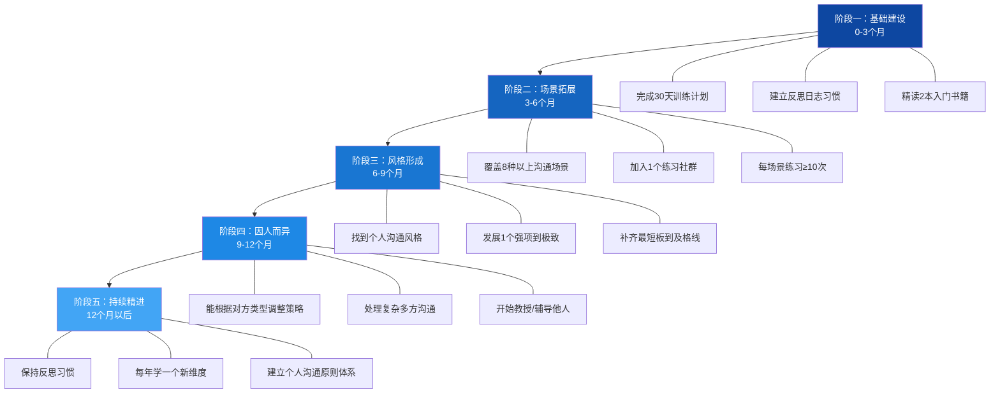

## 十、进阶训练计划

沟通能力的提升不是"知道了就能做到"，而是需要通过系统化的刻意练习，将知识转化为肌肉记忆。心理学家安德斯·艾利克森（Anders Ericsson）在《刻意练习》中指出：专家级表现不是天赋的产物，而是有目的、有反馈、有修正的练习累积而成。沟通能力同样遵循这一规律——你需要一套科学的训练计划，而不是泛泛而谈的"多练练"。

本节提供从30天入门挑战到长期精进的完整训练体系，涵盖倾听、表达、情感沟通、高难度对话四大维度，每个维度都有具体的日任务、评估标准和进阶路径。

### 10.1 30天沟通能力突破计划

这30天不是随意排列的，而是按照"分解-整合-迁移"的训练逻辑设计。前三个阶段分别聚焦单一能力，最后阶段将所有能力融合到真实场景中。


#### 第一阶段：倾听能力筑基（第1-7天）

倾听是沟通的地基。哈佛商学院的研究显示，高管在倾听能力测试中的得分与团队绩效呈正相关（r=0.62）。然而大多数人以为自己在听，实际上只是在等对方说完。

**每日训练任务：**

| 天数 | 训练内容 | 具体操作 | 成功标准 |
|------|----------|----------|----------|
| 第1天 | 沉默练习 | 在3次对话中，对方说完后等待3秒再回应 | 能忍住不打断，等待时间≥3秒 |
| 第2天 | 复述练习 | 每次对话后用自己的话复述对方核心观点 | 对方确认"你理解了我的意思"≥2次 |
| 第3天 | 情绪捕捉 | 对话中识别对方的至少一种情绪并说出来 | 正确识别情绪≥2次 |
| 第4天 | 提问深化 | 用开放式问题推进对话深度 | 每次对话至少提2个开放式问题 |
| 第5天 | 非语言觉察 | 观察对方的身体语言并调整自己的倾听姿态 | 记录3个非语言信号的含义 |
| 第6天 | 综合倾听 | 在一次15分钟以上的对话中综合运用以上技巧 | 写出对话的3个关键洞察 |
| 第7天 | 实战检验 | 与朋友/家人进行一次深度倾听对话并获得反馈 | 对方主动说"和你聊天很舒服" |

**倾听质量自检清单：**

每次倾听练习后，用以下清单打分（1-5分）：

- 我在对方说话时没有构思自己的回复（注意力聚焦度）
- 我能准确复述对方的核心观点而非只言片语（理解准确度）
- 我捕捉到了对方话语背后的情绪（情感敏感度）
- 我提出了至少一个让对方深入思考的问题（深度挖掘力）
- 对方在对话中表现出放松和信任的迹象（关系建立度）

#### 第二阶段：表达能力提升（第8-14天）

清晰的表达是将脑中想法无损传输到对方脑中的过程。很多人表达能力差不是因为"不会说话"，而是因为想不清楚。

**每日训练任务：**

| 天数 | 训练内容 | 具体操作 | 成功标准 |
|------|----------|----------|----------|
| 第8天 | 结构化表达 | 每次发言用"观点-原因-例子-总结"四步法 | 3次发言均使用四步结构 |
| 第9天 | 简洁化训练 | 将一段200字的观点压缩到50字以内 | 核心信息无丢失，字数≤50 |
| 第10天 | 类比训练 | 为3个复杂概念各找到一个生活中的类比 | 听众表示"一下就懂了" |
| 第11天 | 故事化训练 | 将一个观点包装成30秒的小故事 | 听众注意力全程集中 |
| 第12天 | 逻辑链训练 | 用"因为A所以B，因为B所以C"连续推导 | 逻辑链≥3层且无断裂 |
| 第13天 | 数据化训练 | 在表达中加入具体数字和对比 | 至少使用3个具体数据点 |
| 第14天 | 综合表达 | 做一次3分钟即兴发言并录音 | 回放时语速适中、逻辑清晰、无口头禅≥5次 |

**表达能力评估维度：**

| 维度 | 初级标准 | 中级标准 | 高级标准 |
|------|----------|----------|----------|
| 清晰度 | 听众能复述核心观点 | 听众能复述完整逻辑链 | 听众能用自己的例子解释 |
| 简洁度 | 无明显废话 | 每句话都有信息增量 | 用最少的词传达最多的信息 |
| 吸引力 | 听众没有走神 | 听众主动提问 | 听众记住了你的表达并引用 |
| 说服力 | 听众理解你的观点 | 听众认同你的观点 | 听众按照你的建议行动 |

#### 第三阶段：情感沟通训练（第15-21天）

情感沟通是大多数人最薄弱的环节。丹尼尔·戈尔曼的研究表明，情商对职业成功的贡献度是智商的两倍。情感沟通不是"鸡汤"，而是有明确技术要求的硬技能。

**每日训练任务：**

| 天数 | 训练内容 | 具体操作 | 成功标准 |
|------|----------|----------|----------|
| 第15天 | 情绪命名 | 每天记录5种自己的情绪，用精确词汇命名 | 区分"失望"和"沮丧"、"焦虑"和"恐惧" |
| 第16天 | 情绪溯源 | 用"我感到___因为我需要___"句式分析情绪 | 找到情绪背后的3个深层需求 |
| 第17天 | 共情回应 | 练习"情感反射"：对方说感受，你准确回映 | 对方说"对，就是这样"≥3次 |
| 第18天 | 情绪调节 | 在一次让你不舒服的对话中保持冷静 | 没有出现防御性反应（辩解、攻击、退缩） |
| 第19天 | 脆弱表达 | 向信任的人分享一个你通常会隐藏的感受 | 对方回应以信任而非评判 |
| 第20天 | 边界表达 | 用"我"句式表达一个你一直没说出口的边界 | 对方理解并尊重你的边界 |
| 第21天 | 情感连接 | 在一次对话中同时完成共情+脆弱表达+边界设定 | 对话后双方都感到更亲近 |

**"我"句式表达模板：**

避免指责性表达（"你总是..."），使用以下结构：

> **观察**（客观事实，不加评判）：当___的时候
> **感受**（你的情绪反应）：我感到___
> **需要**（背后的需求）：因为我需要/看重___
> **请求**（具体可执行的行动）：你是否愿意___

**示例对比：**

| 场景 | 指责性表达 | "我"句式表达 |
|------|-----------|-------------|
| 同事迟到 | "你又迟到了，你根本不尊重人" | "会议比约定时间晚了15分钟开始（观察），我感到有些焦虑（感受），因为我需要高效利用团队时间（需要），下次能否提前5分钟通知如果会迟到？（请求）" |
| 伴侣冷淡 | "你根本不在乎我" | "这周我们聊天的时间比平时少了很多（观察），我感到有些孤独（感受），因为我需要和你保持亲密连接（需要），今晚能一起吃顿饭聊聊吗？（请求）" |
| 下属出错 | "你怎么连这个都做不好" | "这份报告有3处数据不一致（观察），我有些担心（感受），因为准确性是这个项目的核心（需要），能否在提交前做一次交叉校验？（请求）" |

#### 第四阶段：综合实战（第22-30天）

前三个阶段是"分解训练"，第四阶段是"整合比赛"。将单项技能融合到真实复杂场景中。

**每日训练任务：**

| 天数 | 训练场景 | 具体操作 | 成功标准 |
|------|----------|----------|----------|
| 第22天 | 工作汇报 | 向上级做一次5分钟工作汇报 | 上级追问≤2次（说明表达清晰） |
| 第23天 | 意见分歧 | 与持不同观点的同事深入讨论 | 双方都说出了真实想法且没有不快 |
| 第24天 | 拒绝请求 | 拒绝一个你不方便答应的请求 | 拒绝了但关系没有受损 |
| 第25天 | 推动决策 | 在会议中引导团队做出一个决策 | 决策在预定时间内达成 |
| 第26天 | 化解冲突 | 主动处理一段你一直在回避的关系摩擦 | 双方明确了下一步行动 |
| 第27天 | 深度连接 | 与一个重要的人进行一次深度对话 | 对话后双方都感到被理解 |
| 第28天 | 公开表达 | 在≥5人面前做一次2分钟即兴分享 | 至少1人主动来跟你继续讨论 |
| 第29天 | 复盘总结 | 回顾28天训练日志，提取关键成长点 | 写出3个最大的突破和3个仍需改进的点 |
| 第30天 | 制定后续计划 | 基于复盘结果制定下一个30天计划 | 计划包含具体目标、方法和评估标准 |

### 10.2 四种刻意练习方法详解

30天计划是起点，不是终点。以下是四种可以长期使用的刻意练习方法，每种都经过沟通培训领域的实践验证。

#### 方法一：录音回放法

录音回放是沟通训练中最被低估的工具。大多数人从未听过自己说话的样子——你以为自己语速适中、逻辑清晰，回放录音后可能会发现完全不同的情况。

**操作步骤：**

1. **录制**：在征得对方同意的前提下，录制一次5-15分钟的真实对话。如果涉及隐私，可以只录制自己在对话中的表现（如电话会议中的发言部分）。
2. **第一遍回放**：不做笔记，整体感受自己的沟通风格。
3. **第二遍回放**：关注以下维度，逐项评分（1-10分）：

| 评估维度 | 关注点 | 常见问题 |
|----------|--------|----------|
| 语速 | 每分钟字数（中文正常180-260字/分钟） | 紧张时语速加快、信息密度不均 |
| 语调 | 是否有抑扬顿挫、关键信息是否加重 | 全程一个语调像念经 |
| 口头禅 | "就是""然后""那个""嗯"的频率 | 口头禅≥10次/分钟严重影响专业感 |
| 逻辑性 | 论点之间是否有清晰的过渡 | 跳跃式表达让听众跟不上 |
| 倾听比例 | 自己说话vs对方说话的时间比 | 独白式沟通占比过高 |
| 信息密度 | 每句话是否有实质信息 | 大量铺垫、重复、无信息增量的句子 |

4. **第三遍回放**：只关注一个最需要改进的维度，记录3个具体改进点。
5. **下次对话前**：回顾改进点，默念提醒自己。

**进阶技巧——对比录音法：** 选一段你欣赏的演讲者/播客主持人的音频，与自己的录音对比同类型场景（比如开场白、阐述观点、总结收尾），逐项对比差距。

#### 方法二：角色扮演法

角色扮演的关键不在于"演"，而在于"设身处地"。好的角色扮演能让你在安全环境中经历高压对话，降低真实场景中的应激反应。

**标准流程：**

1. **选择场景**：从以下场景库中选择一个对你有挑战性的场景——

| 难度 | 场景示例 | 核心挑战 |
|------|----------|----------|
| ★★☆ | 向领导申请资源 | 结构化说服、应对质疑 |
| ★★★ | 与客户谈判价格 | 利益平衡、双赢思维 |
| ★★★★ | 处理团队成员之间的冲突 | 中立调解、情感管理 |
| ★★★★★ | 向下属传达负面绩效评估 | 坦诚与关怀的平衡 |

2. **角色准备**：你的伙伴扮演对方角色。给伙伴一份简短的角色卡，包含对方的立场、情绪状态和可能的反应模式。不要给太多细节——真实的对话也是充满不确定性的。
3. **演练**：进行5-15分钟的模拟对话。录像或录音。
4. **反馈环节**：这是最关键的部分。使用以下反馈框架——

> **SBI反馈法**：
> - **Situation（情境）**："当你提到预算超支的时候..."
> - **Behavior（行为）**："你的语速突然加快，而且身体前倾..."
> - **Impact（影响）**："这让我感觉你在试图压制对方的意见..."
> - **建议**："下次可以试试在关键数字前停顿2秒，让对方有时间消化"

5. **重复练习**：同一个场景至少练3遍。第一遍找问题，第二遍修正，第三遍固化。

#### 方法三：观察学习法

观察学习是社会学习理论的核心机制。你不需要亲自犯所有错误——观察优秀沟通者的表现，提取可复用的策略，能大幅缩短学习曲线。

**观察对象选择：**

- **直接观察**：你身边沟通能力强的人（领导、同事、朋友）
- **间接观察**：TED演讲者、播客主持人、谈判专家的公开视频
- **文本观察**：优秀的邮件、报告、提案的写作方式

**观察分析框架：**

每次观察后，用以下模板记录：

观察对象：___
观察场景：___
他做了什么：（具体行为，不加评判）
效果如何：（听众/对方的反应）
我能借鉴的：（提取可迁移的策略）
我需要注意的：（这个策略的适用条件和限制）
我的行动计划：（下次在什么场景中尝试）

**推荐观察清单：**

| 观察对象 | 观察平台 | 重点学习维度 |
|----------|----------|-------------|
| TED经典演讲 | TED官网/B站 | 开场技巧、故事结构、肢体语言 |
| 樊登读书 | 得到/微信读书 | 复杂概念的通俗化表达 |
| 刘润公众号 | 微信公众号 | 商业观点的结构化论证 |
| 纪录片《人类星球》 | B站/Netflix | 采访者如何引导受访者深度表达 |
| 法庭辩论视频 | YouTube/B站 | 高压环境下的逻辑表达和情绪控制 |

#### 方法四：反思日志法

反思日志不是写日记——它是结构化的元认知训练。没有结构的"今天沟通还行"不会带来任何进步。

**每日反思模板：**

```markdown
## 日期：____年__月__日

### 今日最重要的沟通事件
- 场景：___
- 对象：___
- 我的目标：___
- 实际结果：___

### 做得好的3个点
1. ___（具体行为 → 产生的效果）
2. ___
3. ___

### 可以改进的1个点
- 问题：___
- 根因分析：___
- 下次我会：___（具体行为，不是"下次注意"）

### 今日学到的一个沟通洞察
- ___

### 明日沟通目标
- 场景：___
- 要练习的技巧：___
- 成功标准：___
```

**每周复盘要点：**

每周日花20分钟回顾本周的反思日志，回答以下问题：

1. 本周出现频率最高的问题是什么？这说明什么？
2. 本周最大的突破是什么？是什么触发了这个突破？
3. 下周应该把练习重心放在哪个维度上？

### 10.3 进阶学习资源体系

学习资源不是"越多越好"——你需要一个有层次的资源体系，避免陷入"收藏了就是学了"的陷阱。

#### 书籍资源：分层阅读路线

**第一层：入门必读（建立基础认知）**

| 书名 | 作者 | 核心价值 | 阅读建议 |
|------|------|----------|----------|
| 《非暴力沟通》 | 马歇尔·卢森堡 | 情感沟通的方法论基础 | 先读前6章，后4章可跳读 |
| 《关键对话》 | 科里·帕特森等 | 高压场景下的沟通策略 | 重点读第3-7章的工具箱 |
| 《沟通的艺术》 | 罗纳德·阿德勒 | 沟通学的系统教材 | 通读全书，建立知识框架 |

**第二层：技能深化（补强薄弱环节）**

| 书名 | 作者 | 核心价值 | 适用人群 |
|------|------|----------|----------|
| 《金字塔原理》 | 芭芭拉·明托 | 结构化表达和思维 | 表达缺乏逻辑性的人 |
| 《影响力》 | 罗伯特·西奥迪尼 | 说服的心理学原理 | 需要说服他人的管理者/销售 |
| 《高情商沟通》 | 丹尼尔·戈尔曼 | 情商与沟通的关系 | 情感沟通薄弱的人 |
| 《学会提问》 | 尼尔·布朗 | 批判性思维与提问技巧 | 倾听和提问能力不足的人 |

**第三层：专项突破（针对特定场景）**

| 书名 | 作者 | 核心价值 | 适用场景 |
|------|------|----------|----------|
| 《谈判力》 | 罗杰·费希尔 | 原则性谈判方法 | 商务谈判、利益协调 |
| 《演讲的力量》 | 克里斯·安德森 | TED演讲方法论 | 公开演讲、汇报展示 |
| 《高难度对话》 | 道格拉斯·斯通等 | 处理敏感话题的框架 | 绩效面谈、关系修复 |
| 《故事经济学》 | 罗伯特·麦基 | 用故事进行商业沟通 | 品牌传播、方案呈现 |

**阅读方法建议：** 不要通读所有书。先做能力评估（参照本章前文的评估框架），找到最薄弱的1-2个维度，从对应层级选1-2本书精读。每本书读完后，提取3-5个可立即使用的工具，在两周内刻意练习。

#### 课程与社群资源

| 资源类型 | 推荐项目 | 特点 | 适合人群 |
|----------|----------|------|----------|
| 演讲俱乐部 | Toastmasters | 全球最大的演讲训练组织，每周例会 | 需要持续练习公开表达的人 |
| 工作坊 | 非暴力沟通（NVC）认证工作坊 | 体系化的深度训练，含大量角色扮演 | 想系统学习情感沟通的人 |
| 线上课程 | 得到"沟通训练营" | 中文场景，贴近国内职场 | 职场沟通需求为主的人 |
| 即兴戏剧 | 本地即兴戏剧工作坊 | 训练临场反应和共情能力 | 表达僵化、过度依赖准备稿的人 |
| 辩论社 | 大学/社区辩论队 | 训练逻辑思维和快速反驳能力 | 逻辑表达和应变能力不足的人 |

#### 实践平台选择

光看书和上课远远不够——你需要在真实场景中反复练习。以下是按"安全系数"排列的实践平台：

| 安全等级 | 平台 | 优势 | 风险 |
|----------|------|------|------|
| 低风险 | Toastmasters | 结构化反馈、安全环境 | 场景偏演讲、缺少日常对话训练 |
| 低风险 | 读书会 | 低成本、话题丰富 | 可能流于表面讨论 |
| 中风险 | 志愿者活动 | 多样化人群、真实场景 | 难以获得结构化反馈 |
| 中风险 | 跨部门项目 | 真实利益博弈 | 失误有职业代价 |
| 高风险 | 主持会议/活动 | 全面锻炼综合能力 | 压力大、容错空间小 |
| 高风险 | 担任导师 | 通过教学巩固最高水平 | 需要足够的能力储备 |

**建议路径：** 从低风险平台开始，每个平台至少参与8次（约2个月），确认该平台无法再给你新的挑战后，再进阶到下一级。

### 10.4 长期成长路线图

30天计划是"启动器"，真正的沟通高手需要6-12个月的持续训练。以下是进阶成长路线图：



#### 各阶段关键里程碑

| 阶段 | 时间 | 核心目标 | 衡量标准 | 常见陷阱 |
|------|------|----------|----------|----------|
| 基础建设 | 0-3个月 | 掌握四大维度基本功 | 反思日志连续记录≥60天 | 急于求成，跳过基础直接练高级技巧 |
| 场景拓展 | 3-6个月 | 在多种场景中能灵活应用 | 8种场景各练习≥10次 | 回避困难场景，只练舒适区内的 |
| 风格形成 | 6-9个月 | 形成个人沟通风格 | 能清晰描述"我的沟通风格是___" | 盲目模仿某一个人的风格 |
| 因人而异 | 9-12个月 | 能根据对象灵活调整 | 对不同类型的人都能有效沟通 | 过度灵活导致失去真诚感 |
| 持续精进 | 12个月+ | 沟通成为自然能力 | 不需要刻意准备也能高质量沟通 | 停止学习，以为已经"够好了" |

#### 成长追踪工具

**月度沟通能力评分表：**

每月月底花15分钟，对以下维度进行1-10分自评，绘制雷达图观察成长趋势：

| 维度 | 上月得分 | 本月得分 | 变化 | 下月重点 |
|------|----------|----------|------|----------|
| 倾听深度 | | | | |
| 表达清晰度 | | | | |
| 情感共鸣力 | | | | |
| 逻辑说服力 | | | | |
| 冲突处理力 | | | | |
| 公开表达力 | | | | |
| 书面沟通力 | | | | |
| 跨文化沟通力 | | | | |

**提示：** 邀请一位信任的朋友或同事也对你打分，对比自评和他评的差距——差距最大的维度往往是你最大的盲区。

### 10.5 常见训练陷阱与纠正

训练计划再好，掉进以下陷阱也会事倍功半。

#### 陷阱一：只学不练

**表现：** 看了很多书、上了很多课，笔记记了厚厚一本，但实际沟通中没有任何变化。

**根因：** 大脑将"学习"误认为"掌握"。神经科学研究表明，知识从海马体（记忆）到基底神经节（自动执行）需要反复练习，光靠阅读无法完成这一迁移。

**纠正方法：** 遵循"1:3法则"——每花1小时学习，至少花3小时练习。学完一个技巧后，24小时内必须在真实场景中使用至少一次。

#### 陷阱二：练习缺乏反馈

**表现：** 每天都在跟人聊天，觉得自己"练习了很多"，但沟通能力没有明显提升。

**根因：** 没有反馈的重复只是在重复错误。艾利克森的研究强调，刻意练习的核心是有明确标准和即时反馈。

**纠正方法：** 每次练习必须有至少一种反馈来源——录音回放、伙伴反馈、观察者评分。没有反馈的练习不算刻意练习。

#### 陷阱三：回避高难度场景

**表现：** 只在安全的场景中练习（如跟朋友聊天），回避真正让你紧张的场景（如跟领导谈判、处理冲突）。

**根因：** 人的本能是回避不适，但成长发生在舒适区之外。

**纠正方法：** 用"微暴露"策略——不要一步跳到最高难度，而是在当前舒适区的边缘逐步扩展。比如，先在Toastmasters演讲（有准备、有掌声），再在团队内部分享（半准备、有反馈），最后在客户面前即兴发挥（无准备、高压力）。

#### 陷阱四：追求"万能技巧"

**表现：** 不断搜集新的沟通技巧、框架、模型，但每个都只浅尝辄止。

**根因：** 对"完美方法"的迷恋实际上是一种拖延——只要还在"找方法"，就不用面对"做了但没做好"的恐惧。

**纠正方法：** 选定3-5个核心工具，用到极致再换。深度掌握一个工具的效果远胜于浅尝十个工具。

#### 陷阱五：忽视身体和心理状态

**表现：** 训练时表现很好，但真实场景中（疲劳、压力、情绪波动时）打回原形。

**根因：** 沟通是全身心的活动。身体疲劳会降低前额叶皮层的执行控制能力，情绪波动会激活杏仁核的防御反应——这些都会直接损害沟通质量。

**纠正方法：** 在训练中模拟真实条件。比如在工作一天后的疲劳状态下练习表达，在有情绪波动时练习倾听。沟通能力的最终检验不是"状态好时能不能做好"，而是"状态差时还能不能保持基本水准"。

