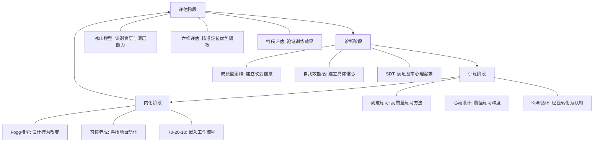

## 沟通能力评估与成长的理论框架

沟通能力不是玄学——它有可拆解的维度、可测量的指标、可验证的成长路径。本章从"如何评估"和"如何成长"两个根本问题出发，构建一套完整的理论框架。评估回答"我在哪里"，成长理论回答"我该往哪走、怎么走"。二者缺一不可：没有评估的训练是盲练，没有理论的评估是瞎评。

### 一、能力评估的理论基础

评估沟通能力的难点在于：沟通既是显性技能（说话、写作），又是隐性素养（同理心、情境判断）。下面的理论模型帮助我们将"不可见的能力"转化为"可观察、可测量的行为"。

#### 1. 能力素质模型

能力素质模型（Competency Model）由David McClelland于1973年在《Testing for Competence Rather Than for Intelligence》一文中首次提出。McClelland发现，传统智商测试无法预测工作绩效，真正区分优秀者与普通者的是一组可观察的行为特征——即"素质"。

**冰山模型：表层与深层的分野**

冰山模型将沟通能力分为两个层级，水面以上是容易识别和培养的表层能力，水面以下是难以评估但对长期表现影响深远的深层特质：

        ╱╲
       ╱  ╲  ← 行为表现（可见）
      ╱    ╲
     ╱ 知识 ╲  ← 表层能力：容易评估、可快速提升
    ╱  技能  ╲
   ╱──────────╲
  ╱            ╲
 ╱   价值观     ╲  ← 深层能力：难以评估、影响深远
╱    性格特质    ╲
╱   内在动机     ╲
╱──────────────────╲

表层能力（水面以上）指的是知识和技能。知识包括沟通理论、行业术语、工具使用方法等，可以通过笔试和问答快速评估。技能包括口头表达、书面写作、倾听、说服、调解冲突等，可以通过行为观察和角色扮演来评估。这些能力培养周期短，见效快——参加一个两天的演讲训练营，表达的结构感就能明显改善。

深层能力（水面以下）包括价值观、性格特质和内在动机。价值观决定一个人认为"什么样的沟通是好的"——有人推崇直接坦率，有人重视委婉和谐，这会影响他们在具体情境中的沟通选择。性格特质如内外向倾向、情绪稳定性、开放性等，虽然不直接等于沟通能力，但会影响沟通风格和舒适区。内在动机则是最深层的驱动力——一个人为什么想要提升沟通能力？是为了获得认可、建立关系、还是推动事业？动机不同，训练的投入度和持久性截然不同。

深层能力的评估需要更精细的方法：心理测评（如MBTI、大五人格）、深度访谈、360度反馈、长期行为追踪。这些评估成本高、周期长，但一旦准确识别，就能为个人发展提供极具针对性的方向。

**沟通能力的四层结构**

将冰山模型具体化到沟通领域，可以建立四层评估体系：

| 层次 | 内容 | 典型表现 | 评估方式 | 培养周期 |
|------|------|----------|----------|----------|
| 知识层 | 沟通理论、工具知识、行业术语、文化规范 | 能说出"金字塔原理"的定义，知道不同文化的沟通禁忌 | 笔试、问答、概念图 | 数天到数周 |
| 技能层 | 表达、倾听、说服、调解、写作、演示 | 能在3分钟内清晰阐述一个复杂概念，能准确复述对方的核心观点 | 行为观察、角色扮演、演讲评估量表 | 数周到数月 |
| 态度层 | 沟通意愿、开放心态、同理心、心理安全感 | 面对分歧时主动倾听而非急于反驳，愿意承认自己的表达不够清楚 | 360度反馈、自评问卷、情境判断测试 | 数月到数年 |
| 习惯层 | 自动化的沟通模式、无意识的行为倾向 | 在高压情境下仍然保持倾听习惯，冲突中本能地使用"我"语句而非指责 | 长期行为追踪、压力情境模拟、同伴观察记录 | 数年，持续终身 |

这四层之间存在严格的递进关系：知识是基础，技能是应用，态度是内化，习惯是自动化。很多人参加沟通培训后感觉"学到了"，回到工作中却用不出来——问题出在知识层到技能层的转化断裂。知道"要倾听"不等于"会倾听"，"会倾听"在课堂上做到不等于在激烈争论中还能做到。

#### 2. 柯氏四级评估模型

Donald Kirkpatrick于1959年提出的四级评估模型（Kirkpatrick Model）是培训效果评估的经典框架，至今仍是全球使用最广泛的培训评估标准。将其应用到沟通能力培训中，每一级都有具体的操作方法和判断标准：

**第一级：反应（Reaction）**

评估学员对培训的主观满意度。这不是"培训有没有用"的判断，而是"学员觉得有没有用"——两者有本质区别。学员可能觉得课程有趣但实际没有学到东西，也可能觉得课程枯燥但行为确实发生了改变。

评估方法包括：培训结束后的满意度问卷（NPS净推荐值）、课堂参与度观察、学员的开放式反馈。关键指标包括课程内容的相关性评分、讲师的专业度评分、培训方式的适配度评分。这一级评估成本最低，但信息价值也最低——满意度高不代表效果好。

**第二级：学习（Learning）**

评估学员在知识和技能层面的实际收获。这需要在培训前后分别进行测试，对比前后差异。

知识测试可以使用笔试或在线测验，比如让学员区分"积极倾听"和"被动沉默"的区别。技能测试则需要设计模拟情境，比如给学员一个冲突场景，让他们现场演示调解过程，由评估者使用结构化评分量表打分。有效的评估应该在培训前建立基线（baseline），培训后立即测试，一个月后再测试，观察知识和技能的保持率。

**第三级：行为（Behavior）**

评估学员在实际工作中的行为改变。这是最关键也最难评估的一级——课堂表现好不代表工作场景中能用出来。

行为评估通常在培训结束后3-6个月进行。方法包括：上级观察报告（使用行为锚定评分量表BARS）、同事360度反馈对比培训前后的变化、学员自评日志（记录每周使用新技能的次数和情境）、关键事件法（收集培训前后有代表性的沟通事件进行对比分析）。

行为评估的难点在于控制变量——工作环境、人际关系、压力水平等因素都会影响沟通行为。解决方法是建立对照组，或使用同一被试的前后对比。

**第四级：结果（Results）**

评估沟通培训对组织绩效的最终影响。这是最高级别的评估，也是最具说服力的。

可追踪的指标包括：客户满意度评分变化、团队协作效率指标（项目交付周期、返工率）、销售转化率、员工留存率、跨部门冲突事件数量、会议效率指标（会议时长、决议执行率）。这一级评估需要大量数据积累和较长的观察周期，成本最高但对组织决策最有价值。

**四级评估的递进关系与投入产出**

第一级（反应） → 投入最低，说服力最弱
第二级（学习） → 投入较低，能证明培训本身有效
第三级（行为） → 投入中等，能证明行为真正改变
第四级（结果） → 投入最高，能证明对组织有价值

实际操作建议：不要试图每次都做四级评估。日常小培训做一二级评估即可；年度重点培训项目做三级评估；涉及重大资源投入的培训项目才做四级评估。

#### 3. 沟通能力的多维评估框架

除了上述经典模型，实际评估沟通能力还需要一个多维度的评估矩阵。沟通不是单一能力，而是一个能力簇。以下框架将沟通能力拆解为六个可独立评估的维度：

| 维度 | 定义 | 评估指标 | 评估方法 |
|------|------|----------|----------|
| 表达清晰度 | 信息传递的准确性和条理性 | 结构化程度、冗余率、听众理解正确率 | 演示评分、文本分析、听众复述测试 |
| 倾听理解力 | 准确接收和理解他人信息的能力 | 复述准确率、提问相关性、情感识别准确度 | 倾听测试、角色扮演评估 |
| 说服影响力 | 改变他人观点或行为的能力 | 说服成功率、论据质量、异议处理能力 | 模拟谈判、提案演示评估 |
| 情感共鸣力 | 识别和回应他人情感需求的能力 | 共情回应频率、情感词汇使用、关系满意度 | 360度反馈、心理咨询模拟评估 |
| 冲突管理力 | 在分歧和冲突中保持建设性对话的能力 | 冲突解决率、升级控制率、关系修复速度 | 冲突场景模拟、关键事件分析 |
| 适应调节力 | 根据对象和情境调整沟通方式的能力 | 风格切换频率、跨文化沟通成功率、媒介选择恰当性 | 多情境角色扮演、跨文化沟通模拟 |

每个维度可以独立评分（1-5分或百分制），形成一个"沟通能力雷达图"，让个人清楚地看到自己的优势和短板。这种多维评估比笼统地问"你沟通能力怎么样"有价值得多——一个技术专家可能表达清晰度4分、倾听理解力3分、情感共鸣力2分，那么他的发展重点就应该是情感共鸣而非表达技巧。

### 二、刻意练习理论

评估告诉我们"在哪里"，刻意练习告诉我们"怎么走"。Anders Ericsson教授的研究是沟通能力提升的最核心理论依据。

#### 1. Ericsson的刻意练习

Anders Ericsson教授从1980年代开始在柏林音乐学院研究小提琴手的成长路径，此后扩展到象棋、国际象棋、外科手术、体育运动等领域，历时三十余年。他的核心发现是：**决定专家水平的不是天赋，而是练习的质量**。他在1993年发表的论文《The Role of Deliberate Practice in the Acquisition of Expert Performance》成为该领域的奠基之作。

**刻意练习的四大核心要素**

刻意练习 = 明确目标 + 专注投入 + 即时反馈 + 持续挑战

**要素一：明确且具体的练习目标。** 刻意练习的第一步是将模糊的"提升沟通能力"转化为精确的行为目标。模糊目标的问题在于无法判断是否达成，也无法设计针对性的练习。

| 模糊目标（无效） | 具体目标（有效） |
|-----------------|-----------------|
| 提升演讲能力 | 在5分钟演讲中，开头30秒内用一个具体故事抓住听众注意力 |
| 学会倾听 | 在每次1对1对话中，至少复述一次对方的核心观点，复述准确率≥80% |
| 提高说服力 | 在项目提案中，每个论点都使用"数据+案例"的双重支撑结构 |
| 减少沟通冲突 | 在表达不同意见时，先用"我理解你的观点是..."确认理解，再表达自己的看法 |

**要素二：专注且全身心的投入。** Ericsson的研究发现，专家级演奏者每天的刻意练习时间约为4小时——超过这个时间，专注力下降，练习效果急剧递减。这给沟通训练的启示是：短时间高质量的专注练习，胜过长时间心不在焉的重复。

专注练习的具体操作方法包括：选择安静无干扰的环境、关闭手机和所有通知、设定25-45分钟的练习时段（番茄钟法）、每次练习只聚焦一个具体技能点、练习后立即做5分钟反思记录。

**要素三：即时且准确的反馈。** 没有反馈的练习是在强化错误。反馈的质量和时效性直接决定练习的效果。

沟通训练中的反馈来源及其特点：

| 反馈来源 | 优点 | 缺点 | 适用场景 |
|----------|------|------|----------|
| 专业教练 | 专业准确、针对性强 | 成本高、时间受限 | 重要的技能突破阶段 |
| 录像回放 | 客观真实、可反复观看 | 可能过度关注外表 | 演讲、演示、面试准备 |
| 同伴互评 | 成本低、视角多样 | 可能不够专业、有社交顾虑 | 日常练习、团队培训 |
| 自我反思 | 随时可用、培养自我觉察 | 容易有盲点、可能自我美化 | 每日复盘、习惯养成 |
| AI辅助工具 | 即时反馈、数据化分析 | 缺乏情感洞察 | 语速分析、词汇多样性、情感检测 |
| 真实场景结果 | 最真实的检验 | 反馈滞后、因果不明确 | 汇报效果、谈判结果、客户反馈 |

**要素四：持续且适度的挑战。** 练习内容必须略高于当前能力水平——这就是心理学中的"最近发展区"（Zone of Proximal Development）概念。太简单的内容导致无聊和停滞，太难的内容导致焦虑和放弃。

**沟通能力的阶梯式练习设计**

Level 1: 安全环境 → 对镜子练习表达 → 目标：流畅不卡顿
Level 2: 小范围 → 对1-2个信任的朋友做3分钟分享 → 目标：结构清晰
Level 3: 中等压力 → 在小组会议中主动发言 → 目标：观点有说服力
Level 4: 高压力 → 在部门会议做正式汇报 → 目标：应对即兴提问
Level 5: 真实场景 → 跨部门谈判/客户演示 → 目标：达成目标且维护关系
Level 6: 极限挑战 → 公开演讲/危机沟通 → 目标：从容应对高压和意外

#### 2. 一万小时法则的真相

Malcolm Gladwell在2008年出版的《异类》（Outliers）中将Ericsson的研究简化为"一万小时法则"——任何人只要练习一万小时就能成为专家。Ericsson本人对此极为不满，因为这个简化严重曲解了他的研究。Ericsson在2016年专门出版了《Peak: Secrets from the New Science of Expertise》来澄清误解。

核心区别在于：

| 误解 | 真相 |
|------|------|
| 一万小时是成为专家的充分条件 | 一万小时只是某些领域的平均值，不同领域差异巨大 |
| 任何一万小时的练习都能成专家 | 无意识的重复永远不会造就专家 |
| 练习时间是最关键的变量 | 练习质量才是最关键的变量 |
| 起步年龄不重要 | 某些领域存在关键窗口期 |

将这个纠正应用到沟通能力提升上，信息非常明确：**不要用"多说多练"的战术勤奋掩盖"不会练"的战略懒惰。** 参加了一百次会议但每次都没有有意识地练习某个具体技巧，不如认真做十次有针对性的刻意练习。

#### 3. 心流理论与练习设计

Mihaly Csikszentmihalyi在1990年出版的《Flow: The Psychology of Optimal Experience》中提出了心流理论。心流是一种完全沉浸在活动中的最优体验状态——时间感消失，自我意识消退，效率和创造力达到峰值。

心流状态对沟通练习设计有直接指导意义：

        高
        │    焦虑区     心流区
   挑   │   ┌─────┐   ┌─────┐
   战   │   │能力不足│   │能力匹配│
   程   │   │需降难度│   │最佳学习│
   度   │   │或提技能│   │  状态  │
        │   └─────┘   └─────┘
        │    无聊区     放松区
        │   ┌─────┐   ┌─────┐
        │   │能力过剩│   │低投入 │
        │   │需增难度│   │休闲态 │
        低──────────────────────高
                技能水平

进入心流区的三个关键条件与沟通练习设计：

**条件一：挑战与技能的动态平衡。** 沟通练习的难度必须随能力提升而递增。如果你已经能在朋友面前流畅表达，下一步是面对不太熟的同事；如果你能在部门会议上从容汇报，下一步是面对外部客户或高管。每次感到"有点紧张但能应对"时，就处于心流区。

**条件二：清晰的目标和即时的反馈。** 每次练习前明确"这次我要练习什么"，每次练习后立即回顾"做得怎样"。这与刻意练习的要素完全一致。

**条件三：专注且无干扰的环境。** 心流需要深度专注。选择练习时间时避开疲劳时段和多任务情境，创造"只做这一件事"的条件。

**实用方法：** 练习前给自己设置一个"微挑战"——比当前能力高10%-20%的目标。比如你习惯用3分钟表达一个观点，这次试试2分钟；你习惯用PPT辅助汇报，这次试试完全脱稿。这种微挑战恰好将你推入心流区。

### 三、成长型思维理论

技能训练解决"怎么做"的问题，思维方式解决"敢不敢做"和"能不能坚持"的问题。下面两个理论分别从信念系统和自我认知的角度解释为什么有些人能持续成长，而有些人停滞不前。

#### 1. Carol Dweck的成长型思维

Stanford大学心理学教授Carol Dweck从1970年代开始研究"人们如何理解失败"，历时二十余年，最终在2006年出版《Mindset: The New Psychology of Success》。她发现，人们对能力的根本信念分为两种，这种信念深刻影响着学习行为、抗压能力和最终成就。

**固定型思维与成长型思维的全面对比**

| 维度 | 固定型思维 | 成长型思维 |
|------|-----------|-----------|
| 核心信念 | 能力是天生固定的，无法改变 | 能力可以通过努力和策略提升 |
| 面对挑战 | 回避——暴露不足会证明自己不行 | 拥抱——挑战是成长的必经之路 |
| 面对失败 | 归因于能力不足，产生自我否定 | 归因于策略不当，寻找改进方法 |
| 面对批评 | 防御性反应，否认或回避 | 开放性接纳，视为改进信息 |
| 面对他人成功 | 威胁感、嫉妒、自我贬低 | 受到鼓舞、学习借鉴、寻找可复制的方法 |
| 对努力的看法 | 努力是能力不足的表现 | 努力是通往精通的必经之路 |
| 面对停滞 | 放弃——"我就是不行" | 调整策略——"这个方法不管用，换个方法" |
| 典型内心独白 | "我做不到" | "我还没做到" |

注意最后一行的措辞差异："我做不到"是一个终局判断，暗示能力的天花板；"我还没做到"是一个过程描述，暗示这只是时间问题。这个微小的语言差异反映了深层信念的根本不同。

**成长型思维在沟通领域的具体表现**

以下是六个常见的沟通场景中两种思维方式的对比，每个场景都包含具体的内心独白和行为差异：

**场景一：公开发言紧张**

固定型思维："我就是不适合在人前讲话，性格就是这样，改不了。"于是每次需要发言时都找借口推脱，或者全程念稿子，从不尝试脱稿。

成长型思维："我在人前讲话会紧张，这很正常，很多优秀的演讲者一开始也紧张。我需要找到适合自己的方法来管理紧张情绪。"于是开始对着镜子练习，逐步扩大练习观众规模，学习呼吸调节技巧。

**场景二：一次沟通失败**

固定型思维："这次沟通搞砸了，说明我不是做这块的料。"于是回避类似场景，不再尝试。

成长型思维："这次沟通没达到预期效果，具体是哪个环节出了问题？是开场不够吸引人？是中间逻辑不清晰？还是结束时没有明确的行动项？"于是逐条分析，针对性改进。

**场景三：看到别人沟通很好**

固定型思维："他天生就会说话，口才好是天赋，我学不来。"

成长型思维："他的沟通技巧很好，具体好在哪里？是逻辑结构？是故事运用？是情绪把控？我可以向他学习哪些具体的方法？"

**场景四：学习新沟通技巧遇到瓶颈**

固定型思维："我已经学了这么久的倾听技巧，还是做不好，可能我就是不擅长。"

成长型思维："这个阶段遇到瓶颈很正常，说明我需要换一种练习方法。我去找个教练帮我看看具体哪里卡住了。"

**场景五：被领导批评沟通方式**

固定型思维："领导就是针对我，别人怎么不说？"或者"我果然不行，怎么改都改不好。"

成长型思维："领导指出的具体问题是什么？他说的'逻辑不够清晰'是指结构问题还是论据问题？我需要先搞清楚他期望的沟通方式是什么样的。"

**场景六：跨文化沟通遇到障碍**

固定型思维："外国人就是听不懂我说话，语言不好没法沟通。"

成长型思维："我的英语表达和对方的理解之间确实有差距，但我可以用更简单的句子结构、更具体的事例来弥补。同时我可以学习对方的沟通习惯。"

#### 2. 自我效能感理论

Albert Bandura于1977年提出自我效能感理论（Self-Efficacy Theory），这是社会认知理论的核心概念。自我效能感不同于自信心——自信心是一种泛化的积极感受，自我效能感则是对"我在特定任务上能否做好"的具体判断。一个人可能在写作方面自我效能感很高（"我能写出清晰的技术文档"），但在口头表达方面自我效能感很低（"我在会议上说不清楚"）。

**自我效能感对沟通行为的影响机制**

自我效能感通过四条路径影响沟通表现：

自我效能感高 → 选择更具挑战性的沟通情境
             → 在沟通中投入更多努力
             → 面对沟通困难时坚持更久
             → 沟通失败后更快恢复

反过来，自我效能感低会导致：回避需要沟通的场合（选择自己做而不是跟团队协作）、沟通中一遇到阻力就放弃、沟通失败后长时间陷入自我怀疑。

**提升沟通自我效能感的四个途径**

Bandura指出自我效能感的来源有四个，按影响力从强到弱排列：

**途径一：直接成功体验（影响力最强）。** 过去的成功是建立自信最可靠的来源。关键在于"小成功"的累积——不要一开始就挑战高难度场景，而是从能控制的小场景开始，逐步积累成功经验。

具体操作方法：建立"成功日志"，每天记录至少一个沟通中的小成功——"今天在会议上主动提了一个问题"、"今天在邮件中用了一个更清晰的结构"、"今天跟同事的分歧处理得比上次好"。这些微小的成功积累起来，会逐步改变你对自身沟通能力的判断。

**途径二：替代经验（影响力次之）。** 观察与自己相似的人成功完成任务，会增强"我也能做到"的信念。关键在于"相似性"——看到一个天生外向的销售冠军做演讲，对内向的工程师帮助不大；但看到一个同样内向的技术Leader通过练习后能在全员大会上做精彩的分享，这个参照就非常有力量。

具体操作方法：寻找"成长榜样"——不是那些天生善于沟通的人，而是通过努力变得善于沟通的人。了解他们的起点、他们的方法、他们遇到的困难和如何克服的。故事和案例比抽象建议有效得多。

**途径三：言语说服（影响力较弱）。** 来自他人——尤其是你尊重和信任的人——的鼓励和肯定，可以在短期内提升自我效能感。但言语说服的效果是脆弱的，如果没有实际成功体验支撑，很快就会消退。

具体操作方法：找到一个"沟通教练"或"练习伙伴"，在每次练习后给出具体、真诚的反馈。注意：有效的鼓励不是"你说得很好"这种笼统的赞美，而是"你今天开头用的那个案例特别有效，一下就抓住了注意力"这种具体的肯定。前者是空话，后者是信息。

**途径四：情绪和生理状态管理（影响微妙）。** 沟通中的焦虑、紧张、心跳加速等生理反应会影响自我效能感的判断。如果一个人在每次发言前都极度紧张，他可能会将紧张解读为"我不适合做这个"。

具体操作方法：学习区分"紧张"和"不胜任"——紧张是正常的生理反应，几乎所有人（包括专业演员和演讲家）在重要场合都会紧张。将紧张重新解读为"身体在为重要事件做准备"而非"我不行"。同时学习具体的生理调节技巧：4-7-8呼吸法（吸气4秒、屏气7秒、呼气8秒）、渐进式肌肉放松、发言前的"能量姿势"。

#### 3. 自我决定理论（SDT）

Edward Deci和Richard Ryan在1980年代提出的自我决定理论（Self-Determination Theory）是动机心理学的支柱理论之一，对理解"为什么有些人能持续提升沟通能力而有些人半途而废"提供了关键解释。

SDT认为，人类有三种基本心理需求，当这三种需求得到满足时，人会表现出最强的内在动机和最高的投入度：

| 基本需求 | 定义 | 在沟通训练中的体现 |
|----------|------|-------------------|
| 自主感（Autonomy） | 感到行为是自己选择的，而非被迫的 | 自己选择练习什么、何时练习、用什么方式练习 |
| 胜任感（Competence） | 感到自己有能力完成任务 | 在练习中不断获得"我能做到"的正反馈 |
| 归属感（Relatedness） | 感到与他人有连接和被关心 | 在安全的练习社群中获得支持和认同 |

**应用到沟通训练中的设计原则：**

第一，给选择权而非下命令。不要说"你必须每天练习演讲30分钟"，而是提供多种练习方式让学员自己选择——对着镜子练习、录制视频自评、跟朋友对练、参加线上社群分享。自主选择的任务，执行率远高于被分配的任务。

第二，设计阶梯式成就体验。把"成为一个好的沟通者"分解为20个微技能，每个微技能设置明确的达标标准。每完成一个微技能就标记为"已掌握"，让胜任感可视化。

第三，创造安全的练习社群。沟通练习需要暴露弱点，这让人本能地感到不安全。一个好的练习社群需要建立明确的心理安全规范——不评判、不嘲笑、不传播练习中的"失败"。

### 四、学习理论与终身学习

知道理论还不够，还需要理解"人是如何学习的"——学习机制决定了我们应该如何设计训练方案。

#### 1. 建构主义学习理论

建构主义（Constructivism）的核心观点是：学习不是被动接收知识的过程，而是学习者主动将新信息与已有经验相连接、建构个人意义的过程。Jean Piaget从认知发展角度、Lev Vygotsky从社会文化角度分别发展了这一理论。

在沟通能力培养中，建构主义的四个关键启示：

**启示一：新知识必须与已有经验连接。** 比如教授"金字塔原理"时，不能只讲理论定义，而要让学员回忆自己过去一次"表达混乱导致误解"的经历，然后用金字塔原理重新组织那次表达，对比效果差异。这种"用新框架重新解读旧经验"的学习方式，比单纯听讲有效五倍以上。

**启示二：社会互动是核心学习途径。** 沟通能力本质上是一种社会性技能，不可能在真空中学习。Vygotsky的"最近发展区"理论强调：最有效的学习发生在与比自己能力稍强的同伴互动的过程中。这意味着沟通训练的最佳形式不是独自看书或看视频，而是与真人进行有指导的互动练习。

**启示三：真实情境中的学习最有效。** 在模拟场景中学会的沟通技巧，迁移到真实场景时往往大打折扣，因为真实场景有情绪压力、利益冲突、时间限制等额外变量。训练方案应该尽可能设计真实情境——不是角色扮演一个"假设的冲突"，而是处理一个当前真实存在的工作分歧。

**启示四：反思是知识内化的关键环节。** 经验本身不等于学习——如果一个人每天都在沟通但从不反思，他可能用错误的方式重复了十年。John Dewey说过："We do not learn from experience... we learn from reflecting on experience."反思将表面的经验转化为深层的理解。

#### 2. 70-20-10学习法则

这个法则最早由Michael Lombardo和Robert Eichinger在1996年为创造性领导力中心（Center for Creative Leadership）的研究中提出，基于对200多位成功高管的调查。虽然具体比例一直有争议，但其核心洞察——正式培训只占学习的一小部分——已被广泛接受。

┌─────────────────────────────────────────────────────┐
│  70% 实践学习：在真实工作中学习                       │
│  ─── 通过实际沟通场景积累经验、从成功和失败中学习     │
├─────────────────────────────────────────────────────┤
│  20% 社交学习：向他人学习                             │
│  ─── 导师指导、同伴反馈、观察优秀沟通者、社群交流     │
├───────┐
│  10%  │ 正式学习：结构化的知识输入                    │
│       │ 课堂培训、书籍、在线课程、工作坊              │
└───────┘

**对沟通能力培养的四个关键启示：**

**启示一：仅靠参加培训课程远远不够。** 大多数人提升沟通能力的第一反应是"去上课"或"看本书"。70-20-10法则告诉我们，正式学习只占10%。参加了一个2天的高效沟通训练营，如果回到工作中不刻意练习，两周后就会忘记80%的内容。

**启示二：必须在真实的工作场景中练习。** 最有效的沟通练习是"在工作中学习"——每次会议发言后花2分钟复盘，每次客户沟通后记录什么有效什么无效，每次邮件发出前用金字塔原理检查结构。这些"嵌入工作流程"的学习，累积效果远超集中式培训。

**启示三：寻找导师和学习伙伴。** 20%的社交学习意味着你需要找到可以观察、请教、互评的人。一个好的沟通导师不需要是专业教练，但需要满足三个条件：沟通能力确实比你强、愿意给你真实反馈、能指出你看不到的盲点。

**启示四：反思和复盘是核心能力。** 70%的实践学习如果缺乏反思，就会退化为70%的无意识重复。建议建立"沟通复盘"的习惯——不需要每天花很长时间，每天花5分钟回答三个问题就够了：今天最重要的一次沟通是什么？做得好的一点是什么？下次可以改进的一点是什么？

#### 3. Kolb经验学习循环

David Kolb在1984年出版的《Experiential Learning》中提出了经验学习循环模型，将学习过程分解为四个阶段。这个模型解释了为什么有些人"吃一堑长一智"而有些人"同样的坑摔两次"。

┌──────────────┐      ┌──────────────┐
│  具体经验     │ ───→ │  反思观察     │
│ (Concrete     │      │ (Reflective   │
│  Experience)  │      │  Observation) │
└──────┬───────┘      └──────┬───────┘
       ↑                      │
       │                      ↓
┌──────┴───────┐      ┌──────────────┐
│  主动实验     │ ←─── │ 抽象概念化    │
│ (Active       │      │ (Abstract     │
│  Experiment)  │      │ Conceptualization)
└──────────────┘      └──────────────┘

**在沟通能力提升中的具体操作：**

**阶段一：具体经验——参与一次沟通实践。** 这可以是一次会议发言、一次客户谈判、一次冲突调解、一次工作汇报。关键是要"有意识地参与"，而不是走完流程就算了。

**阶段二：反思观察——回顾和分析这次沟通。** 具体方法包括：写复盘日志（这次沟通的目标是什么？实际结果如何？哪些做法有效？哪些做法无效？）、回看录像（如果有的话）、征求参与者反馈。反思的深度决定了学习的深度——浅层反思是"今天表现还行"，深层反思是"我在对方提出异议后，本能地开始辩解而非倾听，这个反应模式说明我的防御心理在起作用"。

**阶段三：抽象概念化——总结规律，形成理论认知。** 这一步是将具体经验提炼为可以迁移的原则。比如从多次会议汇报的经验中总结出"开场30秒决定听众注意力走向"的规律；从多次冲突调解中总结出"先认可情绪，再讨论事实"的通用策略。这一步的关键是"泛化"——不只看到这一次的成功或失败，而是提炼出适用于多种场景的模式。

**阶段四：主动实验——将规律应用到新的实践中。** 有了"开场30秒决定注意力走向"的认知，下一次汇报前专门设计一个有力的开场，然后观察效果。如果有效，强化这个认知；如果无效，反思是认知本身有问题还是执行有问题，然后回到阶段二继续循环。

**关键提醒：** 大多数人在循环中跳过了"反思观察"和"抽象概念化"两个阶段，直接从"具体经验"跳到"主动实验"——这就是为什么有些人做了很多但进步很小。他们用"多做"来代替"做对"，用"经验"来代替"学习"。

### 五、行为改变理论

"知道"和"做到"之间存在巨大的鸿沟。行为改变理论解释了为什么这个鸿沟存在，以及如何跨越它。

#### 1. Fogg行为模型

Stanford大学行为设计实验室（Behavior Design Lab）的BJ Fogg教授提出的Fogg Behavior Model（FBM），是行为改变领域最简洁有力的理论框架。核心公式：

B = M × A × T

B = Behavior（行为）
M = Motivation（动机）
A = Ability（能力）
T = Trigger（触发器）

三者缺一，行为就不会发生。

**动机（Motivation）：想不想做**

动机分为两个方向：趋利（追求快乐、希望、社会认同）和避害（逃避痛苦、恐惧、拒绝）。在沟通训练中，提升动机的方法包括：

- 趋利方向：想象沟通能力提升后的积极画面——获得领导信任、团队影响力扩大、人际关系改善
- 避害方向：回顾因沟通不善导致的损失——错失的机会、冲突的成本、被误解的代价
- 社会认同：加入一个都在提升沟通能力的社群，利用同伴压力驱动自己

**能力（Ability）：做不做得到**

能力不只是技能水平，还包括任务的简便程度。Fogg强调"降低门槛"是促进行为改变最有效的方法：

| 降低门槛的方法 | 具体应用 |
|---------------|---------|
| 减少时间投入 | 不要求每天练习1小时，从每天5分钟开始 |
| 减少体力投入 | 不用专门找场地，对着手机前置摄像头练习 |
| 减少脑力投入 | 不要求掌握全部沟通理论，每次只学一个技巧 |
| 减少社会摩擦 | 不要求在正式场合练习，先从安全的小圈子开始 |
| 打破常规习惯 | 不改变现有习惯，在已有习惯上叠加新行为 |

**最后一个方法的具体操作——"习惯叠加"（Habit Stacking）：** 不是"每天抽30分钟练习沟通"（这需要专门安排时间），而是"每天中午吃饭时，主动跟一位不太熟的同事聊天5分钟"（在已有习惯上叠加新行为）。行为改变的黄金法则：让新行为尽可能简单，简单到不可能失败。

**触发器（Trigger）：什么时候做**

触发器是提醒你执行行为的信号。没有触发器，即使有动机和能力，行为也不会发生。有效的触发器设计：

- 时间触发器：每天早上9:00设置提醒"今天在至少一次会议中练习主动倾听"
- 情境触发器：每当有人开始讲话时，自动触发"先听后说"的提醒
- 人际触发器：找一个练习伙伴互相监督，每天互相发送练习打卡
- 环境触发器：在电脑屏幕边缘贴一个便利贴"慢一点，听清楚"

**FBM的诊断应用**

当一个期望的行为（比如"主动在会议中发言"）没有发生时，用FBM快速诊断：

行为未发生 → 检查：是否有触发器？
  没有触发器 → 设置提醒/情境信号
  有触发器 → 检查：是否有足够动机？
    动机不足 → 强化趋利/避害感受
    动机足够 → 检查：是否具备能力？
      能力不足 → 降低难度/提供培训
      能力足够 → 三个要素都齐了还没做？→ 说明在特定情境下存在心理障碍

#### 2. 习惯养成框架

James Clear在2018年出版的《Atomic Habits》中基于行为科学、心理学和神经科学，提出了四阶段习惯养成框架。他的核心洞察是：**不要试图改变你的目标，试图改变你的系统。** 目标告诉你想要什么结果，系统决定你每天做什么。

**习惯循环的四个阶段**

提示（Cue）→ 渴求（Craving）→ 反应（Response）→ 奖励（Reward）
    ↑                                                    │
    └────────────────────────────────────────────────────┘

**阶段一：让提示显而易见（Make it Obvious）**

将沟通练习的触发信号嵌入日常环境。具体方法包括：实施意向（Implementation Intention）——提前决定"当X情况发生时，我会做Y行为"。例如："当会议主持人说'大家有什么想法'时，我会第一个举手发言。"环境设计——在工作区域放置视觉提示，比如桌面贴纸写"先问为什么，再说我觉得"。

**阶段二：让渴求有吸引力（Make it Attractive）**

将沟通练习与你已经渴望的东西绑定。具体方法包括：诱惑捆绑（Temptation Bundling）——只在练习沟通的同时做一件享受的事，比如只在咖啡馆练习演讲稿（享受咖啡的同时完成练习）。加入高能量的练习社群——当周围的人都在积极提升沟通能力时，这种行为本身就变得有吸引力。身份认同——不说"我要练习沟通"，而说"我是一个持续提升沟通能力的人"。前者是任务，后者是身份。

**阶段三：让反应简单易行（Make it Easy）**

这是Fogg模型中"降低门槛"原则的延伸。具体方法包括：两分钟法则——任何新习惯都从两分钟版本开始。想培养"每天做演讲练习"的习惯？先从"每天打开演讲稿读一遍"开始，只需要两分钟。减少阻力——把练习所需的工具（录音设备、练习笔记、反馈模板）放在最容易取用的位置。环境预设——前一晚就把第二天要练习的内容准备好放在桌面上。

**阶段四：让奖励令人满足（Make it Satisfying）**

人类大脑的奖赏系统更偏好即时满足而非延迟回报，而沟通能力的提升本身就是延迟回报。所以需要人为创造即时满足感。具体方法包括：打卡记录——在日历上每天练习后打一个X，连续打卡的成就感本身就是奖励。进步可视化——用雷达图记录六个沟通维度的分数变化，每月更新一次。即时庆祝——每次练习完成后用一个小仪式标记完成（比如喝一口好茶、听一首喜欢的歌）。

**沟通习惯养成的完整示例：培养"主动倾听"习惯**

| 阶段 | 策略 | 具体操作 |
|------|------|----------|
| 让提示显而易见 | 实施意向+环境设计 | 每次他人开口时触发提醒："先听后说"；电脑屏幕边缘贴便利贴 |
| 让渴求有吸引力 | 身份认同+社群 | 将自己定义为"善于倾听的人"；加入"倾听挑战"21天打卡群 |
| 让反应简单易行 | 两分钟法则+环境预设 | 最简版：每次对话中至少复述一次对方的话；随时携带记录本 |
| 让奖励令人满足 | 打卡+进步追踪 | 每天在日历上记录"今天主动倾听的次数"；月底统计改善趋势 |

### 六、理论整合：沟通能力成长的全景模型

上述理论不是独立的孤岛，而是一个完整的系统。下面将它们整合为一个可操作的全景模型：

**完整成长路径（12个月规划）：**

| 阶段 | 时间 | 核心任务 | 支撑理论 | 关键行动 |
|------|------|----------|----------|----------|
| 评估定位 | 第1-2周 | 了解自己在哪 | 冰山模型、六维评估 | 完成沟通能力自评、获取360度反馈、建立基线数据 |
| 信念建设 | 第3-4周 | 建立改变的信心 | 成长型思维、SDT | 识别固定型思维触发点、找到成长榜样、加入练习社群 |
| 单点突破 | 第1-3月 | 攻克最短板 | 刻意练习、心流理论 | 选择一个维度、每天25分钟专注练习、每周获取反馈 |
| 模式扩展 | 第4-6月 | 扩展到2-3个维度 | Kolb循环、70-20-10 | 在工作中嵌入练习、建立复盘习惯、寻找导师 |
| 行为固化 | 第7-9月 | 让技能变成本能 | Fogg模型、习惯养成 | 设计触发器、降低练习阻力、建立即时奖励 |
| 持续迭代 | 第10-12月 | 全面评估+下一轮 | 柯氏评估、全景模型 | 重新做六维评估、对比基线数据、制定下一周期计划 |

> **理论总结**：本章构建了沟通能力评估与成长的完整理论框架。冰山模型和六维评估回答"如何准确评估"，刻意练习和心流理论回答"如何高效训练"，成长型思维和自我效能感回答"如何建立信念"，建构主义和Kolb循环回答"如何将经验转化为能力"，Fogg模型和习惯养成回答"如何让改变持续发生"。这些理论不是学术装饰——每一个理论背后都有大量实证研究支撑，每一个理论都对应着具体的操作方法。在接下来的章节中，我们将把这些理论转化为可执行的评估工具、训练方案和成长计划。
