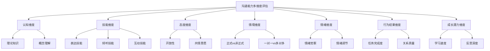

## 七、沟通能力的多维度评估框架

沟通能力是一个复杂的复合能力，单一维度的评估——比如只看"能不能说清楚"或只看"有没有说服力"——注定是片面的。一个有效的评估框架必须同时覆盖认知、技能、态度、情境、情绪、行为结果和成长潜力七个维度，才能还原沟通能力的完整面貌。

### 7.1 为什么需要多维度评估

传统的沟通能力评估往往犯一个根本性错误：用局部代替整体。最常见的三种偏差：

| 偏差类型 | 典型表现 | 后果 |
|----------|----------|------|
| 表达崇拜 | 只关注"说得流不流利" | 忽视听力、共情、情境适应等关键能力 |
| 结果导向 | 只看沟通结果是否达成目标 | 忽略沟通过程中的关系维护和信任建立 |
| 静态评估 | 在某一时刻、某一场景下做一次性评估 | 无法反映沟通者在不同压力、不同对象下的真实水平 |

多维度评估的核心理念来自心理学家Howard Gardner的多元智能理论和Daniel Goleman的情商模型——能力不是单一的标量，而是一个多维向量。具体到沟通领域，我们需要同时测量沟通者在知识储备、实际技能、心理态度、场景适应、情绪管理、行为效果和成长趋势七个方向上的表现，才能得到一个立体的能力画像。

### 7.2 七维度评估框架总览



七个维度的权重并非固定不变。在不同的职业场景和人生阶段，各维度的重要性会发生变化。以下是通用的参考权重：

| 维度 | 通用权重 | 管理者场景 | 销售场景 | 教师场景 | 技术人员场景 |
|------|----------|------------|----------|----------|--------------|
| 认知维度 | 15% | 10% | 10% | 20% | 25% |
| 技能维度 | 25% | 20% | 30% | 25% | 20% |
| 态度维度 | 15% | 20% | 15% | 20% | 10% |
| 情境维度 | 15% | 20% | 15% | 10% | 15% |
| 情绪维度 | 10% | 15% | 10% | 10% | 10% |
| 行为结果维度 | 10% | 10% | 15% | 10% | 10% |
| 成长潜力维度 | 10% | 5% | 5% | 5% | 10% |

### 7.3 认知维度评估

认知维度回答的问题是："你对沟通这件事理解有多深？"这是能力的地基——一个对沟通原理一无所知的人，即使天赋出众，也难以系统性地提升。

#### 7.3.1 评估内容的四个层次

**层次一：基础概念理解**

评估沟通者是否掌握沟通学的核心概念体系。这不是考名词解释，而是看能不能用这些概念解释真实的沟通现象。

- Shannon-Weaver模型中的噪声类型（物理噪声、心理噪声、语义噪声、生理噪声）能否在日常对话中识别出来
- Schramm交互模型中"经验域重叠"的概念——能否判断自己与沟通对象的知识背景差异
- 沟通的线性vs交互vs交易模型之间的本质区别
- 编码-解码过程中信息失真的常见原因

**层次二：策略知识储备**

评估沟通者是否了解不同场景下的沟通策略库：

- 冲突沟通中Thomas-Kilmann模型的五种策略（竞争、合作、妥协、回避、适应）各自适用的条件
- 说服沟通中Cialdini的六大影响力原则（互惠、承诺一致、社会认同、权威、稀缺、喜好）的具体应用场景
- 跨文化沟通中高语境文化与低语境文化的差异及其对沟通方式的影响
- 非暴力沟通（NVC）的四步框架：观察-感受-需要-请求

**层次三：元认知能力**

评估沟通者对自身沟通过程的监控和调节能力：

- 能否在对话进行中意识到自己的沟通模式正在起作用
- 能否识别自己在什么情况下容易出现沟通障碍
- 能否评估自己在特定沟通场景中的表现水平
- 能否预判沟通对象可能的反应并提前准备

**层次四：批判性分析能力**

评估沟通者分析和评价他人沟通行为的能力：

- 能否识别一段对话中的逻辑谬误（稻草人、滑坡、人身攻击等）
- 能否分析一次失败沟通的根本原因（是编码问题、渠道问题还是解码问题）
- 能否评价一篇演讲稿或一封商务邮件的沟通效果
- 能否识别媒体信息中的修辞操控手法

#### 7.3.2 评估方法

**方法一：知识测试（标准化笔试）**

设计40道选择题+5道案例分析题，覆盖上述四个层次。案例分析题的评分标准：

- 能正确识别问题属于哪个沟通维度：2分
- 能运用至少一个理论框架进行分析：3分
- 能提出具体可行的改进方案：3分
- 分析逻辑自洽、有理有据：2分
- 满分10分，6分以上为合格

**方法二：情景策略设计**

给出5个具体的沟通场景，要求评估对象在15分钟内写出沟通策略方案。场景示例：

> 你的团队需要在3天内完成一个紧急项目，但核心成员小王因家庭原因情绪低落，工作效率明显下降。你需要和小王进行一次一对一谈话。请写出你的沟通策略，包括：开场方式、核心信息、预期阻力及应对、结束方式。

评分维度：策略完整性（30%）、理论运用准确性（30%）、实操可行性（40%）。

**方法三：概念映射测试**

要求评估对象在30分钟内，以"有效沟通"为中心词，绘制一张概念关联图。评分标准不是概念数量，而是概念之间的关联质量和层次深度。

### 7.4 技能维度评估

技能维度回答的问题是："你实际上做得怎么样？"认知告诉你该怎么做，技能决定你能不能做到。这一维度的权重在多数场景中最高，因为沟通归根结底是一项实践能力。

#### 7.4.1 五大核心技能群

| 技能群 | 具体技能项 | 评估标准 | 权重 |
|--------|------------|----------|------|
| **倾听技能** | 积极倾听（复述确认） | 能准确复述对方核心观点，无遗漏无扭曲 | 25% |
| | 共情倾听（情感回应） | 能识别并回应对方的情绪状态，不评判不否定 | |
| | 批判性倾听（信息甄别） | 能区分事实、观点和情绪，识别信息中的矛盾和漏洞 | |
| | 深度倾听（未说出的信息） | 能察觉对方没有直接表达但暗示了的需求和顾虑 | |
| **表达技能** | 结构化表达（逻辑清晰） | 信息层次分明，因果关系明确，听众能跟上思路 | 25% |
| | 简洁表达（高效传达） | 用最少的词传递最大的信息量，不啰嗦不含糊 | |
| | 生动表达（感染力） | 善用类比、故事、数据，让抽象概念变得可感知 | |
| | 情感表达（真实透明） | 能恰当地表达自己的情绪和需求，不过度也不压抑 | |
| **提问技能** | 开放式提问 | 能用"什么""如何""为什么"引导对方展开思考 | 20% |
| | 封闭式提问 | 能用"是不是""有没有"快速确认事实 | |
| | 追问与深挖 | 能在对方回答的基础上层层深入，挖掘根因 | |
| | 假设性提问 | 能用"如果...你会怎么想"拓展对方的思考边界 | |
| **反馈技能** | 正面反馈（表扬激励） | 具体指出做得好的行为及其积极影响，不泛泛而谈 | 15% |
| | 建设性反馈（改进建议） | 对事不对人，指出具体行为+影响+期望，可操作 | |
| | 接收反馈（接纳回应） | 能平静听取批评，不防御不反击，提取有用信息 | |
| **非语言技能** | 眼神接触 | 保持适度眼神接触（60%-70%的时间），传达关注和真诚 | 15% |
| | 面部表情 | 表情与语言内容一致，微笑的时机和频率得当 | |
| | 身体语言 | 姿态开放（不交叉双臂），微微前倾表示关注 | |
| | 语音特征 | 语速适中（120-160字/分钟），音量适当，语调有变化 | |
| | 空间距离 | 保持合适的社交距离（0.5-1.2米），不侵犯对方舒适区 | |

#### 7.4.2 实操评估流程

**第一阶段：录像自评（30分钟）**

录制一段10分钟的模拟对话（与同事/朋友配合），然后回看并按以下清单逐项打分：

```text
倾听质量检查清单：
□ 我是否在对方说话时保持沉默，不打断？
□ 我是否通过点头、"嗯"等方式给予反馈？
□ 我是否在对方说完后停顿1-2秒再回应？
□ 我的回应是否准确反映了对方的核心意思？
□ 我是否在确认理解后才开始表达自己的观点？
□ 我是否注意到了对方的非语言信号？
□ 我是否对对方的情绪做出了回应？
□ 打分：每项0-2分，满分14分
```

**第二阶段：他人评估（三角反馈）**

分别请上级、同事、下属（或朋友、家人）各一人，使用标准化评估表对你打分。三人的视角互补，减少单一来源的偏差。评估表采用5分制李克特量表：

| 评估项目 | 1分（很差） | 3分（一般） | 5分（优秀） |
|----------|------------|------------|------------|
| 说话时条理清晰 | 经常让人听不懂重点 | 偶尔需要追问 | 每次都能清晰传达核心信息 |
| 倾听时专注投入 | 经常走神或看手机 | 有时能认真听 | 始终全神贯注，给予反馈 |
| 提问质量 | 问题模糊或无关 | 偶尔能问到关键点 | 问题精准，能引导深入思考 |
| 反馈方式 | 只有批评或只有表扬 | 有时能给出有用的反馈 | 反馈具体、及时、有建设性 |
| 非语言表达 | 表情僵硬或不一致 | 偶尔与语言一致 | 表情、语调、姿态协调一致 |

**第三阶段：压力测试**

在高压力场景下评估技能的稳定性。设置三个递增压力等级的场景：

- 低压力：与熟人讨论一个双方观点一致的话题
- 中压力：与陌生人就一个有分歧的话题进行讨论
- 高压力：在被对方质疑、打断甚至指责的情况下保持有效沟通

压力测试的核心指标不是"表现有多好"，而是"表现下降了多少"。优秀沟通者在压力下表现下降不超过20%。

### 7.5 态度维度评估

态度维度回答的问题是："你是否真的愿意沟通？"技能再高超，如果态度上封闭、抗拒或傲慢，沟通效果也会大打折扣。态度是沟通能力中"看不见的手"——它不直接出现在对话中，却无时无刻不在影响对话的走向。

#### 7.5.1 五个关键态度指标

**开放性（Openness）**

开放性衡量的是沟通者接受不同观点的意愿和能力。低开放性的人在对话中的典型表现：

- 对方还没说完就开始想怎么反驳
- 用"但是""不过"开头的频率超过50%
- 对与自己不同的观点本能地感到不适
- 倾向于只和观点相近的人交流

开放性的评估采用"观点多样性测试"：给评估对象呈现5个与他已有立场不同的观点（涉及道德、社会、技术等不同领域），要求他为每个观点找出3个合理的支撑论据。不是要求他改变立场，而是看他在多大程度上能理解对立面的逻辑。

**共情意愿（Empathic Willingness）**

共情意愿衡量的是沟通者理解他人感受的动力。注意区分共情意愿和共情能力——前者是"想不想"，后者是"能不能"。很多人有能力共情但选择不用，尤其在竞争性或冲突性的场景中。

评估方法："情绪日记"连续记录7天——每天记录至少一次你注意到他人情绪变化的时刻，写下：对方是谁、你观察到了什么情绪、你当时做了什么、你觉得可以做得更好的地方。

**真诚度（Authenticity）**

真诚度衡量的是沟通者表达真实想法的意愿。这不意味着"想到什么说什么"——真诚是有策略的真实表达，而非无差别的信息倾倒。

真诚度的评估困难在于它的"悖论"：如果你告诉一个人"请表现得真诚"，他的表现就不再完全自然了。因此推荐间接评估方式：

- 观察同一个人在不同场景中言行是否一致
- 比较他公开表达的观点和私下表达的观点是否有实质性差异
- 分析他在被问到困难问题时是回避、模糊还是正面回应

**尊重程度（Respect）**

尊重是有效沟通的底线。缺乏尊重的沟通不是沟通，而是居高临下的说教或争斗。尊重的评估关注以下具体行为：

- 是否使用对方的称谓偏好（名字、职务、昵称）
- 是否在对方发言时不打断
- 是否认真对待对方的观点，即使不同意
- 是否避免使用贬低性语言（"这个你不懂""你太天真了"）
- 是否在对方犯错时保护其尊严

**学习动力（Growth Mindset）**

Carol Dweck的固定型/成长型心态理论在此高度适用。沟通中的固定型心态表现为"我天生就不擅长说话""性格内向改不了了"；成长型心态表现为"我可以通过练习变得更好""这次沟通不顺利，我来分析一下哪里可以改进"。

评估方法：要求评估对象回忆最近一次沟通失败的经历，然后写下他对这次失败的归因分析。评分标准：

- 将失败归因于不可改变的因素（性格、天赋、对方问题）：1分
- 将失败归因于可改变但外部的因素（环境、时间不够）：2分
- 将失败归因于自身可改变的行为或策略：3分
- 在归因基础上提出了具体的改进计划：4分

### 7.6 情境维度评估

情境维度回答的问题是："你在不同场景下都能保持沟通质量吗？"一个只在舒适区里表现良好的沟通者，不能算作沟通能力强。真正的高手是"场景迁移能力强"——无论什么环境、什么对象、什么话题，都能快速调整策略并有效沟通。

#### 7.6.1 八组关键情境对照

| 情境变量 | 一端 | 另一端 | 评估重点 |
|----------|------|--------|----------|
| 人数 | 一对一 | 一对多（会议/演讲） | 能否根据受众规模调整表达方式 |
| 正式程度 | 非正式闲聊 | 正式商务谈判 | 能否在不同正式度之间自如切换 |
| 权力关系 | 向上沟通（对上级） | 向下沟通（对下属） | 能否在不同权力位置上保持有效性 |
| 亲疏关系 | 陌生人 | 密友/家人 | 能否根据关系深度调整沟通深度和方式 |
| 情绪环境 | 正面情绪场景 | 负面情绪场景 | 能否在对方情绪激动时保持冷静并有效引导 |
| 文化背景 | 同质文化 | 跨文化/跨代际 | 能否识别并适应文化差异 |
| 信息复杂度 | 简单信息 | 复杂/敏感信息 | 能否将复杂信息结构化、简单化传达 |
| 沟通渠道 | 面对面 | 文字（邮件/消息） | 能否根据渠道特点调整表达方式 |

#### 7.6.2 情境适应能力的评估方法

**方法一：场景轮转测试**

设计8个不同情境的模拟沟通任务（对应上表中的8组变量），每个任务5-8分钟，由评估对象依次完成。记录每个场景中的表现评分，然后计算"表现稳定性指数"——即8个场景得分的标准差。标准差越小，说明情境适应能力越强。

表现稳定性指数的计算：

```python
import math

scores = [8.5, 7.0, 6.5, 8.0, 5.5, 7.5, 7.0, 8.0]  # 8个场景的得分
mean = sum(scores) / len(scores)
variance = sum((x - mean) ** 2 for x in scores) / len(scores)
stability_index = math.sqrt(variance)

print(f"平均分: {mean:.1f}")
print(f"稳定性指数(标准差): {stability_index:.2f}")
# 稳定性指数 < 1.0: 优秀（适应能力强）
# 稳定性指数 1.0-2.0: 良好（部分场景需提升）
# 稳定性指数 > 2.0: 需要重点训练弱势场景
```

**方法二：跨场景行为一致性分析**

录制评估对象在3个不同场景中的沟通表现（如：团队会议、客户沟通、家庭对话），然后分析以下行为的一致性：

- 倾听行为占比是否稳定（标准差<10%为优秀）
- 提问类型分布是否随场景调整（开放式vs封闭式的比例应有合理变化）
- 非语言行为是否与场景匹配（正式场合不应过于随意）
- 信息密度是否随受众调整（对专家vs对外行应有区别）

### 7.7 情绪维度评估

情绪维度回答的问题是："你在沟通中能否有效管理自己的情绪？"心理学家John Gottman的研究表明，沟通的成败70%取决于情绪管理，只有30%取决于内容本身。一个情绪失控的人，即使掌握了全世界最好的沟通技巧，也无法有效运用。

#### 7.7.1 情绪评估的三个子维度

**子维度一：情绪觉察（Emotional Awareness）**

能否在沟通中实时识别自己和对方的情绪状态。这是情绪管理的前提——你无法管理你意识不到的东西。

评估工具：情绪颗粒度测试。给评估对象展示20张不同情绪的面部表情照片，要求他不仅说出"开心/难过/愤怒"这样的基本标签，还能区分"失望vs沮丧""焦虑vs紧张""欣慰vs满足"等更精细的情绪。情绪颗粒度越细，说明情绪觉察能力越强。

Lisa Feldman Barrett的情绪建构理论指出，情绪颗粒度高的人更善于调节情绪，因为他们能精确识别自己正在经历什么，从而选择更合适的应对策略。

**子维度二：情绪调节（Emotional Regulation）**

能否在沟通中保持情绪在合理范围内，不被情绪淹没也不过度压抑。

James Gross的情绪调节过程模型给出了四个调节时机：

1. **情境选择**——主动选择进入或回避某个沟通场景
2. **情境修正**——改变当前沟通场景中的某些因素（如换个地方谈话）
3. **注意力部署**——将注意力从情绪触发点转移到建设性话题上
4. **认知重评**——改变对当前情境的解读方式（"他在挑战我"→"他在提供不同视角"）

评估方法：压力情境模拟+生理指标监测。使用心率变异性（HRV）作为客观指标——HRV越高，说明情绪调节能力越强。如果没有生理监测设备，可用主观报告替代：在压力对话后，要求评估对象用1-10分自评当时的紧张程度，与录像中观察到的外在表现进行对比。

**子维度三：情绪表达（Emotional Expression）**

能否在沟通中恰当地表达情绪——既不过度（情绪化发作）也不压抑（完全没有情感温度）。

情绪表达的评估标准是"适当性"而非"强度"。在需要表达关切时有温度，在需要保持冷静时有定力，在需要表达不满时有分寸——这才是高质量的情绪表达。

#### 7.7.2 情绪维度综合评估表

```text
情绪维度评估表（对话后填写）

对话前状态：
□ 情绪平稳  □ 轻微紧张  □ 中度焦虑  □ 高度情绪化

对话中情绪变化：
| 时间点 | 我的情绪 | 对方的情绪 | 我做了什么 |
|--------|----------|------------|------------|
| 开场   |          |            |            |
| 1/3处  |          |            |            |
| 2/3处  |          |            |            |
| 结束   |          |            |            |

情绪触发点识别：
- 对方说了什么/做了什么让我产生了强烈情绪反应？________________
- 我当时的身体感受是什么？（心跳加速/肌肉紧绷/呼吸变浅）________________
- 我的第一反应是什么？（想反驳/想回避/想发火）________________
- 我实际做了什么？________________
- 如果重来一次，我会怎么做？________________

情绪管理评分（每项1-5分）：
- 情绪觉察准确度：___分
- 情绪调节有效性：___分
- 情绪表达适当性：___分
- 情绪对沟通的正面贡献：___分
```

### 7.8 行为结果维度评估

行为结果维度回答的问题是："你的沟通产生了什么实际效果？"前面六个维度关注的都是沟通者自身的能力状态，而行为结果维度将视角转向外部——看沟通的实际产出。这避免了"自我感觉良好但实际无效"的评估盲区。

#### 7.8.1 四类结果指标

**指标一：任务完成度**

沟通是否达成了预期的任务目标。这是最直接的结果指标，但也是最容易被过度依赖的指标——一个通过威胁达成了任务目标的沟通，不能算是高质量的沟通。

任务完成度的评估需要在沟通前明确记录预期目标，沟通后对照评估：

```text
沟通任务目标记录表

沟通前目标设定：
- 主要目标：________________
- 次要目标：________________
- 底线目标：________________

沟通后结果评估：
- 主要目标是否达成：□完全达成 □部分达成 □未达成
- 次要目标是否达成：□完全达成 □部分达成 □未达成 □未涉及
- 底线目标是否守住：□是 □否
- 额外收获（计划外的正面结果）：________________
```

**指标二：关系质量变化**

沟通是否增进了双方的信任、理解和关系质量。这是"过程指标"——即使任务目标未达成，关系质量的提升也可能为未来的合作奠定更好的基础。

评估方法：在沟通前后分别用1-10分评估"我对对方的信任程度"和"我认为对方对我的信任程度"。差值即为关系质量变化。

**指标三：信息准确度**

沟通中传递的信息是否被对方准确接收。这通过"信息回传测试"评估——在重要信息传达后，让对方用自己的话复述关键要点，对比原始信息的偏差程度。

信息准确度评分标准：
- 核心信息100%准确传达：5分
- 核心信息准确，细节有少量偏差：4分
- 核心信息基本准确，有非关键性遗漏：3分
- 核心信息有偏差或扭曲：2分
- 对方理解与本意有重大差异：1分

**指标四：后续行动力**

沟通结束后，对方是否有清晰的行动方向和动力去执行。很多沟通"当时感觉很好"但之后什么都没发生——这不是有效沟通。

评估方法：在沟通结束时或结束后24小时内，确认以下事项：
- 对方是否清楚知道下一步要做什么
- 对方是否清楚知道截止时间
- 对方是否清楚知道遇到问题找谁
- 对方对执行这件事是否有动力（而非只是被要求）

### 7.9 成长潜力维度评估

成长潜力维度回答的问题是："这个人未来能变得多好？"前面六个维度评估的是当前状态，而成长潜力评估的是变化速度。一个当前水平一般但学习速度极快的人，长期来看可能比一个当前水平高但停滞不前的人更有价值。

#### 7.9.1 成长潜力的四个指标

**指标一：反思深度**

能否从每次沟通经历中提取有价值的学习点。高反思深度的人不是简单地总结"这次做得好不好"，而是能分析"为什么好/不好""根本原因是什么""下次如何系统性地改进"。

评估方法：让评估对象选择最近3次不同结果的沟通经历（1次成功、1次失败、1次一般），分别写出反思记录。评分标准：

- 只描述现象，没有分析：1分
- 有分析，但停留在表面（紧张、准备不足）：2分
- 能找到具体的行为因素并分析原因：3分
- 能将具体经验上升为通用原则：4分
- 能提出可检验的改进假设并计划实践：5分

**指标二：学习迁移速度**

学到一个新的沟通技巧后，需要多长时间、多少次练习才能将其内化为自然行为。迁移速度越快，成长潜力越大。

评估方法：教授评估对象一个新的沟通技巧（如"三明治反馈法"），然后在接下来的3次实际沟通中观察他运用的情况：

- 第1次使用：能做到刻意应用（需要主动提醒自己）
- 第2次使用：能做到半自动化（偶尔需要提醒）
- 第3次使用：能做到全自动化（自然流畅地运用）

如果3次练习后就能达到全自动化，说明学习迁移速度优秀。如果需要10次以上，说明需要更多的刻意练习。

**指标三：反馈敏感度**

能否从他人的反馈中提取有价值的改进信息，并转化为行为改变。这不同于"愿意接受反馈"（态度维度），而是"从反馈中学习的能力"。

评估方法：在给评估对象提供一次具体的沟通反馈后，观察他在下一次沟通中的行为变化。有三种典型反应模式：

- **防御型**：解释、否认、反击——反馈敏感度低
- **接受型**：承认、理解、但行为不变——反馈敏感度中
- **行动型**：提取关键信息、制定改进计划、在下次沟通中体现变化——反馈敏感度高

**指标四：挑战意愿**

是否主动寻求超出舒适区的沟通场景来锻炼自己。成长只发生在舒适区的边缘——如果一个人总是回避困难的沟通场景，他的能力天花板就已经确定了。

评估方法：询问评估对象过去3个月中主动挑战过的困难沟通场景，评估其频率和难度递增的程度。

#### 7.9.2 成长潜力综合评估公式

将四个指标综合为一个成长潜力指数（Growth Potential Index, GPI）：

```text
GPI = (反思深度 × 0.3) + (学习迁移速度 × 0.3) + (反馈敏感度 × 0.25) + (挑战意愿 × 0.25)

各指标采用5分制：
- 5分：在该维度上表现卓越，远超同龄水平
- 4分：表现优秀，明显高于平均水平
- 3分：表现良好，处于平均水平
- 2分：表现一般，有明显提升空间
- 1分：表现较弱，需要重点关注

GPI 解读：
- 4.0-5.0：极强成长潜力，适合高强度训练计划
- 3.0-3.9：良好成长潜力，适合中等强度持续提升
- 2.0-2.9：成长潜力一般，需要先解决基础障碍
- 1.0-1.9：成长潜力较弱，需要从态度和动机层面入手
```

### 7.10 综合评估报告模板

将七个维度的评估结果整合为一份综合报告，形成沟通能力的完整画像：

```text
沟通能力多维度评估报告

评估对象：________________
评估日期：________________
评估周期：________________

一、维度得分汇总
| 维度 | 得分 | 权重 | 加权分 | 水平等级 |
|------|------|------|--------|----------|
| 认知维度 | /100 | 15% | | |
| 技能维度 | /100 | 25% | | |
| 态度维度 | /100 | 15% | | |
| 情境维度 | /100 | 15% | | |
| 情绪维度 | /100 | 10% | | |
| 行为结果维度 | /100 | 10% | | |
| 成长潜力维度 | /100 | 10% | | |
| 综合得分 | | 100% | /100 | |

二、能力画像雷达图（文字描述）
最强维度：________________ （得分：____）
最弱维度：________________ （得分：____）
维度间差距：____分（差距>20分提示能力不均衡）

三、核心优势（列出3个）
1. ________________________________
2. ________________________________
3. ________________________________

四、关键短板（列出3个）
1. ________________________________
2. ________________________________
3. ________________________________

五、30天改进计划
| 周次 | 重点维度 | 具体行动 | 预期变化 |
|------|----------|----------|----------|
| 第1周 | | | |
| 第2周 | | | |
| 第3周 | | | |
| 第4周 | | | |

六、下次评估时间：________________
```

### 7.11 评估框架的应用场景

这套七维度评估框架不是只能用于学术研究，在以下实际场景中都有直接的应用价值：

**场景一：个人成长规划**

用框架识别自己的短板维度，制定有针对性的提升计划。很多人在沟通能力上陷入瓶颈，根本原因是在同一个维度上反复用力，而忽略了真正制约整体表现的短板维度。

**场景二：团队能力诊断**

用框架评估团队整体的沟通能力分布，识别团队的共性短板。如果一个团队在"情绪维度"上的平均分明显低于其他维度，说明团队的情绪管理文化需要改善——这不是个人培训能解决的，需要从团队规范和领导示范入手。

**场景三：招聘与岗位匹配**

不同岗位对七个维度的权重需求不同。销售岗需要技能维度和情绪维度突出，技术管理岗需要认知维度和情境维度突出，客服岗需要情绪维度和态度维度突出。用框架评估候选人，可以做到更精准的人岗匹配。

**场景四：培训效果评估**

在培训前后分别用框架评估，可以精确衡量培训在哪些维度上产生了效果、在哪些维度上效果不足，从而优化培训内容的设计。

**场景五：教练与辅导**

沟通教练可以使用框架为被辅导者建立基线数据，然后在辅导过程中追踪各维度的变化趋势，用数据驱动辅导方向的调整。
