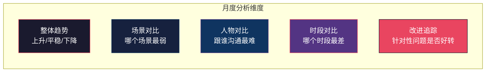
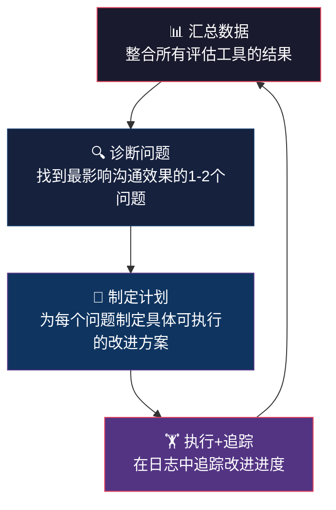

## 八、自评工具与方法

评估沟通能力，不能只靠"感觉自己还行"。你需要一套结构化的工具，把模糊的主观感受转化为可量化、可追踪、可对比的数据。本节提供六种自评工具，从快速自测到深度诊断，从即时反馈到长期追踪，覆盖不同场景和需求层次。

### 8.1 工具选择指南

不同工具适用于不同场景。下表帮你快速找到当前阶段最需要的工具：

| 工具 | 适用场景 | 耗时 | 深度 | 难度 |
|------|---------|------|------|------|
| 沟通能力自评问卷 | 快速了解现状，建立基准线 | 15-20分钟 | ★★★ | ⭐ |
| 360度反馈收集 | 获取多维度视角，发现盲区 | 2-3周 | ★★★★★ | ⭐⭐⭐ |
| 沟通日志记录 | 日常追踪，发现行为模式 | 每日5-10分钟 | ★★★★ | ⭐⭐ |
| 关键事件复盘法 | 深度分析特定沟通事件 | 每次15-30分钟 | ★★★★★ | ⭐⭐ |
| 沟通能力雷达图 | 可视化能力结构，定位短板 | 30分钟 | ★★★★ | ⭐⭐ |
| 视频回放分析 | 客观观察非语言行为 | 30-60分钟 | ★★★★★ | ⭐⭐⭐ |

**推荐使用策略**：先用自评问卷建立基准线（第1周），同步启动沟通日志记录（持续），第3周启动360度反馈收集，每月做一次雷达图对比，每季度做一次关键事件复盘和视频分析。

### 8.2 沟通能力自评问卷

这不是一份"随便填填"的问卷。每道题都对应一个可观察、可验证的行为指标。评分标准如下：

- **1分**：几乎从不这样做，或完全没有这个意识
- **2分**：偶尔这样做，但不稳定，需要别人提醒
- **3分**：有时这样做，但不够一致，特定情境下会忘记
- **4分**：经常这样做，已经成为习惯，偶尔有疏忽
- **5分**：几乎总是这样做，已经内化为自然反应

#### 倾听能力（5项，满分25分）

1. **专注倾听**：我能放下手机、停止手头工作，用眼神和身体语言表明我在认真听对方说话。
   - *评分锚点*：5分 = 在任何对话中都能做到全神贯注；3分 = 在重要对话中能做到，日常闲聊中容易分心；1分 = 经常边听边做别的事
2. **理解准确**：听完对方的话，我能用自己的语言复述对方的核心观点，且对方确认"你理解对了"。
   - *评分锚点*：5分 = 几乎每次都能准确复述；3分 = 大部分时候可以，偶尔有偏差；1分 = 经常误解对方意思
3. **情感识别**：我能察觉对方语气、表情、肢体语言中的情绪信号（焦虑、不满、兴奋、犹豫）。
   - *评分锚点*：5分 = 能识别细微的情绪变化并做出回应；3分 = 能识别明显的情绪，细微的会忽略；1分 = 很少关注对方的情绪
4. **引导深入**：我能通过有针对性的提问，帮助对方把模糊的想法说清楚，把表面的问题引向深层。
   - *评分锚点*：5分 = 自然地用追问和澄清推动对话深度；3分 = 有时能做到，但更多时候停留在表面；1分 = 很少主动提问
5. **开放心态**：当我听到与自己不同的观点时，我能先理解再评判，而不是立刻反驳。
   - *评分锚点*：5分 = 对任何不同观点都能保持好奇和开放；3分 = 在非敏感话题上能做到；1分 = 经常在对方还没说完就开始反驳

#### 表达能力（5项，满分25分）

6. **观点清晰**：我能用一句话说清自己的核心观点，不需要对方反复追问"你到底想说什么"。
   - *评分锚点*：5分 = 表达简洁有力，对方一次就能理解；3分 = 有时需要补充解释；1分 = 经常说了半天对方还是不明白
7. **听众适配**：我能根据听众的背景、知识水平和关注点，调整自己的表达方式和用词。
   - *评分锚点*：5分 = 对技术人员、管理层、客户能用完全不同的方式说同一件事；3分 = 会做一定调整但不够灵活；1分 = 对所有人都用同一种方式说
8. **举例说明**：我能用具体的例子、故事或类比来解释抽象概念，让对方更容易理解和记住。
   - *评分锚点*：5分 = 举例已经成为习惯，对方经常说"你这个比喻太形象了"；3分 = 有时会举例但不够及时；1分 = 很少用例子，倾向于直接讲道理
9. **压力表达**：在被质疑、被批评或情绪紧张时，我仍能冷静、有条理地表达自己的想法。
   - *评分锚点*：5分 = 压力越大表达越清晰；3分 = 轻度压力下可以，高度紧张时会混乱；1分 = 一紧张就说不出话或语无伦次
10. **简洁传达**：我能把复杂信息压缩成对方能快速消化的版本，不说多余的废话。
    - *评分锚点*：5分 = 能用3句话说清别人需要10分钟才能说清的事；3分 = 有时会啰嗦但能及时收住；1分 = 经常跑题或重复，让对方失去耐心

#### 情感能力（5项，满分25分）

11. **情绪觉察**：我能实时感知自己的情绪状态（我现在是愤怒、焦虑、委屈还是兴奋），而不是事后才意识到。
    - *评分锚点*：5分 = 在情绪升起的当下就能识别并命名；3分 = 事后复盘时能识别；1分 = 经常不知道自己为什么情绪失控
12. **情感表达**：我能用恰当的方式表达自己的情感，既不压抑也不爆发。
    - *评分锚点*：5分 = 能用"我感到……因为……"的句式清晰表达感受；3分 = 能表达正面情感，负面情感倾向于压抑或爆发；1分 = 很少主动表达情感
13. **共情回应**：当对方表达情感时，我能先回应感受再解决问题，而不是直接给建议。
    - *评分锚点*：5分 = 自然地先说"我能理解你的感受"再讨论方案；3分 = 有时能做到，有时会急于解决问题；1分 = 几乎总是直接给建议
14. **冲突理性**：在意见分歧或激烈争论中，我能保持对事不对人，不进行人身攻击。
    - *评分锚点*：5分 = 即使对方人身攻击我也能保持理性回应；3分 = 大部分时候能做到，被激怒时偶尔失控；1分 = 经常在冲突中说伤人的话
15. **情感连接**：我能在沟通中让对方感到被理解、被尊重，从而建立信任关系。
    - *评分锚点*：5分 = 对方经常主动找我倾诉或征求意见；3分 = 与亲近的人能做到，与陌生人较难；1分 = 别人觉得我冷漠或难以接近

#### 社交能力（5项，满分25分）

16. **主动交流**：我能在社交场合主动发起对话，不需要等别人来找我。
    - *评分锚点*：5分 = 在任何社交场合都能自然地与陌生人交谈；3分 = 在有共同话题时能做到；1分 = 几乎从不主动与陌生人说话
17. **多元关系**：我能与不同年龄、职业、文化背景的人建立良好的沟通关系。
    - *评分锚点*：5分 = 朋友圈跨越多个圈层，与各种人都能聊得来；3分 = 与相似背景的人沟通良好，差异大的会不适应；1分 = 只能与固定圈子的人沟通
18. **团队协作**：我能在团队讨论中既表达自己的观点，又尊重和整合他人的意见。
    - *评分锚点*：5分 = 经常能协调不同意见，推动团队达成共识；3分 = 能表达自己但不太会整合他人；1分 = 要么沉默要么独断
19. **关系维护**：我能持续维护重要的人际关系，不会因为忙碌就断了联系。
    - *评分锚点*：5分 = 有系统的关系维护习惯，重要的人定期联系；3分 = 想到时会联系，但不规律；1分 = 经常忘记回复消息或几个月不联系朋友
20. **公开表达**：我能在会议、汇报、演讲等公开场合自信地表达，不会过度紧张。
    - *评分锚点*：5分 = 在100人以上场合也能自如表达；3分 = 在小范围内可以，大场合会紧张；1分 = 在任何公开场合都极度紧张

#### 评分计算与解读

将四个维度的分数分别相加，得到维度得分和总分：

| 总分区间 | 等级 | 解读 | 行动建议 |
|---------|------|------|---------|
| 80-100 | 卓越 | 沟通能力是你的核心竞争力，可以指导他人 | 担任沟通教练，精进高级技巧（谈判、演讲、危机沟通） |
| 65-79 | 良好 | 基础扎实，在多数场景中沟通自如 | 针对短板维度重点突破，挑战更高难度场景 |
| 50-64 | 中等 | 有基本沟通能力，但存在明显短板 | 系统学习+刻意练习，优先补短板 |
| 35-49 | 待提升 | 沟通问题正在影响你的人际关系和职业发展 | 从基础开始重建，建议配合360度反馈找到最关键问题 |
| 20-34 | 薄弱 | 沟通是当前最大的成长瓶颈 | 建议寻求专业沟通教练或参加系统培训 |

**关键分析技巧**：不要只看总分。四个维度之间的分数差异比总分更有信息量。例如：

- 倾听22分 + 表达18分 = "你听得很明白，但说不清楚" → 重点练表达
- 表达23分 + 情感15分 = "你很会说，但不会共情" → 重点练情感沟通
- 社交20分 + 倾听16分 = "你很活跃但别人觉得你不走心" → 重点练倾听
- 四个维度分数相近但都不高 = 需要全面提升，从最常用的维度开始

### 8.3 360度反馈收集

自评最大的问题是**盲区**——你看不到自己的盲点。360度反馈通过收集多个视角的观察，帮你发现"别人眼中的你"和"你以为的自己"之间的差距。

#### 选择反馈人

反馈人的质量直接决定反馈的价值。选择标准：

| 反馈来源 | 人数 | 选择标准 | 能提供什么 |
|---------|------|---------|-----------|
| 直接上级 | 1-2人 | 与你有至少3个月共事经历，了解你的工作表现 | 你在正式场合的沟通表现、汇报能力、执行力沟通 |
| 同级同事 | 2-3人 | 日常协作频繁，有直接沟通经历 | 你在日常协作中的沟通风格、团队配合度 |
| 下属（如有） | 2-3人 | 向你汇报，直接感受你的管理沟通 | 你的指令清晰度、反馈质量、倾听态度 |
| 客户/合作方 | 1-2人 | 有持续业务往来 | 你的专业沟通、需求理解、服务态度 |
| 家人/密友 | 1-2人 | 关系亲密，敢于说真话 | 你在非工作场景中的真实沟通状态 |

**关键原则**：选择敢于说真话的人，而不是只会说好话的人。如果所有人给你的反馈都是"你沟通很好啊"，要么你确实完美（概率极低），要么你选错了反馈人。

#### 设计反馈问卷

问卷设计的好坏决定了反馈的质量。避免模糊的问题，聚焦具体可观察的行为。

**问卷模板**（可直接使用）：

沟通能力360度反馈问卷
━━━━━━━━━━━━━━━━━━━━━━━━━━━━━━━━━━━━━━━━

被评估人：[姓名]
评估人关系：[上级/同级/下属/客户/家人]
评估日期：[日期]

第一部分：行为频率评估（1-5分）
1=几乎从不  2=偶尔  3=有时  4=经常  5=几乎总是

倾听维度：
□ [姓名] 在对话中能让我感到被认真倾听          [ ]
□ [姓名] 能准确理解我表达的意思，很少误解        [ ]
□ [姓名] 在我表达不同意见时能保持开放态度        [ ]

表达维度：
□ [姓名] 表达观点时逻辑清晰，我能跟上思路        [ ]
□ [姓名] 能根据场景调整沟通方式                  [ ]
□ [姓名] 在讨论中能用例子帮助我理解              [ ]

情感维度：
□ [姓名] 能察觉并回应我的情绪                    [ ]
□ [姓名] 在有分歧时能保持尊重和理性              [ ]
□ [姓名] 与 [姓名] 沟通让我感到信任和安全        [ ]

社交维度：
□ [姓名] 在团队讨论中既能表达也能倾听            [ ]
□ [姓名] 能与不同风格的人有效沟通                [ ]
□ [姓名] 在公开场合表达自信得体                  [ ]

第二部分：开放性问题（请举具体例子）

1. 在与我的沟通中，[姓名] 做得最好的一点是什么？
   请举一个具体场景或事件来说明：

2. 如果 [姓名] 在沟通方面改进一个方面，什么改变
   会对你们的合作/关系产生最大的积极影响？
   请举一个具体场景说明这个问题：

3. 用三个词形容 [姓名] 的沟通风格：

4. 还有什么你想说但没被问到的？

━━━━━━━━━━━━━━━━━━━━━━━━━━━━━━━━━━━━━━━━

#### 发起反馈的正确姿势

很多人知道要做360度反馈，但用错了方式。以下是关键注意事项：

**邀请话术模板**：

> "我最近在系统提升自己的沟通能力，非常需要真实的外部视角。你是我日常沟通最多的人之一，你的观察对我非常有价值。问卷大概需要10-15分钟，所有回答都是匿名的，我希望你完全坦诚——哪怕是批评，对我来说也是最宝贵的礼物。"

**核心原则**：

- **匿名保障**：使用在线表单工具（腾讯问卷、金数据、Google Forms），确保评估人知道反馈是匿名的
- **时间窗口**：给评估人1-2周的填写时间，不要催促
- **不要追问**：如果有人婉拒，尊重对方选择，不要追问原因
- **表达感谢**：无论反馈内容如何，都要真诚感谢对方的时间和坦诚

#### 分析反馈数据

收到反馈后，按以下步骤分析：

**第一步：计算均分和标准差**

将量化评分按维度汇总，计算每个维度的平均分和自评与他评的差距：

维度       自评    他评均分    差距    解读
倾听       4.2     3.1        +1.1    高估了自己
表达       3.0     3.2        -0.2    基本准确
情感       2.8     2.5        +0.3    基本准确
社交       3.5     3.8        -0.3    略低估了自己

**第二步：识别"自我认知盲区"**

差距大于0.8分的维度就是你的盲区。差距为正（自评>他评）说明你高估了自己，差距为负（自评<他评）说明你低估了自己。高估比低估更危险——因为你不知道自己有问题。

**第三步：提取开放性问题的主题**

将所有开放性回答汇总，找出重复出现的关键词和主题。如果3个人独立提到"说话太快"，那这就是一个需要重点关注的问题。

**第四步：制定行动计划**

选择1-2个最关键的改进点，制定具体、可执行的改进计划。不要试图同时改进所有问题。

### 8.4 沟通日志记录

日志是最被低估的自我提升工具。它的原理很简单：**你记录什么，就会关注什么；你关注什么，就会改善什么。**

心理学研究（Kahneman等人关于"体验自我"与"记忆自我"的研究）表明，人们对自身经历的即时评估和事后回忆往往存在显著偏差。沟通日志的价值在于：它帮助你从"凭感觉回忆"转向"基于记录分析"，从而获得更准确的自我认知。

#### 每日沟通日志模板

日期：[年/月/日]  整体状态：[精力充沛/一般/疲惫]
━━━━━━━━━━━━━━━━━━━━━━━━━━━━━━━━━━━━━━━━

【沟通事件 1】
时间：[几点]
对象：[谁，什么关系]
场景：[会议/电话/面谈/微信/邮件]
主题：[沟通了什么]
沟通效果：[1-10分]
  好的方面：[具体做得好的1-2个点]
  不足方面：[具体可以改进的1-2个点]
  对方的反应：[对方的语言/表情/行为反应]
下次改进：[如果重来一次，我会怎么做]

【沟通事件 2】
（同上格式）

【沟通事件 3】
（同上格式）

【今日总结】
最大的收获：
最大的遗憾：
明天要注意的一件事：

━━━━━━━━━━━━━━━━━━━━━━━━━━━━━━━━━━━━━━━━

#### 填写要点

**只记最重要的3次沟通**：不要试图记录所有对话。选择当天最重要的、最有挑战性的、或最有代表性的3次沟通。质量远比数量重要。

**关注具体行为而非模糊感受**：

- ❌ "今天开会说得不好" → 太模糊，无法改进
- ✅ "今天开会发言时，我说了3个要点但没有给出数据支撑，老板追问了两次" → 具体可改进

**记录对方的反应**：沟通效果不是你感觉好不好，而是对方的反应。对方皱眉、沉默、追问、点头、微笑，这些都是评估沟通效果的客观信号。

**"下次改进"是核心**：如果日志只记了发生了什么而没有写"下次我会怎么做"，那日志只完成了一半价值。

#### 每周复盘模板

第 [N] 周沟通复盘（[日期] - [日期]）
━━━━━━━━━━━━━━━━━━━━━━━━━━━━━━━━━━━━━━━━

一、数据统计
本周记录的沟通事件总数：[N] 次
平均沟通效果评分：[X] 分
最高分事件：[简述] → 为什么成功？
最低分事件：[简述] → 为什么失败？

二、模式识别
重复出现的优点（出现2次以上）：
  1. [例如：我在一对一沟通中倾听做得很好]
  2. [例如：我用具体例子解释抽象概念时效果很好]

重复出现的问题（出现2次以上）：
  1. [例如：在多人会议中我经常被打断]
  2. [例如：我在情绪激动时会说话语速加快]

三、改进评估
上周制定的改进目标：[具体内容]
本周执行情况：[做到了/部分做到/没做到]
效果如何：[有改善/没有变化/反而更差]

四、下周计划
重点改进方向：[1个，不超过2个]
具体行动：[做什么、什么时候做、怎么做]
验证标准：[怎么知道自己做到了]

━━━━━━━━━━━━━━━━━━━━━━━━━━━━━━━━━━━━━━━━

#### 月度趋势分析

每月月底，花30分钟做一次趋势分析。将每周的平均分绘制成折线图，观察：

- **整体趋势**：分数是上升、平稳还是下降？
- **波动规律**：哪些天/哪些场景的分数偏低？是否与工作节奏、情绪周期有关？
- **改进效果**：你针对性改进的问题是否有分数上的体现？

### 8.5 关键事件复盘法

日常日志关注"量"，关键事件复盘关注"质"。当你经历了一次特别成功或特别失败的沟通，花15-30分钟做一次深度复盘，比记录10次普通对话更有价值。

#### 适用场景

- 演讲、汇报、答辩等高 stakes 沟通
- 谈判、说服、冲突处理等高难度场景
- 出现了意外结果（意料之外的成功或失败）
- 被上级/同事/客户明确表扬或批评了沟通表现
- 感觉自己的情绪严重影响了沟通效果

#### 复盘框架：STAR-D模型

| 步骤 | 内容 | 具体问题 |
|------|------|---------|
| **S**ituation（情境） | 还原沟通发生的背景 | 这次沟通的目的是什么？对方是谁？什么关系？什么场景？有什么约束条件？ |
| **T**ask（任务） | 明确沟通的目标 | 我想达成什么结果？对方想达成什么结果？有没有利益冲突？ |
| **A**ction（行动） | 详细回顾沟通过程 | 我说了什么？怎么说的？对方的反应是什么？有没有关键转折点？我的情绪变化是什么？ |
| **R**esult（结果） | 评估实际效果 | 目标达成了吗？对方的最终反应是什么？关系有没有变化？ |
| **D**iagnosis（诊断） | 分析成功/失败原因 | 成功是因为什么？失败是因为什么？如果重来一次，哪里会不同？ |

#### 复盘示例

关键事件复盘：季度汇报
━━━━━━━━━━━━━━━━━━━━━━━━━━━━━━━━━━━━━━━━

S - 情境：
  季度工作汇报，面对部门总监和3位同级经理
  上季度数据不太好看（完成率78%），总监对此有意见
  需要争取下季度的资源支持

T - 任务：
  如实汇报数据，解释原因，争取下季度不削减预算
  对总监的潜在质疑做好应对准备

A - 行动（逐段回顾）：
  开场：先承认数据不达标，直接说"上季度完成率78%，
        没有达到目标，我对此负全责" → 总监表情缓和
  中段：用3个数据点解释原因（市场变化、人员变动、
        客户延期），每个原因配了具体数据
  转折：总监问"人员变动是你的管理问题" → 我没有辩解，
        说"确实是我在人员培养上投入不够，下季度我计划..."
  结尾：给出下季度的具体方案和里程碑

R - 结果：
  总监说"这次汇报比上次好，数据清楚，态度也对"
  预算没被削减，还额外给了1个HC
  两位同级经理会后找我聊方案细节

D - 诊断：
  做对了：
  1. 先承认问题再解释原因（先认错再分析的策略）
  2. 每个论点都有数据支撑（不是感觉，是数字）
  3. 被质疑时不辩解而是转向解决方案
  可改进：
  1. 开场可以更简洁，背景铺垫太长了（约2分钟）
  2. PPT第8页数据有错误，幸好提前发现了
  3. 结尾可以更有力地表达信心，而不是只说方案

可迁移的经验：
  - "先认错再分析"的策略在对上有很好的效果
  - 数据支撑是说服管理层的基础
  - 被质疑时"不辩解转方案"是一个可反复使用的技巧

━━━━━━━━━━━━━━━━━━━━━━━━━━━━━━━━━━━━━━━━

### 8.6 沟通能力雷达图

雷达图能直观展示你的沟通能力结构，一眼看出优势和短板。它也是追踪进步的最佳可视化工具——把不同时间点的雷达图叠在一起，进步一目了然。

#### 绘制方法

**第一步：确定评估维度**

从自评问卷和360度反馈中提取8-10个核心维度：

| 维度 | 数据来源 | 权重建议 |
|------|---------|---------|
| 倾听专注度 | 自评+360反馈 | 高 |
| 理解准确性 | 自评+360反馈 | 高 |
| 表达清晰度 | 自评+360反馈 | 高 |
| 情感共情力 | 自评+360反馈 | 高 |
| 提问引导力 | 自评+360反馈 | 中 |
| 冲突处理力 | 自评+360反馈 | 中 |
| 公众表达力 | 自评 | 中 |
| 说服影响力 | 360反馈 | 中 |
| 非语言表达 | 视频分析 | 中 |
| 跨文化敏感度 | 360反馈 | 低（按需） |

**第二步：评分标注**

在每个维度上标注1-5分。如果有自评和360度反馈两个数据源，分别用不同颜色标注，差距本身就是重要信息。

**第三步：定期更新**

每月或每季度重新评估一次，将新旧雷达图叠在一起对比。进步的维度向外扩展，退步的维度向内收缩。

```mermaid
graph TB
    subgraph "沟通能力雷达图示例"
        direction TB
        R1["倾听专注度 ★★★★☆ 4.0"]
        R2["理解准确性 ★★★★☆ 3.5"]
        R3["表达清晰度 ★★★☆☆ 3.0"]
        R4["情感共情力 ★★★☆☆ 2.5"]
        R5["提问引导力 ★★★★☆ 3.5"]
        R6["冲突处理力 ★★☆☆☆ 2.0"]
        R7["公众表达力 ★★☆☆☆ 2.0"]
        R8["说服影响力 ★★★☆☆ 3.0"]
    end
    style R1 fill:#1b4332,stroke:#2d6a4f,color:#fff
    style R2 fill:#1b4332,stroke:#2d6a4f,color:#fff
    style R3 fill:#16213e,stroke:#0f3460,color:#fff
    style R4 fill:#e94560,stroke:#1a1a2e,color:#fff
    style R5 fill:#1b4332,stroke:#2d6a4f,color:#fff
    style R6 fill:#e94560,stroke:#1a1a2e,color:#fff
    style R7 fill:#e94560,stroke:#1a1a2e,color:#fff
    style R8 fill:#16213e,stroke:#0f3460,color:#fff
```

#### 雷达图解读策略

**"凹凸型"能力结构**：有明显的高点和低点。策略：维持优势，集中资源补齐最短板。短板是制约你整体沟通效果的瓶颈。

**"平庸型"能力结构**：所有维度都在3分左右，没有明显短板也没有突出优势。策略：选择1-2个你最常用的维度先突破到4分以上，建立信心后再扩展。

**"偏科型"能力结构**：某一个维度远高于其他维度（如表达4.5但倾听2.0）。策略：最突出的优势可能正在掩盖最严重的问题——"太能说"有时恰恰是沟通差的表现。

### 8.7 视频回放分析

视频是最残酷也最诚实的评估工具。大多数人第一次看自己的沟通录像时都会震惊——"我真的那样说话的？""我的表情怎么是这样的？""我竟然说了那么多'那个'！"

#### 操作方法

**录制场景选择**：

- 最佳选择：会议发言、工作汇报、演讲练习等正式场景
- 次优选择：与朋友讨论问题、向同事解释方案等半正式场景
- 最低要求：对着镜头模拟一次3分钟的汇报

**录制设备**：手机即可。放在你能看到的侧面45度位置，确保能拍到上半身和面部表情。

**回放分析清单**：

| 分析维度 | 关注点 | 自我提问 |
|---------|--------|---------|
| 语言内容 | 逻辑结构、用词准确性 | 核心观点清楚吗？有没有废话？有没有口头禅？ |
| 语速节奏 | 太快、太慢、还是适中 | 关键信息有没有放慢？有没有给对方消化的时间？ |
| 音量音调 | 太小声、太平、还是有变化 | 重要内容有没有加重语气？全程是不是一个调？ |
| 面部表情 | 眼神、微笑、皱眉 | 眼神有没有游离？表情和内容一致吗？ |
| 肢体语言 | 手势、姿态、移动 | 手是插口袋还是自然摆放？身体是前倾还是后仰？ |
| 互动质量 | 倾听反应、回应方式 | 对方说话时你在干什么？有没有打断？ |

**关键技巧**：看两遍。第一遍关掉声音，只看画面——你的非语言行为说了什么？第二遍闭上眼睛，只听声音——你的语音、语速、语气传达了什么？

### 8.8 数字化工具推荐

以下工具可以辅助你的自评和成长过程：

| 工具类型 | 推荐工具 | 用途 | 费用 |
|---------|---------|------|------|
| 问卷工具 | 腾讯问卷/金数据/问卷星 | 设计和分发360度反馈问卷 | 免费/基础版免费 |
| 日志工具 | Notion/飞书文档/石墨文档 | 记录沟通日志和复盘 | 免费/基础版免费 |
| 视频录制 | 手机自带相机/腾讯会议录制 | 录制沟通场景 | 免费 |
| 语音分析 | 讯飞听见/飞书妙记 | 分析语速、停顿、口头禅频率 | 部分免费 |
| 习惯追踪 | 小日常/Habitica/滴答清单 | 追踪每日沟通练习完成情况 | 免费 |
| 思维导图 | XMind/ProcessOn | 绘制沟通能力结构图 | 免费/基础版免费 |

**使用建议**：不要贪多。选一个日志工具+一个问卷工具就够了。工具是为了降低记录成本，如果工具本身成了负担，就违背了初衷。

### 8.9 常见评估陷阱与纠正

很多人在自评过程中会掉入以下陷阱，导致评估结果失真：

**陷阱一：光环效应**

- *表现*：因为某次成功的沟通经历，就给自己所有维度都打了高分
- *纠正*：每次评分时问自己"这个维度我有具体的证据吗"，没有证据就不给高分

**陷阱二：近因效应**

- *表现*：最近一次沟通的体验主导了整体评估。昨天表现好就全面高估，昨天表现差就全面低估
- *纠正*：回忆过去1个月的沟通经历，而不是只看最近一两次

**陷阱三：社交期望偏差**

- *表现*：在自评时给自己打"社会期望"的分数（应该能做到而不是实际能做到）
- *纠正*：问自己"过去一周的实际行为中，我做到了几次"，用频率而非能力来评分

**陷阱四：选择性记忆**

- *表现*：只记住自己做得好的沟通，选择性遗忘做得差的
- *纠正*：在日志中强制记录"最低分事件"，确保负面反馈不被遗忘

**陷阱五：评估疲劳**

- *表现*：做了几次评估后觉得"反正都是这些"，开始敷衍填写
- *纠正*：降低频率但保持质量——每月认真做一次比每周敷衍做一次更有价值

### 8.10 从评估到行动：数据驱动的成长闭环

评估本身不是目的。所有工具收集到的数据，最终要转化为行动。以下是将评估结果转化为具体行动的四步流程：

**行动卡模板**（每个改进点一张卡）：

━━━━━━━━━━━━━━━━━━━━━━━━━━━━━━━━━━━━━━━━
沟通改进行动卡 #01
━━━━━━━━━━━━━━━━━━━━━━━━━━━━━━━━━━━━━━━━
问题：[从数据中识别的具体问题]
  例：在多人会议中经常被打断，原因是说话时没有
  明确的逻辑框架，观点散乱导致听众失去耐心

数据来源：[哪个工具、什么数据]
  例：360度反馈中3人提到"开会时说话抓不住重点"；
  沟通日志中连续3周会议场景评分低于5分

改进目标：[具体、可衡量]
  例：在月度内让会议发言被打断次数从平均3次/次
  降到1次/次以下

具体行动：
  1. [第一步做什么]
     例：每次发言前用30秒在纸上写下核心观点和支持论据
  2. [第二步做什么]
     例：采用"总-分-总"结构：先说结论，再给3个理由，最后重申结论
  3. [第三步做什么]
     例：发言控制在2分钟以内，如果超时就主动说"具体细节
     我会后单独说"

验证标准：[怎么知道自己做到了]
  例：连续4次会议发言被打断次数≤1次

追踪记录：
  第1周：[实际情况]
  第2周：[实际情况]
  第3周：[实际情况]
  第4周：[实际情况]

总结：[一个月后的回顾]
━━━━━━━━━━━━━━━━━━━━━━━━━━━━━━━━━━━━━━━━

**核心原则**：每次只聚焦1-2个改进点。贪多嚼不烂——试图同时改进5个问题，结果往往是哪个都没改好。把1个问题彻底解决，比把5个问题各改一点更有价值。

***