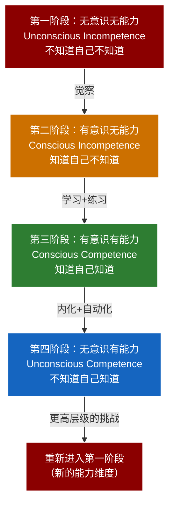
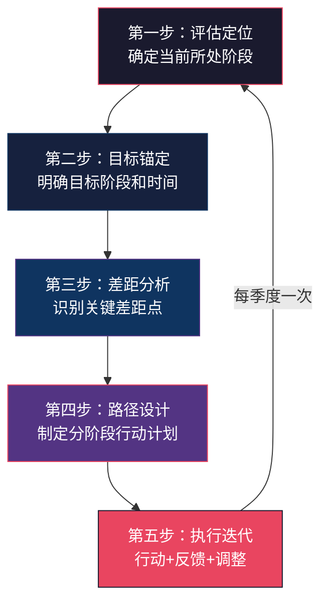

## 九、成长路径规划

评估让你知道"我在哪里"，但只有成长路径才能告诉你"怎么到达那里"。本节将四阶段能力发展模型与个人成长规划工具深度结合，帮你从任意起点出发，设计一条可执行、可衡量、可调整的沟通能力成长路线。

### 9.1 成长路径的理论基础

#### 9.1.1 四阶段意识-能力模型

四阶段成长模型最早由心理学家 Martin Broadwell 于1969年提出，后经 Noel Burch 在 Gordon Training International 的工作中推广，被称为"意识-能力矩阵"（Conscious Competence Matrix）。这个模型描述了任何技能习得过程中，学习者必然经历的四个心理状态：

这个模型有一个关键洞察：**成长不是线性的，而是螺旋上升的**。当你在某个维度达到第四阶段后，新的挑战会把你重新拉回第一阶段——比如你在一对一沟通中已经游刃有余（第四阶段），但面对200人的演讲时，你又回到了"不知道自己不知道"的状态。这不是退步，而是成长的必然结构。

#### 9.1.2 与 Dreyfus 技能习得模型的关系

Stuart 和 Hubert Dreyfus 兄弟在1980年提出了更细粒度的五阶段模型（新手→高级初学者→胜任者→精通者→专家），可以与四阶段模型形成互补：

| 四阶段模型 | Dreyfus 五阶段 | 沟通能力对应表现 |
|-----------|---------------|----------------|
| 无意识无能力 | 新手（Novice） | 不知道倾听的重要性，说话不经思考，对沟通效果没有概念 |
| 有意识无能力 | 高级初学者（Advanced Beginner） | 知道自己表达不清、不会倾听，但不知道如何系统改进 |
| 有意识有能力 | 胜任者（Competent）+ 精通者（Proficient） | 能有意识地运用沟通技巧，但需要刻意调用，偶有遗忘 |
| 无意识有能力 | 专家（Expert） | 沟通技巧已经内化为直觉，能根据情境自动选择最优策略 |

在实际应用中，四阶段模型更适合指导个人成长规划，因为它更简洁，更容易映射到行动方案。Dreyfus模型则更适合组织层面的能力建设和人才梯队规划。

### 9.2 四阶段详解与阶段特征

#### 9.2.1 第一阶段：无意识无能力

**核心状态**：你不知道自己不知道什么。你可能觉得自己沟通没问题，或者根本没想过"沟通"是一个需要学习的能力。

**典型表现**：

- 开会时滔滔不绝却不自知别人已经走神
- 认为"我说清楚了，是他们理解能力差"
- 不理解为什么同事不愿意和自己合作
- 把沟通问题归因于他人："他就是听不懂"
- 从未主动寻求过沟通方面的反馈
- 认为沟通是"天生的能力"，无法后天培养

**心理特征**：这个阶段最大的障碍是**认知盲区**——你无法看到自己的问题，因为你缺乏评估自己沟通水平的参照框架。心理学上称之为"达克效应"（Dunning-Kruger Effect）：能力不足的人往往高估自己的水平。

**阶段突破的触发条件**：

1. **外部冲击**：一次重大的沟通失败（搞砸了重要汇报、与关键客户发生冲突、团队因为沟通问题出现危机）
2. **他人的坦诚反馈**：一个你信任的人直接告诉你"你的沟通方式有问题"
3. **对比觉醒**：观察到一个沟通高手的表现，突然意识到差距
4. **系统学习的入口**：读到一本沟通类书籍或参加了一次培训，打开了认知大门

**从第一阶段到第二阶段的行动**：

| 行动项 | 具体做法 | 预期投入 |
|--------|---------|---------|
| 接受反馈 | 主动问3-5个信任的人："我在沟通中最大的问题是什么？" | 1-2周 |
| 自我观察 | 每天记录1-2次沟通场景，不做评判，只记录事实 | 持续进行 |
| 建立参照系 | 阅读1-2本经典沟通书籍（如《非暴力沟通》《关键对话》） | 2-4周 |
| 观察高手 | 找到身边沟通能力强的人，观察他们的具体做法 | 持续进行 |

#### 9.2.2 第二阶段：有意识无能力

**核心状态**：你开始意识到自己的不足，但能力还没跟上来。这个阶段是整个成长过程中**最痛苦也最容易放弃**的阶段——你看到了差距，却还没能缩小它。

**典型表现**：

- 学了很多理论，但一到实际场景就忘了
- 在事后复盘时能发现自己的问题，但在当下却做不出正确的反应
- 会对自己说"怎么又犯了同样的错误"
- 在尝试新技巧时感到不自然、做作
- 面对复杂的沟通场景时感到焦虑和无力

**心理特征**：这个阶段的核心挑战是**能力焦虑**——知道得越多，越发现自己不足。Carol Dweck的成长型思维理论在这里特别重要：你需要把"我做不好"转化为"我还没做好，但我正在学习"。

**阶段突破的关键策略**：

1. **接受笨拙期**：所有学习都必然经历一个"做得比不学时更差"的阶段。这是因为你把无意识的坏习惯拉到了意识层面，暂时打破了原有的自动化流程。这个笨拙期通常持续2-6周，坚持过去就会迎来突破。

2. **单点突破**：不要试图同时改进所有方面。选择一个最影响你的沟通痛点，集中精力突破。比如：
   - 如果你总是打断别人 → 这两周只练"等对方说完再开口"
   - 如果你表达没有逻辑 → 这两周只练"先说结论再说原因"
   - 如果你开会紧张 → 这两周只练"会前准备3个要点"

3. **建立安全的练习场**：不要在高风险场景中练习新技巧。先在低风险环境中（与家人、朋友、非关键同事的日常对话）建立基本功，再逐步应用到高风险场景。

**从第二阶段到第三阶段的行动**：

| 行动项 | 具体做法 | 预期投入 |
|--------|---------|---------|
| 刻意练习 | 每天15-30分钟专注练习一个沟通技能 | 8-12周 |
| 场景设计 | 为每个练习目标设计3-5个具体场景 | 每周更新 |
| 反馈循环 | 每次练习后记录"做得好的"和"需改进的"各1点 | 每次练习后 |
| 小组练习 | 加入Toastmasters或组建练习小组 | 每周1-2次 |
| 理论深化 | 针对练习中的困难点，阅读相关理论和方法 | 按需进行 |

#### 9.2.3 第三阶段：有意识有能力

**核心状态**：你已经掌握了核心沟通技巧，能够在有意识调用的情况下表现出色。但你需要注意力和精力来维持这些技巧——它们还不是自动化的。

**典型表现**：

- 在重要的沟通场景中能够有意识地运用技巧，并取得良好效果
- 能够在沟通前做准备、沟通中监控、沟通后复盘
- 开始能根据情境灵活调整策略
- 但在压力大、疲惫或情绪波动时，技巧可能"失效"
- 需要在脑子里"过一遍"才能做出正确的沟通反应
- 偶尔会回到旧习惯，但能快速觉察并纠正

**心理特征**：这个阶段的挑战是**保持耐心和动力**。你已经比大多数人做得好了，容易陷入"够用了"的舒适区。但如果不继续精进，你可能永远停留在"需要刻意努力才能做好"的状态，无法达到"自然而然就做得好"的境界。

**阶段突破的关键策略**：

1. **扩大练习场景的多样性**：不要只在熟悉的场景中练习。主动进入不同类型、不同难度的沟通场景，让技能在更多情境下得到淬炼。具体做法：
   - 在不同的团队中做汇报
   - 与不同性格类型的人深度对话
   - 在跨文化环境中练习沟通
   - 从一对一扩展到一对多、多对多

2. **建立微习惯**：把需要刻意调用的技巧分解为微小的习惯单元，嵌入日常行为中。比如：
   - 每次开口前停顿1秒（训练"先思考后表达"）
   - 每次对方说完后用自己的话复述一次（训练倾听和确认）
   - 每次会议结束后花2分钟记录关键沟通点（训练复盘意识）

3. **教别人**：教学相长是第三阶段到第四阶段的最有效路径。当你能教会别人时，说明你对这个技能的理解已经从"知道怎么做"深化到"理解为什么这样做"。

**从第三阶段到第四阶段的行动**：

| 行动项 | 具体做法 | 预期投入 |
|--------|---------|---------|
| 场景扩展 | 每月进入1-2个新的沟通场景类型 | 持续进行 |
| 微习惯植入 | 选择3-5个微习惯，用提示-行为-奖励循环固化 | 8-12周 |
| 教授他人 | 在团队中分享沟通经验，辅导新人 | 每月1-2次 |
| 压力测试 | 主动在高压力场景中运用技巧（如高管汇报、冲突调解） | 按机会进行 |
| 模式识别 | 开始识别沟通中的深层模式，而非只关注技巧层面 | 持续进行 |

#### 9.2.4 第四阶段：无意识有能力

**核心状态**：沟通技巧已经内化为你的自然习惯。你不需要刻意思考就能做出恰当的沟通行为，就像开车一样——新手需要想"先踩离合再换挡"，老司机的手脚自动协调。

**典型表现**：

- 沟通技巧已经变成"第二自然"，无需刻意调用
- 能够在高压、复杂、陌生的场景中自如应对
- 能够根据情境自动选择最合适的沟通策略
- 开始形成自己独特的沟通风格
- 能够敏锐地感知到沟通中的微妙信号（言外之意、情绪变化、权力动态）
- 别人评价你"天生就会说话"，但你知道这是大量练习的结果

**这个阶段不意味着"毕业"**：

达到第四阶段不代表沟通能力已经"封顶"。真正的高手会做两件事：

- **持续精进**：从"做得好"到"做得卓越"，追求更深层次的影响力和沟通艺术
- **重新回到第一阶段**：在新的能力维度上重新开始学习循环。比如你已经是谈判高手，但"跨文化谈判"或"危机公关沟通"对你来说是全新的领域

### 9.3 成长阶段的量化指标

为了让你更精确地判断自己处于哪个阶段，以下提供一套量化评估参考：

| 评估维度 | 第一阶段 (0-1分) | 第二阶段 (1-2分) | 第三阶段 (3-4分) | 第四阶段 (4-5分) |
|---------|----------------|----------------|----------------|----------------|
| **自我觉察** | 不认为自己有沟通问题 | 知道问题但不清楚具体表现 | 能准确识别自己的沟通模式 | 自动监控并实时调整 |
| **技巧运用** | 无意识地使用习惯模式 | 知道技巧但无法流畅运用 | 能有意识地在适当时机运用 | 自然流畅地运用，无需思考 |
| **情境适应** | 用同一种方式应对所有场景 | 了解不同场景需要不同策略 | 能根据场景选择策略 | 能即时创造新的策略组合 |
| **反馈处理** | 把反馈当攻击 | 能接受反馈但不知如何应用 | 能主动寻求并有效应用反馈 | 能从任何互动中提取成长信息 |
| **影响范围** | 一对一勉强应付 | 一对一基本胜任 | 一对多和团队沟通胜任 | 能影响组织层面的沟通文化 |

**自评方法**：每个维度打1-5分，总分除以5得到平均分。2分以下处于第一阶段，2-3分处于第二阶段，3-4分处于第三阶段，4分以上处于第四阶段。

### 9.4 个人成长路径设计

#### 9.4.1 成长路径设计的五步法

**第一步：评估定位**

使用前一节的自评工具（8.1的问卷 + 8.2的360度反馈 + 8.3的沟通日志），确定自己在各维度上所处的阶段。评估不是一次性的——建议在成长计划启动时、执行3个月后、6个月后各做一次完整评估。

**第二步：目标锚定**

设定清晰的阶段目标。注意：不要跳阶段设定目标。如果你在第一阶段，目标应该是"3个月内进入第二阶段"，而不是"6个月内进入第四阶段"。每个阶段的转换都需要足够的时间沉淀。

**第三步：差距分析**

将当前阶段的特征与目标阶段的特征进行逐项对比，识别最需要弥补的差距。差距分析的关键是**聚焦**——不要试图同时缩小所有差距，选择影响力最大的2-3个差距作为优先攻克方向。

**第四步：路径设计**

根据差距分析结果，制定分阶段的行动计划。每个行动项都应该符合SMART原则：具体（Specific）、可衡量（Measurable）、可实现（Achievable）、相关（Relevant）、有时限（Time-bound）。

**第五步：执行迭代**

按计划执行，但不要把计划当作不可更改的"圣旨"。每两周做一次小复盘，每月做一次中复盘，每季度做一次大复盘，根据实际情况调整计划。

#### 9.4.2 各阶段的成长时间参考

以下时间仅供参考，实际进度因个人基础、投入时间和练习质量而异：

| 阶段转换 | 典型时间范围 | 关键加速因素 | 典型减速因素 |
|---------|------------|------------|------------|
| 第一→第二阶段 | 1-4周 | 获得强烈的反馈冲击 | 没有人愿意给真实反馈 |
| 第二→第三阶段 | 3-6个月 | 系统性的刻意练习+持续反馈 | 练习不系统、反馈质量低 |
| 第三→第四阶段 | 6-18个月 | 多场景练习+教授他人 | 只在舒适区内练习 |

**加速成长的关键条件**：

- **高质量的导师或教练**：一个好的导师能把你的成长时间缩短30-50%。导师的价值不在于教你技巧（书上都有），而在于提供个性化的反馈和指点
- **高频次的刻意练习**：每天15分钟比每周一次2小时更有效。高频次帮助大脑建立更快的神经通路
- **多样化的练习场景**：只在一种场景中练习，会导致"场景依赖"——你在会议室里很会沟通，换个环境就手足无措
- **持续稳定的反馈流**：没有反馈的练习就像蒙着眼睛投篮——你可能在强化错误的模式

#### 9.4.3 成长计划模板（完整版）

以下是经过实战验证的成长计划模板，覆盖评估、目标、行动、追踪四个模块：

━━━━━━━━━━━━━━━━━━━━━━━━━━━━━━━━━━━━━━━━━━━━
沟通能力成长计划
━━━━━━━━━━━━━━━━━━━━━━━━━━━━━━━━━━━━━━━━━━━━

基本信息
────────
姓名：[填写]          开始日期：[填写]
当前阶段：[第一/第二/第三/第四阶段]
评估周期：[3个月/6个月]

第一模块：现状评估（基于自评+360反馈）
────────────────────────────────────
│ 评估维度     │ 当前得分 │ 目标得分 │ 差距 │ 优先级 │
│ 倾听能力     │  /5     │  /5     │      │       │
│ 表达清晰度   │  /5     │  /5     │      │       │
│ 情感沟通     │  /5     │  /5     │      │       │
│ 冲突管理     │  /5     │  /5     │      │       │
│ 公众表达     │  /5     │  /5     │      │       │
│ 跨场景适应   │  /5     │  /5     │      │       │

核心优势（2-3项）：[填写]
主要短板（2-3项）：[填写]
360反馈关键发现：[填写]

第二模块：成长目标
────────────────
短期目标（1个月）：
  - 具体目标：[如"在周会汇报中能用3分钟说清一个问题"]
  - 衡量标准：[如"同事反馈'清楚易懂'的比例从30%提升到60%"]
  - 检验方式：[如"收集3次周会后的同事反馈"]

中期目标（3个月）：
  - 具体目标：[如"能够在跨部门会议中有效推动讨论"]
  - 衡量标准：[如"跨部门协作文档中的沟通满意度评分≥4/5"]
  - 检验方式：[如"进行一次360度反馈复评"]

长期目标（6-12个月）：
  - 具体目标：[如"成为团队中公认的沟通标杆"]
  - 衡量标准：[如"360度反馈总分从X提升到Y"]
  - 检验方式：[如"在年度评审中获得沟通能力的正面评价"]

第三模块：行动计划
────────────────
每日行动：
  □ [如"记录1次关键沟通的复盘笔记，5分钟"]
  □ [如"练习一个微习惯（如'开口前停顿1秒'）"]

每周行动：
  □ [如"参加Toastmasters例会或进行1次结构化表达练习"]
  □ [如"阅读1篇沟通相关文章并提炼1个行动要点"]
  □ [如"复盘本周沟通日志，标记进步和待改进点"]

每月行动：
  □ [如"完成1次360度轻量反馈收集（问2-3人）"]
  □ [如"在团队中做1次15分钟的经验分享"]
  □ [如"进入1个新的沟通场景类型进行练习"]

每季度行动：
  □ [如"完成一次完整的自评+360反馈"]
  □ [如"与导师进行1次深度复盘"]
  □ [如"更新成长计划，调整下季度目标"]

第四模块：支持系统
────────────────
学习伙伴：[姓名，职责：互相反馈、共同练习]
导师/教练：[姓名，职责：提供专业指导、关键反馈]
反馈来源：
  - 工作场景：[上级/同事/下属各1-2人]
  - 社交场景：[朋友/家人各1人]
  - 线上社群：[如Toastmasters/读书会等]

追踪记录：
  日期       │ 阶段 │ 关键事件            │ 调整
  [起始日期]  │      │ 计划启动            │
  [1个月后]  │      │                     │
  [3个月后]  │      │                     │
  [6个月后]  │      │                     │
━━━━━━━━━━━━━━━━━━━━━━━━━━━━━━━━━━━━━━━━━━━━

### 9.5 阶段转换中的常见障碍与应对

#### 9.5.1 第一→第二阶段：觉醒之痛

**障碍一：拒绝承认问题**

表现：当别人指出沟通问题时，第一反应是"我没有这个问题"或"是他们太敏感了"。

应对：把"防御"转化为"好奇"。下次收到反馈时，不要急着辩解，先说"谢谢你告诉我，你能给我举一个具体的例子吗？"收集3个以上的具体事例后，客观分析其中的共性。

**障碍二：不知道从哪里开始**

表现：意识到自己有沟通问题后，被大量信息淹没，不知道先学什么。

应对：用"最小可行动作"原则——先做一件事，做到位，再添加新的。推荐的起步动作：开始记录沟通日志。不要学技巧，不要买课程，先记录。记录本身就是觉察的开始。

#### 9.5.2 第二→第三阶段：笨拙之苦

**障碍三：学了就忘、用了就乱**

表现：在课堂上或读书时觉得"我懂了"，但到了实际场景中完全想不起来。

应对：这是正常的。认知科学中的"知识诅咒"（Curse of Knowledge）解释了这个现象——一旦你学会了某个知识，就很难想象不会时是什么感觉，从而高估了自己的掌握程度。解决方案是**从知到行的桥梁练习**：

1. 学到一个技巧后，当天就找机会用一次
2. 用完后立即记录效果和感受
3. 第二天在不同场景中再用一次
4. 一周后回顾，确认这个技巧是否已经进入你的"工具箱"

**障碍四：反复回到旧习惯**

表现：练习了一个月的新习惯，在一次高压场景中又回到了老样子，感到挫败。

应对：习惯改变的研究表明，**偶尔的回退是完全正常的**。BJ Fogg的行为模型指出，当压力升高时，人的行为会自动回归到最根深蒂固的模式。正确的心态是：回退不是失败，而是一个信号——它告诉你这个新习惯还需要更多练习来加固。具体做法：每次回退后，不要自责，而是做一个"回退复盘"：什么触发了回退？压力源是什么？下次如何提前应对？

#### 9.5.3 第三→第四阶段：高原之惑

**障碍五：能力高原期**

表现：练习了很长时间，感觉自己没有明显进步，似乎停滞了。

应对：能力发展曲线不是直线上升的，而是阶梯式的——每段快速上升之后，都会有一个看似平坦的"高原期"。高原期实际上是大脑在巩固已学到的东西。在高原期，你的任务不是加速练习，而是**扩大练习的范围和深度**：

- 在新的场景类型中练习（如果你擅长一对一，试试一对多）
- 在更高的难度下练习（如果你能在小会上做汇报，试试全员大会）
- 在更复杂的情境中练习（如果你能在简单情境中运用技巧，试试冲突、压力、时间紧迫的场景）

**障碍六：自满陷阱**

表现：已经明显比周围人沟通能力强了，觉得"够了"。

应对：自满是成长的天敌。一个实用的反自满方法是**向上对标**——找到一个你认为沟通能力远超你的人，仔细观察和分析ta的沟通方式，记录你和ta之间的差距。当你觉得"够了"的时候，往往是别人还在继续精进的时候。

### 9.6 特殊人群的成长路径调整

#### 9.6.1 内向者的成长路径

内向者在沟通能力成长中面临独特的挑战和优势。Susan Cain在《安静：内向性格的竞争力》中指出，内向者拥有深度倾听、深思熟虑的天然优势，但在需要快速反应和社交能量消耗大的场景中会感到额外的压力。

**路径调整建议**：

| 调整维度 | 常规路径 | 内向者调整 |
|---------|---------|-----------|
| 练习频率 | 每天15-30分钟 | 每天10-15分钟 + 充分的独处恢复时间 |
| 场景选择 | 从小型到大型逐步扩展 | 从一对一深度对话起步，再扩展到小组 |
| 能量管理 | 未特别考虑 | 在重要沟通前预留30分钟安静准备时间 |
| 优势发挥 | 通用技巧 | 重点发展深度倾听、书面表达、一对一影响力 |

#### 9.6.2 管理者的成长路径

管理者需要的不仅是个人沟通能力的提升，更需要**团队沟通效能的提升**。路径设计需要加入"教练式沟通"和"组织沟通建设"的维度。

**路径调整建议**：

- **第一阶段**：通过360度反馈了解团队对你沟通方式的真实感受
- **第二阶段**：学习教练式对话技巧，从"告诉"转向"提问"
- **第三阶段**：在团队中建立沟通规范和反馈文化
- **第四阶段**：成为团队沟通文化的塑造者和守护者

#### 9.6.3 跨文化工作者的成长路径

跨文化沟通能力的成长需要在通用沟通能力之外，增加**文化意识和适应性**的维度。

**路径调整建议**：

- 在第二阶段加入文化差异理论的学习（如Hofstede文化维度理论、Erin Meyer的《文化地图》）
- 在第三阶段主动进入跨文化沟通场景练习
- 在第四阶段培养"文化切换"能力——能根据不同文化背景自动调整沟通风格

### 9.7 成长路径的长期维护

#### 9.7.1 防止能力退化

沟通能力和其他技能一样，如果不持续使用和维护，会发生退化。心理学中的"遗忘曲线"（Ebbinghaus Forgetting Curve）同样适用于技能习得——不使用的技能会在数月内显著衰退。

**防退化机制**：

- **每日微习惯**：即使在第四阶段，也要保持至少1个沟通微习惯（如每天记录1条沟通反思）
- **定期复盘**：每月做一次简短的沟通复盘，检查是否有退化迹象
- **持续挑战**：定期进入新的沟通场景，保持能力的"活性"
- **教授他人**：定期分享和传授沟通经验，这是最有效的防退化手段

#### 9.7.2 从个人成长到系统成长

当你达到第四阶段后，一个自然的进阶方向是**从个人成长者转变为系统建设者**——帮助团队和组织建立沟通成长的基础设施。

这个方向包括：

- 在团队中推广沟通复盘文化
- 建立团队级的360度反馈机制
- 设计新人的沟通能力培养路径
- 将沟通能力纳入团队能力建设体系

这已经超越了个人成长路径的范畴，但它是沟通能力成长的最高形态——不仅自己做到了，还能让更多人做到。

### 9.8 实践案例：一位产品经理的两年成长路径

以下是一个真实案例（细节已脱敏），展示从第一阶段到第四阶段的完整成长历程：

**起点诊断**（第一阶段初期）

张琳，28岁，互联网公司产品经理。技术能力强，但跨部门协作经常"翻车"。开发团队评价她"需求说不清楚"，设计师觉得她"不尊重创意"，运营团队抱怨她"高高在上"。她本人认为"是他们不够专业"。

**第一次反馈冲击**（第一阶段→第二阶段）

年终360度反馈中，张琳的沟通能力评分为2.1/5，在所有能力维度中排名最低。直属上级直接和她谈了一次话："你的产品能力很强，但如果你不改善沟通方式，你的天花板会很低。"

**学习期**（第二阶段）

- 第1个月：开始记录沟通日志，发现自己有三个核心问题——说话太快、不给对方回应时间、用词过于技术化
- 第2个月：报名公司内部的"高效沟通"工作坊，学习结构化表达（金字塔原理）和积极倾听
- 第3个月：加入Toastmasters，每周做一次3-5分钟的即兴演讲练习。第一次上台时手都在抖
- 第4-6个月：在每次需求评审会前做"3分钟版本"的提前准备，用"结论-原因-建议"的结构梳理要传达的信息

**突破期**（第三阶段）

- 第7个月：需求评审会上，她第一次用"我理解你的顾虑，让我换一种方式解释"来回应开发的技术质疑，效果显著
- 第8个月：设计师主动说"你现在比以前好沟通多了"——这是她收到的第一个正向反馈
- 第9-12个月：逐渐在不同场景中（需求评审、用户调研、跨部门对齐、向上汇报）都能有意识地运用沟通技巧
- 第13个月：360度反馈评分提升到3.9/5

**内化期**（第四阶段）

- 第18个月：新入职的产品经理开始向她请教"如何和开发团队有效沟通"
- 第20个月：她建立了"产品经理沟通清单"在团队内推广，成为团队的标准工作流程
- 第24个月：360度反馈评分4.3/5，被评为"年度最佳协作伙伴"

**关键转折点总结**：

1. 360度反馈的"冷水"让她从第一阶段觉醒
2. Toastmasters提供了安全的练习环境
3. "需求评审会前准备3分钟版本"是最有效的单点突破策略
4. 从"被反馈"到"主动寻求反馈"的心态转变是最大的里程碑
5. 教授他人（建立团队沟通清单）加速了从第三阶段到第四阶段的跨越

***

> **本节小结**：成长路径规划不是制定一个"完美计划"然后执行到底。它是建立一个**自我驱动的成长系统**——评估告诉你在哪里，目标告诉你去哪里，计划告诉你怎么走，反馈告诉你是否偏航，迭代确保你持续前进。这个系统的威力不在于某一次评估有多准、某一个计划有多好，而在于它**持续运转**的能力。从今天开始，先做一件事：用9.4.1的五步法，完成你的第一次评估定位。
