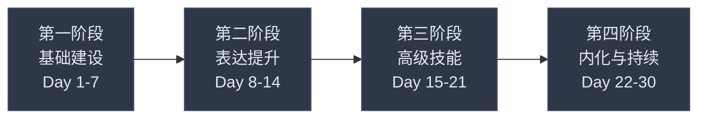
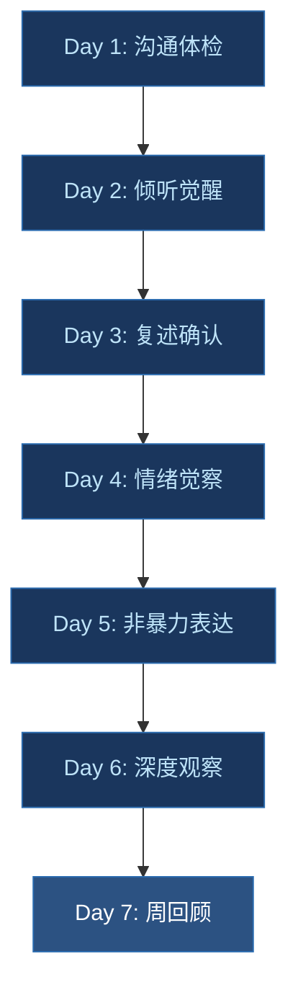
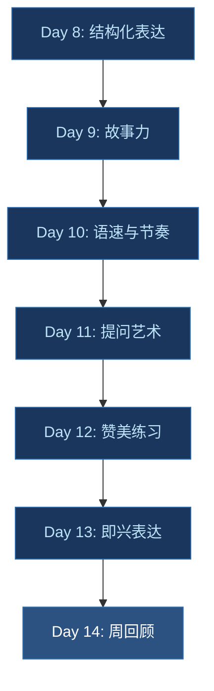
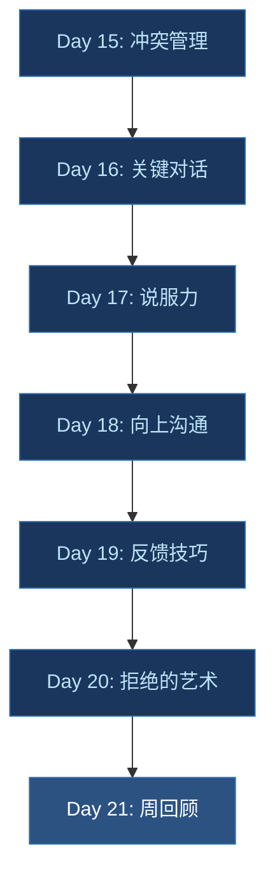
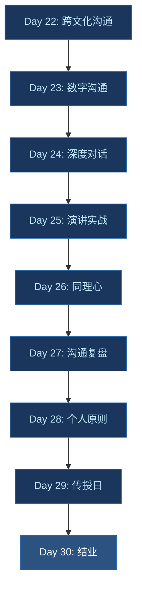

# 附录四：30天沟通能力提升计划

> 本计划为你设计了一套循序渐进的30天沟通能力提升方案。每天有明确的学习任务和实践练习，涵盖倾听、表达、写作、情绪管理、影响力五大核心维度。建议打印出来贴在醒目位置，每天打卡执行。

为什么是30天？行为心理学家 Maxwell Maltz 在《心理控制术》中发现，一个人重复一个行为大约21天后会形成初步习惯，30天则能完成从"刻意练习"到"自动化反应"的关键过渡。本计划的设计遵循"学一个→练一个→固化一个"的节奏，让你在30天后不仅掌握沟通技巧，更能将其内化为本能反应。

---

## 使用指南

### 基本设置

| 项目 | 说明 |
|------|------|
| 每日投入时间 | 30-60分钟（部分实操日需要全天留意） |
| 核心原则 | 学一个、练一个、固化一个 |
| 打卡方式 | 每完成一天的任务，在□中打✓ |
| 建议 | 找一个"学习伙伴"一起执行，互相监督和反馈 |

### 难度适配

不同基础的读者可以调整执行强度：

- **入门级**（沟通基础薄弱）：按计划完整执行，每天投入满60分钟，宁可慢一天也不跳过
- **进阶级**（有一定基础）：学习任务压缩到10-15分钟，把更多时间用于实操；可以将某些简单练习合并
- **高手级**（想补短板）：跳过已熟练的天数，重点攻克标记为"挑战"的练习；将每日练习时间提高到90分钟，增加变体练习

### 工具准备

开始前准备好以下工具，整个月都会用到：

- **情绪日志本**：一个专用小本子或手机备忘录，用于记录每天的情绪和沟通反思
- **录音设备**：手机录音功能即可，用于回听自己的表达练习
- **计时器**：用于控制语速练习、即兴演讲等有时间要求的练习
- **打卡表**：打印本附录末尾的速览表，贴在显眼位置

### 常见失败模式与应对

| 失败模式 | 表现 | 应对策略 |
|----------|------|----------|
| 虎头蛇尾 | 前3天热情高涨，第4天开始找借口跳过 | 设定固定时间段（如每天早起后20分钟），与学习伙伴互相打卡 |
| 只学不练 | 阅读了学习任务，但跳过实践任务 | 实践任务才是核心，学不会可以先跳过，但练不能跳 |
| 求全责备 | 一天的练习没做好就全盘否定自己 | 记住：不完美的行动胜过完美的计划。做到了60分也是进步 |
| 机械执行 | 完成任务但没有真正思考和感受 | 每天结束前花5分钟写一句"今天最真实的感受" |
| 孤军奋战 | 独自执行，缺乏反馈和动力 | 找学习伙伴、加入练习社群、每天至少与一个人互动实践 |

---

## 第一阶段：基础建设（第1-7天）

> 目标：建立沟通意识，打好倾听和自我觉察的基础
>
> 核心理念：沟通能力的基石不是"怎么说"，而是"怎么听"和"怎么觉察自己"。这一周你将学会在开口之前先"接收"。

### Day 1：沟通体检日 □

**学习任务（20分钟）：**

- 完成附录三的"沟通能力自测表"，记录各维度得分
- 阅读本书第一章，理解沟通的本质和模型
- 重点理解"沟通漏斗"模型：你想说的（100%）→ 你实际说出来的（80%）→ 对方听到的（60%）→ 对方理解的（40%）→ 对方记住的（20%）。这组数据来自一项关于企业内部沟通的研究，说明信息在传递过程中存在天然的衰减

**实践任务（15分钟）：**

- 回忆最近一次让你感到挫败的沟通，用文字记录：
  - 当时发生了什么？（事实——只描述可观察的行为和语言）
  - 你的感受是什么？（情绪——用具体的情绪词，而非笼统的"不爽"）
  - 你认为问题出在哪里？（反思——从自己的角度找原因）
- 将这份记录保存好，30天后对照

**难度适配**：入门级读者请完整完成自测；进阶级读者可以额外记录最近3次沟通失败案例。

**今日金句**：沟通不是为了让对方听你说，而是为了达成共同的理解。

---

### Day 2：倾听觉醒日 □

**学习任务（20分钟）：**

- 阅读本书关于"倾听"的章节
- 学习倾听的五个层次（由浅入深）：

| 层次 | 行为表现 | 典型场景 |
|------|----------|----------|
| 1. 忽视 | 完全不关注对方在说什么 | 玩手机时随口应答 |
| 2. 假装 | 表面在听，实际在想别的 | "嗯嗯"连声但眼神空洞 |
| 3. 选择性 | 只听自己感兴趣的部分 | 只关注结论，忽略过程描述 |
| 4. 专注 | 全神贯注听对方说的每句话 | 放下手机，保持眼神接触 |
| 5. 同理心 | 不仅听到内容，还感受到情绪 | "听起来你对这件事感到很委屈" |

大多数人际沟通中的矛盾，源于一方停留在层次1-3，却自认为达到了层次4。今天的练习就是要打破这种"自我欺骗"。

**实践任务（30分钟）：**

- 在今天的3次对话中，刻意练习"全神贯注倾听"（层次4）：
  - 放下手机，保持眼神接触
  - 用点头和简短回应（"嗯""我理解""然后呢"）表示关注
  - 不打断、不急着给建议
  - 注意对方的语调、语速、表情变化——这些往往比语言本身传递更多信息
- 晚上记录：哪次对话你做到了？感受如何？哪次你走神了？是什么让你分心？

**常见错误**：把"不说话"等同于"在倾听"。真正的倾听是一种主动的认知活动——你需要在脑海中组织对方表达的信息，而非仅仅等待对方说完。

**今日金句**：最好的沟通者，往往是最好的倾听者。

---

### Day 3：复述确认练习日 □

**学习任务（15分钟）：**

- 学习"复述确认"技巧：用自己的话总结对方的要点，确认理解无误
- 核心句式：
  - "你的意思是……对吗？"
  - "我理解你是说……我有没有遗漏什么？"
  - "所以你最关心的是……是这个意思吗？"
- 理解复述确认的价值：它同时完成了两件事——向对方证明你在认真听，并且给自己一次纠正理解偏差的机会

**实践任务（30分钟）：**

- 在今天的至少2次对话中使用"复述确认"技巧
- 特别注意在以下场景中使用：
  - 对方表达复杂观点时
  - 你不确定自己理解对了时
  - 讨论工作任务和要求时
  - 对方带有强烈情绪时（复述情绪本身也是一种确认："你听起来很失望"）
- 记录：对方听到你的复述后是什么反应？大多数人的反应会是"对，就是这样"或"不完全是，其实我想说的是……"——后者恰恰说明复述确认帮你们避免了一次误解

**进阶挑战**：尝试在电话沟通中使用复述确认。没有视觉线索时，复述确认更加重要。

**今日金句**：确认理解不是示弱，而是专业。

---

### Day 4：情绪觉察日 □

**学习任务（20分钟）：**

- 学习情绪识别的基本方法
- 了解常见的12种情绪及其信号：

| 情绪 | 身体信号 | 行为倾向 | 沟通中的表现 |
|------|----------|----------|-------------|
| 开心 | 面部放松、声音轻快 | 主动分享 | 语速加快、用词积极 |
| 悲伤 | 胸口沉重、眼眶发酸 | 退缩、沉默 | 语调低沉、回应简短 |
| 愤怒 | 肌肉紧绷、呼吸加速 | 攻击或对抗 | 语速变快、用词尖锐 |
| 恐惧 | 手心出汗、心跳加速 | 回避或讨好 | 模糊表态、过度道歉 |
| 惊讶 | 瞳孔放大、身体后仰 | 追问详情 | "真的吗？""不会吧？" |
| 厌恶 | 皱眉、嘴角下撇 | 疏远、否定 | 轻蔑语气、消极回应 |
| 焦虑 | 肩颈紧张、坐立不安 | 反复确认 | "你确定吗？""不会出问题吧？" |
| 委屈 | 喉咙发紧、鼻酸 | 辩解、控诉 | "你知道我付出了多少吗？" |
| 嫉妒 | 胸闷、内心紧缩 | 攀比、贬低 | 酸言酸语、选择性关注他人缺点 |
| 羞耻 | 面部发热、想藏起来 | 回避社交 | 低声细语、不愿直视 |
| 期待 | 兴奋、注意力集中 | 主动规划 | 积极提问、频繁确认进展 |
| 信任 | 身体放松、坦诚 | 开放分享 | 主动表达想法、不设防 |

**实践任务（全天）：**

- 建立"情绪日志"——今天记录至少3次自己的情绪变化：
  - 时间和场景
  - 你感受到了什么情绪？（用上表中的具体情绪词命名）
  - 这个情绪想告诉你什么？（每个情绪都有信息功能：愤怒告诉你边界被侵犯，焦虑告诉你有不确定性需要处理，悲伤告诉你有东西失去了）
- 特别注意沟通中的情绪变化：当对方说了某句话后，你的情绪发生了什么变化？

**科学背景**：神经科学家 Antonio Damasio 的研究表明，情绪不是理性的对立面，而是理性决策的重要组成部分。无法感知自己情绪的人反而会做出更差的决策。因此，情绪觉察不是"矫情"，而是一种核心认知能力。

**今日金句**：能识别自己情绪的人，才能管理自己的沟通。

---

### Day 5：非暴力表达初体验 □

**学习任务（25分钟）：**

- 阅读本书关于"非暴力沟通"的章节
- 学习NVC（Nonviolent Communication）四步法，由心理学家 Marshall Rosenberg 提出：

| 步骤 | 含义 | 示例 |
|------|------|------|
| 1. 观察 | 客观描述事实，不加评判 | "这周你有三次会议迟到了10分钟以上" |
| 2. 感受 | 表达你的真实情绪 | "我感到有些担心" |
| 3. 需要 | 说明感受背后的需求 | "因为我需要我们团队能高效协作" |
| 4. 请求 | 提出具体、可执行的请求 | "你能在下次会议开始前5分钟到场吗？" |

- 将以下"暴力表达"改写为"非暴力表达"：
  - "你总是迟到！" → "这周你三次会议迟到了（观察），我感到有些担心（感受），因为准时开会对团队效率很重要（需要）。你能不能下次提前5分钟到？（请求）"
  - "你根本不关心我！" → "最近一个月我们没有单独吃过一次饭（观察），我感到有些失落（感受），因为我需要高质量的陪伴时间（需要）。这个周末我们能一起吃顿饭吗？（请求）"
  - "这个方案太差了！" → "这个方案的市场分析部分缺少竞品数据（观察），我有些担心上线后的效果（感受），因为充分的市场调研是我们做决策的基础（需要）。能不能补充三家竞品的对比数据？（请求）"

**实践任务（20分钟）：**

- 在今天的1次对话中，尝试使用NVC四步法表达一个你一直想说的话
- 不需要完美，重要的是练习这个框架
- 关键提示：NVC的难点不在"说什么"，而在"不说什么"——忍住评判和指责的冲动，只描述事实

**常见错误**：

| 错误 | 说明 | 纠正 |
|------|------|------|
| 假观察 | "你总是不尊重我"伪装成"观察" | 观察必须是可被第三方验证的事实行为 |
| 假感受 | "我觉得你不爱我"其实是对对方的判断 | 感受是"我"的情绪，不是"你"的评价 |
| 请求变成命令 | 不答应就翻脸的"请求" | 真正的请求允许对方拒绝 |

**今日金句**：暴力的根源不是恶意，而是不会用另一种方式表达。

---

### Day 6：深度观察日 □

**学习任务（15分钟）：**

- 深入理解"观察vs评论"的区别，这是非暴力沟通中最基础也最难的一步：
  - 评论："他很懒"（基于主观推断）
  - 观察："他连续三天没有按时提交报告"（基于可验证的事实）
  - 评论："她态度很差"（笼统的人格标签）
  - 观察："她在上次讨论中提高了音量并且摔了门"（具体行为描述）

为什么区分如此重要？因为评论会触发对方的防御机制——没有人愿意被贴标签。而事实描述是中性的，它为对话留出了空间。

**实践任务（全天）：**

- 今天在与人交流时，刻意区分"观察"和"评论"
- 当你发现自己在做评论时，立刻转化为观察性描述。转化公式：

评论 → 追问"我具体看到了/听到了什么？" → 观察

- 具体练习：把你今天内心闪过的一句"评论"写下来，然后用事实替换
  - 例："同事不配合" → "同事没有回复我昨天发的三封邮件"
  - 例："领导偏心" → "领导在这个月的三次项目分配中，两次给了同一个人"
- 晚上记录：今天你捕捉到了几次"评论伪装成事实"的情况？

**进阶挑战**：注意那些隐含评论的副词——"他故意""她明明""他就是不想"。这些词背后通常藏着未经验证的推测。

**今日金句**：当我们把评论当成事实来表达时，冲突就已经埋下了种子。

---

### Day 7：第一周回顾日 □

**学习任务（20分钟）：**

- 回顾这一周的记录和练习
- 回答以下问题（写下来，不要只在脑子里想）：
  - 这周最大的发现是什么？
  - 哪个练习对你最有帮助？
  - 哪个练习你觉得最难？为什么？
  - 你对自己的沟通习惯有了哪些新的认识？

**实践任务（30分钟）：**

- 给一位你信任的人进行一次"深度对话"（15分钟以上）
- 专注于运用这周学到的技巧：全神贯注倾听、复述确认、观察而非评论
- 对话后，感谢对方并请他给你一个反馈：
  - "今天的对话中，你觉得我有没有真的在听你说话？"
  - "有没有哪个瞬间你觉得被误解了？"
  - "如果用1-10分评价今天的对话质量，你给几分？为什么？"

**第一周能力检核表**：

| 能力 | 自评（1-5分） |
|------|--------------|
| 能识别自己在沟通中走神的时刻 | ___ |
| 能在对话中使用复述确认 | ___ |
| 能区分"观察"和"评论" | ___ |
| 能用情绪词准确描述自己的感受 | ___ |
| 能用NVC四步法组织一次表达 | ___ |

**今日金句**：学而不习，等于未学。

---

## 第二阶段：表达提升（第8-14天）

> 目标：提升口头表达的清晰度、逻辑性和感染力
>
> 核心理念：第一周你学会了"接收"，这一周你将学习"发送"——如何让你的表达精准、有力、有温度。

### Day 8：结构化表达日 □

**学习任务（25分钟）：**

- 学习"金字塔原理"的核心框架（来自 Barbara Minto 的《金字塔原理》）：
  - **结论先行**：先说答案，再说原因
  - **以上统下**：每个上层观点都是下层内容的概括
  - **归类分组**：同一层级的内容属于同一类别
  - **逻辑递进**：内容之间有明确的逻辑关系（时间顺序、重要性顺序、结构顺序）

- 练习"电梯演讲"：用30秒说清楚一件事
  - 框架：观点→原因→例子→总结
  - 示例：
    > "我建议我们推迟产品发布两周。（观点）因为用户测试中发现了三个关键体验问题。（原因）比如40%的用户无法独立完成注册流程。（例子）花两周修复这些问题，能将上线后的投诉率降低至少50%。（总结）"

**实践任务（20分钟）：**

- 选择3个话题，各用30秒进行"电梯演讲"练习：
  - 你最近在做的项目
  - 你最近读的一本书
  - 你对某个热点事件的看法
- 录音回放，评估自己的逻辑清晰度。对照以下标准打分：

| 维度 | 优秀 | 合格 | 需改进 |
|------|------|------|--------|
| 结论 | 第一句话就是结论 | 3句话内出现结论 | 超过3句还没有结论 |
| 理由 | 有数据或具体事实支撑 | 有道理但偏主观 | 只有观点没有理由 |
| 简洁 | 30秒内完成 | 45秒内完成 | 超过1分钟 |

**今日金句**：清晰的表达，来自清晰的思考。

---

### Day 9：故事力练习日 □

**学习任务（20分钟）：**

- 学习"故事公式"：情境→冲突→转折→结果
  - **情境**：建立背景，让听众进入场景
  - **冲突**：制造张力，激发听众的注意力
  - **转折**：出现变化，推动故事向前
  - **结果**：收束故事，传递信息

- 了解"STAR法则"：Situation（情境）→Task（任务）→Action（行动）→Result（结果）
  - STAR法则更侧重于行动导向，特别适合工作汇报和面试场景

- 为什么故事比道理更有力？神经科学研究发现，当一个人听到数据时，大脑中只有语言处理区域被激活；而当他听到故事时，不仅语言区，连感觉皮层、运动皮层都会被激活——大脑会"模拟"故事中的体验，产生共情。这就是"故事打动人的心灵"的科学解释。

**实践任务（30分钟）：**

- 准备3个你的"个人故事"：
  - 一个关于你克服困难的故事（展示韧性）
  - 一个关于你学到重要教训的故事（展示反思力）
  - 一个关于你帮助他人的故事（展示影响力）
- 用STAR法则组织每个故事，每个控制在2分钟以内
- 每个故事的开头和结尾：
  - 开头用一个"钩子"吸引注意："你知道那种感觉吗，当你明明已经很努力了，结果还是搞砸了？"
  - 结尾点明你要传递的信息："那次经历让我明白，与其闷头苦干，不如先抬头看路"
- 对着镜子或录音练习讲述

**常见错误**：故事太长、太散、没有冲突点。好的故事不是流水账，而是有张力的——必须有"问题"和"解决"。

**今日金句**：数据说服人的大脑，故事打动人的心灵。

---

### Day 10：语速与节奏日 □

**学习任务（15分钟）：**

- 了解正常语速参考值：

| 场景 | 推荐语速（中文） | 说明 |
|------|-----------------|------|
| 日常对话 | 200-250字/分钟 | 自然舒适 |
| 工作汇报 | 180-220字/分钟 | 略慢，便于听众消化 |
| 演讲/演讲 | 160-200字/分钟 | 需要配合停顿和语调变化 |
| 播音/有声书 | 250-300字/分钟 | 听众注意力集中 |

- 学习语速变化的技巧：
  - **重要内容放慢**：关键数据、核心观点时语速降低20%，让听众的大脑有时间处理
  - **过渡性内容可以加快**：背景介绍、已知信息可以适当加快
  - **停顿的力量**：在关键信息前后停顿2-3秒，比任何修饰词都更有效

**实践任务（30分钟）：**

- 选择一段你喜欢的演讲或文章（300字左右）
- 练习朗读3遍：
  - 第一遍：正常语速，注意发音清晰
  - 第二遍：在关键信息处停顿2-3秒（用铅笔在文稿上标出停顿位置）
  - 第三遍：加入语速变化，有快有慢
- 录音回放，感受差异。自问：哪一遍最吸引你？为什么？

**进阶挑战**：找一段TED演讲，模仿演讲者的语速变化模式。注意他们在哪里停顿、在哪里加速、在哪里加重语气。

**今日金句**：高手说话，不在于说了多少，而在于停顿了多少。

---

### Day 11：提问艺术日 □

**学习任务（20分钟）：**

- 学习开放式问题和封闭式问题的区别及应用场景：

| 类型 | 特征 | 示例 | 适用场景 |
|------|------|------|----------|
| 封闭式 | 答案是"是/否"或有限选项 | "你同意吗？""几点开会？" | 确认信息、做决策 |
| 开放式 | 需要阐述和思考 | "你怎么看？""为什么？" | 收集信息、激发思考、建立关系 |

- 学习"强力问题"的三个特征：
  - **引发思考**：让对方停顿一下才能回答
  - **打开话题**：引出更深入的讨论
  - **触及核心**：直指问题的本质

- 强力问题示例：
  - "在这件事上，你最担心的是什么？"
  - "如果没有任何限制，你会怎么做？"
  - "是什么让你做出了这个决定？"
  - "你觉得这个问题的根本原因是什么？"

**实践任务（全天）：**

- 今天的每一次对话中，有意识地使用开放式问题
  - 将"你同意吗？"改为"你怎么看？"
  - 将"是不是？"改为"为什么？"
  - 将"好不好？"改为"你觉得怎样更好？"
  - 将"这个方案行不行？"改为"这个方案你最看重哪部分？"
- 记录：开放式问题是否让你获得了更多信息？对方的回应质量有什么变化？

**今日金句**：好的问题比好的答案更有价值。

---

### Day 12：赞美练习日 □

**学习任务（15分钟）：**

- 学习"有效赞美"的三个要素：

| 要素 | 说明 | 示例 |
|------|------|------|
| 具体 | 指出具体做了什么 | "你今天汇报中的数据对比做得特别清晰" |
| 真诚 | 发自内心，而非套路 | "让我一下就理解了业务变化" |
| 及时 | 在事情发生后尽快表达 | 当天就告诉对方，不要拖延 |

- 对比"空洞赞美"和"有效赞美"：
  - 空洞："你做得真好"（对方不知道好在哪里，也不会往心里去）
  - 有效："你今天汇报中的数据对比做得特别清晰，让我一下就理解了业务变化"（对方知道自己做对了什么，下次会继续这样做）

- 赞美的心理学效应：心理学家 John Gottman 的研究表明，在亲密关系中，正面互动与负面互动的比例至少要达到5:1，关系才能健康发展。赞美是性价比最高的正面互动。

**实践任务（全天）：**

- 今天至少给5个人真诚的、具体的赞美
- 至少1个给亲近的人（家人、伴侣）——我们最容易忽略身边人
- 至少1个给不太熟的人（同事、邻居）——赞美是建立关系的低成本方式
- 观察对方收到赞美后的反应
- 晚上记录：哪些赞美让你觉得自然？哪些让你觉得刻意？刻意的感觉来自哪里？

**常见错误**：

| 错误 | 问题 | 纠正 |
|------|------|------|
| 过度赞美 | 赞美太多，显得不真诚 | 保持每天3-5个，质量优先 |
| 夹带赞美 | "你这次终于做得不错了" | 赞美里不要藏"以前不行"的意思 |
| 泛泛而谈 | "你很厉害""你真棒" | 具体到行为和影响 |

**今日金句**：真诚的赞美是成本最低、回报最高的人际投资。

---

### Day 13：即兴表达日 □

**学习任务（15分钟）：**

- 学习"Yes, and"原则（来自即兴戏剧）：
  - **Yes**：先接受对方给的前提或信息，不否定
  - **And**：在对方的基础上添加新内容，推动对话前进
  - 对比"Yes, but"："你说得对，但是……"——这个"但是"会否定前面的"你说得对"

- 了解即兴表达的核心心态：
  - **不评判**：不要在说话前评判自己的想法"好不好"
  - **不恐惧**：说错了可以修正，沉默才是最大的敌人
  - **不完美**：60分的即时表达胜过100分的沉默

**实践任务（30分钟）：**

- "一分钟即兴演讲"练习——随机选择一个话题，立即讲述1分钟：
  - 话题1：你为什么喜欢/不喜欢某个季节
  - 话题2：如果给你一年假期你会做什么
  - 话题3：你觉得未来10年最大的变化会是什么
  - 话题4：你从失败中学到的最重要的一课
  - 话题5（挑战）：用三个词"海洋、手机、童年"即兴编一个故事
- 录音回放，关注流畅度和逻辑性
- 评分标准：是否有明确的观点？是否有至少一个例子？是否在1分钟内完成了？

**进阶挑战**：和朋友面对面练习——一人说30秒，另一人用"Yes, and"接30秒，交替进行5轮。

**今日金句**：即兴不是没有准备，而是随时准备好了。

---

### Day 14：第二周回顾日 □

**学习任务（20分钟）：**

- 回顾第二周的练习记录
- 与第一周对比：你觉得自己有哪些进步？
- 识别这一周中遇到的困难和挑战
- 重做第一周的能力检核表，对比得分变化

**实践任务（30分钟）：**

- 在朋友或家人面前做一次3-5分钟的小演讲（可选话题：你这周学到的最重要的沟通技巧）
- 请他们给你反馈，使用以下反馈表：

| 维度 | 1-10分 | 具体说明 |
|------|--------|----------|
| 内容清晰度 | ___ | 是否容易理解你的观点？ |
| 逻辑性 | ___ | 内容之间是否有清晰的逻辑链？ |
| 表达感染力 | ___ | 是否被打动或吸引？ |
| 语速节奏 | ___ | 快慢是否适当？停顿是否有效？ |
| 故事性 | ___ | 是否有生动的案例或故事？ |

**第二周能力检核表**：

| 能力 | 自评（1-5分） |
|------|--------------|
| 能在30秒内说清一件事 | ___ |
| 能用STAR法则讲一个故事 | ___ |
| 能根据场景调整语速 | ___ |
| 能用开放式问题引导对话 | ___ |
| 能给出具体真诚的赞美 | ___ |
| 能做一分钟即兴表达 | ___ |

**今日金句**：进步来自于回顾，而不仅仅是练习。

---

## 第三阶段：高级技能（第15-21天）

> 目标：掌握冲突管理、说服影响力、跨场景沟通等高级技能
>
> 核心理念：前两周你掌握了基础技能，这一周你将学习在高压、复杂、对抗性场景中运用这些技能。这才是真正的考验。

### Day 15：冲突管理入门 □

**学习任务（25分钟）：**

- 学习冲突的五种应对模式（Thomas-Kilmann冲突模型）：

| 模式 | 特征 | 适用场景 | 不适用场景 |
|------|------|----------|-----------|
| 竞争 | 坚持己见，不顾对方 | 紧急决策、核心利益不可退让 | 需要长期合作的关系 |
| 回避 | 暂时搁置，不面对 | 问题不重要、需要冷静时间 | 问题会越拖越严重 |
| 妥协 | 双方各退一步 | 时间紧迫、需要临时方案 | 双方都不满意的结果 |
| 迁就 | 优先满足对方 | 对方更重要、维护关系优先 | 你总是一方退让 |
| 合作 | 寻找双赢方案 | 问题重要、双方都愿意投入 | 时间不允许深入讨论 |

大多数人会习惯性使用其中1-2种模式。今天的任务是识别你的默认模式。

- 了解"利益vs立场"的区别：
  - **立场**是"我要什么"——"我要你每天加班到9点"
  - **利益**是"我为什么想要"——"我需要在月底前完成项目"
  - 当你理解了对方的利益，往往能找到更多解决方案（比如调整项目范围、增加人手、优化流程）

**实践任务（20分钟）：**

- 回忆一次你和他人的冲突，用"利益vs立场"的框架重新分析：
  - 你的立场是什么？你的利益是什么？
  - 对方的立场是什么？对方的利益是什么？
  - 有没有满足双方利益的方案？（通常至少有3个你没想到的方案）
- 把分析结果写下来

**今日金句**：关注利益而非立场，冲突就会变成合作的机会。

---

### Day 16：关键对话练习 □

**学习任务（20分钟）：**

- 学习"关键对话"的三个条件（来自《关键对话》一书）：
  - **高风险**：结果对你有重大影响
  - **不同意见**：双方观点存在明显分歧
  - **强烈情绪**：至少一方带有愤怒、恐惧、焦虑等强烈情绪

- 学习"营造安全氛围"的方法：
  - **建立共同目标**：找到双方都认同的利益交汇点
  - **互相尊重**：让对方感受到你尊重他这个人，即使你不同意他的观点
  - **自我暴露**：先分享你自己的顾虑和脆弱，降低对方的防御

- 当对话陷入僵局时的破解方法：
  - "我能感受到我们都很在乎这件事。"
  - "我可能没有完全理解你的处境，你能再跟我说说吗？"
  - "我们的目标是一样的，只是方法不同。"

**实践任务（全天）：**

- 今天在遇到意见不一致时，练习以下步骤：
  1. 先说"我理解你的观点"（表示尊重）
  2. 再说"我的看法有些不同"（表达立场）
  3. 最后说"我们的目标都是……"（建立共同点）
- 注意：这个练习不是要在小事上机械使用公式，而是在遇到真正分歧时训练你的反应模式

**常见错误**：

| 错误 | 后果 | 纠正 |
|------|------|------|
| 回避关键对话 | 问题积累，最终爆发 | 主动发起，选好时机和地点 |
| 在情绪巅峰时对话 | 说出后悔的话 | 冷静20分钟后再谈（心理学研究显示20分钟是情绪峰值下降的时间） |
| 只关注自己的立场 | 对方感到被忽视 | 先用复述确认展示你在听 |

**今日金句**：关键对话的成败，在于你能否让对方感到安全。

---

### Day 17：说服力练习 □

**学习任务（25分钟）：**

- 学习《影响力》（Robert Cialdini）六大原则中的前三个：

| 原则 | 含义 | 日常应用 |
|------|------|----------|
| 互惠 | 给予之后，对方倾向于回报 | 先帮别人一个忙，再提请求 |
| 承诺与一致 | 人倾向于保持言行一致 | 先让对方同意一个小请求，再提大请求 |
| 社会认同 | 人倾向于参考多数人的行为 | "很多团队已经开始用这个方法了" |

- 了解后三个原则（供进一步学习）：
  - **喜好**：人们更容易被自己喜欢的人说服
  - **权威**：人们倾向于服从权威
  - **稀缺**：越稀缺的东西越有吸引力

- 思考如何在日常沟通中善用这些原则（注意：善用，而非操控。说服的底线是真诚——你真心相信你要说服对方做的事对他有益）

**实践任务（20分钟）：**

- 选择一个你想说服他人接受的小事（比如选餐厅、看电影、采用某个方案）
- 有意识地运用影响力原则来组织你的表达
- 示例（说服同事使用新的项目管理工具）：
  - 互惠："我帮你整理了一份对比报告"
  - 社会认同："咱们隔壁组上个月开始用了，效率提升了30%"
  - 承诺一致："你之前也说过觉得现在的工作流程需要优化对吧？"
- 记录：效果如何？和以前的说服方式有什么不同？

**今日金句**：真正的说服不是强迫对方同意，而是引导对方发现同意的理由。

---

### Day 18：向上沟通日 □

**学习任务（20分钟）：**

- 学习向上沟通的核心原则：
  - **用结论开头**：领导最缺的是时间，先说结论再解释
  - **给选择题不给问答题**："我建议A方案，原因是……您看可以吗？"而不是"您觉得该怎么办？"
  - **管理预期**：如果事情有风险，提前说，不要等到出了问题再说
  - **对齐目标**：确保你理解领导真正在意的是什么（不是你以为他应该在意什么）

- 学习"电梯汇报"的框架：

结论 → 关键数据 → 建议 → 需要的支持

- 示例：
  > "XX项目按计划推进，但存在一个风险（结论）。目前开发进度完成70%，但测试资源不足，可能导致上线延迟一周（关键数据）。我建议从下周起增加一名测试人员（建议）。需要您协调一下测试组的排期（支持）。"

**实践任务（20分钟）：**

- 准备一个你近期需要向上级汇报的话题
- 用"结论先行"的框架组织汇报内容
- 自查清单：
  - 第一句话是否包含结论？
  - 是否有具体数据支撑？
  - 是否提出了明确的建议？
  - 是否说明了你需要什么支持？
- 如果条件允许，今天就进行这次汇报
- 如果不方便，录制视频练习，回看自己的表达

**今日金句**：向上沟通的关键是——节省领导的时间，而不是展示你的努力。

---

### Day 19：反馈技巧日 □

**学习任务（20分钟）：**

- 学习SBI反馈法（来自Center for Creative Leadership）：

| 要素 | 含义 | 示例 |
|------|------|------|
| S-Situation | 情境：在什么场合 | "在昨天的项目评审会上……" |
| B-Behavior | 行为：对方做了什么 | "你在小李汇报的时候打断了他三次……" |
| I-Impact | 影响：造成了什么后果 | "这让小李后面就不太愿意发言了，我们错过了他的一些好想法" |

- SBI反馈法优于"三明治反馈法"（表扬-批评-表扬）的原因：三明治法已经被人识破了——对方听到表扬就知道"接下来要批评我了"，反而会削弱正面评价的效果。SBI更直接、更尊重对方。

- 给予改进性反馈的完整流程：
  1. 选择合适的时机（私下、对方情绪稳定时）
  2. 用SBI描述具体行为
  3. 询问对方的视角："你当时是怎么考虑的？"
  4. 共同讨论改进方案
  5. 表达信任和支持

- 学习接受反馈的正确态度：感谢→确认→行动
  - 感谢："谢谢你告诉我这些"
  - 确认："你的意思是……我理解对了吗？"
  - 行动："接下来我会……"

**实践任务（全天）：**

- 今天给至少一个人使用SBI框架给予反馈（正面或改进性反馈均可）
- 正面反馈示例："今天客户会议上（S），你主动用数据回应了客户的质疑（B），这让客户对我们更有信心了（I）"
- 如果今天有人给你反馈，练习"接受反馈"的正确方式——特别注意忍住辩解的冲动，先听完

**今日金句**：好的反馈是礼物，差的反馈是武器。

---

### Day 20：拒绝的艺术 □

**学习任务（20分钟）：**

- 学习"温柔而坚定"的拒绝框架（四步法）：

| 步骤 | 作用 | 示例 |
|------|------|------|
| 1. 表达理解 | 让对方感到被尊重 | "我理解这个项目对你很重要" |
| 2. 说明原因 | 让对方理解你的处境 | "但我这周的工作已经排满了，无法再接新任务" |
| 3. 提供替代方案 | 展示你的善意 | "也许小王最近有空，我可以帮你问一下" |
| 4. 表达善意 | 维护关系 | "等我忙完这一阵，下次有需要随时找我" |

- 为什么我们不敢拒绝？心理学解释：
  - **讨好型人格**：害怕被讨厌、被孤立
  - **损失厌恶**：拒绝别人意味着"失去"一段关系的可能性
  - **错误的责任感**：觉得别人的需求是自己的责任
  - 记住：每一次你勉强答应了不想做的事，你就在对自己说"我的时间不重要"

**实践任务（20分钟）：**

- 回想一个你最近本想拒绝但没有拒绝的请求
- 用四步框架重新组织你的回应，写下来
- 如果有机会，今天就用这个框架拒绝一个不合理的请求
- 事后记录：对方的反应如何？你的感受如何？（通常你会发现，对方的接受度比你想象的高得多）

**进阶挑战**：学习"有条件同意"的技巧——"这个我可以做，但需要推迟另一个任务的交付时间，你觉得哪个优先？"

**今日金句**：拒绝不是关系的终结，而是边界的开始。

---

### Day 21：第三周回顾日 □

**学习任务（20分钟）：**

- 回顾第三周的练习和收获
- 重新审视Day 1的沟通困境记录——现在你会怎么处理？用这三周学到的框架（NVC、关键对话、利益导向）重新组织你的应对方案
- 对比第一天和现在的自己，写下三个最大的变化

**实践任务（40分钟）：**

- 选择一个你一直回避的高难度对话，今天主动发起
- 准备清单：
  - 对话的目标是什么？（不是"让对方认错"，而是"解决问题"）
  - 对方的利益是什么？我怎么表达尊重？
  - 我的观察是什么？（区分事实和评论）
  - 我的感受和需要是什么？（NVC框架）
  - 我的请求是什么？（具体、可执行）
- 运用这三周学到的所有技巧：倾听、NVC、关键对话、利益导向
- 对话后记录：过程和结果如何？你的感受是什么？

**第三周能力检核表**：

| 能力 | 自评（1-5分） |
|------|--------------|
| 能识别冲突中的"立场"和"利益" | ___ |
| 能在意见分歧时营造安全氛围 | ___ |
| 能运用影响力原则说服他人 | ___ |
| 能用结论先行的框架向上汇报 | ___ |
| 能用SBI框架给予反馈 | ___ |
| 能温柔而坚定地拒绝 | ___ |

**今日金句**：30天的练习，都是为了面对真实挑战的那一刻。

---

## 第四阶段：内化与持续（第22-30天）

> 目标：将沟通技能内化为习惯，建立持续提升的系统
>
> 核心理念：最后一周的重点不是学新技能，而是把前三周的所有技能整合、应用、反思、固化，并建立一套让你在30天之后持续进步的系统。

### Day 22：跨文化沟通日 □

**学习任务（20分钟）：**

- 了解高语境文化和低语境文化的核心差异（Edward Hall 理论）：

| 维度 | 高语境文化 | 低语境文化 |
|------|-----------|-----------|
| 代表国家/地区 | 中国、日本、韩国、阿拉伯 | 美国、德国、北欧 |
| 信息传递方式 | 大量依赖背景、关系、暗示 | 主要依赖明确的语言表达 |
| "不"的表达 | "这个有点困难""我再考虑考虑" | "No""I disagree" |
| 沟通重点 | 说什么不重要，怎么说、谁说很重要 | 说了什么最重要 |
| 契约观念 | 关系比合同重要 | 合同比关系重要 |

- 在实际工作中的应用场景：
  - 与高语境文化的人沟通：注意言外之意、留面子、建立关系后再谈正事
  - 与低语境文化的人沟通：直接表达、用数据说话、把期望写下来

- 跨文化沟通的三个核心原则：
  - **避免假设**：你的沟通习惯不是普世标准
  - **尊重差异**：不同不代表不好
  - **主动确认**：不确定时直接问，比猜测安全得多

**实践任务（20分钟）：**

- 如果你身边有不同文化背景的人，今天主动与他们进行一次深入交流，特别留意他们的沟通风格与你的差异
- 如果没有，阅读一篇关于跨文化沟通的案例分析，推荐搜索关键词"跨文化沟通 失败案例"
- 记录：你发现了哪些你习以为常但可能在其他文化中造成误解的沟通习惯？

**今日金句**：真正的跨文化能力不是了解所有文化的规则，而是对"差异"保持好奇而非评判。

---

### Day 23：数字沟通日 □

**学习任务（20分钟）：**

- 学习文字沟通的"温度管理"——不同渠道的信息损耗和适用场景：

| 渠道 | 信息保真度 | 温度感 | 适用场景 |
|------|-----------|--------|----------|
| 面对面 | 最高 | 最暖 | 谈判、冲突解决、深度交流 |
| 视频通话 | 高 | 暖 | 远程会议、重要讨论 |
| 语音通话 | 中高 | 中暖 | 紧急事务、需要即时反馈 |
| 语音消息 | 中 | 中 | 日常交流、复杂信息 |
| 文字消息 | 中低 | 中凉 | 简单事务、日程安排 |
| 邮件 | 低 | 凉 | 正式记录、跨时区沟通 |

核心原则：**越重要的沟通，越需要高保真度的渠道**。如果一件事你发微信怕被误解，就应该打电话；打电话怕说不清，就应该见面。

- 学习微信/文字沟通的最佳实践：
  - **结构化**：重要内容分段、分点，不要一大段话
  - **语气明确**：文字缺乏语气信号，适当使用语气词和表情避免误读
  - **及时回复**：看到消息24小时内回复，如果需要时间思考，先回复"收到了，我仔细想一下"
  - **避免重要决定**：不要通过文字做重要决策或解决复杂分歧

**实践任务（全天）：**

- 今天发出的每条重要消息，发送前都读一遍，检查：
  - 意思是否明确？会不会被误解？
  - 语气是否合适？会不会显得冷淡或生硬？
  - 有没有可以简化的部分？
  - 这件事用文字沟通合适吗？是否应该打电话？

**常见错误**：

| 错误 | 后果 | 纠正 |
|------|------|------|
| 发长段语音 | 对方不方便听、无法检索 | 超过30秒的语音应改为文字 |
| 文字里解决冲突 | 容易误读语气，越聊越僵 | 改为打电话或见面 |
| 群发不带称呼 | 收件人觉得不受重视 | 即使群发也加一句称呼 |
| 长时间不回复 | 对方焦虑、觉得不被重视 | 忙时先回复"稍后回复你" |

**今日金句**：数字沟通的最高境界——让对方觉得你就在他身边。

---

### Day 24：一对一深度对话 □

**学习任务（10分钟）：**

- 学习深度对话的五步框架：

| 阶段 | 目的 | 典型话语 |
|------|------|----------|
| 开场 | 建立安全感和连接 | "最近怎么样？好久没好好聊聊了" |
| 探索 | 了解对方的真实想法和感受 | "你最近在想什么？有什么让你困扰的吗？" |
| 理解 | 确保你真正理解了对方 | "所以你的意思是……是这样吗？" |
| 共识 | 找到共同的理解和方向 | "我们好像都觉得……" |
| 行动 | 确定下一步 | "那接下来我们可以……" |

- 深度对话的核心心态：
  - 不是为了说服，而是为了理解
  - 不是为了给建议，而是为了让对方感到被听见
  - 不是为了解决问题，而是为了建立连接（很多问题在被听见后就自行消解了）

**实践任务（60分钟）：**

- 约一个你关心的人进行一次30分钟以上的一对一深度对话
- 话题可以是：彼此的近况、工作中的困惑、关系中的期待
- 全程专注运用倾听和同理心技巧
- 特别注意：
  - 对方说到情绪时，不要急于转移话题或给建议
  - 用复述确认展示你在听
  - 适时用沉默——有时候，不说话比说什么都好
- 对话后记录你的感受

**今日金句**：最好的礼物不是建议，而是你全部的注意力。

---

### Day 25：演讲实战日 □

**学习任务（20分钟）：**

- 准备一个5分钟的演讲，主题自选
- 用金字塔原理组织内容：

开场钩子（30秒）
  ↓
核心观点（1句话）
  ↓
理由1 + 故事/数据（90秒）
  ↓
理由2 + 故事/数据（90秒）
  ↓
理由3 + 故事/数据（60秒）
  ↓
总结 + 行动号召（30秒）

- 演讲准备清单：
  - 开场是否有一个吸引注意力的钩子？（提问、故事、数据、悬念）
  - 核心观点是否用一句话就能说清？
  - 每个论点是否有具体的故事或数据支撑？
  - 结尾是否有明确的行动号召或令人回味的金句？

**实践任务（40分钟）：**

- 在家人、朋友或同事面前进行这次演讲
- 请他们从以下维度给你反馈：

| 维度 | 1-10分 | 具体说明 |
|------|--------|----------|
| 内容清晰度 | ___ | 核心观点是否一句话能说清？ |
| 逻辑性 | ___ | 理由之间是否有清晰的递进关系？ |
| 表达感染力 | ___ | 故事是否打动人？语调是否有变化？ |
| 肢体语言 | ___ | 眼神交流、手势、站姿是否自然？ |
| 时间控制 | ___ | 是否在5分钟内完成？ |

- 记录反馈，制定改进计划

**今日金句**：演讲不是表演，是一场有结构的对话。

---

### Day 26：同理心日 □

**学习任务（15分钟）：**

- 学习同理心的三个层次：

| 层次 | 含义 | 示例 |
|------|------|------|
| 认知同理心 | 理解对方的想法和逻辑 | "我理解你为什么这么决定" |
| 情感同理心 | 感受对方的情绪 | "听起来这件事让你很失望" |
| 行为同理心 | 用行动回应对方的需求 | "我能帮你做点什么吗？" |

- 同理心与同情心的区别：
  - **同情心**："你真可怜"——把自己放在上方，对方在下方
  - **同理心**："我能感受到你的痛苦"——把自己放在对方旁边
  - Brené Brown 的比喻：同情心是在洞口往下看说"你真不好受"，同理心是爬下洞里说"我懂，我也在这里"。

- 同理心的神经科学基础：人脑中有"镜像神经元"系统，当观察到他人的情绪和行为时会自动"镜像"——这就是同理心的生理基础。但这个系统需要训练，否则会被日常的压力和忙碌所压制。

**实践任务（全天）：**

- 今天在每次对话前，先问自己两个问题：
  1. "对方现在的感受是什么？"
  2. "对方真正需要什么？（通常不是建议，而是被理解）"
- 尝试用"如果我是他"的视角来回应对方
- 特别练习：
  - 当对方在抱怨时，不要急于解决问题，先回应情绪
  - 当对方在分享好消息时，不要轻描淡写，真心为他高兴
  - 当对方在沉默时，不要急于填补空白，给他空间
- 晚上记录：同理心视角是否改变了你的沟通方式？

**今日金句**：人们不在乎你知道多少，直到他们知道你有多在乎。

---

### Day 27：沟通复盘日 □

**学习任务（20分钟）：**

- 学习"沟通复盘"的四步法：

| 步骤 | 问题 | 说明 |
|------|------|------|
| 1. 发生了什么 | 客观描述事实 | 只说可观察的行为和语言 |
| 2. 效果如何 | 评估结果 | 目标达成了吗？关系受影响了吗？ |
| 3. 为什么 | 分析原因 | 哪些做得好？哪些需要改进？ |
| 4. 下次怎么改 | 制定行动方案 | 具体到"下次我会……" |

- 为什么复盘如此重要？心理学家 Anders Ericsson 的研究表明，刻意练习的关键不是练习的时长，而是练习后是否有反馈和反思。没有复盘的沟通练习，就像没有教练的网球训练——你可能在重复错误。

**实践任务（40分钟）：**

- 选择本周的3次重要沟通进行复盘，使用以下模板：

沟通对象：
场景：
我的目标：
实际效果：（1-10分）
用了哪些技巧：
做得好的地方：
需要改进的地方：
下次我会：

- 完成后，识别你这周最需要重点提升的1-2个技能

**今日金句**：没有复盘的经验，只是经历；有复盘的经验，才是成长。

---

### Day 28：建立个人沟通原则 □

**学习任务（30分钟）：**

- 回顾这30天的学习和练习
- 提炼出5-10条属于你自己的"沟通原则"——这些原则应该来源于你这30天的真实体验，而不是照搬别人的格言

- 原则提炼方法：
  1. 回顾你的练习日志，找出你反复犯的错误
  2. 针对每个错误，写一条"下次我会……"的原则
  3. 回顾你做得最好的几次沟通，提炼成功要素
  4. 将成功要素转化为可重复的原则

- 原则示例（仅供参考，你需要自己的）：
  - "先理解，再被理解"
  - "对事不对人"
  - "重要的沟通不当场说，冷静后再谈"
  - "每天至少真诚赞美一个人"
  - "拒绝时提供替代方案"
  - "汇报时结论先行"
  - "不确定对方是否理解时，主动复述确认"
  - "生气时不开口，先写下自己的感受"

**实践任务（20分钟）：**

- 将你的沟通原则写在卡片上，放在醒目位置
- 选择其中3条，承诺在接下来的一周重点践行
- 与你的学习伙伴分享你的原则，听取他们的反馈

**今日金句**：原则是让你在压力下依然做出正确选择的底层代码。

---

### Day 29：传授日 □

**学习任务（15分钟）：**

- 准备一个"5分钟沟通小课堂"
- 选择你这30天收获最大的一个技巧或心得
- 用以下结构组织你的教学：
  - 这个技巧是什么？（定义）
  - 为什么它很重要？（原理）
  - 具体怎么用？（步骤+示例）
  - 常见错误是什么？（避坑）

**实践任务（40分钟）：**

- 找一个愿意学习沟通技巧的朋友或同事
- 教他一个你在过去30天学到的最有用的沟通技巧
- 教完后，请他用这个技巧进行一次练习，你给予反馈
- 通过教授他人，你会更深入地理解和内化所学内容——这就是"费曼学习法"的核心：如果你能把一件事教给别人，说明你真正理解了它

**今日金句**：教是最好的学。

---

### Day 30：结业与新开始 □

**学习任务（30分钟）：**

- 重新完成"沟通能力自测表"
- 对比Day 1的测试结果：
  - 总分提升了多少？
  - 哪个维度进步最大？
  - 哪个维度仍需提升？
- 阅读Day 1的沟通困境记录，写下你现在的应对方案
- 回顾30天的练习日志，写下三个最大的变化

**实践任务（20分钟）：**

- 制定下一个30天的个人提升计划：
  - 确定1-2个重点提升的维度
  - 设定具体的目标（如"每天至少做一次复述确认"）
  - 选择至少一本推荐书单中的书开始阅读
  - 找到一个长期的练习伙伴或社群
- 给自己写一封信，回答以下问题：
  - 这30天你最骄傲的是什么？
  - 你最大的收获是什么？
  - 你对未来30天的沟通能力有什么期望？

**第四周能力检核表**：

| 能力 | 自评（1-5分） |
|------|--------------|
| 能在数字沟通中选择合适的渠道 | ___ |
| 能发起和引导一次深度对话 | ___ |
| 能做一次5分钟的结构化演讲 | ___ |
| 能在沟通中主动运用同理心 | ___ |
| 能定期复盘自己的沟通 | ___ |
| 有明确的个人沟通原则 | ___ |

**今日金句**：30天是一个结束，更是一个开始。沟通能力的提升，是一场终身修行。

---

## 30天计划速览表

| 天数 | 阶段 | 主题 | 核心练习 | 完成 |
|------|------|------|---------|------|
| 1 | 基础 | 沟通体检 | 完成自测表 | □ |
| 2 | 基础 | 倾听觉醒 | 全神贯注倾听 | □ |
| 3 | 基础 | 复述确认 | 用对方的话总结 | □ |
| 4 | 基础 | 情绪觉察 | 建立情绪日志 | □ |
| 5 | 基础 | 非暴力表达 | 练习NVC四步法 | □ |
| 6 | 基础 | 深度观察 | 区分观察与评论 | □ |
| 7 | 基础 | 周回顾 | 深度对话+反思 | □ |
| 8 | 表达 | 结构化表达 | 电梯演讲练习 | □ |
| 9 | 表达 | 故事力 | 准备个人故事 | □ |
| 10 | 表达 | 语速节奏 | 朗读练习+停顿 | □ |
| 11 | 表达 | 提问艺术 | 开放式问题练习 | □ |
| 12 | 表达 | 赞美练习 | 给5人真诚赞美 | □ |
| 13 | 表达 | 即兴表达 | 一分钟即兴演讲 | □ |
| 14 | 表达 | 周回顾 | 小演讲+反馈 | □ |
| 15 | 高级 | 冲突管理 | 利益vs立场分析 | □ |
| 16 | 高级 | 关键对话 | 营造安全氛围 | □ |
| 17 | 高级 | 说服力 | 运用影响力原则 | □ |
| 18 | 高级 | 向上沟通 | 电梯汇报练习 | □ |
| 19 | 高级 | 反馈技巧 | SBI反馈法 | □ |
| 20 | 高级 | 拒绝的艺术 | 温柔而坚定地拒绝 | □ |
| 21 | 高级 | 周回顾 | 主动发起高难度对话 | □ |
| 22 | 内化 | 跨文化沟通 | 了解文化差异 | □ |
| 23 | 内化 | 数字沟通 | 消息发送前检查 | □ |
| 24 | 内化 | 深度对话 | 一对一30分钟对话 | □ |
| 25 | 内化 | 演讲实战 | 5分钟演讲+反馈 | □ |
| 26 | 内化 | 同理心日 | 对方视角思考 | □ |
| 27 | 内化 | 沟通复盘 | 复盘3次重要沟通 | □ |
| 28 | 内化 | 个人原则 | 制定沟通原则 | □ |
| 29 | 内化 | 传授日 | 教别人一个技巧 | □ |
| 30 | 内化 | 结业 | 重新自测+新计划 | □ |

---

## 常见问题

**Q：30天真的能提升沟通能力吗？**

30天足够让你建立正确的沟通意识、掌握核心技巧、形成初步习惯。但沟通能力的真正内化需要3-6个月的持续练习。本计划的30天是"知道→做到"的关键起步阶段。

**Q：某天的练习没时间做怎么办？**

可以在第二天补做，但不要连续跳过超过2天。如果经常没时间，说明需要调整每日投入时间（从60分钟压缩到30分钟，只做实践任务）。关键不是每天完美执行，而是持续不断地练习。

**Q：找不到练习伙伴怎么办？**

很多练习可以独立完成（录音练习、情绪日志、即兴演讲）。需要互动的练习可以用以下替代方案：与家人练习、在网上社群找伙伴、与AI对话练习（如用ChatGPT模拟场景对话）。

**Q：练习中遇到困难、觉得尴尬怎么办？**

正常。成长感=不适感。如果你的练习一直很轻松，说明你停留在舒适区。每一次尴尬都是突破的信号。记住：不完美的行动，胜过完美的计划。

---

> **最后的话**：沟通能力的提升没有捷径，但有方法。这30天的计划只是一个起点——真正的成长发生在你把每一天的练习融入日常生活的那一刻。记住：不完美的行动，胜过完美的计划。从今天开始，从第一步开始。
