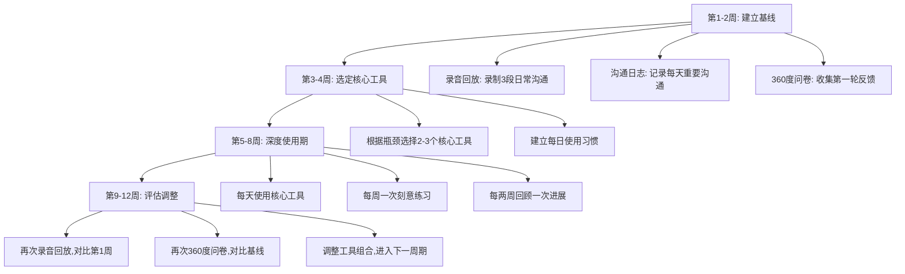

# 附录二：沟通学习工具清单

> 工具是能力的杠杆。选对工具，事半功倍；用错工具，南辕北辙。本清单汇集了当前最实用的沟通学习工具、应用程序和在线资源平台，涵盖口语表达、写作逻辑、演讲训练、外语沟通、AI辅助、团队协作、反馈自评七大维度。每个工具都附有适用场景、使用方法和实操建议，帮助读者在数字化时代高效提升沟通能力。

---

## 一、工具选择方法论

在逐一介绍工具之前，先建立一套选择框架。工具不是越多越好，关键是**匹配你的当前阶段和核心瓶颈**。

### 1.1 沟通能力的四个发展阶段与工具匹配

| 阶段 | 特征 | 核心需求 | 推荐工具类型 |
|------|------|----------|-------------|
| **入门期**（0-3个月） | 不知道怎么开口、写东西没有条理 | 建立基础认知和习惯 | 知识付费课程、思维导图、录音回放 |
| **成长期**（3-12个月） | 能说清楚但缺乏感染力和深度 | 刻意练习、获得反馈 | 演讲俱乐部、写作平台、AI辅助工具 |
| **精进期**（1-3年） | 日常沟通没问题，复杂场景仍有挑战 | 场景化训练、跨领域迁移 | 高阶课程、模拟谈判工具、行业社群 |
| **专家期**（3年以上） | 沟通已成为个人优势 | 输出倒逼输入、建立个人品牌 | 内容创作平台、教学工具、社群运营 |

### 1.2 工具选择的三个原则

**原则一：解决当前最大瓶颈，而非追逐最新工具。** 如果你的核心问题是"不敢开口"，先去Toastmasters练演讲，而不是研究Notion怎么建知识库。

**原则二：一个工具用深，胜过十个工具用浅。** 工具的价值在于深度使用后形成的工作流。选定2-3个核心工具，坚持使用至少3个月再评估是否更换。

**原则三：工具服务于练习，而非替代练习。** 看100个TED演讲不如自己做1次演讲；用Grammarly改100篇文章不如自己写1篇然后对照修改。工具是放大器，不是替代品。

### 1.3 工具组合的"1+2"模型

1个核心练习工具（每天使用）+ 2个辅助工具（每周使用）

例如：
- **入门组合**：得到App（每日学习）+ 思维导图（整理思路）+ 手机录音（回放改进）
- **成长组合**：Toastmasters（每周练习）+ Notion（素材积累）+ ChatGPT（模拟对话）
- **精进组合**：MasterClass（突破瓶颈）+ Loom（异步沟通）+ 问卷星（收集反馈）

---

## 二、口语与表达训练类

### 2.1 得到App

- **类型**：知识付费平台
- **官网**：www.dedao.cn
- **推荐内容**：
  - 《熊太行·关系攻略》——职场人际关系的底层逻辑
  - 《宁向东的管理学课》——管理沟通的理论框架
  - 《沟通训练营》系列——刻意练习式沟通训练
  - 《蔡康永的201堂情商课》——高情商表达的系统方法
- **适用场景**：碎片化学习沟通理论和方法论，适合每天通勤、午休等碎片时间
- **使用方法**：每天固定15-20分钟，听完一节课后用3句话总结核心观点，写在笔记工具中。周末回看本周笔记，挑出1-2个方法在下周实践。
- **推荐理由**：得到平台汇聚了国内顶尖的知识创作者，沟通类课程质量高、体系化强。其"沟通训练营"系列采用"学-练-评"闭环，每节课后有具体的练习任务和同伴互评，比单纯听课有效得多。
- **注意点**：不要同时订阅多个课程。一次一个，学完再开下一个。囤课不学是知识付费最大的陷阱。

### 2.2 喜马拉雅/小宇宙

- **类型**：音频平台
- **推荐内容**：
  - 沟通技巧类播客：《好好说话》《蔡康永的情商课》
  - TED演讲音频版——适合反复听经典演讲的语音语调
  - 有声书：《非暴力沟通》《关键对话》《影响力》等经典作品
- **适用场景**：通勤、做家务、运动等"耳朵空闲"的时间
- **使用方法**：第一遍正常听，了解内容；第二遍重点听表达方式——注意演讲者的语气变化、停顿位置、强调方式；第三遍跟读模仿。一集内容至少听三遍才有真正的收获。
- **推荐理由**：听觉输入是提升语言表达能力的重要途径。大量聆听优秀的沟通范例，可以潜移默化地提升语感和表达节奏。小宇宙的播客社区互动性强，评论区经常有深度讨论，也是学习表达的好地方。
- **与喜马拉雅的区别**：喜马拉雅内容更全面，小宇宙播客质量更高、社区氛围更好。建议播客类内容用小宇宙，有声书和课程用喜马拉雅。

### 2.3 趣配音/英语趣配音

- **类型**：配音练习App
- **适用场景**：提升口语表达的感染力、语调控制和情感传递
- **使用方法**：
  1. 选择与自己水平匹配的片段（不要一上来就选高难度演讲）
  2. 先听原声3遍，标注语气变化点
  3. 对着镜子练习2遍，注意表情和肢体
  4. 录音并对比原声，找出差异
  5. 重复练习直到语调接近原声
- **推荐理由**：通过给电影、演讲片段配音，在趣味中练习语音语调、情感表达和节奏控制。这种"角色扮演"式的练习方式，能有效克服表达中的平淡和僵硬感。配音练习的关键不是"像不像"，而是"能不能调动情绪"。

### 2.4 Toastmasters International（头马演讲俱乐部）

- **类型**：全球性非营利演讲练习组织
- **官网**：www.toastmasters.org
- **中国官网**：www.toastmasters.org/zh-CN
- **适用场景**：系统化的演讲和领导力训练
- **核心机制**：
  - **备稿演讲**（Prepared Speech）：按照Pathways学习路径，每2-4周完成一篇5-7分钟的演讲
  - **即兴演讲**（Table Topics）：随机抽取话题，1-2分钟即兴表达
  - **评估反馈**（Evaluation）：每位演讲者都会收到详细的文字和口头反馈
  - **角色锻炼**：主持人、计时员、语法官、总评估师等角色，锻炼不同维度的沟通能力
- **如何加入**：
  1. 在官网搜索你所在城市的俱乐部（中国大多数一二线城市都有多个俱乐部）
  2. 以访客身份免费参加2-3次会议，感受氛围
  3. 选择一个氛围好、成员活跃的俱乐部加入
  4. 年费通常在500-1000元人民币（含全球总部会费+俱乐部场地费）
- **推荐理由**：头马是全球最大的演讲练习社区，在140多个国家拥有超过16000个俱乐部。其"做中学"的理念和结构化的成长路径（从CC到DTM），让你在安全的环境中反复练习。**加入头马是我对所有想提升公众表达能力的人的第一推荐。没有之一。**
- **常见疑问**：
  - "我英语不好能参加吗？" → 大部分中国俱乐部是中文俱乐部，也有纯英文和双语俱乐部可选
  - "我太内向了不敢去" → 头马的核心价值观就是"安全的练习环境"，所有人都经历过第一次
  - "每周要花多少时间？" → 每周1次会议（2小时），加上准备演讲的时间（2-4小时），总投入每周4-6小时

### 2.5 Orai / Speeko

- **类型**：AI演讲教练App
- **适用场景**：独自练习演讲时获得即时反馈
- **核心功能**：录音后AI分析语速、填充词（"嗯""啊"）、停顿频率、音量变化，并给出改进建议
- **使用方法**：每天练习1段1分钟的自我介绍或观点陈述，听AI反馈，第二天改进同样的内容。一周后对比第一天和第七天的录音，你会惊讶于进步之大。
- **推荐理由**：不是每个人都有条件每周去Toastmasters，AI教练填补了"日常练习无反馈"的空缺。它不能替代真人反馈，但作为日常练习工具非常有价值。

---

## 三、写作与逻辑表达类

### 3.1 Markdown编辑器（Typora / Obsidian / Logseq）

- **类型**：结构化写作工具
- **工具对比**：

| 工具 | 特点 | 最适合 |
|------|------|--------|
| **Typora** | 所见即所得，极简界面 | 纯写作，不想被功能干扰 |
| **Obsidian** | 双向链接，本地存储，插件生态丰富 | 建立知识网络，长期积累 |
| **Logseq** | 大纲式编辑，开源免费 | 日记+知识管理一体化 |

- **适用场景**：结构化写作、笔记整理、沟通素材积累
- **使用方法**：用Markdown的标题层级（H2/H3/H4）训练自己的思维层级。每篇文章先列大纲（标题结构），再填充内容。这个过程本身就是逻辑思维的训练。
- **推荐理由**：清晰的写作是清晰思维的体现。使用Markdown工具可以培养结构化表达的习惯。Obsidian的双向链接功能尤其强大——当你积累了足够多的笔记，知识之间的关联会自然浮现，这种"涌现"效果能显著提升思考深度。

### 3.2 Notion / Wolai

- **类型**：全能型知识管理和协作工具
- **适用场景**：沟通素材积累、读书笔记整理、表达框架模板、团队知识库
- **推荐模板**：
  - **沟通素材库**：按场景分类（演讲、邮件、谈判、汇报）收集好故事、金句、案例
  - **读书笔记模板**：每本书提取3-5个可用于沟通的核心观点
  - **演讲准备模板**：受众分析→核心信息→故事线→幻灯片大纲→预演记录
  - **沟通复盘模板**：场景描述→目标→实际过程→结果→差距分析→改进计划
- **与Obsidian的区别**：Notion适合协作和管理型任务，Obsidian适合个人深度思考。如果你需要和团队共享沟通素材，用Notion；如果纯粹个人积累，用Obsidian。
- **推荐理由**：一个好的沟通者一定是一个善于积累的人。Notion帮助你建立个人的"沟通弹药库"——当你需要做一个重要汇报时，不是从零开始，而是从素材库中调取合适的框架、故事和数据。

### 3.3 简书 / 知乎 / 微信公众号

- **类型**：内容创作平台
- **适用场景**：写作练习、获取读者反馈、建立个人影响力
- **平台选择指南**：

| 平台 | 优势 | 劣势 | 适合 |
|------|------|------|------|
| **简书** | 门槛低，适合练笔 | 内容质量参差不齐 | 纯练笔，不在意流量 |
| **知乎** | 问答形式，流量大 | 竞争激烈，新手不易被看到 | 练习"针对性表达" |
| **微信公众号** | 私域流量，深度阅读 | 推荐机制弱，冷启动难 | 长期输出，建立个人品牌 |
| **小红书** | 图文短内容，传播快 | 深度内容不易出圈 | 练习简洁有力的表达 |

- **使用方法**：
  1. 选定一个平台作为"主战场"，每周至少发布1篇内容
  2. 前100篇不要在意流量，专注于"写清楚一件事"
  3. 每篇发布后观察阅读量和评论，分析哪些内容引发共鸣
  4. 3个月后回顾第一批文章，感受自己的进步
- **推荐理由**：写作是沟通能力的"放大器"。定期发布内容，不仅能锻炼文字表达能力，还能通过读者的真实反馈了解自己的表达效果。知乎的问答形式尤其适合练习"针对具体问题给出清晰回答"的能力——这正是职场沟通中最核心的技能。

### 3.4 XMind / MindNode / 幕布

- **类型**：思维导图和大纲工具
- **适用场景**：演讲前的内容组织、复杂话题的思路梳理、会议准备
- **使用方法**：
  - **演讲准备**：中心主题→3个核心论点→每个论点2-3个支撑→每个支撑1个故事或数据
  - **会议准备**：中心议题→我方立场→对方可能的立场→共同利益→备选方案
  - **写作构思**：中心主题→分支章节→每章核心观点→需要的素材
- **推荐理由**：很多沟通混乱的根源是思维混乱。在重要沟通之前，花10分钟用思维导图梳理要表达的核心观点和支撑论据，能大幅提升沟通的清晰度和逻辑性。**幕布**的独特优势在于大纲和思维导图可以一键切换，特别适合"先列大纲再看全局"的工作流。

---

## 四、视频与在线学习平台

### 4.1 TED（www.ted.com）

- **类型**：顶级演讲视频平台
- **适用场景**：学习顶级演讲技巧、拓宽知识视野、积累表达素材
- **高效学习方法**（而非随便看看）：
  1. **第一遍**：正常观看，感受整体节奏和情感
  2. **第二遍**：暂停记录——开场用了什么技巧？结构是什么？哪个故事最打动你？结尾如何收束？
  3. **第三遍**：跟读模仿关键段落，体会语气、停顿和节奏
  4. **第四遍**：关掉视频，尝试用自己的话复述整个演讲
- **必看清单**（按沟通技巧分类）：
  - **开场技巧**：Simon Sinek《How Great Leaders Inspire Action》
  - **讲故事**：Brené Brown《The Power of Vulnerability》
  - **数据呈现**：Hans Rosling《The Best Stats You've Ever Seen》
  - **说服力**：Dan Pink《The Puzzle of Motivation》
  - **简洁表达**：Ken Robinson《Do Schools Kill Creativity?》
- **推荐理由**：TED是学习公众表达的最佳资源之一。18分钟的时间限制迫使演讲者精炼内容——这恰恰是大多数人最需要学习的能力。

### 4.2 B站（bilibili.com）

- **类型**：综合视频平台
- **推荐频道和内容**：
  - **辩论学习**：《奇葩说》全集——学习即兴表达、反驳技巧和幽默感。重点看黄执中、陈铭、詹青云的发言，分析他们的论证结构
  - **演讲教学**：搜索"演讲技巧""公众表达"，关注播放量高、评论质量好的UP主
  - **名人演讲**：乔布斯斯坦福演讲、奥巴马演讲合集、罗永浩锤子发布会——不同类型演讲风格的标杆
  - **沟通心理学**：搜索"非暴力沟通""关键对话"的解读视频
- **弹幕文化的价值**：B站的弹幕本身也是沟通练习——你需要在极短的时间内理解内容并做出回应。观察高赞弹幕的表达方式，学习如何用最少的字传达最精准的意思。
- **推荐理由**：B站是中文互联网最大的学习视频平台之一，免费、内容丰富、社区活跃。其独特的弹幕互动模式让你在"旁观"中练习快速理解和回应的能力。

### 4.3 Coursera / edX / 中国大学MOOC

- **类型**：在线课程平台
- **推荐课程**：

| 平台 | 课程名称 | 开课机构 | 侧重点 |
|------|---------|---------|--------|
| Coursera | Improving Communication Skills | 宾夕法尼亚大学 | 职场沟通综合提升 |
| Coursera | Introduction to Public Speaking | 华盛顿大学 | 演讲基础训练 |
| Coursera | Successful Negotiation | 密歇根大学 | 谈判沟通技巧 |
| Coursera | Rhetoric: The Art of Persuasive Writing | 哈佛大学 | 说服性写作 |
| edX | Communication Strategies for a Virtual Age | 多伦多大学 | 远程/线上沟通 |
| 中国大学MOOC | 演讲与口才 | 多所985高校 | 中文演讲系统训练 |
| 中国大学MOOC | 沟通心理学 | 多所高校 | 沟通的心理学基础 |

- **使用建议**：不要"旁听"——要跟着做作业。课程的价值不在视频本身，而在作业和同伴互评。花4-6周认真完成一门课程的全部作业，比"刷"10门课程有效得多。
- **推荐理由**：世界一流大学的沟通课程，大部分可以免费旁听。课程质量有保障，作业和测验能帮助你检验学习效果。特别适合有一定自驱力、喜欢系统学习的学习者。

### 4.4 MasterClass / 网易公开课

- **类型**：大师课/公开课平台
- **MasterClass推荐**：
  - Robin Roberts的《Effective Communication》——从新闻主播的视角教沟通
  - Neil deGrasse Tyson的《Scientific Thinking and Communication》——如何把复杂概念讲清楚
  - Chris Voss的《Negotiation》——FBI谈判专家的沟通方法论
  - Aaron Sorkin的《Screenwriting》——学讲故事的顶级资源
- **网易公开课**：免费观看TED中文翻译版、哈佛幸福课、耶鲁公开课等
- **推荐理由**：MasterClass由各领域的顶尖人物授课，不仅学技巧，更能学到大师的思维方式和表达风格。适合有一定基础后想要突破瓶颈的进阶学习者。

---

## 五、AI辅助沟通工具

> AI工具正在深刻改变沟通学习的方式。它们不能替代真人练习，但在特定场景下能提供前所未有的个性化支持。

### 5.1 ChatGPT / Claude / Kimi / DeepSeek

- **类型**：大语言模型对话工具
- **沟通学习的六大用法**：

**用法一：模拟对话练习**
提示词："假设你是我的客户，对我们的方案不满意，认为价格太高。
我会尝试说服你，请给出真实的回应。每次回应后评估我的说服力（1-10分）
并给出改进建议。"

**用法二：写作润色与对比**
提示词："以下是我写的邮件草稿。请指出3个最大的问题，
然后用你的版本重写。最后解释你每处修改的原因。"

**用法三：表达框架生成**
提示词："我要向老板汇报一个项目延期的情况。
请给我3种不同的表达框架（直接型、缓冲型、方案型），
每种框架给出完整的话术。"

**用法四：角色扮演面试**
提示词："你是某互联网公司的HR总监，我是应聘产品经理的候选人。
请按照真实面试流程提问，最后给我一份详细的面试表现评估报告。"

**用法五：反馈分析**
提示词："以下是我收到的同事反馈原话（粘贴内容）。
请分析其中的深层含义、隐含期望，并帮我制定改进计划。"

**用法六：沟通案例学习**
提示词："请用非暴力沟通的四要素（观察、感受、需要、请求）
分析以下这段对话中双方的沟通问题，并给出改写版本。"

- **推荐理由**：AI最大的价值是"7×24小时的练习伙伴"。它不会疲倦，不会不耐烦，可以反复模拟同一个场景直到你满意。但它有明确的局限：**AI无法提供真实的人际压力和情感反馈**，所以它应该作为真人练习的补充，而非替代。

### 5.2 DeepL / Google Translate / 有道翻译

- **类型**：AI翻译工具
- **适用场景**：外语写作辅助、跨语言沟通、学习地道表达
- **正确使用方式**：
  1. 先自己写一版目标语言的内容
  2. 用翻译工具翻译同一段话
  3. 对比差异，分析为什么工具的版本更地道
  4. 记录好的表达到个人词库
- **DeepL vs Google Translate**：DeepL在中英互译的文学性和自然度上通常更好，Google Translate支持的语言更多。对于正式的商务沟通，建议用DeepL翻译后人工校对。
- **推荐理由**：AI翻译工具不是用来"偷懒"的，而是用来"学习"的。通过对比自己的表达和AI的翻译，你可以快速发现中英文表达的差异，逐步内化地道的外语表达方式。

### 5.3 Grammarly / 火山写作（Writingo）

- **类型**：AI写作辅助工具
- **适用场景**：英文/中文书面沟通的质量检查和提升
- **Grammarly核心功能**：
  - 语法和拼写检查（基础）
  - 语气检测（Tone Detector）——告诉你邮件读起来是"自信的""友好的"还是"生硬的"
  - 清晰度建议——标记冗长或含糊的句子
  - 风格建议——根据正式程度调整表达
- **火山写作（Writingo）**：字节跳动出品的英文写作辅助工具，对中文学英语写作的场景优化更好
- **使用建议**：不要直接接受所有修改建议。先看问题是什么，尝试自己改，然后再看工具的建议。每次记录3个自己常犯的错误，一周后检查是否改进。
- **推荐理由**：书面沟通的"隐形杀手"是语气和清晰度。你写的时候觉得自己很友好，读的人可能觉得你在发火。Grammarly的语气检测功能可以帮你避免这种"沟通温度差"。

### 5.4 Otter.ai / 飞书妙记 / 通义听悟

- **类型**：AI会议记录和分析工具
- **适用场景**：会议复盘、沟通回放、表达分析
- **核心功能**：
  - 实时语音转文字，准确率通常在95%以上
  - 自动识别不同说话人
  - 自动生成会议摘要和待办事项
  - 支持关键词搜索——快速定位讨论某个话题的段落
- **用于自我提升的方法**：
  1. 开会时打开录音（提前告知参会者）
  2. 会后用AI工具转录
  3. 搜索自己的发言，分析：说了多少次"嗯""那个"？每次发言平均多长？是否有打断别人的情况？
  4. 制定下一次会议的具体改进目标
- **推荐理由**：大多数人不知道自己在会议中的真实表现。AI转录工具提供了客观的"镜子"，让你看到自己的语言习惯——包括那些你自己意识不到的口头禅和表达模式。

---

## 六、外语沟通类

### 6.1 Duolingo（多邻国）

- **类型**：游戏化语言学习App
- **适用场景**：外语基础能力提升，保持学习习惯
- **优势**：游戏化机制（连续打卡、排行榜、成就系统）保持动力；每天5-15分钟的碎片化学习
- **局限**：不适合提升口语流利度和实际对话能力，更适合作为"词汇和语法的地基"
- **推荐理由**：跨文化沟通的第一步是语言基础。Duolingo的游戏化设计能让你坚持每天接触外语，这是最重要的——坚持比强度重要。但要记住，Duolingo只是起点，不是终点。

### 6.2 italki / Cambly / Preply

- **类型**：在线一对一口语平台
- **工具对比**：

| 平台 | 价格区间 | 特点 | 最适合 |
|------|---------|------|--------|
| **italki** | ¥50-200/课时 | 老师多、价格灵活、社区活跃 | 有计划地系统练习 |
| **Cambly** | ¥100-180/月 | 随时连线外教、无需预约 | 碎片时间随机练习 |
| **Preply** | ¥60-250/课时 | 专业教师多、课程体系化 | 备考或专项提升 |

- **高效练习方法**：
  1. 每次课前准备2-3个想讨论的话题和相关词汇
  2. 课后15分钟内回顾笔记，记录新学的表达
  3. 每周至少2次，每次30分钟以上
  4. 同一个老师连续上3次以上再换，让老师了解你的水平和弱点
- **推荐理由**：沟通能力只能通过真实对话来提升。与母语者的实时对话不仅提升语言能力，更锻炼你在"听不太懂"时如何确认、如何追问、如何保持对话流畅——这些才是跨文化沟通的核心技能。

### 6.3 HelloTalk / Tandem

- **类型**：语言交换社交App
- **适用场景**：免费的外语对话练习、结交国际朋友
- **使用方法**：找一个想学中文的母语者，互相教学。每周约2次语音通话，每次各用对方的语言15分钟。
- **推荐理由**：免费，而且你能从"教别人中文"的过程中反思自己的母语表达规律，这种"元语言意识"反过来会提升你对目标语言的理解。

---

## 七、即时沟通与协作工具

### 7.1 飞书 / 钉钉 / 企业微信

- **类型**：企业协作平台
- **沟通效率提升方法**：

| 功能 | 飞书 | 钉钉 | 企业微信 | 沟通价值 |
|------|------|------|---------|---------|
| 消息已读状态 | ✅ | ✅ | ✅ | 了解对方是否看到，减少"你看到了吗？"的追问 |
| 话题群/频道 | ✅ | ✅ | 部分 | 按话题分流讨论，避免信息混杂 |
| 文档协作 | ✅ | ✅ | 腾讯文档 | 实时协作减少"版本地狱" |
| 消息定时发送 | ✅ | ❌ | ✅ | 避免深夜打扰，尊重对方时间 |
| 快捷回复/表情 | ✅ | ✅ | ✅ | 简单确认不打字，提高效率 |

- **职场即时通讯的7条黄金法则**：
  1. 一条消息只说一件事
  2. 先说结论，再说原因
  3. 需要对方回复的，明确写出"请回复"和截止时间
  4. 避免连续发送多条短消息，合并成一条
  5. 非紧急事项不在非工作时间发送
  6. 复杂讨论转语音/视频，文字说不清的事别用文字硬说
  7. 重要信息发送后用"@"指定责任人
- **推荐理由**：职场中80%以上的日常沟通发生在即时通讯工具中。掌握这些工具的高效使用方法，能显著减少沟通成本和误解。

### 7.2 Loom / 飞书视频消息 / 录屏工具

- **类型**：异步视频消息工具
- **适用场景**：替代冗长的文字说明，用简短视频传递复杂信息
- **最佳使用场景**：
  - 产品演示和反馈——录屏操作过程+语音讲解
  - 代码审查——录屏逐行讲解修改思路
  - 方案说明——对着PPT录一段3分钟讲解
  - 新人培训——录制常用流程，新人反复观看
  - 跨时区沟通——录好视频，对方在方便时观看
- **录制技巧**：
  1. 控制在3分钟以内（超过3分钟的视频大多数人不会看完）
  2. 前10秒说清楚"这个视频要解决什么问题"
  3. 提供1.5倍速选项——节省对方时间
  4. 文字标题和关键点——方便快速浏览
- **推荐理由**：有时候一个2分钟的视频比2000字的文字更有效。Loom让异步沟通变得高效而有温度，特别适合远程团队。**异步视频消息是未来职场沟通的重要趋势之一。**

### 7.3 Slack / Discord / 飞书话题群

- **类型**：社区化沟通平台
- **适用场景**：团队知识沉淀、异步讨论、社群沟通
- **高效使用方法**：
  - 善用"话题/Thread"功能——将回复集中在原始消息下，避免刷屏
  - 设置"免打扰"时段——深度工作时间不被消息打断
  - 建立"公告"频道——重要信息只发公告频道，所有人必须关注
  - 使用"Pin"功能——将常用资料和规范固定在频道顶部
- **推荐理由**：这类工具的核心价值是"异步沟通"——你不需要实时在线也能参与讨论。学会用好异步沟通，是远程工作的必备技能。

---

## 八、反馈与自评工具

### 8.1 录音/录像回放

- **工具**：手机自带录音/录像功能，或OBS Studio（电脑录屏）
- **适用场景**：自我审视和改进
- **系统化的回放分析框架**：

**语音维度**（听录音）：
| 检查项 | 理想状态 | 常见问题 |
|--------|---------|---------|
| 语速 | 150-180字/分钟 | 太快（紧张）或太慢（不自信） |
| 停顿 | 关键信息前后有停顿 | 停顿过多（犹豫）或无停顿（背稿） |
| 音量 | 有起伏，重点处加强 | 全程一个音量，像念经 |
| 口头禅 | 极少 | "然后""就是说""对吧"每句都有 |

**非语言维度**（看录像）：
| 检查项 | 理想状态 | 常见问题 |
|--------|---------|---------|
| 眼神 | 与听众有交流，扫视全场 | 看天花板/地板/屏幕 |
| 手势 | 自然配合语言，开放姿态 | 双手插兜/抱胸/无处安放 |
| 站姿 | 稳定，轻微移动 | 来回踱步/一动不动 |
| 表情 | 与内容匹配，有感染力 | 面无表情或过度夸张 |

- **实操建议**：
  1. 每次重要沟通（汇报、演讲、面试）后24小时内回放
  2. 用表格记录3个做得好的点和3个需要改进的点
  3. 下次沟通前回顾上次的改进清单
  4. 每月对比月初和月末的录音，感受进步
- **推荐理由**：这是最简单也最有效的自我提升工具，零成本，无限次使用。大多数人第一次听到自己的录音时都会感到惊讶——"原来我说话是这样的"。这个"惊讶"就是改进的起点。**每月至少录一次自己的正式沟通，坚持半年，效果惊人。**

### 8.2 360度反馈问卷（问卷星 / 腾讯问卷 / 金数据）

- **类型**：在线问卷工具
- **适用场景**：系统化收集他人对你沟通能力的客观反馈
- **问卷设计模板**：

沟通能力360度反馈问卷（匿名）

评分标准：1=需要大幅改进  2=需要改进  3=合格  4=良好  5=优秀

一、表达清晰度
1. ta表达观点时条理清晰        [1] [2] [3] [4] [5]
2. ta能用简单的话解释复杂的事情  [1] [2] [3] [4] [5]

二、倾听与理解
3. ta能准确理解别人的意思        [1] [2] [3] [4] [5]
4. ta不会在别人说话时打断        [1] [2] [3] [4] [5]

三、情感管理
5. ta在压力下能保持冷静表达      [1] [2] [3] [4] [5]
6. ta能察觉并回应他人的情绪      [1] [2] [3] [4] [5]

四、影响力
7. ta的观点容易被他人接受        [1] [2] [3] [4] [5]
8. ta在讨论中能引导建设性的方向   [1] [2] [3] [4] [5]

五、开放性问题
9. ta沟通中最突出的优势是什么？
10. ta沟通中最需要改进的一点是什么？

- **使用建议**：
  1. 每半年做一次，邀请5-10位不同关系的人（同事、上级、下属、朋友、家人）
  2. 第一次的结果建立基线，后续对比看趋势
  3. 重点看"开放性问题"的回答——往往比评分更有价值
  4. 不要试图解释或反驳反馈，先接受再分析
- **推荐理由**：来自他人的客观反馈是发现自身沟通盲区的最佳途径。你以为自己"说话很直"，别人可能觉得你"说话很冲"。你以为自己"善于倾听"，别人可能觉得你"总在等自己说话的机会"。360度反馈帮你打开这些盲区。

### 8.3 沟通日志（手账 / Notion / 备忘录）

- **类型**：自我追踪工具
- **适用场景**：日常沟通的持续记录和反思
- **每日沟通日志模板**：

日期：____
今天的重要沟通：____
沟通目标：____
实际结果：____
做得好的地方：____
需要改进的地方：____
下次我会：____
情绪状态：____（1-10分）

- **使用建议**：每天花3-5分钟填写，不必每条都很深入，重在坚持。周末花15分钟回顾本周日志，找出反复出现的模式——是"容易紧张"还是"总忘记倾听"还是"表达不够简洁"？找到模式后，下周集中攻克。
- **推荐理由**：没有记录就没有改进。沟通日志让你从"无意识的重复"变成"有意识的进步"。坚持3个月，你会对自己的沟通模式有清晰的认知。

---

## 九、跨文化沟通专用工具

### 9.1 Culture Map（文化地图）相关工具

- **Erin Meyer的Culture Map框架**：将全球商业文化分为8个维度（沟通、评估、说服、领导、决策、信任、分歧、时间），是跨文化沟通的经典工具
- **在线评估**：culturemapped.com 提供免费的文化倾向自测
- **适用场景**：跨国团队协作、海外出差、与外国客户沟通前的准备

### 9.2 时区和节日工具

- **World Time Buddy**（worldtimebuddy.com）：多时区时间对比，安排跨时区会议
- **Time and Date**（timeanddate.com）：全球公共假期查询，避免在对方的节日安排重要沟通
- **推荐理由**：跨文化沟通的"硬知识"——时区和节日——经常被忽略，但一个在排灯节安排会议的邀请会让对方非常不舒服。

---

## 十、工具使用策略与路线图

### 10.1 按时间投入的工具组合方案

| 每日可用时间 | 推荐组合 | 核心目标 |
|-------------|---------|---------|
| **15分钟** | Duolingo（5分钟）+ 录音回放（10分钟） | 保持习惯，建立基础 |
| **30分钟** | 得到/播客（15分钟）+ 写作练习（15分钟） | 输入+输出平衡 |
| **1小时** | 课程学习（30分钟）+ AI对话练习（15分钟）+ 日志反思（15分钟） | 系统提升 |
| **2小时+** | 上述全部 + Toastmasters/italki（每周2-3次） | 全面精进 |

### 10.2 90天工具使用路线图

### 10.3 常见的工具使用误区

**误区一：工具收集症**
- 症状：下载了20个App，每个都浅尝辄止
- 纠正：删到只剩3个，给每个工具30天深度使用期

**误区二：输入过量，输出为零**
- 症状：每天听播客、看视频、读文章，但从来不写、不说、不练
- 纠正：遵循"1:1法则"——每1小时输入，必须匹配1小时输出（写文章、做演讲、模拟对话）

**误区三：只用AI，不跟真人练**
- 症状：每天跟ChatGPT练对话，但从不参加Toastmasters或跟朋友练习
- 纠正：AI是热身工具，真人才是实战。每周至少一次真人沟通练习

**误区四：忽略反馈环节**
- 症状：练习很勤奋，但从不录音回放、不收集他人反馈
- 纠正：没有反馈的练习可能在强化错误。每3次练习做一次系统回顾

**误区五：追求完美工具**
- 症状：花大量时间研究哪个App最好、哪种笔记方法最高效
- 纠正：工具的差异远小于"用与不用"的差异。选一个开始用，边用边调整

---

## 十一、工具速查表

以下按使用场景汇总推荐工具，方便快速查找：

| 场景 | 首选工具 | 备选工具 | 费用 |
|------|---------|---------|------|
| 碎片时间学习 | 得到App / 喜马拉雅 | 小宇宙播客 | 免费-¥200/年 |
| 演讲练习 | Toastmasters | Orai / Speeko | ¥500-1000/年 |
| 写作训练 | Obsidian + 知乎 | Typora + 微信公众号 | 免费 |
| 素材积累 | Notion | Wolai / Obsidian | 免费 |
| 思维整理 | XMind | 幕布 / MindNode | 免费-¥400/年 |
| 英文写作 | Grammarly | 火山写作 | 免费-$144/年 |
| AI对话练习 | ChatGPT / Claude | Kimi / DeepSeek | 免费-$20/月 |
| 口语实战 | italki | Cambly / HelloTalk | ¥50-200/课时 |
| 会议复盘 | 通义听悟 | 飞书妙记 / Otter | 免费-¥99/月 |
| 异步沟通 | Loom | 飞书视频消息 | 免费-$15/月 |
| 反馈收集 | 问卷星 | 腾讯问卷 / 金数据 | 免费 |
| 跨文化沟通 | Culture Map评估 | World Time Buddy | 免费 |

> **最后的提醒**：工具不在多，在于用得深。选择2-3个最适合自己的工具，坚持使用并形成习惯，远比浅尝辄止地尝试所有工具更有效。最好的工具，是你每天都在用的那个。
