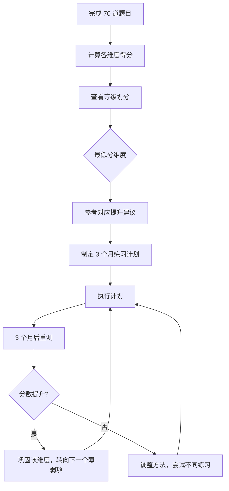

# 附录三：沟通能力自测表

> 沟通能力不是一种模糊的"天赋"，而是由倾听、表达、情绪管理、影响力等多个可量化维度构成的复合技能体系。本自测表基于心理学研究（如 Carl Rogers 的积极倾听理论、Daniel Goleman 的情商模型、Albert Mehrabian 的沟通三要素模型）和企业培训实践设计，旨在帮助你精确评估沟通能力的各个维度，找到最值得投入精力提升的方向。

## 为什么需要一份量化的自测表

大多数人对自己的沟通能力存在两种误判：一部分人因为"没有被投诉过"就认为自己沟通没问题；另一部分人因为偶尔的冲突就全面否定自己的沟通能力。这两种判断都不准确。

科学研究表明，人类对自身能力的评估存在系统性偏差：

| 偏差类型 | 表现 | 研究来源 |
|---------|------|---------|
| 邓宁-克鲁格效应 | 能力差的人倾向于高估自己 | Dunning & Kruger, 1999 |
| 盲点偏差 | 我们看不到自己的无意识行为 | Eurich, 2017 |
| 自我服务偏差 | 成功归因自己，失败归因外部 | Miller & Ross, 1975 |
| 近因效应 | 被最近一次沟通体验主导判断 | 认知心理学经典发现 |

一份结构化的自测表的价值在于：它把模糊的自我感觉拆解成具体的、可衡量的行为指标，迫使你在每个细分维度上独立打分，而不是给出一个笼统的"我觉得还行"。

### 自测表的设计原理

本自测表覆盖沟通能力的 **七大核心维度**，每个维度包含 **10 道行为化题目**。题目的设计遵循以下原则：

1. **行为化**：每道题描述的都是具体的、可观察的行为，而非抽象的特质。例如，不说"你是否有同理心"，而是说"当对方情绪激动时，你能保持冷静并引导对话走向建设性方向"。
2. **频率导向**：评分标准以行为发生的频率为基准（从未做到 → 总是做到），减少主观判断的模糊空间。
3. **场景覆盖**：同一维度内的题目覆盖不同场景——日常对话、正式场合、冲突情境、书面沟通等——避免单一场景带来的评估偏差。
4. **正向表述**：所有题目均为正向表述（高分 = 好），避免双重否定造成的理解混乱。

## 使用说明

### 评分标准

每题按 1-5 分打分，请根据你**过去三个月**的真实行为表现来评估，而不是根据你希望自己怎么做来打分：

| 分数 | 含义 | 行为频率参考 |
|------|------|-------------|
| **1 分** | 完全不符合 | 从未做到，或意识中完全没有这个概念 |
| **2 分** | 较少符合 | 偶尔做到，但更多时候是无意识的巧合 |
| **3 分** | 一般符合 | 有时做到，有时做不到，不够稳定 |
| **4 分** | 比较符合 | 经常做到，已经成为习惯，但偶尔会遗漏 |
| **5 分** | 完全符合 | 总是做到，已经成为自然而然的行为模式 |

### 作答原则

- **诚实第一**：自测的目的是发现问题而非自我安慰。如果你在某题上犹豫不决，倾向于选较低的分数——犹豫本身就说明这个行为还不够稳定。
- **回忆具体场景**：打分时回忆最近三个月内的真实场景。例如 Q1 问"能否全神贯注倾听"，就回忆最近一次超过 10 分钟的对话，你在那次对话中的实际表现如何。
- **不受单次事件影响**：不要因为某次特别好或特别差的表现就影响整体判断，关注的是"通常情况"。
- **独立评估每题**：不要因为某个维度的第一题打了高分，就惯性地给该维度后面的题目也打高分。

### 评估周期

建议每 **3 个月**重新测试一次。沟通能力的提升是渐进的，短期内（一个月内）重测容易因记忆效应导致分数虚高。3 个月的间隔足以让刻意练习产生产生可感知的变化，同时也足够长以避免"记住上次答案"的问题。

### 如何使用结果

1. 完成全部 70 道题目，计算各维度得分和总分
2. 查看等级划分表，了解自己所处的水平
3. 找到得分最低的 1-2 个维度作为优先提升方向
4. 参考该维度的针对性提升建议，制定 3 个月的练习计划
5. 3 个月后重测，对比分数变化，调整提升方向



---

## 第一部分：倾听能力（共 10 题，满分 50 分）

> 倾听是沟通中最被低估的能力。大多数人认为沟通的重点在于"怎么说"，但研究显示，职场中人们花在倾听上的时间占比高达 45%（高于说 30%、读 16%、写 9%），而大多数人倾听的有效率只有 25%。换句话说，你听到的信息中，有 3/4 被遗漏或误解了。

**倾听能力的三个层次：**

| 层次 | 描述 | 典型表现 |
|------|------|---------|
| 听而不闻 | 物理上听到了声音，但注意力不在 | 边听边看手机，事后想不起对方说了什么 |
| 选择性倾听 | 听到了内容，但只关注自己感兴趣的部分 | 只听结论不听论据，只听事实不听感受 |
| 全身心倾听 | 理解内容、感受情绪、觉察潜台词 | 能复述对方的观点，能识别对方未说出的顾虑 |

---

**Q1.** 当别人说话时，我能够全神贯注地倾听，不走神、不玩手机。

> 这是倾听的基础门槛。全神贯注意味着在对方说话的这段时间里，你的注意力 100% 在对方身上——不看手机屏幕、不想待办事项、不构思自己接下来要说什么。如果一次 10 分钟的对话中你走神了 2 次以上，这个行为就不算"稳定做到"。

□1  □2  □3  □4  □5

**Q2.** 我会在对方说完之后再表达自己的观点，不会急于打断。

> 打断是最常见的倾听障碍之一。很多人打断并非出于恶意，而是因为大脑处理语言的速度（约 400 词/分钟）远快于说话速度（约 125 词/分钟），大脑"闲着"就忍不住插话。但对说话者来说，被打断传递的信号是"你说的不重要，我比你更急"。

□1  □2  □3  □4  □5

**Q3.** 我能通过对方的语气、表情和肢体语言判断其真实情绪。

> Albert Mehrabian 的研究表明，沟通中只有 7% 的信息通过语言内容传递，38% 通过语气语调，55% 通过肢体语言。虽然这个比例在不同场景下会有变化，但非语言信号的重要性是确定的。如果对方嘴上说"我没事"，但语气低沉、回避眼神、双臂交叉，你需要能识别出"他并不没事"。

□1  □2  □3  □4  □5

**Q4.** 我会在倾听时使用点头、眼神交流、简短回应等方式表示关注。

> 这些行为在学术上被称为"倾听回馈"（back-channeling）。它的作用不是假装在听，而是向对方传递一个持续的信号："我在听，请继续。"没有倾听回馈的对话会让说话者感到不安——他不知道你是在认真听还是在神游。有效的倾听回馈包括：适度点头（频率约每 3-5 秒一次）、简短回应（"嗯"、"然后呢"、"我理解"）、眼神接触（保持 60-70% 的时间）。

□1  □2  □3  □4  □5

**Q5.** 当我不确定对方的意思时，我会主动提问或复述来确认理解。

> 这在沟通学中被称为"确认性倾听"（confirmatory listening）。最常见的做法是用自己的话复述对方的核心意思："你的意思是……对吗？"这个看似简单的动作能消除大量误解。很多沟通冲突的根源不是观点分歧，而是从一开始就理解错了对方的意思。

□1  □2  □3  □4  □5

**Q6.** 我能够倾听与自己观点不同的人说话，不急于反驳。

> 这是倾听中最难的部分——防御性倾听的克服。当对方的观点与你不一致时，大脑的杏仁核会激活"战斗或逃跑"反应，你的情绪系统会驱使你立刻反驳。但优秀的倾听者能在这种冲动出现时"暂停"，先把对方的论据完整听完，再决定如何回应。做到这一点的前提是：你把"理解对方"和"同意对方"分开——理解不等于同意。

□1  □2  □3  □4  □5

**Q7.** 我能区分对方表达中的"事实"和"情绪"。

> 例如，同事说"这个项目完全失控了，根本没有人管"——"完全失控"和"没有人管"是情绪化表述，事实可能是"项目的两个关键节点延期了，其中一个是职责划分不清晰导致的"。能区分事实和情绪，才能给出对方真正需要的回应：如果对方需要的是情绪被看见，你给解决方案就是答非所问。

□1  □2  □3  □4  □5

**Q8.** 在团队讨论中，我能记住不同成员的核心观点。

> 这考验的不仅是记忆力，更是倾听时的信息加工深度。如果你只是被动地"听"，信息会在短期记忆中迅速消退（约 15-30 秒）。但如果你在听的同时进行主动加工——比如在脑中构建一个观点列表、标注不同观点之间的关系——记忆的保持率会大幅提升。实际操作中，做笔记是最有效的辅助手段。

□1  □2  □3  □4  □5

**Q9.** 我愿意倾听别人的抱怨和负面情绪，而不急于给建议。

> 当朋友向你抱怨工作压力大时，你的第一反应是什么？大多数人会说"你可以试试……"但对方真正需要的往往不是建议，而是被听见。心理学家 Carl Rogers 将这种能力称为"无条件积极关注"——不评判、不急于解决问题，只是让对方感到"你的情绪被我接住了"。这在亲密关系和团队管理中尤为重要。

□1  □2  □3  □4  □5

**Q10.** 我会关注对方"没说出来"的话（潜台词）。

> 潜台词是沟通中最微妙的部分。当领导说"这个方案可以考虑"，"可以考虑"可能是委婉的否定；当客户说"我回去跟团队商量一下"，可能是他还有没说出口的顾虑。识别潜台词需要综合对方的用词选择、语气变化、表情、前后逻辑一致性等多个信号。这不是"过度解读"，而是对沟通完整性的追求。

□1  □2  □3  □4  □5

**第一部分得分：______ / 50**

---

## 第二部分：口头表达能力（共 10 题，满分 50 分）

> 口头表达能力是大多数人最先想到的"沟通能力"，但实际上它只是七大维度之一。口头表达的核心不在于"口才好"，而在于能否用对方能理解的方式，把你的意思准确、高效地传递出去。

**口头表达的层次模型：**

| 层次 | 能力要求 | 典型场景 |
|------|---------|---------|
| 基础层 | 口齿清晰、语速适当、逻辑通顺 | 日常对话、简单汇报 |
| 进阶层 | 因人而异调整表达方式、善用故事和类比 | 跨部门沟通、客户沟通 |
| 高阶层 | 具有感染力和说服力，能驾驭即兴表达 | 演讲、谈判、危机沟通 |

---

**Q11.** 我能在 1 分钟内清晰地表达一个核心观点。

> 这是"电梯演讲"能力——在极短时间内传达核心信息。很多人表达时习惯从背景铺垫开始，说了 3 分钟还没切入正点。有效的做法是"结论先行"：先用一句话说清楚你要表达的核心观点，然后再补充 2-3 个支撑论据。如果你连 1 分钟都撑不满说明观点本身不够清晰；如果 1 分钟还没说到重点说明结构需要优化。

□1  □2  □3  □4  □5

**Q12.** 我表达时逻辑清晰，通常会先说结论再说原因。

> "结论先行"是结构化表达的基石，来自 Barbara Minto 的金字塔原理。它的心理学依据是"首因效应"——人们对最先接收到的信息印象最深。当你说"我的建议是采用方案 A，原因有三个"时，对方的注意力会聚焦在你的论据上；但如果你先说论据再说结论，对方在听论据时会感到困惑——"他到底想说什么？"

□1  □2  □3  □4  □5

**Q13.** 我能根据不同的听众调整自己的语言风格和表达方式。

> 对技术团队讲方案，你需要用术语和数据；对管理层汇报，你需要用业务影响和 ROI；对客户介绍产品，你需要用场景和价值。这种能力叫做"受众适配"（audience adaptation）。一个常见的错误是"用自己习惯的方式对所有人说话"——技术专家对领导满口术语、销售对技术团队只讲愿景，都是受众适配失败的典型。

□1  □2  □3  □4  □5

**Q14.** 我在说话时能控制语速，不会因为紧张而语速过快。

> 语速是表达中最强的非语言信号之一。正常对话语速约 120-160 词/分钟（中文约 200-260 字/分钟）。当人紧张时，语速会自然加快到 180+ 词/分钟，这不仅让听众难以跟上，还会传递"紧张、不自信"的信号。控制语速最有效的方法不是"说慢一点"（这会让你不自然），而是在关键句之间有意识地停顿 1-2 秒。

□1  □2  □3  □4  □5

**Q15.** 我善于用故事、例子和类比来解释复杂的概念。

> 人类大脑天生对故事有更好的理解和记忆能力。神经科学研究表明，听故事时大脑会释放催产素（增强信任和共情），而听抽象概念时大脑的语言处理区只有小范围激活。当你需要解释一个复杂的技术概念时，"这就像……"的类比结构几乎总是比纯术语解释更有效。Steve Jobs 解释电脑时说"它是大脑的自行车"，这就是类比的力量。

□1  □2  □3  □4  □5

**Q16.** 我的口头表达中很少出现"嗯""那个""就是说"等口头禅。

> 口头禅（filler words）本身不是大问题——即使是专业演讲者也会使用少量停顿词。问题在于频率。研究表明，每句话都带有停顿词会让听众觉得说话者不够自信或准备不足。但完全消除停顿词也非必要——偶尔的"嗯"反而让表达更自然。关键是控制频率：平均每个长句不超过 1 个停顿词。

□1  □2  □3  □4  □5

**Q17.** 我能在会议中简洁有力地发言，不跑题、不冗长。

> 会议中"说了等于没说"是最大的时间浪费。有效发言的结构：观点（1 句话）→ 论据（2-3 个要点）→ 建议/行动项（1 句话）。整个过程控制在 2 分钟以内。一个实用的自检方法：在发言前问自己"如果我只能说一句话，我会说什么？"——如果找不到这一句话，说明你的想法还不够成熟，不应急于发言。

□1  □2  □3  □4  □5

**Q18.** 我能用积极正面的语言来表达批评或反对意见。

> 直接说"你的方案不行"和说"这个方案的方向很好，如果在 X 方面做些调整会更完善"——信息量相同，但效果天差地别。这不是"虚伪"或"拍马屁"，而是有效沟通的基本功。心理学中的"三明治反馈法"（正面→改进→正面）虽然被过度简化，但其底层原则是对的：人在感受到被认可时，对批评的接受度会大幅提升。

□1  □2  □3  □4  □5

**Q19.** 我在正式场合（如汇报、演讲）中能保持自信和从容。

> 正式场合的紧张是正常的——调查显示 75% 的人有不同程度的公众演讲焦虑（glossophobia）。自信不是"不紧张"，而是"虽然紧张，但依然能正常发挥"。提升正式场合表现的具体方法包括：提前演练至少 3 遍、准备开头 30 秒的逐字稿（开场顺畅能大幅降低后续紧张）、提前到场熟悉环境、准备一个"万能过渡句"应对忘词。

□1  □2  □3  □4  □5

**Q20.** 我能根据对话的进展灵活调整自己的表达策略。

> 沟通不是单向的信息投射，而是一个动态的过程。当你发现对方皱眉时，可能需要放慢节奏换一种说法；当对方频频看表时，可能需要直接给出结论；当对方提出你没预料到的反驳时，可能需要暂停原来的思路先回应对方的疑虑。这种灵活调整的能力叫做"沟通敏捷度"（communication agility），是区分优秀表达者和普通表达者的关键分水岭。

□1  □2  □3  □4  □5

**第二部分得分：______ / 50**

---

## 第三部分：书面表达能力（共 10 题，满分 50 分）

> 在数字化办公时代，书面沟通占据了职场沟通的 50% 以上——邮件、即时消息、文档、报告、方案。与口头沟通不同，书面沟通留下永久记录，措辞不当的影响会被放大且难以撤回。一条措辞不当的消息可能被截图传播，一封语气生硬的邮件可能在团队中引发连锁反应。

**书面表达的核心挑战：**

书面沟通丢失了口头沟通中 93% 的非语言信息（语气 38% + 肢体语言 55%）。这意味着你必须用文字本身承载所有信息——包括你的态度、情绪和意图。一个简单的"收到"可以被理解为"我知道了"，也可以被理解为"我很不耐烦"，取决于上下文和读者当时的心情。

---

**Q21.** 我写的邮件/消息条理清晰，对方能快速理解我的意图。

> 条理清晰的书面表达遵循一个原则：**5 秒法则**——读者打开你的消息后，5 秒内应该能抓住核心信息。实现方法：（1）标题/首句直接点明目的——"请审批 X 方案"而不是"Hi，关于上次讨论的那个事"；（2）正文使用"背景→问题→建议→行动项"的结构；（3）关键信息用加粗或列表突出。

□1  □2  □3  □4  □5

**Q22.** 我会根据沟通对象和场景调整书面语言的正式程度。

> 给客户的邮件和给同事的即时消息，语言风格应该完全不同。正式场合需要完整的称谓、规范的句式和礼貌的措辞；非正式场合可以使用缩写、表情符号和口语化表达。一个常见错误是"风格错配"——在正式报告中使用网络用语显得不专业，在团队群聊中使用过于正式的措辞则显得生疏疏离。

□1  □2  □3  □4  □5

**Q23.** 我在发送重要消息前会检查措辞，避免歧义和误解。

> 书面沟通中的歧义比口头沟通多得多，因为读者无法通过你的语气来消歧。例如"这个方案不错，但是……"——"但是"后面的内容会完全覆盖前面的肯定。更好的写法是"这个方案在 X 方面做得很好，如果能在 Y 方面做些调整就更完善了"。发送前的自检清单：有没有双重否定？有没有可能被理解为讽刺的措辞？关键信息是否明确？

□1  □2  □3  □4  □5

**Q24.** 我能用简洁的文字表达复杂的想法，避免冗长啰嗦。

> 简洁不等于简陋。简洁的意思是"用最少的文字承载最多的信息"。Mark Twain 说过："我没有时间写一封短信，所以写了一封长信。"实现简洁的具体技巧：（1）删除所有不影响意思的形容词和副词；（2）一个句子只表达一个意思；（3）用主动语态代替被动语态（"我们将在周五交付"比"交付将在周五被完成"更简洁）。

□1  □2  □3  □4  □5

**Q25.** 我在书面沟通中会使用标题、列表、段落等结构化方式。

> 长篇大段的文字是书面沟通的大忌。研究表明，网页和邮件的阅读模式是"F 型扫描"——读者先水平扫顶部，再水平扫稍低处，然后垂直扫描左侧。这意味着你的关键信息应该放在：每段的第一句话、列表的前几项、标题和加粗文本中。超过 3 段的连续文字就应该考虑拆分为列表或加小标题。

□1  □2  □3  □4  □5

**Q26.** 我能写出有说服力的提案、报告或方案。

> 有说服力的书面提案遵循"SCQA"结构：Situation（情境——大家都知道的现状）、Complication（冲突——当前存在的问题）、Question（问题——这个问题怎么解决）、Answer（答案——我的方案）。这个结构之所以有效，是因为它符合人类理解事物的自然逻辑：先建立共识，再提出问题，最后给出答案。

□1  □2  □3  □4  □5

**Q27.** 我在书面沟通中能恰当使用数据和事实来支撑观点。

> "我觉得这个方案更好"和"这个方案在 A/B 测试中转化率提升了 23%"——前者是主观意见，后者是有说服力的论据。使用数据的原则：（1）数据要来源可信；（2）数据要与论点直接相关；（3）大数字要给出对比参照（"提升了 300%"听起来很多，但如果基数是 1，实际只多了 3 个）；（4）避免精确到虚假的程度（"预计节省 37.2% 的成本"比"预计节省 30-40% 的成本"反而更可疑）。

□1  □2  □3  □4  □5

**Q28.** 我会注意书面沟通的语气，避免因文字冷淡而引发误解。

> 书面沟通中最容易被忽视的就是语气。在即时消息中，简短的回复——如"好的""嗯""知道了"——在发送者看来只是高效沟通，但在接收者看来可能像冷漠、不满或敷衍。一个简单的改善方法：在关键沟通中多用"谢谢你""辛苦了""明白了，我会尽快处理"等带温度的表达。这不费多少时间，但能显著降低误解风险。

□1  □2  □3  □4  □5

**Q29.** 我能快速撰写工作汇报、会议纪要等常用职场文书。

> 工作汇报和会议纪要是职场中最常见的书面沟通场景。高效的写作方法是使用模板化结构。工作汇报的推荐结构：本周完成（bullet list）→ 下周计划（bullet list）→ 需要支持/风险提示。会议纪要的推荐结构：议题→讨论要点→决定事项→待办负责人和截止日期。有了固定结构，写作速度能提升 2-3 倍。

□1  □2  □3  □4  □5

**Q30.** 我在社交媒体/公开平台上的表达能体现专业性和个人品牌。

> 在 LinkedIn、知乎、朋友圈等公开平台上的表达，不仅是社交行为，更是职业形象的一部分。一条专业的技术分享可能带来意想不到的职业机会，一条情绪化的抱怨也可能被未来的雇主或客户看到。专业表达的底线原则：不公开抱怨公司或同事、不用攻击性语言、分享观点时给出论据而非只输出情绪。

□1  □2  □3  □4  □5

**第三部分得分：______ / 50**

---

## 第四部分：情绪管理能力（共 10 题，满分 50 分）

> Daniel Goleman 的情商研究表明，在领导力的各个要素中，情商的重要性是智商的两倍。而在情商的四大维度（自我意识、自我管理、社会意识、关系管理）中，前三项都与沟通直接相关。情绪管理不是"压抑情绪"——压抑情绪的人在沟通中反而更容易在某个临界点突然爆发。真正的情绪管理是觉察、理解和有意识地选择如何回应。

**情绪管理的神经科学基础：**

当人感受到威胁（包括社交威胁，如被批评、被否定）时，杏仁核会在 12 毫秒内触发"战斗或逃跑"反应——这个速度远快于前额叶皮层的理性分析（约 500 毫秒）。这意味着在激烈对话中，你的情绪反应总是比理性思考快 40 多倍。情绪管理的本质，就是在杏仁核劫持（amygdala hijack）发生后，用有意识的策略把控制权从情绪脑交还给理性脑。

---

**Q31.** 当我感到愤怒时，我能暂停对话让自己冷静下来。

> 心理学家 John Gottman 的研究发现，当心率超过 100 次/分钟（生理唤起状态），人解决问题的能力会下降 50% 以上。这意味着在愤怒时继续沟通，不仅效率低，还极有可能说出让自己后悔的话。"暂停"不是逃避，而是策略性地等待理性回归。具体做法：说"我需要几分钟整理一下思路，我们 10 分钟后继续"，然后离开现场做深呼吸。

□1  □2  □3  □4  □5

**Q32.** 我不会在情绪激动时发送重要的消息或邮件。

> 书面沟通在情绪激动时尤其危险——文字会永久保留你的愤怒，而你无法用语气和表情来软化它。一个实用的原则："24 小时规则"——在愤怒时写的邮件/消息，保存为草稿，等 24 小时后再决定是否发送。你会惊讶地发现，80% 的情况下你会大幅修改甚至删除那条消息。

□1  □2  □3  □4  □5

**Q33.** 当对方情绪激动时，我能保持冷静并引导对话走向建设性方向。

> 面对情绪激动的对方，最重要的不是"讲道理"，而是先"接住情绪"。具体策略：（1）先承认对方的情绪——"我能看出来这件事让你很沮丧"；（2）不反驳、不辩解、不打断——让对方把情绪发泄完；（3）等对方平静后，再把对话引导到问题解决——"我们一起看看怎么解决这个问题"。这个顺序不能颠倒：在对方情绪还在高峰时讲道理，只会火上浇油。

□1  □2  □3  □4  □5

**Q34.** 我能识别并命名自己的情绪（如焦虑、委屈、嫉妒等）。

> 情绪粒度（emotional granularity）是情绪管理的基础能力。研究发现，能精确命名自己情绪的人，情绪调节能力显著更强——因为"命名"这个动作本身就能激活前额叶皮层，降低杏仁核的活跃度（这被称为"affect labeling"效应）。如果你只能说"我不开心"，你处理情绪的选项很有限；但如果你能精确识别"我感到被忽视了"或"我对自己刚才的表现感到失望"，你就能找到更有针对性的应对策略。

□1  □2  □3  □4  □5

**Q35.** 我在沟通中能区分"事实"和"我的感受"。

> "你迟到了"是事实，"你不在乎这个会议"是感受（或者说推测）。在沟通中把事实和感受混为一谈，是引发冲突的最常见原因之一。非暴力沟通（NVC）的核心框架就建立在这一区分上：观察（事实）→ 感受 → 需要 → 请求。当你能把"事实"和"我对事实的解读"分开陈述时，对方的防御反应会大幅降低。

□1  □2  □3  □4  □5

**Q36.** 我能坦诚地表达自己的脆弱和不安，而不伪装坚强。

> Brené Brown 的研究证明，适度展示脆弱（vulnerability）不是软弱的表现，而是建立深度信任的关键。在团队管理中，领导者坦诚说"这个决定我也没有完全把握，但我认为值得尝试"，比故作镇定地说"没问题"更能赢得团队的信任和投入。当然，展示脆弱需要选择合适的对象和场景——不是对所有人都要掏心掏肺。

□1  □2  □3  □4  □5

**Q37.** 面对批评和否定时，我能控制防御反应，先理解对方的意思。

> 被批评时的第一反应几乎总是防御——否认、辩解、反击或退缩。这是进化留给我们的本能：在远古时代，被群体否定意味着生存威胁。但在现代职场中，大多数批评并不构成生存威胁。克服防御反应的方法：（1）把批评视为"信息"而非"攻击"；（2）先问"他说的有没有道理"再决定如何回应；（3）即使不同意对方的结论，也先确认你理解了他的意思。

□1  □2  □3  □4  □5

**Q38.** 我能在冲突中关注问题本身，而不进行人身攻击。

> John Gottman 在婚姻研究中发现的"末日四骑士"——批评（criticism）、蔑视（contempt）、防御（defensiveness）、冷战（stonewalling）——在职场冲突中同样适用。一旦沟通从"这个问题怎么解决"变成"你这个人怎么这样"，建设性对话就已经死了。守住底线的方法：永远对事不对人，用"这个方案/这个决定/这个行为"而不是"你总是/你从来不"。

□1  □2  □3  □4  □5

**Q39.** 当沟通不顺利时，我能主动反思自己的问题，而不只是指责对方。

> 沟通是双向的。如果一次沟通失败了，双方都有责任——也许是你没表达清楚，也许是对方没认真听，也许是双方对同一句话的理解完全不同。单方面指责对方"不理解""不配合"是最容易的选择，但也是最没有成长价值的选择。有效的反思问题是："我在这次沟通中做了什么导致了这个结果？下次我可以怎么调整？"

□1  □2  □3  □4  □5

**Q40.** 我在高压环境下（如述职答辩、危机沟通）仍能保持稳定的表达状态。

> 高压环境对沟通能力的考验是全方位的：语速加快、逻辑混乱、忘词、手抖、声音发颤。这些都是正常的生理反应，不是"心理素质差"。应对高压环境的具体方法：（1）充分准备——紧张的首要原因是"不确定自己能不能讲好"，充分准备能消除这种不确定；（2）呼吸控制——4-7-8 呼吸法（吸气 4 秒、屏息 7 秒、呼气 8 秒）能在 30 秒内降低心率；（3）接纳紧张——告诉自己"紧张是正常的，它不会影响我的表现"，比"不要紧张"更有效。

□1  □2  □3  □4  □5

**第四部分得分：______ / 50**

---

## 第五部分：人际影响力（共 10 题，满分 50 分）

> 沟通的最终目的不是"把话说清楚"，而是"产生积极的影响"。影响力不是指操控他人，而是让对方在充分理解的基础上，自愿地认同你的观点、接受你的建议、或与你合作。Robert Cialdini 在《影响力》中总结的六大原则——互惠、承诺一致、社会认同、权威、喜好、稀缺——为理解影响力提供了科学框架。

---

**Q41.** 我能让不认同我观点的人认真考虑我的意见。

> 说服的前提是理解对方为什么不同意。大多数人犯的错误是"加大音量"——用更多的论据、更坚定的态度来重复自己的观点。但对方不认同往往不是因为论据不够，而是因为他们的立场、经历或价值观不同。有效的说服路径是：先充分理解对方的立场和顾虑 → 找到双方的共同目标 → 在共同目标的基础上提出你的方案。

□1  □2  □3  □4  □5

**Q42.** 我在团队中经常能协调不同意见，促成共识。

> 协调不同意见的能力是团队协作中的核心能力。它的本质不是"各退一步"的妥协，而是"找到更高层次的共同目标"。当 A 说"应该先做功能 X"、B 说"应该先做功能 Y"时，引导双方回到"我们共同的目标是什么"——如果目标是"提升用户留存"，那么就有数据和逻辑来判断 X 和 Y 哪个更符合这个目标。

□1  □2  □3  □4  □5

**Q43.** 我善于发现和肯定他人的优点和贡献。

> 真诚的肯定是建立信任最廉价也最有效的方式。关键在于"真诚"和"具体"——"你做得很好"是敷衍，"你昨天在客户会议上对数据的呈现方式非常专业，特别是用对比图展示了 Q3 和 Q4 的变化趋势"是真诚。哈佛商学院的研究发现，高绩效团队的正向反馈与负向反馈比例约为 5.6:1，而低绩效团队约为 0.36:1。

□1  □2  □3  □4  □5

**Q44.** 我能通过沟通建立信任关系，让人愿意与我合作。

> 信任的建立遵循"信任方程式"：信任 =（可信度 + 可靠性 + 亲密度）÷ 自我导向。可信度来自专业能力，可靠性来自言行一致，亲密度来自情感连接，而自我导向（只关注自己的利益）是信任的最大杀手。在沟通中降低自我导向的具体做法：多问对方的需求和想法、在方案中体现对方的利益、承认自己的不足和错误。

□1  □2  □3  □4  □5

**Q45.** 我在拒绝他人时，能做到既坚定又不伤害关系。

> 拒绝是一项被严重低估的沟通能力。不会拒绝的人最终会因为过度承诺而让所有人都失望——包括自己。有效的拒绝结构：（1）先表达理解和感谢——"我理解这个对你很重要"；（2）清晰地说"不"——不含糊、不给虚假希望；（3）给出简短的原因——不需要长篇解释，但要让对方觉得被尊重；（4）如果可能，提供替代方案——"我没法参加这个项目，但小王可能有时间"。

□1  □2  □3  □4  □5

**Q46.** 我能清晰地传达自己的期望和边界，让他人理解我的需求。

> 很多沟通冲突的根源是"隐性期望"——你期望对方做到 X，但你从未明确表达过，当对方没做到时你就感到失望和愤怒。清晰传达期望的方法：用"我希望……因为……"的句式——"我希望每周五下班前收到进度更新，因为这能帮助我提前识别风险。"这不是强势，而是专业——模糊的期望对双方都不公平。

□1  □2  □3  □4  □5

**Q47.** 我能在说服他人时兼顾对方的利益和感受。

> 单方面强调"这对公司好"的说服是低效的。有效的说服需要回答对方心中的三个问题：（1）"这跟我有什么关系？"（2）"这对我有什么好处/风险？"（3）"为什么是你来说？"在准备说服性沟通时，先站在对方的立场上回答这三个问题，然后调整你的表达重点。

□1  □2  □3  □4  □5

**Q48.** 我在跨部门、跨文化沟通中能保持开放和尊重。

> 跨部门沟通的挑战在于"语言不通"——技术部门用技术语言，市场部门用市场语言，财务部门用财务语言。同一个词在不同部门可能有完全不同的含义。跨文化沟通的挑战更深一层——不同的文化对"直接vs间接""时间观念""层级关系"有不同的默认规则。保持开放心态的前提是意识到：你的沟通方式不是"标准答案"，只是"你的默认设置"。

□1  □2  □3  □4  □5

**Q49.** 我能通过反馈帮助他人提升，而不引起对方的抵触。

> 给反馈是影响力中最具挑战性的场景之一。有效的反馈遵循"SBI 模型"：Situation（情境——什么时候、什么场景）、Behavior（行为——对方做了什么）、Impact（影响——这个行为导致了什么结果）。例如："昨天的客户会议上（S），你在回答技术问题时用了大量专业术语（B），导致客户看起来很困惑，后面的问题明显减少了（I）。"这种反馈方式让对方关注的是行为和影响，而不是"你批评了我这个人"。

□1  □2  □3  □4  □5

**Q50.** 我在沟通中能自然地展现真诚和热情，让对方感到被重视。

> 真诚是所有沟通技巧的"底层操作系统"。如果对方感受到你只是在"使用技巧"而不是真心沟通，所有的技巧都会适得其反。展现真诚的具体方式：记住对方之前提过的细节并在后续对话中提及、在对话中放下手机和电脑给予全部注意力、在不确定时坦诚说"我不确定"而不是编造答案。

□1  □2  □3  □4  □5

**第五部分得分：______ / 50**

---

## 第六部分：冲突处理能力（共 10 题，满分 50 分）

> 冲突不是沟通的失败，而是沟通的试金石。回避冲突不会让问题消失，只会让问题在日后以更大的代价爆发。Thomas-Kilmann 冲突模型将冲突处理方式分为五种：竞争（我赢你输）、合作（双赢）、妥协（各退一步）、回避（不面对）、迁就（我让步）。没有哪种方式永远最好——关键是在不同场景下选择最合适的策略。

**冲突处理的五种策略对比：**

| 策略 | 适用场景 | 风险 |
|------|---------|------|
| 竞争 | 紧急决策、原则性问题 | 损害关系，对方感到不被尊重 |
| 合作 | 双方关系重要、问题复杂 | 耗时较长，需要双方都愿意投入 |
| 妥协 | 时间紧迫、需要快速达成一致 | 双方都不完全满意，可能留下隐患 |
| 回避 | 问题不重要、情绪过于激烈 | 问题积累，最终爆发更大冲突 |
| 迁就 | 关系比结果更重要、对方确实更专业 | 长期迁就导致压抑和不满 |

---

**Q51.** 当我与他人产生分歧时，我能主动寻找双方的共同点作为对话基础。

> 分歧中最重要的一步不是"说服对方"，而是"先找到共识"。即使是激烈的争论，双方通常也有共同的目标——例如"希望项目成功""希望用户体验好""希望团队高效"。在表达不同意见之前，先明确这些共同点："我们都希望这个产品能按时上线，我的不同看法是在优先级排序上……"这能显著降低对话的对抗性。

□1  □2  □3  □4  □5

**Q52.** 我能在冲突中控制自己的音量和语气，不会因为情绪而提高嗓门。

> 提高音量是冲突升级的最强信号之一。当对话中一方开始提高音量，另一方几乎本能地也会提高音量，形成"音量螺旋"。一旦进入这个螺旋，理性的对话就已经结束了。控制音量的具体方法：有意识地把语速放慢 20%——语速和音量高度相关，语速放慢后音量自然降低。如果感觉音量在上升，深呼一口气再开口。

□1  □2  □3  □4  □5

**Q53.** 我在冲突中能聚焦于"解决问题"而非"赢得争论"。

> 争论的目的是证明"我是对的"，解决问题的目的是找到"最好的方案"。这两个目标看似接近，实则截然不同。当你只想赢得争论时，你会选择性地使用证据、忽略对方的合理观点、把精力花在措辞的攻防上。当你聚焦于解决问题时，你会更开放地评估所有方案、承认自己方案的不足、甚至接受对方方案中更好的部分。

□1  □2  □3  □4  □5

**Q54.** 当我意识到冲突升级时，我能提议暂停并约定后续继续讨论的时间。

> "我们先暂停，明天上午 10 点再继续讨论"——这句话看似简单，但在冲突场景中需要相当大的自制力。暂停的前提是觉察——你能否在冲突从"观点交换"升级为"情绪对抗"的那个临界点及时踩刹车。觉察的方法：注意自己的生理信号（心跳加速、肌肉紧绷、呼吸变浅）——这些都是杏仁核被激活的标志，意味着你即将进入非理性状态。

□1  □2  □3  □4  □5

**Q55.** 我能正视冲突中自己的责任，而不是把所有问题都归咎于对方。

> 在任何冲突中，双方都至少承担部分责任——哪怕只是"没有提前沟通清楚"这一条。能承认自己的责任是化解冲突最强大的武器之一："这件事我也有责任，我当时应该提前告诉你我的想法。"这不是示弱，而是为对方也承认自己的责任创造了安全空间。

□1  □2  □3  □4  □5

**Q56.** 我在冲突后能主动修复关系，而不让矛盾持续发酵。

> 冲突结束后，关系的修复和问题的解决同样重要。很多人在冲突解决后就"翻篇"了，但被压抑的情绪不会自动消失。有效的修复方式：冲突后 24 小时内，主动找对方聊一次——不是重新讨论问题本身，而是表达"我很重视和你的合作关系，刚才的讨论可能有些激烈，希望没有影响我们的关系"。

□1  □2  □3  □4  □5

**Q57.** 我能在多人讨论的冲突中保持中立和公正，不拉帮结派。

> 当团队中两个人或两派产生冲突时，第三方的态度至关重要。拉帮结派会把小冲突扩大为团队分裂。作为第三方，正确的做法是：（1）分别倾听双方的观点和感受；（2）帮助双方找到共同目标；（3）在双方都在场时推动建设性对话，而非在背后传话。

□1  □2  □3  □4  □5

**Q58.** 我在面对强势或攻击性的沟通者时，能保持自己的立场而不被压制。

> 面对强势沟通者，常见的反应要么是"硬刚"（导致冲突升级），要么是"退让"（导致自己被忽视）。第三种选择是"坚定而平和"——用稳定的语气、清晰的逻辑、不卑不亢的态度表达自己的立场。具体话术："我理解你的看法，同时我的观点是……，理由是……"——"同时"比"但是"更少对抗性。

□1  □2  □3  □4  □5

**Q59.** 我能区分"利益冲突"和"关系冲突"，并采取不同的应对策略。

> 利益冲突（对资源、权力、机会的争夺）可以通过谈判和妥协来解决；关系冲突（对人格、价值观、态度的否定）则需要更深层的沟通和理解。把关系冲突当利益冲突处理（"我们分一下就好了"），会忽略对方的情感需求；把利益冲突当关系冲突处理（"你需要理解我的感受"），会让简单的分配问题复杂化。识别冲突类型是选择正确策略的前提。

□1  □2  □3  □4  □5

**Q60.** 我在处理跨部门/跨层级冲突时，能找到合适的沟通渠道和方式。

> 不同层级、不同部门之间的冲突需要不同的沟通策略。与上级的冲突需要更多地用"数据+方案"而非"抱怨+诉求"；与跨部门同事的冲突需要找到共同的上级目标；与下属的冲突需要先给予安全感再讨论问题。选择错误的沟通渠道（例如越级汇报、在公开场合挑战领导）可能让冲突本身变得更严重。

□1  □2  □3  □4  □5

**第六部分得分：______ / 50**

---

## 第七部分：非语言沟通能力（共 10 题，满分 50 分）

> 非语言沟通包括面部表情、眼神接触、手势、身体姿态、空间距离、着装、语调语速等所有"不用文字"传递的信息。研究显示，当语言信息和非语言信息矛盾时，人们倾向于相信非语言信息。例如，你嘴上说"我很高兴接受这个任务"，但声音低沉、眼神回避、双臂交叉——对方更可能相信你的身体而不是你的话。

---

**Q61.** 我能有意识地控制自己的面部表情，使其与想要传递的信息一致。

> 微表情（持续时间不到 0.5 秒的面部表情）会在你意识不到的情况下泄露真实情绪。例如，当你听到一个你不认同的方案时，嘴角的轻微下撇或眉头的微皱，可能只持续 0.3 秒，但敏锐的观察者会捕捉到。提升面部表情控制力的方法：在镜子前练习各种场景的表达、录制自己开会时的视频回放观察。

□1  □2  □3  □4  □5

**Q62.** 我在对话中能保持适当的眼神接触（约 60-70% 的时间）。

> 眼神接触太少（低于 40%）会让对方觉得你在回避或不自信；眼神接触太多（高于 80%）则会让对方感到压迫和不适。60-70% 是一个经验性的最佳区间——在说话时适当移开视线整理思路，在倾听时保持更多的眼神接触。注意文化差异：在东亚文化中，对上级的长时间直视可能被视为不尊重。

□1  □2  □3  □4  □5

**Q63.** 我的身体姿态（坐姿/站姿）在沟通中传达出开放和自信。

> 双臂交叉、身体后仰、缩肩低头——这些身体姿态在对方的潜意识中被解读为"封闭""防御""不自信"。开放的姿态包括：双臂自然放在身体两侧或桌面、身体微微前倾（表达兴趣）、肩膀放松打开。一个有趣的实验：在下次重要对话前，先做 2 分钟"权力姿势"（双手叉腰、挺胸抬头），研究显示这能降低皮质醇（压力激素）水平。

□1  □2  □3  □4  □5

**Q64.** 我在沟通中能适当使用手势来强调重点和辅助表达。

> 手势是口头表达的"视觉伴侣"。适当的手势能增强表达效果——例如在列举时用手指计数、在描述大小时用双手比划、在强调时用手掌向下压的动作。但手势过多或幅度过大会分散注意力。一个经验法则：手势应该在你的"核心区域"（腰部到胸部之间）范围内，频率与你的语速匹配。

□1  □2  □3  □4  □5

**Q65.** 我能在不同的社交场景中保持适当的人际距离。

> 人类学家 Edward Hall 将人际距离分为四层：亲密距离（0-45cm）、个人距离（45-120cm）、社交距离（120-360cm）、公共距离（360cm+）。在商务沟通中保持 120cm 左右的社交距离是最舒适的；距离太近会让对方产生压迫感，距离太远则显得疏离。注意观察对方的"距离信号"——如果对方不自觉地后退，说明你站得太近了。

□1  □2  □3  □4  □5

**Q66.** 我能通过对方的肢体语言判断其对话状态（投入/走神/不适/抵触）。

> 对方的非语言信号比语言更诚实。判断对方状态的常用指标：（1）投入——身体前倾、频繁点头、眼神接触多；（2）走神——眼神游离、频繁看手机或时钟、回应延迟；（3）不适——双臂交叉、身体后仰或侧转、频繁变换坐姿；（4）抵触——皱眉、嘴角紧闭、头部微微后仰。当你观察到走神或不适的信号时，应该调整你的表达方式或直接询问对方的想法。

□1  □2  □3  □4  □5

**Q67.** 我在电话/语音通话中能通过语调和节奏传递恰当的情绪和态度。

> 在电话和语音通话中，失去了所有视觉非语言信号，语调成为唯一的非语言通道。同一个句子"这件事我知道了"，用不同的语调可以说出"我理解了，谢谢你告诉我"或"我知道了（你烦不烦）"。在语音沟通中要特别注意：语调的上扬表达热情和兴趣，语调的低沉表达严肃和权威，平稳的语调表达冷静和专业。

□1  □2  □3  □4  □5

**Q68.** 我在视频会议中能有效利用镜头、光线和背景来增强沟通效果。

> 视频会议已经成为职场常态，但大多数人没有认真对待"镜头语言"。有效做法：（1）摄像头放在眼睛水平线或略上方——俯拍角度让你看起来更权威，仰拍则显得弱势；（2）光源在前方而非后方——逆光会让你变成剪影；（3）看向摄像头而非屏幕上的对方——这在对方看来相当于你在直视他；（4）背景简洁专业——杂乱的背景会分散注意力。

□1  □2  □3  □4  □5

**Q69.** 我的着装风格与沟通场景相匹配（正式/商务休闲/休闲）。

> 着装是无声的自我介绍。在正式商务场合穿得太随意会传递"我不重视这次沟通"的信号；在创意行业穿得太正式则可能显得格格不入。一个简单的判断标准：比你的沟通对象稍微正式一点——如果对方穿商务休闲，你穿正式商务；如果对方穿休闲，你穿商务休闲。这传递的信号是"我重视这次交流"。

□1  □2  □3  □4  □5

**Q70.** 我在沟通中能觉察并管理自己的"紧张微动作"（如抖腿、摸头发、转笔等）。

> 紧张微动作（self-adaptors）是人在压力下无意识产生的安抚行为，包括抖腿、摸脸/头发、转笔、敲桌面等。这些动作在你看来是无意识的，但在对方看来是明显的"紧张/不自信"信号。管理方法：（1）觉察——录制自己的会议视频，识别你的特定紧张动作；（2）替代——找到一个更不显眼的替代行为，例如在桌下握拳再放松；（3）消除根源——通过充分准备和呼吸控制降低紧张程度。

□1  □2  □3  □4  □5

**第七部分得分：______ / 50**

---

## 评分汇总与解读

### 汇总表

| 维度 | 得分 | 满分 | 百分比 | 等级 |
|------|------|------|--------|------|
| 倾听能力 | | 50 | | |
| 口头表达能力 | | 50 | | |
| 书面表达能力 | | 50 | | |
| 情绪管理能力 | | 50 | | |
| 人际影响力 | | 50 | | |
| 冲突处理能力 | | 50 | | |
| 非语言沟通能力 | | 50 | | |
| **总分** | | **350** | | |

### 总分等级划分

| 等级 | 分数范围 | 水平描述 | 建议行动 |
|------|---------|---------|---------|
| **卓越** | 300-350 | 你的沟通能力已达到很高水平，是团队中的沟通标杆。在大部分场景下都能游刃有余。 | 继续保持，尝试辅导和培训他人，将自己的经验体系化输出。 |
| **优秀** | 245-299 | 你具备扎实的沟通能力，大多数场景下都能有效沟通。存在个别可提升的维度。 | 找到得分最低的 1-2 个维度做重点突破，可以考虑参加高级沟通工作坊。 |
| **良好** | 195-244 | 你的沟通基础不错，但存在 2-3 个明显的短板。提升潜力较大。 | 系统学习沟通理论，结合日常场景做刻意练习，建议阅读本系列推荐书单。 |
| **待提升** | 140-194 | 你在多个维度上存在不足，沟通能力可能正在影响你的职业发展和人际关系。 | 从本书第一章开始系统学习，优先提升得分最低的维度，每天至少练习一项沟通技能。 |
| **亟需提升** | 70-139 | 沟通能力是你当前最需要提升的核心能力之一。这不丢人——大多数人没有接受过系统的沟通训练。 | 投入专门的时间和精力，从基础开始系统学习。考虑找一位沟通教练或加入头马演讲俱乐部进行持续练习。 |

### 各维度等级划分（满分 50 分）

| 等级 | 分数范围 | 含义 | 行动建议 |
|------|---------|------|---------|
| **优势维度** | 40-50 | 这是你的强项，已经形成了稳定的行为习惯 | 继续保持，同时思考如何将这个维度的经验迁移到其他维度 |
| **良好维度** | 30-39 | 基础扎实，偶尔会有表现不稳定的时候 | 针对性地练习评分较低的具体题目，将其从"有时做到"变为"经常做到" |
| **待提升维度** | 20-29 | 需要重点关注，这个维度的不足可能已经影响到你的沟通效果 | 阅读对应维度的推荐书目，每天进行一项针对性练习 |
| **薄弱维度** | 10-19 | 这是你沟通能力的短板，建议优先提升 | 制定 3 个月的专项提升计划，最好能找到一位"沟通伙伴"互相反馈 |
| **严重不足** | 5-9 | 这个维度可能存在认知盲区——你可能不知道自己"不知道什么" | 强烈建议寻求专业帮助（教练、培训课程），同时录制自己的沟通场景做回放分析 |

### 雷达图绘制

将你的七个维度得分绘制在雷达图上，可以直观地看到你的沟通能力"轮廓"。理想状态下，七个维度应该趋向均衡——一个 40 分的维度不能弥补一个 10 分的维度带来的影响。

```mermaid
---
title: 沟通能力雷达图（示例）
---
radar
    axis 口头表达, 书面表达, 倾听能力, 情绪管理, 人际影响力, 冲突处理, 非语言沟通
    curve "你的得分" : 35, 42, 28, 30, 38, 22, 33
    curve "良好水平线" : 30, 30, 30, 30, 30, 30, 30
```

> 将上图中的示例数据替换为你自己的得分，就能看到你的沟通能力轮廓。任何低于"良好水平线"（30 分）的维度都值得重点关注。

---

## 个性化提升建议

根据你在各维度的得分，参考以下针对性建议。每个维度的建议分为三个层次：**立即行动**（今天就可以开始）、**短期计划**（1-4 周内）、**长期投入**（1-3 个月以上）。

### 倾听能力薄弱时

**立即行动：**
- 从今天开始，在每次对话中有意识地放下手机、关闭电脑通知
- 练习"复述确认"——在回应前先说"让我确认一下，你的意思是……对吗？"
- 在会议中尝试做笔记，记录每位发言者的核心观点

**短期计划（1-4 周）：**
- 每天进行 10 分钟"专注倾听练习"——与人交谈时全神贯注，不构思自己的回应
- 观察自己打断他人的频率，设定目标"每天打断次数不超过 2 次"
- 练习"情绪标签"——当对方表达时，尝试在心里命名他的情绪状态

**长期投入（1-3 个月）：**
- 阅读 Carl Rogers 的积极倾听理论和《非暴力沟通》（Marshall Rosenberg）
- 加入一个倾听练习小组，互相给予反馈
- 录制自己的对话（需征得对方同意），回放分析自己的倾听表现

### 口头表达能力薄弱时

**立即行动：**
- 每天进行一次"电梯演讲"练习——用 60 秒向别人解释一个概念，要求先说结论
- 在下次发言前，先在心里列出"结论 + 2 个论据"
- 录制一段 2 分钟的自我介绍，回放识别口头禅和语速问题

**短期计划（1-4 周）：**
- 加入当地头马演讲俱乐部（Toastmasters），每周进行一次有反馈的演讲练习
- 阅读《金字塔原理》（Barbara Minto），将结构化表达应用于日常沟通
- 练习"故事化表达"——找一个你想解释的概念，分别用"纯道理"和"故事+道理"两种方式表达，感受效果差异

**长期投入（1-3 个月）：**
- 参加演讲培训课程或工作坊
- 主动争取工作中的汇报和演讲机会——能力是在实战中提升的
- 建立自己的"表达素材库"——收集好的故事、类比、金句，在需要时调用

### 书面表达能力薄弱时

**立即行动：**
- 从今天开始，所有超过 3 段的文字都加上标题或列表结构
- 在发送重要邮件/消息前，花 30 秒自检：有没有歧义？语气是否合适？核心信息是否在前两行？
- 建立工作汇报、会议纪要的模板，以后直接套用

**短期计划（1-4 周）：**
- 坚持每天写 200 字以上的反思日记，练习书面表达的基本功
- 学习"5 秒法则"——确保读者打开你的消息 5 秒内能抓住核心信息
- 在知乎/微信公众号上定期发表文章，通过公开写作获取反馈

**长期投入（1-3 个月）：**
- 阅读《写作是最好的自我投资》（Spenser）和《金字塔原理》
- 分析你认为写得好的邮件/报告，拆解其结构和措辞
- 练习"先写草稿再修改"的习惯——好的书面表达是改出来的

### 情绪管理能力薄弱时

**立即行动：**
- 学习"STOP"技术并在今天使用一次：Stop（暂停）→ Take a breath（深呼吸）→ Observe（观察情绪）→ Proceed（有意识地行动）
- 在情绪激动时，用一句话命名你的情绪——"我现在感到焦虑/愤怒/委屈"
- 设定规则：所有重要邮件发送前等待至少 10 分钟

**短期计划（1-4 周）：**
- 开始每天 10 分钟的正念冥想练习（推荐 App：潮汐、小睡眠、Headspace）
- 建立"情绪日记"，每天记录 1-2 个情绪事件：触发因素 → 我的情绪 → 我的反应 → 更好的应对方式
- 阅读《被讨厌的勇气》（岸见一郎）和《非暴力沟通》（Marshall Rosenberg）

**长期投入（1-3 个月）：**
- 学习认知行为疗法（CBT）的基本原理——理解"事件→想法→情绪→行为"的认知链条
- 练习"认知重评"——当负面事件发生时，尝试从至少 3 个不同的角度解读它
- 寻找一位信任的"情绪伙伴"，定期交流情绪管理的经验和挑战

### 人际影响力薄弱时

**立即行动：**
- 从今天开始，每天真诚地赞美一个人——赞美要具体到行为（"你昨天的 PPT 数据呈现非常清晰"），而不是泛泛而谈（"你真棒"）
- 在下次说服他人前，先列出"对方关心什么"和"这对对方有什么好处"
- 练习"非暴力表达"框架：观察 + 感受 + 需要 + 请求

**短期计划（1-4 周）：**
- 阅读 Robert Cialdini 的《影响力》，理解说服的六大心理学原理
- 练习"SBI 反馈模型"——在给同事反馈时使用：情境 + 行为 + 影响
- 在每次重要沟通前花 5 分钟思考"这次沟通对方的核心需求是什么"

**长期投入（1-3 个月）：**
- 学习谈判技巧——推荐阅读《谈判力》（Getting to Yes, Fisher & Ury）
- 主动承担需要协调多方的项目，在实战中磨练影响力
- 建立"影响力清单"——记录每次成功影响他人的关键动作，分析为什么有效

### 冲突处理能力薄弱时

**立即行动：**
- 回忆最近一次冲突，用"如果重来一次"的心态复盘：我在哪个节点可以做得不同？
- 设定一个原则：在任何冲突中，先说"我理解你的立场"再表达自己的观点
- 观察自己的冲突生理信号（心跳加速、肌肉紧绷），将其作为"需要暂停"的触发器

**短期计划（1-4 周）：**
- 学习 Thomas-Kilmann 冲突模型，理解五种冲突处理策略及其适用场景
- 阅读《关键对话》（Crucial Conversations），掌握高风险对话的框架
- 练习"SBI 反馈模型"在冲突场景中的应用——用事实描述代替人格评判

**长期投入（1-3 个月）：**
- 学习调解技能——在团队中充当"调解者"角色，在实战中提升
- 建立"冲突复盘"习惯——每次冲突后写一份简短的复盘笔记
- 参加冲突管理或谈判相关的培训课程

### 非语言沟通能力薄弱时

**立即行动：**
- 在镜子前练习 2 分钟的"自信站姿"——挺胸、肩膀放松、双手自然下垂
- 在下次对话中有意识地观察对方的肢体语言——他是在"投入"还是"走神"？
- 检查你的视频会议设置——摄像头角度、光线、背景

**短期计划（1-4 周）：**
- 录制自己的一段日常对话或会议发言，回放分析自己的非语言行为
- 在会议中练习"开放姿态"——双臂不交叉、身体微微前倾、保持眼神接触
- 阅读 Joe Navarro 的《FBI 教你破解身体语言》

**长期投入（1-3 个月）：**
- 参加戏剧表演或即兴表演课程——这些课程会系统训练你的表情、肢体和声音控制
- 建立"非语言沟通观察日志"——记录你在不同场景中观察到的有趣的非语言信号
- 练习在不同场景中调整你的整体"气场"——正式场合的沉稳、团队讨论的热情、一对一的亲和

---

## 持续追踪表

建议每 3 个月重新测试一次，记录如下：

| 测试日期 | 倾听 | 口头 | 书面 | 情绪 | 影响力 | 冲突 | 非语言 | 总分 | 等级 | 备注 |
|---------|------|------|------|------|--------|------|--------|------|------|------|
| 第一次 | | | | | | | | | | |
| 第二次 | | | | | | | | | | |
| 第三次 | | | | | | | | | | |
| 第四次 | | | | | | | | | | |

> **重要提示**：自测结果是一个参考起点，而非最终评判。沟通能力是可以通过系统学习和持续练习不断提升的。研究表明，刻意练习在 3 个月内就能带来可测量的能力提升。关键在于：诚实面对自己、找到最值得投入的维度、制定具体的练习计划、坚持执行并定期复测。

---

## 常见问题

**Q：我打分时总是犹豫不决，怎么办？**

犹豫说明这个行为还不够稳定。一个实用方法：回忆最近 3 个月内涉及这个行为的 3 个具体场景。如果 3 个场景中有 2 个以上你做到了，打 4 分；只有 1 个做到了，打 3 分；一个都没做到，打 2 分或 1 分。

**Q：我和朋友/家人的自测结果差异很大，谁的更准？**

自己的评分和他人对你的评分之间存在差异是正常的。研究表明，他人评价在"外显行为"维度（如口头表达、非语言沟通）上通常更准确，而自我评价在"内隐状态"维度（如情绪管理、真实动机）上更可靠。理想的做法是：自己先做一次自测，然后邀请 2-3 位了解你的人（同事、朋友、家人）匿名评估你，对比差异最大的维度。

**Q：分数很低是不是说明我沟通能力很差？**

不是。分数低只说明这个维度的行为还不够稳定——但"意识到不足"本身就是提升的第一步。最危险的不是分数低，而是分数低但自以为分数高（邓宁-克鲁格效应）。你愿意诚实地做这份自测，已经比大多数人走在前面了。

**Q：七个维度之间有优先级吗？**

有。建议按照以下优先级提升：倾听能力 → 情绪管理 → 口头表达 → 冲突处理 → 人际影响力 → 书面表达 → 非语言沟通。倾听是所有沟通的基础——你无法有效回应你没有理解的东西。情绪管理次之——情绪失控会让所有其他沟通技能失效。当然，如果你的某个维度得分特别低（低于 15 分），应该优先提升那个维度。

**Q：这份自测表多久做一次比较合适？**

建议每 3 个月一次。沟通能力的改变是渐进的，太频繁（如每月一次）会导致"记住上次答案"的偏差，太稀疏（如每年一次）则无法及时调整提升方向。3 个月是一个合适的节奏——足够长以产生真实变化，足够短以保持动力。
