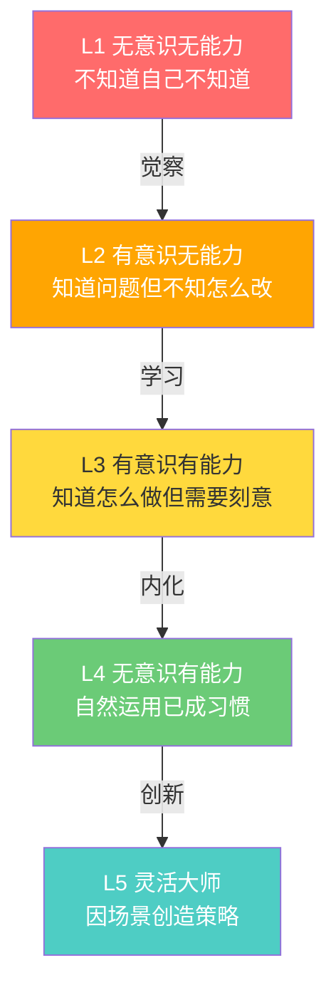
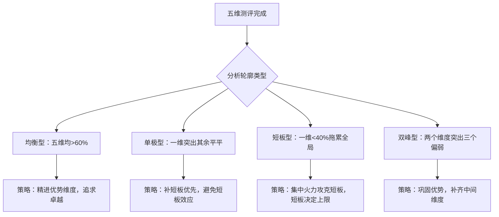
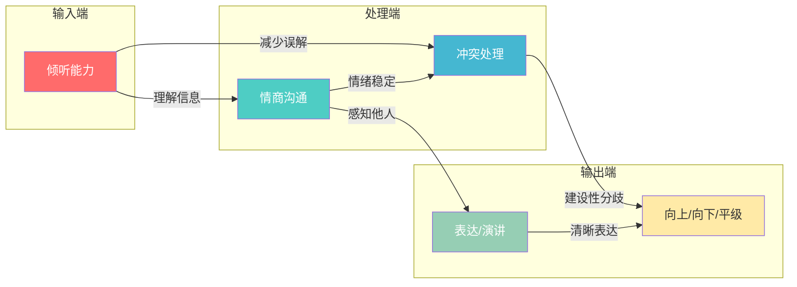
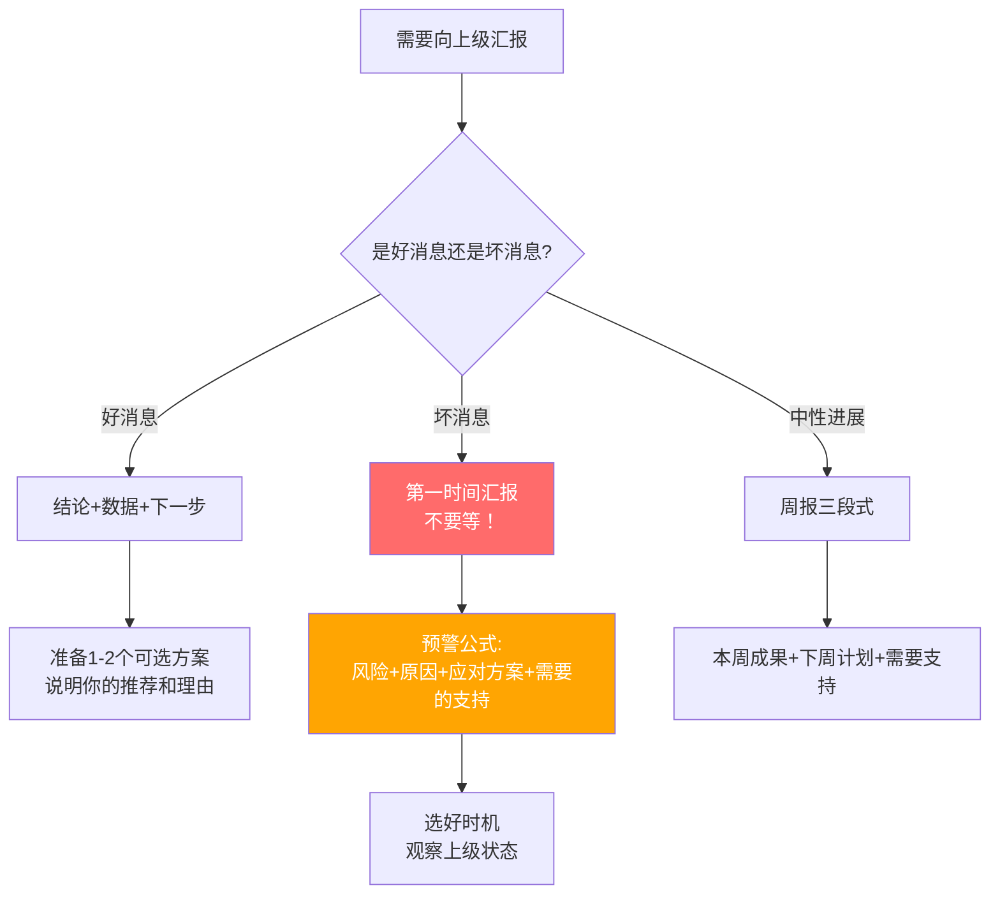
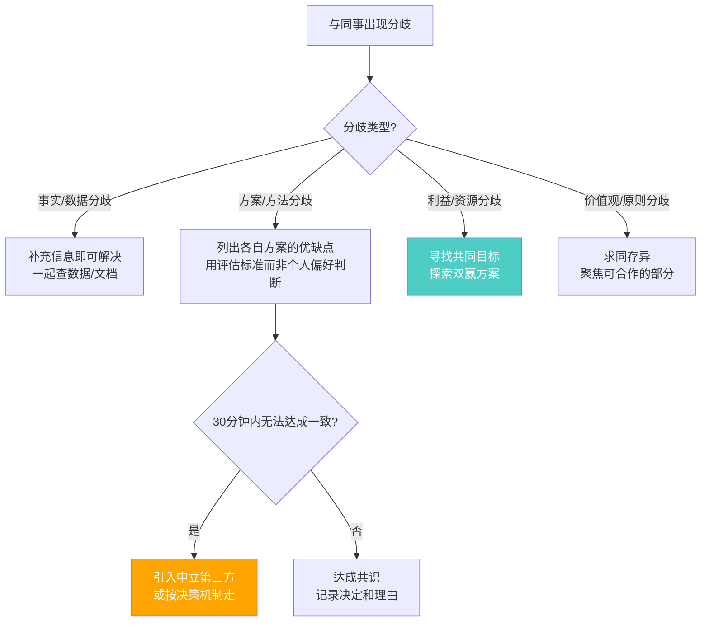
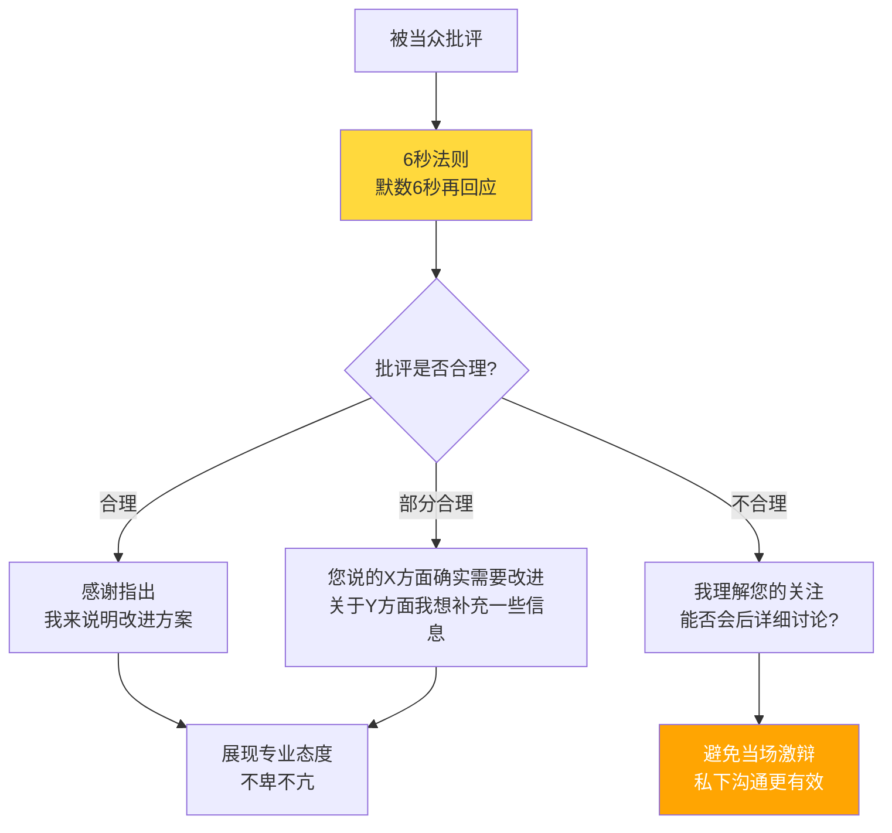

# 附录A：沟通能力自测工具

> 知人者智，自知者明。——《道德经》

沟通能力的提升，第一步不是学习新技巧，而是准确诊断当前水平。没有诊断的训练是盲目的训练——你可能在已经擅长的事情上反复练习，却对真正的短板视而不见。

本附录提供五套专业沟通能力测评问卷，覆盖职场沟通、演讲、倾听、情商沟通和冲突处理五大领域。每套测评都基于权威心理学理论设计，包含行为锚定评分、详细的结果解读和针对性提升指南。完成全部测评后，你将获得一份完整的沟通能力画像，精准定位优势与不足，为后续学习提供明确方向。

### 本附录使用指南

根据你的时间和需求，可以选择不同的使用方式：

| 使用方式 | 适用场景 | 所需时间 | 测评范围 |
|----------|----------|----------|----------|
| 快速诊断 | 时间有限，想先了解大致水平 | 15分钟 | 完成任意1-2套最相关的测评 |
| 专项深测 | 已知某个领域是短板 | 20分钟 | 完成对应领域的测评+提升指南 |
| 全面画像 | 系统了解自身沟通能力 | 60-90分钟 | 完成全部五套测评+综合分析 |
| 深度校准 | 需要最准确的评估结果 | 2-3小时 | 全套测评+360度反馈+行动计划 |

**建议**：即使时间紧张，也至少完成「全面画像」——因为沟通能力的五个维度相互关联，单独测评一个维度可能遗漏关键的因果关系。例如，你以为自己「表达不清」，实际根源可能是「倾听不足」导致对听众需求的理解偏差。

### 快速自测：3分钟定位你的沟通类型

如果你现在只有3分钟，回答以下5个问题，快速定位你的沟通能力倾向：

1. **当同事说完一段话后，你的第一反应通常是？**
   - A. 立即给出建议或解决方案 → 倾听维度可能偏弱（习惯性「解决者模式」，跳过了理解阶段）
   - B. 先确认理解再回应 → 倾听基础不错（已具备复述确认意识）
   - C. 在心里准备自己要说的话 → 倾听维度需要提升（注意力在自己而非对方，是倾听障碍最典型的信号）

2. **在会议中被要求即兴发言时，你会？**
   - A. 脑中一片空白，支支吾吾 → 演讲维度需要重点提升（缺乏快速组织语言的框架，建议学习PREP法则）
   - B. 能说几句但缺乏结构 → 表达清晰度有提升空间（有内容但缺逻辑线，金字塔原理可以立竿见影地改善）
   - C. 能快速组织语言，有条理地表达 → 表达维度较强（已具备结构化表达基础，可进一步提升故事感染力）

3. **当上级批评你的工作时，你通常会？**
   - A. 内心防御，想反驳但忍住 → 情绪管理有提升空间（觉察到了情绪但尚未学会「6秒法则」的暂停技术）
   - B. 感到沮丧，事后反复回想 → 情绪管理需要提升（情绪反刍是焦虑的放大器，建议学习认知重构技术）
   - C. 先听完，理性分析批评是否合理 → 情绪管理较好（已具备情绪觉察和理性分析的双重能力）

4. **与同事出现意见分歧时，你通常会？**
   - A. 坚持自己的立场直到对方让步 → 冲突处理需要提升（竞争型风格，短期可能赢但长期损耗关系）
   - B. 避免冲突，选择妥协或沉默 → 冲突处理需要提升（回避型风格，未表达的需求会以被动攻击或抱怨的形式泄露）
   - C. 先了解对方的立场，再寻找共识 → 冲突处理较好（已具备「立场-利益分离」的意识）

5. **你觉得自己的沟通能力在团队中处于什么水平？**
   - A. 偏弱，经常被误解或忽略 → 建议完成全面画像（可能存在多个维度的短板，全面测评才能找到真正的杠杆点）
   - B. 中等，基本够用但有明显短板 → 建议完成1-2套重点测评（先用快速诊断找到最弱维度，再做完整测评）
   - C. 偏强，但想进一步精进 → 建议做360度反馈校准自评（你的自评可能因达克效应而偏高或偏低，外部反馈能帮你精确定位）

**快速自测评分说明**：选A得1分、选B得2分、选C得3分，总分5-15分。

| 总分区间 | 定位 | 建议的下一步 |
|----------|------|-------------|
| 5-7分 | 沟通能力存在明显短板，多个维度需要系统提升 | 直接进入「全面画像」模式，完成全部五套测评 |
| 8-10分 | 有基础但不够稳定，1-2个维度偏弱 | 先做5分钟快速诊断找到最弱维度，再完成对应测评 |
| 11-13分 | 整体不错，个别维度有提升空间 | 建议做360度反馈校准自评，找出自评与他评的差距 |
| 14-15分 | 沟通基础扎实，进入精进阶段 | 建议关注数字沟通和跨文化沟通等进阶维度 |

> **注意**：以上快速自测仅为粗略定位，不能替代完整测评。它帮你决定从哪套测评开始——但请务必在方便时完成全套测评，以获得准确的沟通能力画像。

***

### 不同使用场景推荐

| 使用场景 | 推荐方式 | 所需时间 |
|----------|----------|----------|
| 时间充裕，想全面了解自己 | 按顺序完成五套完整测评 + 综合分析 | 45-60分钟 |
| 时间有限，想快速定位问题 | 先做「快速诊断」（本章第一节），找到最弱领域后再做完整测评 | 5-10分钟 |
| 已知某个领域薄弱 | 直接跳转到对应测评，重点做该测评 + 提升指南 | 10-15分钟 |
| 想与他人对照验证 | 完成自测后，使用「360度反馈对照」章节 | 自测 + 1天收集反馈 |

---

## 快速诊断：5分钟沟通能力速查

如果你时间紧张，以下速查表可以帮助你在5分钟内快速定位最需要关注的沟通领域。对每个陈述打勾（符合）或不打勾（不符合），统计各区域的勾选数量。

### 职场沟通速查

- [ ] 我的工作汇报通常能在2分钟内说清核心结论
- [ ] 我发送邮件前会检查是否清晰、有条理
- [ ] 向上级提问题时，我通常会同时准备解决方案
- [ ] 我能根据听众背景调整表达方式
- [ ] 我会定期主动向上级汇报进展，而非等到被问起

**勾选 ≤2 个 → 建议做「测评一：职场沟通能力测评」**

### 演讲能力速查

- [ ] 演讲前我会梳理核心观点和逻辑结构
- [ ] 我善于用故事和案例支撑观点
- [ ] 演讲时我能控制语速和节奏
- [ ] 我能与不同位置的听众进行眼神交流
- [ ] 演讲中出现失误时我能迅速调整继续

**勾选 ≤2 个 → 建议做「测评二：演讲能力测评」**

### 倾听能力速查

- [ ] 我能在他人讲话时放下手机、全神贯注
- [ ] 我不会在心里提前准备反驳的话
- [ ] 我会通过复述确认自己的理解是否正确
- [ ] 对方倾诉时我先倾听情感，而非急于给建议
- [ ] 我能感知对方未说出口的需求和担忧

**勾选 ≤2 个 → 建议做「测评三：倾听能力测评」**

### 情商沟通速查

- [ ] 我能准确识别自己当下的情绪状态
- [ ] 沟通中感到愤怒时，我能暂停避免说出后悔的话
- [ ] 我能通过对方的表情和语气判断其真实情绪
- [ ] 我能在不伤害关系的前提下表达不同意见
- [ ] 我能把工作负面情绪与家庭沟通隔离开

**勾选 ≤2 个 → 建议做「测评四：情商沟通测评」**

### 冲突处理速查

- [ ] 我认为冲突处理得当可以带来积极改变
- [ ] 激烈争执中我能控制音量和语气
- [ ] 处理冲突时我使用"我"句式表达感受而非指责
- [ ] 我倾向于寻求双赢方案而非一方妥协
- [ ] 冲突解决后我会主动修复关系

**勾选 ≤2 个 → 建议做「测评五：冲突处理能力测评」**

> **速查结果使用方式**：勾选最少的1-2个领域就是你当前最需要关注的方向。跳转到对应的完整测评，获取详细的诊断和提升指南。

**速查评分标准**：每个领域5道题，勾选1个=1分，满分5分。

| 得分 | 等级 | 解读 |
|------|------|------|
| 0-1分 | 亟需提升 | 该领域是你的明显短板，建议立即进入对应完整测评 |
| 2-3分 | 有基础但有盲区 | 基本能力具备，但存在1-2个关键行为缺失，建议做完整测评定位具体问题 |
| 4-5分 | 基础扎实 | 该领域不是当前优先提升方向，可关注更精细的进阶技巧 |

### 数字沟通场景速查

在远程办公和即时通讯主导的时代，数字沟通能力已成为不可忽视的第五维度。以下速查帮你评估自己的线上沟通水平：

- [ ] 我能在即时通讯（微信/钉钉/Slack）中用简短文字把事情说清楚
- [ ] 我知道什么场景该发消息、什么场景该打电话或开视频会议
- [ ] 我能在异步沟通中清晰交代背景信息，减少来回确认
- [ ] 我能在视频会议中保持专注，善用摄像头和屏幕分享
- [ ] 我能妥善处理文字沟通中的情绪误解（如语气被误读）

**勾选 ≤2 个 → 你可能需要特别关注数字沟通能力的提升**

**评分说明**：5题中勾选0-1个为"数字沟通亟需提升"——你在远程协作中可能频繁遭遇误解和效率损失；勾选2-3个为"有基础但有明显盲区"——建议选择最弱的1-2项重点练习；勾选4-5个为"数字沟通良好"——继续保持，并关注新兴工具和平台的沟通规范变化。

> **重要提示**：数字沟通最大的陷阱是「语气歧义」——同样一句"好的"，面对面说可以配合微笑和点头表示认可，但在文字消息中可能被理解为敷衍或不满。研究表明，文字沟通中语气被误读的概率高达50%。在重要或敏感的沟通中，优先选择语音或视频，避免纯文字带来的信息损失。

---

## 自测的科学基础与正确姿势

### 为什么需要自测

心理学研究表明，人类对自身能力的判断存在系统性偏差。达克效应（Dunning-Kruger Effect）指出：能力较低的人往往高估自己，而能力较强的人反而倾向于低估自己。康奈尔大学的原始研究（Kruger & Dunning, 1999）发现，能力最差的25%人群对自己能力的估计高出实际约50个百分点。

这意味着"我觉得自己沟通还行"这个判断，很可能是不准确的。

自测工具的价值在于：

- **结构化反思**：将模糊的"我觉得还行"转化为可量化的维度得分，逼迫你逐项审视自己的行为习惯。心理学家加里·克莱因（Gary Klein）的研究表明，结构化反思的效果是非结构化反思的3倍
- **盲点暴露**：你可能从未注意到自己在"倾听时会提前准备反驳"，直到问卷把这个行为显式描述出来。约哈里窗户（Johari Window）理论将这类区域称为"盲区"——别人看得到、你自己看不到的行为模式
- **基准线建立**：没有起点数据，就无法衡量进步。三个月后重测时，分数变化是最有力的反馈。行为科学中的"测量效应"表明：仅仅被测量的行为就会改善（霍桑效应的变体）
- **优先级排序**：五个维度中哪个最弱？集中火力攻克短板，比泛泛地"提升沟通"高效十倍。帕累托原则在此适用——20%的薄弱环节导致了80%的沟通问题


### 自测偏差与校准方法

自测问卷依赖自我报告，不可避免地存在以下偏差。了解这些偏差，才能更准确地解读结果：

| 偏差类型 | 表现 | 心理机制 | 校准方法 |
|----------|------|----------|----------|
| 社会赞许偏差 | 倾向于选择"看起来更好"的答案 | 人类有维护积极自我形象的本能 | 做题时回忆具体场景，而非理想状态 |
| 近因偏差 | 被最近一两次经历主导判断 | 大脑对近期事件的记忆权重更高 | 综合过去3-6个月的典型表现 |
| 聚光灯效应 | 高估他人对自己沟通表现的关注 | 人们倾向于认为别人像自己一样关注自己 | 关注行为本身，而非想象中的评价 |
| 自我服务偏差 | 成功归因于自己，失败归因于外部 | 这是一种保护自尊的心理机制 | 刻意回忆失败案例，平衡评估 |
| 习惯化盲区 | 对自身长期存在的问题视若无睹 | 大脑会过滤掉重复出现的刺激 | 请信任的同事/朋友做一次盲测对照 |
| 峰终定律 | 被最好或最差的一次经历主导整体评价 | 人对体验的记忆取决于峰值和结尾 | 回忆3-5个典型场景取平均感受 |

**校准操作建议**：做题前，先花5分钟回忆过去一个月中3个具体的沟通场景（一次顺利的、一次不顺利的、一次普通的）。用这些真实场景作为评分锚点，而非用"我一般应该能做到"来评分。

### 沟通能力成熟度模型

在开始正式测评之前，了解沟通能力的成长阶梯有助于你准确定位自己所处的阶段。以下五级成熟度模型参照了德雷福斯技能获取模型（Dreyfus Model of Skill Acquisition），将沟通能力的成长分为五个阶段：

| 阶段 | 名称 | 典型特征 | 核心挑战 | 成长标志 |
|------|------|----------|----------|----------|
| L1 | 无意识无能力 | 不知道自己不知道——沟通问题频发但归因于外部（"他们不理解我"） | 缺乏自我觉察，无法识别沟通问题 | 开始意识到"可能是我的沟通方式有问题" |
| L2 | 有意识无能力 | 知道自己做得不好但不知道怎么改——看到了问题但找不到方法 | 知识缺口大，缺乏系统框架 | 开始学习沟通理论和方法，知道"原来要这样做" |
| L3 | 有意识有能力 | 知道该怎么做且能做到，但需要刻意投入注意力——像新手司机一样需要全神贯注 | 注意力资源有限，高压下容易退回到旧模式 | 在正常场景下能稳定运用新技巧，偶尔在高压下"打回原形" |
| L4 | 无意识有能力 | 技巧已内化为习惯——像老司机一样自然驾驶，不需要刻意思考 | 可能陷入舒适区，停止精进 | 他人开始向你请教沟通技巧，你成为团队的沟通标杆 |
| L5 | 灵活大师 | 能根据不同场景灵活切换策略，甚至创造出独特的沟通风格——从"按规则做"到"创造规则" | 需要持续反思和创新 | 能够教别人沟通，能够在全新场景中快速适应 |



**如何判断自己处于哪个阶段**：大部分人在不同沟通维度上处于不同阶段。例如，你可能在"表达"上处于L3（有意识有能力，需要刻意组织语言），但在"倾听"上还处于L1（无意识无能力，不知道自己听得不好）。这完全正常——这也是为什么本附录设计了五套独立测评，而非一个笼统的"沟通能力"分数。测评结果可以帮助你精确定位每个维度当前所处的阶段，从而制定针对性的提升策略。

**各阶段的提升策略差异**：

| 当前阶段 | 最有效的学习方式 | 最低效的学习方式 | 典型时间投入 |
|----------|----------------|-----------------|-------------|
| L1→L2 | 接触真实反馈（360度反馈、录像回看） | 纯理论学习（读10本书不如看1次自己的录像） | 1-2周觉察期 |
| L2→L3 | 结构化学习+刻意练习（理论+每天1次实操） | 只学不练（知道方法但不用等于不知道） | 2-3个月系统训练 |
| L3→L4 | 高频重复+场景多样化（同一技巧在不同场景中反复使用） | 只在舒适区练习（只在熟悉的场景中用） | 3-6个月持续练习 |
| L4→L5 | 教授他人+跨界学习（教是最好的学） | 重复已会的（停留在舒适区） | 6-12个月精进 |

### 沟通风格与性格类型适配

不同性格类型的人在沟通中面临截然不同的挑战。了解自己的性格倾向，能帮你更准确地解读测评结果，避免"用错了药"。以下基于DISC行为风格模型和MBTI的认知功能理论，将常见性格类型分为四大沟通风格，并给出针对性的诊断和提升建议。

#### 四大沟通风格速查

| 风格 | 核心特征 | 沟通优势 | 沟通盲区 | 常见误区 | 测评中容易高估的维度 | 测评中容易低估的维度 |
|------|----------|----------|----------|----------|---------------------|---------------------|
| D型（支配型） | 直接、果断、目标导向、喜欢掌控 | 表达清晰度高、决策速度快、敢于面对冲突 | 倾听耐心不足、容易忽视他人感受、可能显得咄咄逼人 | 认为"快就是好"，忽略了关系维护需要时间 | 表达清晰度（自己觉得清楚，别人觉得强势） | 倾听理解力、情商沟通 |
| I型（影响型） | 热情、外向、善于社交、喜欢表达 | 社交技巧强、演讲有感染力、善于激励他人 | 倾听深度不够、容易跑题、细节把控弱 | 说得多听得少，误将"聊得开心"等同于"沟通有效" | 社交技巧、演讲能力 | 倾听理解力（尤其是理解力中的"事实-观点分离"） |
| S型（稳健型） | 温和、耐心、善于倾听、避免冲突 | 倾听共情力强、关系维护好、团队协作佳 | 冲突回避、不敢表达不同意见、向上沟通被动 | 认为"不吵架就是好沟通"，回避必要的建设性冲突 | 倾听能力、关系维护 | 冲突处理、向上沟通、表达清晰度 |
| C型（谨慎型） | 严谨、逻辑强、注重细节、追求完美 | 表达逻辑性强、数据支撑充分、分析深入 | 表达过于冗长、共情力不足、社交场合不自在 | 以为"逻辑正确就够了"，忽视了情感维度 | 表达清晰度（逻辑层面） | 情商沟通、演讲能力中的互动控场、社交技巧 |

#### 如何判断自己的风格

以下快速判断法不需要做完整的DISC测评，5个场景即可定位：

1. **开会时你最自然的状态是？**
   - A. 主导讨论，推动结论 → D型
   - B. 活跃气氛，分享想法 → I型
   - C. 认真倾听，支持他人 → S型
   - D. 记录要点，分析数据 → C型

2. **面对deadline压力时，你的第一反应是？**
   - A. 立刻行动，边做边调整 → D型
   - B. 找人商量，寻求支持 → I型
   - C. 按部就班，稳扎稳打 → S型
   - D. 先列计划，确保万无一失 → C型

3. **与陌生人初次见面时，你通常？**
   - A. 直奔主题，快速了解对方价值 → D型
   - B. 主动搭话，寻找共同话题 → I型
   - C. 等对方先开口，温和回应 → S型
   - D. 观察对方，选择性参与 → C型

4. **别人用一个词形容你的沟通风格，最可能是？**
   - A. "直接" → D型
   - B. "热情" → I型
   - C. "温和" → S型
   - D. "严谨" → C型

5. **你最讨厌的沟通方式是？**
   - A. 啰嗦、绕弯子 → D型（你希望别人也像你一样直接）
   - B. 冷漠、不回应 → I型（你需要互动和反馈）
   - C. 强势、不顾他人感受 → S型（你重视和谐）
   - D. 不讲逻辑、凭感觉说话 → C型（你重视证据）

#### 各风格的测评校准建议

| 风格 | 做测评时的特别提醒 | 最容易出现的自评偏差 | 校准方法 |
|------|-------------------|---------------------|----------|
| D型 | 特别注意倾听和共情维度的题目——你可能觉得自己"听完了"，但对方觉得你"只是等着我说完好反驳" | 倾听和情商维度偏高 | 请一位S型同事做360度反馈，他们的观察最敏锐 |
| I型 | 特别注意"深度倾听"和"结构化表达"的题目——你可能社交活跃但信息传递效率不高 | 演讲和社交维度偏高 | 回顾最近3次工作汇报，检查是否有"说了10分钟但结论不清楚"的情况 |
| S型 | 特别注意冲突处理和向上沟通的题目——你可能将"回避冲突"误认为"处理得好" | 冲突处理和倾听维度偏高 | 回忆最近一次意见分歧：你是"解决了"还是"算了"？ |
| C型 | 特别注意情商沟通和演讲互动的题目——你可能逻辑完美但忽视了情感连接 | 表达清晰度（逻辑层面）偏高 | 请同事评价你的邮件/汇报是否"读起来舒服"，而非只问"逻辑是否清楚" |


### 行为锚定评分法

为提高自测准确性，以下为每个分数等级提供行为锚定参考：

| 分数 | 行为锚定 | 判断标准 |
|------|----------|----------|
| 1分 | 我从未这样做过，或者完全不具备这个习惯 | 过去3个月内没有一次做到的记录 |
| 2分 | 偶尔这样做，但不是常规行为，需要刻意提醒 | 过去3个月内做到了1-3次 |
| 3分 | 有时会这样做，大约一半的情况能做到 | 过去3个月内做到了约50%的机会 |
| 4分 | 大多数时候能做到，已形成习惯，偶尔例外 | 过去3个月内80%以上的机会都做到了 |
| 5分 | 几乎每次都这样做，已经成为自然而然的行为模式 | 想不起来有例外的情况 |

**关键原则**：如果你在两个分数之间犹豫，选择较低的那个。犹豫本身就说明这个行为还没有成为稳定习惯。

### 真实场景对照法

在评分之前，先花3分钟回忆以下三个真实场景，作为评分锚点：

1. **最近一次工作汇报或会议发言**：你说了什么？对方的反应如何？你的准备过程是怎样的？
2. **最近一次与同事或上级的意见分歧**：你是如何处理的？结果如何？事后你是否反思过可以做得更好？
3. **最近一次需要认真倾听的场景**：你是否走神？你是否打断了对方？你是否真正理解了对方的意思？

用这三个场景作为"证据"来校准你的评分，而不是用"我觉得我应该能做到"来打分。

---

## 测评一：职场沟通能力测评

### 测评说明

本测评覆盖职场沟通的六大核心维度：表达清晰度、倾听理解力、向上沟通、平级协作、向下管理和跨部门协调。共25题，用时约10分钟。

**测评理论基础**：本测评的设计参考了哈佛商学院的"领导力沟通模型"和CCL（创新领导力中心）的"360度沟通效能评估"框架，将职场沟通能力分解为可观察、可训练的行为指标。每个维度的题目都经过行为锚定，确保评分的可比性和准确性。

### 问卷题目

#### 一、表达清晰度（5题）

**1. 在工作汇报中，我能够用简洁的语言概括复杂的问题。**

□ 1分 — 完全不符合
□ 2分 — 比较不符合
□ 3分 — 一般
□ 4分 — 比较符合
□ 5分 — 完全符合

**2. 我在发送工作邮件前，会检查内容是否清晰、有条理。**

□ 1分 — 完全不符合
□ 2分 — 比较不符合
□ 3分 — 一般
□ 4分 — 比较符合
□ 5分 — 完全符合

**3. 在会议发言时，我会先说出结论，再补充论据。**

□ 1分 — 完全不符合
□ 2分 — 比较不符合
□ 3分 — 一般
□ 4分 — 比较符合
□ 5分 — 完全符合

**4. 我能够根据听众的专业背景调整自己的表达方式。**

□ 1分 — 完全不符合
□ 2分 — 比较不符合
□ 3分 — 一般
□ 4分 — 比较符合
□ 5分 — 完全符合

**5. 当别人不理解我的意思时，我会换一种方式重新表达。**

□ 1分 — 完全不符合
□ 2分 — 比较不符合
□ 3分 — 一般
□ 4分 — 比较符合
□ 5分 — 完全符合

#### 二、倾听理解力（5题）

**6. 在同事讲话时，我能够耐心听完，不急于打断。**

□ 1分 — 完全不符合
□ 2分 — 比较不符合
□ 3分 — 一般
□ 4分 — 比较符合
□ 5分 — 完全符合

**7. 我会通过复述对方的观点来确认自己的理解是否正确。**

□ 1分 — 完全不符合
□ 2分 — 比较不符合
□ 3分 — 一般
□ 4分 — 比较符合
□ 5分 — 完全符合

**8. 在倾听时，我不仅关注言语内容，还会注意对方的情绪和肢体语言。**

□ 1分 — 完全不符合
□ 2分 — 比较不符合
□ 3分 — 一般
□ 4分 — 比较符合
□ 5分 — 完全符合

**9. 当我不同意对方观点时，我会先理解对方的立场再提出异议。**

□ 1分 — 完全不符合
□ 2分 — 比较不符合
□ 3分 — 一般
□ 4分 — 比较符合
□ 5分 — 完全符合

**10. 我能够在倾听过程中提出有针对性的问题，帮助深入理解。**

□ 1分 — 完全不符合
□ 2分 — 比较不符合
□ 3分 — 一般
□ 4分 — 比较符合
□ 5分 — 完全符合

#### 三、向上沟通（5题）

**11. 我能够定期主动向上级汇报工作进展，而不是等到被问起。**

□ 1分 — 完全不符合
□ 2分 — 比较不符合
□ 3分 — 一般
□ 4分 — 比较符合
□ 5分 — 完全符合

**12. 向上级提出问题时，我会同时准备至少两个解决方案。**

□ 1分 — 完全不符合
□ 2分 — 比较不符合
□ 3分 — 一般
□ 4分 — 比较符合
□ 5分 — 完全符合

**13. 我能够在合适的时机向上级提出不同意见，而不会显得冒犯。**

□ 1分 — 完全不符合
□ 2分 — 比较不符合
□ 3分 — 一般
□ 4分 — 比较符合
□ 5分 — 完全符合

**14. 当工作出现失误时，我会第一时间向上级如实报告，并提出补救措施。**

□ 1分 — 完全不符合
□ 2分 — 比较不符合
□ 3分 — 一般
□ 4分 — 比较符合
□ 5分 — 完全符合

**15. 我能准确理解上级的工作意图和期望，减少返工。**

□ 1分 — 完全不符合
□ 2分 — 比较不符合
□ 3分 — 一般
□ 4分 — 比较符合
□ 5分 — 完全符合

#### 四、平级协作（5题）

**16. 在跨部门协作中，我能够清晰界定各方的职责和期望。**

□ 1分 — 完全不符合
□ 2分 — 比较不符合
□ 3分 — 一般
□ 4分 — 比较符合
□ 5分 — 完全符合

**17. 当同事之间出现分歧时，我能够帮助找到双方都能接受的方案。**

□ 1分 — 完全不符合
□ 2分 — 比较不符合
□ 3分 — 一般
□ 4分 — 比较符合
□ 5分 — 完全符合

**18. 我善于在团队中分享信息和资源，而不是囤积信息。**

□ 1分 — 完全不符合
□ 2分 — 比较不符合
□ 3分 — 一般
□ 4分 — 比较符合
□ 5分 — 完全符合

**19. 在合作项目中，我能够平衡各方利益，推动共识达成。**

□ 1分 — 完全不符合
□ 2分 — 比较不符合
□ 3分 — 一般
□ 4分 — 比较符合
□ 5分 — 完全符合

**20. 我会主动认可和感谢同事的贡献与帮助。**

□ 1分 — 完全不符合
□ 2分 — 比较不符合
□ 3分 — 一般
□ 4分 — 比较符合
□ 5分 — 完全符合

#### 五、向下管理（5题）

**21. 布置任务时，我会明确说明目标、标准、截止时间和可用资源。**

□ 1分 — 完全不符合
□ 2分 — 比较不符合
□ 3分 — 一般
□ 4分 — 比较符合
□ 5分 — 完全符合

**22. 我能够给予下属建设性的反馈，既指出问题也肯定进步。**

□ 1分 — 完全不符合
□ 2分 — 比较不符合
□ 3分 — 一般
□ 4分 — 比较符合
□ 5分 — 完全符合

**23. 当下属犯错时，我倾向于先了解原因，而不是直接批评。**

□ 1分 — 完全不符合
□ 2分 — 比较不符合
□ 3分 — 一般
□ 4分 — 比较符合
□ 5分 — 完全符合

**24. 我会根据下属的不同特点采用不同的沟通方式。**

□ 1分 — 完全不符合
□ 2分 — 比较不符合
□ 3分 — 一般
□ 4分 — 比较符合
□ 5分 — 完全符合

**25. 我定期与下属进行一对一沟通，了解他们的想法和需求。**

□ 1分 — 完全不符合
□ 2分 — 比较不符合
□ 3分 — 一般
□ 4分 — 比较符合
□ 5分 — 完全符合

### 评分标准

| 维度 | 题号 | 满分 |
|------|------|------|
| 表达清晰度 | 1-5 | 25分 |
| 倾听理解力 | 6-10 | 25分 |
| 向上沟通 | 11-15 | 25分 |
| 平级协作 | 16-20 | 25分 |
| 向下管理 | 21-25 | 25分 |
| **总分** | **1-25** | **125分** |

**你的得分记录**：

| 维度 | 第1题 | 第2题 | 第3题 | 第4题 | 第5题 | 维度总分 | 百分比 |
|------|-------|-------|-------|-------|-------|----------|--------|
| 表达清晰度 | | | | | | /25 | % |
| 倾听理解力 | | | | | | /25 | % |
| 向上沟通 | | | | | | /25 | % |
| 平级协作 | | | | | | /25 | % |
| 向下管理 | | | | | | /25 | % |
| **总分** | | | | | | **/125** | **%** |

### 结果解读

| 分数区间 | 等级 | 解读 | 行为特征 |
|----------|------|------|----------|
| 100-125分 | 卓越 | 你的职场沟通能力非常出色，能够在各种场景中有效沟通。 | 同事主动寻求你的沟通建议，你的邮件/汇报常被当作范例，上级信任你的对外沟通能力 |
| 75-99分 | 良好 | 你具备扎实的沟通基础，大多数场景处理得当。 | 日常沟通顺畅，偶尔在高压或复杂场景下感到吃力，某些维度明显强于其他维度 |
| 50-74分 | 中等 | 你的沟通能力有一定基础，但存在明显短板。 | 经常需要反复沟通才能达成共识，偶尔因表达不清导致返工，某些场景会回避沟通 |
| 25-49分 | 待提升 | 你的职场沟通存在较多问题，可能已影响工作效率和职业发展。 | 沟通常常产生误解，不愿主动汇报或发言，跨部门协作是痛点，沟通是职业发展的瓶颈 |

### 典型场景对照

**场景一：项目延期汇报**

> 项目延期了3天，你需要向经理汇报。

- **卓越表现**：主动汇报，说明延期原因（技术难点+第三方依赖）、已采取的措施、新的交付时间线、对下游的影响评估
- **良好表现**：主动汇报，说明原因和新时间线
- **中等表现**：等到经理问起才汇报，只说"快好了"
- **待提升表现**：隐瞒延期，希望能在最终截止前赶回来

**场景二：跨部门资源争夺**

> 你和另一个团队都需要设计师的支持，但设计师同一时间只能服务一个团队。

- **卓越表现**：主动找到对方团队负责人，了解需求优先级和时间窗口，提出分时段共享方案，一起找上级确认优先级
- **良好表现**：与对方协商，找到折中方案
- **中等表现**：各自找上级告状，让上级裁决
- **待提升表现**：直接抢占设计师时间，不与对方沟通

### 各维度详细提升指南

#### 表达清晰度不足（该维度得分低于15分）

**核心问题**：你的想法可能很好，但听众接收不到。表达不清晰的代价是反复沟通、误解返工、决策效率低下。根据斯坦福大学的研究，信息在传递过程中平均衰减40%——你说了100%，对方只接收了60%。

**具体提升路径**：

1. **学习金字塔原理**：任何沟通都遵循"结论先行，以上统下，归类分组，逻辑递进"的结构。练习方法：每天用金字塔结构写一段200字的工作摘要，坚持21天。具体格式：第一句写结论（"本周完成了X，Y延期了"），然后用2-3个要点支撑，每个要点用一句话解释
2. **电梯演讲训练**：假设你只有30秒向CEO汇报，你会怎么说？每天选一个工作话题，用30秒-1分钟讲清楚核心信息。录音回听，检查是否有废话、是否有逻辑跳跃
3. **邮件三段式**：正文第一段写结论/请求（"请求批准XX方案"），第二段写背景/原因（"原因是……"），第三段写下一步行动（"需要你在本周五前确认"）。发邮件前用这个结构自检
4. **类比能力训练**：每周练习用一个类比解释一个专业概念（如"API就像餐厅的服务员——你不用进厨房，告诉服务员你要什么就行"）。好的类比能将理解速度提升3-5倍
5. **PREP框架**：Point（观点）→ Reason（理由）→ Example（案例）→ Point（重申观点）。适用于临时被问到观点的场景

**推荐阅读**：《金字塔原理》（芭芭拉·明托）——结构化表达的圣经，教你如何将复杂信息组织成清晰的逻辑层次；《简洁的力量》（约瑟夫·麦科马克）——专注于"少即是多"的表达哲学，适合经常需要做汇报和邮件沟通的职场人；《结构化思维》（李忠秋）——中国本土的结构化思考训练，案例更贴近国内职场场景；《学会提问》（尼尔·布朗）——批判性思维经典，帮助你从"说什么"进化到"怎么说更有说服力"；《用数据讲故事》（科尔·努斯鲍默·纳福利克）——用数据支撑表达的实操指南，特别适合需要做数据汇报的职场人

#### 倾听理解力不足（该维度得分低于15分）

**核心问题**：你可能听到了对方说的话，但没有真正理解对方的意思。这会导致答非所问、遗漏关键信息、对方感到不被尊重。哈佛大学的研究发现，管理者平均花60%的工作时间在倾听上，但听完后只能记住25%-50%的内容。

**具体提升路径**：

1. **3-2-1倾听法**：每次重要对话后，写下3个对方表达的关键信息、2个对方可能未明说的隐含信息、1个你接下来要确认的问题。这个方法能训练你"深度倾听"的习惯
2. **复述确认习惯**：在对方说完一段重要信息后，用"你的意思是……对吗？"来确认。这个动作本身就能避免80%的理解偏差。复述时注意使用对方的关键词，而非替换成你自己的术语
3. **延迟回应训练**：对方说完后，在心里默数3秒再回应。这3秒用来消化信息，而不是准备反驳。研究表明，这3秒的延迟会让对方感觉"你真的在认真思考我说的话"
4. **笔记习惯**：重要会议和一对一沟通时做笔记，不仅记录内容，还记录对方的情绪变化和强调的关键词。笔记的物理动作本身就能提升注意力30%

**推荐阅读**：《倾听的力量》（伯纳德·费拉里斯）——系统讲解倾听的科学和艺术，从神经科学角度解释为什么"听"比"说"更难；《非暴力沟通》（马歇尔·卢森堡）——沟通领域的经典之作，"观察-感受-需要-请求"四步法适用于几乎所有沟通场景；《你就是孩子最好的玩具》（金伯利·布雷恩）——虽然标题像育儿书，但其中关于"情感引导"的倾听方法论适用于所有关系；《高难度对话》（道格拉斯·斯通等）——哈佛谈判项目出品，专门解决"明知道该好好听但就是做不到"的场景

#### 向上沟通不足（该维度得分低于15分）

**核心问题**：你和上级之间存在信息不对称。上级不知道你在做什么、做得怎么样，你也可能不理解上级的真正期望。这会导致信任缺失和资源浪费。根据盖洛普的调查，只有50%的员工表示自己清楚知道上级对自己的期望。

**具体提升路径**：

1. **周报升级**：将流水账式周报改为"本周成果+下周计划+需要支持"三段式。控制在5分钟内能读完。成果部分用数据说话（"完成了X，提升了Y%"），避免模糊描述（"做了很多工作"）
2. **问题+方案模式**：永远不要只带问题去找上级。至少准备2个方案，说明每个方案的优缺点和你的推荐。格式："目前遇到X问题，方案A是……优缺点是……方案B是……优缺点是……我建议选A，因为……"
3. **向上对齐**：接到任务后，用自己的话复述一遍目标和标准，确认理解一致。"我想确认一下，您的期望是……对吗？"这一步看似简单，但能避免50%以上的返工
4. **选择合适的时机**：观察上级的工作节奏和情绪状态，在合适的时机沟通重要事项。避免在上级焦头烂额时提新问题。可以先问："您现在方便聊一个X方面的问题吗？"
5. **主动预警**：项目出现风险时第一时间告知，而不是等到无法挽回时才报告。上级最怕的是"惊喜"——突然冒出一个无法挽回的问题。预警公式："目前X方面有风险，原因是……我计划用Y方案应对，但需要你支持Z"

**推荐阅读**：《向上管理》（罗塞娜·博得斯基）——前通用电气CEO杰克·韦尔奇助理的一手经验，教你如何与上级建立高效的工作关系；《硬球》（克里斯·马修斯）——政治博弈的经典之作，帮助你理解权力动态和影响力策略；《别让猴子跳回背上》（威廉·安肯三世）——管理者必读，教你如何管理"猴子"（责任归属），避免替下属背锅；《横向领导力》（罗杰·费希尔）——不需要职权也能影响他人的实操方法，特别适合需要"向上影响"的场景

#### 平级协作不足（该维度得分低于15分）

**核心问题**：跨部门或跨团队协作时频繁出现扯皮、推诿、信息不对称，项目推进缓慢。麦肯锡的研究表明，跨部门协作问题导致大型企业平均浪费20%的工作时间。

**具体提升路径**：

1. **RACI矩阵**：协作开始前明确每个事项的R（Responsible，负责执行）、A（Accountable，最终决策）、C（Consulted，需咨询）、I（Informed，需通知）角色，避免职责模糊。每个事项只能有一个A，多个R
2. **利益相关者分析**：列出所有相关方，分析每个人的诉求、顾虑和影响力，针对性地沟通。制作一个简单的表格：姓名 | 角色 | 核心诉求 | 可能的阻力 | 沟通策略
3. **定期同步机制**：建立固定的同步节奏（如每周站会），减少临时打断和信息碎片化。站会遵循三个问题："上周完成了什么？""这周计划做什么？""有什么阻碍？"
4. **认可文化**：在公开场合认可协作伙伴的贡献，发送感谢邮件抄送对方上级。小投入大回报。具体做法：在团队群里@对方感谢、在周报中提及对方的贡献、在会议上公开致谢
5. **冲突预防**：在项目启动时就约定决策机制和争议升级路径，而不是等到冲突发生才临时应对。在启动会上明确："如果我们在X问题上无法达成一致，由谁来做最终决策？"

**推荐阅读**：《关键对话》（科里·帕特森等）——当利益攸关、意见不一时如何有效对话，提供了一套完整的对话框架；《高效能人士的七个习惯》（史蒂芬·柯维）——"双赢思维""知彼解己"等原则是平级协作的底层逻辑；《联盟》（里德·霍夫曼）——LinkedIn创始人提出的新型职场关系模型，帮助你与同事建立互惠互利的长期合作关系；《协作的力量》（莫滕·汉森）——基于1200个团队的实证研究，揭示高效协作的核心要素

#### 向下管理不足（该维度得分低于15分）

**核心问题**：你的团队可能不知道你的真实期望，或者不敢向你反馈真实情况。团队执行力和士气可能因此受损。盖洛普的研究表明，70%的员工敬业度差异取决于直接上级的管理方式。

**具体提升路径**：

1. **SMART任务布置**：每个任务都包含具体目标（Specific）、衡量标准（Measurable）、可行性（Achievable）、相关性（Relevant）和截止时间（Time-bound）。反面案例："你把这个报告弄一下"——什么叫"弄一下"？什么时候交？什么标准算完成？正面案例："请在周五下班前完成Q3销售数据分析报告，包含各产品线的同比增速、客户流失率和区域对比三个维度，PPT格式，不超过15页。需要数据支持可以找财务部小李"
2. **SBI反馈模型**：反馈时按"情境（Situation）-行为（Behavior）-影响（Impact）"结构组织。负面反馈例："昨天客户会上（S），你直接否定了对方的方案（B），这让客户显得很尴尬，影响了合作关系（I）。下次可以先肯定对方方案中的亮点，再提出不同视角"。正面反馈同样适用："周三的代码评审中（S），你主动指出了3个安全隐患（B），帮团队避免了可能的线上事故（I），这种安全意识非常值得推广"
3. **教练式提问**：下属遇到问题时，先问"你觉得可以怎么解决？"而不是直接给答案。培养独立思考能力。如果对方确实没有思路，可以给3个选项让他选择，而非直接指定答案
4. **一对一制度**：每周或每两周与每位直接下属进行15-30分钟的一对一沟通，话题不限于工作进度，也包括职业发展、困惑和建议。一对一的议程应该由下属主导，而非上级主导
5. **安全感建设**：主动分享自己的失误和教训，鼓励团队成员报告坏消息。"第一时间告诉我坏消息的人，不会被追究"。当团队成员真的报告坏消息时，一定要做到言行一致——否则信任会彻底崩塌

**推荐阅读**：《赋能》（斯坦利·麦克里斯特尔）——前美国特种作战司令部指挥官的管理革命，教你如何从"命令与控制"转向"赋能与协同"；《团队协作的五大障碍》（帕特里克·兰西奥尼）——用一个商业故事揭示团队协作的五个致命障碍及破解方法；《一分钟经理人》（肯·布兰佳）——极简但高效的管理三板斧：一分钟目标、一分钟赞美、一分钟更正；《教练型管理者》（约翰·惠特默）——GROW教练模型的发源之作，教你如何通过提问而非指令来激发下属潜能

---

## 测评二：演讲能力测评

### 测评说明

本测评覆盖演讲能力的五大维度：内容组织、语言表达、肢体语言、互动控场和心理素质。共20题，用时约8分钟。

**测评理论基础**：本测评参考了TED演讲教练克里斯·安德森的"演讲能力模型"和戴尔·卡耐基的演讲训练体系，将演讲能力分解为可独立训练的子技能。TED官方分析了500场最受欢迎的演讲后发现，优秀的演讲不取决于天赋，而取决于结构化的内容准备和刻意练习。

### 问卷题目

#### 一、内容组织（4题）

**1. 演讲前我会花大量时间梳理核心观点和逻辑结构。**

□ 1分 — 完全不符合
□ 2分 — 比较不符合
□ 3分 — 一般
□ 4分 — 比较符合
□ 5分 — 完全符合

**2. 我的演讲通常有清晰的开头（吸引注意）、主体（展开论述）和结尾（总结呼吁）。**

□ 1分 — 完全不符合
□ 2分 — 比较不符合
□ 3分 — 一般
□ 4分 — 比较符合
□ 5分 — 完全符合

**3. 我善于用故事、案例和数据来支撑观点，使内容更有说服力。**

□ 1分 — 完全不符合
□ 2分 — 比较不符合
□ 3分 — 一般
□ 4分 — 比较符合
□ 5分 — 完全符合

**4. 我能根据不同的听众和场合调整演讲内容的深度和风格。**

□ 1分 — 完全不符合
□ 2分 — 比较不符合
□ 3分 — 一般
□ 4分 — 比较符合
□ 5分 — 完全符合

#### 二、语言表达（4题）

**5. 演讲时我的语速适中，能够根据内容重要性调整节奏。**

□ 1分 — 完全不符合
□ 2分 — 比较不符合
□ 3分 — 一般
□ 4分 — 比较符合
□ 5分 — 完全符合

**6. 我善于使用停顿来强调重点，给听众思考的时间。**

□ 1分 — 完全不符合
□ 2分 — 比较不符合
□ 3分 — 一般
□ 4分 — 比较符合
□ 5分 — 完全符合

**7. 我的用词精准生动，能够用通俗的语言解释复杂概念。**

□ 1分 — 完全不符合
□ 2分 — 比较不符合
□ 3分 — 一般
□ 4分 — 比较符合
□ 5分 — 完全符合

**8. 我的音量、音调和音色变化丰富，不会让人觉得单调。**

□ 1分 — 完全不符合
□ 2分 — 比较不符合
□ 3分 — 一般
□ 4分 — 比较符合
□ 5分 — 完全符合

#### 三、肢体语言（4题）

**9. 演讲时我能够保持良好的站姿，显得自信从容。**

□ 1分 — 完全不符合
□ 2分 — 比较不符合
□ 3分 — 一般
□ 4分 — 比较符合
□ 5分 — 完全符合

**10. 我会运用手势来辅助表达，增强演讲的感染力。**

□ 1分 — 完全不符合
□ 2分 — 比较不符合
□ 3分 — 一般
□ 4分 — 比较符合
□ 5分 — 完全符合

**11. 我能够与不同位置的听众进行眼神交流，而不是只看一处。**

□ 1分 — 完全不符合
□ 2分 — 比较不符合
□ 3分 — 一般
□ 4分 — 比较符合
□ 5分 — 完全符合

**12. 我会根据内容的情感基调调整面部表情。**

□ 1分 — 完全不符合
□ 2分 — 比较不符合
□ 3分 — 一般
□ 4分 — 比较符合
□ 5分 — 完全符合

#### 四、互动控场（4题）

**13. 我能够在演讲中设计提问、投票等互动环节。**

□ 1分 — 完全不符合
□ 2分 — 比较不符合
□ 3分 — 一般
□ 4分 — 比较符合
□ 5分 — 完全符合

**14. 当听众走神时，我能够及时调整策略重新吸引注意力。**

□ 1分 — 完全不符合
□ 2分 — 比较不符合
□ 3分 — 一般
□ 4分 — 比较符合
□ 5分 — 完全符合

**15. 面对听众的提问，我能够冷静、清晰地回答。**

□ 1分 — 完全不符合
□ 2分 — 比较不符合
□ 3分 — 一般
□ 4分 — 比较符合
□ 5分 — 完全符合

**16. 我能够灵活应对演讲中的突发状况（设备故障、时间调整等）。**

□ 1分 — 完全不符合
□ 2分 — 比较不符合
□ 3分 — 一般
□ 4分 — 比较符合
□ 5分 — 完全符合

#### 五、心理素质（4题）

**17. 演讲前我虽然紧张，但能够通过准备和练习控制焦虑。**

□ 1分 — 完全不符合
□ 2分 — 比较不符合
□ 3分 — 一般
□ 4分 — 比较符合
□ 5分 — 完全符合

**18. 即使演讲中出现失误，我也能迅速调整，不会因此崩溃。**

□ 1分 — 完全不符合
□ 2分 — 比较不符合
□ 3分 — 一般
□ 4分 — 比较符合
□ 5分 — 完全符合

**19. 我主动寻找演讲机会，把它当作成长的平台而非威胁。**

□ 1分 — 完全不符合
□ 2分 — 比较不符合
□ 3分 — 一般
□ 4分 — 比较符合
□ 5分 — 完全符合

**20. 演讲结束后，我会反思总结，记录做得好和需要改进的地方。**

□ 1分 — 完全不符合
□ 2分 — 比较不符合
□ 3分 — 一般
□ 4分 — 比较符合
□ 5分 — 完全符合

### 评分标准

| 维度 | 题号 | 满分 |
|------|------|------|
| 内容组织 | 1-4 | 20分 |
| 语言表达 | 5-8 | 20分 |
| 肢体语言 | 9-12 | 20分 |
| 互动控场 | 13-16 | 20分 |
| 心理素质 | 17-20 | 20分 |
| **总分** | **1-20** | **100分** |

**你的得分记录**：

| 维度 | 第1题 | 第2题 | 第3题 | 第4题 | 维度总分 | 百分比 |
|------|-------|-------|-------|-------|----------|--------|
| 内容组织 | | | | | /20 | % |
| 语言表达 | | | | | /20 | % |
| 肢体语言 | | | | | /20 | % |
| 互动控场 | | | | | /20 | % |
| 心理素质 | | | | | /20 | % |
| **总分** | | | | | **/100** | **%** |

### 结果解读

| 分数区间 | 等级 | 解读 | 典型表现 |
|----------|------|------|----------|
| 80-100分 | 演说家 | 你具备出色的演讲能力，能够自信地面对各种场合。 | 台风稳健，能hold住100人以上的场子，听众反馈积极，经常被邀请做分享 |
| 60-79分 | 进阶者 | 你有不错的演讲基础，通过针对性练习可以更上一层楼。 | 小范围分享没问题，大场合略有紧张，内容组织好但表达力可加强 |
| 40-59分 | 成长中 | 你的演讲能力处于发展阶段，建议多参加演讲训练和实战。 | 有准备的演讲基本能完成，临场发挥较弱，紧张影响表现 |
| 20-39分 | 起步者 | 演讲可能是你当前的痛点，建议从基础开始系统学习。 | 回避演讲机会，演讲时过度紧张，内容缺乏结构，听众容易走神 |

### 典型场景对照

**场景一：公司年度大会演讲**

> 你需要在100人以上的公司年会上做15分钟的项目成果汇报。

- **演说家表现**：开场用一个引人入胜的故事抓住注意力，内容按"挑战→行动→成果"结构展开，穿插数据和案例，结尾给出明确的行动号召，全程与听众保持眼神交流
- **进阶者表现**：内容组织清晰，PPT制作精良，但语速偏快，偶尔低头看稿，互动环节较少
- **成长中表现**：照着PPT念，语调平缓缺乏变化，紧张导致语速加快，结束后如释重负
- **起步者表现**：极度紧张，开场就忘词，内容缺乏逻辑结构，全程低头，听众开始看手机

**场景二：项目方案评审会上的即兴陈述**

> 领导突然在评审会上问你："你们团队的方案有什么优势？给大家讲讲。"

- **演说家表现**：不慌不忙，用30秒讲清方案的核心优势，配一个具体的对比数据，收尾点出差异化价值
- **进阶者表现**：能说出几个要点，但缺乏数据支撑，表达有些零散
- **成长中表现**：紧张导致想到什么说什么，逻辑混乱，说了2分钟听众仍不清楚核心优势
- **起步者表现**：大脑一片空白，支支吾吾说了几句"我觉得挺好的"就结束了

### 各维度详细提升指南

#### 内容组织不足（该维度得分低于10分）

**核心问题**：你的演讲可能缺乏清晰的逻辑线，听众听完后抓不住重点。克里斯·安德森在《演讲的力量》中指出：演讲失败的首要原因不是表达能力差，而是内容没有清晰的结构。

**具体提升路径**：

1. **黄金圈法则**：按"Why-How-What"的顺序组织内容。先讲为什么（Why）——听众为什么要关心这个话题，再讲怎么做（How），最后讲具体是什么（What）。西蒙·斯涅克的研究表明，从Why开始的演讲比从What开始的演讲说服力高3倍
2. **三点法则**：任何演讲的核心论点不超过3个。人脑的工作记忆容量有限（米勒定律：7±2），3个要点是最优数量。如果你有5个要点，要么合并为3个，要么砍掉2个
3. **故事公式**：每个核心论点配一个故事或案例。结构为"情境→冲突→转折→结果"。数据让听众理解，故事让听众记住。神经科学研究发现，故事能激活大脑的多个区域，比纯数据的记忆留存率高22倍
4. **听众分析清单**：演讲前回答——听众是谁？他们已经知道什么？他们关心什么？我演讲结束后他们应该做什么？如果这4个问题你答不上来，说明你的准备还不够

#### 语言表达不足（该维度得分低于10分）

**核心问题**：你的语言可能平淡、抽象或节奏单一，难以抓住听众注意力。研究表明，听众的注意力在演讲开始后10分钟开始下降，每10-15分钟需要一个"注意力重启点"。

**具体提升路径**：

1. **停顿训练**：在每个要点前后停顿2-3秒。停顿不是"卡壳"，而是给听众消化信息的时间。乔布斯是停顿大师——研究他的演讲视频，注意他的停顿节奏。对比：语速过快的演讲者（>180字/分钟）信息留存率比适中语速（150-170字/分钟）低30%
2. **具象化表达**：将抽象概念转化为具体画面。不说"我们的增长很快"，说"我们从一间车库走到了200人的办公室"。不说"用户满意度提升了"，说"从每10个用户有3个投诉，变成了每10个用户有9个推荐"
3. **声音录音回听**：用手机录下自己的演讲练习，回听时关注语速（理想范围：每分钟150-170字）、音调变化和口头禅频率。大多数人第一次听到自己的录音都会发现至少3个需要改进的问题
4. **金句积累**：建立个人金句库，收集有力的短句、排比和对比句式。例："我们不是在做产品，我们是在做选择——选择相信用户值得更好的"

#### 肢体语言不足（该维度得分低于10分）

**核心问题**：你的肢体语言可能与内容不匹配，或者过于僵硬/随意，削弱了表达效果。需要注意的是，广泛流传的"55-38-7法则"（梅拉比安的7-38-55法则）经常被误读——阿尔伯特·梅拉比安（Albert Mehrabian）的原始研究仅针对"情感态度的传递"（如喜欢/不喜欢），而非所有沟通场景。但其核心洞察仍然成立：当语言信息和非语言信息矛盾时，人们更倾向于相信非语言信号。在演讲等单向表达场景中，肢体语言的影响力确实远大于文字本身。

**具体提升路径**：

1. **镜前练习**：每天对着镜子练习5分钟，观察自己的站姿、手势和表情。特别注意是否有无意识的小动作（摸头发、晃身体、双手插兜、反复推眼镜）
2. **手势三区间**：腰以下=消极区（避免手势落到这里），腰到肩=舒适区（日常手势），肩以上=强调区（只在表达强烈情感或重要观点时使用）。手势要配合内容，而非随意挥舞
3. **眼神三角法**：将听众分为左、中、右三个区域，每个区域停留3-5秒，形成自然的扫视节奏。避免只看PPT、只看前排、或盯着天花板
4. **视频回看**：录下自己的演讲视频，关掉声音只看画面——你的肢体语言在"说"什么？如果画面传达的信息和你讲的内容矛盾，肢体语言会赢

#### 互动控场不足（该维度得分低于10分）

**核心问题**：你可能在"独白式"演讲，与听众之间缺乏互动，无法根据现场反应灵活调整。研究表明，互动式演讲的信息留存率比单向演讲高40%。

**具体提升路径**：

1. **互动设计模板**：每10分钟演讲设计至少1个互动环节——提问、举手投票、小组讨论、现场演示。互动形式要与内容匹配：观点征集用举手投票，深度思考用小组讨论
2. **注意力回收信号**：当发现听众走神时，使用"请大家注意这个数据""我接下来要说的内容直接关系到……""在座各位有多少人遇到过……"等信号句。变化音量也是一个有效方法——突然降低音量比提高音量更能吸引注意
3. **Q&A准备**：提前预测5-10个可能被问到的问题，准备好回答框架。遇到不会的问题，诚实说"这个我需要回去确认，会后给您回复"比胡编一个答案好100倍
4. **应急预案**：提前准备设备故障（备用U盘、手机热点、打印版讲义）、时间缩短（准备精简版大纲，标注可删减部分）、冷场（准备暖场问题）的应对方案

#### 心理素质不足（该维度得分低于10分）

**核心问题**：紧张和焦虑严重制约了你的发挥，你可能在逃避演讲机会。据统计，约75%的人对公开演讲感到焦虑，这甚至超过了对死亡的恐惧（Jerry Seinfeld的经典笑话："大多数人宁愿躺在棺材里也不愿做悼词"）。

**具体提升路径**：

1. **渐进暴露法**：从小场景开始——先在3个同事面前讲→小组会议发言→部门分享→公司大会。每次只增加一点难度。行为心理学证明，渐进暴露是治疗焦虑最有效的方法之一
2. **生理调节技术**：演讲前做4-7-8呼吸法（吸气4秒、屏气7秒、呼气8秒），重复3次可显著降低心率。另一个技巧是"力量姿势"——演讲前在私密空间双手叉腰站立2分钟，研究显示这能提升睾酮水平、降低皮质醇
3. **认知重构**：将"我在被评判"的思维转换为"我在分享有价值的信息"。紧张感来自"怕出错"，而分享感来自"想帮到听众"。另一个有效的认知转换："适度的紧张是好事——它让大脑保持高度警觉，表现反而更好"
4. **失误脱敏**：刻意在练习中制造小失误（忘词、翻错页），然后练习如何自然地恢复。当你发现自己能在失误后继续，恐惧就消除了大半。记住：听众不知道你的原计划是什么——只有你知道自己"忘词"了

**推荐阅读**：《演讲的力量》（克里斯·安德森）——TED官方出品，500场顶级演讲的经验总结，从内容准备到舞台表现的完整指南；《高效演讲》（彼得·迈尔斯）——斯坦福沟通力项目创始人的一线教学经验，提供了大量可立即使用的练习方法；《紧张的演讲者》（彼得·卢贝特）——专门针对演讲焦虑的心理治疗师指南，结合认知行为疗法帮你系统克服紧张；《像TED一样演讲》（卡迈恩·加洛）——分析了500多场TED演讲的共性技巧，用大量案例教你如何用故事打动听众

---

## 测评三：倾听能力测评

### 测评说明

本测评覆盖倾听能力的四大维度：专注度、理解力、回应力和共情力。共20题，用时约8分钟。

**测评理论基础**：本测评基于国际倾听协会（International Listening Association）的倾听能力评估框架，结合心理学家卡尔·罗杰斯的"主动倾听"理论和神经科学中关于注意力分配的研究成果设计。罗杰斯认为，真正被倾听是一种罕见且治愈性的体验——大多数人一生中很少有人真正"听"他们说话。

倾听不是被动的"听到"，而是一个包含感知、解码、评估和回应四个阶段的主动认知过程。研究表明，普通人只能记住一段对话内容的25%-50%，而在24小时后这一比例下降到10%以下。这意味着大多数人在日常沟通中丢失了超过一半的信息——不是因为对方说得不好，而是因为听的方式不对。

### 问卷题目

#### 一、专注度（5题）

**1. 在他人讲话时，我能够放下手机，全神贯注地倾听。**

□ 1分 — 完全不符合
□ 2分 — 比较不符合
□ 3分 — 一般
□ 4分 — 比较符合
□ 5分 — 完全符合

**2. 即使话题不太有趣，我也能保持耐心，不走神。**

□ 1分 — 完全不符合
□ 2分 — 比较不符合
□ 3分 — 一般
□ 4分 — 比较符合
□ 5分 — 完全符合

**3. 我不会在心里提前准备反驳的话，而是先完整听取对方的观点。**

□ 1分 — 完全不符合
□ 2分 — 比较不符合
□ 3分 — 一般
□ 4分 — 比较符合
□ 5分 — 完全符合

**4. 在多人对话中，我能够同时关注说话者和其他参与者的反应。**

□ 1分 — 完全不符合
□ 2分 — 比较不符合
□ 3分 — 一般
□ 4分 — 比较符合
□ 5分 — 完全符合

**5. 我会主动创造有利于倾听的环境（如选择安静的地方、减少干扰）。**

□ 1分 — 完全不符合
□ 2分 — 比较不符合
□ 3分 — 一般
□ 4分 — 比较符合
□ 5分 — 完全符合

#### 二、理解力（5题）

**6. 听完对方讲话后，我能够准确概括其核心观点。**

□ 1分 — 完全不符合
□ 2分 — 比较不符合
□ 3分 — 一般
□ 4分 — 比较符合
□ 5分 — 完全符合

**7. 我善于区分对方陈述的事实和表达的观点。**

□ 1分 — 完全不符合
□ 2分 — 比较不符合
□ 3分 — 一般
□ 4分 — 比较符合
□ 5分 — 完全符合

**8. 当我不确定对方的意思时，会主动提问澄清。**

□ 1分 — 完全不符合
□ 2分 — 比较不符合
□ 3分 — 一般
□ 4分 — 比较符合
□ 5分 — 完全符合

**9. 我能够听出对方话语中的弦外之音和言外之意。**

□ 1分 — 完全不符合
□ 2分 — 比较不符合
□ 3分 — 一般
□ 4分 — 比较符合
□ 5分 — 完全符合

**10. 我会注意对方表达中的矛盾之处，并委婉求证。**

□ 1分 — 完全不符合
□ 2分 — 比较不符合
□ 3分 — 一般
□ 4分 — 比较符合
□ 5分 — 完全符合

#### 三、回应力（5题）

**11. 我会用点头、"嗯"等方式让对方知道我在认真听。**

□ 1分 — 完全不符合
□ 2分 — 比较不符合
□ 3分 — 一般
□ 4分 — 比较符合
□ 5分 — 完全符合

**12. 我能够用自己的话复述对方的观点，确认理解无误。**

□ 1分 — 完全不符合
□ 2分 — 比较不符合
□ 3分 — 一般
□ 4分 — 比较符合
□ 5分 — 完全符合

**13. 我的回应能够推进对话深入，而不是敷衍了事。**

□ 1分 — 完全不符合
□ 2分 — 比较不符合
□ 3分 — 一般
□ 4分 — 比较符合
□ 5分 — 完全符合

**14. 在对方说完后，我会适当停顿再回应，而不是急于接话。**

□ 1分 — 完全不符合
□ 2分 — 比较不符合
□ 3分 — 一般
□ 4分 — 比较符合
□ 5分 — 完全符合

**15. 我的回应能够帮助对方更好地表达自己的想法。**

□ 1分 — 完全不符合
□ 2分 — 比较不符合
□ 3分 — 一般
□ 4分 — 比较符合
□ 5分 — 完全符合

#### 四、共情力（5题）

**16. 当对方表达情绪时，我能够先接纳情绪，再讨论问题。**

□ 1分 — 完全不符合
□ 2分 — 比较不符合
□ 3分 — 一般
□ 4分 — 比较符合
□ 5分 — 完全符合

**17. 我能够站在对方的角度理解其感受和需求。**

□ 1分 — 完全不符合
□ 2分 — 比较不符合
□ 3分 — 一般
□ 4分 — 比较符合
□ 5分 — 完全符合

**18. 对方倾诉烦恼时，我不会急于给建议，而是先给予情感支持。**

□ 1分 — 完全不符合
□ 2分 — 比较不符合
□ 3分 — 一般
□ 4分 — 比较符合
□ 5分 — 完全符合

**19. 我能够感知对方未说出口的需求和担忧。**

□ 1分 — 完全不符合
□ 2分 — 比较不符合
□ 3分 — 一般
□ 4分 — 比较符合
□ 5分 — 完全符合

**20. 我会让对方感到被理解和被尊重，即使我不同意他的观点。**

□ 1分 — 完全不符合
□ 2分 — 比较不符合
□ 3分 — 一般
□ 4分 — 比较符合
□ 5分 — 完全符合

### 评分标准

| 维度 | 题号 | 满分 |
|------|------|------|
| 专注度 | 1-5 | 25分 |
| 理解力 | 6-10 | 25分 |
| 回应力 | 11-15 | 25分 |
| 共情力 | 16-20 | 25分 |
| **总分** | **1-20** | **100分** |

**你的得分记录**：

| 维度 | 第1题 | 第2题 | 第3题 | 第4题 | 第5题 | 维度总分 | 百分比 |
|------|-------|-------|-------|-------|-------|----------|--------|
| 专注度 | | | | | | /25 | % |
| 理解力 | | | | | | /25 | % |
| 回应力 | | | | | | /25 | % |
| 共情力 | | | | | | /25 | % |
| **总分** | | | | | | **/100** | **%** |

### 结果解读

| 分数区间 | 等级 | 解读 | 典型表现 |
|----------|------|------|----------|
| 80-100分 | 倾听大师 | 你是一个出色的倾听者，能够让人感到被理解和尊重。 | 朋友/同事愿意向你倾诉重要事情，你的提问能让对方更深入地思考，对方常说"跟你聊完感觉好多了" |
| 60-79分 | 善听者 | 你的倾听能力不错，继续在薄弱环节刻意练习即可。 | 大多数对话中你能认真听，偶尔走神或急于回应，共情力可能是下一个提升点 |
| 40-59分 | 普通水平 | 你的倾听能力有提升空间，需要有意识地培养倾听习惯。 | 经常在对方说话时想自己的事，倾向于快速给建议而非先理解感受，偶尔打断对方 |
| 20-39分 | 需改善 | 倾听可能是你人际关系的瓶颈，建议将倾听作为第一优先级提升。 | 常被说"你根本没在听"，对话中急于表达自己，很少确认理解是否正确 |

### 典型场景对照

**场景一：同事向你倾诉工作压力**

> 午餐时，同事说："最近项目压力好大，领导又加需求了，我真的快撑不住了。"

- **倾听大师表现**：放下筷子，看着对方，回应"听起来你最近确实承受了很大的压力"，不急于给建议，等对方倾诉完后再问"你现在最需要的是什么？"
- **善听者表现**：认真听完，说"确实挺辛苦的"，然后分享自己类似的经历让对方感到不孤单
- **普通水平表现**：边吃边听，回应"那你加班呗"或"大家都一样"，然后转到自己的话题
- **需改善表现**：还没等对方说完就打断："你应该跟领导说你做不完啊"或"你试试这个工具，效率很高"

**场景二：跨部门需求沟通会**

> 产品经理花5分钟讲解新功能需求，你需要理解并评估技术可行性。

- **倾听大师表现**：全程专注，记下关键点，复述确认"你的核心需求是X，优先级最高的是Y，对吗？"，提出2个精准的澄清问题
- **善听者表现**：大部分内容听清楚了，但漏掉了一个关键约束条件，开发过程中才发现
- **普通水平表现**：边听边想技术方案，漏掉30%的需求细节，事后通过多次反复沟通才补齐
- **需改善表现**：听了2分钟就开始想自己的方案，需求评审后觉得"差不多懂了"，做出来才发现理解偏差很大

### 各维度详细提升指南

#### 专注度不足（该维度得分低于15分）

**核心问题**：你的注意力容易被分散，对方可能感到你说在听、心不在焉。德克萨斯大学的研究发现，人类的注意力持续时间已经从2000年的12秒下降到8秒——比金鱼还短。

**具体提升路径**：

1. **物理隔离法**：沟通时将手机翻面放置或放入抽屉，关闭电脑通知。沃顿商学院亚当·格兰特的研究表明，手机只要放在桌上（即使屏幕朝下），就会降低认知容量——这叫"脑力流失"效应（Brain Drain Effect）。在重要对话中，手机必须不在视线范围内
2. **番茄倾听**：将倾听当作一种需要专注力的"任务"来对待。在重要对话中，告诉自己"接下来15分钟我只做倾听这一件事"。如果对话超过15分钟，中间可以短暂休息注意力
3. **笔记辅助**：边听边记关键词，这个物理动作能帮助大脑保持注意力锚定在对方的话语上。笔记不需要完整记录，只需要关键词和你的即时想法
4. **走神恢复**：发现自己走神时，不要自责（自责会消耗更多注意力），轻轻将注意力拉回对方的最后几个关键词。走神是正常的，关键是恢复的速度

#### 理解力不足（该维度得分低于15分）

**核心问题**：你听到了对方的话，但可能没有真正理解——混淆事实与观点、抓不住重点、听不出言外之意。

**具体提升路径**：

1. **5W笔记法**：听的时候在脑中快速整理——Who（谁说的）、What（说了什么）、Why（为什么这么说）、How（怎么做的）、So What（所以呢/对我意味着什么）。"So What"是最常被忽略的维度
2. **事实-观点分离训练**：练习在对话中区分"事实"（可验证的客观信息）和"观点"（个人判断和解读）。可以在听完一段话后问自己："哪些是事实？哪些是他的判断？"这个训练能显著提升信息筛选能力
3. **澄清三问**：不确定时使用三个万能追问——"你能举个具体的例子吗？""你最担心的是什么？""如果……你会怎么想？"这三个问题能覆盖大部分理解偏差
4. **总结确认**：对方说完一段重要内容后，用"我理解你主要说了三点：第一……第二……第三……，对吗？"来确认。如果对方纠正了你的理解，那一步确认就避免了一次重大误解

#### 回应力不足（该维度得分低于15分）

**核心问题**：即使你在认真听，对方也可能感觉你没有在听——因为你的回应方式不够有效。

**具体提升路径**：

1. **回应层次模型**：最低层次是"嗯"（让对方知道你在听），中等层次是复述（"你是说……"），最高层次是推进（"那如果……呢？"）。有意识地提升回应层次
2. **2秒规则**：对方说完后，停顿2秒再回应。这个短暂的停顿传达了"我在认真消化你说的话"，而秒回则给人"你在等我说完好说你自己的"的感觉
3. **提问式回应**：用问题代替评价来推进对话。"你觉得主要原因是什么？"比"你说得对"更有推进力。好的回应不是终点，而是对话深入的跳板
4. **情感回应**：当对方表达情感时，先回应情感再回应内容。"听起来这件事让你很沮丧"（情感）→"能告诉我具体发生了什么吗？"（内容）。先满足情感需求，再进入理性讨论

#### 共情力不足（该维度得分低于15分）

**核心问题**：你可能倾向于"解决问题"而非"理解感受"，这让对方觉得你"冷冰冰"或"不懂我"。神经科学发现，当一个人感到被理解时，大脑会释放催产素，产生信任感和安全感。

**具体提升路径**：

1. **先情绪后事实**：当对方表达情绪时，先用"我能感受到你现在很……"来确认情绪，再进入讨论解决方案的阶段。跳过情绪确认直接给方案，是共情力不足最常见的表现
2. **共情词汇库**：积累共情表达——"这确实让人难受""换了我可能也会这样想""你的感受完全可以理解""这不容易""我能想象那种压力"。这些句子看似简单，但在对方听来却意义重大
3. **暂停建议冲动**：对方倾诉时，你的第一反应可能是给建议。练习先忍住，只用倾听和情感回应。很多时候，对方需要的不是解决方案，而是被听见。问对方："你现在需要的是建议，还是想找人说说？"
4. **角色代入练习**：每周找一个对话场景，事后用第三人称重写——"如果你是他，在那个情境下，你会有什么感受？"这个练习能逐步提升你感知他人情绪的能力

**推荐阅读**：《非暴力沟通》（马歇尔·卢森堡）——沟通领域的经典之作，"观察-感受-需要-请求"四步法适用于几乎所有沟通场景；《共情的力量》（亚瑟·乔拉米卡利）——从心理学和神经科学角度深入解读共情，教你如何区分"同情"和"共情"；《倾听的力量》（伯纳德·费拉里斯）——系统讲解倾听的科学和艺术，从神经科学角度解释为什么"听"比"说"更难；《高难度对话》（道格拉斯·斯通等）——哈佛谈判项目出品，专门解决"明知道该好好听但就是做不到"的场景

---

## 测评四：情商沟通测评

### 测评说明

本测评覆盖情商沟通的五大维度：自我情绪觉察、情绪管理、自我激励、他人情绪感知和社交技巧。共25题，用时约10分钟。

**测评理论基础**：本测评基于丹尼尔·戈尔曼（Daniel Goleman）的情商能力模型，该模型被广泛应用于领导力发展和组织行为学研究。情商不是"软技能"——哈佛商学院的研究表明，情商对领导力绩效的预测力是智商的两倍。在高级管理岗位中，情商贡献了85%以上的卓越绩效差异。

### 问卷题目

#### 一、自我情绪觉察（5题）

**1. 我能够准确识别自己当下的情绪状态（如愤怒、焦虑、沮丧等）。**

□ 1分 — 完全不符合
□ 2分 — 比较不符合
□ 3分 — 一般
□ 4分 — 比较符合
□ 5分 — 完全符合

**2. 我清楚知道哪些事情容易触发我的负面情绪。**

□ 1分 — 完全不符合
□ 2分 — 比较不符合
□ 3分 — 一般
□ 4分 — 比较符合
□ 5分 — 完全符合

**3. 当情绪波动时，我能够意识到情绪对思维和行为的影响。**

□ 1分 — 完全不符合
□ 2分 — 比较不符合
□ 3分 — 一般
□ 4分 — 比较符合
□ 5分 — 完全符合

**4. 我能够区分情绪化的反应和理性的判断。**

□ 1分 — 完全不符合
□ 2分 — 比较不符合
□ 3分 — 一般
□ 4分 — 比较符合
□ 5分 — 完全符合

**5. 我了解自己在压力下的典型行为模式。**

□ 1分 — 完全不符合
□ 2分 — 比较不符合
□ 3分 — 一般
□ 4分 — 比较符合
□ 5分 — 完全符合

#### 二、情绪管理（5题）

**6. 在沟通中感到愤怒时，我能够暂停，避免说出后悔的话。**

□ 1分 — 完全不符合
□ 2分 — 比较不符合
□ 3分 — 一般
□ 4分 — 比较符合
□ 5分 — 完全符合

**7. 面对批评和否定，我能够保持冷静，理性分析对方的观点。**

□ 1分 — 完全不符合
□ 2分 — 比较不符合
□ 3分 — 一般
□ 4分 — 比较符合
□ 5分 — 完全符合

**8. 我拥有有效的情绪调节方法（如深呼吸、运动、倾诉等）。**

□ 1分 — 完全不符合
□ 2分 — 比较不符合
□ 3分 — 一般
□ 4分 — 比较符合
□ 5分 — 完全符合

**9. 即使在高压环境下，我也能保持沟通的专业和得体。**

□ 1分 — 完全不符合
□ 2分 — 比较不符合
□ 3分 — 一般
□ 4分 — 比较符合
□ 5分 — 完全符合

**10. 我不会把工作中的负面情绪带入家庭沟通中。**

□ 1分 — 完全不符合
□ 2分 — 比较不符合
□ 3分 — 一般
□ 4分 — 比较符合
□ 5分 — 完全符合

#### 三、自我激励（5题）

**11. 沟通受挫时，我能够快速恢复信心，而不是一蹶不振。**

□ 1分 — 完全不符合
□ 2分 — 比较不符合
□ 3分 — 一般
□ 4分 — 比较符合
□ 5分 — 完全符合

**12. 我能够为了长远目标忍受当下的不适（如忍住冲动的反驳）。**

□ 1分 — 完全不符合
□ 2分 — 比较不符合
□ 3分 — 一般
□ 4分 — 比较符合
□ 5分 — 完全符合

**13. 即使沟通失败，我也能从中找到学习和成长的机会。**

□ 1分 — 完全不符合
□ 2分 — 比较不符合
□ 3分 — 一般
□ 4分 — 比较符合
□ 5分 — 完全符合

**14. 我对提升沟通能力有持续的热情和动力。**

□ 1分 — 完全不符合
□ 2分 — 比较不符合
□ 3分 — 一般
□ 4分 — 比较符合
□ 5分 — 完全符合

**15. 面对困难的沟通场景，我选择迎难而上而非逃避。**

□ 1分 — 完全不符合
□ 2分 — 比较不符合
□ 3分 — 一般
□ 4分 — 比较符合
□ 5分 — 完全符合

#### 四、他人情绪感知（5题）

**16. 我能够通过对方的表情和语气判断其真实情绪。**

□ 1分 — 完全不符合
□ 2分 — 比较不符合
□ 3分 — 一般
□ 4分 — 比较符合
□ 5分 — 完全符合

**17. 当对方情绪低落时，我能够及时察觉并给予关注。**

□ 1分 — 完全不符合
□ 2分 — 比较不符合
□ 3分 — 一般
□ 4分 — 比较符合
□ 5分 — 完全符合

**18. 我能够感知团队中的情绪氛围变化。**

□ 1分 — 完全不符合
□ 2分 — 比较不符合
□ 3分 — 一般
□ 4分 — 比较符合
□ 5分 — 完全符合

**19. 在沟通中，我能够根据对方的情绪状态调整自己的方式。**

□ 1分 — 完全不符合
□ 2分 — 比较不符合
□ 3分 — 一般
□ 4分 — 比较符合
□ 5分 — 完全符合

**20. 我善于识别他人的未说出口的需求和担忧。**

□ 1分 — 完全不符合
□ 2分 — 比较不符合
□ 3分 — 一般
□ 4分 — 比较符合
□ 5分 — 完全符合

#### 五、社交技巧（5题）

**21. 我能够在不同社交场合中与各类人群顺畅交流。**

□ 1分 — 完全不符合
□ 2分 — 比较不符合
□ 3分 — 一般
□ 4分 — 比较符合
□ 5分 — 完全符合

**22. 我善于化解尴尬和紧张的社交气氛。**

□ 1分 — 完全不符合
□ 2分 — 比较不符合
□ 3分 — 一般
□ 4分 — 比较符合
□ 5分 — 完全符合

**23. 我能够在不伤害关系的前提下表达不同意见。**

□ 1分 — 完全不符合
□ 2分 — 比较不符合
□ 3分 — 一般
□ 4分 — 比较符合
□ 5分 — 完全符合

**24. 我善于建立和维护有价值的人际关系网络。**

□ 1分 — 完全不符合
□ 2分 — 比较不符合
□ 3分 — 一般
□ 4分 — 比较符合
□ 5分 — 完全符合

**25. 我能够在团队中发挥积极影响力，推动合作。**

□ 1分 — 完全不符合
□ 2分 — 比较不符合
□ 3分 — 一般
□ 4分 — 比较符合
□ 5分 — 完全符合

### 评分标准

| 维度 | 题号 | 满分 |
|------|------|------|
| 自我情绪觉察 | 1-5 | 25分 |
| 情绪管理 | 6-10 | 25分 |
| 自我激励 | 11-15 | 25分 |
| 他人情绪感知 | 16-20 | 25分 |
| 社交技巧 | 21-25 | 25分 |
| **总分** | **1-25** | **125分** |

**你的得分记录**：

| 维度 | 第1题 | 第2题 | 第3题 | 第4题 | 第5题 | 维度总分 | 百分比 |
|------|-------|-------|-------|-------|-------|----------|--------|
| 自我情绪觉察 | | | | | | /25 | % |
| 情绪管理 | | | | | | /25 | % |
| 自我激励 | | | | | | /25 | % |
| 他人情绪感知 | | | | | | /25 | % |
| 社交技巧 | | | | | | /25 | % |
| **总分** | | | | | | **/125** | **%** |

### 结果解读

| 分数区间 | 等级 | 解读 | 典型表现 |
|----------|------|------|----------|
| 100-125分 | 情商高手 | 你具备出色的情商沟通能力，善于管理和运用情绪。 | 在高压环境中保持冷静，能敏锐感知他人情绪变化，善于化解紧张气氛，人际关系融洽 |
| 75-99分 | 情商良好 | 你有较好的情绪管理能力，在某些方面仍有提升空间。 | 大多数情况能控制情绪，偶尔在极端压力下失控，社交能力不错但有时会忽略他人情绪信号 |
| 50-74分 | 情商发展中 | 你的情商沟通处于中等水平，建议重点提升薄弱维度。 | 知道情绪管理重要但执行不稳定，有时能共情有时会忽略他人感受，社交场合有时不自在 |
| 25-49分 | 情商待提升 | 情商沟通可能是你人际关系的主要障碍，需要系统学习和练习。 | 经常情绪化反应，不善于识别他人情绪，在社交场合感到吃力，沟通冲突频繁 |

### 典型场景对照

**场景一：方案被当众否定**

> 你花两周准备的方案在评审会上被总监当众说"这个方向完全不对"。

- **情商高手表现**：内心虽然失落，但深呼吸后保持镇定，回应"感谢您的反馈，能否具体说说哪个方向需要调整？"会后冷静分析批评的合理性，将有效建议纳入修改
- **情商良好表现**：虽然脸色变了，但忍住了反驳冲动，会后花了半小时平复情绪，最终能理性看待批评
- **情商发展中表现**：当场感到委屈和愤怒，虽然没说什么但表情出卖了情绪，会后反复回想"他凭什么这样说"，影响了下午的工作效率
- **情商待提升表现**：当场反驳"你根本没看完整个方案"，语气带有攻击性，事后与总监关系紧张，后续合作受阻

**场景二：团队成员连续迟到**

> 你的下属这周已经迟到3次了，影响了晨会效率。

- **情商高手表现**：私下找对方谈话，先关心"最近是不是遇到什么困难了？"，了解原因后再提出期望，给对方改进空间
- **情商良好表现**：直接但不带情绪地说"这周你迟到了3次，影响了晨会，希望后面能准时"，对方能接受
- **情商发展中表现**：忍了3次后终于忍不住，在群里不点名说"有些人能不能准时到"，让团队气氛变得尴尬
- **情商待提升表现**：在晨会上当众批评"你怎么又迟到了？大家都在等你一个人"，对方感到丢脸，关系出现裂痕

### 各维度详细提升指南

#### 自我情绪觉察不足（该维度得分低于15分）

**核心问题**：你可能在情绪驱动下做出反应而不自知，事后才意识到"我不该那样说"。苏格拉底说"认识你自己"，而情绪觉察是自我认识的起点。

**科学原理——情绪颗粒度理论**：东北大学心理学家丽莎·费尔德曼·巴瑞特（Lisa Feldman Barrett）的研究表明，能够准确命名情绪的人（称为"情绪颗粒度"高），调节情绪的能力也更强。大脑在产生情绪时，实际上是在做"预测"——它根据过去的经验将身体感受归类为某种情绪。如果你的情绪词汇只有"开心"和"不开心"两种，大脑就只能用这两种模板来解读身体信号，导致大量的情绪信息被粗暴归类。扩展情绪词汇（如区分"焦虑"与"恐惧"、"失望"与"沮丧"、"委屈"与"愤怒"），本质上是在给大脑提供更精细的分类模板，使你对自身情绪状态的感知更加准确。

哈佛医学院的一项纵向研究发现，情绪颗粒度高的个体在面对压力事件时，皮质醇（压力激素）水平比情绪颗粒度低的个体低23%，恢复到基线水平的速度快40%。这意味着情绪觉察不仅是"认识自己"的哲学命题，更是一种可测量、可训练的生理能力。

**具体提升路径**：

1. **情绪日记**：每天花3分钟记录——今天最强烈的情绪是什么？什么触发了它？我是怎么反应的？坚持21天后，你会清晰地看到自己的情绪模式。工具推荐：用手机备忘录即可，关键在于坚持
2. **身体扫描**：情绪在身体上有具象化表现——愤怒时拳头紧握、焦虑时胃部紧缩、紧张时肩膀僵硬、羞耻时胸口发闷。学会通过身体信号识别情绪，在情绪升级前觉察。每次感到身体不适时，问自己："这是什么情绪？"
3. **触发器清单**：列出你已知的情绪触发器（如被当众质疑、加班被安排、方案被否定、被忽视），提前制定应对预案。知道自己的雷区，才能提前绕路或做好准备
4. **STOP技术**：感觉到强烈情绪时——Stop（停下来）、Take a breath（深呼吸）、Observe（观察自己的情绪）、Proceed（有意识地选择回应方式）。这个4步法只需5-10秒，但能避免90%的冲动反应

#### 情绪管理不足（该维度得分低于15分）

**核心问题**：你知道自己有情绪，但难以有效控制，经常在沟通中情绪失控或压抑过度。情绪管理不是"没有情绪"，而是"有情绪但能选择如何回应"。

**具体提升路径**：

1. **6秒法则**：杏仁核劫持（Amygdala Hijack）的峰值持续约6秒。感到愤怒时，在心里默数6秒，给前额叶皮层启动理性思考的时间。这6秒内不要说话、不要发消息、不要做任何决定
2. **情绪调节菜单**：准备一份个性化的"情绪调节菜单"——运动、听音乐、写日记、散步、与朋友倾诉、冥想。在不同情绪下选择不同的调节方式。例如：焦虑→散步或深呼吸；愤怒→运动或写日记；悲伤→与朋友倾诉
3. **情境分离**：练习将"事件"和"对事件的解读"分开。"他否定了我的方案"（事件）≠"他不尊重我"（解读）。不同的解读导致完全不同的情绪反应。认知行为疗法（CBT）的核心就是这个分离
4. **情绪出口管理**：不是不能有负面情绪，而是找到合适的出口。运动、写日记、和信任的人倾诉都是健康出口；摔东西、冷暴力、社交媒体发泄是不健康出口。特别注意：在社交媒体上发泄情绪几乎总是会让情况更糟

#### 自我激励不足（该维度得分低于15分）

**核心问题**：沟通中的挫折容易让你放弃或退缩，缺乏持续提升的内在动力。

**具体提升路径**：

1. **成长型心态**：将沟通失败重新定义为"学习数据"。每次沟通不顺利后，问自己："这次我学到了什么？下次可以怎么调整？"卡罗尔·德韦克的研究表明，持有成长型心态的人在面对挫折时恢复速度是固定型心态的2倍
2. **小胜利积累**：设定微小的、可实现的目标——"今天的会议上我要主动发言一次""这周我要给3个人正面反馈"。小胜利积累出信心。行为设计学的核心原则：让行动小到不可能失败
3. **可视化进步**：记录自己的沟通进步——成功的对话、收到的好评、解决的冲突。在低谷时翻看这些记录。建议建一个"成就文件夹"，把好的反馈、感谢消息都存进去
4. **榜样力量**：找一个你欣赏的沟通者，观察他/她的具体行为，每周模仿练习一个技巧。模仿不是抄袭，而是通过观察优秀者的行为来校准自己的行为

#### 他人情绪感知不足（该维度得分低于15分）

**核心问题**：你可能对他人的情绪信号不够敏感，错过重要的非语言信息，导致沟通"脱节"。

**具体提升路径**：

1. **微表情基础**：学习保罗·艾克曼的7种基本微表情（快乐、悲伤、恐惧、愤怒、惊讶、厌恶、轻蔑）。日常生活中练习观察。微表情持续时间仅1/25秒到1/5秒，但携带了大量情绪信息
2. **语调解码**：同样一句话，不同的语调传达完全不同的含义。练习在电话沟通中只通过语调判断对方情绪。"好的"两个字可以表达同意、不满、敷衍、愤怒等完全不同的情绪
3. **情境推理**：对方没有明确表达情绪时，通过情境推理——"他在被批评后3分钟来找我，语气急促，可能处于防御状态"。情境推理能帮助你理解那些对方没有说出口的情绪
4. **主动询问**：不确定对方情绪时，温和地询问。"你看起来有点困扰，是遇到什么问题了吗？"注意语气要关心而非质问。如果对方否认，不要坚持，给对方空间

#### 社交技巧不足（该维度得分低于15分）

**核心问题**：你可能在社交场合感到不自在，不善于建立和维护人际关系，影响职业发展和合作效率。

**具体提升路径**：

1. **破冰三问**：准备3个万能开场问题——"你最近在忙什么项目？""你是怎么进入这个行业的？""周末有什么有趣的计划？"这些问题比"你是做什么的"更能引发深入对话
2. **FLIP沟通法**：Fact（事实开场）、Listen（倾听回应）、Inquire（深入提问）、Personalize（个人关联）。这个框架适用于大多数社交场景
3. **关系维护日历**：建立重要关系的定期联络机制——每月至少与5位重要联系人互动一次（一条消息、一个电话、一次咖啡）。关系不维护就会淡化，这是人际关系的"热力学第二定律"
4. **影响力模型**：学习罗伯特·西奥迪尼的六大影响力原则（互惠、承诺一致、社会认同、权威、喜好、稀缺），在日常沟通中有意识地应用。注意：影响力不等于操控——真正的影响力是帮助他人做出对他们有利的决定

**推荐阅读**：《情商》（丹尼尔·戈尔曼）——情商概念的奠基之作，系统介绍情商的五个维度及其在职场和生活中的应用；《社会性动物》（埃利奥特·阿伦森）——社会心理学的"圣经"，帮助你理解人类社会行为的深层动机；《情绪》（丽莎·费尔德曼·巴瑞特）——颠覆传统情绪观的前沿之作，"情绪建构论"的核心读物，理解情绪颗粒度理论的必读书；《感受的权力》（马克·布拉克特）——耶鲁大学情绪智力中心开发的RULER方法，提供了一套可操作的情绪技能训练体系

---

## 测评五：冲突处理能力测评

### 测评说明

本测评覆盖冲突处理的五大维度：冲突认知、情绪控制、沟通策略、解决方案和关系维护。共25题，用时约10分钟。

**测评理论基础**：本测评参考了托马斯-基尔曼冲突模式工具（TKI）的五种冲突处理风格（竞争、合作、妥协、回避、适应）以及哈佛谈判项目的"原则谈判"方法论，将冲突处理能力分解为可评估、可训练的行为指标。TKI模型是全球使用最广泛的冲突评估工具，已被翻译为超过15种语言。

### 问卷题目

#### 一、冲突认知（5题）

**1. 我认为冲突是正常的，处理得当可以带来积极的改变。**

□ 1分 — 完全不符合
□ 2分 — 比较不符合
□ 3分 — 一般
□ 4分 — 比较符合
□ 5分 — 完全符合

**2. 我能够在冲突早期识别出问题的苗头，及时干预。**

□ 1分 — 完全不符合
□ 2分 — 比较不符合
□ 3分 — 一般
□ 4分 — 比较符合
□ 5分 — 完全符合

**3. 我了解冲突产生的常见原因（利益、价值观、沟通误解等）。**

□ 1分 — 完全不符合
□ 2分 — 比较不符合
□ 3分 — 一般
□ 4分 — 比较符合
□ 5分 — 完全符合

**4. 我能够区分立场之争和利益之争。**

□ 1分 — 完全不符合
□ 2分 — 比较不符合
□ 3分 — 一般
□ 4分 — 比较符合
□ 5分 — 完全符合

**5. 我会反思自己在冲突中的角色和责任。**

□ 1分 — 完全不符合
□ 2分 — 比较不符合
□ 3分 — 一般
□ 4分 — 比较符合
□ 5分 — 完全符合

#### 二、情绪控制（5题）

**6. 在激烈争执中，我能够控制自己的音量和语气。**

□ 1分 — 完全不符合
□ 2分 — 比较不符合
□ 3分 — 一般
□ 4分 — 比较符合
□ 5分 — 完全符合

**7. 当对方情绪激动时，我不会被对方的情绪带着走。**

□ 1分 — 完全不符合
□ 2分 — 比较不符合
□ 3分 — 一般
□ 4分 — 比较符合
□ 5分 — 完全符合

**8. 我能够在冲突中保持理性思考，而不是被情绪主导。**

□ 1分 — 完全不符合
□ 2分 — 比较不符合
□ 3分 — 一般
□ 4分 — 比较符合
□ 5分 — 完全符合

**9. 我知道何时需要暂停对话，等双方冷静后再继续。**

□ 1分 — 完全不符合
□ 2分 — 比较不符合
□ 3分 — 一般
□ 4分 — 比较符合
□ 5分 — 完全符合

**10. 冲突结束后，我不会反复回想和纠结。**

□ 1分 — 完全不符合
□ 2分 — 比较不符合
□ 3分 — 一般
□ 4分 — 比较符合
□ 5分 — 完全符合

#### 三、沟通策略（5题）

**11. 处理冲突时，我会使用"我"句式表达感受，而不是用"你"句式指责。**

□ 1分 — 完全不符合
□ 2分 — 比较不符合
□ 3分 — 一般
□ 4分 — 比较符合
□ 5分 — 完全符合

**12. 我能够就事论事，不翻旧账、不上升到人格攻击。**

□ 1分 — 完全不符合
□ 2分 — 比较不符合
□ 3分 — 一般
□ 4分 — 比较符合
□ 5分 — 完全符合

**13. 我会先倾听对方的诉求，再表达自己的立场。**

□ 1分 — 完全不符合
□ 2分 — 比较不符合
□ 3分 — 一般
□ 4分 — 比较符合
□ 5分 — 完全符合

**14. 我能够在表达自己立场的同时，承认对方观点的合理性。**

□ 1分 — 完全不符合
□ 2分 — 比较不符合
□ 3分 — 一般
□ 4分 — 比较符合
□ 5分 — 完全符合

**15. 我善于找到双方的共同利益作为解决问题的基础。**

□ 1分 — 完全不符合
□ 2分 — 比较不符合
□ 3分 — 一般
□ 4分 — 比较符合
□ 5分 — 完全符合

#### 四、解决方案（5题）

**16. 我倾向于寻求双赢的解决方案，而不是一方妥协。**

□ 1分 — 完全不符合
□ 2分 — 比较不符合
□ 3分 — 一般
□ 4分 — 比较符合
□ 5分 — 完全符合

**17. 解决冲突时，我能够创造性地提出多种方案供选择。**

□ 1分 — 完全不符合
□ 2分 — 比较不符合
□ 3分 — 一般
□ 4分 — 比较符合
□ 5分 — 完全符合

**18. 我愿意在非核心问题上做出让步，以达成整体共识。**

□ 1分 — 完全不符合
□ 2分 — 比较不符合
□ 3分 — 一般
□ 4分 — 比较符合
□ 5分 — 完全符合

**19. 我会确保解决方案具体、可执行，并有明确的时间节点。**

□ 1分 — 完全不符合
□ 2分 — 比较不符合
□ 3分 — 一般
□ 4分 — 比较符合
□ 5分 — 完全符合

**20. 必要时，我会寻求第三方（如调解人、上级）的帮助。**

□ 1分 — 完全不符合
□ 2分 — 比较不符合
□ 3分 — 一般
□ 4分 — 比较符合
□ 5分 — 完全符合

#### 五、关系维护（5题）

**21. 冲突解决后，我会主动修复关系，而不是心存芥蒂。**

□ 1分 — 完全不符合
□ 2分 — 比较不符合
□ 3分 — 一般
□ 4分 — 比较符合
□ 5分 — 完全符合

**22. 我能够在冲突中维护对方的尊严和面子。**

□ 1分 — 完全不符合
□ 2分 — 比较不符合
□ 3分 — 一般
□ 4分 — 比较符合
□ 5分 — 完全符合

**23. 我会从冲突中总结经验，防止类似问题再次发生。**

□ 1分 — 完全不符合
□ 2分 — 比较不符合
□ 3分 — 一般
□ 4分 — 比较符合
□ 5分 — 完全符合

**24. 即使对方有错，我也能够给予理解和宽容。**

□ 1分 — 完全不符合
□ 2分 — 比较不符合
□ 3分 — 一般
□ 4分 — 比较符合
□ 5分 — 完全符合

**25. 经历冲突后，我们的关系反而可能变得更加坦诚和牢固。**

□ 1分 — 完全不符合
□ 2分 — 比较不符合
□ 3分 — 一般
□ 4分 — 比较符合
□ 5分 — 完全符合

### 评分标准

| 维度 | 题号 | 满分 |
|------|------|------|
| 冲突认知 | 1-5 | 25分 |
| 情绪控制 | 6-10 | 25分 |
| 沟通策略 | 11-15 | 25分 |
| 解决方案 | 16-20 | 25分 |
| 关系维护 | 21-25 | 25分 |
| **总分** | **1-25** | **125分** |

**你的得分记录**：

| 维度 | 第1题 | 第2题 | 第3题 | 第4题 | 第5题 | 维度总分 | 百分比 |
|------|-------|-------|-------|-------|-------|----------|--------|
| 冲突认知 | | | | | | /25 | % |
| 情绪控制 | | | | | | /25 | % |
| 沟通策略 | | | | | | /25 | % |
| 解决方案 | | | | | | /25 | % |
| 关系维护 | | | | | | /25 | % |
| **总分** | | | | | | **/125** | **%** |

### 结果解读

| 分数区间 | 等级 | 解读 | 典型表现 |
|----------|------|------|----------|
| 100-125分 | 冲突管理专家 | 你具备出色的冲突处理能力，能够将冲突转化为机遇。 | 冲突发生时是各方都信任的调解人，能冷静找到双赢方案，冲突后关系反而更牢固 |
| 75-99分 | 冲突处理能手 | 你能够有效处理大多数冲突，在某些场景下可以更加从容。 | 日常冲突处理得当，面对复杂利益冲突或情绪化对手时偶尔力不从心 |
| 50-74分 | 冲突处理中等 | 你有基本的冲突处理能力，但面对复杂冲突时可能力不从心。 | 处理简单冲突没问题，复杂冲突容易情绪化或回避，有时赢了道理输了关系 |
| 25-49分 | 冲突处理待提升 | 冲突处理是你当前的明显短板，建议优先学习冲突管理技巧。 | 经常回避冲突或冲突升级，不善于在冲突中沟通，关系修复能力弱 |

### 典型场景对照

**场景一：两个团队争抢同一个开发资源**

> 你的团队和另一个团队都需要一位资深后端开发支持，但资源只够一个团队用。

- **冲突管理专家表现**：主动找到对方团队负责人，了解双方的优先级和时间窗口，提出"前两周支持你们、后两周支持我们"的分时段方案，如无法达成一致则一起找上级按业务优先级裁决
- **冲突处理能手表现**：与对方协商，各自说明紧迫性，找到一个双方都能接受的折中安排
- **冲突处理中等表现**：各自向上级反映，让领导裁决，过程中有些不愉快但最终解决了
- **冲突处理待提升表现**：直接抢先把人占了，事后被对方投诉，双方关系破裂，后续协作困难

**场景二：绩效评估中的分歧**

> 你认为自己的绩效应该评"优秀"，但上级给了"良好"。

- **冲突管理专家表现**：预约专门时间，准备具体的工作成果数据和量化指标，以"我希望了解评估标准，看看自己还有哪些差距"的态度沟通，倾听上级的评估逻辑后提出自己的补充信息
- **冲突处理能手表现**：找上级沟通，表达自己的看法，同时接受上级的解释，约定下半年的努力方向
- **冲突处理中等表现**：心里不满但没有直接沟通，通过消极怠工或在背后抱怨来表达不满
- **冲突处理待提升表现**：情绪激动地找上级理论"凭什么不是优秀"，语气带有指责，上级感到被冒犯

### 各维度详细提升指南

#### 冲突认知不足（该维度得分低于15分）

**核心问题**：你可能将冲突视为"坏事"而非"信号"，缺乏对冲突本质的理解，导致不是过度回避就是过度对抗。管理学大师彼得·德鲁克说过："如果两个管理者总是意见一致，其中一个就是多余的。"冲突本身是中性的，关键在于如何处理。

**具体提升路径**：

1. **冲突重新定义**：冲突不是关系破裂的信号，而是需求未被满足的表达。将"又吵架了"重新定义为"发现了一个未被满足的需求"。这个认知转换能让你从对抗模式切换到探索模式
2. **冲突类型矩阵**：学习区分四种冲突类型——数据冲突（信息不对称，解决方案：补充信息）、利益冲突（资源分配，解决方案：协商交换）、结构冲突（角色/流程，解决方案：重新设计）、价值冲突（信念/原则，解决方案：求同存异）。不同类型的冲突需要完全不同的处理策略
3. **立场与利益分离**：立场是"我要什么"，利益是"我为什么要"。哈佛谈判项目的经典案例：两个人争着要同一个房间（立场冲突），但一个要安静、一个要采光——安排两个不同的房间就能满足双方利益。问"为什么你想要这个"比问"你想要什么"更能找到解决方案
4. **自我角色反思**：每次冲突后问自己——"我在多大程度上促成了这个冲突？""我的哪些行为可能加剧了矛盾？"研究表明，冲突中双方都认为自己只承担30%的责任——这意味着至少有40%的责任归属存在盲区

#### 情绪控制不足（该维度得分低于15分）

**核心问题**：冲突中你容易被情绪主导，说出过激的话或做出冲动的决定，事后后悔。神经科学研究表明，冲突中的情绪反应速度比理性反应快3-5倍——这就是为什么你"来不及控制"就已经说出了伤人的话。

**具体提升路径**：

1. **暂停信号**：与经常发生冲突的人约定一个"暂停信号"（如"我们需要冷静一下""我需要20分钟"），任何一方发出信号后，双方暂停20分钟再继续。20分钟是情绪恢复到基线水平的最低时间
2. **降级语言**：准备一套冲突降级语句——"我理解你的感受""我们先聚焦在问题本身""你说得有道理，让我想想""我需要一点时间消化"。这些句子的作用是给双方一个"台阶"
3. **身体觉察**：冲突升级时身体会发出信号——心跳加速、呼吸变浅、拳头握紧、声音变大。学会识别这些信号，在身体反应升级为言语攻击之前按下暂停键
4. **冲突后复盘**：冲突结束后（冷静后），花10分钟写下——触发点是什么？我的情绪反应是什么？我用了什么策略？效果如何？下次可以怎么调整？复盘是冲突处理能力提升最快的途径

#### 沟通策略不足（该维度得分低于15分）

**核心问题**：你在冲突中的沟通方式可能加剧了矛盾——指责、翻旧账、人身攻击等"有毒沟通"模式。约翰·戈特曼（John Gottman）通过长达40年的婚姻与冲突研究发现，冲突中存在"末日四骑士"——批评（Criticism，对人格而非行为的攻击）、蔑视（Contempt，嘲讽、翻白眼、冷嘲热讽）、防御（Defensiveness，推卸责任、反向指责）和冷暴力（Stonewalling，沉默回避、拒绝沟通）。戈特曼的研究团队能够仅凭观察一对夫妻15分钟的冲突对话，以93%的准确率预测他们是否会离婚——预测依据就是这四种模式的出现频率。这四种模式不仅适用于亲密关系，也同样适用于职场冲突。

**具体提升路径**：

1. **"我"句式公式**：将"你总是……"改为"当……的时候（情境），我感到……（情绪），因为我需要……（需求）。你愿意……吗？（请求）"。例："当你在会议上否定我的方案时，我感到沮丧，因为我花了两周准备。你愿意先听完我的完整想法再给反馈吗？"这个句式的关键是描述行为而非评判人格
2. **不翻旧账原则**：每次冲突只讨论当前的具体事件。如果发现自己在说"上次你也是……"，立刻停下来。翻旧账的本质是用历史来为当前的攻击增加火力，而不是解决问题
3. **共同利益锚点**：在冲突开始时先找到双方的共同目标。"我们都希望项目按时交付，对吧？那我们来讨论怎么解决这个延期问题"。共同目标能将双方从"对抗"切换到"协作"
4. **四步冲突对话法**：第一步，描述行为（事实，不加评判）；第二步，表达影响（对你/团队/项目的影响）；第三步，倾听对方；第四步，共同寻找方案。这四步的顺序不能颠倒——先听后说才能让对方也愿意听你说

#### 解决方案能力不足（该维度得分低于15分）

**核心问题**：冲突中你可能执着于"谁对谁错"，而非"怎么解决"，或者提出的方案过于单一。

**具体提升路径**：

1. **头脑风暴规则**：解决方案讨论阶段，先列数量再筛选。目标是至少产生5个方案，不急于评判每个方案的可行性。研究表明，第1个方案几乎从来不是最优方案——最优方案通常出现在第3-5个
2. **利益交换矩阵**：列出双方的核心利益和可让步的利益，在可让步的利益中寻找交换空间。例：你核心需要"时间充裕"，可让步"资源支持"；对方核心需要"资源充足"，可让步"交付时间"——交换一下就是双赢
3. **第三方引入时机**：当双方陷入僵局超过30分钟、情绪持续升级、或涉及复杂利益分配时，引入中立的第三方调解。引入第三方不是"告状"，而是"寻求专业帮助"
4. **方案落地模板**：解决方案必须包含——具体行动项、责任人、完成时间、验收标准、跟进机制。模糊的"以后注意"不是解决方案。对比："以后沟通注意点" vs "每周二下午3点同步进度，由小王发会议纪要，如果连续两周未同步，由经理介入"

#### 关系维护不足（该维度得分低于15分）

**核心问题**：即使冲突在表面上解决了，关系可能已经留下裂痕。你可能不擅长冲突后的修复工作。

**具体提升路径**：

1. **24小时修复**：冲突解决后24小时内，主动进行一次关系修复——可以是一条消息、一次简短的对话、或一杯咖啡。越早修复，效果越好。超过一周不修复，裂痕就会固化
2. **面子公式**：冲突中永远给对方留台阶。"你的出发点是好的""在当时的压力下，换谁都会那样反应""这件事我也有责任"。在中国文化中，面子管理尤其重要——赢了道理但让对方丢了面子，等于赢了战役输了战争
3. **冲突复盘会议**：重大冲突解决后，安排一次"无责复盘"——双方一起回顾冲突过程，讨论"我们可以怎样避免类似情况"，不追究"谁的错"。无责复盘的关键是双方都要到场，且主持人要保持中立
4. **信任重建行动**：如果冲突伤害了信任，通过持续的小行动重建——兑现承诺、主动分享信息、在关键时刻提供支持。信任是靠行为积累的，不是靠道歉恢复的。研究表明，重建信任需要的时间是破坏信任所用时间的5-10倍

**推荐阅读**：《关键对话》（科里·帕特森等）——当利益攸关、意见不一、情绪激烈时如何有效对话，提供了一套完整的对话框架；《谈判力》（罗杰·费希尔等）——哈佛谈判项目的经典之作，"原则谈判"方法论是处理利益冲突的黄金标准；《冲突的勇气》（吉姆·温德尔斯）——专门解决"不敢面对冲突"的心理障碍，帮助回避型人格建立冲突信心；《高难度对话》（道格拉斯·斯通等）——与《谈判力》同一团队出品，聚焦于"立场之下"的深层对话；《Never Split the Difference》（Chris Voss）——FBI前首席谈判专家的实战谈判技巧，通俗易懂且极其实用

---

## 五维能力综合分析

完成五套测评后，请填写以下综合分析表：

### 评分计算方法

每套测评的评分方法如下：

1. **单题计分**：每题1-5分，将你勾选的分数填入
2. **维度计分**：将同一维度的题目分数相加，得到该维度的原始分
3. **百分比换算**：维度百分比 = 维度原始分 ÷ 维度满分 × 100%
4. **总分计算**：将五套测评的原始总分相加，得到综合总分

**示例**：假如你的职场沟通测评中，"表达清晰度"维度5题得分分别为4、3、4、5、3，则该维度原始分为19分，百分比为19÷25×100%=76%。

**各测评的维度满分速查**：

| 测评 | 维度数 | 每维度满分 | 总分 | 总分计算方式 |
|------|--------|-----------|------|-------------|
| 职场沟通 | 5 | 25分 | 125分 | 5维度分数相加 |
| 演讲能力 | 5 | 20分 | 100分 | 5维度分数相加 |
| 倾听能力 | 4 | 25分 | 100分 | 4维度分数相加 |
| 情商沟通 | 5 | 25分 | 125分 | 5维度分数相加 |
| 冲突处理 | 5 | 25分 | 125分 | 5维度分数相加 |
| **合计** | **24** | — | **475分** | **五套总分相加** |

### 综合得分登记表

| 测评项目 | 得分 | 满分 | 百分比 | 等级 |
|----------|------|------|--------|------|
| 职场沟通能力 | /125 | 125 | % | |
| 演讲能力 | /100 | 100 | % | |
| 倾听能力 | /100 | 100 | % | |
| 情商沟通 | /125 | 125 | % | |
| 冲突处理能力 | /125 | 125 | % | |
| **综合总分** | **/475** | **475** | **%** | |

### 综合等级

| 综合百分比 | 等级 | 建议 |
|-----------|------|------|
| 80%以上 | 沟通达人 | 继续精进，可以成为沟通教练或导师。建议将经验系统化，帮助团队提升。 |
| 60%-79% | 沟通能手 | 重点突破短板，再上台阶。你的优势维度可以成为差异化竞争力。 |
| 40%-59% | 沟通学习者 | 系统学习，刻意练习。建议选择最弱的1-2个维度优先突破。 |
| 40%以下 | 沟通起步者 | 从基础开始，一步步提升。好消息是：沟通能力是完全可以通过练习提升的技能。 |

### 能力雷达图分析

将五个测评的百分比得分绘制在雷达图上，可以直观地看到你的沟通能力轮廓。雷达图的面积越大，说明综合沟通能力越强；形状越均匀，说明各维度发展越平衡。理想的沟通能力轮廓是一个面积大且形状均匀的五边形——面积代表综合实力，形状代表发展均衡度。

使用以下方法绘制你的雷达图：

```mermaid
%%{init: {'theme': 'base', 'themeVariables': {'primaryColor': '#4ecdc4'}}}%%
radar
    title 沟通能力五维雷达图（示例）
    x-axis ["职场沟通", "演讲能力", "倾听能力", "情商沟通", "冲突处理"]
    y-axis "百分比得分" 0 --> 100
    示例数据 [75, 60, 85, 70, 55]
```

> **绘制方法**：将你的五个测评百分比得分填入上表对应位置。推荐使用Excel的「雷达图」模板、在线工具如 ChartGo 或 Python 的 matplotlib 库绘制五角星形状雷达图。也可以用纸笔手绘——效果一样好，关键是看到形状。面积越大=综合能力越强，形状越圆=发展越均衡。

典型的轮廓类型：



| 轮廓类型 | 特征 | 核心策略 | 优先行动 | 典型人群画像 |
|----------|------|----------|----------|-------------|
| 均衡型 | 五维均>60%，无明显短板 | 精进优势维度，追求卓越 | 选择1-2个维度向90%+冲刺 | 有一定工作经验、沟通全面但不够突出的中层管理者 |
| 单极型 | 一维突出（>80%），其余平平 | 利用优势维度的迁移能力带动其他维度 | 将优势维度的方法论迁移到弱维度 | 技术转管理的工程师（表达强但共情弱）或销售出身的管理者（社交强但倾听弱） |
| 短板型 | 一维<40%，明显拖累全局 | 集中火力攻克短板，短板决定上限 | 每天30分钟专项练习最弱维度 | 某次严重沟通失败后产生心理阴影的个体，或长期回避某类沟通场景的人 |
| 双峰型 | 两个维度突出（>70%），三个偏弱 | 巩固优势，补齐中间维度到60% | 将中间维度作为主要提升目标 | 专业能力强但社交面窄的技术专家（表达+倾听强，社交+情商弱） |

**理解木桶效应在沟通中的应用**：沟通能力的整体效果往往受最弱维度制约。一个表达能力95分但倾听只有30分的人，其沟通效果可能不如一个各维度都是65分的人。这是因为沟通是双向的——输出再好，输入跟不上就会频繁误解。但也有例外：如果你的工作场景高度单一（如只需要做技术演讲），那么强化优势维度的回报可能更高。关键是根据你的实际场景做出判断。

### 跨测评交叉诊断

五套测评之间存在深层关联。某些维度组合的低分会呈现出特定的"沟通症状"，需要针对性的组合治疗方案：



> 上图展示了五个维度之间的因果关系链。倾听是输入端，情商是处理端，表达和各类沟通场景是输出端。输入端薄弱会导致处理端紊乱，最终在输出端体现为各种"沟通症状"。这也是为什么"杠杆维度"分析将倾听排在第一位。

| 低分组合 | 沟通症状 | 根因分析 | 组合提升策略 |
|----------|----------|----------|----------|
| 倾听低 + 冲突处理低 | 频繁与人发生冲突，每次冲突都升级 | 不善于倾听导致误解积累，误解升级为冲突。对方觉得"你根本没听我说"，挫败感转化为攻击性 | 优先提升倾听——80%的冲突源于误解。练习复述确认习惯（"你的意思是……对吗？"），建立倾听基础后再学习冲突管理的暂停信号和"我"句式 |
| 向上沟通低 + 情商低 | 与上级关系紧张，感觉不被理解 | 不能感知上级的情绪和期望，表达方式让上级不舒服。可能在上级焦头烂额时提需求，或用指责性语言描述问题 | 先提升情绪觉察（知道自己的反应模式和触发器），再练习向上对齐技巧（周报三段式、问题+方案模式）。重点练习"时机选择"——观察上级的状态再开口 |
| 表达低 + 演讲低 | 有想法但说不出来，开会不敢发言 | 缺乏结构化表达能力，加上紧张放大了表达障碍。脑中有丰富的想法，但出口时变成一团浆糊 | 先用金字塔原理训练结构化写作（安全感更高，可以反复修改），积累信心后再过渡到口头表达。从3人小组分享开始，逐步扩大听众规模 |
| 共情低 + 社交技巧低 | 人际关系疏远，被认为"高冷"或"不近人情" | 不能感知他人情绪，加上不善于社交互动。可能并非不关心他人，而是不知道如何表达关心 | 先从"先情绪后事实"的倾听练习开始（听到对方情绪时先说"听起来你很……"），再学习破冰三问和关系维护日历。共情是可以通过练习提升的技能，不是天生的性格 |
| 向下管理低 + 冲突处理低 | 团队执行力差，内部矛盾多 | 不善于明确期望和反馈，冲突发生时不会处理。团队成员不清楚目标，犯错后被批评却不被告知正确方向 | 先学习SMART任务布置和SBI反馈模型，建立清晰的期望管理机制。再学习冲突预防——在项目启动时约定决策机制和争议升级路径 |
| 表达高 + 倾听低 | "话多但不听"型沟通者 | 擅长输出但不擅长输入，单向沟通模式。可能因为表达能力强而获得正反馈，进一步强化了"多说"的习惯 | 刻意练习3-2-1倾听法和延迟回应训练（对方说完后默数3秒再回应）。将表达能力的优势迁移到提问能力——好的提问既能展示思考，又能促进倾听 |
| 情绪管理低 + 演讲低 | 公开场合容易紧张失控 | 焦虑情绪劫持了认知资源，导致越紧张越发挥差，越差越紧张的恶性循环 | 先学习生理调节技术（4-7-8呼吸法、力量姿势），打破"紧张→表现差→更紧张"的循环。再用渐进暴露法从3人场景逐步扩展到大场面 |
| 冲突处理低 + 社交技巧低 | 要么回避一切冲突，要么一开口就得罪人 | 缺乏冲突中的沟通策略，不知道如何在坚持立场的同时维护关系 | 先学习"我"句式公式和共同利益锚点，掌握冲突中的基本沟通工具。再通过社交场景练习（如在安全环境中表达不同意见），建立"建设性分歧"的信心 |

### 如何将测评结果转化为行动计划

测评本身不产生价值，只有基于测评结果的行动才能带来改变。以下是将分数转化为进步的四步法：

**第一步：找到"杠杆维度"**

不是所有短板都值得同等投入。"杠杆维度"是指提升它能对其他维度产生连锁正效应的维度。在沟通领域，倾听能力是最强的杠杆维度——提升倾听能力会直接改善平级协作、向上沟通、冲突处理和情商沟通。这个判断有充分的理论和实证支持：国际倾听协会的研究表明，高效倾听者在职场中的晋升速度比低效倾听者快2.5倍，而这种优势并非来自"听"这个单一技能，而是来自倾听所带来的全面信息获取能力——你听得越好，你就越了解对方的需求、情绪和未说出口的顾虑，这些信息会自动改善你在其他所有沟通维度的表现。

各维度的杠杆效应排序：

| 维度 | 杠杆效应 | 影响范围 | 杠杆机制 |
|------|----------|----------|----------|
| 倾听能力 | ★★★★★ | 直接改善所有其他维度——好的倾听者学什么都快 | 倾听是一切沟通的输入端。输入质量决定输出质量——你无法有效回应你不理解的内容 |
| 情绪管理 | ★★★★☆ | 改善冲突处理、向上沟通、向下管理 | 情绪是沟通的"底层操作系统"。系统不稳定，任何应用（沟通技巧）都会卡顿崩溃 |
| 表达清晰度 | ★★★★☆ | 改善演讲、向上沟通、平级协作 | 表达是沟通的输出端。清晰的表达减少误解、节省时间、建立专业形象 |
| 共情力 | ★★★☆☆ | 改善冲突处理、向下管理、社交技巧 | 共情是关系润滑剂。能感知他人情绪的人，在任何涉及人际关系的场景中都更有优势 |
| 向上沟通 | ★★☆☆☆ | 影响范围相对集中 | 向上沟通是特定场景的技能，虽然对职业发展很重要，但对其他维度的迁移效应有限 |

**杠杆维度的实践意义**：如果你的时间有限（比如每天只能练习30分钟），优先投入杠杆效应最高的维度。举个例子：一个倾听能力从40分提升到70分的人，其冲突处理分数可能自动从50分提升到60分——因为"听得更准"直接减少了误解驱动的冲突。这种"连锁提升"效应是杠杆维度最有价值的特性。

**第二步：设定3个月目标**

选择最需要提升的1-2个维度，设定具体的、可衡量的3个月目标。例如：

| 维度 | 当前得分 | 3个月目标 | 关键行动 | 衡量方式 |
|------|----------|-----------|----------|----------|
| 倾听-专注度 | 12/25 | 18/25 | 每次会议放下手机+做笔记 | 每周自评专注度1-5分 |
| 冲突-情绪控制 | 10/25 | 17/25 | 练习STOP技术+冲突后复盘 | 每次冲突后写复盘日记 |

**第三步：找到练习场景**

沟通能力只能在真实场景中提升，模拟练习的效果有限。为每个提升目标找到日常可用的练习场景：

| 提升目标 | 日常练习场景 | 练习频率 |
|----------|-------------|----------|
| 倾听 | 每周的一对一会议、朋友聊天、客户电话 | 每天至少1次刻意练习 |
| 演讲 | 周会分享、项目汇报、团队培训 | 每周至少1次 |
| 向上沟通 | 周报、问题汇报、绩效面谈 | 每周至少2次 |
| 冲突处理 | 意见分歧时、资源争夺时、流程争议时 | 每次冲突都是练习机会 |
| 情商沟通 | 日常与同事、家人、朋友的互动 | 每天多次 |

**第四步：建立反馈闭环**

每两周自评一次关键行为的频率变化，每3个月进行一次完整重测。将进步可视化——看到分数的提升是最有效的激励。

反馈闭环的时间节奏：

| 时间点 | 行动 | 目的 | 具体操作 |
|--------|------|------|----------|
| 每天 | 1次刻意练习（选定的沟通技巧） | 积累行为改变 | 在手机备忘录或日记中记录：今天练习了什么技巧？在哪次对话中？效果如何？ |
| 每两周 | 自评关键行为频率 | 检查进度 | 用1-5分评估目标行为的出现频率变化，记录在进步追踪表中 |
| 每月 | 请1-2位信任的人给反馈 | 校准自我评估 | 问一个具体问题："过去一个月，你觉得我在[目标维度]方面有变化吗？" |
| 每3个月 | 完整重测五套测评 | 衡量整体进步 | 与前一次测评分数对比，分析变化趋势。进步>5%说明方法有效；无变化需要调整策略 |

**关于"练习疲劳"的提醒**：行为改变研究（BJ Fogg的微习惯理论）表明，持续的行为改变依赖于"小事做到位"而非"大事坚持不了"。如果你觉得每天刻意练习太累，缩小练习范围——不是"今天我要在所有对话中练习倾听"，而是"今天我在下午的周会中练习一次复述确认"。小到不可能失败的练习，才是能坚持的练习。

---

## 补充工具：360度反馈对照

自测的最大局限是"只有一面之词"。以下提供一个简化版的360度反馈问卷，你可以邀请3-5位信任的同事、上级或下属匿名填写，将自己的自测结果与他人的观察进行对照。

### 360度反馈问卷（他人版）

请根据你对TA的日常观察评分（1-5分）：

| 序号 | 观察项 | 评分 |
|------|--------|------|
| 1 | TA的表达是否清晰、有条理？ | /5 |
| 2 | TA是否善于倾听，不随意打断？ | /5 |
| 3 | TA在沟通中是否能控制情绪？ | /5 |
| 4 | TA是否能够接受不同意见？ | /5 |
| 5 | TA在团队协作中是否主动分享信息？ | /5 |
| 6 | TA的反馈是否建设性（既指出问题也肯定优点）？ | /5 |
| 7 | 冲突发生时，TA是否能够冷静处理？ | /5 |
| 8 | TA是否能够站在他人角度考虑问题？ | /5 |
| 9 | TA在表达不同意见时是否尊重对方？ | /5 |
| 10 | 总体而言，TA的沟通能力如何？ | /5 |
| 11 | TA最大的沟通优势是什么？（开放题） | |
| 12 | TA最需要提升的沟通方面是什么？（开放题） | |

**邀请反馈的注意事项**：
1. **选择多样化的人**：邀请1位上级、1-2位同事、1-2位下属（如果有的话），确保视角全面。避免只邀请和你关系好的人——你最需要的是真实反馈，而不是好话
2. **强调匿名性**：明确告知反馈是匿名的，鼓励诚实回答。如果条件允许，使用匿名问卷工具（如腾讯问卷、金数据）收集，让填写者更有安全感
3. **提供具体场景**：在邀请时说"请根据过去3个月的日常观察评分"，避免笼统印象。越具体的时间窗口，反馈越准确
4. **开放题是金矿**：第11和12题的开放回答往往比量化评分更有价值。不要跳过它们
5. **给予充分时间**：至少给反馈者3-5天时间填写，不要催促。匆忙填写的反馈质量通常很差
6. **表达感谢**：无论反馈内容如何，都要感谢对方的时间和坦诚。收到刺耳的反馈时尤其要克制防御心理——那些让你不舒服的反馈往往是最有价值的

### 360度反馈评分标准详解

为确保反馈者理解每个分数等级的含义，提供以下行为锚定参考。你可以在发送问卷时附上这份标准，帮助反馈者更准确地评分：

| 分数 | 行为锚定标准 | 具体行为示例 |
|------|-------------|-------------|
| 1分 | 从未观察到该行为 | "我从来没见TA在会议中主动复述别人的观点" |
| 2分 | 偶尔观察到，但不稳定 | "偶尔会认真听，但大部分时候在想自己的事" |
| 3分 | 约一半的情况能做到 | "有时候能控制情绪，有时候会冲动" |
| 4分 | 大多数时候都能观察到 | "TA的汇报通常都很清晰，偶尔会有遗漏" |
| 5分 | 几乎每次都能观察到，已成为稳定行为 | "TA的倾听能力是我在团队中见过最好的" |

**反馈者常见困惑与解答**：

| 困惑 | 建议 |
|------|------|
| "我不确定TA在所有场景中是否都这样" | 评分基于你观察到的场景，不需要猜测你没看到的 |
| "TA有时候很好有时候很差" | 选择中间分数（3分），或回忆最近3个月的总体印象 |
| "我不太了解TA在某个维度的表现" | 跳过该题，只评你有把握的题目 |
| "我怕评低了影响关系" | 匿名问卷看不到你的身份，诚实反馈是对TA最大的帮助 |

**360度反馈的邀请模板**：

> 你好，我正在做一个沟通能力的自我提升计划，需要一些外部视角来校准自己的认知。能否抽5-10分钟帮我填写一份匿名问卷？你的反馈对我非常重要，问卷完全匿名，我只能看到汇总结果。如果你愿意，请在本周日前填写完毕。非常感谢！

### 对照分析方法

将360度反馈的平均分与自测对应维度的百分比进行对比：

| 对比情况 | 可能原因 | 建议 |
|----------|----------|------|
| 自评>他人评价 | 自我服务偏差，或他人看不到你的努力 | 重点关注他人的开放题反馈，找到"你以为你做到了但别人没感受到"的差距 |
| 自评<他人评价 | 冒名顶替综合征，或对自己要求过高 | 适当认可自己的能力，将精力从"弥补不足"转向"放大优势" |
| 自评≈他人评价 | 自我认知准确 | 可以信任自己的判断，按计划提升即可 |

**如何处理自评与他评的差距**：

差距大于2分的维度是重点关注区域。具体处理方式：

1. **差距在"表达清晰度"**：你可能在脑中组织得很好，但说出来/写出来时信息丢失了。录制自己的工作汇报回听，找到"想的"和"说的"之间的差距
2. **差距在"倾听/共情"**：你可能觉得自己在听，但你的肢体语言和回应方式让对方觉得你没有在听。请他人指出具体的行为信号（如"你听的时候一直在看手机"）
3. **差距在"情绪管理"**：你可能觉得自己已经很克制了，但在他人看来仍有明显的情绪波动。请他人指出具体的情绪信号（如"你说话声音变大的时候"）

---

## 进阶使用指南

### 重复测评的正确姿势

建议每3个月进行一次完整重测。重测时注意：

1. **回忆期一致**：每次测评都回忆最近3个月的表现，不要混用不同时间段
2. **诚实记录**：将每次测评结果记录在下方的追踪表中，不要"记忆修正"
3. **维度对比**：重点关注各维度的变化趋势，而非总分的微小波动
4. **环境变量**：记录测评时的工作状态（新入职/稳定期/高压期），环境变化会影响分数

### 进步追踪表

| 测评日期 | 职场沟通 | 演讲 | 倾听 | 情商沟通 | 冲突处理 | 综合百分比 | 工作状态 |
|----------|----------|------|------|----------|----------|------------|----------|
| 第1次 | /125 | /100 | /100 | /125 | /125 | % | |
| 第2次 | /125 | /100 | /100 | /125 | /125 | % | |
| 第3次 | /125 | /100 | /100 | /125 | /125 | % | |
| 第4次 | /125 | /100 | /100 | /125 | /125 | % | |

### 常见误区

**误区一：只看总分，不看维度**

总分75分的两个人可能有完全不同的能力结构——一个可能是表达满分但倾听为零，另一个可能各维度都在中等偏上。总分相同的两个人需要完全不同的提升计划。务必分析维度级别的得分差异。

**误区二：追求所有维度满分**

沟通能力不需要面面俱到。一个技术岗位的工程师，倾听和表达的重要性远大于演讲。根据自己的职业角色和成长阶段，有选择地重点发展2-3个维度。80分的均衡能力比90分的单一能力更有价值。

**误区三：测评一次就够了**

人的能力是动态变化的，工作环境和角色也在变化。3个月前的测评结果不代表今天的你。定期重测是持续进步的基础。就像体检一样——你不会只做一次体检就认为自己永远健康。

**误区四：分数低就说明能力差**

自测问卷有偏差——在你没有意识到的领域，你可能比分数显示的更好。分数低更多是一个"值得深入关注"的信号，而非一个定论。结合360度反馈来校准你的自我评估。

**误区五：只做测评不行动**

测评只是起点，不是终点。很多人做完测评、看完分析就放下了——三个月后什么都没改变。测评的价值在于驱动行动。做完测评后的48小时内，至少制定一个具体的行动计划。

**误区六：独自完成所有测评**

自测有天花板——你只能看到自己能看到的。邀请他人做360度反馈，或者与信任的同事互相做测评对照，能发现大量自己看不到的盲区。

**误区七：忽视数字沟通维度**

本测评主要评估面对面和语音沟通能力，但在远程办公、即时通讯和视频会议主导的今天，数字沟通能力已经成为一个独立且重要的维度。一个面对面沟通能力很强的人，可能在微信群里总是被误解（因为文字缺乏语气和表情），或者在邮件中写了三段才说到重点。数字沟通的核心挑战是：信息带宽大幅收窄（文字只有面对面沟通约7%的信息量），异步沟通增加了误解的概率，"永远在线"的预期加剧了沟通疲劳。提升建议：重要或敏感的沟通优先选择语音/视频；文字消息遵循"一条消息一个主题"原则；善用表情符号和语气词弥补文字的情感缺失。

**误区八：把测评当作考试而非镜子**

有些人做完测评后执着于分数本身——"我怎么才60分"或"我得了80分应该够了吧"。测评不是考试，不存在"及格"或"满分"。它的唯一目的是帮助你看到自己的行为模式。一个70分的人如果知道自己具体哪3个行为需要改进，比一个85分但不知道下一步该做什么的人进步更快。关注"哪些行为得分最低"远比关注"总分是多少"更有价值。

**误区九：将测评结果当作固定标签**

测评结果反映的是"当前状态"，不是"你的本质"。"倾听能力待提升"不等于"我是一个不会倾听的人"——它只意味着"我目前的倾听习惯需要调整"。固定型心态（"我就是这样的人"）是进步的最大敌人。把每一个低分都看作一个具体的、可训练的技能缺口，而不是对你的性格宣判。

---

## 实用工具：沟通日记模板

持续提升沟通能力的关键不在于"学了多少"，而在于"练了多少"。沟通日记是一种简单但极其有效的自我监控工具——它让你从"无意识的沟通者"变成"有意识的练习者"。

### 每日沟通记录模板

每天花3-5分钟填写以下记录，坚持21天即可形成稳定的反思习惯：

| 字段 | 填写说明 | 示例 |
|------|----------|------|
| 日期 | | 2024-03-15 |
| 今日最重要的沟通场景 | 简要描述 | 项目周会上向总监汇报进度 |
| 沟通目标 | 你希望达成什么 | 让总监了解延期风险并争取额外资源 |
| 实际结果 | 最终效果如何 | 总监同意增加1名开发，但要求两周内交付 |
| 做得好的地方 | 具体行为 | 先说了结论再展开，用了数据支撑 |
| 需要改进的地方 | 具体行为 | 汇报时语速太快，总监问了两次"你说什么" |
| 明天的练习重点 | 选定1个技巧 | 明天一对一会议练习"复述确认" |

**填写示例（完整版）**：

| 字段 | 填写说明 | 示例 |
|------|----------|------|
| 日期 | | 2024-03-15 |
| 今日最重要的沟通场景 | 简要描述 | 项目周会上向总监汇报Q2进度，以及下午与前端同事的需求分歧 |
| 沟通目标 | 你希望达成什么 | ①让总监了解延期风险并争取额外1名开发资源 ②与前端同事就接口方案达成一致 |
| 实际结果 | 最终效果如何 | ①总监同意增加资源，但要求分阶段交付 ②经过30分钟讨论找到了双方都能接受的方案 |
| 做得好的地方 | 具体行为 | ①汇报时先说结论（"Q2交付延期一周，原因是第三方API变更"）再展开 ②与前端分歧时先复述了对方的顾虑（"你担心的是接口耦合度太高，对吗？"），降低了对方的防御心理 |
| 需要改进的地方 | 具体行为 | ①汇报时语速太快（总监问了两次"你说什么"），说明紧张情绪没有完全控制 ②分歧初期差点翻旧账（"上次你也是这样"），及时忍住了但消耗了额外的注意力 |
| 明天的练习重点 | 选定1个技巧 | 明天一对一会议练习"复述确认"——在小王讲完需求后，用自己的话复述一遍再给反馈 |

### 一周回顾模板

每周日花10分钟回顾本周的沟通日记：

1. **本周最满意的沟通**：哪次沟通效果最好？用了什么技巧？
2. **本周最不满意的沟通**：哪里出了问题？根因是什么？
3. **本周练习的技巧**：坚持了几天？效果如何？
4. **下周重点练习**：选择1-2个需要继续强化的行为

**一周回顾填写示例**：

> **本周最满意的沟通**：周三下午与产品经理的需求评审会。提前用RACI矩阵梳理了各方职责，会上先用复述确认理解需求（"你的核心意思是X，优先级最高的是Y，对吗？"），然后用金字塔结构陈述技术方案（结论→三个技术难点→推荐方案），最终一次性通过评审，节省了一次返工会议。
>
> **本周最不满意的沟通**：周一早上被领导临时叫去问项目进度，紧张之下说了很多细节但没说结论，领导追问了三次"所以到底能不能按时交付"。根因：没有准备好"电梯演讲"版本的进度摘要。
>
> **本周练习的技巧**：复述确认——坚持了4天，在3次需求沟通和1次一对一中使用了。效果：同事反馈"你问的问题很准"。金字塔写作——只坚持了2天，周末补写了一篇。
>
> **下周重点练习**：①每天准备一个30秒版本的工作摘要，应对临时被问的场景 ②继续在需求沟通中练习复述确认

### 沟通日记的科学依据

加州大学洛杉矶分校（UCLA）的研究表明，"反思性写作"（Reflective Writing）能显著提升行为改变的速度。具体机制是：

- **编码增强**：写下经历的过程就是将短期记忆转化为长期记忆的过程
- **模式识别**：连续记录21天后，你能清晰看到自己的"沟通模式"——什么场景你表现好，什么场景你总是犯同样的错误
- **元认知提升**：写日记本身就是一种"对自己思维的思考"（元认知），而元认知能力是沟通能力提升的底层驱动力

> **关键提醒**：沟通日记只记录事实和反思，不记录自我批评。"我今天又说错话了"是自我批评，"今天的汇报中，我在解释技术方案时没有先说明业务价值"是有效反思。前者让你沮丧，后者让你进步。

---

## 附：数字沟通场景对照清单

随着远程办公和即时通讯的普及，大量职场沟通发生在文字渠道。以下清单帮你将本附录的测评维度映射到数字沟通场景：

| 维度 | 线下场景 | 数字沟通对应场景 | 数字沟通的特殊挑战 |
|------|----------|-----------------|-------------------|
| 表达清晰度 | 会议发言 | 写邮件/发消息/写文档 | 缺少即时反馈，无法通过对方表情判断是否理解 |
| 倾听理解力 | 面对面倾听 | 阅读长消息/邮件/文档 | 信息过载导致遗漏关键内容，无法通过语调判断重点 |
| 向上沟通 | 找上级汇报 | 发周报/写邮件/群消息 | 无法感知上级的即时反应，时机选择更困难 |
| 平级协作 | 当面协调 | 群聊协作/共享文档 | 信息碎片化，容易出现"消息已读但未处理"的情况 |
| 情商沟通 | 观察表情语调 | 解读文字语气 | 文字缺少非语言信息，语气被误读的概率高达50% |

**数字沟通的三条黄金法则**：

1. **一条消息一个主题**：不要在一条消息里混合多个不相关的事项，否则对方容易遗漏。如果需要讨论3个话题，分3条消息发送
2. **重要的事用异步写、同步说**：需要对方做决策或涉及敏感话题时，先发一封结构化的邮件/消息交代背景，再约一个简短的语音或视频会议当面确认
3. **回复确认代替已读不回**：收到重要消息后，即使暂时无法处理，也回复一句"收到，我今天下午处理"——这比沉默10小时再回复好100倍

---

## 常见沟通场景速查决策树

当面对具体沟通场景时，你不需要回忆整套理论——以下决策树帮你快速找到应对策略。每个决策树对应测评中的一个核心维度。

### 场景一：需要向上级汇报时



### 场景二：同事之间出现分歧时



### 场景三：对方情绪激动时

```mermaid
graph TD
    A[对方情绪激动] --> B{你的情绪状态?}
    B -->|你也激动| C[暂停!<br>约定20分钟后继续]
    B -->|你较冷静| D[先回应情绪<br>"我能感受到你现在很..."]
    C --> E[4-7-8呼吸法<br>离开现场冷静]
    D --> F{对方需要什么?}
    F -->|需要被倾听| G[只听+情感回应<br>不给建议]
    F -->|需要解决方案| H[先确认情绪已平复<br>再进入问题解决]
    G --> I[等对方倾诉完<br>问"你现在最需要什么?"]
    style C fill:#ff6b6b,color:#fff
    style D fill:#4ecdc4,color:#fff
```

### 场景四：被当众批评/质疑时



### 场景五：发起困难对话前

当你要发起一次"高难度对话"（如绩效面谈、拒绝请求、指出问题），先完成以下清单：

- [ ] **目标清晰**：我希望这次对话达成什么具体结果？
- [ ] **情绪就绪**：我是否已冷静？（如果还有情绪，先处理情绪再发起对话）
- [ ] **事实准备**：我有哪些具体的事实/数据支撑？（避免"我觉得""你总是"）
- [ ] **对方预判**：对方可能的反应是什么？我如何应对？
- [ ] **时机选择**：现在是合适的时机吗？（对方状态、是否有旁人在场、时间是否充足）
- [ ] **底线明确**：我能接受的最低结果是什么？不能接受的是什么？

---

## 12周系统提升计划框架

如果你希望系统化地提升沟通能力，以下是一个12周的训练框架，你可以根据自己的测评结果进行调整：

### 第1-2周：诊断与基础

| 日程 | 行动 | 预计时间 |
|------|------|----------|
| 第1天 | 完成五套自测 + 快速诊断 | 45分钟 |
| 第2天 | 分析结果，找到杠杆维度和最弱维度 | 30分钟 |
| 第3天 | 邀请3-5人做360度反馈（发送邀请模板） | 15分钟 |
| 第4-5天 | 等待反馈期间，阅读最弱维度对应的推荐书籍 | 每天30分钟 |
| 第1周末 | 收集360度反馈，对照自测与他评，制定3个月目标 | 30分钟 |
| 第2周 | 开始基础习惯建设——每天1次微练习（详见下表） | 每天15分钟 |

**第2周每日微练习示例**（根据最弱维度选择）：

| 最弱维度 | 每日微练习 | 具体操作 |
|----------|-----------|----------|
| 倾听 | 复述确认 | 每天至少1次对话中使用"你的意思是……对吗？" |
| 表达 | 金字塔写作 | 每天用200字写一段"结论→原因→下一步"的工作摘要 |
| 情绪管理 | 情绪日记 | 每天睡前花3分钟记录今天最强烈的情绪及其触发器 |
| 冲突处理 | 立场-利益分离 | 回忆最近一次分歧，练习区分"对方要什么"和"对方为什么要" |
| 演讲 | 30秒电梯演讲 | 每天选一个话题，用30秒讲清楚核心信息 |

### 第3-6周：专项训练（第一个维度）

| 周 | 训练重点 | 每日练习 |
|----|----------|----------|
| 第3周 | 建立基础习惯 | 每天1次刻意练习（如倾听→复述确认；表达→金字塔写作） |
| 第4周 | 增加练习频率 | 每天2-3次刻意练习，在不同场景中应用 |
| 第5周 | 挑战困难场景 | 主动进入不舒服的场景练习（如主动发言、主动倾听难相处的人） |
| 第6周 | 自评+调整 | 对比两周前的自评分数，找到进步和仍需改进的点 |

### 第7-10周：专项训练（第二个维度）

同第3-6周的结构，训练第二个最弱维度。注意：如果第一个维度已经看到明显进步，更有信心地投入第二个维度。

### 第11-12周：整合与巩固

前10周你已经分别训练了两个最弱维度，现在进入整合阶段——将分散的技巧融合为流畅的沟通能力。

**第11周：跨维度整合练习**

| 日程 | 行动 | 具体操作 |
|------|------|----------|
| 第11周第1-2天 | 识别协同场景 | 回顾过去10周的练习记录，找到可以同时运用两个维度技巧的场景（如：倾听复述确认+冲突"我"句式在一次分歧对话中的组合使用） |
| 第11周第3-4天 | 刻意组合练习 | 在真实对话中有意识地同时运用两个维度的技巧。例如：在团队讨论中先用倾听技巧确认对方观点（"你的意思是……对吗？"），再用冲突处理技巧表达不同意见（"当……时，我感到……因为……"） |
| 第11周第5天 | 视频录制回看 | 录制一次完整的沟通场景（如项目汇报或一对一会议），回放时分别从两个维度评估自己的表现 |
| 第11周周末 | 中期复盘 | 对比第1周的自评分数，分析维度级别的变化。如果目标维度提升≥10%，说明方法有效；如果无明显变化，需要检查练习频率和场景选择 |

**第12周：重测、复盘与下一轮规划**

| 日程 | 行动 | 具体操作 |
|------|------|----------|
| 第12周第1天 | 完成五套重测 | 用与第1天相同的环境和心态完成全部五套测评，确保可比性 |
| 第12周第2天 | 对比分析 | 将重测结果与12周前的结果逐维度对比，制作变化趋势表。重点关注：①目标维度的提升幅度 ②是否有"连锁提升"效应（其他维度是否也有所改善） ③是否有维度出现退步 |
| 第12周第3天 | 更新360度反馈 | 向同一批反馈者发送更新版问卷，对比12周前后他人评价的变化 |
| 第12周第4天 | 整合复盘 | 回顾12周的沟通日记，总结：哪些方法最有效？哪些场景进步最大？哪些仍然困难？ |
| 第12周第5天 | 制定下一轮计划 | 基于重测结果选择下一轮的1-2个提升维度，制定新的3个月目标。如果前两个维度已达到70%以上，可以选择新的短板；如果仍在60%以下，继续巩固 |

**12周计划成功的关键指标**：

| 指标 | 达标标准 | 未达标时的调整 |
|------|----------|--------------|
| 目标维度分数提升 | ≥10%（如从50%提升到55%以上） | 检查练习频率是否达标，练习场景是否多样化 |
| 沟通日记坚持率 | ≥80%（12周中至少记录67天） | 降低记录复杂度——只写"今天练习了什么+效果如何"两行 |
| 360度反馈变化 | 至少1个维度的他人评价提升 | 可能是练习场景不在他人观察范围内，主动在公开场景中练习 |
| 连锁提升效应 | 至少1个非目标维度也有提升 | 说明杠杆维度选择正确；如果没有连锁效应，下一轮选择杠杆效应更高的维度 |

### 每周里程碑检查清单

为确保12周计划不偏离轨道，每周结束时对照以下里程碑自检：

| 周 | 里程碑 | 验证标准 | 未达标时的调整 |
|---|--------|----------|--------------|
| 第1周 | 完成全套测评+360度反馈邀请 | 五套测评全部完成，3-5份反馈邀请已发出 | 如果来不及做全套，至少完成最弱维度的测评+快速诊断 |
| 第2周 | 基础习惯启动 | 每天1次微练习已坚持5天以上 | 如果每天15分钟太难，降到每天5分钟——关键是启动，不是时长 |
| 第3周 | 第一个技巧内化中 | 能在真实对话中主动使用目标技巧（不需要刻意提醒） | 如果想不起来用，设置手机提醒：在固定练习场景前30分钟弹窗 |
| 第4周 | 练习频率提升 | 每天2-3次刻意练习，覆盖不同场景 | 如果只在单一场景练习，主动寻找新的练习场 |
| 第5周 | 突破舒适区 | 至少1次在困难场景中使用新技巧 | 困难场景=让你感到轻微不适的场景，不需要一步到位 |
| 第6周 | 中期评估 | 对比第1周的自评分数，目标维度提升≥10% | 如果无变化，检查是否练习方法有误——可能需要调整技巧或增加练习频率 |
| 第7周 | 第二个维度启动 | 每天1次新维度的微练习已启动 | 如果第一个维度还在进步中，可以延后1-2周再启动第二个 |
| 第8周 | 新维度技巧熟悉 | 能在真实场景中使用新维度的技巧 | 同第3周的调整策略 |
| 第9周 | 双维度并行练习 | 两个维度的技巧在同一次对话中协同使用 | 例如：倾听（复述确认）+ 冲突处理（"我"句式）在一次分歧对话中同时使用 |
| 第10周 | 双维度频率提升 | 两个维度的技巧都达到每天2次以上练习 | 如果精力不够，保证第一个维度的频率不下降 |
| 第11周 | 整合应用 | 在一次完整的工作场景中（如项目汇报、团队会议）同时应用多个技巧 | 记录这次整合应用的效果——这是最有力的进步证据 |
| 第12周 | 重测+复盘 | 完成全套重测，对比12周前的分数 | 重点看维度级别的变化，而非总分微小波动。进步>5%说明方法有效 |

**关键提醒**：如果第6周中期评估发现目标维度没有明显进步，不要硬撑——停下来分析原因。最常见的是三个：①练习频率不够（每天不到1次）；②练习场景不对（只在安全场景练习，从不挑战困难场景）；③技巧选择错误（选择的技巧不适合你的具体情况）。找到原因后调整策略，而不是放弃。

**执行节奏总览**：

| 阶段 | 时间 | 核心任务 | 成功标志 |
|------|------|----------|----------|
| 诊断期 | 第1-2周 | 完成测评+邀请反馈+制定目标 | 1-2个提升维度已确定，3个月目标已设定 |
| 专项一 | 第3-6周 | 集中训练第一个最弱维度 | 第6周自评分数提升≥10%，能在困难场景中使用新技巧 |
| 专项二 | 第7-10周 | 集中训练第二个最弱维度 | 第10周两个维度都能在真实场景中自然运用 |
| 整合期 | 第11-12周 | 跨维度整合+重测+制定下一轮计划 | 重测分数有明确提升，360度反馈他人有感知变化 |

### 12周计划的常见失败原因与预防

根据行为改变研究，约70%的自我提升计划在执行4周后放弃。以下是最常见的失败原因和预防策略：

| 失败原因 | 表现 | 预防策略 |
|----------|------|----------|
| 目标过大 | "我要全面改善沟通" → 无从下手 | 只选1-2个最弱维度，小到每天只需15分钟 |
| 缺乏追踪 | 做了2周就忘了 | 设置手机每日提醒，用沟通日记记录 |
| 没有练习场景 | 学了方法但没有地方用 | 提前规划好每个技巧的"练习场"（如周三周会=练习倾听的机会） |
| 孤军奋战 | 遇到困难没人讨论 | 找一个"沟通练习伙伴"，互相反馈、互相督促 |
| 期望过高 | 2周没看到效果就放弃 | 行为改变需要6-8周才能形成稳定习惯，前4周是"最痛苦期" |
| 只学不做 | 读了5本书但一次练习都没做 | 学习与练习的比例应为1:3——花1小时学理论，就要花3小时练习 |

---

## 不同岗位与行业的差异化指导

每个人的沟通场景不同，测评结果的解读和提升策略也应因人而异。以下是针对常见岗位和行业的差异化指导，帮你将通用的测评框架映射到自己的实际工作场景。

### 按岗位类型

| 岗位类型 | 核心沟通挑战 | 权重最高的维度 | 最容易忽视的维度 | 特别建议 |
|----------|-------------|---------------|-----------------|----------|
| 技术开发 | 把技术方案翻译成业务语言 | 表达清晰度、向上沟通 | 情商沟通、演讲能力 | 练习"So What"思维——每讲一个技术点，追加一句"这意味着业务层面……" |
| 产品经理 | 跨部门协调、需求对齐 | 平级协作、冲突处理 | 倾听理解力 | 需求评审前先一对一与关键方沟通，避免会上"惊喜" |
| 销售/商务 | 快速建立信任、处理异议 | 情商沟通、倾听能力 | 向下管理 | 练习"先诊断后开方"——先充分了解客户需求再推荐方案 |
| 管理者/团队负责人 | 向上汇报+向下激励+跨部门协调 | 向下管理、冲突处理 | 倾听理解力（尤其是倾听下属） | 每周至少一次"只听不说"的一对一 |
| 人力资源 | 敏感话题沟通、冲突调解 | 冲突处理、情商沟通 | 演讲能力 | 建立"安全对话"的信任基础——保密承诺+非评判态度 |
| 设计/创意 | 设计方案的表达和说服 | 演讲能力、表达清晰度 | 向上沟通 | 用"问题-方案-价值"结构展示设计，而非直接丢设计稿 |
| 教师/培训师 | 保持学员注意力、因材施教 | 演讲能力、倾听能力 | 冲突处理 | 每15分钟设计一个互动环节，打破单向输出 |

### 按职业阶段

| 职业阶段 | 典型沟通场景 | 优先提升维度 | 常见误区 | 建议行动 |
|----------|-------------|-------------|----------|----------|
| 职场新人（0-2年） | 接受任务、请教问题、会议发言 | 表达清晰度、倾听能力 | 怕说错所以不说——沉默不等于专业 | 每次会议至少发言1次，用"我有一个问题/补充"开头 |
| 骨干员工（2-5年） | 跨部门协作、方案汇报、带新人 | 向上沟通、演讲能力 | 只关注"做事"忽略"说事" | 学习周报三段式，每月主动做1次团队内分享 |
| 中层管理（5-10年） | 团队管理、冲突调解、资源协调 | 冲突处理、向下管理、情商沟通 | 习惯性给答案而非引导思考 | 练习教练式提问，建立一对一制度 |
| 高层管理（10年+） | 战略沟通、组织变革、危机处理 | 演讲能力、情商沟通、冲突处理 | 信息漏斗效应——越高层听到的越少 | 建立多渠道信息输入机制（skip-level会议、匿名反馈） |

### 特殊场景专项指南

#### 远程/混合办公团队

远程办公放大了沟通中的信息损耗。面对面沟通时，非语言信号（表情、语调、肢体语言）承载了约60%-80%的情感信息；而在纯文字沟通中，这一比例降至接近零。以下是远程团队的沟通自测补充项：

| 补充测评项 | 1分（从未） | 3分（有时） | 5分（总是） |
|-----------|-----------|-----------|-----------|
| 我会在消息中明确标注优先级和期望回复时间 | 从不标注，对方需要猜 | 有时会说"不急"或"尽快" | 总是写明"P1/P2/P3"和"请在X日前回复" |
| 异步沟通时我会提供完整上下文 | 默认对方知道背景 | 有时会补充背景 | 总是包含"背景-现状-请求"三要素 |
| 我能区分哪些事该发消息、哪些事该开会 | 所有事都发消息或都开会 | 有时会判断错 | 有清晰的判断标准并能执行 |
| 视频会议时我会主动开摄像头 | 从不开 | 有时开 | 重要会议必开 |
| 我会用表情符号/语气词弥补文字的情感缺失 | 觉得不专业 | 有时用 | 在非正式沟通中适当使用 |

#### 跨文化沟通

在全球化工作环境中，沟通的文化差异是一个容易被忽视但影响巨大的维度。人类学家爱德华·霍尔（Edward Hall）提出的"高语境-低语境"理论是理解跨文化沟通差异的核心框架。高语境文化中，大量信息通过非语言信号、关系背景和共享知识传递；低语境文化中，信息主要通过明确的语言传递。

| 沟通维度 | 低语境文化（如美国、德国、北欧） | 高语境文化（如中国、日本、韩国） | 应对策略 |
|----------|------------------------|------------------------|----------|
| 信息传递 | 直接明说，"是就是是" | 含蓄暗示，"话里有话" | 与低语境文化沟通时更直接；与高语境文化沟通时注意弦外之音，特别关注"没有说的部分" |
| 冲突处理 | 对事不对人，冲突是正常的 | 注重面子，冲突可能损害关系 | 西方同事：直接讨论分歧；东方同事：私下沟通，给足面子 |
| 反馈方式 | 直接批评是专业表现 | 直接批评可能被视为冒犯 | 给东方同事反馈时"三明治法"（肯定→建议→鼓励）更有效；给西方同事反馈时开门见山 |
| 决策风格 | 会议中直接表态 | 会前沟通达成共识，会中走流程（"根回し"） | 了解对方文化中"真正的决策发生在什么时候"——在中国和日本，会议上的决策往往只是确认已经达成的共识 |
| 时间观念 | 严格遵守时间（单线程时间观） | 灵活对待时间（多线程时间观） | 与德国/瑞士同事：准时是底线；与南欧/拉美同事：留出弹性时间 |
| 关系建立 | 先做事再建立关系 | 先建立关系再做事 | 在中国：饭局和茶歇是重要的沟通场景；在美国：直奔主题反而更受尊重 |
| 说"不"的方式 | 直接说"不"是诚实的表现 | "我再考虑考虑""原则上同意"可能就是"不" | 学会解读高语境文化中的"软拒绝"信号，不要把"没有明确拒绝"等同于"同意" |

**跨文化沟通的自测补充题**（如果你有跨文化工作场景）：

- [ ] 我了解主要合作方/客户的文化沟通偏好
- [ ] 我能根据对方文化调整自己的沟通方式（如直接程度、反馈方式）
- [ ] 我知道不同文化中"同意"和"拒绝"的表达方式差异
- [ ] 我能在跨文化会议中确保信息被准确理解（而非仅靠"点头"判断）
- [ ] 我能识别并避免文化刻板印象（如"所有美国人都直接"或"所有日本人都含蓄"）

**勾选 ≤2 个 → 你需要将跨文化沟通纳入提升计划，重点关注"高语境-低语境"差异和"面子管理"**

**推荐阅读**：《文化的尺度》（霍夫斯泰德）——跨文化研究的奠基之作，六个文化维度模型帮你系统理解文化差异；《跨文化沟通力》（艾琳·迈耶）——INSEAD教授的实战指南，用大量商业案例讲解不同文化的沟通陷阱

#### 特殊人群的测评适配

不同人群在沟通中面临独特的挑战，测评结果的解读也需要因人而异：

**内向者（约占人口30%-50%）**

内向者在沟通中并非"能力差"，而是"能量分配方式不同"。苏珊·凯恩在《安静：内向性格的竞争力》中指出，内向者在以下沟通场景中可能被低估：

- **演讲能力**：内向者可能在大场合表现紧张，但在小范围深度分享中表现出色。测评中的"心理素质"维度可能因紧张得分偏低，但这不代表真实能力
- **社交技巧**：内向者可能不擅长"破冰闲聊"，但在"深度对话"中往往更有优势。测评中的社交技巧维度可能偏低，但这更多反映了"社交广度"而非"社交深度"
- **向上沟通**：内向者可能不善于"主动刷存在感"，但在"书面汇报"和"一对一沟通"中表现优秀

**内向者的测评校准建议**：在"演讲能力"测评中，额外评估自己在"小范围分享"（3-10人）中的表现；在"社交技巧"测评中，区分"闲聊能力"和"深度对话能力"；在"向上沟通"测评中，考虑书面沟通渠道的表现。

**高敏感人群（HSP，约占人口15%-20%）**

心理学家伊莱恩·阿伦（Elaine Aron）定义的"高敏感特质"人群在沟通中有独特的优势和挑战：

| 维度 | 优势 | 挑战 | 测评校准 |
|------|------|------|----------|
| 情绪感知 | 能敏锐察觉他人情绪变化 | 容易被他人情绪影响，导致"情绪过载" | "他人情绪感知"维度可能偏高，但"情绪管理"维度可能偏低 |
| 倾听 | 能听到言外之意和深层需求 | 可能"听得太多"而感到疲惫 | 倾听能力可能很高，但需要评估"倾听续航力"——能否在长时间对话中保持高质量倾听 |
| 冲突处理 | 能感知冲突的早期信号 | 可能因过度敏感而提前"预警"，或因回避痛苦而逃避冲突 | 区分"能感知冲突"和"能处理冲突"——前者是优势，后者可能需要提升 |

**高敏感人群的测评校准建议**：特别关注"情绪管理"维度——你的高敏感是资产还是负债，取决于你能否管理好情绪过载。建议在测评后额外做一个"沟通能量管理"评估：你在一天的沟通后是否经常感到精疲力竭？如果是，需要学习"沟通能量管理"策略（如安排独处恢复时间、在重要沟通前预留准备时间、学会设置沟通边界）。

**注意缺陷多动障碍（ADHD）人群**

ADHD人群在沟通中面临独特的挑战，测评结果需要特别解读：

| 沟通维度 | ADHD相关的挑战 | 补偿策略 |
|----------|---------------|----------|
| 倾听-专注度 | 注意力容易漂移，尤其在长会议或冗长对话中 | 做笔记（手写效果更好）、选择性参加短会议、在会议中做"隐形站立"（站着听一会再坐下） |
| 表达-结构化 | 思维跳跃快，表达时可能"想到哪说到哪" | 使用PREP框架强制结构化；重要汇报前写出大纲；用"首先……其次……最后……"锚定逻辑线 |
| 情绪管理 | 情绪反应可能更快、更强烈（"杏仁核劫持"更频繁） | STOP技术+4-7-8呼吸法；在情绪触发器清单中提前标注高风险场景 |
| 时间管理影响 | 可能因时间盲（time blindness）导致迟到、错过沟通时机 | 设置提前15分钟的日历提醒；在需要"选时机"的沟通场景中，提前一天规划 |

**ADHD人群的测评校准建议**：在解读测评结果时，将"行为频率低"和"能力不足"区分开——ADHD人群可能"知道该怎么做但做不到"（L3阶段的特征被ADHD放大了），这与"不知道该怎么做"（L2阶段）需要完全不同的提升策略。前者需要的是"执行支持系统"（提醒、模板、外部结构），而非更多的知识学习。


#### 沟通能量管理

大多数沟通能力提升方案忽略了一个关键变量：**沟通是消耗能量的**。不同的人在不同类型的沟通中消耗和恢复能量的速度不同。忽视能量管理，就像只训练跑步速度却不关注体能储备——短距离可以冲刺，长距离必然崩溃。

**沟通能量自测**：

- [ ] 一天密集沟通后，我经常感到精疲力竭（不只是身体累，而是"不想再说话"）
- [ ] 我需要独处时间来恢复沟通能量
- [ ] 长时间会议后我的沟通质量明显下降（变得敷衍、易怒或沉默）
- [ ] 我在"被迫社交"（如团建、应酬）后的疲惫感远大于工作本身
- [ ] 我会根据自己的能量状态选择沟通方式（能量高时打电话，能量低时发消息）

**勾选 ≥3 个 → 你需要将"沟通能量管理"纳入你的提升计划**

**沟通能量管理的四大策略**：

| 策略 | 具体做法 | 适用人群 |
|------|----------|----------|
| 能量预算 | 将每天的沟通能量视为有限预算，优先分配给高价值沟通。将低价值沟通（如闲聊、不必要的会议）安排在能量低谷期 | 所有人，尤其是内向者和HSP |
| 恢复间隙 | 在高强度沟通之间安排15-30分钟的独处恢复时间。不要将重要会议back-to-back排在一起 | 需要密集沟通的管理者、销售、客服 |
| 沟通方式匹配 | 根据能量状态选择沟通渠道——能量充足时选择面对面或视频（信息带宽最大），能量不足时选择文字（可以慢慢组织语言） | 所有人 |
| 边界设置 | 学会说"我现在状态不好，能明天再讨论这个吗？"这不是逃避，而是保证沟通质量。勉强进行的低质量沟通比延迟进行的高质量沟通危害更大 | 不善于拒绝的人（尤其是S型） |

**推荐阅读**：《精力管理》（吉姆·洛尔）——将能量管理从身体层面扩展到情绪、思维和意志层面；《内向者的沟通力》（珍妮弗·康维勒）——专门为内向者设计的沟通策略，核心理念是"用更少的沟通达到更好的效果"

---

## 个人提升计划模板

完成全部测评和综合分析后，请填写以下个人提升计划：

| 优先级 | 薄弱维度 | 具体问题 | 提升目标 | 行动计划 | 完成时间 |
|--------|----------|----------|----------|----------|----------|
| 1 | | | | | |
| 2 | | | | | |
| 3 | | | | | |

### 行动计划填写示例

| 优先级 | 薄弱维度 | 具体问题 | 提升目标 | 行动计划 | 完成时间 |
|--------|----------|----------|----------|----------|----------|
| 1 | 倾听-专注度 | 开会时经常看手机，走神后跟不上讨论 | 专注度从12分提升到18分 | ①每次会议手机翻面放置 ②边听边记关键词 ③每周自评一次 | 3个月 |
| 2 | 冲突-情绪控制 | 被质疑时容易提高音量、说气话 | 情绪控制从10分提升到17分 | ①练习STOP技术 ②与同事约定暂停信号 ③每次冲突后写复盘 | 3个月 |
| 3 | 向上沟通 | 不敢主动找上级汇报，怕被认为"事多" | 向上沟通从13分提升到20分 | ①每周五发周报（三段式） ②遇到问题先准备方案再汇报 | 3个月 |

> **提示**：建议每3个月重测一次，跟踪自己的进步。沟通能力的提升是一个渐进过程，持续练习才能看到显著改变。将本附录与书中各章节的内容对应起来学习——每个薄弱维度都可以在正文中找到对应的方法论和实操指南。

---

## 测评的局限性与补充方法

任何自测工具都有边界。了解这些局限性，才能更准确地解读结果，避免过度依赖分数。

### 本测评能够做到的

- **结构化自省**：将模糊的"我觉得还行"分解为可评估的行为维度
- **盲点初筛**：帮你发现从未注意到的行为模式
- **趋势追踪**：通过定期重测，量化你的进步轨迹
- **优先级排序**：帮你决定有限的时间应该投入哪个维度

### 本测评无法做到的

- **精确量化**：自测问卷的分数是"相对参考"而非"绝对标准"。60分和65分之间的差异可能只是某天心情不同，不具有统计显著性
- **捕捉场景差异**：你可能在与上级沟通时表现很好，但与下属沟通时判若两人。问卷的"总体评估"会掩盖这种场景差异
- **预测特定情境表现**：测评分数高不代表在所有高压力场景下都能发挥。例如，你可能在日常冲突中处理得很好，但在涉及自身核心利益的冲突中完全失控
- **替代专业评估**：本附录是自我提升工具，不替代专业的心理咨询或职业评估

### 补充评估方法

如果自测结果让你困惑，或者你需要更准确的评估，以下方法可以作为补充：

| 补充方法 | 优势 | 操作方式 | 适用场景 |
|----------|------|----------|----------|
| 录像回看 | 最客观的自我观察 | 录下一次工作汇报或会议发言，关掉声音只看画面，再开声音只听内容 | 发现自己看不到的表情、手势、语速问题 |
| 信任伙伴互评 | 发现盲区 | 找一位信任的同事，互相做360度反馈对照 | 自评与他评差距较大时 |
| 专业教练 | 深度诊断+个性化指导 | 找专业的沟通教练做1-2次一对一评估 | 沟通是职业发展瓶颈，需要系统突破 |
| 沟通日记回顾 | 真实数据支撑 | 回顾过去30天的沟通日记，统计高频出现的问题 | 已有日记习惯，想做更精准的诊断 |
| A/B测试法 | 行为改变的直接验证 | 在类似场景中分别使用旧方式和新方式，对比结果差异 | 已经在练习新技巧，想验证效果 |

---

## 实用工具与资源推荐

测评诊断了问题，理论提供了方向，但真正的改变需要工具来支撑。以下推荐经过验证的实用工具，覆盖沟通练习、反馈收集、习惯追踪三大场景。

### 沟通练习工具

| 工具/平台 | 用途 | 适用维度 | 使用方式 | 费用 |
|-----------|------|----------|----------|------|
| Toastmasters（头马演讲俱乐部） | 结构化演讲练习+即兴发言训练 | 演讲能力、心理素质 | 每周参加1次俱乐部会议，轮流做备稿演讲和即兴演讲 | 会费因地区而异，通常几百元/半年 |
| 录音/录像回放 | 自我诊断表达问题 | 表达清晰度、语言表达、肢体语言 | 录下自己的工作汇报或练习演讲，回放时关注语速、口头禅、逻辑跳跃 | 免费（手机自带） |
| ChatGPT/文心一言等AI工具 | 模拟对话练习、邮件润色 | 表达清晰度、情商沟通 | 让AI扮演不同角色（严厉上级、难缠客户）进行模拟对话练习 | 基础版免费 |
| 喜马拉雅/得到听书 | 利用碎片时间学习沟通理论 | 全维度 | 通勤时听沟通类书籍解读，每天15-30分钟 | 会员制 |

### 反馈收集工具

| 工具 | 用途 | 优势 | 适用场景 |
|------|------|------|----------|
| 腾讯问卷/金数据 | 360度反馈问卷 | 匿名填写、自动统计、免费 | 收集同事对你的沟通评价 |
| 飞书/钉钉OKR | 将沟通提升目标纳入OKR | 与工作目标结合、定期复盘 | 将沟通提升融入日常工作节奏 |
| Notion/飞书文档 | 沟通日记 | 模板丰富、支持多端同步 | 每日记录沟通反思 |

### 习惯追踪工具

| 工具 | 追踪内容 | 推荐理由 |
|------|----------|----------|
| 手机备忘录 | 情绪日记、沟通反思 | 零门槛、随时可用 |
| Habitica | 将沟通练习游戏化 | 用RPG机制激励坚持，适合喜欢游戏化的人 |
| 纸质笔记本 | 沟通日记、进步记录 | 手写的编码效果优于打字（普林斯顿大学研究证实） |
| 微信"文件传输助手" | 快速记录沟通观察 | 利用已有工具，无需额外安装 |

### 推荐学习路径

根据你的时间投入意愿，选择合适的学习路径：

| 投入程度 | 每日时间 | 学习路径 | 适合人群 |
|----------|----------|----------|----------|
| 轻度 | 10-15分钟 | 每天1次微练习+碎片时间听书 | 工作繁忙但想持续进步 |
| 中度 | 30-45分钟 | 微练习+每周1次深度练习+沟通日记 | 有明确短板需要突破 |
| 重度 | 1-2小时 | 系统学习+每日练习+每周复盘+Toastmasters | 沟通是职业瓶颈，急需突破 |

---

## 常见问题解答（FAQ）

**Q1：五套测评应该按什么顺序做？**

建议按「倾听→情商→冲突→表达→演讲」的顺序。原因：倾听是所有沟通的输入端，先评估倾听能力能帮你更准确地理解后续测评中"为什么我在某个场景表现不好"的根因。如果你时间紧迫，先做快速诊断找到最弱维度，直接做那套测评。

**Q2：测评结果和360度反馈差距很大怎么办？**

差距大于20%的维度是重点关注区域。处理方法：①不急于否定任何一方——自测和他评各有偏差；②看360度反馈的开放题答案，找到"你以为你做到了但别人没感受到"的具体行为；③如果自评>他评，可能是社会赞许偏差（选了"看起来更好"的答案），也可能是你的努力没有被他人观察到的场景问题；④如果自评<他人评价，可能是冒名顶替综合征或对自己要求过高。差距本身比分数更有价值——它指向你需要深入探索的盲区。

**Q3：我该多久重测一次？**

首次测评后3个月进行第一次重测。3个月是行为改变形成稳定习惯的最低时间线（James习惯研究表明平均66天）。重测时注意：①回忆期一致（都回忆最近3个月）；②不要"记忆修正"（看到上次的分数后不自觉地往那个方向打分）；③重点关注维度变化而非总分微小波动。

**Q4：测评做完了，下一步该做什么？**

48小时内完成以下三件事：①在「个人提升计划模板」中填写最需要提升的1-2个维度和具体目标；②为每个目标找到一个日常练习场景（如"每周周会=练习复述确认的机会"）；③设置手机每日提醒（如"今晚花3分钟写沟通日记"）。超过一周不做任何行动，这次测评就白做了。

**Q5：我是管理者，这套测评适合我用来评估团队吗？**

可以，但需要注意：①不要强制要求——沟通自测依赖真诚的自我反思，强制评估会导致应付；②建议先自己做一遍，分享你的测评结果和改进计划，再邀请团队一起做；③360度反馈部分可以团队化——让团队成员互评，但必须保证匿名性；④测评结果不应用于绩效考核，只应用于团队发展。

**Q6：没有下属的人应该跳过"向下管理"测评吗？**

不建议跳过。向下管理不仅适用于正式的管理关系，还适用于指导实习生、带新人、项目中的非正式领导等场景。即使你目前没有下属，提前学习向下管理技巧也是为职业发展做储备。如果你确认完全不需要，可以在职场沟通测评中跳过该维度，但总分计算时也要相应调整满分。

**Q7：测评显示我所有维度都在70%以上，还需要继续提升吗？**

需要。70%意味着"良好但不卓越"。在竞争激烈的职场中，"良好"是及格线。建议：①选择1-2个与你职业发展最相关的维度向90%冲刺；②关注进阶维度（数字沟通、跨文化沟通、沟通能量管理）；③邀请360度反馈校准自评——你的70%可能是自评偏高，也可能是真实水平。真正的沟通高手不是"没有短板"，而是在关键场景中能发挥出卓越水平。

---

## 测评结果与提升资源对照表

测评的最终目的是驱动改变。以下对照表帮你快速找到与薄弱维度对应的正文章节和外部资源，实现"诊断→学习→练习"的闭环。

| 薄弱维度 | 对应正文章节 | 核心学习要点 | 推荐练习频率 |
|----------|-------------|-------------|-------------|
| 表达清晰度 | 第一章（沟通的本质）+ 第七章（演讲表达） | 金字塔原理、PREP框架、电梯演讲 | 每天1次200字结构化写作 |
| 倾听能力 | 第二章（倾听的艺术）+ 第十四章（沟通心理学） | 3-2-1倾听法、复述确认、延迟回应 | 每天1次刻意倾听练习 |
| 向上沟通 | 第六章（职场沟通）+ 第二十九章（职场政治与沟通） | 周报三段式、问题+方案模式、时机选择 | 每周至少2次向上沟通实践 |
| 平级协作 | 第六章（职场沟通）+ 第二十五章（沟通与领导力） | RACI矩阵、利益相关者分析、定期同步 | 每次协作前做一次RACI分析 |
| 向下管理 | 第二十五章（沟通与领导力）+ 第二十二章（咨询与辅导沟通） | SMART任务布置、SBI反馈、教练式提问 | 每周至少1次一对一 |
| 演讲能力 | 第七章（演讲表达）+ 第二十章（公开演讲进阶） | 黄金圈法则、三点法则、故事公式 | 每周至少1次正式或非正式演讲 |
| 情商沟通 | 第九章（情感沟通）+ 第十六章（高情商沟通）+ 第十五章（沟通心理学） | STOP技术、6秒法则、情绪日记 | 每天3分钟情绪记录 |
| 冲突处理 | 第十章（冲突管理）+ 第八章（谈判技巧） | "我"句式、立场-利益分离、暂停信号 | 每次冲突后10分钟复盘 |
| 数字沟通 | 第十三章（数字时代沟通）+ 第十七章（网络社交沟通） | 一条一主题、异步写同步说、回复确认 | 每天在即时通讯中有意识地练习 |
| 跨文化沟通 | 第十一章（跨文化沟通） | 高语境-低语境、面子管理、决策风格差异 | 每次跨文化互动后5分钟复盘 |

### 各维度推荐书单精简版

如果你时间有限，每个维度只读一本，以下是精选推荐：

| 维度 | 首选书籍 | 一句话推荐理由 |
|------|----------|---------------|
| 表达清晰度 | 《金字塔原理》芭芭拉·明托 | 结构化表达的"圣经"，掌握后表达清晰度立竿见影 |
| 倾听能力 | 《非暴力沟通》马歇尔·卢森堡 | "观察-感受-需要-请求"四步法适用于几乎所有沟通场景 |
| 向上沟通 | 《向上管理》罗塞娜·博得斯基 | 前通用电气CEO助理的一手经验，实用且接地气 |
| 演讲能力 | 《演讲的力量》克里斯·安德森 | TED官方出品，500场顶级演讲的经验总结 |
| 情商沟通 | 《情商》丹尼尔·戈尔曼 | 情商概念奠基之作，系统理解情绪在沟通中的作用 |
| 冲突处理 | 《关键对话》科里·帕特森等 | 当利益攸关、情绪激烈时如何有效对话的实战手册 |
| 综合提升 | 《沟通的艺术》罗纳德·阿德勒 | 沟通学领域最全面的教科书，适合作为系统学习的主线 |

---

## 数据来源与理论依据

本附录中的测评工具和提升建议基于以下权威理论和研究成果：

| 理论/模型 | 来源 | 应用场景 |
|-----------|------|----------|
| 达克效应（Dunning-Kruger Effect） | 康奈尔大学心理学家 David Dunning 和 Justin Kruger（1999） | 解释自测偏差，说明为什么需要外部反馈 |
| 金字塔原理 | 麦肯锡咨询顾问芭芭拉·明托（1973） | 表达清晰度的结构化训练方法 |
| 情商能力模型 | 丹尼尔·戈尔曼（1995） | 情商沟通测评的五维度框架 |
| 情绪颗粒度理论 | 东北大学丽莎·费尔德曼·巴瑞特 | 情绪觉察部分的科学基础 |
| 托马斯-基尔曼冲突模式（TKI） | Kenneth Thomas 和 Ralph Kilmann（1974） | 冲突处理测评的理论框架 |
| 原则谈判方法论 | 哈佛谈判项目（Roger Fisher, William Ury） | 冲突处理中的利益分析方法 |
| 末日四骑士理论 | 约翰·戈特曼（John Gottman） | 冲突沟通中的"有毒模式"识别 |
| 主动倾听理论 | 卡尔·罗杰斯（Carl Rogers） | 倾听能力测评的核心理论 |
| 7-38-55法则 | 阿尔伯特·梅拉比安（Albert Mehrabian） | 肢体语言重要性的理论支撑（注：原研究仅针对情感态度传递） |
| 微表情研究 | 保罗·艾克曼（Paul Ekman） | 情绪感知中的非语言信号解读 |
| 成长型心态理论 | 卡罗尔·德韦克（Carol Dweck） | 自我激励和心态调整 |
| 微习惯理论 | BJ Fogg（斯坦福大学行为设计实验室） | 反馈闭环中的持续行为改变策略 |
| 领导力沟通模型 | 哈佛商学院 | 职场沟通能力测评维度设计 |
| 360度沟通效能评估 | CCL（创新领导力中心） | 职场沟通和360度反馈工具设计 |
| TED演讲能力模型 | 克里斯·安德森（Chris Anderson） | 演讲能力测评维度设计 |
| 国际倾听协会评估框架 | International Listening Association | 倾听能力测评维度设计 |

**延伸阅读（综合推荐）**：

- 《沟通的艺术》（罗纳德·阿德勒）——沟通学领域的综合性教科书，覆盖面广、案例丰富，适合作为系统学习的主教材
- 《影响力》（罗伯特·西奥迪尼）——理解人类决策心理的经典之作，六大影响力原则适用于所有沟通场景
- 《Crucial Conversations》（科里·帕特森等）——当利益攸关、意见不一时如何有效对话，实战性强
- 《How to Win Friends and Influence People》（戴尔·卡耐基）——人际关系领域的永恒经典，虽然写于1936年但核心原则至今适用

---

*本测评工具仅供个人学习参考使用，不构成专业心理评估。如需专业评估，请咨询相关专业人士。*
