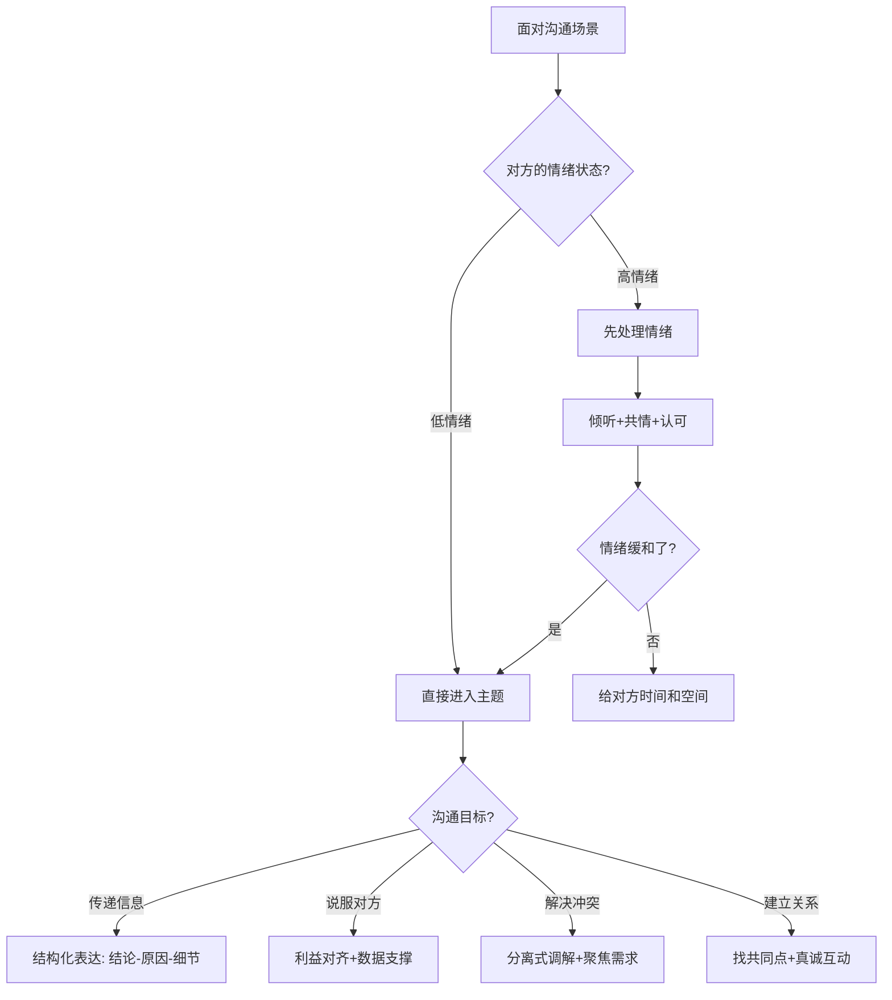

# 附录B：沟通场景速查手册

> 本手册涵盖职场、家庭、社交、商务、特殊场景五大领域的52个常见沟通场景。每个场景提供场景描述、心理学原理、推荐策略、话术模板、常见错误与纠正、注意事项，帮助你在实际情境中快速找到应对方法。
>
> **使用建议**：不必通读全篇。遇到具体场景时，直接翻到对应章节，参考话术模板和注意事项即可。每个场景的"心理学原理"帮助你理解策略背后的逻辑，"常见错误"帮你避坑。

---

## 一、职场沟通场景

### 场景01：向上级汇报工作进展

**场景描述**：定期或不定期向上级汇报项目进展、成果或问题。向上汇报是最常见的职场沟通场景，也是最容易暴露专业度的场景——你汇报的方式，直接影响上级对你能力的判断。

**心理学原理**：首因效应（Primacy Effect）——人们对接收到的信息中"最先出现的部分"印象最深。因此结论先行比铺垫后给结论的说服力高3倍以上。此外，米勒法则（Miller's Law）表明人类短期记忆容量为7±2个信息块，因此核心信息控制在3-5个要点以内效果最佳。

**推荐策略**：采用"结论先行+数据支撑+下一步行动"的金字塔结构。

**向上汇报结构模板**：

【结论（30秒）】
"关于XX项目，核心结论是：进展顺利/遇到了关键挑战。"

【关键数据（1分钟）】
"截至目前：
 - 完成率：XX%，超出/低于计划XX个百分点
 - 关键里程碑：A已完成，B进行中，C待启动
 - 资源使用：预算消耗XX%，时间消耗XX%"

【问题与应对（1分钟）】
"遇到的主要问题是XX，原因是XX。
 我的应对方案是XX，需要您支持的是XX。"

【下一步计划（30秒）】
"下一步我计划XX，预计在XX之前完成。
 如果需要调整优先级，请您指示。"

**常见错误与纠正**：

| 错误做法 | 为什么错 | 正确做法 |
|----------|----------|----------|
| 从过程讲起，最后才给结论 | 上级可能在你讲完之前就失去耐心 | 第一句话就说结论 |
| 汇报时只说"进展顺利" | 空洞无信息量，上级无法判断 | 用数据量化进展 |
| 遇到问题只说问题不带方案 | 把问题抛给上级，暴露被动思维 | 自带2-3个备选方案 |
| 汇报过于细节 | 上级关心结果，不是过程流水账 | 细节放附录，被问到再展开 |
| 只报喜不报忧 | 问题积累后爆发更严重 | 及时暴露风险，主动管理预期 |

**注意事项**：
- 控制时间在3-5分钟内，电梯汇报30秒
- 先说结果，再说过程
- 遇到问题要自带解决方案
- 避免过多细节，突出关键信息
- 了解上级的沟通偏好：数据型上级多给数字，关系型上级多讲故事

---

### 场景02：向领导提出加薪请求

**场景描述**：基于自己的工作表现和贡献，向上级提出薪资调整请求。薪资谈判是职场中价值最高的对话之一——一次成功的调薪谈判可能影响未来3-5年的收入基数。

**心理学原理**：锚定效应（Anchoring Effect）——人们对数字的判断会被第一个出现的数字"锚定"。提出薪资请求时，你需要设定一个合理的"锚点"。此外，社会交换理论（Social Exchange Theory）指出，人与组织之间的关系本质上是价值交换——你获得的报酬应该与你创造的价值对等。因此加薪谈判的核心是"价值证明"，而非"需求诉苦"。

**推荐策略**：用数据和事实说话，展示价值而非诉苦。时机选择比话术更重要——在你刚完成重大项目、获得客户好评、或绩效评估周期前提出，成功率最高。

**加薪谈判准备清单**：

1. 业绩数据（必须项）
   - 过去6-12个月的关键成果（量化：收入增长XX%、成本节省XX万、效率提升XX%）
   - 超越岗位职责的贡献（带新人、跨部门协作、流程优化）
   - 客户/同事的好评反馈（截图或邮件）

2. 市场调研（必须项）
   - 同行业同岗位的薪酬范围（来源：招聘网站、猎头、同行交流）
   - 你当前薪资在市场中的分位数位置
   - 公司内部同级别的大致薪酬范围（如有渠道了解）

3. 期望方案（必须项）
   - 主方案：期望的具体数字（基于调研的合理范围）
   - 备选方案：如果现金不行，是否接受股票、奖金、培训预算、弹性工作等替代
   - 底线：最低接受多少（不超过这个数就暂不接受）

**话术模板**：

【开场】"感谢您抽出时间，我想和您聊聊关于我职业发展和薪酬的话题。"
（先表达对公司的认可和归属感，降低对抗感）

【价值展示】"过去一年，我负责的XX项目带来了XX的业绩增长，
 帮助团队解决了XX问题。最近的XX项目也得到了客户的好评。"

【锚定出价】"我了解到市场同类岗位的薪酬水平在XX-XX范围。
 基于我的贡献和市场水平，我期望的薪资调整到XX。"

【灵活协商】"我非常认可公司的发展方向，也很珍惜这个平台。
 希望我们能找到一个双方都认可的方案。
 如果短期内有困难，我们也可以讨论其他方式，比如奖金或股权。"

【给空间】"不着急今天就答复，您可以考虑一下。我随时配合进一步沟通。"

**注意事项**：
- 选择领导心情好、工作不忙的时机
- 提前准备充分的业绩数据
- 不要以离职威胁（即使你有备选offer）
- 给领导思考的时间，不要逼迫当场答复
- 如果被拒绝，询问"需要达到什么标准才能调薪"，获取明确目标

---

### 场景03：接受上级的批评

**场景描述**：因工作失误或不足被上级批评指正。接受批评的方式比批评本身更能体现你的职业素养——一个能虚心接受批评并迅速改进的人，比一个从不犯错的人更让领导放心。

**心理学原理**：自我防御机制（Ego Defense Mechanism）——当人受到批评时，大脑会自动启动"战斗或逃跑"反应，杏仁核被激活，理性思考能力下降。这就是为什么很多人被批评时第一反应是辩解或沉默。意识到这一点，你才能有意识地暂停防御反应，先"接收"再"处理"。

**推荐策略**：先接受，再回应，后改进。关键原则是：区分"接受批评"和"接受指责"——你可以接受批评中的事实部分，同时不必接受情绪化的指责。

**接受批评的四步法**：

第一步：暂停防御（3秒深呼吸）
不要急于辩解。深呼吸一次，让理性脑重新上线。

第二步：确认理解
"谢谢您的反馈。我理解您的关注点是XX，对吗？"
（确保你理解了批评的核心，而不是听到了情绪就启动防御）

第三步：回应事实
如果批评属实："这个问题确实是我考虑不周，情况是XX。"
如果有误会："我来补充一下当时的情况，供您参考。"
（注意措辞：是"补充"不是"辩解"）

第四步：提出改进
"我已经在想改进方案，具体是XX。我会在XX之前提交改进计划。"
（用行动而非承诺来回应批评）

**话术模板**：

【接受】"谢谢您的反馈，我理解您的关注。"
【承认】"这个问题确实是我考虑不周，我来说明一下情况。"
【改进】"我已经在想改进方案，具体是……"
【承诺】"我会在……之前提交改进计划。"

**常见错误与纠正**：

| 错误做法 | 为什么错 | 正确做法 |
|----------|----------|----------|
| 当场辩解、解释原因 | 被视为推卸责任，激发对抗 | 先接受，再找合适时机补充信息 |
| 沉默不回应 | 被理解为不服气或不在意 | 明确表示接受并有改进计划 |
| 情绪失控（哭/怒） | 让领导为难，也影响自己的专业形象 | 暂停对话，去洗手间平复情绪后回来 |
| 接受后没有后续行动 | 信任度大幅下降 | 48小时内提交改进方案 |
| 私下抱怨领导不公平 | 传到领导耳朵里更严重 | 如有误会，选择私下一对一沟通澄清 |

**注意事项**：
- 不要急于辩解或推卸责任
- 控制情绪，保持冷静
- 如有误会，选择私下沟通澄清
- 用行动证明改进的决心
- 把批评当作改进的机会，而不是人格否定

---

### 场景04：拒绝同事的不合理请求

**场景描述**：同事要求帮忙完成不属于你职责的工作，或超出你能力范围的请求。拒绝的难点在于：你不想做，但又怕影响关系。

**心理学原理**：登门槛效应（Foot-in-the-Door Effect）——一旦你答应了小请求，后续的大请求就更难拒绝。因此，学会在第一时间判断请求的合理性并做出回应，比事后补救更重要。同时，自我损耗理论（Ego Depletion）指出，每一次勉强答应都在消耗你的心理资源，长期下来会导致倦怠和效率下降。

**推荐策略**：温和而坚定，给出替代方案。核心公式：肯定意愿 + 说明限制 + 提供替代。

**拒绝话术模板**：

【缓冲肯定】"我很想帮忙，……"
（先表达善意，降低对方的防御）

【说明限制】"但目前手头的XX项目截止日期很紧，实在抽不出时间。"
（给出具体、真实的理由，而不是含糊的"我很忙"）

【提供替代】"这件事XX可能更擅长，要不你问问他？"
/ "我今天下午有空，如果你不着急的话，可以那时候帮你看看。"
（给出替代方案，显示诚意）

【长期边界】"以后类似的事情可以提前跟我说，我好安排时间。"
（暗示需要提前沟通，而不是临时甩活）

**特殊情况处理**：

请求来自上级：
"我手上有A和B两个任务，如果加上这个，哪个可以往后排？"
（让上级做优先级决策，而不是你单方面承担所有）

请求来自关系好的同事：
"这次确实帮不了，但下周XX项目结束后我可以腾出手来。"
（表达具体的时间限制，而不是笼统拒绝）

反复请求的同事：
"我发现最近类似的事情比较多，可能需要跟领导确认一下分工。"
（温和地将问题升级，而不是无限容忍）

**注意事项**：
- 不要感到内疚，合理拒绝是自我保护
- 态度真诚，理由具体
- 提供替代方案显示诚意
- 不要每次都拒绝，保持互惠关系
- 拒绝后不要反复解释，简洁明了即可

---

### 场景05：主持团队会议

**场景描述**：作为主持人组织和引导团队会议。会议是职场最大的时间黑洞——Harvard Business Review的研究显示，71%的管理者认为会议效率低下且浪费时间，而高效的会议主持能力是管理者最被低估的核心技能之一。

**心理学原理**：社会惰化效应（Social Loafing）——在群体中，个人的努力程度会下降，因为责任被分散了。会议中表现为：等别人先发言、不主动贡献想法。主持人的职责是通过结构化设计对抗社会惰化，确保每个人都有贡献。

**推荐策略**：明确议程、控制时间、引导讨论、总结结论。

**高效会议结构模板**：

会前（提前1天）：
- 发送会议议程，明确每个议题的时间和目标
- 要求参会者提前准备相关材料
- 明确会议类型：决策会/讨论会/信息同步会

会中：
【开场（2分钟）】
"今天会议主要讨论三个议题，目标是XX，预计用时45分钟。
 我们按时开始，也请配合按时结束。"

【议题推进】
每个议题：陈述背景（3分钟）→ 各方发言（10分钟）→ 形成结论（3分钟）
控制跑题："这个话题很好，但可能需要单独安排时间深入讨论。我们先回到今天的主题。"

【收尾（3分钟）】
"让我总结一下今天的决定和下一步行动：
 1. 决定XX，由XX负责，XX日前完成
 2. 待定XX，XX会后再同步
 3. 下次会议：XX时间"

**话术模板**：

【开场】"今天会议主要讨论三个议题，预计用时45分钟。"
【引导】"我们先听一下XX的汇报。"
【控场】"这个话题很好，但可能需要单独安排时间深入讨论。"
【收尾】"让我总结一下今天的决定和下一步行动。"
【沉默处理】"XX，你对这个问题怎么看？"
【跑题处理】"这个点很好，我记下来了，我们单独安排时间讨论。今天先聚焦在XX上。"

**常见错误与纠正**：

| 错误做法 | 为什么错 | 正确做法 |
|----------|----------|----------|
| 没有议程就开始 | 会议变成漫谈，效率极低 | 提前发议程，按议程推进 |
| 允许某个人独占发言时间 | 其他人失去参与感 | "谢谢XX，我们也听听其他人的看法" |
| 超时不结束 | 参会者注意力崩溃，怨声载道 | 提前5分钟提醒，严格控时 |
| 只讨论不决策 | 会议变成讨论俱乐部，没有产出 | 每个议题必须有明确结论或下一步 |
| 会后不跟进 | 会议决定沦为口号 | 24小时内发会议纪要，定期检查进度 |

**注意事项**：
- 提前发送议程
- 按时开始和结束
- 确保每个人都有发言机会
- 会后发送会议纪要
- 6人以上的会议使用"举手"功能

---

### 场景06：跨部门协调资源

**场景描述**：需要其他部门配合或提供资源支持。跨部门协作是职场中最考验沟通能力的场景之一——你没有权力命令对方，却需要对方配合。

**心理学原理**：互惠原则（Reciprocity Principle）——当一方先做出让步或提供帮助时，另一方会有"回报"的心理压力。跨部门协调的关键不是"求人办事"，而是"创造双赢"。

**推荐策略**：站在对方角度，说明互利价值。核心公式：了解对方需求 + 阐述共同利益 + 提出交换条件。

**跨部门协调准备清单**：

1. 了解对方
   - 对方部门的KPI是什么？
   - 他们最近的优先级和压力点是什么？
   - 谁是真正的决策者？（不一定是对接人）

2. 准备筹码
   - 你能给对方什么？（资源、数据、背书、未来的配合）
   - 这件事对对方有什么好处？
   - 如果被拒绝，备选方案是什么？

3. 正式沟通
   - 先通过非正式渠道试探意向
   - 再正式发起沟通，必要时请上级背书
   - 达成共识后书面确认（邮件/文档）

**话术模板**：

【建立共识】"我知道你们部门最近也很忙，但这个项目对我们双方都很重要。"
【阐述互利】"这个合作完成后，对你们部门的XX指标也有帮助。"
【提出交换】"我们可以在XX方面提供支持，作为交换。"
【升级协调】"如果需要，我可以请XX总出面协调一下优先级。"
【书面确认】"那我们就这样约定：我方负责XX，你方负责XX，XX日前完成。我把这个发邮件确认一下。"

**注意事项**：
- 提前了解对方部门的优先级和约束
- 通过正式渠道，必要时请上级协调
- 尊重对方的时间和资源限制
- 达成共识后书面确认
- 建立长期互惠关系，不要"用完即走"

---

### 场景07：绩效面谈

**场景描述**：作为管理者与下属进行绩效评估谈话。绩效面谈的质量直接影响下属的工作动力和留任意愿——Gallup的研究显示，有效的绩效反馈能让员工的敬业度提升4倍。

**心理学原理**：皮格马利翁效应（Pygmalion Effect）——管理者对下属的期望会直接影响下属的表现。如果面谈只聚焦问题和不足，下属会内化为"我不行"的自我认知；如果面谈同时指出潜力和方向，下属会朝着更高的标准努力。此外，近因效应（Recency Effect）导致管理者容易只关注最近1-2个月的表现，忽略整个评估周期。

**推荐策略**：采用SBI模型（Situation情境-Behavior行为-Impact影响），平衡正面和改进反馈。

**绩效面谈结构模板**：

阶段一：暖场（2分钟）
"我们来回顾一下这个季度的表现。先聊聊你自己的感受和想法。"
（让下属先说，了解TA的自我认知）

阶段二：正面反馈（10分钟）
"你在XX项目中的表现很出色。具体来说：
 在XX情境下（S），你做了XX（B），
 带来了XX的结果（I）。这个表现超越了岗位期望。"
（用SBI模型，让正面反馈具体可信）

阶段三：改进反馈（10分钟）
"有一个方面我觉得可以做得更好。
 在XX情境下（S），XX行为（B）导致了XX影响（I）。
 我的建议是XX。你怎么看？"
（改进反馈也要用SBI，避免笼统的"你需要提高"）

阶段四：发展规划（10分钟）
"你对自己的发展有什么想法？
 下个季度我们可以在XX方面给你更多机会和支持。"
（共同制定下阶段目标，增强主人翁感）

阶段五：收尾（3分钟）
"总结一下，你的核心优势是XX，下阶段重点提升的是XX。
 有任何需要我支持的随时说。"

**话术模板**：

【正面反馈】"你在XX项目中的表现很出色，特别是在XX方面。"
【改进反馈】"有一个方面我觉得可以做得更好，就是在XX的时候。"
【发展引导】"你对自己的发展有什么想法？"
【收尾确认】"总结一下，下个季度我们的重点是XX。"

**注意事项**：
- 提前准备具体事例，不要临场发挥
- 先肯定再改进建议，比例建议3:1（3个正面1个改进）
- 给下属充分表达的机会
- 共同制定下阶段目标，而非单向下达
- 面谈后24小时内发书面总结

---

### 场景08：面试中的自我介绍

**场景描述**：求职面试时的开场自我介绍环节。自我介绍是你控制面试节奏的黄金窗口——你说了什么，决定了面试官接下来会问什么。

**心理学原理**：首因效应（Primacy Effect）——面试官在前30秒内就会形成对你的初步判断，这个判断会影响后续所有问题的走向。因此自我介绍不是"背简历"，而是"引导面试方向"。

**推荐策略**：采用"我是谁+我做过什么+我能带来什么"的结构，重点突出与岗位相关的经历。

**自我介绍模板**：

【基础版（1分钟）】
"您好，我是XX，毕业于XX大学XX专业。
 过去X年，我在XX公司负责XX，
 带来了XX的成果（用数据量化）。
 我认为我的XX经验和XX能力能够为贵公司的XX岗位带来价值。"

【进阶版（2-3分钟）】
"您好，我是XX。我有X年XX领域的经验。
 在上一家公司，我负责XX业务。
 我接手时XX（现状），通过XX方法（你的行动），
 实现了XX（成果数据）。
 在这个过程中，我积累了XX方面的能力，
 这与贵公司XX岗位的要求非常匹配。
 我非常期待能在XX方面为团队贡献价值。"

**自我介绍的常见陷阱**：

| 错误做法 | 为什么错 | 正确做法 |
|----------|----------|----------|
| 按时间线背简历 | 信息量太大，面试官记不住 | 挑2-3段最相关的经历重点说 |
| 过度谦虚："我经验不够" | 自己先给自己打了低分 | 用事实说话，让面试官来判断 |
| 说与岗位无关的经历 | 浪费宝贵的自我介绍时间 | 每段经历都与应聘岗位建立连接 |
| 语速过快、背稿感强 | 显得紧张，缺乏自信 | 提前列提纲，不背全文，自然表达 |
| 说"我什么都能做" | 没有重点，缺乏专业度 | 聚焦核心优势，说深不说广 |

**注意事项**：
- 控制在1-3分钟
- 与应聘岗位强相关
- 用数据和成果说话
- 语速适中，自信自然
- 提前研究岗位JD，针对性准备

---

### 场景09：给新员工做入职培训

**场景描述**：帮助新入职的同事了解团队和工作。入职培训的质量直接影响新人的上手速度和留存率——LinkedIn的研究显示，拥有良好入职体验的员工，3年内留任率高出69%。

**心理学原理**：认知负荷理论（Cognitive Load Theory）——新员工面对新环境时，工作记忆已经被大量新信息占满，此时再灌输过多信息会导致"认知过载"，什么都记不住。有效的入职培训应该分阶段、有节奏地释放信息。

**推荐策略**：结构化介绍+互动提问+实操练习。核心原则：不要一次性灌完，分3天消化。

**入职培训节奏模板**：

第一天：环境融入
- 办公环境、工具账号、团队介绍
- 安排一个"入职伙伴"（buddy），负责解答日常问题
- 午餐由团队一起吃，加速社交融入
- 话术："欢迎加入团队！有任何问题随时问，没有愚蠢的问题。"

第一周：基础认知
- 公司文化、核心流程、常用工具
- 每天安排一个30分钟的小模块，不要超过2小时
- 提供书面参考资料（新人手册/FAQ文档）
- 话术："先熟悉这些基础内容，我们下午再一起实操一遍。"

第二周：上手实操
- 安排一个低风险的小任务开始上手
- 每天15分钟的站会同步进展和问题
- 话术："这个任务不着急，目的是让你熟悉流程。遇到问题随时问我。"

第一个月：独立+反馈
- 逐步增加任务复杂度
- 一周后主动跟进了解适应情况
- 一个月做一次正式的入职回顾
- 话术："入职一个月了，聊聊你的感受？有什么需要调整的？"

**注意事项**：
- 不要一次性灌输过多信息
- 提供书面参考资料
- 安排一个"buddy"帮助融入
- 一周后主动跟进了解适应情况
- 不要期望新人一周就能产出，给合理的学习曲线

---

### 场景10：与客户进行项目沟通

**场景描述**：与外部客户就项目需求、进度或问题进行沟通。客户沟通的核心矛盾是：客户的期望往往高于你的承诺，而你需要在维护关系的同时管理预期。

**心理学原理**：峰终定律（Peak-End Rule）——人们对一段体验的记忆取决于两个时刻：体验最强烈的时刻（峰）和体验结束时（终）。因此客户沟通中，要特别注意两个关键时刻：(1) 处理问题时的专业表现（峰值）；(2) 每次沟通结束时的确认和承诺（终值）。

**推荐策略**：专业+耐心+主动管理预期。

**客户沟通话术模板**：

【需求确认】"感谢您的反馈，我来确认一下我理解的是否正确：
 您的核心需求是XX，优先级是XX，期望在XX之前完成，对吗？"
（每次沟通后做书面确认，避免理解偏差）

【方案建议】"关于这个需求，我们的建议是XX，
 原因是XX。如果需要调整，我们可以提供方案A和方案B。"
（给客户选择权，但控制选项范围）

【进度同步】"目前进展如下：XX已完成，XX进行中，预计XX完成。
 下一步我们会XX。我会在XX前给您更新。"
（主动同步，不要等客户来问）

【处理变更】"这个变更需求我理解了。它会影响到XX，
 预计需要额外XX时间/资源。您确认的话我就安排。"
（变更必须有书面确认，包括影响范围和成本）

【处理问题】"我们遇到了一个问题，情况是XX。
 我们的应对方案是XX，预计XX时间解决。
 对交付时间的影响是XX。给您带来不便，非常抱歉。"
（先说方案再说问题，主动管理客户情绪）

**注意事项**：
- 记录所有沟通要点并邮件确认
- 不要过度承诺（承诺你有把握做到的事）
- 遇到问题先告知再解决，不要等问题自己暴露
- 保持专业但不过于生硬
- 定期主动同步进度，不要等客户来问

---

### 场景11：处理下属之间的矛盾

**场景描述**：团队中两位成员因工作分歧产生矛盾。团队冲突如果不及时处理，会像病毒一样扩散——一个人的不满会影响整个团队的士气和协作效率。

**心理学原理**：基本归因错误（Fundamental Attribution Error）——人们倾向于把他人的行为归因于性格（"他就是不配合"），而把自己的行为归因于环境（"我太忙了才没回复"）。调解的核心是帮助双方看到对方行为背后的环境因素，而不是性格标签。

**推荐策略**：分别倾听+中立调解+聚焦问题。

**矛盾调解流程**：

第一步：分别倾听（各15分钟）
"我注意到你们在XX问题上有不同看法。先分别跟我聊聊。"
- 了解各自的视角和诉求
- 找到表面诉求背后的真实需求（往往是被尊重、被认可、资源分配等）
- 不做判断，只收集信息

第二步：共同对话（30分钟）
"你们的共同目标是什么？我们从这里开始。"
- 建立规则：不打断、不人身攻击
- 引导双方看到对方的合理之处
- 聚焦工作目标而非个人恩怨

第三步：达成方案
"我建议我们这样分工……你们觉得如何？"
- 明确具体的行为约定
- 各自做出一个承诺
- 设定检查时间点

**话术模板**：

【开场】"我注意到你们在XX问题上有不同看法，我们来聊聊。"
【分别倾听】"先说说你的想法和感受。"（分别对两个人说）
【找到共识】"你们的共同目标是什么？我们从这里开始。"
【提出方案】"我建议我们这样分工……你们觉得如何？"
【跟踪落实】"我们两周后再看看效果，有问题随时找我。"

**注意事项**：
- 不要偏袒任何一方
- 私下分别了解情况后再一起沟通
- 聚焦工作问题，不涉及人身攻击
- 必要时明确决策，不做无原则的和稀泥
- 调解后持续关注，确保矛盾没有复发

---

### 场景12：项目复盘会议

**场景描述**：项目结束后组织团队进行总结和反思。复盘是团队最重要的学习机制——不复盘的团队，同样的错误会反复出现。

**心理学原理**：行动后回顾（After Action Review, AAR）源于美国陆军的实战总结方法，已被证明是提升团队绩效最有效的工具之一。AAR的核心是将"结果"与"预期"对比，分析差距的原因，形成可复用的经验。关键原则：对事不对人，聚焦系统性改进而非个人追责。

**推荐策略**：事实回顾+经验提炼+行动计划。

**复盘会议结构模板**：

总时长：60-90分钟

1. 营造安全氛围（5分钟）
   "今天我们做XX项目的复盘。目的是学习和改进，不是追责。
    大家可以坦诚分享，说错了也没关系。"

2. 目标回顾（10分钟）
   - 当初的目标是什么？
   - 预期的结果是什么？

3. 结果对比（15分钟）
   - 实际结果是什么？（用数据说话）
   - 哪些目标达成了？哪些没有？

4. 原因分析（20分钟）
   - 成功的地方：是什么因素导致的？能否复制？
   - 失败的地方：根因是什么？（用5个Why追问）
   - 意外发现：有哪些预料之外的情况？

5. 经验沉淀（10分钟）
   - 我们学到了什么？
   - 下次应该怎么做？（具体到流程/模板/checklist）
   - 谁来负责落地？

**话术模板**：

【开场】"今天我们做XX项目的复盘。目的是学习和改进，不是追责。
 大家可以坦诚分享，说错了也没关系。"

【引导讨论】"如果重新来过，有哪些地方你会做得不一样？"
"这个结果背后的根本原因是什么？我们再往深处挖一下。"

【收尾】"总结一下，我们这次学到的三条核心经验是……
 下个项目中，我们要落实的改进是……由XX负责在XX前完成。"

**注意事项**：
- 营造安全氛围，鼓励坦诚
- 不是追责，而是学习
- 聚焦可改进的系统性问题
- 形成书面复盘文档
- 跟踪改进措施的落地情况

---

### 场景13：向高层做战略汇报

**场景描述**：向公司高层领导做战略方向或重大项目汇报。高层汇报的核心挑战：你有30分钟但可能只有5分钟的注意力窗口。

**心理学原理**：注意力的衰减曲线——研究显示，成年人的注意力在开始听汇报后的10-18分钟内达到峰值，之后急剧下降。麦肯锡的"电梯测试"要求：如果在电梯里遇到CEO，你能在30秒内说清楚你的核心观点吗？

**推荐策略**：金字塔结构——结论先行，支撑论点不超过3个（认知负荷限制），每个论点有数据支撑。

**高层汇报结构模板**：

【第一页：结论】
核心观点：XX
关键数据：XX

【第二页：支撑论点】
论点1：XX（数据支撑）
论点2：XX（数据支撑）
论点3：XX（数据支撑）

【第三页：风险与应对】
主要风险：XX
应对方案：XX

【第四页：需要的决策/支持】
明确诉求：需要领导在XX方面做出XX决策

【附录：详细数据】（只在被追问时展示）

**常见错误与纠正**：

| 错误做法 | 为什么错 | 正确做法 |
|----------|----------|----------|
| 从背景开始讲，最后才给结论 | 高层可能在你讲完背景之前就失去耐心 | 第一句话就说结论 |
| 准备50页PPT | 没有人能看完50页，核心信息被淹没 | 正文不超过5页，详细数据放附录 |
| 只讲好听的 | 高层阅人无数，一眼看穿不诚实 | 主动暴露风险并给出应对方案 |
| 不说需要什么决策 | 高层不知道你来的目的是什么 | 明确"需要您做XX决定" |

---

### 场景14：远程会议沟通

**场景描述**：通过视频会议工具进行远程工作沟通。远程沟通丢失了约55%的非语言信息（Mehrabian沟通模型），因此需要更刻意的结构化设计来弥补。

**心理学原理**："Zoom疲劳"的三个原因——(1) 持续的自我审视（看到自己的画面引发焦虑）；(2) 非语言信号缺失导致认知负荷增加；(3) 物理空间的隔离感降低参与度。解决方案是缩短会议时长、增加互动环节、要求开摄像头但隐藏自视图。

**推荐策略**：结构化+互动化+异步化——用更严格的议程弥补信息缺失，用轮流发言弥补参与度下降，能异步解决的不开会。

**话术模板**：

【开场】"大家能听到我说话吗？能看清屏幕吗？好，我们开始。
 今天有3个议题，预计30分钟。请大家先开摄像头。"

【引导互动】"XX，请你分享一下你的进展。"
"大家在聊天区打个1表示同意，打2表示有疑问。"
"我们暂停一下，每人用一句话说说你的看法。"

【处理技术问题】"XX，你那边好像断了，我先跳过你，稍后回来。"
"网络不好的话可以关摄像头，只开麦克风。"

【收尾】"总结一下今天的结论和行动项……
 会议纪要20分钟内发到群里，有问题随时在群里补充。"

**远程会议效率清单**：

- [ ] 会前5分钟发会议链接，确认所有人能加入
- [ ] 有屏幕共享内容时，提前关闭无关窗口和通知
- [ ] 超过6人的会议使用"举手"功能，避免插话混乱
- [ ] 每10分钟做一次小结，防止注意力漂移
- [ ] 关键讨论录制（征得同意后），方便缺席者回看
- [ ] 能用文档异步讨论的，不开实时会议

---

### 场景15：提出创新想法

**场景描述**：在团队中提出新的想法或改进建议。创新想法被否决最常见的原因不是想法本身不好，而是提案者没有做好"销售"工作——没有将想法与决策者关心的目标对齐。

**心理学原理**：现状偏好（Status Quo Bias）——人们对改变天然抵触，维持现状的心理成本远低于接受新事物。克服这一偏见的关键是让改变看起来是"低风险、高收益"的，同时将不改变的风险量化。

**推荐策略**：问题-方案-价值-可行性四段法（PSVF）——先让听众认同问题存在，再呈现方案，然后量化价值，最后证明可行。

**话术模板**：

【问题定义】"我注意到我们在XX方面有一个效率瓶颈，
 每个月大概浪费XX人天/导致XX损失。"

【方案呈现】"我调研了几个解决方案，认为XX方案最适合我们。
 原理是XX，实施步骤是……"

【价值量化】"如果实施，预计可以：
 - 效率提升XX%
 - 成本节省XX万/年
 - 周期从XX天缩短到XX天"

【可行性论证】"初步估算需要XX资源、XX时间。
 XX公司/团队已经验证了这个方案，效果是XX。
 我做了一个小范围测试，结果是XX。"

【降低阻力】"我们可以先做一个为期2周的小规模试点，
 不影响现有流程。如果效果不好，随时可以停止。"

---

## 二、家庭沟通场景

### 场景16：与伴侣讨论家务分工

**场景描述**：与配偶或伴侣就家务分配进行沟通。家务分工矛盾是婚姻咨询中最常见的议题之一，Gottman研究所数据显示，家务分配不公平是导致婚姻满意度下降的第三大因素。

**心理学原理**：公平理论（Equity Theory）——人们在关系中会不断评估投入与回报的比值。当一方觉得自己付出远多于回报时，就会产生怨恨。但"公平"是主观感受——每个人对不同家务的价值评估不同。沟通的目标不是数学上的50:50，而是双方都"感到"公平。

**推荐策略**：需求表达法——用"我感到……因为……我希望……"的句式替代"你从来不……"的指责句式。

**话术模板**：

【开启对话】"最近家务的事让我有点累，我们能聊聊怎么调整一下吗？"
（注意：选双方都放松的时候，不要在刚做完家务很累的时候谈）

【表达感受】"我注意到做饭和洗碗大部分时候是我在做，
 时间长了感觉有点疲惫和不平衡。"

【共同规划】"我们来列一下家里有哪些家务，看看怎么分工比较合理？
 有些你不喜欢但我不介意做的可以我来，反过来也一样。"

【灵活方案】"平时你负责XX，我负责XX。
 如果谁某天特别忙或累了，可以临时换一下，提前说一声就好。"

【定期回顾】"我们先试一个月，月底再看看效果怎么样？"

**常见错误与纠正**：

| 错误做法 | 为什么错 | 正确做法 |
|----------|----------|----------|
| "你从来不做家务！" | 绝对化表达会引发防御和反击 | "最近XX家务主要是我在做" |
| 记分牌心态（精确计较每件事） | 把关系变成了交易 | 关注整体感受是否平衡 |
| 赌气不说话等对方发现 | 对方可能根本没意识到问题 | 直接、温和地表达需求 |
| 一方包揽全部然后抱怨 | 对方不知道你介意 | 分工明确后，不满意的及时沟通 |

---

### 场景17：与青春期孩子沟通

**场景描述**：与处于青春期（12-18岁）的孩子进行日常交流或解决问题。青春期是大脑前额叶皮层（负责理性决策）快速发育但尚未成熟的阶段，情绪波动大、追求独立、对权威敏感是正常的发育特征。

**心理学原理**：自我决定理论（Self-Determination Theory）——青春期的核心心理需求是自主感（Autonomy）、胜任感（Competence）和归属感（Relatedness）。当父母的沟通方式剥夺了孩子的自主感（命令式），孩子会本能地反抗。将"你必须"转化为"你觉得怎样好？"能显著降低对抗。

**推荐策略**：教练式沟通——提问而非告知，引导而非命令，支持而非控制。

**话术模板**：

【日常交流】
"学校今天有什么有意思的事吗？"
（而不是"今天学了什么？"——前者引发分享，后者引发敷衍）

【了解想法】
"我注意到你最近花很多时间在XX上，能跟我说说你为什么喜欢吗？"
（而不是"你整天就知道XX，有什么用！"——前者表示好奇，后者表示否定）

【冲突处理】
"我能理解你想要更多的自由。我们来聊聊，你觉得哪些方面可以自己做主，
 哪些方面我们还需要一起商量？"
（而不是"你才多大就想自己做主！"——前者协商边界，后者否定成长）

【犯错引导】
"这件事的结果不太理想，你自己怎么看？
 如果重来一次，你会怎么做？"
（而不是"我早就跟你说过了！"——前者引导反思，后者引发防御）

**沟通禁区清单**：

- 当众批评孩子（尤其是朋友面前）
- 偷看日记、手机、社交账号（发现后信任崩塌）
- "我都是为你好"式道德绑架
- 拿别人家的孩子做比较
- 在孩子情绪激动时讲道理（等情绪平复后再谈）
- 否定孩子的感受："这有什么好难过的"

---

### 场景18：与父母沟通生活习惯差异

**场景描述**：与父母（或公婆）因生活习惯不同产生摩擦。两代人之间的沟通难点在于：双方都认为自己的方式是"对的"，而且往往夹杂着"为你好"的情感因素。

**心理学原理**：代际差异的本质是价值观体系的不同——上一代人经历物质匮乏，形成节俭、保守的价值观；这一代人成长于物质丰富的环境，更看重效率和体验。理解这个背景，就不会将父母的唠叨解读为"控制"，而是"关心的表达方式不匹配"。

**推荐策略**：感恩+理解+温和表达需求+提供替代方案。

**话术模板**：

【表达感恩】"妈，我知道您是关心我们才会说这些，谢谢您。"
【理解立场】"您那一代人确实是在XX环境下长大的，习惯了XX方式。"
【温和表达】"不过我们这一代在XX方面有些不同的做法，
 不是说您的方式不好，只是我们想试试自己的方式。"
【寻求共识】"我们都希望XX（共同目标），在这个大方向上是一致的。
 具体方式上，我们可以各退一步。"
【设置边界】"关于XX这件事，我们希望能自己做决定。
 其他方面我们很愿意听您的建议。"

**协调策略矩阵**：

| 摩擦类型 | 处理策略 | 示例 |
|----------|----------|------|
| 生活习惯（作息/饮食） | 求同存异，各退一步 | "您习惯早睡，我们晚点回房间，不影响您" |
| 育儿观念 | 以科学依据为准，但表达尊重 | "医生建议XX，我们也参考了您的经验" |
| 消费观念 | 说明价值而非价格 | "这个XX虽然贵一点，但能用XX年，平均下来更划算" |
| 边界问题 | 通过配偶协调更有效 | 让配偶去跟TA自己的父母沟通 |

---

### 场景19：教育孩子时的沟通

**场景描述**：孩子犯错或需要引导时的沟通。教育的核心不是惩罚错误，而是帮助孩子建立内在的行为准则。

**心理学原理**：行为主义的"强化"原理——正强化（奖励好行为）比负强化（惩罚坏行为）更有效。神经科学研究显示，批评会激活大脑的威胁反应系统（杏仁核），抑制学习和反思能力；而建设性的引导激活前额叶皮层，促进理性思考。

**推荐策略**：DESC模型——Describe（描述行为）→ Express（表达感受）→ Specify（说明期望）→ Consequence（说明后果）。

**话术模板**：

【描述行为】"我看到你把妹妹的玩具弄坏了。"（客观描述，不加评判）
【表达感受】"我感到很担心，因为妹妹会很伤心。"（用"我"句式，不用"你"句式）
【倾听原因】"能告诉我发生了什么吗？"（给孩子解释的机会）
【讨论影响】"你觉得这样做会有什么后果？"（引导孩子自己思考）
【共同约定】"下次遇到这种情况，你觉得可以怎么做？"（让孩子参与制定规则）
【正面强化】"谢谢你的诚实。我相信你下次会处理得更好。"

**常见错误对照**：

| 错误做法 | 孩子的内心反应 | 正确做法 |
|----------|---------------|----------|
| "你怎么又打妹妹！" | "我就是坏孩子" | "我看到妹妹在哭，发生了什么？" |
| "你看看人家小明多听话" | "我不如别人，爸妈不爱我" | "你这周XX做得比上周进步了" |
| "我跟你说过多少次了！" | "反正我说什么都没用" | "我们来想想怎么解决这个问题" |
| 翻旧账 | "反正我做过的坏事都记着呢" | 只讨论当前事件 |

---

### 场景20：家庭财务讨论

**场景描述**：与配偶讨论家庭收支、投资、大额消费等。财务问题是离婚率排名前三的原因，但很多家庭回避这个话题——因为谈钱"伤感情"。实际上，不谈钱才真正伤感情。

**心理学原理**：金钱心理学——每个人对金钱的态度受原生家庭、个人经历和性格影响。"安全型"消费者看重储蓄和安全感，"享乐型"消费者看重体验和当下满足。两种态度没有对错，但需要互相理解和协商。

**推荐策略**：透明化+目标导向+定期沟通。

**家庭财务沟通框架**：

月度财务会议（每月固定时间，30分钟）

1. 上月回顾（10分钟）
   - 总收入：XX
   - 固定支出：房贷XX + 车贷XX + 保险XX = XX
   - 可变支出：餐饮XX + 购物XX + 娱乐XX = XX
   - 结余：XX

2. 目标检查（10分钟）
   - 短期目标（旅行/家电）进度：XX
   - 中期目标（教育/装修）进度：XX
   - 长期目标（养老/投资）进度：XX

3. 下月规划（10分钟）
   - 预计大额支出：XX
   - 储蓄计划调整：XX
   - 需要协商的事项：XX

**话术模板**：

【开启话题】"我们找个时间聊聊家庭财务吧，不是要吵架，就是一起看看情况。"
【数据化呈现】"我整理了一下上个月的开支，你看这个表格。"
【共同目标】"我们的财务目标是XX，按照目前的进度，需要XX个月。"
【协商分歧】"关于XX消费，我的想法是……你觉得呢？"
【达成共识】"那我们约定：超过XX元的大额消费提前商量，日常开支各自管理。"

---

### 场景21：与家人讨论重大决策

**场景描述**：如搬家、换工作、子女教育选择等重大事项。重大决策的特点是影响范围广、不可逆程度高、各方利益可能不一致。

**推荐策略**：充分信息共享+各方意见+理性分析+共识决策。

**重大决策讨论框架**：

第一轮：信息共享（不做决策）
- 各自阐述想法和理由
- 不打断、不评判
- 记录所有信息

第二轮：分析评估
- 列出各方案的优劣势
- 评估风险和不确定性
- 考虑最坏情况

第三轮：共识构建
- 找到各方都能接受的底线
- 设计折中方案
- 明确决策标准

第四轮：决策执行
- 明确分工
- 设定时间节点
- 制定备选方案（Plan B）

**话术模板**：

"关于XX这件事，我有一些想法想和你商量。
 我考虑了A方案和B方案，各有优劣。
 A方案的好处是XX，风险是XX；
 B方案的好处是XX，风险是XX。
 你觉得呢？你有什么顾虑？
 我们一起权衡一下，不着急做决定。"

---

### 场景22：照顾生病的家人

**场景描述**：家人生病时的关怀和沟通。生病的人最需要的不是建议和解决方案，而是情感支持和实际帮助。

**心理学原理**：无助感是疾病中最痛苦的心理体验之一。患者感到对自己身体失去了控制权，此时过度的照顾反而会强化无力感。最好的支持是"有尊严的陪伴"——在提供帮助的同时保留对方的自主权。

**话术模板**：

【日常关怀】"你今天感觉怎么样？"（而不是"你今天好点了吗？"——前者给空间，后者暗示应该好了）
【提供帮助】"有什么我能帮你的吗？"（具体化："需要我帮你买药/做饭/跑医院吗？"）
【情感支持】"你不用着急，慢慢来，我们都在。"
【保留自主权】"你觉得XX方案好还是XX方案好？你来做决定。"
【长期陪伴】"医生说了恢复需要时间，你安心养着。家里的事不用操心。"

**照护者自我关怀提醒**：

- 照顾别人的同时不要忘记照顾自己
- 安排轮换，不要一个人扛所有事
- 如果感到焦虑和疲惫，找朋友倾诉或寻求专业帮助
- 适当休息不是自私，是可持续照护的前提

---

## 三、社交沟通场景

### 场景23：初次见面破冰

**场景描述**：在社交场合与陌生人初次见面。第一印象在0.1秒内就开始形成（Willis & Todorov, 2006），且一旦形成极难改变。

**心理学原理**：相似性吸引原则（Similarity-Attraction Paradigm）——人们倾向于喜欢与自己相似的人。破冰的核心是快速找到共同点：共同的朋友、共同的经历、共同的兴趣。另外，"出丑效应"（Pratfall Effect）表明，适度展现小缺点反而让人觉得更真实、更亲近。

**推荐策略**：FORD法则——Family（家庭）→ Occupation（职业）→ Recreation（兴趣）→ Dreams（梦想），从安全话题逐步深入。

**话术模板**：

【标准开场】"你好，我是XX。你是怎么认识主人的？"
【寻找共同点】"你平时做什么工作？/你有什么兴趣爱好？"
【深化连接】"哇，你也在XX领域？我之前在XX公司待过。"
【保持联系】"跟你聊天很投缘，加个微信吧？"

**破冰话题库**：

| 安全话题 | 进阶话题 | 避开话题 |
|----------|----------|----------|
| 当前场合/环境 | 共同的朋友或经历 | 收入/房价 |
| 最近的热门电影/电视剧 | 职业发展和行业趋势 | 政治立场 |
| 美食/旅行 | 个人成长和学习 | 宗教信仰 |
| 兴趣爱好 | 对未来的计划 | 年龄/婚恋状态（不熟时） |

---

### 场景24：化解社交尴尬

**场景描述**：在聚会或社交场合出现冷场或尴尬。社交尴尬的核心是"所有人的注意力都集中在负面事件上"，化解的关键是转移注意力。

**推荐策略**：幽默化解+话题转移+自嘲。

**话术模板**：

【冷场】"看来大家都需要来杯咖啡提提神。谁要喝咖啡？我去拿。"
（用行动打破沉默）

【说错话】"不好意思，我刚才嘴比脑子快了。换个话题——
 你们最近有没有看XX？"

【别人说错话】"哈哈，XX你今天口才不太好啊。
 来，说说你最近XX方面的事吧。"
（帮对方化解，同时转移话题）

【被冒犯】微笑着说"你这个角度挺有意思的"然后转向其他人
（不接茬也不撕破脸）

---

### 场景25：拒绝他人的邀请

**场景描述**：不想参加某个活动但需要婉拒。拒绝的难点在于：既不想去，又不想伤害关系。

**推荐策略**：感谢+原因+替代方案+未来意愿。

**话术模板**：

【标准拒绝】"谢谢你的邀请！听起来很有趣。
 不过那天我已经有安排了，很遗憾。下次有活动记得叫上我！"

【多次拒绝后】"这段时间实在太忙了，连续拒绝你好几次，真不好意思。
 下次我来组局，咱们约个时间。"

【不得不拒绝的亲近朋友】"说实话，最近状态不太好，想在家休息一下。
 不是不想见你，等我恢复了咱们好好聚一次。"

---

### 场景26：赞美他人

**场景描述**：在合适的时机表达对他人的认可和赞美。真诚的赞美是成本最低的社交投资，但泛泛的赞美反而让人觉得敷衍。

**心理学原理**：具体的赞美比笼统的赞美有效5倍以上。"你今天的演讲很棒"和"你今天演讲中那个用户案例特别有说服力，我一下就理解了这个产品的价值"——后者让对方知道你真的在认真听，而不是客套。

**推荐策略**：具体行为+正面影响+真诚语气。

**赞美的三个层次**：

| 层次 | 示例 | 效果 |
|------|------|------|
| 外在赞美 | "你今天穿得很好看" | 一般，容易流于客套 |
| 能力赞美 | "你处理这件事的方式很专业" | 较好，肯定了对方的能力 |
| 品格赞美 | "你面对困难时的坚持让我很佩服" | 最佳，触及核心价值 |

**高阶技巧**：
- 背后赞美：在A面前赞美B，效果是当面赞美的3倍（因为更可信）
- 提问式赞美："你是怎么做到的？能教教我吗？"（比直接赞美更让人有成就感）
- 及时赞美：行为发生后立刻赞美，延迟越久效果越差

---

### 场景27：安慰遭遇挫折的朋友

**场景描述**：朋友遇到困难、失败或失去亲人。安慰的核心不是"解决问题"，而是"陪伴情绪"。

**心理学原理**：共情（Empathy）≠ 同意。共情是"我理解你的感受"，不是"我认为你的做法是对的"。很多人在安慰时急于给建议或评判，反而让对方觉得自己的感受被否定。

**推荐策略**：陪伴-倾听-共情-支持四步法。

**话术模板**：

【陪伴】"我在这里，你想说什么都可以。"
【倾听】"跟我说说吧。"（然后安静地听，不打断）
【共情】"这件事确实很难受/很不公平/很让人失望。"
【支持】"你需要我做什么吗？如果你想聊聊、出去走走、或者只是需要有人陪着，都可以。"

**安慰的禁忌**：

- "我理解你的感受"——除非你真的经历过完全相同的处境
- "至少你还有XX"——比较不幸是最无效的安慰
- "一切都会好起来的"——空洞的乐观让人觉得你不认真对待
- "你应该这样做……"——对方需要的是情绪支持，不是人生指导
- "我早就说过……"——事后诸葛亮是最伤人的话

---

### 场景28：参加饭局应酬

**场景描述**：参加社交饭局或商务宴请。饭局是中国社交文化的重要组成部分，很多重要的关系和合作都是在饭桌上建立的。

**推荐策略**：主动破冰+适度参与+尊重每个人。

**饭局社交四阶段**：

入座阶段：
- 让长辈/重要客人先坐
- 不要抢主位，但也不要坐太偏

热菜前（破冰黄金期）：
- 主动和旁边的人打招呼
- 聊轻松话题：美食、旅行、最近的趣事
- 帮忙倒茶、递纸巾，展示细心

用餐阶段：
- 不要只顾吃，也不要只顾说
- 关注不善言辞的人，主动带上话题
- 敬酒时说几句走心的话，不要只是"我干了你随意"

散场阶段：
- 感谢组织者
- 和新认识的人交换联系方式
- "今天和大家交流收获很大，希望以后多联系。"

---

### 场景29：处理朋友间的误会

**场景描述**：与朋友因误解产生隔阂。友情中的误会如果不及时处理，会像滚雪球一样越来越大。

**推荐策略**：主动沟通+坦诚表达+求同存异。

**话术模板**：

【主动开启】"最近我感觉我们之间好像有点不一样了，是有什么误会吗？"
【表达感受】"如果是XX那件事让你不舒服，我想说那不是我的本意。"
【倾听对方】"我想听听你当时是怎么想的。"
【修复关系】"我们的友谊对我很重要。可能当时我们都有些情绪，
 但这不值得影响我们的关系。"
【向前看】"以后如果有什么不舒服的，我们可以直接说。"

---

### 场景30：在社交群中发言

**场景描述**：在微信群、社交群中互动交流。群聊是一种特殊的沟通形式——有观众效应，信息半公开，且异步沟通导致语气容易被误解。

**推荐策略**：有价值的内容+适度互动+尊重群规。

**群聊礼仪**：

- 发有价值的内容（行业信息、好文章、实用建议）
- 回应他人分享时给予具体反馈，不只是"赞"
- 不在群里发长语音（超过30秒的语音是社交暴力）
- 私事私聊，不在群里展开两人对话
- 避免在群里争论——赢家没有奖品，输家丢尽面子
- 不频繁@所有人，除非你是群主且事情真的重要

---

## 四、商务沟通场景

### 场景31：商务谈判开场

**场景描述**：与合作方进行商务谈判的初始阶段。谈判的前10分钟决定了整个谈判的基调和走向。

**心理学原理**：谈判不是零和博弈。哈佛谈判项目的研究表明，采用"原则性谈判"（Principled Negotiation）的双方，最终达成的协议满意度比"立场性谈判"高40%。核心理念：将人和问题分开，关注利益而非立场，创造双赢选项。

**推荐策略**：关系建设→需求探询→议程设定→利益对齐。

**谈判准备清单**：

- [ ] 了解对方公司的背景、近期动态、核心需求
- [ ] 明确自己的底线（BATNA：最佳替代方案）
- [ ] 准备2-3个创造性方案（不只是价格上的让步）
- [ ] 预判对方可能的反对意见和应对策略
- [ ] 准备好非货币的交易筹码（时间、资源、渠道、背书等）

**话术模板**：

【开场】"非常感谢贵方的接待。我们非常重视这次合作机会，
 也很期待今天的讨论。"
【需求探询】"在正式开始之前，能否请贵方分享一下对这次合作的期望？
 你们最看重的是哪些方面？"
【议程设定】"我希望今天的讨论能帮我们找到双赢的方案。
 我建议我们先讨论XX，然后是XX，最后是XX。你们看合适吗？"

---

### 场景32：处理客户投诉

**场景描述**：客户对产品或服务不满，提出投诉。客户投诉处理得当，投诉客户的忠诚度反而比从未投诉过的客户更高——这就是"服务补救悖论"（Service Recovery Paradox）。

**心理学原理**：投诉客户的情绪历程通常是：愤怒→失望→期望被重视。在愤怒阶段，任何解释都会被视为推卸责任；在失望阶段，客户需要的是解决方案；在期望被重视阶段，客户需要的是确认自己被认真对待。

**推荐策略**：LAST法则——Listen（倾听）→ Apologize（道歉）→ Solve（解决）→ Thank（感谢）。

**话术模板**：

【倾听】"请详细跟我说一下情况，我认真记录。"
（不打断、不辩解、做好记录）

【共情道歉】"非常抱歉给您带来了这么不好的体验。
 如果我是您，我也会很不满。"

【确认问题】"让我确认一下：您遇到的问题是XX，
 对您的影响是XX，对吗？"

【提供方案】"我们的解决方案是：
 方案A：XX（快速解决，但补偿有限）
 方案B：XX（需要XX时间，但补偿更充分）
 您看哪个方案更合适？"

【跟进承诺】"我会在XX小时内给您反馈处理结果。
 这是我的直线电话，有任何问题随时联系我。"

【事后感谢】"感谢您的反馈，这个问题帮助我们发现了XX改进点。
 我们已经做了XX调整，以后不会再出现这种情况。"

---

### 场景33：商务邮件撰写

**场景描述**：撰写工作邮件，包括项目沟通、合作邀约等。商务邮件是职场最重要的书面沟通形式——它有法律效力，可以作为证据，也能反映你的专业水平。

**邮件结构模板**：

主题行：【类型】+ 核心内容 + 需要的动作/时间节点
示例：【需回复】XX项目方案确认 — 请6月30日前反馈

称呼：XX总/XX经理/XX老师
正文：
  第一段：目的（一句话说清为什么写这封邮件）
  第二段：核心内容（分点列出，每点不超过2行）
  第三段：行动项（需要对方做什么、什么时候做）
  结尾：表达感谢和开放沟通意愿

签名：姓名/职位/联系方式

**邮件场景话术**：

【合作邀约】
"XX总您好，我是XX公司的XX。
 我们在XX领域看到了与贵公司的合作机会，
 特别是在XX方面，双方有很强的互补性。
 附件是我们的初步合作方案，期待您的反馈。"

【进度同步】
"各位好，XX项目本周进展如下：
 1. XX已完成
 2. XX进行中，预计周三完成
 3. XX遇到问题，已启动XX方案
 无需要协调的事项。"

【催促回复】
"XX您好，关于XX事项（见下方邮件），
 不知道您是否有机会查看？
 如有任何疑问，我可以电话沟通。"

---

### 场景34：电话销售/邀约

**场景描述**：通过电话进行销售推广或活动邀约。电话销售的核心挑战：你有30秒决定对方是继续听还是挂电话。

**心理学原理**：注意力窗口只有30秒——在这30秒内，对方在回答三个问题：(1) 你是谁？(2) 你要干嘛？(3) 这跟我有什么关系？如果30秒内没有回答这三个问题，对方会挂电话。

**推荐策略**：30秒开场白 + 价值展示 + 行动呼吁。

**话术模板**：

【30秒开场白】
"XX先生/女士您好，我是XX公司的XX。
 打扰您一分钟。
 我们帮助XX行业的企业解决了XX问题，
 通常是通过XX方式实现的。
 不知道您对XX方面有没有兴趣？"

【价值展示】
"我们最近帮XX公司（同行业标杆）实现了XX效果，
 他们的XX指标提升了XX%。"

【行动呼吁】
"如果方便的话，我给您发一份案例资料？
 您看什么时间方便，我们面谈15分钟详细聊聊？"

---

### 场景35：商务晚宴致辞

**场景描述**：在商务宴会上代表公司发言。

**推荐结构**：感谢+回顾+展望+祝福。

**话术模板**：

【感谢】"尊敬的各位嘉宾，非常感谢大家今晚的到来。"
【回顾】"回顾过去一年，我们在XX领域取得了XX成绩。
 这离不开在座各位的支持与信任。"
【展望】"展望未来，我们将在XX方面持续投入，
 期待与各位有更深入的合作。"
【祝福】"最后，祝大家身体健康，事业顺利！干杯！"

**致辞技巧**：
- 控制在3-5分钟，不要超过5分钟
- 语速比平时慢20%，让听众有消化时间
- 关键信息处停顿，给听众反应时间
- 结尾举杯时与关键嘉宾有眼神交流

---

### 场景36：催收账款

**场景描述**：提醒客户支付逾期款项。催收的目标是收回款项的同时维护客户关系。

**推荐策略**：阶梯式催收——友善提醒→正式催收→严肃警告→法律手段。大部分情况在第一、二阶段就能解决。

**话术模板**：

【友善提醒（逾期1-7天）】
"XX总您好，我来确认一下XX款项的支付安排。
 发票和合同都已经发过去了，如果有什么问题随时告诉我。"

【正式催收（逾期7-30天）】
"XX总您好，XX款项已经逾期XX天了。
 按照合同约定，付款截止日期是XX。
 不知道目前是什么情况？如果贵方在资金上有困难，
 我们可以协商分期方案。"

【严肃警告（逾期30天以上）】
"XX总，XX款项已严重逾期。
 如果在XX日前仍未收到款项，我们将不得不采取进一步措施，
 包括XX。我们不希望走到那一步，希望您能尽快安排。"

---

### 场景37：商务合作提案

**场景描述**：向潜在合作方提出合作方案。

**推荐策略**：需求分析+方案呈现+价值量化+降低风险感知。

**提案结构**：

1. 封面：提案名称 + 双方LOGO + 日期
2. 执行摘要（1页）：核心价值主张
3. 需求分析：对对方业务的理解和痛点分析
4. 方案详情：具体的合作方式、分工、时间线
5. 价值量化：预期ROI、案例数据
6. 风险管理：潜在风险和应对方案
7. 投入产出：需要的资源和预期回报
8. 下一步：明确的行动呼吁

---

### 场景38：产品发布会演讲

**场景描述**：在产品发布会上向媒体和客户介绍新产品。

**推荐策略**：故事开场→痛点切入→产品展示→号召行动。

**演讲结构**：

1. 故事/场景（3分钟）
   - 用一个用户故事引入，引发共鸣
   - "你是否遇到过这样的困扰……"

2. 痛点分析（2分钟）
   - 量化痛点的严重程度
   - 现有方案为什么不够好

3. 产品展示（8-10分钟）
   - 核心功能演示（Live Demo）
   - 关键差异化优势
   - 用数据说话

4. 号召行动（1分钟）
   - 如何获取产品
   - 限时优惠/特别福利
   - 结尾金句

**演示风险预案**：
- 准备离线Demo版本（防止网络故障）
- 录制Demo视频备份（防止现场Bug）
- 准备一个笑话化解技术故障的尴尬
- 提前检查投影、音响、翻页器

---

## 五、特殊场景沟通

### 场景39：道歉

**场景描述**：因自己的过失向他人道歉。有效的道歉能修复关系，无效的道歉会让事情更糟。

**心理学原理**：研究表明，一个完整的道歉包含六个要素（Ohbuchi et al., 1989）：(1) 承认错误；(2) 承担责任；(3) 解释原因（不是找借口）；(4) 表达悔意；(5) 提出补救；(6) 请求原谅。缺少任何一个要素，道歉的效果都会大打折扣。

**完整道歉模板**：

【承认错误】"这件事是我的错，我非常抱歉。"
【承认影响】"我理解这给你带来了XX的困扰/损失。"
【解释原因】"当时的情况是……（简要说明，不是找借口）"
【补救措施】"我已经采取了XX措施来补救/弥补。"
【防止再犯】"以后我会XX，确保不再发生。"
【请求原谅】"我知道这需要时间，我愿意等。"

**道歉的致命错误**：

- "我很抱歉，但是……"——"但是"之前的话都是废话
- "如果你觉得被冒犯了，我道歉"——把责任推给了对方的感受
- "大家都这样，又不是只有我"——推卸和比较
- 只道歉不行动——道歉的诚意体现在后续行为上
- 道歉太晚——时效性是道歉有效性的关键因素

---

### 场景40：传递坏消息

**场景描述**：需要告知他人不利的消息（如裁员、项目取消、拒绝录用等）。

**推荐策略**：直接+共情+后续支持。不要铺垫太长——研究显示，过长的铺垫会让接收者更加焦虑，因为他们已经意识到坏消息要来了。

**话术模板**：

【直接告知】"我有一个不太好的消息要告诉你。"（不绕弯子）
【说明情况】"由于XX原因，公司决定XX。"
【共情回应】"我知道这对你来说不容易接受。"
【说明影响】"对你个人的影响是XX。"
【支持方案】"公司/我会提供XX支持。"
【持续支持】"如果你需要聊聊，我随时都在。"

**传递坏消息的注意事项**：

| 应该做 | 不应该做 |
|--------|----------|
| 面对面告知 | 通过短信、邮件或电话 |
| 选择私密安静的场所 | 在公开场合或有其他人在场时 |
| 直接说明，不绕弯子 | 长时间铺垫，让对方猜 |
| 给对方消化的时间 | 要求对方立刻做出反应或表态 |
| 提供后续支持方案 | 说完就走，不留后续通道 |

---

### 场景41：调解他人之间的冲突

**场景描述**：作为第三方调解两个人之间的矛盾。

**推荐策略**：中立倾听+引导共情+协助方案。

**调解者角色定位**：你不是法官（不做判决），不是和事佬（不各打五十大板），而是引导者（帮助双方找到共识）。

**调解流程**：

1. 分别倾听（各15分钟）
   - 了解各自的视角
   - 找到核心诉求（往往不是表面看到的）
   - 评估冲突的真正原因

2. 共同对话（30分钟）
   - 建立规则：不打断、不人身攻击
   - 各自陈述核心诉求
   - 引导双方看到对方的合理之处
   - 探索双赢方案

3. 达成协议
   - 明确具体的行为约定
   - 设定检查时间点
   - 各自做出一个承诺

**话术模板**：

"我理解你们都有自己的立场，我们来一起看看。
 XX，你最核心的诉求是什么？
 YY，你觉得XX的这个诉求合理吗？
 我们的目标是XX，在这个大方向上你们是一致的。
 具体方式上，有没有一个双方都能接受的方案？"

---

### 场景42：提出分手/离婚沟通

**场景描述**：结束一段感情关系时的沟通。这是人生中最困难的对话之一，需要同时处理情感、实际事务和对对方的尊重。

**推荐策略**：坦诚+尊重+明确+善后。

**分手沟通指南**：

准备阶段：
- 确认自己的决定是深思熟虑的，不是冲动
- 选择私密、安静、不会被打扰的场所
- 准备好面对对方的情绪反应

沟通阶段：
- 直接说明决定，不绕弯子
- 承认这段关系中美好的部分
- 解释原因，但不要攻击对方
- 允许对方表达情绪
- 不要给出虚假的希望（"也许以后……"）

善后阶段：
- 协商财产分割和共同事务
- 商定社交媒体上的公开方式
- 给彼此冷静的空间
- 必要时寻求专业帮助（律师/心理咨询）

**话术模板**：

"我认真考虑了很久，觉得我们可能不太适合继续在一起。
 这段时间我回顾了我们的关系，XX方面我们都努力过了。
 我不想耽误你，也不想勉强自己。
 关于XX（财产/住处/共同朋友），我们可以商量一个合理的安排。
 我希望我们能好聚好散。"

---

### 场景43：面试中的薪资谈判

**场景描述**：在面试或offer阶段讨论薪资待遇。薪资谈判是求职过程中价值最高的10分钟对话——一次成功的谈判可能影响未来3-5年的收入基数。

**心理学原理**：锚定效应在此场景中尤为关键。第一个出价的人设定了谈判的"锚点"。研究表明，先出价的一方通常能获得更有利的结果（Galinsky & Mussweiler, 2001）——前提是锚点设置合理。

**推荐策略**：了解行情→展示价值→先发制人→灵活谈判。

**话术模板**：

【主动出价】"基于我XX年的经验、XX方面的专业能力，
 以及目前市场上同类岗位的薪酬水平，
 我的期望薪资在XX到XX之间。"

【被问最低接受多少】"我更看重的是整体的发展机会和平台。
 薪资方面，我相信公司会给出合理的方案。
 不过我目前也有XX范围的其他offer在考虑。"

【争取更高】"我非常期待加入贵公司。
 不过XX的薪资与我的预期有一些差距。
 我们是否可以在XX方面做一些调整？
 比如签字费、股票期权、或者试用期后的调薪承诺？"

【接受offer】"感谢您的offer，我接受。
 请问入职前还有什么需要我准备的？"

---

### 场景44：与前任保持适当距离

**场景描述**：分手后需要与前任维持适当的沟通边界。

**推荐策略**：明确界限+礼貌但保持距离。

**边界设定指南**：

原则：
- 减少社交媒体互动（取消关注/屏蔽动态）
- 不要深夜联系
- 不要在共同朋友面前说对方坏话
- 必要时可以暂时断联1-3个月
- 有共同事务（工作/孩子）时保持事务性沟通

话术：
"我觉得我们需要各自向前看，保持一些距离比较好。
 关于XX事情，我们可以用邮件/微信沟通。
 其他的私事，暂时不太方便聊。"

---

### 场景45：社区邻里沟通

**场景描述**：与邻居就噪音、停车等社区问题进行沟通。

**推荐策略**：友善+具体+互相体谅。

**话术模板**：

【初次沟通】"你好，我是XX楼XX号的邻居。
 有件事想和您商量一下。"

【说明问题】"最近晚上10点以后，楼上的声音有点大，
 不知道您是否注意到了？"

【提出请求】"我们都希望邻里和睦，
 看看能不能互相体谅一下，晚上10点后稍微注意一下？"

【如果没改善】"上次跟您提过的事情，最近好像没有太大变化。
 我不想麻烦物业，咱们再商量一下？"

【终极手段】"多次沟通无果，我只能通过物业/业委会来协调了。"

---

### 场景46：与医生沟通病情

**场景描述**：就医时与医生讨论自己的健康问题。

**推荐策略**：提前准备+如实描述+主动提问。

**就诊沟通清单**：

就诊前准备：
- 记录症状：什么时候开始的？频率？程度？诱因？
- 整理病史：过往疾病、手术、过敏
- 列出当前用药清单
- 写下想问的问题（不要超过5个，按优先级排序）

就诊中沟通：
- 简洁描述主诉："XX部位不舒服，从XX时间开始，程度XX"
- 如实告知所有信息（包括不好意思说的）
- 不要隐瞒病史或用药情况
- 主动提问（见下方问题清单）
- 如果没听懂，直接说"能再解释一下吗？"

推荐问医生的问题：
1. 这个检查结果意味着什么？
2. 有哪些治疗方案？各自的优缺点是什么？
3. 日常生活中我需要注意什么？
4. 什么时候需要复查？
5. 什么情况下需要紧急就医？

---

### 场景47：网上争论的应对

**场景描述**：在社交媒体或论坛上遇到不同观点的争论。

**心理学原理**：网络去抑制效应（Online Disinhibition Effect）——匿名性和物理距离让人更容易表达极端观点。此外，确认偏差（Confirmation Bias）使人们只接受符合自己已有观点的信息。这意味着：网上争论99%的情况下无法说服对方。

**推荐策略**：理性表达+不人身攻击+适时退出。

**话术模板**：

【表达不同观点】"我理解你的角度，从我的角度来看……"
【避免冲突升级】"我们在这个问题上有不同看法，求同存异吧。"
【优雅退出】"感谢分享你的观点，我会再思考一下。"

**网上争论的原则**：

- 不在愤怒时回复——打完字先放10分钟再看
- 不与"键盘侠"纠缠——你永远叫不醒一个装睡的人
- 保护个人隐私——不要暴露个人信息
- 理性表达，不人身攻击——"你的观点有误"≠"你是蠢货"
- 如果争论超过3个来回，果断退出

---

### 场景48：公共场合维权

**场景描述**：在消费、服务等场景中维护自己的合法权益。

**推荐策略**：冷静+有据+明确诉求+知道升级路径。

**维权沟通阶梯**：

第一级：现场沟通
"您好，我遇到了一个问题，希望能得到解决。"

第二级：要求上级
"如果这个问题您无法解决，能否请你们的负责人来？"

第三级：书面投诉
"我会将今天的情况通过12315/消费者协会进行投诉。"

第四级：法律途径
"如果协商不成，我会通过法律途径解决。"
（注意：这句话要在你真的准备走法律途径时才说）

**维权原则**：

- 保留证据（收据、聊天记录、照片、视频）
- 不要情绪失控——情绪失控只会让你失去主动权
- 了解相关法律法规（消费者权益保护法、合同法等）
- 合理维权，提出合理诉求（不要狮子大开口）
- 知道投诉渠道：12315、12345、消费者协会、行业监管部门

---

### 场景49：安慰失恋的朋友

**场景描述**：朋友经历分手或感情挫折时的沟通。

**推荐策略**：陪伴+不评判+给予时间。

**话术模板**：

"我知道你现在很难受，我在这里陪你。"
"你不需要勉强自己好起来。"
"想哭就哭，想说什么都可以。"
"等你准备好了，我们一起去XX散散心。"

**安慰失恋朋友的禁忌**：

- "早就该分了"——否定朋友之前的判断和感情
- "他/她不值得你难过"——否定朋友的感受
- "我给你介绍一个"——太早了，需要时间疗愈
- 只在分手当天关心——持续关注比一次性安慰更重要

---

### 场景50：团队变革沟通

**场景描述**：组织发生重大变化（重组、裁员、战略调整等）时的沟通。变革沟通的核心挑战：信息真空会被谣言填补。

**心理学原理**：不确定性是焦虑的最大来源——不是坏消息本身让人不安，而是"不知道会怎样"让人焦虑。变革管理大师John Kotter的研究表明，变革失败的首要原因就是沟通不足——领导层以为已经说清楚了，实际上员工接收到的信息不到管理层认为的10%。

**推荐策略**：尽早沟通+透明+共情+明确方向+持续跟进。

**变革沟通框架**：

WHY：为什么需要变革？（不变革会怎样）
WHAT：变革的具体内容是什么？
HOW：如何执行？时间表？分工？
IMPACT：对你个人的影响是什么？
SUPPORT：公司会提供什么支持？
NEXT：下一步是什么？你该做什么？

**话术模板**：

"我知道最近的变化让大家感到不安，我来说明一下情况。
 变化的原因是XX，公司的考虑是XX。
 对于你们的影响是XX，公司会提供XX支持。
 时间表是XX，第一阶段从XX开始。
 我理解大家的担忧，有任何问题可以随时找我。
 接下来每周我们都会有进度更新。"

**变革沟通时间线**：

| 阶段 | 沟通重点 | 频率 |
|------|----------|------|
| 变革宣布前 | 向核心管理层同步，统一口径 | 1-2次核心会议 |
| 变革宣布时 | 全员沟通，说明WHY/WHAT/HOW/IMPACT | 全员大会 |
| 变革执行中 | 进度更新、问题解答、情绪疏导 | 每周一次 |
| 变革完成后 | 总结成效、认可贡献、展望未来 | 至少一次复盘 |

---

### 场景51：教会/指导新人

**场景描述**：作为师傅或导师指导新人成长。

**心理学原理**：维果茨基的"最近发展区"（Zone of Proximal Development）理论——有效的学习发生在"当前能力"和"潜在能力"之间的区域。给新人太简单的任务无法成长，太难的任务导致挫败。好的指导者会找到这个"甜蜜区"，提供适当的脚手架支持。

**推荐策略**：示范→辅助→独立→反馈四步法。

**话术模板**：

【示范阶段】"我先做一遍给你看，你观察我的步骤和思路。"
【辅助阶段】"这次你来做，我在旁边看着。有问题随时问我。"
【独立阶段】"这个任务交给你独立完成，周五前给我。"
【反馈阶段】"整体做得不错，有两个地方可以优化：
 第一……第二……你觉得还有哪些可以改进的？"

**好师傅的行为准则**：

- 循序渐进，不要期望过高
- 给新人犯错的空间（非关键错误不要提前制止）
- 不要代劳——让新人动手，哪怕慢一点
- 解释"为什么"而不只是"怎么做"
- 定期总结和反馈，不要等到问题积累

---

### 场景52：请求他人帮助

**场景描述**：需要向他人寻求帮助或支持。很多人不愿意开口求助，因为害怕被拒绝或给人添麻烦。但研究表明，适度求助反而能增进关系——Ben Franklin效应指出，帮过你的人会更喜欢你（因为他们需要为自己的行为找到合理化的理由）。

**推荐策略**：具体说明+尊重对方+表达感谢+提供回报。

**话术模板**：

【具体说明需求】"我遇到了一个XX问题，想请你帮个忙。
 具体来说，我需要XX方面的帮助。"

【评估对方负担】"大概需要XX时间/精力，不知道你方不方便？"

【提供回报】"如果需要，我可以在XX方面帮你。"
/ "改天请你吃饭。"

【表达感谢】"无论结果如何，都非常感谢你。"

【事后反馈】"上次你帮的XX忙，结果是XX，太感谢了！"
（很多人忽略了事后反馈这一步，但这一步决定了对方下次是否还愿意帮你）

---

## 附录：沟通场景决策速查表

当你面对一个不确定如何处理的沟通场景时，参考以下决策框架：

### 场景-策略速查矩阵

| 场景类型 | 核心策略 | 第一优先级 | 绝对禁忌 |
|----------|----------|-----------|----------|
| 向上汇报 | 结论先行+数据支撑 | 时间控制 | 只报喜不报忧 |
| 接受批评 | 先接受后回应 | 情绪管理 | 当场辩解推卸 |
| 拒绝请求 | 缓冲-理由-替代 | 态度温和 | 含糊不决 |
| 提出要求 | 价值展示+数据锚定 | 时机选择 | 以威胁施压 |
| 处理冲突 | 分别倾听+中立调解 | 绝对中立 | 偏袒任何一方 |
| 传递坏消息 | 直接+共情+支持 | 面对面告知 | 铺垫太长 |
| 道歉 | 承认-担责-补救 | 及时道歉 | 加"但是" |
| 安慰他人 | 陪伴+倾听+共情 | 给对方空间 | 急于给建议 |
| 商务谈判 | 需求探询+双赢方案 | 了解对方底线 | 只关注自己利益 |
| 变革沟通 | 透明+共情+持续跟进 | 尽早沟通 | 信息真空 |

---

*本手册提供的建议是基于沟通心理学和实践经验的通用框架，实际沟通中请根据具体情境、文化背景和人际关系灵活调整。良好的沟通源于真诚、尊重和不断的实践——没有任何话术能替代一颗真诚的心。*
