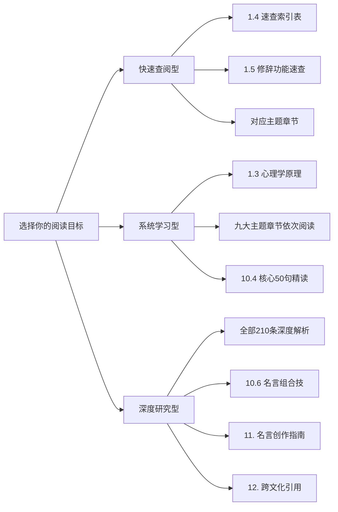
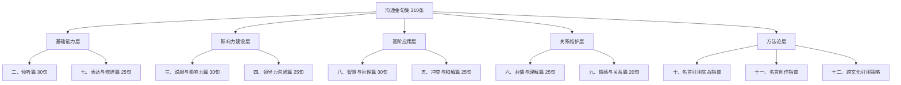
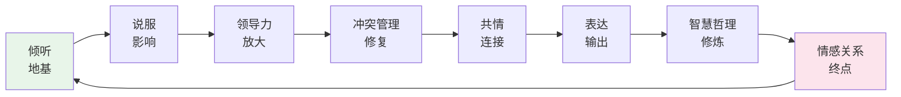

# 附录C：沟通金句与名言集

> 本附录收录210条沟通相关的经典名言、金句和格言，按九大主题分类编排。每句附权威出处、深层解析和具体应用场景，并提供引用方法论与实操框架，帮助读者在写作、演讲、教学、日常沟通中信手拈来、恰到好处。附录还包含名言运用的心理学原理、名言创作指南、名言组合技、跨文化引用策略等进阶内容，从"引用他人"到"创造自己的金句"，构建完整的名言运用能力体系。

### 知识体系总览

### 本附录数据概览

| 统计维度 | 数据 |
|---------|------|
| 名言总数 | 210条 |
| 主题分类 | 9大主题 |
| 出处文化 | 中国经典（约55%）、西方哲学（约30%）、其他文化（约15%） |
| 历史跨度 | 从公元前5世纪（孔子、苏格拉底时代）到当代 |
| 涵盖人物 | 80+位历史人物及文化传统 |
| 功能标签 | 8种修辞功能（激励鼓劲、警示提醒、安慰支持、权威背书、共识凝聚、反思启发、幽默破冰、情感共鸣） |
| 实战模板 | 10大高频场景话术模板 |
| 误引纠正 | 8条常见误引名言辨析 |

### 阅读路径建议

不同读者可以根据自己的需求选择不同的阅读路径：

---

## 一、本附录使用指南

### 1.1 名言的价值：为什么沟通需要经典智慧

名言不是装饰品，而是**经过时间筛选的认知压缩包**。一句千年前的话之所以流传至今，是因为它精准击中了人类沟通的某个永恒困境。在沟通中引用名言，有三个不可替代的作用：

| 作用 | 机制 | 举例 |
|------|------|------|
| **建立权威感** | 借用已验证的智慧为自己的观点背书 | 引用德鲁克的话讨论倾听，比"我觉得倾听很重要"更有说服力 |
| **触发共鸣** | 经典名言往往已被广泛传播，能快速拉近心理距离 | "己所不欲勿施于人"一出，听众立刻进入共同语境 |
| **压缩复杂观点** | 用一句话概括需要千字才能解释的道理 | "沟通最大的问题在于，人们以为它已经发生了"（萧伯纳） |

### 1.2 快速索引：按场景查找名言

下表帮助你在特定场景下快速找到合适的名言：

| 场景 | 推荐主题章节 | 核心名言编号 |
|------|-------------|-------------|
| 培训开场破冰 | 二、倾听篇 | #1, #2, #5 |
| 说服客户/领导 | 三、说服与影响力篇 | #34, #41, #53 |
| 团队动员讲话 | 四、领导力沟通篇 | #61, #62, #65 |
| 化解人际冲突 | 五、冲突与和解篇 | #88, #94, #99 |
| 安慰/支持他人 | 六、共情与理解篇 | #111, #114, #127 |
| 写作/文案润色 | 七、表达与修辞篇 | #137, #148, #154 |
| 演讲/授课升华 | 八、智慧与哲理篇 | #161, #165, #172 |
| 亲密关系沟通 | 九、情感与关系篇 | #192, #195, #196 |

### 1.3 名言运用的心理学原理：为什么引用名言有效

引用名言之所以在沟通中产生强大效果，背后有五个经过实证验证的心理学机制。理解这些机制，能让你从"凭感觉引用"升级为"有策略地引用"。

**机制一：权威效应（Authority Bias）**

心理学家米尔格拉姆的服从实验表明，人们会本能地赋予权威来源更高的可信度。当你引用德鲁克、孔子或爱因斯坦的话时，听众会将这些历史人物的权威性"转移"到你的论点上。这不是理性判断，而是认知捷径——大脑用"谁说的"来快速评估"说得对不对"。

> **实操要点**：在需要增强可信度的场景（商业提案、学术论证），优先引用该领域公认权威的名言。引用一个商业领袖谈管理，比引用一个诗人谈管理更有效。

**机制二：社会认同（Social Proof）**

西奥迪尼在《影响力》中指出，当人们不确定该怎么做时，会参考他人的行为。名言本质上是"浓缩的社会认同"——一句流传千年的话，意味着千万人已经认同了它。引用名言等于说："不只是我这么想，历史上无数聪明人都这么想。"

> **实操要点**：在推动团队接受新观点时，引用被广泛认可的名言能降低抵触心理。"大家都认同的老话"比"我的个人看法"更容易被接受。

**机制三：叙事传输（Narrative Transportation）**

心理学家发现，当人被一个故事"传输"进去时，批判性思维会暂时降低。名言虽然简短，但很多名言自带微型叙事——"桃花潭水深千尺"让人瞬间进入李白送别的场景，"退一步海阔天空"让人看到一个画面。这种"微叙事"能绕过理性防线，直达情感层面。

> **实操要点**：选择有画面感的名言比抽象的名言更有力。"滴水穿石"比"坚持很重要"更有感染力，因为它激活了视觉想象。

**机制四：认知流畅性（Cognitive Fluency）**

大脑偏爱容易处理的信息。经过千百年打磨的名言，往往节奏工整、朗朗上口（如"知行合一""和为贵"），处理起来毫不费力。这种"流畅性"会让大脑产生"这话说得对"的感觉——因为容易理解的信息会被误判为更可信的信息。

> **实操要点**：在需要被记住的场合（演讲结尾、培训总结），选择节奏感强、简短有力的名言。四字成语、对仗句式记忆效果最佳。

**机制五：情感共鸣（Emotional Resonance）**

神经科学研究发现，带有情感色彩的信息比纯信息的编码强度高6倍。名言之所以流传，往往不是因为逻辑严密，而是因为击中了人类共通的情感——孤独、希望、恐惧、爱。当名言触发听众的情感共鸣时，你的论点会被"情感加持"。

> **实操要点**：在需要打动人心的场合（慰问、激励、告白），选择有情感温度的名言。"陪伴是最长情的告白"比"关系需要维护"更有力量，因为它触及了人对陪伴的深层渴望。

**五个机制的协同运用**

在实际沟通中，这五个机制往往同时起作用。一句好的引用，既借用权威（机制一），又利用社会认同（机制二），还可能包含微叙事（机制三）、节奏流畅（机制四）、情感饱满（机制五）。理解这些机制后，你可以根据沟通目的选择侧重哪个机制：

| 沟通目的 | 侧重机制 | 推荐名言类型 |
|---------|---------|------------|
| 增强论点可信度 | 权威效应 | 行业领袖、经典著作 |
| 推动团队共识 | 社会认同 | 广泛流传的谚语、共识性表达 |
| 打破思维定式 | 反直觉类名言 | 悖论型（如萧伯纳#161） |
| 深度打动人心 | 情感共鸣 | 有画面感的诗句、个人化表达 |
| 快速建立连接 | 认知流畅性 | 简短成语、四字格言 |

### 1.4 全部210条名言速查索引

以下表格汇总全部210条名言的核心信息，方便快速定位。按主题分类，每条标注编号、核心内容（截取关键词）、出处和修辞功能标签。

| # | 关键词 | 出处 | 功能标签 |
|---|--------|------|---------|
| **二、倾听篇（#1-#30）** ||||
| 1 | 两耳一嘴，多听少说 | 第欧根尼 | 幽默破冰 |
| 2 | 倾听是最高的恭维 | 卡耐基 | 激励鼓劲 |
| 3 | 暂时放弃自己的参照系 | 卡尔·罗杰斯 | 反思启发 |
| 4 | 听而不闻等于没听 | 中国谚语 | 警示提醒 |
| 5 | 为了回应而倾听 | 柯维 | 反思启发 |
| 6 | 善于倾听，到处受欢迎 | 富兰克林 | 激励鼓劲 |
| 7 | 沉默有时是最好的回答 | 阿拉伯谚语 | 反思启发 |
| 8 | 用心去理解 | 约翰·鲍威尔 | 反思启发 |
| 9 | 好听众受欢迎且获得信息 | 威尔逊·米兹纳 | 激励鼓劲 |
| 10 | 想被理解，先去理解别人 | 柯维 | 共识凝聚 |
| 11 | 听到没有说出来的话 | 德鲁克 | 反思启发 |
| 12 | 偏听则暗，兼听则明 | 《资治通鉴》 | 警示提醒 |
| 13 | 忠言逆耳利于行 | 《史记》 | 警示提醒 |
| 14 | 千人诺诺不如一士谔谔 | 《史记》 | 警示提醒 |
| 15 | 善听赢得朋友 | 佚名 | 激励鼓劲 |
| 16 | 耳朵是通向心灵的路 | 伏尔泰 | 情感共鸣 |
| 17 | 一根舌头两只耳朵 | 辛尼加 | 幽默破冰 |
| 18 | 开口之前先用耳朵了解 | 中国谚语 | 警示提醒 |
| 19 | 智者善听，愚者善辩 | 中国谚语 | 反思启发 |
| 20 | 闻之不若知之 | 荀子 | 反思启发 |
| 21 | 三人行必有我师 | 孔子 | 共识凝聚 |
| 22 | 最好的沟通者最善于倾听 | 格拉德斯通 | 激励鼓劲 |
| 23 | 不急于表达，先让别人说完 | 中国谚语 | 警示提醒 |
| 24 | 听能学到新的 | 佚名 | 激励鼓劲 |
| 25 | 认真倾听是修养和智慧 | 佚名 | 反思启发 |
| 26 | 听懂沉默是智慧 | 佚名 | 反思启发 |
| 27 | 兼听则明，偏信则暗 | 魏征 | 权威背书 |
| 28 | 不傲才以骄人 | 诸葛亮 | 警示提醒 |
| 29 | 善听者人皆亲之 | 《韩诗外传》 | 激励鼓劲 |
| 30 | 最深的理解来自最耐心的倾听 | 佚名 | 反思启发 |
| **三、说服与影响力篇（#31-#60）** ||||
| 31 | 用耳朵说服 | 迪恩·拉斯克 | 反思启发 |
| 32 | 无法说服一个人他被说服了 | 马克·吐温 | 反思启发 |
| 33 | 讲道理不如讲故事 | 佚名 | 激励鼓劲 |
| 34 | 人们先知道你有多关心 | 西奥多·罗斯福 | 共识凝聚 |
| 35 | 让别人觉得是他自己的主意 | 卡耐基 | 反思启发 |
| 36 | 先说服自己 | 中国谚语 | 警示提醒 |
| 37 | 心甘情愿地做事 | 佚名 | 反思启发 |
| 38 | 事实胜于雄辩 | 中国谚语 | 权威背书 |
| 39 | 以理服人者心悦诚服 | 孟子 | 权威背书 |
| 40 | 晓之以理，动之以情 | 中国成语 | 反思启发 |
| 41 | 诉诸利益而非理性 | 富兰克林 | 反思启发 |
| 42 | 三寸之舌强于百万师 | 《史记》 | 激励鼓劲 |
| 43 | 巧言令色鲜矣仁 | 孔子 | 警示提醒 |
| 44 | 说服的艺术在于不说服 | 老子 | 反思启发 |
| 45 | 永远不忘你给他们的感受 | 玛雅·安吉洛 | 情感共鸣 |
| 46 | 关键在于你是谁 | 亚里士多德 | 权威背书 |
| 47 | 启发而非说服 | 佚名 | 反思启发 |
| 48 | 一言可以兴邦 | 《论语》 | 警示提醒 |
| 49 | 良言一句三冬暖 | 中国谚语 | 情感共鸣 |
| 50 | 言行一致一言九鼎 | 佚名 | 警示提醒 |
| 51 | 让对方自己说服自己 | 佚名 | 反思启发 |
| 52 | 找到他的按钮 | 佚名 | 反思启发 |
| 53 | 被自己发现的理由说服 | 帕斯卡 | 反思启发 |
| 54 | 讲故事的人统治世界 | 澳洲原住民谚语 | 激励鼓劲 |
| 55 | 简洁是智慧的灵魂 | 莎士比亚 | 反思启发 |
| 56 | 先让他们笑 | 佚名 | 幽默破冰 |
| 57 | 改变行为先改变信念 | 佚名 | 反思启发 |
| 58 | 重复是说服之母 | 戈培尔（反面教材） | 警示提醒 |
| 59 | 知己知彼百战不殆 | 孙子 | 权威背书 |
| 60 | 上兵伐谋 | 孙子 | 权威背书 |
| **四、领导力沟通篇（#61-#85）** ||||
| 61 | 领导者是希望商人 | 麦克斯韦尔 | 激励鼓劲 |
| 62 | 沟通能力决定领导力上限 | 麦克斯韦尔 | 激励鼓劲 |
| 63 | 管理做对事，领导做对的事 | 德鲁克 | 权威背书 |
| 64 | 让人做不想做的事 | 杜鲁门 | 激励鼓劲 |
| 65 | 领导力就是影响力 | 麦克斯韦尔 | 激励鼓劲 |
| 66 | 身先士卒是最好的语言 | 中国谚语 | 激励鼓劲 |
| 67 | 像镜子反映真相，像窗户展示世界 | 佚名 | 反思启发 |
| 68 | 没有不好的士兵 | 拿破仑 | 警示提醒 |
| 69 | 自己先行动起来 | 佚名 | 激励鼓劲 |
| 70 | 培养更多领导者 | 佚名 | 反思启发 |
| 71 | 沟通不是你说什么而是别人听到什么 | 杰克·韦尔奇 | 反思启发 |
| 72 | 人心齐泰山移 | 中国谚语 | 共识凝聚 |
| 73 | 求之于势不责于人 | 孙子 | 权威背书 |
| 74 | 令之以文齐之以武 | 孙子 | 权威背书 |
| 75 | 上善若水 | 老子 | 反思启发 |
| 76 | 己所不欲勿施于人 | 孔子 | 共识凝聚 |
| 77 | 以身作则非唯一方法 | 爱因斯坦 | 权威背书 |
| 78 | 太上不知有之 | 老子 | 反思启发 |
| 79 | 知人者智自知者明 | 老子 | 反思启发 |
| 80 | 道之以德齐之以礼 | 孔子 | 权威背书 |
| 81 | 让别人把心里话说出来 | 德鲁克 | 反思启发 |
| 82 | 赏罚分明是最有力的沟通 | 佚名 | 警示提醒 |
| 83 | 领导者的嘴团队的耳朵 | 佚名 | 警示提醒 |
| 84 | 卓越的领导者传播愿景 | 佚名 | 激励鼓劲 |
| 85 | 让别人感到自己很重要 | 佚名 | 情感共鸣 |
| **五、冲突与和解篇（#86-#110）** ||||
| 86 | 我们不是敌人只是意见不同 | 佚名 | 共识凝聚 |
| 87 | 和气生财 | 中国谚语 | 激励鼓劲 |
| 88 | 赢了争论输了关系 | 佚名 | 警示提醒 |
| 89 | 退一步海阔天空 | 中国谚语 | 安慰支持 |
| 90 | 最大的胜利是不战而胜 | 孙子 | 权威背书 |
| 91 | 跌倒了站起来 | 曼德拉 | 激励鼓劲 |
| 92 | 冤家宜解不宜结 | 中国谚语 | 安慰支持 |
| 93 | 君子和而不同 | 孔子 | 共识凝聚 |
| 94 | 以直报怨以德报德 | 孔子 | 反思启发 |
| 95 | 冤冤相报何时了 | 中国谚语 | 警示提醒 |
| 96 | 化干戈为玉帛 | 中国成语 | 激励鼓劲 |
| 97 | 以牙还牙全世界都瞎 | 甘地 | 反思启发 |
| 98 | 愤怒以愚蠢开始以后悔告终 | 毕达哥拉斯 | 警示提醒 |
| 99 | 柔弱胜刚强 | 老子 | 反思启发 |
| 100 | 对事不对人 | 中国谚语 | 共识凝聚 |
| 101 | 换位思考是钥匙 | 佚名 | 反思启发 |
| 102 | 敌意只能滋生更多敌意 | 马丁·路德·金 | 反思启发 |
| 103 | 战争中没有赢家 | 佚名 | 警示提醒 |
| 104 | 和平是有能力处理冲突 | 佚名 | 反思启发 |
| 105 | 以直报怨（完整版） | 孔子 | 权威背书 |
| 106 | 有理走遍天下 | 中国谚语 | 激励鼓劲 |
| 107 | 和为贵 | 孔子 | 共识凝聚 |
| 108 | 害怕时仍前行 | 曼德拉 | 激励鼓劲 |
| 109 | 理解是宽恕的第一步 | 佚名 | 安慰支持 |
| 110 | 化敌为友上策 | 中国谚语 | 激励鼓劲 |
| **六、共情与理解篇（#111-#135）** ||||
| 111 | 己所不欲勿施于人 | 孔子 | 共识凝聚 |
| 112 | 站在我的鞋子里走一英里 | 美国原住民谚语 | 反思启发 |
| 113 | 理解一切就是宽恕一切 | 法国谚语 | 安慰支持 |
| 114 | 从他的角度去看问题 | 哈珀·李 | 反思启发 |
| 115 | 走进别人的鞋子 | 佚名 | 反思启发 |
| 116 | 人同此心心同此理 | 中国谚语 | 共识凝聚 |
| 117 | 推己及人 | 中国成语 | 共识凝聚 |
| 118 | 同理心不是同意而是理解 | 佚名 | 反思启发 |
| 119 | 感同身受是最高的共情 | 佚名 | 情感共鸣 |
| 120 | 人之初性本善 | 《三字经》 | 共识凝聚 |
| 121 | 爱的反面是漠不关心 | 特蕾莎修女 | 警示提醒 |
| 122 | 倾听痛苦本身就是治疗 | 佚名 | 安慰支持 |
| 123 | 人心都是肉长的 | 中国谚语 | 共识凝聚 |
| 124 | 知我者谓我心忧 | 《诗经》 | 情感共鸣 |
| 125 | 先处理心情再处理事情 | 佚名 | 反思启发 |
| 126 | 理解是爱的另一个名字 | 佚名 | 情感共鸣 |
| 127 | 最美的语言是关心 | 佚名 | 安慰支持 |
| 128 | 感人心者莫先乎情 | 白居易 | 情感共鸣 |
| 129 | 相知贵在知心 | 孟子 | 反思启发 |
| 130 | 将心比心 | 中国成语 | 共识凝聚 |
| 131 | 在别人的故事里找到自己的影子 | 佚名 | 情感共鸣 |
| 132 | 真正的理解需要时间 | 佚名 | 反思启发 |
| 133 | 不必经历我的经历才能理解 | 佚名 | 安慰支持 |
| 134 | 最远的距离是你不知道我爱你 | 张小娴 | 情感共鸣 |
| 135 | 莫愁前路无知己 | 高适 | 安慰支持 |
| **七、表达与修辞篇（#136-#160）** ||||
| 136 | 语言是思想的衣裳 | 塞缪尔·约翰逊 | 反思启发 |
| 137 | 言之无文行而不远 | 《左传》 | 警示提醒 |
| 138 | 一言既出驷马难追 | 中国谚语 | 警示提醒 |
| 139 | 三思而后言 | 中国谚语 | 警示提醒 |
| 140 | 言多必失 | 中国谚语 | 警示提醒 |
| 141 | 话不投机半句多 | 中国谚语 | 反思启发 |
| 142 | 一句话可以说人笑可以说人跳 | 中国谚语 | 反思启发 |
| 143 | 口乃心之门户 | 鬼谷子 | 反思启发 |
| 144 | 言为心声 | 扬雄 | 反思启发 |
| 145 | 好汉出在嘴上 | 中国谚语 | 激励鼓劲 |
| 146 | 文以载道 | 韩愈 | 反思启发 |
| 147 | 辞达而已矣 | 孔子 | 反思启发 |
| 148 | 话不在多达意则灵 | 中国谚语 | 反思启发 |
| 149 | 君子敏于行而讷于言 | 孔子 | 反思启发 |
| 150 | 天下大事必作于细 | 老子 | 反思启发 |
| 151 | 有理不在声高 | 中国谚语 | 反思启发 |
| 152 | 苦口婆心 | 中国成语 | 安慰支持 |
| 153 | 一语中的 | 中国成语 | 激励鼓劲 |
| 154 | 说者无心听者有意 | 中国谚语 | 警示提醒 |
| 155 | 话是开心的钥匙 | 中国谚语 | 安慰支持 |
| 156 | 妙语连珠/出口成章/字字珠玑 | 中国成语 | 激励鼓劲 |
| 157 | 言之有物 | 中国成语 | 警示提醒 |
| 158 | 语言是最重要的交际工具 | 列宁 | 权威背书 |
| 159 | 语言的界限就是世界的界限 | 维特根斯坦 | 反思启发 |
| 160 | 大辩若讷 | 老子 | 反思启发 |
| **八、智慧与哲理篇（#161-#190）** ||||
| 161 | 沟通最大的问题：以为已发生 | 萧伯纳 | 反思启发 |
| 162 | 知行合一 | 王阳明 | 反思启发 |
| 163 | 授人以鱼不如授人以渔 | 中国谚语 | 反思启发 |
| 164 | 纸上得来终觉浅 | 陆游 | 反思启发 |
| 165 | 温故而知新 | 孔子 | 反思启发 |
| 166 | 学而不思则罔 | 孔子 | 反思启发 |
| 167 | 知之为知之 | 孔子 | 反思启发 |
| 168 | 不愤不启不悱不发 | 孔子 | 反思启发 |
| 169 | 海纳百川有容乃大 | 林则徐 | 共识凝聚 |
| 170 | 他山之石可以攻玉 | 《诗经》 | 反思启发 |
| 171 | 博学审问慎思明辨笃行 | 《中庸》 | 反思启发 |
| 172 | 路遥知马力日久见人心 | 中国谚语 | 反思启发 |
| 173 | 千里之行始于足下 | 老子 | 激励鼓劲 |
| 174 | 冰冻三尺非一日之寒 | 中国谚语 | 警示提醒 |
| 175 | 滴水穿石 | 中国谚语 | 激励鼓劲 |
| 176 | 君子之交淡如水 | 《庄子》 | 反思启发 |
| 177 | 物以类聚人以群分 | 中国谚语 | 反思启发 |
| 178 | 投桃报李 | 《诗经》 | 共识凝聚 |
| 179 | 见贤思齐见不贤内省 | 孔子 | 反思启发 |
| 180 | 不积跬步无以至千里 | 荀子 | 激励鼓劲 |
| 181 | 满招损谦受益 | 《尚书》 | 警示提醒 |
| 182 | 过犹不及 | 孔子 | 反思启发 |
| 183 | 静以修身俭以养德 | 诸葛亮 | 反思启发 |
| 184 | 言善信 | 老子 | 反思启发 |
| 185 | 水至清则无鱼 | 《汉书》 | 反思启发 |
| 186 | 大智若愚大巧若拙 | 老子 | 反思启发 |
| 187 | 君子藏器于身待时而动 | 《周易》 | 反思启发 |
| 188 | 独学无友则孤陋寡闻 | 《礼记》 | 反思启发 |
| 189 | 凡事预则立 | 《礼记》 | 警示提醒 |
| 190 | 世上本没有路 | 鲁迅 | 激励鼓劲 |
| **九、情感与关系篇（#191-#210）** ||||
| 191 | 爱的最好证明是信任 | 佚名 | 情感共鸣 |
| 192 | 最重要的是沟通不是完美 | 佚名 | 安慰支持 |
| 193 | 家和万事兴 | 中国谚语 | 共识凝聚 |
| 194 | 共同看向同一个方向 | 圣埃克苏佩里 | 情感共鸣 |
| 195 | 陪伴是最长情的告白 | 佚名 | 情感共鸣 |
| 196 | 距离产生美 | 中国谚语 | 反思启发 |
| 197 | 海内存知己天涯若比邻 | 王勃 | 安慰支持 |
| 198 | 朋友是另一个自己 | 亚里士多德 | 情感共鸣 |
| 199 | 人生得一知己足矣 | 鲁迅 | 情感共鸣 |
| 200 | 爱之深责之切 | 中国谚语 | 反思启发 |
| 201 | 相知无远近万里尚为邻 | 张九龄 | 安慰支持 |
| 202 | 结交在相知骨肉何必亲 | 曹植 | 反思启发 |
| 203 | 同声相应同气相求 | 《周易》 | 共识凝聚 |
| 204 | 桃花潭水深千尺 | 李白 | 情感共鸣 |
| 205 | 有朋自远方来不亦乐乎 | 孔子 | 情感共鸣 |
| 206 | 路遥知马力日久见人心 | 中国谚语 | 反思启发 |
| 207 | 以诚相待 | 中国成语 | 共识凝聚 |
| 208 | 将心比心以心换心 | 中国谚语 | 情感共鸣 |
| 209 | 最远的距离你不知道我爱你 | 张小娴 | 情感共鸣 |
| 210 | 真正的亲密是做真实的自己 | 佚名 | 反思启发 |

### 1.5 修辞功能速查

| 修辞功能 | 定义 | 推荐名言 | 适用场景 |
|---------|------|---------|---------|
| **激励鼓劲** | 激发行动力和信心 | #61（希望商人）、#91（跌倒站起来）、#173（千里之行） | 团队动员、项目启动、困难时期 |
| **警示提醒** | 指出风险和误区 | #13（忠言逆耳）、#98（愤怒愚蠢）、#140（言多必失） | 风险预警、安全培训、合规教育 |
| **安慰支持** | 提供情感慰藉 | #122（倾听痛苦）、#195（陪伴告白）、#135（莫愁前路） | 丧亲慰问、失恋陪伴、挫折鼓励 |
| **权威背书** | 借用权威增强可信度 | #46（亚里士多德）、#11（德鲁克）、#59（孙子兵法） | 商业提案、学术论证、政策建议 |
| **共识凝聚** | 建立共同认知基础 | #116（人同此心）、#76（己所不欲）、#93（和而不同） | 团队建设、跨部门协作、社区营造 |
| **反思启发** | 引发深度思考 | #161（萧伯纳）、#5（柯维）、#162（知行合一） | 培训结尾、年度总结、个人成长 |
| **幽默破冰** | 缓解紧张气氛 | #1（两耳一嘴）、#6（富兰克林）、#56（笑后思考） | 会议开场、社交聚会、演讲热场 |
| **情感共鸣** | 触发深层情感连接 | #204（桃花潭水）、#124（知我者）、#199（人生知己） | 告白、致谢、毕业致辞、婚礼祝词 |

### 1.6 引用方法论：五步引用法

引用名言不是随便甩一句出来就完事。有效的引用需要遵循五步法：

**第一步：选准语境**。明确你当前的沟通目的是什么——说服、安慰、警示、激励？然后从对应主题章节中选择。

**第二步：核实出处**。本附录已标注出处，但在正式场合使用前，建议通过原始文献二次确认。尤其注意"佚名"类名言，可能是后人附会。

**第三步：自然嵌入**。不要突兀地抛出名言，要用过渡句引导。模板：

- "正如XX所说，'……'"
- "有一句老话说得好，'……'"
- "XX曾经说过一句话让我印象深刻，'……'"

**第四步：阐释落地**。引用后必须用自己的话解释为什么这句话在这里适用，以及它与你正在讨论的具体问题有什么关系。这是大多数人忽略的关键步骤。

**第五步：控制密度**。一次沟通中，名言引用不超过2-3句。过多引用会让听众觉得你在掉书袋，反而削弱说服力。

### 1.7 常见引用误区

| 误区 | 问题 | 正确做法 |
|------|------|---------|
| 张冠李戴 | 把A的名言安在B头上（如把很多话归于鲁迅） | 引用前核实原始出处 |
| 断章取义 | 只截取半句，改变了原意 | 引用完整句子，了解上下文 |
| 过度堆砌 | 一段话里塞3句以上名言 | 一次沟通最多2-3句 |
| 脱离语境 | 名言与当前讨论内容没有直接关联 | 选择与主题高度契合的名言 |
| 中西混搭失当 | 在传统语境中突然插入西方名人名言 | 注意场合和听众的文化背景 |

---

## 二、倾听篇（30句）

> 倾听是沟通的地基。没有倾听，一切表达都是自说自话。

### 2.1 核心理念：倾听为什么是一切沟通的起点

沟通研究者约翰·鲍威尔（John Powell）指出，人类沟通中约60%的时间用于倾听，但真正有效倾听的效率不到25%。这意味着大多数人虽然在"听"，但并没有在"理解"。以下名言从不同角度揭示了倾听的本质。

### 2.2 经典名言

**1.** **"我们有两只耳朵一张嘴，就是要多听少说。"**
——第欧根尼（古希腊哲学家，约公元前412-323年）

*深层解析*：第欧根尼是犬儒学派的代表人物，以言行犀利著称。这句话用身体比例做类比，将倾听提升到自然法则的高度——不是建议，而是造物的暗示。在古希腊哲学中，"认识自己"是核心命题，而倾听正是认识他人、反观自我的起点。

*应用场景*：培训开场破冰、强调倾听重要性、新团队组建时的沟通文化建立。

---

**2.** **"倾听是最高的恭维。"**
——戴尔·卡耐基《人性的弱点》

*深层解析*：卡耐基在书中通过大量案例说明，人最深层的需求之一是"被重视感"。而倾听恰好满足了这个需求——当你全神贯注听一个人说话时，你传递的信号是"你比任何事都重要"。这比任何恭维话都更有力量。

*应用场景*：客户关系维护、社交技巧培训、领导力课程中强调倾听的"社交投资"属性。

---

**3.** **"真正的倾听，是暂时放弃自己的参照系。"**
——卡尔·罗杰斯（人本主义心理学家）

*深层解析*：罗杰斯是"以来访者为中心"心理治疗的创始人。他认为，真正的倾听不是用自己已有的认知框架去"翻译"对方的话，而是暂时悬置自己的判断，进入对方的世界。这需要极大的心理勇气——承认自己的视角不是唯一的视角。

*应用场景*：心理咨询培训、深度沟通工作坊、跨文化沟通课程。

---

**4.** **"听而不闻等于没听。"**
——中国谚语

*深层解析*：这句谚语精准区分了"听见"和"听懂"两个层次。物理层面的声波接收不等于心理层面的信息处理。在信息过载的时代，这个区分更加重要——我们每天"听见"无数声音，但真正"听进去"的寥寥无几。

*应用场景*：批评表面倾听行为、强调有效倾听的定义、沟通培训中区分被动听和主动听。

---

**5.** **"大多数人不是为了理解而倾听，而是为了回应而倾听。"**
——史蒂芬·柯维《高效能人士的七个习惯》（习惯五：知彼解己）

*深层解析*：柯维发现了一个惊人的事实：大多数人在"倾听"时，大脑实际上在做两件事——要么准备反驳的论据，要么组织自己接下来要说的话。这种"自传式倾听"是沟通失败的首要原因。真正的倾听是"移情聆听"，目标是理解而非回应。

*应用场景*：领导力课程、沟通技能培训、团队冲突调解、销售培训中强调"先理解客户再推销"。

---

**6.** **"善于倾听的人，到哪里都受欢迎。"**
——本杰明·富兰克林

*深层解析*：富兰克林本人就是社交大师。他在自传中回忆，年轻时曾因说话太直接而得罪人，后来刻意练习倾听，社交关系大幅改善。这句话背后是他亲身验证的社交原理：在一个每个人都想表达的世界里，倾听者是稀缺品。

*应用场景*：社交技巧培训、新人融入团队、商务社交场合。

---

**7.** **"沉默有时是最好的回答。"**
——阿拉伯谚语

*深层解析*：在阿拉伯文化中，沉默被视为智慧的标志。这句谚语提醒我们，沟通不等于说话。在对方情绪激动时、在信息不完整时、在需要给对方思考空间时，沉默比任何言语都更有力量。沉默不是无话可说，而是选择不说。

*应用场景*：冲突管理中保持克制、谈判中的沉默策略、安慰他人时的陪伴。

---

**8.** **"倾听不是等待对方说完，而是用心去理解。"**
——约翰·鲍威尔《为什么我不敢告诉你我是谁》

*深层解析*：鲍威尔区分了"被动等待"和"主动理解"。很多人在对话中的"倾听"实际上只是礼貌地等待发言机会，而非真正试图理解对方的意思、情感和需求。真正的倾听需要认知参与、情感投入和注意力聚焦。

*应用场景*：区分真正的倾听和被动的等待、亲密关系中的沟通改善。

---

**9.** **"一个好听众不仅到处受欢迎，而且能迅速获得信息。"**
——威尔逊·米兹纳（美国剧作家）

*深层解析*：这句话揭示了倾听的双重收益——社交价值和信息价值。在商业环境中，善于倾听的管理者往往能比滔滔不绝的管理者更快掌握真实情况。因为人们更愿意向一个"听进去话"的人吐露真言。

*应用场景*：管理培训、情报收集场景、建立信息优势。

---

**10.** **"如果你想被理解，先去理解别人。"**
——史蒂芬·柯维《高效能人士的七个习惯》

*深层解析*：这是"情感账户"概念的延伸。柯维认为，理解他人就像往情感账户中存款——当你需要被理解时，账户里才有余额可以提取。大多数人的沟通问题是"透支"：自己从未存入理解，却总想提取别人的理解。

*应用场景*：强调倾听的互惠性、亲子沟通、团队建设。

---

**11.** **"沟通中最重要的事，是听到对方没有说出来的话。"**
——彼得·德鲁克

*深层解析*：德鲁克是管理学之父，他观察到组织沟通中最致命的不是信息传达错误，而是**信息被有意隐藏**。员工不说话的原因往往是：不信任、害怕后果、觉得说了也没用。一个优秀的管理者需要从沉默中读出信号。

*应用场景*：深度倾听和洞察力培训、管理层沟通、组织诊断。

---

**12.** **"偏听则暗，兼听则明。"**
——《资治通鉴》（司马光），亦见魏征谏言

*深层解析*：唐太宗问魏征："人主何为而明，何为而暗？"魏征答："兼听则明，偏信则暗。"这不是简单的"多听建议"，而是一个关于**信息源多样性**的深刻洞见——单一信息源必然带来偏见，只有交叉验证多个信源才能接近真相。现代信息时代，这个原则比任何时候都更重要。

*应用场景*：领导决策时应广泛听取意见、避免信息茧房、强调信息源多元化。

---

**13.** **"忠言逆耳利于行，良药苦口利于病。"**
——《史记·留侯世家》

*深层解析*：这句话揭示了倾听的一个核心困境：**最有价值的信息往往是最难接受的信息**。人的心理防御机制会本能地排斥批评和负面反馈，但正是这些"逆耳忠言"才能帮助我们发现盲区。克服这个本能，是倾听能力的最高阶修炼。

*应用场景*：鼓励人们倾听不同意见、接受批评反馈、建立开放的组织文化。

---

**14.** **"千人之诺诺，不如一士之谔谔。"**
——《史记·商君列传》

*深层解析*：商鞅变法前征求各方意见，有人进言说"一千个唯唯诺诺的人，不如一个敢直言的人"。这句话的价值在于揭示了"沉默的螺旋"现象——当组织中只有一种声音时，往往不是因为大家都同意，而是反对者选择了沉默。领导者必须主动创造让反对声音发出的空间。

*应用场景*：鼓励听取不同声音、防止群体思维、建立健康的辩论文化。

---

**15.** **"善言，能赢得听众；善听，才能赢得朋友。"**
——佚名

*深层解析*：这句话精准对比了"说"和"听"的不同功能。"说"是单向输出，能吸引注意力；"听"是双向连接，能建立关系。在社交中，很多人误以为"会说话"是关键，实际上"会听话"才是建立深度关系的密码。

*应用场景*：对比说与听的效果、社交培训、关系建设。

---

**16.** **"耳朵是通向心灵的路。"**
——伏尔泰

*深层解析*：伏尔泰是启蒙运动的核心人物，他用诗意的语言表达了倾听的心理学本质。心理学研究证实，当一个人感到被倾听时，大脑会释放催产素（信任荷尔蒙），降低防御机制。倾听不仅是接收信息，更是打开心门的钥匙。

*应用场景*：说明倾听能打开他人心扉、亲密关系修复、心理咨询。

---

**17.** **"自然界赋予人类一根舌头、两只耳朵，就是要人多听少说。"**
——辛尼加（古罗马斯多葛哲学家，约公元前4年-公元65年）

*深层解析*：与第欧根尼的名言（#1）异曲同工，但辛尼加更进一步——他不仅用身体比例做类比，还暗示了一个进化论观点：人类进化出更强的听觉能力而非语言能力，说明**在生存竞争中，获取信息比表达信息更重要**。

*应用场景*：用自然比例说明倾听的重要性、进化心理学视角的沟通培训。

---

**18.** **"在开口之前，先用耳朵去了解。"**
——中国谚语

*深层解析*：这句谚语提供了一个简单而强大的行为准则——**先听后说**。在实际沟通中，大多数人犯的错误是"信息不完整时就开始表达观点"。这条谚语提醒我们，收集信息（听）应该先于输出判断（说）。

*应用场景*：教导先听后说的习惯、新员工入职培训、调查访谈技巧。

---

**19.** **"智者善听，愚者善辩。"**
——中国谚语

*深层解析*：这句话将倾听能力与智慧等级直接挂钩。在认知心理学中，善于倾听的人往往具备更强的"元认知"能力——他们知道自己不知道什么，所以需要通过倾听来补充信息。而好辩的人往往陷入"达克效应"，以为自己已经知道一切。

*应用场景*：对比智者与愚者的沟通方式、培养谦逊的沟通态度。

---

**20.** **"不闻不若闻之，闻之不若见之，见之不若知之，知之不若行之。"**
——荀子《儒效》

*深层解析*：荀子提出了认知的五个层次：未听说 → 听说了 → 看见了 → 理解了 → 实践了。这个递进模型可以应用到沟通领域：仅仅"听到"对方说的话是最低层次，真正的倾听应该达到"知之"（理解深层含义）甚至"行之"（根据理解采取行动）。

*应用场景*：说明认知的不同层次、从听到行的递进、学习型组织建设。

---

**21.** **"三人行，必有我师焉。"**
——孔子《论语·述而》

*深层解析*：这句话的潜台词是：**每个人都有值得你学习的东西**。如果你真心相信这一点，倾听就不再是"给予对方恩惠"，而是"为自己获取养分"。这种心态转变能从根本上改变一个人的倾听态度。

*应用场景*：鼓励谦虚倾听他人、终身学习心态、跨层级沟通。

---

**22.** **"最好的沟通者是那些最善于倾听的人。"**
——威廉·尤尔特·格拉德斯通（英国首相，1809-1898）

*深层解析*：格拉德斯通是维多利亚时代最伟大的演说家之一，但他认为自己最大的沟通资产不是口才，而是倾听能力。作为首相，他需要听取内阁、议会、民众的多方声音，然后做出决策。这句话是他从政治实践中提炼的结论。

*应用场景*：总结倾听与沟通的关系、领导力中的倾听。

---

**23.** **"真正有智慧的人，不会急于表达自己，而是先让别人说完。"**
——中国谚语

*深层解析*：这句话指出了一个行为信号——**打断别人说话往往是缺乏安全感的表现**。真正自信和有智慧的人不需要通过抢先发言来证明自己。他们知道，耐心听完别人的话，不仅能获得更多信息，还能赢得尊重。

*应用场景*：培养耐心倾听的习惯、会议沟通规范、社交礼仪培训。

---

**24.** **"听比说更重要，因为说只能重复你已知的，听能让你学到新的。"**
——佚名

*深层解析*：从信息论的角度，"说"是零和操作（不增加新信息），而"听"是增量操作（获取新信息）。如果沟通的目的是交换信息和增进理解，那么倾听在逻辑上就比表达更有价值。这个论点与进化心理学中"信息获取优先于信息表达"的发现一致。

*应用场景*：强调倾听的学习价值、知识工作者的沟通培训。

---

**25.** **"认真倾听是一种修养，更是一种智慧。"**
——佚名

*深层解析*：这句话将倾听定位在两个层面：修养（品德维度）和智慧（认知维度）。从修养角度看，认真倾听体现了对他人的尊重和谦逊；从智慧角度看，认真倾听是获取信息、做出判断的基础。两者合一，倾听就成为综合素质的体现。

*应用场景*：提升倾听意识、领导力素养培训。

---

**26.** **"能听懂别人的话，是一种能力；能听懂别人的沉默，是一种智慧。"**
——佚名

*深层解析*：这句话揭示了倾听的三个层次——第一层：听到声音（物理层面）；第二层：听懂语言（认知层面）；第三层：听懂沉默（情感/直觉层面）。最高的倾听能力是能从对方的沉默、犹豫、回避中读出真实信息。

*应用场景*：强调倾听的深度层次、高级沟通技巧培训、心理咨询。

---

**27.** **"兼听则明，偏信则暗。"**
——魏征谏唐太宗（《资治通鉴》）

*深层解析*：与#12相同出处，此处侧重其决策科学的含义。现代管理学中的"多元信息源理论"与这个古老智慧高度一致——决策质量取决于信息来源的多样性和可靠性。单一信源，无论多么权威，都无法避免系统性偏差。

*应用场景*：领导决策、团队信息汇总、避免"回音室效应"。

---

**28.** **"不傲才以骄人，不以宠而作威。"**
——诸葛亮《诫子书》

*深层解析*：诸葛亮告诫儿子不要因为才华或权势而骄傲自大。这句话的沟通含义是：**地位越高的人，越需要倾听的能力**。因为权力会扭曲信息流——下属倾向于报喜不报忧，只有主动、谦逊地倾听，才能打破这种信息屏障。

*应用场景*：说明谦虚倾听的态度、高管沟通培训、权力与沟通的关系。

---

**29.** **"善听者，人皆亲之；善言者，人皆悦之。"**
——《韩诗外传》

*深层解析*：这句话对比了"善听"和"善言"的不同效果——倾听带来亲近（深度关系），表达带来愉悦（表面好感）。在建立信任关系的场景中，倾听比表达更有效；在影响他人态度的场景中，表达更重要。两者互补，不可偏废。

*应用场景*：全面理解倾听和表达的各自价值、沟通能力模型构建。

---

**30.** **"最深的理解来自于最耐心的倾听。"**
——佚名

*深层解析*：这句话强调了倾听的时间维度。真正的理解不是一蹴而就的，它需要持续的、反复的、耐心的倾听。很多人在沟通中急于求解，听了几句就开始给建议，实际上错过了建立深层理解的机会。

*应用场景*：深度沟通技巧、长期关系建设、咨询师培训。

---

### 2.3 倾听篇核心洞察

| 维度 | 关键发现 |
|------|---------|
| **核心命题** | 倾听不是被动接收，而是主动理解——需要暂时悬置自我参照系（罗杰斯#3） |
| **层次模型** | 物理听见→认知听懂→情感听懂沉默（#4, #8, #26 三层递进） |
| **最大误区** | 大多数人"为了回应而倾听"而非"为了理解而倾听"（柯维#5） |
| **实践启示** | 倾听能力与智慧等级直接挂钩（#19），是建立深度关系的密码（#15, #29） |
| **东西方共识** | 从第欧根尼到荀子，从孔子到德鲁克，古今中外一致强调倾听优先于表达 |

## 三、说服与影响力篇（30句）

> 说服不是强迫对方接受你的观点，而是引导对方自己得出你希望的结论。

### 3.1 核心理念：说服的底层逻辑

说服的本质是**改变他人的认知、态度或行为**。心理学家罗伯特·西奥迪尼在《影响力》中总结了六大说服原则：互惠、承诺一致、社会认同、喜好、权威、稀缺。以下名言从不同角度揭示了这些原则。

### 3.2 经典名言

**31.** **"说服别人最好的方法之一，是用你的耳朵——去倾听。"**
——迪恩·拉斯克（广告之父）

*深层解析*：拉斯克是20世纪最伟大的广告人之一。他发现，了解客户需求最有效的方式不是问卷调查或焦点小组，而是一对一的倾听。当你真正听懂了对方的需求和痛点，说服就变成了一件自然而然的事——因为你提供的解决方案恰好对准了对方的"痛点"。

*应用场景*：销售培训、客户沟通、商业谈判的准备阶段。

---

**32.** **"你无法说服一个人他被说服了。"**
——马克·吐温

*深层解析*：这句看似悖论的话揭示了说服的深层机制——**真正的说服必须让对方觉得改变主意是自己的选择**。如果对方感到是被"说服"的，他的自尊心会驱使他重新站到对立面。所以最好的说服是"润物细无声"，让对方自己"想通"。

*应用场景*：高级说服技巧培训、领导力中的"引导"而非"命令"。

---

**33.** **"讲道理不如讲故事，讲故事不如讲自己。"**
——佚名

*深层解析*：这句话揭示了说服力的三个层次。纯逻辑论证（讲道理）激活大脑的理性区域，但人是感性决策的动物；故事（讲故事）能同时激活理性和情感区域，说服力更强；个人经历（讲自己）因为真实性和唯一性，说服力最强。这也是为什么TED演讲者总是从个人故事开始。

*应用场景*：演讲技巧、销售话术设计、品牌故事构建。

---

**34.** **"人们不关心你知道多少，直到他们知道你有多关心。"**
——西奥多·罗斯福（美国第26任总统）

*深层解析*：这句话是"先情感后逻辑"原则的经典表述。心理学研究表明，人在判断是否信任一个信息源时，首先评估的是对方的"温暖度"（是否关心我），其次才是"能力"（是否专业）。一个被认为不关心你的人，即使说得再有道理，也很难说服你。

*应用场景*：销售中的关系建立、领导力中的情感连接、客户服务。

---

**35.** **"让别人觉得那是他自己的主意。"**
——戴尔·卡耐基《人性的弱点》

*深层解析*：这是卡耐基说服哲学的核心。与直接告诉对方"你应该这样做"不同，通过提问、暗示、引导，让对方自己得出结论，说服效果要强得多。因为人们对自己"发现"的观点有更强的认同感和执行力。这在心理学上被称为"宜家效应"——自己组装的家具会觉得更有价值。

*应用场景*：高级说服技巧——引导而非灌输、教练式领导、销售谈判。

---

**36.** **"要想说服别人，先要说服自己。"**
——中国谚语

*深层解析*：这句话包含两层含义：第一，如果你自己都不相信自己说的话，听众一定能感知到你的不真诚；第二，说服自己意味着你已经完成了对这个观点的全部质疑和验证，你的论证会更加坚不可摧。说服力的第一个来源是信念的真实性。

*应用场景*：说服前的自我确信、销售前的产品体验、演讲前的信念检查。

---

**37.** **"影响力就是让别人心甘情愿地做你想让他做的事。"**
——佚名

*深层解析*：这个定义的关键词是"心甘情愿"。与强制（用权力迫使）、操纵（用欺骗引导）不同，影响力是通过正面的方式让对方自愿配合。西奥迪尼的研究表明，基于互惠和承诺的影响力最持久，基于欺骗的影响力一旦被识破，反噬效果极强。

*应用场景*：定义影响力的核心、区分影响力与权力/操纵。

---

**38.** **"事实胜于雄辩。"**
——中国谚语

*深层解析*：这句话强调了证据在说服中的基础地位。再好的修辞，如果没有事实支撑，都是空中楼阁。在信息透明的时代，任何观点都会被快速验证，纯靠"嘴皮子"的说服越来越难以为继。数据、案例、第三方证明是说服力的硬核支撑。

*应用场景*：用事实和数据说服他人、商业提案、学术论证。

---

**39.** **"以理服人者，人心悦而诚服也。"**
——孟子

*深层解析*：孟子区分了三种说服方式——以力服人（畏惧而服从）、以德服人（感化而服从）、以理服人（理解而服从）。以理服人之所以能让"人心悦诚服"，是因为它尊重了对方的理性能力，让对方通过自己的判断力得出结论，这种服从最持久、最稳定。

*应用场景*：强调以理服人的重要性、理性沟通的文化建设。

---

**40.** **"晓之以理，动之以情。"**
——中国成语

*深层解析*：这是说服的双通道模型。"晓之以理"对应认知通道（逻辑、数据、证据），"动之以情"对应情感通道（故事、共鸣、愿景）。神经科学研究表明，纯粹的逻辑说服激活前额叶皮层（理性决策区），但加入情感元素后，杏仁核（情感决策区）也被激活，决策更容易做出。最有效的说服是两条通道同时打开。

*应用场景*：说明说服需要理性和感性结合、演讲结构设计、广告文案。

---

**41.** **"如果你想说服别人，要诉诸利益，而非诉诸理性。"**
——本杰明·富兰克林

*深层解析*：富兰克林这句话不是说不要讲道理，而是说**道理要包装成利益**。人们关心的不是"这个方案在逻辑上多么完美"，而是"这个方案对我有什么好处"。在商业沟通中，永远要把你的方案翻译成客户的收益。

*应用场景*：商业谈判中的说服策略、提案写作、产品营销。

---

**42.** **"三寸之舌，强于百万之师。"**
——《史记·平原君虞卿列传》

*深层解析*：这句话出自毛遂自荐的典故。毛遂凭借口才说服楚王合纵抗秦，避免了一场战争。它揭示了语言的巨大力量——在特定情境下，一句精准的话可以改变历史走向。但前提是：说话者必须有洞察力（知道对方的痛点）和勇气（敢于直面问题）。

*应用场景*：强调语言的力量、演讲能力的重要性、谈判培训。

---

**43.** **"巧言令色，鲜矣仁。"**
——孔子《论语·学而》

*深层解析*：孔子这句话是说服的**道德底线**。花言巧语和伪善表情，即使能一时蒙骗人，也无法持久。真正的说服力建立在真诚的基础上——如果你的目的是帮助对方做出对他最好的决定，你的说服是正直的；如果你的目的是欺骗对方做出对你有利的决定，那就是"巧言令色"。

*应用场景*：提醒说服要有真诚基础、区分正直说服与操纵。

---

**44.** **"说服的艺术在于不说服。"**
——老子思想（《道德经》"不言之教"）

*深层解析*：老子主张"无为而治"，应用到说服领域就是：最高明的说服不是口若悬河地论证，而是通过创造条件让对方自己"悟"到。这与禅宗的"不立文字，直指人心"异曲同工。在管理实践中，这体现为"示范效应"——你做好了，别人自然跟随。

*应用场景*：高级说服——潜移默化、领导力中的"身教"。

---

**45.** **"人们会忘记你说过什么，但永远不会忘记你给他们的感受。"**
——玛雅·安吉洛（美国诗人）

*深层解析*：神经科学证实了这个观察——人类的记忆系统对情感体验的编码强度远高于对纯信息的编码强度。在说服过程中，如果你能在对方心中留下积极的情感印记（被尊重、被理解、被激励），即使他忘了你的具体论据，也会记得"这个人值得信任"。

*应用场景*：说明情感在沟通中的持久影响力、品牌体验设计、服务沟通。

---

**46.** **"影响力的关键不在于你说了什么，而在于你是谁。"**
——亚里士多德《修辞学》

*深层解析*：亚里士多德提出了说服的三要素——Ethos（品格/可信度）、Pathos（情感）、Logos（逻辑）。其中Ethos排在第一位，因为如果说话者本身不可信，再好的逻辑和情感都无法说服人。这就是为什么"先做人，后说话"是说服力的根基。

*应用场景*：说明品格是说服力的根基、个人品牌建设、领导力培养。

---

**47.** **"与其说服他人，不如启发他人。"**
——佚名

*深层解析*：说服是"我要你这样想"，启发是"我帮你自己想到"。两者的根本区别在于**控制权**——说服保留了对结论的控制权，启发则把控制权交给对方。启发式沟通虽然更难，但效果更持久，因为它激发的是对方的内在动机而非外部压力。

*应用场景*：高级领导力沟通、教育方法论、教练技术。

---

**48.** **"一言可以兴邦，一言可以丧邦。"**
——《论语·子路》

*深层解析*：这句话出自鲁定公与孔子的对话。孔子说的是，如果国君善于用人、善于纳谏，一句话就可以兴盛国家；反之，一句话也可能导致国家衰败。它提醒我们：**在高位者的每一句话都有放大效应**，因此更需要审慎表达。

*应用场景*：说明言语的巨大力量和责任、领导者的沟通修养。

---

**49.** **"良言一句三冬暖，恶语伤人六月寒。"**
——中国谚语

*深层解析*：这句话从正反两面说明语言的情感温度效应。一句温暖的话可以在寒冬中给人热量，一句伤人的话可以在酷暑中让人寒心。这种效应在亲密关系中尤为显著——研究表明，一句批评的伤害需要五句赞美才能弥补（约翰·戈特曼的5:1比例）。

*应用场景*：强调正面语言的力量、亲密关系沟通、管理中的正向反馈。

---

**50.** **"言行一致，则一言九鼎；言行不一，则一文不值。"**
——佚名

*深层解析*：这句话揭示了说服力的**信用机制**。在博弈论中，这被称为"信号可信度"——你的承诺是否可信，取决于你过去是否兑现过承诺。一个言行一致的人，他的话自带权重；一个言行不一的人，说得再好听也没人信。说服力是用长期一致性积累的。

*应用场景*：强调说服力来自言行一致、信任建设、领导力信用。

---

**51.** **"最高明的说服，是让对方自己说服自己。"**
——佚名

*深层解析*：这与卡耐基的"让别人觉得是他自己的主意"（#35）相呼应，但更进了一步。在教练技术中，这被称为"有力提问"——通过精心设计的问题，引导对方自己发现解决方案。苏格拉底的"产婆术"就是这种方法的古典版本——他从不直接告诉学生答案，而是通过提问让学生自己"生出"知识。

*应用场景*：引导式沟通技巧、教练式领导、咨询方法论。

---

**52.** **"说服一个人，要找到他的'按钮'。"**
——佚名

*深层解析*：每个人都有自己的核心关切——可能是安全感、成就感、归属感、自由感。说服的关键是识别对方的"核心关切"是什么，然后将你的建议与这个核心关切挂钩。一个担心风险的人需要你强调方案的安全性；一个渴望成就的人需要你展示方案的前景。

*应用场景*：说明说服需要找到关键动机、个性化沟通策略。

---

**53.** **"人们更容易被自己发现的理由说服。"**
——布莱斯·帕斯卡《思想录》

*深层解析*：帕斯卡是概率论的奠基人之一，同时也是深刻的心理学观察者。他发现，当人们自己"发现"一个理由时，会对这个理由赋予更高的可信度和情感投入，因为这满足了他们的"自主性需求"（自我决定理论）。引导式说服之所以有效，正是因为利用了这个心理机制。

*应用场景*：引导式说服的理论基础、教练技术、教育方法。

---

**54.** **"讲故事的人统治世界。"**
——普拉姆·布兰奇（澳大利亚原住民谚语）

*深层解析*：人类是"叙事动物"——我们的大脑天生就用故事来组织信息、理解世界。从远古的篝火故事到现代的商业案例，故事一直是人类最强大的沟通工具。神经科学研究发现，听故事时，听众的大脑活动模式与讲述者高度同步——这就是故事的"神经耦合"效应。

*应用场景*：强调叙事的力量、品牌故事、领导力叙事。

---

**55.** **"简洁是智慧的灵魂。"**
——莎士比亚《哈姆雷特》

*深层解析*：莎士比亚通过波洛涅斯之口说出这句话。在说服的语境中，简洁意味着**去除一切不影响核心论点的冗余信息**。研究表明，信息越简洁，被记住的概率越高（认知负荷理论）。乔布斯的产品发布会就是"简洁说服"的典范——每次只强调一个核心卖点。

*应用场景*：说明表达简洁的重要性、演示文稿设计、电梯演讲。

---

**56.** **"先让他们笑，然后让他们思考。"**
——佚名

*深层解析*：幽默在说服中的作用有三层：第一，降低防御心理（笑的时候大脑的批判性审查会放松）；第二，建立好感（让人笑的人会被认为更聪明、更可信）；第三，增强记忆（幽默信息的记忆留存率比严肃信息高约30%）。

*应用场景*：幽默在说服中的作用、演讲开场技巧。

---

**57.** **"要改变别人的行为，先改变别人的信念。"**
——佚名

*深层解析*：这句话揭示了行为改变的层级模型——信念→态度→行为。如果你想直接改变行为（比如让员工遵守安全规程），但不改变他们对安全的信念（"这些规定是多余的"），改变就不会持久。这就是为什么培训不能只教"怎么做"，还要解释"为什么做"。

*应用场景*：说明深层说服的逻辑、组织变革管理、培训设计。

---

**58.** **"重复是说服之母。"**
——约瑟夫·戈培尔（注：此为反面教材，提醒使用伦理）

*深层解析*：戈培尔作为纳粹宣传部长，将"重复"这个说服机制推向了极端。从心理学角度看，重复确实能增强"流畅性效应"——一个信息被反复接触后，人们会倾向于认为它是真的（即使它是假的）。但这恰恰说明了**负责任地使用说服力的重要性**——同样的工具，可以用于教育，也可以用于欺骗。

*应用场景*：说明重复的力量，但需强调使用伦理、品牌传播中的适度重复。

---

**59.** **"知己知彼，百战不殆。"**
——孙子《孙子兵法·谋攻篇》

*深层解析*：在说服语境中，"知己"是清楚自己的立场、论据和弱点；"知彼"是了解对方的需求、顾虑和决策标准。很多说服失败的原因不是论据不充分，而是**没有对准对方的频道**——你在讲成本节约，对方关心的是风险控制。

*应用场景*：说服前需了解对方、谈判准备、竞标策略。

---

**60.** **"上兵伐谋，其次伐交，其次伐兵，其下攻城。"**
——孙子《孙子兵法·谋攻篇》

*深层解析*：孙子的战争等级理论可以完美映射到说服等级——伐谋（通过战略设计让对方主动配合）→伐交（通过第三方关系影响对方）→伐兵（直接正面对话）→攻城（强制手段）。最高明的说服是"伐谋"——在对方还没意识到被影响的情况下，已经按照你的意愿行动了。

*应用场景*：高级影响力策略、战略沟通、组织政治智慧。

---

### 3.3 说服与影响力篇核心洞察

| 维度 | 关键发现 |
|------|----------|
| **核心命题** | 说服不是灌输，而是引导对方自己得出你希望的结论（#32, #35, #51, #53） |
| **说服双通道** | 晓之以理（认知通道）+ 动之以情（情感通道），缺一不可（#40, #45, #46） |
| **最高境界** | 说服的艺术在于不说服——通过示范和启发让对方自愿跟随（#44, #47） |
| **道德底线** | 巧言令色鲜矣仁——说服力必须建立在真诚基础上（#43, #50） |
| **实践框架** | 先建立关怀（#34）→找到对方核心关切（#52）→诉诸利益而非理性（#41）→用故事包装（#33, #54） |

---

## 四、领导力沟通篇（25句）

> 领导力的本质是影响力，而影响力的核心载体是沟通。

### 4.1 核心理念：领导者的沟通为什么与众不同

领导者的每一次沟通都在被放大解读。一句话可以激励整个团队，也可以摧毁士气。约翰·麦克斯韦尔说："领导力就是影响力，不多也不少。"而影响力的主要载体就是沟通。

### 4.2 经典名言

**61.** **"领导者是专业的希望商人。"**
——约翰·麦克斯韦尔《领导力21法则》

*深层解析*：麦克斯韦尔认为，领导者最重要的职责是**传递希望**。在危机中，团队需要的不是完美的解决方案，而是一个让他们相信"我们能挺过去"的声音。丘吉尔在二战中的演讲之所以伟大，不是因为提出了具体战略，而是因为让英国人相信"我们永不投降"。

*应用场景*：领导者的沟通核心是传递愿景和希望、危机沟通。

---

**62.** **"一个领导者的沟通能力，决定了他领导力的上限。"**
——约翰·麦克斯韦尔

*深层解析*：麦克斯韦尔的"影响力法则"指出，领导力的增长与沟通能力的增长成正比。一个技术天才如果不能清晰地传达自己的想法，就无法带领团队。领导者的沟通能力包括三个维度：表达力（让别人听懂）、感召力（让别人感动）、执行力（让别人行动）。

*应用场景*：说明沟通是领导力的核心、领导力发展培训。

---

**63.** **"管理是把事情做对，领导力是做对的事情。"**
——彼得·德鲁克

*深层解析*：德鲁克的这个经典区分揭示了管理沟通和领导沟通的本质区别。管理沟通关注效率（如何更快、更好、更省），领导沟通关注方向（做什么、不做什么、为什么做）。一个优秀的领导者需要同时具备这两种沟通能力——向下沟通方向，向下沟通执行。

*应用场景*：区分管理和领导的沟通风格差异、高层领导力发展。

---

**64.** **"最好的领导者是那些能让人们做他们不想做的事的人。"**
——哈里·杜鲁门（美国第33任总统）

*深层解析*：杜鲁门这句话揭示了领导力的"硬核"——不是只在顺境中带团队，而是在困难时刻推动团队做"正确但不受欢迎"的决定。这需要极高的沟通技巧——既要坚持立场，又要维持信任。诀窍是：解释"为什么"，而不仅仅是命令"做什么"。

*应用场景*：说明领导者的激励和说服能力、变革管理中的沟通。

---

**65.** **"领导力的本质是影响力，不多也不少。"**
——约翰·麦克斯韦尔

*深层解析*：这个定义排除了两个常见误解：第一，领导力不等于职位（有职位但没有影响力的人不是真正的领导者）；第二，领导力不等于控制（用恐惧控制人不是影响力）。真正的领导力是让人自愿跟随你的能力，而沟通是实现这种影响力的核心手段。

*应用场景*：定义领导力的核心、领导力vs管理力的区分。

---

**66.** **"身先士卒，是最好的领导语言。"**
——中国谚语

*深层解析*：领导者最有力的沟通不是言语，而是**行动**。研究表明，员工观察领导者行为的时间远多于听领导者讲话的时间。如果领导者说"客户第一"，但自己从不接客户电话，员工很快就会明白真正的优先级是什么。行动是最高带宽的沟通信号。

*应用场景*：说明领导者的行动比言语更有说服力、以身作则。

---

**67.** **"领导者要像镜子一样反映团队的真相，像窗户一样展示外面的世界。"**
——佚名

*深层解析*：这个比喻精妙地定义了领导者的双重沟通角色。"镜子"功能：帮助团队看清自己的真实状态（包括优点和问题），让团队有自知之明；"窗户"功能：为团队打开外部视野（市场变化、竞争对手、行业趋势），避免团队陷入内部视角。两者缺一不可。

*应用场景*：领导者的双重沟通角色、团队建设、战略沟通。

---

**68.** **"没有不好的士兵，只有不好的将军。"**
——拿破仑

*深层解析*：拿破仑的这句话将团队绩效的责任归于领导者。在沟通领域，这意味着：如果团队沟通不畅、信息传达失败，问题首先出在领导者的沟通方式上——可能是目标不清晰、指令不具体、反馈不及时，或者是没有建立开放的沟通文化。

*应用场景*：说明领导者的沟通责任、管理问题的根因分析。

---

**69.** **"激励他人最好的方法是自己先行动起来。"**
——佚名

*深层解析*：与#66相呼应，但更强调"率先"这个时间维度。心理学中的"启动效应"表明，当一个人看到别人已经开始行动时，自己的行动门槛会大幅降低。领导者在团队面前率先垂范，比任何动员讲话都更有效。

*应用场景*：领导者的行动语言、变革启动、团队士气激励。

---

**70.** **"真正的领导者不是制造追随者，而是培养更多的领导者。"**
——佚名

*深层解析*：这句话定义了领导力的最高境界——从"控制"到"赋能"的转变。传统领导者的沟通是"听我说，照我做"；赋能型领导者的沟通是"我教你方法，你自己做决定"。后者需要更多的耐心和更高的沟通技巧，因为放手比控制更难。

*应用场景*：领导力的最高境界、人才发展、接班人培养。

---

**71.** **"沟通不是你说什么，而是别人听到什么。"**
——杰克·韦尔奇（通用电气前CEO）

*深层解析*：韦尔奇在GE推行"无边界组织"时发现，组织沟通失败的最大原因不是信息发出错误，而是**信息在传递过程中被扭曲**。层级越多，信息失真越严重。他的解决方案是"直接沟通"——减少层级，让信息从源头直达接收者，并要求接收者复述确认。

*应用场景*：领导者要关注信息的接收效果、组织沟通效率。

---

**72.** **"人心齐，泰山移。"**
——中国谚语

*深层解析*：这句话揭示了沟通在凝聚团队中的核心作用。"人心齐"不是自然发生的——它需要领导者通过持续的愿景沟通、价值观传递和情感连接来实现。当团队真正认同共同目标时，"泰山"（巨大的困难）也能被搬动。

*应用场景*：说明沟通凝聚团队力量、团队文化建设、变革管理。

---

**73.** **"善用兵者，求之于势，不责于人。"**
——孙子《孙子兵法·势篇》

*深层解析*：孙子认为，优秀的将领通过创造有利的"势"来取胜，而不是通过责罚士兵。在领导沟通中，"势"就是**系统和环境**——清晰的目标、合理的激励、顺畅的流程。如果团队绩效不佳，领导者首先应该检查系统设计是否有问题，而不是指责个人。

*应用场景*：领导者要创造有利条件而非只责备下属、系统思维。

---

**74.** **"令之以文，齐之以武。"**
——孙子《孙子兵法·行军篇》

*深层解析*：这句话的意思是：用文化教育来引导，用纪律制度来约束。在领导沟通中，"文"代表软性沟通（愿景、价值观、激励），"武"代表硬性沟通（规则、标准、问责）。两者缺一不可——只有"文"会变成放任，只有"武"会变成暴政。

*应用场景*：领导者要恩威并施、制度建设与文化塑造的平衡。

---

**75.** **"上善若水，水利万物而不争。"**
——老子《道德经》第八章

*深层解析*：老子用水来比喻最高的善行——滋润万物却不与万物争高低。在领导沟通中，这意味着**服务型领导力**——领导者的沟通目标不是彰显自己的权威，而是为团队提供支持、清除障碍、创造条件。这种"不争"的领导风格反而能赢得最大的尊重。

*应用场景*：领导者的谦逊沟通风格、服务型领导力。

---

**76.** **"己所不欲，勿施于人。"**
——孔子《论语·卫灵公》

*深层解析*：这条"黄金法则"在领导沟通中尤为适用。在给下属布置任务、提出要求之前，先问自己：如果我是下属，我能接受这样的沟通方式吗？如果答案是否定的，就需要调整。这是领导沟通的最低标准——不伤害。

*应用场景*：领导者沟通的金标准、管理伦理。

---

**77.** **"以身作则不是影响他人的主要方法，而是唯一方法。"**
——阿尔伯特·爱因斯坦

*深层解析*：爱因斯坦对领导力的理解超越了学术领域。他认为，一切口头教导和制度约束都无法替代"身教"的力量。在沟通领域，这意味着领导者的行为一致性（言行一致）是最强的沟通信号——员工会自动忽略与领导者行为不一致的口头指令。

*应用场景*：强调行动在领导沟通中的核心地位、领导力信用建设。

---

**78.** **"最好的领导者能够使人们在不觉得自己被领导的情况下得到领导。"**
——老子思想（《道德经》"太上，不知有之"）

*深层解析*：这是领导力的最高境界。老子认为，最好的领导者是"太上，不知有之"——下属甚至意识不到自己在被领导。实现这种境界的方式是通过**系统设计**和**文化建设**来引导行为，而不是通过直接的命令和控制。沟通风格上，这体现为提问而非指示，启发而非说教。

*应用场景*：领导力的最高境界——无形影响、自组织团队建设。

---

**79.** **"知人者智，自知者明。"**
——老子《道德经》第三十三章

*深层解析*：老子将"了解他人"和"了解自己"区分为两种不同的智慧。在领导沟通中，"知人"意味着理解每个团队成员的动机、能力和沟通偏好；"自知"意味着清楚自己的领导风格、偏见和盲区。只有两者兼备，才能做到因人而异的有效沟通。

*应用场景*：领导者需要了解他人和自己、情商领导力。

---

**80.** **"道之以政，齐之以刑，民免而无耻；道之以德，齐之以礼，有耻且格。"**
——孔子《论语·为政》

*深层解析*：孔子对比了两种治理模式：以政令和刑罚治理，百姓只会想办法逃避惩罚而没有羞耻心；以道德和礼教治理，百姓不仅有羞耻心，还会自觉纠正行为。映射到领导沟通：只靠制度约束的团队是被动服从的，靠文化和价值观引领的团队是主动自律的。

*应用场景*：说明以德服人优于以力服人、组织文化建设。

---

**81.** **"一个好领导最重要的品质就是能够让别人把心里话说出来。"**
——彼得·德鲁克

*深层解析*：德鲁克观察到，组织中最大的信息损失发生在"下情上达"的过程中。员工有很多有价值的信息和想法，但因为害怕、不信任或觉得说了也没用而选择沉默。一个优秀的领导者需要通过**心理安全感**的建设，让员工愿意把真话说出来。

*应用场景*：领导者要营造开放的沟通氛围、心理安全建设、组织诊断。

---

**82.** **"赏罚分明，是领导者最有力的沟通工具。"**
——佚名

*深层解析*：很多领导者忽视了**制度本身就是一种沟通**。当你奖励什么行为、惩罚什么行为，你就在向团队传达"什么是对的，什么是错的"。如果口头说"创新很重要"，但惩罚了失败的尝试，制度传达的信息就压过了口头传达的信息。

*应用场景*：制度化沟通的重要性、激励体系设计。

---

**83.** **"领导者的嘴，团队的耳朵。"**
——佚名

*深层解析*：这句话的含义是：领导者说的话会被放大传播和过度解读。一句随意的批评可能被团队理解为"领导对我们不满意"；一个模糊的方向可能被解读为"领导的真实意图是……"。因此，领导者需要格外注意自己每一句话的措辞和影响。

*应用场景*：说明领导者的每一句话都会被放大、高管沟通培训。

---

**84.** **"优秀的领导者创造愿景，卓越的领导者传播愿景。"**
——佚名

*深层解析*：创造愿景需要洞察力和想象力，但传播愿景需要沟通力。很多领导者犯的错误是：在头脑中构想了宏伟蓝图，但没有用团队能理解、能共鸣的方式传达出来。愿景沟通的关键是**将抽象转化为具体**——"成为行业第一"不如"让每个客户都觉得我们是他们的最佳选择"。

*应用场景*：强调愿景沟通的重要性、组织战略落地。

---

**85.** **"领导力就是让别人在你面前感到自己很重要。"**
——佚名

*深层解析*：这句话触及了领导沟通的本质——**赋能而非控制**。一个优秀的领导者通过沟通让每个团队成员感到自己的工作有价值、自己的意见被重视、自己的成长被关注。这种"重要感"是内在激励的核心来源，比任何物质奖励都更持久。

*应用场景*：说明领导者要关注他人、赋能型领导力、员工敬业度。

---

### 4.3 领导力沟通篇核心洞察

| 维度 | 关键发现 |
|------|----------|
| **核心命题** | 领导力就是影响力，沟通能力决定领导力上限（#62, #65） |
| **领导者的双重角色** | 像镜子反映团队真相，像窗户展示外部世界（#67） |
| **最有力的语言** | 行动。身先士卒比任何动员讲话都有效（#66, #69, #77） |
| **最高境界** | 太上不知有之——下属甚至意识不到自己在被领导（#78） |
| **平衡艺术** | 令之以文齐之以武——软性沟通（愿景激励）与硬性沟通（规则问责）缺一不可（#74, #80） |

---

## 五、冲突与和解篇（25句）

> 冲突不是沟通的失败，而是沟通的另一种形式。关键是如何将破坏性冲突转化为建设性对话。

### 5.1 核心理念：冲突的双重性质

冲突是不可避免的——只要两个以上的人在一起，就必然会有分歧。但冲突本身不是问题，**处理冲突的方式**才是问题。托马斯-基尔曼冲突模型将冲突处理分为五种方式：竞争、合作、妥协、回避、适应。以下名言为不同方式提供智慧支撑。

### 5.2 经典名言

**86.** **"我们不是敌人，我们只是意见不同。"**
——佚名

*深层解析*：这句话是冲突管理的第一步——**重新定义关系**。人在冲突中最容易犯的错误是"人格化"——把"你的方案有问题"升级为"你这个人有问题"。一旦冲突从"事"上升到"人"，和解就变得极为困难。正确的做法是始终将冲突定位在"观点差异"而非"人格对立"。

*应用场景*：冲突中重新定义关系、团队分歧管理、政治辩论。

---

**87.** **"和气生财。"**
——中国谚语

*深层解析*：这句谚语从经济角度论证了和谐关系的价值。在商业中，冲突的直接成本（诉讼、谈判时间）和间接成本（关系破裂、合作中断、信息封锁）往往远超预期。研究显示，职场冲突平均消耗员工2.8小时/周的生产力。和谐不是"软弱"，而是高效的商业策略。

*应用场景*：说明和谐关系的商业价值、商务沟通、客户关系维护。

---

**88.** **"赢了争论，输了关系。"**
——佚名

*深层解析*：这句话精确描述了"竞争式冲突处理"的代价。在每一场争论中，都有两个"赌注"——你坚持的观点和你们之间的关系。如果你只关注赢得观点，可能会永久损伤关系。真正的高手知道什么时候"赢"（核心利益不可退让时），什么时候"让"（关系比观点更重要时）。

*应用场景*：提醒人们争论的代价、亲密关系中的冲突管理。

---

**89.** **"退一步海阔天空。"**
——中国谚语

*深层解析*：这句话不是简单的"退让"，而是**战略性的空间创造**。当你在某个点上退让时，你为双方创造了更大的回旋空间。在谈判学中，这被称为"在非核心议题上让步以换取核心利益"。关键是要清楚哪些是核心利益（不可退让），哪些是非核心利益（可以灵活）。

*应用场景*：鼓励在冲突中适当退让、谈判策略。

---

**90.** **"最大的胜利，是不战而胜。"**
——孙子《孙子兵法·谋攻篇》

*深层解析*：孙子的"不战而屈人之兵"在冲突管理中的应用是：**预防胜于治疗**。最高效的冲突管理不是在冲突爆发后如何化解，而是在冲突爆发前如何预防——通过建立开放的沟通渠道、明确的规则和相互尊重的文化，将大部分冲突消弭于萌芽状态。

*应用场景*：说明最好的冲突解决是避免冲突、冲突预防机制建设。

---

**91.** **"真正的强大不是从不跌倒，而是每次跌倒都能站起来。"**
——纳尔逊·曼德拉

*深层解析*：曼德拉在监狱中度过了27年，出狱后选择和解而非报复。他的经历证明：**冲突后的恢复能力比冲突中的战斗力更重要**。在人际关系中，争吵后的修复行为（道歉、反思、调整）比避免争吵本身更能增强关系的韧性。戈特曼的研究表明，成功的婚姻不是没有冲突，而是有高效的修复机制。

*应用场景*：冲突后的恢复和成长、关系韧性建设。

---

**92.** **"冤家宜解不宜结。"**
——中国谚语

*深层解析*：这句谚语揭示了冲突的**累积效应**。每一次未解决的冲突都会在关系中留下"毒素"，这些毒素会累积到临界点，导致关系彻底崩溃。心理学中的"雪球效应"描述的就是这个过程——小摩擦不处理，最终会变成无法修复的大裂痕。

*应用场景*：鼓励化解矛盾而非积累矛盾、定期的关系维护。

---

**93.** **"君子和而不同。"**
——孔子《论语·子路》

*深层解析*：这是孔子对理想人际关系的描述。"和"不是"同"——不是要求所有人想法一致，而是在保持各自独立观点的同时，维持和谐共处。这是冲突管理的最高境界：**多元共存**。在现代组织中，这体现为"建设性对抗"——鼓励不同观点的碰撞，但要求以尊重的方式进行。

*应用场景*：在保持差异的同时维护和谐、多元文化建设。

---

**94.** **"以直报怨，以德报德。"**
——孔子《论语·宪问》

*深层解析*：有人问孔子"以德报怨如何"，孔子反问"何以报德？"然后提出"以直报怨，以德报德"。"直"是公正、正直的意思——对待怨恨，不是以恶报恶，也不是无原则地以德报怨，而是用公正的态度来对待。这是最理性的冲突应对策略。

*应用场景*：说明正确的冲突应对方式、职场冲突管理。

---

**95.** **"冤冤相报何时了。"**
——中国谚语

*深层解析*：这句谚语描述了"报复螺旋"——每一次报复都会引发下一次报复，循环永无止境。在博弈论中，这被称为"以牙还牙策略"的陷阱。打破这个螺旋需要一方选择"不报复"，这需要极大的勇气和智慧。曼德拉就是打破这个螺旋的典范。

*应用场景*：说明报复循环的无意义、冲突降级。

---

**96.** **"化干戈为玉帛。"**
——中国成语

*深层解析*：这个成语的意象是将武器（干戈）转化为礼器（玉帛）——将冲突转化为合作。实现这种转化的关键是**找到共同利益**。即使在最激烈的冲突中，双方通常也存在某些共同利益（比如都希望项目成功、都不希望关系彻底破裂）。找到这个共同点，就找到了化干戈为玉帛的支点。

*应用场景*：将冲突转化为合作、双赢谈判。

---

**97.** **"以牙还牙，全世界都会变成瞎子。"**
——甘地

*深层解析*：甘地这句话用了一个形象的比喻来说明"报复"的荒谬性。"以眼还眼"的逻辑看似公平，但如果每个人都在报复，最终所有人都会受伤。甘地倡导的"非暴力"不是软弱，而是**拒绝参与暴力循环**的勇气和智慧。

*应用场景*：反对报复性回应、非暴力沟通。

---

**98.** **"愤怒以愚蠢开始，以后悔告终。"**
——毕达哥拉斯（古希腊数学家、哲学家）

*深层解析*：毕达哥拉斯不仅是一位数学家，还是一位深刻的人生哲学家。他观察到愤怒的本质：**愤怒时做的决定，往往是在最不适合做决定的时候做的决定**。神经科学证实，愤怒会暂时"劫持"前额叶皮层（理性决策区域），让人做出平时不会做的行为。

*应用场景*：提醒人们控制愤怒情绪、情绪管理培训、冲突中的冷静策略。

---

**99.** **"天下莫柔弱于水，而攻坚强者莫之能胜。"**
——老子《道德经》第七十八章

*深层解析*：老子用水来比喻"柔弱胜刚强"的原理。在冲突管理中，柔性方式（倾听、理解、让步、迂回）往往比刚性方式（对抗、威胁、施压）更有效。因为柔性方式不激发对方的防御机制，反而创造了让对方降低对抗姿态的空间。

*应用场景*：说明柔性方式在冲突中的力量、谈判中的柔性策略。

---

**100.** **"对事不对人。"**
——中国谚语

*深层解析*：这是冲突管理中最基本也最难做到的原则。当冲突发生时，人会本能地将对"事"的不满投射到"人"身上——"你这个方案有问题"很容易滑向"你这个人有问题"。维持"对事不对人"需要刻意练习：用"我"语句代替"你"语句（"我觉得这个方案的风险是……"而不是"你的方案有问题"）。

*应用场景*：冲突中保持理性、建设性反馈技巧。

---

**101.** **"换位思考是解决冲突的钥匙。"**
——佚名

*深层解析*：心理学中的"观点采择"（perspective-taking）是冲突解决的关键能力。当你能站在对方的立场上理解他的感受和需求时，冲突就不再是你对他，而是你们共同面对一个问题。研究发现，哪怕只是30秒的"换位思考练习"，都能显著降低冲突的激烈程度。

*应用场景*：强调同理心在冲突中的作用、冲突调解技术。

---

**102.** **"敌意只能滋生更多的敌意。"**
——马丁·路德·金

*深层解析*：马丁·路德·金的非暴力运动证明了一个反直觉的事实——**敌意的最佳回应不是更大的敌意，而是有尊严的非暴力**。当你以敌意回应敌意时，你验证了对方"你是敌人"的预期；当你以理解回应敌意时，你打破了这个预期，为对话创造了空间。

*应用场景*：说明以恶制恶的无效性、非暴力沟通、危机沟通。

---

**103.** **"战争中没有赢家，只有不同程度的输家。"**
——佚名

*深层解析*：这句话挑战了"零和博弈"的思维。在冲突中，如果一方"全赢"而另一方"全输"，那么"赢"的一方实际上也失去了——失去了关系、信任和未来合作的可能性。真正的冲突解决是"正和博弈"——双方都得到比冲突前更好的结果。

*应用场景*：说明冲突对所有方的损害、双赢思维。

---

**104.** **"和平不是没有冲突，而是有能力处理冲突。"**
——佚名

*深层解析*：这句话重新定义了"和平"——和平不是消灭所有分歧，而是建立了一套处理分歧的机制。在组织中，一个"没有冲突"的团队可能不是因为共识度高，而是因为成员不敢表达不同意见。真正的健康团队是有冲突、但有建设性冲突解决能力的团队。

*应用场景*：重新定义和平与冲突的关系、建设性冲突文化。

---

**105.** **"以德报怨，何如？"子曰："何以报德？以直报怨，以德报德。"**
——孔子《论语·宪问》

*深层解析*：这段对话的价值在于展示了孔子的**务实伦理**。他不赞成无原则的宽容（以德报怨），因为这会鼓励恶行；也不赞成以恶制恶（以怨报怨），因为这会陷入报复循环。"以直报怨"——用公正的态度对待伤害——是最理性的立场。

*应用场景*：探讨应对冲突的道德选择、管理伦理。

---

**106.** **"有理走遍天下，无理寸步难行。"**
——中国谚语

*深层解析*：这句话强调了冲突中的**事实和逻辑基础**。在任何冲突中，如果你有理有据，就占据主动；如果你无理取闹，即使暂时占上风，最终也会失败。在实际操作中，"有理"不仅意味着"我是对的"，还意味着"我能证明我是对的"。

*应用场景*：说明在冲突中有理有据的重要性、法律和谈判场景。

---

**107.** **"和为贵。"**
——孔子《论语·学而》

*深层解析*："礼之用，和为贵"——孔子认为，在所有社会规范中，和谐是最高的价值。但这个"和"不是无原则的妥协，而是在"礼"（规则和秩序）框架内的和谐。在冲突管理中，这意味着：追求和谐，但不以牺牲原则为代价。

*应用场景*：说明和谐是最高价值、冲突管理的底线思维。

---

**108.** **"最大的勇气不是从不害怕，而是在害怕时仍然前行。"**
——纳尔逊·曼德拉

*深层解析*：这句话在冲突管理中的含义是：面对冲突时，逃避是最容易的选择，直面冲突需要勇气。但这种勇气不是盲目的莽撞，而是**在恐惧中保持理性行动的能力**。在实际冲突中，这意味着：即使内心害怕，也要主动沟通、寻求解决，而不是回避。

*应用场景*：面对冲突时的勇气、冲突回避者的激励。

---

**109.** **"理解是宽恕的第一步。"**
——佚名

*深层解析*：在心理学中，"理解"是"共情"的前提，而"共情"是"宽恕"的前提。如果你不理解对方为什么那样做（可能是压力、误解、信息不对称），你就很难真正原谅。宽恕不是忘记，而是在理解的基础上选择放下。

*应用场景*：说明理解在和解中的作用、心理咨询、关系修复。

---

**110.** **"化敌为友，上策也。"**
——中国谚语

*深层解析*：这与孙子的"不战而屈人之兵"相呼应。在冲突管理中，"化敌为友"是最高级的解决方案——不仅消除了冲突，还增加了盟友。实现这一点的关键是找到**共同利益和共同敌人**。当双方意识到"我们共同面对的问题比我们之间的分歧更大"时，合作就成为理性选择。

*应用场景*：将对手转化为盟友、战略联盟建设。

---

### 5.3 冲突与和解篇核心洞察

| 维度 | 关键发现 |
|------|----------|
| **核心命题** | 冲突不可避免，关键在于处理方式——对事不对人（#86, #100） |
| **赢的代价** | 赢了争论往往输了关系（#88），最大的胜利是不战而胜（#90） |
| **柔的力量** | 柔弱胜刚强——柔性方式比刚性方式更有效（#99） |
| **循环打破** | 冤冤相报何时了——打破报复螺旋需要一方选择不报复（#95, #97, #102） |
| **最高策略** | 化敌为友——找到共同利益，将对手转化为盟友（#96, #110） |

---

## 六、共情与理解篇（25句）

> 共情不是同意对方，而是理解对方。你可以在理解的同时保持自己的立场。

### 6.1 核心理念：共情与同情的区别

很多人混淆"共情"（empathy）和"同情"（sympathy）。同情是"我为你感到难过"——你站在自己的立场上感受对方的处境；共情是"我理解你的感受"——你进入对方的立场去感受。布琳·布朗的比喻最为精准："同情是站在洞口往下看你，共情是爬下去陪你。"

### 6.2 经典名言

**111.** **"己所不欲，勿施于人。"**
——孔子《论语·卫灵公》

*深层解析*：这条"黄金法则"被全球几乎所有文化传统认可。它的力量在于**以自身经验为基础推导他人的感受**——你不想被侮辱，就不要侮辱别人；你不想被忽视，就不要忽视别人。这是共情的起点，但也有局限——你的感受不等于别人的感受，高级共情需要超越"推己及人"，真正理解对方的独特体验。

*应用场景*：共情的金标准——推己及人、道德教育、沟通准则。

> **交叉引用**：此句同样出现在领导力沟通篇（#76），侧重领导者的管理伦理。此处聚焦共情维度——理解他人的感受。两处解析互补，建议对照阅读。

---

**112.** **"如果你能站在我的鞋子里走一英里，你就不会轻易评判我。"**
——美国原住民谚语

*深层解析*：这句谚语用了一个极具画面感的比喻。"走一英里"意味着不是蜻蜓点水地"了解一下"，而是**持续地、深入地体验对方的处境**。只有当你真正经历过对方的压力、困惑和痛苦时，你的"评判"才有资格，否则只是傲慢。

*应用场景*：鼓励换位思考、反歧视教育、司法实践中的量刑参考。

---

**113.** **"理解一切就是宽恕一切。"**
——法国谚语（常被误归于伏尔泰）

*深层解析*：这句话提出了一个大胆的假设——如果一个人完全理解另一个人的行为动机、成长背景和当时处境，就不可能不原谅。心理学中，这与"归因理论"相关——当你将对方的行为归因于"情境因素"（他当时太累了）而非"人格因素"（他这个人就是坏），就更容易产生共情和宽恕。

*应用场景*：说明理解与宽恕的关系、冲突调解、司法中的情有可原。

---

**114.** **"你永远不可能真正了解一个人，除非你从他的角度去看问题。"**
——哈珀·李《杀死一只知更鸟》

*深层解析*：这句话出自小说中律师阿提克斯·芬奇对女儿的教导。它的深刻之处在于承认了**完全了解一个人是不可能的**——但"从他的角度去看"可以无限接近。这种谦逊的态度本身就是共情的前提：承认自己视角的局限性，才能真正进入对方的视角。

*应用场景*：强调视角转换的重要性、多元文化教育、文学中的沟通智慧。

---

**115.** **"共情是走进别人的鞋子，而不是把自己的鞋子给别人穿。"**
——佚名

*深层解析*：这句话精确区分了共情和同情。同情是"我觉得你需要这双鞋"（以自己的标准判断对方的需求），共情是"我去穿穿你的鞋，感受你的感受"（以对方的体验为标准）。很多人在试图帮助别人时犯了"把自己的鞋子给别人穿"的错误——以为自己的解决方案适合所有人。

*应用场景*：区分共情和同情、心理咨询培训、客户服务。

---

**116.** **"人同此心，心同此理。"**
——中国谚语

*深层解析*：这句话是共情的哲学基础——人类具有共同的情感和理性基础。因为人性是相通的，所以一个人才有可能理解另一个人。这为跨文化、跨地域、跨时代的人际理解提供了可能性。同时，它也提醒我们：在差异的表面之下，人类的核心需求和情感是相似的。

*应用场景*：说明人类情感的普遍性、跨文化沟通的基础。

---

**117.** **"推己及人。"**
——中国成语

*深层解析*：这是"己所不欲勿施于人"的积极版本——不仅是"不要对别人做你不想被做的事"，还要"主动为别人做你希望被做的事"。前者是消极共情（不伤害），后者是积极共情（主动关怀）。高级的共情能力不仅是"理解痛苦"，还包括"预见需求"。

*应用场景*：共情的积极实践、服务设计、用户体验研究。

---

**118.** **"同理心不是同意，而是理解。"**
——佚名

*深层解析*：这句话解决了一个常见误解——很多人拒绝表达共情，是因为他们担心这意味着"同意对方"。事实上，共情和同意是完全不同的两件事。你可以说"我理解你为什么这样想，但我有不同看法"——这既表达了理解，又保持了立场。共情是**理解的能力**，不是放弃立场的妥协。

*应用场景*：区分同理心和认同、冲突管理中的共情。

---

**119.** **"感同身受是最高的共情。"**
——佚名

*深层解析*：共情有三个层次——认知共情（我理解你的想法）、情感共情（我感受到你的情绪）、同感共情（我仿佛亲身经历了你的经历）。"感同身受"属于第三层，也是最深的层次。达到这个层次的人不仅能理解对方，还能在情感上与对方"共振"。这需要极高的情感敏感度和开放度。

*应用场景*：共情的最高层次、深度情感连接。

---

**120.** **"人之初，性本善。"**
——《三字经》

*深层解析*：这句话是中国文化对人性的基本假设——人天性善良。在共情的语境中，这意味着：在评判他人之前，先假设对方是善意的。很多冲突的根源是"恶意归因"——假设对方的行为是故意的、恶意的。如果先假设善意，你的反应会完全不同。

*应用场景*：共情的基础——相信人的善意、归因偏差纠正。

---

**121.** **"爱的反面不是恨，而是漠不关心。"**
——特蕾莎修女

*深层解析*：这句话揭示了共情的最大敌人——不是恨（恨至少说明你在乎），而是冷漠。冷漠意味着对方在你心中完全没有位置——你既不关心他的痛苦，也不关心他的快乐。在组织中，最致命的沟通问题不是冲突，而是沉默——当员工不再愿意表达意见时，说明他们已经对组织冷漠了。

*应用场景*：说明共情的对立面是冷漠、组织敬业度、关系维护。

---

**122.** **"倾听别人的痛苦，本身就是一种治疗。"**
——佚名

*深层解析*：心理咨询中有一个重要发现——很多人在痛苦中需要的不是建议，而是**被听见**。当一个人的痛苦被另一个人认真倾听和理解时，痛苦本身就减轻了。这被称为"见证效应"。所以，面对一个痛苦的人，最有力的共情行为往往不是说"你应该怎么做"，而是说"我听到了，你的感受是合理的"。

*应用场景*：说明共情的治愈力量、心理支持、丧亲安慰。

---

**123.** **"人心都是肉长的。"**
——中国谚语

*深层解析*：这句朴素的谚语表达了一个深刻的心理学事实——人类的基本情感体验是相通的。无论文化、年龄、性别如何不同，痛苦、快乐、恐惧、希望这些基本情感是全人类共享的。这为跨群体的共情提供了生物学基础。

*应用场景*：说明人的感受是相似的、跨越差异的共情。

---

**124.** **"知我者谓我心忧，不知我者谓我何求。"**
——《诗经·黍离》

*深层解析*：这首诗表达了一种深刻的孤独感——我内心的忧虑，只有理解我的人才能感知；不理解我的人只会猜测我在追求什么。这种"被误解"的痛苦是人类最普遍的情感体验之一。在沟通中，真正的理解（而非猜测）是最珍贵的礼物。

*应用场景*：说明被理解的渴望、深度倾听的价值。

---

**125.** **"先处理心情，再处理事情。"**
——佚名

*深层解析*：这句话提供了一个极其实用的沟通原则——当对方处于强烈情绪中时，**逻辑说服是无效的**。神经科学研究表明，强烈情绪会暂时抑制前额叶皮层（理性思考区域）的功能。正确的顺序是：先通过共情帮助对方平复情绪（"我理解你很生气"），然后再讨论解决方案。

*应用场景*：沟通中先处理情绪的重要性、客服投诉处理、亲子沟通。

---

**126.** **"理解是爱的另一个名字。"**
——佚名

*深层解析*：这句话将理解提升到了爱的高度。在亲密关系中，"我爱你"如果缺少了"我理解你"，就是空洞的。真正的爱不是"我觉得你应该是什么样"，而是"我知道你真实的样子，并接纳这个样子"。理解需要时间、耐心和谦逊——它不是一见钟情的激情，而是长期共处的沉淀。

*应用场景*：将理解与爱联系起来、亲密关系沟通。

---

**127.** **"世界上最美的语言是关心。"**
——佚名

*深层解析*：这句话指出了共情的行为表达——关心。共情如果停留在内心感受层面，对方是感知不到的。真正的共情需要通过行为传达：一句问候、一个拥抱、一次主动帮助。在组织中，领导者的关心行为（记住员工的名字、关注员工的家庭状况）比任何"企业文化宣言"都更能传递温度。

*应用场景*：强调关心他人的力量、服务文化、领导力中的关怀。

---

**128.** **"感人心者，莫先乎情。"**
——白居易《与元九书》

*深层解析*：白居易是"文章合为时而著"的倡导者，他认为打动人心最有效的方式不是华丽的辞藻，而是真挚的情感。在沟通中，这意味着：与其花时间包装语言，不如花时间理解对方的情感需求。真挚的情感是无法伪装的——它要么存在，要么不存在。

*应用场景*：说明情感是最能打动人心的、写作和演讲中的情感力量。

---

**129.** **"人之相识，贵在相知；人之相知，贵在知心。"**
——孟子

*深层解析*：孟子描述了关系深化的三个层次：相识（知道对方存在）→相知（了解对方的想法）→知心（理解对方的内心）。大多数人的社交停留在"相识"和"相知"层面，真正能达到"知心"的关系极为稀少。这提醒我们：深度关系需要深度共情的投资。

*应用场景*：说明深层理解的珍贵、关系深度建设。

---

**130.** **"将心比心。"**
——中国成语

*深层解析*：这是中文中对共情最简洁的表达——把自己的心放在对方的位置上去感受。这四个字包含了共情的全部要素：放下自我、进入对方、用心感受。在日常沟通中，当你感到愤怒或不解时，问自己"如果我是他，我会怎么想？"——往往立刻就能理解对方。

*应用场景*：共情的朴素表达、日常沟通实践。

---

**131.** **"在别人的故事里，找到自己的影子。"**
——佚名

*深层解析*：这句话描述了**叙事共情**——通过故事来产生共情。当一个人讲述自己的经历时，听者会在故事中找到与自己相似的体验，从而产生情感共鸣。这就是为什么好的演讲总是从个人故事开始——故事创造了一个"共情通道"，让听众从旁观者变成"参与者"。

*应用场景*：通过故事产生共情、演讲技巧、品牌故事。

---

**132.** **"真正的理解需要时间和耐心。"**
——佚名

*深层解析*：这句话提醒我们：共情不是一蹴而就的。真正的理解需要多次对话、持续关注和不断校准。很多人在沟通中犯了"快速判断"的错误——听了几句话就以为理解了对方。但人的内心是复杂的、多层次的，需要时间来逐渐展现。

*应用场景*：说明理解不能急于求成、深度关系建设。

---

**133.** **"你不必经历我的经历，才能理解我的感受。"**
——佚名

*深层解析*：这句话回应了一个常见的共情障碍——"你没有经历过，所以你不可能理解我"。事实上，共情不需要完全相同的经历，而需要**情感想象力**——你可以通过想象、类比和倾听来理解你没有经历过的事情。一个从未失去亲人的人，仍然可以通过想象力来理解丧亲之痛。

*应用场景*：说明共情不一定需要相同经历、打破共情的壁垒。

---

**134.** **"世界上最远的距离，不是生与死，而是我站在你面前，你不知道我爱你。"**
——张小娴

*深层解析*：这句话揭示了沟通中最痛苦的困境——**情感的表达与接收之间的鸿沟**。你心中有深厚的感情，但对方感知不到。这不是因为感情不够深，而是因为表达方式没有对准对方的"接收频道"。共情不仅包括理解别人，也包括让别人理解你。

*应用场景*：说明理解和被理解的珍贵、亲密关系中的表达。

> **交叉引用**：此句在情感与关系篇（#209）中从"爱的语言"角度再次解读，侧重如何找到对方能接收的表达方式。两处互补。

---

**135.** **"莫愁前路无知己，天下谁人不识君。"**
——高适《别董大》

*深层解析*：高适在送别友人时写下这句鼓励的话。它传递的信念是：**真正有价值的人终会被理解**。在共情的语境中，这提醒我们：即使当前不被理解，也不要放弃表达和连接。世界上总有能理解你的人，关键是持续真诚地表达自己。

*应用场景*：鼓励保持信心、社交焦虑的缓解。

---

### 6.3 共情与理解篇核心洞察

| 维度 | 关键发现 |
|------|----------|
| **核心命题** | 共情不是同意，而是理解——你可以在理解的同时保持立场（#118） |
| **共情三层次** | 认知共情（理解想法）→情感共情（感受情绪）→同感共情（感同身受）（#119） |
| **最大敌人** | 漠不关心——爱的反面不是恨，而是冷漠（#121） |
| **治愈力量** | 倾听痛苦本身就是治疗——被听见就能减轻痛苦（#122） |
| **实践顺序** | 先处理心情再处理事情——情绪未平时逻辑说服无效（#125） |

---

## 七、表达与修辞篇（25句）

> 表达的最高境界是"辞达而已矣"——用最精准的语言传递最完整的意思。

### 7.1 核心理念：好表达的标准是什么

好表达不是华丽的辞藻，也不是堆砌的数据。孔子的标准是"辞达而已矣"——语言能准确传达意思就足够了。但"准确传达"远比看起来更难——它需要清晰的思维、对听众的理解、恰当的结构和精准的措辞。

### 7.2 经典名言

**136.** **"语言是思想的衣裳。"**
——塞缪尔·约翰逊（英国文豪，《英语词典》编纂者）

*深层解析*：约翰逊编纂了英语历史上第一部系统性词典，对语言的力量有深刻理解。"思想的衣裳"这个比喻意味着：思想是裸体的，需要语言来"穿戴"。同一种思想，用不同的语言"穿戴"，给人的印象完全不同。这就是为什么"怎么说"和"说什么"一样重要。

*应用场景*：说明语言对思想呈现的重要性、文案写作。

---

**137.** **"言之无文，行而不远。"**
——《左传》（孔子编订）

*深层解析*：孔子在编订《左传》时收录了这句话。"文"在这里不仅指"文采"，更指"修饰和打磨"。如果表达粗糙、缺乏打磨，即使内容再好，也无法广泛传播。这在信息时代更加重要——在信息过载的环境中，没有吸引力的表达会被直接忽略。

*应用场景*：说明表达需要有文采、内容创作培训。

---

**138.** **"一言既出，驷马难追。"**
——中国谚语

*深层解析*：这句话强调了言语的**不可逆性**。文字可以修改，文件可以撤回，但说出口的话无法收回。这提醒我们：在重要场合，每一句话都要经过深思熟虑。心理学中的"首因效应"表明，第一句话往往决定了整段对话的基调。

*应用场景*：说明言语的不可逆性、重要场合的发言准备。

---

**139.** **"三思而后言。"**
——中国谚语（源自《论语》"三思而后行"）

*深层解析*：这个原则在信息时代变得更加重要。社交媒体让"说出去的话"可以被无限放大和永久保存。一条不经思考的推文可能毁掉一个人的职业生涯。"三思"的内容是：这话是否真实？是否必要？是否善意？如果三个条件不同时满足，最好不说。

*应用场景*：强调说话前的思考、社交媒体沟通培训。

---

**140.** **"言多必失。"**
——中国谚语

*深层解析*：从信息论的角度，每一次发言都增加了"出错"的概率。说得越多，暴露的弱点越多，被误解的机会越多。在谈判、面试、领导讲话等场景中，控制发言数量和长度是一种高级策略。丘吉尔的名言"如果你让我讲5分钟，我需要一周准备；如果你让我讲一个小时，我现在就开始"说的就是这个道理。

*应用场景*：提醒控制言语数量、精炼表达、谈判中的沉默策略。

---

**141.** **"话不投机半句多。"**
——中国谚语

*深层解析*：这句话揭示了沟通的**频率匹配**问题。当两个人的思维频率、价值观或关注点不一致时，沟通效率会急剧下降。在这种情况下，与其勉强继续对话，不如先寻找共同频率——找到双方都感兴趣的话题，建立连接后再逐步扩展。

*应用场景*：说明沟通需要同频、社交破冰技巧。

---

**142.** **"一句话可以说人笑，一句话可以说人跳。"**
——中国谚语

*深层解析*：这句话用生动的对比说明了**表达方式的决定性作用**。同样的内容，用不同的方式表达，效果可能完全相反。"你这个方案有些地方需要改进"（建设性）vs"你这个方案漏洞百出"（攻击性）——前者让对方愿意配合，后者让对方跳起来反驳。

*应用场景*：说明表达方式的重要性、反馈技巧培训。

---

**143.** **"口乃心之门户。"**
——鬼谷子《鬼谷子·捭阖》

*深层解析*：鬼谷子是中国古代最伟大的纵横家理论家。他认为嘴巴是心灵的门户——一个人说什么话、怎么说，反映了他的内心世界。这句话有两层应用：对外，通过观察别人的言语来了解其内心；对内，通过修炼表达来修炼内心。

*应用场景*：说明言语反映内心、读心术与表达术。

---

**144.** **"言为心声。"**
——中国成语（源自扬雄《法言》）

*深层解析*：与"口乃心之门户"异曲同工，但更简洁直接。言语是内心的表达，所以真诚的人说真诚的话，虚伪的人说虚伪的话。在沟通中，这意味着：如果你想改变你的表达，首先要改变你的内心；如果内心没有变化，再怎么包装语言都会被识破。

*应用场景*：说明言语是内心的表达、真诚沟通的重要性。

---

**145.** **"好马出在腿上，好汉出在嘴上。"**
——中国谚语

*深层解析*：这句谚语用了一个生动的比喻：就像好马的品质体现在腿上一样，一个人的能力很大程度上体现在表达能力上。在现代社会，"会做不会说"的人往往被低估——因为你做得再好，如果不能让别人理解和认可，就等于白做。表达能力是能力的"放大器"。

*应用场景*：强调表达能力的重要性、职场沟通培训。

---

**146.** **"文以载道。"**
——韩愈

*深层解析*：韩愈是古文运动的领袖，他提出"文以载道"——文章的根本目的是承载和传播道理。在沟通中，这意味着：表达不是目的，传递有价值的信息才是目的。华丽但空洞的表达不如朴实但有内容的表达。这与"内容为王"的现代理念一脉相承。

*应用场景*：说明表达要有实质内容、内容营销。

---

**147.** **"辞达而已矣。"**
——孔子《论语·卫灵公》

*深层解析*：这是孔子对表达的最高标准——语言能准确传达意思就足够了，不需要过度修饰。这与现代"极简主义"的沟通理念一致：去除一切不必要的修饰，让信息直达目标。乔布斯的设计哲学"简单比复杂更难"在表达领域同样适用。

*应用场景*：说明表达不需要过度修饰、简洁沟通。

---

**148.** **"话不在多，达意则灵。"**
——中国谚语

*深层解析*：这句话为表达设定了一个效率标准——**以最少的字数传达最完整的意思**。在商业沟通中，这体现为"电梯演讲"——你能在30秒内把核心观点说清楚吗？在写作中，这体现为"删除所有不影响核心意思的词"。

*应用场景*：强调表达的效率、精炼表达训练。

---

**149.** **"君子敏于行而讷于言。"**
——孔子《论语·里仁》

*深层解析*：孔子这句话常被误解为"少说话"，实际上他说的是**行动优先于言语**。"讷于言"不是不说话，而是不轻易承诺、不说做不到的事。在沟通中，这意味着：用行动建立信任比用语言建立信任更可靠。

*应用场景*：说明行动比言语更有力量、信任建设。

---

**150.** **"天下难事，必作于易；天下大事，必作于细。"**
——老子《道德经》第六十三章

*深层解析*：老子这句话在表达领域的应用是：**复杂的信息要从简单的切入点开始**。如果你要解释一个复杂概念，不要一开始就抛出全部细节，而是从一个简单的类比或案例开始，然后逐步深入。这就是"由浅入深"的表达策略。

*应用场景*：说明复杂沟通要从简单开始、教学和演讲技巧。

---

**151.** **"有理不在声高。"**
——中国谚语

*深层解析*：这句话揭示了**音量与说服力的反直觉关系**。很多人在争论中会不自觉地提高音量，以为声音大就更有说服力。但心理学研究表明，适度降低音量反而能增强说服力——因为它传递了自信和控制力的信号。真正有理的人不需要"吼"。

*应用场景*：说明沟通的力量不在音量、谈判中的声音控制。

---

**152.** **"苦口婆心。"**
——中国成语

*深层解析*：这个成语描述了一种沟通态度——**耐心、反复、真诚地劝说**。"苦口"意味着说的话可能不好听（逆耳忠言），"婆心"意味着出发点是关心和爱护。在领导沟通中，面对屡教不改的下属，"苦口婆心"的态度比严厉批评更有效——因为它传递了"我在乎你"的信号。

*应用场景*：说明真诚反复劝说的态度、教育沟通。

---

**153.** **"一语中的。"**
——中国成语

*深层解析*：这个成语描述了表达的最高境界——**用一句话精准击中要害**。这种能力需要两个前提：一是对问题有深刻理解（知道"的"在哪里），二是语言有极强的概括力（能用最少的字击中）。在会议、谈判、演讲中，能"一语中的人"往往能主导话语权。

*应用场景*：说明表达要精准到位、核心观点提炼。

---

**154.** **"说者无心，听者有意。"**
——中国谚语

*深层解析*：这句话提醒我们：**你无法完全控制别人如何理解你的话**。同一句话，不同的人会根据自己的经验、情绪和立场做出不同的解读。因此，在重要沟通中，需要"多走一步"——不仅考虑你想表达什么，还要考虑对方可能如何理解。必要时，用复述确认来减少误解。

*应用场景*：提醒注意言语的潜在影响、跨文化沟通、管理沟通。

---

**155.** **"话是开心的钥匙。"**
——中国谚语

*深层解析*：这句话将语言比作"钥匙"——正确的语言能打开心门，错误的语言能锁死心门。在心理咨询中，咨询师通过特定的语言技术（共情性回应、开放式提问、情感反射）来帮助来访者打开心扉。在日常沟通中，一句贴心的话就能化解多年的心结。

*应用场景*：说明沟通能打开心结、心理辅导、关系修复。

---

**156.** **"妙语连珠。"** / **"出口成章。"** / **"字字珠玑。"**
——中国成语

*深层解析*：这三个成语分别描述了口才的三种境界——"妙语连珠"是反应敏捷、妙趣横生；"出口成章"是逻辑严密、结构完整；"字字珠玑"是精炼深刻、价值连城。三种境界不是高低之分，而是风格之别——不同场景需要不同的口才风格。

*应用场景*：描述口才的多种风格、口才训练的目标设定。

---

**157.** **"言之有物。"**
——中国成语

*深层解析*：这是对表达的最低要求——**每一句话都要有实质内容**。在信息过载的时代，听众的时间和注意力是最稀缺的资源。如果你的表达"言之无物"（空洞、套话、废话），听众会迅速失去兴趣。这是对所有沟通者的基本要求：说话之前问自己"这句话增加了什么新信息？"

*应用场景*：强调表达要有实质内容、写作和演讲的底线标准。

---

**158.** **"语言是人类最重要的交际工具。"**
——列宁

*深层解析*：列宁这句话虽然简短，但点出了语言的根本功能——**工具性**。语言不是装饰品，不是权力象征，而是实现沟通目的的工具。这个定位提醒我们：评价语言表达好坏的标准不是"听起来多漂亮"，而是"多有效地实现了沟通目的"。

*应用场景*：说明语言沟通的基础地位、语言的功能定位。

---

**159.** **"我的语言的界限就是我的世界的界限。"**
——路德维希·维特根斯坦（奥地利裔英国哲学家，1889-1951年），出自《逻辑哲学论》（1921年）

*深层解析*：维特根斯坦是20世纪最具影响力的哲学家之一，他一生都在研究语言与世界的关系。这句话的深层含义是：**你能表达什么，决定了你能思考什么、感知什么、与他人分享什么**。一个词汇量匮乏的人，不是"不会说话"，而是他的整个认知世界都被压缩了——他无法区分微妙的情感差异，无法精确描述复杂的现象，无法与他人进行深度的思想交流。提升表达能力，本质上是在扩展你的人生边界。

*应用场景*：语言学习的动力、表达能力提升的重要性、跨学科沟通。

---

**160.** **"大辩若讷。"**
——老子《道德经》第四十五章

*深层解析*：老子认为，真正善于辩论的人看起来好像不太会说话。这不是真的"不会说"，而是**不急于说、不逞口舌之快**。他们知道什么时候该说、什么时候该听、什么时候沉默更有力量。这种"讷"是一种智慧——表面上的笨拙，实际上是深思熟虑的策略。

*应用场景*：高级沟通技巧——以拙胜巧、辩论策略。

---

### 7.3 表达与修辞篇核心洞察

| 维度 | 关键发现 |
|------|----------|
| **核心命题** | 辞达而已矣——语言能准确传达意思就足够了，不需要过度修饰（#147） |
| **表达层次** | 妙语连珠（敏捷）→出口成章（严谨）→字字珠玑（精炼）（#156） |
| **最大风险** | 言多必失、说者无心听者有意——言语的不可逆性和解读的不可控性（#138, #140, #154） |
| **最高境界** | 大辩若讷——真正善辩者不急于说，每一句都切中要害（#153, #160） |
| **底层逻辑** | 语言的界限就是世界的界限——提升表达能力本质上是在扩展认知边界（#159） |

---

## 八、智慧与哲理篇（30句）

> 沟通的终极智慧不在于技巧，而在于对人性的深刻理解和对自我的持续修炼。

### 8.1 核心理念：沟通是一种修行

所有沟通技巧都建立在一个基础之上——你是一个什么样的人。技巧可以速成，但品格需要修炼。以下名言从更宏观的视角审视沟通的本质，帮助读者建立正确的沟通哲学。

### 8.2 经典名言

**161.** **"沟通最大的问题在于，人们以为它已经发生了。"**
——萧伯纳

*深层解析*：这可能是关于沟通最深刻的一句话。它揭示了沟通中最普遍的错觉——**信息发出不等于信息接收**。你说了话，不代表对方听到了；对方听到了，不代表对方理解了；对方理解了，不代表对方认同了。每个环节都可能出现信息损失。确认对方是否真正理解，是有效沟通的基本功。

*应用场景*：指出沟通中最大的误区、沟通确认机制建设。

---

**162.** **"知行合一。"**
——王阳明

*深层解析*：王阳明的心学核心就是"知行合一"——知道而不做到，等于不知道。在沟通领域，这意味着：**学了再多沟通技巧，如果不实践，等于没学**。很多人读了无数沟通书籍，但在实际对话中还是犯老毛病。改变需要在真实场景中反复练习，直到新行为变成新习惯。

*应用场景*：说明沟通知识和实践的统一、刻意练习。

---

**163.** **"授人以鱼不如授人以渔。"**
——中国谚语

*深层解析*：这句话在沟通教育中的应用是：**教别人怎么沟通，不如教别人怎么思考沟通**。给学生一套话术模板是"授鱼"，帮助学生理解沟通背后的心理学原理和思维方法是"授渔"。一旦学生掌握了底层原理，他们就能自己开发适合不同场景的沟通策略。

*应用场景*：说明沟通教育的方法、培训设计。

---

**164.** **"纸上得来终觉浅，绝知此事要躬行。"**
——陆游《冬夜读书示子聿》

*深层解析*：陆游是南宋著名诗人，也是亲历战争的爱国者。他深知书本知识和实践经验之间的差距。在沟通领域，这句话提醒我们：**读100本沟通书，不如亲自去处理一次冲突、进行一次艰难对话、做一次公开演讲**。实践是最好的老师。

*应用场景*：强调沟通需要实践、行动学习。

---

**165.** **"温故而知新，可以为师矣。"**
——孔子《论语·为政》

*深层解析*：这句话在沟通领域的应用是**反思**。每次重要沟通后，花几分钟回顾：哪些地方做得好？哪些地方可以改进？对方的反应说明了什么？这种"沟通复盘"的习惯，能让每一次沟通都成为学习机会。日积月累，沟通能力就会显著提升。

*应用场景*：说明反思对沟通提升的作用、沟通复盘方法。

---

**166.** **"学而不思则罔，思而不学则殆。"**
——孔子《论语·为政》

*深层解析*：孔子指出了学习的两种失衡——只学不思（机械照搬）和只思不学（闭门造车）。在沟通学习中，"学"是学习理论和观察他人，"思"是反思和内化。只学不思会变成"技巧的奴隶"（机械地使用技巧），只思不学会变成"经验的囚徒"（无法突破自己的局限）。

*应用场景*：说明学习沟通需要理论与思考结合、学习方法论。

---

**167.** **"知之为知之，不知为不知，是知也。"**
——孔子《论语·为政》

*深层解析*：孔子强调诚实是最高的智慧。在沟通中，这意味着：**不知道就说不知道，不要不懂装懂**。伪装知识不仅会被识破（损害信誉），还会阻碍学习（因为你没有提出该问的问题）。坦诚说"这个我不了解，你能解释一下吗？"反而是自信和智慧的表现。

*应用场景*：沟通中诚实承认不知道、建立可信度。

---

**168.** **"不愤不启，不悱不发。"**
——孔子《论语·述而》

*深层解析*：这是孔子的教育方法论——不到学生苦苦思索而不得的时候，不去启发；不到学生想说而说不出来的时候，不去开导。在沟通中的应用是**时机选择**——最好的沟通不是你想说的时候说，而是对方准备好接收的时候说。过早的建议是噪音，适时的建议是礼物。

*应用场景*：说明沟通时机的重要性、教练式沟通。

---

**169.** **"海纳百川，有容乃大。"**
——林则徐

*深层解析*：林则徐用"海纳百川"来比喻包容的力量。在沟通中，包容意味着：能够接受不同的观点、不同的人格、不同的沟通风格。一个包容的人在沟通中能容纳更多信息、建立更广泛的关系、获得更多的信任。包容不是无原则的退让，而是有选择的接纳。

*应用场景*：说明包容不同观点的重要性、多元文化沟通。

---

**170.** **"他山之石，可以攻玉。"**
——《诗经·小雅》

*深层解析*：这句话的意思是：其他山上的石头可以用来打磨自己的玉。在沟通学习中，这意味着：**向不同领域、不同文化、不同风格的人学习沟通**。一个工程师可以从销售身上学说服技巧，一个内向的人可以从外向的人身上学社交策略。跨领域的借鉴往往能带来突破性提升。

*应用场景*：说明可以借鉴他人的沟通经验、跨领域学习。

---

**171.** **"博学之，审问之，慎思之，明辨之，笃行之。"**
——《中庸》

*深层解析*：这五个步骤构成了学习的完整方法论——广泛学习（博学）、深入提问（审问）、谨慎思考（慎思）、清晰辨别（明辨）、坚定实践（笃行）。应用到沟通学习中：阅读多种沟通理论（博学）、对每个理论提出质疑（审问）、结合自身经验思考（慎思）、区分有效和无效的方法（明辨）、在实际中反复练习（笃行）。

*应用场景*：学习沟通的完整方法论、系统性能力提升。

---

**172.** **"路遥知马力，日久见人心。"**
——中国谚语

*深层解析*：这句话提醒我们：**沟通能力的验证需要时间**。短期的口才表演可以伪装，但长期的沟通品格无法伪装。一个真正的沟通高手不是在演讲台上光芒四射的人，而是在日常点滴中持续展现真诚、理解和尊重的人。时间是最好的检验标准。

*应用场景*：说明长期沟通才能了解一个人、信任建设的时间维度。

---

**173.** **"千里之行，始于足下。"**
——老子《道德经》第六十四章

*深层解析*：这句话鼓励我们**从小处开始行动**。提升沟通能力不需要一夜巨变——每天多倾听5分钟、每天减少一次打断、每天给一个人真诚的反馈，日积月累就会产生质的飞跃。最怕的不是起点低，而是不开始。

*应用场景*：鼓励从小处开始提升沟通能力、行动导向的学习。

---

**174.** **"冰冻三尺非一日之寒。"**
——中国谚语

*深层解析*：这句话从反面说明了**问题积累的危险性**。沟通中的很多大问题（关系破裂、信任崩塌、团队瓦解）都不是突然发生的，而是长期小问题积累的结果。一个被忽视的不满、一个未解决的误会、一次没道歉的伤害，都会在关系中留下裂痕，日积月累变成不可修复的断裂。

*应用场景*：说明沟通问题的积累性、定期的关系维护。

---

**175.** **"滴水穿石。"**
——中国谚语

*深层解析*：水滴的力量在于**持续性**而非强度。一滴水的力量微乎其微，但持续滴落可以穿透岩石。在沟通领域，持续的关心、持续的倾听、持续的真诚反馈，比偶尔的爆发式沟通更有效。好的沟通关系不是靠一两次"深度谈话"建立的，而是靠每天的点滴互动积累的。

*应用场景*：说明持续沟通的力量、关系维护的日常化。

---

**176.** **"君子之交淡如水。"**
——《庄子·山木》

*深层解析*：这句话经常被误解为"朋友之间应该冷淡"。实际上，"淡如水"指的是**不带功利目的的交往**——不是为了利益而交往，而是因为真正的欣赏和尊重。在沟通中，这意味着：最持久的沟通关系不需要刻意经营，只需要真诚相待。

*应用场景*：说明好的沟通关系不需要过度热闹、真诚的人际关系。

---

**177.** **"物以类聚，人以群分。"**
——中国谚语

*深层解析*：这句话在沟通领域的应用是：**你的沟通风格决定了你的社交圈**。善于倾听的人身边聚集的是善于表达的人（互补吸引），真诚的人身边聚集的也是真诚的人（相似吸引）。如果你想改变你的社交质量，从改变你的沟通方式开始。

*应用场景*：说明沟通风格影响社交圈、社交策略。

---

**178.** **"投桃报李。"**
——《诗经·大雅》

*深层解析*：这是"互惠原则"的中国表达——你对我好，我也对你好。在沟通中，互惠原则是人际关系的底层逻辑。如果你在沟通中给予理解、尊重和支持，对方自然会回报同样的态度。反之亦然。**你发出什么信号，就会收到什么信号**。

*应用场景*：说明沟通中的互惠原则、关系建设策略。

---

**179.** **"见贤思齐焉，见不贤而内自省也。"**
——孔子《论语·里仁》

*深层解析*：孔子提供了一个持续提升的方法——看到优秀的人就向他学习，看到不优秀的人就反省自己是否有同样的问题。在沟通学习中，这意味着：主动观察你身边沟通高手的做法，同时反省自己沟通中的盲区。这种"外看内省"的双重视角是最有效的学习方式。

*应用场景*：通过观察他人来提升自己、榜样学习法。

---

**180.** **"不积跬步，无以至千里。"**
——荀子《劝学》

*深层解析*：荀子这句话与"千里之行始于足下"（#173）异曲同工，但更强调**积累的不可跳跃性**。你不能跳过"跬步"（半步）直接到达"千里"——沟通能力的提升也是如此。没有捷径，只有一步一步地练习、反思、改进。那些看起来"天生会说话"的人，背后都有大量的刻意练习。

*应用场景*：说明沟通能力需要日积月累、耐心和坚持。

---

**181.** **"满招损，谦受益。"**
——《尚书·大禹谟》

*深层解析*：这句话在沟通中的应用极为广泛。"满"的人在沟通中表现为：不愿倾听、急于反驳、打断别人、自以为是。"谦"的人在沟通中表现为：认真倾听、虚心学习、承认不知道、尊重差异。研究表明，谦逊的人在沟通中获得的信任和合作远高于骄傲的人。

*应用场景*：说明谦虚在沟通中的价值、领导力中的谦逊。

---

**182.** **"过犹不及。"**
——孔子《论语·先进》

*深层解析*：孔子这句话是沟通的**平衡艺术**的核心。太多话和太少话都不好，太多情感和太冷漠都不好，太多自信和太自卑都不好。沟通的智慧在于找到**恰到好处的平衡点**——这个平衡点因场景、对象和目的而异，没有固定公式，需要在实践中不断校准。

*应用场景*：说明沟通要把握度、情境领导力。

---

**183.** **"静以修身，俭以养德。"**
——诸葛亮《诫子书》

*深层解析*：诸葛亮这句话在沟通领域的含义是：**沉默和克制是沟通修养的基石**。能够安静地倾听、能够克制冲动不发火、能够在喧嚣中保持冷静——这些"静"的能力是沟通高手的基本功。现代社会推崇"会说"，但真正稀缺的是"会听"和"会等"。

*应用场景*：说明静默和克制在沟通中的修养、情绪管理。

---

**184.** **"居善地，心善渊，与善仁，言善信。"**
——老子《道德经》第八章

*深层解析*：老子这段话描述了"上善若水"的七种表现，其中"言善信"直接点出了沟通的核心——**说话要讲信用**。与"言行一致"不同，"言善信"更进一步——不仅要做到说到做到，还要在说的时候就考虑能否做到。不轻易承诺，但一旦承诺就全力以赴。

*应用场景*：说明沟通中诚信的重要性、信任建设。

---

**185.** **"水至清则无鱼，人至察则无徒。"**
——《汉书·东方朔传》

*深层解析*：这句话提醒我们：**过于严苛的标准会让人无法相处**。在沟通中，如果一个人对每句话都斤斤计较、对每个错误都穷追不舍，身边的人会逐渐远离。好的沟通需要一定程度的"模糊容忍"——不是所有事都需要追究到底，不是每句话都需要完美精确。

*应用场景*：说明沟通中需要包容度、领导力中的宽严平衡。

---

**186.** **"大智若愚，大巧若拙。"**
——老子《道德经》第四十五章

*深层解析*：老子这句话描述了真正智慧的外表——看起来可能很朴素、很简单、甚至有些"笨"。在沟通中，真正高水平的沟通者往往不会炫耀口才——他们的表达简单直接、没有花架子，但每一句话都切中要害。复杂往往是浅薄的伪装，简单才是深刻的表现。

*应用场景*：说明真正智慧的沟通看起来可能很简单、返璞归真。

---

**187.** **"君子藏器于身，待时而动。"**
——《周易·系辞下》

*深层解析*：这句话的意思是：有才能的人不急于展示，而是等待合适的时机。在沟通中，"藏器"意味着**平时积累知识和能力**，"待时"意味着**选择最佳时机表达**。一个在关键时刻说出关键话语的人，比一个任何时候都在说话的人更有影响力。

*应用场景*：说明沟通时机的重要性、战略沉默。

---

**188.** **"独学而无友，则孤陋而寡闻。"**
——《礼记·学记》

*深层解析*：这句话强调了社交沟通对学习的价值。一个人独自学习，很容易陷入"信息茧房"——只接触自己认同的观点，忽视其他可能性。通过与不同背景的人交流，你可以获得全新的视角和信息。这就是为什么"学习社群"比"独自阅读"更有效。

*应用场景*：说明社交沟通对学习的价值、学习社群建设。

---

**189.** **"凡事预则立，不预则废。"**
——《礼记·中庸》

*深层解析*：这句话在沟通中的应用是**沟通前的准备**。重要沟通（谈判、演讲、困难对话）的成功，80%取决于准备阶段——了解对方、明确目标、预设场景、准备话术。未经准备的沟通就像未带地图的旅行——可能到达目的地，但大概率会走弯路。

*应用场景*：说明沟通前准备的重要性、谈判和演讲的准备流程。

---

**190.** **"世上本没有路，走的人多了也便成了路。"**
——鲁迅《故乡》

*深层解析*：鲁迅这句话在沟通领域的启示是：**沟通模式是可以创造的**。很多组织和个人被"一直以来都是这样沟通的"所束缚。但沟通方式不是一成不变的——你可以创造新的沟通习惯、建立新的沟通规范、开辟新的沟通渠道。关键是有人先迈出第一步。

*应用场景*：说明沟通模式需要实践建立、组织沟通创新。

---

### 8.3 智慧与哲理篇核心洞察

| 维度 | 关键发现 |
|------|----------|
| **核心命题** | 沟通最大的问题在于，人们以为它已经发生了——信息发出≠信息接收（#161） |
| **知行关系** | 知行合一——学了不实践等于没学，纸上得来终觉浅（#162, #164） |
| **修炼路径** | 博学→审问→慎思→明辨→笃行，五步完整方法论（#171） |
| **时间维度** | 千里之行始于足下+冰冻三尺非一日之寒——持续积累的正反两面（#173, #174, #175） |
| **平衡智慧** | 过犹不及+大智若愚——沟通的智慧在于找到恰到好处的平衡点（#182, #186） |

---

## 九、情感与关系篇（20句）

> 所有沟通技巧的终点都是关系。技巧服务于关系，而不是相反。

### 9.1 核心理念：关系是沟通的目的和基础

在亲密关系中，沟通不是工具，而是关系本身。约翰·戈特曼通过数十年研究发现，预测一段关系能否持久的最佳指标不是冲突的频率，而是**积极互动与消极互动的比例**——成功的婚姻中，这个比例至少是5:1。

### 9.2 经典名言

**191.** **"爱的最好证明就是信任。"**
——佚名

*深层解析*：在亲密关系中，信任是一切沟通的基础。没有信任，再好的沟通技巧也无效——因为对方会怀疑你的动机。信任的建立需要时间和一致性——说到做到、保持透明、在对方脆弱时不利用这种脆弱。信任是一砖一瓦建起来的，但可以一瞬间崩塌。

*应用场景*：说明信任是情感沟通的基础、关系建设。

---

**192.** **"亲密关系中最重要的是沟通，而不是完美。"**
——佚名

*深层解析*：这句话打破了"完美关系"的幻觉。没有任何关系是完美的——总有分歧、总有不满、总有冲突。决定关系质量的不是"有没有问题"，而是"有没有能力沟通问题"。一对能坦诚讨论分歧的伴侣，比一对从不吵架但各怀心事的伴侣更健康。

*应用场景*：鼓励在关系中保持真实沟通、婚姻咨询。

---

**193.** **"家和万事兴。"**
——中国谚语

*深层解析*：这句谚语将家庭和谐与事业成功直接关联。现代研究证实了这个古老的智慧——家庭关系质量显著影响工作表现。一个家庭和谐的人在工作中更有创造力、更有耐心、更有韧性。而家庭和谐的核心就是沟通——有效的沟通能预防和解决大部分家庭冲突。

*应用场景*：说明家庭沟通和谐的价值、工作-生活平衡。

---

**194.** **"爱不是彼此凝视，而是共同看向同一个方向。"**
——圣埃克苏佩里《小王子》作者

*深层解析*：这句话重新定义了亲密关系中的沟通——不是两个人永远面对面地互相欣赏，而是两个人并肩面对外部世界。在日常生活中，这意味着：好的伴侣沟通不仅是"我们谈谈我们的关系"，还包括"我们谈谈我们的未来、我们的目标、我们的挑战"。共同面对外部世界是关系持久的秘诀。

*应用场景*：说明关系中共同目标的重要性、伴侣沟通。

---

**195.** **"陪伴是最长情的告白。"**
——佚名

*深层解析*：这句话将"陪伴"定义为最深层的沟通——不需要华丽的语言，只需要在场。在心理学中，"在场"本身就是一种强大的沟通信号——它传递的信息是"你重要，我选择和你在一起"。在数字时代，"在场"变得越来越稀缺——人们虽然在同一个房间，但各自看着手机。

*应用场景*：说明无声的陪伴也是一种沟通、亲密关系中的陪伴质量。

---

**196.** **"距离产生美。"**
——中国谚语

*深层解析*：这句话在亲密关系沟通中的含义是：**健康的沟通需要适度的空间**。过度的黏着和过度的疏离都会损害关系。心理学中的"依附理论"指出，安全型依附的人既能享受亲密，也能保持独立。在沟通中，这意味着：不是每时每刻都需要对话，给彼此独处的空间也是爱的表达。

*应用场景*：说明沟通中也需要适度距离、边界设定。

---

**197.** **"海内存知己，天涯若比邻。"**
——王勃《送杜少府之任蜀州》

*深层解析*：王勃用这句诗安慰即将远行的朋友——真正的友谊不受距离限制。在数字时代，这句话有了新的含义：技术让远距离沟通变得容易，但**深度连接仍然需要超越技术的情感投入**。一个真正关心你的朋友，即使隔着千山万水，也会通过定期的、有质量的沟通来维护关系。

*应用场景*：说明真正的友谊不受距离影响、远距离关系维护。

---

**198.** **"朋友是另一个自己。"**
——亚里士多德《尼各马可伦理学》

*深层解析*：亚里士多德将友谊分为三种：利益之交（互相利用）、快乐之交（在一起开心）、美德之交（互相欣赏对方的品格）。只有第三种——美德之交——才是"另一个自己"。这种友谊中的沟通是最深层的——你不需要伪装，因为对方欣赏的是真实的你。

*应用场景*：说明朋友间的深度理解、友谊的层次。

---

**199.** **"人生得一知己足矣。"**
——鲁迅赠瞿秋白

*深层解析*：鲁迅在白色恐怖中与瞿秋白建立了深厚的友谊。这句话表达了对深度理解关系的极度珍视——在茫茫人海中，能找到一个真正理解你的人，是人生最大的幸运。这提醒我们：不要追求数量（认识多少人），而要追求质量（深度理解多少人）。

*应用场景*：说明深度沟通关系的珍贵、关系质量重于数量。

---

**200.** **"爱之深，责之切。"**
——中国谚语

*深层解析*：这句话解释了一个常见的沟通困惑——**为什么最爱你的人对你最严格**。因为深度关系中的人更在乎你的成长和发展，所以会更直接地指出你的问题。这种"严厉"是爱的表达方式之一。在亲密关系中，学会区分"出于爱的批评"和"出于控制的批评"非常重要。

*应用场景*：说明严格批评背后的爱、亲密关系中的反馈。

---

**201.** **"相知无远近，万里尚为邻。"**
——张九龄《送韦城李少府》

*深层解析*：与#197相呼应，但更强调"相知"——**深度了解是超越距离的关键**。两个深度了解的人，即使相隔万里，也能通过一句话、一个眼神（或一个表情符号）完成有效沟通。因为他们共享的语境和默契，让沟通的"带宽"大大增加。

*应用场景*：说明真正的理解超越距离、深度关系的沟通效率。

---

**202.** **"结交在相知，骨肉何必亲。"**
——曹植《赠白马王彪》

*深层解析*：曹植在政治迫害中发出这句感慨——心灵相通的朋友比血缘关系更亲密。这在沟通领域的启示是：**沟通质量比关系标签更重要**。有些血亲之间沟通质量极低（不理解、不倾听、不尊重），而有些朋友之间沟通质量极高（理解、支持、真诚）。关系的本质是沟通的质量，不是名义上的标签。

*应用场景*：说明心灵相通比血缘更重要、选择深度沟通对象。

---

**203.** **"同声相应，同气相求。"**
——《周易·乾》

*深层解析*：这句话描述了"频率匹配"现象——相同频率的声音会互相共振，相同气质的人会互相吸引。在沟通中，这意味着：人们倾向于与自己沟通风格相似的人建立关系。但要注意的是，**差异化的沟通组合往往更有创造力**——一个善于思考的人和一个善于表达的人合作，比两个同样类型的人合作更有效。

*应用场景*：说明相似的人更容易沟通、团队多样性建设。

---

**204.** **"桃花潭水深千尺，不及汪伦送我情。"**
——李白《赠汪伦》

*深层解析*：李白用桃花潭的深度来比喻友情的深度。这首诗的沟通含义是：**情感的深度需要用行动来证明，而不仅仅是语言**。汪伦用"送别"这个行为来表达对李白的深厚感情——行动是最有力的情感沟通。在亲密关系中，"我爱你"说一万遍，不如在对方需要时出现在身边。

*应用场景*：说明深厚的情感表达、行动在关系中的重要性。

---

**205.** **"有朋自远方来，不亦乐乎。"**
——孔子《论语·学而》

*深层解析*：孔子这句话看似简单，实则包含了对人际沟通本质的深刻理解——**人是社交动物，与他人的连接是快乐的源泉**。"自远方来"意味着这位朋友付出了时间和精力来见你，这种付出本身就是一种情感沟通。在数字时代，面对面的交流变得越来越珍贵。

*应用场景*：欢迎朋友时的经典表达、面对面沟通的价值。

---

**206.** **"路遥知马力，日久见人心。"**
——中国谚语

*深层解析*：与#172相同，此处侧重关系维度。在亲密关系中，这句话的含义是：**不要根据短期表现判断一个人**。蜜月期的甜蜜不能代表长期关系的质量，困难时期的表现才是真正的考验。建立关系时需要时间验证，做出重大决定前需要多个场景的观察。

*应用场景*：说明长期相处才能真正了解一个人、关系评估。

> **交叉引用**：此句在智慧与哲理篇（#172）中从"沟通品格的时间验证"角度解读。此处聚焦亲密关系中的信任建立。

---

**207.** **"以诚相待。"**
——中国成语

*深层解析*：这是所有关系沟通的基石——**真诚**。真诚意味着不伪装、不欺骗、不操控。在心理学中，真诚（authenticity）是建立信任的最强因子。但真诚不等于"什么都说"——你有权选择不说什么，但你说的每一句话都应该是真的。

*应用场景*：说明真诚是所有关系的基础、信任建设。

---

**208.** **"将心比心，以心换心。"**
——中国谚语

*深层解析*：这是"推己及人"的升级版——不仅用你的心去理解对方，还用你的真心去换取对方的真心。在关系沟通中，"以心换心"意味着：**你先展示脆弱和真诚，对方才会回报同样的态度**。关系的深度取决于双方愿意展示多少真实的自我。这需要勇气，但回报是无价的。

*应用场景*：说明人际沟通的互惠原则、深度关系建设。

---

**209.** **"世界上最远的距离，不是生与死，而是我站在你面前，你不知道我爱你。"**
——张小娴

*深层解析*：这句话揭示了亲密关系中最痛苦的困境——**感情在心中，但无法被对方感知**。很多关系中的问题不是"不爱"，而是"不会表达爱"。爱的语言有很多种（肯定的言辞、精心的时刻、接受礼物、服务的行动、身体的接触），关键是找到对方能"接收"的方式。

*应用场景*：说明理解和被理解的珍贵、爱的语言。

---

**210.** **"真正的亲密，是敢于在对方面前做真实的自己。"**
——佚名

*深层解析*：这句话触及了亲密关系沟通的终极目标——**真实自我的呈现**。心理学家卡尔·罗杰斯认为，健康关系的核心条件是"真诚一致"（congruence）——内心感受、外在表达和实际行为三者一致。很多人在关系中戴着面具——展示"理想的自己"而非"真实的自己"——这种伪装虽然短期有效，但长期会消耗巨大的心理能量，最终导致关系疲惫。真正的亲密关系，是双方都敢于展示脆弱、承认不足、表达真实需求的关系。

*应用场景*：说明真实沟通在亲密关系中的核心地位、关系深度建设、心理咨询中的自我呈现。

---

### 9.3 情感与关系篇核心洞察

| 维度 | 关键发现 |
|------|----------|
| **核心命题** | 关系中最重要的是沟通，而不是完美——有能力沟通问题比没有问题更重要（#192） |
| **信任基石** | 爱的最好证明是信任，以诚相待是所有关系的基础（#191, #207） |
| **行动语言** | 陪伴是最长情的告白——行动比语言更能表达情感（#195, #204） |
| **距离智慧** | 距离产生美——健康的沟通需要适度的空间（#196） |
| **终极目标** | 真正的亲密是敢于在对方面前做真实的自己——真诚一致是关系的核心条件（#210） |

---

## 十、名言引用实战指南

### 10.1 六大场景的名言运用模板

| 场景 | 推荐引用方式 | 注意事项 |
|------|-------------|---------|
| **培训开场** | 用一句名言作为"钩子"引出主题 | 选择知名度高的名言，避免冷僻 |
| **演讲高潮** | 在论点总结后引用名言做"盖棺定论" | 名言要与论点高度契合，不能生搬 |
| **写作开头** | 用名言作为文章的引子 | 需要简要阐释名言与主题的关系 |
| **困难对话** | 用名言缓和气氛或重新框架问题 | 选择温和的名言，避免说教感 |
| **冲突调解** | 用名言帮助双方重新审视冲突 | 选择双方都能接受的文化共识 |
| **关系维护** | 在关键时刻引用名言表达心意 | 手写比口头更有仪式感 |

### 10.2 十大高频场景的引用话术模板

以下模板提供完整的引用话术框架，包含过渡句、引用、阐释三个环节，可直接套用：

**场景一：培训开场破冰**

> "在正式开始之前，我想分享一句2500年前的话。古希腊哲学家第欧根尼说：'我们有两只耳朵一张嘴，就是要多听少说。'（停顿2秒）今天我们要讨论的恰恰是——大多数人在'听'这件事上，花了60%的时间，但只达到了25%的效率。接下来的两个小时，我们来改变这个数字。"

结构拆解：引用→数据支撑→引出主题。适合30-60秒的开场。

**场景二：商业提案中的说服**

> "我注意到贵公司最关注的是风险控制。本杰明·富兰克林说过一句话让我印象深刻——'如果你想说服别人，要诉诸利益，而非诉诸理性。'所以我今天不会花太多时间讲我们的技术有多先进，而是用三组数据来说明，这个方案能在12个月内为贵公司降低多少成本。"

结构拆解：洞察需求→引用→转化策略。适合提案开场3分钟内。

**场景三：团队危机中的动员**

> "我知道最近的情况让大家很焦虑。约翰·麦克斯韦尔说过：'领导者是专业的希望商人。'我今天不是来给大家画饼的，而是来分享三个具体的事实——（事实一）（事实二）（事实三）。这些事实告诉我们什么？告诉我们'我们能挺过去'。"

结构拆解：承认情绪→引用→事实支撑→结论。

**场景四：冲突调解中的缓和**

> "我想先说一句话。我们有句老话叫'我们不是敌人，我们只是意见不同'。现在坐在这里的每一个人，都是为了让项目更好。既然目标一致，分歧就只是路径问题。路径问题是可以讨论的。"

结构拆解：重新定义关系→确认共同目标→降低对抗。

**场景五：困难对话中的开场**

> "接下来我想说的话可能不太好听。古人说'忠言逆耳利于行，良药苦口利于病'。我说这些不是为了批评，而是因为我相信你能做得更好，而且我愿意帮你。"

结构拆解：预警→引用→表达善意意图。

**场景六：写作/文章中的引用**

> 萧伯纳曾说："沟通最大的问题在于，人们以为它已经发生了。"这句话精准地击中了大多数组织的痛点——我们发了邮件、开了会议、写了文档，然后默认"沟通已经完成"。但事实是，信息发出不等于信息接收，信息接收不等于信息理解，信息理解不等于信息认同。

结构拆解：引用→阐释三层递进→引出正文论点。

**场景七：亲密关系中的表达**

> "我以前总觉得'我爱你'三个字就够了。后来读到圣埃克苏佩里的一句话——'爱不是彼此凝视，而是共同看向同一个方向。'我才明白，爱不只是说出来，更是一起做些什么。所以这个周末，我想和你一起……"

结构拆解：个人反思→引用→转化为具体行动。

**场景八：绩效面谈**

> "小王，我们聊聊最近的项目情况。先说做得好的部分——（具体表扬）。关于需要改进的地方，我想到一句话：'直接说问题，但对人要温柔。'所以我直接说——（具体问题），但我相信你有能力改进，因为（具体原因）。"

结构拆解：先肯定→引用定调→指出问题→表达信任。避免让对方进入防御模式。

**场景九：社交破冰**

> "你好，我是XX。有句老话说'三人行必有我师'，我一直觉得每次认识新朋友都是学习的机会。你是做哪方面的？"

结构拆解：自我介绍→引用降低姿态→开放式提问。比"你好，我是XX，请多关照"更有记忆点。

**场景十：微信请求帮助**

> "XX你好，有个事想请教。我知道你在这方面很有经验——正如孔子说的'三人行必有我师'。具体是这样的——（简述问题）。方便的时候回复我就好，不着急。"

结构拆解：表达尊重→引用抬高对方→简述问题→降低压力。比"在吗？帮个忙"高效10倍。

### 10.3 高效背诵方法

不需要背诵所有210条名言。以下是高效的记忆策略：

**核心50句法**：从每个主题章节中各选5-6句最触动你的名言，总计约50句。反复朗读直到能脱口而出。质量比数量重要——能流畅引用30句，比磕磕绊绊引用100句更有效。

**场景记忆法**：不要按顺序背，而是按场景记忆。比如："如果我要做一次关于倾听的培训开场，我会用哪句话？"把名言与具体场景绑定，记忆效率会提高3倍。

**每日一句法**：每天深入学习一句名言——了解出处、理解深意、想象应用场景。一年下来就能掌握365句。

**卡片练习法**：制作实体或电子卡片，正面写名言，背面写出处+场景。利用碎片时间（通勤、排队、等电梯）反复练习。间隔重复（第1天、第3天、第7天、第14天）比集中背诵效率高5倍。

**输出倒逼法**：每周写一篇300字的短文或朋友圈文案，刻意嵌入3-5句名言。输出型练习的记忆留存率（75%）远高于被动阅读（10%），这是学习金字塔的核心原理。

### 10.4 推荐核心50句（入门必背清单）

以下50句是从210条中精选的"高频实用+认知深刻"组合，覆盖全部九大主题，适合初学者优先掌握：

| 主题 | 推荐名言 | 选择理由 |
|------|---------|---------|
| 倾听 | #1（两耳一嘴） | 万能开场，幽默好记 |
| 倾听 | #5（为了回应而倾听） | 戳中90%人的痛点 |
| 倾听 | #11（没说出来的话） | 管理场景高频引用 |
| 倾听 | #12（兼听则明） | 中文场景万能引用 |
| 说服 | #32（无法说服他被说服了） | 反直觉，记忆点强 |
| 说服 | #34（先知道你有多关心） | 销售/领导场景通用 |
| 说服 | #41（诉诸利益） | 商务提案必备 |
| 说服 | #49（良言一句三冬暖） | 情感场景万能 |
| 说服 | #55（简洁是智慧的灵魂） | 表达简洁的最佳论据 |
| 说服 | #59（知己知彼） | 中文场景通用 |
| 领导力 | #61（希望商人） | 危机动员必备 |
| 领导力 | #65（领导力就是影响力） | 定义型引用 |
| 领导力 | #66（身先士卒） | 行动>语言的最佳论据 |
| 领导力 | #71（别人听到什么） | 沟通确认的经典引用 |
| 领导力 | #76（己所不欲） | 全场景通用 |
| 领导力 | #77（以身作则） | 爱因斯坦背书，权威感强 |
| 冲突 | #86（不是敌人只是意见不同） | 冲突调解开场必备 |
| 冲突 | #88（赢了争论输了关系） | 高频实用 |
| 冲突 | #93（和而不同） | 多元共存的最佳表达 |
| 冲突 | #94（以直报怨） | 纠正"以德报怨"误引 |
| 冲突 | #98（愤怒以愚蠢开始） | 情绪管理经典 |
| 冲突 | #100（对事不对人） | 反馈场景必备 |
| 共情 | #111（己所不欲勿施于人） | 全球通用黄金法则 |
| 共情 | #114（从他的角度去看） | 文学经典，表达力强 |
| 共情 | #118（同理心不是同意） | 消除共情误解 |
| 共情 | #122（倾听痛苦是治疗） | 安慰场景必备 |
| 共情 | #125（先处理心情再处理事） | 客服/亲子高频引用 |
| 共情 | #130（将心比心） | 四字简洁有力 |
| 表达 | #137（言之无文行而不远） | 写作场景引用 |
| 表达 | #138（一言既出驷马难追） | 言语责任的经典表达 |
| 表达 | #140（言多必失） | 警示型引用首选 |
| 表达 | #147（辞达而已矣） | 孔子背书，简洁表达论据 |
| 表达 | #153（一语中的） | 表达精准的目标描述 |
| 表达 | #159（语言的界限） | 哲学深度引用 |
| 哲理 | #161（以为已经发生了） | 沟通第一金句 |
| 哲理 | #162（知行合一） | 学以致用的经典引用 |
| 哲理 | #164（纸上得来终觉浅） | 实践导向的经典 |
| 哲理 | #169（海纳百川） | 包容主题万能引用 |
| 哲理 | #173（千里之行始于足下） | 行动导向的激励 |
| 哲理 | #175（滴水穿石） | 持续努力的经典表达 |
| 哲理 | #182（过犹不及） | 平衡主题的核心引用 |
| 哲理 | #186（大智若愚） | 高手境界的描述 |
| 情感 | #192（沟通不是完美） | 关系修复的经典引用 |
| 情感 | #193（家和万事兴） | 家庭场景万能 |
| 情感 | #194（共同看向同一个方向） | 亲密关系的高级表达 |
| 情感 | #195（陪伴是最长情的告白） | 情感表达万能 |
| 情感 | #197（海内存知己） | 友谊场景经典 |
| 情感 | #199（人生得一知己足矣） | 深度友谊的表达 |
| 情感 | #204（桃花潭水深千尺） | 情感深度的经典比喻 |
| 情感 | #207（以诚相待） | 所有关系的基石 |

**学习路径建议**：先用一周时间熟读这50句，确保每句都能脱口而出+说清出处+举例一个场景。然后再逐步扩展到完整的210句。

### 10.5 引用的黄金法则

1. **准确性第一**：宁可不引用，也不要张冠李戴。错误的出处比没有出处更糟糕
2. **语境匹配**：名言必须与当前讨论的主题直接相关，不能为了引用而引用
3. **阐释必跟**：引用后必须用自己的话解释为什么这句话在这里适用
4. **密度控制**：一次沟通中最多引用2-3句。名言是"调味品"，不是"主菜"
5. **文化敏感**：在不同文化背景的听众面前，选择他们能认同的名言来源
6. **真诚为本**：你引用的名言必须是你真正认同的。如果你自己都不相信，听众能感知到

### 10.6 名言组合技：如何串联多句名言形成论证链

单独引用一句名言是基本功，将多句名言串联成论证链才是高手。以下是四种经过验证的组合模式：

**模式一：中西对照**

将中国经典与西方名言对照引用，增强论证的普遍性。

> "孔子说'己所不欲，勿施于人'，而两千年后，康德在《道德形而上学》中提出了几乎相同的命题——'你的行为准则应能成为普遍法则'。东西方两大文明独立得出同一个结论，说明这是人类道德的底线共识。"

**模式二：古今映射**

将古代智慧与现代研究对照，增强说服力。

> "2500年前荀子说'不闻不若闻之，闻之不若见之，见之不若知之，知之不若行之'。2020年代的认知科学研究证实了这个递进模型——被动听讲的知识留存率仅5%，实践演练的留存率高达75%。古人早已洞察的学习规律，现代科学才刚刚验证。"

**模式三：正反对照**

用一句正面名言和一句反面名言形成张力。

> "富兰克林说'善于倾听的人到哪里都受欢迎'，反过来，孔子警告我们'巧言令色鲜矣仁'。一正一反告诉我们：真正的沟通高手不是最会说的人，而是最会听的人。"

**模式四：递进升华**

选择三句从浅到深的名言，形成递进论证。

> "关于倾听，有三个层次。第一层是行为层面——'两只耳朵一张嘴，多听少说'（第欧根尼）；第二层是认知层面——'真正的倾听是暂时放弃自己的参照系'（罗杰斯）；第三层是哲学层面——'沟通中最重要的是听到对方没有说出来的话'（德鲁克）。大多数人停留在第一层，真正的高手在第三层。"

**组合技的使用原则**：一次沟通中最多使用一个组合（2-3句），不要同时使用多个组合。组合的目的是深化一个论点，而不是展示你的阅读量。

### 10.7 常见误引名言纠正

以下名言在网络上广泛流传，但出处、原文或含义经常被搞错。引用前务必核实：

| 常见误引 | 实际情况 | 正确引用方式 |
|---------|---------|------------|
| "存在即合理"——黑格尔 | 黑格尔原文是"凡是现实的都是合乎理性的"（Was vernünftig ist, das ist wirklich），强调的是现实与理性的辩证关系，而非为一切存在辩护 | 引用黑格尔时需完整表述，避免为不良现象背书 |
| "天才是1%的灵感加99%的汗水"——爱迪生 | 原文后面还有半句："但那1%的灵感是最重要的，甚至比99%的汗水更重要" | 如果想强调努力，不要用爱迪生这句话，会适得其反 |
| "中国是一头沉睡的狮子"——拿破仑 | 多位历史学家考证后认为拿破仑很可能从未说过此话，最早文献来源不明 | 引用时标注"据传"或改用有确切出处的表达 |
| "你未看此花时，此花与汝同归于寂"——王阳明 | 原文出自《传习录》，但常被断章取义为唯心主义。完整语境是讨论"心外无物"的哲学命题，不是说"看不见就不存在" | 引用时需提供完整语境，避免哲学误读 |
| "以德报怨"——孔子 | 孔子的原话是反问："以德报怨，何如？"然后自己回答"以直报怨，以德报德"。他反对的恰恰是"以德报怨" | 引用时应完整引用问答，否则意思完全相反 |
| "学而时习之，不亦说乎"——孔子 | "习"的古义是"实践、演练"，不是"复习"。整句意思是"学了之后在生活中实践，不是很愉悦吗" | 引用时可解释"习"的古义，增加深度 |
| "天下兴亡，匹夫有责"——顾炎武 | 原文出自顾炎武《日知录》，但"天下兴亡，匹夫有责"这八个字是梁启超后来概括的 | 严格场合标注"顾炎武思想，梁启超概括" |
| "人不为己，天诛地灭" | "为"读wéi，是"修为、修炼"的意思，整句是"人如果不修炼自己，天地都难容"，而非"人不自私就活不下去" | 引用时需纠正读音和释义，避免助长自私文化 |

### 10.8 数字时代的引用策略

在微信、邮件、Slack等数字沟通场景中，名言引用与面对面沟通有显著不同，需要遵循以下原则：

**微信/即时通讯**
- 控制在1句话以内，不要长篇引用。群聊中长段名言会被直接跳过
- 优先选择简短有力的中国谚语或成语（4-8字最佳），如"和气生财""以理服人"
- 避免在争论中甩名言——这会被解读为"你在教育我"，适得其反
- 好的用法：在群讨论收尾时用一句名言总结共识，如"大家讨论得很充分，老话说得好——兼听则明，最终方案我们就取各方之长"

**邮件/正式文档**
- 放在开头做引子或结尾做升华，不要穿插在正文中
- 必须标注完整出处（作者+书名/年代），不能只写"古人说"
- 英文名言保留原文，附中文翻译。翻译版本选择权威译本
- 好的用法：项目启动邮件开头——"德鲁克说过：'管理是把事情做对，领导力是做对的事情。'本项目的核心目标正是先确认方向正确。"

**PPT/演示文稿**
- 一张幻灯片只放一句名言，配简洁背景，字号不小于28pt
- 念出名言后停顿2-3秒，给听众消化时间，不要立刻翻页
- 名言页前后各放一张数据页或案例页，形成"感性-理性"交替节奏
- 避免的错误：幻灯片上密密麻麻排5句名言，效果为零

**社交媒体/朋友圈**
- 金句+个人感悟的组合效果最好，纯转发名言容易被视为"鸡汤"
- 好的格式：名言原文（1-2句）+ 你的亲身经历或观察（2-3句）+ 一个开放式提问
- 加配图能提高3倍以上互动率——名言文字叠加在相关场景图片上

### 10.9 跨文化引用注意事项

在全球化沟通中，引用名言需要特别注意文化差异：

**东方听众（中国、日本、韩国）**
- 中国传统经典（《论语》《道德经》《孙子兵法》）有天然亲和力
- 日韩听众对中国古文接受度较高，但需要白话翻译辅助
- 避免过度引用西方名人——在传统文化语境中可能显得"崇洋"
- 适当的混合比例：中国经典70% + 西方经典30%

**西方听众（欧美）**
- 亚里士多德、莎士比亚、丘吉尔、林肯等是"安全选项"
- 引用中国经典时，提供英文翻译+简要文化背景
- 避免引用对方不了解的历史人物（如鬼谷子、荀子），除非有充分铺垫
- 适当的混合比例：西方经典60% + 中国/东方经典25% + 国际通用15%

**跨宗教场合**
- 避免引用特定宗教的经典（《圣经》《古兰经》《佛经》）
- 选择世俗哲学家或各文化共识的谚语
- "己所不欲勿施于人"是全球几乎所有文化都认可的"安全名言"

**正式国际场合**
- 联合国文件中常见的共识名言是安全选择
- 可以引用双方文化都熟悉的共同来源（如古希腊哲学、文艺复兴思想）
- 引用对方文化中的名言表示尊重——但必须确保准确，错误引用比不引用更糟

### 10.10 个人名言库的建设方法

沟通高手都有自己的"名言武器库"。以下是系统化的建设方法：

**第一步：收集（持续积累）**
- 阅读时随手记录触动你的句子（推荐工具：微信读书划线、Notion、Obsidian）
- 听演讲/播客时记录精彩引用
- 日常对话中捕捉他人的精辟表达
- 每周新增3-5条，一年可积累200+条

**第二步：加工（深度理解）**
- 每条名言附上：出处、原文语境、你的理解、可用场景
- 标注"温度"：激励型（热）、警示型（冷）、中性（温）
- 标注"重量"：日常可用（轻）、重要场合（中）、关键时刻（重）

**第三步：分类（多维标签）**
- 按主题标签：倾听/说服/领导力/冲突/共情/表达/哲理/情感
- 按功能标签：开场/总结/转折/安慰/激励/警示
- 按来源标签：中国经典/西方哲学/商业领袖/文学作品/谚语俗语
- 按风格标签：严肃/幽默/诗意/朴素/犀利

**第四步：演练（内化为能力）**
- 每周选3句名言，分别设计一个使用场景并口头练习
- 在日常对话中刻意使用（从低风险场景开始）
- 录音回听自己的引用效果：过渡是否自然？阐释是否到位？
- 三个月后你会发现：引用名言已经成为你沟通风格的一部分

---

*本附录收录的210条名言涵盖倾听、说服、领导力、冲突管理、共情、表达、智慧哲理和情感关系九大主题。每条名言均附出处、深层解析和应用场景，旨在为读者提供沟通智慧的全方位参考。在使用时请注意语境和文化差异，灵活运用。名言的力量不在于背诵多少，而在于理解多深、运用多活。*

### 10.11 如何核实名言出处

当你需要引用一句名言但不确定出处时，按以下步骤核实：

**第一步：查原始文献**。如果你引用的是某位名人的名言，先查他的原始著作或可靠传记。很多"名言"其实是后人归纳或演绎的。中文经典可查"中国哲学书电子化计划"（ctext.org），英文可查Google Books。

**第二步：用权威名言数据库验证**。以下资源可帮助核实：
- **Wikiquote**（wikiquote.org）：多语言名言数据库，标注了出处和误引
- **Quote Investigator**（quoteinvestigator.com）：专门追踪名言真实来源
- **Bartlett's Familiar Quotations**：英语世界最权威的名言集，已出版19版
- **名言通**（mingyantong.com）：中文名言数据库，含出处标注

**第三步：注意"安全措辞"**。当你不确定出处时，使用以下表述：
- "这句话通常归于XX……"
- "有一句古老的谚语说……"
- "有人说过一句很精辟的话……"
- "据说XX曾经说过……"

**第四步：避免"鲁迅说"陷阱**。中文互联网上大量名言被错误归于鲁迅、莫言、马云等名人。在中文语境中引用这些人的名言，务必先核实原始出处。

### 10.12 误引的三重危害

误引不仅仅是"小错误"，它会造成三个层面的损害：

1. **损害个人信誉**：在正式场合引用错误名言，一旦被指出，你的所有引用都会被质疑。听众会想："他说的其他名言是不是也搞错了？"
2. **误导听众**：错误的出处会让听众对名言的理解产生偏差。比如把"以德报怨"归于孔子，会让听众以为儒家主张无原则的宽容。
3. **文化污染**：以讹传讹会让错误版本越来越流行，真正的出处反而被遗忘。久而久之，历史真相被虚构取代。

**底线原则**：宁可不引用，也不要错引。一句没有出处的"佚名"名言，远好于一句张冠李戴的"名人"名言。

---

## 十一、名言创作指南：如何打造属于你自己的金句

> 最高级的引用，是创造值得被引用的话。

### 11.1 为什么需要自己创作名言

引用经典名言是基本功，但在某些场景下，你需要属于自己的"原创金句"——它更贴合你的行业、你的团队、你的经历，因此比任何经典名言都更有穿透力。乔布斯的"Stay hungry, stay foolish"、任正非的"让听得见炮声的人来做决定"、张一鸣的"延迟满足感"——这些原创金句比引用任何古人都更有力量，因为它们来自真实的实践和思考。

### 11.2 金句的六种修辞结构

经过对数百条流传广泛的名言进行结构分析，可以归纳出六种核心修辞结构：

| 结构类型 | 公式 | 示例 | 效果 |
|---------|------|------|------|
| **对比式** | A不是X，而是Y | "沟通最大的问题在于，人们以为它已经发生了"（萧伯纳） | 打破认知，制造顿悟 |
| **递进式** | A→B→C，层层深入 | "讲道理不如讲故事，讲故事不如讲自己" | 引导思维逐步深入 |
| **类比式** | A就像B | "耳朵是通向心灵的路"（伏尔泰） | 将抽象转化为具象 |
| **悖论式** | 看似矛盾，实则深刻 | "说服的艺术在于不说服"（老子思想） | 制造认知冲突，引发思考 |
| **量化式** | 用数字说话 | "倾听占60%的沟通时间，但效率不到25%" | 用数据制造冲击 |
| **极简式** | 四字/八字格言 | "知行合一""和为贵" | 便于记忆和传播 |

### 11.3 创作金句的五步法

**第一步：提炼核心洞察**。从你的经验中找出一个反直觉的、违反常识的、或被大多数人忽视的真相。比如："我发现，开会时最后发言的人，往往比最先发言的人更有影响力。"

**第二步：选择修辞结构**。根据你的洞察类型选择最合适的结构。如果是打破认知的，用对比式；如果是需要逐步理解的，用递进式；如果是抽象概念，用类比式。

**第三步：精简到极致**。删掉所有不影响核心意思的字词。目标是：每个字都不可删除。"开会时最后发言的人比最先发言的人更有影响力"可以精简为"后发者制人"或"最后开口的人，最先赢得认同"。

**第四步：加入节奏感**。好的金句有内在节奏——对仗、押韵、顿挫。"良言一句三冬暖，恶语伤人六月寒"之所以流传，不仅因为意思好，更因为节奏美。试着朗读你的金句，调整到"说起来顺口"为止。

**第五步：测试传播力**。把你的金句说给3-5个人听，观察他们的反应。如果他们能复述出来（甚至主动转发给别人），说明传播力够强。如果听完就忘，需要继续打磨。

### 11.4 金句创作的常见陷阱

| 陷阱 | 表现 | 纠正方法 |
|------|------|---------|
| 贪大求全 | 一句话想表达三层意思 | 每句金句只承载一个核心观点 |
| 过度修饰 | 堆砌华丽辞藻 | 回归朴素，用最简单的字说最深的道理 |
| 脱离经验 | 凭空编造而非从实践中提炼 | 先有体悟，再有表达 |
| 忽视受众 | 用自己懂的话说给不懂的人听 | 用听众的语言体系表达 |
| 强求原创 | 非要完全原创，拒绝借鉴 | 好的创作往往是旧元素的新组合 |

### 11.5 从个人经验到公共金句的转化路径

最有力量的金句往往来自真实经历。以下是将个人经验转化为可传播金句的路径：

个人经历 → 提炼规律 → 抽象表达 → 打磨修辞 → 测试传播

**案例演示**：

- **个人经历**：带团队时发现，每周一对一沟通15分钟的员工，绩效比从不沟通的高30%
- **提炼规律**：少量高频的沟通比大量低频的沟通更有效
- **抽象表达**：沟通的价值在于频率而非时长
- **打磨修辞**："最好的管理，不是年终的一次长谈，而是每周的十五分钟"
- **测试传播**：在团队内部分享，发现大家能记住"每周十五分钟"这个说法

---

## 十二、跨文化沟通中的名言运用

### 12.1 文化维度对名言选择的影响

霍夫斯泰德的文化维度理论可以帮助我们理解不同文化背景下名言的接受度差异：

| 文化维度 | 对名言选择的影响 | 适用名言类型 |
|---------|----------------|------------|
| **个人主义 vs 集体主义** | 个人主义文化偏好强调个人成就的名言；集体主义文化偏好强调和谐、关系的名言 | 西方：亚里士多德、丘吉尔；东方：孔子、老子 |
| **权力距离** | 高权力距离文化接受引用权威的名言；低权力距离文化偏好平等视角的名言 | 高：引用帝王将相；低：引用平民智慧 |
| **不确定性规避** | 高规避文化偏好给出明确指引的名言；低规避文化接受模糊、开放的名言 | 高：谚语俗语；低：哲理思辨 |
| **长期导向** | 长期导向文化偏好关于坚持、积累的名言；短期导向文化偏好关于效率、结果的名言 | 长期：荀子、老子；短期：富兰克林、卡耐基 |

### 12.2 不同场合的名言文化适配

**国际商务会议**：选择双方文化都熟悉的经典来源。亚里士多德、莎士比亚、孔子是全球知名度最高的三位"名言供应商"。避免引用对方不了解的历史人物或文化典故。

**跨文化团队建设**：优先使用各文化共通的谚语。"己所不欲勿施于人"几乎存在于所有文化传统中（基督教的"金规则"、印度教的"不伤害原则"、伊斯兰教的"己所欲施于人"）。

**对外文化交流**：引用对方文化中的名言表示尊重，但必须确保准确。错误引用比不引用更糟糕——它传递的信号是"我不了解你的文化但假装了解"。

---

## 附录总结

### 九大主题的核心逻辑链

九大主题不是孤立的知识点，而是一条完整的沟通能力链：**倾听**是地基，没有倾听一切表达都是自说自话；**说服**是在倾听基础上的影响力建设；**领导力**将说服力放大到组织层面；**冲突管理**处理放大后不可避免的摩擦；**共情**是化解冲突的底层能力；**表达**是将内心理解外化的手段；**智慧哲理**提供超越技巧的修炼方向；**情感与关系**是一切沟通技巧的终极归宿——而关系的质量又取决于你是否愿意回到起点，重新倾听。

### 名言运用的三重境界

| 境界 | 特征 | 修炼方法 |
|------|------|---------|
| **第一重：引用** | 能准确引用名言，说出出处和含义 | 背诵核心50句，熟悉出处和语境 |
| **第二重：化用** | 不直接引用，而是将名言的智慧融入自己的表达 | 深度理解每句名言背后的心理学原理，内化为思维模式 |
| **第三重：创造** | 从自身经验中提炼出值得被他人引用的金句 | 遵循11.3的五步法，从实践中提炼洞察，打磨修辞 |

大多数人停留在第一重——能背几句名言但用得生硬。少数人达到第二重——名言的智慧已经成为他们沟通风格的一部分，说出来的话自然有深度，但不需要显摆出处。极少数人达到第三重——他们自己就是智慧的源头，说出的话本身就是名言。

### 给不同读者的建议

**初学者**：从10.4的"核心50句"开始，用一周时间熟读。然后在日常沟通中刻意使用——先从低风险场景（朋友聊天、社交媒体）开始，逐步扩展到高风险场景（工作汇报、商务谈判）。

**进阶者**：重点研读1.3的心理学原理和10.6的名言组合技。理解"为什么"比记住"是什么"更重要。当你能根据沟通目的选择侧重哪个心理学机制时，你就从"凭感觉引用"升级为"有策略地引用"。

**高手**：关注第11章的名言创作指南和第12章的跨文化引用策略。最高级的引用是创造值得被引用的话。从你的行业经验、人生体悟中提炼洞察，用精准的修辞打磨成金句——这不仅是沟通技巧的巅峰，更是个人思想品牌的建设。

### 最后的话

名言的价值不在于装饰你的语言，而在于**压缩千年智慧为当下所用**。一句恰到好处的名言，能让你的论点获得历史的重量、文化的厚度和情感的温度。但请记住：名言是调味品，不是主菜——你自己的思考、经验和真诚，才是沟通的核心。正如老子所说，"大辩若讷"，真正深刻的沟通，往往朴素得不像名言。

*本附录收录的210条名言涵盖倾听、说服、领导力、冲突管理、共情、表达、智慧哲理和情感关系九大主题，并附有引用方法论、误引辨析、心理学原理、名言创作指南、数字沟通策略和场景话术模板。每条名言均附出处、深层解析和应用场景，旨在为读者提供沟通智慧的全方位参考。*

*使用建议：先通读一遍建立整体认知，然后根据自己的高频场景重点精读对应章节。不必一次记住210条——先从每个主题各选3句最触动你的，总计24句，作为你的"核心武器库"。随着实践的深入，逐步扩展你的名言储备。名言的力量不在于背诵多少，而在于理解多深、运用多活。*
