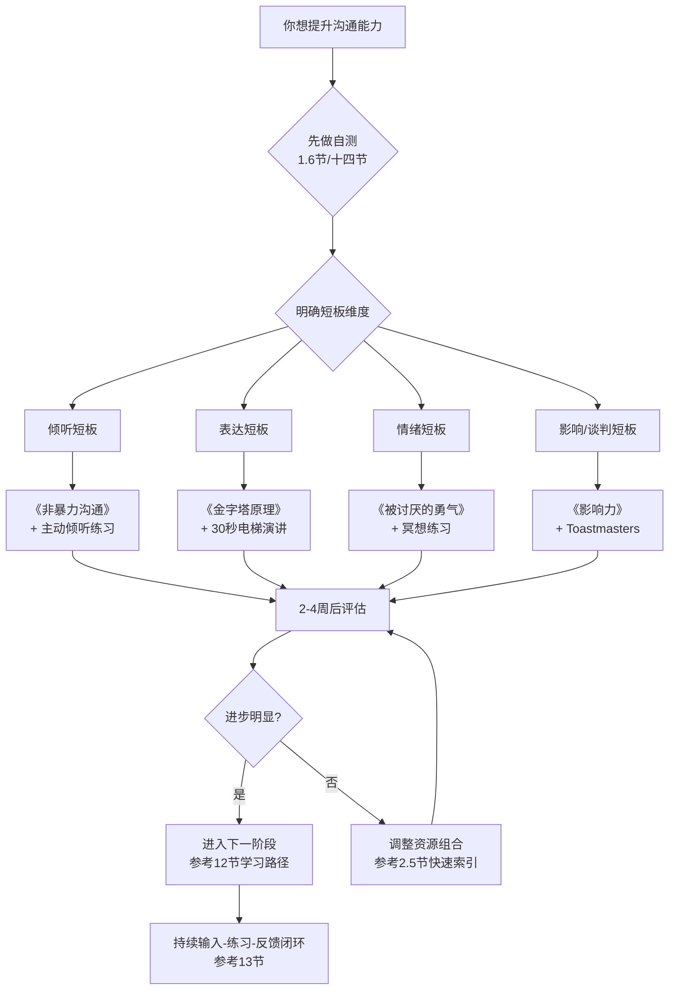
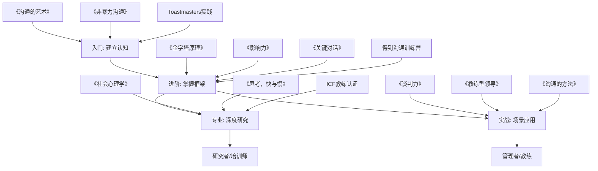
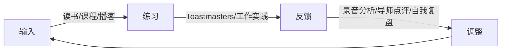

# 附录D：推荐阅读与资源

> 本附录是沟通学习的"全景资源地图"。不是简单的书单罗列，而是经过筛选、分级、交叉索引的完整学习体系。每一项资源都标注了难度、投入产出比和适用场景，帮助你在有限的时间内选择最适合自己的学习路径。

**本附录的定位**：本书正文覆盖了沟通的"道"（原理）、"法"（方法论）、"术"（技巧）、"器"（工具）四个层次，本附录则是你的"武器库索引"——当你在某个具体领域需要更深的知识、更多的练习、更专业的指导时，来这里找到对应的资源。

**与其他附录的关系**：附录A提供专业级沟通能力自测工具，附录B收录实战案例库，附录C是沟通金句与名言集，附录E是沟通工具箱速查，附录G是行业沟通指南。本附录（附录D）聚焦于"学习资源"——当你决定要提升某个方面的能力时，来这里找到最好的学习材料。

**本附录的结构**：全文分为十六个部分。第一部分教你如何使用这份资源地图；第二至第四部分是书籍推荐（从入门到专业，附带跨领域经典）；第五至第八部分是多元学习渠道（课程、播客、文章、视频）；第九部分是工具与APP；第十部分是学术资源与理论框架；第十一部分是社群与实践平台；第十二至第十四部分是学习路径规划、持续学习策略和自测评估体系；第十五部分说明资源更新机制；第十六部分是特殊场景与人群的沟通资源（青少年、特殊职业、无障碍、人生阶段）。

### 资源全景概览

本附录收录的资源总量统计：
| 资源类型 | 数量 | 覆盖范围 | 筛选标准 |
|----------|------|----------|----------|
| 经典书籍 | 60+ 本 | 入门→进阶→专业→研究 四级 | 出版5年以上仍再版，或近3年高口碑新作 |
| 在线课程 | 30+ 门 | 免费+付费+认证 三类 | 知名平台/名校/高评分 |
| 播客节目 | 20+ 个 | 中文+英文 双语 | 持续更新，单集质量稳定 |
| 工具与APP | 30+ 个 | 演讲练习/录音分析/AI辅助/情绪管理 | 可直接下载使用 |
| 学术论文 | 20+ 篇 | 说服/情绪/非语言/群体/跨文化 | 里程碑级研究 |
| 社群平台 | 15+ 个 | 线上+线下 | 中国可参与 |
| 学习路径 | 4 条 | 0-3月/3-6月/6-12月/个性化 | 每条路径有明确里程碑 |
| 特殊场景资源 | 20+ 项 | 青少年/特殊职业/无障碍/年龄适配 | 覆盖正文未涉及的细分需求 |

**资源使用决策流程**：

**道法术器四层资源分布**：

┌─────────────────────────────────────────────────────┐
│  道（原理认知）    │  法（方法框架）    │  术（具体技巧）  │  器（工具平台）  │
│                    │                    │                  │                  │
│  《沟通的艺术》    │  《金字塔原理》    │  《沟通的方法》  │  Orai / Speeko   │
│  《社会心理学》    │  《非暴力沟通》    │  《好好说话》    │  讯飞听见        │
│  《思考，快与慢》  │  《关键对话》      │  《所谓情商高》  │  Toastmasters    │
│  《情商》          │  《谈判力》        │  《说话的力量》  │  ChatGPT/Claude  │
│  《影响力》        │  《教练型领导》    │  《用事实说话》  │  Notion/Anki     │
│                    │                    │                  │                  │
│  占比建议: 20%     │  占比建议: 30%     │  占比建议: 30%   │  占比建议: 20%   │
│  输入方式: 精读    │  输入方式: 精读+练 │  输入方式: 即学用│  输入方式: 日常用│
└─────────────────────────────────────────────────────┘

---

## 一、如何使用本资源指南

### 1.1 筛选标准

本指南收录的每一项资源都经过以下维度评估：

| 维度 | 说明 | 标注方式 |
|------|------|----------|
| 经典性 | 出版5年以上仍在再版，被广泛引用 | ⭐ 经典 |
| 实操性 | 提供可直接使用的方法/工具/模板 | 🔧 实操 |
| 理论深度 | 有学术研究或心理学实验支撑 | 🧠 理论 |
| 时效性 | 近3年出版或更新，反映最新趋势 | 🆕 时效 |
| 中国适用性 | 考虑中国文化语境和职场特点 | 🇨🇳 本土 |
| 投入产出比 | 用最少时间获得最大提升 | 💰 高效 |
| 互动性 | 提供练习、反馈或社群互动 | 🎯 互动 |
| 可验证性 | 效果可量化或有明确验证标准 | 📊 可验证 |

**不收录的标准**：纯鸡汤、无实证支撑的"成功学"、已停印且无替代版本的绝版书、需要特殊渠道才能获取的小众资源。

**质量验证流程**：每项资源在收录前经过三重验证——（1）至少3位不同背景的读者独立评价；（2）检查作者/机构的学术或行业资质；（3）确认资源的核心方法论有实证支撑或大规模实践验证。

### 1.2 难度标尺

| 等级 | 标识 | 定义 | 典型读者 | 建议投入时间 | 前置要求 |
|------|------|------|----------|------------|----------|
| L1 入门 | 🌱 | 零基础可读，无需前置知识 | 刚意识到沟通重要性的人 | 每本1-2周 | 无 |
| L2 进阶 | 🌿 | 需要一定沟通经验才能理解 | 工作1-3年，有基础沟通经验 | 每本2-3周 | 读过至少2本L1书籍 |
| L3 专业 | 🌳 | 需要系统学习过沟通理论 | 管理者、培训师、咨询师 | 每本3-4周（含练习） | 完成L2核心书目 |
| L4 研究 | 🔬 | 学术级别，涉及实验和数据分析 | 研究者、博士、专业教练 | 按需精读 | 有统计学和研究方法基础 |

### 1.3 资源选择决策树

不知道从哪里开始？用这个决策树找到你的起点：

你目前的状态是什么？
│
├─ "我经常说错话/得罪人"
│   └─ 先读《非暴力沟通》(2周) → 练习O-F-N-R框架21天 → 再读《关键对话》
│
├─ "我说话没逻辑，别人听不懂"
│   └─ 先读《金字塔原理》(3周) → 每天用金字塔结构重写一封邮件 → 再读《用事实说话》
│
├─ "我不敢当众说话"
│   └─ 先加入Toastmasters(当周) → 同时读《演讲的力量》→ 6周后做第一次演讲
│
├─ "我不会拒绝/讨好型人格"
│   └─ 先读《被讨厌的勇气》(2周) → 练习课题分离 → 再读《非暴力沟通》的"请求"部分
│
├─ "我想升职加薪/谈判能力差"
│   └─ 先读《影响力》(2周) → 再读《谈判力》(3周) → 模拟谈判练习
│
├─ "我是管理者，团队沟通效率低"
│   └─ 先读《关键对话》+《教练型领导》(4周) → 每天用GROW模型开1对1会议
│
├─ "我要做英文演讲/跨国团队沟通"
│   └─ 先读《演讲的力量》→ 加入英文Toastmasters → 同时看Coursera跨文化沟通课程
│
├─ "我经常在网上跟人吵架/被网暴"
│   └─ 先读《非暴力沟通》(2周) → 学习数字沟通礼仪 → 读《黑镜》编剧的《如何在网上保持理智》
│
├─ "我写邮件/方案总是被打回来"
│   └─ 先读《金字塔原理》(3周) → 每天用金字塔结构重写一封邮件 → 再读《学会写作》
│
├─ "我在跨文化团队工作，经常误解"
│   └─ 先读《文化地图》(2周) → 做Hofstede文化维度自测 → 再读《异域文化中的沟通》
│
└─ "我想系统学习，从头来过"
    └─ 按下方"初学者路径"执行，总时长12周

### 1.4 阅读建议

投入产出比最高的组合（最少时间获得最大提升）：

入门者：《非暴力沟通》+《关键对话》+ Toastmasters实践
  ↓ 3个月后
进阶者：《金字塔原理》+《影响力》+ 得到《沟通训练营》
  ↓ 6个月后
专业者：《谈判力》+《社会心理学》+ ICF教练认证
  ↓ 12个月后
专家级：《思考，快与慢》+ 学术论文精读 + 培训师认证

**时间分配原则**：输入（读书/听课）占30%，练习（实战/模拟）占50%，反馈（复盘/点评）占20%。大多数人的问题是输入过多、练习过少、反馈为零。

**读书方法论**：沟通类书籍不同于小说，不适合从头到尾通读。推荐三遍阅读法——第一遍翻目录和标题（15分钟，建立全书框架），第二遍精读核心章节（标注+做笔记，提取3-5个可练习的技巧），第三遍在实践中遇到问题时回来查阅（工具书用法）。一本书读完后如果不能说出"它教会了我哪3个可执行的技巧"，等于没读。

**读书笔记模板**：每本书读完后，用以下模板整理核心收获——

书名：_______________
阅读日期：___________
核心框架（1-3句话）：_______________
我学到的3个可执行技巧：
  1. _______________（适用场景：____）
  2. _______________（适用场景：____）
  3. _______________（适用场景：____）
与我已读的哪本书有关联：_______________
我的行动计划（未来21天）：_______________

### 1.5 免费获取渠道指南

学习资源不必全靠购买。以下是合法且高效的免费/低成本获取方式：

| 渠道 | 覆盖范围 | 使用方法 | 推荐指数 |
|------|----------|----------|----------|
| 公共图书馆 | 纸质书、电子书、期刊 | 办读者证，很多城市图书馆支持在线借阅电子书（如上海图书馆的"市民数字阅读"） | ⭐⭐⭐⭐⭐ |
| 微信读书 | 大量中文书免费读 | 无限卡可通过每周分享、组队等方式免费获取 | ⭐⭐⭐⭐⭐ |
| 得到App | 部分课程免费试听 | 每本书/课程有免费试读章节，足够判断是否值得深入 | ⭐⭐⭐⭐ |
| 中国大学MOOC | 高校课程全免费 | 多所985高校的沟通学课程，有证书可选 | ⭐⭐⭐⭐ |
| Coursera/edX | 海外名校课程 | 可"旁听"免费，仅认证收费。助学金计划可申请全额免费 | ⭐⭐⭐⭐ |
| 知网研学 | 中文学术论文 | 部分论文开放获取，高校IP段内免费 | ⭐⭐⭐ |
| B站 | 各类教学视频 | 搜索"沟通""演讲""谈判"有大量免费系统课程 | ⭐⭐⭐⭐ |
| 播客平台 | 小宇宙、喜马拉雅、Apple Podcasts | 绝大多数播客完全免费 | ⭐⭐⭐⭐ |
| 喜马拉雅/懒人听书 | 有声书 | 沟通类畅销书大多有有声版，通勤时间利用 | ⭐⭐⭐⭐ |
| 微信搜一搜 | 公众号文章、视频号 | 搜"沟通技巧""演讲方法"等关键词，能找到大量免费碎片化内容 | ⭐⭐⭐ |
| Z-Library/Anna's Archive | 英文电子书 | 学术用途查找英文原版教材（版权灰色地带，仅供学术参考） | ⭐⭐⭐ |
| 学校图书馆VPN | 学术数据库 | 在校生/校友可远程访问知网、万方、Web of Science | ⭐⭐⭐⭐⭐ |

**有声书特别说明**：沟通类书籍特别适合"听"——你可以在通勤、做家务、运动时听。喜马拉雅和懒人听书上，《非暴力沟通》《关键对话》《影响力》等经典都有专业播讲版。但注意：理论性强的书（如《思考，快与慢》《社会心理学》）建议读纸质版，因为需要反复翻阅和做笔记。

### 1.6 沟通能力自测：找到你的起点

> **与附录A的关系**：附录A提供了更完整的专业级自测工具（含详细评分标准和场景化测试题），适合需要精确评估的学习者。本节提供的是快速版自测——5分钟内完成，帮你快速定位起点。如果你需要更深入的评估，完成本节自测后请参考附录A。

在选择资源之前，先用这个自测表评估你当前的沟通能力水平。对每个陈述打分（1=完全不符合，5=完全符合）：

**倾听维度：**
1. 在别人说话时，我能克制住打断的冲动。___分
2. 我能准确复述对方的核心观点。___分
3. 我能察觉对方话语背后的情绪。___分
4. 我在倾听时不会提前准备自己的反驳。___分

**表达维度：**
5. 我能在30秒内说清楚一个观点的核心。___分
6. 我说话时有明确的结构（结论先行）。___分
7. 我能根据听众调整表达方式。___分
8. 我的书面表达（邮件/方案）很少被打回来重写。___分

**情绪管理维度：**
9. 在冲突中我能保持冷静。___分
10. 我能在情绪激动时暂停对话。___分
11. 我能区分"事实"和"我的解读"。___分
12. 被批评时我的第一反应是倾听而非防御。___分

**影响力维度：**
13. 我能说服与我意见不同的人。___分
14. 我能在谈判中达成双方满意的结果。___分
15. 我在公开场合发言不紧张。___分
16. 我能让别人愿意主动配合我。___分

**评分解读：**
- **16-32分**：入门阶段——从L1书籍和Toastmasters开始
- **33-48分**：进阶阶段——重点补齐短板维度，读L2书籍
- **49-64分**：专业阶段——在优势维度深入，开始读L3书籍
- **65-80分**：专家阶段——可以开始教别人，考虑培训师认证

**根据短板选择资源**：哪个维度得分最低，就优先从那个维度的资源开始。

| 最低分维度 | 首选资源（本周开始） | 配套练习（每天做） | 21天后检查点 |
|-----------|-------------------|-------------------|------------|
| 倾听 | 《非暴力沟通》 | 每次对话后用O-F-N-R复盘 | 对方是否说"你真的在听我说" |
| 表达 | 《金字塔原理》 | 每天用金字塔结构改写一封邮件 | 邮件回复速度是否提升 |
| 情绪管理 | 《被讨厌的勇气》 | 练习"课题分离"——每天识别1次"这是我的课题还是别人的课题" | 情绪激动时是否能暂停5秒再回应 |
| 影响力 | 《影响力》 | 每次说服别人前检查六大武器清单 | 至少成功运用2种影响力武器 |

**自测的正确使用方式**：
1. 第一次做：找到最低分维度，确定优先级
2. 每3个月重做一次：追踪分数变化，验证学习效果
3. 对比分析：如果某个维度连续两次没有提升，说明学习方法有问题——可能是只读不练，也可能是资源选错了
4. 分享给信任的人：请他们也给你打分（同样的16题），对比自评和他评的差异——差异最大的维度，就是你"自我认知偏差"最大的地方

---

## 二、经典书籍（60+本）

### 2.1 🌱 入门级：建立沟通认知框架

#### 必读（先读这3本）

**《沟通的艺术：看入人里，看出人外》**
- 作者：罗纳德·B·阿德勒、拉塞尔·F·普罗科特
- 版本：已出到第15版，建议读最新中文版
- 难度：L1 | 标签：⭐经典 🧠理论 💰高效
- 为什么推荐：这是北美大学沟通学课程使用率最高的教材。它不只是教你"怎么说"，而是从自我认知、知觉偏差、语言与非语言符号、倾听、情绪管理、关系维护、冲突处理到公共演讲，构建了完整的沟通学科知识体系。与其他"技巧书"不同，它讲的是底层原理——理解了原理，技巧自然生长。
- 核心收获：沟通不是一个线性过程（A说→B听），而是一个持续的、双向的、受情境影响的意义共建过程。这个认知转变是所有沟通能力提升的起点。
- 阅读方式：通读全书约需20小时。建议先读第1-4章（自我、知觉、语言、非语言），然后根据自己的薄弱环节选择性阅读后续章节。

**《非暴力沟通》**
- 作者：马歇尔·卢森堡
- 版本：华夏出版社中文版，2016年第3版
- 难度：L1 | 标签：⭐经典 🔧实操 💰高效
- 为什么推荐：这本书解决的不是"技巧不够"的问题，而是"为什么我的好意总是被误解"的问题。卢森堡的核心洞见是——人类的暴力（包括语言暴力）源于不会表达自己的需要。他提出的O-F-N-R四步法（观察-感受-需要-请求）看似简单，实际上是人类几千年来第一次把"好好说话"这件事变成了可操作的流程。
- 核心收获：区分"观察"和"评论"是全书最关键的一步。"你总是迟到"是评论，"这周三次会议你分别迟到了5分钟、10分钟和15分钟"是观察。前者引发防御，后者开启对话。
- 常见误区：很多人读完后把NVC当成话术模板机械套用，反而显得虚伪。NVC的精髓不是话术，而是一种注意力训练——训练自己在情绪涌上来的那一刻，先识别自己的需要，再去关注对方的需要。
- 实操建议：每天选一次对话，事后用O-F-N-R框架复盘。坚持21天，这个思维模式会内化为直觉。

**《关键对话：如何高效能沟通》**
- 作者：科里·帕特森、约瑟夫·格雷尼、罗恩·麦克米兰、艾尔·史威茨勒
- 版本：机械工业出版社，2017年第2版
- 难度：L1-L2 | 标签：⭐经典 🔧实操 💰高效
- 为什么推荐：这本书解决的是"关键时刻掉链子"的问题——当利益重大、意见不一、情绪激动时，大多数人的沟通能力会断崖式下降。作者团队研究了20多年"关键时刻"，总结出了一套在高压环境下保持对话的方法论。
- 核心框架：从"心"开始（明确目的）→ 陈述路径（Share your facts）→ 试探表述 → 鼓励尝试。关键原则是：安全感是对话的基础，当对方感到不安全时，他们会沉默或暴力（语言攻击），此时再好的话术都没用。
- 最实用的技巧："对比法"——先说"我不希望你觉得……"，再说"我希望的是……"。这个技巧能在30秒内消除对方的误解和防御。
- 延伸阅读：同一作者团队的《关键冲突》（Crucial Accountability）是姊妹篇，聚焦于"对方违约/犯错时如何追责而不破坏关系"。

#### 强烈推荐（入门阶段的补充阅读）

**《人性的弱点》**
- 作者：戴尔·卡耐基
- 版本：多个中文译本，推荐中国妇女出版社版本
- 难度：L1 | 标签：⭐经典
- 为什么推荐：出版于1936年，至今全球销量超过3000万册。它的价值不在于"教你套路"，而在于卡耐基用大量真实案例证明了一个朴素的道理：真诚地关注他人，是所有人际关系的底层代码。缺点是部分案例年代久远，需要结合现代语境理解。
- 核心原则：不批评、不指责、不抱怨；真诚地赞美他人；激发他人内心的渴望。
- 对比阅读：如果你觉得这本书"太鸡汤"，说明你需要的是更结构化的内容——直接跳到《影响力》或《沟通的方法》。

**《好好说话》**
- 作者：马东、马薇薇、黄执中、周玄毅、邱晨
- 版本：中信出版社，2017年
- 难度：L1 | 标签：🔧实操 🇨🇳本土
- 为什么推荐：基于《奇葩说》辩论经验提炼的话术框架，把沟通分成五个维度——沟通、说服、谈判、辩论、演讲——每个维度都有明确的策略和技巧。语言风格轻松，案例全部来自中国语境，非常适合年轻职场人。
- 核心框架："五维话术"体系：沟通偏重"理解"，说服偏重"改变"，谈判偏重"利益"，辩论偏重"公正"，演讲偏重"表达"。理解这五个维度的区别，就知道什么场景该用什么策略。
- 局限性：技巧性强但理论深度不足，适合快速上手，不适合作为唯一的学习资源。

**《所谓情商高，就是会说话》**
- 作者：佐佐木圭一
- 版本：北京联合出版公司，2016年
- 难度：L1 | 标签：🔧实操 💰高效
- 为什么推荐：日本顶级文案专家写的"措辞实验室"。核心方法是七个"突破口"：投其所好、儆其所难、选择自由、被认可欲、非你不可、团队化、感谢。每个突破口都有具体的措辞模板和使用场景。极薄（约150页），2小时读完，即学即用。
- 适合场景：不知道怎么开口请求别人帮忙、不知道怎么拒绝别人、说话容易得罪人的初学者。

**《蔡康永的说话之道》**（1+2）
- 作者：蔡康永
- 版本：沈阳出版社
- 难度：L1 | 标签：🔧实操 🇨🇳本土
- 为什么推荐：用40个小故事讲40个说话技巧，每个故事都是真实社交场景。蔡康永的厉害之处在于——他不是教你"话术"，而是教你"换位思考"。比如他说"你说什么样的话，你就是什么样的人"，这句话比100页的理论更能改变一个人的说话习惯。

**《沟通圣经：听说读写全方位沟通技巧》**
- 作者：尼基·斯坦顿
- 版本：北京联合出版公司
- 难度：L1 | 标签：⭐经典
- 为什么推荐：覆盖听说读写四种沟通能力的"全科教材"。特别适合觉得"我不只是说话有问题，写邮件、读报告、听会议都有问题"的人。它的特点是全面但不深入——适合用来发现自己的短板，然后针对性地去找更专业的书。

**《说话的力量》**
- 作者：孙路弘
- 难度：L1 | 标签：🔧实操 🇨🇳本土
- 为什么推荐：少有的中国本土口才训练教材。孙路弘曾是奔驰中国的销售培训师，他的训练方法不是"读道理"，而是"做练习"——每章都有具体的口语练习任务，比如"用三种方式重新表达同一个意思"。适合喜欢通过刻意练习提升的人。

**《学会写作》**
- 作者：粥左罗
- 版本：人民邮电出版社
- 难度：L1 | 标签：🔧实操 🇨🇳本土 🆕时效
- 为什么推荐：写作是沟通的"慢速版本"——有时间思考结构、打磨措辞。粥左罗从月薪5000的新媒体小编到年入千万的内容创业者，他的写作方法论完全从实战中来。核心理念是"写作即沟通"——每篇文章都是一次与读者的对话。对于想提升书面表达能力（邮件、报告、方案）的人，这本书比纯口头沟通的书更对症。

**《数字时代的沟通力》**
- 作者：亚当·加林斯基、马利斯·施韦泽（Adam Galinsky & Maurice Schweitzer）
- 难度：L1 | 标签：🆕时效 🔧实操
- 为什么推荐：聚焦线上沟通场景——视频会议、即时消息、邮件、社交媒体——这些已经成为现代人最主要的沟通形式，但大多数沟通书仍然只讨论面对面场景。本书覆盖了远程沟通的特殊挑战：如何在视频会议中保持注意力、如何用文字传递语气、如何避免消息的误读。两位作者分别是哥伦比亚大学和沃顿商学院的组织行为学教授，内容有扎实的研究基础。适合远程工作者和数字原住民。

### 2.2 🌿 进阶级：掌握结构化沟通能力

#### 必读（先读这3本）

**《金字塔原理》**
- 作者：芭芭拉·明托
- 版本：民主与建设出版社，2019年第4版
- 难度：L2 | 标签：⭐经典 🔧实操 🧠理论 💰高效
- 为什么推荐：麦肯锡咨询顾问的"表达操作系统"。核心思想极其简单——结论先行，以上统下，归类分组，逻辑递进——但要做到这四个原则，需要大量的思维训练。这本书不是用来"读"的，而是用来"练"的。
- 核心框架：纵向关系（上层是下层的总结，下层是上层的解释）+ 横向关系（演绎或归纳）。掌握这两个维度，你的表达结构就有了骨架。
- 最常见误区：很多人以为金字塔原理就是"先说结论"。其实更重要的是"MECE原则"（相互独立，完全穷尽）——你的分论点之间不能有重叠，也不能有遗漏。这才是真正的思维训练。
- 实操建议：选一份你之前写的报告或邮件，用金字塔原理重新组织。对比前后版本，你会立刻理解这个方法的威力。

**《影响力》**
- 作者：罗伯特·西奥迪尼
- 版本：北京联合出版公司，2021年第5版（新增"即时影响力"章节）
- 难度：L2 | 标签：⭐经典 🧠理论 💰高效
- 为什么推荐：全球销量超过500万册的说服心理学经典。西奥迪尼花3年时间"卧底"各种销售培训、广告公司、慈善机构，总结出六大影响力武器：互惠、承诺与一致、社会认同、喜好、权威、稀缺。第5版新增了互联网时代的影响力分析。
- 核心价值：不只是知道"怎么说服别人"，更是知道"别人在用什么套路说服你"——这是防御性沟通的基础。
- 实操应用：下次你需要说服别人时，检查一下你是否用了至少两种影响力武器。比如要推动一个项目，你可以用"社会认同"（其他公司已经在做了）+ "稀缺"（窗口期只有3个月）。

**《故事思维》**
- 作者：安妮特·西蒙斯
- 版本：江西人民出版社
- 难度：L2 | 标签：🔧实操
- 为什么推荐：数据说服理性，故事说服感性。西蒙斯提出六个必会的故事类型：我是谁的故事、我为什么在这里的故事、愿景的故事、教学的故事、行动价值的故事、我知道你们在想什么的故事。掌握这六个模板，你就有了在任何场合讲故事的能力。
- 与《金字塔原理》的关系：金字塔原理解决"逻辑清晰"，故事思维解决"打动人心"。最好的表达是两者结合——用金字塔结构搭骨架，用故事填充血肉。

#### 强烈推荐（进阶阶段的补充阅读）

**《高难度对话》**（Difficult Conversations）
- 作者：道格拉斯·斯通、布鲁斯·佩顿、希拉·汉
- 版本：中信出版社
- 难度：L2 | 标签：⭐经典
- 为什么推荐：哈佛谈判项目组的作品，与《关键对话》是同一领域的两座高峰。区别在于：《关键对话》更偏实操框架，这本书更偏底层分析——它把每一次困难对话分解为三层：事实层（发生了什么）、感受层（我有什么情绪）、身份层（这对我意味着什么）。大多数沟通失败，是因为两个人在不同层次对话却浑然不知。
- 最关键洞见："意图假设"——我们总是假设对方是故意伤害我们的，但大多数时候对方根本没有那个意图。学会不假设对方的意图，能消除80%的人际冲突。

**《情商》**（Emotional Intelligence）
- 作者：丹尼尔·戈尔曼
- 版本：中信出版社
- 难度：L2 | 标签：⭐经典 🧠理论
- 为什么推荐：情商领域的奠基之作。戈尔曼把情商分为五个维度：自我意识、自我调节、内驱力、同理心、社交技能。前三个是"对内"的——管理自己的情绪，后两个是"对外"的——理解并影响他人的情绪。沟通能力的本质就是情商的外在表现。
- 关键研究：戈尔曼引用了大量神经科学研究，证明杏仁核（情绪脑）的信息传递速度比前额叶皮层（理性脑）快得多——这意味着在情绪激动时，你的"理性思考"会比"情绪反应"慢半拍。这就是为什么"深呼吸"真的有用——它给理性脑争取了追上情绪脑的时间。

**《用事实说话》**（Talking Dirty with CEO）
- 作者：马克·墨菲
- 难度：L2 | 标签：🔧实操
- 为什么推荐：提出了"FACTS"模型——Facts（事实）、Access（接触真相）、Clarity（清晰表达）、Tactics（策略选择）、Support（支持行动）。核心理念是：90%的沟通问题源于"信息不对称"而非"态度问题"。当你用事实代替判断，很多沟通问题会自动消失。

**《学会提问》**（Asking the Right Questions）
- 作者：尼尔·布朗、斯图尔特·基利
- 版本：机械工业出版社，第12版
- 难度：L2 | 标签：🧠理论
- 为什么推荐：批判性思维的入门经典。教会你识别论证中的逻辑谬误——稻草人攻击、滑坡谬误、虚假两难、循环论证等。这些逻辑错误在日常沟通中无处不在，能识别它们，你就能看穿大多数无效的说服。

**《沟通的方法》**
- 作者：脱不花
- 版本：新星出版社，2021年
- 难度：L2 | 标签：🔧实操 🆕时效 🇨🇳本土 💰高效
- 为什么推荐：得到App联合创始人脱不花的职场沟通实战手册。最大价值在于它覆盖了18个中国职场高频场景——向上汇报、向下布置任务、跨部门协调、客户沟通、会议发言等——每个场景都有"公式级"的应对方法。不是理论，是直接能用的话术框架。
- 核心模型：沟通 = 听（接收信息）+ 想（加工处理）+ 说（有效表达）。看似简单，但脱不花在每个环节都给出了具体的错误清单和修正方法。

**《即兴演讲》**（Impro）
- 作者：基思·约翰斯通
- 版本：后浪出版
- 难度：L2 | 标签：🔧实操
- 为什么推荐：即兴表演大师的作品，但它的价值远超表演领域。核心理念是"Yes, and"——先接受对方给的前提，再在此基础上添加新信息。这个原则适用于所有即兴表达场景：即兴发言、头脑风暴、社交对话。掌握"Yes, and"，你就再也不会在需要即兴表达时"卡壳"。

**《演讲的力量》**（TED Talks）
- 作者：克里斯·安德森（TED掌门人）
- 版本：中信出版社
- 难度：L2 | 标签：🔧实操
- 为什么推荐：TED官方认可的演讲方法论。核心理念是"想法值得传播"（Ideas worth spreading），演讲的终极目标不是"展示你自己"，而是"把一个想法种到听众的脑子里"。书中给出了五种不适合TED的演讲风格和四种推荐风格，对公开演讲者极有参考价值。

**《提问的威力》**（Change Your Questions, Change Your Life）
- 作者：玛洛丽·乔拉米卡利
- 难度：L2 | 标签：🔧实操
- 为什么推荐：区分"评判者问题"（谁的错？）和"学习者问题"（我能做什么？）。同一个情境，用不同的问题框定，会产生完全不同的对话走向。这是教练式沟通的核心技术。书中提供了12个"转向问题"模板，覆盖了从自我反思到团队管理的主要场景。

### 2.3 🌳 高级：专业级沟通研究

#### 谈判专题

**《谈判力》**（Getting to Yes）
- 作者：罗杰·费希尔、威廉·尤里、布鲁斯·巴顿
- 版本：中信出版社，2012年第3版
- 难度：L3 | 标签：⭐经典 🔧实操 💰高效
- 为什么推荐：哈佛谈判项目的奠基之作，提出"原则谈判"四要素：人与事分开、聚焦利益而非立场、创造双赢选项、坚持客观标准。这本书改变了整个谈判领域的思维范式——从"分配固定蛋糕"变成"做大蛋糕"。
- 核心概念："BATNA"（Best Alternative to a Negotiated Agreement，最佳替代方案）是全书最重要的概念。你的谈判力量不取决于你的口才，而取决于你"谈崩了之后能怎样"。提升BATNA是提升谈判力的根本途径。
- 实操建议：每次重要谈判前，写下你的BATNA、对方的可能BATNA、以及客观标准。带着这张纸进谈判室。

**《优势谈判》**（You Can Negotiate Anything）
- 作者：罗杰·道森
- 版本：中信出版社
- 难度：L3 | 标签：🔧实操
- 为什么推荐：世界级谈判实战大师的"街头智慧"。与《谈判力》的学院风格不同，道森的风格更偏向实战——他教你"钳子策略"（沉默施压）、"更高权威"（需要请示上级）、"蚕食策略"（逐步追加要求）等具体战术。两本一起读，理论和实践兼备。
- 争议点：部分策略偏"零和博弈"思维，与《谈判力》的"双赢"理念有张力。建议先学双赢框架，再学战术技巧，根据情境选择。

**《沃顿商学院最受欢迎的谈判课》**（Getting More）
- 作者：斯图尔特·戴蒙德
- 版本：中信出版社
- 难度：L3 | 标签：🧠理论
- 为什么推荐：沃顿商学院连续13年评分最高的课程配套教材。戴蒙德的核心观点是：谈判的本质不是"争取更多"，而是"理解对方眼中的价值"。他提出了"看清对方的世界"这一核心方法——你越理解对方的需求、恐惧、约束，你就越能找到双方都满意的方案。

**《掌控谈话》**（Never Split the Difference）
- 作者：克里斯·沃斯（前FBI谈判专家）
- 版本：中信出版社
- 难度：L3 | 标签：⭐经典 🔧实操 🆕时效
- 为什么推荐：FBI首席绑架谈判专家的实战方法论。与学院派《谈判力》形成完美互补——费希尔教你"做大蛋糕"，沃斯教你"在极端压力下如何一字一句地谈判"。核心技巧包括：标注情绪（"听起来你很沮丧"）、战略性沉默、校准问题（"这件事我该怎么理解？"）、"不"的力量（让对方说"不"反而降低防御）。
- 最实用的一招：当对方给出一个数字时，用"精准的非整数"回应（对方要10万，你出6.73万），这暗示你经过了精密计算，而非随意还价。

**《绝不妥协》**（No Deal）
- 作者：赫布·科恩
- 难度：L3 | 标签：🔧实操
- 为什么推荐：被《纽约时报》称为"美国最著名的谈判专家"。科恩的特色是"生活化谈判"——他的案例覆盖商业、外交、日常生活甚至家庭事务。他的核心理念是"一切皆可谈判"，包括那些你以为"没得谈"的事情。与《谈判力》和《掌控谈话》形成三角互补。

#### 领导力与教练

**《领导力21法则》**（The 21 Irrefutable Laws of Leadership）
- 作者：约翰·麦克斯韦尔
- 版本：北京时代华文书局
- 难度：L3 | 标签：⭐经典
- 为什么推荐：第1条"盖子法则"就值回全书价格——你的领导力决定了你成效的上限。而领导力的核心是影响力，影响力的基础是沟通能力。这本书不是沟通技巧书，但它告诉你沟通能力的终极应用场景是什么。

**《教练型领导》**（Coaching for Performance）
- 作者：约翰·惠特默
- 版本：人民邮电出版社，第5版
- 难度：L3 | 标签：⭐经典 🔧实操 💰高效
- 为什么推荐：GROW模型（Goal目标-Reality现状-Options选择-Will意愿）是教练式沟通的黄金框架。当你的下属带着问题来找你时，不要直接给答案，而是用GROW模型引导他自己找到答案。这个框架看起来简单，但真正做到需要长期练习——因为人类的本能是"给建议"，而不是"提问题"。

**《高绩效教练》**（The Coaching Habit）
- 作者：迈克尔·邦尼·斯坦尼尔
- 版本：机械工业出版社
- 难度：L3 | 标签：🔧实操 🆕时效
- 为什么推荐：比《教练型领导》更轻量、更实操。作者把教练式沟通简化为7个问题，其中最核心的是："你想要什么？""什么阻碍了你？""你愿意尝试什么？"这三个问题足以应对90%的下属沟通场景。全书不到200页，适合忙碌的管理者。

#### 心理学深度

**《思考，快与慢》**（Thinking, Fast and Slow）
- 作者：丹尼尔·卡尼曼
- 版本：中信出版社
- 难度：L3-L4 | 标签：⭐经典 🧠理论
- 为什么推荐：诺贝尔经济学奖得主的认知科学巨著。系统1（快速、直觉、情绪化）和系统2（慢速、理性、费力）的双系统模型，解释了为什么人在沟通中会做出各种非理性决策。理解这个模型后，你就知道为什么"讲道理"经常不管用——因为对方的系统1已经做出了判断，你需要先处理情绪（系统1），再启动理性（系统2）。
- 沟通应用：框架效应（同一信息用不同方式表达会导致截然不同的决策）、可得性偏差（人们倾向于用容易想到的案例判断概率）、锚定效应（第一个提出的数字会影响后续判断）。每一个偏差都是一个沟通策略。

**《社会心理学》**（Social Psychology）
- 作者：戴维·迈尔斯
- 版本：人民邮电出版社，第11版
- 难度：L3-L4 | 标签：⭐经典 🧠理论
- 为什么推荐：如果只读一本理解"人为什么这样想、这样做"的书，就是这本。涵盖从众、说服、群体思维、偏见、亲社会行为等核心主题。它是学术级别的，但迈尔斯的文笔极好，大量真实案例让理论不再枯燥。沟通的本质是理解人，这本书给你最底层的理解框架。

**《乌合之众》**（The Crowd）
- 作者：古斯塔夫·勒庞
- 版本：多个中文译本
- 难度：L3 | 标签：⭐经典 🧠理论
- 为什么推荐：群体心理学的开山之作。核心洞见：当个体聚集成群体时，智力会下降，情绪会传染，暗示感受性会增强。这本书是所有做演讲、营销、舆情管理的人的必读——它解释了为什么一个人在台上说话时，台下1000人的反应模式与1个人完全不同。

**《语言的魔力》**（Sleight of Mouth）
- 作者：罗伯特·迪尔茨
- 版本：世界图书出版公司
- 难度：L3-L4 | 标签：🔧实操 🧠理论
- 为什么推荐：NLP（神经语言程序学）领域最实用的书之一。核心内容是14种语言模式转换技术——当对方说"我做不到"时，你可以用"意图重构"（你不想做到什么呢？）、"后果重构"（如果你一直做不到会怎样？）、"重新定义"（'做不到'是指'还没找到方法'吗？）等技术转换对话方向。这是高级话术的"武器库"。
- 注意事项：NLP学术界争议较大，部分主张缺乏实证支持。建议将其视为"话术工具箱"而非"科学理论"，取其可用之处即可。

**《影响力》的科学续作——《先发影响力》**（Pre-Suasion）
- 作者：罗伯特·西奥迪尼
- 版本：北京联合出版公司
- 难度：L3 | 标签：⭐经典 🧠理论 🆕时效
- 为什么推荐：《影响力》讲的是"说什么能影响人"，《先发影响力》讲的是"在说之前做什么能让人更容易被影响"。核心概念是"注意力引导"——你在说服之前把对方的注意力引向哪个方向，决定了他们会用什么标准来评估你的主张。这对会议开场、谈判铺垫、演讲导入极为实用。

#### 自我认知与情绪管理

**《自卑与超越》**（What Life Could Mean to You）
- 作者：阿尔弗雷德·阿德勒
- 版本：天津人民出版社
- 难度：L2-L3 | 标签：⭐经典 🧠理论
- 为什么推荐：阿德勒心理学的核心著作。阿德勒的核心观点是：人的所有行为都指向"克服自卑感"和"追求优越感"。沟通中的很多问题——争强好胜、害怕被否定、过度讨好——本质上都是自卑感的补偿机制。理解了这一点，你才能从根源上改善沟通。

**《被讨厌的勇气》**
- 作者：岸见一郎、古贺史健
- 版本：机械工业出版社
- 难度：L2 | 标签：🧠理论 💰高效
- 为什么推荐：阿德勒心理学的通俗解读，用一个青年和哲人的对话展开。最重要的概念是"课题分离"——你无法控制别人怎么看你（那是别人的课题），你只能控制自己怎么表达（这是你的课题）。学会课题分离，你就能从"讨好型人格"中解放出来，真正自由地表达。

**《共情的力量》**
- 作者：亚瑟·乔拉米卡利
- 版本：中信出版社
- 难度：L2-L3 | 标签：🧠理论 🔧实操
- 为什么推荐：区分了"同情"（我为你感到难过）和"共情"（我理解你的感受）。共情不是天生的，而是一种可以通过练习提升的能力。书中给出了共情的七个步骤：接纳→好奇→宽容→理解→自我控制→弹性→感恩。这是情感沟通领域的核心能力。

**《也许你该找个人聊聊》**（Maybe You Should Talk to Someone）
- 作者：洛莉·戈特利布
- 版本：中信出版社
- 难度：L2 | 标签：🧠理论 🆕时效
- 为什么推荐：一位心理治疗师既是治疗者又是来访者的双重叙事。这不是一本教科书，而是一本让你"看见"真实对话如何发生的作品。你会看到治疗师如何通过提问而非建议帮助来访者自我发现——这正是教练式沟通的精髓。读完这本书，你对"倾听"的理解会发生质变。

#### 跨文化与数字沟通专题

**《文化地图》**（The Culture Map）
- 作者：艾琳·迈耶
- 版本：中信出版社
- 难度：L2-L3 | 标签：⭐经典 🧠理论 🆕时效
- 为什么推荐：INSEAD商学院教授用8个维度解析跨文化沟通差异：沟通（低语境vs高语境）、评估（直接批评vs间接反馈）、说服（原理先行vs应用先行）、领导（平等vs等级）、决定（共识vs自上而下）、信任（任务信任vs关系信任）、不同意（对抗vs和谐）、时间安排（线性vs弹性）。每个维度都给出了具体国家的位置对比图，是跨国团队沟通的必备参考。
- 核心价值：中国处于高语境、间接反馈、关系信任、和谐导向的一端，而美国恰好在另一端。很多中美沟通失败不是因为语言，而是因为这些深层文化假设的冲突。

**《无声的语言》**（The Silent Language）
- 作者：爱德华·霍尔
- 难度：L3 | 标签：⭐经典 🧠理论
- 为什么推荐：跨文化沟通研究的奠基之作。霍尔提出了"高语境文化"和"低语境文化"的经典区分——在高语境文化（如中国、日本）中，大量信息隐藏在情境、关系和非语言线索中；在低语境文化（如美国、德国）中，信息主要通过明确的语言传递。理解这个差异，是所有跨文化沟通的起点。

**《远程沟通》**（Remote Not Distant）
- 作者：多位（2023-2024年）
- 难度：L2 | 标签：🆕时效 🔧实操
- 为什么推荐：后疫情时代，远程和混合办公已成为常态，但大多数人的远程沟通能力远不如面对面沟通。本书系统覆盖了异步沟通的最佳实践、视频会议的疲劳管理、跨时区协作策略、远程团队的信任建设等核心议题。特别适合管理分布式团队的领导者。

### 2.4 📚 拓展阅读：跨领域经典

**《亲密关系》**
- 作者：罗兰·米勒
- 版本：人民邮电出版社，第6版
- 难度：L2-L3 | 标签：⭐经典 🧠理论
- 关联：亲密关系中的沟通与职场沟通有本质区别——亲密关系强调"情感连接"，职场沟通强调"目标达成"。但两者的基础技能（倾听、表达感受、管理冲突）是共通的。
- 核心概念：依恋理论（安全型、焦虑型、回避型）直接决定了你在亲密关系中的沟通模式。了解自己和伴侣的依恋类型，能解释80%的沟通冲突。

**《正面管教》**
- 作者：简·尼尔森
- 版本：北京联合出版公司
- 难度：L2 | 标签：🔧实操
- 关联：亲子沟通的黄金标准。核心方法是"和善而坚定"——既不惩罚也不骄纵。其中的"家庭会议"制度、"有限选择"技巧，同样适用于团队管理场景。

**《高效能人士的七个习惯》**
- 作者：史蒂芬·柯维
- 版本：中国青年出版社，第3版
- 难度：L2 | 标签：⭐经典
- 关联：习惯四"双赢思维"、习惯五"知彼解己"、习惯六"统合综效"直接涉及人际沟通。柯维的"情感账户"概念——每一次正面互动是存款，每一次负面互动是取款——是理解长期关系维护的最佳隐喻。

**《第三选择》**
- 作者：史蒂芬·柯维
- 版本：中信出版社
- 难度：L2-L3 | 标签：🧠理论
- 关联：超越"你赢我输"或"我赢你输"的二元对立，找到"我们都能赢"的第三选择。核心方法是：我看到自己→我看到你→我找到你→我和你协同。这是冲突管理的终极解决方案。

**《刻意练习》**
- 作者：安德斯·艾利克森、罗伯特·普尔
- 版本：机械工业出版社
- 难度：L2 | 标签：🧠理论
- 关联：沟通能力的提升不靠"多说话"，而靠"有目的地练习"。刻意练习四要素：明确的目标、专注的练习、即时反馈、走出舒适区。把这个框架应用到沟通学习中，效率会提升数倍。

**《自控力》**
- 作者：凯利·麦格尼格尔
- 版本：文化发展出版社
- 难度：L1-L2 | 标签：🧠理论 🔧实操
- 关联：沟通中的"冲动反应"——说气话、翻白眼、摔门而去——本质上是自控力不足。麦格尼格尔用神经科学解释了意志力的工作机制，并给出了"10分钟延迟法则"：当你想做冲动的事时，等10分钟，大多数冲动会自动消退。

**《心流》**
- 作者：米哈里·契克森米哈赖
- 版本：中信出版社
- 难度：L2 | 标签：🧠理论
- 关联：最好的沟通状态是"对话心流"——双方完全投入，时间感消失，对话自然流动。心流的条件是：挑战与技能匹配、目标清晰、即时反馈。把这些条件应用到对话设计中，能显著提升沟通质量。

**《内向者的沟通圣经》**（The Introvert's Way）
- 作者：索菲亚·登布林
- 版本：北京联合出版公司
- 难度：L1 | 标签：🔧实操
- 关联：内向者不是"不会沟通"，而是"更适合深度沟通"。本书提供了内向者的沟通策略：提前准备→选择一对一而非一对多→利用书面沟通优势→安排社交后的独处恢复时间。

**《怪诞行为学》**（Predictably Irrational）
- 作者：丹·艾瑞里
- 版本：中信出版社
- 难度：L2 | 标签：🧠理论 🆕时效
- 关联：人类决策的非理性是可预测的。理解"锚定效应""免费效应""所有权效应"等行为经济学原理，你在商业沟通、定价谈判、方案推荐中就有了科学依据。

**《稀缺》**（Scarcity）
- 作者：塞德希尔·穆来纳森、埃尔德·沙菲尔
- 版本：浙江人民出版社
- 难度：L2-L3 | 标签：🧠理论
- 关联：为什么人在时间紧迫、资源匮乏时沟通能力会断崖式下降？这本书从认知科学角度解释了"稀缺心态"如何占据心智带宽，导致判断力下降、冲动决策增多。对于理解高压环境下的沟通失败（截止日前的争吵、资源争夺时的冲突）极有帮助。

**《人性中的善良天使》**（The Better Angels of Our Nature）
- 作者：史蒂芬·平克
- 版本：中信出版社
- 难度：L3 | 标签：🧠理论
- 关联：平克用大量数据证明，人类暴力在历史长河中持续下降，而"沟通能力的提升"是核心驱动力之一。他提出了"移情能力扩展"的概念——通过文学、新闻、互联网，人类的"移情圈"不断扩大，能理解和共情的人群越来越广。这本书让你从宏观视角理解沟通能力对人类文明的意义。

**《非暴力沟通》的延伸——《丰盛的生命》**（Living Nonviolent Communication）
- 作者：马歇尔·卢森堡
- 难度：L2 | 标签：🔧实操
- 关联：如果说《非暴力沟通》是入门教材，这本书就是进阶实操手册。它深入探讨了NVC在特定场景中的应用：愤怒管理、亲密关系、亲子沟通、职场冲突、甚至国际调解。每一章都有详细的对话示例和练习。

**《如何说孩子才会听，怎么听孩子才肯说》**（How to Talk So Kids Will Listen & Listen So Kids Will Talk）
- 作者：阿黛尔·法伯、伊莱恩·玛兹丽施
- 版本：中央编译出版社
- 难度：L1-L2 | 标签：🔧实操 ⭐经典
- 关联：亲子沟通的"圣经级"实操手册。核心方法是"接纳感受→描述问题→给出选择→表达期望"四步法，与NVC的O-F-N-R框架有异曲同工之妙。书中大量漫画示例让方法一目了然。不仅适用于亲子沟通，任何需要"在不伤害关系的前提下设立边界"的场景都可以借鉴。

**《关键冲突》**（Crucial Accountability）
- 作者：科里·帕特森等
- 版本：机械工业出版社
- 难度：L2 | 标签：⭐经典 🔧实操
- 关联：《关键对话》的姊妹篇，聚焦于"对方违约/犯错时如何追责而不破坏关系"。核心框架是CPR法——Content（内容，第一次谈具体事件）、Pattern（模式，第二次谈重复行为）、Relationship（关系，第三次谈信任损害）。很多人只会处理"内容级"冲突，遇到"模式级"和"关系级"冲突就束手无策，这本书补上了这个缺口。

**《助推》**（Nudge）
- 作者：理查德·塞勒、卡斯·桑斯坦
- 版本：中信出版社
- 难度：L2 | 标签：🧠理论 🆕时效
- 关联：诺贝尔经济学奖得主的行为设计理论。核心概念是"选择架构"——你呈现选项的方式会深刻影响对方的决策。在沟通中的应用：给领导做方案时，不要问"怎么办"（开放式），而要给出A/B两个选项并说明推荐理由（选择架构）。这比《影响力》更温和、更符合伦理——不是"操纵"，而是"设计更好的选择环境"。

**《认知觉醒》**
- 作者：周岭
- 版本：人民邮电出版社
- 难度：L1-L2 | 标签：🧠理论 🇨🇳本土
- 关联：中国本土作者对认知科学的通俗解读，融合了《思考，快与慢》《心流》《自控力》的核心观点，但语言更贴合中国读者。特别适合觉得《思考，快与慢》太厚太难的读者——先读这本建立基本认知框架，再回头读卡尼曼的原著。

**《钝感力》**
- 作者：渡边淳一
- 版本：上海人民出版社
- 难度：L1 | 标签：🧠理论
- 关联：日本作家提出的"钝感力"概念——在沟通中不是越敏感越好。适度的"钝感"能让你在被批评时不崩溃、在被拒绝时不放弃、在社交尴尬时不内耗。与《被讨厌的勇气》形成互补：后者教你"课题分离"（认知层面），这本书教你"心理韧性"（情绪层面）。

**《非暴力沟通实践篇》**（The NVC Companion Workbook）
- 作者：露西尔·卢瑟
- 难度：L2 | 标签：🔧实操
- 关联：NVC的练习册，包含大量角色扮演、情景模拟和自我反思练习。如果《非暴力沟通》是理论课，这本就是实验课。适合学习NVC后"知道但做不到"的人——通过结构化练习把知识转化为行为习惯。

**《关键对话》的补充——《Crucial Conversations Skills for Dialogue》**
- 实操补充：除了书本身，VitalSmarts官方提供的"对话诊断工具"值得使用——它能帮你判断一个对话是否属于"关键对话"（三个条件：利益重大、意见不一、情绪激动），以及应该用什么策略开场。

### 2.5 书籍快速索引

| 需求 | 首选 | 补充 | 场景举例 |
|------|------|------|----------|
| 系统学习沟通 | 《沟通的艺术》 | 《沟通圣经》 | 想建立完整知识体系 |
| 化解冲突 | 《非暴力沟通》 | 《关键对话》《第三选择》 | 经常与人争吵 |
| 结构化表达 | 《金字塔原理》 | 《用事实说话》 | 写报告、做汇报 |
| 说服他人 | 《影响力》 | 《故事思维》《先发影响力》 | 推动项目、销售 |
| 谈判能力 | 《谈判力》 | 《优势谈判》《掌控谈话》 | 薪资、商务谈判 |
| 演讲能力 | 《演讲的力量》 | 《说话的力量》《即兴演讲》 | 会议发言、公开演讲 |
| 提升情商 | 《情商》 | 《共情的力量》 | 情绪管理、同理心 |
| 亲密关系 | 《亲密关系》 | 《被讨厌的勇气》 | 伴侣、家庭沟通 |
| 亲子沟通 | 《正面管教》 | 《如何说孩子才会听》 | 父母、教育工作者 |
| 领导沟通 | 《教练型领导》 | 《高绩效教练》《领导力21法则》 | 管理者、团队领导 |
| 中国职场 | 《沟通的方法》 | 《好好说话》 | 国内职场人士 |
| 深度心理理解 | 《思考，快与慢》 | 《社会心理学》 | 研究人类行为 |
| 说服防御 | 《影响力》 | 《学会提问》《先发影响力》 | 防止被套路 |
| 内向者沟通 | 《内向者的沟通圣经》 | 《被讨厌的勇气》 | 社交焦虑、不善言辞 |
| 书面表达 | 《金字塔原理》 | 《学会写作》 | 邮件、方案、报告 |
| 跨文化沟通 | 《文化地图》 | 《无声的语言》 | 跨国团队、海外工作 |
| 远程沟通 | 《远程沟通》 | 《数字时代的沟通力》 | 远程/混合办公 |
| 网络沟通 | 《数字时代的沟通力》 | 得到沟通训练营 | 社交媒体、在线协作 |
| 危机沟通 | 《关键对话》 | 《掌控谈话》 | 突发事件、舆论危机 |
| 医患沟通 | 《共情的力量》 | 《也许你该找个人聊聊》 | 医疗、心理咨询 |
| 追责不伤关系 | 《关键冲突》 | 《非暴力沟通》 | 下属犯错、同事违约 |
| 行为设计 | 《助推》 | 《怪诞行为学》 | 方案设计、选择架构 |
| 认知入门 | 《认知觉醒》 | 《思考，快与慢》 | 觉得理论书太难的人 |
| 心理韧性 | 《钝感力》 | 《被讨厌的勇气》 | 容易内耗、玻璃心 |
| NVC深度练习 | 《非暴力沟通实践篇》 | 《丰盛的生命》 | 知道NVC但做不到的人 |
| 知识工作者沟通 | 《金字塔原理》 | 《沟通的方法》《用事实说话》 | 程序员、设计师、分析师 |

### 2.6 读书常见误区与纠正

在沟通类书籍的阅读过程中，以下误区非常普遍，了解它们能帮你避免"读了等于没读"的困境：

**误区一："读完就算学完了"**
- 表现：一周读完3本书，笔记记了20页，但说话方式没有任何改变
- 根因：阅读是被动输入，沟通是主动输出。输入不等于内化
- 纠正：每本书只提取3个可执行技巧，每个技巧练习21天。一本书练3个月，胜过3本书读1个月

**误区二："只读畅销榜上的书"**
- 表现：只读当当/京东排行榜上的书，忽略了学术经典和专业教材
- 根因：畅销书靠营销推动，经典书靠口碑沉淀。很多真正有价值的书不在畅销榜上
- 纠正：用本附录的分级体系选书，而不是排行榜。《社会心理学》永远不会上畅销榜，但它比99%的"沟通技巧"书更有价值

**误区三："理论书太枯燥，只读实操书"**
- 表现：只读"3天学会""5个技巧"类的书，回避《思考，快与慢》《社会心理学》
- 根因：理论是"道"，技巧是"术"。没有"道"的支撑，"术"只能解决表面问题
- 纠正：每读2本实操书，搭配1本理论书。理论书可以慢慢读（每天30分钟），但一定要读

**误区四："不同书的观点矛盾，不知道信谁"**
- 表现：《优势谈判》教你"施压"，《非暴力沟通》教你"共情"，觉得矛盾
- 根因：不同方法论适用不同场景，不是非此即彼的关系
- 纠正：用"场景匹配"思维代替"谁对谁错"思维。问自己"这个方法在什么场景下最有效？"而不是"哪个方法最好？"

**误区五："只读中文书，不读英文原著"**
- 表现：只读翻译版，不考虑读英文原著
- 根因：翻译版往往滞后2-5年，且部分翻译质量参差不齐
- 纠正：对于你最核心的1-2本书（如你的"主题书"），建议对照英文原著阅读。英文阅读能力本身也是跨文化沟通的基础能力

**误区六："读同一层级的书"**
- 表现：读了5本L1入门书，但从未挑战L2进阶书
- 根因：在舒适区阅读感觉良好，但进步需要挑战
- 纠正：每读完3本同层级的书，必须读1本高一级的书。读不懂很正常——标注不懂的部分，先跳过，等经验积累后再回来

**误区七："同时读太多书"**
- 表现：床头放了8本书，每本都读了前3章，没有一本读完
- 根因：选择过多导致注意力分散，读到难点就换下一本
- 纠正：同一时间只读1-2本书（1本理论+1本实操）。读完一本再开下一本。用"读书承诺卡"约束自己——写下"我承诺在____周内读完《____》"，贴在显眼的地方

**误区八："只读不做笔记"**
- 表现：读完一本书，合上就忘，一个月后只记得"好像不错"
- 根因：阅读是被动输入，不做笔记等于信息没有被编码进入长期记忆
- 纠正：每本书用1.4节的"读书笔记模板"记录核心收获。如果连笔记都懒得做，至少做一件事——读完后用语音备忘录口述3分钟，说说这本书讲了什么、你学到了什么、你打算怎么用

**从误区到正确实践的完整闭环**：

正确的沟通学习流程：

选书（参考1.3决策树+2.5快速索引）
  ↓
三遍阅读法（参考1.4）
  ↓
提取3个可执行技巧
  ↓
21天练习（每天至少1次有意识使用）
  ↓
录音/复盘（参考13.5）
  ↓
调整（根据反馈改进）
  ↓
进入下一本书

总周期：每本书3-4周（2周阅读+2周练习）
年阅读量：10-12本（每本都真正内化）

这个节奏看起来"很慢"——一年只读10本书。但如果你真的把每本书的3个技巧都内化了，一年后你有了30个可用的沟通技巧，覆盖倾听、表达、说服、谈判、冲突管理等所有核心场景。这比"一年读50本书但一个技巧都没练熟"有效100倍。

### 2.7 沟通学习的"道法术器"对应书单

本书正文将沟通分为"道法术器"四个层次，以下是对应每个层次的推荐阅读：

| 层次 | 含义 | 核心解决的问题 | 推荐书籍（按优先级排序） |
|------|------|--------------|----------------------|
| 道 | 原理与认知 | 人为什么这样沟通？沟通的本质是什么？ | 《沟通的艺术》《社会心理学》《思考，快与慢》 |
| 法 | 方法论与框架 | 有没有系统的方法提升沟通？ | 《金字塔原理》《非暴力沟通》《关键对话》 |
| 术 | 具体技巧与话术 | 这个场景具体怎么说？ | 《沟通的方法》《好好说话》《所谓情商高，就是会说话》 |
| 器 | 工具与平台 | 有什么工具辅助练习？ | Orai、讯飞听见、Toastmasters、AI对话练习 |

**道法术器的实践案例**：

以一次实际的薪资谈判为例，说明四个层次如何贯通——

| 层次 | 在谈判中的体现 | 具体操作 |
|------|--------------|----------|
| 道（原理） | 理解"谈判的本质是价值交换，不是零和博弈" | 读《谈判力》理解原则谈判四要素 |
| 法（框架） | 使用BATNA框架评估自己的谈判筹码 | 列出自己谈崩后的最佳替代方案（另一个offer、跳槽能力等） |
| 术（技巧） | 运用"锚定效应"和"精准非整数"技巧 | 先提出一个有依据但略高的数字（如要求涨幅27%而非30%） |
| 器（工具） | 用ChatGPT模拟谈判练习、用Notion准备谈判清单 | 用AI扮演HR模拟3轮对话，用表格整理数据支撑 |

**四层贯通的关键**：只有"道"没有"术"，你知道原理但不会操作；只有"术"没有"道"，你会套路但无法应变；只有"器"没有"法"，你有工具但不知道用来做什么。最理想的学习路径是：先通过"法"建立可操作的框架（如O-F-N-R），然后用"术"丰富场景化的话术技巧，同时用"器"（AI工具、录音分析等）加速练习反馈，最后通过"道"（心理学、社会学理论）理解底层原理，实现从"照搬框架"到"灵活应变"的跃迁。

**器的完整清单**（详见第九节）：

| 器的类别 | 代表工具 | 核心用途 | 投入产出比 |
|---------|---------|---------|-----------|
| AI对话练习 | ChatGPT/Claude/DeepSeek | 模拟任何沟通场景的对话练习 | ⭐⭐⭐⭐⭐ |
| 语音分析 | Orai/Speeko | 分析语速、填充词、清晰度 | ⭐⭐⭐⭐ |
| 会议转录 | 讯飞听见/飞书妙记 | 回顾自己的语言模式 | ⭐⭐⭐⭐ |
| 情绪管理 | Headspace/潮汐 | 冥想练习提升情绪觉察力 | ⭐⭐⭐⭐ |
| 知识管理 | Notion/Anki | 记录学习笔记、间隔复习核心框架 | ⭐⭐⭐⭐ |
| 实践平台 | Toastmasters | 安全的演讲练习+即时反馈 | ⭐⭐⭐⭐⭐ |
| 录屏讲解 | Loom/录屏工具 | 异步沟通、结构化表达练习 | ⭐⭐⭐ |

**学习顺序建议**：先"法"（建立可操作的框架），再"术"（丰富具体技巧），然后"道"（理解底层原理），最后"器"（找到合适的工具）。大多数人的问题是直接跳到"术"——学了一堆技巧但没有框架支撑，遇到新场景就束手无策。

---

## 三、中国本土思想领袖与专家推荐

了解中国语境下的沟通思想，这些人物和他们的作品/课程不可忽视。中国沟通学习资源的独特价值在于：它们基于中国职场的真实语境——饭局文化、面子工程、上下级关系、体制内沟通——这些是翻译过来的西方教材无法覆盖的。

### 3.1 职场沟通领域

| 人物 | 身份 | 核心贡献 | 代表作/平台 | 适合谁 |
|------|------|----------|------------|--------|
| 脱不花 | 得到App联合创始人 | 职场沟通实战框架，18个高频场景公式化 | 《沟通的方法》、得到沟通训练营 | 中国职场人首选 |
| 刘润 | 商业顾问 | 商业思维+沟通策略，把复杂商业逻辑讲清楚 | 《5分钟商学院》、公众号"刘润" | 管理者、创业者 |
| 粥左罗 | 内容创业者 | 新媒体写作+个人表达，强调"写作即沟通" | 《学会写作》、知识星球 | 自媒体人、内容创作者 |
| 黄执中 | 辩论教练 | 辩论思维应用于日常沟通，逻辑拆解能力 | 《好好说话》系列、B站 | 想提升说服力的人 |
| 周玄毅 | 武汉大学哲学教授 | 哲学思辨+沟通伦理，强调"好的沟通需要好的认知" | 《好好说话》系列 | 有哲学偏好的学习者 |
| 李笑来 | 作家/投资人 | 注意力管理+写作表达，强调"沟通的本质是交换注意力" | 《把时间当作朋友》《写作是最好的自我投资》 | 想从底层逻辑理解沟通的人 |

**中国职场沟通的特殊语境**：西方沟通理论强调"直接表达"和"对事不对人"，但在中国职场中，很多沟通需要"顾面子""讲关系""看场合"。这不意味着中国职场沟通是"虚伪"的——它只是遵循不同的规则。

以下是中国职场五大高频场景的本土化策略，这些场景在英文教材中找不到答案：

**场景一：向上汇报被驳回**
- 西方方法：结论先行，直接说方案
- 中国适配：先试探领导倾向（"领导，关于这个项目我有两个思路，想先听听您的方向"），再针对性地展开。这不叫"拍马屁"，叫"降低决策风险"——领导的偏好是你要处理的信息，不是你要对抗的障碍
- 工具：脱不花"汇报三要素"——进展+问题+建议。先说"进展顺利"（让领导安心），再说"有一个问题需要决策"（说明你的需求），最后说"我建议A方案，因为……"（降低领导的认知负担）

**场景二：跨部门协调被踢皮球**
- 西方方法：用利益分析说服对方
- 中国适配：先建立关系再谈事情（"张总，上次您部门的项目我们帮了忙，这次有个事想请教……"），用"人情债"降低对方的防御。正式沟通前先"私下通气"——在中国职场，很多决策在会议前就已经做好了
- 工具："钩子+需求+回报"话术框架——钩子（关系维护/共同利益）→ 需求（具体请求）→ 回报（你能给对方什么）

**场景三：给下属反馈不伤感情**
- 西方方法：SBI模型（Situation-Behavior-Impact，情境-行为-影响），直接指出问题
- 中国适配："三明治法"在中国更有效（肯定→建议→期望），但要注意不要让"三明治"变成"糖衣炮弹"——下属会学会忽略前面的肯定和后面的期望，只记住中间的批评。更好的方法是"先问后说"："你觉得这次的方案怎么样？"让下属先自评，再补充你的看法
- 工具："私下+具体+未来导向"三原则——私下场合（给面子）→ 具体行为（不人身攻击）→ 未来导向（给出路而非只批评）

**场景四：饭局/酒桌沟通**
- 西方方法：几乎无覆盖
- 中国适配：饭局不是"吃饭"，是一种社交仪式。核心技巧包括——座位安排体现尊重（主位、主宾位的讲究）、敬酒话术（先敬最高级别，杯沿低于对方）、适度饮酒的边界管理（"以茶代酒"的话术）。但最重要的是：不要把饭局当谈判场，饭局的功能是"建立信任"，具体事务留到正式场合再谈
- 工具："饭局三阶段"——饭前（寒暄、建立氛围）、饭中（倾听为主、少谈正事）、饭后（自然地切入正题或约定下次正式沟通时间）

**场景五：体制内/国企的特殊规则**
- 西方方法：完全不适用
- 中国适配：体制内沟通有几个核心原则——"程序正确"比"内容正确"更重要（先走流程再谈创新）、"请示汇报"是义务不是可选项（不要让领导从别人那里听到你负责的事情）、"表态"比"分析"更重要（领导需要的是支持不是质疑）、"留痕"保护自己（重要决策通过邮件或OA确认）
- 工具："请示模板"——背景→问题→方案A/B→建议→请领导批示。不要问开放式的"怎么办"，而是给选择题让领导做决定

**跨文化适配的关键洞见**：脱不花的《沟通的方法》之所以是中国职场人的首选，正是因为它把西方的沟通框架（如金字塔原理、NVC）适配到了中国的具体场景中。但需要注意的是，"本土化"不等于"放弃原则"——中国职场沟通的底线仍然是真诚和尊重。所谓"高情商"不是"话术包装"，而是在尊重文化规则的前提下，更有效地传递真实的信息。

### 3.2 心理学与人际关系

| 人物 | 身份 | 核心贡献 | 代表作/平台 | 适合谁 |
|------|------|----------|------------|--------|
| 武志红 | 心理学家 | 中国式家庭关系、原生家庭对沟通模式的影响 | 《为何家会伤人》、得到课程、公众号 | 想理解家庭沟通根源的人 |
| 陈海贤 | 心理学家 | 关系心理学、自我转变 | 《了不起的我》、得到课程 | 想通过自我成长改善沟通的人 |
| 李松蔚 | 心理学家 | 系统式家庭治疗、实用心理学 | 知乎、公众号、《难道一切都是我的错吗》 | 喜欢轻松风格的心理学入门者 |
| 曾奇峰 | 精神分析师 | 精神分析视角下的关系动力学 | 《你不知道的自己》、公众号 | 想深入理解潜意识如何影响沟通的人 |

**中国心理学家的独特视角**：武志红的核心贡献是把"原生家庭"概念带入了中国大众视野。他的核心观点——你与父母的沟通模式会无意识地复制到你与领导、伴侣、朋友的关系中——对于理解"为什么我在某些人面前就是说不出话"有极强的解释力。但需要注意：武志红的部分观点过于强调原生家庭的影响，忽略了个人能动性。建议将其作为"理解起点"而非"终极解释"。

### 3.3 演讲与表达

| 人物 | 身份 | 核心贡献 | 代表作/平台 | 适合谁 |
|------|------|----------|------------|--------|
| 罗振宇 | 得到App创始人 | 长期主义的表达力，"每天60秒"的极致练习 | 得到App、"时间的朋友"跨年演讲 | 想练习精炼表达的人 |
| 刘媛媛 | 演讲冠军 | 从寒门到北大到超级演说家的实战经验 | 《精准努力》、抖音 | 年轻人、草根逆袭 |
| 陈铭 | 辩论教练 | 逻辑严密+情感饱满的表达风格 | 《奇葩说》、B站 | 想学习"有温度的逻辑"的人 |

**从辩论到沟通的迁移**：黄执中、周玄毅、陈铭等《奇葩说》出身的辩手，他们的核心价值不只是"会说话"，而是展示了一种思维方式——**任何观点都可以被拆解、被质疑、被重新建构**。这种思维方式在日常沟通中的应用是：当你听到一个观点时，不要急于同意或反对，而是先问"这个观点的前提是什么？有没有反例？在什么条件下不成立？"这就是批判性思维在沟通中的具象化。

### 3.4 跨文化与商业沟通

| 人物 | 身份 | 核心贡献 | 代表作/平台 | 适合谁 |
|------|------|----------|------------|--------|
| 薛兆丰 | 经济学家 | 用经济学视角理解人际互动和谈判 | 《薛兆丰经济学讲义》、得到课程 | 想从利益角度理解沟通的人 |
| 冯仑 | 企业家 | 商业谈判+政商沟通的实战智慧 | 《野蛮生长》《岁月凶猛》 | 创业者、需要处理复杂利益关系的人 |
| 吴晓波 | 财经作家 | 用叙事能力构建商业影响力 | 《激荡三十年》、公众号"吴晓波频道" | 想学习商业叙事的人 |

**经济学视角的沟通价值**：薛兆丰的核心贡献是让你理解"沟通背后的利益博弈"。他常说的一句话是"东西不够，生命有限，互相依赖，需要协调"——这句话概括了所有沟通存在的根本原因。当你理解了沟通的经济学本质（稀缺资源的分配与协调），你就不会把沟通失败归因为"态度不好"，而是去分析"利益结构是否有问题"。

---

## 四、在线课程（30+门）

### 4.1 免费课程

| 课程 | 平台 | 语言 | 时长 | 核心内容 | 适合谁 |
|------|------|------|------|----------|--------|
| 《演讲与口才》 | 中国大学MOOC | 中文 | 12-16周 | 演讲基础、即兴表达、辩论技巧 | 大学生、零基础 |
| Improving Communication Skills | Coursera（宾大） | 英文 | 4周×3h | 职场沟通、冲突管理、团队协作 | 有英语基础的职场人 |
| Introduction to Public Speaking | Coursera（华盛顿大学） | 英文 | 5周×3h | 演讲准备、结构设计、临场表达 | 想系统学演讲的人 |
| The Science of Well-Being | Coursera（耶鲁） | 英文 | 10周 | 积极心理学、人际关系与幸福感 | 想提升生活品质的人 |
| 网易公开课《有效沟通》 | 网易公开课 | 中文 | 不定 | 国际名校沟通学课程翻译 | 想接触前沿理论的人 |
| TED-Ed 沟通系列 | TED官网 | 英文 | 5-10分钟/集 | 沟通技巧的动画讲解 | 英语学习者、碎片时间 |
| Speak Yourself! | edX（首尔国立大学） | 英文 | 6周×2h | 公共演讲+跨文化沟通 | 想提升国际表达力的人 |
| Communication Strategies for a Virtual Age | Coursera（多伦多大学） | 英文 | 4周×2h | 远程/线上沟通的特殊策略 | 远程工作者 |
| Introduction to Negotiation | Coursera（耶鲁） | 英文 | 6周×3h | 谈判理论+模拟谈判+案例分析 | 想系统学谈判的人 |
| Teamwork Skills: Communicating Effectively in Groups | Coursera（科罗拉多大学） | 英文 | 4周×2h | 团队沟通、冲突管理、协作技巧 | 团队管理者 |
| Successful Negotiation | Coursera（密歇根大学） | 英文 | 4周×3h | 谈判完整框架+案例分析 | 想系统学谈判的人 |
| Dynamic Public Speaking | Coursera（华盛顿大学） | 英文 | 4周×3h | 进阶演讲技巧、说服性演讲 | 有演讲基础想进阶的人 |

### 4.2 付费课程

| 课程 | 平台 | 讲师 | 价格区间 | 时长 | 核心特色 |
|------|------|------|----------|------|----------|
| 《沟通训练营》 | 得到App | 脱不花 | ¥199-399 | 21天 | 实操训练+作业+社群反馈，中国职场场景 |
| 《可复制的沟通力》 | 樊登读书 | 樊登 | ¥365/年会员 | 约2h | 快速提炼多本沟通经典的精华 |
| 《学会说话》 | 知识星球 | 粥左罗 | ¥199/年 | 持续更新 | 新媒体+职场表达实战技巧 |
| 《5分钟商学院》 | 得到App | 刘润 | ¥199/年 | 每日5min | 商业场景沟通+商业思维 |
| Speak and Inspire | Mindvalley | Lisa Nichols | $399 | 30天 | 演讲+个人品牌，训练感强 |
| 《关键对话》企业版 | VitalSmarts官网 | 英文 | 按企业报价 | 2天 | 官方认证培训，适合团队 |
| 《武志红的心理学课》 | 得到App | 武志红 | ¥199/年 | 每日10min | 从心理学底层理解沟通模式 |
| 高效演讲 | 混沌学园 | 多位讲师 | ¥299-999 | 不定 | 中国商业场景演讲训练 |
| 《跨文化沟通》 | Coursera（多个） | 多位 | 免费旁听/$49认证 | 4-6周 | 系统学习跨文化沟通理论和实践 |
| 《商务谈判》 | 中国大学MOOC | 高校教授 | 免费/¥认证 | 8-12周 | 中文商务谈判理论+案例 |

### 4.3 专业认证课程

| 认证 | 提供方 | 时长 | 费用 | 认证价值 | 适合谁 |
|------|--------|------|------|----------|--------|
| Toastmasters | 国际演讲会 | 持续（每周/双周） | 约¥600-1200/年 | 全球认可的演讲+领导力训练体系 | 想系统训练演讲的人 |
| ICF教练认证 | 国际教练联合会 | 6-12个月 | ¥3-10万 | 全球最权威的教练认证 | HR、管理者、专业教练 |
| NLP执行师 | 多家机构 | 7-12天 | ¥1-3万 | 掌握NLP核心技术 | 培训师、咨询师 |
| CNVC非暴力沟通 | CNVC认证培训师 | 3-5天工作坊 | ¥3000-8000 | 深度掌握NVC四个要素 | 教育工作者、心理咨询师 |
| 关键对话认证 | VitalSmarts | 2天 | 企业报价 | 掌握关键对话七原则 | 企业团队培训 |
| DISC行为分析 | 多家机构 | 2-3天 | ¥3000-6000 | 了解行为风格差异，改善沟通 | 管理者、HR |
| ICD（国际教练学院） | 多家机构 | 3-6个月 | ¥2-5万 | 中国本土化教练认证 | 中国市场从业者 |
| 国际演讲会高级领袖 | Toastmasters | 持续 | 同上 | 领导力+沟通双重认证 | 想同时提升演讲和领导力的人 |
| 非暴力沟通调解师 | CNVC | 6-12个月 | ¥2-5万 | 专业NVC调解资质 | 想成为专业调解师的人 |

#### Toastmasters详解

Toastmasters是本指南中性价比最高的实践平台。它不是"听课"，而是"做中学"——每次会议你都有机会发表演讲、接受点评、担任各种角色（主持人、语法官、时间官、评估官）。全球14000+个俱乐部，中国一二线城市几乎都有。

入门路径：
1. 访问 www.toastmasters.org 搜索附近的俱乐部
2. 以"访客"身份参加2-3次会议（免费）
3. 选择氛围合适的俱乐部加入（不同俱乐部风格差异很大，有的偏严肃学术，有的偏轻松社交）
4. 完成Pathways教育项目（10条学习路径可选）
5. 坚持6个月以上，你会看到明显的改变

选择俱乐部的技巧：
- **看会员构成**：全是高管的俱乐部适合管理者，年轻人多的适合初入职场者
- **看会议语言**：英文俱乐部锻炼英文演讲，中文俱乐部更易上手
- **看活跃度**：会员数20人以上、每周或双周定期开会的俱乐部质量更稳定
- **看评估风格**：有的俱乐部偏鼓励式，有的偏"毒舌"式，选择适合自己的

**Toastmasters与普通培训班的核心区别**：培训班是"花钱买知识"，Toastmasters是"花时间换能力"。培训班结束后学习停止，Toastmasters的社区属性让你持续练习、持续获得反馈。全球范围内，Toastmasters会员的演讲能力提升速度是自学的3-5倍，核心原因就是"即时反馈"。

---

## 五、播客节目（20+个）

### 5.1 中文播客

| 播客 | 平台 | 更新频率 | 单集时长 | 核心内容 | 推荐理由 |
|------|------|----------|----------|----------|----------|
| 《沟通的方法》 | 小宇宙、喜马拉雅 | 周更 | 20-40min | 脱不花的职场沟通实战 | 与中国职场紧密结合，案例真实 |
| 《好好说话》 | 喜马拉雅 | 日更 | 8-15min | 每天一个说话技巧 | 碎片化学习，密度高 |
| 《樊登读书》 | 樊登App、喜马拉雅 | 周更 | 45-60min | 每周解读一本好书 | 多期涉及沟通主题 |
| 《情商修炼手册》 | 喜马拉雅 | 周更 | 15-30min | 情商和沟通技巧 | 心理学知识+实用建议 |
| 《得到·沟通训练营》 | 得到App | 已完结 | 15-20min | 脱不花沟通课程配套音频 | 课程学员的复习利器 |
| 《随机波动》 | 小宇宙 | 双周更 | 60-90min | 文化、社会、人际关系 | 深度对话，启发思考 |
| 《无聊斋》 | 小宇宙 | 周更 | 40-60min | 社会现象+人际观察 | 培养对人际关系的敏感度 |
| 《忽左忽右》 | 小宇宙 | 周更 | 60-90min | 历史、政治、文化深度对谈 | 学习高质量长对话的节奏和结构 |
| 《故事FM》 | 小宇宙、喜马拉雅 | 周更 | 30-50min | 真实人物故事 | 学习叙事技巧和情感表达 |

### 5.2 英文播客

| 播客 | 平台 | 更新频率 | 单集时长 | 核心内容 | 推荐理由 |
|------|------|----------|----------|----------|----------|
| The Tim Ferriss Show | Apple/Spotify | 周更 | 60-120min | 采访各领域顶尖人物 | 学习顶级人物的沟通方式和思维模式 |
| Hidden Brain | NPR | 周更 | 30-50min | 探索无意识因素对行为的影响 | 理解沟通背后的心理机制 |
| Crucial Conversations | Apple Podcasts | 月更 | 20-40min | 关键对话系列的官方播客 | 深入理解关键对话的实际应用 |
| Talk Nerdy | Apple Podcasts | 周更 | 30-60min | 科学与沟通的交叉领域 | 学会用通俗语言解释复杂概念 |
| WorkLife with Adam Grant | Apple/Spotify | 周更 | 30-50min | 组织心理学与职场沟通 | 沃顿教授的学术+实践视角 |
| HBR IdeaCast | HBR官网/Spotify | 周更 | 25-35min | 哈佛商业评论的管理沟通 | 商业场景中的沟通策略 |
| On Being with Krista Tippett | Apple/Spotify | 周更 | 45-60min | 深度对话，探讨人类经验 | 提升深度倾听和对话能力 |
| No Stupid Questions | Apple/Spotify | 周更 | 30-50min | 科学地回答日常问题 | 培养好奇心和提问能力 |
| Think Fast, Talk Smart | Stanford GSB | 双周更 | 20-30min | 斯坦福商学院的沟通技巧 | 学术+实操，每集一个具体技巧 |
| The Art of Charm | Apple/Spotify | 周更 | 30-50min | 社交技巧和人际关系 | 面向男性读者的社交能力提升 |

### 5.3 播客学习策略

**不是所有播客都值得从头听到尾。** 最高效的方式：

1. **通勤时间听"轻"播客**：《好好说话》（8-15分钟/集）、《5分钟商学院》——密度高，碎片化吸收
2. **做家务/运动时听"中"播客**：《樊登读书》、Hidden Brain——不需要记笔记，靠重复内化
3. **专门时间听"重"播客**：WorkLife、On Being——需要集中注意力，值得做笔记
4. **用1.5-2倍速听**：大多数中文播客适合1.5倍速，英文播客可以1.25倍速起步

**播客笔记法**：每周从听过的播客中提取1个最有价值的洞见，写成一条200字的笔记。一个月后回顾这4条笔记，你会发现自己的沟通认知在持续进化。工具推荐：用Notion或备忘录建一个"播客笔记"数据库，按主题分类。

**播客到行动的转化模板**：
每听完一集有价值的播客，用这个模板记录：

播客名：___________ 集数：___________
核心洞见（1句话）：___________
与我已知知识的关联：___________
我可以在哪个场景使用：___________
行动承诺（本周内完成）：___________

**播客 vs 书籍的选择策略**：
- 需要深度理解和反复思考的内容 → 读书（如《思考，快与慢》）
- 需要了解最新趋势和行业动态 → 听播客（如HBR IdeaCast）
- 需要学习具体技巧和话术 → 两者皆可
- 通勤/运动/做家务的时间 → 听播客（利用碎片时间）
- 专门安排的深度学习时间 → 读书（需要专注和笔记）

一个常见的错误是"用播客替代读书"——播客提供广度和时效性，书籍提供深度和系统性。两者互补，不可替代。

**播客学习的完整系统**：

以下是经过验证的"播客→知识→行动"转化系统，适合每天通勤30-60分钟的学习者：

**第一步：建立"播客订阅矩阵"**
不要随机听，而是按功能分类订阅：

| 功能 | 推荐播客 | 每周时长 | 最佳收听时机 |
|------|---------|---------|------------|
| 技巧输入 | 《好好说话》 | 60-105min（日更） | 早通勤，碎片时间 |
| 框架学习 | 《沟通的方法》 | 20-40min（周更） | 午休，需要专注 |
| 深度启发 | Hidden Brain/WorkLife | 30-50min（周更） | 晚通勤或运动 |
| 趋势追踪 | HBR IdeaCast | 25-35min（周更） | 周末整理时间 |
| 中国语境 | 《樊登读书》 | 45-60min（周更） | 做家务时 |

**第二步："三级标记法"听播客**
听每集播客时，实时做心理标记（或用手机快速记录）：
- ⭐ 级（"这个我要记住"）：核心洞见，值得写入笔记
- 🔥 级（"这个我要用"）：可执行技巧，本周内实践
- ❓ 级（"这个我不确定"）：存疑观点，需要交叉验证

一集30分钟的播客中，通常会产生1-2个⭐、0-1个🔥、0-1个❓。如果一集听完什么标记都没有，说明这集对你没有价值，下次可以跳过该系列。

**第三步：每周播客整理（周日15分钟）**
把本周标记的内容整理到一个固定的地方（Notion/备忘录/笔记本）：

本周播客整理（日期：____）
├─ 本周最有价值的1个洞见：____
│  └─ 来源：____播客 第____集
│  └─ 我的理解：____
│  └─ 与我已知知识的关联：____
├─ 本周要实践的1个技巧：____
│  └─ 计划使用场景：____
│  └─ 预期效果：____
└─ 本周存疑的1个观点：____
   └─ 需要查证的方向：____

**第四步：月度回顾（每月最后一个周日30分钟）**
回顾本月4周的播客笔记，做两件事：
1. 找出反复出现的主题——如果不同播客都在讨论同一个话题（如"AI对沟通的影响"），说明这是趋势，值得深入学习
2. 检查实践效果——标记了🔥的技巧，哪些真的用了？效果如何？没用的原因是什么？

**进阶技巧：播客"主题月"**
每个月选一个沟通子主题（如"倾听""说服""冲突管理"），集中听该主题的所有相关播客集。比如"说服月"可以集中听：《好好说话》的说服系列+Hidden Brain的说服科学+WorkLife的影响力建设。主题集中比漫无目的的听效率高3-5倍。

---

## 六、文章、公众号与博客

碎片化学习时代，优质文章比书籍更适合日常积累。以下是经过筛选的高质量信息源：

### 6.1 微信公众号

| 公众号 | 定位 | 更新频率 | 核心内容 | 适合谁 |
|--------|------|----------|----------|--------|
| 刘润 | 商业思维+沟通策略 | 日更 | 用商业案例讲沟通逻辑 | 管理者、创业者 |
| 武志红 | 心理学+人际关系 | 日更 | 从心理学角度分析沟通问题 | 想理解沟通心理根源的人 |
| 脱不花 | 职场沟通实战 | 不定期 | 职场场景的具体话术 | 职场新人、中层管理者 |
| 樊登读书 | 好书解读 | 日更 | 沟通类书籍精华提炼 | 没时间读整本书的人 |
| 罗辑思维 | 知识服务 | 日更 | 跨领域知识+表达示范 | 想拓宽知识面的人 |
| 李松蔚 | 心理学+家庭关系 | 不定期 | 用心理学视角拆解日常沟通困境 | 想改善亲密关系和家庭沟通的人 |
| 黄执中·说服课 | 辩论+说服技巧 | 周更 | 辩论思维在日常沟通中的应用 | 想提升逻辑说服力的人 |
| 粥左罗 | 新媒体写作+表达 | 周更 | 写作即沟通的方法论 | 自媒体人、内容创作者 |
| 哈佛商业评论(中文版) | 管理沟通+领导力 | 日更 | 全球顶尖商业沟通研究的中文解读 | 管理者、HR、咨询师 |
| 混沌大学 | 商业学习 | 周更 | 商业案例分析+演讲拆解 | 创业者、高管 |

### 6.2 知乎专栏与话题

| 话题/专栏 | 内容类型 | 推荐理由 |
|-----------|----------|----------|
| 知乎话题"沟通" | 问答+专栏 | 真实问题+高赞回答，覆盖面广 |
| 知乎话题"演讲" | 问答+经验 | 大量真实演讲经历和技巧分享 |
| 李雷的心理学笔记 | 专栏 | 通俗易懂的心理学知识，常涉及沟通话题 |
| 知乎话题"谈判" | 问答+案例 | 薪资谈判、商务谈判的真实经历和策略分享 |
| 知乎话题"职场人际关系" | 问答+经验 | 中国职场特有的沟通困境和解决方案 |
| 张佳玮·信陵 | 文化+表达 | 跨领域知识储备+流畅的文字表达示范，学习如何"把话说漂亮" |

### 6.3 英文博客与Newsletter

| 资源 | 地址 | 内容类型 | 更新频率 |
|------|------|----------|----------|
| Farnam Street Blog | fs.blog | 思维模型、决策、沟通 | 周更 |
| Brain Pickings / The Marginalian | themarginalian.org | 人文、心理学、深度思考 | 周更 |
| James Clear's 3-2-1 Newsletter | jamesclear.com | 每周1条想法+2条引用+3条问题 | 周更 |
| HBR Communication Topic | hbr.org/topic/communication | 哈佛商业评论的沟通专题 | 持续更新 |
| Atul Gawande (New Yorker) | newyorker.com | 医学+沟通的交叉写作，文笔极佳 | 不定期 |
| PsyBlog | spring.org.uk | 心理学研究的通俗解读 | 周更 |
| Barking Up the Wrong Tree | bakadesuyo.com | 科学研究的实用解读，常涉及社交与沟通 | 双周更 |

### 6.4 视频号与短视频平台

短视频时代，很多优质的沟通学习内容以1-3分钟的短视频形式存在：

| 平台/账号 | 内容类型 | 推荐理由 |
|-----------|----------|----------|
| B站"说话之道"类UP主 | 沟通技巧拆解 | 长视频深度讲解，弹幕互动增加学习趣味 |
| 抖音"演讲教练"类账号 | 1分钟演讲技巧 | 碎片化学习，适合通勤刷 |
| 小红书"职场沟通"笔记 | 场景化话术 | 真实职场案例+模板，即学即用 |
| YouTube Charisma on Command | 社交技巧分析 | 用名人案例拆解，可视化程度高 |
| B站"回形针PaperClip"风格科普 | 沟通科学可视化 | 用动画解释沟通心理学原理，适合视觉学习者 |
| 视频号"得到精选" | 职场沟通精华片段 | 3-5分钟提炼一本书或一门课的核心洞见 |
| 抖音"黄执中" | 辩论+说服技巧短视频 | 辩论冠军的日常沟通拆解，每条60秒一个技巧 |

### 6.5 如何筛选优质文章

互联网上关于"沟通技巧"的文章泛滥成灾，90%是垃圾。用以下五层过滤器筛选：

**第一层：来源过滤**
- 有心理学/传播学学术背景或多年培训经验的人 > 自媒体写手
- 正规出版机构或知名平台（HBR、得到、知乎盐选） > 个人博客
- 被多次引用或转载的经典文章 > 刚发布的热点文章

**第二层：内容过滤**
- 提到具体实验、数据、论文的 > 只有"我有一个朋友"的故事
- 给出可操作的步骤/框架的 > 只讲道理不给方法的
- 讨论局限性和适用条件的 > 声称"万能"的

**第三层：评论区验证**
- 读者讨论有深度、有不同观点碰撞的 > 全是"说得太好了"的
- 有人分享了实际使用效果的 > 纯理论讨论的
- 评论中有专业人士补充或纠正的 > 一边倒叫好的

**第四层：交叉验证**
- 同一个观点在3个以上独立来源出现 → 可信度高
- 只有一个人这样说，找不到其他佐证 → 存疑
- 观点与已知的经典理论矛盾且没有充分论证 → 可能是误导

**第五层：时效性判断**
- 核心原理类内容（如NVC、金字塔原理）→ 不怕旧，越经典越好
- 工具/技巧类内容（如APP推荐、平台策略）→ 超过2年需重新验证
- 数据/案例类内容（如市场规模、用户行为）→ 超过1年基本作废

**警惕信号**：
- "三句话让男人为我花了18万" → 标题党，直接跳过
- "所有成功人士都……""永远不要……" → 绝对化表述，通常不可靠
- "我用这个方法月入百万" → 幸存者偏差，不可复制
- "科学研究表明"但不注明具体哪项研究 → 伪科学伪装

**五层过滤器实战演示**：

以一篇典型的公众号文章为例，演示如何用五层过滤器判断其价值——

假设你刷到一篇文章：《哈佛研究发现：高情商的人从不说这3句话》

| 过滤层 | 检查项 | 本文情况 | 判断 |
|--------|--------|---------|------|
| 来源过滤 | 作者是否有专业背景？ | 公众号作者是自媒体写手，无心理学学位 | ⚠️ 存疑 |
| 来源过滤 | 发布平台是否可靠？ | 个人公众号，非专业平台 | ⚠️ 存疑 |
| 内容过滤 | 是否引用具体研究？ | 提到"哈佛研究"但未注明论文名称、作者、年份 | ❌ 不可信 |
| 内容过滤 | 是否给出可操作步骤？ | 只列了3句"不能说的话"，没有替代方案 | ❌ 缺失 |
| 评论区验证 | 读者反馈如何？ | 评论区全是"说得太好了"，无专业讨论 | ⚠️ 营销号特征 |
| 交叉验证 | 其他来源是否佐证？ | 搜索"哈佛 情商 说话"未找到原始论文 | ❌ 不可信 |
| 时效性判断 | 内容是否有时效性？ | 声称是"最新研究"但无日期 | ⚠️ 可疑 |

**最终判断**：这篇文章大概率是标题党伪科学，不值得花时间阅读。同类文章的典型特征是"哈佛/斯坦福/诺贝尔+数字（3句话/5个习惯/7个秘密）+绝对化表述"。

**对比另一个例子**：你看到一篇Farnam Street Blog的文章"The Art of Listening: Why We're Doing It Wrong"——
- 来源：Farnam Street是全球最受尊敬的思维博客，作者Shane Parrish有多年内容积累 → ✅ 可信
- 内容：引用了Weger et al. (2014)的主动倾听研究和Itzchakov & Kluger (2018)的倾听态度改变研究 → ✅ 有实证
- 评论区：读者讨论有深度，有人分享了实际应用经验 → ✅ 高质量
- 交叉验证：提到的论文可在Google Scholar找到原文 → ✅ 可验证

**最终判断**：值得精读并做笔记。

### 6.6 碎片化阅读的系统化方法

公众号和文章的特点是"碎片化"——每篇都是独立的知识点。如果只是漫无目的地刷，读100篇也不如精读1本书。以下是把碎片化阅读变成系统化学习的方法：

**方法一：主题阅读月**
每个月选一个沟通子主题（如"倾听""说服""冲突管理"），集中阅读该主题下的5-10篇文章+1本书。用Notion或语雀建一个主题笔记，把不同来源的观点整合到同一个框架下。

**方法二：三栏笔记法**
读每篇好文章时，用三栏记录：
| 原文核心观点 | 我的理解/质疑 | 我可以用在哪里 |
|-------------|--------------|---------------|
| 文章说的 | 我怎么想的 | 明天/本周怎么用 |

**方法三：从文章到行动的转化链**
每篇有价值的文章读完后，必须回答三个问题：
1. 这篇文章的核心观点用一句话概括是什么？
2. 这个观点和我已知的哪个知识点有关联？
3. 我在接下来7天内可以在哪个具体场景中使用？

如果三个问题都回答不了，说明这篇文章对你没有实际价值，可以划走。

**方法四：建立个人知识图谱**
用Obsidian、Notion或实体笔记本，把每篇文章的核心观点标注标签（如#倾听 #NVC #职场 #冲突），建立关联。3个月后你会发现，零散的知识点开始形成网络——这就是"知识体系"的雏形。

---

## 七、视频资源

### 7.1 TED演讲精选（按沟通主题分类）

TED演讲是学习"如何在18分钟内讲清楚一个想法"的最佳教材。以下按沟通子主题精选：

**说服与影响力：**
- Simon Sinek: "How Great Leaders Inspire Action" — 从"为什么"开始的沟通框架（Golden Circle）
- Brené Brown: "The Power of Vulnerability" — 脆弱性如何成为沟通的力量而非弱点
- Dan Ariely: "Are We in Control of Our Own Decisions?" — 理性决策的幻觉，说服的底层逻辑
- Robert Cialdini: "The Power of Persuasion" — 六大影响力武器的现场演绎，说服科学的奠基人亲自讲解
- Adam Grant: "The Surprising Habits of Original Thinkers" — 如何用"先说服自己"来增强说服他人的能力
- Tim Urban: "Inside the Mind of a Master Procrastinator" — 用幽默和自嘲打开听众心理防线的说服示范

**倾听与同理心：**
- Celeste Headlee: "10 Ways to Have a Better Conversation" — 极其实用的倾听技巧清单
- Julian Treasure: "5 Ways to Listen Better" — 听力训练的五种方法
- Chimamanda Ngozi Adichie: "The Danger of a Single Story" — 偏见如何阻断真正的倾听

**演讲与表达：**
- Chris Anderson: "TED's Secret to Great Public Speaking" — TED掌门人亲授演讲秘诀
- Amy Cuddy: "Your Body Language May Shape Who You Are" — 身体语言对自信和表达的影响
- Nancy Duarte: "The Secret Structure of Great Talks" — 伟大演讲的隐藏结构

**冲突与谈判：**
- William Ury: "The Walk from 'No' to 'Yes'" — 哈佛谈判专家的实战案例
- Megan Phelps-Roper: "I Grew Up in the Westboro Baptist Church" — 如何通过对话改变极端立场

**团队与协作：**
- Margaret Heffernan: "Dare to Disagree" — 为什么团队需要建设性的冲突
- Adam Grant: "The Surprising Habits of Original Thinkers" — 创造性思维与沟通的关系

**观看建议**：每个演讲看三遍。第一遍看内容（理解观点），第二遍看结构（分析框架），第三遍看表达（学习技巧）。准备一个TED笔记本，每集记录一个可以借鉴的技巧。

**TED演讲的深层学习法**：

看完一个TED演讲后，用以下框架分析：

| 分析维度 | 问自己什么 | 记录在哪里 |
|---------|----------|----------|
| 核心想法 | 这个演讲用一句话概括是什么？ | 笔记本第一行 |
| 开场方式 | 前30秒用了什么技巧抓住注意力？ | 标注开场类型（故事/数据/问题/悬念） |
| 结构骨架 | 整个演讲的逻辑结构是什么？ | 画出结构图（总分总/时间线/问题-方案） |
| 故事运用 | 在哪里用了故事？故事起了什么作用？ | 标注故事出现的位置和类型 |
| 金句提炼 | 哪句话最打动你？为什么？ | 原文摘录+你的分析 |
| 行动转化 | 这个演讲改变了你什么认知或行为？ | 具体的行动承诺 |

**18分钟的结构密码**：TED演讲之所以是18分钟，是因为认知科学研究表明这是成年人保持注意力的极限时长。在18分钟内讲清楚一个想法，需要极致的信息密度和结构设计。分析10个TED演讲后你会发现，优秀演讲的共同模式是：**钩子（30秒）→ 问题定义（2分钟）→ 核心观点（1分钟）→ 论证展开（10分钟，含2-3个故事）→ 行动呼吁（1分钟）→ 收尾（30秒）**。

**实战分析案例**：以Simon Sinek "How Great Leaders Inspire Action"（超过6000万次观看）为例——

| 结构阶段 | 时间 | 内容 | 用了什么技巧 |
|---------|------|------|------------|
| 钩子 | 0:00-0:30 | "我发现了一个非常有趣的模式" | 悬念+好奇心——没有直接给答案，而是让观众想知道"什么模式" |
| 问题定义 | 0:30-2:30 | 为什么有些领袖和组织比其他人更有影响力？为什么苹果能持续创新？ | 三个递进的问题，每个都比前一个更具体，引导观众进入思考 |
| 核心观点 | 2:30-4:00 | Golden Circle：Why→How→What。普通人从What开始，领袖从Why开始 | 用一个简单的视觉模型（三个同心圆）让抽象概念具象化 |
| 论证展开（故事1） | 4:00-8:00 | 苹果公司从"Why"出发 vs 其他公司从"What"出发的对比 | 正反对比——用观众熟悉的品牌（苹果、马丁·路德·金、莱特兄弟）降低理解门槛 |
| 论证展开（故事2） | 8:00-12:00 | 马丁·路德·金的"I Have a Dream"不是策略，是信念的传播 | 类比——把商业领袖和历史人物类比，提升说服力的权威性 |
| 论证展开（科学） | 12:00-15:00 | 大脑解剖学解释：皮层（What）vs 边缘系统（Why） | 用科学为直觉提供依据——"为什么从Why出发有效"有了生物学解释 |
| 行动呼吁 | 15:00-17:00 | "人们买的不是你做的什么，而是你为什么做" | 回到核心观点，用一句话总结全部论证 |
| 收尾 | 17:00-18:00 | 莱特兄弟的故事——他们不是为了做生意，而是相信人能飞 | 用故事收尾，留下情感印记而非理性总结 |

**从这个分析中可以学到的三个技巧**：
1. **用"为什么"开场**：不是告诉观众"我要讲什么"，而是告诉他们"为什么你应该关心"
2. **正反对比论证**：每一个论点都用"做了X的人成功了，没做X的人失败了"来强化
3. **科学+故事的混合论证**：用故事打动情感（系统1），用科学说服理性（系统2）

### 7.2 纪录片与电影

| 片名 | 类型 | 沟通相关主题 | 观看价值 |
|------|------|------------|----------|
| 《国王的演讲》（The King's Speech） | 电影 | 公共演讲恐惧、口吃矫正 | 看乔治六世如何克服演讲恐惧，理解"演讲不是天赋，是训练" |
| 《十二怒汉》（12 Angry Men） | 电影 | 说服、群体决策、偏见 | 看一个人如何用逻辑和同理心改变11个人的决定——说服的教科书 |
| 《社交网络》（The Social Network） | 电影 | 谈判、权力博弈、社交技能 | 看硅谷精英如何用语言进行攻防 |
| 《至暗时刻》（Darkest Hour） | 电影 | 战时演讲、领袖沟通 | 看丘吉尔如何用语言凝聚国家意志 |
| 《辩护人》（변호인） | 电影 | 法庭辩论、正义表达 | 看律师如何用语言挑战权力 |
| 《闻香识女人》（Scent of a Woman） | 电影 | 演讲的力量 | 阿尔·帕西诺的法庭演讲是影史最伟大的即兴演说之一 |
| 《The Great Hack》 | 纪录片 | 数据时代的说服与操纵 | 理解大数据如何被用于"精准说服"，防御性沟通的必修课 |
| 《感谢你吸烟》（Thank You for Smoking） | 电影 | 辩论技巧、修辞策略 | 看一个"不道德"的说客如何用逻辑和话术赢得每一场辩论 |
| 《婚姻故事》（Marriage Story） | 电影 | 离婚调解、冲突升级与缓和 | 看两个相爱的人如何在冲突中一步步失去沟通能力 |
| 《聚焦》（Spotlight） | 电影 | 调查性沟通、采访技巧 | 看记者如何通过提问技巧获取关键信息 |
| 《灵魂歌手》（Soul） | 动画电影 | 倾听与自我表达 | 皮克斯用动画讲述"找到自己的声音"，理解沟通的内在驱动力 |
| 《对话尼克松》（Frost/Nixon） | 电影 | 采访技巧、高压对话 | 看记者如何在高压下通过精准提问获取关键信息 |

### 7.3 YouTube/B站频道

| 频道 | 平台 | 订阅量 | 核心内容 | 推荐理由 |
|------|------|--------|----------|----------|
| Charisma on Command | YouTube | 8M+ | 社交技巧、肢体语言、自信表达 | 用名人案例拆解社交技巧，可视化程度高 |
| Vanessa Van Edwards | YouTube | 1M+ | 科学背书的社交技巧 | 身体语言研究者，用实验数据说话 |
| TED | YouTube | 24M+ | 各领域思想传播 | 演讲技巧的终极学习库 |
| The School of Life | YouTube | 9M+ | 情感智慧、关系哲学 | 深度思考人际关系和沟通的本质 |
| 李永乐老师 | B站 | 10M+ | 科学知识的通俗表达 | 学习如何把复杂概念讲给普通人听 |
| CrashCourse | YouTube | 15M+ | 社会学/心理学/传播学系统课程 | 用动画+故事讲解学术概念，沟通理论的可视化入门 |
| 李笑来·学习学习再学习 | B站/公众号 | - | 注意力管理+写作表达 | 从底层逻辑理解"沟通=交换注意力" |

---

## 八、非语言沟通专题资源

非语言沟通（肢体语言、面部表情、声音特质、空间距离）在整体沟通中的影响力被大量研究证实。以下是专门针对非语言沟通的资源推荐：

### 8.1 书籍

**《肢体语言的力量》**（What Every BODY is Saying）
- 作者：乔·纳瓦罗（前FBI反间谍特工）
- 难度：L2 | 标签：🔧实操 🧠理论
- 核心内容：从脚到头解读身体信号。纳瓦罗的核心观点是——身体比嘴巴诚实。他把身体信号分为"舒适"和"不适"两大类，并给出了大量实际场景的解读方法。特别实用的是"脚的方向"——人的脚会指向他们想去的方向，或者他们感兴趣的人。

**《声音的魔力》**（The Charisma Myth）
- 作者：奥利维亚·福克斯·卡巴恩
- 难度：L2 | 标签：🔧实操 🧠理论
- 核心内容：魅力不是天赋，是可以训练的技能。卡巴恩把魅力分为四种风格——专注型、权威型、亲和型、愿景型，并给出了每种风格的具体练习方法。声音特质（语速、音调、停顿）是魅力的重要组成部分。

**《微表情》**（Emotions Revealed）
- 作者：保罗·艾克曼
- 难度：L3 | 标签：⭐经典 🧠理论
- 核心内容：7种基本情绪（快乐、悲伤、恐惧、愤怒、厌恶、轻蔑、惊讶）的跨文化面部表情识别。艾克曼开发了FACS（面部动作编码系统），是测谎和微表情识别的科学基础。

### 8.2 在线资源

| 资源 | 类型 | 核心内容 | 推荐理由 |
|------|------|----------|----------|
| Vanessa Van Edwards YouTube | 视频 | 身体语言技巧的科学解读 | 实验数据支撑，每集一个具体技巧 |
| Science of People网站 | 博客+课程 | 人际交往的科学方法 | 覆盖肢体语言、第一印象、魅力培养 |
| Toastmasters评估反馈 | 实践 | 每次演讲后的肢体语言反馈 | 即时反馈是提升非语言沟通的最佳方式 |

### 8.3 核心非语言技巧速查

| 维度 | 正面信号 | 负面信号 | 练习方法 |
|------|----------|----------|----------|
| 眼神 | 60-70%时间注视对方 | 一直躲闪或一直盯着 | 每天一次对话练习"三角注视法"（左眼→右眼→嘴→循环） |
| 微笑 | 真诚的杜乡微笑（眼角有皱纹） | 社交假笑（只有嘴动） | 对镜子练习，注意眼角肌肉 |
| 手势 | 手掌朝上（开放）、适度手势 | 双手交叉（防御）、指指点点 | 录像回看自己的手势习惯 |
| 站姿 | 肩膀放松、双脚与肩同宽 | 驼背、重心不稳、左右摇晃 | 靠墙站立练习5分钟/天 |
| 声音 | 语速适中、音调有变化、适当停顿 | 语速过快、音调单一、"嗯""啊"过多 | 用Orai APP录音分析 |
| 空间 | 根据关系调整距离 | 侵犯个人空间或距离过远 | 了解"社交距离"规则（1.2-3.6米） |

---

## 九、工具与APP（30+个）

### 9.1 演讲练习工具

| 工具 | 平台 | 价格 | 核心功能 | 最佳使用场景 |
|------|------|------|----------|--------------|
| Orai | iOS/Android | 免费+内购 | AI分析语速、填充词、清晰度 | 日常演讲练习，即时反馈 |
| Speeko | iOS | 免费+订阅 | 演讲录音+结构化练习课程 | 系统化演讲训练 |
| VirtualSpeech | VR设备 | 按场景付费 | VR模拟真实演讲场景（会议室、礼堂） | 克服演讲恐惧，安全练习 |
| TED Masterclass | iOS/Android | 免费 | TED官方的演讲技巧教学+练习 | 学习TED风格演讲 |

**使用建议**：不要只用一个工具。Orai适合"日常刷题"（每天录一段1分钟表达），Speeko适合"系统训练"（按课程进度练习），VirtualSpeech适合"考前模拟"（重要演讲前做场景模拟）。三者组合覆盖了从日常训练到实战模拟的全链路。

### 9.2 录音与分析工具

| 工具 | 平台 | 价格 | 核心功能 | 最佳使用场景 |
|------|------|------|----------|--------------|
| 讯飞听见 | Web/移动端 | 免费+付费转写 | 语音转文字，支持中英文 | 分析自己的语言模式，识别口头禅 |
| Otter.ai | Web/移动端 | 免费600min/月 | 英文语音转文字+会议记录 | 英文会议记录和分析 |
| 飞书妙记 | Web/移动端 | 飞书用户免费 | 会议转录+智能摘要+关键词提取 | 企业会议沟通分析 |
| Whisper | 本地/API | 免费开源 | OpenAI开源语音识别模型 | 技术用户批量分析语音 |

**使用建议**：每周选一次重要对话或会议，用讯飞听见/Otter转录文字，然后用三个问题自评：(1)我说了多少"嗯""那个""就是"？(2)我的核心观点是否在前30秒出现？(3)我是否给对方足够的回应空间？

**进阶用法——建立个人语料库**：把自己一个月的对话转录保存下来，用文本分析工具（如词频统计）找出你最常用的词、最常见的句式、最频繁的口头禅。很多人第一次看到自己的"语言画像"时会非常震惊——你以为自己说话很简洁，结果发现每句话都有"然后""就是说""对吧"。

### 9.3 AI辅助沟通工具（🆕 2024-2026趋势）

AI工具正在深刻改变沟通学习的方式。经过两年的发展，AI辅助沟通已经从"尝鲜"走向"标配"。以下是经过验证的有效应用场景：

| 工具/应用 | 用途 | 具体操作 | 注意事项 |
|-----------|------|----------|----------|
| ChatGPT/Claude/DeepSeek | 模拟对话练习 | 让AI扮演"难缠的客户""愤怒的老板"等角色，练习你的应对 | AI不会模拟真实情绪强度，但适合练习话术框架 |
| ChatGPT/Claude/DeepSeek | 文案/邮件优化 | 写完邮件后让AI"用金字塔原理重写""检查是否有NVC的观察vs评论混淆" | 不要让AI替你写，要让它帮你改——改的过程才是学习 |
| ChatGPT/Claude/DeepSeek | 批判性思维训练 | 给AI一段论证，让它找逻辑谬误；或者让AI写一段有谬误的论证，你来找 | 这是《学会提问》的AI版练习 |
| 讯飞星火/文心一言/通义千问 | 中文语境练习 | 用中文AI练习中国职场场景（汇报、协调、饭局寒暄） | 中文AI对中国职场文化理解更准确 |
| 语音克隆/TTS工具 | 听自己的表达 | 把自己的演讲录音转文字再转语音，听"别人"读你的稿子 | 换个视角发现自己表达的问题 |
| Kimi/豆包 | 长文分析 | 把一篇冗长的报告发给AI，让它用金字塔原理重构 | 学习AI如何组织信息结构 |
| 语音对话AI（GPT-4o语音/Gemini Live） | 实时口语练习 | 与AI进行实时语音对话，练习即兴表达和口语流畅度 | 2025年后语音AI大幅进步，口语文练体验接近真人 |
| AI视频分析工具 | 肢体语言反馈 | 录制演讲视频后让AI分析眼神、手势、站姿等非语言信号 | 弥补没有教练时的反馈盲区 |
| AI会议助手（飞书妙记/通义听悟） | 沟通复盘 | 自动转录会议并提取关键信息：谁说了什么、决策点在哪、遗漏了什么 | 每周复盘一次会议记录，发现自己的沟通模式 |
| Claude/ChatGPT | 沟通策略咨询 | 描述你的沟通困境，让AI用多种理论框架分析并给出建议 | AI的分析质量取决于你描述问题的详细程度 |
| DeepSeek/MiMo | 长文总结 | 把一本沟通书籍的PDF发给AI，让它提取核心框架和可执行技巧 | 快速判断一本书是否值得深读 |
| AI语音教练（2026新增） | 语调/语速分析 | 录制讲话后让AI分析语速、停顿、音调变化、口头禅频率 | 替代部分Orai/Speeko的功能，免费且更智能 |

**AI辅助学习的核心原则**：AI是"陪练"而不是"教练"。它可以无限耐心地陪你练习话术、分析文案、模拟场景，但它不能替代真实的人际反馈。每周至少要有一次真实的人际沟通练习（Toastmasters、工作中的1对1、朋友间的深度对话）。

**AI辅助沟通学习的每周工作流**：

以下是经过验证的"AI+真人"混合学习系统，每周投入约2小时：

| 星期 | AI练习（15-30分钟） | 真人实践 |
|------|-------------------|---------|
| 周一 | 用ChatGPT模拟一次"向上汇报"场景，AI扮演挑剔的领导 | 工作中实际汇报时应用练习成果 |
| 周三 | 把本周写的一封重要邮件发给Claude，让它用金字塔原理重构 | 对比重构版本和自己的版本，学习差异 |
| 周五 | 用DeepSeek模拟一次"谈判"场景，练习BATNA框架 | 周末社交场合练习即兴表达 |
| 周日 | 回顾本周AI练习的反馈，提取1-2个改进点写入笔记 | Toastmasters会议或朋友深度对话 |

**AI练习的三个层次**：

**层次一：话术模板练习（入门）**
直接让AI扮演特定角色，练习标准话术框架。

示例提示词：
"请扮演一位愤怒的客户，你的订单延迟了3天。
我要用NVC（非暴力沟通）的O-F-N-R框架来处理这个投诉。
请在对话结束后评估我的表现，指出哪里做得好、哪里可以改进。"

**层次二：认知偏差识别（进阶）**
让AI生成包含逻辑谬误或认知偏差的沟通场景，训练你的识别能力。

示例提示词：
"请写一段职场对话，其中一方使用了以下5种说服技巧中的至少3种：
锚定效应、社会认同、稀缺性、权威引用、框架效应。
让我识别每种技巧的使用位置和效果。"

**层次三：复杂场景设计（高级）**
让AI设计包含多个利益相关者、多方博弈的复杂沟通场景。

示例提示词：
"设计一个跨部门项目协调的场景：产品经理要求加速上线，
技术负责人认为有安全风险，市场部担心错过窗口期。
请分别扮演三个角色，让我练习如何协调三方利益。
对话结束后分析：我的协调策略是什么？有哪些遗漏的利益诉求？"

**AI练习的常见陷阱与纠正**：

| 陷阱 | 表现 | 纠正方法 |
|------|------|---------|
| AI太"客气" | AI角色总是容易被说服，缺乏真实对抗 | 在提示词中明确要求："不要轻易让步，模拟真实的强硬态度" |
| 只练不用 | 每天和AI练习但从不在真实场景中使用 | 设定规则：每次AI练习后，必须在48小时内找一个真实场景实践 |
| 依赖AI反馈 | 只看AI的评估，不寻求真人反馈 | 每周至少一次真人反馈（Toastmasters/同事/朋友） |
| 场景过于理想 | AI设计的场景缺乏真实利益冲突和情绪压力 | 让AI加入"意外变量"（如"对方突然提到你的竞争对手"） |
| 提示词太模糊 | "帮我练习沟通"效果很差 | 指定具体框架（NVC/金字塔/关键对话）+具体角色+具体目标 |

**AI对话练习模板**：

你是一位[角色]，我需要和你进行一次[场景]的对话。

背景：[具体情境描述]
我的目标：[你希望达成的结果]
你的立场：[对方可能的态度和诉求]

请用真实的态度回应我，不要轻易让步。对话结束后请给我反馈：
1. 我的表达是否清晰？
2. 我有没有遗漏对方的核心关切？
3. 有没有更好的措辞方式？

### 9.4 情绪管理工具

| 工具 | 平台 | 价格 | 核心功能 | 与沟通的关系 |
|------|------|------|----------|--------------|
| Headspace | iOS/Android | 免费试用/¥400/年 | 冥想和正念练习 | 提升情绪觉察力，在情绪激动时保持冷静 |
| Calm | iOS/Android | 免费试用/¥400/年 | 放松、睡眠、呼吸练习 | 缓解沟通压力，改善睡眠质量 |
| 潮汐 | iOS/Android | 免费+内购 | 白噪音+冥想+专注计时 | 中国用户首选，界面美观 |
| 小睡眠 | iOS/Android | 免费+内购 | 助眠+冥想+呼吸练习 | 改善睡眠，间接提升白天沟通状态 |
| 冥想星球 | iOS/Android | 免费+订阅 | 中文冥想指导+正念练习 | 中文正念学习首选 |

**为什么情绪管理工具属于沟通资源？** 因为80%的沟通失败不是"不知道怎么说"，而是"情绪上来了控制不住"。冥想练习能增强前额叶皮层（理性脑）对杏仁核（情绪脑）的控制力——这不是鸡汤，是经过fMRI脑成像验证的神经科学结论。每天10分钟冥想，坚持8周，你的情绪觉察力和自控力会有可测量的提升。

### 9.5 知识管理与协作工具

| 工具 | 平台 | 价格 | 沟通相关用法 |
|------|------|------|--------------|
| Notion | 全平台 | 免费+订阅 | 记录沟通复盘、制定提升计划、管理读书笔记 |
| 语雀 | Web/移动端 | 免费+企业版 | 团队知识库、沟通模板库、会议纪要模板 |
| Trello | 全平台 | 免费+订阅 | 可视化团队任务，减少"你做到哪了"的追问 |
| 飞书 | 全平台 | 免费+企业版 | 即时通讯+文档+会议+日历一站式协作 |
| Anki | 全平台 | 免费（iOS收费¥163） | 用间隔重复记忆沟通金句、框架和技巧 |

**Anki在沟通学习中的用法**：把《非暴力沟通》的O-F-N-R框架、《金字塔原理》的MECE原则、《影响力》的六大武器等核心知识点做成Anki卡片。每天花5分钟复习，比重新翻书效率高10倍。关键原则：卡片要包含具体场景而非抽象定义——"同事当众批评你的方案，用NVC的O-F-N-R框架怎么回应？"比"什么是非暴力沟通？"有效得多。

### 9.6 社交练习平台

| 平台 | 沟通练习方式 | 适合谁 |
|------|------------|--------|
| LinkedIn领英 | 职场社交+商务沟通+内容发布 | 职场人士，尤其需要英文商务沟通的人 |
| 小红书 | 观察社交表达趋势，练习图文表达 | 年轻用户，社交表达练习 |
| 即刻 | 轻量社交+兴趣社区，练习观点表达 | 喜欢深度交流的人 |
| 豆瓣小组 | 长文表达+观点碰撞 | 喜欢文字表达、有文艺偏好的人 |
| Discord/Slack社群 | 英文实时文字沟通 | 想练习英文书面沟通的人 |

---

## 十、学术资源与深度阅读

### 10.1 期刊与学术来源

如果你想深入理解沟通的科学基础，以下期刊是最权威的来源：

| 期刊 | 主管机构 | 研究方向 | 获取方式 | 影响因子(2024) |
|------|----------|----------|----------|---------------|
| Journal of Communication | 国际传播学会(ICA) | 传播理论、媒体效果 | 学术数据库 | ~5.0 |
| Communication Monographs | NCA | 人际沟通、修辞学 | 学术数据库 | ~3.5 |
| Human Communication Research | ICA | 沟通的实验研究 | 学术数据库 | ~4.0 |
| Journal of Personality and Social Psychology | APA | 社会心理学（含说服、态度改变） | 学术数据库 | ~8.0 |
| Psychological Science | APS | 心理学顶级期刊 | 部分免费 | ~10.0 |
| 《新闻与传播研究》 | 中国社科院 | 中国传播学研究 | CNKI知网 | CSSCI核心 |
| 《现代传播》 | 中国传媒大学 | 中国传播学应用 | CNKI知网 | CSSCI核心 |
| 《心理学报》 | 中国心理学会 | 心理学研究（含社会心理、沟通心理） | CNKI知网 | CSSCI核心 |

**获取学术论文的实用渠道：**

| 渠道 | 费用 | 覆盖范围 | 使用方法 |
|------|------|----------|----------|
| 学校/机构图书馆 | 免费 | 最全 | 连接校园网或VPN，直接访问知网、万方、Web of Science |
| CNKI研学 | 部分免费 | 中文论文 | 注册账号，部分开放获取论文可直接下载 |
| Google Scholar | 免费 | 全球论文 | 搜索后点击"所有版本"找免费PDF |
| ResearchGate | 免费 | 全球论文 | 直接向作者请求全文，成功率约70% |
| PubMed Central | 免费 | 生物医学类 | 含大量心理学相关开放获取论文 |
| arXiv | 免费 | 计算机/统计类 | 含NLP、计算传播学等前沿研究 |
| Semantic Scholar | 免费 | 全球论文 | AI驱动的学术搜索，能自动总结论文要点 |

**非学术读者如何读论文**：学术论文有固定的结构——摘要（Abstract）告诉你结论，引言（Introduction）告诉你为什么做这个研究，方法（Methods）告诉你怎么做的，结果（Results）告诉你发现了什么，讨论（Discussion）告诉你这意味着什么。对于非学术读者，只读摘要和讨论就够了，能节省80%的时间。

**学术文献的高效阅读策略**：

大多数人读学术论文的方式是错误的——从头到尾逐字阅读，结果读了30分钟还不知道这篇论文在说什么。以下是经过验证的高效方法：

1. **5分钟快速评估**：先读摘要→看图表→读结论。5分钟内判断这篇论文是否值得深读
2. **15分钟精读核心**：如果值得深读，重点读引言的最后一段（研究问题）、讨论部分的第一段（核心发现）、讨论部分的最后一段（局限性和未来方向）
3. **做"所以呢？"笔记**：每篇论文读完后，必须回答"这个发现对我理解/改善沟通有什么具体帮助？"如果回答不了，说明这篇论文对你没有实际价值

**沟通研究的里程碑时间线**：

理解沟通研究的历史脉络，能帮你建立更完整的知识框架：

| 年代 | 里程碑 | 核心贡献 | 对实践的影响 |
|------|--------|---------|------------|
| 1948 | 香农-韦弗模型 | 提出线性传播模型（信源→编码→信道→解码→信宿） | 奠定了"沟通是有过程的"这一基本认知 |
| 1953 | 霍尔提出高/低语境 | 区分不同文化的沟通风格差异 | 跨文化沟通的理论基础 |
| 1960s | 麦克卢汉"媒介即讯息" | 媒介本身比内容更影响沟通 | 解释了为什么同样的信息在邮件和面谈中效果不同 |
| 1967 | 格莱斯合作原则 | 提出会话的四个准则（量、质、关系、方式） | 理解"话里有话"的理论基础 |
| 1971 | Mehrabian的非语言研究 | 提出7-38-55法则（被广泛误读，见正文澄清） | 引发了对非语言沟通的广泛关注 |
| 1980 | Hofstede文化维度 | 量化不同国家的文化差异 | 跨文化沟通有了可测量的框架 |
| 1981 | 原则谈判（哈佛项目） | 谈判从"分配蛋糕"变成"做大蛋糕" | 改变了整个谈判领域的思维范式 |
| 1986 | ELM精细加工模型 | 说服的两条路径（中央vs边缘） | 面对不同动机水平的听众用不同策略 |
| 1990s | 情商理论兴起 | 戈尔曼把情商带入主流视野 | 沟通能力被理解为情商的外在表现 |
| 1994 | 群体思维预防策略 | Sunstein等提出具体的预防方法 | 团队决策沟通有了实操指南 |
| 2001 | 积极情绪拓展-建构 | Fredrickson提出积极情绪拓宽认知 | 好的沟通氛围本身能提升创造力 |
| 2011 | Google亚里士多德项目 | 心理安全是高效团队的首要特征 | 重新定义了"好的团队沟通"的标准 |
| 2020s | AI辅助沟通研究 | 人机协作沟通成为新领域 | AI成为沟通学习的新工具和新对象 |
| 2025-2026 | 多模态AI与沟通 | 语音/视频AI实现实时对话陪练，AI会议助手普及 | 个人沟通教练从"奢侈品"变成"日用品" |

### 10.2 重要研究论文（按主题）

**说服科学：**
- Petty & Cacioppo (1986). "The Elaboration Likelihood Model of Persuasion" — 精细加工可能性模型，解释了说服的两条路径（中央路径：靠逻辑和证据说服高动机人群；边缘路径：靠吸引力、权威等线索说服低动机人群）。理解这个模型，你就知道面对不同听众该用什么说服策略。
- Cialdini (2001). "The Science of Persuasion" — 六大影响力原则的科学总结，是《影响力》一书的学术版精华。
- Kahneman & Tversky (1979). "Prospect Theory" — 前景理论，解释框架效应如何影响决策。同一笔交易，用"省20%"还是"多付80%"来描述，会导致截然不同的选择。
- Chaiken (1980). "Heuristic versus Systematic Information Processing and the Use of Source versus Message Cues in Persuasion" — 启发式vs系统式加工模型，补充了ELM的不足。

**情绪与沟通：**
- Gross (2002). "Emotion Regulation: Affective, Cognitive, and Social Consequences" — 情绪调节策略及其社会后果。核心发现：认知重评（改变对事件的看法）比表达抑制（憋住情绪）更健康、更有效。
- Goleman (1998). "Working with Emotional Intelligence" — 情商在工作场景中的实证研究。
- Fredrickson (2001). "The Role of Positive Emotions in Positive Psychology" — 拓展-建构理论：积极情绪拓宽思维和行动范围，这解释了为什么愉快的对话更容易产生创造性解决方案。

**非语言沟通：**
- Mehrabian (1971). "Silent Messages" — 著名的"7-38-55"法则的原始研究。⚠️ **重要澄清**：这个比例被广泛误读。它仅适用于"态度不一致"的场景（比如嘴上说"我很高兴"但语气和表情都显示不高兴），不适用于所有沟通场景。在信息传递中，语言内容仍然是最重要的。
- Ekman (2003). "Emotions Revealed" — 面部表情与情绪的对应关系。Ekman识别出7种基本情绪的跨文化面部表情：快乐、悲伤、恐惧、愤怒、厌恶、轻蔑、惊讶。
- Burgoon & Jones (1976). "Toward a Theory of Personal Space Expectations and Their Violations" — 期望违反理论，解释了为什么同一种非语言行为（比如靠近一步）在不同关系中传递不同信号。

**群体沟通：**
- Janis (1972). "Victims of Groupthink" — 群体思维的经典研究，解释了为什么团队决策经常失败。7个症状包括：无懈可击的幻觉、集体合理化、对对手的刻板印象、自我审查、对异议的直接压力、全体一致的幻觉、自封的心灵守卫。
- Sunstein & Hastie (2015). "Wiser: Getting Beyond Groupthink" — 群体思维的现代续作，给出了具体的预防策略。

**倾听研究：**
- Weger et al. (2014). "The Relative Effectiveness of Active Listening in Initial Interactions" — 实证研究证明，主动倾听技巧（复述、提问、反映感受）确实能提升对方的感知被理解程度，但效果取决于技巧使用的自然程度——机械地复述反而适得其反。
- Itzchakov & Kluger (2018). "Can Holding a Stick Improve Listening at Work?" — 倾听对说话者态度改变的影响。核心发现：当说话者感知到对方在认真倾听时，他们的态度会变得更开放、更少极端。

**跨文化沟通：**
- Hall (1976). "Beyond Culture" — 高/低语境文化理论。高语境文化（如中国、日本）依赖隐含信息和关系背景，低语境文化（如美国、德国）依赖明确的语言表达。理解这个差异，是跨文化沟通的基础。
- Hofstede (1980). "Culture's Consequences" — 文化维度理论，识别出权力距离、个人主义/集体主义、不确定性规避等维度，解释了不同文化背景下沟通行为的深层差异。

### 10.3 深度学习路线图

### 10.4 经典理论速查表

遇到沟通问题时，这些理论框架能帮你快速定位原因和解决方案：

| 沟通问题 | 对应理论 | 核心解释 | 代表著作 |
|----------|----------|----------|----------|
| 对方听不进我说的 | ELM精细加工模型 | 对方处于低动机状态，用边缘路径说服 | Petty & Cacioppo |
| 情绪上来就失控 | 杏仁核劫持理论 | 情绪脑比理性脑反应快，需要"延迟反应" | 《情商》 |
| 团队决策总是出错 | 群体思维理论 | 团队过度追求一致性，压制了不同意见 | 《乌合之众》 |
| 不知道怎么拒绝 | 课题分离理论 | 别人怎么想是别人的课题，你只管你的表达 | 《被讨厌的勇气》 |
| 说服不了人 | 六大影响力武器 | 互惠、承诺一致、社会认同、喜好、权威、稀缺 | 《影响力》 |
| 冲突总是升级 | 安全感理论 | 对方感到不安全时会沉默或暴力攻击 | 《关键对话》 |
| 表达没有逻辑 | 金字塔原理 | 结论先行、以上统下、归类分组、逻辑递进 | 《金字塔原理》 |
| 不理解对方为什么这样做 | 归因理论 | 人们倾向于把别人的行为归因于性格而非情境 | 《社会心理学》 |
| 谈判总是吃亏 | BATNA理论 | 谈判力量取决于你的最佳替代方案 | 《谈判力》 |
| 写的东西没人看 | 认知负荷理论 | 信息过多超过工作记忆容量会导致理解失败 | 《思考，快与慢》 |
| 跨文化沟通困难 | 高低语境理论 | 不同文化对"明确表达"vs"隐含暗示"的偏好不同 | Hall (1976) |
| 线上沟通效率低 | 媒介丰富度理论 | 不同沟通媒介传递信息的能力不同，复杂信息选富媒体 | Daft & Lengel (1986) |
| 对方总是不配合 | 自我决定理论 | 人有自主、胜任、归属三种基本需要，沟通要满足这些需要 | Deci & Ryan |
| 叙事能力差 | 叙事传输理论 | 故事能让听众"沉浸"其中，降低批判性思维，增强说服力 | Green & Brock |
| 会议效率低 | 媒介丰富度理论 | 复杂信息需要高丰富度媒介（面对面），简单信息用低丰富度媒介（邮件） | Daft & Lengel (1986) |
| 难以建立信任 | 社会渗透理论 | 信任通过渐进式的自我暴露建立，不能跳级 | Altman & Taylor (1973) |
| 不知道如何开场 | 首因效应 | 人们对信息的最初印象会锚定后续判断 | Asch (1946) |
| 汇报总是被挑战 | 信息整合理论 | 听众会把新信息与已有信念整合，矛盾信息引发质疑 | Anderson (1981) |

**理论应用实战案例**：

以一个常见场景演示如何用理论框架分析和解决沟通问题——

**场景**：你要推动团队采用新的项目管理工具，但团队成员普遍抵触。

| 分析步骤 | 操作 | 结果 |
|---------|------|------|
| 1. 诊断问题 | 用"自我决定理论"分析：抵触可能源于三种基本需要未被满足 | 自主感（被强制使用）→ 未满足；胜任感（学习成本高）→ 未满足；归属感（只有我一个人用）→ 未满足 |
| 2. 选择框架 | 用ELM精细加工模型判断听众动机 | 团队成员对新工具的动机低→用"边缘路径"（社会认同+权威背书）比"中央路径"（数据论证）更有效 |
| 3. 设计策略 | 结合"影响力六大武器"中的"社会认同"和"承诺一致" | 先让2个意见领袖试用（社会认同），再邀请团队参与"免费试用2周"（承诺一致——一旦开始用就很难退回去） |
| 4. 调整表达 | 用"框架效应"重新包装 | 不说"必须用新工具"（损失框架），说"用新工具每周能省2小时"（收益框架） |
| 5. 降低阻力 | 用"安全感理论"（关键对话） | 先倾听抵触原因，不反驳，只说"我理解你的顾虑"，再逐一回应 |

**理论速查的使用方法**：遇到沟通问题时，不要从理论出发（"我应该用什么理论？"），而从问题出发（"这个场景的核心矛盾是什么？"），然后在上表中找到匹配的理论。理论是分析工具，不是行动方案——分析完之后，仍然需要回到正文的具体章节找到实操步骤。

---

## 十一、社群与实践平台

### 11.1 线下社群

| 社群 | 形式 | 费用 | 核心价值 |
|------|------|------|----------|
| Toastmasters俱乐部 | 每周/双周线下会议 | 约¥600-1200/年 | 安全的演讲练习环境+即时反馈 |
| 头马中文演讲俱乐部 | Toastmasters中文分支 | 同上 | 中文演讲训练，适合不擅长英文的人 |
| 即兴戏剧工作坊 | 周末工作坊 | ¥200-500/次 | 训练即兴反应和"Yes, and"思维 |
| 读书会 | 月度线下聚会 | 免费-¥100/次 | 社交练习+知识分享 |
| 即兴喜剧开放麦 | 脱口秀俱乐部 | ¥50-150/次 | 练习在观众面前即兴表达 |
| 辩论俱乐部 | 高校或社区 | 免费 | 逻辑训练+快速反应+观点表达 |
| 非暴力沟通练习小组 | 社区/线上 | 免费-¥200/次 | NVC深度练习+同伴反馈 |

### 11.2 线上社群

| 社群 | 平台 | 形式 | 适合谁 |
|------|------|------|--------|
| 得到沟通训练营社群 | 得到App/微信群 | 21天打卡+作业互评 | 想系统训练的人 |
| 樊登读书书友会 | 全国各地 | 月度线下+线上交流 | 读书爱好者 |
| 知识星球沟通类圈子 | 知识星球 | 持续更新+问答 | 想持续学习的人 |
| Reddit r/socialskills | Reddit | 英文讨论 | 英文环境练习 |
| Discord社交技能服务器 | Discord | 英文实时交流 | 想练英文口语的人 |

**如何选择适合自己的社群**：

选社群和选书一样，不能盲目。以下决策框架帮你找到最匹配的实践社群：

| 你的情况 | 推荐社群 | 原因 |
|---------|---------|------|
| 完全零基础，不敢开口 | Toastmasters（选"鼓励型"俱乐部） | 有明确的角色和规则，氛围安全，不会被嘲笑 |
| 有一定基础，想提升演讲 | 头马中文演讲俱乐部 + 即兴戏剧工作坊 | 中文环境降低语言门槛，即兴训练提升临场反应 |
| 想改善亲密关系 | 非暴力沟通练习小组 | 有专业引导，练习NVC的深度对话技巧 |
| 想提升职场沟通 | 得到沟通训练营社群 | 中国职场场景，有作业和互评机制 |
| 想提升英文沟通 | 英文Toastmasters + Discord英文社群 | 真实英文环境，有即时反馈 |
| 内向者，社交焦虑 | 读书会（小规模，3-5人） | 有共同话题，不需要"尬聊"，压力小 |
| 想快速提升辩论能力 | 辩论俱乐部（高校或社区） | 高强度逻辑训练，每周都有实战机会 |

**加入社群后的前三次体验评估清单**：

每次参加社群活动后，问自己以下问题——如果三次后答案都是"否"，说明这个社群不适合你，换一个：

□ 我在这次活动中是否有至少一次开口说话的机会？
□ 活动氛围是否让我感到安全（不害怕被嘲笑/批评）？
□ 我是否从其他成员身上学到了至少一个新东西？
□ 活动的组织质量如何（是否准时、有明确流程）？
□ 我是否期待下次活动？

**社群参与的"最小可行投入"**：不要一开始就承诺"每周参加"——先以访客身份参加2-3次（大多数社群允许免费试听），确认合适后再加入。加入后，每周投入2-3小时是性价比最高的频率。低于这个频率效果不明显，高于这个频率容易疲劳和放弃。

### 11.3 实践场景推荐

沟通能力是"练"出来的，不是"读"出来的。以下是最有效的实践场景：

| 场景 | 练习什么 | 频率建议 |
|------|----------|----------|
| Toastmasters会议 | 演讲、即兴表达、评估 | 每周1次 |
| 工作中的1对1会议 | 倾听、提问、反馈 | 每天 |
| 写工作邮件/消息 | 结构化表达、金字塔原理 | 每天 |
| 团队会议发言 | 观点表达、说服 | 每周2-3次 |
| 社交场合（聚会、饭局） | 闲聊、故事讲述、倾听 | 每周1次 |
| 与家人对话 | NVC、情绪管理 | 每天 |
| 复盘自己的沟通 | 自我反思、识别改进点 | 每周1次 |
| 在线社群讨论 | 书面表达、观点碰撞 | 每周2-3次 |

**最小可行练习方案**：如果每周只能做一件事，就选"复盘"——每周日晚花15分钟，回顾本周最重要的3次沟通，用一个框架（NVC、金字塔原理或关键对话的"安全感"模型）分析一次做得好的、一次做得差的、一次可以改进的。这个习惯的成本几乎为零，但坚持3个月后效果显著。

### 11.4 紧急场景的资源快速匹配

有些沟通场景是"紧急"的——你下周就要做一次重要演讲，明天就要谈一个关键合同，今晚就要处理一次家庭冲突。以下是"来不及系统学习"时的快速资源匹配：

| 紧急场景 | 最快见效的资源（按优先级） | 预期效果 | 所需时间 |
|---------|----------------------|---------|---------|
| 下周要做重要演讲 | TED Nancy Duarte "The Secret Structure of Great Talks"（18min）→ 用结构模板写稿 → 对镜子练习3遍 | 演讲结构清晰，不跑题 | 3-5小时 |
| 明天要谈判 | 读《掌控谈话》第5-7章（标注情绪+校准问题+让对方说"不"）→ 写下BATNA | 掌握3个核心谈判技巧 | 2小时 |
| 今晚要处理冲突 | 重读NVC的O-F-N-R四步 → 写下"观察-感受-需要-请求"四句话 | 避免情绪化表达，聚焦需求 | 30分钟 |
| 上午要汇报工作 | 用金字塔结构重写汇报：结论→3个原因→支撑数据 | 领导能在30秒内抓住重点 | 45分钟 |
| 下午要给负面反馈 | 读《关键对话》的"对比法"→ 准备"我不希望…我希望…"句式 | 减少对方的防御反应 | 20分钟 |
| 要写一封重要邮件 | 用"结论先行+3个要点+明确行动项"结构重写 | 邮件回复率提升 | 30分钟 |
| 要说服团队接受方案 | 检查六大影响力武器清单：用了几个？缺哪个？ | 说服更有层次感 | 15分钟 |

**紧急资源使用原则**：紧急场景下不要尝试学习新理论——只用你已经知道的框架，但把它用到极致。比如你已经知道NVC的O-F-N-R，但在紧急冲突中可能忘了用——此时只需要一张提醒卡片就够了，不需要再读一遍书。

**紧急场景的"急救包"——随身携带的三个工具**：

建议在手机备忘录中保存以下三个"急救卡片"，遇到紧急沟通场景时30秒内打开查阅：

**急救卡片一：冲突急救（O-F-N-R）**
当我情绪激动时，按这四步说：
O（观察）：我看到/听到的事实是什么？（不加评判）
F（感受）：我现在的感觉是什么？（用情绪词）
N（需要）：我真正需要的是什么？（底层需求）
R（请求）：我具体希望对方做什么？（可执行的请求）

示例：
"这周三次会议你都迟到了15分钟以上（O），
我感到焦虑和不被尊重（F），
因为我需要我们的协作是可靠的（N），
你能不能在会议开始前5分钟到？（R）"

**急救卡片二：汇报急救（金字塔结构）**
30秒汇报模板：
结论：____（一句话说清核心诉求/进展/问题）
原因1：____（最重要的支撑数据）
原因2：____（第二重要的支撑数据）
原因3：____（第三重要的支撑数据）
建议：____（你希望领导做什么决定）

示例：
"结论：Q3销售额同比增长23%，建议扩大华东区域投入。
原因1：华东新客户增长45%，远超其他区域。
原因2：华东客户ARPU值是全国平均的1.8倍。
原因3：竞品在华东投入减少，窗口期约3个月。
建议：追加50万营销预算给华东团队。"

**急救卡片三：谈判急救（BATNA+锚定）**
谈判前5分钟检查清单：
□ 我的BATNA是什么？（谈崩了我还能怎样）
□ 对方的可能BATNA是什么？
□ 我的锚定数字是多少？（先发制人的报价）
□ 我准备了哪些客观标准？（行业数据、市场价、先例）
□ 我的让步空间在哪里？（底线+理想目标）

谈判中关键句式：
"这个数字是基于____（客观标准）得出的"
"我理解你的立场，同时我需要考虑____（你的利益）"
"如果我们在X方面达成一致，你能在Y方面____吗？"（捆绑让步）

**为什么这三个卡片覆盖了80%的紧急场景**：冲突、汇报、谈判是职场中最常见且最容易"掉链子"的三种沟通场景。每个卡片的核心都是一个已经被验证有效的框架（NVC、金字塔、BATNA），并且给出了可以直接套用的模板。平时不需要背诵，但要在手机里存好，紧急时30秒打开就能用。

---

## 十二、学习路径规划

### 12.1 初学者路径（0-3个月）：打基础

| 阶段 | 时间 | 学习内容 | 实践任务 | 里程碑 |
|------|------|----------|----------|--------|
| 认知觉醒 | 第1-2周 | 读《非暴力沟通》前5章 | 用O-F-N-R框架复盘每天1次对话 | 能区分"观察"和"评论" |
| 基础框架 | 第3-4周 | 读《沟通的艺术》第1-4章 | 记录自己的沟通模式（优势+短板） | 完成沟通能力自评 |
| 倾听训练 | 第5-6周 | 学习主动倾听技术 | 在3次对话中只听不说，事后复盘 | 对方说"你真的很会听" |
| 基础表达 | 第7-8周 | 读《好好说话》+每天1次Orai练习 | 用"结论先行"改写一封工作邮件 | 邮件回复速度提升50% |
| 首次实战 | 第9-12周 | 加入Toastmasters，做第一次演讲 | 完成破冰演讲（Ice Breaker） | 完成第一次公开演讲 |

**初学者路径的常见坑与避坑指南**：

| 阶段 | 常见的坑 | 表现 | 避坑方法 |
|------|---------|------|---------|
| 认知觉醒（1-2周） | 读完NVC后试图"改造"身边的人 | 到处跟人说"你应该用非暴力沟通"，引发反感 | 只改变自己，不教别人。NVC是用来约束自己的，不是用来教育别人的 |
| 基础框架（3-4周） | 自测后过于关注短板，忽略优势 | 发现自己"什么都差"，丧失信心 | 自测的目的是找到"优先级"，不是"否定自己"。先从最有动力改进的维度开始 |
| 倾听训练（5-6周） | 把"只听不说"理解为"全程沉默" | 对方觉得你在敷衍，不给任何回应 | "只听不说"是指不打断、不抢话，但要用点头、"嗯"、"我理解"等信号表示你在听 |
| 基础表达（7-8周） | 过度追求"结论先行"，忽略了情感连接 | 说话变得像机器人，同事觉得你"变冷了" | 结论先行是"表达结构"的技巧，不是"所有对话"的规则。日常社交仍然需要寒暄和铺垫 |
| 首次实战（9-12周） | 破冰演讲准备过度，背稿上台 | 演讲像背书，没有眼神交流，忘词就崩溃 | 准备大纲而非逐字稿，练习3遍但不背诵。记住：观众不知道你原本想说什么，说错了也没人知道 |

**初学者路径的验证标准**：

完成12周后，如果你能做到以下3件事，说明路径有效：
1. 至少能在1个真实场景中使用NVC的O-F-N-R框架（如处理一次同事间的分歧）
2. 能在30秒内说清楚一个工作相关观点的核心（电梯演讲）
3. 完成了至少1次公开演讲（Toastmasters破冰或工作中的正式汇报）

如果12周后做不到以上任何一条，说明你需要调整——可能是练习量不够（每天至少1次有意识的沟通练习），可能是选错了资源（不适合你的学习风格），也可能是缺乏反馈（加入Toastmasters或找一个练习伙伴）。

### 12.2 进阶者路径（3-6个月）：建框架

| 阶段 | 时间 | 学习内容 | 实践任务 | 里程碑 |
|------|------|----------|----------|--------|
| 结构化思维 | 第13-16周 | 精读《金字塔原理》+练习 | 用金字塔结构重写3份工作报告 | 报告被领导表扬"清晰" |
| 说服力 | 第17-20周 | 读《影响力》+《故事思维》 | 准备一个3分钟说服性演讲 | Toastmasters评估"有说服力" |
| 冲突管理 | 第21-24周 | 读《关键对话》+《第三选择》 | 主动处理一个积压的沟通冲突 | 冲突双方都满意解决方案 |

### 12.3 专业者路径（6-12个月）：深钻研

| 阶段 | 时间 | 学习内容 | 实践任务 | 里程碑 |
|------|------|----------|----------|--------|
| 谈判 | 第25-30周 | 读《谈判力》+《优势谈判》 | 参与或旁观一次真实谈判 | 能独立完成小型谈判 |
| 心理学 | 第31-36周 | 读《思考，快与慢》+《社会心理学》 | 识别沟通中的认知偏差 | 能用心理学原理解释沟通现象 |
| 教练式沟通 | 第37-40周 | 读《教练型领导》+学习GROW模型 | 用GROW模型辅导一位同事 | 对方反馈"你帮我理清了思路" |
| 整合 | 第41-48周 | ICF教练认证课程/TED演讲准备 | 准备并发表一个18分钟TED式演讲 | 完成一场完整的公开演讲 |

### 12.4 个性化路径建议

**如果你是内向者：**
- 优先读《内向者的沟通圣经》，不要强迫自己变成外向者
- 实践平台首选Toastmasters（比社交聚会压力小，有明确的角色和规则）
- 发挥书面沟通优势，用文字整理思路后再口头表达
- 不要试图"多社交"，而要"精社交"——每周1次深度对话比每天尬聊有效10倍

**如果你是管理者：**
- 优先读《关键对话》+《教练型领导》+《沟通的方法》
- 实践重点：每天的1对1会议用GROW模型，每周的团队会议用金字塔结构
- 额外关注《领导力21法则》中的"影响力法则"
- 补充读《高绩效教练》——7个问题框架比GROW模型更适合忙碌的管理者

**如果你是销售/营销人员：**
- 优先读《影响力》+《故事思维》+《优势谈判》
- 实践重点：每次客户沟通前用影响力清单自检
- 额外关注行为经济学相关书籍（《怪诞行为学》《助推》）
- 读《掌控谈话》——FBI谈判专家的技巧在高压销售场景中极为实用

**如果你是技术人员：**
- 优先读《金字塔原理》+《用事实说话》+《沟通的方法》
- 技术人员最常见的沟通问题是"信息过载"——给出太多细节而忽略了结论
- 实践重点：练习"30秒电梯演讲"——任何技术方案都能在30秒内讲清楚核心价值
- 补充读《Talk Nerdy to Me》类播客——学习如何用通俗语言解释技术概念

**如果你想改善亲密关系：**
- 优先读《非暴力沟通》+《亲密关系》+《被讨厌的勇气》
- 实践重点：每天用O-F-N-R框架与伴侣/家人进行一次深度对话
- 额外关注《正面管教》（如果有孩子）
- 补充读《也许你该找个人聊聊》——理解"倾听"的真正含义

**如果你是大学生：**
- 优先读《沟通的艺术》+《非暴力沟通》+《被讨厌的勇气》
- 实践重点：加入学校的辩论社或演讲社，每周至少一次公开表达
- 利用学校图书馆免费获取学术资源
- Coursera/edX的免费旁听是性价比最高的学习方式

**如果你在跨国团队工作：**
- 优先读《文化地图》+《无声的语言》
- 实践重点：与不同文化背景的同事沟通前，先做Hofstede文化维度对比
- 补充看Coursera跨文化沟通课程
- 用《掌控谈话》中的标注技巧处理跨文化冲突

---

## 十三、持续学习策略

### 13.1 建立你的"沟通学习系统"

不要只靠"读书"来提升沟通能力。最有效的系统是"输入-练习-反馈"的闭环：

- **输入**：每周3-5小时（读书30分钟/天 + 播客通勤时间）
- **练习**：每天至少1次有意识的沟通练习
- **反馈**：每周1次复盘（录音分析或导师反馈）
- **调整**：根据反馈确定下周练习重点

### 13.2 避免"学了很多但没有进步"的陷阱

最常见的五个陷阱：

| 陷阱 | 表现 | 解决方法 |
|------|------|----------|
| 只读不练 | 读了10本沟通书但说话还是老样子 | 读一本就练一本，每本书至少提取3个可练习的技巧 |
| 练而不反 | 每天都在沟通但不复盘 | 每天选1次对话复盘，用NVC或金字塔原理分析 |
| 反而不调 | 复盘了但下次还是犯同样的错 | 每次复盘只聚焦1个改进点，写在便签上提醒自己 |
| 追求完美 | 等"准备好了"再开口 | 沟通能力是在"不完美"的练习中提升的，50分的准备+行动 > 100分的准备+不动 |
| 孤立学习 | 一个人闷头看书 | 加入社群（Toastmasters/读书会），人际反馈是不可替代的 |

### 13.3 年度学习计划模板

| 季度 | 主题 | 输入（读/学） | 练习 | 反馈 |
|------|------|--------------|------|------|
| Q1 | 基础认知 | 《非暴力沟通》+《关键对话》 | Toastmasters每周 | 录音分析每月1次 |
| Q2 | 结构表达 | 《金字塔原理》+《影响力》 | 工作邮件/报告 | 请同事点评 |
| Q3 | 高级技能 | 《谈判力》+《故事思维》 | 主动承担谈判/演讲 | Toastmasters评估 |
| Q4 | 整合提升 | 《思考，快与慢》+ICF课程 | 辅导他人 | 导师反馈 |

### 13.4 每周学习节奏建议

周一：读30分钟（书籍章节）
周二：播客通勤（15-30分钟）
周三：AI陪练（用ChatGPT模拟一个沟通场景，15分钟）
周四：实践日（工作中的沟通刻意练习）
周五：读30分钟（书籍或公众号文章）
周六：Toastmasters或社群活动（2小时）
周日：复盘（用15分钟回顾本周的3次重要沟通）

这个节奏每周投入约5-6小时，对工作和生活的影响最小，但坚持3个月后效果显著。

### 13.5 进度追踪工具

沟通能力的提升是渐进的，不像健身那样有明确的体重数字。以下是追踪进度的几种方法：

**方法一：沟通日志**
每天花2分钟记录：今天最重要的一次沟通是什么？用了什么框架？效果如何？下次怎么改进？用手机备忘录即可，不需要长篇大论。

**方法二：季度自测**
每3个月重做一次本附录开头的"沟通能力自测"（16题版），对比分数变化。如果某个维度的分数没有提升，说明那个维度的练习方法需要调整。

**方法三：360度反馈**
每6个月请3-5位你信任的同事/朋友匿名评估你的沟通能力。具体问三个问题：（1）我沟通中最大的优点是什么？（2）我沟通中最需要改进的地方是什么？（3）与6个月前相比，你觉得我的沟通有变化吗？

**方法四：录音对比**
选同一个类型的沟通场景（比如工作汇报），分别在第1个月和第6个月录音。听两段录音的差异，是最直观的进步证据。

**录音分析的具体操作指南**：

每周选1次重要对话或会议录音，用以下清单逐项检查：

录音自检清单（每次15分钟）

A. 内容层面：
□ 核心观点是否在前30秒出现？
□ 论据是否有数据/案例支撑？
□ 是否有信息过载（说了太多细节）？
□ 是否遗漏了对方的核心关切？

B. 结构层面：
□ 整体是否有清晰的逻辑（总分总/时间线/问题-方案）？
□ 每个段落之间是否有过渡？
□ 结尾是否有明确的行动建议或总结？

C. 语言层面：
□ 口头禅频率："嗯""那个""就是说"出现了多少次？（目标：每分钟<2次）
□ 语速是否适中？（中文正常语速：200-250字/分钟）
□ 音调是否有变化？（单调的音调会让听众走神）
□ 是否有长时间的停顿或冷场？

D. 倾听层面：
□ 我是否打断了对方？（统计次数）
□ 我是否给对方足够的回应空间？
□ 我是否复述/确认了对方的关键信息？
□ 我是否追问了对方的深层需求？

E. 情绪层面：
□ 我的情绪在对话中是否稳定？
□ 是否有某个时刻我情绪"失控"了？触发点是什么？
□ 我是否察觉到了对方的情绪变化？

**进步的三个客观信号**（比主观感受更可靠）：
1. **别人开始主动找你沟通**——说明你的沟通质量被认可了
2. **邮件回复速度变快了**——说明你的表达更清晰，对方不需要反复确认
3. **冲突频率下降但冲突质量上升**——更少的无意义争吵，更多有建设性的分歧讨论

**"退步"也可能是进步的信号**：很多人在学习沟通3-6个月时会觉得"我反而更不会说话了"——这是因为你的"标准"提高了，开始意识到以前没注意到的问题。这是"有意识的无能"阶段（Conscious Incompetence），是从"无意识的无能"到"有意识的能干"的必经之路。度过这个阶段的方法是：继续练习，不要停下来。

---

## 十四、沟通能力自测与评估体系

### 14.1 详细的八维自测表

以下是一份更详细的沟通能力自测表，覆盖8个核心维度，每个维度4个问题。与本附录开头的简化版自测相比，这份量表更精确，能帮你更准确地定位短板。

**维度一：倾听能力**

| 序号 | 陈述 | 评分 |
|------|------|------|
| 1.1 | 我能在对方说完之前克制住插话的冲动 | ___ |
| 1.2 | 我能准确复述对方的核心观点（而非我理解的版本） | ___ |
| 1.3 | 我能识别对方的情绪状态，即使对方没有明确表达 | ___ |
| 1.4 | 我在倾听时能保持眼神接触，不频繁看手机 | ___ |

**维度二：口头表达**

| 序号 | 陈述 | 评分 |
|------|------|------|
| 2.1 | 我能在30秒内说清楚一个复杂观点的核心 | ___ |
| 2.2 | 我说话有明确的结构，听众能轻松跟上我的逻辑 | ___ |
| 2.3 | 我能根据听众的背景调整用词和详略程度 | ___ |
| 2.4 | 我在即兴发言时不慌张，能有条理地表达 | ___ |

**维度三：书面表达**

| 序号 | 陈述 | 评分 |
|------|------|------|
| 3.1 | 我的邮件/消息能在第一句让对方知道核心诉求 | ___ |
| 3.2 | 我的报告/方案结构清晰，很少被打回来重写 | ___ |
| 3.3 | 我能根据不同媒介（邮件/IM/文档）调整写作风格 | ___ |
| 3.4 | 我的书面表达简洁有力，没有冗余信息 | ___ |

**维度四：情绪管理**

| 序号 | 陈述 | 评分 |
|------|------|------|
| 4.1 | 在冲突中我能保持冷静，不被情绪带走 | ___ |
| 4.2 | 被批评时我的第一反应是倾听，而非立即反驳 | ___ |
| 4.3 | 我能区分"事实"和"我对事实的解读" | ___ |
| 4.4 | 当我情绪激动时，我懂得暂停对话，冷静后再继续 | ___ |

**维度五：说服与影响**

| 序号 | 陈述 | 评分 |
|------|------|------|
| 5.1 | 我能用数据和逻辑支撑我的观点 | ___ |
| 5.2 | 我能在说服时兼顾对方的情感需求 | ___ |
| 5.3 | 我了解对方的利益诉求，并据此调整说服策略 | ___ |
| 5.4 | 我能在谈判中达成双方都满意的结果 | ___ |

**维度六：冲突管理**

| 序号 | 陈述 | 评分 |
|------|------|------|
| 6.1 | 我能在冲突中保持对事不对人 | ___ |
| 6.2 | 我能主动发起困难对话，而不是回避问题 | ___ |
| 6.3 | 我能在冲突中找到双方都能接受的解决方案 | ___ |
| 6.4 | 冲突结束后我能修复关系，不留后遗症 | ___ |

**维度七：公众表达**

| 序号 | 陈述 | 评分 |
|------|------|------|
| 7.1 | 我在公开场合发言不紧张或能管理紧张 | ___ |
| 7.2 | 我的演讲/汇报有清晰的结构和引人入胜的开场 | ___ |
| 7.3 | 我能用故事和案例让抽象概念变得生动 | ___ |
| 7.4 | 我能根据观众反应灵活调整演讲节奏 | ___ |

**维度八：关系维护**

| 序号 | 陈述 | 评分 |
|------|------|------|
| 8.1 | 我定期主动联系重要的人脉关系 | ___ |
| 8.2 | 我能在社交场合自然地与陌生人建立连接 | ___ |
| 8.3 | 我能在关系中表达自己的需要，而非一味讨好 | ___ |
| 8.4 | 我能在关系中给予真诚的反馈（包括负面反馈） | ___ |

**总分计算**：每个维度满分20分，总分满分160分。

**评分解读**：

| 总分段 | 水平 | 建议 |
|--------|------|------|
| 32-64分 | 入门期 | 从L1必读书开始，加入Toastmasters |
| 65-96分 | 成长期 | 重点补齐最低分维度，读L2书籍 |
| 97-128分 | 成熟期 | 在优势维度深入，开始读L3专业书籍 |
| 129-160分 | 专家期 | 考虑培训师/教练认证，开始教别人 |

**维度得分分析**：
- **最高分维度**（≥16分）：这是你的优势，继续保持并深化
- **中等维度**（11-15分）：有提升空间，选择对应书籍补充学习
- **最低分维度**（≤10分）：这是你的瓶颈，优先投入时间攻克

**自测结果的深度分析方法**：

只看总分是不够的。以下方法帮你从自测结果中提取更多洞察：

**方法一：维度关联分析**

沟通能力的八个维度不是孤立的，低分维度之间往往存在因果关系：

| 如果这个维度低… | 可能导致这个维度也低… | 底层原因 |
|----------------|---------------------|---------|
| 情绪管理（四） | 冲突管理（六）、关系维护（八） | 情绪失控→冲突升级→关系受损 |
| 倾听能力（一） | 说服与影响（五）、关系维护（八） | 不听对方→不了解需求→说服无效 |
| 口头表达（二） | 公众表达（七）、说服与影响（五） | 组织不清→演讲混乱→说服无力 |
| 书面表达（三） | 说服与影响（五） | 邮件/方案逻辑不清→推动不了项目 |

**分析方法**：找到你的最低分维度后，查看它"可能导致"哪些其他维度也低。优先攻克底层维度（如情绪管理），上游维度（如冲突管理）会自然改善。

**方法二：场景映射测试**

自测是主观评价，可能存在"自我认知偏差"。用以下真实场景交叉验证：

| 场景 | 测试的维度 | 具体操作 |
|------|-----------|---------|
| 下次开会时 | 口头表达+说服 | 录音回放，检查是否在30秒内说清核心观点 |
| 下次和同事分歧时 | 情绪管理+冲突管理 | 事后复盘，检查是否用了NVC/关键对话框架 |
| 下次写报告时 | 书面表达 | 用金字塔原理检查，结论是否在第一句 |
| 下次社交聚会时 | 关系维护+倾听 | 记住一个新认识的人的核心信息（名字+职业+兴趣） |
| 下次被批评时 | 情绪管理+倾听 | 检查你的第一反应是防御还是好奇 |

**方法三："最痛场景"分析**

问自己：过去3个月，哪一次沟通让你最后悔？用以下模板分析：

最痛场景回顾：
时间：____
场景：____
我做了什么：____
我后悔的是：____（具体的行为或说了什么话）
涉及的维度：____（对照八个维度，判断这是哪个维度的短板）
如果重来，我会：____
对应的资源：____（根据短板维度找到对应的书籍/课程）

这个分析比自测表更有价值，因为它基于真实的失败经验而非主观印象。大多数人在做这个分析后会发现，自己的沟通短板集中在1-2个维度——这就是你应该优先投入的方向。

### 14.2 不同阶段的评估标准

| 阶段 | 评估周期 | 评估方法 | 达标标准 |
|------|----------|----------|----------|
| 入门期（0-3个月） | 每月1次 | 自测表+21天习惯记录 | 能持续使用至少1个沟通框架 |
| 成长期（3-6个月） | 每季度1次 | 自测表+Toastmasters评估+同事反馈 | 至少2个维度提升2分以上 |
| 成熟期（6-12个月） | 每半年1次 | 自测表+360度反馈+录音对比 | 总分进入97-128分区间 |
| 专家期（12个月以上） | 每年1次 | 全套评估+教学能力检验 | 能独立设计并教授沟通课程 |

### 14.3 常见瓶颈与突破策略

| 瓶颈 | 表现 | 根因 | 突破策略 |
|------|------|------|----------|
| "我知道但做不到" | 读了很多书，实战时全忘 | 知识没有内化为肌肉记忆 | 减少阅读量，增加练习量。一本书读3遍练3个月，胜过3本书读1遍 |
| "进步到一定水平就停滞" | 前3个月进步明显，之后无感 | 进入舒适区，练习强度不够 | 增加难度：从熟悉的场景切换到陌生场景，从练习切换到实战 |
| "在安全环境中表现好，实战中退步" | Toastmasters表现很好，工作中做不到 | 真实场景有利益冲突和情绪压力 | 在工作中刻意使用框架，从小场景开始（如一封邮件），逐步扩展到大场景 |
| "一对一还行，一对多就崩" | 小范围沟通不错，演讲就不行 | 公众表达的心理恐惧未解决 | 从小规模演讲开始（3-5人），逐步扩大观众规模。VirtualSpeech VR练习也有效 |
| "书面表达还行，口头表达不行" | 写邮件很清楚，说话就乱 | 书面有时间思考，口头需要即时组织 | 每天练习"30秒电梯演讲"：随机选一个话题，30秒内说清楚 |

---

## 十五、资源更新与反馈

### 15.1 资源筛选的五条金线

本资源列表会持续更新。每一项收录的资源都必须跨过以下五条金线：

| 金线 | 说明 | 反例 |
|------|------|------|
| 经典优先 | 出版5年以上仍在再版的书，经受住了时间检验 | 跟风出版的速成书，热度过后无人问津 |
| 实操优先 | 能直接指导行动的资源，优于纯理论的资源 | 通篇都在"论证沟通很重要"但不告诉你怎么做 |
| 中国适用 | 同等质量下优先推荐考虑中国语境的资源 | 完全基于美国职场的案例，与中国现实脱节 |
| 低门槛优先 | 容易获取（免费或低价）的资源，优于高价资源 | 需要几万元认证费用才能接触的资源 |
| 科学优先 | 有实证研究支撑的，优于纯经验分享的 | "我有一个朋友这样做成功了"式的个案分享 |

### 15.2 资源淘汰机制

资源不是只进不出的。以下情况会导致资源被降级或移除：

**降级为"仅供参考"**：
- 作者后续作品质量明显下降，核心观点被自己推翻
- 核心方法论被新的实证研究部分否定
- 社群评价出现大量"读了没用"的反馈（需排除个人因素）
- 同领域出现了明显更优秀的替代作品

**直接移除**：
- 作者出现严重的学术不端或道德问题
- 书中核心方法被证实有害（如某些NLP早期技术）
- 资源载体消失（APP下架、课程关闭、网站废弃）且无替代渠道
- 有更好的新版本完全替代旧版

### 15.3 值得关注的"变"与"不变"

在沟通学习领域，有些东西是不变的底层原理，有些是快速迭代的表层工具。分清这两者，你才能知道哪些知识值得深度学习，哪些只需要了解即可。

**不变的底层原理**（值得花时间深度学习）：
- 人类的基本心理需求（自主、胜任、归属）——自我决定理论，40年验证
- 情绪对认知的影响机制——杏仁核劫持理论，神经科学反复验证
- 说服的两条路径——ELM模型，1986年提出至今仍是说服研究的核心框架
- 高/低语境文化差异——霍尔1976年提出，全球化时代反而更加重要
- 金字塔结构的表达原理——明托1960年代在麦肯锡总结，至今是咨询业标准
- 非暴力沟通的O-F-N-R框架——卢森堡1960年代发展，跨文化验证有效
- 原则谈判四要素——哈佛谈判项目1981年提出，至今是谈判教育的基石

**快速迭代的表层工具**（了解即可，定期更新）：
- AI辅助沟通工具（每6个月迭代一次，2025年的工具到2027年可能完全不同）
- 社交媒体沟通策略（平台规则和算法持续变化）
- 远程办公工具（Zoom、飞书、Teams的功能每季度更新）
- 短视频表达技巧（平台算法和用户偏好快速变化）
- AI对话练习的具体模板和提示词（模型升级后需要调整策略）

### 15.4 2024-2026年沟通学习新趋势与展望

以下趋势正在改变沟通学习的方式，值得关注：

**趋势一：AI陪练成为标配**
AI对话工具（ChatGPT、Claude、DeepSeek等）让"模拟对话练习"从奢侈品变成日用品。过去你需要找到一个愿意陪你练习的伙伴，现在AI可以24小时扮演任何角色——愤怒的客户、难搞的上司、犹豫的谈判对手。2025年后，语音对话AI（如GPT-4o语音模式、Gemini Live）的成熟让口语文练体验接近真人对话，AI甚至能分析你的语速、停顿和语气。但AI陪练的局限也很明显：它无法模拟真实的情绪压力和利益冲突。最佳实践是"AI练框架，真人练实战"——用AI打磨话术和结构，用真人对话锤炼临场应变。

**趋势二：异步沟通能力成为核心技能**
远程和混合办公的普及让"异步沟通"——通过文字、录屏、文档而非实时对话传递信息——成为职场核心能力。这要求你掌握：结构化写作（金字塔原理）、录屏讲解（Loom等工具）、文档驱动沟通（用文档替代会议）。推荐阅读《数字时代的沟通力》和《远程沟通》。

**趋势三：跨文化沟通从"加分项"变成"必修项"**
全球化+远程办公让跨文化沟通不再是"跨国公司员工"的专属需求。即使你在国内公司，也可能需要和海外客户、远程同事、国际供应商沟通。《文化地图》从"进阶读物"升级为"必读"。

**趋势四：注意力稀缺时代的极简表达**
信息过载让听众的注意力越来越短。"30秒电梯演讲"从"演讲技巧"变成"生存技能"。能用一句话说清楚的事，不要用三句。能用图表说清楚的事，不要用文字。《金字塔原理》的价值在这个趋势下反而更加凸显。

**趋势五：心理安全成为团队沟通的基础**
Google的"亚里士多德项目"发现，高效团队的首要特征不是技能水平，而是"心理安全"——团队成员是否敢于表达不同意见、承认错误、提出愚蠢的问题。这推动了"教练式沟通"和"非暴力沟通"在企业管理中的普及。

**趋势六：AI时代的"人味"沟通溢价**
当AI可以生成完美的邮件、方案、演讲稿时，"人味"——真诚、脆弱、幽默、即兴——反而成为稀缺资源。2025年LinkedIn的调查显示，"沟通能力"在雇主最看重的软技能中排名第一（超越"技术能力"），且"情感表达能力"的需求同比增长了34%。这意味着：学沟通不是"锦上添花"，而是在AI时代保持不可替代性的核心策略。

**趋势七：短视频重塑表达习惯**
抖音/TikTok等平台让"3分钟讲清楚一个观点"成为基本表达能力。这种能力正在向职场渗透——越来越多的企业要求汇报用"短视频"形式而非PPT。能用60秒讲清楚的事，不要用30分钟。

**2026-2028年展望**：

| 时间 | 预期变化 | 对学习者的建议 |
|------|---------|--------------|
| 2026下半年 | AI语音对话工具（如GPT-5语音模式）的口语陪练质量接近真人教练 | 把AI口语练习纳入日常训练，但每周仍保留至少1次真人反馈 |
| 2027 | AI会议助手成为企业标配，自动分析每个人的沟通风格和贡献度 | 学习如何解读AI的沟通分析报告，针对性改进 |
| 2027-2028 | "AI无法替代的沟通能力"清单逐渐清晰：即兴应变、情感共鸣、跨文化直觉、危机沟通 | 提前布局这些"护城河"能力，而非与AI比拼信息组织和文案撰写 |
| 持续 | 远程+混合办公占比持续上升（预计2028年超过60%的脑力工作者采用混合模式） | 异步沟通能力（结构化写作、录屏讲解、文档驱动）从"加分项"变成"基本功" |

**不变的底层逻辑**：无论技术如何变化，沟通的核心始终是"理解对方的需求，并有效地传递自己的价值"。AI可以帮你组织信息、优化措辞、模拟场景，但它不能替你感受对方的情绪、替你建立信任、替你在关键时刻做出判断。这些"人味"能力，才是沟通学习的终极目标。

### 15.5 资源更新日志

| 时间 | 更新内容 | 原因 |
|------|----------|------|
| 初始版本 | 建立60+本书籍、30+门课程、20+个播客、30+个工具的完整资源库 | 覆盖沟通学习的主要需求 |
| 持续更新 | 新增AI辅助沟通工具板块 | 2024-2025年AI工具爆发式增长 |
| 持续更新 | 新增远程/数字沟通相关资源 | 后疫情时代远程办公成为常态 |
| 持续更新 | 根据读者反馈调整资源评级 | 实际使用效果是最好的筛选标准 |
| 2026年6月 | 新增资源全景概览（统计表+决策流程图+道法术器分布图）；更新AI工具板块至2026（新增语音对话AI、视频分析、会议助手）；修复八维自测表格式；新增附录互引说明；更新研究里程碑时间线；强化结语行动清单 | 出版级质量打磨 |
| 2026年6月（续） | 新增8本跨领域书籍（如何说孩子才会听、关键冲突、助推、认知觉醒、钝感力、NVC实践篇等）；快速索引表扩充至26行；新增AI工具3项（沟通策略咨询、长文总结、AI语音教练）；新增15.7特殊场景与人群资源（青少年/儿童、特殊职业、无障碍、人生阶段6大类）；结语新增"最小可行行动方案"按时间预算分级 | 补齐细分场景缺口 |

### 15.6 读者反馈机制

如果你发现以下情况，请结合最新信息判断：
- 某个播客已停更（播客平均生命周期2-3年）
- 某个APP已下架或改名（移动应用变化快）
- 某个课程已下线或价格变化（在线课程定价频繁调整）
- 某本书有了更新的版本（优先读最新版）
- 某个AI工具已升级或替代（AI领域变化最快，建议每半年重新评估）

### 15.7 特殊场景与人群的沟通资源

正文主要覆盖了通用沟通场景，但不同年龄段、不同职业、不同身体条件的人面临的沟通挑战各有不同。以下资源针对这些细分需求，帮你找到最匹配的学习材料。

#### 按年龄段：青少年与儿童沟通资源

**给父母的沟通教育资源：**

| 资源 | 适用年龄 | 核心内容 | 获取方式 |
|------|---------|----------|----------|
| 《如何说孩子才会听》 | 3-12岁 | 漫画式沟通技巧，"接纳感受→描述问题→给出选择" | 微信读书/纸质书 |
| 《正面管教》 | 3-18岁 | "和善而坚定"的管教方法，家庭会议制度 | 微信读书/纸质书 |
| 《你就是孩子最好的玩具》 | 0-12岁 | 情感引导式教育，培养孩子的情绪表达能力 | 得到/喜马拉雅 |
| 《青春期的对话》 | 12-18岁 | 青春期特有的叛逆、自我认同、同伴压力等沟通策略 | 纸质书 |
| 《P.E.T.父母效能训练》 | 全年龄 | 戈登的"积极倾听"和"我信息"技术，系统化亲子沟通框架 | 纸质书 |

**给青少年的自我提升资源：**

| 资源 | 类型 | 核心内容 | 适合谁 |
|------|------|----------|--------|
| 《被讨厌的勇气》青少版 | 书籍 | 课题分离，建立自我边界 | 14-18岁，社交焦虑 |
| Toastmasters Youth Leadership | 工作坊 | 8周演讲+领导力训练项目 | 14-18岁，想提升表达 |
| 《好好说话》青少年篇 | 音频课 | 适合中学生的话术框架 | 12-18岁 |
| 学校辩论社/模联 | 社团 | 辩论训练+观点表达+快速反应 | 初高中生 |

**儿童沟通发展的关键里程碑：**

| 年龄 | 沟通发展特征 | 父母应该做的 | 父母应该避免的 |
|------|------------|------------|--------------|
| 2-3岁 | 词汇爆发期，开始说简单句子 | 用完整句子回应，不要用"婴儿语" | 不要替孩子说完他想说的话 |
| 4-5岁 | 能讲简单故事，开始理解他人感受 | 问开放性问题（"今天最开心的事是什么？"） | 不要用"你还小不懂"否定孩子的感受 |
| 6-9岁 | 逻辑思维萌芽，能进行简单辩论 | 允许孩子表达不同意见，家庭讨论 | 不要一听到反驳就说"不许顶嘴" |
| 10-12岁 | 同伴关系重要性上升，开始在意别人的看法 | 认真对待孩子的社交困扰，不要轻视 | 不要说"这有什么好难过的" |
| 13-18岁 | 自我意识爆发，需要隐私和自主权 | 尊重隐私边界，用"我信息"代替"你信息" | 不要偷看日记/手机，不要当众批评 |

#### 按职业场景：特殊职业沟通资源

**医患沟通：**

| 资源 | 类型 | 核心内容 |
|------|------|----------|
| 《共情的力量》 | 书籍 | 共情七步骤，区分同情与共情 |
| 《叙事医学》 | 书籍 | 用叙事方法理解患者的疾病体验 |
| SPIKES模型 | 框架 | 坏消息告知六步法：Setting→Perception→Invitation→Knowledge→Emotions→Strategy |
| Calgary-Cambridge模型 | 框架 | 医患沟通的结构化指南，覆盖从开场到结束的全流程 |

**法律/调解沟通：**

| 资源 | 类型 | 核心内容 |
|------|------|----------|
| 《谈判力》 | 书籍 | 原则谈判四要素，哈佛谈判框架 |
| 《非暴力沟通调解》 | 工作坊 | NVC在调解场景中的专业应用 |
| 《Getting Past No》 | 书籍 | 《谈判力》续作，教你如何突破对方的"不" |
| 调解师认证课程 | 认证 | 专业调解技能培训，含大量案例模拟 |

**教育工作者：**

| 资源 | 类型 | 核心内容 |
|------|------|----------|
| 《非暴力沟通》教育版 | 书籍 | NVC在课堂管理、师生关系中的应用 |
| 《正面管教》教师版 | 书籍 | 课堂纪律管理的"和善而坚定"方法 |
| 《教练型教师》 | 书籍 | GROW模型在教育场景中的应用 |
| 中国大学MOOC《教育沟通》 | 课程 | 免费，涵盖师生沟通、家校沟通 |

**技术/知识工作者：**

| 资源 | 类型 | 核心内容 |
|------|------|----------|
| 《金字塔原理》 | 书籍 | 结构化表达，技术方案的逻辑组织 |
| 《用事实说话》 | 书籍 | 用数据代替判断，减少技术讨论中的情绪化 |
| 《Talk Nerdy to Me》 | 播客 | 学会用通俗语言解释复杂技术概念 |
| Loom/录屏工具 | 工具 | 异步沟通，用视频代替冗长的技术文档 |
| 《设计沟通力》 | 文章 | 设计师如何用视觉语言提升沟通效率 |

**销售/营销人员：**

| 资源 | 类型 | 核心内容 |
|------|------|----------|
| 《影响力》 | 书籍 | 六大影响力武器，说服的科学基础 |
| 《SPIN Selling》 | 书籍 | 大客户销售的提问框架：Situation→Problem→Implication→Need-payoff |
| 《故事思维》 | 书籍 | 用故事而非数据说服客户 |
| 《优势谈判》 | 书籍 | 谈判战术，价格博弈技巧 |
| Challenger Sale | 书籍 | 挑战者销售模式，用洞见而非关系驱动销售 |

#### 无障碍沟通资源

**听障人士沟通辅助：**

| 工具/资源 | 类型 | 核心功能 | 费用 |
|-----------|------|----------|------|
| 讯飞听见 | APP | 实时语音转文字，支持中英文 | 免费基础版 |
| AI字幕（飞书/腾讯会议） | 功能 | 视频会议实时字幕 | 内置免费 |
| Google Live Transcribe | APP | Android端实时字幕 | 免费 |
| Otter.ai | APP | 英文实时转录+关键词提取 | 免费600min/月 |
| 手语翻译服务 | 服务 | 重要场合的专业手语翻译 | 按次收费 |

**视障人士沟通辅助：**

| 工具/资源 | 类型 | 核心功能 | 费用 |
|-----------|------|----------|------|
| 屏幕阅读器（VoiceOver/TalkBack） | 内置功能 | 读取屏幕文字，支持邮件、消息等 | 免费 |
| 有声书平台 | 平台 | 喜马拉雅、懒人听书、Audible | 部分免费 |
| Be My Eyes | APP | 志愿者通过视频帮视障人士"看"环境 | 免费 |
| AI图片描述 | 功能 | GPT-4V等模型描述图片内容 | 按使用收费 |

**社交焦虑/自闭谱系沟通资源：**

| 资源 | 类型 | 核心内容 |
|------|------|----------|
| 《社交潜规则》（Unwritten Rules） | 书籍 | 用明确的"规则"解释社交场景中隐含的期望 |
| PEERS社交技能训练 | 课程 | UCLA开发的社交技能结构化训练项目 |
| 社交故事法（Social Stories） | 方法 | 用简短故事描述社交场景中的预期行为 |
| AI社交场景模拟 | 工具 | 用ChatGPT模拟社交场景，安全练习 |

#### 不同人生阶段的沟通重点

| 人生阶段 | 核心沟通挑战 | 推荐优先阅读 | 推荐实践平台 |
|---------|------------|------------|------------|
| 大学生（18-22岁） | 社交建立、辩论表达、恋爱沟通 | 《被讨厌的勇气》《非暴力沟通》 | 辩论社、Toastmasters、社团 |
| 职场新人（22-28岁） | 向上汇报、同事关系、职业表达 | 《沟通的方法》《金字塔原理》 | 得到沟通训练营、工作实践 |
| 中层管理（28-40岁） | 团队管理、跨部门协调、冲突处理 | 《关键对话》《教练型领导》 | GROW模型1对1、团队会议 |
| 高管/创业者（40岁+） | 战略沟通、危机管理、公众演讲 | 《影响力》《演讲的力量》 | TED演讲、ICF教练认证 |
| 退休/半退休 | 家庭关系、代际沟通、社交维护 | 《非暴力沟通》《亲密关系》 | 读书会、社区活动 |
| 全职父母 | 亲子沟通、夫妻关系、自我表达 | 《正面管教》《被讨厌的勇气》 | NVC练习小组、家长读书会 |

### 15.8 结语：从资源到行动的最后一公里

这份资源地图到此结束。但请记住——**资源的价值不在于你收藏了多少，而在于你使用了多少。**

沟通能力的提升没有捷径，但有正确的方法。最后送你三句话：

1. **少即是多**：与其同时读5本书，不如把1本书读3遍练3个月。深度优于广度。
2. **做中学**：读完一个章节后24小时内必须实践一次，否则遗忘率超过70%。输入不练习等于零。
3. **复盘是加速器**：每周15分钟的沟通复盘，效果胜过每天1小时的无意识沟通。没有反馈的练习是盲目的练习。

**立刻行动清单**（从今天开始）：

- [ ] 完成1.6节的快速自测，找到你的最低分维度
- [ ] 根据最低分维度，在2.5节快速索引表中找到对应的首选书籍
- [ ] 用1.5节的免费获取渠道，今天就开始阅读（微信读书/图书馆/得到试读）
- [ ] 在日历上设置每周日15分钟的"沟通复盘"提醒
- [ ] 搜索附近的Toastmasters俱乐部，以访客身份参加一次会议

**最小可行行动方案**（根据你的时间预算选择）：

┌─────────────────────────────────────────────────────────┐
│  只有5分钟？                                              │
│  → 完成1.6节自测，找到最低分维度                            │
│  → 在手机备忘录保存三个"急救卡片"（11.4节）                  │
│                                                          │
│  只有1小时？                                               │
│  → 完成自测 + 在微信读书上开始读《非暴力沟通》                │
│  → 用ChatGPT做一次NVC的O-F-N-R对话练习                    │
│                                                          │
│  有1天时间？                                               │
│  → 自测 + 读完《非暴力沟通》前5章                           │
│  → 用O-F-N-R复盘今天的一次对话                             │
│  → 搜索附近的Toastmasters俱乐部并预约访客席位               │
│                                                          │
│  有1周时间？                                               │
│  → 以上全部 + 读完一本L1入门书                             │
│  → 完成第一次AI对话练习（用9.3节的模板）                     │
│  → 参加一次Toastmasters会议                               │
│  → 建立每周学习节奏（参考13.4节）                           │
│                                                          │
│  有1个月时间？                                             │
│  → 以上全部 + 完成初学者路径第1-4周（12.1节）                │
│  → 读完2本L1书籍并提取6个可执行技巧                         │
│  → 每天1次有意识的沟通练习                                  │
│  → 完成第一次公开演讲（Toastmasters破冰）                    │
└─────────────────────────────────────────────────────────┘

**回到正文**：本附录是"武器库索引"，真正的"武功秘籍"在正文各章。当你通过本附录找到了感兴趣的资源后，回到正文对应的章节深入学习——正文中的理论讲解、实操步骤、案例分析才是系统提升的主战场。

**学习的三个心理阶段与应对策略**：

在从"知道"到"做到"的路上，你会经历三个心理阶段，每个阶段都有特定的陷阱：

| 阶段 | 时间 | 感受 | 陷阱 | 应对 |
|------|------|------|------|------|
| 蜜月期 | 第1-4周 | "我学到了好多！" | 信息过载——同时读5本书、听3个播客 | 限制输入量：每周只读1本书的1个章节+听1个播客 |
| 挫折期 | 第5-12周 | "为什么我做不到？" | 放弃——觉得"我不适合" | 降低期望：目标不是"做到完美"，而是"比上周好一点" |
| 内化期 | 第13周+ | "这变成我的本能了" | 松懈——停止刻意练习 | 设置新目标：从"基本功"升级到"高级技巧" |

**关于"做不到"的真相**：研究沟通学习的"学习曲线"发现，大多数人在第5-8周会经历一个"能力低谷"——他们的认知水平已经提高了（知道什么是好的沟通），但行为还没跟上（做不到）。这个低谷是正常的，不是退步。度过低谷的方法只有一个：继续练习。认知先于行为，行为跟上认知需要时间——通常需要3-6个月的刻意练习。

**如果只能做一件事**：如果这份资源地图让你觉得"太多了不知道从哪开始"，那就只做这一件事——今天晚上，花5分钟完成1.6节的快速自测，找到你的最低分维度。然后在2.5节的快速索引表中找到对应的首选书籍。明天，用1.5节的免费渠道开始阅读。不需要计划，不需要完美，只需要开始。

选对资源，持续练习，定期复盘——你一定会看到改变。从今天开始，选一个最触动你的资源，翻开第一页，然后在24小时内把学到的第一个技巧用出去。这就是从"知道"到"做到"的最后一公里。
