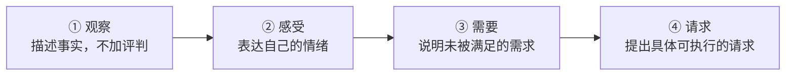
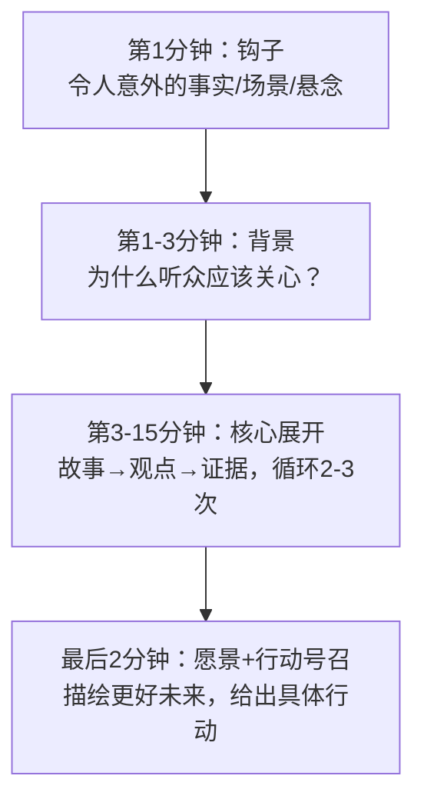
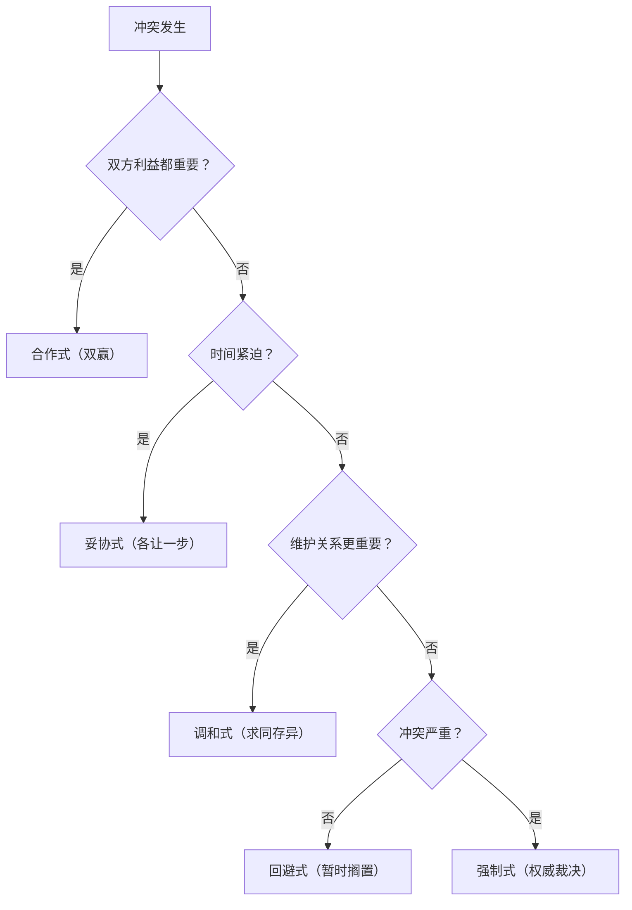
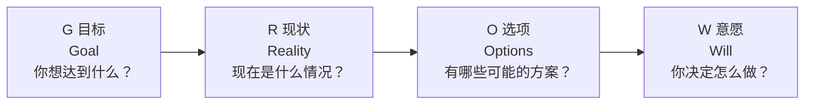
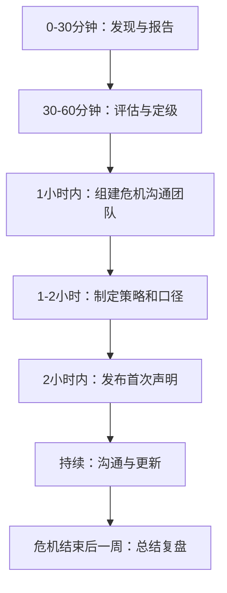
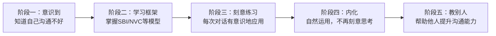

# 附录E 沟通工具箱

> 本附录收录了日常沟通中最常用的实用工具、模板和清单。这些工具经过大量实践验证，覆盖会议、邮件、演讲、谈判、冲突处理、反馈、沟通规划等核心场景。读者可以根据自身需要选择使用，也可以在此基础上进行个性化调整，逐步建立属于自己的沟通工具体系。

本工具箱的组织逻辑遵循"由快到慢、由简到繁"的原则：

| 板块 | 定位 | 典型使用场景 |
|------|------|-------------|
| 快速查阅卡 | 30秒内找到公式 | 临时需要快速回应 |
| 会议工具 | 会前-会中-会后全覆盖 | 主持/记录/参与各类会议 |
| 邮件模板 | 10种高频场景即取即用 | 正式书面沟通 |
| 演讲大纲 | 从脚本到结构化大纲 | 公开演讲/汇报/路演 |
| 谈判清单 | 全周期核对清单 | 薪资/商务/合作谈判 |
| 冲突处理 | 流程图+调解脚本 | 团队/跨部门/客户冲突 |
| 反馈工具 | 5种模型+实操示例 | 绩效面谈/日常反馈 |
| 沟通计划 | 项目/变更/危机三类计划 | 项目管理/危机公关 |
| 数字工具 | 工具选型+使用建议 | 提升沟通效率的技术手段 |
| 自评工具 | 能力雷达图+提升路径 | 自我诊断与成长规划 |

---

## 一、快速查阅卡

> 这一部分收录了最常被"临时用到"的沟通公式。遇到紧急场景，直接翻到对应卡片，30秒内即可套用。

### 1.1 电梯演讲公式（30秒版本）

当你只有30秒向别人介绍一个想法、项目或自己时，使用这个公式：

我们发现 [目标人群] 在 [场景] 中面临 [痛点问题]。
我们的 [方案名称] 通过 [核心方法] 帮助他们 [实现的价值]。
目前已有 [可信证据：数据/客户/成果]。

**示例：** "我们发现中小型电商商家在处理客户投诉时平均需要45分钟才能给出解决方案。我们的智能工单系统通过AI自动分类和模板推荐，将响应时间缩短到8分钟。目前已服务超过200家商家，客户满意度提升了35%。"

### 1.2 金字塔表达公式

任何汇报、说明、说服场景都适用的"结论先行"结构：

结论 → 原因1（+证据）→ 原因2（+证据）→ 原因3（+证据）→ 总结/行动建议

**示例：** "我建议将发布时间推迟两周（结论）。原因一，核心功能的性能测试发现3个P1级缺陷（证据：测试报告第12页）。原因二，目标客户下个月才有评审窗口（证据：客户邮件确认）。原因三，提前发布会压缩回归测试时间，上线风险不可控。建议推迟到X月X日发布，同时利用这两周完成性能优化。"

### 1.3 非暴力沟通（NVC）四步法

当对话中出现情绪、冲突或对方感觉被攻击时，用这四步重塑对话：

**错误示范：** "你总是开会迟到，太不尊重人了！"（评判+指责）

**正确示范：** "这周三次会议你都晚到了10分钟以上（观察），我感到有些焦虑（感受），因为准时开始对高效完成议程很重要（需要），你能否提前5分钟到会议室做好准备？（请求）"

### 1.4 DESC冲突表达公式

当需要指出问题但不想激化矛盾时：

| 步骤 | 含义 | 话术模板 |
|------|------|----------|
| **D**escribe | 描述事实 | "在XX场景下，发生了XX情况……" |
| **E**xpress | 表达感受 | "这让我感到……" |
| **S**pecify | 明确期望 | "我希望接下来可以……" |
| **C**onsequence | 说明收益 | "这样做的好处是……" |

**完整示例：** "上周三的代码评审中，你跳过了安全检查直接合并了PR（描述），我对此感到担忧（表达），因为我希望所有涉及权限变更的代码都经过安全审查（明确），这样我们能避免上线后出现安全漏洞，减少紧急修复的成本（收益）。"

### 1.5 "三明治"反馈法速记

肯定 → 改进建议 → 鼓励

**注意：** 三明治法适合日常轻反馈。对于严肃的绩效问题，建议使用本附录第六节的SBI或COIN模型，因为"三明治"在频繁使用后，员工听到表扬就知道后面跟批评，效果会递减。

### 1.6 拒绝话术三连

需要说"不"但不想伤关系时，使用"肯定+理由+替代方案"结构：

"这个想法/请求很好，我理解你的考虑。（肯定）
  目前我正在处理XX，如果分散精力可能两边都做不好。（理由）
  我建议可以……/下周XX时间我可以腾出手来帮你。（替代方案）"

---

## 二、会议工具

### 2.1 通用会议纪要模板

会议纪要是确保会议成果落地的关键文件。一份好的会议纪要应当简洁明了，突出重点，便于后续跟踪执行。

**【会议基本信息】**

- 会议主题：__________________________
- 会议时间：____年____月____日 ____:____至____:____
- 会议地点：__________________________
- 主持人：__________________________
- 记录人：__________________________
- 参会人员：__________________________
- 缺席人员：__________________________

**【会议议程】**

| 序号 | 议题 | 议题负责人 | 时间分配 |
|------|------|------------|----------|
| 1 | | | |
| 2 | | | |
| 3 | | | |

**【讨论内容摘要】**

| 议题 | 讨论要点 | 不同意见/争议 |
|------|----------|---------------|
| 议题一： | | |
| 议题二： | | |
| 议题三： | | |

**【决议事项】**

| 序号 | 决议内容 | 责任人 | 完成期限 | 状态 |
|------|----------|--------|----------|------|
| 1 | | | | 待执行 |
| 2 | | | | 待执行 |
| 3 | | | | 待执行 |

**【下次会议安排】**

- 时间：__________________________
- 议题预告：__________________________
- 需准备的材料：__________________________

### 2.2 会议纪要撰写五原则

| 原则 | 说明 | 反面案例 |
|------|------|----------|
| **及时性** | 会后24小时内完成并分发，超过48小时记忆衰减严重 | "上周的会我们确认了……好像是……" |
| **客观性** | 如实记录各方观点，不加记录人主观判断 | 将"A不太同意"改写为"A态度消极" |
| **明确性** | 决议必须有责任人+日期，杜绝"尽快""适当" | "由产品部尽快处理"→"由李明于3月15日前完成" |
| **简洁性** | 30分钟会议纪要控制在1页A4以内 | 逐字记录导致3页纪要无人阅读 |
| **可追溯性** | 每条决议有编号，便于后续跟踪引用 | 散文式记录，无法在下次会议中对应跟踪 |

### 2.3 会议效率检查清单

**会前（主持人准备）：**

- [ ] 明确会议目的：是决策、讨论还是信息同步？如果只需要信息同步，考虑用邮件替代
- [ ] 制定议程并提前24小时发送，每个议题标注时间和目标产出
- [ ] 确认必须参加的人员和可选参加的人员，控制参会人数（决策会不超过7人）
- [ ] 准备好需要提前阅读的材料并附在会议邀请中
- [ ] 预订会议室/测试线上会议链接和音视频设备

**会中（主持人控场）：**

- [ ] 准时开始，不等迟到者（等5分钟后开始是常见的妥协方案）
- [ ] 开场1分钟内重申会议目的和预期产出
- [ ] 控制每个议题的时间，超时议题记录待办后跳过
- [ ] 确保每个发言者直接说结论和依据，而非从背景开始讲故事
- [ ] 处理跑题："这个点很重要，我们记下来单独讨论，先回到当前议题"
- [ ] 结束前5分钟总结决议事项和责任人

**会后（跟进落实）：**

- [ ] 24小时内分发会议纪要
- [ ] 将决议事项录入项目管理工具（Jira/飞书/钉钉等）
- [ ] 在下次会议开场回顾上次决议的执行情况
- [ ] 对于连续3次未产出有效决议的定期会议，建议取消或重新设计

### 2.4 不同会议类型的主持要点

| 会议类型 | 最佳时长 | 关键主持技巧 | 常见陷阱 |
|----------|----------|-------------|----------|
| 每日站会 | 15分钟 | 每人限时2分钟，只说"昨天/今天/阻塞" | 演变成深度讨论 |
| 周例会 | 30-45分钟 | 先同步信息再解决问题，问题另起时间 | 流于形式、无人准备 |
| 头脑风暴 | 45-60分钟 | 不评判、追求数量、鼓励疯狂想法 | 过早否定、领导先定调 |
| 决策会 | 30-60分钟 | 提前分发方案材料，会上只讨论分歧点 | 没有准备就开会 |
| 项目复盘 | 60-90分钟 | 用时间线回顾，聚焦"下次怎么做"而非追责 | 变成追责会 |

---

## 三、邮件模板

### 3.1 邮件撰写黄金法则

在进入具体模板之前，掌握以下通用法则能让所有邮件质量提升一个档次：

**主题行公式：** 【类型标签】+ 核心信息 + 时间/编号（如有）

- 好的主题：`【审批请求】Q3市场预算方案 - 请于周五前批复`
- 差的主题：`关于一些事情` / `紧急！！！` / `Re: Re: Fwd: 会议`

**邮件金字塔结构：**

第一行：目的/请求（"请审批/请确认/FYI"）
第二行起：背景/关键信息（不超过5条要点）
最后：下一步行动 + 截止日期

**收件人规则：**
- **收件人（To）：** 需要采取行动的人
- **抄送（CC）：** 需要知晓但不需要行动的人
- **密送（BCC）：** 群发邮件保护收件人隐私，或向上级知会时避免"回复全部"

### 3.2 工作汇报邮件

**适用场景：** 向上级汇报工作进展、项目状态或阶段性成果。

主题：【工作汇报】XX项目进展报告（20XX年X月）

XX领导：

您好！

现将XX项目近期工作进展汇报如下：

一、本期工作完成情况
1. 【已完成】_______________
2. 【已完成】_______________
3. 【进行中】_______________（完成度：___%）

二、关键成果与亮点
_______________

三、存在的问题与风险
1. _______________
   应对措施：_______________

四、下期工作计划
1. _______________
2. _______________

如需进一步了解详细情况，请随时告知。

此致
敬礼

XXX
20XX年X月X日

**撰写要点：** 上级最关心的是"有没有风险"和"需要我做什么"。如果有风险，在第三部分清楚说明影响和你的应对方案；如果需要上级介入，直接说"需要您协助协调XX资源"，而不是等领导自己猜。

### 3.3 请求协助邮件

**适用场景：** 需要其他部门或同事提供支持和帮助时使用。

主题：【请求协助】关于XX事项的支持需求

XX同事：

您好！

我是XX部门的XXX。目前我们正在推进XX项目，在____方面遇到了一些挑战，
了解到贵部门在此领域有丰富的经验和资源，希望能得到您的支持和协助。

具体需求如下：
1. _______________
2. _______________

预计所需时间：_______________
希望完成时间：_______________

如您有时间，我们可以约一个简短的沟通会议，当面讨论具体细节。
您看本周哪个时间段比较方便？

非常感谢您的支持！

此致
敬礼

XXX
20XX年X月X日

**关键技巧：** 请求协助邮件最重要的是降低对方的决策成本。你需要说清楚"需要什么、花多长时间、什么时候要"，而不是笼统地说"能不能帮个忙"。

### 3.4 项目邀请邮件

**适用场景：** 邀请他人参与项目、加入团队或出席活动。

主题：【项目邀请】诚邀您参与XX项目

XX先生/女士：

您好！

我们即将启动XX项目，该项目旨在_______________。
鉴于您在_______________方面的专业能力和丰富经验，
我们诚挚地邀请您参与本项目。

项目基本信息：
- 项目名称：_______________
- 项目周期：_______________
- 您的角色：_______________
- 预期投入：_______________

参与本项目的价值：
1. _______________
2. _______________

如果您有兴趣参与，请回复本邮件确认，我们将安排详细沟通。

期待您的加入！

此致
敬礼

XXX
20XX年X月X日

### 3.5 道歉与解释邮件

**适用场景：** 因工作失误、延误或其他原因需要道歉时使用。

主题：【致歉】关于XX事项的说明与改进措施

XX先生/女士：

您好！

对于_______________一事，我深表歉意。此事给您/贵方带来了不便，
我对此负有不可推卸的责任。

事件原因说明：
_______________

目前已经采取的补救措施：
1. _______________
2. _______________

后续改进方案：
1. _______________
2. _______________

我将确保此类问题不再发生。如有任何进一步的需求，请随时联系我。

再次对此表示诚挚的歉意。

此致
敬礼

XXX
20XX年X月X日

**道歉三不原则：** 不推卸（"这不是我的错"）、不淡化（"其实也没多大事"）、不过度（连发5封道歉邮件反而显得不专业）。好的道歉 = 承认事实 + 说明原因（非借口）+ 补救措施 + 改进方案。

### 3.6 客户跟进邮件

**适用场景：** 与客户保持联系、推进合作进展。

主题：【XX公司】关于XX合作的跟进

XX总：

您好！

感谢您上次与我们的深入交流。根据我们讨论的内容，
现将相关事项整理如下：

一、上次沟通要点回顾
_______________

二、我们承诺的后续动作
1. 【已完成】_______________
2. 【进行中】_______________

三、建议下一步安排
_______________

如有任何问题或需要调整的地方，请随时告知。
期待我们继续深入合作。

此致
敬礼

XXX
20XX年X月X日

### 3.7 感谢邮件

**适用场景：** 感谢他人的帮助、支持或合作。

主题：【感谢信】衷心感谢您的支持与帮助

XX先生/女士：

您好！

我写这封邮件是为了表达我最诚挚的感谢。
在_______________中，您给予了我极大的帮助和支持。

具体而言：
1. _______________
2. _______________

您的帮助不仅解决了_______________的问题，
更让我深刻感受到了_______________。

今后如有任何需要我效劳的地方，请随时联系我。再次感谢！

此致
敬礼

XXX
20XX年X月X日

### 3.8 会议邀请邮件

**适用场景：** 正式邀请参会人员出席工作会议或讨论。

主题：【会议邀请】XX议题讨论会（X月X日XX:XX）

各位同事：

您好！

兹定于____年____月____日（星期__）____:____召开XX讨论会，
届时请您拨冗出席。

会议详情如下：
- 主题：_______________
- 时间：_______________
- 地点/线上链接：_______________
- 主持人：_______________
- 预计时长：___分钟

会议议程：
1. _______________（___分钟）
2. _______________（___分钟）
3. _______________（___分钟）

请提前准备：
1. _______________
2. _______________

请于X月X日前回复是否能够出席。如有任何疑问，请联系我。

此致
敬礼

XXX
20XX年X月X日

### 3.9 跨部门协调邮件

**适用场景：** 需要与其他部门协调资源、解决跨部门问题时使用。

主题：【跨部门协调】关于XX事项的协作需求

XX部门XX经理：

您好！

我是XX部门的XXX。目前我们在推进XX工作过程中，
涉及与贵部门的协作，特此邮件沟通。

背景说明：
_______________

具体协作需求：
1. _______________
2. _______________

建议协作方式：
_______________

时间节点要求：
_______________

如方便，希望能安排一次面对面沟通，就具体细节进行讨论。
您看哪天比较合适？

感谢您的支持与配合！

此致
敬礼

XXX
20XX年X月X日

**跨部门沟通的关键：** 永远先说"对对方的价值"，再说"我需要什么"。例如，不要说"我们需要你们提供数据"，而是说"通过共享数据，我们可以减少你们部门30%的重复报表工作"。

### 3.10 绩效反馈邮件

**适用场景：** 向下属或团队成员发送正式的绩效反馈。

主题：【绩效反馈】XX季度工作表现反馈

XX同事：

您好！

现将您在XX季度的工作表现反馈如下，
希望能帮助您更好地了解自身的优势和发展方向。

一、突出表现
1. _______________
2. _______________

二、工作成果评估
| 工作目标 | 完成情况 | 评分 |
|----------|----------|------|
| _______________ | _______________ | __/10 |
| _______________ | _______________ | __/10 |

三、发展建议
1. _______________
2. _______________

四、下季度重点目标
1. _______________
2. _______________

如有任何疑问或希望进一步讨论，欢迎随时找我面谈。

此致
敬礼

XXX
20XX年X月X日

### 3.11 通知公告邮件

**适用场景：** 向团队或组织传达重要通知、政策变更等信息。

主题：【重要通知】关于XX事项的通知

各位同事：

您好！

现将有关XX事项通知如下：

一、通知内容
_______________

二、执行时间
自____年____月____日起执行。

三、具体要求
1. _______________
2. _______________
3. _______________

四、注意事项
_______________

五、咨询方式
如有疑问，请联系_______________。

请各位周知并遵照执行。

此致
敬礼

XXX（XX部门）
20XX年X月X日

---

## 四、演讲大纲模板

### 4.1 标准演讲大纲

一份清晰的演讲大纲是成功演讲的基础。以下是适用于大多数正式场合的演讲大纲模板：

**【演讲基本信息】**

- 演讲主题：__________________________
- 演讲时长：________分钟
- 目标听众：__________________________
- 演讲目的：□ 传递信息  □ 说服影响  □ 激励鼓舞  □ 教育培训
- 核心信息（用一句话概括）：__________________________

**【开场部分】（占总时长10-15%）**

开场的目标是吸引注意力、建立连接、预告内容。

- 注意力获取方式：
  - 讲述一个引人入胜的故事
  - 提出一个发人深省的问题
  - 引用一组震撼的数据
  - 展示一张冲击力强的图片
  - 使用一个恰当的幽默
- 开场白内容：__________________________
- 自我介绍（如需要）：__________________________
- 演讲内容预告：__________________________

**【主体部分】（占总时长70-80%）**

主体部分通常包含2-4个核心论点，每个论点的结构如下：

**论点一：__________________________**
- 支撑论据/数据：__________________________
- 案例/故事：__________________________
- 可视化材料：__________________________
- 过渡语：__________________________

**论点二：__________________________**
- 支撑论据/数据：__________________________
- 案例/故事：__________________________
- 可视化材料：__________________________
- 过渡语：__________________________

**论点三：__________________________**
- 支撑论据/数据：__________________________
- 案例/故事：__________________________
- 可视化材料：__________________________
- 过渡语：__________________________

**【结尾部分】（占总时长10-15%）**

- 核心信息重述：__________________________
- 行动号召：__________________________
- 结束语：__________________________
- 问答环节预告（如有）：__________________________

### 4.2 TED风格演讲大纲

TED风格的演讲强调故事性、思想性和感染力，结构更加灵活：

**TED演讲的六个核心法则：**

| 法则 | 说明 | 示例 |
|------|------|------|
| 一个核心观点 | 整场演讲只传递一个思想 | 西蒙·斯涅克只讲"从为什么开始" |
| 故事先行 | 用故事唤起情感共鸣，再用逻辑支撑 | 布琳·布朗先讲自己"脆弱"的故事 |
| 不要念稿 | 用关键词提示，保持眼神交流 | TED创始人Chris Anderson建议只用小卡片 |
| 18分钟上限 | 认知科学研究表明这是注意力的极限 | TED严格限制所有演讲为18分钟 |
| 用"你"而非"我" | 让听众感到这与他们有关 | "想象你明天醒来发现……" |
| 结尾给行动 | 演讲不是结束语，而是行动的开始 | "从今天开始，每天花5分钟……" |

### 4.3 演讲排练检查清单

- [ ] 试讲至少3次，每次计时
- [ ] 第1次：对着镜子讲，检查表情和手势
- [ ] 第2次：录视频回放，检查口头禅和肢体语言
- [ ] 第3次：找1-2位朋友试听并收集反馈
- [ ] 准备2-3个过渡语以防忘词时衔接
- [ ] 准备好每张PPT的"一句话要点"，万一忘词可以从这里恢复
- [ ] 提前到场测试设备（投影、翻页笔、麦克风）
- [ ] 准备一个备用方案（U盘拷贝、打印版大纲、离线PPT）

---

## 五、谈判准备清单

### 5.1 谈判前准备清单

充分的准备是谈判成功的基石。在每次重要谈判前，请逐一核对以下事项：

**【信息收集】**

- [ ] 了解对方谈判代表的背景、决策权限和谈判风格
- [ ] 研究对方组织的基本情况、近期动态和战略方向
- [ ] 了解行业标准和市场行情
- [ ] 收集类似谈判案例的参考信息
- [ ] 了解对方可能的利益诉求和痛点

**【目标设定】**

- [ ] 明确自己的最佳结果（理想目标）
- [ ] 设定可接受的结果范围
- [ ] 确定底线（不可退让的最低条件）
- [ ] 准备替代方案（BATNA：谈判协议最佳替代方案）
- [ ] 设定让步策略——哪些条件可以灵活调整，每次让步的幅度

**【策略规划】**

- [ ] 确定开场策略——如何设定谈判基调
- [ ] 准备关键议题的论证材料和数据支撑
- [ ] 预判对方可能提出的反对意见，并准备应对方案
- [ ] 设计提问策略——通过提问获取关键信息
- [ ] 确定谈判的节奏控制策略

**【团队准备】**

- [ ] 确定谈判团队的人员组成和角色分工
- [ ] 明确谁是主谈人、谁负责记录、谁负责技术支持
- [ ] 进行内部预演和模拟谈判
- [ ] 统一团队口径和底线信息
- [ ] 确定团队沟通暗号（如需要在谈判中传递信息）

**【后勤准备】**

- [ ] 确认谈判的时间、地点和议程
- [ ] 准备好所有需要的文件、资料和展示材料
- [ ] 测试投影仪、电脑等设备（如需要）
- [ ] 准备谈判记录工具
- [ ] 安排好谈判后的内部总结会议

### 5.2 BATNA计算工作表

BATNA（Best Alternative to a Negotiated Agreement，谈判协议最佳替代方案）是谈判中最重要的概念之一。你的BATNA越强，你的谈判力量越大。

第一步：列出如果本次谈判破裂，你有哪些替代选择
1. _______________
2. _______________
3. _______________

第二步：评估每个替代选择的可行性和吸引力
| 替代方案 | 可行性(1-10) | 吸引力(1-10) | 综合得分 |
|----------|-------------|-------------|----------|
| 方案1 | | | |
| 方案2 | | | |
| 方案3 | | | |

第三步：确定你的最佳替代方案和保留价值
最佳替代方案：_______________
保留价值（低于此价值不如选择BATNA）：_______________

第四步：预判对方的BATNA
对方可能的替代方案：_______________
对方的保留价值估计：_______________

第五步：确定谈判区间
你的保留价值：_______________ → 对方的保留价值：_______________
双方重叠区间（可能达成协议的范围）：_______________

### 5.3 谈判中检查清单

谈判进行过程中的关键检查点：

- [ ] 开场是否建立了良好的氛围
- [ ] 是否充分倾听了对方的诉求
- [ ] 是否通过提问获取了关键信息
- [ ] 讨论是否聚焦在利益而非立场上
- [ ] 是否及时记录了双方的关键表态
- [ ] 是否在让步前获得了对方的相应让步
- [ ] 是否控制住了自己的情绪
- [ ] 是否注意到了非语言信号
- [ ] 是否保持了灵活性，没有被锁定在固定立场上

**谈判中的七个常用话术：**

| 场景 | 话术 | 目的 |
|------|------|------|
| 需要时间思考 | "这是一个好问题，让我想一想。" | 避免仓促回应 |
| 探测底线 | "如果我们在XX方面做出调整，您能在YY方面考虑什么？" | 交换条件 |
| 化解僵局 | "看起来我们在这个点上还有分歧，我们先搁置，聊聊其他议题？" | 跳过卡点 |
| 拒绝不合理要求 | "我理解您的想法，但从我们的角度来看……" | 温和拒绝 |
| 试探诚意 | "您能帮我理解一下，这个数字是怎么得出的吗？" | 获取信息 |
| 推动决策 | "如果我们今天能达成一致，您这边的审批流程是怎样的？" | 锁定进展 |
| 留退路 | "让我回去和团队商量一下，明天给您回复。" | 避免当场被逼承诺 |

### 5.4 谈判后复盘清单

谈判结束后的复盘要点：

- [ ] 谈判结果与预期目标的差距分析
- [ ] 成功的地方有哪些？原因是什么？
- [ ] 失误的地方有哪些？如何改进？
- [ ] 对方的谈判策略值得学习的地方
- [ ] 后续需要落实的事项和责任人
- [ ] 经验教训记录和归档

---

## 六、冲突处理流程

### 6.1 冲突识别与评估

当发现潜在冲突时，首先需要进行识别和评估。以下是冲突处理的完整流程：

**第一步：冲突识别**

识别冲突的信号通常包括：沟通频率下降、语气变化、回避行为、团队协作效率下降、负面情绪蔓延等。当观察到这些信号时，需要及时介入，防止冲突升级。

**第二步：冲突评估**

在介入之前，需要对冲突的性质、严重程度和影响范围进行评估：

| 评估维度 | 低 | 中 | 高 |
|----------|-----|-----|-----|
| 冲突类型 | 任务冲突（对事） | 过程冲突（对方法） | 关系/价值冲突（对人） |
| 严重程度 | 轻微分歧 | 明显对立 | 严重对抗 |
| 影响范围 | 个人之间 | 小团队 | 跨部门/全公司 |
| 持续时间 | 偶发 | 反复出现 | 长期积累 |
| 升级风险 | 可自然消解 | 可能恶化 | 随时爆发 |

**评估规则：** 3个维度以上为"高"时，必须立即介入；2个"高"时应在48小时内处理；全部为"低"时可观察但不放任。

**第三步：选择处理策略**

根据冲突评估结果，选择合适的处理策略。常用的冲突处理策略有五种：

| 策略 | 适用场景 | 操作方法 | 风险 |
|------|----------|----------|------|
| **合作式（双赢）** | 双方利益都重要，需要创造性方案 | 深入了解双方真实需求，共同探索满足双方核心需求的方案 | 耗时较长 |
| **妥协式（各让一步）** | 时间紧迫，双方力量相当 | 明确核心诉求和可让步空间，找中间方案 | 可能双方都不满意 |
| **调和式（求同存异）** | 维护关系比解决问题更重要 | 强调共同点，淡化分歧，先在容易方面取得进展 | 问题可能被搁置 |
| **回避式（暂时搁置）** | 冲突不严重或时机不对 | 给双方冷静时间和空间，设定后续讨论时间节点 | 问题可能积累 |
| **强制式（权威裁决）** | 紧急情况或原则性问题 | 权威人士做出决策并说明理由 | 可能损害关系和士气 |

### 6.2 冲突调解对话流程

当需要进行正式的冲突调解时，建议按照以下对话流程进行：

**阶段一：建立安全氛围（5分钟）**

调解人话术：
"感谢两位今天愿意坐下来沟通。我们今天的目标是找到一个双方都能接受的
解决方案，而不是判断谁对谁错。在开始之前，我想确认几个基本规则：
1. 每个人都有充分表达的机会，不打断对方
2. 我们讨论具体的事情和行为，而不是评价人
3. 今天我们说的内容不外传
大家同意这些规则吗？"

**阶段二：倾听各方诉求（各10-15分钟）**

- 让每一方不受干扰地表达自己的观点和感受
- 调解人使用积极倾听技巧（复述、确认、情感标注）
- 记录关键诉求和情感
- 不做评判，不做裁决

调解人话术：
"我听到你说的是……（复述要点），我理解得对吗？"
"听起来你对这件事感到……（情感标注），是这样吗？"

**阶段三：确认共同利益（10分钟）**

- 总结双方的核心诉求
- 找出双方的共同利益和共同目标
- 引导双方从对立立场转向共同解决问题

调解人话术：
"让我总结一下。你们两位都希望……（共同点），
不同的是在……（分歧点）上各有考量。
如果我们从共同目标出发，有没有可能找到一个兼顾双方需求的方案？"

**阶段四：探索解决方案（15-20分钟）**

- 头脑风暴可能的解决方案
- 评估每个方案的可行性
- 引导双方选择最优方案
- 明确具体的行动计划和时间节点

**阶段五：达成协议并跟进（5分钟）**

- 总结达成的共识
- 明确各方的责任和行动项
- 设定跟进检查的时间点
- 对双方的合作态度表示肯定

### 6.3 跨文化冲突注意事项

在跨文化团队中处理冲突时，需要额外注意以下差异：

| 维度 | 高语境文化（如中日韩） | 低语境文化（如美德澳） |
|------|----------------------|----------------------|
| 冲突表达 | 倾向间接表达，通过暗示和非语言信号 | 倾向直接表达，明确说出问题 |
| 面子观 | 非常重视"面子"，公开冲突是大忌 | 可以公开辩论，不视为个人攻击 |
| 决策方式 | 倾向层级决策，尊重权威 | 倾向民主协商，接受挑战 |
| 调解方式 | 需要中间人私下协调 | 可以面对面直接沟通 |

**实操建议：** 如果你的团队有不同文化背景的成员，在制定团队沟通规范时，提前讨论"当出现分歧时，我们希望怎样处理"这个问题，建立团队层面的共识，而非默认某种文化的方式。

---

## 七、反馈工具

### 7.1 SBI反馈模型

SBI（Situation-Behavior-Impact）是最经典的反馈模型之一，通过描述情境、行为和影响来给出具体、客观的反馈。

**正面反馈示例：**

| 要素 | 内容 |
|------|------|
| **情境（Situation）** | 在昨天下午的客户提案会议上， |
| **行为（Behavior）** | 你在客户提出价格异议时，没有急于反驳，而是先肯定了客户的顾虑，然后用三个具体案例说明了我们方案的价值， |
| **影响（Impact）** | 这让客户从最初的质疑转变为认可，最终顺利签约。整个团队都对你专业的处理方式印象深刻。 |

**改进建议反馈示例：**

| 要素 | 内容 |
|------|------|
| **情境（Situation）** | 在上周五的团队周会上， |
| **行为（Behavior）** | 当小张汇报项目进展时，你多次打断他的发言，并且语气比较生硬， |
| **影响（Impact）** | 小张看起来有些受挫，后面的汇报变得不太自信。其他同事也开始在汇报时变得紧张，担心也会被打断。这影响了整个团队的沟通氛围。 |

### 7.2 COIN反馈模型

COIN（Context-Observation-Impact-Next Steps）模型比SBI多了"下一步"环节，更适合需要改变行为的情境。

背景（Context）：    在__________（具体场景/时间段），
观察（Observation）：我注意到你__________（描述具体行为，避免主观判断），
影响（Impact）：    这导致了__________（描述对工作、团队或客户的具体影响），
下一步（Next Steps）：我建议你可以尝试__________（给出具体的改进建议）。
                    你觉得这个建议可行吗？我们可以一起讨论如何落实。

**COIN vs SBI 对比：**

| 模型 | 结构 | 最佳适用场景 | 局限 |
|------|------|-------------|------|
| SBI | 情境-行为-影响 | 即时反馈、简单场景 | 缺少改进行动 |
| COIN | 背景-观察-影响-下一步 | 需要行为改变的场景 | 需要更多准备时间 |

### 7.3 STAR正向反馈模型

用于表扬和认可他人的优秀表现，让表扬不再空洞：

情境（Situation）：  描述行为发生的具体场景
任务（Task）：      说明当事人面临的任务或挑战
行动（Action）：    描述当事人采取的具体行动
结果（Result）：    说明行动带来的积极结果

**示例：**

- **S：** 上个月系统出现了一次严重的线上故障，
- **T：** 你是当周的值班工程师，需要在最短时间内定位和修复问题，
- **A：** 你在15分钟内完成了问题定位，快速制定了回滚方案，并主动在故障群中每10分钟同步一次修复进度，
- **R：** 故障在45分钟内完全恢复，客户影响降到了最低。CTO在全员会上特别表扬了这次应急响应。

### 7.4 GROW教练反馈模型

GROW模型适用于辅导下属成长，不是告诉他们答案，而是通过提问引导他们自己找到方案：

**GROW提问清单：**

| 阶段 | 典型问题 |
|------|----------|
| **目标（Goal）** | "你希望在XX方面达到什么状态？" "如果一切顺利，3个月后会是什么样？" |
| **现状（Reality）** | "目前的情况是怎样的？" "你已经尝试过哪些方法？效果如何？" "哪些因素在阻碍你？" |
| **选项（Options）** | "你有哪些选择？" "如果你有无限资源，你会怎么做？" "你见过别人用什么方法？" |
| **意愿（Will）** | "你最倾向哪个方案？" "第一步你打算怎么做？" "什么时候开始？需要什么支持？" |

**使用GROW的注意事项：** 教练式反馈的核心是"不给答案"。当管理者忍不住想说"你应该这样做"时，改用"你觉得可以怎么做？"来替代。研究表明，被引导出来而非被告知的解决方案，执行率高出3倍。

### 7.5 负面反馈五步法

当需要进行严肃的、涉及问题行为的反馈对话时，按以下五个步骤进行：

**第一步：准备阶段**
- 收集具体事实和证据，不要只凭印象
- 选择合适的私密场所
- 预估对方可能的反应并准备应对方案
- 确保自己情绪稳定

**第二步：开场（1分钟）**
"小X，我想和你聊一聊关于XX方面的情况。这不是一个批评会，
而是希望我们一起找到改进的方向。"

**第三步：说明事实（2-3分钟）**
使用SBI模型描述具体的行为和影响。
关键：只说可观察的行为，不做人格评价。
错误："你态度有问题" → 正确："在上周的会议上，你三次打断了同事的发言"

**第四步：倾听与讨论（3-5分钟）**
"我想听听你的看法。当时是什么情况？"
"你觉得是什么原因导致了这个情况？"
- 认真倾听，可能你不知道的背景信息
- 承认合理的解释，但不要轻易否定问题本身

**第五步：达成共识与行动计划（2-3分钟）**
"那我们接下来可以这样：……你觉得呢？"
"我建议我们在两周后再聊一次，看看进展如何。"
- 行动计划要具体：做什么、什么时候做、怎么衡量
- 表达信心："我相信你能做好"

### 7.6 360度反馈问卷模板

以下是360度反馈问卷的核心维度和问题：

**维度一：沟通能力**
1. 该同事是否能够清晰地表达自己的想法？（1-10分）
2. 该同事是否善于倾听他人的意见？（1-10分）
3. 该同事在书面沟通中是否准确、简洁？（1-10分）

**维度二：团队协作**
1. 该同事是否积极配合团队工作？（1-10分）
2. 该同事是否愿意分享知识和经验？（1-10分）
3. 该同事在团队冲突中是否表现得体？（1-10分）

**维度三：领导力**
1. 该同事是否能够有效激励团队成员？（1-10分）
2. 该同事在决策时是否考虑周全？（1-10分）
3. 该同事是否以身作则？（1-10分）

**维度四：问题解决**
1. 该同事面对困难时是否能保持冷静？（1-10分）
2. 该同事是否善于找到问题的根本原因？（1-10分）
3. 该同事的解决方案是否具有创新性？（1-10分）

**维度五：职业素养**
1. 该同事是否信守承诺？（1-10分）
2. 该同事是否主动承担责任？（1-10分）
3. 该同事是否持续学习和成长？（1-10分）

**开放性问题：**
1. 该同事最大的优势是什么？
2. 该同事最需要改进的方面是什么？
3. 你对与该同事合作有什么建议？

---

## 八、沟通计划模板

### 8.1 项目沟通计划

一份完整的项目沟通计划能够确保项目信息在正确的时间传递给正确的人。

**【项目基本信息】**

- 项目名称：__________________________
- 项目经理：__________________________
- 沟通计划编制人：__________________________
- 编制日期：__________________________
- 版本号：__________________________

**【干系人分析】**

| 干系人 | 角色 | 信息需求 | 影响力 | 沟通频率 | 沟通方式 |
|--------|------|----------|--------|----------|----------|
| | | | 高/中/低 | | |
| | | | 高/中/低 | | |
| | | | 高/中/低 | | |

**【沟通矩阵】**

| 沟通事项 | 发起人 | 接收人 | 频率 | 方式 | 内容要点 |
|----------|--------|--------|------|------|----------|
| 项目周报 | PM | 全体成员 | 每周 | 邮件 | 进展、风险、下周计划 |
| 状态汇报 | PM | 高管 | 每两周 | 会议 | 关键里程碑、预算、风险 |
| 风险预警 | 项目成员 | PM | 即时 | 即时消息 | 风险描述、影响评估 |
| 变更通知 | PM | 全体成员 | 按需 | 邮件+会议 | 变更内容、影响分析 |
| 里程碑报告 | PM | 干系人 | 按里程碑 | 正式报告 | 成果、质量、偏差分析 |

**【沟通规范】**

1. **邮件规范：** 项目相关邮件使用统一的主题格式：`【项目名称】【类型】简要描述`。邮件抄送规则为直接相关人员抄送，间接相关人员密送。
2. **会议规范：** 所有会议必须提前24小时发送邀请并附上议程。会议结束后24小时内分发会议纪要。
3. **文档管理：** 所有项目文档存储在统一的共享平台上，使用统一的命名规则和版本管理。
4. **即时沟通：** 紧急事项使用即时通讯工具，但重要决策和信息必须通过邮件确认留痕。

### 8.2 变更沟通计划

当项目发生重大变更时，需要制定专门的变更沟通计划：

**【变更概述】**
- 变更内容：__________________________
- 变更原因：__________________________
- 变更影响范围：__________________________
- 变更生效时间：__________________________

**【沟通时间线】**

| 时间节点 | 动作 | 负责人 | 接收人 | 方式 |
|----------|------|--------|--------|------|
| 变更确认后立即 | 内部团队通报 | PM | 核心团队 | 会议 |
| 24小时内 | 干系人通知 | PM | 关键干系人 | 邮件+电话 |
| 48小时内 | 全员公告 | PM | 全体成员 | 公告 |
| 一周内 | 详细说明会 | PM | 所有受影响方 | 会议 |

### 8.3 危机沟通计划

危机发生时的沟通至关重要，以下是危机沟通计划的核心要素：

**【危机分级】**

| 级别 | 影响范围 | 决策层级 | 响应时限 |
|------|----------|----------|----------|
| 一级（重大） | 公司声誉/重大经济损失 | CEO层面 | 1小时内响应 |
| 二级（较大） | 业务运营/客户关系 | VP层面 | 2小时内响应 |
| 三级（一般） | 影响范围有限 | 部门负责人 | 4小时内响应 |

**【危机沟通五原则】**

| 原则 | 说明 | 具体要求 |
|------|------|----------|
| 速度第一 | 2小时内发布首次回应 | 不要等信息完备才发声，先表态再补充 |
| 统一口径 | 所有对外信息必须审核 | 指定唯一发言人，其他人不得擅自接受采访 |
| 真诚透明 | 坦诚面对问题 | 不隐瞒、不推诿、不甩锅 |
| 以人为本 | 优先关注受影响人员 | 先处理人的情感，再处理技术问题 |
| 持续更新 | 定期发布最新进展 | 直到危机完全解决，不要"沉默消失" |

**【危机沟通流程】**

**首次声明模板（2小时内发布）：**

关于[事件]的声明

我们注意到[简述事件]。目前我们正在全力[采取的行动]。

我们对此事高度重视，已[已经采取的措施]。

我们将持续更新最新进展。如有疑问，请联系[指定联系方式]。

[公司名称]
[日期]

---

## 九、数字工具推荐

> 在数字化时代，善用工具能显著提升沟通效率。以下是按场景分类的工具推荐，涵盖免费和付费方案。

### 9.1 即时沟通工具

| 工具 | 核心优势 | 最佳场景 | 费用 |
|------|----------|----------|------|
| 企业微信/钉钉/飞书 | 与办公生态深度集成，审批/日程/文档一体 | 国内企业内部沟通 | 基础免费 |
| Slack | 频道式组织、强大的集成生态、搜索功能 | 技术团队/跨国团队 | 免费版够用 |
| Microsoft Teams | 与Office 365深度集成、视频会议质量高 | 已用微软生态的企业 | 含在M365订阅中 |
| Discord | 低延迟语音、社区管理功能强 | 开发者社区/游戏团队 | 免费 |

**选择建议：** 工具选择应服从团队已有习惯。如果团队已在微信沟通，换到Slack的迁移成本可能远大于效率收益。除非有明确的功能瓶颈（如需要大量集成、频道管理），否则不要为了"更专业"而换工具。

### 9.2 会议与协作工具

| 工具 | 核心优势 | 最佳场景 |
|------|----------|----------|
| 腾讯会议/飞书会议 | 国内网络稳定、大会议支持好 | 国内团队视频会议 |
| Zoom | 高清视频、虚拟背景、分组讨论室 | 跨国会议/大型研讨会 |
| Miro/FigJam | 在线白板、实时协作、模板丰富 | 远程头脑风暴/工作坊 |
| 腾讯文档/飞书文档 | 实时协作编辑、权限管理精细 | 文档协同编辑 |
| Notion | 文档+数据库+看板一体 | 知识库/项目管理/Wiki |

### 9.3 项目管理与任务跟踪

| 工具 | 核心优势 | 最佳场景 |
|------|----------|----------|
| 飞书多维表格 | 灵活的数据视图、自动化强 | 国内团队轻量项目管理 |
| Jira | 工作流自定义强、与开发工具集成深 | 技术团队敏捷管理 |
| Trello | 看板式、极其简单 | 小团队/个人任务管理 |
| Asana | 界面美观、多种视图、目标对齐 | 产品/设计团队 |
| GitHub Projects | 与代码仓库无缝集成 | 开源项目/开发者团队 |

### 9.4 邮件效率工具

| 工具 | 功能 | 适用场景 |
|------|------|----------|
| 邮件模板功能（Gmail/Outlook内置） | 保存常用邮件模板一键调用 | 高频重复邮件场景 |
| Boomerang（Gmail插件） | 定时发送、邮件追踪、提醒跟进 | 需要跨时区发送邮件 |
| Grammarly | 英文邮件语法检查和语气建议 | 英文商务邮件 |
| 5Email/163邮箱大师 | 邮件聚合、智能分类 | 多邮箱管理 |

### 9.5 工具选型决策框架

当你需要为团队选择沟通工具时，按以下步骤评估：

第一步：明确核心需求
  - 你们最需要解决的3个沟通痛点是什么？
  - 现有工具在哪里失效？

第二步：列出候选工具
  - 同行业/同规模的团队在用什么？
  - 有没有免费试用的方案？

第三步：做3周试点
  - 选一个小团队先试用3周
  - 收集使用频率、满意度、问题反馈

第四步：评估迁移成本
  - 历史数据能否迁移？
  - 学习成本有多高？
  - 与现有系统的集成难度？

第五步：决策
  - 不要追求"完美工具"，选一个"够好"的方案
  - 贯彻执行比频繁更换工具更重要

---

## 十、沟通自评工具

### 10.1 沟通能力自评表

请根据自己的实际情况，对以下各项进行评分（1分=非常差，10分=优秀）：

**倾听能力：**
- 我能够在对话中保持专注，不走神 __/10
- 我会通过复述来确认自己理解正确 __/10
- 我能够识别他人言语中的情感 __/10
- 我不会在别人说话时打断 __/10

**表达能力：**
- 我能够清晰简洁地表达自己的想法 __/10
- 我的发言逻辑清晰，层次分明 __/10
- 我能够根据听众调整表达方式 __/10
- 我善于使用故事和案例来说明观点 __/10

**书面沟通：**
- 我的邮件主题明确，内容简洁 __/10
- 我的报告结构清晰，数据准确 __/10
- 我能够用文字准确传达复杂信息 __/10

**非语言沟通：**
- 我能够保持恰当的眼神接触 __/10
- 我的肢体语言传递自信和开放 __/10
- 我能够读懂他人的非语言信号 __/10

**冲突管理：**
- 我能够在冲突中保持冷静 __/10
- 我善于寻找双赢的解决方案 __/10
- 我能够在必要时进行艰难对话 __/10

**总分：____/150**

**评估标准：**

| 分数段 | 评价 | 建议行动 |
|--------|------|----------|
| 120-150分 | 沟通能力优秀 | 可以担任团队沟通教练，辅导他人 |
| 90-119分 | 沟通能力良好 | 针对弱项重点练习，每季度自评一次 |
| 60-89分 | 需要系统提升 | 制定3个月学习计划，阅读本书相关章节 |
| 60分以下 | 需要专业指导 | 建议寻求专业培训或一对一教练 |

### 10.2 自评后的提升行动模板

完成自评后，用以下模板制定提升计划：

我的沟通能力提升计划

一、自评结果摘要
  总分：___/150
  最强维度：_______________（得分：___）
  最弱维度：_______________（得分：___）

二、聚焦提升的3个方面（选最弱的3个子项）
  1. _______________
     当前表现：_______________
     目标状态：_______________
     练习方法：_______________
     开始日期：_______________

  2. _______________
     当前表现：_______________
     目标状态：_______________
     练习方法：_______________
     开始日期：_______________

  3. _______________
     当前表现：_______________
     目标状态：_______________
     练习方法：_______________
     开始日期：_______________

三、3个月后再评
  预期总分提升至：___/150
  复盘日期：_______________

### 10.3 沟通能力成长路径

从入门到精通，沟通能力的提升可以分为五个阶段：

**每个阶段的时间参考和标志：**

| 阶段 | 时间 | 标志 | 常见卡点 |
|------|------|------|----------|
| 意识到 | - | 开始反思自己的沟通问题 | 很多人卡在"不知道自己不知道" |
| 学习框架 | 1-2个月 | 知道该怎么做但做不到 | 学了太多模型反而混乱 |
| 刻意练习 | 3-6个月 | 能在简单场景中运用模型 | 高压场景下退回旧习惯 |
| 内化 | 6-12个月 | 90%的场景自然运用 | 觉得自己"已经够好了"停止进步 |
| 教别人 | 持续 | 能分析并帮助他人提升 | 教学中发现自己的盲区 |

---

> **使用说明：** 本工具箱中的所有模板和工具仅供参考，读者应根据实际情况进行调整和定制。模板是起点而非终点，最好的模板是经过你反复使用和优化后最适合自己的版本。建议读者将这些工具打印出来或保存在电脑中，在日常工作中有意识地使用，逐步形成自己的沟通习惯和风格。
