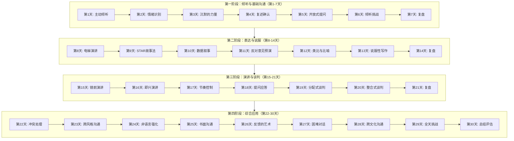
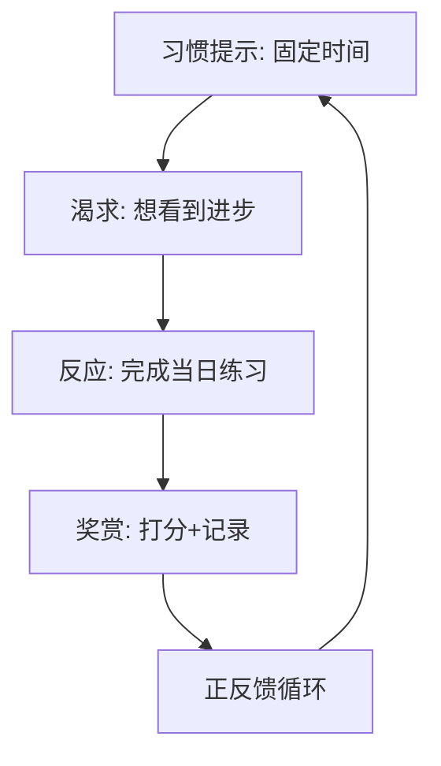
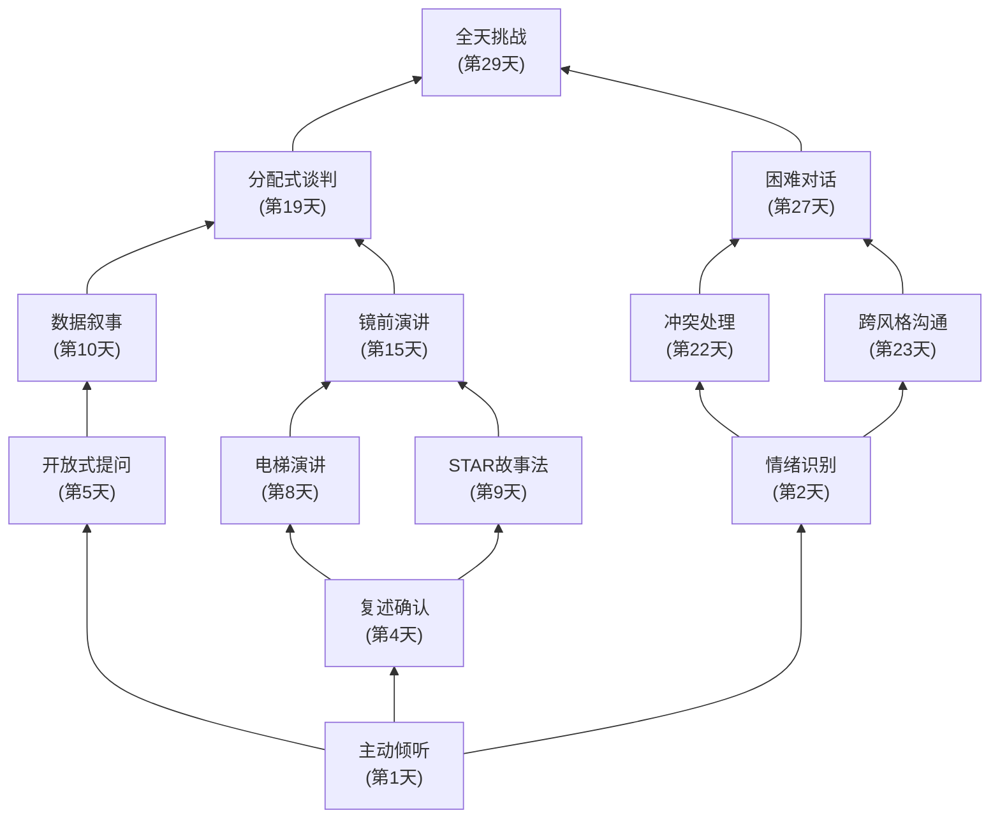
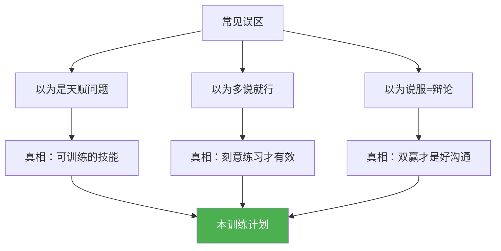
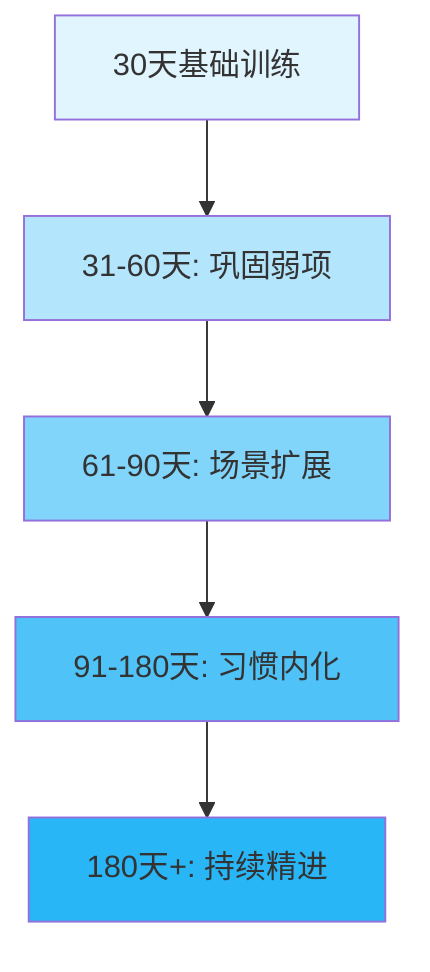
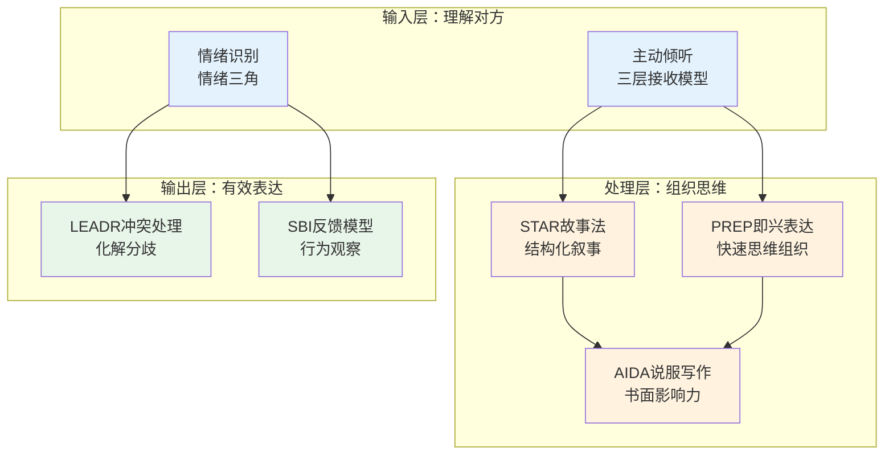

# 附录F 沟通训练30天计划

> 本附录设计了一套为期30天的沟通能力系统训练计划。这套计划不是30个孤立练习的简单堆叠，而是基于"刻意练习"理论和"习惯叠加"策略构建的渐进式训练体系。每天一个具体的练习任务，涵盖倾听、表达、说服、谈判、演讲、书面沟通、非语言沟通、冲突处理、跨文化沟通等核心领域。每个练习都包含明确的目标、详细的步骤、理论支撑和自我评估方法。坚持完成30天的训练，你将感受到沟通能力的显著提升——更重要的是，你将建立起持续精进的底层能力。
>
> **为什么你需要这份训练计划？** 大多数人认为沟通能力是"天赋"——有人天生会说话，有人天生不会。但认知科学研究反复证明，沟通是一项可训练的技能，和游泳、驾驶一样，遵循"知道怎么做→反复练习→自动化"的习得路径。你之所以在沟通中感到困难，不是因为你"不适合"，而是因为你从未系统地训练过。这30天，就是你的沟通"驾校"。

## 如何使用本训练计划

在正式开始之前，请花2分钟了解本计划的使用方式，这将显著提高你的训练效果。

### 计划结构

本计划分为四个阶段，每个阶段聚焦不同的能力维度，层层递进：

### 每日训练结构

每一天的练习都遵循统一的结构，确保你不会遗漏任何环节：

| 环节 | 时间 | 内容 | 目的 |
|------|------|------|------|
| 热身 | 2分钟 | 快速回顾今日目标，做心理准备 | 进入训练状态 |
| 理论学习 | 5-8分钟 | 阅读理论基础，理解"为什么" | 建立认知框架 |
| 核心练习 | 15-25分钟 | 按步骤完成当天的练习任务 | 刻意练习 |
| 反思记录 | 3-5分钟 | 填写自我评估，记录关键发现 | 巩固学习成果 |
| 可选深化 | 10-20分钟 | 追加练习或阅读推荐材料 | 加速提升 |

**核心练习只需20-30分钟**，适合工作日执行。可选深化部分适合周末或时间充裕时完成。

### 个性化路径：根据你的起点选择策略

不是每个人都需要从第1天按部就班地开始。根据你的自我评估结果，选择最适合你的训练策略：

| 你的起点 | 推荐策略 | 具体做法 |
|----------|----------|----------|
| 全面薄弱（总分<20/40） | 完整执行30天计划 | 按顺序完成每一天的练习，不要跳过任何一天 |
| 倾听尚可，表达较弱（倾听≥3，表达<3） | 从第8天开始 | 用第1-7天的练习作为日常热身，重点投入第8天起的表达训练 |
| 表达尚可，演讲/谈判弱（表达≥3，演讲<3） | 从第15天开始 | 前14天的技巧作为基础复习，重点突破演讲和谈判 |
| 各项均衡但都不突出 | 挑选弱项对应的天数 | 从30天中选出与你最弱的2-3个维度对应的天数，集中练习 |
| 已有基础，想精进 | 跳过认知阶段，直接综合应用 | 从第22天开始，重点关注第29天的全天挑战和第30天的评估 |

**判断标准**：如果你在某项能力上能举出3个以上具体的"做得好"的真实案例，说明该项已有基础；如果你举不出来，或者举出的都是"做得不好"的例子，说明该项需要从头训练。

### 5分钟快速启动：如果你只有5分钟

如果你现在就想开始，但没有时间读完整份说明，请执行以下三个步骤：

1. **完成自我评估**（3分钟）：打开"训练前准备"部分，给8项能力打分。不需要精确，凭直觉打分即可。
2. **找到你的起点**（1分钟）：根据评估结果，在"个性化路径"表中找到适合你的起始天数。
3. **设定训练时间**（1分钟）：在手机上设置一个每天固定时段的提醒，时长30分钟。

完成这三步，你就正式开始了。具体的练习内容在对应天数中详细展开，不需要一次性读完所有内容——**今天只需要读今天的练习就够了**。

### 30天进度里程碑

| 里程碑 | 天数 | 标志 | 预期感受 |
|--------|------|------|---------|
| 🌱 启动 | 第1天 | 完成第一次主动倾听练习 | "原来倾听这么难" |
| 🌿 扎根 | 第7天 | 完成第一阶段复盘 | "倾听确实有变化" |
| 🌳 破土 | 第14天 | 能用STAR法讲故事 | "我原来也能说服人" |
| 🌲 跃升 | 第21天 | 完成一次谈判模拟 | "沟通真的是可以练的" |
| 🎯 突破 | 第29天 | 全天运用所有技巧 | "有些技巧已经不需要想了" |
| 🏆 完成 | 第30天 | 完成最终评估 | "这30天值了" |

### 训练成果预期

基于刻意练习研究和实际训练数据，完成30天训练后你可以期待以下变化：

| 能力维度 | 训练前典型表现 | 训练后预期变化 | 提升机制 |
|----------|--------------|--------------|---------|
| 倾听能力 | 经常打断对方、容易走神、急于给建议 | 能专注倾听30分钟以上，准确复述对方核心观点 | 主动倾听+情绪识别+沉默练习 |
| 口头表达 | 说话没有重点、逻辑混乱、超时 | 能在60秒内说清核心价值，逻辑清晰、节奏得当 | 电梯演讲+STAR法+节奏控制 |
| 说服能力 | 只会堆砌论据、不会预判反对意见 | 能用故事和数据说服人，主动回应反对意见 | 数据叙事+反对意见预演+类比技巧 |
| 演讲能力 | 紧张、语速快、缺乏眼神交流 | 能自信地进行5分钟演讲，肢体语言自然 | 镜前练习+即兴演讲+节奏控制 |
| 谈判能力 | 要么太强硬要么太软弱 | 能识别对方利益，找到双赢方案 | BATNA分析+整合式谈判练习 |
| 冲突处理 | 回避冲突或情绪化应对 | 能冷静处理分歧，用LEADR框架引导解决 | 冲突处理+情绪管理+困难对话 |
| 书面沟通 | 邮件冗长、主题模糊、缺乏行动号召 | 邮件简洁有力，30秒内让读者明白三件事 | 结构化写作+精简练习+即时消息规范 |
| 非语言沟通 | 不知道自己有哪些小动作 | 能控制肢体语言，保持语言与非语言的一致性 | 镜前练习+视频回看+一致性自检 |

***

## 为什么是30天：训练设计的科学原理

### 技能习得的三个阶段

心理学家Fitts和Posner提出的技能习得三阶段模型，是本训练计划的理论基石：

| 阶段 | 特征 | 训练策略 | 对应本计划 |
|------|------|----------|-----------|
| 认知阶段 | 了解"做什么"和"怎么做"，需要大量注意力 | 分解动作、明确规则、放慢速度 | 第1-10天 |
| 联结阶段 | 动作开始流畅，错误减少，注意力需求降低 | 连贯练习、减少提示、增加变式 | 第11-20天 |
| 自动化阶段 | 技能内化，可以在复杂环境中自如运用 | 综合应用、压力测试、反思精进 | 第21-30天 |

大多数人放弃训练的原因是：在认知阶段（第1-10天）觉得"太不自然了"，误以为自己"不适合"。事实上，不自然恰恰说明你在学习新东西——就像学开车时需要想"先踩离合再换挡"，熟练后就完全自动化了。

### 为什么刻意练习有效

Anders Ericsson的研究表明，能力提升的关键不是练习时长，而是练习质量。刻意练习有四个核心要素，本计划全部融入：

1. **明确的改进目标**——每天的练习都有具体的能力靶点，不是泛泛地"练沟通"
2. **即时反馈机制**——通过自我评估、训练伙伴反馈、录音回听三种方式提供反馈
3. **舒适区边缘练习**——每天的难度略高于当前能力，既有挑战又不至于挫败
4. **心理表征的构建**——通过复盘和记录，在大脑中建立"好的沟通长什么样"的内部模型

Ericsson在对柏林音乐学院小提琴学生的研究中发现，顶尖演奏者与普通演奏者的关键区别不在于练习总时长，而在于"刻意练习"的时长——顶尖学生每天花更多时间在有针对性的、有反馈的、超出舒适区的练习上。沟通能力的训练遵循同样的规律：**不是"多说话"就能提升，而是"有目的地练习特定技巧"才能提升**。

### 习惯叠加：让训练坚持下去

根据James Clear在《原子习惯》中的研究，新习惯的建立依赖于"提示→渴求→反应→奖赏"的循环。本计划通过以下机制降低坚持的门槛：

- **固定时间触发**：每天同一时段练习，让"时间"成为自动提示
- **渐进式难度**：从最简单的倾听开始，避免一开始就面对高难度挑战产生畏难
- **每日打卡仪式**：自我评估的评分本身就是一种即时奖赏
- **阶段性成就感**：每7天的复盘让进步可视化，维持动力

**关键数据**：根据习惯追踪应用的统计，使用"习惯叠加"策略（将新习惯绑定到已有习惯上）的用户，30天坚持率比随机执行的用户高出2-3倍。建议你将沟通训练绑定到一个已有的日常习惯上，例如"每天早饭后20分钟"或"每天晚上睡前30分钟"。

### 技能依赖关系：为什么顺序不能乱

30天的训练顺序不是随意排列的，而是基于技能的依赖关系——前一个技能是后一个技能的"地基"：

这个图说明了三个重要原则：
1. **倾听是所有技能的地基**——如果你跳过第1-7天，后面的表达、说服、演讲都会缺少"输入端"
2. **表达技能层层递进**——电梯演讲→STAR故事→数据叙事→镜前演讲，每一步都建立在前一步之上
3. **综合技能需要多个前置技能**——困难对话需要同时运用倾听、情绪识别、冲突处理和跨风格沟通

***

## 训练前准备

### 第零步：评估你的起点

在开始30天训练之前，请先花15分钟完成以下自我评估。这不是走形式——研究表明，明确的"基线数据"能让训练效果的提升幅度提高40%，因为你能清晰地看到自己的进步轨迹。

请用1-5分评估以下能力（1=非常弱，5=非常强）：

| 能力维度 | 评分 | 具体表现 | 评估方法 |
|----------|------|----------|----------|
| 倾听能力 | \_\_/5 | 我能专注倾听他人说话，理解对方的真实意图 | 回忆上次重要对话，你复述了对方多少关键点 |
| 口头表达 | \_\_/5 | 我能清晰、有条理地表达自己的想法 | 用60秒介绍你的工作，能否让外行听懂 |
| 书面表达 | \_\_/5 | 我能写出简洁明了的邮件和报告 | 翻看最近发出的邮件，是否有超过3次被追问澄清 |
| 非语言沟通 | \_\_/5 | 我能控制自己的肢体语言，并读懂他人的非语言信号 | 你是否注意过自己紧张时的小动作 |
| 说服能力 | \_\_/5 | 我能有效地影响他人的观点和决策 | 上次说服别人采纳你的建议，花了多长时间 |
| 冲突处理 | \_\_/5 | 我能在冲突中保持冷静，找到解决方案 | 面对意见分歧时，你的第一反应是争辩还是倾听 |
| 演讲能力 | \_\_/5 | 我能在众人面前自信地演讲 | 上次在5人以上场合发言，你的紧张程度如何 |
| 谈判能力 | \_\_/5 | 我能在谈判中维护自己的利益并达成双赢 | 你是否有过"事后才想到该怎么说"的经历 |

**记录方法**：将评分拍照或写入训练日志的第一页。30天后，你将用同一套标准重新评估，对比差距。

**自评校准提示**：大多数人倾向于在自评时高估自己的倾听能力（研究显示，95%的人认为自己的倾听能力"高于平均水平"，这在统计学上是不可能的）。为了更准确地评估，可以请一位信任的朋友或同事对你的8项能力进行独立评分，取两者的平均值作为基线。

### 环境与工具准备

| 准备项 | 具体要求 | 为什么重要 |
|--------|----------|-----------|
| 训练日志 | 一本专用笔记本或电子文档，每天记录练习感受、评估分数和关键发现 | 书面记录能激活"生成效应"——写下来的信息比仅在脑中过一遍的记忆留存率高30% |
| 训练伙伴 | 1-2位愿意配合的朋友、同事或家人 | 社会承诺效应：有人监督的计划完成率比独自执行高65% |
| 固定时段 | 每天30-60分钟，最好固定在每天同一时段（建议早晨或晚间） | 时间锚点让习惯自动化，减少意志力消耗 |
| 录音设备 | 手机的录音/录像功能即可 | 回听/回看是发现盲区最有效的方式——你以为的和实际表现之间往往有巨大差距 |
| 每日提醒 | 手机闹钟或日历提醒 | 在习惯未固化之前（通常前21天），外部提醒是必要的脚手架 |

**推荐的训练日志模板**：

日期：____年__月__日  第__天
今日练习：________________
核心练习时长：____分钟

练习记录：
- 做了什么：________________
- 对方反应：________________
- 我的感受：________________

自我评估：____/10
最大的发现：________________
明天要改进的：________________

### 常见的启动障碍及应对

| 障碍 | 典型表现 | 应对策略 |
|------|---------|----------|
| 完美主义 | "我要找到最佳时机再开始" | 设定最低标准：哪怕只完成当天练习的50%，也算完成。不完美的行动胜过完美的计划 |
| 时间焦虑 | "每天60分钟太长了" | 核心练习只需20分钟，其余是可选的深化练习。先保证20分钟，再逐步扩展 |
| 社交恐惧 | "不好意思找人练习" | 前7天的练习都是在日常对话中自然进行的，不需要特意"表演"。第8天起的练习也可以先独自完成 |
| 效果怀疑 | "练了几天没感觉" | 沟通能力的提升遵循"S型曲线"——前期是缓慢的积累期，通常在第14-21天会出现明显的突破 |

### 中间阶段动力维持：如何度过第8-17天的"危险区"

统计数据显示，30天计划中约60%的放弃发生在第8-17天。这个阶段的特征是：新鲜感消退、技巧还不够熟练、看不到明显进步。以下是经过验证的度过危险区的策略：

| 危险信号 | 你的感受 | 应对策略 |
|----------|---------|---------|
| "没什么用" | 练了几天感觉不到变化 | 回看训练日志第1天的记录，对比今天的表现——你可能已经有了变化但没意识到 |
| "太刻意了" | 运用技巧时感觉像在演戏 | 减少同时使用的技巧数量，每次只专注1个，其余让其自然流动 |
| "没时间" | 工作太忙，练习被挤压 | 使用5分钟微练习版本：在一次对话中只练一个技巧 |
| "不好意思" | 找人练习感觉尴尬 | 不需要告诉对方你在"练习"——所有技巧都可以自然地融入日常对话 |
| "无聊了" | 重复的练习缺乏新鲜感 | 尝试新的练习场景（和不同的人、在不同的环境），或挑战更高难度的变体 |

**三个救命锦囊：**

1. **"2分钟法则"**——当不想练习时，告诉自己"只做2分钟"。开始后往往会继续下去。即使真的只做了2分钟，也比0分钟强100倍。
2. **"找一个见证人"**——在朋友圈或训练伙伴群里每天发一个打卡标记（哪怕只是一个表情），社会承诺效应能提升坚持率65%。
3. **"允许降级"**——如果今天没有20分钟，做10分钟；没有10分钟，做5分钟的微练习。关键是不断——降级可以，中断不行。

***

## 90%的人不知道的沟通真相：常见误区全景

在开始训练之前，先清除你脑中可能存在的错误认知。这些误区是大多数人在沟通中"越努力越差"的根本原因。

| 误区 | 为什么它是错的 | 真相 | 对应训练日 |
|------|-------------|------|-----------|
| "沟通能力是天生的" | 混淆了"性格外向"和"沟通能力强" | 外向的人说话多≠说得好。内向者往往是更好的倾听者，而倾听是沟通的基石 | 第1-7天 |
| "多说话就能提升沟通" | 低质量的重复不会带来进步 | 刻意练习>大量练习。10分钟有目的的练习胜过1小时无意识的闲聊 | 全程 |
| "好的沟通就是会说话" | 忽略了倾听、非语言、书面等维度 | 高效沟通者70%的时间在倾听。"说"只是冰山一角 | 第1-7天、第24天 |
| "说服就是赢辩论" | 把沟通当成了零和博弈 | 最好的说服是让对方觉得"这就是我想要的"，而非"你赢了" | 第11天、第20天 |
| "紧张说明我不行" | 把正常的生理反应当成了能力缺陷 | 适度紧张能提升表现。问题不是消除紧张，而是重新标记紧张 | 第15天 |
| "冲突是坏事" | 混淆了"冲突"和"争吵" | 建设性冲突能推动创新和问题解决，回避冲突才是最大的风险 | 第22天 |
| "我说清楚了=对方听明白了" | 忽略了"说者"和"听者"之间的信息衰减 | 沟通的效果取决于听者的理解，而非说者的意图。确认理解是必要的 | 第4天 |
| "邮件不需要练习" | 低估了书面沟通的重要性 | 职场中80%的沟通是书面的。一封糟糕的邮件可能毁掉一个项目 | 第25天 |

***

## 第一阶段：倾听与基础沟通（第1-7天）

> **阶段目标**：建立倾听的底层能力。倾听是一切沟通的基石——研究显示，高效沟通者70%的时间在倾听，而非表达。这一周你将系统训练主动倾听、情绪识别、沉默运用、复述确认和开放式提问五大核心技能。
>
> **阶段衔接**：第一阶段建立的倾听能力是后续所有阶段的基础。第二阶段的表达与说服，需要以准确理解对方为前提——如果你没有听清对方的需求，你的表达再精彩也无法命中靶心。第三阶段的演讲与谈判，需要以情绪识别和复述确认为支撑——读懂听众的情绪、确认对方的立场，才能做出恰当的回应。

### 第1天：主动倾听练习

**今日目标：** 在至少一次对话中实践完整的主动倾听技巧。

**理论基础：** Carl Rogers的"积极关注"理论指出，真正的倾听不是被动地接收信息，而是主动地进入对方的参照框架，理解对方的感受和意义。神经科学研究发现，当人感到被倾听时，大脑会释放催产素，降低防御心理，促进信任建立。相反，当人感到不被倾听时，大脑的杏仁核会被激活，进入防御状态——这就是为什么"不被理解"会让人愤怒。

**练习步骤：**

1. 选择今天的练习对象，可以是同事、朋友或家人。建议选择关系较好、对话意愿强的人。
2. 在对话开始前，做以下热身准备：
   - **热身练习（2分钟）：** 找一个安静的地方，闭眼深呼吸3次。提醒自己今天的三个关键词：**不打断、不评判、不急着回应**。想象自己是一面镜子，只反映对方的表达。
3. 对话过程中，实践以下技巧：
   - 保持眼神接触（占对话时间的60-70%），身体微微前倾
   - 不打断对方说话，即使你不同意——在脑中记下你想反驳的点，等对方说完再回应
   - 使用"嗯""我理解""然后呢"等鼓励性回应，频率控制在每30-60秒一次
   - 在对方说完后，用自己的话复述对方的核心观点："我理解你的意思是……对吗？"
   - 询问开放式问题："你能再详细说说吗？""你当时是什么感受？"
4. 对话结束后，花3分钟反思以下问题：
   - 我是否真正理解了对方的意思？如果让我向第三方转述，我能说清多少？
   - 对方的反应如何？他是否感觉被倾听了？（观察标志：语速变慢、表情放松、分享了更多细节）
   - 我有没有走神？什么时候走的？是什么触发了走神？

**主动倾听的"三层接收"模型：**

| 层次 | 内容 | 倾听标志 | 缺失后果 |
|------|------|----------|----------|
| 事实层 | 对方说了什么事实和数据 | 记住了关键信息 | 理解偏差，决策失误 |
| 情感层 | 对方的感受和情绪状态 | 识别了情绪信号 | 对方感到不被理解 |
| 意图层 | 对方真正想表达什么、想要什么 | 抓住了言外之意 | 回应偏离对方真正需求 |

**真实场景案例：**

> **场景**：同事小李找你聊天，抱怨最近项目压力大。
>
> - **事实层倾听**：他说"项目B的deadline提前了两周，人手不够"
> - **情感层倾听**：他的语速比平时快，眉头紧锁——他感到焦虑和压力
> - **意图层倾听**：他真正想说的可能是"我需要帮助"或"我需要有人理解我的处境"
>
> 如果你只听到事实层，可能会直接给建议"那你加班赶一下"；如果你听到了情感层和意图层，更好的回应是"听起来确实压力很大，你已经很辛苦了。有什么我能帮上忙的吗？"

**自我评估：**

- 主动倾听时长：\_\_\_\_分钟
- 成功复述次数：\_\_\_\_次
- 对方是否感受到被倾听：是/否（判断依据：\_\_\_\_）
- 整体评分：\_\_\_\_/10

### 第2天：情绪识别练习

**今日目标：** 提升对他人情绪的觉察能力，至少准确识别3种不同的情绪状态。

**理论基础：** Paul Ekman的面部表情研究表明，人类有7种基本情绪（快乐、悲伤、恐惧、愤怒、惊讶、厌恶、轻蔑）具有跨文化的普遍性。Daniel Goleman的情绪智力理论将"觉察他人情绪"列为情商的核心能力之一。情绪识别能力直接影响沟通质量——如果你不知道对方此刻的情绪状态，就无法选择恰当的沟通方式。

**练习步骤：**

1. 今天开始有意识地观察身边人的情绪状态。关键是：观察而不评判，觉察而不反应。
2. 选择三个不同的场景（如会议室、午餐时间、通勤路上），观察他人的面部表情、语调和肢体语言。
3. 使用"情绪三角"框架进行判断：

| 观察维度 | 情绪信号 | 具体例子 |
|----------|---------|----------|
| 面部表情 | 眉头皱紧=焦虑/困惑；嘴角上扬=愉悦/得意；嘴唇紧闭=不满/克制 | 对方听完方案后眉头微皱——可能有疑虑但没说出来 |
| 语调变化 | 语速加快=紧张/兴奋；语调上扬=不确定/提问；声音降低=疲惫/回避 | "好的吧"——语调平坦可能是勉强同意，语调上扬可能是真的认同 |
| 肢体语言 | 身体后仰=防御/不认同；双臂交叉=封闭/抗拒；频繁看手机=不耐烦/想结束 | 对方说完观点后双臂交叉——可能在等你的反驳 |

4. 如果合适，可以通过询问来验证你的判断："你今天看起来心情不错，是有什么好事吗？"——注意，验证不是"戳破"，而是用关心的语气自然地开启话题。
5. 在训练日志中记录你的观察和判断结果。

**练习观察记录表：**

| 场景 | 观察对象 | 表情/语调/肢体 | 情绪判断 | 验证结果 | 准确度 |
|------|----------|-----------------|----------|----------|--------|
| | | | | | |
| | | | | | |
| | | | | | |

**常见误判及纠正：**

| 常见误判 | 真实情况 | 纠正方法 |
|----------|---------|----------|
| 对方沉默=不同意 | 可能在思考、内向、或等待更多信息 | 区分"思考中的沉默"和"抗拒中的沉默"：前者眼神向上或向远方，后者眼神回避 |
| 对方微笑=赞同 | 可能是社交礼貌、尴尬、或文化习惯 | 观察"真诚微笑"（眼角有鱼尾纹）vs"礼貌微笑"（只有嘴角上扬） |
| 对方声音大=生气 | 可能只是性格外向、兴奋、或环境嘈杂 | 结合面部表情和肢体语言综合判断，不要仅凭单一信号 |

**进阶提示**：情绪识别的最高境界不是"读心"，而是"验证"——通过开放式提问确认你的判断，而非仅凭观察下结论。"你看起来有些担心，是有什么顾虑吗？"比"你肯定不同意这个方案"更专业、更尊重对方。

**自我评估：**

- 观察场景数：\_\_\_\_个
- 情绪判断准确率：\_\_\_\_%（通过验证确认）
- 整体评分：\_\_\_\_/10

### 第3天：沉默的力量

**今日目标：** 体验在对话中有意识地使用沉默，至少在5次对话中实践。

**理论基础：** 心理学中的"等待时间"研究（Mary Budd Rowe, 1972）发现，当提问者将等待时间从1秒延长到3-5秒时，回答的长度和质量显著提升。沉默不是沟通的空白，而是思考的空间。高水平的沟通者善于利用沉默来：给对方思考时间、表达尊重、制造悬念、传递力量感。

**练习步骤：**

1. 今天在与人交谈时，尝试在对方说完后，停顿3-5秒再回应。具体做法：在脑中默数"一、二、三"，然后开口。
2. 在提问后，保持沉默，给对方充分的思考和回答时间。忍受最初的不适感——大多数人会在2秒内就急于填补沉默。
3. 当对话中出现尴尬的沉默时，不要急于填补空白，而是享受这个空间。可以配合温暖的目光和微微点头。
4. 观察沉默带来的效果：
   - 对方是否会说出更多想法？（通常是的——沉默给人"还有话要说"的心理暗示）
   - 对方的回答是否更加深思熟虑？
   - 沉默是否让对话的节奏更加舒适？
5. 记录每次使用沉默的时长和对方的反应。

**沉默的五种用法及适用场景：**

| 沉默类型 | 时长 | 适用场景 | 配合的身体语言 |
|----------|------|---------|---------------|
| 思考性沉默 | 3-5秒 | 对方说完后，表示你在认真思考 | 眼神微向下、轻点头 |
| 邀请性沉默 | 5-10秒 | 提出重要问题后，邀请对方深入回答 | 目光温和、身体微前倾 |
| 力量性沉默 | 3-5秒 | 对方提出不合理要求后，不急于回应 | 目光平静、姿态稳定 |
| 共情性沉默 | 视情况 | 对方分享痛苦经历后，用沉默表达理解 | 目光柔和、表情关切 |
| 悬念性沉默 | 2-3秒 | 演讲或汇报中，在关键信息前制造期待 | 目光扫视听众、微笑 |

**真实场景案例：**

> **场景**：领导问你"这个项目你有信心按期完成吗？"
>
> - **错误做法**：立刻回答"有！"——显得轻率，缺乏思考
> - **正确做法**：停顿3秒，然后说"我需要确认一下几个关键节点的可行性，明天给您一个详细的评估。"——沉默传递了"我认真对待这个问题"的信号，同时给出了更有质量的回答
>
> **场景**：谈判中对方报了一个价格。
>
> - **错误做法**：立刻还价——暴露了你的急切
> - **正确做法**：沉默5秒，看看对方是否会主动补充信息（例如"当然，价格还可以商量"）——沉默让对方先感到不安，往往能获得额外的让步

**注意事项：** 沉默的使用需要配合温暖的目光和开放的肢体语言，否则可能让对方感到不舒服或被审视。避免在对方情绪激动时使用沉默——那可能被解读为冷漠。

**自我评估：**

- 使用有意识沉默的次数：\_\_\_\_次
- 对方的反应如何：\_\_\_\_\_\_\_\_\_\_\_\_\_\_
- 哪种沉默类型效果最好：\_\_\_\_
- 整体评分：\_\_\_\_/10

### 第4天：复述与确认练习

**今日目标：** 在所有重要对话中使用复述技巧，确保准确理解对方，至少使用5次。

**理论基础：** 复述（Paraphrasing）是心理咨询中的核心技术。Carl Rogers的来访者中心疗法将复述称为"准确的共情"——不是机械地重复对方的话，而是用自己的语言重新表达对方的意思和感受。神经语言程序学（NLP）的研究表明，复述能激活"镜像神经元"，让对方产生"这个人真的懂我"的感觉，从而深化信任关系。

**练习步骤：**

1. 今天每次重要对话中，至少使用5次复述技巧。
2. 复述有三种层次，从浅到深：

| 层次 | 技巧 | 示例 | 效果 |
|------|------|------|------|
| 内容复述 | 重述对方说的事实和观点 | "所以你的意思是，项目需要延期两周？" | 确认信息准确 |
| 情感复述 | 识别并表达对方的情绪 | "听起来你对这个决定感到有些失望？" | 让对方感到被理解 |
| 意图复述 | 抓住对方真正想要的 | "你真正希望的是能有更多自主权，对吗？" | 探明深层需求 |

3. 复述的标准句式：
   - "所以你的意思是……"
   - "让我确认一下，你刚才说的是……"
   - "换句话说，你觉得……"
   - "听起来你……（情绪词），因为……（原因）"
   - "如果我理解正确的话，你最关心的是……"
4. 注意复述时不要加入自己的判断或评价，只是客观地重述对方的意思。复述不是"翻译"成你的版本，而是"镜子"般地反映对方的表达。
5. 记录复述后对方的反应——他们是否纠正了你的理解？他们是否感到被理解？

**复述练习记录：**

| 对话场景 | 我的复述 | 对方反应 | 是否需要修正 | 复述层次 |
|----------|----------|----------|-------------|----------|
| | | | | |
| | | | | |
| | | | | |

**常见复述错误：**

| 错误类型 | 示例 | 正确做法 |
|----------|------|---------|
| 加入自己的判断 | "你太敏感了，其实没那么严重" | "你感到这件事对你影响很大" |
| 重复原话（鹦鹉学舌） | 对方："我很累"→你："你很累" | "听起来你最近消耗很大，是工作量的问题吗？" |
| 急于给建议 | "你应该早点休息" | "你希望能有更多休息时间" |
| 过度解读 | "你对这个公司彻底失望了" | "你对目前的状况感到不太满意" |

**自我评估：**

- 使用复述的次数：\_\_\_\_次
- 需要修正理解的次数：\_\_\_\_次（越少说明倾听质量越高）
- 使用了哪几个层次的复述：内容/情感/意图
- 整体评分：\_\_\_\_/10

### 第5天：开放式问题练习

**今日目标：** 在对话中将开放式问题的使用比例提升到70%以上。

**理论基础：** 问题的类型决定了对话的深度。封闭式问题（是否题）将对话引向终结，开放式问题将对话引向展开。教练技术（Coaching）的核心就是通过高质量的开放式提问，帮助对方自己发现答案——而非给出建议。Michael Bungay Stanier在《教练习惯》中指出，最好的问题往往是"你还能告诉我更多吗？"这样简单的开放式提问。

**练习步骤：**

1. 理解开放式问题和封闭式问题的本质区别：

| 特征 | 封闭式问题 | 开放式问题 |
|------|----------|----------|
| 回答方式 | "是/否"或选择 | 需要展开叙述 |
| 信息量 | 低，只能确认/否定 | 高，获得完整图景 |
| 对话方向 | 趋向终结 | 趋向深入 |
| 对方感受 | 像被审问 | 像被邀请分享 |
| 典型开头 | "是不是""有没有""对不对" | "什么""怎么""为什么""描述一下" |

2. 今天在所有对话中，有意识地将封闭式问题转换为开放式问题。
3. 练习以下6类高频开放式问题句式：
   - 探索类："你对这件事有什么看法？""能详细说说吗？"
   - 原因类："你觉得……的原因是什么？""是什么让你这么想？"
   - 方案类："如果让你来改进，你会怎么做？""你理想中的方案是什么样的？"
   - 感受类："这件事对你来说意味着什么？""你当时的感受是怎样的？"
   - 假设类："如果条件不限，你最想做什么？""假设一切顺利，最终会是什么样？"
   - 反思类："回头看，你觉得自己做得最好的是什么？""如果重来一次，你会有什么不同的做法？"

**转换练习：**

| 封闭式问题 | 转换为开放式问题 | 转换思路 |
|------------|-----------------|----------|
| 你同意吗？ | 你对这个方案有什么看法？ | 从"是否"转为"什么看法" |
| 这个任务完成了吗？ | 这个任务目前进展如何？遇到什么挑战了吗？ | 从"完成与否"转为"过程描述" |
| 你喜欢你的工作吗？ | 你觉得你的工作中最有意思的部分是什么？ | 从"是否喜欢"转为"具体什么" |
| 会议开得好吗？ | 你觉得今天的会议有哪些地方做得好？哪些可以改进？ | 从"好坏判断"转为"分析描述" |
| 你有没有困难？ | 目前最大的挑战是什么？需要什么支持？ | 从"有无"转为"具体内容" |

**注意事项**：开放式问题虽好，但不是越多越好。在以下场景中，封闭式问题更合适：需要快速确认信息时（"你收到邮件了吗？"）、需要做决策时（"我们选A还是B？"）、对方已经很疲惫不想展开时。关键是**有意识地选择**问题类型，而非无意识地使用封闭式问题。

**自我评估：**

- 开放式问题使用比例：\_\_\_\_%（目标：70%以上。统计方法：记录今天提出的问题总数和其中开放式问题的数量）
- 对话深度是否提升：是/否（判断依据：对方回答的平均长度是否增加）
- 哪类开放式问题最有效：\_\_\_\_
- 整体评分：\_\_\_\_/10

### 第6天：倾听挑战——完整倾听30分钟

**今日目标：** 在一次对话中持续倾听30分钟，不发表自己的观点。

**理论基础：** 这是第一阶段的综合测试。心理学家Mihaly Csikszentmihalyi的"心流"理论表明，当挑战难度与技能水平匹配时，人会进入专注而愉悦的状态。经过前5天的训练，你已经具备了倾听的基本技能，今天将这些技能整合运用，体验"倾听心流"。

**练习步骤：**

1. 提前安排一次较长的对话（至少30分钟），对象可以是朋友、家人或同事。选择一个对方感兴趣且愿意深入分享的话题。
2. 告诉对方你正在进行倾听练习，请求对方就某个话题分享他们的想法和感受。大部分人在被邀请"多说说"时会感到被尊重。
3. 在整个对话过程中：
   - 只倾听，不发表自己的观点（这是最难的部分——注意克制"我也有类似经历"的冲动）
   - 使用鼓励性回应（"嗯""然后呢""我理解"）
   - 使用复述和开放式问题来引导对方深入表达
   - 使用有意识的沉默给对方思考空间
   - 注意观察自己的内心冲动——想要反驳、建议或分享自己经历的冲动，觉察它但不行动
4. 对话结束后，记录以下感受：
   - 你从对方那里学到了什么新东西？
   - 忍住不发表观点的感觉如何？（大多数人会感到"解放"——原来不急着表达反而更轻松）
   - 对方对这次对话有什么反馈？（很多人会说"今天聊得好开心"——被深度倾听是一种稀缺的体验）

**"内心的猴子"觉察表：**

| 对话时段 | 我想插话的冲动 | 冲动内容 | 克服了吗 |
|----------|---------------|----------|----------|
| 前10分钟 | | | |
| 中间10分钟 | | | |
| 后10分钟 | | | |

**常见错误：**

| 错误 | 表现 | 纠正方法 |
|------|------|---------|
| 表面在听，内心在排练 | 点头但眼神空洞，对方说完后你问的问题与主题无关 | 放弃"准备回应"的念头，真正关注对方说的每一句话 |
| 用"我也是"抢话 | 对方刚分享完经历，你立刻说"我也有类似的情况"然后讲自己的故事 | 克制分享冲动，先用复述回应对方："听起来那段经历对你影响很大" |
| 30分钟变成了审问 | 不停地提问，对方感觉在接受调查 | 用鼓励性回应（"嗯""然后呢"）代替频繁提问，让对话更自然 |
| 安静≠倾听 | 不说话但脑子里在想别的事 | 当发现自己走神时，把注意力拉回到对方的最后几个词上，重新聚焦 |

**真实场景案例：**

> **场景**：朋友小王最近在纠结是否跳槽。
>
> - **错误做法**：小王刚说了两句，你就打断说"我觉得你应该跳，现在这个公司没前途"——你给出的建议基于你的判断，而不是小王的真实情况
> - **正确做法**：倾听30分钟，通过开放式问题引导小王自己分析——"你最看重新工作的什么？""现在的公司有什么让你舍不得的？""如果跳槽后不顺利，你能接受的最坏情况是什么？"
>
> 30分钟后，小王很可能自己就得出了结论，而且因为是"自己想通的"，执行的决心比听你的建议要强得多。这就是"教练式倾听"的力量：**不给答案，而是帮对方找到自己的答案**。

**自我评估：**

- 持续倾听时长：\_\_\_\_分钟
- 是否中途忍不住插话：是/否（如果插话了，几次：\_\_\_\_）
- 从对话中的收获：\_\_\_\_\_\_\_\_\_\_\_\_\_\_
- 对方的反馈：\_\_\_\_\_\_\_\_\_\_\_\_\_\_
- 整体评分：\_\_\_\_/10

### 第7天：阶段一总结与复盘

**今日目标：** 回顾第一周的学习，总结收获和待改进之处。

**练习步骤：**

1. 回顾本周的训练日志，逐天整理以下内容：
   - 本周最大的收获是什么？
   - 哪个练习对你触动最大？为什么？
   - 倾听能力是否有提升？体现在哪些方面？
   - 还有哪些不足需要改进？
2. 重新进行倾听能力自评（1-10分），与训练前的评分对比。
3. 与你的训练伙伴分享本周的收获，请他们给出反馈——从第三方视角评估你的倾听能力变化。
4. 识别你最大的倾听"盲区"（例如：总是忍不住给建议、容易走神、对某些话题缺乏耐心），制定下一周的针对性改进重点。

**阶段一评估：**

| 能力项 | 训练前评分 | 训练后评分 | 提升幅度 | 最有效的练习 |
|--------|-----------|-----------|----------|-------------|
| 专注力 | /10 | /10 | | |
| 情绪识别 | /10 | /10 | | |
| 复述确认 | /10 | /10 | | |
| 开放式提问 | /10 | /10 | | |
| 整体倾听能力 | /10 | /10 | | |

**阶段一→阶段二衔接提示**：你已经建立了倾听的底层能力。接下来的第二阶段，你将学习如何"说"——但请记住，好的表达永远建立在好的倾听之上。你在第一周练习的复述、开放式提问、情绪识别，将在第二周的说服和表达中直接发挥作用。例如，说服的前提是理解对方的需求（倾听能力），数据叙事的前提是知道对方关心什么数据（开放式提问能力）。

**进步信号自检**——如果你有以下表现，说明第一阶段训练正在生效：

| 信号 | 具体表现 | 出现时间 |
|------|---------|---------|
| 🟢 初级信号 | 在对话中能意识到自己想打断对方的冲动，有时能忍住 | 第3-4天 |
| 🟢 初级信号 | 能准确复述对方的核心观点，对方确认"对，就是这个意思" | 第4-5天 |
| 🟡 中级信号 | 对方在你倾听后主动说"今天聊得很开心"或"你真的在听" | 第5-6天 |
| 🟡 中级信号 | 你发现自己开始对他人的情绪变化敏感——"他今天好像不太对劲" | 第6-7天 |
| 🔴 高级信号 | 你能在30分钟的对话中保持全程专注，不走神 | 第6天挑战 |

***

## 第二阶段：表达与说服（第8-14天）

> **阶段目标**：在倾听能力的基础上，构建有结构、有说服力的表达能力。这一周你将学习电梯演讲、STAR故事法、数据叙事、反对意见预演、类比技巧和说服性写作——从"能说清楚"到"能说服人"。
>
> **阶段衔接**：第二阶段的表达能力建立在第一阶段的倾听能力之上。你需要先理解对方（倾听），才能有针对性地表达（说服）。第三阶段的演讲与谈判，需要以结构化表达为工具——电梯演讲训练的"信息压缩"能力、STAR法训练的"故事化"能力、数据叙事训练的"证据化"能力，都是演讲和谈判中的核心武器。

### 第8天：电梯演讲练习

**今日目标：** 用60秒清晰有力地介绍一个想法或项目。

**理论基础：** "电梯演讲"（Elevator Pitch）源自硅谷创业文化——如果你在电梯里遇到投资人，只有60秒时间，你能否让对方对你的项目产生兴趣？这个练习的本质是训练"信息压缩"能力：将复杂的内容提炼为最核心的价值主张。认知心理学中的"首因效应"表明，前10秒的印象决定了对方是否愿意继续听下去。

**练习步骤：**

1. 选择一个你正在做的项目或你热衷的话题。
2. 使用以下结构组织你的60秒演讲：

| 时间 | 内容 | 示例 |
|------|------|------|
| 开头（10秒） | 用一个引人注目的事实、数据或问题抓住注意力 | "你知道吗？职场中80%的失败都源于沟通不畅" |
| 问题（15秒） | 说明你要解决的问题或要满足的需求 | "但大多数人从来没有系统地训练过沟通能力" |
| 方案（20秒） | 介绍你的方案或观点 | "我设计了一套30天的训练计划，每天30分钟……" |
| 价值（10秒） | 阐述方案带来的价值或影响 | "坚持30天，沟通能力可提升2-3个等级" |
| 结尾（5秒） | 明确的行动号召 | "如果你感兴趣，我可以发一份计划给你" |

3. 对着镜子练习3遍，每遍关注不同方面：第一遍关注内容逻辑，第二遍关注语速停顿，第三遍关注表情和手势。
4. 找一位同事或朋友，进行真实的电梯演讲。
5. 请对方给出反馈，重点问三个问题：你记住了什么？你觉得这个方案有什么价值？你还有什么疑问？

**真实场景案例：**

> **场景**：在公司茶水间遇到跨部门的总监，对方问"你最近在忙什么？"
>
> - **差的回答**："在做项目B，挺忙的，各种事情。"——没有任何信息量
> - **好的回答**："我们在做一个能将客户响应时间缩短50%的自动化系统（价值）。目前客服每天花3小时处理重复问题（问题），我们用AI自动分类和回复常见问题（方案），预计下个月上线，能为团队每天节省200个工时（数据）。下周三有个内部演示，如果您有兴趣可以来看看（行动号召）。"
>
> 60秒，对方记住了你的项目、价值和下一步行动。这就是电梯演讲的威力。

**自我评估：**

- 是否在60秒内完成：是/否
- 反馈中的优点：\_\_\_\_\_\_\_\_\_\_\_\_\_\_
- 反馈中的改进点：\_\_\_\_\_\_\_\_\_\_\_\_\_\_
- 对方是否追问了更多细节（是=演讲成功激发了兴趣）：是/否
- 整体评分：\_\_\_\_/10

### 第9天：STAR故事法练习

**今日目标：** 用STAR结构讲述一个有说服力的故事，让听者记住并产生共鸣。

**理论基础：** 人类大脑天生对故事比对数据更敏感——神经科学研究发现，听故事时大脑会释放催产素（产生共情）和多巴胺（产生期待），而听数据时大脑只有语言处理区域被激活。STAR结构（Situation-Task-Action-Result）是行为面试中的经典框架，但它的价值远不止面试——任何需要"用事实说服人"的场景都可以使用。

**练习步骤：**

1. 选择一个你想分享的经历（成功经验、失败教训或成长故事）。建议选择与你当前工作或目标相关的经历。
2. 用STAR结构组织：

| 要素 | 内容 | 时长 | 注意事项 |
|------|------|------|---------|
| S（Situation） | 描述背景和情境，让听者"进入场景" | 30秒 | 用具体的细节让场景鲜活起来，如时间、地点、人物 |
| T（Task） | 说明面临的任务或挑战，制造"冲突感" | 20秒 | 突出难度和紧迫性，让听者感受到压力 |
| A（Action） | 描述你采取的具体行动，这是故事的核心 | 60秒 | 用"我"做主语，展现你的思考过程和决策逻辑 |
| R（Result） | 展示行动带来的结果，用数据说话 | 30秒 | 量化成果（提升了多少、节省了多少），然后点明启示 |

3. 将故事写下来，控制在300字以内——书面版本比口头版本更紧凑，有助于提炼核心信息。
4. 练习口头讲述，注意节奏：Situation语速平稳，Task语速放慢强调难度，Action语速适中展现行动力，Result语速放慢强调成果。
5. 在今天的某个场合（如午餐时间）实际讲述这个故事。

**STAR故事记录：**

- 情境（S）：\_\_\_\_\_\_\_\_\_\_\_\_\_\_
- 任务（T）：\_\_\_\_\_\_\_\_\_\_\_\_\_\_
- 行动（A）：\_\_\_\_\_\_\_\_\_\_\_\_\_\_
- 结果（R）：\_\_\_\_\_\_\_\_\_\_\_\_\_\_
- 听众的反应：\_\_\_\_\_\_\_\_\_\_\_\_\_\_

**自我评估：**

- 故事结构是否清晰：是/否
- 是否在3分钟内完成讲述：是/否
- 听众是否追问了更多细节：是/否（追问=故事引起了兴趣）
- 听众是否记住了关键信息（事后测试）：是/否
- 整体评分：\_\_\_\_/10

**STAR故事完整示范：**

| 要素 | 内容 | 技巧分析 |
|------|------|---------|
| S（情境） | "去年Q3，我们团队负责一个电商大促项目。距离上线还有2周，测试环境突然崩溃，所有自动化测试全部失败。" | 用具体时间（Q3）、具体事件（测试崩溃）、紧迫感（2周）让听者"进入场景" |
| T（任务） | "作为技术负责人，我需要在48小时内恢复测试环境，同时不耽误上线进度——这意味着每天的工作量是平时的3倍。" | 明确角色（技术负责人），量化压力（48小时、3倍工作量），制造冲突感 |
| A（行动） | "我做了三件事：第一，临时租用云服务器搭建备用环境，花了4小时；第二，将团队分成两组，一组修复原环境，一组在备用环境上继续测试；第三，我亲自与产品和运营沟通，调整了部分非核心功能的上线计划，为技术争取了缓冲时间。" | 用"第一、第二、第三"展现逻辑性；每个行动都有具体时间和方法 |
| R（结果） | "最终我们按时上线，大促期间系统零故障。GMV达到预期的115%。事后复盘，我们建立了灾备方案，后来在Q4的更大促中直接复用，节省了约40小时的应急响应时间。" | 量化成果（零故障、115%、40小时），并展示长期价值 |

**常见错误：**

| 错误 | 表现 | 纠正方法 |
|------|------|---------|
| S太长 | 花2分钟讲背景，听众已经走神 | 情境描述控制在30秒内，只保留与冲突直接相关的背景 |
| T不够尖锐 | "我有个任务要做"——没有冲突感 | 突出难度、时间压力、资源限制——让听众感受到"这个不好做" |
| A变成"我们" | "我们一起做了……" | 面试/汇报中用"我"做主语，展现你的贡献和决策过程 |
| R没有数据 | "效果很好""大家很满意" | 用具体数字：提升了X%、节省了Y小时、获得了Z个客户 |
| 没有启示 | 讲完就结束 | 在R之后加一句"这个经历让我学到……"——把故事变成成长叙事 |
| 节奏平淡 | 全程一个语速一个音量 | S平稳、T放慢强调难度、A中速展现行动力、R放慢强调成果 |

**STAR故事适用场景速查：**

| 场景 | 调整要点 | 示例 |
|------|---------|------|
| 求职面试 | 突出能力匹配，R侧重量化成果 | "用STAR结构回答'请举一个你解决复杂问题的例子'" |
| 工作汇报 | S简短、A聚焦决策逻辑、R侧重业务影响 | 月度复盘会上讲述一个项目的关键决策 |
| 团队分享 | 可以用"我们"做主语，侧重团队协作和经验教训 | 技术分享会上讲述一次故障处理过程 |
| 社交场合 | 全部压缩到1分钟，R可以是情感收获而非数据 | 聚餐时分享一个有趣的经历 |
| 说服决策者 | T突出风险、R突出ROI | 向老板推荐一个方案时，用STAR讲述类似方案的成功案例 |

### 第10天：数据叙事练习

**今日目标：** 学会用数据支撑观点，让数据讲故事，而非堆砌数字。

**理论基础：** 数据本身没有意义，意义来自解读。数据科学家Nate Silver指出，"数据是信号和噪声的混合"，沟通者的任务是从数据中提取信号并以听者能理解的方式呈现。行为经济学中的"框架效应"表明，同样的数据用不同的方式呈现，会引发截然不同的判断——"手术成功率90%"和"手术死亡率10%"描述的是同一件事，但听者的感受完全不同。

**练习步骤：**

1. 选择一组你工作中相关的数据（如业绩数据、用户数据、市场数据等）。
2. 不要只是罗列数字，而是找到数据背后的故事——数据叙事的三步法：

| 步骤 | 方法 | 示例 |
|------|------|------|
| 第一步：找趋势 | 这些数据说明了什么趋势？上升/下降/波动？ | "过去6个月，用户留存率从60%持续提升到78%" |
| 第二步：找异常 | 有没有什么数据让人意外？为什么？ | "但3月突然下降了5%——恰好是产品改版的时间" |
| 第三步：找关联 | 这些数据与哪些业务决策相关？ | "留存率每提升1%，年收入增加约200万" |

3. 练习用以下方式呈现数据：
   - **先说结论，再展示数据**："我们的方案是有效的——数据显示转化率提升了30%"
   - **使用对比来突出重点**："同比增长了30%""是行业平均水平的2倍""从第5名跃升到第2名"
   - **将抽象的数字具象化**："相当于每3分钟就有一个新用户注册""每天节省的成本够买一辆电动车"
   - **用数据创造紧迫感**："如果按当前趋势，6个月后我们将失去30%的客户"
4. 在今天的某个场合实际使用数据叙事——可以是工作汇报、方案讨论或邮件。

**数据叙事的常见错误：**

| 错误 | 示例 | 正确做法 |
|------|------|---------|
| 只列数字不给结论 | "上月DAU 50万，本月55万" | "上月DAU 50万，本月55万，增长10%——主要来自新渠道的贡献" |
| 数据过多淹没重点 | 一页PPT放了15个数据 | 只保留3个最关键的数据，其余放在附录 |
| 没有对比基线 | "转化率30%"——30%是好是坏？ | "转化率30%，高于行业平均的22%" |
| 精度过高 | "增长了23.7846%" | "增长了约24%"——过度精确反而降低可信度 |

**自我评估：**

- 数据选择是否有说服力：是/否
- 是否先说了结论再展示数据：是/否
- 听众是否被数据打动：是/否
- 听众是否记住了关键数据（事后测试）：是/否
- 整体评分：\_\_\_\_/10

### 第11天：反对意见预演

**今日目标：** 提前预判对他人的反对意见，并准备有说服力的回应，覆盖至少5个反对意见。

**理论基础：** 说服心理学中的"预防接种理论"（Inoculation Theory）表明，提前接触并反驳反对意见，比只呈现正面论据更有效。就像疫苗通过引入弱化的病毒来激活免疫系统，"预演"反对意见能让你的论证更经得起挑战。哈佛商学院的研究发现，主动提出并回应反对意见的提案，获批率比只呈现正面论据的提案高出30%以上。

**练习步骤：**

1. 选择一个你近期需要说服他人接受的观点或方案。
2. 列出对方可能提出的5个反对意见或疑虑，从最常见的到最尖锐的。
3. 对每个反对意见准备回应，使用"认同-重构-证据"三步法：

| 步骤 | 目的 | 示例 |
|------|------|------|
| 认同 | 表示理解和尊重，降低对方防御 | "我理解你的顾虑，成本确实是一个重要的考量" |
| 重构 | 提供新的信息或视角，转换思考框架 | "不过从长期投入产出比来看……" |
| 证据 | 用事实、数据或案例支撑你的观点 | "实际上，A公司在类似情况下投入了X，6个月后回报率达到了Y" |

4. 找一位同事进行模拟对话，让对方扮演反对者。模拟时要让对方尽量"刁难"——真实的反对意见往往比你预想的更尖锐。
5. 根据模拟结果调整你的回应策略。

**反对意见应对记录：**

| 反对意见 | 我的回应（认同-重构-证据） | 对方反应 | 调整策略 |
|----------|--------------------------|----------|----------|
| | | | |
| | | | |
| | | | |

**自我评估：**

- 预判是否全面（是否遗漏了实际出现的反对意见）：是/否
- 回应是否有说服力（对方态度是否有转变）：是/否
- "认同-重构-证据"三步法的执行熟练度：\_\_\_\_/10
- 整体评分：\_\_\_\_/10

**反对意见预判思维导图：**

在准备说服之前，用以下维度系统地预判反对意见：

反对意见来源
├── 资源层面："成本太高""时间不够""人手不足"
├── 风险层面："失败了怎么办""之前试过没成功""不确定性太大"
├── 必要性层面："现在不急""问题没那么严重""其他事情更优先"
├── 可行性层面："技术上做不到""缺乏经验""条件不成熟"
├── 利益层面："对我们部门没好处""谁来买单""收益分配不公平"
└── 信任层面："你有什么依据""凭什么信你""之前的承诺没兑现"

**"认同-重构-证据"完整示范：**

| 反对意见 | 认同（降防） | 重构（换视角） | 证据（给支撑） |
|----------|------------|--------------|--------------|
| "这个方案成本太高了" | "你说得对，预算确实增加了不少" | "但如果我们算一下不做的成本——每月因这个问题损失约X万" | "Y公司做了类似投入，6个月内收回了成本并开始盈利" |
| "我们之前试过类似的，没用" | "我了解之前的经历，确实不太顺利" | "这次和上次有一个关键不同——我们调整了Z策略" | "我在小范围测试了2周，数据表明新方案的有效率从之前的30%提升到了75%" |
| "现在不是合适的时机" | "我理解目前确实有很多事情在推进" | "不过这个问题每拖一个月，损失就会增加X" | "如果我们现在启动，正好赶上Q4的窗口期；错过就要再等半年" |
| "风险太大了" | "风险确实需要认真评估" | "我已经做了一个风险分析——最大的三个风险都有对应的预案" | "附上我的风险评估表和应急预案，你可以看到每个风险的应对措施" |

**常见错误：**

| 错误 | 为什么有害 | 正确做法 |
|------|-----------|---------|
| 跳过"认同"直接反驳 | 对方还没被理解就开始争辩，防御心理立刻上升 | 永远先说"我理解你的顾虑"，再给出你的视角 |
| 认同变成"但是" | "我理解，但是……"等于否定了前面的认同 | 用"同时""而且""在此基础上"替代"但是" |
| 只用逻辑不用情感 | 人是先被情感说服，再用逻辑合理化 | 先回应对方的情绪（认同），再给逻辑（重构+证据） |
| 证据太弱 | 用"我觉得""应该可以"当证据 | 用具体数据、第三方案例、小范围测试结果作为证据 |
| 预判太少 | 只想到1-2个反对意见，实际对话中措手不及 | 至少预判5个，覆盖面越广越不容易被动 |

### 第12天：类比与比喻练习

**今日目标：** 学会用类比和比喻让复杂概念变得简单易懂，至少准备5个高质量类比。

**理论基础：** 认知语言学奠基人Lakoff和Johnson在《我们赖以生存的隐喻》中指出，人类的抽象思维本质上是通过隐喻和类比来运作的。当我们说"时间就是金钱"时，我们是在用"金钱"这个具体概念来理解"时间"这个抽象概念。在沟通中，好的类比能让听者在0.5秒内理解一个可能需要5分钟才能解释清楚的概念——这是效率的巨大提升。

**练习步骤：**

1. 选择一个你专业领域内的复杂概念。
2. 尝试用3种不同的类比来解释这个概念：

| 类比类型 | 特点 | 适用场景 | 示例 |
|----------|------|---------|------|
| 生活类比 | 用日常生活中的事物来类比 | 对方是外行，需要最直觉的理解 | "TCP协议就像快递——需要签收确认，丢了要重发" |
| 故事类比 | 用一个简短的故事来类比 | 需要情感共鸣和记忆点 | "分布式系统就像接力赛——每个人只跑一段，但整体完成比赛" |
| 可视化类比 | 用一个画面感强的描述来类比 | 需要对方"看到"抽象概念 | "内存泄漏就像水龙头没关紧——一滴两滴看不出，一个月后水漫金山" |

3. 找一个非专业人士，用这些类比来解释这个概念。
4. 请对方用自己的话复述，看他们是否真正理解了。如果复述准确，说明类比有效；如果复述偏差，说明类比需要改进。

**类比质量自检清单：**

- [ ] 对方能在10秒内理解吗？
- [ ] 类比和原概念的对应关系清晰吗？
- [ ] 类比没有误导性的差异吗？（好的类比要指出"哪里像"和"哪里不像"）
- [ ] 类比对目标受众来说是熟悉的领域吗？

**类比练习记录：**

- 复杂概念：\_\_\_\_\_\_\_\_\_\_\_\_\_\_
- 生活类比：\_\_\_\_\_\_\_\_\_\_\_\_\_\_
- 故事类比：\_\_\_\_\_\_\_\_\_\_\_\_\_\_
- 可视化类比：\_\_\_\_\_\_\_\_\_\_\_\_\_\_
- 对方是否理解：是/否
- 哪种类比最有效：\_\_\_\_\_\_\_\_\_\_\_\_\_\_

**自我评估：**

- 类比是否贴切易懂：是/否
- 对方能否用自己的话复述：是/否
- 整体评分：\_\_\_\_/10

### 第13天：有说服力的写作练习

**今日目标：** 写一封有说服力的邮件或备忘录，并实际发出。

**理论基础：** 说服性写作遵循"注意力-兴趣-欲望-行动"（AIDA）模型。职场中，一封好的邮件应该在30秒内让读者明白三件事：你要什么、为什么、我该做什么。行为经济学家Robert Cialdini的六大影响力原则（互惠、承诺一致、社会认同、权威、喜好、稀缺）在书面沟通中同样适用——例如引用权威数据、提及他人的支持、强调机会的稀缺性。

**练习步骤：**

1. 选择一个你需要说服他人的场景（如申请资源、提议方案、争取支持等）。
2. 使用说服性写作的结构：

| 段落 | 内容 | 字数 | 技巧 |
|------|------|------|------|
| 开头 | 用一句话概括你的请求或建议 | 30字以内 | 直奔主题，不要"你好，希望这封邮件找到你"式的客套 |
| 问题/需求 | 说明当前存在的问题或需求 | 50-80字 | 用数据量化问题的严重性 |
| 方案 | 提出你的解决方案 | 80-100字 | 简洁说明方案的核心逻辑和预期效果 |
| 价值 | 阐述方案的价值和收益 | 50-80字 | 从读者的角度出发，说明"这对你有什么好处" |
| 行动号召 | 明确你希望对方采取的具体行动 | 20-30字 | 明确到"谁、做什么、什么时候" |

3. 写完后按以下清单检查：
   - 是否简洁明了（500字以内）？
   - 主题行是否明确传达了核心信息？（好的主题行：「建议：将项目B预算增加20%以加速交付」而非「项目B相关事宜」）
   - 是否有明确的行动号召？（"请在周五前回复您的意见"而非"期待您的回复"）
   - 是否考虑了读者的立场和需求？
   - 语气是否恰当？（向上汇报更正式，平级沟通可适度轻松）
   - 大声朗读一遍，检查是否通顺
4. 发送或提交这封邮件/备忘录，观察对方的反应。

**自我评估：**

- 文章结构是否清晰：是/否
- 是否有说服力（对方是否按你希望的方式回应）：是/否
- 对方的回应如何：\_\_\_\_\_\_\_\_\_\_\_\_\_\_
- 整体评分：\_\_\_\_/10

### 第14天：阶段二总结与复盘

**今日目标：** 回顾第二周的学习，总结收获和待改进之处。

**练习步骤：**

1. 回顾本周的训练日志，整理以下内容：
   - 本周最大的收获是什么？
   - 表达能力有哪些提升？体现在哪些方面？
   - 说服能力有哪些提升？是否有实际的成功案例？
   - 还有哪些不足需要改进？
2. 重新进行表达能力和说服能力自评（1-10分），与训练前对比。
3. 与训练伙伴分享本周的收获，请他们评价你的表达是否有变化。
4. 识别你最大的表达"弱点"（例如：逻辑不够清晰、缺乏数据支撑、容易紧张导致语无伦次），制定下一周的针对性改进重点。

**阶段二评估：**

| 能力项 | 训练前评分 | 训练后评分 | 提升幅度 | 最有效的练习 |
|--------|-----------|-----------|----------|-------------|
| 结构化表达 | /10 | /10 | | |
| 故事讲述 | /10 | /10 | | |
| 数据叙事 | /10 | /10 | | |
| 说服技巧 | /10 | /10 | | |
| 整体表达能力 | /10 | /10 | | |

**阶段二→阶段三衔接提示**：你已经掌握了结构化表达和说服的基本技巧。接下来的第三阶段，你将面对更大的挑战——一对多的演讲和利益博弈的谈判。好消息是，你在第二周练习的所有技巧都将在第三周直接使用：电梯演讲的"信息压缩"能力用于演讲开头，STAR法用于演讲中的案例讲述，数据叙事用于谈判中的论据支撑，反对意见预演用于问答环节的准备。

**进步信号自检**——如果你有以下表现，说明第二阶段训练正在生效：

| 信号 | 具体表现 | 出现时间 |
|------|---------|---------|
| 🟢 初级信号 | 能在60秒内说清一个想法的核心价值，不需要事先写稿 | 第9-10天 |
| 🟢 初级信号 | 写邮件时自然地先写结论再展开，主题行变得明确 | 第13天 |
| 🟡 中级信号 | 能用STAR法讲一个让对方追问"后来呢？"的故事 | 第9-10天 |
| 🟡 中级信号 | 面对反对意见时不再慌张，能在脑中快速组织"认同-重构-证据" | 第11-12天 |
| 🔴 高级信号 | 同事主动说"你最近表达清晰多了"或"你讲的那个例子我记住了" | 第12-14天 |

***

## 第三阶段：演讲与谈判（第15-21天）

> **阶段目标**：从一对一的沟通扩展到一对多的演讲和利益博弈的谈判。这是难度跃升最大的一周——你将面对真实的观众和真实的利益冲突。好消息是，前两周的训练已经为你打下了坚实的基础。
>
> **阶段衔接**：第三阶段的演讲能力建立在第二阶段的表达能力之上（结构化+故事化+数据化），谈判能力建立在第一阶段的倾听能力之上（理解对方利益）和第二阶段的说服能力之上（影响对方决策）。第四阶段的综合应用，需要以演讲的自信和谈判的技巧为支撑——在冲突处理、困难对话、反馈等场景中，你都需要"站在台上"的勇气和"坐在桌前"的智慧。

### 第15天：镜前演讲练习

**今日目标：** 对着镜子进行5分钟的演讲，关注肢体语言和表情，录制视频并分析。

**理论基础：** Albert Mehrabian的沟通模型（虽然常被误读）揭示了一个重要事实：在情感和态度的传递中，非语言信息（肢体语言38%+语音语调55%）的影响力远超语言内容本身（7%）。镜前练习的核心价值在于"视觉反馈"——你在脑中想象的自己和实际表现之间存在巨大差距，只有看到自己的真实表现才能有针对性地改进。

**练习步骤：**

1. 选择一个你熟悉的主题，准备一个5分钟的演讲大纲（不必逐字写稿，但要有清晰的结构）。
2. 站在镜子前，开始演讲。注意观察自己的：

| 维度 | 好的表现 | 差的表现 | 改进方法 |
|------|---------|---------|----------|
| 眼神 | 与镜中的自己保持"接触"，目光稳定 | 目光游移、频繁看稿、盯着一点不动 | 练习"三角区"扫描：左眼-右眼-嘴巴形成的三角区域 |
| 面部表情 | 自然、有感染力、随内容变化 | 僵硬、紧张、不匹配内容 | 对着镜子练习微笑，找到最自然的微笑肌肉记忆 |
| 手势 | 恰当、有强调作用、幅度适中 | 双手插兜、频繁摸脸、手势与内容不匹配 | 用"框架手势"——双手在胸前形成一个框，强调关键信息时向外展开 |
| 站姿 | 挺拔、自信、重心稳定 | 驼背、晃动、重心不稳 | 双脚与肩同宽，重心均匀分布 |
| 身体移动 | 有目的性，配合内容的转换 | 紧张的晃动、无意识的踱步 | 在要点转换时移动位置，每个"站位"对应一个要点 |

3. 录制视频回看。第一次回看时静音观看，只关注肢体语言；第二次回看时闭眼只听声音；第三次同时看和听。
4. 再练习2-3遍，每次专注改进一个方面。每遍之间间隔5分钟，让大脑消化反馈。

**自我评估：**

- 眼神接触频率：高/中/低
- 面部表情自然度：\_\_\_\_/10
- 手势使用恰当度：\_\_\_\_/10
- 整体自信度：\_\_\_\_/10
- 视频中最大的改进点：\_\_\_\_\_\_\_\_\_\_\_\_\_\_

**实操模板：演讲大纲与回看记录**

| 演讲环节 | 时间 | 内容要点 | 标注的非语言重点 |
|----------|------|---------|-----------------|
| 开场 | 0:00-0:30 | | 口 眼神接触 口 微笑 |
| 要点一 | 0:30-1:30 | | 口 手势强调 口 移动站位 |
| 要点二 | 1:30-2:30 | | 口 音量变化 口 停顿 |
| 要点三 | 2:30-3:30 | | 口 表情匹配 口 站姿 |
| 总结 | 3:30-5:00 | | 口 目光扫视 口 收尾手势 |

**视频回看分析表：**

| 回看轮次 | 关注维度 | 发现的问题 | 具体改进措施 |
|----------|---------|-----------|------------|
| 第1遍（静音） | 肢体语言 | | |
| 第2遍（闭眼） | 声音质量 | | |
| 第3遍（完整） | 整体效果 | | |

**常见错误：**

| 错误 | 表现 | 纠正方法 |
|------|------|---------|
| 背稿式演讲 | 眼神向上回忆文字，像在背书 | 用关键词提示卡代替逐字稿，练习用自己的话表达 |
| 紧张的小动作 | 摸鼻子、玩笔、晃腿、捋头发 | 录像发现自己最常做的小动作，下次练习时双手自然放在讲台两侧 |
| 手势僵硬 | 手臂完全不动，或手势与内容不匹配 | 先不加手势讲一遍，再在关键信息处自然加入强调手势 |
| 站桩式演讲 | 从头到尾站在同一个位置不动 | 用\"三点站位法\"——开场站中间，三个要点分别站左、中、右 |
| 表情与内容脱节 | 讲到振奋的内容时面无表情 | 在准备阶段就标注每段内容对应的情绪基调 |

**进阶变体：** 完成基础练习后，尝试以下挑战：
- 用手机录制一段3分钟的完整演讲视频，发给训练伙伴请TA从观众视角给反馈
- 尝试不看任何提示，纯即兴完成5分钟演讲——检验你对内容的掌握程度
- 在不同环境下练习（客厅、阳台、公园），适应不同空间对声音和肢体的影响

**紧张管理专项：** 大多数人在镜前演讲时会发现自己的紧张远超预期。以下是经过验证的紧张管理方法：

| 紧张表现 | 根源 | 即时缓解方法 | 长期训练方法 |
|----------|------|-------------|-------------|
| 声音发抖 | 呼吸浅而快，横膈膜紧张 | 上台前做3次腹式深呼吸（吸气时腹部鼓起，呼气时收缩） | 每天练习5分钟腹式呼吸，让深呼吸成为默认模式 |
| 手心出汗 | 交感神经系统激活 | 握拳5秒再松开，重复3次——"渐进式肌肉放松"的简化版 | 定期暴露在紧张场景中，降低敏感度 |
| 大脑空白 | 工作记忆被焦虑占用 | 准备"锚点词"——每段内容的关键词写在卡片上，忘词时看一眼 | 用关键词而非逐字稿准备演讲，减少对记忆的依赖 |
| 语速失控 | 肾上腺素导致加速 | 在讲稿中标记"慢"字，看到就刻意放慢 | 练习时用计时器，确保每分钟不超过160个中文字 |
| 腿软/晃动 | 核心肌群不够稳定 | 双脚与肩同宽，重心均匀分布，微屈膝盖 | 日常练习靠墙站立5分钟，强化核心肌群 |

**关键认知转换**：紧张不是敌人，而是盟友。研究表明，适度的紧张（心跳加速、注意力集中）能提升演讲表现。问题不是"消除紧张"，而是"重新标记紧张"——当你感到心跳加速时，不要告诉自己"我好紧张"，而是告诉自己"我的身体正在为演讲做准备，这是兴奋"。哈佛商学院Alison Wood Brooks的研究证实，将焦虑重新标记为兴奋，能显著提升演讲表现。

### 第16天：即兴演讲练习

**今日目标：** 练习在没有准备的情况下进行2分钟的即兴演讲，完成3-5轮。

**理论基础：** 即兴演讲的本质是"快速思维组织"能力。PREP结构（Point-Reason-Example-Point）是一个万能框架，能在30秒内帮你在脑中组织好内容。Toastmasters国际演讲会的研究表明，定期进行即兴演讲练习的人，其"思维到表达"的延迟时间能从5-8秒缩短到1-2秒——这在日常沟通中意味着巨大的优势。

**练习步骤：**

1. 准备一组随机话题（可以让朋友或训练伙伴出题，或使用下方的话题列表）。
2. 给自己30秒的准备时间，然后开始2分钟的即兴演讲。
3. 使用PREP结构快速组织内容：

| 步骤 | 内容 | 时间 | 示例 |
|------|------|------|------|
| P（Point） | 先说你的核心观点 | 15秒 | "我认为远程办公是未来的趋势" |
| R（Reason） | 给出支持的理由 | 30秒 | "因为它能提高效率、降低成本、扩大人才池" |
| E（Example） | 用一个具体的例子 | 45秒 | "我朋友的公司去年全面转远程后……" |
| P（Point） | 重申你的核心观点 | 15秒 | "所以，远程办公不仅可行，而且应该成为常态" |

4. 进行3-5轮练习，每轮使用不同的随机话题。难度递进：
   - 第1轮：你熟悉的话题（热身）
   - 第2轮：你有一定了解的话题
   - 第3轮：你不太了解的话题（真正的即兴挑战）
   - 第4-5轮：由训练伙伴随机出题

**随机话题参考：**

- 人工智能对未来工作的影响
- 远程办公的利与弊
- 最近读过的一本书
- 你对加班文化的看法
- 一个好的领导应该具备什么品质
- 你认为大学教育是否还值得投资
- 社交媒体对人际关系的影响
- 你如何看待"躺平"现象

**自我评估：**

- 是否在30秒内组织好内容：是/否
- 是否使用了PREP结构：是/否
- 表达是否流畅（有没有长时间的停顿或"嗯""啊"）：____/10
- 内容是否有说服力：____/10
- 整体评分：____/10

**即兴演讲的常见陷阱：**

| 陷阱 | 表现 | 纠正方法 |
|------|------|---------|
| 说了半天没有观点 | 一直在铺垫，从背景讲到细节，就是不说自己的立场 | 强迫自己第一句话就说观点："我认为……"，然后再展开 |
| 例子和观点脱节 | 讲了一个很长的故事，但和核心观点关系不大 | 例子讲完后，用"所以……"把例子拉回核心观点 |
| 说到一半跑题 | 讲着讲着被自己的某个词触发了新想法，越走越远 | 准备一张写着核心观点的卡片放在视线范围内，随时锚定 |
| 收尾太突然 | 时间到了就戛然而止，没有总结 | 养成习惯：最后15秒一定回到P（Point），用"总的来说……"收尾 |
| 过度使用填充词 | "嗯""那个""就是说"平均每句出现2-3个 | 用"沉默"代替填充词——停顿1秒比"嗯"更显自信 |

### 第17天：演讲节奏控制

**今日目标：** 学会通过语速、停顿和音量变化来控制演讲节奏。

**理论基础：** 演讲教练Chris Anderson（TED掌门人）在《演讲的力量》中指出，好的演讲不是一条平坦的直线，而是一条有起伏的曲线——有高潮有低谷，有快有慢，有高有低。单调的节奏是听众走神的主要原因。研究表明，听众的注意力周期约为10-15分钟，你需要在这段时间内至少制造3次"注意力峰值"（通过语速/音量/停顿的变化）。

**练习步骤：**

1. 准备一段3分钟的演讲内容。
2. 标记出需要特别注意节奏的地方：

| 节奏变化 | 适用位置 | 效果 | 示例 |
|----------|---------|------|------|
| 放慢语速 | 重要观点、关键数据、情感表达 | 让听者有时间消化 | "这个决定——将改变——我们所有人的——工作方式" |
| 停顿 | 转折点、重点前后、提问后 | 制造期待感、强调重要性 | "（停顿2秒）这个数字，是30%。（停顿1秒）你没听错。" |
| 提高音量 | 核心信息、行动号召 | 唤醒注意力、传递力量 | "所以我们必须现在就行动！" |
| 降低音量 | 制造悬念、表达共情、亲密分享 | 吸引听者靠近、创造亲密感 | "（降低音量）但有一件事，我一直没告诉任何人……" |
| 加快语速 | 列举、排比、紧迫感 | 传递能量和紧迫感 | "我们需要解决预算、人员、时间、资源——所有这些问题" |

3. 按照标记练习3遍。第一遍对着镜子，第二遍录音，第三遍对着训练伙伴。
4. 录音回听，评估：节奏是否自然（不是刻意的表演）、变化是否有效（是否真正突出了重点）。

**节奏标记示例：**

> 各位同事，[停顿] 今天我要和大家分享一个重要的话题。[放慢] 这个话题关系到我们每一个人的未来。[降低音量] 我知道大家平时都很忙，[停顿] 但是请给我三分钟时间，[提高音量] 因为这三分钟可能改变你看待工作的方式。[停顿，微笑] 让我们开始吧。

**自我评估：**

- 语速变化是否自然：是/否
- 停顿使用是否有效（停顿后听者的注意力是否更集中）：是/否
- 音量变化是否恰当：是/否
- 整体评分：____/10

**节奏控制的常见错误：**

| 错误 | 表现 | 纠正方法 |
|------|------|---------|
| 为变化而变化 | 每句话都刻意变速，听起来像在唱歌 | 节奏变化应服务于内容——只有关键信息才需要节奏变化 |
| 停顿变成卡壳 | 停顿时眼神慌张、表情紧张，看起来像忘词了 | 停顿时保持微笑、目光扫视听众，让停顿看起来是有意为之 |
| 声音越来越小 | 演讲到后半段声音逐渐变弱，精力下降 | 在关键段落前深吸一口气，有意识地"充电" |
| 语速全程偏快 | 紧张导致全程语速超过180字/分钟 | 在大纲中标记"减速点"，练习时用秒表监控 |
| 音量无变化 | 从头到尾一个音量，听众难以抓住重点 | 将核心信息的音量提高20%，背景信息的音量降低10% |

选择一段3分钟的演讲内容，在下方标注节奏变化，然后按标注练习：

| 演讲内容 | 节奏标注 | 具体做法 |
|----------|---------|---------|
| （逐句写下你的演讲内容） | [停顿] / [放慢] / [加速] / [提高音量] / [降低音量] | （标注时长和幅度） |
| 例：各位同事， | [停顿2秒，扫视全场] | |
| 今天我要分享一个 | [放慢，强调] | |
| 可能改变我们工作方式的发现 | [提高音量] | |

**语速参考基准：**

| 场景 | 建议语速 | 说明 |
|------|---------|------|
| 日常对话 | 200-250字/分钟 | 正常语速 |
| 演讲汇报 | 150-180字/分钟 | 略慢于日常，让听众跟上 |
| 关键信息 | 100-120字/分钟 | 可以逐字放慢 |
| 紧迫感列举 | 280-320字/分钟 | 快但不赶，每个字要清晰 |

**常见错误：**

| 错误 | 表现 | 纠正方法 |
|------|------|---------|
| 假停顿 | 停顿时发出"嗯""啊"填充 | 停顿时闭嘴，保持安静，用眼神扫视听众 |
| 节奏过度 | 每句话都刻意变化，像在演戏 | 只在关键信息处做节奏变化，其余保持自然语速 |
| 音量失控 | 提高音量时变成喊叫 | 提高音量不是喊，而是用腹部发力，声音更有力而非更大 |
| 语速单一 | 全程一个速度，催眠效果 | 在准备阶段就标注3-5个需要变化的位置 |
| 忽略降低音量 | 只知道提高音量来强调 | 降低音量反而能吸引注意力——听众会前倾来听 |

**节奏变化万能公式：**

开场：正常语速 → 放慢强调第一个关键点
中段：正常语速 → 加快列举 → 停顿 → 降低音量（制造反差）
高潮：停顿 → 提高音量 → 放慢语速（逐字强调）
收尾：正常语速 → 停顿 → 最后一句用中等音量、平稳语速（传递力量感）

### 第18天：提问与应答技巧

**今日目标：** 练习在问答环节中自信、专业地回答问题，包括处理棘手问题。

**理论基础：** 问答环节是演讲中最不可控的部分，也是最能展现演讲者真实水平的时刻。沟通学教授Douglas Stone在《困难对话》中指出，提问者的表面问题背后往往有更深层的动机——确认信息、表达不满、展示自己、寻求关注。识别深层动机，才能给出真正有效的回答。

**练习步骤：**

1. 准备一个主题，请训练伙伴（或想象中的听众）提出各种问题。
2. 练习以下回答技巧：

| 技巧 | 场景 | 示例 |
|------|------|------|
| 确认问题 | 问题很长或不清晰 | "您的问题是……对吗？"——确保理解正确再回答 |
| 短暂停顿 | 所有问题 | 给自己2-3秒的思考时间，不要急于开口 |
| 结构化回答 | 复杂问题 | "关于这个问题，我想从三个方面来回答……" |
| 诚实面对不知道 | 超出范围的问题 | "这个问题我现在没有确切的答案，但我可以在会后查证后回复您。"——诚实比胡编更专业 |
| 将问题转化为机会 | 任何问题 | 用回答来强化你的核心观点，将"被动应答"变为"主动表达" |
| 回应情绪 | 带有情绪的问题 | 先回应情绪，再回答内容："我理解你的担忧，具体来说……" |

3. 练习处理三类棘手问题：
   - **质疑型**："你怎么保证这个方案一定有效？"——用数据和案例回应，同时承认不确定性
   - **挑战型**："你这个观点和行业主流看法不一致"——承认差异，阐述你的推理逻辑
   - **跑题型**：问题与你的主题无关——礼貌地拉回："这是个好问题，不过今天的重点是X，我们可以在会后详细讨论"
4. 录音回听，评估回答质量。

**自我评估：**

- 回答是否清晰有条理：是/否
- 面对棘手问题是否冷静：是/否
- 是否将问题转化为机会：是/否
- 整体评分：\_\_\_\_/10

**实操模板：Q&A模拟训练表**

请训练伙伴扮演听众，按以下分类向你提问。记录你的回答和对方的反馈：

| 问题类型 | 提问内容 | 我的回答 | 对方反馈 | 改进点 |
|----------|---------|---------|---------|--------|
| 确认型 | | | | |
| 质疑型 | | | | |
| 挑战型 | | | | |
| 跑题型 | | | | |
| 情绪型 | | | | |
| 超范围型 | | | | |

**更多棘手问题场景与应答示范：**

| 棘手问题 | 深层动机 | 应答策略 | 示范回答 |
|----------|---------|---------|---------|
| "你说的这些我们都听过了" | 对新意的期待、对重复的不耐烦 | 承认认知，提供新视角 | "你说得对，这个话题确实不是新的。但今天我想从一个不同的角度来看——具体来说，最新数据显示……" |
| "你有什么资格谈这个？" | 对权威性的质疑 | 诚实+用事实说话 | "我在这个领域工作了X年，处理过Y个类似案例。当然，每个人的经验不同，让我们看看具体的数据和案例……" |
| "这个问题你为什么不提前说？" | 对信息透明度的不满 | 承认不足+补救 | "你提得好，这个信息确实应该更早沟通。我的疏忽，现在补充：……后续我会在第一时间同步。" |
| "你能不能简单点说？" | 对效率的需求 | 压缩+结构化 | "当然。一句话说：……如果你需要更多细节，我有三个要点可以展开。" |
| "那XX部门怎么看？" | 跨部门协调的担忧 | 直接回应+扩展 | "我已经和XX部门沟通过，他们的态度是……我们达成了以下共识……" |
| 对方一直沉默不回应 | 可能在思考、不满、或等你主动 | 主动邀请 | "我看到你一直在思考，有什么想法或者疑问吗？" |

**回答质量自检清单：**

- [ ] 回答是否在60秒以内？（超过60秒的回答需要分段）
- [ ] 是否先回答了核心问题再展开？
- [ ] 是否诚实面对了不知道的部分？
- [ ] 是否将回答与你的核心观点关联？
- [ ] 语气是否自信但不傲慢？

### 第19天：谈判模拟——分配式谈判

**今日目标：** 练习分配式谈判（立场谈判）的基本技巧，完成一次完整的谈判模拟。

**理论基础：** 分配式谈判（Distributive Negotiation）是"切蛋糕"式的谈判——双方争夺有限的资源。哈佛谈判项目的Roger Fisher和William Ury在《谈判力》中将分配式谈判的核心要素概括为三个概念：BATNA（最佳替代方案）、底线和锚点。掌握这三个概念，你就掌握了分配式谈判的基本框架。

**练习步骤：**

1. 选择一个简单的谈判场景（如买卖交易、薪资谈判、项目预算分配等）。
2. 与训练伙伴进行角色扮演，各持一方立场。提前准备：
   - 你的理想结果是什么？
   - 你的底线是什么？
   - 你的BATNA（如果谈判破裂，你的替代方案）是什么？
3. 练习以下分配式谈判技巧：

| 技巧 | 原理 | 示例 |
|------|------|------|
| 设定高起点（锚定效应） | 行为经济学证明，初始锚点对最终结果有显著影响 | 如果你期望薪资30万，开口要35万 |
| 缓慢让步，幅度递减 | 传递"接近底线"的信号，同时测试对方底线 | 第一次让2万，第二次让1万，第三次让5千 |
| 条件式让步 | "如果-那么"句式，确保每次让步都有回报 | "如果我能在价格上做出调整，你能在交期上提前吗？" |
| 记录让步模式 | 对方的让步幅度和速度暗示其底线距离 | 如果对方从大让步变为小让步，说明接近其底线 |
| 使用沉默 | 在对方出价后保持沉默，让对方先感到不安 | 对方报价后，沉默3-5秒再回应 |

4. 谈判结束后，双方互换信息，复盘整个过程。重点讨论：各自的策略是什么？哪些时刻感觉"被动"了？最终结果与各自底线的距离。

**谈判复盘记录：**

- 我的起始立场：\_\_\_\_\_\_\_\_\_\_\_\_\_\_
- 最终结果：\_\_\_\_\_\_\_\_\_\_\_\_\_\_
- 我的让步次数：\_\_\_\_次
- 对方的让步次数：\_\_\_\_次
- 我是否探测到了对方的底线：是/否
- 最有效的谈判策略：\_\_\_\_\_\_\_\_\_\_\_\_\_\_

**自我评估：**

- 谈判准备是否充分：是/否
- 让步策略是否有效：是/否
- 是否保持了冷静和专注：是/否
- 整体评分：\_\_\_\_/10

### 第20天：谈判模拟——整合式谈判

**今日目标：** 练习整合式谈判（双赢谈判）的技巧，找到让双方都满意的创造性方案。

**理论基础：** 整合式谈判（Integrative Negotiation）不是"切蛋糕"，而是"做大蛋糕"。哈佛谈判项目的核心理念是：关注利益（Interest），而非立场（Position）。两个人争一个橙子是分配式谈判；但如果发现一个人要橙汁、另一个人要橙皮做蛋糕，那就是整合式谈判——双方都能获得100%的满足。

**练习步骤：**

1. 选择一个更复杂的谈判场景，双方的利益不完全对立（如部门间的资源分配、合作项目的利益分配）。
2. 与训练伙伴进行角色扮演。提前准备：你最关心的3个利益点是什么？你认为对方最关心的3个利益点是什么？
3. 练习以下整合式谈判技巧：

| 技巧 | 方法 | 示例 |
|------|------|------|
| 利益探测 | 先了解对方的利益和需求，而非直接谈立场 | "你最关心的是什么？""为什么这个条件对你很重要？" |
| 信息共享 | 增加双方的信息透明度，扩大"馅饼" | "我告诉你我的优先级，你也告诉我你的" |
| 差异化交换 | 找到双方对不同条件的优先级差异 | "我在乎价格，你在乎交期——我可以在价格上让步，你在交期上配合" |
| 多选项生成 | 提出多个方案供选择，而非只提一个 | "我准备了三个方案，我们看看哪个对双方都合适" |
| 客观标准 | 用客观标准来评估方案的公平性 | "按照行业惯例……""参考市场价……""根据双方的贡献比例……" |

4. 谈判结束后，复盘：双方是否都觉得自己获得了更好的结果？

**整合式谈判关键问题清单：**

- 我了解对方最关心什么吗？
- 有哪些条件对我来说成本低但对对方价值高？
- 有哪些条件对对方来说成本低但对我价值高？
- 我们能否创造出新的选项来扩大整体利益？
- 有哪些客观标准可以用来评估方案的公平性？

**自我评估：**

- 是否充分了解了对方需求：是/否
- 是否找到了创造性的解决方案：是/否
- 双方的满意度：都高/一方高一方低/都不高
- 整体评分：\_\_\_\_/10

### 第21天：阶段三总结与复盘

**今日目标：** 回顾第三周的学习，总结收获和待改进之处。

**练习步骤：**

1. 回顾本周的训练日志，整理以下内容：
   - 本周最大的收获是什么？
   - 演讲能力有哪些提升？
   - 谈判能力有哪些提升？
   - 还有哪些不足需要改进？
2. 重新进行演讲和谈判能力自评（1-10分），与训练前对比。
3. 与训练伙伴分享本周的收获。
4. 制定下一周的改进重点。

**阶段三评估：**

| 能力项 | 训练前评分 | 训练后评分 | 提升幅度 | 最有效的练习 |
|--------|-----------|-----------|----------|-------------|
| 演讲自信度 | /10 | /10 | | |
| 节奏控制 | /10 | /10 | | |
| 问答技巧 | /10 | /10 | | |
| 分配式谈判 | /10 | /10 | | |
| 整合式谈判 | /10 | /10 | | |

**阶段三→阶段四衔接提示**：你已经掌握了演讲和谈判的核心技巧。第四阶段将把这些技巧融入日常沟通的方方面面——冲突处理需要谈判的冷静和策略，困难对话需要演讲的自信和节奏控制，反馈需要倾听的准确和表达的清晰。最后两天的全天挑战和总结评估，将检验你是否真正内化了所有技能。

**进步信号自检**——如果你有以下表现，说明第三阶段训练正在生效：

| 信号 | 具体表现 | 出现时间 |
|------|---------|---------|
| 🟢 初级信号 | 对着镜子演讲时不再觉得尴尬，能关注自己的表情和手势 | 第15天 |
| 🟢 初级信号 | 能用PREP结构在30秒内组织好一个即兴回答 | 第16天 |
| 🟡 中级信号 | 在会议发言时有意识地使用停顿和语速变化 | 第17-18天 |
| 🟡 中级信号 | 谈判时能先问"你最关心什么"而非直接亮出自己的条件 | 第19-20天 |
| 🔴 高级信号 | 面对5人以上的场合发言时，紧张感明显降低，能自如地控制节奏 | 第21天 |

***

## 第四阶段：综合应用与习惯养成（第22-30天）

> **阶段目标**：将前三个阶段学到的所有技能整合到日常沟通中，从"刻意练习"走向"自然运用"。这一周的练习更偏综合性和实战性——处理冲突、跨风格沟通、非语言强化、书面沟通、反馈技巧、困难对话、跨文化沟通，最终在第29天进行全天挑战，第30天完成最终评估。

### 第22天：冲突处理练习

**今日目标：** 练习处理一次真实的或模拟的冲突情境。

**理论基础：** Thomas-Kilmann冲突模型将冲突处理方式分为五种：竞争、合作、妥协、回避、顺应。没有"最好的"方式——不同场景需要不同策略。但研究一致表明，在关系重要且问题重要的场景下，"合作"（寻求双赢方案）是最优选择。冲突处理的核心能力是：在情绪激动时保持理性，在立场对立时寻找共同利益。

**练习步骤：**

1. 回忆一个你最近遇到的冲突或分歧（如果没有，可以与训练伙伴模拟一个场景）。
2. 使用"LEADR"冲突处理框架：

| 步骤 | 内容 | 技巧 |
|------|------|------|
| L（Listen） | 倾听对方的观点，理解对方的感受 | 不打断、不反驳，先让对方说完 |
| E（Empathize） | 表达对对方感受的理解 | "我能理解你为什么会这样想" |
| A（Acknowledge） | 承认自己在冲突中的责任 | "我也有做得不够好的地方" |
| D（Discuss） | 共同探讨解决方案 | "我们一起想想怎么解决这个问题" |
| R（Resolve） | 达成共识并明确后续行动 | "我们同意……接下来我会……你会……" |

3. 如果是真实冲突，今天找机会与对方沟通；如果是模拟场景，与训练伙伴进行角色扮演。
4. 记录整个过程和结果。

**冲突处理中的情绪管理技巧：**

| 情绪状态 | 身体信号 | 即时调节方法 |
|----------|---------|-------------|
| 愤怒 | 心跳加速、肌肉紧绷、呼吸变浅 | 深呼吸4-7-8法（吸4秒、憋7秒、呼8秒），离开现场10分钟 |
| 焦虑 | 胃部不适、手心出汗、思维混乱 | 专注于呼吸，提醒自己"这只是一次对话，不是生存威胁" |
| 沮丧 | 肩膀下垂、语速变慢、失去动力 | 回忆过去成功处理冲突的经历，给自己积极暗示 |

**热身练习（2分钟）：** 回忆最近一次与他人的小分歧（哪怕只是"今天吃什么"），在脑中用LEADR框架重新演练一遍——如果当时用了这个框架，对话会如何不同？

**Thomas-Kilmann冲突模型全景：**

| 策略 | 适用场景 | 不适用场景 | 一句话概括 |
|------|---------|-----------|----------|
| 竞争（高坚持+低合作） | 紧急决策、原则性问题 | 需要维护关系时 | "我必须这样做" |
| 合作（高坚持+高合作） | 双方利益都重要、有时间讨论 | 紧急情况、对方不配合 | "我们一起找到最好的方案" |
| 妥协（中坚持+中合作） | 时间紧迫、需要临时方案 | 涉及原则性问题时 | "各退一步" |
| 回避（低坚持+低合作） | 问题不重要、需要冷静时间 | 问题必须解决时 | "先放一放" |
| 顺应（低坚持+高合作） | 对方更重要、维护关系优先 | 你的利益被持续忽视时 | "这次听你的" |

**常见冲突处理误区：**

| 误区 | 为什么有害 | 正确做法 |
|------|-----------|---------|
| "我要在冲突中赢" | 即使你赢了道理，也可能输了关系 | 目标是解决问题，而非证明对方错了 |
| "忍一忍就过去了" | 未解决的冲突会积累，最终爆发更严重 | 及时、冷静地表达自己的感受和需求 |
| "对方太不讲理了" | 当你觉得对方"不讲理"时，往往是你们关注的利益不同 | 从"立场之争"转向"利益之探"——问"你为什么这么在意这个？" |
| "我需要先发制人" | 先发制人会让对方进入防御模式 | 先倾听，让对方感到被理解，再表达自己的诉求 |
| "情绪化说明我在乎" | 情绪化会让对方关注你的情绪而非问题本身 | 先用4-7-8呼吸法平复情绪，再进入讨论 |

**冲突处理记录：**

| 项目 | 内容 |
|------|------|
| 冲突场景 | |
| 对方的立场 | |
| 对方背后的利益/需求 | |
| 我的立场 | |
| 我背后的利益/需求 | |
| 使用的冲突处理策略 | |
| 我的情绪管理方法 | |
| 最终结果 | |
| 如果重来，我会如何改进 | |

**自我评估：**

- 是否保持了冷静：是/否
- 是否充分理解了对方：是/否
- 是否找到了双方都能接受的方案：是/否
- LEADR框架的执行熟练度：\_\_\_\_/10
- 整体评分：\_\_\_\_/10

### 第23天：跨风格沟通练习

**今日目标：** 学会根据不同人的沟通风格调整自己的沟通方式。

**理论基础：** DISC行为风格模型（William Marston）将人的行为倾向分为四种基本类型。理解这些类型不是给人"贴标签"，而是建立一个快速理解对方沟通偏好的框架。当你能识别对方的风格并调整自己的方式时，沟通效率能提升50%以上——因为你用的是对方"听得进去"的语言，而非你习惯的语言。

**练习步骤：**

1. 理解四种基本沟通风格及其核心特征：

| 风格 | 核心驱动 | 沟通偏好 | 恐惧/回避 | 快速识别方法 |
|------|---------|---------|----------|-------------|
| 支配型（D） | 结果和控制 | 直接、简洁、聚焦结果 | 失去控制、浪费时间 | 说话快、喜欢做决定、不耐烦于细节 |
| 影响型（I） | 认可和社交 | 热情、乐观、喜欢故事 | 被拒绝、被忽视 | 话多、喜欢社交、表达夸张 |
| 稳健型（S） | 稳定和和谐 | 耐心、温和、需要时间 | 突然变化、冲突 | 说话慢、不喜欢被催促、善解人意 |
| 谨慎型（C） | 准确和质量 | 严谨、逻辑、用数据 | 模糊、错误 | 问很多细节问题、喜欢书面材料 |

2. 选择今天你要沟通的3个人，判断他们的沟通风格。
3. 根据判断结果，调整你的沟通方式：

| 对方风格 | 你的调整策略 | 具体做法 |
|----------|------------|---------|
| 支配型 | 开门见山，用数据说话 | 先说结论，再给理由；给选项而非建议；尊重他们的时间 |
| 影响型 | 先聊感情，再谈正事 | 表达热情和认可；用故事而非数据；给他们表达的空间 |
| 稳健型 | 耐心解释，不要催促 | 给充分的准备时间；说明变化的原因；强调稳定性 |
| 谨慎型 | 准备充分的数据和细节 | 提供书面材料；回答所有细节问题；用逻辑而非情感说服 |

**风格判断与调整记录：**

| 沟通对象 | 判断的风格 | 判断依据 | 我的调整策略 | 对方的反应 |
|----------|------------|---------|-------------|------------|
| | | | | |
| | | | | |
| | | | | |

**混合风格的识别：**

现实中，大多数人是两种或多种风格的混合。以下是常见的混合风格及其沟通要点：

| 混合风格 | 表现 | 沟通策略 |
|---------|------|---------|
| D+S（支配+稳健） | 在自己擅长的领域很强势，不擅长的领域很保守 | 在其强势领域给予尊重，在其保守领域给予安全感 |
| I+C（影响+谨慎） | 表面热情但内心注重细节 | 先用热情建立关系，再用数据说服 |
| D+I（支配+影响） | 既想控制局面又想被喜欢 | 给他们做决定的机会，同时表达认可 |
| S+C（稳健+谨慎） | 非常谨慎，决策缓慢 | 给充分的时间和信息，不要催促 |

**热身练习（2分钟）：** 回想你最亲近的3个人，快速判断他们分别是什么风格——你会发现你其实已经在无意识中做了风格判断，今天的练习是把它变成有意识的行为。

**自我评估：**

- 风格判断是否准确：是/否
- 沟通调整是否有效：是/否
- 对方的反应是否更积极：是/否
- 是否识别出了混合风格：是/否
- 整体评分：____/10

**跨风格沟通的常见错误：**

| 错误 | 表现 | 纠正方法 |
|------|------|---------|
| 贴标签化 | 把对方归类后就不再观察变化，"他是D型所以就这样" | 风格判断是起点而非终点——同一个人在不同场景下风格会变化 |
| 过度迎合 | 为了适应对方风格完全放弃自己的风格，变得不像自己 | 调整的是沟通方式，不是人格——保持真诚，在对方偏好和自己本色之间找平衡 |
| 只看表面 | 对方话多就判断为I型，可能只是当天心情好 | 至少观察3次以上的互动再做判断，结合多个维度（语速、决策方式、关注点） |
| 忽略文化因素 | 直接把西方的DISC模型套在中国职场 | 中国职场中，下属对上级的D型行为往往被压制——注意区分"真实风格"和"被环境压抑的风格" |

### 第24天：非语言沟通强化

**今日目标：** 专注于提升非语言沟通的各个维度，在3次对话中有意识地练习。

**热身练习（2分钟）：** 站在镜子前，做以下表情练习——微笑→皱眉→惊讶→平静，每种保持3秒。观察自己的面部肌肉，找到最自然的微笑位置。然后回忆昨天与人对话时自己的姿态——是否有交叉手臂、低头看手机等无意识动作？

**理论基础：** 非语言沟通是沟通中的"潜台词"——它传递的信息往往比语言内容更真实。研究发现，当语言信息和非语言信息矛盾时，人们倾向于相信非语言信息（"他说没问题，但他的表情告诉我他不满意"）。非语言沟通不是孤立的技巧，它与你在第15天练习的镜前演讲是一脉相承的——但今天的重点是日常对话中的非语言表达，而非演讲场景。

**练习步骤：**

1. 今天专注于以下非语言沟通维度：

| 维度 | 标准 | 常见错误 | 练习方法 |
|------|------|---------|----------|
| 眼神接触 | 对话时间的60-70%保持眼神接触 | 一直盯着看（压迫感）或很少看（不自信） | 对方说话时看对方，自己思考时可短暂移开 |
| 微笑 | 真诚地微笑，特别是在初次见面时 | 假笑（只有嘴角动）、不笑（面无表情） | 想一个让你开心的事，自然微笑 |
| 身体姿态 | 保持开放的姿态 | 交叉手臂（封闭）、驼背（不自信）、后仰（疏远） | 双手自然放在桌上或身体两侧 |
| 点头 | 适时点头表示理解和认同 | 不停点头（显得敷衍）、不点头（显得冷漠） | 在对方说关键点时点1-2次头 |
| 声音 | 语速适中、音量适当、语调有变化 | 语速太快（紧张）、声音太小（不自信）、语调单调（无聊） | 录音回听自己的声音，刻意增加语调变化 |
| 空间距离 | 根据关系调整物理距离 | 太近（侵犯私人空间）、太远（显得疏离） | 正式场合1.2-3.6米，私下对话0.5-1.2米 |
| 触碰 | 在合适的场景中适度使用（如握手、拍肩） | 过度触碰（让人不适）、完全不触碰（显得冷漠） | 文化敏感场景中优先用点头和微笑替代 |

2. 在3次不同的对话中刻意练习这些非语言技巧。每次对话前选择1-2个重点维度。具体操作：
   - **第1次对话**（热身）：选择眼神接触和微笑两个维度，其余自然即可
   - **第2次对话**（进阶）：加入身体姿态和点头，注意四个维度的协调
   - **第3次对话**（综合）：同时关注所有维度，但不要过度——如果感到"不自然"，说明你正在学习
3. 录制一段自己的对话视频（可以与训练伙伴进行），回看分析。回看时按以下步骤：
   - **第1遍静音**：只看肢体语言，你的姿态是否开放？眼神是否自然？
   - **第2遍闭眼**：只听声音，语速是否适中？语调是否有变化？
   - **第3遍完整**：语言和非语言是否一致？有没有"说一套做一套"的时刻？

**非语言沟通的"微表情"识别入门：**

除了观察自己的非语言信号，今天也练习识别对方的微表情。Paul Ekman的研究发现，微表情持续时间仅1/25到1/5秒，往往泄露对方真实的情绪状态：

| 微表情 | 持续时间 | 含义 | 应对策略 |
|--------|---------|------|---------|
| 嘴角瞬间下拉 | <0.5秒 | 不认同或失望，但试图掩饰 | 用开放式问题探询："你对这个方案有什么想法？" |
| 眉毛快速上扬 | <0.5秒 | 惊讶或质疑 | 主动补充信息："这一点可能需要更多解释……" |
| 眼神快速移开 | <0.5秒 | 回避、不安或在思考 | 给对方时间，不要追问，用沉默等待 |
| 嘴唇紧闭成一条线 | 1-2秒 | 压抑情绪（可能是愤怒或不满） | 暂停当前话题，询问感受："我注意到你好像有顾虑？" |
| 鼻翼微张 | <0.5秒 | 情绪激动（可能是愤怒或紧张） | 放慢节奏，降低对话强度 |

**非语言沟通"一致性"自检：**

当语言信息和非语言信息不一致时，听者倾向于相信非语言信息。以下是常见的不一致场景：

| 你说的 | 你的非语言信号 | 听者的真实感受 | 修正方法 |
|--------|---------------|--------------|----------|
| "我很乐意帮忙" | 皱眉、双臂交叉、语调平淡 | "他不情愿，只是不好意思拒绝" | 调整姿态为开放，语调上扬 |
| "这个方案不错" | 目光游移、身体后仰、语速加快 | "他有保留意见但没说出来" | 配合点头和微笑，语速放慢 |
| "我对你很有信心" | 不看对方、频繁看手机、敷衍点头 | "他根本不关心" | 放下手机，保持眼神接触 |
| "没问题，交给我" | 声音小、语调低沉、肩膀下垂 | "他自己都没底气" | 提高音量，挺直身姿，语调坚定 |

**常见非语言沟通误区：**

| 误区 | 为什么是错的 | 正确做法 |
|------|------------|---------|
| "眼神接触越多越好" | 一直盯着对方看会造成压迫感，尤其在东亚文化中 | 对方说话时看对方（60-70%），自己思考时可短暂移开 |
| "微笑总是好的" | 在对方分享痛苦经历时微笑会被视为不尊重 | 根据情境调整表情，共情时配合关切的表情 |
| "手势越多越生动" | 过多的手势会分散注意力，显得不稳重 | 关键信息时使用强调手势，其余时间双手自然放置 |
| "点头就是同意" | 频繁点头可能被理解为"敷衍"或"催促说完" | 在对方说关键信息时点1-2次头，表示"我在听" |
| "交叉双臂=防御" | 有时只是习惯或温度原因，不能简单等同 | 结合整体姿态和面部表情综合判断 |

**自我评估：**

- 眼神接触是否自然：是/否
- 肢体语言是否传递了积极信号：是/否
- 声音是否富有变化：是/否
- 非语言信号与语言内容是否一致：是/否
- 视频回看中最需要改进的非语言习惯：\_\_\_\_\_\_\_\_\_\_\_\_\_\_
- 整体评分：\_\_\_\_/10

### 第25天：书面沟通提升

**今日目标：** 提升书面沟通的质量，特别是邮件和即时消息。

**理论基础：** 书面沟通与口头沟通的最大区别是：没有非语言信息的辅助，也没有即时反馈的机会。一个被误解的句子不会像面对面沟通那样被立刻纠正，而是会造成持续的误解。因此，书面沟通对"清晰度"的要求比口头沟通更高。Josh Bernoff在《写作精湛》中提出"FOGS"指数来衡量书面沟通的质量：Focus（焦点）、Organization（组织）、Grammar（语法）、简洁（Simplicity）。

**练习步骤：**

1. 今天发出的每一封邮件都按照以下清单检查：

| 检查项 | 标准 | 常见问题 |
|--------|------|---------|
| 主题行 | 明确传达核心信息，包含行动关键词 | 主题模糊："关于项目的事"→应改为"项目B：需要你确认预算方案" |
| 开头 | 第一句话说明目的 | 冗长的客套话、背景铺垫太长 |
| 结构 | 3段以内，每段一个要点 | 所有内容堆在一个段落里 |
| 行动号召 | 明确"谁、做什么、什么时候" | "期待您的回复"→应改为"请在周三前回复您对方案A或B的倾向" |
| 语气 | 匹配收件人的关系和场景 | 对上级太随意、对同事太正式 |
| 长度 | 越短越好，只保留必要信息 | 同一封邮件反复解释同一个点 |

2. 写完后大声朗读一遍，检查是否通顺——朗读能发现默读时遗漏的不通顺之处。
3. 尝试将一封复杂的邮件精简50%的字数，同时保留所有关键信息。这是一项极有价值的练习——它强迫你区分"必要信息"和"填充物"。

**即时消息沟通规范：**

| 场景 | 规范 | 示例 |
|------|------|------|
| 工作请求 | 说明请求内容、原因、截止时间 | "能否帮忙审阅这份方案？（附件）主要是第3节的预算部分。周三前需要。" |
| 状态更新 | 简洁+关键信息+下一步 | "项目A已完成测试，发现2个bug已修复。明天提交上线申请。" |
| 异步沟通 | 一次性说清楚，避免连续5条碎片消息 | 把3个问题写在一条消息里，用编号列出 |
| 请示决策 | 背景+选项+你的建议+需要的行动 | "目前方案有A和B两个选择。A成本低但周期长，B成本高但快。我建议选A，因为……请确认。" |
| 拒绝请求 | 感谢+原因+替代方案 | "感谢你想到我。这周排满了无法参加。下周可以吗？或者你可以找小王协助。" |

**邮件改写实战示例：**

改写前（反面教材）：
> 主题：关于项目的一些事情
> 张总您好，希望这封邮件找到您一切都好。我写这封邮件是想跟您汇报一下项目B的相关情况。最近我们在推进过程中发现了一些问题，具体来说就是预算方面可能需要做一些调整，因为原计划的预算可能不太够用了，我们初步估算了一下，可能需要增加大概20%左右。当然这只是初步的想法，还需要进一步确认。不知道您方不方便安排一个时间我们讨论一下？期待您的回复。

改写后（正面教材）：
> 主题：【请审批】项目B预算增加20%——加速交付所需
> 张总，
> 项目B需要增加20%预算（从100万增至120万）以确保按期交付。原因：原预算未覆盖第三方接口升级费用（15万）和额外测试环境费用（5万）。增加预算后可按原计划3月交付；不增加则需延期6周。
> 建议：从Q1预留资金中调拨。附件为详细预算明细。
> 请在本周五前确认您的意见，以便我们调整排期。

**热身练习（2分钟）：** 打开发件箱，找最近一封超过300字的邮件，尝试将其精简到150字以内，同时保留所有关键信息。你会发现至少30%的内容是"填充物"。

**自我评估：**

- 邮件质量是否有提升：是/否
- 收到了多少次"收到""明白"的回复（表示沟通清晰）：\_\_\_\_次
- 是否有人需要追问澄清（表示沟通不够清晰）：\_\_\_\_次
- 邮件精简50%的练习是否成功：是/否
- 整体评分：\_\_\_\_/10

### 第26天：反馈的艺术

**今日目标：** 练习给出和接受反馈的技巧，完成至少1次正面反馈和1次建设性反馈。

**理论基础：** 反馈是沟通中最有杠杆效应的行为——一次好的反馈能持续影响对方的行为。但大多数人要么不给反馈（"算了，说了伤感情"），要么给的反馈模糊无效（"你做得不错"）。SBI模型（Situation-Behavior-Impact）是Google、微软等公司广泛使用的反馈框架，它的核心是：基于具体事实，而非个人判断。

**练习步骤：**

1. **给出反馈——使用SBI模型：**

| 要素 | 内容 | 正面反馈示例 | 建设性反馈示例 |
|------|------|------------|--------------|
| S（Situation） | 描述具体的情境 | "昨天的项目汇报会上" | "昨天的项目汇报会上" |
| B（Behavior） | 描述对方的具体行为 | "你用数据图表来展示进度，非常清晰" | "汇报时间超过了预定的30分钟" |
| I（Impact） | 描述这个行为的影响 | "我注意到所有人都能跟上你的节奏，会后好几个人说受益匪浅" | "导致后面的讨论时间被压缩，有些议题没有充分讨论" |

2. **建设性反馈后，加上"期望+支持"：**
   - "下次可以尝试提前演练一下时间控制，如果你需要，我可以帮你做一次模拟演练。"
3. **接受反馈——主动向2-3位同事请求反馈：**

| 技巧 | 目的 | 示例 |
|------|------|------|
| 保持开放心态 | 不辩解、不解释、不反驳 | 听完后先说"谢谢你告诉我这些" |
| 追问细节 | 获得可操作的信息 | "能举个具体的例子吗？""什么时候的事？" |
| 确认理解 | 确保你准确理解了反馈 | "我理解你的意思是我需要在X方面改进，对吗？" |
| 制定行动 | 将反馈转化为改进 | "我理解了，接下来我会在每周的汇报中控制时间" |

**热身练习（2分钟）：** 回忆上周某人做得好的一件事，在脑中用SBI模型组织一段正面反馈——S（什么时候）、B（做了什么）、I（产生了什么影响）。

**反馈的"时机矩阵"：**

| 时机 | 适合的反馈类型 | 原因 | 示例 |
|------|-------------|------|------|
| 立即 | 正面反馈 | 正面反馈越及时，强化效果越强 | 会议结束后马上说"你刚才那个数据引用特别有力" |
| 24小时内 | 建设性反馈 | 给双方冷静的时间，但事件记忆清晰 | 第二天约对方喝咖啡，"昨天的事我想和你聊聊" |
| 定期 | 综合反馈 | 避免只在出问题时才给反馈 | 每周或每两周的一对一沟通 |
| 紧急 | 严重问题 | 涉及安全、诚信等原则性问题必须立即指出 | 发现数据造假，当天约谈 |

**给反馈的"三明治法"的陷阱：**

很多培训推荐"正面-建设性-正面"的三明治法，但研究表明这种方法有明显缺陷：对方会逐渐对你的正面反馈产生怀疑（"他又在铺垫批评了"），而且建设性信息被稀释。更好的做法是：直接、真诚、具体——无论是正面还是建设性反馈，都用SBI模型，保持一致性。

**接受反馈时的内心对话管理：**

| 内心反应 | 身体信号 | 应对策略 |
|---------|---------|---------|
| 防御冲动（"不是这样的！"） | 肌肉紧绷、准备开口辩解 | 默数3秒，先说"谢谢你告诉我" |
| 否认（"他不了解情况"） | 内心翻白眼、注意力转移 | 追问"能举个例子吗？"——用事实代替判断 |
| 自责（"我真差劲"） | 肩膀下垂、情绪低落 | 提醒自己：反馈是对行为的观察，不是对人格的评判 |
| 愤怒（"他有什么资格说我"） | 心跳加速、面部发热 | 先感谢，回去后再冷静评估反馈的合理性 |

**反馈练习记录：**

| 项目 | 内容 |
|------|------|
| 我给出的正面反馈（SBI） | |
| 对方的反应 | |
| 我给出的建设性反馈（SBI） | |
| 对方的反应 | |
| 我请求到的反馈内容 | |
| 我接受反馈时的内心反应 | |
| 我将如何行动 | |

**自我评估：**

- 给出反馈是否具体、有建设性：是/否
- 接受反馈时是否保持开放：是/否
- 是否成功压制了防御冲动：是/否
- 整体评分：\_\_\_\_/10

### 第27天：困难对话练习

**今日目标：** 练习处理一次困难的对话场景。

**理论基础：** Douglas Stone等哈佛谈判项目研究者在《困难对话》中指出，困难对话之所以困难，不是因为内容复杂，而是因为它同时涉及三个层面的冲突：事实层面（发生了什么）、感受层面（我们的情绪是什么）、身份层面（这对我意味着什么）。处理困难对话的关键是同时关注这三个层面。

**练习步骤：**

1. 选择一个你一直回避或感到棘手的对话场景，例如：
   - 向上级提出加薪请求
   - 向同事指出工作中的问题
   - 拒绝不合理的要求
   - 告知一个不好的消息
   - 与伴侣讨论一个敏感话题
2. 使用"DEAR"困难对话框架：

| 步骤 | 内容 | 示例 |
|------|------|------|
| D（Describe） | 客观描述事实，不加评判 | "过去三周，有3次提交的代码没有通过代码审查" |
| E（Express） | 用"我"句式表达你的感受和影响 | "我感到担心，因为这影响了项目的整体进度" |
| A（Ask） | 邀请对方分享他们的视角 | "我想了解一下，是不是遇到了什么困难？" |
| R（Resolve） | 共同探讨解决方案 | "我们一起想想，怎么在保证质量的同时加快速度？" |

3. **关键原则：**
   - 用"我"开头，而非"你"开头："我注意到……"而非"你总是……"
   - 描述行为，而非评判人格："这个报告有3处数据错误"而非"你做事太粗心"
   - 给对方充分的表达空间，不要在对话中"赢"
4. 进行角色扮演练习后，在真实场景中实施。

**热身练习（2分钟）：** 在脑中预演今天要进行的困难对话，想象最坏的情况和最好的情况——你会发现，最坏的情况几乎不会发生，而你有能力应对。

**困难对话的"三层冲突"模型：**

| 层面 | 你关心的 | 对方关心的 | 处理策略 |
|------|---------|-----------|---------|
| 事实层 | "发生了什么？" | "到底怎么回事？" | 客观描述事实，承认信息可能不完整 |
| 感受层 | "我感到……" | "你不知道我有多……" | 先回应情绪，再处理事实 |
| 身份层 | "这意味着我是一个……的人吗？" | "你是在否定我这个人吗？" | 明确区分行为和人格，保护双方的身份认同 |

**困难对话前的"内心准备"清单：**

- [ ] 我的目的是什么？（解决问题，而非发泄情绪或证明对方错了）
- [ ] 我对对方有哪些假设？这些假设可能不准确吗？
- [ ] 对方的立场背后可能有什么我没看到的利益或压力？
- [ ] 如果我是对方，我会怎么看待这件事？
- [ ] 我能接受的最好结果是什么？最坏结果是什么？
- [ ] 我需要什么支持（朋友、导师、HR）？

**困难对话中的"急救包"：**

| 紧急情况 | 信号 | 应对方法 |
|---------|------|---------|
| 对方情绪激动 | 声音变大、流泪、沉默不语 | 暂停讨论内容，回应情绪："我能感受到你现在很激动，我们先停一下" |
| 自己情绪失控 | 心跳加速、想说狠话、声音发抖 | 请求暂停："我需要几分钟整理一下思路，我们5分钟后继续好吗？" |
| 对话陷入僵局 | 双方反复重申立场，没有进展 | 转向利益："我们先不讨论怎么做，回到为什么——你最关心的到底是什么？" |
| 对方开始人身攻击 | "你总是……""你就是……" | 设定边界："我愿意讨论具体的事情，但请不要给我贴标签" |

**自我评估：**

- 是否鼓起勇气进行了困难对话：是/否
- 对话过程是否保持了冷静和尊重：是/否
- 是否取得了积极的结果：是/否
- 是否使用了"我"句式而非"你"句式：是/否
- 整体评分：\_\_\_\_/10

### 第28天：跨文化沟通

**今日目标：** 提升对跨文化沟通差异的敏感度，建立跨文化沟通的基本意识。

**理论基础：** Geert Hofstede的文化维度理论是跨文化沟通研究的基石。他通过对IBM全球员工的大规模调查，识别出六个文化维度，每个维度都深刻影响着沟通方式。在日益全球化的今天，跨文化沟通能力不再是"加分项"，而是"必备项"——一项对跨国企业员工的调查显示，70%的跨文化合作失败源于沟通误解，而非能力不足。

**练习步骤：**

1. 理解以下跨文化沟通维度：

| 维度 | 一端 | 另一端 | 对沟通的影响 |
|------|------|--------|-------------|
| 高语境 vs 低语境 | 高语境（中国、日本、阿拉伯）：重言外之意、暗示、关系 | 低语境（美国、德国、北欧）：重直接表达、明确、效率 | 对高语境文化，要"听弦外之音"；对低语境文化，要"有话直说" |
| 权力距离 | 高权力距离（中国、印度、马来西亚）：等级分明，对上级恭敬 | 低权力距离（丹麦、以色列、新西兰）：平等，可以挑战上级 | 与高权力距离文化的人沟通，注意称呼和礼节 |
| 个人主义 vs 集体主义 | 个人主义（美国、澳大利亚）：强调个人成就 | 集体主义（中国、韩国、日本）：强调团队和谐 | 集体主义文化中，避免让个人在公开场合丢面子 |
| 时间观念 | 单一时间（德国、瑞士、日本）：准时、按计划 | 多元时间（中东、拉丁美洲）：灵活、关系优先 | 对单一时间文化，准时是尊重；对多元时间文化，灵活性是常态 |
| 不确定性规避 | 高（日本、希腊、法国）：需要规则和计划 | 低（新加坡、丹麦、美国）：接受模糊和变化 | 高规避文化需要详细的方案和流程；低规避文化更接受灵活应变 |

2. 如果你有跨文化沟通的经历，回忆并记录：哪些沟通差异让你印象深刻？你当时是如何应对的？现在是否有更好的方式？
3. 如果没有跨文化经历，阅读一些相关案例，或与有经验的人交流。

**热身练习（2分钟）：** 回忆你与来自不同地域（如南方vs北方、城市vs农村）的人沟通时感到困惑的经历——这就是"微观跨文化"体验，原理是一样的。

**跨文化沟通的"冰山模型"：**

文化的显性层面（冰山之上）容易观察到：语言、服饰、饮食、节日。但真正影响沟通的是隐性层面（冰山之下）：

| 层面 | 内容 | 沟通影响 | 示例 |
|------|------|---------|------|
| 沟通风格 | 直接vs间接 | 直接文化说"不"就是"不"；间接文化说"可能有点困难"就是"不" | 日本人说"我们会认真考虑"往往意味着拒绝 |
| 关系导向 | 任务vs关系 | 任务文化先谈事再建立关系；关系文化先建立信任再谈事 | 中国商务宴请先喝酒再谈合同，美国人觉得浪费时间 |
| 时间观念 | 精确vs灵活 | 精确文化迟到5分钟需要道歉；灵活文化迟到30分钟很正常 | 德国人开会准时开始，巴西人可能晚到20分钟 |
| 决策方式 | 个人vs集体 | 个人文化一个人就能拍板；集体文化需要层层请示 | 美国经理当场决定，日本团队需要"根回し"（事前协调） |
| 面子文化 | 公开批评vs私下沟通 | 面子文化中公开指出错误是极大的冒犯 | 中国/日本团队不适合在会议上直接点名批评 |

**中国职场中的"跨文化"沟通场景：**

即使不出国，你也会遇到需要跨文化沟通的场景：

| 场景 | 沟通挑战 | 建议做法 | 具体话术示例 |
|------|---------|---------|-------------|
| 与上级汇报 | 高权力距离文化中，上级期望被尊重 | 先汇报结论，再展开细节；用"请示"而非"告知"的语气 | "张总，关于项目B，我的建议是选方案A。主要原因是……请您指导。" |
| 跨部门协作 | 不同部门有不同的"亚文化"和技术语言 | 先了解对方部门的KPI和压力点，用对方能理解的语言 | 对技术部说"接口响应时间"，对市场部说"用户体验提升" |
| 与客户沟通 | 客户的行业和企业文化可能与你不同 | 观察客户的沟通偏好，调整自己的风格 | 初次见面先聊行业趋势建立信任，不要直奔产品介绍 |
| 与代际差异大的同事 | 90后vs70后的沟通习惯差异 | 年长者可能更偏好面对面或电话；年轻者偏好即时消息 | 给70后领导发邮件而非微信长文；给95后同事发消息而非打电话 |
| 外企与民企切换 | 外企重流程和书面记录，民企重关系和灵活性 | 在外企多用邮件确认，在民企多用面对面沟通建立信任 | 外企：会议后发meeting minutes；民企：会后当面确认关键决策 |
| 一线城市vs二三线城市 | 一线城市的沟通更直接高效，二三线城市更注重人情和关系 | 在二三线城市先建立关系再谈业务，在一线城市先解决问题再社交 | 二三线：先吃饭喝茶聊家常；一线：先开会讨论方案 |

**中国职场特有的"面子"沟通法则：**

| 场景 | 错误做法（丢面子） | 正确做法（给面子） |
|------|-------------------|-------------------|
| 同事的方案有问题 | 在会议上当众指出错误 | 会后私下沟通："方案整体很好，有个小细节我们可以一起优化" |
| 下属犯了错误 | 在团队群里点名批评 | 一对一沟通，先肯定努力，再指出改进方向 |
| 拒绝不合理的请求 | 直接说"不行"或"没空" | "这个想法很好，但目前资源有限，我们可以先从……开始" |
| 接受表扬时 | 过度谦虚："哪里哪里，我做得不好" | 大方接受后分享功劳："谢谢认可，这离不开团队的支持" |
| 提出不同意见时 | "你说的不对" | "你说的有道理，我补充一个角度……" |

**跨文化沟通自检清单：**

- [ ] 我是否了解对方文化的基本沟通规范？
- [ ] 我是否避免了用自己的文化标准来评判对方？
- [ ] 我是否给了对方足够的"文化缓冲"时间（不急于下结论）？
- [ ] 我是否主动询问了对方的偏好（"你们通常怎么处理这类问题？"）？
- [ ] 我是否注意到了自己的文化偏见（如"直接才是真诚""准时才是尊重"）？
- [ ] 我是否在不确定时选择了更礼貌、更间接的方式？

**自我评估：**

- 对跨文化差异的理解是否加深：是/否
- 是否识别了自己可能的文化偏见：是/否
- 是否在实际沟通中应用了跨文化意识：是/否
- 整体评分：\_\_\_\_/10

### 第29天：全天沟通挑战

**今日目标：** 将本月所学的所有技巧整合应用到一整天的沟通中。

**理论基础：** 这是整个训练计划的"毕业考试"——从刻意练习走向自然运用。心理学家Daniel Kahneman将人的思维分为"系统1"（快速、直觉、自动）和"系统2"（缓慢、深思熟虑、费力）。前28天的训练都在用"系统2"刻意练习沟通技巧；今天的目标是让部分技巧开始进入"系统1"——不需要刻意回想就能自然运用。

**练习步骤：**

1. 今天是有意识地运用所有沟通技巧的一天。在每次沟通前，花5秒快速回顾：
   - 我的沟通目标是什么？
   - 对方的沟通风格是什么？
   - 我应该使用哪些技巧？
2. 在每次沟通后，花10秒快速反思：
   - 哪些技巧用得好？
   - 哪些地方可以改进？
3. 今天至少涵盖以下场景：

| 场景 | 要求 | 评估重点 |
|------|------|---------|
| 正式的面对面沟通 | 至少15分钟的深度对话 | 倾听+复述+开放式提问的综合运用 |
| 电话或视频沟通 | 至少10分钟 | 声音的节奏控制+结构化表达 |
| 一封重要的邮件 | 至少200字 | 结构清晰+行动号召+语气恰当 |
| 一次非正式的社交沟通 | 至少5分钟 | 非语言沟通+情绪识别 |
| 一次有分歧的讨论 | 不限时长 | 冲突处理+跨风格沟通 |

4. 在训练日志中记录每次沟通的亮点和改进点。

**全天挑战时间表（参考）：**

| 时段 | 场景 | 重点技巧 | 记录要点 |
|------|------|---------|---------|
| 07:30-08:00 | 早间问候与家人沟通 | 非语言沟通+情绪识别 | 家人的情绪状态是什么？你的回应是否恰当？ |
| 09:00-09:30 | 工作晨会/站会 | 结构化表达+简洁汇报 | 你的汇报是否在1分钟内说清了重点？ |
| 10:00-10:30 | 与同事的项目讨论 | 开放式提问+复述确认 | 你提出了几个开放式问题？复述了几次？ |
| 11:00-11:30 | 一封重要邮件 | 书面沟通+说服性写作 | 主题行是否明确？行动号召是否具体？ |
| 12:00-12:30 | 午餐社交 | 倾听+故事讲述 | 你是否做到了完整倾听？是否分享了一个STAR故事？ |
| 14:00-14:30 | 电话/视频沟通 | 声音节奏+结构化表达 | 你的语速和音量是否变化得当？ |
| 15:00-15:30 | 有分歧的讨论 | 冲突处理+跨风格沟通 | 你使用了哪种冲突策略？是否根据对方风格调整了方式？ |
| 16:00-16:30 | 给同事反馈 | SBI模型+反馈技巧 | 反馈是否具体？对方的反应如何？ |
| 17:00-17:30 | 下班前的总结对话 | 复述+确认+行动号召 | 双方是否对下一步行动达成了共识？ |
| 晚间 | 与家人/朋友的深度对话 | 情绪识别+共情+沉默 | 是否有意识地使用了沉默？是否准确识别了对方的情绪？ |

**"沟通能量"管理提示：**

一天中大量运用沟通技巧会消耗心理能量。以下是管理建议：
- 上午精力充沛时安排高难度沟通（困难对话、重要汇报）
- 午后精力低谷时选择低难度沟通（日常邮件、轻松对话）
- 每次高强度沟通后给自己10分钟的"独处缓冲"
- 遇到挫折时不要否定自己——这是30天中最难的一天，完成60%就算成功

**自我评估：**

- 技巧运用是否自然流畅（是否需要刻意回想）：是/否
- 今天最成功的沟通是哪次：\_\_\_\_\_\_\_\_\_\_\_\_\_\_
- 今天最需要改进的沟通是哪次：\_\_\_\_\_\_\_\_\_\_\_\_\_\_
- 哪些技巧已经进入"自动驾驶"模式：\_\_\_\_\_\_\_\_\_\_\_\_\_\_
- 全天沟通场景覆盖率：\_\_\_\_/10（目标：覆盖至少5种不同场景）
- 整体评分：\_\_\_\_/10

### 第30天：总结、评估与展望

**今日目标：** 完成30天训练的最终总结和评估，制定持续提升计划。

**练习步骤：**

1. **全面复盘：** 回顾30天的训练日志，整理所有练习的感受和收获。重点关注：
   - 从第1天到第30天，你最大的变化是什么？
   - 哪些练习对你帮助最大？为什么？
   - 有哪些练习效果不如预期？原因是什么？

2. **能力重新评估：** 重新进行完整的沟通能力自评（1-10分），与30天前的评分对比。

**最终评估对比表：**

| 能力维度 | 训练前评分 | 训练后评分 | 提升幅度 | 最有效的练习 | 下一步改进 |
|----------|-----------|-----------|----------|-------------|-----------|
| 倾听能力 | /10 | /10 | | | |
| 口头表达 | /10 | /10 | | | |
| 书面表达 | /10 | /10 | | | |
| 非语言沟通 | /10 | /10 | | | |
| 说服能力 | /10 | /10 | | | |
| 冲突处理 | /10 | /10 | | | |
| 演讲能力 | /10 | /10 | | | |
| 谈判能力 | /10 | /10 | | | |

3. **识别三大优势和三大待提升项：** 基于评估结果，明确你已经建立的优势和仍需努力的方向。

4. **制定持续提升计划：** 30天训练只是一个起点。根据评估结果，制定下一阶段的学习重点和练习计划。建议：

| 时间段 | 重点 | 具体行动 |
|--------|------|----------|
| 第31-60天 | 巩固弱项 | 针对评分最低的2个维度，重复对应的练习 |
| 第61-90天 | 场景扩展 | 将已学会的技巧应用到更复杂、更陌生的场景中 |
| 第91-180天 | 习惯内化 | 不再需要"刻意"运用技巧，沟通能力成为自然的一部分 |

5. **分享与庆祝：** 与训练伙伴分享30天的成长和感悟，庆祝你们的坚持和努力。

**持续提升的"螺旋上升"模型：**

沟通能力的提升不是线性的，而是螺旋上升的——每一圈都覆盖相同的能力维度，但深度和广度都在增加：

| 时间段 | 重点 | 具体行动 | 预期成果 |
|--------|------|---------|---------|
| 第31-60天 | 巩固弱项 | 针对评分最低的2个维度，重复对应的练习；每周至少1次刻意练习 | 弱项提升2-3分 |
| 第61-90天 | 场景扩展 | 将已学会的技巧应用到更复杂、更陌生的场景（如公开演讲、跨部门谈判） | 技巧适用范围扩大 |
| 第91-180天 | 习惯内化 | 不再需要"刻意"运用技巧，沟通能力成为自然的一部分 | 大部分技巧进入系统1 |
| 第180天+ | 持续精进 | 定期复盘、学习高级技巧、指导他人（教是最好的学） | 沟通成为核心竞争力 |

**高阶提升路径：**

| 方向 | 入门资源 | 进阶路径 |
|------|---------|---------|
| 公开演讲 | Toastmasters演讲俱乐部 | 参加TEDx演讲、行业大会分享 |
| 专业谈判 | 《谈判力》+模拟练习 | 参加谈判工作坊、处理真实商务谈判 |
| 领导力沟通 | 《关键对话》+一对一实践 | 带团队、做管理、处理组织级沟通 |
| 教练技术 | 《教练习惯》+提问练习 | 考取ICF认证教练、开展正式教练对话 |
| 跨文化沟通 | 阅读+观察 | 海外工作/项目、参加国际会议 |

**30天训练承诺书（可选，但强烈建议）：**

将以下承诺手写在训练日志的最后一页，30天后重新阅读——你会发现，你做到了：

> 我，\_\_\_\_\_\_，承诺从\_\_\_\_年\_\_月\_\_日起，用30天时间系统训练我的沟通能力。我理解这不是一条容易的路，但我相信：每一次不自然的练习，都在为未来的自然打下基础；每一次想放弃的时刻，都是突破的前奏。
>
> 我承诺：不完美地坚持，胜过完美地放弃。
>
> 签名：\_\_\_\_\_\_ 日期：\_\_\_\_\_\_

**最终反思问题：**

- 这30天中，我最大的改变是什么？
- 哪些沟通习惯已经养成？（例如：复述、开放式提问、控制节奏）
- 下一步我最想提升的能力是什么？
- 这30天中最难的一天是哪天？我是怎么坚持下来的？
- 我会推荐这个训练计划给其他人吗？为什么？
- 如果用一句话总结这30天的收获，我会说什么？

***

## 训练工具箱

### 推荐阅读

| 书名 | 作者 | 核心内容 | 对应训练日 | 推荐理由 |
|------|------|---------|-----------|---------|
| 《非暴力沟通》 | Marshall Rosenberg | 基于需要的沟通模式 | 第1-7天 | 理解沟通背后的情感需求，倾听训练的理论深化 |
| 《关键对话》 | Kerry Patterson 等 | 高风险对话的处理方法 | 第27天 | 困难对话的系统方法论，含大量真实案例 |
| 《谈判力》 | Roger Fisher 等 | 原则性谈判方法 | 第19-20天 | 哈佛谈判项目的经典之作，谈判训练的理论基石 |
| 《演讲的力量》 | Chris Anderson | TED演讲的核心方法 | 第15-18天 | TED掌门人的演讲心法，从内容到表达的完整指南 |
| 《影响力》 | Robert Cialdini | 六大说服原理 | 第11天 | 说服心理学的权威著作，理解"为什么人会被说服" |
| 《教练习惯》 | Michael Bungay Stanier | 用提问代替建议 | 第5天 | 7个核心问题，改变你的提问习惯 |
| 《沟通的艺术》 | Ronald Adler | 全面的沟通学教材 | 全程 | 系统学习沟通理论的最佳参考书 |
| 《困难对话》 | Douglas Stone 等 | 处理高难度对话 | 第27天 | 哈佛谈判项目的延伸，专门处理情感层面的对话 |
| 《思考，快与慢》 | Daniel Kahneman | 双系统思维理论 | 第29天 | 理解"刻意练习"到"自然运用"的认知机制 |
| 《原子习惯》 | James Clear | 习惯养成的科学方法 | 训练前 | 让你坚持30天的习惯养成指南 |
| 《我们赖以生存的隐喻》 | George Lakoff | 隐喻与认知 | 第12天 | 理解类比和比喻的深层认知机制 |
| 《写作精湛》 | Josh Bernoff | 清晰写作的方法 | 第25天 | 书面沟通的进阶指南 |
| 《高难度沟通》 | Douglas Stone | 面对"不可能"的对话 | 第27天 | 《困难对话》的实操版，含更多练习 |

### 推荐工具与应用

| 工具 | 用途 | 使用场景 |
|------|------|---------|
| 手机录音/录像 | 回听自己的对话和演讲 | 第6、15、16、17天的录音练习 |
| 计时器 | 控制演讲时长、沉默时长 | 第8天（60秒电梯演讲）、第3天（3-5秒沉默） |
| 笔记本/备忘录 | 训练日志、每日记录 | 每天的自我评估和反思 |
| 日历提醒 | 每日练习提醒 | 训练前21天的外部提醒（习惯未固化前） |
| Toastmasters俱乐部 | 定期演讲练习+反馈 | 训练结束后持续练习的社交场所 |
| 语音备忘录 | 随时记录灵感和反思 | 通勤路上的"问题日记" |
| Notion/Obsidian | 数字化训练日志 | 结构化记录、标签分类、搜索回顾 |
| Otter.ai/讯飞听见 | 语音转文字 | 回听对话时快速定位关键片段 |
| Loom | 录制演讲视频 | 远程演讲练习+分享给训练伙伴获取反馈 |

**中国本土化工具推荐：**

| 工具 | 用途 | 对标海外工具 | 适用场景 |
|------|------|------------|---------|
| 讯飞听见 | 语音转文字、会议记录 | Otter.ai | 第6天倾听练习的录音回听，快速定位关键对话片段 |
| 飞书妙记 | 会议自动转录+摘要 | Otter.ai/Zoom IQ | 工作场景中的沟通复盘，自动提取关键信息 |
| 微信读书 | 阅读沟通类电子书 | Kindle | 碎片时间阅读推荐书单中的中文版本 |
| 剪映 | 录制和剪辑演讲视频 | Loom | 第15天镜前练习的视频录制和回看分析 |
| 得到App | 系统化沟通课程 | Coursera/edX | 中文语境下的沟通理论学习 |
| 小宇宙播客 | 沟通类播客 | Apple Podcasts | 通勤时间听沟通技巧分享 |
| 备忘录/便签 | 随手记录训练日志 | Notion（轻量版） | 每天的自我评估和反思记录 |
| 番茄Todo | 25分钟专注计时 | Forest | 每日训练的时间管理，确保不被打扰 |

### 推荐播客与视频

| 资源 | 类型 | 内容 | 推荐理由 |
|------|------|------|---------|
| TED Talks | 视频 | 各领域的优秀演讲 | 学习演讲技巧的最佳素材库 |
| 《得到·沟通训练营》 | 课程 | 系统化沟通训练 | 中文语境下的沟通训练补充 |
| HBR IdeaCast | 播客 | 哈佛商业评论的管理沟通 | 了解职场沟通的最新研究 |
| 《奇葩说》 | 综艺 | 辩论与说服的艺术 | 学习如何用故事和逻辑说服人（中文语境） |
| Toastmasters演讲视频 | 视频 | 真实演讲案例 | 观察普通人的演讲进步过程，更有参考价值 |

### 日常微练习清单

30天训练结束后，以下是每天花5分钟即可保持练习状态的微练习：

| 微练习 | 时间 | 内容 | 对应能力 |
|--------|------|------|---------|
| 晨间意图 | 2分钟 | 今天我要重点练习的1个沟通技巧是什么？ | 目标设定 |
| 对话复盘 | 3分钟 | 今天最重要的一次对话，哪些做得好？哪些可以改进？ | 反思能力 |
| 倾听打卡 | 持续 | 今天是否在至少1次对话中做到了完整倾听？ | 倾听习惯 |
| 问题日记 | 2分钟 | 今天我提出了几个开放式问题？效果如何？ | 提问能力 |
| 反馈挑战 | 不定期 | 本周是否给出了至少1次具体的反馈？ | 反馈习惯 |
| 情绪扫描 | 1分钟 | 刚才的对话中，对方的情绪是什么？我判断的依据是什么？ | 情绪识别 |
| 电梯演讲 | 1分钟 | 用60秒向自己介绍今天的工作重点 | 结构化表达 |

***

## 错过一天怎么办：恢复协议

训练期间错过一天是非常正常的——研究表明，30天计划中平均会错过3-5天。关键不是不犯错，而是如何快速恢复。

### 错过的三种情况及应对

| 情况 | 应对策略 | 心态调整 |
|------|---------|---------|
| 错过1天 | 第二天补做错过的练习（可以压缩到15分钟），然后继续当天的练习 | 完美主义是坚持的最大敌人，"不完美的行动胜过完美的计划" |
| 错过2-3天 | 不要试图"补课"——直接从当天的练习继续。错过的练习可以在周末集中补做 | 30天计划有容错设计，每个练习都是独立的，不会因为错过前面的而无法完成后面的 |
| 错过一周以上 | 从中断的地方继续，而非从头开始。如果中断超过10天，建议重新评估起点，然后从最近的阶段复盘日重新开始 | 放弃"从头再来"的冲动——已经完成的练习不会白费，能力已经在那里了 |

### 关键原则

1. **永远不要连续错过两天**——这是"习惯断裂"的临界点。第一天错过是意外，第二天错过是习惯的开始。
2. **降低标准而非跳过**——如果今天没有30分钟，做10分钟也比不做好。核心练习只需20分钟，极端情况下5分钟的微练习也有效。
3. **利用"如果-那么"计划**——提前设定恢复规则："如果今天加班无法练习，那么在通勤路上做5分钟的倾听练习"。

***

## 30天训练快速参考手册

以下是30天所有核心技巧的一览表，供快速查阅：

| 天数 | 技巧名称 | 核心框架/模型 | 一句话要诀 | 关键练习 |
|------|---------|-------------|----------|---------|
| 1 | 主动倾听 | 三层接收模型（事实/情感/意图） | 不打断、不评判、不急着回应 | 在一次对话中实践完整倾听 |
| 2 | 情绪识别 | 情绪三角（表情/语调/肢体） | 观察而不评判，觉察而不反应 | 准确识别3种不同情绪 |
| 3 | 沉默的力量 | 五种沉默类型 | 沉默不是空白，是思考的空间 | 在5次对话中有意识使用沉默 |
| 4 | 复述与确认 | 三层复述（内容/情感/意图） | 用"镜子"反映对方的表达 | 在对话中使用5次复述 |
| 5 | 开放式问题 | 6类高频开放式问题 | 用"什么/怎么/为什么"替代"是不是" | 开放式问题比例达70% |
| 6 | 完整倾听 | 心流理论 | 30分钟只听不说 | 持续倾听30分钟不插话 |
| 7 | 阶段复盘 | 自我评估 | 回顾+对比+识别盲区 | 重新评估倾听能力 |
| 8 | 电梯演讲 | 5段结构（开头/问题/方案/价值/结尾） | 60秒说清价值主张 | 60秒演讲+反馈 |
| 9 | STAR故事法 | S-T-A-R结构 | 用故事说服人，而非堆数据 | 讲述一个3分钟STAR故事 |
| 10 | 数据叙事 | 三步法（趋势/异常/关联） | 先说结论，再展示数据 | 用数据支撑一个观点 |
| 11 | 反对意见预演 | 认同-重构-证据三步法 | 主动提出反对意见比被动回应更有效 | 覆盖5个反对意见 |
| 12 | 类比与比喻 | 三种类比类型（生活/故事/可视化） | 好的类比让对方0.5秒理解5分钟的概念 | 准备5个高质量类比 |
| 13 | 说服性写作 | AIDA模型 | 30秒内让读者明白"要什么/为什么/怎么做" | 写一封有说服力的邮件 |
| 14 | 阶段复盘 | 自我评估 | 回顾+对比+识别弱点 | 重新评估表达和说服能力 |
| 15 | 镜前演讲 | 非语言5维度 | 你在脑中的自己≠实际表现 | 录制视频+三次回看分析 |
| 16 | 即兴演讲 | PREP结构 | 30秒组织，2分钟表达 | 完成3-5轮即兴演讲 |
| 17 | 节奏控制 | 5种节奏变化 | 好的演讲是有起伏的曲线 | 标记节奏+3遍练习 |
| 18 | 提问应答 | 6种回答技巧 | 识别提问者的深层动机 | 处理3类棘手问题 |
| 19 | 分配式谈判 | BATNA/底线/锚点 | 设定高起点，缓慢让步 | 完成一次谈判模拟 |
| 20 | 整合式谈判 | 利益vs立场 | 不是切蛋糕，而是做大蛋糕 | 找到创造性双赢方案 |
| 21 | 阶段复盘 | 自我评估 | 回顾+对比+制定改进重点 | 重新评估演讲和谈判能力 |
| 22 | 冲突处理 | LEADR框架 | 在情绪激动时保持理性 | 处理一次真实/模拟冲突 |
| 23 | 跨风格沟通 | DISC模型 | 用对方"听得进去"的语言 | 识别3人的风格并调整 |
| 24 | 非语言强化 | 一致性自检 | 非语言信息比语言更真实 | 3次对话中有意识练习 |
| 25 | 书面沟通 | FOGS指数 | 书面沟通对清晰度要求更高 | 精简一封邮件50%字数 |
| 26 | 反馈的艺术 | SBI模型 | 基于具体事实，而非个人判断 | 1次正面+1次建设性反馈 |
| 27 | 困难对话 | DEAR框架 | 同时关注事实/感受/身份三个层面 | 完成一次困难对话 |
| 28 | 跨文化沟通 | 文化维度理论 | 理解差异，而非评判对错 | 识别并应用跨文化意识 |
| 29 | 全天挑战 | 系统1→系统2 | 从"刻意"走向"自然" | 一整天运用所有技巧 |
| 30 | 总结评估 | 螺旋上升模型 | 30天只是起点 | 完成评估+制定持续计划 |

***

## 核心框架速查卡片

在训练过程中，你将学习7个核心沟通框架。以下是每个框架的速查卡片，可以在手机上保存，随时翻阅。

### STAR故事法（第9天）

┌─────────────────────────────────────────────┐
│  STAR 故事法                                 │
├─────────────────────────────────────────────┤
│  S - Situation（情境）：背景是什么？          │
│      → 用具体细节让听者"进入场景"（30秒）     │
│  T - Task（任务）：挑战是什么？               │
│      → 突出难度和紧迫性，制造"冲突感"（20秒） │
│  A - Action（行动）：你做了什么？             │
│      → 用"我"做主语，展现决策逻辑（60秒）     │
│  R - Result（结果）：成果是什么？             │
│      → 量化数据 + 启示（30秒）               │
├─────────────────────────────────────────────┤
│  ⏱ 总时长：2-3分钟                           │
│  📍 适用：面试、汇报、说服、社交分享           │
└─────────────────────────────────────────────┘

### PREP即兴表达（第16天）

┌─────────────────────────────────────────────┐
│  PREP 即兴表达框架                           │
├─────────────────────────────────────────────┤
│  P - Point（观点）：先说结论（15秒）          │
│  R - Reason（理由）：为什么？（30秒）         │
│  E - Example（举例）：具体案例（45秒）        │
│  P - Point（重申）：再强调结论（15秒）        │
├─────────────────────────────────────────────┤
│  ⏱ 总时长：2分钟                             │
│  📍 适用：即兴发言、被突然提问、电梯对话       │
│  💡 诀窍：30秒内在脑中完成PREP排列再开口       │
└─────────────────────────────────────────────┘

### LEADR冲突处理（第22天）

┌─────────────────────────────────────────────┐
│  LEADR 冲突处理框架                          │
├─────────────────────────────────────────────┤
│  L - Listen（倾听）：先听完，不打断           │
│  E - Empathize（共情）：表达理解对方的感受     │
│  A - Acknowledge（承认）：承认自己的责任       │
│  D - Discuss（讨论）：共同探讨解决方案        │
│  R - Resolve（解决）：达成共识，明确行动       │
├─────────────────────────────────────────────┤
│  📍 适用：团队分歧、客户投诉、家人矛盾         │
│  💡 诀窍：情绪激动时先做4-7-8呼吸再开始        │
└─────────────────────────────────────────────┘

### DEAR困难对话（第27天）

┌─────────────────────────────────────────────┐
│  DEAR 困难对话框架                           │
├─────────────────────────────────────────────┤
│  D - Describe（描述）：客观说事实，不加评判    │
│  E - Express（表达）：用"我"句式说感受和影响   │
│  A - Ask（询问）：邀请对方分享视角            │
│  R - Resolve（解决）：共同寻找解决方案        │
├─────────────────────────────────────────────┤
│  📍 适用：提出加薪、指出问题、拒绝请求、坏消息  │
│  💡 诀窍：用"我注意到…"而非"你总是…"           │
└─────────────────────────────────────────────┘

### SBI反馈模型（第26天）

┌─────────────────────────────────────────────┐
│  SBI 反馈模型                                │
├─────────────────────────────────────────────┤
│  S - Situation（情境）：在什么场景下           │
│  B - Behavior（行为）：对方做了什么具体行为    │
│  I - Impact（影响）：这个行为产生了什么影响    │
├─────────────────────────────────────────────┤
│  正面示例："昨天的会上（S），你用数据图表展示   │
│  进度（B），所有人都能跟上节奏（I）"           │
│  建设性示例："昨天的会上（S），汇报超时30分钟   │
│  （B），导致讨论时间被压缩（I）"              │
├─────────────────────────────────────────────┤
│  📍 适用：一对一沟通、绩效面谈、日常反馈        │
│  💡 诀窍：描述行为而非评判人格                  │
└─────────────────────────────────────────────┘

### AIDA说服写作（第13天）

┌─────────────────────────────────────────────┐
│  AIDA 说服性写作模型                         │
├─────────────────────────────────────────────┤
│  A - Attention（注意）：一句话抓住注意力       │
│  I - Interest（兴趣）：说明问题/需求           │
│  D - Desire（欲望）：展示方案和价值            │
│  A - Action（行动）：明确行动号召              │
├─────────────────────────────────────────────┤
│  ⏱ 邮件总长：300-500字                        │
│  📍 适用：邮件、方案、提案、汇报文档            │
│  💡 诀窍：主题行=核心信息，行动号召=谁做什么    │
└─────────────────────────────────────────────┘

### DISC沟通风格（第23天）

┌─────────────────────────────────────────────┐
│  DISC 沟通风格快速识别                        │
├──────────┬──────────────────────────────────┤
│ D 支配型 │ 直接、重结果、不耐烦于细节         │
│          │ → 应对：开门见山，先说结论          │
├──────────┼──────────────────────────────────┤
│ I 影响型 │ 热情、爱社交、表达夸张             │
│          │ → 应对：先聊感情，再谈正事          │
├──────────┼──────────────────────────────────┤
│ S 稳健型 │ 温和、需要时间、不喜欢突变         │
│          │ → 应对：耐心解释，不要催促          │
├──────────┼──────────────────────────────────┤
│ C 谨慎型 │ 严谨、注重细节、用数据             │
│          │ → 应对：准备充分数据和书面材料       │
└──────────┴──────────────────────────────────┘

---

## 场景速查表

以下是日常工作和生活中最常见的沟通场景，以及每个场景推荐使用的技巧组合：

**核心框架总览——7大框架的逻辑关系：**

所有30天的训练最终浓缩为7个核心框架。理解它们之间的关系，比单独记忆每个框架更重要：

| 框架 | 核心问题 | 一句话记忆 | 最常犯的错误 | 适用场景频次 |
|------|---------|-----------|------------|------------|
| 三层接收模型 | "对方真正想说什么？" | 听事实、听情感、听意图 | 只听事实层，忽略情感和意图 | 每天10+次 |
| STAR故事法 | "如何让经历有说服力？" | 情境→任务→行动→结果 | S太长、R没有数据 | 每周3-5次 |
| PREP即兴表达 | "如何快速组织观点？" | 先观点、再理由、举例子、回观点 | 说了半天没有观点 | 每天2-3次 |
| AIDA说服写作 | "如何让文字有行动力？" | 注意→兴趣→欲望→行动 | 没有明确的行动号召 | 每天1-3次 |
| LEADR冲突处理 | "如何化解分歧？" | 倾听→共情→承认→讨论→解决 | 跳过E直接讨论D | 每周1-2次 |
| SBI反馈模型 | "如何给有效反馈？" | 情境→行为→影响 | 评判人格而非描述行为 | 每周2-3次 |
| DISC风格识别 | "对方喜欢怎样的沟通？" | D要结果、I要认可、S要稳定、C要准确 | 给所有同一种风格 | 每次重要沟通 |

### 职场场景

| 场景 | 推荐技巧组合 | 核心要点 |
|------|------------|---------|
| 工作汇报（周报/月报） | 数据叙事 + AIDA + 结构化表达 | 先说结论再展开，用数据支撑，控制在3分钟内 |
| 向老板提方案 | STAR + 反对意见预演 + 说服性写作 | 用STAR讲故事建立信任，预判并回应反对意见 |
| 绩效面谈 | SBI反馈 + 开放式提问 + 倾听 | 先倾听员工自评，用SBI给具体反馈，用开放式问题引导 |
| 薪资谈判 | BATNA + 整合式谈判 + 认同-重构-证据 | 了解自己的BATNA，从利益而非立场出发 |
| 求职面试 | STAR + 电梯演讲 + 非语言沟通 | 准备5个STAR故事，60秒自我介绍，注意肢体语言 |
| 项目启动会 | 电梯演讲 + 节奏控制 + 开放式提问 | 60秒说清项目价值，用节奏控制保持注意力 |
| 跨部门协调 | DISC风格识别 + 整合式谈判 + 利益探测 | 先了解对方部门的KPI和痛点，找双赢方案 |
| 邮件/即时消息 | AIDA + FOGS + 行动号召 | 主题行=核心信息，正文3段内，行动号召明确到人 |
| 给团队反馈 | SBI + 反馈时机 + 正面/建设性平衡 | 及时、具体、基于事实，避免三明治法 |
| 处理客户投诉 | LEADR + 共情性沉默 + 情绪管理 | 先倾听和共情，再讨论解决方案 |

### 生活场景

| 场景 | 推荐技巧组合 | 核心要点 |
|------|------------|---------|
| 与伴侣讨论敏感话题 | DEAR + 情绪识别 + "我"句式 | 描述事实→表达感受→询问对方→共同解决 |
| 说服家人接受你的决定 | 认同-重构-证据 + 类比 + 情感共鸣 | 先表示理解担忧，用类比降低理解门槛 |
| 拒绝不合理的请求 | DEAR + 感谢+原因+替代方案 | 态度温和但立场坚定，提供替代方案 |
| 朋友间的意见分歧 | LEADR + 跨风格沟通 + 倾听 | 目标是理解而非说服，允许"不同但尊重" |
| 社交场合破冰 | 开放式提问 + STAR故事 + 非语言微笑 | 用开放式问题邀请对方分享，适时讲一个小故事 |
| 安慰遭遇困难的朋友 | 共情性沉默 + 情感复述 + 倾听 | 不急于给建议，先让对方感到被理解 |
| 与长辈沟通 | 跨文化意识 + 权力距离 + 耐心倾听 | 尊重代际差异，用"请教"而非"告知"的姿态 |

***

## 30天进度追踪表

每天完成练习后，在对应位置打勾（✓）。这个表可以打印出来贴在显眼的位置：

| 天 | 日期 | 核心练习 | 完成 | 评分 | 关键发现 |
|----|------|---------|------|------|---------|
| 1 | \_\_/\_\_ | 主动倾听 | ☐ | \_\_/10 | |
| 2 | \_\_/\_\_ | 情绪识别 | ☐ | \_\_/10 | |
| 3 | \_\_/\_\_ | 沉默的力量 | ☐ | \_\_/10 | |
| 4 | \_\_/\_\_ | 复述与确认 | ☐ | \_\_/10 | |
| 5 | \_\_/\_\_ | 开放式问题 | ☐ | \_\_/10 | |
| 6 | \_\_/\_\_ | 完整倾听30分钟 | ☐ | \_\_/10 | |
| 7 | \_\_/\_\_ | 📊 阶段一复盘 | ☐ | \_\_/10 | |
| 8 | \_\_/\_\_ | 电梯演讲 | ☐ | \_\_/10 | |
| 9 | \_\_/\_\_ | STAR故事法 | ☐ | \_\_/10 | |
| 10 | \_\_/\_\_ | 数据叙事 | ☐ | \_\_/10 | |
| 11 | \_\_/\_\_ | 反对意见预演 | ☐ | \_\_/10 | |
| 12 | \_\_/\_\_ | 类比与比喻 | ☐ | \_\_/10 | |
| 13 | \_\_/\_\_ | 说服性写作 | ☐ | \_\_/10 | |
| 14 | \_\_/\_\_ | 📊 阶段二复盘 | ☐ | \_\_/10 | |
| 15 | \_\_/\_\_ | 镜前演讲 | ☐ | \_\_/10 | |
| 16 | \_\_/\_\_ | 即兴演讲 | ☐ | \_\_/10 | |
| 17 | \_\_/\_\_ | 节奏控制 | ☐ | \_\_/10 | |
| 18 | \_\_/\_\_ | 提问应答 | ☐ | \_\_/10 | |
| 19 | \_\_/\_\_ | 分配式谈判 | ☐ | \_\_/10 | |
| 20 | \_\_/\_\_ | 整合式谈判 | ☐ | \_\_/10 | |
| 21 | \_\_/\_\_ | 📊 阶段三复盘 | ☐ | \_\_/10 | |
| 22 | \_\_/\_\_ | 冲突处理 | ☐ | \_\_/10 | |
| 23 | \_\_/\_\_ | 跨风格沟通 | ☐ | \_\_/10 | |
| 24 | \_\_/\_\_ | 非语言强化 | ☐ | \_\_/10 | |
| 25 | \_\_/\_\_ | 书面沟通 | ☐ | \_\_/10 | |
| 26 | \_\_/\_\_ | 反馈的艺术 | ☐ | \_\_/10 | |
| 27 | \_\_/\_\_ | 困难对话 | ☐ | \_\_/10 | |
| 28 | \_\_/\_\_ | 跨文化沟通 | ☐ | \_\_/10 | |
| 29 | \_\_/\_\_ | 🎯 全天挑战 | ☐ | \_\_/10 | |
| 30 | \_\_/\_\_ | 🏆 总结评估 | ☐ | \_\_/10 | |

**完成率统计：** \_\_/30 天 = \_\_%

***

## 常见问题与故障排除

### 训练过程中的常见问题

| 问题 | 可能原因 | 解决方案 |
|------|---------|---------|
| "练了几天没感觉" | 沟通能力提升遵循S型曲线，前期是缓慢的积累期 | 继续坚持，通常在第14-21天出现突破。同时回看训练日志，你可能已经有了进步但没意识到 |
| "找不到练习对象" | 社交圈较小或工作环境封闭 | 每个练习都可以"独自完成"版本——对着镜子、录音、写下来。也可以在社交媒体上练习书面沟通 |
| "练习时很不自然" | 技能还在"认知阶段"，需要大量注意力 | 这是正常的——就像学开车时需要想"先踩离合再换挡"，熟练后就自动化了。接受不自然，继续练习 |
| "对方觉得我在'表演'" | 过于刻意地运用技巧，失去了自然感 | 减少同时使用的技巧数量——每次只专注1-2个，其余让其自然流动 |
| "工作太忙没时间" | 时间管理问题 | 核心练习只需20分钟。如果连20分钟都没有，做5分钟的"微练习"——在一次对话中只练一个技巧 |
| "训练伙伴不配合" | 对方不理解或不感兴趣 | 不需要训练伙伴也能完成大部分练习。将练习融入日常对话，对方不会察觉你在"练习" |
| "某些天的练习太难" | 难度跳跃过大 | 可以调整顺序——先做简单的，建立信心后再做难的。也可以将难的练习拆成更小的步骤 |
| "忘记打卡/记录" | 习惯未固化 | 设置手机提醒，每次练习后立即记录（哪怕只写一句话） |

### 不同场景的训练调整

| 你的场景 | 调整建议 |
|---------|---------|
| 内向者 | 前7天的倾听练习对你来说可能更自然；第8天起的表达练习需要更多耐心。可以先独自练习，再在安全的人面前练习。重点发展"深度对话"能力，而非追求"社交活跃" |
| 外向者 | 你可能觉得前7天很难——因为你习惯表达而非倾听。把倾听练习当作一个新的"表达方式"：倾听也是一种有力的沟通行为。第3天的沉默练习对你尤其关键 |
| 管理者 | 可以将练习融入日常管理——用开放式问题辅导下属，用SBI模型给反馈，用冲突处理框架处理团队分歧。建议优先学第22天（冲突处理）、第26天（反馈艺术）和第27天（困难对话） |
| 远程工作者 | 第15-18天的演讲练习可以改为视频会议演讲；书面沟通（第25天）的练习比重可以增加。注意：远程沟通中声音质量更重要，建议投资一个好麦克风 |
| 学生 | 将练习场景替换为课堂讨论、社团活动、实习面试。STAR故事法对求职面试特别有用。可以用社交媒体练习书面沟通技巧 |
| 销售/客户经理 | 说服技巧（第11-13天）和跨风格沟通（第23天）对你的工作有直接帮助，可以增加这两部分的练习深度。每天的客户沟通就是最好的练习场景 |
| 技术人员 | 你可能更擅长逻辑分析而非情感表达。重点关注第2天（情绪识别）、第9天（STAR故事法）和第12天（类比比喻）——这些能弥补"只会讲技术"的短板 |
| 创业者 | 你的沟通场景最多元（投资人、客户、团队、合作伙伴）。建议在标准计划基础上，额外增加"电梯演讲"的练习频率——这是你的核心生存技能 |
| 全职父母 | 你的练习场景主要在家庭。重点关注情绪识别（第2天）、共情倾听（第1天）、冲突处理（第22天）和困难对话（第27天）。与孩子的沟通就是最好的练习 |
| 社交焦虑者 | 前7天的练习完全可以在安全环境中进行（与家人、甚至与自己）。不需要一开始就面对陌生人。从"在1个人面前练习"到"在3个人面前练习"，循序渐进 |

### 阶段性瓶颈的突破方法

| 瓶颈 | 表现 | 突破方法 |
|------|------|---------|
| 第3-5天的"不适期" | 感觉练习很刻意，不像自己 | 这是正常的"认知阶段"表现。接受不适，继续练习。就像学开车——刚开始要想"先踩离合再换挡"，熟练后就自动化了 |
| 第10天左右的"高原期" | 感觉没有进步，练习变得无聊 | 试着在新场景中使用已学技巧（如在工作中练习复述，而不只是训练中） |
| 第15天的"恐惧期" | 面对演讲练习感到恐惧 | 从最小的压力开始：先对着镜子讲，再录音，再给1个人听，再给3个人听 |
| 第22天的"复杂性超载" | 需要同时运用多个技巧，感觉忙不过来 | 每次只关注1-2个技巧，其余让其自然流动。不需要每次对话都"完美运用所有技巧" |
| 第27天的"情绪抗拒" | 不想面对困难对话，想跳过 | 这正是需要练习的原因。从模拟场景开始，不必一开始就面对真实冲突 |

***

> **寄语：** 沟通是一项终身技能，30天的训练只是一个开始。真正的成长来自于日复一日的刻意练习和反思。记住技能习得的S型曲线——前几天可能看不到明显变化，但当你坚持到第14-21天时，会突然感受到"豁然开朗"的突破。希望这个训练计划能够成为你沟通能力提升之旅的起点。每一次沟通都是一次练习的机会，每一个对话都是一次成长的可能。坚持练习，你会发现沟通的世界比你想象的更加精彩——而你，也比你想象的更有能力。
>
> **最后的提醒：** 30天结束后，你可能会回到旧习惯——这是正常的。但你已经拥有了一个"重启按钮"：任何时候你觉得沟通出了问题，回到这份计划，找到对应的那一天，重新练习那个技巧。它不会过期，因为好的沟通原则是永恒的。祝你在沟通的世界里，越走越远，越走越从容。
