# 附录G 行业沟通指南

> 不同行业有着截然不同的沟通文化、专业术语、权力结构和行为规范。一个在互联网公司如鱼得水的沟通高手，进入医院或法院可能寸步难行；一个资深金融分析师的汇报风格，搬到创业路演台上可能让投资人昏昏欲睡。行业沟通能力的本质不是"会说话"，而是理解特定行业的信息流动规则、信任建立机制和价值判断标准。

本附录针对**十三个主要行业**，从**沟通风格**、**专业术语**、**关键场景**、**常见误区**和**能力进阶路径**五个维度进行系统分析。每个行业末尾附有"一页纸速查表"，方便快速查阅。附录最后提供跨行业沟通策略、行业对比分析工具和行业沟通能力自评体系。

**阅读方式建议：**
- 如果你需要快速了解某个行业：直接跳转对应章节，先看"一页纸速查表"
- 如果你需要跨行业协作：重点阅读"跨行业沟通策略"和行业对比分析
- 如果你想系统提升行业沟通能力：按顺序阅读，重点关注"常见误区"和"进阶路径"

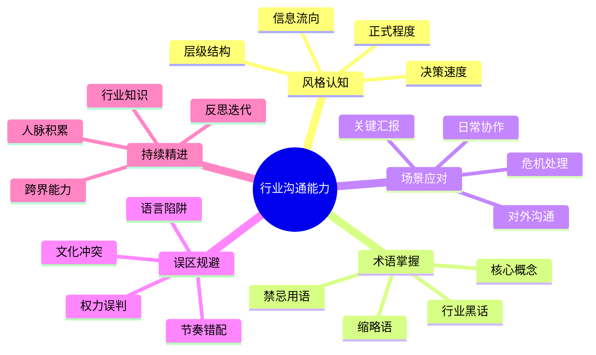

---

## 一、IT/互联网行业

### 1.1 沟通风格画像

IT/互联网行业的沟通以**高效、直接、数据驱动**为核心特征。这个行业的底层逻辑是"用代码解决问题"，因此沟通也带有强烈的工程思维——追求精确、可量化、可复现。

**组织架构与信息流向：** 互联网公司的组织结构通常比传统行业扁平。一线工程师到CTO之间可能只有2-3层汇报关系。这意味着信息传递的衰减较小，但也意味着基层员工需要直接面对高层的技术质疑。扁平化结构催生了"用数据说话"的文化——你的观点是否有说服力，不取决于你的职级，而取决于你的论证是否严密、数据是否充分。

**敏捷文化对沟通的塑造：** Scrum、Kanban等敏捷方法论的广泛采用，深刻改变了IT团队的沟通节奏。每日站会（Daily Standup）要求每个人在15秒内说清楚"昨天做了什么、今天要做什么、有什么阻碍"；Sprint回顾会要求坦诚地讨论"什么做得好、什么需要改进"。这种高频、短时、聚焦的沟通模式，训练出IT从业者"先说结论、再给证据"的表达习惯。

**远程协作的沟通挑战：** 2020年之后，远程办公和混合办公成为IT行业的常态。GitLab、Automattic等公司甚至完全远程化。这要求从业者具备更强的**异步沟通能力**——写清楚上下文、减少来回确认、用文档代替口头约定。一个好的远程工程师，首先是一个好的文档写作者。

**技术文化的双刃剑：** IT行业的技术文化推崇"聪明"和"极客精神"，这在团队内部创造了高效的沟通默契，但也容易形成"技术精英主义"——对非技术人员的解释缺乏耐心，用技术优越感代替有效沟通。优秀的IT从业者需要认识到：**把复杂问题讲简单，比把简单问题讲复杂更需要能力。**

### 1.2 核心术语速查

#### 项目管理与协作术语

| 术语 | 全称/含义 | 使用场景 | 沟通要点 |
|------|----------|---------|---------|
| Sprint | 冲刺周期（通常2-4周） | "这个Sprint我们聚焦支付模块重构" | 明确周期内可交付范围，避免范围蔓延 |
| Backlog | 待办列表 | "把这个需求加到下个Sprint的Backlog" | 区分Product Backlog和Sprint Backlog |
| Standup | 每日站会 | "Standup上提到的blocker解决了吗" | 控制在15分钟内，聚焦阻碍而非汇报 |
| Retro | 回顾会议 | "Retro上大家反馈沟通成本太高" | 聚焦可执行的改进项，避免变成吐槽会 |
| MVP | 最小可行产品 | "先做MVP验证市场，别一上来就做大而全" | 强调"可行"而非"完美" |
| OKR | 目标与关键结果 | "Q3的O是提升留存率，KR1是次日留存达到60%" | 目标要有野心，关键结果要可量化 |

#### 技术沟通术语

| 术语 | 含义 | 非技术人员类比 | 常见误用 |
|------|------|--------------|---------|
| API | 应用程序编程接口 | 餐厅菜单：你告诉厨房要什么菜，厨房做好端上来 | 不要说"API调用失败"，要说"系统之间的数据传输出了问题" |
| 微服务 | 将大系统拆成多个小服务 | 把一个大超市拆成多个专卖店 | 不要混淆"微服务"和"分布式" |
| 技术债 | 为赶工期积累的技术问题 | 类似信用卡：先消费（快速上线）后还款（重构优化） | 不要用技术债当借口推脱所有质量要求 |
| CI/CD | 持续集成/持续部署 | 自动化流水线：代码写完自动测试、自动上线 | 区分"部署"和"发布"——部署到生产环境≠用户可见 |
| 可扩展性 | 系统处理增长负载的能力 | 餐厅能从接待10桌扩展到100桌而不混乱 | "可扩展"不等于"不需要重构" |

#### 互联网业务术语

| 术语 | 含义 | 决策中的角色 | 沟通时的注意事项 |
|------|------|------------|----------------|
| DAU/MAU | 日活/月活用户 | 衡量产品健康度的核心指标 | 区分"注册用户"和"活跃用户"，避免虚荣指标 |
| LTV | 用户生命周期价值 | 决定获客成本上限 | LTV>CAC是商业可行的基本前提 |
| CAC | 获客成本 | 评估营销效率 | 要区分渠道CAC和整体CAC |
| 留存率 | 用户在特定时间后仍在使用的比例 | 衡量产品粘性 | 注意留存的时间窗口：次日/7日/30日含义不同 |
| A/B测试 | 对比测试 | 用数据驱动决策而非拍脑袋 | 样本量要足够大才能得出统计显著结论 |

### 1.3 关键沟通场景深度解析

#### 场景一：技术方案评审

技术方案评审是IT行业最重要的正式沟通场景，也是技术影响力的核心战场。

**会前准备清单：**
1. **文档先行**：提前24小时发出技术方案文档，包含背景、目标、方案对比、架构图、风险评估、时间线
2. **预沟通**：对关键决策点，提前与可能反对的同事一对一沟通，了解顾虑
3. **数据准备**：性能基准测试数据、成本估算、竞品技术方案对比
4. **备选方案**：至少准备2-3个方案，说明选择当前方案的原因

**评审中的沟通策略：**

开场（2分钟）：
  "今天评审的是[项目名]的技术方案。核心目标是[一句话]。
   我会先用10分钟介绍方案，然后请大家提问。"

方案陈述（10分钟）：
  1. 问题定义：我们面临什么问题？为什么现在需要解决？
  2. 约束条件：时间/预算/人力/技术栈限制
  3. 方案对比：表格形式列出候选方案的优劣
  4. 推荐方案：架构图 + 关键设计决策的理由
  5. 风险与缓解：已知风险和应对策略

回应质疑（核心环节）：
  ✅ "这个点很好，我的考虑是..."
  ✅ "这个方案确实有这个局限，我们计划通过...来缓解"
  ✅ "我不确定，需要回去验证，我今天内给你结论"
  ❌ "你不懂技术"（人身攻击）
  ❌ "这是最优方案"（过度自信，没有最优只有权衡）
  ❌ "这个问题不在范围内"（回避质疑）

#### 场景二：需求对接

产品经理与工程师的需求对接，是IT项目中冲突最频繁的环节。

**需求沟通的"三确认"框架：**

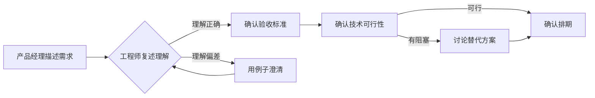

**常见冲突及化解方法：**

| 冲突类型 | 典型对话 | 化解策略 |
|---------|---------|---------|
| 需求模糊 | "我要一个更好的用户体验" | 追问具体场景："哪个页面？什么操作？现在的体验差在哪里？" |
| 技术评估不足 | "这个需求很简单吧" | 拆解任务："表层简单，但需要考虑数据迁移、权限控制、灰度发布..." |
| 优先级分歧 | "这个必须这周上线" | 引入框架："如果这个优先，那原定的X要后移，你看行吗？" |
| 需求变更 | "加个小功能" | 量化影响："这个'小功能'需要改动3个模块，增加2天工期" |

#### 场景三：线上故障沟通

线上故障是IT行业最考验沟通能力的高压场景。

**故障沟通时间线：**

T+0（发现故障）：
  → 立即通报：[P0/P1] [故障现象] [影响范围] [值班人已介入]
  → 建立故障群，拉入相关方

T+5min（初步定位）：
  → 更新：可能的原因方向、当前排查进展
  → 评估是否需要升级（通知VP/CTO）

T+15min（方案确认）：
  → 更新：根因定位、修复方案、预计恢复时间
  → 如果需要回滚，确认回滚范围和影响

T+恢复后（故障修复）：
  → 通报：服务已恢复、影响时长、初步原因
  → 约定复盘时间

T+24h（故障复盘）：
  → 发出5-Why分析报告
  → 明确改进措施和负责人
  → 更新Runbook

**故障通报模板：**

【故障通报】
级别：P1
时间：2024-01-15 14:30 - 15:10
影响：支付系统延迟升高，约15%用户支付超时
原因：数据库连接池耗尽（根因：慢查询导致连接堆积）
修复：紧急扩容连接池 + 终止慢查询
改进：①增加连接池监控告警 ②优化慢查询SQL ③下周完成数据库读写分离
负责人：@张三

#### 场景四：跨部门协作

IT部门与业务部门之间的"语言障碍"是最常见的跨部门沟通问题。

**翻译对照表：**

| 技术语言 | 业务语言 | 翻译要点 |
|---------|---------|---------|
| "需要重构" | "为了支撑未来3倍的业务增长，需要升级系统架构" | 用业务价值量化技术投入 |
| "有技术债" | "之前为了赶上线做了一些取舍，现在需要补上" | 不回避问题，但说明历史背景 |
| "这个做不到" | "在当前约束下有三种替代方案..." | 永远带着方案说不行 |
| "需要2周" | "第一周完成核心功能，第二周做测试和灰度" | 拆解里程碑，建立进度可见性 |
| "需要排期" | "目前团队在做A和B，这个排在C之后，预计3月启动" | 给出明确时间线而非模糊承诺 |

### 1.4 常见误区与纠正

**误区一：技术术语当"通行证"**
- ❌ 错误做法：在跨部门会议上大量使用技术术语，显示自己的专业性
- ✅ 正确做法：根据听众调整语言层次。对技术同事用术语提高效率，对业务同事用类比和数据增强理解
- 🔍 根因：混淆了"展示专业"和"有效沟通"的目标。沟通的目的是让对方理解，不是让对方佩服

**误区二：用"技术上不行"终结讨论**
- ❌ 错误做法：面对业务需求，简单回复"技术上做不到"
- ✅ 正确做法：说明具体约束，提供替代方案——"如果要实现X效果，在当前架构下有A、B、C三种方案，A最快但有局限，C最完整但需要4周"
- 🔍 根因：把"解释"当成了"推脱"。业务方需要的不是技术判断，而是解决方案

**误区三：文档=没人看的东西**
- ❌ 错误做法：口头沟通完就完了，不写文档；或者写了但不维护
- ✅ 正确做法：重要的技术决策、系统设计、操作流程必须文档化。"如果它没写下来，它就没发生过"
- 🔍 根因：高估了记忆力，低估了团队扩张带来的信息传递损耗

**误区四：会议=效率杀手**
- ❌ 错误做法：所有会议都不参加，认为开会是浪费时间
- ✅ 正确做法：区分"需要同步信息的会"和"需要做决策的会"。前者可以用文档替代，后者必须开会。参加了就全情投入
- 🔍 根因：不是"会议"有问题，是"没有议程、没有结论、没有跟进"的会议有问题

**误区五：代码Review变成人身攻击**
- ❌ 错误做法："这段代码写得不行"、"谁写的这么烂"
- ✅ 正确做法："这里可以用策略模式简化if-else逻辑"、"这个函数超过80行了，可以拆分一下提高可读性"
- 🔍 根因：对事不对人是Code Review的铁律。评论代码质量，不评论编码者

### 1.5 能力进阶路径

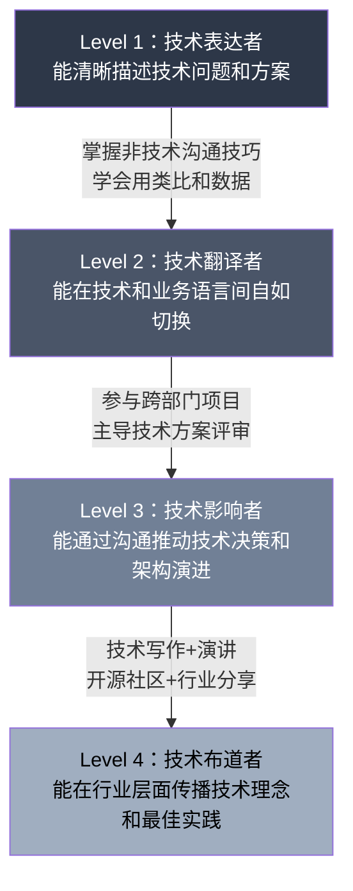

| 层级 | 核心能力 | 标志性行为 | 提升方法 |
|------|---------|-----------|---------|
| L1 技术表达者 | 清晰描述技术问题 | 能让同组工程师快速理解你的方案 | 写好commit message、PR描述、技术文档 |
| L2 技术翻译者 | 跨语言沟通 | 能让产品经理和业务方理解技术方案的价值 | 参与需求评审、练习用非技术语言写周报 |
| L3 技术影响者 | 驱动技术决策 | CTO在做架构决策时主动征询你的意见 | 主导技术方案评审、推动技术规范建设 |
| L4 技术布道者 | 行业影响力 | 你的技术博客/演讲被广泛引用 | 技术写作、会议演讲、开源社区贡献 |

**📌 一页纸速查：IT/互联网行业**

| 维度 | 要点 |
|------|------|
| 沟通风格 | 直接、数据驱动、敏捷迭代、异步优先 |
| 正式程度 | 内部偏非正式（Slack/飞书），对外正式（文档/邮件） |
| 决策方式 | 数据说话 + 技术评审 + 快速试错 |
| 核心禁忌 | 不要用技术优越感贬低非技术人员；不要口头承诺不记录 |
| 必备技能 | 技术文档写作、方案评审表达、故障通报、跨部门翻译 |
| 进阶方向 | 技术博客→行业分享→开源社区→技术顾问 |

---

## 二、金融行业

### 2.1 沟通风格画像

金融行业的沟通以**严谨、合规、数据密集**为核心特征。与IT行业追求"快速迭代"不同，金融行业的底层逻辑是"管理风险"——一个数字的错误可能导致千万级损失，一句不当的表述可能引发监管处罚。因此，金融沟通的第一原则不是"高效"，而是"准确"。

**层级结构与汇报文化：** 金融行业的组织结构通常比互联网公司更传统、层级更多。从初级分析师到VP（副总裁）、Director（总监）、MD（董事总经理），每一层的汇报风格都有明显差异。初级分析师的工作是"把数据搞对"，VP的工作是"把故事讲好"，MD的工作是"把关系维护好"。理解这种层级差异，是金融行业沟通的第一课。

**合规约束下的沟通自由度：** 金融从业者受到严格的合规约束。证券分析师不能随意发表投资建议，银行客户经理不能承诺收益率，保险代理人不能夸大保障范围。这些约束不仅限制了"能说什么"，也影响了"怎么说"。学会在合规框架内进行有说服力的沟通，是金融从业者的必备技能。

**客户关系的信任阶梯：** 金融行业的客户关系建立在长期信任之上。一个高净值客户把资产交给你管理，需要的不只是你的专业能力，更是你的人品和可靠性。这种信任需要通过持续、一致、专业的沟通来建立——每一次汇报、每一次市场波动时的主动沟通、每一次兑现承诺，都是信任的积累。

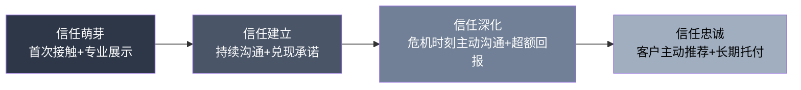

### 2.2 核心术语速查

#### 投资分析术语

| 术语 | 含义 | 沟通中的使用 | 常见误解 |
|------|------|------------|---------|
| ROI | 投资回报率 | "这个项目的ROI预计在18个月内回正" | ROI不考虑时间价值，长期项目应用IRR |
| IRR | 内部收益率 | "IRR达到15%才值得投" | IRR假设现金流能以相同利率再投资，实际可能不成立 |
| NPV | 净现值 | "NPV为正说明项目创造价值" | 折现率的选择对NPV影响巨大 |
| EBITDA | 息税折旧摊销前利润 | "公司EBITDA margin稳定在25%" | EBITDA不是现金流，不能替代现金流分析 |
| Alpha | 超额收益 | "这个策略的Alpha来源是选股能力" | Alpha是相对概念，基准不同Alpha不同 |
| DCF | 现金流折现模型 | "我们用DCF估值，假设永续增长率3%" | DCF高度依赖假设，敏感性分析必不可少 |

#### 风险管理术语

| 术语 | 含义 | 实际应用 | 沟通要点 |
|------|------|---------|---------|
| VaR | 在给定置信水平下的最大可能损失 | "99% VaR为500万" | VaR不告诉你超过阈值时的损失有多大 |
| 压力测试 | 极端情景下的风险评估 | "利率上升300bp时资产组合下跌12%" | 压力测试的价值在于识别非线性风险 |
| 对冲 | 用衍生品降低风险敞口 | "用期货对冲汇率风险" | 对冲不是消除风险，是转移风险 |
| 合规 | 符合监管要求 | "这个方案需要合规审批" | 合规是底线不是上限 |

#### 银行与保险术语

| 术语 | 含义 | 日常沟通场景 |
|------|------|------------|
| 不良贷款（NPL） | 借款人无法按时还款的贷款 | "本季度NPL率上升0.3%，主要集中在房地产行业" |
| 净息差（NIM） | 贷款利率与存款利率之差 | "降息周期NIM承压，需要靠中间业务收入弥补" |
| 承保/承销（Underwriting） | 评估风险并决定是否承保/承销 | "承保标准需要收紧，当前赔付率超预期" |
| 信用评级 | 对借款人信用风险的评估 | "这家公司的评级从AA降到A+，融资成本会上升" |

### 2.3 关键沟通场景深度解析

#### 场景一：投资决策会议

投资决策委员会（IC）会议是金融行业最正式、最考验沟通能力的场景。

**汇报框架（MECE原则）：**

投资论点（2分钟）：
  "我们建议投资XX公司，核心逻辑是[一句话]。
   目标价XX元，当前价格XX元，隐含上行空间XX%。"

业务分析（5分钟）：
  行业格局 → 竞争优势 → 增长驱动 → 财务质量

估值讨论（3分钟）：
  DCF/可比公司/可比交易 → 敏感性分析 → 目标价推导

风险评估（2分钟）：
  核心风险①②③ + 每个风险的缓解因素

结论与行动建议（1分钟）：
  建议买入/持有/卖出 + 仓位建议 + 关键催化剂时间点

**回应质疑的策略：**
- 面对数据质疑："感谢指出，这个数据来源是XX，我确认后更新。"
- 面对逻辑质疑："您的角度很有道理。我的推理是基于XX假设，如果这个假设不成立，结论确实会不同。"
- 面对估值分歧："市场对这个公司的分歧点在于XX，我们的看法是YY，主要依据是ZZ。"

#### 场景二：客户沟通（财富管理）

**KYC深度沟通框架：**

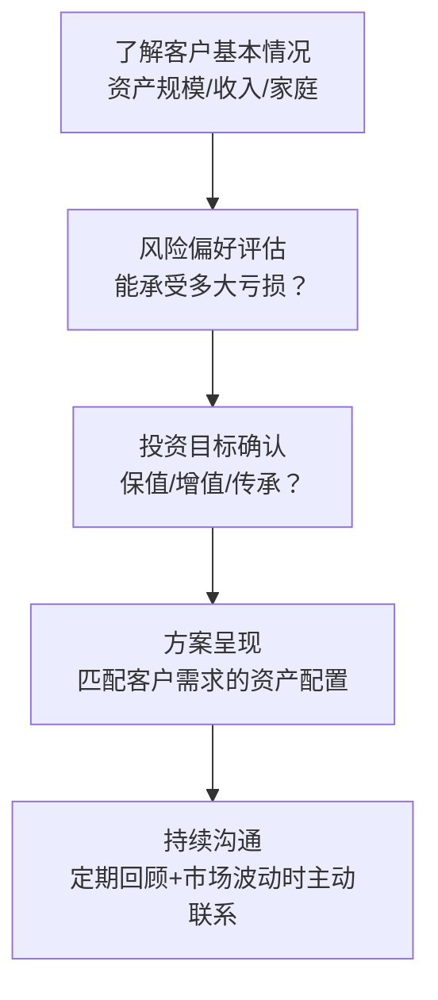

**市场暴跌时的沟通模板：**

"王总您好，今天市场调整幅度较大（沪深300 -3.2%），
我第一时间给您做个简要汇报：

1. 市场下跌的主要原因是[具体原因，非笼统的'市场波动']
2. 您的组合今日预估回撤约[X]%，低于市场整体跌幅，
   主要因为我们配置了[对冲资产]
3. 我们在上次季度回顾时设定的止损线是[X]%，
   目前距离止损线还有[Y]%的空间
4. 我的建议是[维持/微调]当前配置，原因是[具体分析]

如果方便，我们约个时间详细讨论一下您看可以吗？"

#### 场景三：监管沟通

与监管机构的沟通是金融行业特有的高压场景。

**核心原则：**
1. **事实优先**：只陈述经过核实的事实，不做推测
2. **口径统一**：所有对外口径必须经过法务和合规审核
3. **记录完整**：所有与监管的沟通都应有书面记录
4. **主动配合**：不要等监管来问，主动报告风险事件
5. **专业态度**：尊重监管，但坚持专业判断

### 2.4 常见误区与纠正

**误区一：用专业术语建立权威感**
- ❌ "我们的VaR模型显示，在99%的置信水平下，您的组合在未来一个月的最大回撤不会超过8%"
- ✅ "根据我们的风险模型，您的组合在未来一个月内，有99%的可能性亏损不超过8万块。也就是说，100个月里大概有1个月可能超过这个数"
- 🔍 客户需要的是"我能理解"，不是"你很专业"

**误区二：只报喜不报忧**
- ❌ 盈利时频繁联系客户，亏损时沉默或用专业术语搪塞
- ✅ 市场波动时第一时间主动沟通，坦诚说明原因和应对措施
- 🔍 信任在困难时刻建立，不在顺境中积累

**误区三：把"合规"当"甩锅"**
- ❌ "这个做不了，合规不允许"（不解释为什么）
- ✅ "监管对这个有明确要求，原因是保护投资者的XX权益。我们可以做的替代方案是..."
- 🔍 合规是框架不是挡箭牌，在框架内寻找解决方案才是专业

### 2.5 能力进阶路径

| 层级 | 角色 | 核心沟通能力 | 标志性场景 |
|------|------|------------|-----------|
| L1 初级分析师 | 数据收集与整理 | 能准确、无错误地呈现数据 | 日常数据报告、研究笔记 |
| L2 高级分析师 | 研究与建议 | 能用数据构建投资论点并说服评审 | IC会议汇报、深度研究报告 |
| L3 投资经理 | 客户与决策 | 能管理客户预期、处理高压对话 | 客户沟通、危机时刻汇报 |
| L4 合伙人/MD | 关系与战略 | 能建立行业影响力、管理关键关系 | 机构路演、监管沟通、媒体发言 |

**📌 一页纸速查：金融行业**

| 维度 | 要点 |
|------|------|
| 沟通风格 | 严谨、数据密集、合规约束、层级分明 |
| 正式程度 | 极高，特别是对外和对监管沟通 |
| 决策方式 | 数据+模型+委员会审议 |
| 核心禁忌 | 不承诺收益率；不泄露内幕信息；不误导投资者 |
| 必备技能 | 数据呈现、投资论点构建、客户关系管理、合规沟通 |
| 进阶方向 | 分析师→投资经理→合伙人/MD |

---

## 三、医疗行业

### 3.1 沟通风格画像

医疗行业的沟通以**患者安全为中心、同理心为基础、循证为依据**为核心特征。在所有行业中，医疗沟通的"容错率"最低——信息传递的失误可能直接危及生命。

**多层沟通网络：** 医疗从业者需要同时与多个对象沟通：患者及家属（需要同理心和通俗表达）、同事（需要精确的专业术语）、上级医生（需要简洁的病例汇报）、护理团队（需要清晰的医嘱传达）、行政管理部门（需要规范的文书记录）。每一层的沟通风格、语言层次和关注点都不同。

**高压环境下的信息传递：** 急诊室、手术室、ICU——医疗行业有许多"零容错"的高压场景。在这些场景中，沟通必须做到**结构化、可复现、有确认**。SBAR等标准化沟通工具的引入，本质上是在用流程弥补高压环境下人的认知局限。

**知情同意的伦理重量：** 医疗行业独有的"知情同意"沟通，承载着沉重的伦理责任。医生需要在"充分告知"和"不过度恐吓"之间找到平衡，帮助患者在理解风险的基础上做出自主决定。这种沟通不是"签个字走流程"，而是真正的共享决策过程。

### 3.2 核心术语速查

#### 临床沟通工具

| 工具/术语 | 含义 | 使用场景 | 标准结构 |
|----------|------|---------|---------|
| SBAR | 标准化沟通工具 | 医护之间传递患者信息 | Situation（情境）→ Background（背景）→ Assessment（评估）→ Recommendation（建议） |
| ISBAR | SBAR的扩展版 | 增加了身份确认 | Identification（身份）→ S → B → A → R |
| 交班（Handoff） | 患者照护责任的转移 | 换班时的信息传递 | 使用I-PASS等结构化工具 |
| MDT | 多学科诊疗团队 | 复杂病例的联合诊疗 | 各科医生在同一时间讨论同一患者 |
| 循证医学 | 基于最佳证据的医学实践 | 临床决策 | 最佳证据 + 临床经验 + 患者意愿 |

#### 临床关键概念

| 概念 | 含义 | 医患沟通中的翻译 |
|------|------|----------------|
| 主诉 | 患者就诊的主要原因 | "您今天来看什么问题？" |
| 鉴别诊断 | 需要考虑的几种可能疾病 | "您的症状可能是A、B或C，我们需要做一些检查来排除" |
| 预后 | 疾病的发展前景 | "这个病的恢复情况通常是这样的..." |
| 不良事件 | 治疗中的意外情况 | "治疗过程中出现了一个我们需要关注的情况..." |
| 知情同意 | 患者充分了解后同意治疗 | "在做决定之前，我需要跟您说明几个重要事项..." |

### 3.3 关键沟通场景深度解析

#### 场景一：告知坏消息（SPIKES模型）

SPIKES是国际公认的坏消息告知六步框架：

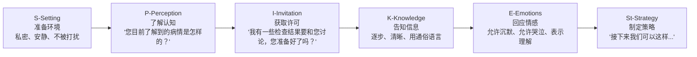

**关键原则：**
- **逐步告知**，不要一次性把最坏的消息全部抛出
- **使用通俗语言**，避免在情感冲击下使用患者无法理解的医学术语
- **留出沉默空间**，不要急于填补沉默——沉默是患者在消化信息
- **记录沟通过程**，包括告知内容、患者反应、后续计划

#### 场景二：手术知情同意

知情同意不是"签个字走流程"，而是真正的共享决策过程。

**沟通清单：**
1. 诊断是什么？为什么需要手术？
2. 手术的具体过程是什么？（用患者能理解的语言）
3. 手术的预期收益是什么？
4. 手术的风险和可能并发症有哪些？（每个风险给出概率）
5. 不做手术会怎样？
6. 有哪些替代方案？各自的优劣是什么？
7. 术后恢复过程和注意事项

**风险沟通的"频率格式"技巧：**
- ❌ "并发症发生率2%"（抽象的百分比）
- ✅ "100个做这个手术的人里，大约有2个会出现这个并发症"（具象的频率）

#### 场景三：多学科会诊（MDT）

MDT会诊是处理复杂病例的核心机制。

**MDT沟通规范：**
会诊前：
  主管医生准备好完整的病例资料
  提前发给各科医生，注明需要讨论的核心问题

会诊中（通常30-60分钟）：
  病例汇报（5分钟）→ 各科发表意见（各5-10分钟）→ 讨论（10-15分钟）→ 总结（3分钟）

关键原则：
  - 每人发言聚焦自己的专业判断
  - 不同意见要明确表达，不要"沉默的反对"
  - 最终方案需要所有人签字确认
  - 记录每位医生的意见，不仅仅是最终结论

### 3.4 常见误区与纠正

**误区一：用医学术语显示专业**
- ❌ "您这是急性心肌梗死，需要立即PCI"
- ✅ "您的心脏有一根血管堵住了，需要马上做一个微创手术把血管打通，越快越好"
- 🔍 患者在恐惧中理解能力下降，语言要简单直接

**误区二：只关注疾病，忽视患者**
- ❌ 只看检查报告和影像，全程不看患者
- ✅ 先看人，再看病。"您今天感觉怎么样？"比"检查结果怎么样？"更能建立信任
- 🔍 医学是关于"人"的科学，不只是关于"病"的科学

**误区三：回避不良预后**
- ❌ "放心吧，没问题"（过度乐观的承诺）
- ✅ "手术总体是安全的，但我想跟您说明一些可能的风险..."
- 🔍 过度承诺不仅有法律风险，更会损害医患信任

**误区四：交接班信息缺失**
- ❌ 口头简单说几句就交班
- ✅ 使用I-PASS等结构化工具，书面记录关键信息，接班人复述确认
- 🔍 大量医疗差错发生在交接班环节

### 3.5 能力进阶路径

| 层级 | 角色 | 核心沟通能力 |
|------|------|------------|
| L1 住院医师 | 病例汇报 | SBAR结构化汇报、医嘱清晰传达 |
| L2 主治医师 | 医患沟通 | 坏消息告知、知情同意、患者教育 |
| L3 副主任/主任 | 团队领导 | MDT会诊主持、科室管理沟通 |
| L4 学科带头人 | 行业影响 | 学术交流、政策建议、公众健康教育 |

**📌 一页纸速查：医疗行业**

| 维度 | 要点 |
|------|------|
| 沟通风格 | 以患者为中心、同理心、循证、结构化 |
| 正式程度 | 医患沟通亲和专业；医护沟通精确规范 |
| 决策方式 | 循证+临床经验+患者意愿（共享决策） |
| 核心禁忌 | 不过度承诺；不泄露患者隐私；不忽视患者情感 |
| 必备技能 | SBAR汇报、坏消息告知、知情同意、MDT协作 |
| 进阶方向 | 住院医师→主治→主任→学科带头人 |

---

## 四、教育行业

### 4.1 沟通风格画像

教育行业的沟通以**启发性、支持性、发展性**为核心特征。教育沟通的目标不是"传递信息"，而是"促进学习"——这意味着教师需要根据学生的认知水平、情感状态和学习风格，灵活调整自己的沟通策略。

**教学沟通的双向性：** 有效的教学不是教师的独白，而是师生之间的对话。苏格拉底式的提问、建构主义的支架、维果茨基的最近发展区——这些教育理论都指向同一个核心：学习发生在学生的主动参与中，而教师的沟通策略决定了学生参与的深度。

**家校沟通的信任基础：** 家校关系的本质是"教育合作伙伴"。教师需要理解家长的焦虑和期望，家长需要理解教师的专业判断和教育理念。当双方的目标一致（为了孩子的成长）但方法可能不同时，沟通的关键是建立信任和共识。

**教育公平中的沟通责任：** 教师的沟通方式可能无意中强化教育不公。对不同性别、不同家庭背景、不同成绩水平的学生使用不同的语言和期望，会产生"皮格马利翁效应"——教师的期望通过沟通传递给学生，影响学生的自我认知和学习动力。

### 4.2 核心术语速查

#### 教学设计术语

| 术语 | 含义 | 沟通中的应用 |
|------|------|------------|
| 布鲁姆分类法 | 认知层次：记忆→理解→应用→分析→评价→创造 | "这节课的目标是让学生能够分析（而非仅仅记忆）这个概念" |
| 差异化教学 | 根据学生差异调整教学 | "我在A组增加了脚手架，B组提供了拓展任务" |
| 形成性评价 | 教学过程中的持续评估 | "通过课堂小测发现80%的学生还没掌握第二步" |
| 翻转课堂 | 先自学后讨论 | "学生课前看了视频，课堂时间用来做练习和讨论" |
| 项目式学习（PBL） | 以项目为载体的学习 | "学生通过设计一个社区花园来学习面积和比例" |

#### 学生发展术语

| 术语 | 含义 | 教师沟通中的体现 |
|------|------|----------------|
| 成长型思维 | 相信能力可以通过努力提升 | ❌"你真聪明" ✅"你在这个问题上下了很大功夫，进步很明显" |
| 自我效能感 | 对自己能力的信心 | 提供适度挑战+及时反馈，建立"我能做到"的信念 |
| 元认知 | 对自身思维过程的认知 | "你是怎么想到这个方法的？"引导学生反思学习策略 |
| SEL（社会情感学习） | 社会情感能力的培养 | 在学科教学中融入合作、自我管理、同理心等能力 |
| UDL（通用学习设计） | 面向所有学生的包容性教学设计 | "用UDL原则设计课程，提供多种方式让学生参与和表达" |
| IEP（个别化教育计划） | 特殊需求学生的定制计划 | "这个学生的IEP需要在期中更新，我们约个时间讨论" |
| Scaffolding（脚手架） | 逐步撤除辅助的教学策略 | "先给学生完整模板，第二周给半模板，第三周让他们自主完成" |
| Summative Assessment（终结性评价） | 学习结束时的综合评价 | "期末考试是终结性评价，但平时的形成性评价更能反映学习过程" |
| Blooms Taxonomy Verbs | 各认知层次的动词 | "记忆层用'列举'，分析层用'比较'，创造层用'设计'" |

### 4.3 关键沟通场景深度解析

#### 场景一：课堂提问的艺术

**提问层次设计（基于布鲁姆分类法）：**

| 层次 | 提问类型 | 示例 | 目的 |
|------|---------|------|------|
| 记忆 | 是什么 | "光合作用的公式是什么？" | 检查基础知识 |
| 理解 | 用自己的话说 | "你能用自己的话解释一下光合作用吗？" | 检查理解深度 |
| 应用 | 在新场景中使用 | "如果地球上没有阳光，光合作用会怎样？" | 迁移能力 |
| 分析 | 比较和对比 | "光合作用和呼吸作用有什么关系？" | 思维深度 |
| 评价 | 做判断 | "这个实验设计合理吗？为什么？" | 批判性思维 |
| 创造 | 提出新想法 | "你能设计一个验证光合作用的实验吗？" | 创新能力 |

**等待时间的魔力：** 研究表明，教师在提问后平均只等待1秒就叫学生回答。如果将等待时间延长到3-5秒，学生的回答质量会显著提高，参与回答的学生数量也会增加。等待时间是教师最容易忽视、也最容易改善的沟通技巧。

#### 场景二：作业反馈的"三明治"升级版

传统的"表扬-批评-表扬"三明治反馈已被证明效果有限——学生会忽略表扬，只记住中间的批评，而且对"但是"之后的内容产生防御心理。

**改进版反馈框架（GROW模型）：**

Goal（目标）：
  "这次作文的目标是学会使用论证结构来支撑观点"

Reality（现状）：
  "你的论点很清晰（具体的正面证据），
   但在第三段，论据和论点之间的逻辑连接不够紧密（具体指出位置和问题）"

Options（选择）：
  "你可以试试这两种方法来加强论证：
   ①增加一个反驳段落，先说反方观点再反驳
   ②在每个论据后加一句解释'这说明了...'"

Way forward（下一步）：
  "下次写作文时，先画一个论证结构图再动笔。你愿意试试吗？"

#### 场景三：家长会的双向沟通

**家长会沟通框架：**

开场（建立连接）：
  "XX妈妈您好，感谢您抽时间来。XX最近在学校表现[整体评价]。"

具体反馈（有证据）：
  学习方面："数学最近进步很大，特别是应用题的解题思路清晰多了。"
  社交方面："XX在小组合作中越来越主动了，上周还主动帮助了同学。"
  需要关注的："XX在课堂上不太主动举手，我观察可能是[原因]。"

倾听家长：
  "您在家观察到XX有什么变化吗？"
  "您对XX的学习有什么期望或担忧？"

共同制定计划：
  "我们可以一起支持XX。在学校我会[措施]，在家您可以[建议]。
   我们一个月后再沟通一下进展，您看可以吗？"

### 4.4 常见误区与纠正

**误区一：用成绩定义学生**
- ❌ "你就是数学不好"（固定标签）
- ✅ "你目前在数学的XX方面还需要加强，我看到你在YY方面有明显的进步"（具体+成长视角）
- 🔍 标签效应（Labeling Effect）会变成自我实现的预言

**误区二：批评变成人身攻击**
- ❌ "你怎么这么笨"、"你就是不认真"
- ✅ "这道题的解题步骤有误，让我们看看错在哪里"
- 🔍 对行为不对人——批评具体行为，不评价人格

**误区三：对家长"汇报"而非"对话"**
- ❌ 家长会上教师一个人讲30分钟
- ✅ 用2/3时间倾听，了解家长的观察和担忧
- 🔍 家长是教育合作伙伴，不是被动的信息接收者

**误区四：忽视沉默的学生**
- ❌ 只关注举手的学生和捣乱的学生
- ✅ 用"Think-Pair-Share"等策略创造安全的参与方式
- 🔍 沉默不等于理解，可能是困惑、恐惧或无聊

### 4.5 能力进阶路径

| 层级 | 角色 | 核心沟通能力 |
|------|------|------------|
| L1 新手教师 | 课堂管理 | 能维持课堂秩序、清晰讲解知识 |
| L2 胜任教师 | 教学互动 | 能设计有效提问、提供差异化反馈 |
| L3 专家教师 | 学习引导 | 能促进深度学习、处理复杂学生问题 |
| L4 教育领导者 | 专业引领 | 能指导新教师、推动教学改革、影响教育政策 |

**📌 一页纸速查：教育行业**

| 维度 | 要点 |
|------|------|
| 沟通风格 | 启发性、支持性、发展性、双向互动 |
| 正式程度 | 课堂偏互动式，家校沟通尊重专业，教研偏学术 |
| 决策方式 | 证据+教育理论+学生需求 |
| 核心禁忌 | 不标签化学生；不用成绩定义价值；不忽视沉默 |
| 必备技能 | 有效提问、差异化反馈、家校沟通、冲突调解 |
| 进阶方向 | 新手教师→胜任→专家→教育领导者 |

---

## 五、销售行业

### 5.1 沟通风格画像

销售行业的沟通以**客户价值为中心、关系驱动、结果导向**为核心特征。销售沟通的终极目标不是"说赢客户"，而是"帮助客户做出正确的购买决策"。

**从"推销员"到"顾问"的转型：** 传统销售强调话术和技巧，现代销售强调理解和价值。SPIN Selling、Challenger Sale、Solution Selling等销售方法论的演进，反映了销售沟通从"说服"到"洞察"的转变。优秀的销售人员不是"话多"的人，而是"会问"和"会听"的人。

**B2B与B2C的沟通差异：** B2B销售涉及多个决策者、更长的决策周期和更复杂的需求；B2C销售更注重情感连接和即时满足。B2B销售需要管理"决策委员会"中的多个角色——使用者、影响者、决策者、守门人——每个人的关注点和沟通偏好都不同。

**被拒绝的常态化：** 销售是所有行业中"被拒绝"频率最高的职业。数据显示，80%的销售需要至少5次跟进才能成交，但48%的销售人员在第一次被拒绝后就放弃了。学会将"拒绝"重新定义为"暂时不合适"或"需要更多信息"，是销售人员的心理必修课。

### 5.2 核心术语速查

#### 销售流程术语

| 术语 | 含义 | 沟通中的应用 |
|------|------|------------|
| Lead/线索 | 潜在客户信息 | "市场部这周给我们100条新线索" |
| Pipeline | 销售管线 | "我的Pipeline里有15个机会，总金额200万" |
| 漏斗转化率 | 各阶段转化比例 | "从Demo到Proposal的转化率只有20%，需要提升" |
| 成交（Close） | 达成销售 | "这个季度目标是Close 3个大客户" |
| 流失率（Churn） | 客户流失比例 | "上季度Churn rate 5%，主要是中小客户" |

#### 销售方法论术语

| 方法论 | 核心理念 | 适用场景 | 沟通重点 |
|--------|---------|---------|---------|
| SPIN Selling | 通过提问引导需求 | 复杂B2B销售 | Situation→Problem→Implication→Need-payoff |
| BANT | 客户资质评估 | 快速筛选线索 | Budget/Authority/Need/Timeline |
| Challenger Sale | 用洞察挑战客户认知 | 成熟市场的差异化 | 教导客户→定制方案→控制销售 |
| Solution Selling | 以解决方案为核心 | 复杂需求的客户 | 诊断问题→呈现方案→量化价值 |

#### 谈判与成交术语

| 术语 | 含义 | 实操要点 |
|------|------|---------|
| 异议处理 | 回应客户的顾虑 | 倾听→理解→确认→回应→确认 |
| 试探性成交 | 测试客户购买意愿 | "如果我们能在交付时间上满足您的要求，您这边能确定吗？" |
| 让步策略 | 价格谈判中的让步 | 每次让步都要换取对方的让步；让步幅度递减 |
| 双赢 | 双方都满意的结果 | 不是50/50分，而是找到双方都最在意的利益交换 |

### 5.3 关键沟通场景深度解析

#### 场景一：SPIN提问法实战

SPIN Selling是尼尔·雷克汉姆基于35,000次销售对话研究提出的方法论：

Situation（情境问题）——了解现状：
  "您目前的团队规模是多少？"
  "您现在用什么工具来管理客户关系？"
  → 目的：收集背景信息
  → 注意：不要问太多，会让客户觉得在被审问

Problem（难点问题）——发现痛点：
  "您对目前的工具满意吗？"
  "在客户跟进方面，有什么让您困扰的？"
  → 目的：让客户意识到问题存在
  → 注意：优秀的销售人员能发现客户自己都没意识到的问题

Implication（暗示问题）——放大痛点：
  "如果这个问题持续下去，会对您的团队效率产生什么影响？"
  "这会不会导致一些潜在客户流失？"
  → 目的：让客户感受到问题的严重性
  → 注意：这是SPIN中最关键也最难的一步

Need-payoff（需求效益问题）——让客户自己说出价值：
  "如果有一个工具能帮您自动跟踪每个客户的跟进状态，对您有帮助吗？"
  "如果能减少30%的客户流失，对您的业务意味着什么？"
  → 目的：让客户自己描述解决方案的价值
  → 注意：客户自己说出的价值，比你说的有说服力100倍

#### 场景二：异议处理的LAER模型

Listen（倾听）：
  完整听完客户的异议，不打断
  "嗯，您继续说..."

Acknowledge（认可）：
  认可客户的感受，不等于同意客户的观点
  "我理解您的顾虑，很多客户一开始也有同样的想法..."

Explore（探索）：
  找到真实异议——表面异议背后的真实原因
  "您说价格高，是超出了预算范围，还是觉得价值不匹配？"

Respond（回应）：
  针对真实异议提供解决方案
  如果是预算问题→提供分期方案或缩小范围
  如果是价值问题→提供更多证据和案例
  如果是权限问题→找到真正的决策者

#### 场景三：B2B大客户销售的多角色沟通

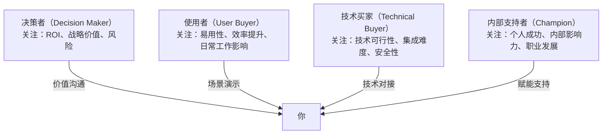

**对不同角色的沟通策略：**

| 角色 | 关注点 | 沟通策略 | 常见陷阱 |
|------|--------|---------|---------|
| 决策者 | ROI、战略匹配 | 用高管语言、聚焦业务成果 | 不要陷入技术细节 |
| 使用者 | 日常工作改善 | 场景化演示、提供试用 | 不要忽略使用习惯改变的阻力 |
| 技术买家 | 可行性和安全 | 提供技术文档、安排POC | 不要夸大技术能力 |
| 内部支持者 | 个人成功 | 提供弹药（案例、数据）帮他内部推销 | 不要让他暴露在风险中 |

### 5.4 常见误区与纠正

**误区一：一上来就介绍产品**
- ❌ "我们的产品有XX功能、YY优势..."（客户还没告诉你他的需求）
- ✅ 先问、先听、先理解。"在开始介绍之前，我想先了解一下您目前的情况..."
- 🔍 没有诊断就开药方，是庸医的做法

**误区二：把"异议"当"拒绝"**
- ❌ 客户说"太贵了"就准备打折
- ✅ "太贵了"可能意味着：超出预算 / 价值感不够 / 需要内部审批 / 试探底线。先探究真实原因
- 🔍 异议说明客户还在考虑，沉默才意味着失去兴趣

**误区三：只联系"决策者"**
- ❌ 跳过使用者和技术评估者，直接找老板
- ✅ 每个角色都有否决权，需要全面覆盖
- 🔍 B2B销售中，"不买"比"买"更容易——任何一个人反对都可能导致失败

**误区四：成交后就消失**
- ❌ 成交后不再联系客户，直到续约时间到了才出现
- ✅ 成交是关系的开始，定期回访、提供价值、帮助客户成功
- 🔍 老客户的复购和推荐是销售效率最高的增长方式

### 5.5 能力进阶路径

| 层级 | 角色 | 核心沟通能力 |
|------|------|------------|
| L1 销售新人 | 执行 | 能清晰介绍产品、处理基本异议 |
| L2 销售骨干 | 洞察 | 能用SPIN挖掘深层需求、管理Pipeline |
| L3 销售主管 | 影响 | 能谈大客户、做复杂谈判、管理团队 |
| L4 VP/CSO | 战略 | 能设计销售体系、管理关键客户关系 |

**📌 一页纸速查：销售行业**

| 维度 | 要点 |
|------|------|
| 沟通风格 | 客户中心、关系驱动、结果导向、价值呈现 |
| 正式程度 | 因客户而异，B2B偏正式，B2C偏亲和 |
| 决策方式 | 客户需求+竞争分析+价值证明 |
| 核心禁忌 | 不夸大承诺；不过度跟进；不到处骚扰；不做一锤子买卖 |
| 必备技能 | SPIN提问、异议处理、方案呈现、谈判成交 |
| 进阶方向 | 销售新人→骨干→主管→VP/CSO |

---

## 六、媒体行业

### 6.1 沟通风格画像

媒体行业的沟通以**创意叙事、时效性和公众影响力**为核心特征。媒体从业者的工作本质上是"信息的翻译和放大"——将复杂的现实转化为引人入胜的故事，并将其传播给尽可能多的受众。

**速度与准确的永恒博弈：** 新闻行业的核心矛盾是"抢首发"和"保准确"之间的张力。在社交媒体时代，一条不实消息可能在几分钟内传遍全网。学会在速度和准确之间做出正确的权衡判断，是媒体从业者最重要的职业素养。

**从单向传播到双向互动：** 传统媒体是"我写你看"的单向模式，新媒体是"大家一起创造内容"的双向模式。受众的评论、转发、二次创作已经成为内容生态的重要组成部分。媒体从业者需要学会与受众互动、管理社区、回应批评。

**公信力是最稀缺的资产：** 在信息爆炸的时代，公信力是媒体最核心的竞争力。建立公信力需要长期的一致性——每一次准确的报道、每一次及时的更正、每一次透明的编辑决策，都在积累或消耗公信力。

### 6.2 核心术语速查

#### 内容创作术语

| 术语 | 含义 | 实操要点 |
|------|------|---------|
| 导语（Lead） | 新闻报道的开头 | 用一句话回答最重要的问题（Who/What/When/Where/Why） |
| 角度（Angle） | 报道的切入点 | 同一个事件可以有无数个角度，选择最有新闻价值的 |
| 钩子（Hook） | 吸引注意力的元素 | 前3秒/前3行决定受众是否继续 |
| 分镜脚本（Storyboard） | 视频的视觉规划 | 先画再拍，避免现场即兴导致效率低下 |
| CTA（行动号召） | 引导受众行动 | 明确告诉受众"下一步做什么" |

#### 传播与运营术语

| 术语 | 含义 | 沟通中的应用 |
|------|------|------------|
| 覆盖（Reach） | 触达的受众数量 | "这条内容的Reach达到了100万" |
| 互动率（Engagement） | 受众互动程度 | "互动率3%，高于行业平均1.5%" |
| 病毒式传播（Viral） | 大量分享传播 | "这条内容意外Viral了，我们需要快速跟进" |
| KOL/KOC | 关键意见领袖/消费者 | "这个KOL的粉丝画像和我们的目标用户高度匹配" |
| SEO | 搜索引擎优化 | "标题需要包含核心关键词，提高搜索排名" |

#### 新闻伦理术语

| 术语 | 含义 | 沟通规范 |
|------|------|---------|
| 事实核查 | 验证信息真实性 | "这个数据的原始来源是什么？交叉验证过吗？" |
| 信源保护 | 保护消息来源 | "我不能告诉你消息来源，但我可以告诉你这个信息已经被多方确认" |
| 非公开（Off the Record） | 不公开发表的信息 | 开始前必须明确约定——"这部分是off the record" |
| 回复权 | 被报道方回应的权利 | 批评性报道必须给被批评方回应的机会 |
| 新闻价值五要素 | 时效性、重要性、接近性、显著性、趣味性 | "这件事有新闻价值吗？用五要素评估" |
| 倒金字塔结构 | 最重要的信息放在最前面 | "读者可能只看前两段，核心信息必须在最前面" |
| 深度报道（Feature） | 非时效性的深度分析文章 | "这篇Feature需要2000字以上，配3个以上信源" |
| 融媒体 | 传统媒体与新媒体的融合 | "这个选题需要考虑融媒体分发：文字+短视频+音频" |
| 舆情监测 | 跟踪公众对特定话题的态度 | "舆情监测显示负面情绪在上升，我们需要准备回应方案" |

### 6.3 关键沟通场景深度解析

#### 场景一：新闻采访的结构

采访前准备（占采访质量的60%）：
  1. 研究采访对象的背景、过往发言、立场
  2. 研究话题的背景知识和最新进展
  3. 准备10-15个问题，按重要性排序
  4. 准备"如果对方拒绝回答"的追问策略

采访中的节奏控制：
  开场（2-3分钟）：建立信任，说明采访目的和时长
  预热（5分钟）：从对方熟悉的、容易回答的话题开始
  核心（20-30分钟）：逐步深入核心问题
  收尾（5分钟）：开放性问题——"还有什么是我应该问但没问的？"

采访中的提问技巧：
  ✅ 开放式问题："您怎么看这个行业的发展趋势？"
  ✅ 追问："您刚才提到了XX，能具体说说吗？"
  ✅ 假设性问题："如果XX发生，您会怎么应对？"
  ❌ 引导性问题："您不觉得这样做有问题吗？"（预设了立场）
  ❌ 二元问题："您是支持还是反对？"（限制了回答空间）

#### 场景二：危机公关沟通

**危机沟通的"黄金4小时"原则：**

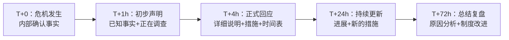

**危机声明模板结构：**
1. 表达关切（真诚，不是套路）
   "我们对此次事件深感关注..."

2. 陈述事实（只说已确认的）
   "目前确认的情况是..."

3. 承担责任（如果确实有责）
   "我们在XX方面确实存在不足..."

4. 具体措施（可执行、可追踪）
   "我们已经采取以下措施：①... ②... ③..."

5. 后续承诺
   "我们将在[时间]内公布完整的调查结果。"

### 6.4 常见误区与纠正

**误区一：流量至上，牺牲质量**
- ❌ 用标题党、煽情、虚假信息获取点击
- ✅ 用好内容吸引精准受众，建立长期品牌价值
- 🔍 标题党带来的一次性流量，会消耗长期积累的公信力

**误区二：观点先行，事实后补**
- ❌ 先有了结论，再去找支持的证据
- ✅ 从证据出发，让结论自然浮现
- 🔍 这是新闻专业主义的底线

**误区三：忽视社交媒体的舆论场**
- ❌ 只在传统渠道发布内容，忽视社交媒体的讨论
- ✅ 监测社交媒体反馈，及时回应误解和批评
- 🔍 在社交媒体时代，"沉默"会被解读为"心虚"

### 6.5 能力进阶路径

| 层级 | 角色 | 核心沟通能力 |
|------|------|------------|
| L1 记者/编辑 | 内容生产 | 能采访、写作、编辑 |
| L2 主编/制片人 | 内容策划 | 能策划选题、管理团队、把控质量 |
| L3 总编辑/总监 | 战略方向 | 能制定编辑方针、管理品牌、应对危机 |
| L4 媒体领袖 | 行业影响 | 能影响公共议题、推动行业标准 |

**📌 一页纸速查：媒体行业**

| 维度 | 要点 |
|------|------|
| 沟通风格 | 叙事驱动、时效敏感、创意导向、公众影响力 |
| 正式程度 | 采访正式，社交媒体亲和，编辑会议创意自由 |
| 决策方式 | 新闻价值+伦理标准+受众需求 |
| 核心禁忌 | 不造谣不传谣；不侵犯隐私；不抄袭；不有偿新闻 |
| 必备技能 | 采访、写作、编辑、社交媒体运营、危机公关 |
| 进阶方向 | 记者→主编→总编辑→媒体领袖 |

---

## 七、法律行业

### 7.1 沟通风格画像

法律行业的沟通以**逻辑严密、用词精确、证据导向**为核心特征。法律语言被称为"世界上最精确的语言"——每一个词的选择、每一个标点的位置，都可能影响条款的解释和案件的结果。

**对抗性与合作性的并存：** 法律行业的沟通场景横跨两个极端——法庭上的对抗性辩论和调解桌上的合作性谈判。律师需要在两种模式之间自如切换：在法庭上锋利果断，在调解中温和共情。

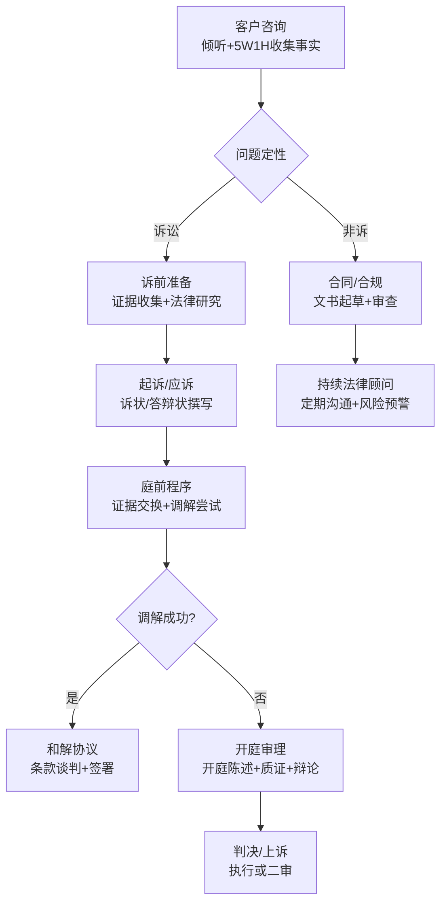

**保密性的铁律：** 律师-客户特权（Attorney-Client Privilege）是法律行业的基石。律师对客户信息的保密义务不仅是一项职业道德要求，更是法律制度正常运转的前提。违反保密义务可能导致执照被吊销、客户权益受损，甚至承担刑事责任。

### 7.2 核心术语速查

#### 法律文书术语

| 术语 | 含义 | 沟通要点 |
|------|------|---------|
| 诉状（Complaint） | 向法院提起诉讼的文书 | 事实+法律依据+诉讼请求，缺一不可 |
| 答辩状（Answer） | 被被告对起诉的回应 | 逐条回应诉状中的指控，承认或否认 |
| 法律意见书 | 律师对法律问题的专业意见 | 客观、审慎，注明假设条件和限制 |
| 动议（Motion） | 向法院提出的请求 | 明确请求事项+法律依据+事实基础 |
| 尽职调查报告 | 对交易标的的法律调查 | 问题清单+风险等级+建议措施 |

#### 诉讼程序术语

| 术语 | 含义 | 实操沟通场景 |
|------|------|------------|
| 管辖权 | 法院审理案件的权限 | "这个案件应该在哪个法院起诉？" |
| 举证责任 | 证明事实的责任 | "谁主张谁举证——原告需要证明..." |
| 交叉质证 | 对对方证人的质询 | 准备好关键问题，控制节奏，抓住矛盾 |
| 调解/仲裁 | 替代性争议解决 | "相比诉讼，调解可能更快、成本更低、关系维护更好" |
| 和解 | 当事人之间的解决协议 | 权衡诉讼成本+时间+不确定性 vs 和解的确定性 |

#### 商业法律术语

| 术语 | 含义 | 商业沟通中的翻译 |
|------|------|----------------|
| 知识产权（IP） | 专利、商标、版权等 | "我们需要确认这个技术的IP归属" |
| 竞业禁止 | 限制离职后竞争的条款 | "签了这个条款，离职后2年内不能去竞争对手" |
| NDA | 保密协议 | "先签NDA，然后我们再聊具体方案" |
| 并购（M&A） | 合并和收购 | "这次并购需要做全面的法律尽调" |

### 7.3 关键沟通场景深度解析

#### 场景一：客户咨询的沟通框架

第一阶段：倾听与理解（占咨询时间的40%）
  让客户完整叙述情况，不打断
  用"5W1H"框架收集关键事实
  记录关键时间节点（诉讼时效！）

第二阶段：法律分析（占咨询时间的30%）
  用客户能理解的语言解释法律问题
  明确告知：有几种可能的法律路径，各自的利弊
  不承诺结果，只分析概率和风险

第三阶段：建议与方案（占咨询时间的20%）
  推荐的行动方案+替代方案
  预估时间线和费用
  明确下一步行动

第四阶段：确认与记录（占咨询时间的10%）
  确认客户理解了关键信息
  提供书面摘要
  约定下次沟通时间

#### 场景二：法庭辩论的沟通结构

**开庭陈述（Opening Statement）：**
"法官/各位陪审员，今天的案件关于[一句话概括]。
 我将向您证明三件事：
 第一，[核心事实1]
 第二，[核心事实2]
 第三，[核心事实3]
 证据将清楚地显示..."

**交叉质证的技巧：**
- 永远不要问你不知道答案的问题
- 用封闭式问题控制证人——"是"或"不是"
- 一次只问一个问题，不要给证人解释的空间
- 在关键矛盾点上停留，让法官/陪审团记住

#### 场景三：合同谈判

**谈判准备清单：**
1. 明确客户的商业目标（不只是法律目标）
2. 识别所有关键条款的优先级（必须保护 vs 可以让步）
3. 研究对方可能的立场和底线
4. 准备替代方案（BATNA——最佳替代方案）

**谈判中的沟通策略：**
- 先倾听对方的核心关切
- 用"如果...那么..."结构提出交换条件
- 每次让步都要换取对等的回报
- 遇到僵局时换个议题，不要死磕
- 重大分歧记录在案，会后内部讨论

### 7.4 常见误区与纠正

**误区一：用法律术语"碾压"客户**
- ❌ "根据《民法典》第XXX条，您的诉讼时效已经过了除斥期间"
- ✅ "法律给了您一个时间限制来主张权利，这个期限已经过了。这意味着..."
- 🔍 客户不需要你展示法律知识，需要你帮他解决问题

**误区二：只看法律风险，不看商业现实**
- ❌ "从法律角度，这个合同有15个风险点"（如果每个都坚持，交易可能做不成）
- ✅ "这个合同有3个高风险点必须修改，5个中风险点建议修改，7个低风险点可以接受"
- 🔍 好的法律顾问是在风险和商业目标之间找到平衡

**误区三：不记录口头沟通**
- ❌ 电话里和对方律师达成了共识，没有书面确认
- ✅ 每次重要口头沟通后，发一封确认邮件："根据我们今天的电话讨论，确认以下内容..."
- 🔍 "如果没写下来，它就没发生过"

### 7.5 能力进阶路径

| 层级 | 角色 | 核心沟通能力 |
|------|------|------------|
| L1 初级律师 | 执行 | 能撰写基本法律文书、参与客户会议 |
| L2 资深律师 | 独立 | 能独立处理客户关系、出庭辩论 |
| L3 合伙人 | 管理 | 能管理团队、拓展业务、处理重大案件 |
| L4 高级合伙人 | 影响 | 能影响立法、参与行业标准制定 |

**📌 一页纸速查：法律行业**

| 维度 | 要点 |
|------|------|
| 沟通风格 | 逻辑严密、用词精确、证据导向、保密第一 |
| 正式程度 | 极高——文书、法庭、谈判都有严格规范 |
| 决策方式 | 法律条文+判例+法理+商业判断 |
| 核心禁忌 | 不违反保密义务；不用词模糊；不承诺胜诉 |
| 必备技能 | 法律文书、法庭辩论、客户咨询、合同谈判 |
| 进阶方向 | 初级律师→资深→合伙人→高级合伙人 |

---

## 八、政府与公共部门

### 8.1 沟通风格画像

政府与公共部门的沟通以**规范性、权威性、公共性**为核心特征。政府部门的沟通需要遵循严格的程序和规范，确保信息的准确性和权威性。

**多对象沟通的复杂性：** 政府部门需要同时与上级机关、同级部门、下属单位、企业、媒体和普通公众沟通。每个对象的沟通风格、关注点和期望都不同——向上汇报要精炼，向下传达要清晰，对公众要通俗，对媒体要及时。

**政策沟通的特殊挑战：** 一项政策从制定到执行，需要经历调研、起草、征求意见、审议、发布、宣传、执行、评估等多个环节。每个环节都涉及大量沟通协调工作。政策的宣传解读尤其需要将专业的政策语言转化为公众能理解的日常语言。

### 8.2 核心术语速查

#### 公文术语

| 文种 | 用途 | 格式要点 |
|------|------|---------|
| 通知 | 传达要求、告知事项 | 标题+主送机关+正文+落款 |
| 报告 | 向上级汇报工作 | 不需要上级回复 |
| 请示 | 向上级请求批准 | 一文一事，需要上级回复 |
| 批复 | 答复下级请示 | 针对性强，态度明确 |
| 函 | 不相隶属机关之间 | 语气平等、协商 |
| 意见 | 对重要问题提出见解 | 有指导性，可操作 |
| 会议纪要 | 记载会议议定事项 | 议题+讨论+决定+责任人 |

#### 治理术语

| 术语 | 含义 | 沟通场景 |
|------|------|---------|
| 放管服改革 | 简政放权、放管结合、优化服务 | "我们要继续深化放管服改革，减少行政审批" |
| 数字政府 | 运用数字技术提升治理能力 | "政务数据共享是数字政府建设的基础" |
| 营商环境 | 影响企业经营的制度条件 | "优化营商环境的核心是降低制度性交易成本" |
| 基层治理 | 社区和乡村层面的治理 | "上面千条线，下面一根针——基层治理的关键是减负增效" |
| 政策试点 | 先在小范围试行新政策 | "这个政策先在3个省份试点，总结经验后再全面推广" |
| 第一责任人 | 对某项工作负首要责任的领导 | "安全生产的第一责任人是单位主要负责人" |
| 信访件 | 群众来信来访的记录 | "这个信访件需要在15个工作日内给出答复" |
| 政务公开 | 政府信息公开 | "政务公开是建设法治政府的基本要求" |
| 联席会议 | 多部门联合协调会议 | "这个问题涉及三个部门，需要召开联席会议协调" |
| 督办 | 上级对下级工作执行的监督检查 | "领导批示的事项需要列入督办清单，定期跟踪进展" |

### 8.3 关键沟通场景深度解析

#### 场景一：政策发布与解读

**政策解读的"三个转化"：**

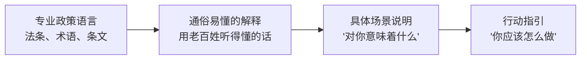

**政策解读的写作结构：**
1. 一句话说清政策核心内容
   "简单说，这个政策就是[一句话]"

2. 背景说明（为什么出台）
   "目前存在的问题是...，这个政策就是为了解决这个问题"

3. 具体变化（新旧对比）
   用表格对比新旧政策的差异

4. 对各方的影响
   对企业："您需要注意..."
   对个人："对您的影响是..."

5. 执行时间和过渡安排
   "从X月X日开始执行，已有的项目有X个月过渡期"

6. 咨询渠道
   "如有疑问，请拨打XXX或访问XXX网站"

#### 场景二：新闻发布会

**发言人沟通要点：**
- **30秒原则**：每个问题的回答控制在30秒内说清核心
- **口径预设**：提前准备10-15个可能的问题和标准回答
- **桥梁话术**："这个问题的核心是...，我们正在..."
- **不当场承诺**：未确认的信息不要在发布会上做出承诺
- **真诚态度**：不知道的说"我需要确认后回复"，不要编造

#### 场景三：信访接待

**信访接待沟通框架：**
第一步：倾听
  让来访者完整表达诉求，不打断，不辩解
  用笔记记录关键信息

第二步：共情
  "我理解您的情况，换作是我也会很着急"
  （注意：共情不等于同意对方的诉求）

第三步：解释
  用通俗语言说明相关政策和法规
  明确告知哪些诉求有政策依据，哪些暂时无法满足

第四步：引导
  提供合法、可行的解决渠道
  "您可以向XX部门申请XX，材料包括..."

第五步：跟进
  明确告知后续流程和时间节点
  留下联系方式

### 8.4 常见误区与纠正

**误区一：公文语言"假大空"**
- ❌ "高度重视、深刻认识、切实加强、全面贯彻落实"
- ✅ 用具体数字、具体措施、具体时间节点
- 🔍 公文的权威来自内容的实质，不是辞藻的堆砌

**误区二：回应公众关切时"打官腔"**
- ❌ "有关部门正在研究处理"（哪个部门？什么时间？）
- ✅ "XX局负责此事，预计X月X日前给出处理意见"
- 🔍 公众需要的是具体答案，不是模糊承诺

**误区三：舆情应对中的"鸵鸟策略"**
- ❌ 不回应，等热度过去
- ✅ 第一时间表态，持续更新进展，透明公开
- 🔍 沉默在社交媒体时代不是金，是火上浇油

### 8.5 能力进阶路径

| 层级 | 角色 | 核心沟通能力 |
|------|------|------------|
| L1 科员 | 执行 | 能撰写规范公文、做好日常接待 |
| L2 科长/处长 | 协调 | 能跨部门协调、处理复杂问题 |
| L3 局长/主任 | 决策 | 能主持重要会议、处理危机事件 |
| L4 更高级别 | 引领 | 能制定政策、影响公共议题 |

**📌 一页纸速查：政府与公共部门**

| 维度 | 要点 |
|------|------|
| 沟通风格 | 规范、权威、程序化、多对象 |
| 正式程度 | 极高——公文有国标，发布会有流程 |
| 决策方式 | 政策依据+集体决策+民主集中 |
| 核心禁忌 | 不违反公文规范；不泄露涉密信息；不回避公众关切 |
| 必备技能 | 公文写作、新闻发布、信访接待、跨部门协调 |
| 进阶方向 | 科员→科长/处长→局长/主任→更高级别 |

---

## 九、创业行业

### 9.1 沟通风格画像

创业行业的沟通以**激情、简洁、行动导向**为核心特征。创业者的时间永远不够用，资源永远不够多，因此创业沟通追求的是"用最少的时间传递最大的价值"。

**讲故事的能力=融资能力：** 投资人投资的不只是商业计划书，更是创业者的愿景、激情和执行力。一个好的创业故事需要在30秒内说清楚"你解决什么问题、怎么解决、为什么是你"。这个能力直接决定了你能否拿到融资、能否招到优秀人才、能否说服早期客户。

**多方利益相关者的管理：** 创业者需要同时管理投资人、合伙人、员工、客户、供应商、媒体等多方关系。每一方的关注点不同：投资人看回报，员工看愿景和成长，客户看价值，供应商看稳定性。用同一套话术应对所有人是创业沟通的大忌。

**"精益沟通"：** 创业环境中的沟通和产品开发一样，需要"精益"——快速测试、快速迭代、快速调整。不要花三个月做一份完美的商业计划书，先用一页纸说清楚核心逻辑，收集反馈，迭代改进。

### 9.2 核心术语速查

#### 融资术语

| 术语 | 含义 | 创业者沟通要点 |
|------|------|--------------|
| 种子轮 | 最早期融资（通常100-500万） | "我们用种子轮资金做出了MVP，验证了PMF" |
| A轮 | 第一轮机构融资（通常1000-5000万） | "A轮资金用于扩大团队和市场推广" |
| 估值 | 对公司价值的评估 | "估值不是越高越好——高估值意味着高预期和高压对赌" |
| Term Sheet | 投资条款清单 | "签TS前一定要让律师审阅每一条" |
| 股权稀释 | 融资后持股比例下降 | "每轮融资稀释15-25%是正常范围" |
| Burn Rate | 资金消耗速度 | "我们的月Burn Rate是80万，Runway还有12个月" |
| Runway | 资金可维持的时间 | "Runway不到6个月就要开始融资了" |

#### 商业模式术语

| 术语 | 含义 | 沟通中的应用 |
|------|------|------------|
| PMF（产品市场匹配） | 产品满足市场需求 | "达到PMF的标志是用户自发增长和高留存" |
| MVP（最小可行产品） | 最小版本验证假设 | "先做MVP，别一上来就做大而全" |
| Pivot（转型） | 调整方向 | "我们Pivot了三次才找到现在的方向" |
| Traction（牵引力） | 早期市场验证 | "有了Traction再去找投资人，否则只是浪费时间" |
| Moat（壁垒） | 竞争优势 | "投资人会问：你的Moat是什么？别人为什么做不了？" |

### 9.3 关键沟通场景深度解析

#### 场景一：融资路演

**10分钟路演结构（以互联网创业为例）：**

Slide 1-2（1分钟）：问题与机会
  "在[行业]中，[具体人群]面临[具体问题]。
   这个问题的市场规模是[数据]。"

Slide 3-4（2分钟）：解决方案
  "我们的产品通过[核心功能]解决了这个问题。
   与现有方案相比，我们的独特优势是[差异化]。"

Slide 5（1分钟）：商业模式
  "我们通过[付费方式]获得收入。
   客单价[X]，LTV[X]，CAC[X]。"

Slide 6（1分钟）：Traction
  "上线[X]个月，[核心指标]。
   [增长数据]，[用户反馈/案例]。"

Slide 7（1分钟）：团队
  "核心团队[X]人，来自[背景]。
   我们在这个领域有[X]年的经验。"

Slide 8-9（2分钟）：规划与融资
  "未来12个月的计划：[里程碑1]、[里程碑2]、[里程碑3]。
   本轮计划融资[X]万，出让[X]%股份。"

Slide 10（1分钟）：总结
  一句话重述核心价值

**路演中的常见陷阱：**
- ❌ 幻灯片字太多，投资人根本不会看
- ❌ 讲技术细节，不讲商业价值
- ❌ 说"我们没有竞争对手"（投资人会觉得你没做调研）
- ❌ 回避敏感问题（估值怎么来的？数据怎么来的？）
- ✅ 用数据说话，用案例说话，用客户证言说话

#### 场景二：团队招募的沟通策略

**初创公司招募的"卖点框架"：**

| 维度 | 大公司能给 | 初创公司能给 | 沟通策略 |
|------|-----------|------------|---------|
| 薪资 | 高薪+稳定 | 低于市场 | "我们的薪资构成是基本+期权" |
| 成长 | 体系化培训 | 快速成长 | "在我们这里，6个月的成长等于大公司2年" |
| 影响力 | 分工细化 | 全面参与 | "你的决策直接影响产品方向和公司发展" |
| 使命感 | 较弱 | 极强 | "我们在改变[行业]的[具体问题]" |
| 股权 | 上市公司期权 | 创业公司期权 | "如果成功，你的期权价值可能是薪资的10倍" |

#### 场景三：合伙人沟通

**合伙人之间的沟通协议（建议正式化）：**

每周：30分钟一对一，讨论进展和困难
每月：2小时战略对齐，回顾目标和调整方向
每季度：半天深度讨论，处理重大决策和分歧

沟通原则：
  1. 有分歧当面说，不在背后抱怨
  2. 用数据和逻辑说服，不用情绪和权力压制
  3. 重大决策需要所有人同意，日常执行一人拍板
  4. 定期检查彼此的状态——burnout是创业团队的隐形杀手

### 9.4 常见误区与纠正

**误区一：只会说"我们要改变世界"**
- ❌ 空洞的愿景，没有具体路径
- ✅ "我们解决[具体问题]，目前[具体进展]，下一步[具体计划]"
- 🔍 投资人听过的"改变世界"有10000个，能说清楚怎么改变的只有10个

**误区二：融资时过度包装**
- ❌ 夸大用户数据、隐瞒关键信息、虚报估值依据
- ✅ 坦诚说明优势和挑战，投资人欣赏诚实和自知之明
- 🔍 投资圈很小，一次不诚实的融资可能毁掉所有后续机会

**误区三：忽视内部沟通**
- ❌ 所有精力对外（融资、销售），团队内部信息不透明
- ✅ 定期全员会议，分享公司进展、挑战和方向
- 🔍 初创团队的信任是最脆弱的，信息不对称是信任的杀手

### 9.5 能力进阶路径

| 层级 | 角色 | 核心沟通能力 |
|------|------|------------|
| L1 创业新人 | 产品演示 | 能清晰介绍产品和价值 |
| L2 创业者 | 融资+销售 | 能做路演、管理客户、招人 |
| L3 CEO | 战略+管理 | 能管理多方关系、制定战略、领导团队 |
| L4 创业导师 | 行业影响 | 能指导其他创业者、影响行业生态 |

**📌 一页纸速查：创业行业**

| 维度 | 要点 |
|------|------|
| 沟通风格 | 激情、简洁、故事驱动、行动导向 |
| 正式程度 | 路演正式，团队内部偏平等开放 |
| 决策方式 | 数据+直觉+快速试错 |
| 核心禁忌 | 不过度包装；不忽视内部沟通；不空谈愿景 |
| 必备技能 | 路演、团队招募、客户开发、合伙人沟通 |
| 进阶方向 | 创业新人→创业者→CEO→创业导师 |

---

## 十、学术行业

### 10.1 沟通风格画像

学术行业的沟通以**严谨性、系统性、创新性**为核心特征。学术工作者的核心产出是"新知识"，而新知识的生产、验证和传播都依赖于高质量的学术沟通。

**同行评审的过滤机制：** 学术出版的同行评审制度是学术沟通质量的保障机制。一篇论文从投稿到发表，需要经过2-3位匿名评审人的严格审查。这个过程不仅是质量过滤，也是学术社区自我纠错的机制。

**"发表或灭亡"的压力：** 学术界的"Publish or Publish"文化对学术沟通产生了双重影响——一方面激励了学术产出，另一方面可能导致研究质量下降、学术不端增加。理解这个压力背景，有助于在学术沟通中保持平衡。

**教学与研究的双重角色：** 学术工作者需要同时做好"发现新知识"（研究）和"传播已有知识"（教学）。这两种沟通模式截然不同——研究沟通追求精确和创新，教学沟通追求清晰和启发。

### 10.2 核心术语速查

#### 研究方法术语

| 术语 | 含义 | 沟通中的应用 |
|------|------|------------|
| 假设（Hypothesis） | 对研究问题的初步回答 | "我们的假设是X会导致Y" |
| 变量（Variable） | 研究中可变化的因素 | "自变量是X，因变量是Y，控制变量包括Z" |
| 文献综述 | 对已有研究的系统梳理 | "在这个领域，已有的研究主要集中在..." |
| 同行评审 | 由同行专家审核研究 | "这篇论文经过了双盲同行评审" |
| 可重复性 | 研究结果可被重复验证 | "我们的实验数据和代码已公开，可供重复验证" |

#### 学术发表术语

| 术语 | 含义 | 实操要点 |
|------|------|---------|
| SCI/SSCI | 科学/社会科学引文索引 | "我们领域的顶级期刊都在SCI一区" |
| 影响因子 | 期刊的影响力指标 | "影响因子是参考指标之一，但不是唯一标准" |
| H指数 | 学者学术产出和影响力 | "H指数需要时间积累，年轻学者不必过于焦虑" |
| 预印本 | 同行评审前公开发布 | "我们先把预印本放到arXiv上，获取社区反馈" |
| 开放获取 | 免费获取学术论文 | "OA期刊的读者更多，但可能需要付版面费" |
| 引用次数（Citation） | 论文被其他论文引用的次数 | "这篇论文发表3年已经有200次引用了" |
| 通讯作者 | 论文的主要联系人 | "通讯作者通常是对研究贡献最大的PI" |
| 审稿意见（Review Comments） | 同行评审的反馈 | "第一个审稿人给了大修，意见集中在方法论部分" |
| 研究伦理（Research Ethics） | 研究中涉及的伦理规范 | "涉及人体受试者的研究必须通过伦理委员会审批" |
| 基金申请（Grant Proposal） | 向资助机构申请研究经费 | "基金申请书的核心是讲清楚'为什么做'和'做了有什么用'" |
| 学术不端（Academic Misconduct） | 伪造、篡改、抄袭等行为 | "学术不端是红线，一旦触犯将终结学术生涯" |

### 10.3 关键沟通场景深度解析

#### 场景一：论文写作的IMRAD结构

Introduction（引言）—— 为什么做这个研究？
  1. 研究背景和重要性
  2. 已有研究的不足（研究空白）
  3. 本文的研究问题和目标
  4. 本文的贡献

Methods（方法）—— 怎么做的？
  1. 数据来源和样本
  2. 实验设计/研究框架
  3. 分析方法
  4. 有效性保障

Results（结果）—— 发现了什么？
  1. 描述性统计
  2. 主要发现（对应研究问题）
  3. 图表呈现（数据可视化）

Discussion（讨论）—— 这意味着什么？
  1. 结果解释（与已有研究对比）
  2. 理论贡献
  3. 实践意义
  4. 局限性
  5. 未来研究方向

#### 场景二：学术报告

**15分钟学术报告结构：**

开场（1分钟）：
  "今天我要报告的是[标题]。
   这个研究要回答的问题是[一句话]。"

背景（2分钟）：
  研究问题为什么重要？
  已有的研究怎么说？还有什么空白？

方法（3分钟）：
  我们怎么做的？
  为什么用这个方法？

结果（5分钟）：
  关键发现①②③
  每个发现配一张清晰的图表

讨论（3分钟）：
  这些发现意味着什么？
  有什么局限？

总结（1分钟）：
  重述核心结论和贡献
  "欢迎提问和讨论。"

**面对质疑的策略：**
- ✅ "这是个好问题。我们的解释是..."
- ✅ "这个局限我们确实在论文中讨论了，主要原因是..."
- ✅ "这个角度我们没有考虑到，感谢您的建议，我们会在后续研究中考虑"
- ❌ "这个问题不在我们的研究范围内"（太生硬，应该说"这个值得单独研究"）

#### 场景三：论文答辩

**答辩准备要点：**
1. 准备20分钟的答辩陈述（不是念论文）
2. 预想10-15个可能的问题，包括方法论质疑、结果解释争议、研究局限
3. 准备"我不确定"的诚实回答方式——"这个方面我需要进一步查阅文献"
4. 对论文的每个细节了然于胸——评审可能问任何一页的内容

### 10.4 常见误区与纠正

**误区一：用复杂语言显示学术水平**
- ❌ 使用大量长句、从句、专业术语，让论文看起来"很学术"
- ✅ 清晰、准确、简洁——好的学术写作是把复杂问题讲清楚
- 🔍 爱因斯坦说："如果你不能简单地解释它，说明你理解得还不够好"

**误区二：忽视论文的"故事线"**
- ❌ 堆砌数据和文献，没有逻辑主线
- ✅ 整篇论文应该像一个故事：有问题、有悬念、有发现、有意义
- 🔍 评审人和读者的时间有限，你的论文需要在摘要阶段就"抓住"他们

**误区三：回避研究的局限性**
- ❌ 假装研究完美无缺
- ✅ 主动讨论局限性，这反而显示你的学术成熟度
- 🔍 没有完美的研究，但有诚实的研究者

**误区四：忽视学术社区的人际沟通**
- ❌ 只埋头做研究，不参加学术交流
- ✅ 学术合作、会议社交、审稿服务都是学术沟通的一部分
- 🔍 很多重要的学术合作始于会议茶歇的闲聊

### 10.5 能力进阶路径

| 层级 | 角色 | 核心沟通能力 |
|------|------|------------|
| L1 研究生 | 学习 | 能撰写规范的学术论文、做基本的学术报告 |
| L2 博士后/助理教授 | 独立 | 能独立发表高水平论文、申请基金、指导学生 |
| L3 副教授/教授 | 领导 | 能领导研究团队、主编期刊、做大会报告 |
| L4 学科带头人 | 影响 | 能推动学科发展、影响学术政策、建立学派 |

**📌 一页纸速查：学术行业**

| 维度 | 要点 |
|------|------|
| 沟通风格 | 严谨、系统、创新、证据导向 |
| 正式程度 | 极高——论文、报告、答辩都有严格规范 |
| 决策方式 | 证据+逻辑+同行评审 |
| 核心禁忌 | 不学术不端；不抄袭；不忽视研究伦理 |
| 必备技能 | 论文写作、学术报告、基金申请、同行评审 |
| 进阶方向 | 研究生→助理教授→教授→学科带头人 |

---

## 十一、咨询行业

### 11.1 沟通风格画像

咨询行业的沟通以**结构化思维、客户导向、影响力驱动**为核心特征。咨询顾问的核心价值不是"我知道答案"，而是"我能帮你想清楚问题"。因此，咨询沟通的本质是**引导式对话**——通过提问和框架帮助客户自己发现答案。

**金字塔原理的统治地位：** 麦肯锡的芭芭拉·明托提出的金字塔原理（Pyramid Principle）是咨询行业沟通的基石。核心规则：**先说结论，再给论据，论据之间互不重叠、完全穷尽（MECE）**。这个原则渗透到咨询顾问的每一封邮件、每一页PPT、每一次汇报中。

**客户关系的微妙平衡：** 咨询顾问需要在"专业权威"和"客户平等伙伴"之间找到平衡。太强势会让客户觉得被居高临下，太顺从会让客户觉得你没有主见。最佳状态是"受尊重的外部专家"——你的建议被重视，但最终决策权在客户。

**高强度的信息密度：** 咨询项目的沟通特点是"信息密度极高"——在极短时间内处理大量信息、提炼核心洞察、形成可执行建议。一个咨询顾问每天可能要处理几十页报告、参加3-5个会议、写出几千字的分析。高效的信息处理和表达能力是生存技能。

**"一页纸"文化：** 咨询公司内部流传一个信条——"如果你不能把一页纸写清楚，说明你还没有想清楚"。这不是形式主义，而是思维训练。当你被迫将100页分析压缩到1页执行摘要时，你必须做出判断：什么信息是决策者真正需要的，什么是噪音。这种"信息蒸馏"能力是咨询顾问的核心竞争力。

**咨询类型与沟通风格差异：**

不同类型的咨询项目，对沟通风格的要求截然不同：

| 咨询类型 | 核心任务 | 沟通风格 | 典型交付物 | 汇报对象 |
|---------|---------|---------|-----------|---------|
| 战略咨询 | 回答"做什么" | 高屋建瓴、框架清晰、数据支撑 | 战略报告、市场分析、竞争对标 | CEO/董事会 |
| 管理咨询 | 回答"怎么做" | 可执行、可量化、详细到行动步骤 | 流程优化方案、组织变革计划、实施路线图 | VP/总监 |
| IT咨询 | 回答"用什么做" | 技术+业务双语、风险导向 | 技术架构方案、系统选型报告、实施计划 | CIO/IT总监 |
| 人力咨询 | 回答"谁来做" | 敏感、平衡、制度导向 | 组织架构设计、薪酬体系、人才发展计划 | CHRO/HRD |
| 财务咨询 | 回答"值不值" | 严谨、数据密集、模型驱动 | 估值报告、尽职调查、财务模型 | CFO/投资委员会 |

**顾问与客户的"信任曲线"：**

从怀疑到信任的跨越，通常发生在**第一次真正帮客户解决了一个具体问题**之后。在此之前的所有沟通，都是在为这一刻做铺垫。初级顾问常犯的错误是急于展示"我很聪明"，而资深顾问的做法是"先解决一个小问题，用成果赢得对话资格"。

**咨询顾问的"电梯测试"：** 麦肯锡要求每位顾问能在30秒内说清项目的核心发现和建议。这个看似简单的要求，背后是极高的信息压缩能力——你需要从几十页分析中提炼出最核心的一个观点，并用决策者能立即理解的语言表达出来。练习方法：每次写完分析报告，强迫自己用一句话概括核心结论，然后用30秒口述。

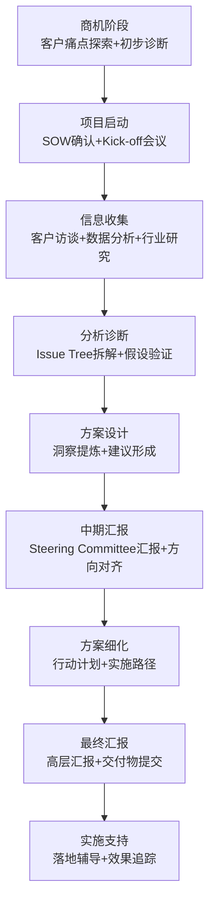

**每个阶段的沟通关键：**

| 阶段 | 核心沟通任务 | 交付物 | 常见失败原因 |
|------|------------|--------|------------|
| 商机 | 理解客户痛点、建立信任 | 能力展示、初步诊断框架 | 过度承诺、不了解客户政治 |
| 启动 | 对齐目标、管理预期 | SOW、项目计划 | 范围模糊、关键干系人未识别 |
| 收集 | 深度访谈、数据获取 | 访谈记录、数据底稿 | 访谈流于表面、数据质量差 |
| 分析 | 结构化分析、验证假设 | 分析报告、核心发现 | 框架套用、缺乏实质洞察 |
| 汇报 | 结论先行、推动决策 | PPT、执行摘要 | 铺垫太长、建议不可落地 |
| 实施 | 推动落地、管理变革 | 行动计划、培训材料 | 脱手不管、忽视组织阻力 |

### 11.2 核心术语速查

#### 咨询方法论术语

| 术语 | 含义 | 沟通中的应用 |
|------|------|------------|
| MECE | 互不重叠、完全穷尽 | "让我们用MECE原则把这个问题拆解一下" |
| 金字塔原理 | 结论先行、层层论证 | "先把结论告诉大家，然后逐层展开" |
| 假设驱动 | 先假设再验证 | "我的假设是X，我们需要收集数据来验证" |
| Issue Tree | 问题树 | "把大问题拆成小问题，逐个击破" |
| 80/20法则 | 聚焦关键少数 | "不要面面俱到，聚焦影响最大的3个因素" |
| 电梯演讲 | 30秒说清核心 | "如果你在电梯里遇到CEO，30秒能说清楚吗？" |
| 二八分析 | 区分关键驱动因素 | "80%的利润来自20%的客户，聚焦头部客户" |
| SCQA | 情境-冲突-问题-答案 | "用SCQA结构组织你的汇报开场" |
| So What | 这意味着什么 | "每个数据点后面都要追问So What——这个数据对决策有什么启示？" |

#### 客户管理术语

| 术语 | 含义 | 实操要点 |
|------|------|---------|
| Sponsor | 项目赞助人（客户方高管） | 没有Sponsor支持的项目寸步难行，定期向Sponsor汇报进展 |
| Stakeholder | 利益相关者 | 识别所有Stakeholder，绘制影响力地图，制定差异化沟通策略 |
| Buy-in | 获得认同/支持 | "我们需要在下周的Steering Committee上获得CEO的Buy-in" |
| Quick Win | 快速见效的成果 | 项目初期就要拿到Quick Win，建立客户信任 |
| Change Management | 变革管理 | 方案再好，如果忽视变革管理，落地时必然遇阻 |
| Scope Creep | 范围蔓延 | "客户又加了三个需求，必须在SOW框架内讨论" |

#### 项目管理术语

| 术语 | 含义 | 实操要点 |
|------|------|---------|
| SOW（工作说明书） | 项目范围和交付物 | 明确"做什么"和"不做什么"，避免范围蔓延 |
| Steering Committee | 指导委员会 | 高层决策会议，汇报项目进展和关键决策 |
| Deliverable | 交付物 | 每个里程碑的产出，需要明确格式和验收标准 |
| Findings | 发现 | 数据分析得出的核心洞察 |
| Recommendations | 建议 | 基于发现提出的可执行方案 |

### 11.3 关键沟通场景深度解析

#### 场景一：项目汇报的金字塔结构

结论（第一句话）：
  "经过8周的分析，我们建议[核心建议]。
   这将带来[量化价值]。"

论据一（最高影响力）：
  "第一个支撑论点是[X]。
   数据显示[证据]..."

论据二：
  "第二个支撑论点是[Y]。
   我们发现[证据]..."

论据三：
  "第三个支撑论点是[Z]。
   案例表明[证据]..."

行动计划：
  "我们建议分三阶段实施：
   第一阶段（1-3个月）：[行动1]
   第二阶段（3-6个月）：[行动2]
   第三阶段（6-12个月）：[行动3]"

**汇报中的常见陷阱：**
- ❌ 花20分钟铺垫背景，5分钟说结论——客户会失去耐心
- ❌ 用大量数据"淹没"客户——数据是支撑论据，不是主角
- ❌ 只给问题不给方案——客户付钱买的是解决方案，不是诊断报告
- ✅ 开场30秒说清核心观点，然后按优先级展开

#### 场景二：客户访谈的深度倾听

开场（建立信任）：
  "感谢您抽出时间。今天主要是想了解[话题]，
   您是这个领域的专家，我们希望从您的经验中学习。"

提问层次：
  Level 1 - 事实："目前的流程是怎样的？"
  Level 2 - 感受："您对这个流程满意吗？"
  Level 3 - 洞察："如果可以改一个地方，您会改什么？"
  Level 4 - 愿景："理想状态是什么样的？"

关键技巧：
  - 追问："您刚才提到了X，能展开说说吗？"
  - 确认："我的理解是...，对吗？"
  - 沉默：给对方思考和补充的空间
  - 记录：关键信息当场记录，事后整理

#### 场景三：方案推动的影响力策略

**"不买账"客户的应对框架：**

| 客户反应 | 可能原因 | 应对策略 |
|---------|---------|---------|
| "这不适用于我们" | 觉得方案脱离实际 | 用客户的实际数据重新论证，增加本地化案例 |
| "我们以前试过了" | 历史创伤 | 承认差异，说明这次的不同之处 |
| "预算不够" | 资源约束 | 提供分阶段实施方案，先做ROI最高的部分 |
| "内部阻力大" | 政治因素 | 帮助识别关键利益相关者，制定影响力策略 |

### 11.4 常见误区与纠正

**误区一：框架比洞察重要**
- ❌ 套用各种分析框架（SWOT、波特五力），但没有实质洞察
- ✅ 框架是思维工具，不是目的。客户买的不是框架，是能帮助决策的洞察
- 🔍 初级咨询顾问最常犯的错误——用框架的复杂度掩盖洞察的贫乏

**误区二：建议过于理想化**
- ❌ 在"真空"中给出最优方案，忽视客户的组织约束、文化阻力和资源限制
- ✅ 好的建议是"在客户当前条件下能做到的最好方案"，不是"理论上最优的方案"
- 🔍 一个60分但能落地的方案，胜过100分但停留在PPT上的方案

**误区三：忽视客户的政治生态**
- ❌ 只关注"正确答案"，不关注"谁支持、谁反对"
- ✅ 理解客户的组织政治，找到方案的"赞助人"和"盟友"
- 🔍 很多好的方案失败，不是因为方案不好，而是因为没有管理好利益相关者

**误区四：汇报变成"信息倾泻"**
- ❌ 在Steering Committee上花30分钟讲数据分析过程，高管们已经开始看手机
- ✅ 用"金字塔结构"：第一句话说结论，然后按优先级展开3个支撑论据，每个论据配1-2个关键数据
- 🔍 高管的时间是稀缺资源，他们需要的是"告诉我该怎么做"，不是"告诉我你做了什么"

**误区五：项目结束就"拍屁股走人"**
- ❌ 最终汇报结束，提交交付物，项目结项。三个月后客户发现方案落不了地
- ✅ 在项目最后阶段制定"30-60-90天实施路线图"，在项目结束后1个月和3个月各做一次跟进回访
- 🔍 咨询的口碑来自"方案真正产生了效果"，而不是"报告写得很漂亮"

### 11.5 能力进阶路径

| 层级 | 角色 | 核心沟通能力 |
|------|------|------------|
| L1 分析师 | 数据与分析 | 能收集数据、制作图表、撰写分析 |
| L2 顾问 | 客户互动 | 能独立访谈客户、汇报发现、管理小模块 |
| L3 项目经理 | 项目管理 | 能管理客户关系、协调团队、推动方案落地 |
| L4 合伙人 | 商业开发 | 能拓展客户关系、赢得新项目、影响行业 |

**📌 一页纸速查：咨询行业**

| 维度 | 要点 |
|------|------|
| 沟通风格 | 结构化、结论先行、数据驱动、客户导向 |
| 正式程度 | 高——汇报和交付物严格规范，日常沟通偏专业平等 |
| 决策方式 | 数据+框架+客户共识 |
| 核心禁忌 | 不套用空框架；不过度承诺；不忽视客户政治 |
| 必备技能 | 金字塔汇报、客户访谈、方案呈现、影响力管理 |
| 进阶方向 | 分析师→顾问→项目经理→合伙人 |

---

## 十二、制造业

### 12.1 沟通风格画像

制造业的沟通以**流程导向、安全第一、跨职能协作**为核心特征。制造业的独特之处在于：沟通的"终端"往往不是人，而是机器和产品——一个指令的误解可能导致产品质量问题甚至安全事故。

**层级与专业分工的交叉：** 制造业的组织结构既有行政层级（总经理→厂长→车间主任→班组长→工人），又有专业分工（研发、工艺、品质、生产、供应链）。一个跨部门项目可能需要同时协调行政层级和专业线条，沟通的复杂度远超一般行业。

**标准化的文化基因：** 制造业深受ISO、精益生产、六西格玛等标准化体系的影响，这种文化延伸到沟通领域——SOP（标准操作程序）、作业指导书、检验标准，一切都要求"写下来、标准化、可追溯"。

**现场主义（Gemba）：** 丰田生产方式的核心理念之一是"到现场去"。在制造业，"坐在办公室里讨论"远不如"到车间现场看一眼"有效。这个理念深刻影响了制造业的沟通方式——重视现场观察、实物展示和直接体验。

**"班前会"的沟通仪式：** 制造业有一种独特的沟通形式——班前会（Morning Briefing）。每天开工前5-10分钟，班组长与全组员工站在产线旁，快速同步当天的生产计划、质量重点、安全提醒和昨日问题。这种仪式化的沟通看似简单，却是信息从管理层传导到一线的最重要通道。一个高效的班前会遵循"三讲一问"原则：讲计划、讲重点、讲安全、问困难。

**数据文化的两面性：** 制造业极度依赖数据——SPC控制图、不良率统计、OEE指标、设备稼动率——一切用数据说话。但这种数据文化也有陷阱：一线员工可能为了"好看的数字"而选择性报告，管理层可能沉迷于看报表而忽视现场的真实状况。好的制造业沟通者需要做到"看数据，但不迷信数据；到现场，但不只凭经验"。

**安全沟通的"零容忍"原则：** 在所有行业的沟通中，制造业对安全的要求是最严格的。安全不是"重要"，而是"第一"。任何安全隐患的沟通必须做到：即时上报（不等、不拖）、事实描述（不推测、不隐瞒）、责任明确（不模糊、不推诿）。"安全第一"不是口号，而是刻入骨髓的沟通本能——当安全与效率冲突时，答案永远是安全。

**跨层级沟通的"翻译"挑战：** 制造业的沟通层级特别分明——总经理说战略语言、厂长说管理语言、工程师说技术语言、班组长说操作语言、工人说经验语言。同一个质量问题，从不同层级的口中说出来，含义完全不同。优秀的制造业沟通者需要掌握"多层级翻译"能力：把总经理的"提升良率"翻译成工程师的"优化SPC参数"，再翻译成工人的"每30分钟检查一次模具温度"。

### 12.2 核心术语速查

#### 生产管理术语

| 术语 | 含义 | 沟通中的应用 |
|------|------|------------|
| BOM（物料清单） | 产品的零部件组成 | "这个BOM变更会影响3个供应商的交付" |
| SOP（标准操作程序） | 标准化的操作流程 | "先更新SOP，再培训产线员工" |
| OEE（设备综合效率） | 衡量设备利用效率 | "当前OEE只有65%，主要损失来自换线停机" |
| 精益生产 | 消除浪费的生产方式 | "用精益方法减少这个工序的等待时间" |
| 六西格玛 | 质量管理方法论 | "通过DMAIC流程降低不良率到3.4PPM以下" |
| 首件检验 | 生产开始时的样品检验 | "首件确认通过后才能批量生产" |

#### 质量管理术语

| 术语 | 含义 | 实操沟通要点 |
|------|------|------------|
| IQC/IPQC/OQC | 来料/过程/出货检验 | "IQC发现这批原材料不良率超标，需要与供应商沟通" |
| 8D报告 | 问题解决报告 | "客户投诉需要在48小时内提交8D报告" |
| FMEA | 失效模式与影响分析 | "在量产前完成FMEA，识别潜在的质量风险" |
| PPAP | 生产件批准程序 | "新供应商需要通过PPAP才能正式供货" |
| CAPA | 纠正与预防措施 | "CAPA不仅要解决当前问题，还要防止再发" |
| SPC | 统计过程控制 | "SPC控制图显示这个参数已经开始漂移，需要调整" |
| 控制计划 | 过程控制的详细方案 | "控制计划必须覆盖每个关键特性的检测频率和方法" |
| 工程变更（ECN） | 设计或工艺的变更通知 | "这个ECN会影响在途物料，需要和供应链协调" |
| 节拍时间（Takt Time） | 满足客户需求的生产节拍 | "客户每天需要100件，我们的Takt Time是4.8分钟/件" |
| 安灯（Andon） | 产线异常呼叫系统 | "员工拉了Andon，班组长必须在1分钟内到达工位" |

### 12.3 关键沟通场景深度解析

#### 场景一：质量异常的快速响应

发现异常（T+0）：
  → 立即停线，通知品质工程师和生产主管
  → 隔离可疑产品，标识待检

原因分析（T+2h）：
  → 收集数据：不良类型、数量、时间段、涉及工位
  → 用5Why或鱼骨图分析根因
  → 与工艺、设备、材料等相关方确认

临时措施（T+4h）：
  → 确定临时对策（如加严检验、调整参数）
  → 评估已生产产品的处理方案（全检/返工/报废）
  → 通知客户（如涉及出货产品）

永久措施（T+24h~1周）：
  → 制定长期改善方案
  → 更新SOP和检验标准
  → 完成8D报告
  → 水平展开到类似工序/产品

#### 场景二：跨部门项目协调

**新产品导入（NPI）的沟通节点：**

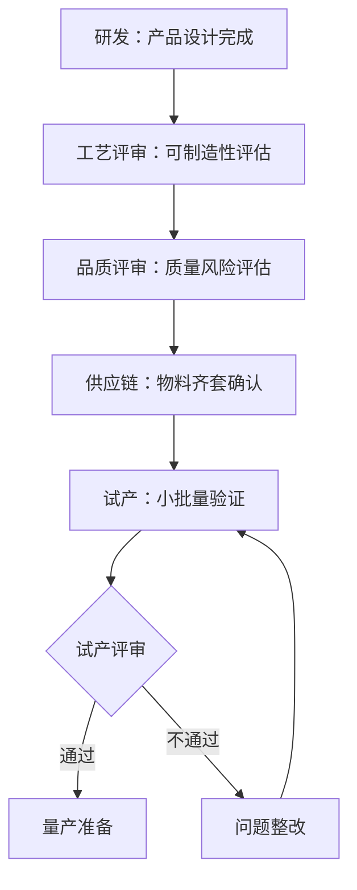

**每个节点的沟通要点：**
- 研发→工艺：提供完整的设计意图和关键特性，不只是图纸
- 工艺→品质：说明工艺能力限制和需要重点管控的参数
- 品质→供应链：明确来料检验标准和供应商资质要求
- 试产评审：所有部门共同参与，当场确认问题和责任

#### 场景三：供应商沟通

**供应商质量问题的沟通框架：**

第一步：事实通报
  "贵司[日期]交付的[物料]，经IQC检验发现[具体问题]。
   不良率为[X]%，超出约定的[Y]%标准。"

第二步：影响说明
  "该问题导致我司[具体影响]：
   产线停线[X]小时 / 客户投诉[X]批次 / 损失金额约[X]元。"

第三步：要求回应
  "请贵司在[X]小时内提供：
   ① 原因分析 ② 临时措施 ③ 永久改善计划"

第四步：跟进确认
  "我们将在[X]天后到贵司现场确认改善效果。"

#### 场景四：安全事件的沟通流程

安全事件是制造业最敏感的沟通场景，任何延迟或隐瞒都可能导致更严重的后果。

T+0（事件发生）：
  → 立即启动应急预案，救治伤者
  → 第一时间通知安全主管和厂长
  → 封锁现场，保留证据
  → 口头通报：时间、地点、人员、伤害程度

T+1h（初步通报）：
  → 向管理层发出初步事故通报
  → 通知受影响员工的家属（如有人员伤害）
  → 启动事故调查小组

T+4h（原因初判）：
  → 初步原因分析（人、机、料、法、环）
  → 制定临时安全措施，防止类似事故再次发生
  → 向全体员工通报（不隐瞒，但也不制造恐慌）

T+24h~1周（正式报告）：
  → 完成事故调查报告（根因分析+纠正措施）
  → 更新安全操作规程（SOP）
  → 组织安全培训和复盘会
  → 向监管部门提交报告（如适用）

**安全事件沟通的核心原则：**
- **不隐瞒**：任何安全事故都必须如实上报，隐瞒比事故本身更严重
- **不推责**：先解决问题和救治伤者，追责放在最后
- **不重复**：事故通报后必须有整改措施，否则通报毫无意义
- **全员知情**：事故信息应在适当脱敏后传达给全体员工，起到警示作用

### 12.4 常见误区与纠正

**误区一：只看报告不到现场**
- ❌ 在办公室看品质报告、生产日报，做出判断
- ✅ 到车间现场观察实际操作，很多问题只有现场才能发现
- 🔍 "Gemba"（现场）是制造业沟通的根基，数据报告是辅助不是替代

**误区二：出了问题先追责再解决**
- ❌ "这是谁的责任？"——当务之急是解决问题，不是找人背锅
- ✅ 先止血（临时措施），再复盘（根因分析），最后追责（制度改进）
- 🔍 追责文化会让员工隐瞒问题，比问题本身更危险

**误区三：用专业术语"碾压"一线员工**
- ❌ "请按照FMEA的RPN值优先级执行CAPA措施"
- ✅ "先处理风险最高的那个问题，按照这个步骤来做"
- 🔍 一线员工需要的是清晰的操作指令，不是方法论名词

### 12.5 能力进阶路径

| 层级 | 角色 | 核心沟通能力 |
|------|------|------------|
| L1 一线工程师 | 执行汇报 | 能清晰汇报问题、执行标准流程 |
| L2 主管/课长 | 跨部门协调 | 能协调生产、品质、工艺等部门 |
| L3 厂长/总监 | 战略执行 | 能推动改善项目、管理供应商关系 |
| L4 VP/COO | 战略决策 | 能制定制造战略、管理全球供应链 |

**📌 一页纸速查：制造业**

| 维度 | 要点 |
|------|------|
| 沟通风格 | 流程导向、标准化、安全第一、现场主义 |
| 正式程度 | 正式——SOP、报告、检验记录都有规范格式 |
| 决策方式 | 数据+标准+现场验证 |
| 核心禁忌 | 不不到现场就做判断；不出了问题先追责；不忽视安全 |
| 必备技能 | 问题报告、跨部门协调、供应商管理、标准文件编写 |
| 进阶方向 | 工程师→主管→厂长→VP/COO |

---

## 十三、人力资源行业

### 13.1 沟通风格画像

人力资源（HR）行业的沟通以**平衡性、敏感性、战略性**为核心特征。HR的独特处境是：**同时服务于组织和员工**——既要代表公司执行制度，又要站在员工角度理解诉求。这种"双重代理人"角色要求HR具备极高的沟通平衡能力。

**信任的微妙性：** 员工对HR的信任程度直接影响HR的工作效果。如果员工觉得HR只是"老板的人"，就不会在遇到问题时主动求助；如果HR被认为"只会站在员工一边"，就无法推动组织变革。建立"被双方信任"的中立形象，是HR沟通的核心挑战。

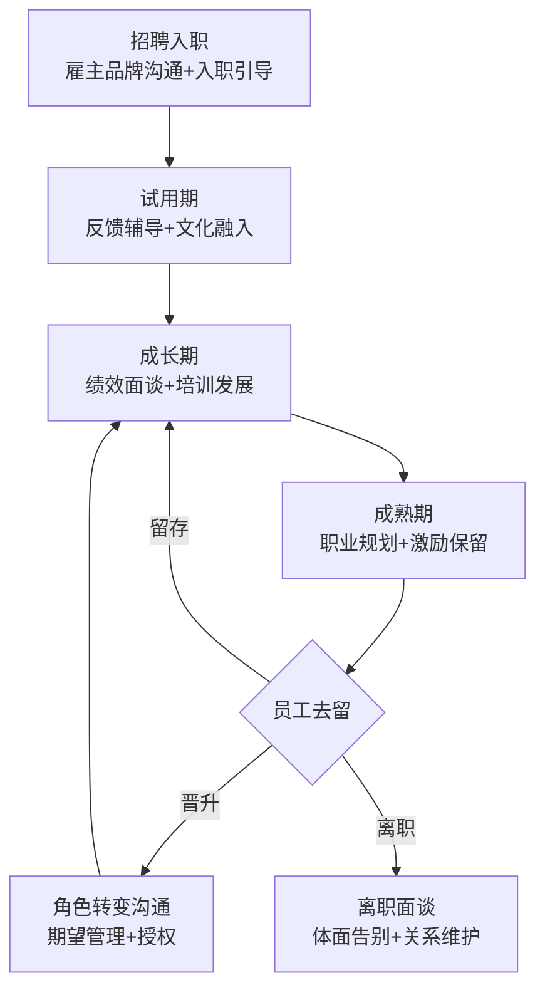

**每个节点的沟通重点：**

| 阶段 | 关键沟通事件 | HR的角色 | 常见陷阱 |
|------|------------|---------|---------|
| 招聘 | 岗位描述、面试反馈、Offer谈判 | 品牌大使+需求翻译 | 过度承诺导致入职后落差 |
| 试用期 | 定期Check-in、转正面谈 | 辅导者+观察者 | 放任不管等到最后一天才评估 |
| 成长 | 绩效面谈、PIP、培训需求 | 反馈者+赋能者 | 面谈走形式、PIP变成淘汰工具 |
| 成熟 | 职业规划、薪酬调整、晋升沟通 | 发展顾问+激励者 | 忽视核心人才的隐性不满 |
| 离职 | 离职面谈、工作交接、校友关系 | 体面收尾+关系维护 | 把离职当"背叛"、设置障碍 |

**情感密集型沟通：** HR处理的议题——绩效不佳、裁员、员工纠纷、职场骚扰——都是高度情感化的。HR需要在"共情"和"专业"之间找到平衡：对员工的处境表示理解，同时保持客观和合规。

**HR三支柱模型与沟通差异：**

现代HR组织通常采用三支柱模型，每个支柱的沟通风格截然不同：

| 支柱 | 角色定位 | 沟通对象 | 沟通风格 | 核心挑战 |
|------|---------|---------|---------|---------|
| HRBP（业务伙伴） | 嵌入业务的HR专家 | 业务负责人、团队 | 业务语言+HR专业 | 平衡业务诉求和HR制度 |
| COE（专家中心） | 政策和方案设计者 | HRBP、管理层 | 专业、研究导向 | 设计的方案要能落地 |
| SSC（共享服务中心） | 标准化服务提供者 | 全体员工 | 标准化、高效、友好 | 在效率和人性化间平衡 |

**HR的"保密悖论"：** HR是组织中掌握最多敏感信息的角色——薪酬数据、绩效评估、员工投诉、组织调整计划。但HR同时也是被要求"透明沟通"的角色。这个悖论要求HR具备极高的信息边界管理能力：什么信息必须保密（个人薪酬、未公布的裁员计划）、什么信息应该透明（公司政策、福利信息、发展方向）、什么信息需要有条件透明（绩效标准、晋升条件）。边界模糊是HR信任崩塌的最快路径。

**数字化时代的HR沟通变革：** 远程办公、混合工作模式的普及，对HR沟通提出了全新挑战。入职培训从面对面变成了视频会议，团队建设从线下聚餐变成了线上活动，绩效面谈从走进办公室变成了Zoom通话。数字化沟通缺少非语言线索，更容易产生误解。HR需要在数字环境中重新设计沟通触点——用更频繁的一对一Check-in替代偶遇式闲聊，用结构化的在线反馈替代走廊里的随意交流。

### 13.2 核心术语速查

| 术语 | 含义 | 沟通中的应用 |
|------|------|------------|
| HRBP | 人力资源业务伙伴 | "作为HRBP，我需要理解业务部门的实际需求" |
| OD（组织发展） | 组织能力建设 | "这次OD项目的目标是提升跨部门协作效率" |
| 人才盘点 | 系统评估组织人才 | "九宫格盘点结果显示，高潜人才占比15%" |
| 绩效改进计划（PIP） | 帮助员工提升绩效 | "我们制定PIP是为了帮助你，不是为了淘汰你" |
| EAP（员工援助计划） | 员工心理健康支持 | "公司提供EAP服务，有需要可以匿名预约" |
| 雇主品牌 | 公司作为雇主的吸引力 | "雇主品牌建设是招聘竞争力的基础" |
| 组织架构（Org Structure） | 公司的层级和职能划分 | "这次组织架构调整会影响3个部门的汇报关系" |
| 薪酬带宽（Pay Band） | 岗位薪酬的上下限范围 | "这个岗位在P50到P75之间，当前薪资已经接近带宽上限" |
| 继任计划（Succession Plan） | 关键岗位的后备人才规划 | "每个VP岗位至少要有2个Ready-Now的继任者" |
| 员工体验（EX） | 员工在公司的整体感受 | "从入职到离职的每个触点都是EX的一部分" |
| OKR/KPI | 目标管理工具 | "OKR强调方向和挑战，KPI强调量化和达成" |
| 360度评估 | 多维度的绩效评估 | "360评估收集上级、同事、下属和自我的反馈" |
| 校园招聘（校招） | 面向应届毕业生的招聘 | "校招的沟通重点是雇主品牌和成长机会" |
| 雇佣关系（ER） | 劳动关系管理 | "ER问题需要法务和HR共同处理" |

### 13.3 关键沟通场景深度解析

#### 场景一：绩效面谈的SBI模型

Situation（情境）：
  "在上个月的XX项目中..."

Behavior（行为）：
  "我注意到你在客户会议中三次没有提前准备数据..."

Impact（影响）：
  "这导致客户对我们的专业度产生了质疑，
   项目进度也因此延迟了一周。"

共同制定改进计划：
  "我们一起看看，怎么避免类似情况再次发生？
   我建议...你觉得呢？"

**关键原则：**
- 对事不对人——描述具体行为，不评价人格
- 给出改进路径——批评的目的是帮助成长，不是打击信心
- 倾听员工的解释——可能有你不知道的背景因素
- 记录沟通过程——绩效沟通需要书面记录

#### 场景二：裁员沟通的尊严框架

准备阶段：
  - 与法务确认合规性（补偿方案、通知期限）
  - 准备书面材料（解聘通知、补偿明细）
  - 选择私密、安静的沟通场所
  - 安排在周中（不要周五——员工无法及时咨询）

沟通流程：
  1. 直接但温和地告知决定（不要铺垫太久）
     "今天请你来，是要告诉你一个困难的决定..."

  2. 说明原因（简洁、诚实、不推卸）
     "由于[业务调整/组织重组]，你的岗位..."

  3. 说明补偿方案（具体、清晰）
     "公司提供的方案是..."

  4. 给对方时间和空间消化
     "我理解这个消息很突然。你可以先看看材料，
      我们随时可以再谈。"

  5. 说明后续支持
     "我们会提供[职业介绍/推荐信/过渡期支持]..."

#### 场景三：员工纠纷调解

**调解沟通的"中立倾听"框架：**

第一步：分别倾听
  单独与双方沟通，让每个人完整表达
  不预设立场，不做评判

第二步：确认事实
  "我听了双方的说法，事实部分是...
   有分歧的部分是..."

第三步：聚焦共同利益
  "你们都希望[共同目标]，分歧在于[具体问题]"

第四步：探索解决方案
  "有哪些方案可以同时满足双方的核心诉求？"

第五步：达成协议
  书面记录达成的共识
  明确后续跟进机制

### 13.4 常见误区与纠正

**误区一：只当"传声筒"**
- ❌ 员工说什么就转达给老板，老板说什么就转达给员工
- ✅ 理解双方的深层诉求，用专业能力找到平衡点
- 🔍 HR的价值在于"翻译"和"调和"，不是简单的信息传递

**误区二：用制度代替沟通**
- ❌ "公司规定就是这样"——不解释为什么，不考虑特殊情况
- ✅ 制度是底线，但执行中需要人性化。解释制度背后的原因
- 🔍 员工抗拒的往往不是制度本身，而是"不被尊重"的感觉

**误区三：回避困难对话**
- ❌ 绩效面谈只说好的，问题一笔带过
- ✅ 困难对话是HR的核心职责。用专业的方式传递困难信息
- 🔍 回避问题不会让问题消失，只会让问题恶化

**误区四：过度依赖制度和流程**
- ❌ 遇到任何问题都先翻员工手册，"制度里没有这个规定，我没法处理"
- ✅ 制度是框架，不是答案。在制度框架内，用专业判断找到人性化解决方案
- 🔍 员工来找HR时，往往已经想过了制度层面的解决方案，他们需要的是理解和帮助

**误区五：忽视"沉默的大多数"**
- ❌ 只关注提出诉求的员工和出了问题的员工，忽视默默工作的大多数
- ✅ 定期主动沟通，通过敬业度调查、Coffee Chat、Skip Level Meeting等方式了解"沉默者"的真实状态
- 🔍 最危险的员工不满是那种"不吵不闹、默默更新简历"的不满——等你发现时已经来不及了

### 13.5 能力进阶路径

| 层级 | 角色 | 核心沟通能力 |
|------|------|------------|
| L1 HR专员 | 执行 | 能处理日常人事事务、执行招聘流程 |
| L2 HR主管 | 专业 | 能独立处理员工关系、设计培训方案 |
| L3 HRBP/HRD | 战略伙伴 | 能理解业务需求、推动组织变革 |
| L4 CHRO | 战略领导 | 能制定人力战略、管理企业文化 |

**📌 一页纸速查：人力资源行业**

| 维度 | 要点 |
|------|------|
| 沟通风格 | 平衡、敏感、人性化、合规导向 |
| 正式程度 | 高——绩效、裁员、纠纷沟通需要正式记录 |
| 决策方式 | 制度+人情+合规+业务需求的平衡 |
| 核心禁忌 | 不泄露员工隐私；不偏袒任何一方；不回避困难对话 |
| 必备技能 | 绩效面谈、裁员沟通、纠纷调解、变革管理 |
| 进阶方向 | HR专员→主管→HRBP/HRD→CHRO |

---

## 十四、跨行业沟通策略

当你需要与不同行业的人沟通时，最大的挑战不是语言差异，而是**思维模式和价值判断标准的差异**。

### 14.1 行业语言转换的三步法

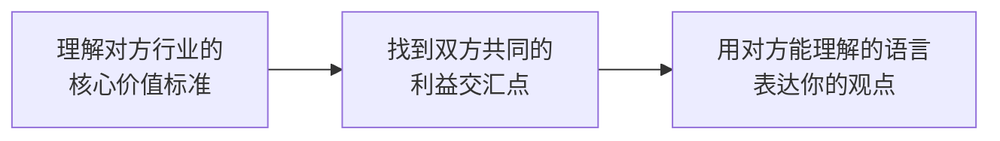

**第一步：理解对方的核心价值标准**

| 行业 | 最关心什么 | 最害怕什么 |
|------|-----------|-----------|
| IT | 效率、可扩展性、技术可行性 | 技术债、安全事故、需求变更 |
| 金融 | 收益、风险、合规 | 亏损、监管处罚、信息泄露 |
| 医疗 | 患者安全、治疗效果 | 医疗事故、医患纠纷 |
| 法律 | 证据、逻辑、合规 | 败诉、违规、保密泄露 |
| 销售 | 成交、客户满意度 | 丢单、客户流失、指标未达成 |
| 创业 | 增长、融资、生存 | 现金流断裂、团队分裂 |
| 政府 | 合规、稳定、公众满意 | 舆情、违规、安全事故 |

**第二步：找到利益交汇点**

举例——技术部门需要向财务部门申请服务器升级预算：
- ❌ 技术视角："当前架构的并发承载量已达上限，需要做微服务改造"
- ✅ 共同利益："系统响应每慢1秒，用户转化率下降7%。按照当前GMV计算，服务器升级的ROI在3个月内回正"

**第三步：用对方的语言表达**

| 你想说的 | 对IT说 | 对财务说 | 对CEO说 |
|---------|--------|---------|---------|
| "需要做系统重构" | "需要将单体架构拆分为微服务" | "需要投入X万进行系统升级，预计Y个月回本" | "这个改造能让我们的系统支撑3倍的业务增长" |
| "这个功能有技术风险" | "这个方案在分布式事务处理上有CAP限制" | "这个功能的开发成本可能比预估高30%" | "如果要做这个功能，时间线需要延长2周" |

### 14.2 跨行业协作的沟通框架

**当IT遇到金融——科技金融场景：**
- IT关注：技术可行性、系统稳定性、数据安全
- 金融关注：监管合规、风险控制、客户隐私
- 协作要点：用合规要求驱动技术方案，而非反过来

**当医疗遇到IT——数字医疗场景：**
- 医疗关注：患者安全、数据隐私、临床验证
- IT关注：用户体验、迭代速度、系统性能
- 协作要点：尊重医疗领域的"不犯错"文化，敏捷迭代要在安全边界内

**当销售遇到产品——需求冲突场景：**
- 销售关注：客户要什么、竞品有什么、能不能成交
- 产品关注：产品方向、技术可行性、资源分配
- 协作要点：建立需求优先级评估机制，避免"谁嗓门大谁说了算"

### 14.3 跨行业协作的典型场景与应对

**场景一：当制造遇到IT——智能制造项目**

制造业的"不犯错"文化与IT的"快速迭代"文化在智能制造项目中经常碰撞。工厂不能停线来"试错"，IT系统不能花三年才上线。

- 制造方关注：生产不能中断、质量不能下降、安全不能妥协
- IT方关注：需求快速变化、技术架构灵活、用户体验优先
- **协作策略：** 用"沙盒环境"隔离风险——IT在测试环境快速迭代，制造在验证环境逐步确认，双方在"试产窗口期"集中联调。沟通频率：IT侧每日站会，制造侧每周协调会，双方每两周联合评审

**场景二：当学术遇到商业——产学研合作**

学术追求"严谨和创新"，商业追求"效率和利润"。学术需要3年出一篇论文，商业需要3个月出一个产品。

- 学术方关注：研究方法严谨、发表高质量论文、保持学术独立性
- 商业方关注：技术可落地、时间线可控、知识产权归属清晰
- **协作策略：** 在项目启动时明确"三个边界"——知识产权归属、发表时间窗口、保密范围。用"里程碑对齐"代替"日常嵌入"——每季度一次深度技术交流，避免频繁会议消耗研究时间

**场景三：当政府遇到企业——政企合作项目**

政府追求"合规和稳定"，企业追求"效率和创新"。政府的审批流程可能需要6个月，企业的市场窗口可能只有3个月。

- 政府方关注：程序合规、风险可控、公众满意、不出事
- 企业方关注：审批速度、政策确定性、执行灵活性
- **协作策略：** 提前做"政策预沟通"——在正式提交前，通过非正式渠道了解审批部门的关注点，提前准备材料。用"试点先行"降低双方风险——先在小范围试点，用数据说话，再扩大推广

### 14.3.5 跨行业沟通冲突解决框架

当跨行业协作中出现冲突时，问题往往不是"谁对谁错"，而是"双方的底层逻辑不同"。以下是系统化的冲突解决框架：

**冲突根因诊断表：**

| 冲突表现 | 可能的根因 | 解决方向 |
|---------|-----------|---------|
| "你们太慢了" vs "你们太草率了" | 节奏差异：一方追求速度，一方追求稳健 | 对齐风险容忍度，协商"合理速度" |
| "这个不重要" vs "这个很重要" | 优先级差异：价值判断标准不同 | 用共同目标重新定义优先级 |
| "你们不懂技术" vs "你们不懂业务" | 语言壁垒：专业术语造成的理解鸿沟 | 引入"翻译者"角色，建立共同词汇表 |
| "我们的流程是这样的" vs "那太官僚了" | 文化差异：规范化程度不同 | 尊重各自流程，在交叉点建立共识 |
| "出了问题谁负责" | 责任边界模糊 | 用RACI矩阵明确责任分配 |

**冲突解决五步法：**

第一步：暂停立场，回归利益
  ❌ "我坚持用微服务架构"（立场）
  ✅ "我需要系统能独立扩展和部署"（利益）
  → 立场是表象，利益是本质。找到双方真正的利益诉求

第二步：建立共同目标
  "我们都有一个共同目标：让这个项目在Q3成功上线。
   在这个目标下，我们来讨论具体方案。"
  → 共同目标是解决冲突的锚点

第三步：用数据代替观点
  ❌ "我觉得这个方案风险很大"（观点）
  ✅ "这个方案有3个技术风险点，其中2个有成熟解决方案，
      1个需要额外2周验证"（数据）
  → 数据让争论从"谁更有理"变成"事实是什么"

第四步：探索第三方案
  不要在A方案和B方案之间二选一，而是找到融合两者优势的C方案
  "如果我们先用你们的快速方案上MVP，同时并行准备我们的稳健方案，
   3个月后评估是否切换，这样可以吗？"

第五步：书面确认共识
  "根据我们今天的讨论，确认以下共识：
   ①... ②... ③...
   请各位确认是否有遗漏或误解。"
  → 口头共识在跨行业协作中几乎等于没有共识

**实战案例：互联网公司与传统银行合作开发移动支付**

这是一个典型的IT×金融跨行业冲突案例：

| 阶段 | IT方视角 | 金融方视角 | 冲突点 | 解决方案 |
|------|---------|-----------|-------|---------|
| 需求阶段 | "先上线再迭代" | "需求必须在开发前100%确认" | 敏捷vs瀑布 | 采用"大瀑布+小敏捷"：整体按瀑布里程碑管控，每个里程碑内部用敏捷迭代 |
| 开发阶段 | "用开源框架快速搭建" | "所有第三方组件必须通过安全审计" | 速度vs安全 | 建立"安全审计绿色通道"：常用开源组件预先审计，新组件48小时内完成审计 |
| 测试阶段 | "灰度发布，线上发现问题再修" | "必须通过UAT、压力测试、安全渗透测试才能上线" | 迭代vs严谨 | 分层测试：核心交易链路按金融标准全量测试，非核心功能允许灰度发布 |
| 运营阶段 | "用户反馈驱动功能迭代" | "任何变更都需要合规审批" | 灵活vs合规 | 建立"变更分级制度"：UI优化快速审批（1天），业务逻辑变更标准审批（1周），涉及资金流的变更严格审批（2周） |

这个案例的核心启示：**跨行业冲突的解法不是让一方迁就另一方，而是创造新的协作机制，同时满足双方的核心诉求。**

### 14.4 跨行业沟通的常见陷阱

**陷阱一：用自己行业的标准评判他人**
- ❌ "你们金融行业怎么这么慢，一个需求要审批一个月"
- ✅ "理解合规审批需要时间，我们提前把材料准备好，争取缩短流程"

**陷阱二：忽视行业的隐性规则**
- 每个行业都有"不成文的规矩"——医疗行业的等级文化、金融行业的保密文化、法律行业的对抗文化。不了解这些隐性规则，再好的沟通技巧也可能踩雷

**陷阱三：强推自己行业的最佳实践**
- ❌ "在互联网公司我们都是这样做的"（对银行IT团队说）
- ✅ "我们之前的经验是XX，考虑到贵行的合规要求，可能需要做YY调整"

**陷阱四：低估行业知识壁垒**
- 以为"沟通技巧可以弥补行业知识的不足"。不行——你可以不懂技术细节，但必须理解行业的核心逻辑和价值标准

**陷阱五：忽视节奏差异**
- 不同行业的决策节奏差异巨大。IT行业可能一周内完成从评估到上线，金融行业一个投资决策可能需要经过三级审批耗时一个月。用自己行业的节奏去要求对方，只会制造摩擦
- **应对：** 在项目启动时就明确各方的决策流程和时间节点，建立"里程碑对齐"机制而非"日常同步"机制

### 14.5 跨行业沟通的实用工具箱

**工具一：行业沟通画像卡（沟通前必填）**

┌─────────────────────────────────────────────┐
│ 行业沟通画像卡                                │
├─────────────────────────────────────────────┤
│ 对方行业：___________                        │
│ 对方角色：___________                        │
│ 对方最关心的3件事：                           │
│   ① ___________                             │
│   ② ___________                             │
│   ③ ___________                             │
│ 对方最害怕的3件事：                           │
│   ① ___________                             │
│   ② ___________                             │
│   ③ ___________                             │
│ 对方的决策流程：___________                   │
│ 对方的沟通偏好（正式/非正式/数据/故事）：____  │
│ 我需要从对方获得什么：___________             │
│ 我能为对方提供什么价值：___________           │
│ 可能的冲突点及应对策略：___________           │
└─────────────────────────────────────────────┘

**工具二：跨行业邮件/消息模板**

主题：[项目名] [具体事项] — 需要您支持/确认

[称呼]您好，

背景（1-2句说明为什么联系对方）：
[用对方行业的语言描述背景]

具体事项（清晰列出需要对方做什么）：
1. [事项1]：需要[具体动作]，截止时间[日期]
2. [事项2]：需要[具体动作]，截止时间[日期]

对对方的价值（为什么要帮你的忙）：
[从对方的角度说明这件事对TA的好处]

下一步：
[明确下一步行动和时间节点]

[签名]

**工具三：跨行业会议议程模板**

会议目标（用一句话说清）：___________

参与方及各自关注点：
  [行业A代表]：关注___________
  [行业B代表]：关注___________

议程：
  1. 各方现状同步（10分钟）—— 每方用2分钟说清进展
  2. 核心议题讨论（30分钟）—— 聚焦1-2个关键问题
  3. 行动计划确认（10分钟）—— 明确下一步+责任人+时间
  4. 开放讨论（10分钟）—— 处理未尽事项

会后输出：
  □ 会议纪要（24小时内发出）
  □ 行动项跟踪表
  □ 下次会议时间

### 14.6 跨行业沟通能力提升路径

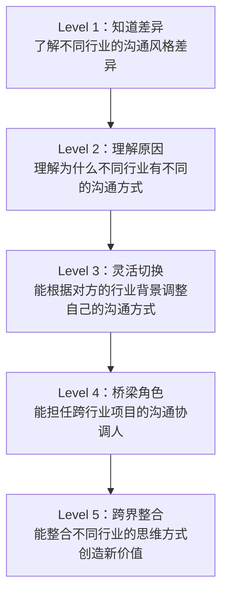

---

## 十五、行业沟通能力对比分析

### 15.1 十三大行业沟通风格雷达图

| 维度 | IT | 金融 | 医疗 | 教育 | 销售 | 媒体 | 法律 | 政府 | 创业 | 学术 | 咨询 | 制造 | HR |
|------|:---:|:----:|:----:|:----:|:----:|:----:|:----:|:----:|:----:|:----:|:----:|:----:|:----:|
| 正式程度 | ★★ | ★★★★★ | ★★★★ | ★★★ | ★★★ | ★★★ | ★★★★★ | ★★★★★ | ★★ | ★★★★ | ★★★★ | ★★★★ | ★★★★ |
| 术语密度 | ★★★★ | ★★★★★ | ★★★★★ | ★★★ | ★★★ | ★★★ | ★★★★★ | ★★★★ | ★★★ | ★★★★★ | ★★★★ | ★★★★ | ★★★ |
| 情感表达 | ★ | ★★ | ★★★★ | ★★★★ | ★★★★ | ★★★ | ★★ | ★ | ★★★★★ | ★★ | ★★ | ★★ | ★★★★★ |
| 层级敏感度 | ★★ | ★★★★ | ★★★★ | ★★★ | ★★★ | ★★ | ★★★★ | ★★★★★ | ★ | ★★★★ | ★★★ | ★★★★★ | ★★★★ |
| 时效压力 | ★★★★ | ★★★★ | ★★★★★ | ★★ | ★★★ | ★★★★★ | ★★★ | ★★★ | ★★★★★ | ★★ | ★★★★ | ★★★★★ | ★★★ |
| 书面要求 | ★★★★ | ★★★★★ | ★★★★★ | ★★★ | ★★ | ★★★★ | ★★★★★ | ★★★★★ | ★★ | ★★★★★ | ★★★★★ | ★★★★★ | ★★★★ |
| 创新空间 | ★★★★★ | ★★★ | ★★ | ★★★ | ★★★★ | ★★★★★ | ★★ | ★ | ★★★★★ | ★★★★★ | ★★★ | ★★★ | ★★★ |
| 决策风格 | 技术论证+快速试错 | 数据模型+委员会审议 | 循证+临床经验+患者意愿 | 证据+教育理论+学生需求 | 客户需求+竞争分析+价值证明 | 新闻价值+伦理判断 | 法律条文+判例+商业权衡 | 政策依据+民主集中+程序合规 | 数据+直觉+快速迭代 | 证据+逻辑+同行评审 | 数据+框架+客户共识 | 数据+标准+现场验证 | 制度+人情+合规平衡 |

### 15.2 核心能力对照表

| 行业 | 最重要的沟通能力 | 最容易犯的错误 | 最有效的提升方式 |
|------|----------------|--------------|----------------|
| IT | 技术翻译（技术↔业务） | 术语壁垒 | 写技术博客、做跨部门项目 |
| 金融 | 数据叙事（数据→故事） | 只报数据不讲故事 | 练习一页纸报告、客户路演 |
| 医疗 | 同理心+精确性 | 用术语代替沟通 | SPIKES训练、标准化沟通工具 |
| 教育 | 启发式提问 | 单向灌输 | 课堂观察、教学反思日志 |
| 销售 | 需求洞察（SPIN） | 上来就推销 | 大量实战、录音复盘 |
| 媒体 | 快速叙事 | 速度牺牲准确 | 采访训练、编辑指导 |
| 法律 | 精确表达+逻辑论证 | 用术语碾压客户 | 模拟法庭、合同起草练习 |
| 政府 | 规范公文+公众表达 | 假大空 | 公文写作训练、新闻发布模拟 |
| 创业 | 路演叙事（30秒说清） | 空谈愿景 | 路演练习、投资人反馈 |
| 学术 | 结构化写作+答辩应对 | 论文缺乏故事线 | 大量阅读优秀论文、参加学术会议 |
| 咨询 | 金字塔汇报+客户引导 | 框架套用无洞察 | 案例练习、客户访谈实战 |
| 制造 | 现场沟通+问题报告 | 脱离现场做判断 | 现场走动（Gemba）、跨部门轮岗 |
| HR | 绩效面谈+裁员沟通 | 只当传声筒 | 角色扮演、困难对话训练 |

---

## 十六、AI与数字化转型时代的行业沟通变革

2023年以来，生成式AI的爆发式发展正在重塑每一个行业的沟通方式。理解这场变革不是"锦上添花"，而是行业沟通能力的"必修课"。

### 16.1 AI对各行业沟通的冲击

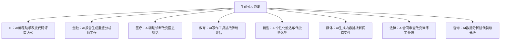

**各行业AI沟通变革详解：**

| 行业 | AI带来的沟通变革 | 需要的新能力 | 潜在风险 |
|------|----------------|------------|---------|
| IT | AI辅助编码（Copilot）改变Code Review重心，从"语法正确"转向"架构合理"；AI生成的代码需要新的审查话术 | Prompt Engineering、AI输出验证、AI伦理讨论 | 过度依赖AI导致技术退化；AI生成代码的安全隐患被忽视 |
| 金融 | AI生成研究报告的效率提升10倍，但"AI幻觉"可能导致错误投资建议；算法交易的沟通需要新的解释框架 | AI模型的可解释性沟通、算法伦理、数据偏见识别 | AI报告中的事实错误引发合规风险；客户对"机器人理财"的信任危机 |
| 医疗 | AI辅助诊断改变"医生→患者"的信息不对称——患者可能带着AI诊断结果来看病，医患沟通的权力结构正在改变 | AI辅助决策的沟通策略、患者AI素养教育、AI诊断的局限性说明 | 患者过度信任AI诊断导致依从性问题；AI误诊的责任归属争议 |
| 教育 | ChatGPT等工具让"作业作弊"变得普遍，教师需要重新定义"原创性"和"学习过程"的评估方式 | AI时代的评估设计、AI素养教育、人机协作能力培养 | 学生批判性思维退化；学术诚信标准需要重建 |
| 销售 | AI驱动的个性化销售触达（邮件、消息）让客户能轻易识别"模板化"沟通，人情味成为稀缺竞争力 | AI工具的高效使用+人类温度的平衡、数据驱动的客户洞察 | 客户对AI生成内容的免疫；销售人格的同质化 |
| 媒体 | AI生成新闻、AI主播、AI图片——"眼见不再为实"，媒体公信力面临前所未有的挑战 | AI内容识别与标注、深度核查能力、AI伦理报道 | 虚假信息泛滥；新闻从业者的角色危机 |
| 法律 | AI合同审查、AI法律检索正在替代初级律师的部分工作，律师的核心价值需要重新定义 | AI工具的有效使用、AI辅助决策的法律伦理、AI证据的采信标准 | AI法律建议的准确性问题；AI生成法律文书的责任归属 |
| 咨询 | AI能在几分钟内完成过去需要一周的数据分析，咨询顾问的核心价值从"分析"转向"洞察"和"推动落地" | AI时代的洞察力、变革推动力、客户关系深度管理 | 初级咨询顾问的培养路径被颠覆；AI分析的"黑箱"问题 |

### 16.2 远程与混合办公的沟通新常态

后疫情时代，远程和混合办公已从"临时方案"变成"常态选择"。这种工作模式对行业沟通产生了深远影响：

**异步沟通能力成为硬性要求：**

异步沟通的黄金法则：
  1. 一次性说清楚——减少来回确认的次数
  2. 提供完整上下文——假设对方不知道你之前在做什么
  3. 明确期望——需要对方做什么、什么时候做
  4. 选择合适的媒介——复杂问题用文档，简单确认用消息，敏感话题用视频
  5. 记录一切——口头讨论的结论必须书面化

**不同行业对远程沟通的适应度差异巨大：**

| 适应度 | 行业 | 原因 | 核心挑战 |
|--------|------|------|---------|
| 高 | IT、媒体、咨询 | 工作本质是信息处理，天然适合远程 | 团队凝聚力、创意碰撞效率 |
| 中 | 金融、教育、销售、HR、创业 | 部分工作可远程，部分必须面对面 | 客户关系维护、敏感话题沟通 |
| 低 | 医疗、制造、政府、法律 | 大量工作依赖现场、实物或法定程序 | 如何在必须到场的场景中融入数字化工具 |

### 16.3 跨代际沟通的新挑战

当前职场同时存在四代人（Baby Boomer、Gen X、Millennial、Gen Z），每一代的沟通偏好差异显著：

| 代际 | 偏好媒介 | 沟通风格 | 对AI工具的态度 | 职场期望 |
|------|---------|---------|--------------|---------|
| Baby Boomer (1946-1964) | 面对面、电话 | 正式、层级分明 | 谨慎、需要证明价值 | 忠诚度、稳定性 |
| Gen X (1965-1980) | 邮件、电话 | 直接、务实 | 实用主义、择优使用 | 独立性、结果导向 |
| Millennial (1981-1996) | 即时通讯、视频 | 协作、反馈驱动 | 积极拥抱、提高效率 | 意义感、成长机会 |
| Gen Z (1997-2012) | 短视频、即时通讯 | 简洁、视觉化 | 原生使用者、高度依赖 | 灵活性、心理健康 |

**跨代际沟通的实践建议：**
- **向上沟通**（对前辈）：正式一些、数据充分、尊重层级、预留决策时间
- **向下沟通**（对后辈）：简洁直接、说明"为什么"、给予自主空间、重视即时反馈
- **平行沟通**（同代际）：明确媒介偏好、建立沟通协议、定期校准期望

---

## 十七、行业沟通能力自评体系

### 17.1 自评量表

对以下每个维度打分（1-5分），计算你在目标行业的沟通能力总分：

行业沟通能力自评量表（满分100分）

一、知识层（20分）
  1. 我能准确使用该行业的20个以上核心术语        ___/5
  2. 我理解该行业的组织架构和权力结构              ___/5
  3. 我了解该行业的监管要求和合规约束              ___/5
  4. 我知道该行业的"不成文规矩"和隐性规则        ___/5

二、技能层（30分）
  5. 我能根据听众调整语言层次（技术↔通俗）       ___/5
  6. 我能用该行业的标准格式撰写专业文档            ___/5
  7. 我能在该行业的关键场景中有效沟通              ___/5
  8. 我能处理该行业的高压沟通场景                  ___/5
  9. 我能跨部门/跨行业进行有效协调                 ___/5
  10. 我能在该行业的谈判中达成双赢                 ___/5

三、思维层（30分）
  11. 我理解该行业的核心价值标准和决策逻辑         ___/5
  12. 我能从该行业的视角看待问题                   ___/5
  13. 我能预判该行业沟通中的常见冲突               ___/5
  14. 我能在该行业的沟通中平衡多方利益             ___/5
  15. 我能识别并适应该行业的沟通文化变化           ___/5
  16. 我能将该行业的专业知识转化为行动建议         ___/5

四、关系层（20分）
  17. 我在该行业建立了可信的专业形象               ___/5
  18. 我能与不同层级的人建立有效关系               ___/5
  19. 我能在困难对话中维护关系                     ___/5
  20. 我能在该行业中持续扩展人脉                   ___/5

总分：___/100

**评分解读：**

| 分数段 | 水平 | 含义 | 建议 |
|--------|------|------|------|
| 80-100 | 精通 | 你能自如地在该行业进行各层级、各场景的沟通 | 可以担任跨行业沟通的桥梁角色 |
| 60-79 | 胜任 | 你能在大多数场景中有效沟通，偶尔需要指导 | 重点提升薄弱维度，增加实战经验 |
| 40-59 | 入门 | 你了解基本框架，但在复杂场景中仍有困难 | 系统学习本行业章节，找导师指导 |
| 20-39 | 新手 | 你需要大量学习和实践 | 从速查表开始，逐步深入每个场景 |
| 0-19 | 陌生 | 你对该行业的沟通方式几乎不了解 | 从行业画像开始，建立基础认知 |

### 17.2 能力提升的"刻意练习"框架

每周行业沟通刻意练习计划：

周一：术语日
  - 学习3个新术语，用"费曼技巧"向非行业人士解释
  - 记录：术语 | 含义 | 通俗解释 | 使用场景

周三：场景日
  - 选择一个关键场景，用文中的框架准备沟通脚本
  - 如果有条件，与同事进行角色扮演

周五：复盘日
  - 回顾本周的3次重要沟通
  - 记录：什么做得好 | 什么可以改进 | 下周刻意练习什么

---

## 跨行业沟通的通用原则

无论身处哪个行业，以下沟通原则都是通用的。但请注意，这些原则在不同行业中的表现形式和权重不同。

### 原则一：以对方为中心

有效沟通的起点不是"我想说什么"，而是"对方需要听什么"。在沟通前问自己三个问题：
1. 对方关心什么？（价值标准）
2. 对方的理解水平如何？（知识背景）
3. 对方的沟通偏好是什么？（直接/委婉、数据/故事、书面/口头）

**深层含义：** 以对方为中心不是"讨好"，而是"尊重"。当你用对方能理解的语言、对方关心的视角来表达时，你传递的信息量是最大的，沟通阻力是最小的。这在跨行业沟通中尤为重要——你不能指望金融行业的人用IT的思维方式理解你的方案。

### 原则二：清晰简洁

如果一段话不能用一句话概括，说明你还没有完全理解它。但"简洁"不等于"简单"——用最少的词传递最完整的信息，才是真正的简洁。不同行业对"简洁"的定义不同：IT行业的简洁是"先说结论"，法律行业的简洁是"每句话都有证据支撑"。

**练习方法：** "电梯测试"——每次汇报前，强迫自己用30秒说清核心观点。如果做不到，说明你的思路还不够清晰。然后用1分钟补充关键论据。再用3分钟展开完整论述。这种"金字塔式"的信息组织方式适用于几乎所有行业。

### 原则三：倾听先于表达

研究表明，高效能人士的沟通时间分配是：倾听占45%、阅读占16%、说话占30%、写作占9%。倾听不是被动地"等对方说完"，而是主动地理解对方的意图、情感和未说出口的需求。

**深度倾听的三个层次：**
- **第一层：事实倾听** — 听清楚对方说了什么（数据、事件、结论）
- **第二层：情感倾听** — 感受对方的情绪状态（焦虑、兴奋、犹豫）
- **第三层：意图倾听** — 理解对方真正想要什么（可能和说出来的不同）

大多数沟通问题出在"只听了第一层就开始回应"。

### 原则四：非语言信号不可忽视

沟通中55%的信息通过肢体语言传递，38%通过语调传递，只有7%通过语言内容传递（梅拉比安法则）。注意你的眼神、姿态、语调和表情——它们传递的信息远比你想象的多。在不同文化背景下，非语言信号的含义可能完全不同。

**远程沟通中的非语言挑战：** 视频会议中，你只能看到对方的上半身，很多肢体语言线索被截断。应对策略：更注意语调变化、更频繁地确认理解（"我刚才说清楚了吗？"）、善用表情符号和反应功能传递情感信号。

### 原则五：持续学习与反思

沟通是一项可以通过刻意练习不断提升的技能。建议建立个人的"沟通复盘"习惯：
- 每次重要沟通后花5分钟回顾：什么做得好？什么可以改进？
- 每月回看一次沟通复盘记录，寻找模式和进步
- 每季度向信任的同事寻求沟通反馈
- 每年评估一次自己在本行业沟通能力上的进步

**复盘的"STAR"框架：**
- **S (Situation)**：当时是什么场景？
- **T (Task)**：沟通的目标是什么？
- **A (Action)**：我做了什么？说了什么？
- **R (Result)**：效果如何？如果重来我会怎么做？

---

## 附录总结：行业沟通能力全景图

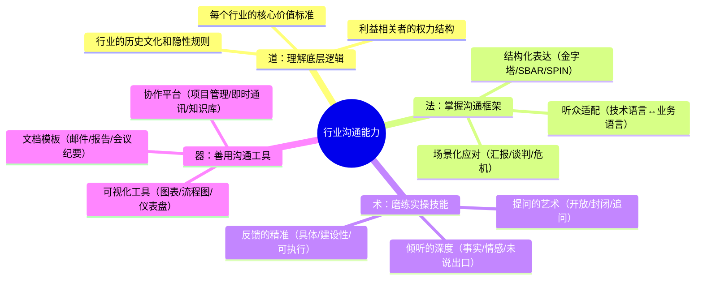

### 行动指南：如何在30天内提升行业沟通能力

| 阶段 | 时间 | 行动 | 具体任务 | 预期成果 |
|------|------|------|---------|---------|
| 认知期 | 第1周 | 系统阅读 | 阅读本附录中你所在行业的章节；完成自评量表；标注3个最薄弱的维度 | 建立行业沟通的系统认知，明确改进方向 |
| 框架期 | 第2周 | 场景准备 | 选择2-3个关键场景，用文中的框架准备沟通脚本；找一个同事做角色扮演 | 掌握核心场景的沟通结构和话术 |
| 实践期 | 第3周 | 刻意练习 | 在实际工作中使用框架；每次重要沟通后用STAR框架复盘；每天记录一个沟通"顿悟" | 将框架内化为习惯，建立复盘意识 |
| 反馈期 | 第4周 | 外部校准 | 向3位信任的同事/导师寻求沟通反馈；对比自评和他评的差异；制定下一个月的改进计划 | 获得外部视角，识别盲点，形成持续改进闭环 |

**30天后的持续提升路径：**
- **月度**：选择一个新的行业章节阅读，扩展跨行业沟通视野
- **季度**：完成一次完整的"刻意练习"循环（选场景→准备→实践→复盘）
- **半年**：主动承担一次跨行业/跨部门的沟通协调角色
- **年度**：重新做一次自评量表，对比进步，调整提升方向

### 跨行业者的快速适应清单

当你进入一个新行业时，按以下顺序快速建立沟通能力：

1. **第1天：找到行业"翻译官"** — 找一个既懂行业又愿意教你的人，TA能告诉你哪些话不能说、哪些事不能做
2. **第1周：掌握50个核心术语** — 不需要全部理解，先知道它们的存在和大致含义，遇到时不会一脸茫然
3. **第1个月：参加3次关键会议** — 观察行业老手的沟通方式，记录他们的表达习惯、提问方式和决策逻辑
4. **第1个季度：完成1次完整项目** — 通过实际项目经历行业的完整沟通流程，从启动到交付
5. **持续：建立行业人脉** — 加入行业协会、参加行业活动、阅读行业媒体，让自己浸泡在行业的信息生态中

### 行业沟通能力自评工具

用以下框架评估你在当前行业的沟通能力水平，找出最需要提升的维度：

请对以下每个维度打分（1-5分，1=完全不行，5=非常出色）：

知识层：
  □ 我能准确使用本行业的50个核心术语                    ___分
  □ 我理解行业的底层逻辑和价值判断标准                    ___分
  □ 我知道行业的隐性规则（不成文的规矩）                  ___分

技能层：
  □ 我能在30秒内说清本行业的一个核心概念                  ___分
  □ 我能用非行业人士听得懂的语言解释专业问题               ___分
  □ 我能在正式汇报中做到结论先行、逻辑清晰                ___分
  □ 我能在高压场景（危机/冲突/质疑）中保持专业冷静         ___分

关系层：
  □ 我能在行业内建立有效的专业人脉                       ___分
  □ 我能与不同层级的人进行有效沟通                        ___分
  □ 我能在跨行业协作中找到共同语言                        ___分

反思层：
  □ 我有定期复盘沟通效果的习惯                           ___分
  □ 我能主动寻求反馈并据此改进                           ___分
  □ 我能从失败的沟通中提取有价值的教训                    ___分

总分：___/65分

52-65分：行业沟通专家，可以指导他人
39-51分：胜任水平，重点提升薄弱维度
26-38分：成长阶段，需要系统性提升
13-25分：入门阶段，建议从核心术语和关键场景开始

### 不同阶段的提升策略

| 当前水平 | 核心瓶颈 | 推荐行动 | 时间投入 |
|---------|---------|---------|---------|
| 入门（13-25分） | 术语不懂，场景不熟 | 阅读本行业章节+速查表，背诵50个核心术语，旁听3次关键会议 | 每天30分钟，持续1个月 |
| 成长（26-38分） | 知道但做不到 | 在实际工作中刻意练习2-3个关键场景，每次沟通后5分钟复盘 | 每周3次刻意练习，持续3个月 |
| 胜任（39-51分） | 做到了但不够精 | 向行业高手请教，参加跨行业项目，建立个人沟通风格 | 每月1次深度复盘，持续6个月 |
| 专家（52-65分） | 精通但想突破 | 培训他人（教是最好的学），输出行业洞察，成为"桥梁角色" | 持续精进，输出倒逼输入 |

---

> **结语：** 每个行业都有其独特的沟通文化、术语体系和行为规范，但沟通的本质是相通的——建立理解、传递信息、形成共识、推动行动。掌握行业沟通能力的关键不是背诵术语，而是理解行业的底层逻辑和价值标准。
>
> 本附录涵盖了十三个主要行业的沟通指南，但世界远不止这十三个行业。无论你身处哪个行业，都可以用本附录的分析框架——**沟通风格画像、核心术语速查、关键场景解析、常见误区纠正、能力进阶路径**——来快速建立对该行业沟通方式的理解。
>
> 最后记住：**行业沟通能力的提升是一个渐进的过程，不是一蹴而就的。** 从今天开始，选择本附录中一个对你最有价值的行业章节，深入阅读，刻意练习。30天后，你会发现自己的行业沟通能力有质的飞跃。
>
> **三个立即可执行的行动：**
> 1. 找到你所在行业的"一页纸速查表"，打印出来贴在工位上，每天看一遍直到内化
> 2. 选择你最常遇到的1个关键场景，用文中的框架准备下一次沟通，结束后花5分钟复盘
> 3. 找一个跨行业的同事或朋友，用"三步法"练习一次跨行业沟通，体会语言转换的过程
>
> 在AI时代，**沟通能力是你最不可替代的竞争力**——AI可以写代码、分析数据、生成报告，但它无法替代你理解对方的深层需求、在高压场景中保持冷静、在利益冲突中找到平衡。投资你的行业沟通能力，就是投资你职业生涯的护城河。
