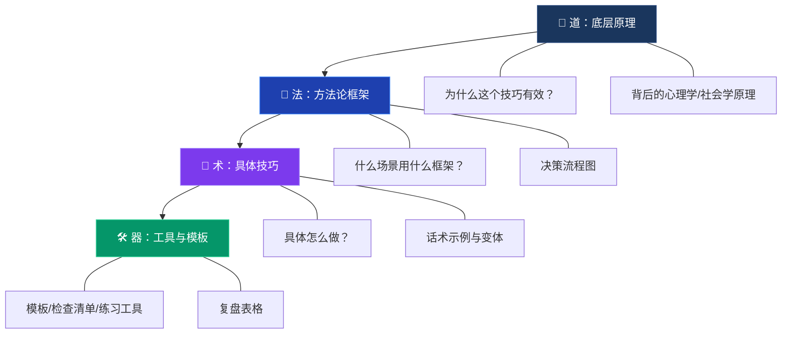
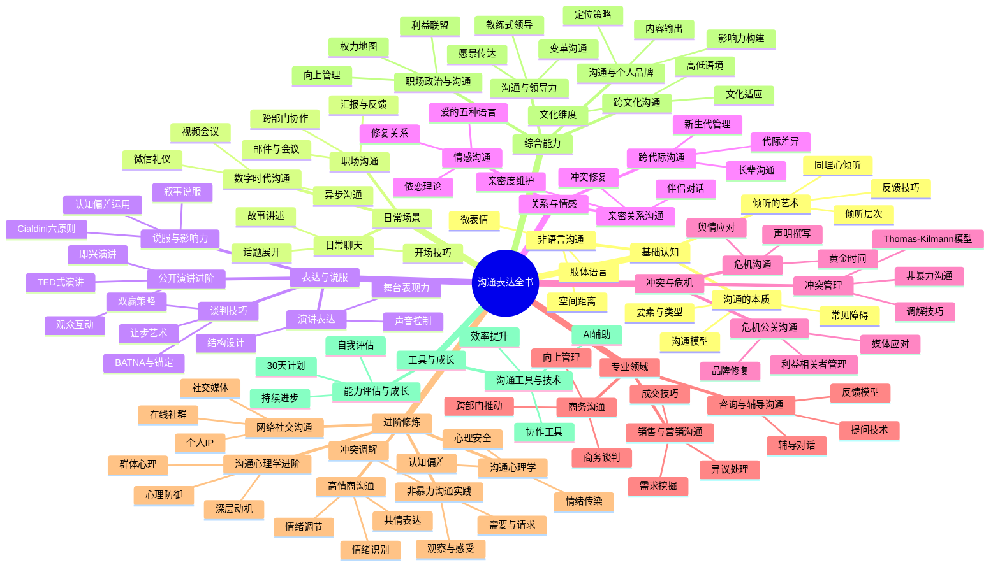
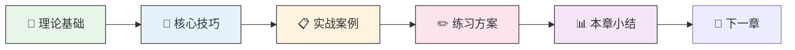

# 📚 沟通表达全书

> **一本从零基础到精通的全方位沟通指南——30章完整体系，覆盖你能想到的每一个沟通场景**

---

## 📖 关于本书

沟通能力不是天赋，是技能。技能可以学习，学习改变命运。

这本书是一套**完整的沟通能力训练体系**，包含30个章节、8份附录，超过150万字。它不是速成秘籍，不是社交操控手册，也不是一堆正确的废话——它是**道法术器贯通**的实战武器。

什么是"道法术器贯通"？每一章都包含四个层次：

| 层次 | 含义 | 你在每章中能看到什么 |
|------|------|---------------------|
| **道** | 底层原理 | 为什么这个技巧有效？背后的心理学/社会学/神经科学依据 |
| **法** | 方法论框架 | 什么场景用什么框架？决策流程、选择矩阵 |
| **术** | 具体技巧 | 具体怎么做？话术示例与变体，拿来就能用 |
| **器** | 工具与模板 | 检查清单、练习方案、复盘表格，让学习有章可循 |

理解了"道"，你才能灵活变通，而不是死记硬背；掌握了"法"，你才知道面对不同场景该走哪条路；学会了"术"，你才能在关键时刻说出正确的话；善用了"器"，你的练习才能高效有序。

---

## 🗂️ 书籍结构

全书分为**六大板块、30章、8份附录**，从基础理论到高阶应用，构建完整的沟通能力图谱。

沟通表达全书/
│
├── 前言与导读                      ← 从这里开始：全书缘起、学习路径、使用方法
├── 目录                            ← 完整目录与导航
│
├── 🌱 板块一：理论根基（第1-3章）
│   ├── 第01章 · 沟通的本质          ← 沟通模型、要素、类型、障碍
│   ├── 第02章 · 倾听的艺术          ← 主动倾听、同理心倾听、反馈技巧
│   └── 第03章 · 非语言沟通          ← 微表情、肢体语言、空间距离、副语言
│
├── 🔧 板块二：基础应用场景（第4-7章）
│   ├── 第04章 · 日常聊天            ← 开场白、话题延伸、幽默感、冷场应对
│   ├── 第05章 · 职场沟通            ← 向上汇报、跨部门协作、邮件/会议
│   ├── 第06章 · 演讲表达            ← 结构化表达、讲故事、控场、紧张管理
│   └── 第07章 · 谈判技巧            ← BATNA、锚定效应、让步策略、双赢谈判
│
├── 🎯 板块三：深度关系沟通（第8-12章）
│   ├── 第08章 · 情感沟通            ← 依恋理论、爱的五种语言、修复关系
│   ├── 第09章 · 冲突管理            ← Thomas-Kilmann模型、NVC四步法、调解
│   ├── 第10章 · 说服与影响力        ← Cialdini六原则、认知偏差、叙事说服
│   ├── 第11章 · 跨文化沟通          ← Hofstede文化维度、高低语境、文化适应
│   └── 第12章 · 危机沟通            ← 黄金时间、SCCT理论、舆情应对
│
├── ⚡ 板块四：新兴场景与细分领域（第13-23章）
│   ├── 第13章 · 数字时代沟通        ← 远程协作、即时通讯、视频会议、异步沟通
│   ├── 第14章 · 沟通心理学          ← 认知偏差、心理防御、框架效应
│   ├── 第15章 · 高情商沟通          ← 情绪管理、社交直觉、共情表达、边界设定
│   ├── 第16章 · 网络社交沟通        ← 社交媒体人设、评论区互动、网络舆论
│   ├── 第17章 · 亲密关系沟通        ← 依附理论、安全型沟通、冲突修复
│   ├── 第18章 · 销售与营销沟通      ← 客户画像、需求挖掘、异议处理、成交
│   ├── 第19章 · 公开演讲进阶        ← 大型演讲设计、即兴演讲、TED式表达
│   ├── 第20章 · 商务沟通            ← 商务谈判、合同沟通、高管对话
│   ├── 第21章 · 咨询与辅导沟通      ← 咨询式提问、教练式对话、反馈模型
│   ├── 第22章 · 危机公关沟通        ← 媒体应对、声明撰写、声誉修复
│   └── 第23章 · 跨代际沟通          ← 代际差异、职场多代协作、家庭代际对话
│
├── 🧠 板块五：高阶理论与能力（第24-27章）
│   ├── 第24章 · 沟通与领导力        ← 愿景传达、团队激励、变革沟通
│   ├── 第25章 · 沟通心理学进阶      ← 社会认知、群体心理、叙事心理学
│   ├── 第26章 · 非暴力沟通实践      ← NVC深度实践、冲突调解、日常应用
│   └── 第27章 · 沟通与个人品牌      ← 个人叙事、公众形象、影响力构建
│
├── 🏁 板块六：综合应用与持续成长（第28-30章）
│   ├── 第28章 · 职场政治与沟通      ← 权力地图、联盟构建、向上管理进阶
│   ├── 第29章 · 沟通工具与技术      ← AI辅助沟通、效率工具、技术增强表达
│   └── 第30章 · 沟通能力评估与成长  ← 能力自评、30天计划、持续精进路径
│
└── 📎 附录
    ├── 附录A · 沟通能力自测工具      ← 全面的自测评估，找到你的起点
    ├── 附录B · 沟通场景速查手册      ← 遇到具体问题？直接翻到这里
    ├── 附录C · 沟通金句与名言集      ← 值得收藏的经典语句
    ├── 附录D · 推荐阅读与资源        ← 延伸阅读清单
    ├── 附录E · 沟通工具箱            ← 模板、检查清单、练习工具合集
    ├── 附录F · 沟通训练30天计划      ← 系统化的每日训练方案
    ├── 附录G · 行业沟通指南          ← 不同行业的专业沟通要点
    └── 金句收藏                      ← 精选沟通金句

---

## 📋 每章结构说明

全书30章采用统一结构，确保学习体验的一致性。每章包含以下部分：

| 文件 | 内容 | 阅读时间 | 你该怎么做 |
|------|------|----------|-----------|
| `00-章节概览.md` | 本章简介、学习目标、核心要点、与其他章节的关联 | 5分钟 | 先读这个，建立整体认知 |
| `理论基础/` | 详细理论阐述，引用权威研究，解释"为什么" | 15分钟 | 精读并做笔记，理解原理 |
| `核心技巧/` | 具体可执行的方法、话术、步骤 | 15分钟 | 标记你最想练的技巧 |
| `实战案例/` | 5-8个真实对话示例，覆盖不同场景 | 20分钟 | 想象自己在场景中会怎么做 |
| `04-常见误区.md` | 错误示范及修正方法 | 10分钟 | 对照自己的习惯，找出盲区 |
| `05-练习方法.md` | 每日训练任务，帮你真正掌握技能 | 10分钟 | **最重要的一步：当天就练** |
| `06-本章小结.md` | 要点回顾，方便快速复习 | 5分钟 | 睡前快速过一遍，强化记忆 |
| `07-深度拓展.md` | 为高级读者准备的进阶内容 | 按需 | 有一定基础后再来探索 |

每章约需60-90分钟精读，但**真正的时间花在练习上**——读完一章只是开始，接下来的一周才是关键。

---

## 🎯 谁适合读这本书

这本书适合所有需要和人打交道的人。根据你的起点和痛点，选择最适合你的入口：

### 沟通基础薄弱

**典型症状**：不知道怎么开口，一说话就冷场，经常被人误解，觉得"自己嘴笨"。

**你需要先读的**：[第1章 沟通的本质](02-第一章-沟通的本质/00-章节概览.md) → [第2章 倾听的艺术](03-第二章-倾听的艺术/00-章节概览.md) → [第3章 非语言沟通](04-第三章-非语言沟通/00-章节概览.md)

**为什么**：大多数人以为沟通问题出在"不会说"，其实根本原因在"不会听"。先把地基打好。

### 职场沟通受困

**典型症状**：汇报工作领导听不懂，跨部门协作总是扯皮，开会发言紧张到大脑空白。

**你需要先读的**：[第5章 职场沟通](06-第五章-职场沟通/00-章节概览.md) → [第6章 演讲表达](07-第六章-演讲表达/00-章节概览.md) → [第7章 谈判技巧](08-第七章-谈判技巧/00-章节概览.md)

**进阶路线**：[第20章 商务沟通](21-第二十章-商务沟通/00-章节概览.md) → [第24章 沟通与领导力](25-第二十四章-沟通与领导力/00-章节概览.md) → [第28章 职场政治与沟通](29-第二十八章-职场政治与沟通/00-章节概览.md)

### 亲密关系沟通困难

**典型症状**：和伴侣一说话就吵架，感觉对方不理解自己，冷战是常态。

**你需要先读的**：[第8章 情感沟通](09-第八章-情感沟通/00-章节概览.md) → [第17章 亲密关系沟通](18-第十七章-亲密关系沟通/00-章节概览.md)

**冲突场景补充**：[第9章 冲突管理](10-第九章-冲突管理/00-章节概览.md) → [第26章 非暴力沟通实践](27-第二十六章-非暴力沟通实践/00-章节概览.md)

**家庭代际补充**：[第23章 跨代际沟通](24-第二十三章-跨代际沟通/00-章节概览.md)

### 希望提升影响力

**典型症状**：有能力但不被看到，有想法但说服不了人，做管理但团队执行力差。

**你需要先读的**：[第10章 说服与影响力](11-第十章-说服与影响力/00-章节概览.md) → [第24章 沟通与领导力](25-第二十四章-沟通与领导力/00-章节概览.md) → [第27章 沟通与个人品牌](28-第二十七章-沟通与个人品牌/00-章节概览.md)

### 销售/公关/咨询从业者

**典型症状**：有专业能力但沟通技巧不够系统，客户/来访者反馈"听不懂你在说什么"。

**你需要先读的**：[第18章 销售与营销沟通](19-第十八章-销售与营销沟通/00-章节概览.md) → [第21章 咨询与辅导沟通](22-第二十一章-咨询与辅导沟通/00-章节概览.md) → [第22章 危机公关沟通](23-第二十二章-危机公关沟通/00-章节概览.md)

---

## 📋 按问题场景速查

遇到具体问题？直接跳转到对应章节：

| 你遇到的问题 | 翻到哪里 |
|-------------|---------|
| 不知道怎么开口聊天，总是冷场 | [第4章 日常聊天](05-第四章-日常聊天/00-章节概览.md) |
| 跟同事/领导沟通效率低 | [第5章 职场沟通](06-第五章-职场沟通/00-章节概览.md) |
| 上台紧张、演讲不知道怎么讲 | [第6章 演讲表达](07-第六章-演讲表达/00-章节概览.md) → [第19章 公开演讲进阶](20-第十九章-公开演讲进阶/00-章节概览.md) |
| 谈薪资/砍价/谈合作总吃亏 | [第7章 谈判技巧](08-第七章-谈判技巧/00-章节概览.md) |
| 和伴侣/家人总是吵架 | [第8章 情感沟通](09-第八章-情感沟通/00-章节概览.md) → [第17章 亲密关系沟通](18-第十七章-亲密关系沟通/00-章节概览.md) |
| 不知道怎么处理冲突和分歧 | [第9章 冲突管理](10-第九章-冲突管理/00-章节概览.md) |
| 想说服别人但总被拒绝 | [第10章 说服与影响力](11-第十章-说服与影响力/00-章节概览.md) |
| 和外国人/不同文化背景的人打交道 | [第11章 跨文化沟通](12-第十一章-跨文化沟通/00-章节概览.md) |
| 出了事故/被曝光，不知道怎么应对 | [第12章 危机沟通](13-第十二章-危机沟通/00-章节概览.md) → [第22章 危机公关沟通](23-第二十二章-危机公关沟通/00-章节概览.md) |
| 微信/邮件总是被误解 | [第13章 数字时代沟通](14-第十三章-数字时代沟通/00-章节概览.md) |
| 控制不住情绪，沟通时容易激动 | [第15章 高情商沟通](16-第十五章-高情商沟通/00-章节概览.md) → [第25章 沟通心理学进阶](26-第二十五章-沟通心理学进阶/00-章节概览.md) |
| 想提升领导力和团队影响力 | [第24章 沟通与领导力](25-第二十四章-沟通与领导力/00-章节概览.md) |
| 不知道怎么和父母/长辈沟通 | [第23章 跨代际沟通](24-第二十三章-跨代际沟通/00-章节概览.md) |
| 想建立个人品牌、提升公众表达 | [第27章 沟通与个人品牌](28-第二十七章-沟通与个人品牌/00-章节概览.md) |
| 职场站队、利益博弈不知道怎么处理 | [第28章 职场政治与沟通](29-第二十八章-职场政治与沟通/00-章节概览.md) |

---

## 📊 全书知识地图

---

## 🗺️ 学习路线图

### 三大阅读方案

| 方案 | 每日投入 | 总时间 | 适合人群 | 学习策略 |
|------|---------|--------|---------|---------|
| **深度学习** | 1.5-2小时 | 45天 | 希望全面精通 | 每天1章，理论精读+全部练习+实战记录 |
| **系统学习** | 45-60分钟 | 90天 | 上班族/有特定需求 | 每2天1章，重点章节深度学，可跳过非急需章节 |
| **碎片学习** | 15-20分钟 | 120天 | 时间极度有限 | 每天只读1个小节+做1个微练习，积少成多 |

### 按水平选择路径

| 你的情况 | 推荐路径 | 预计时间 |
|---------|---------|---------|
| **零基础入门**：从没系统学过沟通 | 第1章 → 第2章 → 第3章 → 第4章 → 第15章 → 按兴趣选读 | 2-3周 |
| **职场进阶**：工作中常遇到沟通问题 | 第5章 → 第7章 → 第9章 → 第10章 → 第12章 → 第24章 → 第28章 | 2-3周 |
| **关系提升**：想改善亲密关系/家庭关系 | 第8章 → 第2章 → 第17章 → 第23章 → 第26章 | 1-2周 |
| **专业深造**：从事销售/公关/管理等岗位 | 第18章 → 第21章 → 第22章 → 第24章 → 第27章 | 2-3周 |
| **通读全书**：想全面掌握沟通能力 | 按章节顺序从头读到尾 | 4-6周 |

### 学习节奏流程

**每章的阅读节奏**：
1. **先通读理论基础**，理解原理（"为什么"比"怎么做"更重要）
2. **精读核心技巧**，做笔记，标记你最想练的1-2个技巧
3. **研读实战案例**，想象自己在那个场景中会怎么做
4. **当天就练**——在真实场景中至少练习一个技巧（这是最关键的一步）
5. **睡前2分钟回顾**，强化当天学习效果

---

## 💡 三个核心原则

这三个原则贯穿全书，它们不是装饰性的口号，而是决定你学习成效的根本因素。

### 原则一：真诚为本

心理学研究表明，当人们感知到对方缺乏真诚时，大脑中的杏仁核会激活防御反应——即使对方说的每句话都"正确"，听者也会本能地不信任。技巧的作用不是让你"表演"，而是帮你**更准确地表达内心真实的想法和感受**。一个真诚但笨拙的道歉，远比一个技巧完美但缺乏诚意的道歉更能修复关系。

### 原则二：练习为王

神经科学明确告诉我们：知识的获取和能力的形成本质上是不同的过程。你可以在5分钟内理解"主动倾听"的概念，但要把它变成本能反应，需要至少30-50次有意识的刻意练习。这就是为什么"读了很多沟通的书，还是不会沟通"——阅读只完成了知识获取，能力形成需要重复的行为训练。

练习的关键原则：
- **小步开始**：每次只练一个技巧，不要贪多
- **真实场景**：在实际生活和工作中练习，不要只在脑中"模拟"
- **即时反馈**：练习后立刻反思效果，有条件时请信任的人给你反馈
- **重复迭代**：同一个技巧至少练习5次以上再评估效果

### 原则三：循序渐进

很多读者会直接翻到"谈判技巧"或"高情商沟通"这些看起来最"实用"的章节。这是一个代价高昂的错误。沟通能力是层层叠加的：没有扎实的倾听能力，你学不会有效的情感沟通；不理解非语言沟通，你读不懂谈判桌上的真实博弈；不清楚冲突管理的基本框架，高情商沟通就只是空中楼阁。

**路径建议**：
- **零基础**：从第1章开始，按顺序完整学习
- **有一定基础**：完成第1-3章（理论根基）后，可以跳到最需要的应用章节
- **老手提升**：重点关注板块五（高阶理论），同时用板块六（综合应用）做查漏补缺

---

## 📊 沟通能力自测

在正式开始学习之前，花5分钟做这个快速自测，帮你找到最需要优先突破的方向。

**评分标准**：1=完全不符合，2=偶尔符合，3=有时符合，4=经常符合，5=完全符合

### 基础能力

| 编号 | 陈述 | 评分 |
|------|------|------|
| B1 | 别人说完话后，我能准确复述对方的核心意思 | ___ |
| B2 | 我能在对话中控制自己不打断别人 | ___ |
| B3 | 我能读懂别人的面部表情和肢体语言 | ___ |
| B4 | 我能在一分钟内清晰地表达一个观点 | ___ |
| B5 | 我说话时能注意到对方的反应并调整表达方式 | ___ |

### 场景应用

| 编号 | 陈述 | 评分 |
|------|------|------|
| S1 | 我能自然地和陌生人开启对话 | ___ |
| S2 | 我能在会议上清晰地表达自己的观点 | ___ |
| S3 | 我能有效地向上级汇报工作进展 | ___ |
| S4 | 我能在冲突中保持冷静并找到解决方案 | ___ |
| S5 | 我能说服别人接受我的合理建议 | ___ |

### 关系沟通

| 编号 | 陈述 | 评分 |
|------|------|------|
| R1 | 我能和伴侣/家人进行深度的情感交流 | ___ |
| R2 | 我能在不伤害关系的情况下表达不同意见 | ___ |
| R3 | 我能在别人难过时给予恰当的情感支持 | ___ |
| R4 | 我能在关系中设定健康的边界 | ___ |
| R5 | 我能在道歉时让对方真正感受到诚意 | ___ |

**评分解读**：

| 总分 | 水平 | 建议 |
|------|------|------|
| 60-75 | 沟通基础扎实 | 重点关注板块四至六的高阶内容 |
| 45-59 | 基础尚可但有短板 | 从板块一开始系统学习 |
| 30-44 | 存在明显沟通盲区 | 强烈建议按顺序完整学习 |
| 15-29 | 沟通是核心瓶颈 | 投入本书学习将带来巨大回报 |

**分项诊断**：
- 基础能力 < 15分 → 先攻克第1-3章，这是一切的根基
- 场景应用 < 15分 → 重点学习板块二（第4-7章），解决具体场景问题
- 关系沟通 < 15分 → 板块三（第8-12章）是你的主战场

更全面的评估工具请前往 [附录A·沟通能力自测工具](99-附录/附录A-沟通能力自测工具.md)。

---

## 📅 时间安排建议

**最佳学习时间**：早上头脑清醒时读理论部分，晚上回顾当天练习效果。

**碎片时间利用**：通勤时间回顾章节要点，排队时观察周围人的沟通方式。

**周末强化**：用1-2小时做一次完整的场景模拟练习。

**30天训练计划**：如果你希望有系统化的每日安排，请前往 [附录F·沟通训练30天计划](99-附录/附录F-沟通训练30天计划.md)。

---

## ⚠️ 这本书不是什么

**不是速成秘籍。** 沟通能力的提升需要时间和练习。这本书提供系统的方法论和持续的练习方案，而不是"背下来就能变成沟通高手"的捷径。但如果你愿意投入30天持续练习，你会看到明显的变化。

**不是社交操控手册。** 所有技巧都建立在"真诚"和"尊重"的基础上。沟通的目标不是打败对方，而是达成理解和共识。

**不是心理咨询替代品。** 如果你正在经历严重的心理困扰（如社交恐惧症、严重的人际关系创伤），这本书可以作为辅助参考，但不能替代专业的心理咨询。请在必要时寻求专业帮助。

---

## 📚 本书的四个承诺

**承诺一：不说空话。** 每一个技巧都有具体的操作步骤和话术示例。你不会看到"要善于倾听""注意表达方式"这种正确的废话。

**承诺二：理论为实践服务。** 引用每一个理论、每一项研究，都是因为它能帮你更好地理解和应用具体技巧。这不是学术著作，理论是工具，不是目的。

**承诺三：尊重你的时间。** 每一章的内容都经过反复筛选，只保留对提升沟通能力有实质帮助的内容。能用一个案例说清楚的，不会用三个。

**承诺四：承认局限。** 沟通是复杂的，没有万能公式。在不同的文化背景、人格类型、具体情境下，同一个技巧可能有不同的效果。本书会诚实指出这些局限，而不是假装一切都有标准答案。

---

## 🚀 现在，开始吧

你已经知道了这本书是什么、不是什么、包含什么、怎么用。剩下的就是行动。

→ 如果你是**第一次打开这本书**：前往 [前言与导读](00-前言与导读.md)，了解全书的学习哲学，然后从第1章开始。

→ 如果你**带着具体问题来的**：翻到上面的"问题场景速查表"，直接跳到对应章节。

→ 如果你**已经读过部分内容**：前往 [目录](01-目录.md)，找到你上次停下的地方继续。

> **沟通能力不是天赋，是技能。技能可以学习，学习改变命运。**

从今天开始，每天进步一点点。30天后，你会感谢今天的自己。

---

*愿你的每一句话，都能温暖人心、传递力量。* 🌟
