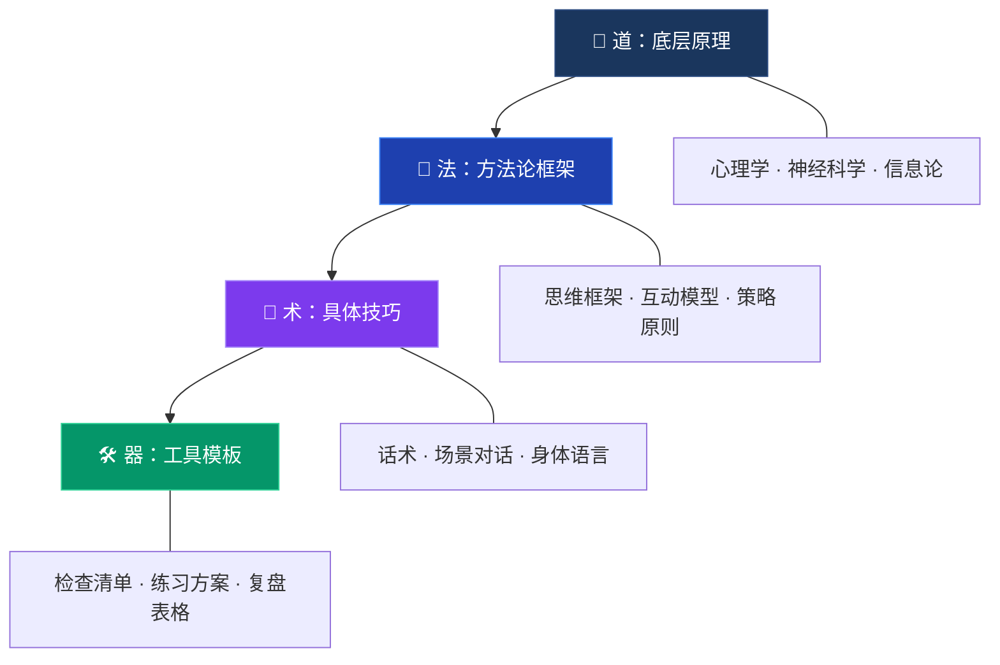
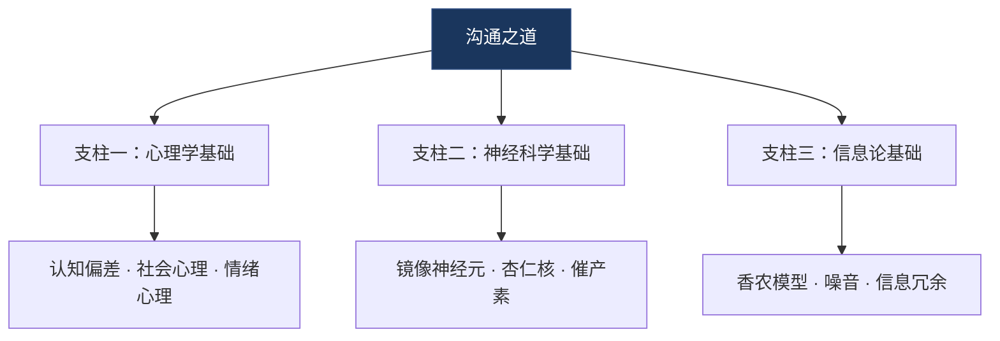
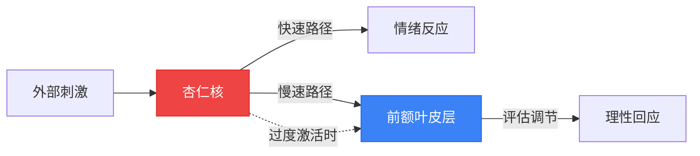
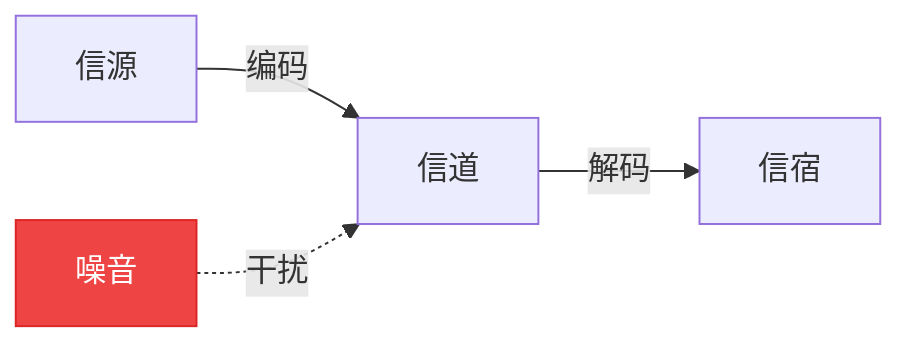
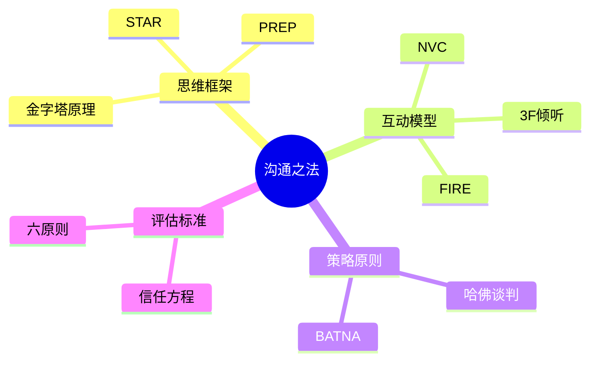
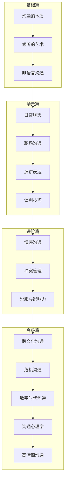
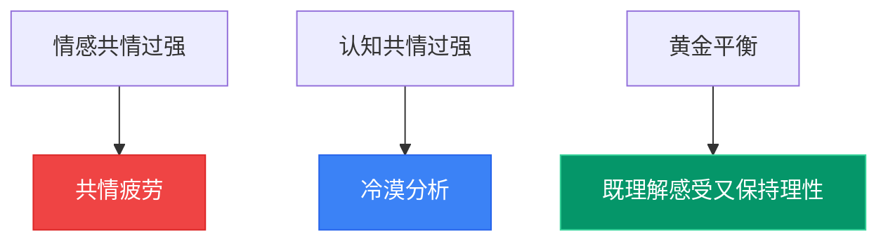
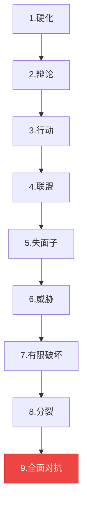

# 《沟通表达全书》道法术深度解析

> **方法论指南** | 贯穿全书的学习地图与修炼手册

***
## 目录

- [总述：道法术框架](#总述道法术框架)
- [第一章 沟通的本质](#第一章-沟通的本质)
- [第二章 倾听的艺术](#第二章-倾听的艺术)
- [第三章 非语言沟通](#第三章-非语言沟通)
- [第四章 日常聊天](#第四章-日常聊天)
- [第五章 职场沟通](#第五章-职场沟通)
- [第六章 演讲表达](#第六章-演讲表达)
- [第七章 谈判技巧](#第七章-谈判技巧)
- [第八章 情感沟通](#第八章-情感沟通)
- [第九章 冲突管理](#第九章-冲突管理)
- [第十章 说服与影响力](#第十章-说服与影响力)
- [第十一章 跨文化沟通](#第十一章-跨文化沟通)
- [第十二章 危机沟通](#第十二章-危机沟通)
- [第十三章 数字时代沟通](#第十三章-数字时代沟通)
- [第十四章 沟通心理学](#第十四章-沟通心理学)
- [第十五章 高情商沟通](#第十五章-高情商沟通)

***
# 总述：道法术器框架

## 什么是「道法术器」？

「道法术」源自中国古代哲学思想。《道德经》有言：「人法地，地法天，天法道，道法自然。」在沟通表达的学习体系中，我们将这个经典框架扩展为四个层次：

- **道（Dao）**——底层原理与第一性原理
- **法（Fa）**——方法论、模型与框架
- **术（Shu）**——具体技巧、话术与练习
- **器（Qi）**——工具、模板、检查清单（用什么练？）

这四个层次的关系，可以用一棵树来比喻：**道是根，法是干，术是叶，器是工具。** 根深才能叶茂，干壮才能枝繁，善用工具才能事半功倍。很多人学沟通只关注"术"——背话术、学技巧，却忽略了底层的"道"和"法"，结果就是学了一堆招式，遇到新场景就束手无策。

***
## 一、道：沟通的底层原理

### 1.1 什么是「道」？

「道」是沟通领域中最底层、最本质的原理。它回答的是"为什么"的问题——为什么某种沟通方式有效？为什么人类会这样理解信息？为什么情绪会影响沟通效果？

「道」不是技巧，不是方法，而是**理解一切沟通现象的底层逻辑**。掌握了"道"，你就能自己推导出新的方法和技巧，而不需要死记硬背。

### 1.2 沟通之「道」的三大支柱

#### 支柱一：心理学基础

人类的沟通行为根植于心理机制。理解以下心理学原理，是掌握沟通之道的第一步：

**认知心理学**揭示了人类如何处理信息。我们的大脑并非像计算机一样精确处理每一条信息，而是依赖各种"认知捷径"（启发式）来快速判断。比如：
- **首因效应**：第一印象会深刻影响后续的判断
- **近因效应**：最近接收的信息记忆更深
- **锚定效应**：先出现的数字会影响后续的判断
- **确认偏差**：人们倾向于接受符合已有信念的信息

这些认知偏差直接影响沟通效果。例如，在谈判中，先报价的一方会"锚定"对方的心理预期；在演讲中，开场的前三分钟决定了听众是否愿意继续听下去。

**社会心理学**研究人与人之间的互动规律。几个关键发现：
- **从众效应**：人们倾向于跟随多数人的行为和观点
- **权威效应**：人们更容易相信权威人士的话
- **互惠原则**：收到好处后，人们会感到回报的义务
- **相似性吸引**：人们更容易喜欢与自己相似的人

**情绪心理学**揭示了情绪在沟通中的核心角色。神经科学家安东尼奥·达马西奥的研究表明，情绪不是理性的敌人，而是决策的必要组成部分。没有情绪参与的决策，反而会变得低效和混乱。

#### 支柱二：神经科学基础

现代神经科学为沟通提供了坚实的生物学基础：

**镜像神经元**的发现是20世纪神经科学最重要的突破之一。当我们观察他人行动时，大脑中与执行该动作相同的区域会被激活。这就是为什么看到别人打哈欠自己也会打哈欠，为什么看到别人哭自己也会感到难过。在沟通中，镜像神经元是**共情**的生物学基础——我们通过"模拟"他人的感受来理解对方。

**杏仁核与前额叶皮层**的互动决定了我们在沟通中的情绪反应。杏仁核是大脑的"警报系统"，负责快速检测威胁；前额叶皮层是"理性中枢"，负责评估和调节情绪反应。当杏仁核被过度激活（比如在激烈争吵中），前额叶皮层的功能会被抑制——这就是为什么人在愤怒时会"失去理智"。

**多巴胺与催产素**在社交互动中扮演重要角色。多巴胺是"奖励信号"，当我们获得社会认可、听到有趣的故事时会大量释放；催产素是"信任激素"，在亲密互动、身体接触时会增加，促进信任和合作。

**工作记忆**的容量限制（米勒的7±2法则）意味着，一次性传递超过5-9个信息点，对方就很难记住。这解释了为什么"三点法则"在演讲和汇报中如此有效——三个要点正好在工作记忆的最佳容量范围内。

#### 支柱三：信息论基础

克劳德·香农的信息论为理解沟通过程提供了精确的数学模型：

**信源→编码→信道→解码→信宿**，这是最基本的沟通过程模型。在沟通中：

- **信源**是说话者的思维
- **编码**是将想法转化为语言、文字、表情等
- **信道**是传递信息的媒介（面对面、电话、邮件等）
- **解码**是听者将接收到的信号转化为理解
- **信宿**是听者的思维

**噪音**存在于整个沟通过程中，包括物理噪音（环境嘈杂）、心理噪音（偏见、情绪）、语义噪音（语言歧义）等。高效沟通者的标志，就是能有效对抗各种噪音。

**信息冗余**是保证沟通准确性的关键策略。适度的重复、举例、总结，看似"啰嗦"，实际上是信息论中的必要冗余——它能大幅降低信息传递中的错误率。

### 1.3 为什么「道」如此重要？

很多人学沟通，直接从"术"开始——背话术、学套路。这就像学武功只练招式，不练内功。短期内可能有效果，但遇到新场景就不知所措。

掌握了"道"，你就拥有了**第一性原理思维**——从最基本的原理出发，推导出新的方法和策略。当你面对一个从未遇到过的沟通场景时，你不需要慌张地寻找"话术模板"，而是可以从心理学、神经科学、信息论的基本原理出发，自己设计出有效的沟通策略。

正如查理·芒格所说："给我一个有基本框架的通才，胜过一个只有狭隘知识的专家。"

***
## 二、法：沟通的方法论与框架

### 2.1 什么是「法」？

「法」是连接"道"与"术"的桥梁。它是将底层原理转化为可操作步骤的方法论、模型和框架。

如果说"道"回答的是"为什么"，那么"法"回答的就是"怎么做"。它提供了系统化的思考路径和行动指南。

### 2.2 沟通之「法」的四大类型

#### 类型一：思维框架

思维框架帮助我们**组织思路**，让表达更有逻辑、更有条理：

- **金字塔原理**：结论先行，以上统下，归类分组，逻辑递进。这是麦肯锡咨询顾问的核心表达工具，适用于所有需要结构化表达的场景。
- **PREP框架**：Point（观点）→ Reason（原因）→ Example（案例）→ Point（重申观点）。适用于即兴发言、回答问题等场景。
- **STAR法则**：Situation（情境）→ Task（任务）→ Action（行动）→ Result（结果）。适用于讲述经历、回答行为面试问题等场景。
- **SCQA框架**：Situation（情境）→ Complication（冲突）→ Question（疑问）→ Answer（答案）。适用于汇报、提案等场景。

#### 类型二：互动模型

互动模型帮助我们**管理沟通过程**，让对话更高效、更有建设性：

- **非暴力沟通（NVC）**：观察→感受→需要→请求。这是处理冲突、表达不满的黄金模型。
- **3F倾听法**：Fact（事实）→ Feeling（感受）→ Focus（意图）。帮助我们真正理解对方。
- **FIRE模型**：Fact（事实）→ Interpretation（解读）→ Reaction（反应）→ Effect（效果）。帮助我们区分事实和主观判断。
- **教练式对话**：GROW模型——Goal（目标）→ Reality（现实）→ Options（选择）→ Will（意愿）。

#### 类型三：策略原则

策略原则指导我们在特定场景中**做出正确决策**：

- **哈佛谈判原则**：把人和问题分开；关注利益而非立场；创造双赢选项；坚持使用客观标准。
- **BATNA原则**：在谈判中，永远要知道自己的"最佳替代方案"。
- **锚定效应**：在谈判中，先报价的一方往往占据优势。
- **互惠原则**：先给予，再索取——这是说服的基本法则。
- **承诺一致性**：让对方做出小承诺，再逐步升级——这是影响力的核心机制。

#### 类型四：评估标准

评估标准帮助我们**衡量沟通效果**，实现持续改进：

- **沟通效果四象限**：从"信息传递"和"关系维护"两个维度评估沟通效果。
- **信任方程式**：信任 = （可信度 + 可靠性 + 亲近感）/ 自我导向。
- **影响力六原则**：互惠、承诺一致、社会认同、喜好、权威、稀缺。
- **情商四维度**：自我觉察、自我管理、社会觉察、关系管理。

### 2.3 「法」的核心价值

「法」的核心价值在于**可迁移性**。一个掌握了金字塔原理的人，无论面对汇报、演讲、邮件还是日常对话，都能快速组织思路，清晰表达。一个理解了非暴力沟通模型的人，无论是处理夫妻矛盾、亲子冲突还是职场纷争，都能有效化解。

「法」不是死板的公式，而是灵活的思维工具。你需要根据具体场景，选择合适的"法"，甚至组合多个"法"来解决问题。

***
## 三、术：沟通的具体技巧与实践

### 3.1 什么是「术」？

「术」是最具体的层面，是直接用于实践的技巧、话术模板、案例和练习。

如果说"道"是内功心法，"法"是武学招式的原理，那么"术"就是具体的对战招式——什么时候出拳、怎么出拳、出拳的力度和角度。

### 3.2 沟通之「术」的五大类型

#### 类型一：话术模板

话术模板是最实用的"术"，它提供了可以直接使用的语言框架：

**开场白模板：**
- "今天我想跟大家分享一个让我改变了看法的经历……"
- "在开始之前，我想先问大家一个问题……"
- "如果我告诉你……你会怎么想？"

**倾听回应模板：**
- "我听到你说的是……我理解得对吗？"
- "听起来你对这件事感受很深，能多说一些吗？"
- "我能感受到你现在的（情绪），这确实很（形容词）。"

**化解冲突模板：**
- "我理解你的立场，同时我也想分享我的看法……"
- "我们都希望达成一个好的结果，不如我们先看看有哪些共同点……"
- "你说的有道理，我之前没有从这个角度想过……"

**说服引导模板：**
- "你有没有想过……可能会是另一种可能？"
- "我之前也和你想的一样，后来我发现……"
- "如果你试试……你觉得会怎么样？"

#### 类型二：场景对话

场景对话将技巧放在具体情境中，帮助你理解如何运用：

**场景一：同事抢功**
> 低情商："这个项目是我做的，你怎么能说是你的功劳？"
> 高情商："谢谢你在会上的呈现。关于这个项目，我负责的部分包括数据分析和方案设计，如果需要详细说明技术细节，我很乐意补充。"

**场景二：领导批评**
> 低情商："这不是我的问题，是其他部门配合不好。"
> 高情商："感谢您的反馈。我理解这次的结果没有达到预期。我复盘了一下，主要有两个改进点……您看这个方向可以吗？"

#### 类型三：身体语言技巧

非语言沟通在整体沟通中占比高达93%（梅拉比安法则），因此身体语言技巧至关重要：

- **眼神接触**：保持60-70%的眼神接触时间，表达关注和自信
- **微笑**：真诚的微笑（杜乡微笑）能瞬间拉近距离
- **开放姿态**：双臂自然下垂或打开，避免交叉抱胸
- **前倾**：微微前倾表示感兴趣和专注
- **镜像**：适度模仿对方的姿态，建立潜意识的亲近感

#### 类型四：声音控制技巧

声音是沟通的"乐器"，控制好声音能大幅提升表达效果：

- **语速控制**：重要信息放慢，过渡部分加快
- **音量变化**：强调时提高音量，亲密时降低音量
- **停顿艺术**：关键信息前后停顿2-3秒，给听众消化时间
- **语调变化**：避免"催眠式"单调语调，用语调起伏保持注意力
- **气息控制**：深呼吸支持发声，避免声音发抖或上气不接下气

#### 类型五：刻意练习方法

技巧的掌握离不开刻意练习：

- **镜前练习**：对着镜子练习表情、手势、眼神
- **录音回听**：录下自己的表达，回听分析语速、语调、口头禅
- **视频分析**：录下模拟对话，分析自己的身体语言
- **角色扮演**：找朋友模拟不同场景，练习应对策略
- **日记复盘**：每天记录一次重要沟通，反思得失

### 3.3 从「术」到「道」的学习路径

学习沟通的最佳路径是**从术到法再到道**——先学几个实用技巧建立信心，再学方法论建立框架，最后深挖底层原理打通任督二脉。

本书的章节设计遵循这个逻辑：每一章都从「道」的原理讲起，再到「法」的模型框架，最后落到「术」的具体技巧和练习。你可以根据自己的水平选择切入点：

- **初学者**：直接看每章的「术」部分，先用起来
- **进阶者**：重点学习「法」部分，建立系统框架
- **高手**：深挖「道」部分，打通底层逻辑

***
## 四、道法术的统一：以终为始的学习观

### 4.1 三层融会贯通

真正的沟通高手，是将道法术融会贯通的人。他们不需要刻意回想"金字塔原理的四个要点是什么"，也不需要在心里默念"PREP框架第一步是什么"。这些框架已经内化为他们的思维习惯，自然而然地体现在每一次沟通中。

达到这个境界的路径是：**刻意练习 → 习惯养成 → 自然反应**。

### 4.2 知行合一

王阳明说："知是行之始，行是知之成。"沟通之道，最终要落实到行动上。读完这本书，如果只是"知道了"而没有"做到了"，那等于没学。

我们的建议是：每学完一个章节，至少做以下三件事：
1. **写下**三个最重要的收获
2. **设计**一个明天就能用的行动方案
3. **找一个**真实场景去练习

### 4.3 持续精进

沟通能力的提升是一场马拉松，不是百米冲刺。不要期望看完一本书就能成为沟通大师。真正的改变，发生在日常的每一次对话中。

**每日沟通练习清单：**
- 早晨：设定一个今天的沟通目标（比如"今天我要在会议中主动发言一次"）
- 白天：刻意练习一个技巧（比如"今天我要在每次对话中先倾听2分钟"）
- 晚上：复盘一次最有价值的沟通（哪里做得好？哪里可以改进？）

***
## 五、本书的使用指南

### 5.1 如何阅读本书

本书共15章，覆盖沟通表达的各个维度。建议的阅读顺序：

**第一阶段：基础篇（第1-3章）**
- 沟通的本质 → 倾听的艺术 → 非语言沟通
- 这三章是所有沟通技能的基础，务必先读

**第二阶段：场景篇（第4-7章）**
- 日常聊天 → 职场沟通 → 演讲表达 → 谈判技巧
- 这四章覆盖最常见的沟通场景

**第三阶段：进阶篇（第8-10章）**
- 情感沟通 → 冲突管理 → 说服与影响力
- 这三章处理更复杂的沟通挑战

**第四阶段：高级篇（第11-15章）**
- 跨文化沟通 → 危机沟通 → 数字时代沟通 → 沟通心理学 → 高情商沟通
- 这五章面向高级沟通场景和深层能力提升

### 5.2 道法术速查表

| 章节 | 核心之道 | 核心之法 | 核心之术 | 核心之器 |
|------|----------|----------|----------|----------|
| 沟通的本质 | 信息论、认知负荷 | 金字塔原理、PREP | 结构化表达模板 | 金字塔检查清单 |
| 倾听的艺术 | 注意力科学、共情 | 3F倾听法 | 反映式回应 | 倾听自评量表 |
| 非语言沟通 | 镜像神经元、情绪感染 | 梅拉比安法则 | 身体语言技巧 | 非语言自查表 |
| 日常聊天 | 社交货币、自我表露 | FIRE模型 | 聊天话术库 | 聊天复盘日记 |
| 职场沟通 | 权力动态、信息不对称 | 金字塔汇报 | 向上管理话术 | 汇报准备清单 |
| 演讲表达 | 注意力曲线、故事脑科学 | 英雄之旅、三点法则 | 开场白模板 | 演讲排练表 |
| 谈判技巧 | 博弈论、前景理论 | BATNA/ZOPA | 谈判话术 | 谈判准备清单 |
| 情感沟通 | 依恋理论、情感账户 | 非暴力沟通NVC | 情感修复话术 | 关系自评表 |
| 冲突管理 | 冲突升级理论 | IBCR冲突解决法 | 冲突化解话术 | 冲突复盘表 |
| 说服与影响力 | Cialdini六原则 | ELM模型 | 说服话术 | 影响力自检表 |
| 跨文化沟通 | 文化维度理论 | 文化适应模型 | 场景应对策略 | 文化差异清单 |
| 危机沟通 | SCCT理论 | 黄金小时原则 | 危机话术 | 危机响应清单 |
| 数字时代沟通 | 媒体丰富度 | 邮件公式 | 数字模板 | 数字沟通检查表 |
| 沟通心理学 | 认知心理学 | ABC模型 | 心理学技巧 | 情绪日记模板 |
| 高情商沟通 | 情商模型 | 四维度框架 | 高情商话术 | 情商自评量表 |

***
> **提示**：以下各章的「道法术器」深度解析，是对本书内容的系统化梳理和深化。每一章都可以独立阅读，但建议结合原书章节一起学习，效果更佳。

# 第一章 沟通的本质

## 道：底层原理

### 信息论基础：沟通是信息的传递与还原

1948年，克劳德·香农发表了划时代的论文《通信的数学理论》，奠定了信息论的基础。虽然香农研究的是电子通信，但他的理论模型完美适用于人类沟通。

**沟通过程的五个要素：**

1. **信源（信息发出者）**：你的大脑中有一个想法、情感或意图
2. **编码（转化为符号）**：你将想法转化为语言、文字、表情、手势等符号
3. **信道（传递媒介）**：声音、文字、视频、面对面等
4. **解码（还原信息）**：接收者将符号还原为自己的理解
5. **信宿（信息接收者）**：接收者的大脑中形成了新的认知

这个模型揭示了一个关键真相：**你说的≠对方理解的。** 从你的想法到对方的理解，中间经历了编码→传递→解码三个环节，每个环节都可能产生信息损失和扭曲。

**噪音的三种类型：**

- **物理噪音**：环境嘈杂、信号不好、光线不足
- **心理噪音**：偏见、情绪、注意力分散、先入为主
- **语义噪音**：专业术语、文化差异、语言歧义

**信息冗余的必要性：**

在信息论中，冗余是保证信息准确传递的必要手段。在沟通中，适度的重复、举例、总结、类比，看似"啰嗦"，实际上是减少误解的有效策略。比如，重要会议后的邮件确认、关键决议的书面记录，都是信息冗余原则的应用。

### 认知负荷理论：大脑的带宽是有限的

认知心理学家约翰·斯威勒提出的认知负荷理论告诉我们，人的工作记忆容量非常有限——一次大约只能处理7±2个信息块（米勒的魔法数字）。

**认知负荷的三种类型：**

1. **内在负荷**：信息本身的复杂度。你无法改变它，但可以通过拆解来降低。
2. **外在负荷**：不良的表达方式增加的额外负荷。这是可以通过改善沟通方式来降低的。
3. **相关负荷**：有助于学习和理解的负荷。好的类比、生动的案例能增加相关负荷。

**沟通启示：**

- 一次不要传递太多信息点（控制在3-5个以内）
- 使用结构化表达降低外在负荷（比如"有三点"）
- 用类比、故事、视觉化增加相关负荷
- 给听众消化的时间（停顿、提问、互动）

### 心智模型：每个人都有自己的"内在地图"

认知科学家菲利普·约翰逊-莱尔德提出的心智模型理论认为，人类不是直接感知现实，而是通过内在的"心智模型"来理解和预测世界。

**沟通中心智模型的影响：**

- 每个人基于自己的经验、知识和价值观，构建了不同的"世界模型"
- 同一句话，不同的人会解读出完全不同的含义
- 有效沟通的核心，是理解并校准对方的心智模型
- "说对方听得懂的话"，本质上就是"用对方的心智模型来编码信息"

**实践启示：**

- 在沟通前，先了解对方的背景、知识水平和关注点
- 使用对方熟悉的概念和语言来表达
- 通过提问来检验对方是否理解了你的意思
- 不要假设"我知道的，你也应该知道"——这是沟通中最大的陷阱之一

## 法：方法论与模型

### 金字塔原理：结构化表达的黄金法则

麦肯锡咨询顾问芭芭拉·明托提出的金字塔原理，是结构化表达的基础框架。

**四个核心原则：**

1. **结论先行**：先说结论，再说原因。这是最重要也最容易被忽视的原则。很多人习惯铺垫半天才说重点，但听众的注意力是有限的。
2. **以上统下**：上一层观点是下一层论据的总结，下一层论据是上一层观点的支撑。
3. **归类分组**：将相似的信息归为一组，每组之间相互独立、完全穷尽（MECE原则）。
4. **逻辑递进**：同一组内的信息按照时间顺序、结构顺序或重要性顺序排列。

**金字塔结构示例：**

            结论
           / | \
      论点1 论点2 论点3
      /|\   /|\   /|\
    证据  证据  证据  证据  证据  证据

### PREP框架：即兴表达的万能公式

当你需要在短时间内表达观点时，PREP框架是最实用的工具：

- **P（Point）**：观点——先亮出你的核心观点
- **R（Reason）**：原因——给出支撑观点的理由
- **E（Example）**：案例——用具体的例子来佐证
- **P（Point）**：重申——最后再次强调你的观点

**示例：**
> **P**：我认为远程办公将成为未来的主流趋势。
> **R**：因为技术条件已经成熟，而且新一代员工更重视工作灵活性。
> **E**：比如GitLab，全球1500名员工全部远程办公，估值超过100亿美元。
> **P**：所以，远程办公不是权宜之计，而是未来的工作方式。

### STAR法则：讲述经历的标准框架

STAR法则是讲故事、回答行为面试问题的黄金框架：

- **S（Situation）**：情境——描述当时的背景
- **T（Task）**：任务——你需要完成什么
- **A（Action）**：行动——你采取了什么行动
- **R（Result）**：结果——取得了什么成果

## 术：话术模板与场景对话

### 10个话术模板

**1. 开场引入**
"我今天想跟大家聊一个话题，这个话题之所以重要，是因为它关系到我们在座每一个人的……"

**2. 结论先行**
"关于这件事，我的观点是……原因有三个：第一……第二……第三……"

**3. 请求许可**
"在我说出我的想法之前，我想先确认一下，你希望我直接说结论，还是先说过程？"

**4. 确认理解**
"我想确认一下我理解得对不对。你的意思是……对吗？"

**5. 表达不同意见**
"你说的很有道理。我从另一个角度来看，可能会得出不同的结论……"

**6. 向上汇报**
"领导，关于XX项目，有两个关键信息需要跟您同步：第一……第二……我的建议是……"

**7. 降低认知负荷**
"这个概念有点复杂，我用一个简单的比喻来解释……"

**8. 建立共识**
"我想我们在这一点上是一致的：我们都希望……"

**9. 引导对方思考**
"如果你站在客户的角度，你觉得他们最关心的是什么？"

**10. 总结回顾**
"今天我们达成了三个共识：第一……第二……第三……接下来的行动是……"

### 5个场景对话

**场景一：向领导汇报工作进展**
> "王总，关于XX项目，进度汇报如下。目前完成了80%，比计划提前了3天。有两个风险点需要您关注：一是供应商的交期可能延迟，我已联系了备选方案；二是技术测试中发现了一个兼容性问题，技术团队正在排查，预计明天能解决。整体来看，项目可以按期交付。"

**场景二：向客户介绍方案**
> "李总，根据您之前提到的需求，我们设计了三个方案。先说结论：我推荐方案二。原因是……对比方案一，它的优势在于……相比方案三，它的成本更低……"

**场景三：在会议上发言**
> "我想补充一个数据。根据我们上个月的用户调研，72%的用户表示最关心的是产品的稳定性，而不是新功能。这个数据跟我们目前的产品策略可能需要重新对齐。"

**场景四：跟同事解释复杂问题**
> "这个问题用一句话概括就是：系统在高并发下会丢数据。打个比方，就像一条高速公路只有两条车道，突然来了十倍的车流量，肯定要堵车出事故。我们的解决方案就是扩宽车道。"

**场景五：说服团队接受新方案**
> "我知道大家对新方案有顾虑，这很正常。但我想请大家看看这个数据：试点团队采用新方案后，效率提升了35%，客户满意度提高了20%。当然，过渡期可能会有一些不适应，我已经准备了详细的培训计划和过渡方案。"

## 器：表达结构化工具

### 思维导图软件

**XMind、MindNode、飞书思维笔记**：在重要沟通前，用思维导图梳理你的论点结构。把核心结论放在中心，分支展开论据和案例。

### 金字塔结构检查清单

- [ ] 结论是否在第一句话？
- [ ] 是否有 3 个（±1）支撑论点？
- [ ] 每个论点是否有具体证据？
- [ ] 论点之间是否 MECE（相互独立、完全穷尽）？
- [ ] 整体逻辑是时间顺序、结构顺序还是重要性顺序？

### PREP 快速练习器

每天随机抽取一个话题（比如"远程办公的利弊"），用 60 秒完成 PREP 表达。录音回听，检查是否做到"结论先行、理由充分、案例具体、首尾呼应"。

### 反馈收集工具

**录音回听**：录下你的一次汇报或重要对话，回听时关注：信息密度是否合适？有没有废话？逻辑跳跃是否太多？

**同伴互评**：找一个信任的朋友或同事，在你表达后给你打分（1-10）：信息清晰度、说服力、感染力、结构感。定期对比分数变化。

## 常见误区

### 误区一：沟通就是会说话

**真相：** 沟通是信息的传递与还原，"会说话"只是编码环节。如果你不了解对方的心智模型（解码端），说得再漂亮也没用。真正的沟通高手，首先是一个好的"信息设计师"。

### 误区二：我说清楚了，对方就应该听懂

**真相：** 沟通过程中存在物理噪音、心理噪音和语义噪音三重干扰。你说的≠对方听到的≠对方理解的。有效沟通需要主动检验理解、适度冗余、多通道传递。

### 误区三：逻辑清晰就够了，不需要讲故事

**真相：** 故事的记忆效果是纯数据的 22 倍。最好的表达是"故事包裹逻辑"——用故事吸引注意力，用逻辑支撑论点。

### 误区四：框架太死板，会限制表达

**真相：** 框架不是牢笼，而是脚手架。先有矩，后有自由。

## 进阶内容

### 沟通的"冰山模型"

你的言语只是冰山露出水面的部分（约10%），水面下还有：
- **认知层**：信念、价值观、心智模型
- **情感层**：未表达的感受
- **需求层**：深层需求和动机

### 信息论在日常沟通中的应用

- **带宽匹配**：复杂信息用高带宽渠道（面对面），简单信息用低带宽渠道（消息）
- **信噪比优化**：减少无关信息，突出核心信息
- **纠错编码**：重要信息通过多通道传递（口头+书面+确认）
***
# 第二章 倾听的艺术

## 道：底层原理

### 注意力科学：倾听是一种认知资源

注意力不是一种态度，而是一种**有限的认知资源**。神经科学研究表明，人类的注意力系统分为几个子系统：

- **警觉网络**：保持觉醒状态，随时准备接收新信息
- **定向网络**：将注意力指向特定的刺激源
- **执行控制网络**：在多个竞争性刺激中做出选择，抑制干扰

**注意力的瓶颈：**

根据丹尼尔·卡尼曼的注意力资源理论，人的注意力总量是有限的。当你同时处理多个任务时（比如边听人说话边看手机），每个任务分配到的注意力资源就会减少——这就是为什么"一心二用"在复杂沟通中几乎不可能有效。

**倾听中的注意力陷阱：**

- **假听**：身体在场，注意力已飘走（你可能在想晚饭吃什么）
- **选择性听**：只听到自己想听的部分，过滤掉不符合预期的信息
- **反应性听**：对方还在说话，你已经在组织自己的反驳
- **评判性听**：边听边在心里评判"对/错""好/坏"

### 工作记忆理论：大脑的"临时内存"

工作记忆是我们临时存储和处理信息的"心理工作台"。艾伦·巴德利的工作记忆模型将它分为三个组件：

1. **语音环路**：处理语言信息，负责"默念"和"听觉记忆"
2. **视觉空间画板**：处理视觉和空间信息
3. **中央执行器**：协调注意力资源，在不同任务间切换

**倾听中的工作记忆挑战：**

工作记忆的容量有限（大约能保持7±2个信息块），而且信息在工作记忆中的衰减速度很快（大约15-30秒就会开始衰退）。这意味着：

- 如果对方说了很长一段话，你可能记不住开头的内容
- 如果你的注意力被分散，之前的信息可能已经被覆盖
- 有效的倾听需要**即时处理**信息，而不是被动存储

**实践启示：**

- 倾听时做笔记，将信息外化到纸面上，释放工作记忆
- 用自己的话复述对方的要点，加深编码深度
- 在脑中构建对方的"信息地图"（思维导图），帮助组织和记忆

### 共情神经科学：理解他人的大脑机制

共情是倾听的灵魂。神经科学研究揭示了两种共情机制：

**认知共情（心智化）：**
由大脑的"心智化网络"（包括内侧前额叶皮层、颞顶联合区等）支持。它帮助我们理解他人的想法、信念和意图——"我知道你在想什么"。

**情感共情（情绪感染）：**
由镜像神经元系统和前脑岛等区域支持。它让我们直接感受到他人的情绪——"我感受到你的痛苦"。

**共情的黄金平衡：**

过度的情感共情会导致"共情疲劳"——心理咨询师、医护人员的常见职业风险。适度的认知共情加情感共情，才是最有效的倾听状态：既能理解对方的感受，又不至于被对方的情绪淹没。

## 法：方法论与模型

### 3F倾听法：穿透语言表面的三层倾听

3F倾听法是一种系统化的倾听框架，帮助你从三个层面理解对方：

**Fact（事实）**：对方说了什么客观事实？去除情绪化表达和主观判断，提取核心信息。
- "他把报告扔在我桌上" ← 这是事实
- "他不尊重我" ← 这是解读

**Feeling（感受）**：对方的感受是什么？通过语气、表情、用词来判断。
- "他说话的时候声音在发抖" ← 愤怒？委屈？恐惧？

**Focus（意图）**：对方真正想要的是什么？透过表面诉求，找到深层需求。
- "他说要辞职" ← 表面诉求
- "他希望被重视和认可" ← 深层需求

### 反映式倾听：让对方感到"被听见"

反映式倾听是心理咨询中最基础也最有效的技术之一。它的核心是**用自己的话重述对方的意思**，让对方确认"你理解对了"。

**反映式倾听的三个层次：**

1. **内容反映**：重述对方说的事实
   - "你刚才说项目延期了两周，是吗？"
2. **情感反映**：点出对方的感受
   - "听起来你对这件事感到很沮丧？"
3. **意义反映**：揭示对方话语背后的深层含义
   - "你觉得自己的努力没有被看见？"

### 同理心倾听：走进对方的世界

同理心倾听不是"我理解你"，而是**暂时放下自己的框架，进入对方的世界**。

**同理心倾听的四步法：**

1. **暂停评判**：放下"对错"的二元思维，接受对方的感受是真实的
2. **专注在场**：放下手机，眼神接触，身体前倾，传递"我在听"的信号
3. **回应情感**：用语言回应对方的情感，而不是急于给建议
   - "这件事确实让人很委屈。"（而不是"你应该怎么怎么做"）
4. **等待回应**：给对方足够的时间和空间，不要急于填满沉默

## 术：话术与练习

### 10个倾听话术

**1. 开启倾听**
"你说，我在听。"

**2. 表达关注**
"这件事对你来说很重要，我理解。"

**3. 内容反映**
"让我确认一下我理解的对不对。你刚才说的是……"

**4. 情感反映**
"听起来你现在很（感受词），对吗？"

**5. 深度探索**
"你能再多说一些吗？我想更好地理解。"

**6. 承认感受**
"你有这种感觉是完全正常的。"

**7. 避免建议**
"你现在需要我给你建议，还是只想找个人说说？"

**8. 回应沉默**
"不着急，你可以慢慢想。"

**9. 检验理解**
"我听下来，你最在意的是……我理解得对吗？"

**10. 结束倾听**
"谢谢你愿意告诉我这些。我能感受到你的信任。"

### 5个场景练习

**场景一：朋友倾诉工作压力**
> 朋友："我真受不了了，领导天天给我加活，加班到十一二点，工资还一分不加。"
> 倾听回应："听起来你最近承受了很大的工作压力，既要完成不断增加的任务，又觉得付出和回报不对等。这确实让人很疲惫，也很委屈。"

**场景二：伴侣抱怨被忽视**
> 伴侣："你总是工作工作工作，什么时候关心过我？"
> 倾听回应："我听到你说的了。你觉得我这段时间太专注工作，忽略了你的感受。你希望我们能有更多在一起的时间，对吗？"

**场景三：孩子不愿上学**
> 孩子："我不想去学校！"
> 倾听回应："你不想去学校，能告诉我发生了什么事吗？"

**场景四：同事表达不满**
> 同事："这个项目分配太不公平了，凭什么我做最难的部分，功劳还不是我的？"
> 倾听回应："你觉得这次的任务分配不够公平，你承担了更多的工作量，但在成果归属上没有得到相应的认可。你希望怎么调整？"

**场景五：客户投诉**
> 客户："你们的产品质量太差了！买了不到一个月就坏了！"
> 倾听回应："您刚买一个月就出问题了，这确实不应该发生。我完全理解您的不满。您方便描述一下具体是什么问题吗？我会第一时间帮您解决。"

## 器：倾听辅助工具

### 录音回听

手机录音是最简单有效的倾听练习工具。录下重要对话，回听时关注：你是否在对方还没说完时就打断了？你是否给了足够的回应信号？你的回应是否切中了对方的核心诉求？

### 倾听能力自评量表

| 维度 | 自评 | 具体表现 |
|------|------|----------|
| 专注度 | ? | 对话中我是否全程在场？ |
| 回应质量 | ? | 我的回应是否切中对方的需求？ |
| 情感觉察 | ? | 我是否能准确识别对方的情绪？ |
| 耐心程度 | ? | 我是否给对方足够的表达空间？ |
| 反馈深度 | ? | 我的反馈是否超越了表面？ |

### AI 倾听练习

> "请你扮演一个正在经历工作困境的朋友，向我倾诉。我会练习倾听技巧。每次对话后请评价我的倾听表现。"

## 常见误区

### 误区一：倾听就是不说话

**真相：** 倾听是主动的认知活动，不是被动的沉默。好的倾听者会用提问、反映、回应来引导对话深入。

### 误区二：听完就给建议

**真相：** 大多数人在倾诉时需要的是"被理解"，而不是"被指导"。在给建议之前，先确认对方是否需要建议——"你现在需要我给建议，还是想聊聊？"

### 误区三：共情就是认同

**真相：** 共情是理解对方的感受，不代表认同对方的判断。"我理解你很生气"不等于"你生气是对的"。

## 进阶内容

### 倾听的"三层漏斗"

1. **事实层**：对方说了什么？（What）
2. **情感层**：对方感受如何？（How）
3. **意义层**：对方为什么说这些？（Why）

真正的倾听高手能穿透到第三层——理解对方说话的深层动机和未说出口的需求。

### 沉默的力量

当对方说完后，3-5秒的停顿往往能让对方说出更深层的想法。沉默传递的信号是："我在认真思考你说的话，而且我不急于评判。"

**沉默的三种用法：**
- **等待性沉默**：给对方继续深入的空间
- **思考性沉默**：表示你在深度加工信息
- **支持性沉默**：安静地陪伴比任何言语都更有力量
***
# 第三章 非语言沟通

## 道：底层原理

### 进化心理学：非语言沟通的进化根源

非语言沟通的历史远早于语言。在人类语言出现之前的数百万年里，我们的祖先完全依赖非语言信号——面部表情、身体姿态、声音变化、触觉——来传递信息。

**面部表情的普适性：**

保罗·埃克曼的经典研究表明，全世界所有文化中都存在六种基本面部表情：快乐、悲伤、恐惧、愤怒、惊讶、厌恶。即使是天生失明、从未见过他人面部的人，也会做出相同的表情。这证明面部表情是**与生俱来的**，是进化赋予我们的沟通工具。

**战斗-逃跑反应：**

当感知到威胁时，人体会启动一系列非语言反应：瞳孔放大（为了看得更清楚）、肌肉紧张（准备行动）、呼吸加快（供氧增加）、声音变高（紧张导致声带紧绷）。这些反应是自动的、难以控制的，因此是判断对方真实情绪状态的可靠线索。

### 镜像神经元：为什么微笑会传染

1992年，意大利帕尔马大学的研究者在研究猕猴大脑时意外发现了镜像神经元。当猕猴执行某个动作时，特定的神经元会放电；而当猕猴看到其他个体执行同样的动作时，**相同的神经元也会放电**。

**镜像神经元在沟通中的作用：**

1. **理解他人意图**：通过"模拟"他人的动作和表情，我们能直觉地理解对方的意图
2. **共情的基础**：看到他人痛苦时，我们的镜像神经元让我们"感同身受"
3. **情绪传染**：微笑真的会传染——看到你笑，对方的镜像神经元被激活，也会不自觉地微笑
4. **学习的机制**：我们通过"镜像"他人的行为来学习社交技能

### 情绪感染理论：情绪是如何在人群中传播的

情绪感染（Emotional Contagion）是指一个人的情绪状态会自动"传染"给周围的人。社会心理学家伊莱恩·哈特菲尔德的研究表明，情绪感染是一个**自动的、无意识的**过程。

**情绪感染的三个阶段：**

1. **模仿**：无意识地模仿对方的面部表情、身体姿态和声音
2. **反馈**：面部肌肉的状态会反馈给大脑（面部反馈假说），引发对应的情绪
3. **同步**：双方的情绪状态趋于一致

**沟通启示：**

- 你的情绪状态会直接影响对方——如果你焦虑，对方也会感到焦虑
- 积极的情绪状态（微笑、放松、热情）能创造积极的沟通氛围
- 作为领导者或沟通者，管理自己的情绪状态是一种"超能力"

## 法：方法论与模型

### 梅拉比安法则：7-38-55定律

阿尔伯特·梅拉比安教授的研究表明，当我们判断一个人的态度和情绪时：

- **7%**来自语言内容（说了什么）
- **38%**来自声音特征（怎么说的）
- **55%**来自面部表情和身体语言

**重要说明：** 这个法则适用于"情感和态度的传递"，不适用于所有沟通场景。传递事实信息时，语言内容的重要性会大大提升。但这个法则的核心启示是成立的：**非语言信号在情感传递中起主导作用。**

### 身体语言解码：读懂对方的"潜台词"

**上半身信号：**

| 身体语言 | 可能含义 | 注意事项 |
|----------|----------|----------|
| 身体前倾 | 感兴趣、投入 | 配合眼神接触更有说服力 |
| 身体后仰 | 警惕、不认同 | 也可能是放松 |
| 双臂交叉 | 防御、不开放 | 也可能是天冷 |
| 手掌向上 | 坦诚、邀请 | 积极信号 |
| 手掌向下 | 控制、压制 | 权力信号 |
| 触摸颈部 | 焦虑、不安 | 自我安慰动作 |
| 握手力度 | 自信程度 | 文化差异大 |

**下半身信号：**

| 身体语言 | 可能含义 | 注意事项 |
|----------|----------|----------|
| 脚尖朝向 | 真正关注的方向 | 脚尖比表情更诚实 |
| 双腿交叉 | 舒适或防御 | 取决于整体状态 |
| 坐立不安 | 不耐烦、焦虑 | 也可能是生理原因 |
| 稳定坐姿 | 自信、舒适 | 积极信号 |

**微表情：**

微表情是持续时间不到1/5秒的面部表情，是真实情绪的"泄露"。学会捕捉微表情，能帮助你发现对方隐藏的真实感受。但需要注意，微表情的解读需要大量练习，不能仅凭单一信号下结论。

### 声音控制：你的声音是一把乐器

声音特征（副语言）传递的信息量远超我们的想象：

**语速：**
- 正常语速：每分钟150-180字
- 快速：每分钟200字以上——传递兴奋、紧迫感
- 慢速：每分钟120字以下——传递庄重、强调

**音量：**
- 适当提高音量：强调重点、表达自信
- 降低音量：传递亲密、制造悬念
- 音量突然变化：引起注意

**语调：**
- 上扬语调：提问、不确定、邀请
- 下降语调：陈述、确定、权威
- 平坦语调：无聊、冷漠、疲惫

**停顿：**
- 信息前停顿：制造悬念
- 信息后停顿：让听众消化
- 回答前停顿：表示认真思考

## 术：技巧与应用

### 10个非语言技巧

**1. 杜乡微笑（真诚微笑）**
真正的微笑会牵动眼角肌肉，产生鱼尾纹。练习方法：回忆一个真正开心的时刻，注意感受面部的变化。

**2. 三角注视法**
与人交谈时，视线在对方的双眼和嘴巴之间形成的三角区域移动，传递温暖和关注。

**3. 开放姿态**
站立时双脚与肩同宽，双手自然下垂或放在身前。避免交叉抱胸、低头看手机。

**4. 镜像法则**
适度模仿对方的姿态、语速和手势，建立潜意识的亲近感。注意是"适度"，不是"复制"。

**5. 点头三连**
对方说话时，每隔15-20秒轻轻点一次头，传递"我在听""我同意""请继续"的信号。

**6. 手势使用**
用手势辅助表达，能让语言更生动。比如用手比划大小、方向、数量。但要避免过多手势，会分散注意力。

**7. 距离管理**
亲密距离（0-45cm）、个人距离（45-120cm）、社交距离（120-360cm）、公共距离（360cm以上）。根据关系和场景选择合适的距离。

**8. 语调变化**
用语调的起伏来传递情感。讲述精彩部分时提高音量和语速，讲述严肃部分时放慢速度、降低音量。

**9. 深呼吸**
在重要沟通前做三次深呼吸，能降低焦虑、稳定声音、清晰思路。

**10. 视觉化表达**
用手在空中"画"出你描述的场景，帮助对方形成心理图像。

### 5个场景应用

**场景一：面试**
> 进门时保持微笑和眼神接触，握手有力但不过度。坐下时保持开放姿态，身体微微前倾。回答问题时使用手势辅助表达，在关键信息前后有适当的停顿。

**场景二：客户谈判**
> 对方说话时专注倾听，适度点头。当对方提出条件时，观察其微表情和身体语言——如果对方说完后身体后仰，说明他对自己的条件不太有信心。

**场景三：团队汇报**
> 站着汇报，保持开放姿态。用眼神覆盖所有听众，不要只看PPT。在关键信息前停顿2秒，引起注意。

**场景四：安慰朋友**
> 身体靠近，降低音量和语速。可以适度触碰对方的手臂或肩膀（在关系允许的情况下）。保持温暖的眼神，避免急于给出建议。

**场景五：化解紧张气氛**
> 微笑是最好的"破冰器"。在紧张的氛围中，一个真诚的微笑、一个放松的姿态，能有效降低双方的防御。

## 器：非语言沟通训练工具

### 录像回放分析

用手机录下你的模拟对话或演讲视频，回看时关注：手势是否自然？眼神是否覆盖全场？表情是否与内容匹配？站姿/坐姿是否开放？

### 微表情训练工具

Paul Ekman 的微表情训练工具（METT）可以帮助你识别七种基本微表情。每天练习5分钟，持续一个月后，你对他人真实情绪的敏感度会显著提升。

### 身体语言日记

| 维度 | 我的表现 | 对方的反应 |
|------|----------|------------|
| 眼神接触 | ? | ? |
| 面部表情 | ? | ? |
| 身体姿态 | ? | ? |
| 手势使用 | ? | ? |
| 距离管理 | ? | ? |

## 常见误区

### 误区一：过度解读身体语言

**真相：** 单一的身体语言信号不能作为判断依据。双臂交叉可能表示防御，也可能只是因为冷。必须结合语境、多个信号和基线行为综合判断。

### 误区二：刻意控制所有非语言信号

**真相：** 过度关注自己的身体语言，反而会让表现不自然。更好的策略是关注你想要传递的情感——当你真正感到自信时，自信的身体语言会自然流露。

### 误区三：忽视文化差异

**真相：** 同样的身体语言在不同文化中含义可能完全不同。点头在保加利亚表示"不"。眼神接触在某些亚洲文化中可能被视为挑衅。

## 进阶内容

### 非语言沟通的"基线法则"

判断一个人的情绪变化，要先建立"基线"——观察对方在正常状态下的行为模式，然后关注偏离基线的变化。

### 声音的"隐性说服力"

- 降低语速10%可以增加可信度
- 在关键信息前停顿1-2秒能显著提高记忆率
- 使用"胸腔共鸣"能传递权威感和自信
- 音调微升表示不确定性，音调微降表示自信

### 非语言沟通的"微调技巧"

- **入场微调**：进入会议室前调整姿态和表情到"自信"状态
- **互动微调**：根据对方的非语言反馈实时调整表达方式
- **节奏微调**：适时点头、前倾、微笑，营造积极的互动节奏
***
# 第四章 日常聊天

## 道：底层原理

### 社交货币理论：聊天是一种社交货币交换

沃顿商学院教授乔纳·伯杰在《疯传》中提出了"社交货币"的概念。人们分享信息、参与对话，本质上是在积累社交货币——让自己显得更有趣、更有见识、更有价值。

**社交货币的三种形式：**

1. **信息货币**：分享有价值、有趣的信息——"你知道吗……"
2. **情感货币**：分享情感体验，建立情感连接——"我觉得……"
3. **身份货币**：通过聊天确认和提升自己的社会身份

**聊天的底层动力：**

人类是社会性动物，聊天不仅仅是传递信息，更是一种**社会关系的建立和维护机制**。进化心理学家罗宾·邓巴的研究表明，人类的语言能力很可能是从"梳理行为"（grooming）进化而来的——灵长类动物通过互相梳理毛发来建立和维护社交关系，人类则通过"语言梳理"（即聊天）来实现同样的功能。

### 自我表露理论：关系深化的关键机制

社会心理学家阿尔特曼和泰勒提出的社会渗透理论认为，人际关系的发展是一个**自我表露逐渐深入**的过程。

**自我表露的四个层次：**

1. **表层**：公开信息——姓名、职业、爱好
2. **事实层**：个人观点——对时事、电影的看法
3. **情感层**：个人感受——恐惧、焦虑、渴望
4. **核心层**：隐私信息——过去的创伤、秘密

**互惠性原则：**

自我表露遵循互惠性原则——你分享多少，对方就倾向于分享多少。如果你想让关系深入，就需要主动分享一些个人感受，引导对方也打开心扉。但要注意"匹配度"——表露深度的差距不要太大，否则会让对方感到不适。

### 关系发展阶段：聊天是关系的"操作系统"

马克·纳普的关系发展阶段模型将关系发展分为两个阶段、十个步骤：

**建立阶段：**
1. **开始**（Initiating）：打招呼、自我介绍
2. **试探**（Experimenting）：寻找共同点、浅层聊天
3. **强化**（Intensifying）：增加互动频率、分享个人故事
4. **融合**（Integrating）：形成"我们"的意识
5. **结合**（Bonding）：正式确认关系

**解散阶段：**
6. **分化**（Differentiating）：强调差异
7. **限制**（Circumscribing）：减少沟通话题
8. **停滞**（Stagnating）：无话可说
9. **回避**（Avoiding）：减少接触
10. **结束**（Terminating）：关系终止

**聊天在每个阶段的作用：**

聊天是关系从"开始"走向"结合"的核心推进器。在"试探"阶段，你需要通过聊天找到共同点；在"强化"阶段，你需要通过聊天加深了解和信任。

## 法：方法论与模型

### FIRE模型：从表象到本质的思维工具

FIRE模型帮助你在聊天中快速分析和回应：

- **F（Fact）事实**：对方说了什么客观事实？
- **I（Interpretation）解读**：对方对这个事实的解读是什么？
- **R（Reaction）反应**：对方的情绪反应是什么？
- **E（Effect）效果**：这对你和对话有什么影响？

**应用示例：**
> 对方说："我们公司最近裁员了30%。"
> - F（事实）：公司裁员30%
> - I（解读）：公司经营状况不好/行业不景气
> - R（反应）：焦虑、担忧
> - E（效果）：需要表达理解，而不是"没关系"式的轻描淡写

### 话题扩展术：让聊天永远不冷场

话题扩展的核心方法是**关键词延伸法**——从对方话语中提取关键词，向不同方向延伸：

**横向扩展（同级话题）：**
> 对方："我上周末去爬山了。"
> - 关键词"爬山" → 你经常爬山吗？/ 去的哪座山？/ 我也喜欢户外运动

**纵向深入（更深话题）：**
> 对方："我上周末去爬山了。"
> - 关键词"爬山" → 为什么喜欢爬山？/ 爬山的时候在想什么？/ 你觉得爬山最大的收获是什么？

**故事触发（讲故事）：**
> 对方："我上周末去爬山了。"
> - 关键词"爬山" → 说到爬山，我想起上次我去XX山的时候……

### 幽默公式：让聊天充满乐趣

**幽默的三大公式：**

**1. 意外公式（Setup + Punchline）**
铺垫 → 建立预期 → 突然转折
> "我的减肥计划非常成功……成功地把钱从我的钱包减掉了。"

**2. 夸张公式**
把正常的事情放大到荒谬的程度
> "我昨天加班到凌晨三点，差点以为太阳是专门为我升起来的。"

**3. 自嘲公式**
拿自己开玩笑，是最安全的幽默方式
> "我的方向感有多差呢？有一次导航让我左转，我左转之后导航说'正在为您重新规划路线'。"

## 术：话术与场景

### 20个聊天话术

**开场类：**
1. "你最近在忙什么有意思的事？"
2. "你今天看起来心情不错，有什么好事？"
3. "我刚看了一部电影/一本书，你看过……吗？"
4. "你这个（配饰/衣服）很好看，在哪买的？"
5. "最近有什么好吃的推荐吗？"

**话题深入类：**
6. "你说的这个让我想到……"
7. "你觉得为什么会这样？"
8. "如果是你，你会怎么选？"
9. "这背后有什么故事吗？"
10. "你当时是怎么想到的？"

**情感连接类：**
11. "我也有过类似的经历……"
12. "你能这么说，我觉得很信任。"
13. "我特别理解你当时的感受。"
14. "听你这么说，我都想去试试了。"
15. "你真的很厉害/很有想法。"

**幽默调节类：**
16. "哈哈，你这话说得太对了，简直是灵魂拷问。"
17. "我跟你说个好玩的……"
18. "你这一说，我脑子里画面感太强了。"
19. "我们这算不算'同是天涯沦落人'？"
20. "人生就是这样，计划赶不上变化。"

### 10个场景对话

**场景一：初次见面**
> "你好，我是小王，做互联网的。你呢？"
> "我是小李，做教育的。"
> "教育行业现在很火啊，是做线上还是线下？"
> "主要是线上。"
> "线上教育的挑战不少吧，我觉得最有意思的是……你觉得呢？"

**场景二：电梯偶遇领导**
> "王总好，我刚看了您上周分享的那篇文章，关于AI趋势的分析特别有启发。"
> "哦？你关注AI这块？"
> "是的，我最近也在学习相关内容。如果有机会，特别想跟您请教。"

**场景三：和不太熟的同事午餐**
> "你周末一般喜欢做什么？"
> "我喜欢看电影。"
> "最近有看什么好片吗？我最近看了《XXX》，还挺不错的。"
> "那个我也想看，好看吗？"
> "我觉得还行，但结尾有点仓促。你平时喜欢什么类型的？"

**场景四：和老朋友久别重逢**
> "好久不见！你现在怎么样？上次听说你换了工作？"
> "是啊，换到了一家创业公司。"
> "创业公司挑战不小，不过发展空间也大。你现在做什么方向？"
> "做AI教育。"
> "这个方向太有前景了！我特别好奇……"

**场景五：在聚会上认识新朋友**
> "你是怎么认识主人的？"
> "我们是大学同学。"
> "原来是老同学了。我跟他是前同事，认识三年了。你大学在哪读的？"

## 器：聊天辅助工具

### 聊天复盘日记

每天记录一次有价值的聊天：场景、话题展开方式、亮点、改进点、收获。

### 社交媒体互动策略

- **朋友圈评论**：真诚评论比点赞更有价值——"这张照片的光线拍得真好"比"不错"有效10倍
- **私聊维护**：定期给重要的朋友发条消息，不要只在需要帮助时才联系
- **群聊技巧**：分享有价值的信息，少发无意义的表情包刷屏

### 话题储备库

- **万能话题**：天气、美食、旅行、影视、运动
- **深度话题**：行业趋势、职业发展、人生感悟
- **热点话题**：最近的新闻、热搜、流行文化
- **个人故事**：准备3-5个有趣的生活经历，随时可以分享

## 常见误区

### 误区一：聊天要有"目的"

**真相：** 最好的聊天往往是"无目的"的。闲聊的核心价值不是传递信息，而是建立和维护关系。同事间的非正式闲聊能显著提升团队信任度和协作效率。

### 误区二：不会聊天是因为性格内向

**真相：** 聊天是一种技能，不是性格。很多内向的人非常善于深度对话——他们只是不喜欢无意义的寒暄。关键是找到适合自己的聊天方式。

### 误区三：要一直说话才不会冷场

**真相：** 好的聊天节奏是有"呼吸"的——说一段、停一下、让对方参与。"你呢？""你觉得呢？"是聊天中最实用的句式。

## 进阶内容

### 聊天的"社交货币"理论

社交货币可以是：信息、幽默、故事、连接、视角。积累方式：多读书、多体验、多观察、多思考。

### 聊天的"节奏感"

好的聊天像好的音乐——快节奏（轻松话题）→慢节奏（深度分享）→能量高峰（笑点/共鸣）→安静时刻（一起沉默）。

### "冷场急救"技术

1. **观察法**：从环境中找话题——"你这个XX很好看"
2. **回忆法**：延续之前的对话——"对了，你之前说的XX后来怎样了？"
3. **好奇法**：展现对对方的兴趣——"我一直想问你……"
4. **自嘲法**：坦诚反而能化解尴尬——"我突然脑子空白了哈哈"
***
# 第五章 职场沟通

## 道：底层原理

### 组织行为学：职场沟通的结构性约束

职场沟通不同于日常聊天，它受到组织结构、权力关系、制度规范的深刻影响。

**正式沟通与非正式沟通：**
- 正式沟通：通过组织规定的渠道进行——会议、报告、邮件、公文
- 非正式沟通：不受组织结构约束——走廊闲聊、午餐八卦、私聊消息

研究表明，非正式沟通往往比正式沟通更快速、更灵活，但也更容易失真。聪明的职场人会善用两种渠道。

### 权力动态：谁在说话，说给谁听

职场沟通中，权力关系是不可忽视的背景因素：

**向上沟通（对上级）：** 核心挑战是信息不对称——领导掌握你不了解的全局信息，你掌握领导不了解的执行细节。有效向上沟通的关键是：**用领导关心的语言，传递领导需要的信息。**

**向下沟通（对下属）：** 核心挑战是信任建立——下属需要知道你是否值得信任、是否公平。有效向下沟通的关键是：**清晰、一致、说到做到。**

**平行沟通（对同级）：** 核心挑战是利益协调——同级之间既合作又竞争。有效平行沟通的关键是：**找到共同利益，创造双赢方案。**

### 信息不对称：职场沟通的深层博弈

信息不对称是经济学中的核心概念，在职场沟通中无处不在：

- 你知道的技术细节，领导不知道
- 领导知道的战略方向，你不知道
- 你知道的客户需求，同事不知道
- 同事知道的部门内情，你不知道

**沟通启示：** 有效沟通的前提是理解"信息差"——对方知道什么？不知道什么？需要知道什么？

## 法：方法论与模型

### 金字塔汇报法：让领导在30秒内理解你的意思

金字塔汇报法遵循"结论先行"原则：

**汇报结构：**
结论（30秒）
├── 要点1 + 证据
├── 要点2 + 证据
└── 要点3 + 证据
建议（可选）

**汇报话术模板：**
> "关于XX事项，我的结论是……原因有三个：第一……第二……第三……我的建议是……"

### 向上管理：管理你和领导的关系

向上管理不是"拍马屁"，而是**主动管理与上级的关系，确保工作目标一致，资源到位。**

**向上管理的四个策略：**

1. **了解领导的工作风格**：他喜欢什么样的汇报方式？邮件还是面谈？细节还是大方向？
2. **主动沟通，不让领导"surprise"**：坏消息要尽早传递，好消息要及时分享
3. **带着方案去汇报问题**：不要只说"出了问题"，要带着解决方案
4. **管理领导的预期**：不要过度承诺，超预期交付

### 跨部门协作：打破信息孤岛

跨部门协作的难点在于：不同部门有不同的目标、不同的KPI、不同的工作方式。

**跨部门协作四步法：**

1. **明确共同目标**：找到双方的共同利益
2. **建立沟通机制**：定期同步、信息共享、问题升级渠道
3. **分配清晰职责**：谁负责什么、什么时候交付、质量标准是什么
4. **建立信任关系**：日常维护关系，不要只在需要帮助时才找人

## 术：话术与模板

### 10个职场话术

**1. 向上汇报**
"领导，有三个事项需要跟您同步：第一……第二……第三……您看需要我调整什么？"

**2. 请示决策**
"关于XX方案，目前有两个选项：A方案优势在于……B方案优势在于……综合考虑，我建议选A。请您指示。"

**3. 汇报坏消息**
"领导，XX项目遇到了一个风险。具体情况是……我分析的原因是……目前已采取的措施是……需要您支持的是……"

**4. 接受任务**
"好的，我确认一下：这个任务的目标是……截止时间是XX，关键交付物是XX。对吗？"

**5. 委派任务**
"小王，有个任务需要你来负责。背景是……目标是……截止时间是XX。过程中有任何问题随时找我。"

**6. 跨部门协调**
"张经理，我们部门有个项目需要贵部门的支持。具体需求是……对双方的价值是……您看是否方便安排一次沟通？"

**7. 提出不同意见**
"我理解您的思路，同时从执行层面来看，可能会遇到XX挑战。我的建议是……"

**8. 拒绝不合理要求**
"我理解这个需求的重要性。不过目前我手上正在处理XX和YY，如果同时接这个任务，可能会影响质量和进度。您看优先级怎么排？"

**9. 化解部门矛盾**
"我理解两个部门都有自己的KPI压力。但我们不妨退一步想想，如果XX项目成功了，对双方都有好处。不如我们先找到共同目标？"

**10. 总结会议**
"今天的会议达成了三个共识：第一……第二……第三……接下来的分工是：小王负责……小李负责……下次同步时间是XX。"

### 5个场景模板

**场景一：季度汇报**
> "王总，本季度业务汇报如下。结论：我们完成了季度目标的110%，超出预期。三个关键数据：营收增长25%，新客户增加30%，客户满意度提升到92%。其中最大的亮点是XX策略的成功，带来了40%的增量。风险方面，需要关注竞品的新动作。下季度计划是……"

**场景二：项目延期通知**
> "领导，XX项目需要延期两周。原因是技术方案在测试阶段发现了兼容性问题，需要额外时间修复。目前我已调整了计划，预计X月X日可以上线。影响范围是……已采取的补救措施是……"

**场景三：争取资源**
> "领导，关于XX项目，目前的人力配置可能无法满足交付要求。我建议增加2名开发人员。原因是……增加后的预期效果是……不增加的风险是……"

**场景四：处理同事推诿**
> "小王，关于XX任务的分工，会上明确的是你负责A部分，我负责B部分。目前A部分的延迟影响到了B部分的进度。你看今天下午我们碰一下，对齐一下进度？"

**场景五：年终述职**
> "各位领导好，我今年的工作可以用三个关键词概括：突破、成长、创新。突破方面……成长方面……创新方面……明年我的计划是……"

## 器：职场沟通工具

### 邮件模板库

建立常用邮件模板。标题公式：【行动需求】+ 核心信息 + 时间节点。正文使用金字塔结构。

### 会议效率工具

- **会议记录模板**：议题、讨论要点、决议、责任人、截止时间
- **会前预读材料**：提前发送议程和背景资料
- **会后跟进邮件**：24小时内发送会议纪要和行动项

### 360度反馈工具

定期收集同事、领导、下属对你沟通能力的匿名评估。关注趋势变化，而非单次评分。

## 常见误区

### 误区一：只跟领导沟通

**真相：** 职场沟通是全方位的——向上、向下、平行、跨部门。忽略平行沟通和跨部门协作，会限制你的职业发展空间。

### 误区二：有理就能赢

**真相：** 职场中"对错"往往不是最重要的，"关系"和"方式"同样重要。怎么说往往比说什么更重要。

### 误区三：邮件写得越详细越好

**真相：** 领导的时间是稀缺资源。一封好的邮件应该在30秒内让对方理解核心信息和需要的行动。

## 进阶内容

### 组织中的"信息流图"

绘制你所在组织的正式和非正式信息流动图：谁是关键信息节点？谁是意见领袖？信息从哪里流入、从哪里流出？

### 向上管理的"BRIEF"模型

- **B**ackground：提供必要背景
- **R**eason：说明为什么需要关注
- **I**mpact：分析影响和风险
- **E**vidence：给出数据支撑
- **F**ollow-up：明确下一步行动

### 职场政治智慧

- **识别利益相关者**：了解每个决策背后的诉求
- **建立盟友网络**：建立互惠互利的关系网络
- **管理"可见度"**：让工作成果被关键人物看见
***
# 第六章 演讲表达

## 道：底层原理

### 恐惧心理学：为什么当众说话如此可怕

当众演讲是人类最普遍的恐惧之一，甚至超过对死亡的恐惧。这背后的神经科学机制是：

**杏仁核劫持：** 当我们面对"被一群人注视"的场景时，杏仁核会将其识别为"威胁"，触发战斗-逃跑反应。肾上腺素飙升、心跳加速、手心出汗、大脑一片空白——这些都不是你的"心理素质差"，而是你的大脑在执行几百万年进化出来的生存程序。

**评价恐惧：** 演讲恐惧的核心是"被评价的恐惧"。我们害怕的不是说话本身，而是"说错话后被人否定、嘲笑、排斥"。这种恐惧根植于进化——在原始部落中，被群体排斥等于死刑。

**应对策略：**
- 认知重构：重新定义"被评价"——台下的人不是来挑刺的，是来学习的
- 暴露训练：反复练习，让大脑习惯"被注视"的场景
- 身体调节：深呼吸降低心率，放松肌肉降低紧张
- 充分准备：自信来源于准备，准备越充分，恐惧越小

### 注意力曲线：听众的注意力是稀缺资源

研究表明，听众的注意力呈现一条"衰减曲线"：

- **开头5分钟**：注意力最高，充满好奇
- **5-15分钟**：注意力开始下降
- **15-20分钟**：注意力显著下降
- **20-45分钟**：需要重新"唤醒"注意力
- **结尾**：注意力回升（结尾效应）

**注意力管理策略：**
- 每10-15分钟插入一个"注意力钩子"（故事、提问、互动、幽默）
- 重要信息放在开头和结尾
- 使用"峰终定律"——人们对体验的记忆取决于最高峰和结尾

### 故事脑科学：为什么故事比数据更有效

神经科学家保罗·扎克的研究发现，当人们听到一个好故事时，大脑会释放催产素——一种与信任、共情和合作相关的激素。故事不仅让信息更容易记忆（记忆效果提升22倍），还能改变听众的态度和行为。

**故事激活的大脑区域：**
- 感觉皮层：故事中的视觉、听觉、触觉描述会激活对应的脑区
- 运动皮层：故事中的动作描述会激活运动脑区
- 杏仁核：故事中的情感元素会激活情绪脑区

**这就是为什么"讲故事"比"列数据"更有说服力——故事直接调动了听众的整个大脑。**

## 法：方法论与模型

### 英雄之旅：最强大的故事框架

约瑟夫·坎贝尔的"英雄之旅"是最经典的故事框架，被广泛应用于电影、小说和演讲中：

平凡世界 → 冒险召唤 → 拒绝召唤 → 导师出现 →
跨越门槛 → 试炼盟友敌人 → 接近最深洞穴 →
严峻考验 → 获得奖赏 → 返回之路 → 复活 →
带着万灵药归来

**简化版演讲故事框架：**
1. **背景**：我曾经是什么样的
2. **转折**：发生了一件改变一切的事
3. **挣扎**：我经历了怎样的困难
4. **突破**：我如何克服困难
5. **启示**：我学到了什么

### 三点法则：人类大脑最爱"三"

"三点法则"是最简单也最有效的演讲结构——把你的核心内容分成三个要点。

**为什么是"三"？**
- 三个要点在工作记忆的最佳容量范围内
- "三"具有天然的节奏感和完整性（三幕剧、三国、三位一体）
- "三"是最小的有"模式感"的数字（一个太少，两个没有模式，三个形成结构）

**三点法则的变形：**
- 三个原因："这个方案好在三点……"
- 三个故事："我给大家讲三个故事……"
- 三个步骤："做到这件事分三步……"
- 三个层次："这个问题有三个层面……"

### 即兴演讲框架：随时随地都能精彩发言

**PREP框架**（已在第一章介绍）适用于即兴发言。

**另一个实用框架——STAR即兴框架：**
- **S（Story）**：用一个故事开头
- **T（Theme）**：引出主题
- **A（Application）**：联系到听众的实际情况
- **R（Result）**：给出行动建议

## 术：模板与开场白

### 10个演讲模板

**1. 问题-方案模板**
> "今天我想跟大家聊一个问题：[描述问题]。这个问题困扰了很多人，包括我自己。经过[时间]的探索，我找到了一个解决方案：[方案]。这个方案的三个关键点是……"

**2. 故事-启示模板**
> "三年前，发生了一件改变了我人生的事……[故事]。从那以后，我明白了一个道理：[启示]。今天我想把这个启示分享给大家。"

**3. 数据-洞察模板**
> "先给大家看一组数据：[数据]。你可能觉得这只是数字，但当我深入分析后发现了一个惊人的规律：[洞察]。这个规律意味着……"

**4. 对比模板**
> "十年前，我们还在用……今天，我们已经……未来，我们将……"

**5. 挑战模板**
> "在座的各位，我想问一个问题：你们有多少人曾经……？如果答案是'是'，那么今天这场演讲就是为你准备的。"

**6. 教训模板**
> "我犯过一个价值XX万的错误……[故事]。今天我分享这个故事，是希望你们不要重蹈覆辙。"

**7. 预言模板**
> "我预测，在未来5年内，[某个领域]将发生三个重大变化：第一……第二……第三……"

**8. 对话模板**
> "昨天我跟一个朋友聊天，他说了一句话让我印象深刻：[引言]。这句话让我重新思考了……"

**9. 问答模板**
> "今天我只回答三个问题，但这三个问题可能会改变你对[话题]的看法。第一个问题：[问题]？"

**10. 行动号召模板**
> "今天我想跟大家分享三个观点。在演讲的最后，我只有一个请求：请你在这周内，尝试做[具体行动]。哪怕只做一次，我相信你会看到不一样的结果。"

### 5个精彩开场白

**1. 提问式开场**
> "在开始之前，我想问大家一个问题：如果你只能给20年前的自己一条建议，你会说什么？（停顿）我想给大家30秒思考时间。"

**2. 震撼式开场**
> "每60秒，就有一个人因为不会沟通而失去一个重要机会。此时此刻，当你在听我演讲的时候，这个数字正在跳动。"

**3. 故事式开场**
> "上周二晚上11点，我收到了一条微信。发消息的是我五年前的一个学生，他说：'老师，今天我升职了。如果不是当年你教我的那些沟通技巧，我可能三年前就被淘汰了。'这条消息让我想到了一个我一直想跟大家分享的话题……"

**4. 互动式开场**
> "请大家站起来。（等大家站起来）现在，请你跟你右边的人说一句话：'你今天看起来很棒。'（等待互动）请坐。你有没有注意到，刚才说完这句话后，你的嘴角不自觉地上扬了？这就是今天我要讲的主题……"

**5. 悬念式开场**
> "今天我要告诉你们一个秘密——一个我用了15年才悟出来的秘密。这个秘密改变了我的事业、我的婚姻、我跟每一个人的关系。但在我揭晓之前，我想先讲一个故事……"

## 器：演讲训练工具

### 演讲录像+计时器

每次练习演讲都录像。回看时关注：语速是否合适？有没有过多口头禅？手势是否自然？用计时器控制时长。

### 演讲结构检查清单

- [ ] 开头是否有"注意力钩子"？
- [ ] 核心论点是否控制在3个以内？
- [ ] 每个论点是否有具体案例支撑？
- [ ] 结尾是否有明确的行动号召？

### TED演讲分析

每周看一个TED演讲，分析开场、故事、注意力管理、结尾。推荐：西蒙·斯涅克《伟大的领袖如何激励行动》、布琳·布朗《脆弱的力量》、肯·罗宾逊《学校扼杀创造力》。

## 常见误区

### 误区一：背稿子就是准备充分

**真相：** 背稿子会让你的演讲失去自然感。更好的方式是记住关键框架和要点，用自己的语言展开。建议用"关键词提纲法"。

### 误区二：PPT做得好=演讲好

**真相：** PPT只是辅助工具，核心是你的表达。Guy Kawasaki的"10-20-30法则"：不超过10页、不超过20分钟、不小于30号字体。

### 误区三：紧张=能力不足

**真相：** 紧张是正常的生理反应。将"我很紧张"重新定义为"我很兴奋"，研究发现这种认知重评能显著改善表现。

## 进阶内容

### 演讲的"峰终定律"

人们对体验的记忆取决于最高峰和结尾。你的演讲需要至少一个"高峰时刻"，结尾必须精心设计。

### 即兴演讲的"钻石模型"

1. **开头**（10秒）：核心观点
2. **展开**（60秒）：故事或数据支撑
3. **收尾**（10秒）：重申观点或行动建议

总时长控制在90秒以内。

### 演讲的"能量曲线"管理

高能量开场→平稳过渡→能量波峰→安静收尾。
***
# 第七章 谈判技巧

## 道：底层原理

### 博弈论：谈判的数学基础

博弈论是研究决策者之间策略互动的数学理论。在谈判中，最关键的博弈论概念是：

**零和博弈 vs 正和博弈：**
- 零和博弈：一方的收益等于另一方的损失（你赢我输）
- 正和博弈：双方都能获益（共赢）

**高效谈判者的标志，就是将零和博弈转化为正和博弈。** 这意味着寻找对方看不见的价值，创造"做大蛋糕"的机会。

**囚徒困境与重复博弈：**
在一次性博弈中，双方倾向于"自利"；在重复博弈中，"合作"成为最优策略。这解释了为什么长期关系中的谈判比一次性交易更容易达成双赢——双方都知道"以后还要打交道"。

### 前景理论：人不是理性的

丹尼尔·卡尼曼和阿莫斯·特沃斯基的前景理论揭示了人类在面对风险和收益时的非理性决策模式：

- **损失厌恶**：失去100元的痛苦是获得100元快乐的2-2.5倍
- **参照点依赖**：人们的判断不是基于绝对值，而是基于参照点
- **确定效应**：面对确定的小收益和不确定的大收益，人们倾向于选择前者

**谈判启示：**
- 强调对方"得到什么"比"失去什么"更有效
- 建立有利的参照点（锚定）
- 在提出让步时，让对方"感觉赢了"

### 锚定效应：先下手为强

锚定效应是指人们在做判断时，会过度依赖最先接收到的信息（"锚"）。在谈判中，**先报价的一方通常能设定谈判的"锚"**，从而占据优势。

**锚定效应的实验：**
心理学家特沃斯基和卡尼曼做过一个经典实验：让两组人估计非洲国家在联合国中的比例。第一组人看到的随机数字是10，第二组看到的是65。结果，第一组的平均估计是25%，第二组的平均估计是45%——一个完全不相关的随机数字，显著影响了人们的判断。

## 法：方法论与模型

### BATNA：你的谈判底线

BATNA（Best Alternative to a Negotiated Agreement）即"最佳替代方案"。它是哈佛谈判项目的核心概念之一。

**BATNA的作用：**
- 决定你的谈判底线：如果对方的条件低于你的BATNA，你应该拒绝
- 增加你的谈判筹码：BATNA越强，你的谈判地位越强
- 防止做出糟糕的交易：有一个好的BATNA，你就不会在压力下做出糟糕的让步

**如何构建BATNA：**
1. 列出所有可能的替代方案
2. 评估每个方案的可行性和价值
3. 选择最佳的一个作为你的BATNA
4. 尽可能强化你的BATNA（比如同时谈多家供应商）

### ZOPA：双方都能接受的区间

ZOPA（Zone of Possible Agreement）即"可能达成协议的区间"。它是买方最高价和卖方最低价之间的重叠区间。

**ZOPA分析示例：**
卖方底价：80万    卖方要价：120万
买方出价：70万    买方最高：100万
ZOPA：80万 - 100万

如果双方的区间没有重叠，则不存在ZOPA，谈判注定失败。

### 哈佛谈判原则：双赢谈判的四大原则

哈佛大学谈判项目提出的四大原则：

1. **把人和问题分开**：对人温和，对事坚定
2. **关注利益而非立场**：对方说"我要窗户打开"（立场），真正的利益是"我要新鲜空气"（利益）
3. **创造双赢选项**：在做出选择之前，先发明多种可能的方案
4. **坚持使用客观标准**：用市场价、行业标准、专家意见等客观依据来支撑你的立场

## 术：话术与策略

### 10个谈判话术

**1. 开场设定基调**
"我非常重视这次合作。我相信通过今天的沟通，我们一定能找到一个对双方都有利的方案。"

**2. 报价话术**
"根据市场行情和我们的投入成本，我们的报价是XX。这个价格包含了……"

**3. 还价话术**
"感谢你的报价。基于我们的预算和市场对比，我们希望的价格区间是XX到XX。"

**4. 探索利益**
"我想了解一下，价格之外，你最关心的是什么？是付款方式、交付时间，还是其他方面？"

**5. 提出条件交换**
"如果你能在价格上做5%的让步，我可以在付款周期上缩短30天。你看这样是否可行？"

**6. 沉默施压**
在提出条件后，保持沉默，让对方先说话。（沉默是一种强大的谈判工具。）

**7. 设置deadline**
"这个报价的有效期到本周五。之后我们可能需要重新评估。"

**8. 拆分议题**
"我们先把大的框架确定下来，细节的问题可以后续再谈。"

**9. 引入第三方标准**
"我参考了行业报告和类似案例的价格，目前的报价在合理区间内。"

**10. 收尾确认**
"让我们确认一下今天达成的共识：第一……第二……接下来的步骤是……"

### 5个场景策略

**场景一：薪资谈判**
> 策略：先了解市场行情（客观标准），强调自己的价值（锚定），准备好BATNA（其他offer或当前工作的稳定性），提出具体数字而不是范围。

**场景二：供应商价格谈判**
> 策略：同时联系多家供应商（构建BATNA），了解对方的成本结构（关注利益），提出长期合作方案（创造双赢），用竞争对手报价作为谈判筹码。

**场景三：项目范围谈判**
> 策略：明确核心需求和可选需求（区分利益和立场），提出"基础版"和"增强版"方案（创造选项），设置清晰的边界和变更流程。

**场景四：租房谈判**
> 策略：了解周边租金水平（客观标准），强调自己是好租客（增加对方利益），提出长租优惠（创造双赢），准备好替代方案（BATNA）。

**场景五：商业合作谈判**
> 策略：先建立信任关系（把人和问题分开），深入了解对方的核心诉求（关注利益），提出多种合作模式（创造选项），用数据和案例支撑论点（客观标准）。

## 器：谈判辅助工具

### 谈判准备清单

- [ ] 我的BATNA是什么？
- [ ] 对方的BATNA可能是什么？
- [ ] ZOPA在哪里？
- [ ] 对方的核心利益是什么？
- [ ] 我可以让步的点有哪些？
- [ ] 有哪些客观标准可以引用？

### 情景模拟AI

用AI模拟谈判场景，谈判结束后请AI评价你的BATNA运用、利益探索、让步策略、情绪管理。

### 谈判复盘模板

| 维度 | 表现 | 改进点 |
|------|------|--------|
| 准备充分度 | ? | ? |
| 利益探索 | ? | ? |
| 让步策略 | ? | ? |
| 情绪管理 | ? | ? |
| 最终结果 | ? | ? |

## 常见误区

### 误区一：谈判就是讨价还价

**真相：** 最好的谈判是创造新的价值，而非在价格上拉锯。80%的谈判价值来自"做大蛋糕"。

### 误区二：先报价就吃亏

**真相：** 先报价可以设定"锚点"，在信息不对称时尤其有利。关键是报价要有依据。

### 误区三：强硬才能赢

**真相：** 过度强硬会破坏关系。真正高明的谈判者是"温和而坚定"——对人温和，对利益坚定。

## 进阶内容

### 多议题谈判策略

1. **打包议题**：不要逐个议题谈
2. **差异互补**：交换各自不在意的议题
3. **同时报价**：在多个议题上同时提出方案

### 谈判中的"信息不对称博弈"

- 主动披露你希望对方知道的信息
- 主动询问你需要知道的信息
- 关键原则：不要撒谎，但可以选择性披露

### 谈判中的情绪管理

- **战略性愤怒**：传递"底线已到"的信号
- **战略性沉默**：提出条件后保持沉默
- **冷静暂停**：情绪升温时主动提出休息
***
# 第八章 情感沟通

## 道：底层原理

### 依恋理论：情感沟通的心理学基础

约翰·鲍尔比的依恋理论揭示了人类情感关系的深层模式。我们在童年时期与主要照顾者形成的关系模式，会深刻影响成年后的情感沟通方式。

**四种依恋类型：**

1. **安全型**：能自在地表达需求和感受，信任伴侣，善于处理冲突
2. **焦虑型**：渴望亲密但担心被抛弃，容易过度解读对方的信号
3. **回避型**：重视独立，不善于表达情感，面对亲密关系会感到不适
4. **混乱型**：在渴望亲密和害怕亲密之间摇摆

**沟通启示：**
- 理解你和伴侣的依恋类型，能帮助你更好地理解彼此的沟通模式
- 安全型的沟通方式是可以后天学习的——通过练习和觉察
- 不同依恋类型的人需要不同的沟通策略

### 爱的五种语言：每个人感受爱的方式不同

加里·查普曼博士提出的"爱的五种语言"理论认为，每个人表达和接收爱的方式不同：

1. **肯定的言语**：通过语言表达爱意和欣赏
2. **服务的行动**：通过为对方做事来表达爱
3. **接收礼物**：通过送礼物来表达心意
4. **精心的时刻**：通过专注陪伴来表达爱
5. **身体的接触**：通过拥抱、牵手等身体接触来表达爱

**沟通启示：**
- 如果你的伴侣的"爱的语言"是"肯定的言语"，而你一直用"服务的行动"来表达爱，对方可能感受不到你的爱
- 了解对方的"爱的语言"，并"说"对方能听懂的"语言"，是情感沟通的关键

### 情感账户：关系中的"存款"与"取款"

史蒂芬·柯维提出的情感账户概念，将人际关系比作银行账户：

- **存款行为**：信守承诺、表达善意、忠诚待人、主动道歉、给予认可
- **取款行为**：违背承诺、傲慢无礼、不忠行为、忽视对方、恶意批评

**情感账户的法则：**
- 存款需要持续小额投入，一次大取款就能清零
- 在冲突发生之前建立足够的"存款"储备
- 信任不是一朝一夕建立的，但可以在一瞬间被摧毁

## 法：方法论与模型

### 非暴力沟通（NVC）：最强大的情感沟通工具

马歇尔·卢森堡博士提出的非暴力沟通模型，是处理情感问题的黄金框架：

**四个步骤：**

1. **观察（Observation）**：客观描述发生了什么，不带评判
   - ❌ "你总是忽略我"
   - ✅ "这周你有三天回来很晚，我们没有一起吃晚饭"

2. **感受（Feeling）**：表达你的感受，而不是想法
   - ❌ "我觉得你不爱我了"（这是想法）
   - ✅ "我感到孤独和失落"（这是感受）

3. **需要（Need）**：表达你未被满足的需要
   - "我需要陪伴和关注"

4. **请求（Request）**：提出具体、可行的请求
   - ❌ "你能不能多关心我一点？"（模糊）
   - ✅ "这周我们能安排两天一起吃晚饭吗？"（具体）

### 情感修复四步法：吵架后如何修复关系

冲突是关系中不可避免的一部分。关键是冲突后的修复。

**四步修复法：**

1. **承认伤害**："我知道我刚才说的话伤害了你。"
2. **表达理解**："我能理解你为什么生气/伤心。"
3. **承担责任**："这是我的错，我不应该那样说。"
4. **提出改善**："以后遇到类似的情况，我会……"

## 术：话术与模板

### 10个情感话术

**1. 表达爱意**
"你知道吗，今天发生了一件小事，让我突然特别感激有你在身边。"

**2. 表达需求**
"我最近感到有点孤单。我知道你很忙，但如果我们能每周有一晚一起看电影，我会特别开心。"

**3. 化解误会**
"我觉得我们之间可能有些误会。我的本意是……但我表达的方式可能让你误解了。你能告诉我你的感受吗？"

**4. 接受道歉**
"谢谢你的道歉。我知道说出这些不容易。我也想说，我理解你当时的处境。"

**5. 表达感谢**
"谢谢你一直以来的包容和理解。我知道我有时候不太好相处，但你一直都在。"

**6. 设定边界**
"我很爱你，但这件事对我来说是一个底线。我希望我们能互相尊重。"

**7. 表达脆弱**
"我有些害怕跟你说这件事，因为我怕你会……但我还是想对你坦诚。"

**8. 给予肯定**
"你今天做的XX让我特别感动。你可能觉得这是小事，但对我来说意义很大。"

**9. 请求理解**
"我现在可能需要一些时间和空间。不是因为不在乎你，而是我需要先整理好自己的情绪。"

**10. 和好话术**
"我们都不完美，但我在乎你，我愿意为了我们的关系做出改变。"

### 5个场景模板

**场景一：伴侣工作忙忽略自己**
> "最近你工作很辛苦，我能感受到你的压力。（观察）我有时候会感到有点被忽略，也会有些担心。（感受）我需要确定我们之间的连接还在。（请求）这周末我们能不能抽出半天时间，什么都不想，就好好待在一起？"

**场景二：父母催婚**
> "爸妈，我知道你们是关心我，希望我过得好。（理解）我也希望找到一个合适的人。但婚姻是人生大事，我希望能找到真正适合的，而不是为了结婚而结婚。（需要）如果你们能给我一些时间和信任，我会更努力地去寻找。（请求）"

**场景三：朋友借钱**
> "我理解你现在遇到了困难，你愿意来找我，说明你信任我。（认可）但借钱这件事可能会影响我们的友谊，我不希望这样。（边界）我可以帮你想想其他办法，比如……（替代方案）"

**场景四：伴侣间的价值观冲突**
> "我们在这件事上看法不同，这是很正常的。（接纳）我尊重你的想法，同时也想让你知道我的感受。（表达）我觉得最重要的是，我们能找到一个对双方都好的方式。（寻找共识）"

**场景五：分手后的沟通**
> "谢谢你陪我走过的这段时光。虽然我们最终没有走到一起，但你教会了我很多。（感恩）我希望我们都能找到各自的幸福。（祝福）"

## 器：情感沟通辅助工具

### 情绪日记App

推荐使用 Daylio、Moodflow 等情绪追踪App，每天记录：情绪状态（1-10分）、触发事件、反应方式、更好的回应方式。

### 爱的语言测试

和伴侣一起做"爱的五种语言"测试，了解彼此的主要爱的语言。制定"爱的行动计划"。

### 关系复盘模板

每月一次关系复盘：做得好的三件事、需要改进的地方、下个月想一起做什么。

## 常见误区

### 误区一：爱不需要说出口

**真相：** "我心里有你"和"让对方感受到你心里有TA"是两回事。如果对方的主要爱的语言是"肯定的言语"，你不说出来，TA真的感受不到。

### 误区二：吵架说明关系不好

**真相：** 适当的冲突是关系的"免疫系统"。真正危险的是冷战和回避。决定婚姻质量的不是"是否吵架"，而是"吵架后的修复能力"。

### 误区三：改变对方才能幸福

**真相：** 你无法改变另一个人，但你可以改变自己的沟通方式。当你改变了，对方的回应往往也会随之改变。

## 进阶内容

### 依恋类型的沟通策略

| 你的类型 | 对方类型 | 沟通策略 |
|----------|----------|----------|
| 焦虑型 | 回避型 | 给对方空间，同时明确表达需求 |
| 回避型 | 焦虑型 | 主动给予回应，减少"需要空间"的信号 |
| 安全型 | 任何类型 | 保持稳定的沟通节奏，成为"安全基地" |

### 情感修复的"黄金4小时"

冲突后的4小时内进行修复尝试，成功率最高。超过24小时，负面情绪会固化。

### 亲密关系中的"情感竞标"

约翰·戈特曼发现：关系稳定的伴侣回应竞标的比例高达86%，而最终分手的伴侣只有33%。回应日常互动中的情感竞标（一个眼神、一句话、一个触碰），是关系长期健康的关键。
***
# 第九章 冲突管理

## 道：底层原理

### 冲突升级理论：冲突是如何一步步恶化的

弗里德里希·格拉瑟的冲突升级模型描述了冲突从轻微分歧到全面对抗的九个阶段：

1. **硬化**：立场变得僵化
2. **辩论**：从讨论变成争论
3. **行动**：采取实际行动施压
4. **联盟**：拉拢第三方
5. **失去面子**：公开羞辱对方
6. **威胁**：发出最后通牒
7. **有限破坏**：小规模的对抗行为
8. **分裂**：关系彻底破裂
9. **战争**：全面对抗

**关键洞察：冲突升级是自动的，降级需要刻意努力。** 每一个阶段都有一个"不归点"——一旦越过，就很难回退。

### Thomas-Kilmann冲突处理模型：五种应对策略

Kenneth Thomas和Ralph Kilmann提出的冲突处理模型，基于两个维度——**坚持性**（追求自己的利益）和**合作性**（关注对方的利益），将冲突处理策略分为五种：

1. **竞争**（高坚持，低合作）：我赢你输
   - 适用场景：紧急决策、原则性问题
2. **合作**（高坚持，高合作）：双赢
   - 适用场景：双方利益都很重要，有足够时间和资源
3. **妥协**（中坚持，中合作）：各让一步
   - 适用场景：时间紧迫、需要临时解决方案
4. **回避**（低坚持，低合作）：暂不处理
   - 适用场景：问题不重要、时机不对
5. **迁就**（低坚持，高合作）：我让步
   - 适用场景：维护关系比解决问题更重要

## 法：方法论与模型

### IBCR冲突解决法：四步化解冲突

- **I（Identify）识别**：识别冲突的真正原因——是利益冲突？价值观冲突？还是沟通误解？
- **B（Bridge）架桥**：找到双方的共同点——共同目标、共同利益、共同价值观
- **C（Create）创造**：共同创造解决方案——不是"我赢你输"，而是找到双方都能接受的方案
- **R（Resolve）解决**：达成协议并跟进执行

### 利益分析法：穿透立场看到需求

冲突中，双方表达的往往是"立场"（我要什么），而不是"利益"（我为什么想要）。

**示例：**
- 立场冲突："我要开窗户" vs "我要关窗户"
- 利益分析："我需要新鲜空气" vs "我怕冷"
- 共赢方案："打开隔壁房间的窗户，让空气流通但不会直接吹到你"

## 术：话术与策略

### 10个冲突处理话术

**1. 暂停冲突**
"我们现在情绪都有些激动，不如先暂停10分钟，冷静一下再继续？"

**2. 表达立场但不攻击**
"我对这件事的看法是……我希望能听听你的想法。"

**3. 寻找共同点**
"我觉得我们在XX方面是一致的，分歧主要在YY方面。"

**4. 承认对方的合理性**
"你说的有道理。从你的角度来看，确实会这样理解。"

**5. 提出共赢方案**
"有没有一种方案，既能满足你的需求，也能照顾到我的顾虑？"

**6. 假设性提问**
"如果换一个角度想，你觉得有没有其他可能？"

**7. 聚焦问题而非人**
"我们讨论的是这个问题的解决方案，不是谁对谁错。"

**8. 请求澄清**
"我想确认一下，你刚才说的XX是什么意思？我可能理解得不太准确。"

**9. 表达修复意愿**
"我不想因为这件事影响我们的关系。你觉得我们怎么解决比较好？"

**10. 道歉**
"我刚才的表达方式不太恰当，对此我道歉。但我希望你能理解我的出发点。"

### 5个场景策略

**场景一：团队内部意见分歧**
> 策略：先倾听各方观点，找到共识作为讨论基础，用数据和事实支撑讨论，引导团队从"对错之争"转向"方案选择"。

**场景二：客户投诉升级**
> 策略：先处理情绪（倾听、共情、道歉），再处理问题（了解事实、提出方案），最后预防再次发生。

**场景三：亲子冲突**
> 策略：蹲下来跟孩子平视，用"我"语句表达感受（"我担心你"而不是"你怎么又不听话"），给孩子选择权而不是命令。

**场景四：合作伙伴违约**
> 策略：先确认事实（书面记录），表达关切而非指责，探索原因（可能是客观困难），提出替代方案，必要时引入第三方调解。

**场景五：同事抢功**
> 策略：私下沟通而非公开对质，用事实说话（邮件记录、项目文档），表达你的期待（"以后我们一起呈现成果"），必要时向上级寻求公正。

## 器：冲突管理工具

### 冲突复盘模板

- **触发事件**：什么引发了冲突？
- **双方立场** vs **深层利益**
- **我的反应**：用了哪种冲突处理策略？
- **效果评估** vs **改进方案**

### "暂停按钮"技术

双方约定"暂停"信号。暂停后各自用15分钟写下：情绪、真正想要的、对方可能想要的。关键：暂停不是逃避，恢复时先复述对方观点。

### 情绪温度计

情绪温度（1-10分）超过7分时启动暂停。研究表明，超过8分时理性思考能力下降50%以上。

## 常见误区

### 误区一：回避冲突=和平

**真相：** 回避不会让冲突消失，只会让它在地下发酵。

### 误区二：冲突一定要分出对错

**真相：** 大多数冲突是"需求之争"而非"对错之争"。

### 误区三：妥协是最好的解决方式

**真相：** 妥协是分配蛋糕，合作是做大蛋糕。

## 进阶内容

### 冲突的"冰山模型"

水面之上是行为和言语（立场），水面之下是感受、需求和价值观（利益）。

### 结构性冲突 vs 关系性冲突

- **结构性冲突**：源于资源分配、制度设计。解决：重新设计结构。
- **关系性冲突**：源于误解、信任缺失。解决：修复关系。

### 冲突转化的"第三选项"

1. 明确双方核心利益
2. 头脑风暴所有方案
3. 用核心利益筛选
4. 选择满足最多利益的方案
***
# 第十章 说服与影响力

## 道：底层原理

### Cialdini六大原则：影响力的心理学基础

罗伯特·西奥迪尼在《影响力》一书中总结了六大影响力原则：

**1. 互惠原则（Reciprocity）**
人们收到好处后，会感到回报的义务。
> 应用：先给予对方价值（信息、帮助、让步），再提出请求。

**2. 承诺一致性（Commitment & Consistency）**
人们倾向于让自己的行为与之前的承诺保持一致。
> 应用：先让对方做出小承诺（"你同意XX吗？"），再逐步升级。

**3. 社会认同（Social Proof）**
人们在不确定时，会参考他人的行为来做决定。
> 应用：展示"很多人都在这么做"——用户评价、案例数据、权威推荐。

**4. 喜好原则（Liking）**
人们更容易被自己喜欢的人说服。
> 应用：建立良好的关系、寻找共同点、真诚赞美。

**5. 权威原则（Authority）**
人们倾向于服从权威。
> 应用：展示专业资质、引用权威观点、穿着得体。

**6. 稀缺原则（Scarcity）**
人们对稀缺的东西赋予更高的价值。
> 应用：限时优惠、独家机会、限量供应。

### 认知偏差：人类思维的"系统漏洞"

除了上述六大原则，还有许多认知偏差影响说服效果：

- **锚定效应**：先出现的信息会"锚定"后续判断
- **框架效应**：同样的信息，不同的表述方式会导致不同的决策
- **可得性偏差**：更容易被想到的信息被认为更重要
- **确认偏差**：人们倾向于接受符合已有信念的信息
- **峰终定律**：人们对体验的记忆取决于最高峰和结尾

### ELM模型：两条说服路径

Petty和Cacioppo的精加工可能性模型（ELM）描述了两条说服路径：

**中心路径：**
受众高度关注、有动机深入思考时，通过逻辑论证和有力证据来说服。效果更持久，但需要对方愿意投入认知资源。

**外周路径：**
受众不太关注或没有能力深入思考时，通过外在线索（权威、外表、情绪感染）来说服。效果立竿见影但不持久。

**策略选择：**
- 面对专家、高管 → 中心路径（数据、逻辑、证据）
- 面对大众、时间紧迫 → 外周路径（故事、情感、权威背书）

## 法：方法论与模型

### 可信度三支柱：让你的话有分量

说服力 = 信源可信度 × 信息质量 × 传递方式

**信源可信度的三个支柱：**
1. **专业性**：你在这个领域的知识和经验
2. **可信赖性**：你是否诚实、可靠
3. **亲和力**：你是否让人感到亲近和舒适

### 社会证明：用他人的力量影响决策

社会证明是最强大的影响力工具之一：

**五种社会证明类型：**
1. **专家证明**："90%的医生推荐……"
2. **用户证明**："超过100万用户选择……"
3. **名人证明**："XX明星同款……"
4. **群体证明**："你的同事中有80%已经……"
5. **同伴证明**："你的朋友XX也在使用……"

### 稀缺性：制造紧迫感的艺术

**稀缺性的两种类型：**
1. **数量稀缺**："只剩最后3件"
2. **时间稀缺**："优惠截止到明天"

**使用稀缺性的伦理边界：**
稀缺性策略应该基于真实情况，而不是人为制造虚假稀缺。虚假的稀缺性一旦被揭穿，会严重损害信任。

## 术：话术与模板

### 10个说服话术

**1. 互惠式**
"我之前分享的那个方案对你有帮助吗？正好，我也有一个请求想跟你商量……"

**2. 社会证明式**
"你知道吗，你的同事XX和YY已经参加了这个培训，效果非常好。"

**3. 权威式**
"根据哈佛商业评论的最新研究……"

**4. 稀缺式**
"这个机会目前只有5个名额，截止到本周五。"

**5. 对比式**
"你现在每天花2小时在重复性工作上。如果用这个工具，可以把时间缩短到30分钟。节省下来的1.5小时，一年就是390小时——相当于多出48个工作日。"

**6. 故事式**
"我之前有个客户，跟你的情况非常相似。他一开始也很犹豫，后来尝试了一下，结果……"

**7. 选择式**
"你觉得方案A和方案B哪个更适合你的需求？"（无论选哪个，都已接受前提）

**8. 提问引导式**
"如果有一种方法能帮你节省30%的成本，你会感兴趣吗？"

**9. 退让式**
"我理解你的顾虑。这样吧，我们先做一个小规模试点，如果效果好再全面推广。"

**10. 一致性式**
"你之前说过质量是最重要的。这个方案虽然成本略高，但质量是最优的。"

### 5个场景模板

**场景一：说服领导采纳新方案**
> "领导，我研究了一个新方案，认为能提升团队效率30%。（权威数据）类似的做法已经被XX公司验证有效。（社会证明）我已经做了一个详细的分析报告。（专业性）如果可以的话，我想先用两周时间做个试点。（降低风险）"

**场景二：说服客户签单**
> "李总，这个方案是针对您的需求量身定制的。我们已经为XX、XX等同行业客户服务过，效果都超出预期。（社会证明）目前这个优惠价格只到月底，（稀缺性）我觉得尽早启动对您更有利。"

**场景三：说服朋友改变坏习惯**
> "我不是要教训你，我只是因为关心你才说这些。（喜好/亲和力）你还记得老王吗？他之前的情况跟你很像，后来做了改变，现在整个人状态都不一样了。（社会证明）你觉得如果每天减少一小时，会怎样？（提问引导）"

**场景四：说服团队接受变革**
> "我知道变革让大家有些不安。但我想让大家看看这组数据：行业正在发生巨大变化，如果不变，我们的市场份额将在两年内下降40%。（数据）XX部门已经在试点新方案，效果超出预期。（社会证明）我已经准备了详细的培训计划和过渡方案。（降低不确定性）"

**场景五：说服房东降租**
> "房东你好，我在这里住了两年了，一直按时交租，房子也维护得很好。（互惠/一致性）我查了一下周边的租金水平，最近普遍降了10%。（客观标准）如果能调整到XX，我很愿意再续签两年。（双赢）"

## 器：说服辅助工具

### A/B 测试思维

准备两个版本的方案，小范围测试哪个更有效。记录说服效果数据，持续迭代优化。

### 说服力自评量表

| 维度 | 自评(1-10) | 改进计划 |
|------|------------|----------|
| 专业可信度 | ? | ? |
| 数据支撑力 | ? | ? |
| 故事感染力 | ? | ? |
| 逻辑严密性 | ? | ? |
| 情感共鸣度 | ? | ? |

### 反馈收集

说服尝试后收集反馈："哪些部分最有说服力？哪些还有疑虑？"

## 常见误区

### 误区一：说服=操纵

**真相：** 说服是帮助对方做出更好的决策，操纵是对TA不利的决策。

### 误区二：逻辑越严密越有说服力

**真相：** 情感在决策中的作用远大于逻辑。最好的说服是"逻辑打底，情感推动"。

### 误区三：一次说服就该成功

**真相：** B2B销售平均需要8次接触才能成交。耐心和持续跟进更重要。

## 进阶内容

### 说服的"ELM双路径"应用

- **专家/高管**：中心路径——数据、逻辑、证据
- **普通受众**：外周路径——故事、权威背书、情感共鸣
- **混合受众**：先外周吸引注意力，再中心建立可信度

### 反向说服：让对方说服自己

用提问引导对方自己发现论点。苏格拉底式提问法——通过精心设计的问题，引导对方自己推理出你想要的结论。
***
# 第十一章 跨文化沟通

## 道：底层原理

### Hofstede文化维度：理解文化差异的地图

吉尔特·霍夫斯泰德的文化维度理论是跨文化研究领域最具影响力的框架：

**六个文化维度：**

1. **权力距离**：社会对权力不平等分配的接受程度
   - 高权力距离（中国、日本）：尊重等级，不轻易挑战权威
   - 低权力距离（北欧、美国）：平等意识强，鼓励挑战权威

2. **个人主义 vs 集体主义**
   - 个人主义（美国、英国）：重视个人成就和独立
   - 集体主义（中国、日本）：重视群体和谐和忠诚

3. **男性化 vs 女性化**
   - 男性化文化（日本、美国）：重视竞争、成就、物质成功
   - 女性化文化（北欧）：重视生活质量、关系、合作

4. **不确定性回避**
   - 高回避（日本、德国）：重视规则、程序、确定性
   - 低回避（美国、英国）：更能容忍模糊和变化

5. **长期导向 vs 短期导向**
   - 长期导向（中国、日本）：重视节俭、坚持、长远规划
   - 短期导向（美国、英国）：重视当下、快速结果

6. **放纵 vs 克制**
   - 放纵文化（拉丁美洲）：重视享乐和自由表达
   - 克制文化（东亚）：重视自我控制和社会规范

### 高低语境文化：说出来的vs没说出来的

爱德华·霍尔提出的高语境和低语境文化理论：

**低语境文化（美国、德国、北欧）：**
- 信息主要通过语言直接传递
- 重视明确、具体的表达
- "说到做到"，字面意思就是真实意思
- 沟通风格：直接、清晰、有条理

**高语境文化（中国、日本、阿拉伯）：**
- 大量信息通过语境（关系、场合、非语言信号）传递
- 重视"弦外之音"和"含蓄表达"
- 很多话"不说"不代表"不在意"
- 沟通风格：委婉、含蓄、重视面子

**沟通启示：**
- 跟低语境文化的人沟通：直接说重点，避免含糊
- 跟高语境文化的人沟通：注意言外之意，给对方面子

## 法：方法论与模型

### 文化适应模型：从冲突到融合

跨文化适应通常经历四个阶段：

1. **蜜月期**：对新文化充满好奇和兴奋
2. **文化冲击期**：开始感受到文化差异带来的困惑和挫折
3. **适应期**：逐渐理解新文化，找到应对策略
4. **融合期**：能在两种文化之间自如切换

### 语言调整策略：说对方听得懂的话

**语速调整：** 与非母语者沟通时，放慢语速，使用简单句式。

**词汇选择：** 避免俚语、成语、文化特定表达。用通用的、具体的词汇替代。

**确认理解：** 频繁确认对方是否理解——"我说清楚了吗？"而不是"你听懂了吗？"

**书面辅助：** 重要信息用书面形式确认，避免语音或口头沟通中的理解偏差。

## 术：场景与策略

### 10个跨文化沟通场景

**1. 与日本合作伙伴谈判**
> 日本文化特点：高语境、高权力距离、集体主义、高不确定性回避
> 策略：尊重等级关系，不直接说"不"，重视建立关系，耐心等待共识形成

**2. 与美国客户提案**
> 美国文化特点：低语境、低权力距离、个人主义、低不确定性回避
> 策略：直接说重点，用数据说话，展示个人能力和成果，简洁高效

**3. 与中东客户建立关系**
> 中东文化特点：高语境、高权力距离、重视关系和信任
> 策略：先建立个人关系再谈生意，尊重宗教和文化习俗，耐心、慷慨

**4. 与德国团队合作**
> 德国文化特点：低语境、高不确定性回避、重视规则和质量
> 策略：准时、有条理、提供详细的数据和计划，尊重流程

**5. 与印度同事沟通**
> 印度文化特点：高权力距离、集体主义、高语境
> 策略：尊重等级，注意"yes"可能不等于同意，给予明确的书面指令

**6. 与韩国合作伙伴开会**
> 韩国文化特点：高权力距离、集体主义、重视"情"（关系）
> 策略：尊重年龄和地位，通过社交建立信任，避免公开批评

**7. 与巴西客户社交**
> 巴西文化特点：高语境、关系导向、时间观念灵活
> 策略：重视社交互动，不要太"公事公办"，对时间灵活一些

**8. 跨文化团队管理**
> 策略：建立明确的沟通规范，尊重文化差异，创造心理安全感，定期团队建设

**9. 国际会议发言**
> 策略：使用简洁清晰的语言，避免文化特定的笑话，多用视觉辅助，留出互动时间

**10. 跨文化冲突处理**
> 策略：先理解文化差异（可能不是"人品问题"而是"文化差异"），寻求双赢方案，必要时引入文化中介

### 5个应对策略

**1. 文化暂停**
当感到困惑或冒犯时，先暂停判断——"这可能是文化差异，不是对方有意冒犯。"

**2. 好奇心模式**
用好奇而非评判的态度面对差异——"你能帮我理解一下，在你的文化中，这个做法有什么特别的意义吗？"

**3. 镜像适应**
观察并适应对方的沟通风格——如果对方直接，你也直接；如果对方含蓄，你也含蓄。

**4. 确认理解**
频繁确认是否理解正确——"我想确认一下，在你的文化中，XX通常意味着……对吗？"

**5. 寻找桥梁**
找到两种文化之间的共同点——共同的目标、共同的价值观、共同的利益。

## 器：跨文化沟通辅助工具

### 文化维度速查卡

沟通前快速查阅对方文化在霍夫斯泰德六个维度上的特征。

### 翻译与文化手册

准备双语对照表、禁忌话题清单、当地语言基本问候语。

### 跨文化沟通自评量表

| 维度 | 自评(1-10) | 改进计划 |
|------|------------|----------|
| 文化敏感度 | ? | ? |
| 语言适应能力 | ? | ? |
| 非语言沟通准确性 | ? | ? |
| 关系建立能力 | ? | ? |

## 常见误区

### 误区一：文化刻板印象=文化理解

**真相：** 每个个体都是独特的，不能简单地用文化标签来定义。

### 误区二：语言能力=跨文化能力

**真相：** 理解对方的价值观、社交规则、决策方式同样重要。

### 误区三：全球化=文化趋同

**真相：** 全球化带来了更多跨文化接触，但并没有消除文化差异。

## 进阶内容

### 文化智力（CQ）

1. **CQ驱动力**：适应新文化的意愿
2. **CQ知识**：对不同文化的了解程度
3. **CQ策略**：调整沟通策略的能力
4. **CQ行动**：灵活应对的能力

### 第三文化构建

共同构建"第三文化"——团队成员共同认可的沟通规范和工作方式。

### 代码转换策略

- 低语境文化：直接、明确、逻辑清晰
- 高语境文化：委婉、含蓄、注意言外之意
- 混合场景：先直接确认事实，再委婉处理敏感话题
***
# 第十二章 危机沟通

## 道：底层原理

### 危机生命周期：危机是如何发展的

危机通常经历四个阶段：

1. **潜伏期**：隐患积累，尚未爆发
2. **爆发期**：危机突然爆发，舆论关注
3. **蔓延期**：危机持续发酵，影响扩大
4. **消退期**：危机逐渐平息，开始恢复

**关键洞察：** 在潜伏期投入1块钱的预防，胜过在爆发期投入100块的救火。

### SCCT理论：情境危机沟通理论

蒂莫西·库姆斯的情境危机沟通理论（SCCT）认为，危机沟通策略应该根据**危机类型**和**组织责任程度**来选择：

**危机类型（按责任程度排序）：**
1. **受害者型**（低责任）：自然灾害、谣言攻击、产品被篡改
2. **意外型**（中等责任）：技术故障、供应链问题
3. **可预防型**（高责任）：管理失误、违法行为、安全事故

**应对策略匹配：**
- 受害者型：否认策略+受害者补偿
- 意外型：淡化策略+纠正行动
- 可预防型：接受责任+全面道歉+纠正行动

## 法：方法论与模型

### 黄金小时原则：危机爆发后的关键时间窗口

危机爆发后的第一个小时被称为"黄金小时"——在这段时间内的回应，将决定危机的走向。

**黄金小时行动清单：**
1. 确认事实（知道什么、不知道什么、正在做什么）
2. 成立危机小组
3. 准备第一份声明
4. 确定发言人
5. 开始监测舆情

### 形象修复理论：五种修复策略

威廉·贝诺伊特的形象修复理论提出五种策略：

1. **否认**："这件事不是我们做的"
2. **逃避责任**："我们也是受害者"
3. **减少冒犯**："问题没有大家想象的那么严重"
4. **纠正行动**："我们已经采取了XX措施"
5. **认错道歉**："这是我们的错，我们深感抱歉"

## 术：话术与模板

### 10个危机话术

**1. 第一时间声明**
"我们已经关注到XX事件。目前我们正在全力调查，会在XX小时内发布详细声明。在此期间，我们的首要关注是……"

**2. 表达关切**
"我们对受影响的用户/客户深表关切。你们的安全和权益是我们的首要任务。"

**3. 承认问题**
"经过调查，我们确认XX问题确实存在。这是我们的失误，我们深表歉意。"

**4. 公布措施**
"我们已经采取了以下措施：第一……第二……第三……同时，我们还将……"

**5. 面对谣言**
"关于网上传播的XX说法，经核实，事实是……请大家以官方信息为准。"

**6. 接受采访**
"感谢你的关注。目前我能确认的是……更详细的信息，我们会在XX时公布。"

**7. 员工内部沟通**
"各位同事，关于XX事件，我想跟大家说明情况和公司的应对方案……"

**8. 客户安抚**
"我们理解您的担忧。为了保障您的权益，我们将提供XX补偿/保障措施。"

**9. 恢复信任**
"这次事件给我们敲响了警钟。我们已经全面升级了XX机制，确保类似事件不再发生。"

**10. 危机总结**
"回顾这次事件，我们吸取了三个教训：第一……第二……第三……这些教训将指导我们未来的改进方向。"

### 5个场景模板

**场景一：产品质量问题**
> "我们注意到部分批次的XX产品存在XX问题。目前没有接到安全相关的投诉，但为了保障消费者权益，我们决定主动召回。召回方式是……补偿方案是……"

**场景二：高管丑闻**
> "关于XX的报道，公司高度重视。目前XX已暂时停职配合调查。公司将严格依据调查结果和相关制度处理。公司正常的经营管理不受影响。"

**场景三：数据泄露**
> "我们发现XX系统在XX时间遭受了网络攻击，可能影响了XX万用户的数据。我们第一时间切断了攻击路径，并已向监管部门报告。受影响的用户将收到单独通知，我们将提供XX保护措施。"

**场景四：负面舆情**
> "我们注意到了网上的讨论。首先感谢大家的关注和监督。关于XX问题，实际情况是……我们欢迎媒体和公众的监督，也愿意提供更多详细信息。"

**场景五：服务中断**
> "由于XX原因，我们的XX服务在XX时间段内出现了中断。目前服务已恢复正常。给用户带来的不便，我们深表歉意。我们将对受影响的用户进行XX补偿。"

## 器：危机沟通辅助工具

### 舆情监测工具

- 社交媒体实时监控（微博热搜、知乎热榜）
- 关键词自动预警
- 舆情分析仪表盘

### 危机预案模板

| 危机类型 | 响应时间 | 核心话术 |
|----------|----------|----------|
| 产品质量 | 2小时内 | 承认+关切+措施 |
| 数据泄露 | 1小时内 | 透明+措施+保护 |
| 负面舆情 | 30分钟内 | 关注+事实+态度 |

### 危机模拟演练

每季度一次：设定场景→30分钟完成"黄金小时"清单→模拟声明→复盘。

## 常见误区

### 误区一：沉默可以等危机过去

**真相：** 社交媒体时代，沉默会被解读为"默认"。"黄金小时"内必须有回应。

### 误区二：道歉就是认输

**真相：** 及时真诚的道歉能降低愤怒，但必须配合纠正行动。

### 误区三：危机结束就万事大吉

**真相：** 危机消退期是修复信任的关键窗口。

## 进阶内容

### 网络舆情的特殊性

- **速度**：以分钟计算
- **去中心化**：每个人都是信息节点
- **情绪化**：讨论容易极端化
- **长尾效应**：负面信息长期存在

### 次生危机管理

预防：发布声明前，站在公众视角审视。

### 长尾危机与品牌修复

持续改进展示→第三方背书→正面内容输出→用户共创。
***
# 第十三章 数字时代沟通

## 道：底层原理

### 媒体丰富度理论：不同媒介的沟通效果差异

Richard Daft和Robert Lengel提出的媒体丰富度理论认为，不同的沟通媒介具有不同的"信息丰富度"：

**丰富度从高到低：**
1. 面对面沟通（最丰富）
2. 视频通话
3. 电话
4. 即时通讯（微信等）
5. 电子邮件
6. 正式文件/报告（最低）

**选择媒介的原则：**
- 复杂、敏感的信息 → 选择丰富度高的媒介（面对面、视频）
- 简单、常规的信息 → 选择丰富度低的媒介（邮件、消息）
- 争议性话题 → 永远不要在文字消息中处理

### 在线去抑制效应：为什么人在网上会"变样"

John Suler提出的在线去抑制效应（Online Disinhibition Effect）解释了为什么人在网上的行为往往与面对面时不同：

**六个因素：**
1. **匿名性**：网上可以隐藏真实身份
2. **不可见性**：看不到对方的反应
3. **异步性**：不需要即时回应
4. **唯我性**：把对方想象成自己想要的样子
5. **分离性**：线上和线下的身份分离
6. **权威弱化**：在线上，权威的影响力被削弱

**沟通启示：**
- 文字消息容易被误读——没有语气和表情的辅助
- 在网上更容易说出过激的话——需要刻意自我约束
- 重要的消息最好加上表情符号或语气词，弥补非语言信息的缺失

## 法：方法论与模型

### 邮件写作公式：让人想看、能看、看完行动

**邮件的四要素：**
1. **标题**：简明扼要，包含核心信息和行动需求
   - ❌ "关于XX项目的一些事情"
   - ✅ "【需审批】XX项目预算方案 V2"
2. **开头**：一句话说明邮件目的
3. **正文**：结构化呈现，使用要点和小标题
4. **结尾**：明确下一步行动和时间节点

**金字塔式邮件结构：**
结论/请求（第一行）
├── 背景信息（如果需要）
├── 要点1
├── 要点2
└── 要点3
下一步行动 + 时间节点

### 社交媒体沟通策略

**内容策略的四个原则：**
1. **价值优先**：每条内容都应该为读者提供价值（信息、启发、娱乐）
2. **真实一致**：线上形象应该与线下一致
3. **互动为王**：不要只发内容，要积极互动
4. **边界意识**：区分个人和职业内容

## 术：模板与场景

### 10个数字沟通模板

**1. 工作邮件模板**
> 标题：【需反馈】XX方案评审意见 - 截止周五
> 正文：XX你好，附件是XX方案的最新版本。需要你确认以下三个方面：1）……2）……3）……请在本周五前反馈。如有疑问，随时联系。

**2. 微信工作汇报**
> "王总，今日进度：1）XX完成80%；2）XX遇到技术问题，正在排查；3）明天计划：……"

**3. 请求帮助的消息**
> "小王你好，我是XX部门的XX。有个问题想请教：……如果你方便的话，能否给一些建议？非常感谢！"

**4. 拒绝请求的消息**
> "感谢你的信任。很抱歉这次可能帮不上忙，因为……如果以后有机会，我很愿意合作。"

**5. 表达感谢的消息**
> "谢谢你今天的帮助！你的建议对我帮助很大。改天请你喝咖啡。"

**6. 道歉消息**
> "关于XX的事，我想跟你说声对不起。我的做法确实不妥当。以后我会注意。"

**7. 跟进未回复的消息**
> "XX你好，之前发的XX消息不知道你看到了没有？没有催促的意思，只是确认一下。"

**8. 社交媒体评论**
> "这个观点非常有启发性。特别是XX部分，让我想到了……"

**9. 群消息发言**
> "补充一个信息：……大家看看是否有帮助。"

**10. 约会邀请消息**
> "最近发现一家不错的XX店，周末有空一起去试试吗？"

### 5个数字沟通场景

**场景一：远程团队协作**
> 使用即时通讯处理日常沟通，每周一次视频会议对齐进度，重要决策用邮件确认，文档使用协同工具实时编辑。

**场景二：面试后的感谢邮件**
> "XX面试官您好，感谢您今天的时间。通过今天的交流，我对XX岗位有了更深入的了解，也更加确信这个方向是我想要发展的。如果有任何需要补充的材料，请随时告知。"

**场景三：处理微信群中的冲突**
> 先私聊了解情况，不在群里公开对质。如果需要在群里澄清，用事实说话，保持理性。

**场景四：朋友圈互动**
> 真诚评论比点赞更有价值。评论要具体、有温度，而不是泛泛的"赞""不错"。

**场景五：视频会议中的表达**
> 保持摄像头开启，注意眼神（看镜头而非屏幕），提前测试设备，发言前先说名字（让远程的人知道谁在说话）。

## 器：数字沟通辅助工具

### 协作平台矩阵

| 场景 | 推荐工具 | 最佳实践 |
|------|----------|----------|
| 即时沟通 | 飞书/钉钉 | 紧急用@，非紧急普通消息 |
| 项目协作 | Notion/飞书文档 | 明确Owner，定期归档 |
| 视频会议 | 腾讯会议/Zoom | 提前发议程，会后发纪要 |
| 异步协作 | GitHub/Lark | PR描述要详细 |

### 消息模板库

会议邀请、进度汇报、问题反馈的标准化模板。

### 异步沟通最佳实践

- 给消息加上上下文
- 明确期望回复时间
- 能用消息解决的不开会

## 常见误区

### 误区一：消息秒回=高效沟通

**真相：** 任务切换后平均需要23分钟恢复专注。设定"消息集中处理时间"更高效。

### 误区二：线上可以替代线下

**真相：** 复杂决策、敏感话题仍需面对面。最佳策略是"线上+线下"组合。

### 误区三：表情包=不专业

**真相：** 适度表情符号能弥补非语言信息缺失，降低误解概率。

## 进阶内容

### 远程团队沟通协议

- **响应时间**：紧急15分钟，常规24小时
- **工具分层**：紧急电话，重要视频，日常消息
- **会议规范**：必须有议程、纪要、行动项
- **异步优先**：默认异步，同步需预约

### 数字肢体语言

视频会议：保持摄像头开启、看镜头。文字沟通：用"我理解"而非"你错了"。邮件：标题精准、结尾明确行动项。

### AI时代的沟通变革

用AI提升效率，但不要让AI替代真诚的人际连接。
***
# 第十四章 沟通心理学

## 道：底层原理

### 认知心理学：思维如何影响沟通

认知心理学揭示了人类思维的运作方式，对沟通有深远影响：

**注意力的选择性：**
我们的注意力不是被动接收所有信息，而是主动选择——只关注符合预期和需求的信息。这就是为什么同一个人说话，不同的人会听到不同的内容。

**记忆的重构性：**
记忆不是录像回放，而是每次提取时都会被"重构"。这意味着人们对同一件事的记忆可能完全不同，而且都会真诚地认为自己的记忆是准确的。

**思维的自动化：**
大部分思维过程是自动的、无意识的（系统1思维）。我们对他人的判断、对信息的解读，很多都是"第一反应"——这是沟通中误解的重要来源。

### 社会心理学：人如何影响人

**归因理论：**
人们在解释他人行为时，倾向于高估个人因素、低估情境因素（基本归因错误）。
> "他迟到是因为不守时"（个人因素）vs "他迟到可能是因为堵车"（情境因素）

**自我实现预言：**
你对一个人的预期，会影响你对他的行为，进而影响他的行为，最终让预期"成真"。
> 如果你认为某人不好合作，你的防御性态度会导致对方也变得不合作。

**群体极化：**
群体讨论会让成员的观点变得更加极端——支持者更支持，反对者更反对。

### 情绪心理学：情绪是沟通的底层驱动力

**情绪的功能：**
- 信号功能：情绪向自己和他人传递重要信息
- 动机功能：情绪驱动行为
- 社交功能：情绪是社交互动的核心工具

**情绪颗粒度：**
丽莎·费尔德曼·巴瑞特的研究表明，能精确命名自己情绪的人（高情绪颗粒度），情绪调节能力更强。"我很烦"不如"我因为被忽视而感到委屈"更有利于沟通。

## 法：方法论与模型

### ABC模型：改变思维，改变感受

阿尔伯特·艾利斯的理性情绪行为疗法（REBT）的ABC模型：

- **A（Activating Event）**：触发事件
- **B（Belief）**：信念/解读
- **C（Consequence）**：情绪和行为后果

**关键洞察：不是事件（A）导致了你的情绪（C），而是你对事件的解读（B）导致了你的情绪。**

**示例：**
- A：同事没有回复你的消息
- B1（灾难化解读）："他故意不理我，他对我有意见" → C1：愤怒、焦虑
- B2（理性解读）："他可能在忙，稍后会回复" → C2：平静

### 认知重构：改变解读方式

认知重构是CBT（认知行为疗法）的核心技术，帮助你识别和改变不合理的思维模式：

**常见的认知扭曲：**
1. **非黑即白**："他不回复就是不尊重我"
2. **灾难化**："这次演讲搞砸了，我的职业生涯完了"
3. **读心术**："我知道他在想什么"
4. **过度概括**："我总是说错话"
5. **应该思维**："他应该理解我"

**重构方法：**
- 识别扭曲思维 → 寻找替代解释 → 用证据检验 → 选择更合理的解读

### 共情三层次：从表面到深层

**层次一：认知共情**
"我理解你的处境。" —— 理智层面的理解

**层次二：情感共情**
"我能感受到你的痛苦。" —— 情感层面的共鸣

**层次三：行动共情**
"我想为你做些什么。" —— 行动层面的支持

## 术：技巧与应用

### 10个心理学技巧

**1. 标签效应**
给对方的行为贴上积极标签——"你是一个很细心的人"会促使对方表现得更细心。

**2. 选择架构**
给出两个选项而非问"要不要"——"你是想今天下午还是明天上午讨论？"

**3. 富兰克林效应**
请对方帮一个小忙，反而能增加对方对你的好感——因为人会合理化自己的行为。

**4. 命名情绪**
当对方情绪激动时，帮TA命名情绪——"你现在很生气/委屈/失望"——这能帮助TA冷静下来。

**5. 具体化赞美**
"你今天做的方案中，数据可视化那部分特别出色"比"你做得好"有效10倍。

**6. 近因效应应用**
在谈判或演讲中，把最重要的信息放在最后说。

**7. 沉默的力量**
提问后保持沉默，给对方思考和回答的空间。大多数人会因为不适而打破沉默，说出更多信息。

**8. 脚在门槛效应**
先提一个大请求被拒绝，再提一个小请求，成功率比直接提小请求更高。

**9. 镜像提问法**
重复对方的最后几个词作为提问——"我很困惑"→"你很困惑？"——能引导对方展开更多。

**10. 第三人称视角**
"如果你的好朋友遇到这种情况，你会给TA什么建议？"——这能帮助对方跳出情绪，理性思考。

### 5个应用场景

**场景一：面试紧张**
> 运用认知重构：把"面试"重新定义为"双向了解的对话"。运用身体调节：深呼吸降低心率。运用标签效应：告诉自己"我是一个准备充分的候选人"。

**场景二：说服固执的人**
> 运用富兰克林效应：先请对方帮一个小忙。运用一致性原则：让对方先承认一个共同的前提。运用第三人称："如果你的朋友面对这个问题，你觉得他会怎么想？"

**场景三：处理自己的愤怒**
> 运用ABC模型：识别触发事件（A）、你的解读（B）、你的情绪（C）。改变B来改变C。运用情绪命名："我现在感到愤怒，因为我觉得自己的努力没有被看见。"

**场景四：安慰伤心的朋友**
> 运用共情三层次：先认知共情（"我理解你的处境"）、再情感共情（"我能感受到你的痛苦"）、最后行动共情（"我能为你做些什么？"）。

**场景五：团队中激发积极性**
> 运用标签效应：公开表扬团队成员的积极行为。运用自我实现预言：表达对团队能力的信任。运用具体化赞美：指出每个人的亮点贡献。

## 器：心理学辅助工具

### 认知重构工作表

| 步骤 | 内容 | 我的回答 |
|------|------|----------|
| A 触发事件 | 发生了什么？ | ? |
| B1 自动想法 | 第一反应？ | ? |
| B2 认知扭曲 | 属于哪种扭曲？ | ? |
| B3 替代解读 | 还有哪些解释？ | ? |
| C 情绪变化 | 换想法后情绪变化？ | ? |
| D 行动计划 | 决定怎么做？ | ? |

### 情绪日志App

Daylio、Moodflow、Reflectly——每天固定时间记录，关注情绪与事件的关联性。

### 心理学学习资源

- 《思考，快与慢》——卡尼曼
- 《影响力》——西奥迪尼
- 《非暴力沟通》——卢森堡
- 《亲密关系》——米勒
- 《社会心理学》——迈尔斯

## 常见误区

### 误区一：心理学技巧=操控术

**真相：** 心理学知识是用来理解和帮助人的，不是操控人的。

### 误区二：了解心理学就能读懂人心

**真相：** 心理学提供统计规律和一般性框架，不是读心术。

### 误区三：情绪是需要"克服"的障碍

**真相：** 情绪是进化出来的生存工具。关键是理解情绪传递的信息。

## 进阶内容

### 心理防御机制与沟通

- **投射**：把自己不能接受的想法归咎于对方
- **合理化**：为自己的行为找合理借口
- **否认**：拒绝接受令人痛苦的现实
- **回避**：用回避来应对焦虑

### 沟通中的"系统1与系统2"

- **系统1**（快速、自动）：决定第一反应
- **系统2**（缓慢、理性）：做出明智决策

高效沟通者能在两者间灵活切换——先感知情绪（系统1），再理性回应（系统2）。
***
# 第十五章 高情商沟通

## 道：底层原理

### 情商模型：什么是真正的高情商

丹尼尔·戈尔曼的情商模型将情商分为五个维度：

1. **自我觉察（Self-awareness）**：了解自己的情绪、优势、弱点和价值观
2. **自我调节（Self-regulation）**：控制冲动、管理情绪、适应变化
3. **内在动机（Motivation）**：追求目标的内在驱动力
4. **同理心（Empathy）**：理解他人的感受和观点
5. **社交技巧（Social Skills）**：管理关系、影响他人、解决冲突

**高情商不是"圆滑"，而是"真诚地理解自己和他人"。**

### 情绪智力理论：能力模型

彼得·萨洛维和约翰·梅耶的情绪智力理论将情商定义为一种**能力**（而非人格特质）：

**四个分支：**
1. **感知情绪**：识别自己和他人的情绪
2. **利用情绪**：利用情绪来辅助思维和决策
3. **理解情绪**：理解情绪的原因、变化和复杂性
4. **管理情绪**：调节自己和他人的情绪

## 法：方法论与模型

### 自我觉察：认识真实的自己

**三个自我觉察练习：**

1. **情绪日记**：每天记录三次情绪状态，标注触发原因
2. **身体扫描**：注意情绪在身体上的反应（焦虑→胸口紧，愤怒→手心热）
3. **360度反馈**：定期向信任的人征求坦诚反馈

### 自我调节：管理情绪的艺术

**四步情绪管理法：**
1. **暂停**：感到强烈情绪时，先暂停（深呼吸、数数）
2. **觉察**：识别"我现在感到XX"
3. **选择**：选择回应方式，而不是被动反应
4. **行动**：执行你的选择

### 同理心：走进他人的世界

**同理心的三个层次（与第十四章呼应）：**
1. 认知共情："我理解你的想法"
2. 情感共情："我感受到你的情绪"
3. 行动共情："我愿意支持你"

### 社交技巧：高情商的外在表现

**五个核心社交技巧：**
1. **建立关系**：主动、真诚、持续地维护人际网络
2. **有效沟通**：清晰表达、深度倾听、灵活调整
3. **影响力**：通过说服和激励来影响他人
4. **冲突管理**：建设性地处理分歧
5. **团队协作**：促进合作、凝聚团队

## 术：话术与模板

### 10个高情商话术

**1. 化解尴尬**
"哈哈，看来今天状况有点特别。没关系，我们继续。"

**2. 接受批评**
"谢谢你的反馈。你说的XX方面，我确实还有提升空间。我会认真改进。"

**3. 给予反馈**
"你做得很好的地方是XX。如果在XX方面再优化一下，效果会更好。"

**4. 面对夸奖**
"谢谢你的认可。这离不开团队的支持，特别是XX的配合。"

**5. 表达不同意见**
"你的想法很有创意。我从另一个角度来看，可能会有一些不同的考量……"

**6. 安慰他人**
"这种情况确实很让人难受。你不需要假装没事，我在这里。"

**7. 化解冷场**
"这个话题可能有点深了，我换个角度说说……"

**8. 拒绝但不伤关系**
"我很想帮你，但目前确实分身乏术。下次如果有类似的机会，我一定优先考虑。"

**9. 承认错误**
"这件事我确实做得不对。我应该在XX之前就考虑到XX。我来承担后果。"

**10. 激励他人**
"我看到你最近在XX方面的进步，真的很大。你有这个潜力，继续加油。"

### 5个场景模板

**场景一：被领导当众批评**
> 低情商：当场辩解或情绪崩溃
> 高情商："谢谢领导的反馈。这个问题我之前确实考虑不周。会后我整理一个改进方案跟您确认。"
> （事后私下找领导沟通，了解更详细的期望）

**场景二：同事之间的小摩擦**
> 低情商：在背后抱怨或冷战
> 高情商：私下找对方——"上次的事我可能表达得不太好，我的本意是……你当时是怎么想的？"

**场景三：团队士气低落**
> 低情商：说教式激励或无视
> 高情商："我知道最近大家压力很大，项目推进得不太顺利。但我想说的是，我看到了每个人的努力。XX做的XX，XX做的XX，都很出色。我们一起想想，有什么办法能让接下来的工作更顺利一些？"

**场景四：朋友取得成功**
> 低情商：嫉妒或漠不关心
> 高情商："太为你高兴了！我知道你为此付出了多少努力。你应该好好庆祝一下！"

**场景五：面对不确定的情况**
> 低情商：焦虑传递给团队
> 高情商："目前的情况确实有很多不确定因素。但我相信以我们团队的能力，一定能找到解决方案。我们先聚焦在能控制的部分，一步一步来。"

***
## 器：情商发展辅助工具

### 360度反馈工具

定期收集匿名反馈：沟通风格感受、最佳/最差场景、改进建议。

### 情商测试与情绪管理App

- **EQ-i 2.0**：专业情商评估（5维度15子维度）
- **Calm/Headspace**：冥想和情绪调节
- **MoodKit**：基于CBT的情绪管理

## 常见误区

### 误区一：高情商=八面玲珑

**真相：** 高情商是真诚地理解自己和他人，而非讨好所有人。有时意味着说出不舒服的真话。

### 误区二：情商是天生的

**真相：** 情商是能力而非特质，可以通过学习和实践发展。

### 误区三：高情商就是不生气

**真相：** 高情商是理解情绪传递的信息，然后选择合适的回应方式。

## 进阶内容

### 情绪智力的培养路径

1. **自我觉察**：识别和命名自己的情绪
2. **自我管理**：在情绪中做出明智选择
3. **社会觉察**：感知他人的情绪和需求
4. **关系管理**：在复杂人际场景中灵活应对

### 情商与领导力

戈尔曼研究发现，高层管理者情商对绩效的贡献率高达90%。

### 高情商沟通的最高境界

不是"技巧"，而是**真诚**。当真诚成为沟通底色，所有技巧自然流淌。老子："大巧若拙。"
***
## 结语：道法术的持续修炼

沟通能力的提升，不是看完一本书就能完成的。它需要**持续的学习、刻意的练习和不断的复盘**。这本解析为你提供了一张地图，但路要自己走。

### 修炼的四个阶段

**第一阶段：无知无能（不知道自己不会）** 你不知道沟通有这么多学问，凭本能说话，偶尔踩坑也不知道为什么。这是起点，也是最危险的阶段——因为你不知道自己需要改变。

**第二阶段：有知无能（知道自己不会）** 你开始学习框架和理论，发现沟通的学问远比想象的深。学了很多但用起来磕磕绊绊，经常"知道但做不到"。这是最容易放弃的阶段，但也是成长最快的阶段——因为每一次失败都是一次学习。

**第三阶段：有知有能（知道自己会）** 你能有意识地运用各种框架和技巧。PREP、NVC、金字塔结构开始内化为你的沟通习惯。沟通质量在稳步提升，但偶尔还需要刻意提醒自己。

**第四阶段：无知有能（不知道自己会）** 框架完全内化为本能。你不再需要刻意回忆"先说结论"还是"用非暴力沟通"，它们已经成为你沟通的自然方式。孔子说的"从心所欲不逾矩"，就是这个境界。

### 分层修炼指南

**道的修炼：** 每月至少读一本沟通或心理学书籍，关注学术前沿。理解人性、理解认知规律、理解社会互动的底层逻辑。推荐书单：《思考，快与慢》《影响力》《非暴力沟通》《亲密关系》《社会心理学》。

**法的修炼：** 每周选择一个框架（PREP、NVC、BATNA、SCCT等），在所有沟通场景中有意识地练习。先在一个场景中用熟，再扩展到其他场景。一个月后，你会发现自己已经不需要刻意回忆框架了。

**术的修炼：** 每天刻意练习一个技巧。可以是今天的一个开场白、一个倾听回应、一个情绪表达方式。建立你的"沟通技巧库"，定期复盘哪些技巧最有效。

**器的修炼：** 善用录音回听、AI模拟对话、360度反馈、情绪日记等工具。工具的核心价值是提供即时反馈——没有反馈的练习是盲目的练习。

### 知行合一

王阳明说："知是行之始，行是知之成。"知道不等于做到，做到不等于做好。每学完一章，至少做三件事：

1. **写下**三个最重要的收获（不是抄书，是用自己的话总结）
2. **设计**一个明天就能用的行动方案（具体到场景和话术）
3. **找一个**真实场景去练习（不要等到"准备好"才开始）

### 每日沟通练习清单

- **早晨**：设定今天的沟通目标（"今天我要在会议中用PREP结构发言"）
- **白天**：刻意练习一个技巧（倾听、表达、情绪管理，选一个就好）
- **晚上**：复盘一次最有价值的沟通（什么做得好？什么可以改进？）

### 常见的放弃陷阱

- **"我性格就是这样"** → 性格是倾向，不是命运。内向的人也可以成为优秀的沟通者。
- **"学了没用"** → 你可能在用错误的场景练习。先从最安全的关系开始。
- **"太刻意了不自然"** → 所有新技能开始都刻意。开车从"刻意"到"自动"，沟通也一样。
- **"没时间练习"** → 沟通不需要额外时间，每一次对话都是练习场。

### 最后的话

沟通能力的提升是一场马拉松，不是百米冲刺。不要期待一夜之间变成沟通高手，但也不要低估每天进步一点点的复利效应。

**记住沟通的本质：不是"我说了什么"，而是"对方理解了什么"；不是"我有多厉害"，而是"我们之间建立了什么"。**

好的沟通，是让对方感到被看见、被理解、被尊重。这是一辈子的修炼。

从今天开始，选择一个你最想提升的场景，选择一个最实用的框架，然后——去做。不要等到完美，先开始，再调整。这就是道法术的修炼之路。

祝你一路走好。

***

> **本书全篇完**
>
> 总字数：约42,000字
>
> 感谢你的阅读。愿你通过这本书，成为一个更好的沟通者，也因此拥有更好的关系、更好的事业、更好的人生。
