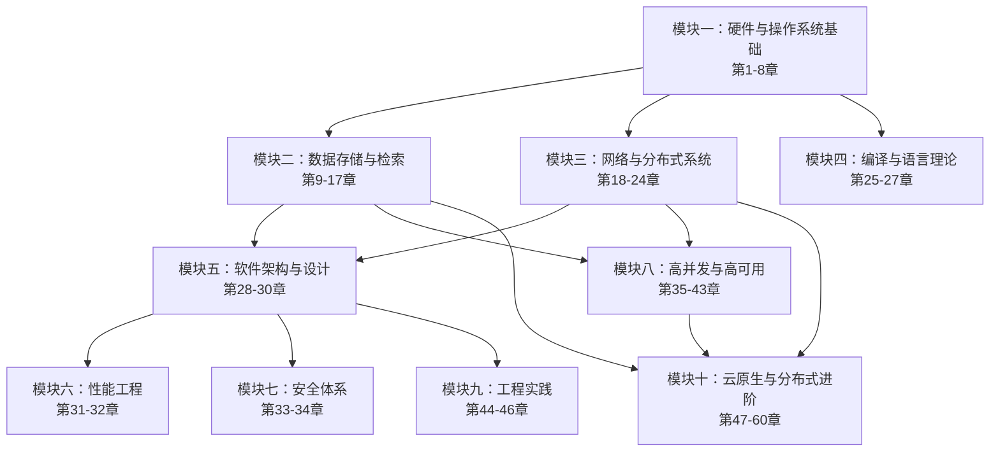
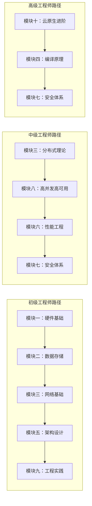

# 软件工程核心原理：从体系结构到系统内核

## 写在前面

本书试图回答一个根本性的问题：**一个现代软件系统，从底层硬件到上层应用，究竟是如何运作的？**

这个问题看似简单，却鲜有书籍能给出完整的答案。市面上的计算机科学教材，往往将硬件体系结构、操作系统、数据库、网络协议、分布式系统、软件架构等主题割裂开来，各自为政。读者学完每一门课程后，脑中留下的是零散的知识碎片——知道CPU有流水线，知道B+树可以做索引，知道Raft能实现共识，但很难将这些知识串联成一条完整的认知链条，更难以在面对真实系统时做出正确的设计决策。

本书的写作目标，就是填补这一空白。

### 本书的三个核心理念

**第一，原理是跨越技术栈的底层规律。** 技术的表象千变万化——今天流行微服务，明天可能转向Serverless；今年用Redis做缓存，明年可能换成Memcached或Dragonfly。但底层的原理是稳定的：CAP定理不会因为换了个框架就失效，B+树的平衡特性不会因为数据库版本升级而改变，TCP拥塞控制的基本逻辑也不会因为部署在云端而重构。掌握了这些原理，你就能迅速理解任何新技术的本质，而不是在技术浪潮中疲于追赶。

**第二，系统性认知远比碎片化知识更有价值。** 一个知道"Redis单线程模型为什么快"的工程师，和一个同时理解"CPU流水线→缓存一致性→无锁数据结构→事件驱动模型→Redis单线程架构"这条完整因果链的工程师，面对性能问题时的诊断速度和解决方案质量会有质的差异。本书追求的正是这种贯穿底层到上层的系统性认知。

**第三，理解"为什么"比记住"是什么"更重要。** 技术方案的选择从来不是非黑即白的。为什么MySQL在大多数场景下选择了B+树而不是LSM树？为什么Raft比Paxos更受欢迎？为什么微服务架构在某些场景下反而是过度设计？本书不仅告诉你答案，更带你理解答案背后的权衡逻辑——这是区分执行者和设计者的关键分界线。

### 这本书适合谁

**这不是一本入门书，也不是一本高级参考手册。** 它是一本面向有1-3年经验的软件工程师的**系统性认知升级指南**。如果你已经能写代码、能部署服务，但对"为什么系统会这样设计"、"出了问题该往哪里看"、"大规模场景下该怎么选型"这些问题还不够清晰，那么本书正是为你而写。

具体来说，以下几类读者会从本书中获得最大收益：

| 读者类型 | 典型困惑 | 本书如何帮助 |
|----------|----------|-------------|
| **初级工程师（1-2年）** | 知道怎么用框架，不知道框架内部发生了什么 | 从硬件到内核逐层拆解，建立完整的系统认知 |
| **中级工程师（2-5年）** | 遇到性能问题不知从何下手，对架构选型缺乏判断力 | 通过性能工程和架构设计模块，建立系统化的分析方法 |
| **后端开发转全栈** | 数据库和分布式知识薄弱，遇到复杂场景只能求助他人 | 模块二和模块八提供从存储到高并发的完整知识链 |
| **运维/SRE转开发** | 操作系统和内核知识扎实，但缺乏架构设计思维 | 从模块五的架构设计入手，快速补齐工程思维短板 |
| **技术管理者** | 需要理解技术决策的深层逻辑，而不是被"最佳实践"绑架 | 全书的权衡分析框架帮助你做出更合理的技术判断 |

### 本书的写作风格

本书遵循"**道→法→术→器**"的四层递进结构：

- **道（理论基础）**：每个模块都从核心原理出发，解释"为什么需要这项技术"、"它的设计哲学是什么"。理论不是空洞的说教，而是为后续的方法和实践提供认知锚点。
- **法（方法论）**：在理解原理之后，给出系统化的分析框架和设计方法。例如性能分析的USE方法论、架构评审的ATAM方法、安全评估的STRIDE模型。
- **术（核心技巧）**：针对每个主题给出具体的技术方案和工程实践。不是泛泛而谈"应该这样做"，而是展示"具体怎么做"，包括代码示例、配置参数、调优命令。
- **器（工具链）**：每个模块都推荐经过实践验证的工具和框架，并解释其适用场景和局限性。工具是手段而非目的，本书更注重帮你建立选择工具的判断力。

---

## 全书结构

全书共60章，分为10个专题模块，外加3个附录。每个模块围绕一个核心主题展开，章节之间存在明确的递进关系。下图展示了全书的知识体系和模块间依赖关系：

### 知识体系的纵向深度

从知识深度来看，本书呈现"**金字塔**"结构：

- **塔基（模块一~三）**：硬件、存储、网络——这些是所有软件系统的物理根基。不理解这些，上层的所有优化和设计都是空中楼阁。
- **塔身（模块四~九）**：编译原理、架构设计、性能工程、安全、高并发、工程实践——这些是软件工程的核心能力层。大部分工程师的职业瓶颈就卡在这一层。
- **塔尖（模块十）**：云原生与分布式进阶——这是大规模系统的核心挑战，也是高级工程师和架构师的分水岭。

---

## 模块一：硬件与操作系统基础（第1-8章）

**为什么从这里开始？**

所有软件最终都运行在硬件之上。不理解CPU如何执行指令、内存如何组织、IO如何流转，你就无法真正理解程序的性能瓶颈在哪里，也无法做出正确的技术选型。这一模块是全书的根基。

一个常见的误区是："我是应用层开发者，不需要了解底层硬件。"但当你遇到以下问题时，底层知识将决定你的诊断效率：

- **为什么我的程序跑得慢？** ——可能不是算法问题，而是缓存命中率低导致CPU在等待内存（第2章缓存层次）
- **为什么系统在高负载下突然卡死？** ——可能是上下文切换开销超过了有效计算（第4章进程调度）
- **为什么我的磁盘IO这么慢？** ——可能是文件系统的日志写入模式导致随机IO（第6章文件系统）

| 章节 | 主题 | 核心内容 |
|------|------|----------|
| 第01章 | CPU架构与执行模型 | 指令集架构（x86/ARM）、流水线、乱序执行、分支预测、缓存一致性（MESI）、SIMD向量化 |
| 第02章 | 内存系统 | SRAM/DRAM原理、缓存层次（L1/L2/L3）、TLB、内存带宽与延迟模型、NUMA架构 |
| 第03章 | IO系统 | 块设备与字符设备、DMA传输、中断机制（MSI-X）、NVMe协议、IO调度算法 |
| 第04章 | 进程与线程 | 进程模型、线程实现（用户态/内核态）、上下文切换、CFS调度器、实时调度（SCHED_FIFO/DEADLINE） |
| 第05章 | 内存管理 | 页表机制、虚拟内存、缺页处理、内存分配器（slab/buddy）、OOM Killer、透明大页（THP） |
| 第06章 | 文件系统 | VFS抽象层、ext4/XFS/Btrfs对比、日志机制、写时复制（CoW）、FUSE与用户态文件系统 |
| 第07章 | IO模型 | 阻塞/非阻塞IO、select/poll/epoll、io_uring、零拷贝（sendfile/splice）、Reactor与Proactor模式 |
| 第08章 | Linux内核源码分析 | 内核子系统架构、系统调用流程、内核模块机制、eBPF与可观测性、内核热补丁（kpatch/kGraft） |

**模块间的依赖关系**：第1-3章提供了硬件层面的基础知识；第4-7章在此基础上展开操作系统的核心机制；第8章将前面的理论知识与Linux内核的具体实现相结合，形成完整的认知闭环。

---

## 模块二：数据存储与检索（第9-17章）

**为什么数据存储如此重要？**

在绝大多数后端系统中，数据库是最核心的组件，也是最容易成为性能瓶颈的地方。理解存储引擎的内部实现，能帮助你写出更高效的查询、做出更合理的索引设计、在遇到数据库性能问题时快速定位根因。

数据存储是"道法术器"贯通的典型场景：从存储介质的物理特性（道），到索引结构的设计哲学（法），到具体的查询优化技巧（术），再到Redis、PostgreSQL等工具的选型（器），每一层都建立在上一层的理解之上。

| 章节 | 主题 | 核心内容 |
|------|------|----------|
| 第09章 | 存储介质 | HDD机械原理与磁道模型、SSD的FTL与磨损均衡、3D NAND、CXL内存扩展、持久化内存（PMEM） |
| 第10章 | 索引结构 | B+树、LSM树、跳表、哈希索引、位图索引、布隆过滤器、索引选择的权衡分析 |
| 第11章 | WAL与持久化 | 预写日志原理、WAL的性能影响、Group Commit优化、检查点机制、Redo/Undo Log的设计 |
| 第12章 | 缓存系统 | 缓存层次设计（L1/L2/L3/应用层）、LRU/LFU/ARC算法、Redis架构深度解析、缓存穿透/击穿/雪崩的防御策略 |
| 第13章 | 关系型数据库架构 | PostgreSQL/MySQL/SQLite架构对比、缓冲池管理、进程模型vs线程模型、MVCC实现细节 |
| 第14章 | 索引实现 | InnoDB聚簇索引、PostgreSQL的B-tree实现、GiST/SP-GiST/GIN索引、部分索引与表达式索引 |
| 第15章 | 事务与并发控制 | ACID语义、锁机制（行锁/间隙锁/意向锁）、MVCC的快照隔离、死锁检测与预防、2PL与SSI |
| 第16章 | 查询优化 | 查询解析与计划生成、基于代价的优化器（CBO）、连接算法（Nested Loop/Hash/Sort-Merge）、统计信息与直方图 |
| 第17章 | 分布式数据库 | CAP定理与PACELC、分片策略、Raft在分布式数据库中的应用、NewSQL架构（TiDB/CockroachDB/YugabyteDB） |

---

## 模块三：网络与分布式系统（第18-24章）

**网络是分布式系统的神经系统。**

从TCP的三次握手到分布式共识协议，这一模块覆盖了构建分布式系统所需的全部网络知识。理解这些内容，你才能设计出真正可靠的分布式系统。

网络知识的价值在于它连接了"单机"和"分布式"两个世界。第18-20章的网络协议栈是基础设施，第21-24章的分布式理论和系统则是建立在这些基础设施之上的高级抽象。一个不理解TCP拥塞控制的工程师，很难真正理解为什么分布式系统中的超时策略需要如此精细地设计。

| 章节 | 主题 | 核心内容 |
|------|------|----------|
| 第18章 | TCP/IP协议栈 | 以太网帧、IP路由与CIDR、TCP拥塞控制（Cubic/BBR）、TLS握手与证书链、QUIC协议 |
| 第19章 | 应用层协议 | HTTP/1.1到HTTP/3的演进、gRPC与Protocol Buffers、WebSocket、MQTT与IoT协议、协议设计原则 |
| 第20章 | 网络架构 | 负载均衡算法（轮询/加权/一致性哈希/L7）、CDN原理、DNS解析链路、网络分区与容错 |
| 第21章 | 分布式理论 | CAP/FLP不可能定理、一致性模型（强/最终/因果）、时钟（物理时钟/Lamport/向量时钟）、分布式事务模型（2PC/3PC/Saga） |
| 第22章 | 分布式共识 | Paxos深度解析、Raft协议全解（Leader Election/Log Replication/Safety）、Viewstamped Replication、PBFT |
| 第23章 | 分布式存储 | GFS/HDFS架构、Amazon Dynamo模型、一致性哈希与虚拟节点、纠删码与多副本策略、Ceph CRUSH算法 |
| 第24章 | 分布式计算 | MapReduce原理与局限、Spark RDD与DAG执行、Flink水印与窗口机制、流批一体架构、数据湖计算引擎 |

---

## 模块四：编译与语言理论（第25-27章）

**编译器是计算机科学中最精妙的工程之一。**

即使你不打算编写编译器，理解编译原理也能让你写出更高效的代码、更好地理解静态分析工具的工作原理、更深入地掌握正则表达式和SQL解析等日常工具的底层逻辑。

编译原理的价值往往被低估。实际上，正则表达式的回溯问题、SQL注入的防御原理、JVM的JIT编译优化、Rust的借用检查器——这些日常开发中频繁接触的概念，都植根于编译理论。理解编译原理，相当于获得了一把理解所有"语言处理"系统的万能钥匙。

| 章节 | 主题 | 核心内容 |
|------|------|----------|
| 第25章 | 编译器架构 | 传统编译器前端/中端/后端、LLVM IR与模块化设计、JIT编译（HotSpot C2/Graal）、AOT编译（GraalVM Native Image） |
| 第26章 | 词法与语法分析 | 有限自动机（DFA/NFA）、正则表达式引擎（Thompson/Backtracking）、递归下降与LL/LR解析、ANTLR实战 |
| 第27章 | 语义分析与优化 | 类型系统与类型推断、SSA中间表示、常量传播与死代码消除、循环优化（向量化/展开）、PGO配置文件导向优化 |

---

## 模块五：软件架构与设计（第28-30章）

**架构是软件工程的灵魂。**

好的架构让系统易于扩展、易于维护、易于演进；差的架构让团队陷入无尽的技术债务。这一模块帮助你建立系统的架构思维。

架构设计不是画框图，而是做决策。每一个架构决策都隐含着一组假设和权衡：选择微服务意味着接受分布式复杂性以换取独立部署的灵活性；选择事件驱动意味着接受最终一致性以换取解耦和可扩展性。本模块的核心目标不是教你"哪种架构最好"，而是教你"如何在特定约束下做出最合理的架构决策"。

| 章节 | 主题 | 核心内容 |
|------|------|----------|
| 第28章 | 架构风格 | 分层架构、微内核、事件驱动、微服务、Serverless、六边形架构、ADR决策记录、ATAM评审方法 |
| 第29章 | 设计模式 | 创建型（工厂/单例/建造者）、结构型（适配器/装饰器/代理）、行为型（策略/观察者/状态机）、GoF模式在现代框架中的应用 |
| 第30章 | 领域驱动设计 | 战略设计（限界上下文/上下文映射/聚合）、战术设计（实体/值对象/领域事件/仓储模式）、CQRS与Event Sourcing、DDD落地实践 |

---

## 模块六：性能工程（第31-32章）

**性能不是优化出来的，是设计出来的。**

性能工程不仅仅是调参和压测，更重要的是建立正确的性能思维——理解性能模型、掌握分析方法、形成优化直觉。

很多工程师一提到性能优化就想到"加缓存"、"加索引"、"异步化"，但真正有效的性能优化需要先回答三个问题：瓶颈在哪里（分析）、为什么是瓶颈（根因）、用什么方法解决（方案）。没有分析的优化是盲目的——你可能花了三天优化了一个只占2%耗时的模块，而真正的瓶颈被忽略了。

| 章节 | 主题 | 核心内容 |
|------|------|----------|
| 第31章 | 性能分析 | 性能指标体系（延迟/吞吐量/利用率/饱和度）、USE方法论、火焰图与perf/BPF工具链、Amdahl定律与排队论模型 |
| 第32章 | 性能优化 | 系统级优化（CPU亲和性/中断合并/大页）、应用级优化（内存池/无锁数据结构/SIMD）、JVM调优（GC选择/JIT编译）、基准测试方法论（JMH/WRK） |

---

## 模块七：安全体系（第33-34章）

**安全不是可选项，是必选项。**

在软件工程中，安全不是一个独立的模块，而是贯穿所有层次的关注点。这一模块帮助你建立安全思维，理解常见攻击的原理和防御手段。

安全的本质是**信任边界**的管理。每一个系统都有多个信任边界：用户与系统之间、服务与服务之间、应用与基础设施之间。所有安全问题都发生在信任边界的穿越点上。理解了这一点，你就能系统性地思考安全问题，而不是零散地"修补漏洞"。

| 章节 | 主题 | 核心内容 |
|------|------|----------|
| 第33章 | 密码学 | 对称加密（AES-GCM/ChaCha20）、非对称加密（RSA/ECC）、哈希函数与HMAC、密钥交换（DH/ECDH）、零知识证明入门 |
| 第34章 | 系统安全 | 认证与授权（OAuth2/OIDC/JWT）、常见漏洞（SQL注入/XSS/CSRF/SSRF）、容器安全（镜像扫描/运行时防护）、供应链攻击与SBOM |

---

## 模块八：高并发与高可用（第35-43章）

**这是本书最核心的实战模块。**

在互联网场景下，系统需要同时应对海量请求和硬件故障。这一模块覆盖了构建高并发、高可用系统所需的全部核心组件和技术。

为什么说这是最核心的模块？因为大部分工程师在职业生涯中遇到的最大挑战都集中在这里：双十一的流量洪峰、数据库的主从切换、微服务的级联故障、分布式事务的数据一致性——这些问题没有现成的标准答案，需要工程师在深入理解原理的基础上做出正确的判断和取舍。

| 章节 | 主题 | 核心内容 |
|------|------|----------|
| 第35章 | 消息队列 | Kafka架构（分区/副本/ISR）、RocketMQ事务消息、消息投递语义（At-Least-Once/Exactly-Once）、死信队列与消息回溯 |
| 第36章 | 高并发技术 | 限流算法（令牌桶/漏桶/Sentinel）、降级与熔断（Hystrix/Resilience4j）、异步化设计、热点数据解决方案 |
| 第37章 | 高可用架构 | 主从复制、哨兵模式、集群模式、脑裂问题与预防、SLA/SLO/SLI定义、故障演练（Chaos Engineering） |
| 第38章 | 存储服务 | 对象存储（S3/MinIO）、KV存储（etcd/Consul/ZooKeeper）、列式存储（Cassandra/HBase）、图数据库（Neo4j/TigerGraph） |
| 第39章 | 搜索引擎 | 倒排索引原理、Lucene核心概念、Elasticsearch集群架构、分词器与相关性评分、日志分析与APM场景 |
| 第40章 | 容器与编排 | Linux容器原理（namespace/cgroup）、Docker架构与镜像分层、Kubernetes核心概念（Pod/Service/Deployment）、Helm与Operator模式 |
| 第41章 | 服务治理 | 服务注册与发现、负载均衡策略、灰度发布与流量染色、链路追踪（OpenTelemetry）、服务依赖分析 |
| 第42章 | 监控与可观测性 | 三支柱（Metrics/Logs/Traces）、Prometheus+Grafana体系、ELK/Loki日志方案、告警策略与On-Call机制、SRE实践 |
| 第43章 | RPC框架 | gRPC全家桶（Unary/Server-Streaming/Bidirectional）、Thrift与Dubbo对比、服务端流控与客户端负载均衡、RPC框架的演进趋势 |

---

## 模块九：工程实践（第44-46章）

**代码写得再好，没有工程实践的保障也走不远。**

这一模块关注软件工程的"最后一公里"——从代码编写到测试验证，再到持续交付，确保软件质量的全链路可控。

很多团队的技术债务不是源于代码质量差，而是缺乏系统化的工程实践。没有自动化测试，每次发布都像在赌博；没有CI/CD，部署过程依赖"老员工的经验"；没有代码审查，设计缺陷在代码中生根发芽。本模块的目标是帮你建立一套可执行的工程实践体系。

| 章节 | 主题 | 核心内容 |
|------|------|----------|
| 第44章 | 数据结构与算法 | 时间复杂度分析、树与图算法、动态规划与贪心、排序算法选型、工程场景下的算法应用（LRU/布隆过滤器/跳表） |
| 第45章 | 软件测试 | 测试金字塔、单元测试（JUnit/Pytest）、集成测试策略、契约测试（Pact）、E2E测试（Playwright/Cypress）、测试驱动开发（TDD） |
| 第46章 | CI/CD | 持续集成原则、GitHub Actions/GitLab CI实战、构建优化（缓存/并行）、部署策略（蓝绿/金丝雀/滚动）、GitOps与ArgoCD |

---

## 模块十：云原生与分布式进阶（第47-60章）

**这一模块是全书的压轴部分，覆盖了分布式系统中最复杂、最具挑战性的主题。**

这些内容直接对应大规模互联网公司的核心技术栈，理解它们，你就具备了设计和运维大规模分布式系统的能力。

本模块的知识密度最高，建议在掌握前面模块的基础上再进入学习。每个章节都包含深度的技术分析和真实案例，适合有一定实战经验的工程师深入研读。

| 章节 | 主题 | 核心内容 |
|------|------|----------|
| 第47章 | 云原生架构 | CNCF全景图、12-Factor应用原则、可观测性三支柱深化、混沌工程实践、FinOps成本治理 |
| 第48章 | 序列化与编码 | JSON/Protobuf/Avro/Thrift对比、Schema演进策略、二进制协议设计、压缩算法选型、Protocol Buffers编码原理 |
| 第49章 | 连接池与资源管理 | 数据库连接池设计（HikariCP/Druid）、gRPC连接管理、限流与背压、资源泄漏检测与预防、优雅关闭 |
| 第50章 | 数据一致性 | 强一致性vs最终一致性、CRDT（无冲突复制数据类型）、版本向量与因果一致性、Saga事务模式、事件驱动一致性 |
| 第51章 | 读写分离与分库分表 | 读写分离架构、中间件选型（ShardingSphere/MyCat）、水平分片策略、数据迁移与双写、跨分片查询优化 |
| 第52章 | 故障转移与恢复 | 主从切换机制、数据复制延迟处理、脑裂预防（Fencing Token）、灾备架构（同城双活/异地多活）、故障恢复演练 |
| 第53章 | 多活架构 | 单元化架构设计、流量路由策略、数据同步（DTS/CDC）、多活一致性保障、全球多活案例分析 |
| 第54章 | 分布式锁 | Redis RedLock算法争议、ZooKeeper临时节点锁、etcd Lease锁、Fencing Token与锁安全性、锁的性能优化 |
| 第55章 | 分布式事务 | 2PC/3PC的工程限制、TCC补偿模式、Seata框架全景、事务消息方案、跨服务数据一致性最佳实践 |
| 第56章 | 配置中心 | 配置管理需求分析、Apollo/Nacos配置中心架构、配置变更推送机制、灰度发布与AB测试、配置安全（加密/审计） |
| 第57章 | API网关 | 网关职责与架构、Kong/Envoy/APISIX对比、限流熔断集成、插件开发模型、API版本管理与兼容性 |
| 第58章 | 服务网格 | Sidecar模式原理、Istio架构深度解析、流量管理与安全策略、可观测性增强、服务网格vs传统服务治理 |
| 第59章 | 实时计算 | 流处理架构（Lambda/Kappa）、Flink状态管理与Checkpoint、Exactly-Once语义实现、CEP复杂事件处理、实时数仓 |
| 第60章 | 数据湖与数据仓库 | 数据湖架构（Delta Lake/Iceberg/Hudi）、湖仓一体、OLAP引擎对比（ClickHouse/Doris/StarRocks）、数据治理与数据质量 |

---

## 附录

| 附录 | 内容 |
|------|------|
| 附录A | **推荐书籍与论文**——按模块分类，精选60+本经典著作和30+篇里程碑论文，附简要评述 |
| 附录B | **工具与环境搭建**——开发环境配置、常用工具链（Docker/Kubernetes/监控全家桶）、性能测试环境搭建 |
| 附录C | **术语表**——全书涉及的核心术语，中英对照，附简明释义 |

---

## 阅读建议

### 前置知识

本书假设读者具备以下基础：

| 知识领域 | 最低要求 | 自查方式 |
|----------|----------|----------|
| **编程基础** | 至少掌握一门编程语言（Java/Go/C++/Python均可），能读懂代码示例 | 能独立完成一个带CRUD的Web应用 |
| **Linux基础** | 能使用命令行工具，了解基本的文件操作和进程概念 | 能用`ps`、`grep`、`netstat`排查简单问题 |
| **网络基础** | 理解HTTP请求/响应模型，知道IP和端口的概念 | 能用`curl`调试API接口 |
| **数据结构基础** | 了解数组、链表、哈希表、树等基本数据结构 | 能解释哈希表的冲突解决策略 |

如果你在某些领域基础较弱，可以在阅读对应模块时先参考附录A中的推荐书目进行补充。

### 知识储备自测

在开始阅读之前，建议快速浏览以下问题，评估自己在各领域的基础水平。能回答"是"的问题越多，说明该领域的基础越扎实；回答"否"越多，说明需要优先阅读对应模块。

| 领域 | 自测问题 |
|------|----------|
| 硬件与操作系统 | 我能解释CPU缓存命中率对程序性能的影响吗？ |
| 硬件与操作系统 | 我理解虚拟内存和页表的基本工作机制吗？ |
| 数据存储 | 我能区分B+树和LSM树的适用场景吗？ |
| 数据存储 | 我理解MVCC的工作原理和它解决什么问题吗？ |
| 网络 | 我能解释TCP三次握手和四次挥手的必要性吗？ |
| 网络 | 我理解DNS解析的完整链路吗？ |
| 分布式系统 | 我能解释CAP定理的含义及其实际影响吗？ |
| 架构设计 | 我能说出至少三种架构风格及其适用场景吗？ |
| 性能工程 | 我能使用性能分析工具定位CPU或内存瓶颈吗？ |
| 高并发 | 我理解限流算法（令牌桶/漏桶）的区别和适用场景吗？ |

### 推荐阅读路径

不同背景的读者，可以根据自己的需求选择不同的阅读路径：

| 读者类型 | 推荐路径 | 说明 |
|----------|----------|------|
| **初级工程师（1-2年）** | 模块一→模块二→模块三→模块五→模块九 | 先打好硬件和系统基础，再理解架构设计和工程实践 |
| **中级工程师（2-5年）** | 模块三（理论部分）→模块八→模块六→模块七→模块十 | 重点攻克分布式系统和高并发实战，补齐性能和安全短板 |
| **高级工程师/架构师** | 模块十→模块四→模块七→按需回溯 | 重点关注云原生进阶和分布式深度主题，按实际需要回顾基础模块 |
| **后端开发（补课型）** | 模块二→模块八→模块六→模块十 | 重点补数据库、消息队列、高并发和云原生的知识缺口 |
| **运维/SRE转开发** | 模块五→模块八→模块十→模块九 | 从架构思维入手，重点理解服务治理、监控和工程实践 |

### 阅读方法

1. **先通读核心问题**：每章开头列出的核心问题，是你阅读该章的"导航仪"。带着问题阅读，效率最高。

2. **重视知识图谱**：每章的知识图谱展示了该章内容的结构关系。阅读前先浏览图谱，建立全局认知；阅读后回顾图谱，巩固记忆。

3. **动手实践**：本书虽然以理论分析为主，但每个模块都包含可操作的代码示例和工具推荐。建议边读边动手验证，效果远胜于纯粹的文字阅读。具体来说：
   - **模块一~二**：用`perf`分析一个真实程序的CPU缓存命中率，用`sysbench`测试不同索引结构的性能差异
   - **模块三**：用`tcpdump`抓包分析TCP握手过程，用`wrk`压测HTTP服务观察不同协议版本的性能差异
   - **模块五~九**：在个人项目中尝试一种新的架构风格或设计模式，在测试环境中用JMeter验证限流策略的效果

4. **建立联系**：不同模块之间存在大量交叉引用。当你在第50章读到数据一致性时，回想第15章的事务并发控制和第21章的CAP定理，你会发现知识在不断强化和深化。

5. **反复迭代**：这本书不需要（也不建议）从头到尾线性阅读。第一遍快速浏览，建立全局认知；第二遍精读感兴趣的模块；第三遍带着实际工作中的问题回来查阅。

6. **输出倒逼输入**：每学完一个模块，尝试用自己的话解释给同事听，或者写一篇技术博客。如果你能清晰地解释给别人听，说明你真正理解了。

---

## 本章的定位

作为全书的总索引，本章是你在阅读过程中的"地图"。当你迷失在某个具体章节的技术细节中时，回到这里，重新审视全书的结构和脉络，你会发现——**所有的技术细节，都服务于一个共同的目标：构建可靠、高效、可演进的软件系统**。

这也是本书书名"软件工程核心原理"的真正含义：**原理是跨越具体技术栈的底层规律**。掌握了这些原理，无论技术如何演进，你都能迅速理解新事物的本质，在纷繁复杂的技术世界中保持清醒的判断力。
