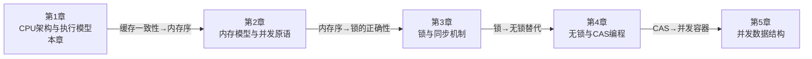

# 第01章 CPU架构与执行模型 — 章节概览

## 本章定位

本章是整本"软件工程核心原理"的基石。无论你后续做并发编程、性能调优还是系统设计，所有决策的底层依据都指向同一个地方：**CPU是如何执行你的代码的**。

很多开发者写代码时把CPU当作一个"黑箱"——输入指令，等待结果。但当你面对以下场景时，这种黑箱思维会成为瓶颈：

- 同样的算法，为什么别人跑得比你快10倍？
- 多线程程序加了核数反而变慢，哪里出了问题？
- perf报告里L1 cache miss飙升，该怎么改代码？
- 分支预测失败率30%，对性能到底有多大影响？

这些问题的答案全部藏在CPU的微架构里。本章的目标不是让你成为硬件工程师，而是让你**拥有从晶体管到源码的完整心智模型**——看到一行C代码，能直觉地想象出它在CPU内部经历的每一步。

## 本章将回答的核心问题

| 问题 | 对应章节 | 为什么重要 |
|------|----------|------------|
| 一条指令从内存到执行完毕，经历了什么？ | 01-理论基础 (ISA与流水线) | 理解指令生命周期是所有优化的前提 |
| 为什么CPU要"乱序执行"？这不会出错吗？ | 01-理论基础 (乱序执行) | 理解现代CPU性能来源和内存序语义 |
| 分支预测失败到底损失多少性能？ | 01-理论基础 (分支预测) | 指导分支友好的代码编写风格 |
| 缓存命中和未命中的差距有多大？ | 01-理论基础 (缓存层次) | 缓存友好代码的理论依据 |
| 多核之间如何保证数据一致性？ | 01-理论基础 (缓存一致性) | 理解锁、原子操作、伪共享的硬件根源 |
| 如何用perf工具量化这些问题？ | 02-核心技巧 (perf) | 从理论到可观测的性能数据 |
| 如何写出缓存友好的代码？ | 02-核心技巧 (缓存优化) | 数据布局与访问模式的实战指南 |
| SIMD向量化能带来多大加速？ | 02-核心技巧 (SIMD编程) | 掌握数据级并行编程 |
| 矩阵乘法从10倍到100倍加速是怎么做到的？ | 03-实战案例 | 体验从朴素到极致优化的完整路径 |
| 多核一定更快吗？什么情况下反而更慢？ | 04-常见误区 | 避免盲目加核的性能陷阱 |

## 知识体系全景图

下面的图展示了本章所有知识点之间的依赖关系和学习路径。箭头表示"学了A才能理解B"：

```mermaid
graph TD
    subgraph 第一阶段：硬件基础
        ISA["1.1 ISA指令集架构<br/>x86-64 / ARM64"]
        Pipeline["1.2 流水线技术<br/>五级流水线 → 超标量"]
    end

    subgraph 第二阶段：执行机制
        Hazard["1.3 流水线冒险<br/>数据/控制/结构冒险"]
        OOO["1.4 乱序执行<br/>Tomasulo + ROB"]
        BP["1.5 分支预测<br/>BTB/BHT/TAGE"]
    end

    subgraph 第三阶段：存储层次
        Cache["1.6 缓存层次<br/>L1/L2/L3 + TLB"]
        Coherency["1.7 缓存一致性<br/>MESI/MOESI协议"]
        FalseShare["1.8 伪共享<br/>跨核缓存行争用"]
    end

    subgraph 第四阶段：优化实践
        Perf["2.1 perf工具<br/>硬件计数器"]
        CacheOpt["2.2 缓存友好编程<br/>数据布局与预取"]
        BPOpt["2.3 分支优化<br/>避免不可预测分支"]
        SIMD["2.4 SIMD向量化<br/>SSE/AVX"]
        CoherencyFix["2.5 伪共享修复<br/>对齐与填充"]
    end

    ISA --> Pipeline
    Pipeline --> Hazard
    Hazard --> OOO
    BP --> OOO
    Cache --> Coherency
    Coherency --> FalseShare
    OOO --> Cache

    Cache --> Perf
    Cache --> CacheOpt
    BP --> BPOpt
    Cache --> SIMD
    FalseShare --> CoherencyFix

    style 第一阶段 fill:#e8f4fd,stroke:#2196F3
    style 第二阶段 fill:#fff3e0,stroke:#FF9800
    style 第三阶段 fill:#e8f5e9,stroke:#4CAF50
    style 第四阶段 fill:#fce4ec,stroke:#E91E63
```

## 学习目标

完成本章后，你将具备以下能力：

### 理论层面（知道"为什么"）

1. **完整描述一条指令的生命周期**：从程序计数器指向的内存地址，经过取指（Fetch）、译码（Decode）、执行（Execute）、访存（Memory）、写回（Write Back）五个阶段，理解每个阶段的具体硬件操作
2. **解释流水线加速的本质**：为什么10级流水线比5级快？为什么流水线不能无限加深？理解CPI（Cycles Per Instruction）与吞吐量的关系
3. **区分三类流水线冒险**：数据冒险（RAW/WAR/WAW）、控制冒险（分支误预测）、结构冒险（资源冲突），并能说出每种冒险对应的硬件解决方案
4. **理解乱序执行的必要性**：为什么顺序执行浪费了大量执行单元？Tomasulo算法如何通过保留站实现动态调度？ROB如何保证精确异常？
5. **量化分支预测的性能影响**：一个预测失败的代价是多少个时钟周期？为什么现代分支预测器（TAGE）能达到99%的准确率？
6. **理解缓存层次的设计逻辑**：L1的1ns延迟 vs 主存的100ns延迟意味着什么？为什么缓存行大小是64字节而非1字节？
7. **解释MESI协议的四个状态**：Modified、Exclusive、Shared、Invalid各代表什么含义？状态之间如何转换？为什么需要写失效（Write-Invalidate）？

### 实践层面（知道"怎么做"）

1. **使用perf工具量化CPU行为**：读取L1 dcache load misses、branch-misses、LLC-load-misses等关键硬件计数器
2. **编写缓存友好的代码**：将行优先遍历改为列优先、使用struct-of-arrays替代array-of-structs、合理利用预取指令
3. **消除不可预测分支**：用查表法、位运算、无分支排序替代if-else
4. **编写基本的SIMD代码**：使用`_mm256_*`系列内建函数完成浮点向量化加法和乘法
5. **诊断并修复伪共享**：通过perf c2c定位false sharing，使用`alignas(64)`进行缓存行对齐

### 思维层面（形成"直觉"）

1. **看到数据结构就能判断缓存友好性**：链表 vs 数组、树 vs 哈希表的缓存行为差异
2. **看到分支就能评估预测难度**：排序后数据的分支比未排序的更容易预测
3. **看到多线程就能识别伪共享风险**：多个频繁写入的变量落在同一缓存行

## 前置知识

本章假设你具备以下基础。如果某些领域不熟悉，建议先补课再学习：

| 知识领域 | 要求程度 | 具体内容 | 补课建议 |
|----------|----------|----------|----------|
| C/C++编程 | 熟练 | 指针操作、结构体内存布局、内联汇编基础 | K&R《C程序设计语言》前8章 |
| 数据结构 | 基础 | 数组、链表、栈、队列、二叉树的基本概念 | 任意算法教材前三章 |
| 数字逻辑 | 了解 | 门电路（AND/OR/NOT）、触发器、时钟信号的基本概念 | 可参考《编码》第14-17章 |
| Linux操作 | 基础 | 命令行操作、gcc/g++编译、make工具使用 | 不需要精通，跟着案例操作即可 |
| 操作系统 | 了解 | 进程与线程的区别、虚拟内存的基本概念 | 可参考《操作系统导论》前三章 |

> **提示**：前置知识的"了解"级别意味着你只需要有印象即可，本章会在需要时做必要的补充说明。"熟练"级别则建议确实掌握，否则学习过程中会频繁卡壳。

## 内容导航

### 第一阶段：理论基础（建立心智模型）

| 文件 | 主题 | 核心内容 | 建议时长 |
|------|------|----------|----------|
| 01-ISA与指令集架构 | CPU的语言 | CISC vs RISC对比，x86-64寄存器模型，指令编码格式，寻址模式 | 1.5小时 |
| 02-流水线技术 | 指令的工厂流水线 | 五级流水线详解，CPI计算，超流水线与超标量，流水线深度与频率的关系 | 1.5小时 |
| 03-乱序执行 | 打破顺序的束缚 | Tomasulo算法（保留站+寄存器重命名），ROB保证精确异常，重排序缓冲区 | 1.5小时 |
| 04-分支预测 | 猜测的艺术 | 静态/动态预测，BHT/BTB/TAGE预测器，分支目标缓冲，预测失败代价 | 1小时 |
| 05-缓存层次 | 填补速度鸿沟 | 局部性原理（时间/空间），L1/L2/L3参数对比，TLB与虚拟地址翻译，预取机制 | 1.5小时 |
| 06-缓存一致性 | 多核的协调机制 | MESI/MOESI协议状态机，写失效vs写更新，总线监听与目录协议，互联开销 | 1小时 |
| 07-超线程与SIMD | 并行的两个维度 | SMT超线程原理（资源共享），SIMD数据级并行（SSE/AVX指令族），向量宽度与吞吐量 | 1小时 |

### 第二阶段：核心技巧（掌握优化手段）

| 文件 | 主题 | 核心内容 | 建议时长 |
|------|------|----------|----------|
| 01-perf分析CPU行为 | 性能度量的瑞士军刀 | perf stat/record/report，硬件计数器解读，火焰图，PMU事件 | 1小时 |
| 02-缓存友好编程 | 让数据为CPU服务 | 数据布局优化，遍历顺序调整，prefetch指令，避免缓存抖动 | 1小时 |
| 03-分支优化技巧 | 消除不可预测路径 | 条件移动替代分支，查表法，位运算技巧，__builtin_expect | 0.5小时 |
| 04-SIMD向量化编程 | 一次处理8个浮点 | 内建函数，自动向量化，手动向量化，对齐要求，掩码操作 | 1小时 |
| 05-伪共享检测与修复 | 消除隐形性能杀手 | perf c2c定位，alignas(64)填充，padding设计，实战验证 | 0.5小时 |
| 06-编译器优化选项 | 让编译器帮你想 | -O0/-O1/-O2/-O3/-Ofast区别，PGO，LTO，向量化报告 | 0.5小时 |

### 第三阶段：实战案例（从理论到代码）

| 文件 | 主题 | 核心内容 | 建议时长 |
|------|------|----------|----------|
| 01-矩阵乘法优化 | 从10倍到100倍加速 | 朴素实现 → 循环展开 → 分块优化 → SIMD向量化 → 多线程，每步perf数据对比 | 1.5小时 |
| 02-分支预测优化 | 一条if带来的5倍差距 | 排序前后的分支预测差异，无分支实现，perf实测数据 | 0.5小时 |
| 03-伪共享排查 | 多核为什么变慢了 | 从perf报告中发现伪共享，定位缓存行冲突，修复后的性能提升 | 0.5小时 |
| 04-perf定位CPU热点 | 精准找到瓶颈 | perf record + 火焰图分析，符号解析，热点函数定位 | 0.5小时 |

### 第四阶段：反思与巩固

| 文件 | 主题 | 核心内容 | 建议时长 |
|------|------|----------|----------|
| 04-常见误区 | 那些你可能踩过的坑 | "多核一定快"、"O3一定更好"、"缓存不重要"等典型误区深度剖析 | 1小时 |
| 05-练习方法 | 动手才能真正理解 | 硬件计数器实验、缓存行实验、SIMD基准测试、分支预测实验，含完整代码 | 4-6小时 |
| 06-本章小结 | 知识脉络梳理 | 关键公式汇总、核心概念图谱、速查表、延伸阅读 | 0.5小时 |

## 预计学习时间

| 阶段 | 内容 | 预计时间 | 说明 |
|------|------|----------|------|
| 理论基础 | 7个小节 | 9-10小时 | 这是本章最厚的部分，建议精读并动手画状态转换图 |
| 核心技巧 | 6个小节 | 4-5小时 | 每个技巧都要在Linux环境下动手实践 |
| 实战案例 | 4个案例 | 3-4小时 | 跟着案例操作，修改参数观察perf数据变化 |
| 反思巩固 | 3个小节 | 5-7小时 | 练习方法是投入时间最多的部分，但也是收获最大的 |
| **总计** | **20个小节** | **21-26小时** | **建议分4-6天完成，每天3-4小时** |

> **学习建议**：不要试图一次性从头读到尾。建议的节奏是：先读理论基础的前两节（ISA+流水线），建立基本框架后，再按需深入后续内容。理论和技巧可以交替学习——学完"缓存层次"理论后立刻学"缓存友好编程"技巧，趁热打铁效果最好。

## 本章在整个知识体系中的位置



第1章建立的CPU微架构知识将直接服务于后续所有章节：

- **缓存层次与一致性** → 第2章内存模型的硬件基础
- **乱序执行与重排序** → 第2章理解为什么需要内存屏障
- **原子操作的硬件实现** → 第3章锁机制和第4章CAS编程的底层原理
- **缓存行大小** → 第5章并发数据结构的填充与对齐策略

跳过本章直接学后面的章节，就像不学乐理直接弹爵士——可能能模仿，但遇到问题时无法从根本上理解原因。

## 学习方法建议

### 有效的学习方式

1. **边读边画**：每学完一个硬件机制，在纸上画出数据流和状态转换图。画图的过程就是理解的过程
2. **立即验证**：学完一个概念后，用perf工具在你的机器上实测。理论说L1 miss代价是5个周期，你的机器上是多少？
3. **对比实验**：矩阵乘法案例中，每一步优化后都用perf对比数据。亲眼看到数字变化比看结论有效10倍
4. **费曼技巧**：尝试向一个不了解CPU的人解释"什么是流水线冒险"。如果解释不清楚，说明你还没真正理解

### 避免的学习方式

1. **不要只看不练**：CPU微架构是"做出来"的知识，不是"看出来"的
2. **不要跳过理论直接看案例**：没有理论基础的案例只是抄代码，换个场景就不知道怎么优化
3. **不要追求一次性全懂**：某些概念（如Tomasulo算法）需要反复琢磨，第一遍能理解60%就是正常的

## 本章核心公式速查

在后续学习中，以下公式会反复出现，建议在学习过程中逐步记忆：

| 公式 | 含义 | 应用场景 |
|------|------|----------|
| CPU时间 = 指令数 × CPI × 时钟周期 | 程序执行时间的基本分解 | 理解优化的三个方向：减少指令数、降低CPI、提高频率 |
| CPI = 1 / IPC | 每条指令的平均周期数 | 衡量流水线效率 |
| 加速比 = 旧时间 / 新时间 | 优化带来的性能提升倍数 | 评估优化效果 |
| Amdahl定律：加速比 = 1 / (S + P/N) | 并行化的理论上限 | 理解为什么单线程优化仍然重要 |
| 缓存命中率 = 命中次数 / 总访问次数 | 缓存效率度量 | 指导数据结构和访问模式选择 |
| 缓存访问时间：L1 ≈ 1ns, L2 ≈ 3-5ns, L3 ≈ 10-20ns, 主存 ≈ 100ns | 各级存储的延迟差距 | 理解为什么一次L1 miss相当于浪费数十个CPU周期 |

## 延伸阅读

如果你想在本章基础上进一步深入CPU微架构的世界：

- **入门**：《计算机组成与设计：硬件/软件接口》（Patterson & Hennessy）— RISC-V版更现代
- **进阶**：《计算机体系结构：量化研究方法》（Hennessy & Patterson）— 性能分析的经典之作
- **实践**：Intel 64 and IA-32 Architectures Optimization Reference Manual — 官方优化手册
- **在线**：[Agner Fog的优化手册](https://www.agner.org/optimize/) — 极其详尽的微架构分析
- **论文**：D. A. Jiménez and C. Lin, "Dynamic Branch Prediction with Perceptrons"（2001）— 现代分支预测器的里程碑
