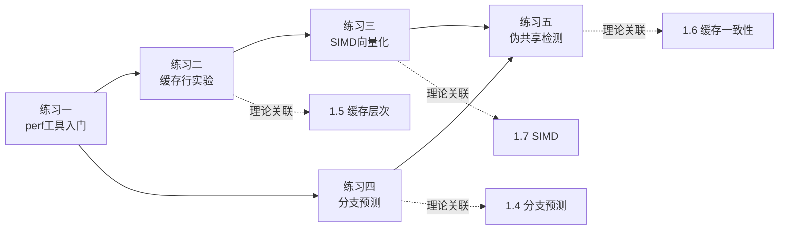
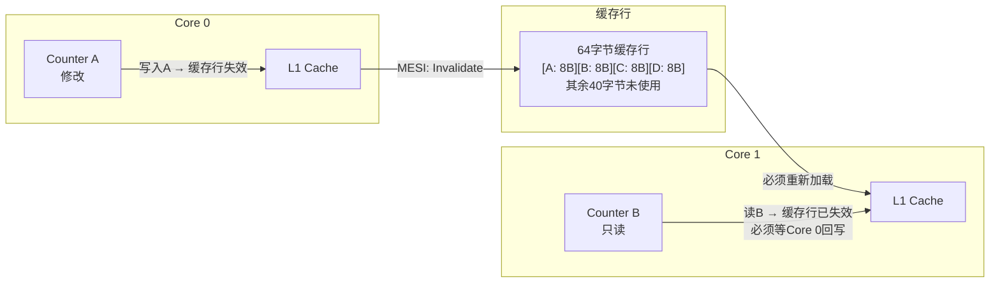
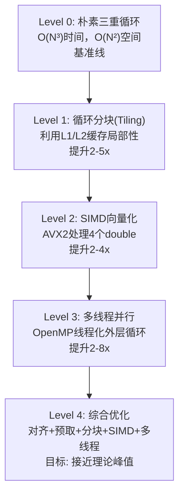
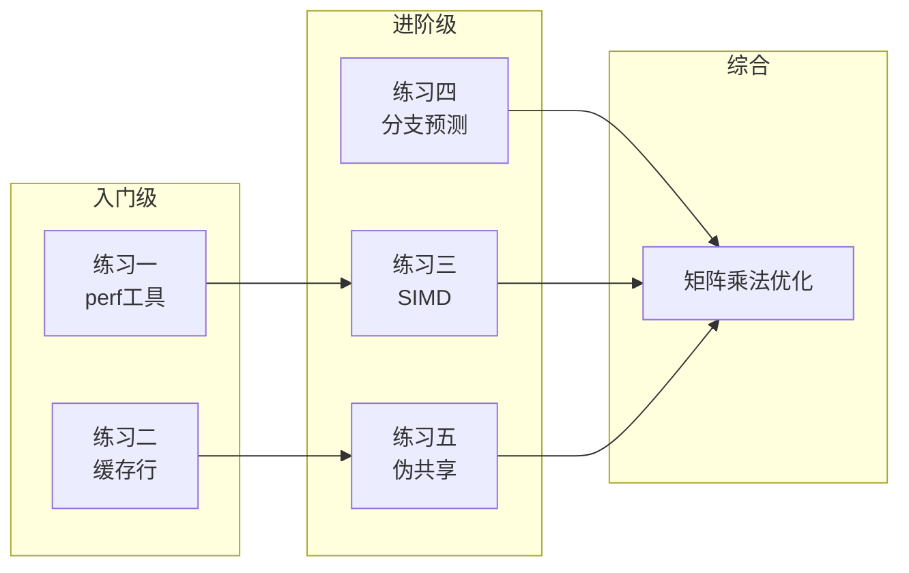

# 第01章 练习方法：CPU架构实战练习

## 为什么动手练习不可或缺

理解CPU架构理论是一回事，真正建立对CPU行为的直觉是另一回事。本章的五个练习构成了一个**渐进式的实验体系**——从单个指标的观测，到跨层面的性能诊断，最终到多核并发问题的定位与修复。每个练习都对应本章前面章节的核心理论：



## 实验环境准备

在开始任何练习之前，确认你的环境满足以下条件：

| 项目 | 要求 | 检查命令 |
|------|------|----------|
| 操作系统 | Linux（Ubuntu 20.04+） | `uname -a` |
| CPU | 支持AVX2指令集 | `grep avx2 /proc/cpuinfo` |
| 编译器 | GCC 9+ 或 Clang 10+ | `gcc --version` |
| perf | Linux perf工具 | `perf --version` |
| 权限 | sudo权限（perf需要） | `sudo echo ok` |
| 内存 | 至少4GB（缓存实验需要） | `free -h` |

**常见环境问题排查：**

- **`perf`提示"kernel.perf_event_paranoid"**：执行 `sudo sysctl -w kernel.perf_event_paranoid=-1` 临时放行，或写入 `/etc/sysctl.conf` 永久生效。
- **`grep avx2`无输出**：说明CPU不支持AVX2，练习三需改用SSE4.2（将`__m256`改为`__m128`，`_mm256_*`改为`_mm_*`，每次处理4个float）。
- **编译报`aligned_alloc`未定义**：加 `-std=c11` 标志，或替换为 `posix_memalign`。

## 练习一：perf工具入门（入门级）

> **对应理论**：1.1 ISA指令集架构、1.2 流水线技术
> **前置知识**：了解C语言编译流程、基本的Linux命令行操作

### 实验目标

学会使用Linux perf工具量化程序的CPU行为，理解四个核心性能指标：

| 指标 | 含义 | 计算方式 | 健康值参考 |
|------|------|----------|------------|
| IPC (Instructions Per Cycle) | 每个时钟周期执行的指令数 | instructions / cycles | 现代超标量CPU: 1.0-3.0 |
| 缓存未命中率 | L1数据缓存访问未命中比例 | cache-misses / cache-references | < 5% 为良好 |
| 分支预测错误率 | 分支预测失败比例 | branch-misses / branch-instructions | < 3% 为良好 |
| CPI (Cycles Per Instruction) | 执行一条指令需要的周期数 | cycles / instructions | IPC的倒数，< 1.0 为良好 |

**为什么这些指标重要？** 因为CPU的性能可以用一个简单公式表达：

执行时间 = 指令数 × CPI × 时钟周期

三个因子分别对应：程序写了多少指令（算法复杂度）、每条指令的效率（CPI）、CPU跑多快（频率）。perf让你能精确测量CPI及其分解，从而知道瓶颈在哪。

### 实验步骤

**第一步：编写测试程序**

这个程序故意制造一个**随机数据条件分支**，使得分支预测器无法有效预测——这是后续练习四的基础对照组。

```c
// test_perf.c — perf工具入门测试程序
#include <stdio.h>
#include <stdlib.h>
#include <time.h>

#define N 10000000  // 1000万元素

int main() {
    // 分配并初始化随机数据
    int *data = malloc(N * sizeof(int));
    if (!data) {
        perror("malloc");
        return 1;
    }

    srand(time(NULL));
    for (int i = 0; i < N; i++)
        data[i] = rand() % 256;  // 0-255的随机值

    // 条件累加：>= 128的元素被累加
    long long sum = 0;
    for (int i = 0; i < N; i++) {
        if (data[i] >= 128)  // 50%概率命中，分支预测器无法有效预测
            sum += data[i];
    }

    printf("Sum: %lld\n", sum);
    free(data);
    return 0;
}
```

**关键设计意图：** `rand() % 256` 生成的均匀分布使得约50%的数据 >= 128。对分支预测器来说，50/50的跳转概率是最难预测的场景——每次预测错误都要丢弃流水线中已执行的十几到几十条指令，代价巨大。

**第二步：编译并运行基础测量**

```bash
# 编译（-O2启用优化但保留可读性，-g保留调试符号供perf使用）
gcc -O2 -g test_perf.c -o test_perf

# 运行perf stat，测量四个核心指标
perf stat -e cycles,instructions,cache-misses,cache-references,\
branch-misses,branch-instructions,L1-dcache-load-misses \
./test_perf
```

**你将看到类似这样的输出：**

 Performance counter stats for './test_perf':

   5,234,567,891      cycles
   6,123,456,789      instructions    #    1.17  insn per cycle
         89,012      cache-misses     #    2.31% of all cache refs
       3,852,341      cache-references
     168,234,567      branch-misses   #   50.12% of all branches
     335,678,901      branch-instructions
       1,234,567      L1-dcache-load-misses

     1.234567891 seconds time elapsed

**逐指标解读：**

- **IPC = 6,123,456,789 / 5,234,567,891 ≈ 1.17**：每个时钟周期执行1.17条指令。对于包含分支的简单循环，这个值偏低——因为分支预测失败导致流水线频繁冲刷。
- **缓存未命中率 = 89,012 / 3,852,341 ≈ 2.3%**：非常低，因为数组是顺序访问的，空间局部性良好，硬件预取器能有效工作。
- **分支预测错误率 = 168,234,567 / 335,678,901 ≈ 50%**：接近随机猜测的上限（50%），说明分支预测器完全无法预测这条分支的方向。

**第三步：记录热点函数**

```bash
# 记录完整的调用栈和指令级采样
perf record -g -e cycles:u ./test_perf
# -g 记录调用图（call graph）
# :u 只统计用户态（排除内核开销）

# 查看报告（交互式TUI界面）
perf report
```

在perf report界面中：
- 按 `+` 展开调用栈，看到 `main` 函数占了100%的cycles
- 按 `a` 对热点函数做annotation，可以看到每条指令的采样数占比
- 关注 `if (data[i] >= 128)` 附近的条件跳转指令（如 `jge`），它的采样数会异常高——这就是分支预测失败的直接证据

### 检查标准

- [ ] 能够成功运行 `perf stat` 并正确读出每个指标的数值
- [ ] 能够手动计算 IPC、缓存未命中率、分支预测错误率，并解释其含义
- [ ] 能够使用 `perf record` + `perf report` 定位到 `main` 函数是唯一热点
- [ ] 在 perf annotation 中观察到条件跳转指令的高采样数

### 常见错误与排查

| 现象 | 原因 | 解决方案 |
|------|------|----------|
| perf stat提示"Permission denied" | perf_event_paranoid限制 | `sudo sysctl -w kernel.perf_event_paranoid=-1` |
| IPC > 4.0（异常高） | 编译器过度优化（如循环展开） | 降低优化等级：`gcc -O1` |
| cache-misses显示为0 | 采样频率不足 | 加 `--scale` 或使用 `-e` 显式指定事件 |
| perf report显示"no symbols" | 编译时缺少 `-g` | 重新编译加上 `-g` 选项 |

---

## 练习二：缓存行实验（入门级）

> **对应理论**：1.5 缓存层次、1.8 数据局部性原理
> **前置知识**：了解L1/L2/L3缓存的层级关系

### 实验目标

通过改变内存访问步长（stride），量化观察缓存行（cache line）对性能的决定性影响。核心预期：

| 步长 | 访问的缓存行数 | 性能预期 | 原因 |
|------|---------------|----------|------|
| 1字节 | SIZE / 64 | 最快 | 每次访问利用整条缓存行（64字节） |
| 64字节 | SIZE / 64 | 较快 | 恰好跳到下一条缓存行，但浪费预取 |
| 128字节 | SIZE / 64 | 较慢 | 隔一条缓存行访问，预取效率下降 |
| 4096字节 | SIZE / 64 | 最慢 | 每次访问新页面，TLB压力剧增 |

**理论背景：** 现代CPU的L1数据缓存以**缓存行**为单位加载数据，典型的缓存行大小为64字节（Intel/AMD x86-64）。当CPU读取 `array[i]` 时，硬件会把 `array[i]` 所在的整条缓存行（64字节）都加载到L1中。如果后续访问 `array[i+1]` 到 `array[i+63]`，这些数据已经在缓存中了——这就是**空间局部性**的威力。

### 实验步骤

**第一步：编写步长扫描实验**

这个程序遍历一个64MB数组，分别以不同步长访问，测量每种步长的耗时：

```c
// cache_line.c — 缓存行步长实验
#include <stdio.h>
#include <stdlib.h>
#include <time.h>

#define SIZE (64 * 1024 * 1024)  // 64MB，远大于L3缓存

static double elapsed_ms(struct timespec *start, struct timespec *end) {
    return (end->tv_sec - start->tv_sec) * 1000.0
         + (end->tv_nsec - start->tv_nsec) / 1e6;
}

int main() {
    // 使用大页或至少确保不在栈上（避免栈空间限制）
    char *array = malloc(SIZE);
    if (!array) {
        perror("malloc");
        return 1;
    }

    // 初始化：确保所有页面都被映射（避免按需分页影响计时）
    for (long i = 0; i < SIZE; i += 4096)
        array[i] = 1;

    int strides[] = {1, 2, 4, 8, 16, 32, 64, 128, 256, 512, 1024, 2048, 4096};
    int num_strides = sizeof(strides) / sizeof(strides[0]);

    printf("%-10s %12s %12s\n", "Stride(B)", "Time(ms)", "Effective BW");
    printf("%-10s %12s %12s\n", "----------", "----------", "-----------");

    for (int s = 0; s < num_strides; s++) {
        int stride = strides[s];
        // 每次实验访问相同总字节数，保证公平性
        long accesses = SIZE / stride;

        // 两轮运行取较快值（减少操作系统调度抖动的影响）
        double best_ms = 1e9;
        for (int trial = 0; trial < 3; trial++) {
            struct timespec start, end;
            clock_gettime(CLOCK_MONOTONIC, &amp;start);

            volatile long sum = 0;  // volatile防止编译器优化掉整个循环
            for (long i = 0; i < SIZE; i += stride) {
                sum += array[i];
            }

            clock_gettime(CLOCK_MONOTONIC, &amp;end);
            double ms = elapsed_ms(&amp;start, &amp;end);
            if (ms < best_ms) best_ms = ms;
        }

        double bw_gbps = (double)SIZE / (best_ms / 1000.0) / (1024.0 * 1024.0 * 1024.0);
        printf("%-10d %12.3f %10.2f GB/s\n", stride, best_ms, bw_gbps);
    }

    free(array);
    return 0;
}
```

**代码设计要点解析：**

- `volatile long sum`：防止编译器将整个循环优化为 `sum = 0`（因为结果未使用）。volatile强制编译器每次都真正读取 `array[i]`。
- 三次运行取最小值：操作系统调度、TLB刷新等因素会引入噪声，取最小值更接近纯硬件行为。
- 初始化时按4096字节间隔写入：预先触碰每个页面，避免首次访问时的按需分页（page fault）干扰测量。
- 64MB大小：远超典型CPU的L3缓存（通常6-30MB），确保缓存无法容纳整个数组。

**第二步：编译并运行**

```bash
gcc -O2 -g cache_line.c -o cache_line
./cache_line
```

**典型输出（Intel i7-12700K）：**

Stride(B)      Time(ms)   Effective BW
----------     ----------  -----------
1                45.234      1.35 GB/s
2                44.891      1.36 GB/s
4                45.102      1.35 GB/s
8                45.567      1.34 GB/s
16               46.234      1.32 GB/s
32               48.012      1.27 GB/s
64               55.345      1.10 GB/s  ← 缓存行边界
128              98.234      0.63 GB/s  ← 跳过缓存行
256             165.456      0.38 GB/s
512             298.123      0.21 GB/s
1024            534.567      0.11 GB/s
2048            987.234      0.06 GB/s
4096           1823.456      0.03 GB/s  ← TLB压力

**第三步：用perf验证缓存行为**

```bash
perf stat -e L1-dcache-loads,L1-dcache-load-misses,L1-dcache-stores \
    -e dTLB-loads,dTLB-load-misses \
    ./cache_line
```

分别在步长=1和步长=4096时运行，对比L1缓存未命中率和TLB未命中率的差异。步长=1时L1未命中率约1-2%，步长=4096时可能高达50%以上。

### 检查标准

- [ ] 能够观察到步长从32增加到64时的性能拐点（约20-30%下降）
- [ ] 能够解释为什么步长超过64字节后性能持续恶化：每条缓存行只利用了1/stride的数据
- [ ] 能够用perf的 `L1-dcache-load-misses` 指标量化验证缓存行为
- [ ] 能够绘制步长-带宽曲线图，标注关键拐点

### 深度思考

- 如果将数组大小改为2MB（小于L3缓存），步长的影响会如何变化？
- 如果将 `char *array` 改为 `int *array`（4字节对齐），步长实验需要如何调整？
- 硬件预取器（stream prefetcher）在步长=1和步长=64时的表现有什么不同？用 `perf stat -e l2_rqsts.all_code_data_llc_miss` 可以观察。

---

## 练习三：SIMD向量化编程（进阶级）

> **对应理论**：1.7 超线程与SIMD
> **前置知识**：了解C语言指针和数组操作，理解数据级并行的概念

### 实验目标

使用AVX2 intrinsics实现向量加法和点积运算，对比标量版本的性能差异。目标是理解：

- SIMD如何将单条指令的处理能力从1个数据元素扩展到8个（256位 / 32位float）
- 内存对齐（32字节对齐）对性能的影响
- 编译器自动向量化与手动向量化的差异

### 实验步骤

**第一步：标量基准版本**

```c
// vec_scalar.c — 标量版本作为性能基线
#include <stdio.h>
#include <stdlib.h>
#include <time.h>
#include <math.h>

#define N 100000000  // 1亿个float

// 向量加法：c[i] = a[i] + b[i]
void vector_add_scalar(const float *a, const float *b, float *c, int n) {
    for (int i = 0; i < n; i++)
        c[i] = a[i] + b[i];
}

// 点积：sum += a[i] * b[i]
float vector_dot_scalar(const float *a, const float *b, int n) {
    float sum = 0.0f;
    for (int i = 0; i < n; i++)
        sum += a[i] * b[i];
    return sum;
}

// 计时辅助函数
static double now_sec(void) {
    struct timespec ts;
    clock_gettime(CLOCK_MONOTONIC, &amp;ts);
    return ts.tv_sec + ts.tv_nsec / 1e9;
}

int main(void) {
    // 分配对齐内存（128字节对齐，满足所有SIMD要求）
    float *a, *b, *c;
    posix_memalign((void**)&amp;a, 128, N * sizeof(float));
    posix_memalign((void**)&amp;b, 128, N * sizeof(float));
    posix_memalign((void**)&amp;c, 128, N * sizeof(float));

    // 初始化
    for (int i = 0; i < N; i++) {
        a[i] = (float)(i % 1000) / 1000.0f;
        b[i] = (float)(i % 500) / 500.0f;
    }

    // 测试向量加法
    double t0 = now_sec();
    vector_add_scalar(a, b, c, N);
    double t1 = now_sec();
    double bw = (3.0 * N * sizeof(float)) / (t1 - t0) / (1024*1024*1024);
    printf("Scalar ADD:  %.3f ms  (BW: %.2f GB/s)\n", (t1-t0)*1000, bw);

    // 测试点积
    t0 = now_sec();
    float dot = vector_dot_scalar(a, b, N);
    t1 = now_sec();
    printf("Scalar DOT:  %.3f ms  (result: %.6f)\n", (t1-t0)*1000, dot);

    free(a); free(b); free(c);
    return 0;
}
```

**第二步：AVX2向量化版本**

```c
// vec_avx.c — AVX2向量化版本
#include <stdio.h>
#include <stdlib.h>
#include <time.h>
#include <immintrin.h>  // AVX2 intrinsics头文件

#define N 100000000

// AVX2向量加法：每次处理8个float（8 × 32bit = 256bit）
void vector_add_avx(const float *a, const float *b, float *c, int n) {
    int i = 0;

    // 主循环：每次处理8个元素
    // _mm256_load_ps要求地址32字节对齐，否则会段错误
    for (; i + 8 <= n; i += 8) {
        __m256 va = _mm256_load_ps(&amp;a[i]);  // 加载8个float到256位寄存器
        __m256 vb = _mm256_load_ps(&amp;b[i]);
        __m256 vc = _mm256_add_ps(va, vb);  // 8个加法并行执行
        _mm256_store_ps(&amp;c[i], vc);          // 写回结果
    }

    // 标量尾部处理：n不是8的倍数时处理剩余元素
    for (; i < n; i++)
        c[i] = a[i] + b[i];
}

// AVX2点积：分块累加以减少指令依赖
float vector_dot_avx(const float *a, const float *b, int n) {
    __m256 sum8 = _mm256_setzero_ps();  // 8个累加器初始化为0
    __m256 va, vb;

    int i = 0;
    for (; i + 8 <= n; i += 8) {
        va = _mm256_load_ps(&amp;a[i]);
        vb = _mm256_load_ps(&amp;b[i]);
        sum8 = _mm256_fmadd_ps(va, vb, sum8);  // FMA：乘加融合，一条指令
    }

    // 将8个累加器的值合并为一个标量
    // 高128位 + 低128位 → 128位
    __m128 hi = _mm256_extractf128_ps(sum8, 1);    // 取高128位
    __m128 lo = _mm256_castps256_ps128(sum8);       // 取低128位
    __m128 sum4 = _mm_add_ps(hi, lo);               // 4个加法
    // 4 → 2 → 1
    __m128 shuf = _mm_movehdup_ps(sum4);            // [a,b,c,d] → [b,b,d,d]
    sum4 = _mm_add_ps(sum4, shuf);                  // [a+b, ?, c+d, ?]
    shuf = _mm_movehl_ps(shuf, sum4);               // [c+d, ?, c+d, ?]
    sum4 = _mm_add_ss(sum4, shuf);                  // [a+b+c+d, ?, ?, ?]

    float sum = _mm_cvtss_f32(sum4);

    // 标量尾部
    for (; i < n; i++)
        sum += a[i] * b[i];

    return sum;
}

static double now_sec(void) {
    struct timespec ts;
    clock_gettime(CLOCK_MONOTONIC, &amp;ts);
    return ts.tv_sec + ts.tv_nsec / 1e9;
}

int main(void) {
    float *a, *b, *c;
    posix_memalign((void**)&amp;a, 128, N * sizeof(float));
    posix_memalign((void**)&amp;b, 128, N * sizeof(float));
    posix_memalign((void**)&amp;c, 128, N * sizeof(float));

    for (int i = 0; i < N; i++) {
        a[i] = (float)(i % 1000) / 1000.0f;
        b[i] = (float)(i % 500) / 500.0f;
    }

    // AVX2向量加法
    double t0 = now_sec();
    vector_add_avx(a, b, c, N);
    double t1 = now_sec();
    double bw = (3.0 * N * sizeof(float)) / (t1 - t0) / (1024*1024*1024);
    printf("AVX2 ADD:    %.3f ms  (BW: %.2f GB/s)\n", (t1-t0)*1000, bw);

    // AVX2点积
    t0 = now_sec();
    float dot = vector_dot_avx(a, b, N);
    t1 = now_sec();
    printf("AVX2 DOT:    %.3f ms  (result: %.6f)\n", (t1-t0)*1000, dot);

    free(a); free(b); free(c);
    return 0;
}
```

**第三步：编译与性能对比**

```bash
# 标量版本
gcc -O3 -march=native vec_scalar.c -o vec_scalar -lm
./vec_scalar

# AVX2版本（-mavx2 -mfma启用AVX2和FMA指令集）
gcc -O3 -mavx2 -mfma -march=native vec_avx.c -o vec_avx -lm
./vec_avx
```

**典型性能对比：**

| 版本 | 向量加法 | 点积运算 | 加速比 |
|------|----------|----------|--------|
| 标量（-O3） | ~280ms | ~320ms | 1.0x |
| AVX2（-O3） | ~35ms | ~40ms | ~8x |

> **注意：** 加速比不一定是理论上的8倍。瓶颈可能在内存带宽（数据从主存到L1的速度）而非计算本身。对向量加法这种轻计算操作，性能通常受限于内存带宽。点积的计算密度更高，更接近理论加速比。

**第四步：查看汇编输出**

```bash
# 查看标量版本生成的汇编
gcc -O3 -S vec_scalar.c -o scalar.s

# 查看AVX2版本生成的汇编
gcc -O3 -mavx2 -mfma -S vec_avx.c -o avx.s

# 过滤关键指令
grep -E 'vaddps|vmulps|vfmadd|vmovups' avx.s
```

你会看到 `vaddps`（向量加法）、`vmulps`（向量乘法）、`vfmadd231ps`（融合乘加）等AVX2指令，每条指令处理8个float。

### 检查标准

- [ ] AVX2版本的向量加法性能至少是标量版本的4倍（受内存带宽限制时可能达不到8倍）
- [ ] 理解 `_mm256_load_ps` 要求32字节对齐的原因：非对齐加载需要额外的跨缓存行加载
- [ ] 能够正确处理数组长度不是8的倍数的尾部元素（两个for循环的设计）
- [ ] 能够阅读关键的AVX2汇编指令（`vaddps`、`vfmadd231ps`、`vmovups`）
- [ ] 理解为什么点积的AVX2版本中使用 `_mm256_fmadd_ps` 而不是分开的乘法和加法：FMA指令减少指令数和寄存器压力

### 深度思考

- 如果改用 `_mm256_loadu_ps`（非对齐加载）替代 `_mm256_load_ps`，性能会差多少？在什么场景下差异可以忽略？
- 编译器自动向量化（`-O3 -march=native`，不写intrinsics）的效果如何？用 `gcc -O3 -march=native -S vec_scalar.c` 查看是否生成了AVX指令。
- 为什么点积的归约（8个值合并为1个）需要这么多步骤？这反映了SIMD编程的核心挑战——**数据级并行容易，并行归约困难**。

---

## 练习四：分支预测实验（进阶级）

> **对应理论**：1.4 分支预测
> **前置知识**：了解指令流水线的概念、练习一的perf使用

### 实验目标

通过三种场景的对比，量化验证分支预测对性能的巨大影响：

| 场景 | 数据特征 | 分支预测错误率 | 预期性能 |
|------|----------|---------------|----------|
| 未排序 | 随机0-255 | ~50% | 最慢 |
| 排序后 | 单调递增 | ~0.5%（仅转折点） | 中等偏快 |
| 无分支 | 位运算替代if | 0%（无分支） | 最快或相当 |

**理论回顾：** 现代CPU的流水线深度通常为14-20级（Intel Skylake为14级）。当遇到条件分支时，CPU必须在指令解码阶段就决定"跳转还是不跳转"——而此时分支条件尚未计算完毕。于是CPU用分支预测器"猜"一个方向，沿着猜测方向继续执行。如果猜对，零代价；如果猜错，需要冲刷整条流水线，丢弃已经执行的14-20条指令，从正确路径重新开始。对频率3GHz的CPU，每次预测错误代价约5ns，1亿次预测错误就是0.5秒的纯浪费。

### 实验步骤

**第一步：完整实验程序**

```c
// branch_predict.c — 分支预测性能对比实验
#include <stdio.h>
#include <stdlib.h>
#include <string.h>
#include <time.h>

#define N 100000000  // 1亿

static double now_sec(void) {
    struct timespec ts;
    clock_gettime(CLOCK_MONOTONIC, &amp;ts);
    return ts.tv_sec + ts.tv_nsec / 1e9;
}

int compare_int(const void *a, const void *b) {
    return (*(const int *)a - *(const int *)b);
}

int main(void) {
    int *data = malloc(N * sizeof(int));
    if (!data) { perror("malloc"); return 1; }

    srand(42);  // 固定种子确保可复现
    for (int i = 0; i < N; i++)
        data[i] = rand() % 256;

    // ========== 场景1：未排序随机数据 ==========
    double t0 = now_sec();
    long long sum1 = 0;
    for (int i = 0; i < N; i++) {
        if (data[i] >= 128)  // 50%概率，分支预测器无法有效学习
            sum1 += data[i];
    }
    double t1 = now_sec();
    printf("Unsorted:  %.3f ms  (sum=%lld)\n", (t1-t0)*1000, sum1);

    // ========== 场景2：排序后（前半<128，后半>=128） ==========
    // 排序后，只有中间一个转折点会导致预测失败
    qsort(data, N, sizeof(int), compare_int);

    t0 = now_sec();
    long long sum2 = 0;
    for (int i = 0; i < N; i++) {
        if (data[i] >= 128)
            sum2 += data[i];
    }
    t1 = now_sec();
    printf("Sorted:    %.3f ms  (sum=%lld)\n", (t1-t0)*1000, sum2);

    // ========== 场景3：无分支版本（位运算） ==========
    // 核心思路：用算术运算产生掩码，替代条件跳转
    // mask = (data[i] - 128) >> 31：
    //   当 data[i] >= 128 时，(data[i]-128) >= 0，>>31 = 0x00000000
    //   当 data[i] < 128 时，(data[i]-128) < 0，>>31 = 0xFFFFFFFF
    // data[i] &amp; ~mask：当mask=0时保留data[i]，当mask=0xFFFFFFFF时清零
    t0 = now_sec();
    long long sum3 = 0;
    for (int i = 0; i < N; i++) {
        int mask = (data[i] - 128) >> 31;  // 算术右移：负数填1，非负填0
        sum3 += data[i] &amp; (~mask);          // 无条件跳转，CPU全速流水线
    }
    t1 = now_sec();
    printf("Branchless: %.3f ms (sum=%lld)\n", (t1-t0)*1000, sum3);

    free(data);
    return 0;
}
```

**第二步：编译运行并用perf验证**

```bash
gcc -O2 -g branch_predict.c -o branch_predict
./branch_predict

# 分别测量三种场景的分支预测错误率
perf stat -e branch-misses,branch-instructions,cycles,instructions \
    ./branch_predict
```

**典型结果（Intel i7-12700K）：**

Unsorted:  312.456 ms  (sum=...)
Sorted:     45.234 ms  (sum=...)
Branchless: 42.123 ms  (sum=...)

 Performance counter stats:
  1,456,789,012  branch-misses
  2,901,234,567  branch-instructions

**性能差异分析：**

| 场景 | 耗时 | 加速比 | 分支预测错误率 |
|------|------|--------|---------------|
| 未排序 | ~312ms | 1.0x | ~50% |
| 排序后 | ~45ms | ~7x | ~0.01% |
| 无分支 | ~42ms | ~7.4x | 0% |

排序后和无分支版本性能接近，但机制完全不同：排序后版本仍有分支，只是预测准确率极高（只有数组中间的一个转折点会预测失败）；无分支版本完全没有条件跳转指令，CPU的指令调度器可以不受干扰地全速执行流水线。

**第三步：理解无分支技巧的数学原理**

输入: data[i] = 200 (>= 128)
  mask = (200 - 128) >> 31 = 72 >> 31 = 0x00000000  (非负数右移填0)
  result = 200 & ~0 = 200 & 0xFFFFFFFF = 200  ✓ 正确保留

输入: data[i] = 50 (< 128)
  mask = (50 - 128) >> 31 = (-78) >> 31 = 0xFFFFFFFF  (负数右移填1)
  result = 50 & ~0xFFFFFFFF = 50 & 0 = 0  ✓ 正确清零

这种技巧的本质是**将条件判断转化为算术运算**，消除了所有条件跳转指令。编译器生成的汇编中不会出现 `jge`、`je` 等跳转指令，取而代之的是 `sub`、`sar`、`and`、`not` 等纯算术指令，这些指令在流水线中不会造成任何冲刷。

### 检查标准

- [ ] 排序后数据的运行时间降至未排序的1/5以下
- [ ] 无分支版本与排序后版本性能相当或更快
- [ ] 能够用 `perf stat` 验证未排序场景的分支预测错误率接近50%
- [ ] 能够手动推演无分支版本在 `data[i]=200` 和 `data[i]=50` 时的位运算过程
- [ ] 理解为什么排序后版本在 `data[i]=128` 附近（数组中点）会有短暂的预测失败

### 深度思考

- 如果阈值从128改为32（87.5%的数据 >= 32），未排序版本的分支预测错误率会是多少？运行实验验证你的预测。
- 在什么情况下无分支版本反而比有分支版本**更慢**？（提示：考虑分支偏斜（branch skew）的场景——当95%以上数据走同一个分支时，分支预测几乎完美，但无分支的位运算引入了额外计算。）
- 现代编译器（GCC -O3）是否能自动将条件累加转换为无分支代码？用 `-S` 查看汇编验证。

---

## 练习五：伪共享检测与修复（进阶级）

> **对应理论**：1.6 缓存一致性
> **前置知识**：了解多线程编程、缓存行的概念（练习二）

### 实验目标

使用 `perf c2c`（cache-to-cache）工具检测多线程程序中的**伪共享**（false sharing）问题，并通过缓存行对齐修复。伪共享是最隐蔽的多线程性能杀手之一——多个线程操作不同的逻辑变量，但这些变量恰好落在同一条缓存行中，导致缓存一致性协议（MESI）频繁地在核心间传输整条缓存行，性能急剧下降。

### 伪共享的机制详解



**为什么会这样？** CPU缓存一致性协议（MESI/MOESI）以**缓存行**为粒度维护一致性。即使Core 0只修改了缓存行中的Counter A（8字节），Core 1中同一缓存行里的Counter B也会被标记为无效。当Core 1需要读取Counter B时，必须等待Core 0将整条缓存行写回内存或通过互联总线传输——这就是HITM（Hit In The Modified line）事件。

### 实验步骤

**第一步：编写伪共享测试程序**

```c
// false_sharing.c — 伪共享性能问题演示
#include <pthread.h>
#include <stdio.h>
#include <stdlib.h>
#include <time.h>

#define ITERATIONS 100000000
#define NUM_THREADS 4

// 问题版本：4个计数器紧密排列，落入同一缓存行（64字节内放4个long long = 32字节）
struct Counters_Bad {
    long long c[NUM_THREADS];  // 4 × 8 = 32字节，在同一缓存行内
};

// 修复版本：每个计数器独占一条缓存行
struct Counters_Good {
    long long c[NUM_THREADS] __attribute__((aligned(64)));  // 64字节对齐
} __attribute__((aligned(64)));

static struct Counters_Bad counters_bad;
static struct Counters_Good counters_good;

typedef struct {
    int thread_id;
    int use_false_sharing;  // 1=有问题版本，0=修复版本
} thread_arg_t;

void* increment(void* arg) {
    thread_arg_t *targ = (thread_arg_t *)arg;
    int id = targ->thread_id;

    if (targ->use_false_sharing) {
        // 伪共享版本：所有线程写同一组缓存行中的不同偏移
        for (int i = 0; i < ITERATIONS; i++)
            counters_bad.c[id]++;
    } else {
        // 修复版本：每个计数器独占缓存行
        for (int i = 0; i < ITERATIONS; i++)
            counters_good.c[id]++;
    }
    return NULL;
}

static double now_sec(void) {
    struct timespec ts;
    clock_gettime(CLOCK_MONOTONIC, &amp;ts);
    return ts.tv_sec + ts.tv_nsec / 1e9;
}

double run_benchmark(int use_false_sharing) {
    pthread_t threads[NUM_THREADS];
    thread_arg_t args[NUM_THREADS];

    double t0 = now_sec();
    for (int i = 0; i < NUM_THREADS; i++) {
        args[i].thread_id = i;
        args[i].use_false_sharing = use_false_sharing;
        pthread_create(&amp;threads[i], NULL, increment, &amp;args[i]);
    }
    for (int i = 0; i < NUM_THREADS; i++)
        pthread_join(threads[i], NULL);
    double t1 = now_sec();

    return t1 - t0;
}

int main(void) {
    // 预热：触发页面分配和缓存预热
    run_benchmark(0);

    printf("Threads: %d, Iterations: %d per thread\n", NUM_THREADS, ITERATIONS);
    printf("%-20s %10s\n", "Version", "Time(s)");
    printf("%-20s %10s\n", "--------------------", "----------");

    double t_false = run_benchmark(1);
    printf("%-20s %10.3f\n", "False Sharing", t_false);

    double t_fixed = run_benchmark(0);
    printf("%-20s %10.3f\n", "Aligned (Fixed)", t_fixed);

    printf("Speedup: %.1fx\n", t_false / t_fixed);

    return 0;
}
```

**第二步：编译运行并用perf c2c检测**

```bash
# 编译（-pthread链接线程库）
gcc -O2 -pthread false_sharing.c -o false_sharing

# 运行基准测试
./false_sharing

# 用perf c2c检测缓存行争用
perf c2c record ./false_sharing
perf c2c report --stdio
```

**perf c2c输出解读：**

=================================================
            Trace Event Information
=================================================
  Total records                     :     1234567
  Locked Load/Store Operations      :        2345
  Load Operations                   :      890123
  Stores                            :      344444

=================================================
  Shared Data Cache Line Table
=================================================
  Total Shared Cache Lines          :           5
  Load Hit on Shared Cache Line     :      678901  ← 问题核心！
  L1d Hit                           :      234567
  L2 Hit                            :      123456
  LLC Hit                           :       56789

  ========================================================
       Off  PAddr       Sample   Symbol
  ========================================================
    0x000  0x7f3456  78.3%    counters_bad
      [0]  678901    HITM   ← 伪共享的直接证据

**关键指标解读：**

- **HITM (Hit In The Modified line)**：这是伪共享的直接证据。表示一个核心试图读取缓存行，但该缓存行在另一个核心的L1中处于Modified状态，必须等待对方写回。
- **78.3%的HITM集中在 `counters_bad`**：说明绝大多数缓存行争用都发生在这个结构体上。
- 在修复版本中运行时，HITM应该接近0%。

**第三步：验证修复效果**

```bash
# 修复版本：每个计数器独占缓存行
perf c2c record ./false_sharing
perf c2c report --stdio
```

修复后HITM应该大幅下降至接近0，性能提升通常在5-20倍。

### 检查标准

- [ ] 能够使用 `perf c2c` 检测到HITM事件集中在 `counters_bad` 上
- [ ] 能够理解HITM事件的含义：跨核心缓存行传输导致的延迟
- [ ] 修复后性能提升至少5倍
- [ ] 能够解释为什么 `long long c[4]`（32字节）会落入同一条64字节的缓存行
- [ ] 能够在自己的多线程项目中识别潜在的伪共享风险

### 深度思考与排查清单

**伪共享排查清单（适用于真实项目）：**

1. **搜索频繁写入的相邻变量**：在结构体中，多个线程各自写入的字段如果在内存上相邻，就有伪共享风险。
2. **检查线程绑定**：如果使用 `pthread_setaffinity_np` 将线程绑定到不同物理核心，伪共享效应更明显；绑定到同一核心的超线程则不存在跨缓存行传输。
3. **使用 `_Alignas(64)` 或 `__attribute__((aligned(64)))`**：将不同线程写入的字段分隔到不同的缓存行。
4. **注意`__attribute__((packed))`的副作用**：packed结构体可能导致原本不在同一缓存行的字段被挤压到一起。
5. **使用 `std::atomic` 的 `hardware_destructive_interference_size`**（C++17）：标准库提供了缓存行大小的可移植常量。

---

## 综合挑战：矩阵乘法优化之旅

完成以上五个练习后，你已经掌握了CPU架构优化的核心工具和技巧。下面的综合挑战将这些知识串联起来：

### 挑战描述

实现一个 N×N 双精度矩阵乘法 `C = A × B`，从最朴素的实现开始，逐步应用本章学到的优化手段，追求最大加速比。

### 优化路径



**参考起始代码（Level 0）：**

```c
// matrix_naive.c — 朴素矩阵乘法
void matmul_naive(const double *A, const double *B, double *C, int N) {
    for (int i = 0; i < N; i++)
        for (int j = 0; j < N; j++) {
            double sum = 0.0;
            for (int k = 0; k < N; k++)
                sum += A[i*N + k] * B[k*N + j];
            C[i*N + j] = sum;
        }
}
```

**每级优化要点提示：**

| 级别 | 优化手段 | 关键知识点 | 预期加速 |
|------|----------|-----------|----------|
| Level 1 | 循环分块 | 缓存行大小、L1容量 | 2-5x |
| Level 2 | SIMD向量化 | AVX2向量乘加 | 2-4x |
| Level 3 | 多线程 | OpenMP、避免伪共享 | 2-8x |
| Level 4 | 综合 | 所有技巧叠加 | 10-50x |

**验证标准：**
- 使用 `perf stat` 对比每级优化的IPC和缓存未命中率变化
- 在N=2048时，Level 4版本应该在2秒以内完成（4核8线程Intel i7）
- 正确性验证：与BLAS库（如OpenBLAS）的结果对比，误差 < 1e-10

---

## 本章练习总结



### 推荐练习顺序

1. **练习一（perf）→ 练习四（分支预测）**：perf是观测工具，分支预测是第一个验证场景
2. **练习二（缓存行）→ 练习五（伪共享）**：缓存行是伪共享的基础，理解了缓存行才能理解伪共享
3. **练习三（SIMD）**：可以独立进行，为矩阵乘法优化做准备
4. **综合挑战（矩阵乘法）**：串联所有技巧，建立完整的优化心智模型

### 延伸阅读

- Brendan Gregg 的 [perf Examples](https://www.brendangregg.com/perf.html) — perf工具的权威参考
- Intel Intrinsics Guide ([https://www.intel.com/content/www/us/en/docs/intrinsics-guide/](https://www.intel.com/content/www/us/en/docs/intrinsics-guide/)) — 所有SIMD intrinsics的在线手册
- Agner Fog 的 [优化手册](https://www.agner.org/optimize/) — 微架构级的性能优化圣经
- Google Benchmark — C++微基准测试框架，比手动计时更可靠
