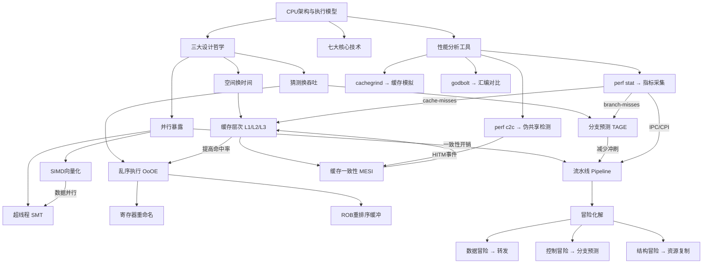

# 第01章 本章小结：CPU架构与执行模型

## 一、核心洞察：本章的一句话总结

**现代CPU的本质是一台"猜测执行"机器**——它通过流水线重叠执行、乱序调度、分支预测、缓存预取等机制，不断"猜测"程序的未来行为，并在猜对时获得巨大性能收益。所有CPU架构优化的核心设计哲学可以用三个词概括：**空间换时间**（缓存层次）、**猜测换吞吐**（分支预测与乱序执行）、**并行暴露**（流水线与多核）。

理解这一点至关重要，因为它解释了为什么CPU架构的每一个设计决策——从缓存行大小到TAGE预测器——都不是孤立的技术点，而是围绕"如何在有限的硬件资源下最大化指令吞吐量"这一根本问题的不同解答。

> **一句话检验**：如果你只能向面试官说一句关于CPU的话，就说："现代CPU通过猜测程序未来的执行路径来隐藏延迟，猜对时获得数十倍性能提升，猜错时付出回滚代价。"这句话涵盖了流水线、分支预测、乱序执行三大核心机制的本质。

## 二、道法术器贯通：从哲学到工具

### 2.1 道（设计哲学）

CPU架构的三大设计哲学贯穿本章所有内容：

| 哲学 | 核心思想 | 对应技术 | 权衡 | 生活类比 |
|------|----------|----------|------|----------|
| 空间换时间 | 用更多晶体管（缓存）换取更少的等待周期 | L1/L2/L3缓存层次、预取器 | 更多晶体管=更高功耗和成本 | 书桌上放常用工具 vs 每次去工具房取 |
| 猜测换吞吐 | 猜测未来的执行路径，猜对时全速运行，猜错时回滚 | 分支预测、乱序执行、投机执行 | 猜错的回滚代价需要控制 | 预判对手传球方向提前跑位 |
| 并行暴露 | 将指令执行的不同阶段重叠或并行化 | 流水线、超标量、SIMD、超线程 | 更深流水线=更高频率但更大预测代价 | 流水线工厂：每个工人只做一道工序 |

这三大哲学并非孤立存在，而是相互制约和协同的。例如：

- **更深的流水线**（并行暴露）提高了频率，但增大了分支预测错误的代价（猜测换吞吐），因此需要更复杂的预测器（如TAGE）来弥补。Intel Pentium 4的31级超深流水线就是这个权衡失败的经典案例——频率虽高但分支预测错误代价巨大，最终被P6微架构的较短流水线取代。
- **缓存层次**（空间换时间）为乱序执行（猜测换吞吐）提供了数据——如果缓存未命中率高，乱序执行的指令窗口很快就会被等待内存的操作填满，乱序的收益就消失了。这解释了为什么L1缓存命中率从95%降到85%时，性能可能下降30%以上。
- **SIMD向量化**（并行暴露）需要**数据局部性**（空间换时间）配合——如果数据在内存中不连续，SIMD的加载指令会频繁触发缓存未命中，反而比标量代码更慢。

### 2.2 法（核心方法论）

本章建立了四个核心分析方法，适用于所有性能优化场景：

**方法一：瓶颈定位法**

任何性能问题都需要先定位瓶颈类型。CPU相关的瓶颈主要分为四类：

瓶颈诊断流程:
  perf stat 采集指标
       ↓
  ┌─────────────────────────────────────┐
  │ IPC < 1.0 且 cache-misses 高?       │→ 内存瓶颈 → 优化数据布局
  │ IPC < 1.0 且 branch-misses 高?      │→ 分支瓶颈 → 排序数据/无分支编程
  │ IPC < 1.0 且无明显热点?              │→ 同步瓶颈 → 减少共享数据争用
  │ IPC > 1.5 但 wall time 仍高?        │→ 计算瓶颈 → 算法优化/SIMD
  └─────────────────────────────────────┘

- **计算瓶颈**：IPC低，指令执行慢 → 优化算法复杂度或SIMD向量化
- **内存瓶颈**：缓存未命中率高 → 优化数据布局和访问模式
- **分支瓶颈**：分支预测错误率高 → 排序数据或无分支编程
- **同步瓶颈**：缓存一致性协议开销大 → 减少共享数据争用

**方法二：量化分析法**

不要凭直觉优化，要量化。核心公式：

- **Amdahl定律**：量化并行化的理论上限
- **CPI分解**：定位性能损失的具体来源
- **缓存有效访问时间**：评估缓存优化的收益

**方法三：数据局部性分析法**

几乎所有CPU性能优化最终都归结为提高数据局部性：

- **时间局部性**：最近访问的数据很快再被访问 → 缓存复用
- **空间局部性**：相邻地址被连续访问 → 缓存行预取、SIMD
- **利用率局部性**：热点代码路径占绝大多数执行时间 → 分支预测

**方法四：微架构感知编程法**

写出"对CPU友好"的代码：

- **循环分块（Tiling）**：提高缓存命中率，将大矩阵拆分为能放入L1的小块
- **数据结构SoA转换**：减少缓存行浪费，Structure of Arrays比Array of Structures更适合向量化
- **分支对齐**：将热路径放在连续地址，减少icache miss
- **内存对齐**：减少跨缓存访问，AVX指令要求32字节对齐

### 2.3 术（具体技术）

本章的七个主题可以按执行阶段组织为一个完整的CPU处理流水线：

指令获取阶段:
  ISA定义 → 指令编码 → 取指 → 指令缓存查找

执行准备阶段:
  流水线译码 → 寄存器读取 → 依赖分析 → 寄存器重命名

执行阶段:
  乱序调度 → 功能单元执行 → SIMD向量化

数据访问阶段:
  缓存层次查找(L1→L2→L3) → 缓存一致性协商(MESI) → 主存访问

结果提交阶段:
  ROB重排序 → 精确异常处理 → 架构状态更新

**关键技术对照表：**

| 技术 | 解决的核心问题 | 关键机制 | 实际性能影响 | 典型数字 |
|------|---------------|---------|-------------|---------|
| 流水线 | 单指令延迟无法降低，如何提升吞吐 | IF→ID→EX→MEM→WB阶段重叠 | 吞吐量提升N倍（N=流水线级数） | 5级流水线→5倍吞吐 |
| 乱序执行 | 长延迟操作阻塞后续无关指令 | 保留站+寄存器重命名+ROB | IPC从0.3-0.5提升到1.0-2.0 | Intel Skylake IPC≈1.5 |
| 分支预测 | 控制冒险导致流水线冲刷 | TAGE预测器（96-97%准确率） | 每次错误损失15-20周期 | 20级流水线→19周期惩罚 |
| 缓存层次 | 内存延迟（50-100ns）远超CPU周期 | L1/L2/L3分层+预取 | 有效访问时间从100ns降至1-2ns | L1: 1ns, L2: 4ns, L3: 12ns |
| 缓存一致性 | 多核数据视图不一致 | MESI/MOESI状态机 | 伪共享可导致10-50倍性能下降 | 一次缓存行传输≈40-70周期 |
| SIMD | 标量处理无法利用数据并行 | SSE/AVX/NEON向量指令 | 理论4-16倍加速（受限于数据对齐等） | AVX2: 8个float并行 |
| 超线程 | CPU执行单元空闲浪费 | 两个逻辑核心共享物理资源 | 有效提升20-30%（取决于负载类型） | 计算密集型仅提升5-10% |

### 2.4 器（工具与环境）

| 工具 | 用途 | 关键命令/操作 | 掌握程度 |
|------|------|-------------|---------|
| perf stat | 总体性能指标采集 | `perf stat -e cycles,instructions,cache-misses,branch-misses` | 必须掌握 |
| perf record/report | 热点函数定位 | `perf record -g ./program && perf report` | 必须掌握 |
| perf c2c | 伪共享检测 | `perf c2c record ./program && perf c2c report` | 必须掌握 |
| godbolt.org | 在线汇编查看 | 对比不同优化级别的生成代码 | 建议掌握 |
| valgrind/cachegrind | 缓存模拟分析 | `valgrind --tool=cachegrind ./program` | 建议掌握 |
| Intel VTune | 商业级深度分析 | 图形化分析微架构瓶颈 | 了解即可 |
| /proc/cpuinfo | CPU特性查看 | `cat /proc/cpuinfo \| grep flags` | 必须掌握 |

**工具选择决策树：**

你想分析什么?
  ├── 整体性能瓶颈 → perf stat
  ├── 热点函数在哪 → perf record + perf report
  ├── 是否有伪共享 → perf c2c
  ├── 缓存行为细节 → valgrind --tool=cachegrind
  ├── 编译器生成了什么代码 → godbolt.org
  └── CPU支持哪些指令集 → /proc/cpuinfo grep flags

## 三、核心公式速查

### 3.1 性能度量公式

**CPI（Cycles Per Instruction）分解：**

$$CPI_{实际} = CPI_{理想} + CPI_{数据冒险} + CPI_{控制冒险} + CPI_{结构冒险}$$

$$CPI_{控制} = f_{branch} \times f_{mispredict} \times C_{penalty}$$

其中：
- $f_{branch}$：分支指令占总指令比例（典型值15-25%）
- $f_{mispredict}$：预测错误率（好预测器<5%，差预测器~15%）
- $C_{penalty}$：预测错误惩罚周期数（=流水线深度-1）

> **实际计算示例**：假设一个CPU有15级流水线，分支指令占20%，TAGE预测器错误率4%。
>
> $$CPI_{控制} = 0.20 \times 0.04 \times 14 = 0.112$$
>
> 这意味着每条指令因分支预测错误额外付出0.112个周期。如果理想CPI为0.5，则实际CPI = 0.5 + 0.112 = 0.612，性能下降约18%。
>
> 如果换用一个错误率10%的简单预测器：$CPI_{控制} = 0.20 \times 0.10 \times 14 = 0.28$，实际CPI = 0.78，性能下降56%。这就是为什么TAGE预测器值得额外的硬件成本。

**实际吞吐量：**

$$吞吐量 = 频率 \times IPC \times 核心数$$

### 3.2 缓存性能公式

**有效访问时间：**

$$T_{有效} = H \times T_{缓存} + (1-H) \times T_{主存}$$

其中$H$是缓存命中率。以典型值为例：

| 场景 | 命中率 | 计算 | 有效访问时间 |
|------|--------|------|-------------|
| L1命中 | 95% | 0.95×1ns + 0.05×12ns | 1.55ns |
| L1+L2命中 | 99% | 0.99×1ns + 0.01×12ns | 1.11ns |
| 全部未命中 | 0% | 1.0×100ns | 100ns |
| **差距** | - | - | **65倍** |

这就是缓存的价值：95%的命中率就能将平均访问时间降低65倍。

**缓存未命中率影响：**

$$性能损失比例 = \frac{T_{主存} - T_{缓存}}{T_{主存}} \times (1-H)$$

### 3.3 并行性能公式

**Amdahl定律：**

$$S = \frac{1}{(1-P) + P/N}$$

其中P = 可并行化比例，N = 核心数。

| 可并行比例P | 4核 | 8核 | 16核 | 64核 | ∞核 |
|------------|-----|-----|------|------|-----|
| 50% | 1.6x | 2.0x | 2.3x | 2.5x | 2.0x |
| 75% | 2.3x | 3.2x | 4.1x | 4.8x | 4.0x |
| 90% | 2.9x | 4.3x | 6.1x | 8.8x | 10.0x |
| 95% | 3.4x | 5.6x | 9.1x | 17.1x | 20.0x |
| 99% | 3.9x | 7.2x | 13.1x | 39.0x | 100.0x |

**关键洞察**：并行化的收益存在天花板，优化串行部分往往比增加核心更有效。当P=80%时，即使1000核也只能获得5倍加速。

**Gustafson定律（补充视角）：**

$$S = N + P \times (1-N)$$

当问题规模随核心数增大时，Amdahl定律的限制会被放宽。这解释了为什么大数据场景下增加核心数仍然有效——因为问题规模可以随硬件扩展。

### 3.4 缓存一致性开销公式

**伪共享的性能影响：**

$$实际带宽 = \frac{理论带宽}{1 + \frac{写次数}{缓存行数} \times \text{一致性开销因子}}$$

当两个核心频繁修改同一缓存行的不同变量时，每次写操作都触发缓存行在核心间传输，性能可能下降10-50倍。

> **伪共享实例**：两个线程各自累加自己的计数器，但两个计数器恰好在同一缓存行（64字节内）。即使它们操作完全独立的数据，每次写入都会触发MESI状态转换，导致缓存行在核心间来回弹跳。用`__attribute__((aligned(64)))`将两个计数器对齐到不同缓存行，性能可提升10-50倍。

## 四、知识图谱：概念间的关联网络



**关联网络的关键洞察**：

图中箭头揭示了技术之间的依赖关系。例如：
- **C1→C3**（缓存→乱序执行）：乱序执行需要缓存提供数据。如果缓存命中率低，乱序执行的指令窗口会被内存等待填满，收益消失。
- **C7→C1**（一致性→缓存）：缓存一致性协议增加了缓存访问的开销。伪共享就是一致性开销的极端表现。
- **C2→C4**（分支预测→流水线）：分支预测器的准确率直接决定了流水线的有效利用率。预测错误率每增加1%，流水线冲刷的周期数就增加1%×流水线深度。

## 五、常见误区与纠正

### 误区1：多核一定比单核快
**纠正**：Amdahl定律指出，并行化收益有天花板。当可并行比例P=80%时，即使1000核也只能获得5倍加速。先优化串行瓶颈，再考虑并行化。

### 误区2：开了-O3就不需要手动优化
**纠正**：编译器无法改变算法复杂度（O(n²)→O(n log n)），无法理解业务语义（哪些是热数据），自动向量化有限制（复杂控制流）。手动优化在数据布局（AoS→SoA）、循环分块、SIMD intrinsics方面仍有巨大空间。

### 误区3：缓存越大越好
**纠正**：缓存收益取决于工作集大小。工作集<8MB时，L3从8MB增到16MB几乎无收益。更大的缓存通常意味着更高的延迟。优先优化数据结构减小工作集。

### 误区4：CPU频率越高越快
**纠正**：实际性能 = 频率 × IPC。4GHz/IPC=1.0的CPU每秒40亿指令，3GHz/IPC=2.0的CPU每秒60亿指令。关注IPC而非频率。

### 误区5：超线程总是有益的
**纠正**：超线程让两个逻辑核心共享L1/L2缓存。当两个线程工作集都较大时，互相驱逐缓存数据，关闭超线程可能更快。必须实测验证。

### 误区6：SIMD总是更快
**纠正**：SIMD适合数据并行（元素间独立），不适合链表遍历、归约求和等场景。数据未对齐、尾部处理、寄存器压力都会削弱收益。先让编译器自动向量化，再手动优化热点。

### 误区7：无分支代码一定比有分支快
**纠正**：现代TAGE预测器准确率96-97%。对于有规律的分支（循环、排序后数据），分支预测几乎免费。只对完全随机且预测错误率>10%的热点分支做无分支优化。

## 六、自检清单：你真的掌握了吗？

### 基础层面（必须掌握）
- [ ] 能解释CISC vs RISC的核心区别，以及为什么现代x86内部用RISC风格执行
- [ ] 能画出5级流水线的时空图，解释为什么吞吐量提升N倍
- [ ] 能区分RAW、WAR、WAW三种数据冒险，并解释转发机制如何解决RAW
- [ ] 能解释分支预测错误的代价如何随流水线深度变化
- [ ] 能说出L1/L2/L3缓存的典型容量、延迟和关联度
- [ ] 能解释MESI协议的四种状态及其转换条件
- [ ] 能说出SSE/AVX/AVX-512的位宽差异

### 进阶层面（建议掌握）
- [ ] 能用CPI公式分解计算分支预测对性能的具体影响
- [ ] 能解释Tomasulo算法如何通过寄存器重命名消除WAR和WAW冒险
- [ ] 能解释伪共享的成因，并用perf c2c检测和修复
- [ ] 能用Amdahl定律计算不同并行比例下的理论加速上限
- [ ] 能对比写回vs写直达策略的适用场景
- [ ] 能解释MOESI相比MESI的O状态解决了什么问题
- [ ] 能用perf stat测量IPC并判断瓶颈类型

### 实战层面（力求掌握）
- [ ] 能用perf c2c定位并修复项目中的伪共享问题
- [ ] 能用AVX intrinsics编写向量化版本并验证性能提升
- [ ] 能在godbolt.org上对比不同优化级别的汇编输出
- [ ] 能通过排序数据提高分支预测准确率并用perf验证
- [ ] 能设计缓存友好的数据结构（分块、对齐、SoA）
- [ ] 能用cachegrind模拟分析程序的缓存行为

## 七、本章核心实验速查

本章配套了四个实战案例，以下是每个实验的核心要点：

| 实验 | 核心技能 | 关键工具 | 预期收获 |
|------|---------|---------|---------|
| 案例一：矩阵乘法优化 | 循环分块、缓存友好 | perf stat, cachegrind | 理解缓存对计算密集型任务的影响，掌握从10倍到100倍加速的方法 |
| 案例二：分支预测优化 | 数据排序、无分支编程 | perf stat (branch-misses) | 理解分支预测对性能的影响，掌握通过排序提高预测率的方法 |
| 案例三：伪共享排查 | 缓存行对齐、MESI协议 | perf c2c | 理解伪共享的成因和修复方法，掌握HITM事件分析 |
| 案例四：perf定位热点 | 性能分析流程 | perf record, perf report | 掌握完整的性能分析方法论：采集→分析→优化→验证 |

**实验前准备**：

```bash
# 确保perf可用
sudo sysctl -w kernel.perf_event_paranoid=-1

# 查看CPU特性
cat /proc/cpuinfo | grep -E "model name|flags" | head -5

# 确认支持的指令集
cat /proc/cpuinfo | grep -o 'avx2\|avx512\|sse4' | sort -u
```

## 八、下一章衔接与学习路径

### 8.1 本章在全书中的位置

第01章 CPU架构与执行模型 ← 你在这里
    ↓ 理解了计算单元如何工作
第02章 内存系统（DRAM/NUMA）
    ↓ 理解了数据从哪里来、延迟如何
第03章 编译器与代码生成
    ↓ 理解了高级语言如何变成机器指令
第04章 进程与线程
    ↓ 理解了操作系统如何调度和管理执行
第05章 内存管理
    ↓ 理解了虚拟内存和分页机制

**衔接要点**：本章的缓存知识是理解第02章DRAM和NUMA的基础。缓存是CPU和主存之间的桥梁，而DRAM的访问模式（行缓冲、预充电、刷新）直接影响缓存未命中时的惩罚。第02章将解释为什么内存延迟是50-100ns而非1ns，以及NUMA架构如何影响多核程序的性能。

### 8.2 推荐进阶阅读

**经典教材（理论深度）：**
- Patterson & Hennessy, *Computer Organization and Design*（RISC-V/ARM版）——理解硬件设计原理
- Hennessy & Patterson, *Computer Architecture: A Quantitative Approach*, 6th Ed. ——性能分析方法论
- Bovet & Cesati, *Understanding the Linux Kernel*, Ch.1 ——从硬件到操作系统的过渡

**实践指南（动手优化）：**
- Agner Fog的优化手册（https://www.agner.org/optimize/）——Intel/AMD微架构的权威参考
- Intel Software Developer Manuals, Vol.3 ——官方架构参考
- *What Every Programmer Should Know About Memory*, Ulrich Drepper ——内存层次的实用指南

**在线资源：**
- godbolt.org：在线查看不同编译器和优化级别的汇编输出
- Quick Benchmark（https://quick-bench.com/）：在线C++性能对比
- Intel Intrinsics Guide（https://www.intel.com/content/www/us/en/docs/intrinsics-guide/）：SIMD指令参考

### 8.3 动手实践建议

1. **立即可做（1小时内）**：
   - 在你的Linux机器上运行`perf stat -e cycles,instructions,cache-misses,branch-misses`分析一个日常程序
   - 在godbolt.org上写一段循环代码，对比-O0和-O3的汇编输出差异

2. **本周完成（5小时内）**：
   - 完成本章4个实战案例中的至少2个
   - 用perf c2c检测你自己项目中是否存在伪共享
   - 用AVX2 intrinsics实现一个向量化版本的数组操作

3. **持续精进**：
   - 养成用perf分析热点的习惯，每次优化前先定位瓶颈
   - 阅读Agner Fog的微架构手册，理解你使用的具体CPU的流水线深度、执行端口、缓存大小
   - 在下一章（内存系统）中，结合本章的缓存知识深入理解DRAM和NUMA的影响

## 九、关键概念索引

按字母顺序排列，方便快速查阅：

| 概念 | 页码/文件 | 一句话解释 |
|------|----------|-----------|
| Amdahl定律 | 理论基础-缓存一致性 | 并行加速比 = 1/((1-P)+P/N)，P为可并行比例 |
| AVX-512 | 理论基础-SIMD | 512位向量指令集，一次处理16个float |
| CDB | 理论基础-乱序执行 | 公共数据总线，功能单元广播结果 |
| CISC | 理论基础-ISA | 复杂指令集，x86为代表 |
| CPI | 理论基础-流水线 | 每条指令的平均时钟周期数 |
| GShare | 理论基础-分支预测 | PC与全局历史XOR索引的预测器 |
| LRU | 理论基础-缓存 | 最近最少使用替换策略 |
| MESI | 理论基础-缓存一致性 | 四状态缓存一致性协议 |
| MOESI | 理论基础-缓存一致性 | 五状态协议，AMD使用 |
| OoOE | 理论基础-乱序执行 | Out-of-Order Execution，乱序执行 |
| RAT | 理论基础-乱序执行 | 寄存器别名表，维护架构→物理寄存器映射 |
| RISC | 理论基础-ISA | 精简指令集，ARM/RISC-V为代表 |
| ROB | 理论基础-乱序执行 | 重排序缓冲，保证精确异常和程序序提交 |
| SIMD | 理论基础-SIMD | 单指令多数据，SSE/AVX/NEON |
| SMT | 理论基础-超线程 | 同时多线程，一个物理核两个逻辑核 |
| TAGE | 理论基础-分支预测 | 多历史长度的标签预测器，96-97%准确率 |
| Tomasulo算法 | 理论基础-乱序执行 | 1967年IBM提出的乱序执行基础算法 |
| 伪共享 | 核心技巧-伪共享 | 同一缓存行的多核写导致性能暴跌 |
| 组相联 | 理论基础-缓存 | 缓存组织方式，N路组相联是主流 |
| 转发 | 理论基础-流水线 | Forwarding/Bypassing，解决RAW数据冒险 |
