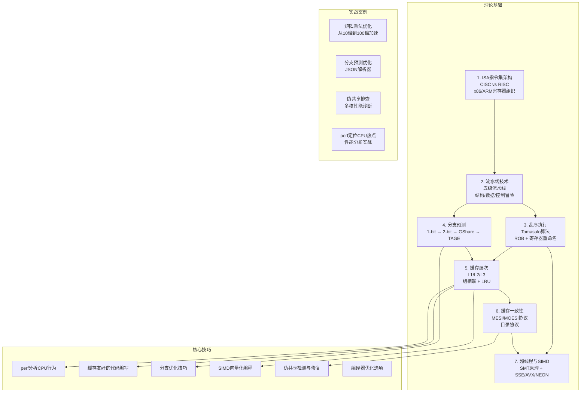

# 第01章 CPU架构与执行模型

## 本章定位

CPU是计算机系统的计算核心，理解其架构与执行模型是掌握一切系统性能优化的基础。本章从指令集架构出发，逐层深入流水线、乱序执行、分支预测、缓存层次、缓存一致性及多核/向量化等核心主题，构建从"硅片如何执行一条指令"到"多核如何协同工作"的完整认知链条。

无论你后续做并发编程、性能调优还是系统设计，所有决策的底层依据都指向同一个地方：**CPU是如何执行你的代码的**。

很多开发者写代码时把CPU当作一个"黑箱"——输入指令，等待结果。但当你面对以下场景时，这种黑箱思维会成为瓶颈：

- 同样的算法，为什么别人跑得比你快10倍？
- 多线程程序加了核数反而变慢，哪里出了问题？
- perf报告里L1 cache miss飙升，该怎么改代码？
- 分支预测失败率30%，对性能到底有多大影响？

这些问题的答案全部藏在CPU的微架构里。本章的目标不是让你成为硬件工程师，而是让你**拥有从晶体管到源码的完整心智模型**——看到一行C代码，能直觉地想象出它在CPU内部经历的每一步。

## 核心问题

本章将回答以下核心问题：

| 问题 | 对应小节 | 为什么重要 |
|------|----------|------------|
| 一条指令从内存到执行完毕，经历了什么？ | 理论基础 (ISA与流水线) | 理解指令生命周期是所有优化的前提 |
| 为什么CPU要"乱序执行"？这不会出错吗？ | 理论基础 (乱序执行) | 理解现代CPU性能来源和内存序语义 |
| 分支预测失败到底损失多少性能？ | 理论基础 (分支预测) | 指导分支友好的代码编写风格 |
| 缓存命中和未命中的差距有多大？ | 理论基础 (缓存层次) | 缓存友好代码的理论依据 |
| 多核之间如何保证数据一致性？ | 理论基础 (缓存一致性) | 理解锁、原子操作、伪共享的硬件根源 |
| 如何用perf工具量化这些问题？ | 核心技巧 (perf分析) | 从理论到可观测的性能数据 |
| 如何写出缓存友好的代码？ | 核心技巧 (缓存优化) | 数据布局与访问模式的实战指南 |
| SIMD向量化能带来多大加速？ | 核心技巧 (SIMD编程) | 掌握数据级并行编程 |
| 矩阵乘法从10倍到100倍加速是怎么做到的？ | 实战案例 | 体验从朴素到极致优化的完整路径 |
| 多核一定更快吗？什么情况下反而更慢？ | 常见误区 | 避免盲目加核的性能陷阱 |

## 本章核心公式速查

在学习本章之前，先了解以下核心公式。它们会在后续内容中反复出现：

| 公式 | 含义 | 应用场景 |
|------|------|----------|
| CPU时间 = 指令数 × CPI × 时钟周期 | 程序执行时间的基本分解 | 理解优化的三个方向：减少指令数、降低CPI、提高频率 |
| CPI = 1 / IPC | 每条指令的平均周期数 | 衡量流水线效率 |
| 加速比 = 旧时间 / 新时间 | 优化带来的性能提升倍数 | 评估优化效果 |
| Amdahl定律：S = 1 / (S + P/N) | 并行化的理论上限 | 理解为什么单线程优化仍然重要 |
| 缓存命中率 = 命中次数 / 总访问次数 | 缓存效率度量 | 指导数据结构和访问模式选择 |
| 缓存访问时间：L1 ≈ 1ns, L2 ≈ 3-5ns, L3 ≈ 10-20ns, 主存 ≈ 100ns | 各级存储的延迟差距 | 理解为什么一次L1 miss相当于浪费数十个CPU周期 |

## 知识体系全景图

本章所有知识点之间的依赖关系和学习路径如下。箭头表示"学了A才能理解B"：

## 三大设计哲学

理解本章七个主题后，可以提炼出CPU架构设计的三大核心哲学：

**空间换时间**：缓存用少量高速存储隐藏大量低速存储的延迟；寄存器重命名用大量物理寄存器消除假依赖；重排序缓冲用额外存储保证精确异常。每一处"浪费"的晶体管都在换取更高的执行效率。

**猜测执行**：分支预测器猜测程序走向并提前执行；乱序执行器猜测哪些指令可以绕过阻塞提前执行；推测执行在分支预测正确时带来巨大收益，但预测错误时需要回滚——Meltdown/Spectre漏洞正是利用了推测执行的副作用。

**并行暴露**：流水线让多条指令的不同阶段并行执行（指令级并行的时序维度）；乱序执行让无依赖的指令并行执行（指令级并行的空间维度）；SMT让多个线程共享核心资源（线程级并行）；SIMD让一条指令处理多个数据（数据级并行）。从单线程到多核，本质上是在不同粒度上暴露并行性。

## 本章内容导航

### 第一阶段：理论基础（建立心智模型）

理论基础包含七个核心主题，按因果链递进编排——后一个主题的存在，往往源于前一个主题的局限：

| 小节 | 主题 | 核心内容 | 建议时长 |
|------|------|----------|----------|
| 1. ISA指令集架构 | CPU的语言 | CISC vs RISC设计哲学对比，x86-64寄存器组织（RAX-R15、RFLAGS），ARM AArch64寄存器组织（X0-X30、NEON），三种工作模式（实模式→保护模式→长模式）的切换机制，System V AMD64 ABI与AAPCS64调用约定 | 1.5小时 |
| 2. 流水线技术 | 指令的工厂流水线 | 经典5级流水线（IF→ID→EX→MEM→WB）详解，CPI计算公式，三类冒险（结构/数据/控制）的成因与化解方案，转发机制（Forwarding/Bypassing），超流水线深度与频率的权衡（Pentium 4的31级教训） | 1.5小时 |
| 3. 乱序执行 | 打破顺序的束缚 | 为什么顺序执行浪费了大量执行单元？Tomasulo算法三大组件（保留站+CDB+寄存器重命名），物理寄存器文件（PRF）与RAT的映射机制，ROB重排序缓冲保证精确异常，WAR/WAW冒险的消除原理 | 1.5小时 |
| 4. 分支预测 | 猜测的艺术 | 条件分支占指令15-25%，预测错误代价15-25周期。从1-bit到2-bit饱和计数器的演进，局部历史与全局历史预测器，GShare（PC XOR历史）在SPECint上达93-95%准确率，TAGE多历史长度预测器达96-97%准确率 | 1小时 |
| 5. 缓存层次 | 填补速度鸿沟 | "内存墙"问题（CPU周期1ns vs 主存100ns），L1(3-5周期)/L2(12-15周期)/L3(30-50周期)的延迟梯度，组相联映射的地址解析过程，LRU/伪LRU替换策略，写回/写直达策略选择，TLB与虚拟地址翻译 | 1.5小时 |
| 6. 缓存一致性 | 多核的协调机制 | MESI四状态协议详解（Modified/Exclusive/Shared/Invalid），状态转换规则，写传播与写串行化保证，MOESI协议的O状态优势（AMD），目录协议在64+核心的扩展性优势，伪共享（False Sharing）的成因与检测 | 1小时 |
| 7. 超线程与SIMD | 并行的两个维度 | SMT超线程原理（共享执行单元、独立架构状态），15-30%的吞吐量提升及适用条件，SIMD从SSE(128位)到AVX(256位)到AVX-512(512位)的演进，ARM NEON与SVE/SVE2可变长度向量，应用领域（图像/科学计算/ML/密码学） | 1小时 |

### 第二阶段：核心技巧（掌握优化手段）

| 小节 | 主题 | 核心内容 | 建议时长 |
|------|------|----------|----------|
| 1. 使用perf分析CPU行为 | 性能度量的瑞士军刀 | perf stat/record/report三大命令，L1-dcache-load-misses/branch-misses/LLC-load-misses等硬件计数器解读，火焰图分析，PMU事件精确定位热点 | 1小时 |
| 2. 缓存友好的代码编写 | 让数据为CPU服务 | 数据布局优化（AoS→SoA），缓存行对齐（alignas(64)），伪共享修复，遍历顺序调整，prefetch指令使用，循环分块（Tiling）策略 | 1小时 |
| 3. 分支优化技巧 | 消除不可预测路径 | 条件移动替代分支（CSEL/CMOV），查表法，位运算技巧，__builtin_expect与likely/unlikely，排序后分支预测改善 | 0.5小时 |
| 4. SIMD向量化编程 | 一次处理8个浮点 | Intel intrinsics（_mm256_*系列），自动向量化编译选项（-O3 -march=native），手动向量化实战，对齐要求，掩码操作，水平归约技巧 | 1小时 |
| 5. 伪共享检测与修复 | 消除隐形性能杀手 | perf c2c检测HITM事件，alignas(64)填充，padding设计原则，多语言修复方案（C/C++/Go/Java/Rust），修复后的性能验证 | 0.5小时 |
| 6. 编译器优化选项 | 让编译器帮你想 | -O0/-O1/-O2/-O3/-Ofast差异对比，Profile-Guided Optimization (PGO)流程，Link-Time Optimization (LTO)，向量化报告（-fopt-info-vec），编译器能做与不能做的边界 | 0.5小时 |

### 第三阶段：实战案例（从理论到代码）

| 案例 | 主题 | 核心内容 | 建议时长 |
|------|------|----------|----------|
| 案例一 | 矩阵乘法优化（从10倍到100倍加速） | 朴素实现→循环展开→分块优化(Tiling)→SIMD向量化→多线程，每步perf数据对比，理解缓存分块对L1/L2命中率的决定性影响 | 1.5小时 |
| 案例二 | 分支预测优化 | 排序前后的分支预测差异量化，无分支实现（Branchless），simdjson的SIMD结构解析原理，实测性能对比 | 0.5小时 |
| 案例三 | 伪共享性能问题排查 | 从perf报告中发现伪共享，定位缓存行冲突的源代码位置，修复后的性能提升验证，多核扩展性分析 | 0.5小时 |
| 案例四 | 利用perf定位CPU热点 | perf record + 火焰图分析，符号解析（debug symbols），热点函数定位与优化决策，PGO的实际效果验证 | 0.5小时 |

### 第四阶段：反思与巩固

| 小节 | 主题 | 核心内容 | 建议时长 |
|------|------|----------|----------|
| 常见误区 | CPU架构认知陷阱 | "多核一定快"、"缓存越大越好"、"CPU频率越高越快"、"SIMD总是更快"等12个典型误区的深度剖析，每个误区都包含：错误认知→根因分析→量化对比→正确做法 | 1小时 |
| 练习方法 | 动手才能真正理解 | 5个递进式练习：perf工具入门→缓存行实验→分支预测实验→SIMD向量化→综合项目（缓存友好的矩阵乘法），每个练习含完整可编译代码和检查标准 | 4-6小时 |
| 本章小结 | 知识脉络梳理 | 道法术器四层贯通总结，核心公式速查，常见误区纠正清单，自检清单（基础/进阶/实战三级），与其他章节的衔接指引 | 0.5小时 |

## 前置知识

本章假设你具备以下基础。如果某些领域不熟悉，建议先补课再学习：

| 知识领域 | 要求程度 | 具体内容 | 补课建议 |
|----------|----------|----------|----------|
| C/C++编程 | 熟练 | 指针操作、结构体内存布局、内联汇编基础 | K&R《C程序设计语言》前8章 |
| 数据结构 | 基础 | 数组、链表、栈、队列、二叉树的基本概念 | 任意算法教材前三章 |
| 数字逻辑 | 了解 | 门电路（AND/OR/NOT）、触发器、时钟信号的基本概念 | 可参考《编码》第14-17章 |
| Linux操作 | 基础 | 命令行操作、gcc/g++编译、make工具使用 | 不需要精通，跟着案例操作即可 |
| 操作系统 | 了解 | 进程与线程的区别、虚拟内存的基本概念 | 可参考《操作系统导论》前三章 |

> **提示**：前置知识的"了解"级别意味着你只需要有印象即可，本章会在需要时做必要的补充说明。"熟练"级别则建议确实掌握，否则学习过程中会频繁卡壳。

## 学习路径

本节的七个主题按依赖关系编排，建议按顺序阅读。每读完一个主题，思考以下问题：

1. **这个技术解决什么问题？** 如果不存在这个问题，这个技术还有存在的必要吗？
2. **它的权衡（trade-off）是什么？** 没有免费的性能——增加了什么硬件复杂度？消耗了什么额外资源？
3. **如果绕过它会发生什么？** 关闭分支预测、禁用缓存、关闭超线程——通过 `perf stat` 对比前后的IPC和CPI变化，直观感受每项技术的贡献。

对于有经验的开发者，建议重点关注乱序执行和缓存一致性，因为它们直接影响多线程程序的性能特征。对于关注系统级优化的读者，缓存层次和SIMD是后续"核心技巧"章节的理论基础。

### 有效的学习方式

1. **边读边画**：每学完一个硬件机制，在纸上画出数据流和状态转换图。画图的过程就是理解的过程
2. **立即验证**：学完一个概念后，用perf工具在你的机器上实测。理论说L1 miss代价是5个周期，你的机器上是多少？
3. **对比实验**：矩阵乘法案例中，每一步优化后都用perf对比数据。亲眼看到数字变化比看结论有效10倍
4. **费曼技巧**：尝试向一个不了解CPU的人解释"什么是流水线冒险"。如果解释不清楚，说明你还没真正理解

### 避免的学习方式

1. **不要只看不练**：CPU微架构是"做出来"的知识，不是"看出来"的
2. **不要跳过理论直接看案例**：没有理论基础的案例只是抄代码，换个场景就不知道怎么优化
3. **不要追求一次性全懂**：某些概念（如Tomasulo算法）需要反复琢磨，第一遍能理解60%就是正常的

## 预计学习时间

| 阶段 | 内容 | 预计时间 | 说明 |
|------|------|----------|------|
| 理论基础 | 7个小节 | 9-10小时 | 这是本章最厚的部分，建议精读并动手画状态转换图 |
| 核心技巧 | 6个小节 | 4-5小时 | 每个技巧都要在Linux环境下动手实践 |
| 实战案例 | 4个案例 | 3-4小时 | 跟着案例操作，修改参数观察perf数据变化 |
| 反思巩固 | 3个小节 | 5-7小时 | 练习方法是投入时间最多的部分，但也是收获最大的 |
| **总计** | **20个小节** | **21-26小时** | **建议分4-6天完成，每天3-4小时** |

> **学习建议**：不要试图一次性从头读到尾。建议的节奏是：先读理论基础的前两节（ISA+流水线），建立基本框架后，再按需深入后续内容。理论和技巧可以交替学习——学完"缓存层次"理论后立刻学"缓存友好编程"技巧，趁热打铁效果最好。

## 本章在全书中的位置

本章是整本"软件工程核心原理"的基石。第1章建立的CPU微架构知识将直接服务于后续所有章节：

- **缓存层次与一致性** → 第2章内存模型的硬件基础
- **乱序执行与重排序** → 第2章理解为什么需要内存屏障
- **原子操作的硬件实现** → 第3章锁机制和第4章CAS编程的底层原理
- **缓存行大小** → 第5章并发数据结构的填充与对齐策略

跳过本章直接学后面的章节，就像不学乐理直接弹爵士——可能能模仿，但遇到问题时无法从根本上理解原因。

## 三大核心因果链

这七个主题之间存在三条核心因果链：

**因果链A（单核性能链）**：ISA定义了指令格式 → 流水线重叠执行多条指令 → 乱序执行绕过阻塞指令 → 分支预测减少流水线冲刷 → 缓存掩盖内存访问延迟。每一环都是为了弥补上一环的性能瓶颈。

**因果链B（多核协作链）**：私有缓存提升单核性能 → 但多核各自缓存导致数据不一致 → MESI协议保证一致性 → 伪共享成为新的性能杀手。这是一条"解决一个问题，引入新问题"的工程演进链。

**因果链C（并行度扩展链）**：SMT在同一核心上共享执行资源 → SIMD用一条指令处理多个数据 → 两者结合实现从指令级到数据级的全面并行。这是对单核算力的深度挖掘。

## 关键数字速查

以下数字贯穿本章，建议在学习过程中逐步记忆：

存储层次延迟:
  L1缓存命中:     ~1ns    (3-4周期 @3GHz)
  L2缓存命中:     ~5ns    (12-15周期)
  L3缓存命中:     ~15ns   (36-50周期)
  主存访问:       ~60-100ns (180-300周期)
  SSD:            ~10-100μs (30,000-300,000周期)
  HDD:            ~5-10ms  (15,000,000-30,000,000周期)

分支预测:
  分支预测正确:    ~0.5ns  (1-2周期,可被流水线隐藏)
  分支预测错误:    ~5-8ns  (15-25周期,冲刷流水线)
  条件分支占比:    15-25% (占总指令数)

SIMD:
  SSE:   128位, 一次4个float
  AVX:   256位, 一次8个float
  AVX-512: 512位, 一次16个float

多核:
  SMT加速:        15-30% (非2倍)
  伪共享惩罚:     10-50倍性能下降
  NUMA本地延迟:   ~80ns
  NUMA远程延迟:   ~150ns

超流水线:
  Pentium 4:  31级, 高频低IPC (反面教材)
  Intel Core: 14-16级 (现代平衡)
  ARM A77:    13级

## 延伸阅读

**经典教材（理论深度）：**
- Patterson & Hennessy, *Computer Organization and Design*（RISC-V/ARM版）——理解硬件设计原理
- Hennessy & Patterson, *Computer Architecture: A Quantitative Approach*, 6th Ed. ——性能分析方法论
- Bovet & Cesati, *Understanding the Linux Kernel*, Ch.1 ——从硬件到操作系统的过渡

**实践指南（动手优化）：**
- Agner Fog的优化手册（https://www.agner.org/optimize/）——Intel/AMD微架构的权威参考
- Intel Software Developer Manuals, Vol.3 ——官方架构参考
- *What Every Programmer Should Know About Memory*, Ulrich Drepper ——内存层次的实用指南

**在线资源：**
- godbolt.org：在线查看不同编译器和优化级别的汇编输出
- Quick Benchmark（https://quick-bench.com/）：在线C++性能对比
- Intel Intrinsics Guide（https://www.intel.com/content/www/us/en/docs/intrinsics-guide/）：SIMD指令参考
- Chips and Cheese（https://chipsandcheese.com）：现代CPU微架构深度分析

**关键论文：**
- Tomasulo, R.M. "An Efficient Algorithm for Exploiting Multiple Arithmetic Units." IBM Journal, 1967.
- McFarling, S. "Combining Branch Predictors." DEC WRL Technical Note, 1993.
- Seznec, A. "A New Case for the TAGE Branch Predictor." MICRO, 2011.
- D. A. Jiménez and C. Lin, "Dynamic Branch Prediction with Perceptrons" (2001) ——现代分支预测器的里程碑
