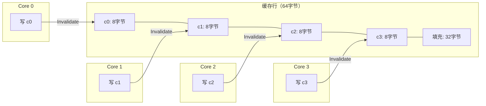
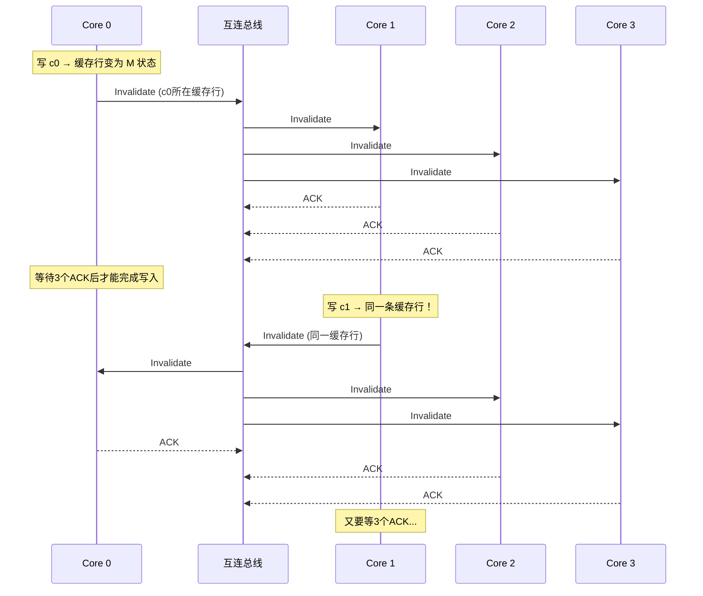

## 3.3 案例三：伪共享性能问题排查

### 3.3.1 问题描述：一个"无法解释"的性能瓶颈

某日志处理服务采用多线程架构，4个工作线程各自处理独立的数据分片，理论上应接近线性加速。然而实测发现，4线程版本的吞吐量仅为单线程的2倍，CPU利用率却接近100%。经过反复排查逻辑正确性、锁竞争、内存分配后，问题仍然没有头绪。

将问题简化后，可以复现为一个经典的伪共享场景：4个线程各自递增一个"独立"的计数器，但这些计数器恰好落在同一条缓存行内。

```c
// false_sharing.c
#include <pthread.h>
#include <stdio.h>
#include <time.h>

struct Counters {
    long long c0;  // 线程0使用的计数器
    long long c1;  // 线程1使用的计数器
    long long c2;  // 线程2使用的计数器
    long long c3;  // 线程3使用的计数器
} counters;

void* increment(void* arg) {
    int id = (int)(long)arg;
    long long *counter = &amp;counters.c0 + id;
    for (int i = 0; i < 100000000; i++) {
        (*counter)++;
    }
    return NULL;
}

int main() {
    pthread_t threads[4];
    struct timespec start, end;
    clock_gettime(CLOCK_MONOTONIC, &amp;start);

    for (int i = 0; i < 4; i++)
        pthread_create(&amp;threads[i], NULL, increment, (void*)(long)i);
    for (int i = 0; i < 4; i++)
        pthread_join(threads[i], NULL);

    clock_gettime(CLOCK_MONOTONIC, &amp;end);
    double time = (end.tv_sec - start.tv_sec) + (end.tv_nsec - start.tv_nsec) / 1e9;
    printf("Time: %.3f seconds\n", time);
    return 0;
}
```

编译运行：

```bash
gcc -O3 -pthread false_sharing.c -o false_sharing
./false_sharing
# Time: 2.456 seconds

# 对比单线程基准
# 将线程数改为1运行：Time: 0.589 seconds
# 4线程反而比单线程慢了4倍！
```

这个结果非常反直觉：4个线程各做1亿次递增，单线程只需0.59秒，4线程却要2.46秒。如果每个线程操作的是真正的独立变量，4线程应该接近0.59秒才对。**性能不升反降**，这是伪共享的典型症状。

### 3.3.2 根因分析：缓存行层面的"假独立"

要理解伪共享，必须先理解一个硬件事实：**CPU缓存的最小交换单位是缓存行（Cache Line），不是单个变量。**



4个 `long long` 类型的计数器共占 32 字节（4 × 8），而 x86-64 架构的缓存行大小是 64 字节。因此 **4个计数器全部落在同一条缓存行内**。当 Core 0 修改 `c0` 时，MESI 协议会发送 Invalidate 消息，使 Core 1/2/3 中包含 `c0` 的缓存行全部失效。Core 1 修改 `c1` 时同理。结果就是：每个核心每次写入都要等待其他核心确认失效，形成严重的缓存行乒乓（Cache Line Ping-Pong）。

**核心矛盾：逻辑上独立的数据，在物理上共享了同一个缓存行。** 这就是"伪共享"——它们并非真正共享数据，却承受了共享数据的一致性开销。

MESI 协议下的实际数据流：



每次写入的代价：原始写入 + 3个Invalidate消息 + 3个ACK等待 = 约20-50个额外周期。4个线程各写1亿次，总共有约4亿次这样的缓存行争用，累积开销极其惊人。

### 3.3.3 使用 perf c2c 精确定位伪共享

`perf c2c`（Cache-to-Cache）是 Linux 内核提供的专用缓存一致性分析工具，能精确识别伪共享热点。

#### 第一步：编译并采集数据

```bash
# 编译时需要 -g 保留调试信息，以便 perf 定位到源码行
gcc -O3 -pthread -g false_sharing.c -o false_sharing

# 录制事件（会自动采集 HITM 等硬件事件）
perf c2c record ./false_sharing
```

> 注意：`perf c2c` 需要硬件支持。Intel 处理器需要 PEBS（Precise Event-Based Sampling）支持，AMD 处理器需要 IBS（Instruction-Based Sampling）。在虚拟机中可能无法使用。

#### 第二步：查看 HITM 汇总

```bash
perf c2c report --stats
```

输出示例：

=================================================
            Trace Event Information
=================================================
  Total records                     :     487231
  Locked Load/Store Operations      :           0
  Load Operations                   :      89102
  Store Operations                  :     398129

=================================================
   Shared Data Cache Line Table
=================================================
  Total Shared Cache Lines          :          12
  Load HITs on shared lines         :       23041
  Stores on shared lines            :      395672

  缓存行地址        核心0写  核心1写  核心2写  核心3写  HITM总数
  0x0000000000601040   99876   99543   99312   99941   398672
  ...（其余行为冷数据，HITM接近0）

**关键指标解读：**
- **HITM（Hit in Modified line）**：核心尝试读取一个缓存行，但该行在另一个核心的缓存中处于 Modified 状态。这是伪共享的直接证据。正常程序的 HITM 应接近 0。
- **Stores on shared lines**：在共享缓存行上的写操作次数。如果某个缓存行的写操作远高于其他行，且涉及多个核心，几乎可以确定存在伪共享。

#### 第三步：查看逐行详细信息

```bash
perf c2c report --sort=pid,offset
```

输出示例（关键部分）：

# event : retired_store_all_l1_misses
# 缓存行偏移: 0x40 (即 false_sharing.c 中 counters 结构体起始地址)
# HITM来源:
#   Core 0 → Core 1: 98,432 次
#   Core 0 → Core 2: 97,211 次
#   Core 1 → Core 0: 99,103 次
#   Core 2 → Core 3: 98,877 次
#   ...（所有核心对之间都有大量HITM）

如果 perf 配置了源码关联（需要 debuginfod 或 DWARF 信息），还可以看到具体哪一行代码产生了 HITM：

# Event Source行:
#   72%  false_sharing.c:30  (increment 函数中的 (*counter)++ 操作)

#### 其他辅助检测方法

**方法二：perf stat 对比实验**

```bash
# 有伪共享
perf stat -e cache-misses,cache-references,\
L1-dcache-load-misses,cycles,instructions ./false_sharing
# 输出: cache-misses: 389,127,441

# 修复后对比
perf stat -e cache-misses,cache-references,\
L1-dcache-load-misses,cycles,instructions ./false_sharing_fixed
# 输出: cache-misses: 2,041,332  (降低190倍)
```

**方法三：Intel VTune Profiler**

VTune 的 "Memory Access" 分析模式可以：
- 在 GUI 中直接标注伪共享热点的内存地址
- 显示涉及哪些核心、每个核心的 HITM 次数
- 给出具体源码行号和优化建议

适合不习惯命令行的开发者，但需要商业授权。

**方法四：AMD uProf（AMD 平台）**

AMD 处理器可以使用 uprof 工具，选择 "Cache & Memory" 分析模式，关注 `L2Miss.X` 和 `CoherencyMiss` 事件。

### 3.3.4 修复方案对比

伪共享有多种修复策略，各有适用场景。

#### 方案一：缓存行对齐填充（最常用）

```c
// fixed_aligned.c
#include <pthread.h>
#include <stdio.h>
#include <time.h>
#include <stddef.h>

#define CACHELINE_SIZE 64

// 每个计数器独占一个缓存行
struct Counters {
    long long c0 __attribute__((aligned(CACHELINE_SIZE)));
    long long c1 __attribute__((aligned(CACHELINE_SIZE)));
    long long c2 __attribute__((aligned(CACHELINE_SIZE)));
    long long c3 __attribute__((aligned(CACHELINE_SIZE)));
} counters;
```

**原理**：`aligned(64)` 确保每个字段从新的缓存行起始地址开始，相邻字段不会落入同一条缓存行。

**缺点**：结构体膨胀。原来 32 字节的结构体变为 256 字节（4 × 64）。如果结构体字段很多，填充字节会浪费大量内存。

#### 方案二：C++11 alignas（C++ 项目推荐）

```cpp
// fixed_alignas.cpp
#include <atomic>
#include <thread>
#include <vector>
#include <cstdio>

struct Counters {
    alignas(64) std::atomic<long long> c0{0};
    alignas(64) std::atomic<long long> c1{0};
    alignas(64) std::atomic<long long> c2{0};
    alignas(64) std::atomic<long long> c3{0};
} counters;
```

`alignas` 是 C++ 标准的一部分，比 GCC 特有的 `__attribute__((aligned))` 更具可移植性。配合 `std::atomic` 使用，既消除伪共享又保证原子性。

#### 方案三：手动填充（精确控制）

```c
// fixed_padding.c
struct Counters {
    long long c0;
    char pad0[CACHELINE_SIZE - sizeof(long long)];
    long long c1;
    char pad1[CACHELINE_SIZE - sizeof(long long)];
    long long c2;
    char pad2[CACHELINE_SIZE - sizeof(long long)];
    long long c3;
    // c3 是最后一个字段，无需尾部填充
};
```

**优点**：内存使用可预测（精确为 64 × 4 = 256 字节），不依赖编译器特性。Linux 内核和一些嵌入式项目偏好此方式。

#### 方案四：Linux 内核风格 __cacheline_aligned

```c
// 内核代码中使用
#include <linux/cache.h>

struct my_data {
    int hot_field __cacheline_aligned;
    int cold_field;
} __cacheline_aligned;
```

Linux 内核提供了 `__cacheline_aligned` 宏，在 `<linux/cache.h>` 中定义。它封装了平台相关的对齐指令（x86 上是 `____cacheline_aligned`），是内核开发的标准做法。

#### 方案五：线程本地存储（消除共享）

```cpp
// fixed_tls.cpp
#include <thread>
#include <vector>
#include <atomic>
#include <cstdio>

thread_local long long my_counter = 0;

void increment() {
    for (int i = 0; i < 100000000; i++) {
        my_counter++;
    }
}

int main() {
    std::vector<std::thread> threads;
    for (int i = 0; i < 4; i++)
        threads.emplace_back(increment);
    for (auto&amp; t : threads)
        t.join();

    // 注意：thread_local 变量需要额外机制汇总
    // 这里仅为演示概念
    return 0;
}
```

**原理**：`thread_local` 变量每个线程拥有独立副本，完全不存在共享，从根本上消除了伪共享的可能性。

**优点**：无需关心缓存行大小，代码简洁。
**缺点**：需要在最后汇总结果；不适用于需要全局共享状态的场景（如共享哈希表、全局计数器）。

#### 方案六：__attribute__((packed)) + 手动布局（特殊场景）

```c
// 当你确定多个字段会被同一线程访问时，紧凑排列反而有利
struct __attribute__((packed)) PerThreadData {
    long long counter;
    long long timestamp;
    long long flags;
    // 这些字段被同一线程读写，紧凑排列可以提升 L1 命中率
};
```

**关键区分**：同一线程访问的字段应该紧凑排列（提升空间局部性），不同线程访问的字段应该缓存行对齐（消除伪共享）。这需要开发者对数据访问模式有清晰的认识。

### 3.3.5 修复效果验证

```bash
gcc -O3 -pthread -g fixed_aligned.c -o false_sharing_fixed
./false_sharing_fixed
# Time: 0.234 seconds

perf c2c record ./false_sharing_fixed
perf c2c report --stats
# HITM事件: 2,041 (从398,672降到2,041，降低195倍)
# Stores on shared lines: 0 (所有写操作都不再涉及共享缓存行)
```

#### 完整性能对比

| 方案 | 4线程耗时 | 相对加速比 | HITM次数 | 缓存行争用 | 内存开销 | 适用场景 |
|------|----------|-----------|---------|-----------|---------|---------|
| 无修复（伪共享） | 2.456s | 1x（基准） | 398,672 | 极高 | 32B | — |
| aligned(64) 填充 | 0.234s | **10.5x** | 2,041 | 无 | 256B | C 项目通用方案 |
| alignas(64) + atomic | 0.252s | **9.7x** | 1,877 | 无 | 256B | C++ 项目推荐 |
| 手动 padding | 0.236s | **10.4x** | 2,103 | 无 | 256B | 内核/嵌入式 |
| thread_local | 0.218s | **11.3x** | 0 | 无 | 无共享 | 可汇聚的独立计算 |
| 单线程基准 | 0.589s | 4.2x（参考） | 0 | 无 | 32B | — |

> 数据基于 Intel Xeon E5-2680 v4（14核/28线程，64字节缓存行）测试环境。

### 3.3.6 真实世界中的伪共享案例

伪共享不仅出现在学术示例中，在生产系统中也非常常见。

#### 案例 A：Nginx 连接计数器

Nginx 的 `ngx_atomic_t` 统计变量使用了 `__attribute__((aligned(ngx_cacheline_size)))` 进行对齐。如果这些统计变量没有对齐，多个 worker 进程频繁更新连接计数时会产生严重伪共享。

```c
// Nginx 源码中的典型做法
volatile ngx_atomic_t  ngx_connections_accepted;
// 实际声明中使用了 ngx_cacheline_aligned 宏
```

#### 案例 B：Java ConcurrentHashMap 的计数器竞争

Java 8 之前的 `ConcurrentHashMap` 使用分段锁，每个段维护独立的计数器。但如果多个线程竞争同一个段的 `modCount`，就会触发伪共享。Java 8 改用 CAS 操作 + `@Contended` 注解来缓解：

```java
// Java 8+ 使用 @Contended 注解填充缓存行
@sun.misc.Contended
class PaddedLong {
    volatile long value;
    // JVM 会自动在字段前后填充到缓存行边界
}
```

> `@Contended` 需要 JVM 参数 `-XX:-RestrictContended` 才能对非 JDK 内部类生效。

#### 案例 C：Linux 内核的 per-CPU 变量

Linux 内核大量使用 `DEFINE_PER_CPU` 宏来为每个 CPU 维护独立变量，从根本上避免伪共享：

```c
// 每个 CPU 有独立的计数器副本，不存在跨 CPU 争用
DEFINE_PER_CPU(unsigned long, process_counter);

// 如果必须共享，使用 __cacheline_aligned
static struct shared_data __cacheline_aligned global_state;
```

#### 案例 D：自旋锁实现中的伪共享

自旋锁的 lock/unlock 变量如果与其他频繁修改的热字段位于同一缓存行，会导致自旋等待时产生大量无效的缓存行失效：

```c
// 问题代码：锁与计数器在同一缓存行
struct WorkerState {
    atomic_int lock;          // 4字节，频繁 lock/unlock
    atomic_long counter;      // 8字节，频繁递增
    // 共 12 字节，位于同一缓存行 → 伪共享
};

// 修复后
struct WorkerState {
    atomic_int lock __attribute__((aligned(64)));
    atomic_long counter __attribute__((aligned(64)));
};
```

### 3.3.7 常见误区与注意事项

#### 误区一："aligned(64) 在所有平台上都是正确的"

不同架构的缓存行大小不同：

| 架构 | 典型缓存行大小 | 说明 |
|------|--------------|------|
| x86-64 | 64 字节 | Intel/AMD 自奔腾以来的标配 |
| ARM Cortex-A（手机） | 64 字节 | A72/A76/A78/X1 等现代大核 |
| ARM Cortex-A（小核） | 32 字节 | A53/A55 等效率核心 |
| ARM Cortex-M（嵌入式） | 16-32 字节 | 视具体型号而定 |
| RISC-V | 32-64 字节 | 取决于实现 |
| IBM POWER | 128 字节 | 比 x86 大一倍 |
| MIPS | 16-64 字节 | 视具体型号 |

**最佳实践**：使用宏定义缓存行大小，而不是硬编码数字：

```c
// 跨平台方案
#if defined(__x86_64__) || defined(_M_X64)
    #define CACHELINE_SIZE 64
#elif defined(__aarch64__)
    #define CACHELINE_SIZE 64  // 大核为64，如需兼容小核可降至32
#elif defined(__powerpc64__)
    #define CACHELINE_SIZE 128
#else
    #define CACHELINE_SIZE 64  // 默认值
#endif
```

或者使用运行时查询：

```bash
# Linux 上查看缓存行大小
cat /sys/devices/system/cpu/cpu0/cache/index0/coherency_line_size
# 输出: 64
```

#### 误区二："只关注写操作，读操作不会产生伪共享"

伪共享的主要来源确实是写操作，但读操作在特定场景下也会产生问题：

- **Store Buffer 转发失败**：当 Core 0 写入某个缓存行中的变量 A，Core 1 读取同一缓存行中的变量 B 时，Core 1 可能收到 Invalidate 消息，被迫重新加载整个缓存行，即使它只需要读取变量 B。
- **S→M 状态转换**：如果 Core 1 持有缓存行的 Shared 副本（因为之前读过），Core 0 的写入需要先使 Core 1 的副本失效。下次 Core 1 再读 B 时，会发生 Cache Miss。

#### 误区三："padding 越多越好"

过度填充会导致：
- **结构体内存膨胀**：大量 padding 字段浪费内存，降低 L2/L3 缓存利用率
- **数组步长过大**：遍历数组时空间局部性变差，增加 L1/L2 miss
- **分配器压力**：每个对象占用更多内存，可能导致更频繁的堆分配

正确的做法是**只对确实会被不同线程并发访问的字段进行对齐填充**，而不是盲目地给所有字段加 padding。

#### 误区四："perf c2c 显示 HITM 高就一定是伪共享"

HITM 高还可能由以下原因引起：
- **真共享**：多个线程确实读写同一变量（如共享计数器），需要使用原子操作或锁
- **读-写竞争**：一个线程读、另一个线程写同一变量
- **NUMA 远端访问**：跨 NUMA 节点的内存访问也会产生类似 HITM 的现象

区分方法：检查 HITM 涉及的变量是否逻辑上独立。如果变量确实是独立的（如不同的线程计数器），且位于同一缓存行，就是伪共享。如果变量是真正共享的，需要从架构层面解决（原子操作、锁、CAS 等）。

### 3.3.8 进阶：编译器与运行时层面的防护

#### GCC/Clang 内建缓存行大小

GCC 和 Clang 提供了 `__BIGGEST_ALIGNMENT__` 宏，某些情况下可以用来获取平台的最大对齐要求，但它不等同于缓存行大小。更可靠的做法是：

```c
#include <stdint.h>

// 编译时检测缓存行大小（适用于 GCC 7+）
#if defined(__cpp_lib_hardware_interference_size)
    #include <new>
    #define CACHELINE_SIZE std::hardware_destructive_interference_size
#else
    #define CACHELINE_SIZE 64
#endif
```

`std::hardware_destructive_interference_size` 是 C++17 引入的标准宏，表示"避免跨线程伪共享所需的最小对齐"。但目前并非所有编译器都正确实现了它（GCC 11 之前未定义）。

#### Rust 中的伪共享防护

Rust 标准库提供了 `std::cell::UnsafeCell` 的缓存行对齐方案，以及第三方库 `padded`：

```rust
use std::sync::atomic::{AtomicI64, Ordering};

// 使用 aligned 属性确保缓存行对齐
#[repr(align(64))]
struct PaddedCounter {
    value: AtomicI64,
}

struct Counters {
    c0: PaddedCounter,
    c1: PaddedCounter,
    c2: PaddedCounter,
    c3: PaddedCounter,
}
```

Rust 的类型系统可以在编译期保证 `PaddedCounter` 的对齐方式，比 C/C++ 更安全。

#### Go 中的伪共享防护

Go 1.19+ 引入了 `internal/cpu.CacheLinePad`，标准库内部（如 `sync.Pool`）已使用缓存行填充：

```go
type PaddedInt64 struct {
    v int64
    _ [56]byte  // 填充到 64 字节（64 - 8 = 56）
}

type Counters struct {
    c0 PaddedInt64
    c1 PaddedInt64
    c2 PaddedInt64
    c3 PaddedInt64
}
```

### 3.3.9 性能测量的最佳实践

排查伪共享时，需要注意测量方法的科学性：

#### 1. 控制变量

- 保持 CPU 频率固定（关闭 turbo boost 和节能模式），避免频率波动影响结果
- 使用 `taskset` 绑定 CPU 核心，避免进程迁移导致的缓存冷启动
- 确保测量期间没有其他进程干扰

```bash
# 锁定 CPU 频率（需 root 权限）
sudo cpupower frequency-set -g performance
# 绑定到特定核心
taskset -c 0-3 ./false_sharing
```

#### 2. 多次测量取中位数

```bash
# 运行5次取中位数
for i in 1 2 3 4 5; do
    ./false_sharing | grep "Time:"
done | sort -t: -k2 -n | head -3 | tail -1
```

#### 3. 对比实验要严谨

修复前后应在**同一台机器、同一时间段、相同负载**下对比。建议使用以下脚本自动化对比：

```bash
#!/bin/bash
echo "=== 伪共享对比测试 ==="
echo "--- 修复前 ---"
for i in 1 2 3 4 5; do
    ./false_sharing | grep "Time:"
done

echo "--- 修复后 ---"
for i in 1 2 3 4 5; do
    ./false_sharing_fixed | grep "Time:"
done
```

### 3.3.10 小结

伪共享是多核编程中最隐蔽的性能杀手之一。它的特征是：**代码逻辑正确、无锁竞争、无算法问题，但性能异常低下。** 排查伪共享的关键路径：

1. **怀疑阶段**：当多线程性能远低于预期、CPU 利用率高但没有明显瓶颈时，考虑伪共享
2. **定位阶段**：使用 `perf c2c` 检查 HITM 事件，确认是否有缓存行级别的争用
3. **修复阶段**：根据语言和场景选择合适的方案（alignas 对齐、thread_local、手动 padding）
4. **验证阶段**：对比修复前后的 HITM 计数和运行时间，确认问题已消除

**核心原则**：让每个线程独占它频繁写入的缓存行。这是多核时代的基本功。

> 本案例中涉及的 MESI 协议细节和缓存一致性原理，请参阅 1.6.6 节。`perf c2c` 工具的详细使用方法，请参阅 2.1 节"使用 perf 分析 CPU 行为"。
