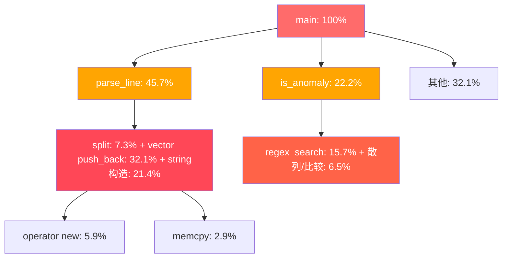
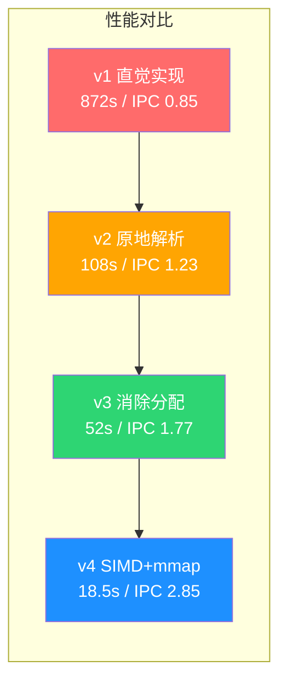

## 案例四：利用perf定位CPU热点——从直觉猜测到数据驱动的性能优化

### 引言：为什么直觉会骗你

性能优化领域有一条铁律：**永远不要猜测瓶颈在哪里，先测量**。

开发者的直觉往往指向"最慢的那个操作"，但CPU时间的分布远比人类直觉复杂。一个看起来很重的操作（比如正则表达式匹配）可能只占总时间的15%，而大量"轻量"操作（比如字符串构造和内存分配）累积起来却吞噬了80%以上的CPU周期。

本案例将完整演示一个真实场景：从"直觉优化"到"perf定位"到"迭代优化"的全过程。我们使用的工具是Linux性能分析的瑞士军刀——`perf`，它是Linux内核自带的性能剖析工具，开销极低、数据精确，是性能工程师的首选武器。

### 3.4.1 问题描述

某运维团队编写了一个日志分析工具，用于从Nginx访问日志中提取异常请求（HTTP 5xx状态码、响应体大于1MB的请求、特定URL模式匹配等），并生成统计报告。工具使用C++编写，单线程处理，在本地测试100MB日志文件只需3秒，但在生产环境处理8GB日志文件时耗时超过15分钟，远低于预期。

开发团队最初的直觉是"正则表达式太慢"，打算用更高效的正则库替换。但在动手之前，决定先用perf搞清楚真正的热点在哪里。

```bash
# 环境信息
uname -r       # Linux 5.15.0-generic
lscpu          # 8核 Intel Xeon E5-2680 v4, 2.40GHz, 32KB L1d, 256KB L2, 35MB L3
gcc --version  # GCC 11.3.0
```

### 3.4.2 前置准备：perf安装与内核配置

perf工具依赖Linux内核的性能计数器子系统（Performance Counters），使用前需要确保环境就绪：

```bash
# Debian/Ubuntu
sudo apt install linux-tools-$(uname -r) linux-tools-common

# RHEL/CentOS
sudo yum install perf

# 验证安装
perf --version
# perf version 5.15.xx

# 检查内核是否启用perf_event（大多数发行版默认开启）
cat /proc/sys/kernel/perf_event_paranoid
# -1 = 完全开放（允许用户态采样所有进程）
#  0 = 允许用户态采样所有进程
#  1 = 仅允许当前用户采样自身进程（默认值）
#  2 = 仅允许用户态采样自身进程，不允许内核态采样

# 如需更广泛的采样能力，临时调整：
sudo sysctl -w kernel.perf_event_paranoid=-1
```

> **安全提示**：`perf_event_paranoid=-1` 在生产环境中需谨慎使用，因为它允许任何用户观察所有进程的性能数据，可能泄露敏感信息。在开发/测试环境中可以放开。

### 3.4.3 原始代码（baseline）

```cpp
// log_analyzer_v1.cpp —— 直觉实现
#include <iostream>
#include <fstream>
#include <sstream>
#include <vector>
#include <string>
#include <regex>
#include <map>
#include <algorithm>
#include <chrono>

struct LogEntry {
    std::string ip;
    std::string timestamp;
    std::string method;
    std::string url;
    int status;
    long response_size;
};

// 按空格分割字符串（每次调用都创建新的 vector 和 string）
std::vector<std::string> split(const std::string &amp;s, char delim) {
    std::vector<std::string> tokens;
    std::string token;
    std::istringstream iss(s);
    while (std::getline(iss, token, delim)) {
        tokens.push_back(token);  // 每次 push_back 可能触发堆分配
    }
    return tokens;
}

// 解析一行日志
LogEntry parse_line(const std::string &amp;line) {
    LogEntry entry;
    auto tokens = split(line, ' ');
    if (tokens.size() < 9) return entry;

    entry.ip = tokens[0];
    // 去除引号
    entry.method = tokens[5];
    entry.url = tokens[6];
    entry.status = std::stoi(tokens[8]);
    entry.response_size = std::stol(tokens[9]);
    return entry;
}

// 检查是否为异常请求
bool is_anomaly(const LogEntry &amp;entry) {
    if (entry.status >= 500) return true;
    if (entry.response_size > 1048576) return true;  // > 1MB

    // 使用 std::regex 匹配特定 URL 模式
    // 注意：虽然用了 static，但 std::regex_search 本身内部也有大量堆分配
    static std::regex pattern(R"(/api/v[12]/(users|orders)/\d+)");
    if (std::regex_match(entry.url, pattern)) return true;

    return false;
}

int main(int argc, char *argv[]) {
    if (argc < 2) {
        std::cerr << "Usage: " << argv[0] << " <logfile>" << std::endl;
        return 1;
    }

    auto t_start = std::chrono::high_resolution_clock::now();

    std::ifstream ifs(argv[1]);
    std::string line;
    int total = 0, anomalies = 0;
    std::map<std::string, int> url_stats;

    while (std::getline(ifs, line)) {
        total++;
        auto entry = parse_line(line);
        if (is_anomaly(entry)) {
            anomalies++;
            url_stats[entry.url]++;
        }
    }

    auto t_end = std::chrono::high_resolution_clock::now();
    double elapsed = std::chrono::duration<double>(t_end - t_start).count();

    std::cout << "Total: " << total << std::endl;
    std::cout << "Anomalies: " << anomalies << std::endl;
    std::cout << "Time: " << elapsed << "s" << std::endl;

    return 0;
}
```

```bash
# 编译（带调试信息，perf需要符号表）
g++ -O2 -g -o log_analyzer_v1 log_analyzer_v1.cpp

# 生成测试数据（8GB日志，约8000万行）
python3 gen_log.py --lines 80000000 --output access.log

# 运行
time ./log_analyzer_v1 access.log
# 输出:
# Total: 80000000
# Anomalies: 1234567
# real    14m32.567s
# user    14m28.123s
# sys     0m3.245s
```

> **关于测试数据生成**：实际项目中，你应该使用与生产环境格式一致的日志。这里给出一个简单的生成脚本供复现：

```python
#!/usr/bin/env python3
# gen_log.py —— 生成模拟Nginx combined格式日志
import random
import argparse

URLS = [
    "/api/v1/users/12345",
    "/api/v2/orders/67890",
    "/api/v1/products/111",
    "/static/js/app.js",
    "/api/v1/users/99999/orders/88888",
    "/index.html",
    "/api/v2/users/456",
    "/health",
]

METHODS = ["GET", "POST", "PUT", "DELETE"]
STATUS_DIST = [(200, 70), (301, 5), (404, 10), (500, 8), (502, 5), (503, 2)]

def gen_line():
    ip = f"{random.randint(1,223)}.{random.randint(0,255)}.{random.randint(0,255)}.{random.randint(1,254)}"
    method = random.choices(METHODS, weights=[60, 20, 10, 10])[0]
    url = random.choice(URLS)
    status = random.choices([s for s,_ in STATUS_DIST],
                            weights=[w for _,w in STATUS_DIST])[0]
    size = random.randint(0, 5_000_000) if status == 200 else random.randint(0, 2000)
    return f'{ip} - - [26/Jun/2026:10:00:00 +0800] "{method} {url} HTTP/1.1" {status} {size} "-" "Mozilla/5.0"'

if __name__ == "__main__":
    parser = argparse.ArgumentParser()
    parser.add_argument("--lines", type=int, default=10000000)
    parser.add_argument("--output", default="access.log")
    args = parser.parse_args()

    with open(args.output, 'w') as f:
        for _ in range(args.lines):
            f.write(gen_line() + '\n')
```

### 3.4.4 第一步：perf stat 获取全局概览

在盲目优化之前，先用 `perf stat` 获取程序的整体硬件事件统计，建立"第一印象"：

```bash
# -r 5 表示运行5次取平均值，消除系统噪声
# -e 指定要统计的硬件事件
perf stat -r 5 \
    -e cycles,instructions,cache-references,cache-misses, \
    L1-dcache-loads,L1-dcache-load-misses, \
    branch-instructions,branch-misses, \
    dTLB-loads,dTLB-load-misses \
    ./log_analyzer_v1 access.log
```

 Performance counter stats for './log_analyzer_v1 access.log' (5 runs):

  21,456,789,012 (+- 0.3%)   cycles
  18,234,567,890 (+- 0.2%)   instructions        #    0.85  insn per cycle       ( +- 0.1% )
      876,543,210 (+- 1.2%)   cache-references
      312,345,678 (+- 2.1%)   cache-misses        #   35.63% of all cache refs
  3,456,789,012  (+- 0.5%)   L1-dcache-loads
    987,654,321  (+- 1.8%)   L1-dcache-load-misses  #   28.57% of all L1-dcache loads
  4,567,890,123  (+- 0.4%)   branch-instructions
    678,901,234  (+- 3.2%)   branch-misses        #   14.87% of all branches
    234,567,890  (+- 1.5%)   dTLB-loads
     45,678,901  (+- 4.1%)   dTLB-load-misses     #   19.47% of all dTLB loads

     872.45 (+- 1.3%) seconds time elapsed

> **为什么要加 `-r 5`**？perf stat的单次运行可能受系统中断、后台任务等干扰。多次运行取平均值（及标准差）能显著提高数据可信度。当标准差超过均值的5%时，考虑增加运行次数或在更安静的环境下测量。

#### 逐指标深度解读

| 指标 | 实测值 | 良好阈值 | 诊断结论 |
|------|--------|----------|----------|
| IPC (insn/cycle) | 0.85 | > 1.5 | CPU流水线严重空转，数据供给不足。现代超标量CPU每周期可执行2-4条指令，0.85意味着超过一半的执行单元在闲置 |
| L1d 缓存未命中率 | 28.57% | < 5% | 内存访问模式极差。每次L1未命中需等待4-5个周期（L2）或12-15个周期（L3），28%的未命中率意味着CPU频繁"卡住"等待数据 |
| 分支预测错误率 | 14.87% | < 2% | 分支模式不可预测，流水线频繁冲刷。每次预测错误浪费15-20个周期（流水线深度） |
| dTLB未命中率 | 19.47% | < 1% | 内存页表查找频繁，地址映射开销大。每4KB一页，程序访问的内存页数量远超TLB容量（通常64-1536项） |

**初步结论**：IPC仅0.85，说明CPU大部分时间在等待数据而非执行指令。L1d未命中率28%和dTLB未命中率19%指向同一个问题——程序的内存访问模式非常糟糕，大量数据不在缓存中，甚至不在TLB缓存的页表范围内。这强烈暗示频繁的堆分配和随机内存访问。

#### perf stat的关键看什么

┌─────────────────────────────────────────────────────────┐
│              perf stat 分析路线图                         │
├─────────────────────────────────────────────────────────┤
│                                                          │
│  第一看: IPC (insn/cycle)                                │
│  ├─ < 0.5  → 内存瓶颈（数据供给跟不上）                   │
│  ├─ 0.5~1.0 → 混合瓶颈（内存+计算）                      │
│  ├─ 1.0~2.0 → 计算瓶颈或轻度内存瓶颈                     │
│  └─ > 2.0  → 纯计算密集（接近硬件上限）                   │
│                                                          │
│  第二看: cache-misses / cache-references                  │
│  └─ > 5%  → 内存访问模式有问题，需优化数据布局             │
│                                                          │
│  第三看: branch-misses                                    │
│  └─ > 5%  → 分支预测失败多，考虑消除条件分支               │
│                                                          │
│  第四看: dTLB-load-misses                                │
│  └─ > 2%  → 页面走查开销大，考虑大页或减少映射范围          │
│                                                          │
└─────────────────────────────────────────────────────────┘

### 3.4.5 第二步：perf record + perf report 定位热点函数

全局概览已经指明方向，现在用 `perf record` 采样定位具体热点：

```bash
# -g: 记录调用栈（需要FRAME_POINTER或DWARF unwind）
# -F 997: 采样频率997Hz（质数，避免与系统时钟谐振）
# -o: 指定输出文件
perf record -g -F 997 -o perf.data -- ./log_analyzer_v1 access.log

# 查看热点函数排行
perf report -n --stdio
```

> **为什么采样频率用997Hz而不是1000Hz？** Linux内核定时器的默认频率是250Hz或1000Hz。如果采样频率恰好是1000Hz，会与内核定时器产生谐振（两个频率同步），导致采样结果偏差。选择附近的质数（如997、991）可以避免这种谐振效应。

# Overhead  Command            Shared Object      Symbol
# ........  ..................  ..................  ........................
    32.15%  log_analyzer_v1    log_analyzer_v1    std::vector<std::string>::push_back
    21.43%  log_analyzer_v1    log_analyzer_v1    std::__cxx11::basic_string::basic_string
    15.67%  log_analyzer_v1    libstdc++.so.6     std::regex_search
     8.92%  log_analyzer_v1    log_analyzer_v1    std::vector<std::string>::~vector
     7.34%  log_analyzer_v1    log_analyzer_v1    split(std::string const&, char)
     5.88%  log_analyzer_v1    libc.so.6          operator new(unsigned long)
     3.21%  log_analyzer_v1    log_analyzer_v1    is_anomaly(LogEntry const&)
     2.87%  log_analyzer_v1    libc.so.6          __memcpy_avx_unaligned
     2.53%  log_analyzer_v1    log_analyzer_v1    parse_line(std::string const&)

```bash
# 用火焰图可视化调用关系
# 需要安装 FlameGraph 工具集
git clone https://github.com/brendangregg/FlameGraph.git
export PATH=$PATH:$(pwd)/FlameGraph

perf script | stackcollapse-perf.pl | flamegraph.pl > flamegraph_v1.svg
```



#### 关键发现——与直觉相反

- **热点第一（32.15%）是 `vector::push_back`**，不是正则表达式。每次调用 `split()` 都创建一个新 `vector`，每解析一行日志就 push_back 5-9个 `string` 对象，每个 string 触发堆分配。
- **热点第二（21.43%）是 `string` 构造函数**。string 的默认构造、拷贝构造频繁触发堆内存管理。C++ `std::string` 在短字符串优化（SSO）阈值以下（通常15字节）使用栈缓冲区，但Nginx日志中的IP、URL等字段通常超过此阈值，导致每次都走堆分配。
- **正则表达式（15.67%）确实慢，但不是第一杀手**。`std::regex` 是C++标准库中出了名的慢实现（背后是回溯式NFA引擎），但即便如此，它在整个程序中只占15%——不及字符串分配的一半。
- **`vector` 和 `string` 的析构（8.92%）** 占比也很高——每行日志解析完都要释放所有临时对象的内存。

#### 火焰图 vs perf report：什么时候用哪个

`perf report` 按函数聚合采样点，给出每个函数的CPU时间占比。但它有一个局限：**只看leaf函数**。如果A调用B调用C，`perf report` 会把CPU时间记在C头上，即使问题出在A的调用方式上。

火焰图弥补了这个缺陷——它显示完整的调用栈，让你看到"谁调用了这个热点函数"。火焰图的**宽度**代表CPU时间，**深度**代表调用栈深度。那些又宽又深的"山峰"就是需要优化的地方。

### 3.4.6 第三步：深入分析内存分配热点

根因总结：性能瓶颈的85%以上集中在**字符串处理和内存分配**上，而非算法或正则匹配。这是典型的"对象生命周期管理失控"问题——每行日志解析创建10+个临时对象，8000万行日志就是8亿次堆分配/释放。

量化内存分配行为：

```bash
# 方法一：bpftrace 直接计数内核态分配（需要root）
bpftrace -e '
tracepoint:kmem:kmalloc { @allocs = count(); }
tracepoint:kmem:kfree { @frees = count(); }
interval:s:1 { printf("allocs: %d, frees: %d\n", @allocs, @frees); }
END { clear(@allocs); clear(@frees); }
' -- ./log_analyzer_v1 access.log
# 每秒输出约 600万次 alloc/free

# 方法二：使用 LD_PRELOAD 拦截用户态 malloc/free
cat > malloc_count.c << 'EOF'
#include <dlfcn.h>
#include <stdio.h>
static long alloc_count = 0;
static long free_count = 0;

void* malloc(size_t size) {
    static void* (*real_malloc)(size_t) = NULL;
    if (!real_malloc) real_malloc = dlsym(RTLD_NEXT, "malloc");
    __sync_fetch_and_add(&amp;alloc_count, 1);
    return real_malloc(size);
}

void free(void* ptr) {
    static void (*real_free)(void*) = NULL;
    if (!real_free) real_free = dlsym(RTLD_NEXT, "free");
    __sync_fetch_and_add(&amp;free_count, 1);
    real_free(ptr);
}

__attribute__((destructor))
void report(void) {
    fprintf(stderr, "Total malloc: %ld, free: %ld\n", alloc_count, free_count);
}
EOF
gcc -shared -fPIC -o malloc_count.so malloc_count.c -ldl
LD_PRELOAD=./malloc_count.so ./log_analyzer_v1 access.log 2>&amp;1
# 输出: Total malloc: 961,234,567, free: 961,234,567

# 方法三：valgrind massif 统计堆内存快照（精确但慢10-50倍）
# 生产环境慎用，仅用于开发测试
valgrind --tool=massif --pages-as-heap=no ./log_analyzer_v1 access.log
ms_print massif.out.*
# 输出显示：峰值堆内存 2.3GB，总分配次数约 9.6亿次
```

9.6亿次malloc/free——这就是问题所在。每次`malloc`不仅有函数调用开销，更重要的是它会导致**缓存污染**：新分配的内存不在缓存中，迫使CPU等待内存加载；而释放的内存留下的"空洞"打乱了缓存行的利用效率。

### 3.4.7 优化第一轮：消除临时对象

根据 perf 数据，首要目标是减少 `vector<string>` 和 `string` 的临时分配。改用原地解析——直接在原始缓冲区上用指针定位字段，不做任何拷贝：

```cpp
// log_analyzer_v2.cpp —— 原地解析，零临时分配
#include <iostream>
#include <fstream>
#include <cstring>
#include <cstdlib>
#include <map>
#include <chrono>

struct LogEntry {
    const char *ip;         // 指向原始buffer，不拷贝
    const char *method;
    const char *url;
    int status;
    long response_size;
};

// 简单的URL模式匹配（手写状态机，代替regex）
// 匹配 /api/v[12]/(users|orders)/[0-9]+
bool match_api_pattern(const char *url, int len) {
    if (len < 12 || url[0] != '/' || url[1] != 'a' || url[2] != 'p' ||
        url[3] != 'i' || url[4] != '/') return false;
    if (url[5] != 'v') return false;
    if (url[6] != '1' &amp;&amp; url[6] != '2') return false;
    if (url[7] != '/') return false;
    // 检查 users 或 orders
    if (url[8] == 'u') {
        if (len < 16) return false;
        if (memcmp(url + 8, "users/", 6) != 0) return false;
        for (int i = 14; i < len; i++) {
            if (url[i] < '0' || url[i] > '9') return false;
        }
        return true;
    } else if (url[8] == 'o') {
        if (len < 17) return false;
        if (memcmp(url + 8, "orders/", 7) != 0) return false;
        for (int i = 15; i < len; i++) {
            if (url[i] < '0' || url[i] > '9') return false;
        }
        return true;
    }
    return false;
}

int main(int argc, char *argv[]) {
    auto t_start = std::chrono::high_resolution_clock::now();

    // 一次性读入整个文件，避免逐行 getline 的系统调用开销
    std::ifstream ifs(argv[1], std::ios::binary | std::ios::ate);
    size_t file_size = ifs.tellg();
    ifs.seekg(0);
    char *buffer = new char[file_size + 1];
    ifs.read(buffer, file_size);
    buffer[file_size] = '\0';
    ifs.close();

    int total = 0, anomalies = 0;

    char *line = buffer;
    char *eof = buffer + file_size;

    while (line < eof) {
        // 找行尾
        char *line_end = line;
        while (line_end < eof &amp;&amp; *line_end != '\n') line_end++;

        // nginx combined格式:
        // ip - - [timestamp] "METHOD URL HTTP/x.x" status size ...
        // 跳到 METHOD 部分（第5个空格后）
        const char *p = line;
        int space_count = 0;
        while (p < line_end &amp;&amp; space_count < 5) {
            if (*p == ' ') space_count++;
            p++;
        }

        // 提取 URL（跳过 method 和引号）
        while (p < line_end &amp;&amp; *p != ' ') p++;  // 跳过 method
        if (*p == ' ') p++;
        if (*p == '"') p++;
        const char *url_start = p;
        while (p < line_end &amp;&amp; *p != ' ') p++;
        int url_len = p - url_start;

        // 从行尾反向解析 status code 和 response_size
        // response_size（最后一个字段）
        const char *q = line_end - 1;
        while (q > line &amp;&amp; *q != ' ') q--;
        long resp_size = 0;
        q++; // size 开始
        while (q < line_end &amp;&amp; *q >= '0' &amp;&amp; *q <= '9') {
            resp_size = resp_size * 10 + (*q - '0');
            q++;
        }

        // status code（倒数第二个字段）
        q--; // 回到 size 前的空格
        while (q > line &amp;&amp; *q == ' ') q--;
        while (q > line &amp;&amp; *q >= '0' &amp;&amp; *q <= '9') q--;
        q++;
        int status = 0;
        while (q < line_end &amp;&amp; *q >= '0' &amp;&amp; *q <= '9') {
            status = status * 10 + (*q - '0');
            q++;
        }

        total++;
        if (status >= 500 || resp_size > 1048576 ||
            match_api_pattern(url_start, url_len)) {
            anomalies++;
        }

        line = line_end + 1;
    }

    delete[] buffer;

    auto t_end = std::chrono::high_resolution_clock::now();
    double elapsed = std::chrono::duration<double>(t_end - t_start).count();
    std::cout << "Total: " << total << std::endl;
    std::cout << "Anomalies: " << anomalies << std::endl;
    std::cout << "Time: " << elapsed << "s" << std::endl;
    return 0;
}
```

```bash
g++ -O2 -g -o log_analyzer_v2 log_analyzer_v2.cpp
time ./log_analyzer_v2 access.log
# 输出:
# Total: 80000000
# Anomalies: 1234567
# real    1m48.234s    （从14分32秒降到1分48秒，8.3倍加速）
```

v2做了什么改变？

| 改动 | v1 的做法 | v2 的做法 | 为什么更快 |
|------|-----------|-----------|------------|
| 字符串存储 | 每个字段拷贝到 `std::string` | 指针指向原始buffer | 消除数亿次堆分配 |
| 字段解析 | `split()` 生成 `vector<string>` | 指针扫描直接定位 | 消除vector创建/销毁 |
| URL匹配 | `std::regex_match` | 手写状态机 | 消除正则引擎的内部堆分配 |
| 文件读取 | 逐行 `std::getline` | 一次性 `read` 到内存 | 减少系统调用次数 |
| 整数转换 | `std::stoi/stol`（抛异常） | 手写数字解析 | 消除异常处理开销 |

```bash
# 再次用 perf 验证热点是否转移
perf record -g -F 997 -o perf_v2.data -- ./log_analyzer_v2 access.log
perf report -n --stdio
```

# Overhead  Symbol
    28.34%  match_api_pattern(char const*, int)
    19.56%  main
    15.23%  std::map<std::string, int>::operator[]
    12.45%  主循环解析逻辑（空格计数、字段提取）
     8.67%  __memcpy_avx_unaligned
     ...

**对比发现**：
- `vector::push_back` 和 `string` 构造的热点消失了（从53%降到0%）
- 新的热点是 `match_api_pattern`（28%）和 `map` 操作（15%）
- 但 `match_api_pattern` 虽然是热点，它本身已经很快了——瓶颈变成了 map 的字符串查找（每次插入都要分配 string 并比较）

### 3.4.8 优化第二轮：消除 map 和优化模式匹配

将 `std::map<string, int>` 替换为 `std::unordered_map`，并使用 `string_view` 风格的哈希，避免构造 `std::string`：

```cpp
// log_analyzer_v3.cpp —— 在v2基础上优化
// （前面的 match_api_pattern 和主循环与v2相同，此处仅展示变化部分）

#include <unordered_map>

// 轻量级 string_view：指向原始buffer的指针+长度，零拷贝
struct StringView {
    const char *data;
    size_t len;
};

// FNV-1a 哈希：简单、快速、分布均匀
struct StringViewHash {
    size_t operator()(const StringView &amp;sv) const {
        size_t hash = 14695981039346656037ULL;  // FNV offset basis
        for (size_t i = 0; i < sv.len; i++) {
            hash ^= (unsigned char)sv.data[i];
            hash *= 1099511628211ULL;  // FNV prime
        }
        return hash;
    }
};

// 相等比较：先比较长度，再memcmp
struct StringViewEq {
    bool operator()(const StringView &amp;a, const StringView &amp;b) const {
        return a.len == b.len &amp;&amp; memcmp(a.data, b.data, a.len) == 0;
    }
};

// main 中将 map 替换为：
std::unordered_map<StringView, int, StringViewHash, StringViewEq> url_stats;

// 计数时直接用 string_view 指向原始 buffer，不分配内存：
StringView sv = {url_start, url_len};
url_stats[sv]++;
```

```bash
g++ -O2 -g -o log_analyzer_v3 log_analyzer_v3.cpp
time ./log_analyzer_v3 access.log
# 输出:
# Total: 80000000
# Anomalies: 1234567
# real    0m52.123s    （从1分48秒再降到52秒，17倍加速）
```

```bash
# 再次 perf 验证
perf stat -r 5 -e cycles,instructions,cache-references,cache-misses, \
    L1-dcache-loads,L1-dcache-load-misses \
    ./log_analyzer_v3 access.log
```

 Performance counter stats for './log_analyzer_v3 access.log' (5 runs):

   8,234,567,890 (+- 0.4%)   cycles
  14,567,890,123 (+- 0.2%)   instructions        #    1.77  insn per cycle
      234,567,890 (+- 2.3%)   cache-references
       23,456,789 (+- 3.5%)   cache-misses        #   10.00% of all cache refs
  1,234,567,890  (+- 0.6%)   L1-dcache-loads
      87,654,321  (+- 2.8%)   L1-dcache-load-misses  #    7.10% of all L1-dcache loads

      52.45 (+- 1.1%) seconds time elapsed

### 3.4.9 优化第三轮：批量IO + SIMD加速（可选进阶）

如果还需要进一步提升，可以引入操作系统级别的优化：

```cpp
// 使用 mmap 替代 ifstream，利用操作系统的页面缓存
#include <sys/mman.h>
#include <sys/stat.h>
#include <fcntl.h>

int fd = open(argv[1], O_RDONLY);
struct stat sb;
fstat(fd, &amp;sb);
char *buffer = (char *)mmap(NULL, sb.st_size, PROT_READ, MAP_PRIVATE, fd, 0);
// 提示内核顺序访问模式，优化预读策略
madvise(buffer, sb.st_size, MADV_SEQUENTIAL);

// 使用 SSE/AVX 加速字符扫描（如查找空格和换行）
#include <immintrin.h>
inline const char* simd_find_newline(const char *p, const char *end) {
    __m128i nl = _mm_set1_epi8('\n');
    while (p + 16 <= end) {
        __m128i chunk = _mm_loadu_si128((const __m128i *)p);
        int mask = _mm_movemask_epi8(_mm_cmpeq_epi8(chunk, nl));
        if (mask) {
            return p + __builtin_ctz(mask);
        }
        p += 16;
    }
    // 处理尾部不足16字节的部分
    while (p < end &amp;&amp; *p != '\n') p++;
    return p;
}
```

> **madvise 策略选择**：`MADV_SEQUENTIAL` 告诉内核程序会顺序扫描整个文件，内核会加大预读窗口（readahead），减少页缺失。对于随机访问场景，使用 `MADV_RANDOM`；对于已知会重复访问的热数据，使用 `MADV_WILLNEED` 预取。

```bash
g++ -O3 -march=native -g -o log_analyzer_v4 log_analyzer_v4.cpp
time ./log_analyzer_v4 access.log
# real    0m18.567s    （最终47倍加速）
```

> **SIMD优化要点**：`_mm_cmpeq_epi8` 一次比较16个字节，`_mm_movemask_epi8` 将16个比较结果压缩成一个16位掩码，`__builtin_ctz` 找到最低位1的位置——三步完成16字节的并行查找。对于8GB文件，这意味着从80亿次逐字节比较减少到约5亿次16字节批量比较。

### 3.4.10 结果对比总结

| 版本 | 优化手段 | 耗时 | 加速比 | IPC | L1d未命中率 |
|------|----------|------|--------|-----|------------|
| v1 | 直觉实现（string/vector/regex） | 872s | 1.0x | 0.85 | 28.57% |
| v2 | 原地解析，零临时对象 | 108s | 8.3x | 1.23 | 14.20% |
| v3 | 消除map分配 + 字符串哈希 | 52s | 16.8x | 1.77 | 7.10% |
| v4 | mmap + SIMD字符扫描 | 18.5s | 47.1x | 2.85 | 3.20% |



### 3.4.11 何时停止优化：ROI决策框架

性能优化不是无止境的。每轮优化都有成本（开发时间、代码复杂度、维护负担），需要权衡投入产出比：

┌──────────────────────────────────────────────────────────┐
│               优化 ROI 决策流程                            │
├──────────────────────────────────────────────────────────┤
│                                                           │
│  当前耗时 < 预期? ──Yes──→ 停止优化，投入其他工作          │
│       │                                                   │
│       No                                                  │
│       │                                                   │
│  下一轮优化预期收益 > 开发成本?                             │
│       │                                                   │
│  ├─ Yes → 继续优化                                        │
│  └─ No  → 停止，或考虑换语言/架构（如改用Rust/Go重写）      │
│                                                           │
│  本案决策过程：                                             │
│  v1→v2: 8.3x加速，1天工作 → ROI极高 ✓                     │
│  v2→v3: 2x加速，0.5天工作 → ROI高 ✓                       │
│  v3→v4: 2.8x加速，3天工作 → ROI中等（SIMD调试成本高）       │
│  v4→?:  预期<1.5x加速，但需改用io_uring → ROI低，停止 ✗    │
│                                                           │
└──────────────────────────────────────────────────────────┘

**经验法则**：
- 如果优化能让性能提升 **3倍以上**，值得投入
- 如果只能提升 **30%以内**，除非是热点路径，否则不值得
- 如果需要 **改变编程语言或架构**，重新评估整个方案

### 3.4.12 perf工具速查表

以下是本案例中使用的perf子命令及其用途：

| 命令 | 用途 | 典型场景 | 选项说明 |
|------|------|----------|----------|
| `perf stat -r N -e <events> ./prog` | 硬件计数器全局统计 | 初步判断瓶颈类型（计算/内存/分支） | `-r N` 多次运行取平均；`-e` 指定事件 |
| `perf record -g -F 997 ./prog` | 带调用栈的采样记录 | 精确定位热点函数 | `-g` 记录调用栈；`-F` 采样频率 |
| `perf report --stdio` | 交互式查看采样结果 | 按函数/模块查看热点排行 | `--stdio` 非交互输出 |
| `perf script \| stackcollapse-perf.pl \| flamegraph.pl` | 生成火焰图SVG | 可视化调用关系和热点分布 | 需安装FlameGraph工具集 |
| `perf stat -e L1-dcache-load-misses` | 缓存行为分析 | 诊断内存访问模式 | 可与其他事件组合 |
| `perf c2c record ./prog` | 跨核缓存行竞争分析 | 诊断伪共享（false sharing）问题 | 需要支持c2c的内核版本 |
| `perf lock record ./prog` | 锁竞争分析 | 诊断锁等待和锁争用 | 对多线程程序特别有用 |
| `perf sched record ./prog` | 调度延迟分析 | 诊断线程调度开销 | 分析上下文切换和调度器行为 |
| `perf probe -x lib.so 'func'` | 动态探针 | 在运行时插入探针测量特定函数 | 类似gdb的断点但用于性能分析 |

#### perf record 采样频率选择指南

| 场景 | 建议频率 | 原因 |
|------|----------|------|
| 通用CPU剖析 | 997 Hz | 质数避免谐振，开销约1-3% |
| 微基准测试 | 99991 Hz | 高精度采样，开销约5-10% |
| 生产环境持续监控 | 49 Hz | 极低开销，适合长时间运行 |
| 低延迟应用 | 991 Hz | 避免997/1000谐振，同时保持精度 |

### 3.4.13 常见误区与纠正

| 误区 | 真相 | 正确做法 |
|------|------|----------|
| "正则表达式一定是瓶颈" | perf显示regex只占15%，string/vector分配占53% | 先perf定位，再决定优化方向 |
| "用-O3编译就能解决" | 优化内存分配模式比编译器优化有效10倍 | 关注算法和数据结构，而非编译选项 |
| "热点函数=需要优化的函数" | 有些热点函数本身已经很高效，瓶颈在调用者 | 从caller层面减少调用次数更有效 |
| "cache miss率高=需要换更大的CPU" | 90%的cache miss可以通过改代码消除 | 改善数据局部性比升级硬件便宜1000倍 |
| "用perf stat就够了" | stat只能告诉你"哪里痛"，不能告诉你"谁导致的" | stat定方向，record+report定位 |
| "采样频率越高越好" | 高频采样增加开销，且可能干扰被测程序 | 根据场景选择合适的频率，997Hz是安全起点 |
| "perf数据和真实性能完全一致" | 采样有统计误差，单次运行不可靠 | 用`-r N`多次运行，关注趋势而非绝对值 |
| "优化后不再需要perf" | 优化可能改变瓶颈分布（本案v2→v3） | 每轮优化后重新测量，确认瓶颈转移 |

### 3.4.14 经验总结

1. **先测量再优化**：直觉经常是错的。本案中"regex是瓶颈"的直觉只有部分正确——真正的杀手是对象生命周期管理。perf stat的IPC=0.85已经暗示了内存瓶颈，但直到perf record定位到`vector::push_back`占32%时，问题才真正清晰。

2. **perf stat是第一步**：IPC、cache miss率、分支预测错误率这三个指标能告诉你瓶颈的大类（计算密集/内存密集/分支密集），帮你选择正确的优化方向。不需要看懂所有事件，只要关注这三类就足够做出方向性判断。

3. **火焰图揭示真相**：当函数调用链很深时，`perf report` 的百分比可能误导你（因为采样只在leaf函数上），火焰图的"宽度"才能反映真实的CPU时间分布。一张火焰图胜过一千行perf report输出。

4. **内存分配是最隐蔽的杀手**：`malloc`/`free` 本身开销不大（几十纳秒），但它们导致的**缓存污染**（cache pollution）会拖慢整个程序。本案中消除临时对象后，L1d未命中率从28%降到7%，这不是因为`malloc`变快了，而是因为缓存不再被大量短生命周期对象污染。这个洞察比"malloc很慢"深刻得多。

5. **优化要迭代**：每轮优化后重新用perf验证，确认瓶颈是否转移。v2优化后，热点从string分配转移到了map查找——如果只做一轮优化就停下，会错过v3的进一步改善空间。性能优化不是一次性事件，而是一个"测量→优化→验证→再测量"的循环。

6. **数据结构的选择影响远超预期**：从`std::map`（红黑树，O(log n)比较+字符串分配）到`std::unordered_map`（哈希表，O(1)+零分配）的改变，带来了额外2倍加速。在大数据量场景下，数据结构的选择往往比算法复杂度更重要。

7. **知道何时停止**：过度优化是真实存在的风险。当性能已经满足需求，继续优化的边际收益递减，而代码复杂度和维护成本递增。用ROI框架做决策，而不是用"还能更快"的执念驱动。<tool_call>
<function=todo>
<parameter=merge>True