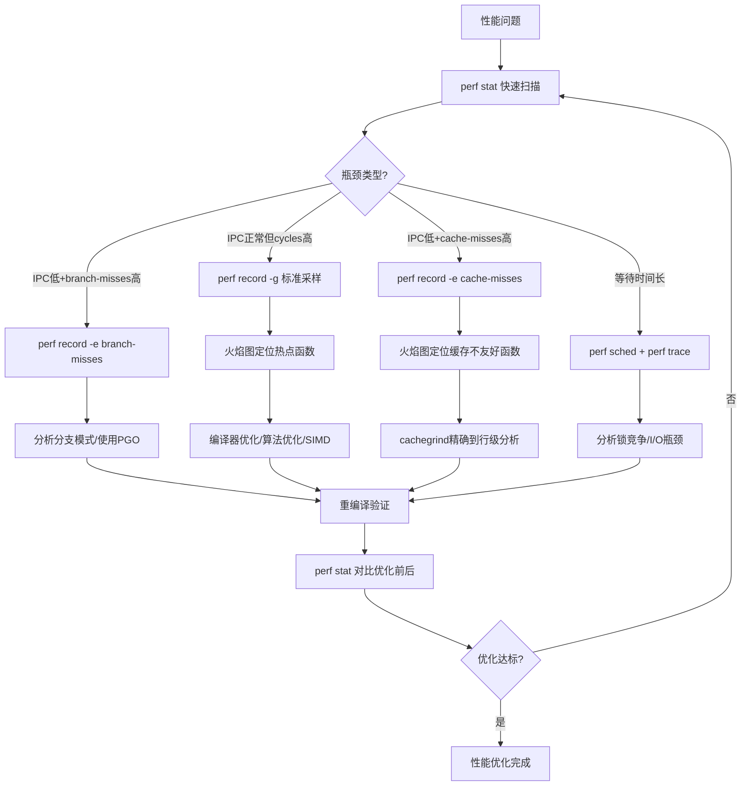

## 2.1 使用perf分析CPU行为

性能优化的铁律是"先测量，再优化"。在Linux系统上，`perf`是与CPU硬件性能计数器（PMU, Performance Monitoring Unit）直接对话的终极工具。它能让你看到CPU每一条指令的执行细节——缓存命中率、分支预测准确率、IPC（每周期指令数），这些数据不是猜测，而是硬件计数器的精确读数。

本节将从安装配置到高级分析，系统性地讲解如何用perf剖析CPU行为，让你从"感觉程序慢"进化到"精确知道慢在哪里"。

### 2.1.1 perf是什么——为什么它是性能分析的首选

perf是Linux内核自带的性能分析工具集，直接访问CPU的PMU（Performance Monitoring Unit）。与其他工具相比，它有三个无可替代的优势：

**零开销采样**：perf使用内核中断驱动的采样机制，而非软件插桩。CPU每执行N个事件（如每10000个时钟周期）自动触发一次采样中断，性能开销通常低于1%。相比之下，Valgrind等插桩工具会把程序放慢5-50倍。

**硬件级精度**：perf直接读取PMU寄存器，获得的是CPU硬件的真实计数——不是统计估算，不是模拟数据。这让你能精确区分"是算法慢"还是"是缓存不友好"。

**全栈视野**：从用户态函数调用栈到内核系统调用，从L1缓存到TLB未命中，perf覆盖了CPU执行链的每一个环节。

perf工具架构
┌─────────────────────────────────────────────┐
│  用户空间                                    │
│  ┌─────────┐  ┌──────────┐  ┌────────────┐ │
│  │perf stat│  │perf record│  │perf trace  │ │
│  └────┬────┘  └─────┬────┘  └─────┬──────┘ │
│       │             │             │          │
│  ─────┼─────────────┼─────────────┼──────── │
│       │             │    内核空间  │          │
│  ┌────┴─────────────┴─────────────┴──────┐ │
│  │         perf_event_open() 系统调用      │ │
│  │  ┌──────────────────────────────────┐  │ │
│  │  │  PMU驱动  │  调度器  │  tracepoint│  │ │
│  │  └──────────────────────────────────┘  │ │
│  └────────────────────────────────────────┘ │
└─────────────────────────────────────────────┘

### 2.1.2 安装与环境准备

perf的版本必须与内核版本严格匹配。使用不匹配的perf版本会导致部分事件不可用甚至采样数据错误。

```bash
# Ubuntu/Debian — 安装与内核版本匹配的perf
sudo apt install linux-tools-common linux-tools-$(uname -r)

# CentOS/RHEL/Fedora
sudo yum install perf        # CentOS 7
sudo dnf install perf        # CentOS 8+ / Fedora

# Arch Linux
sudo pacman -S linux-tools   # 安装后位于 /usr/lib/linux-tools/
```

安装后验证版本是否匹配：

```bash
perf --version
# 应该显示与 uname -r 匹配的内核版本号

# 检查PMU是否可用
perf list | head -20
# 如果看到 hw/cache/events 类别下有事件，说明PMU正常工作
```

**权限问题**：默认情况下，普通用户只能采样自己的进程。要采样所有进程或系统级事件，需要调整内核参数：

```bash
# 临时生效
sudo sysctl -w kernel.perf_event_paranoid=-1

# 永久生效
echo 'kernel.perf_event_paranoid=-1' | sudo tee -a /etc/sysctl.conf
sudo sysctl -p

# 各级别含义：
# -1 = 无限制（允许采样所有进程+内核）
#  0 = 允许采样所有进程
#  1 = 仅允许采样自身进程（默认值）
#  2 = 禁止采样（Docker容器中常见）
```

### 2.1.3 perf stat——量化CPU行为的第一步

`perf stat`是最常用的入口命令，它运行目标程序并在结束后输出硬件计数器的汇总统计。对于"我的程序到底慢在哪里"这个问题，perf stat通常是第一个该问的工具。

#### 基础用法

```bash
# 最简单的用法：运行程序并统计
perf stat ./your_program

# 统计指定命令行（避免程序启动时间干扰）
perf stat -e cycles,instructions,cache-misses -- ./your_program --flag1 arg1

# 多次运行取平均（消除随机波动）
perf stat -r 10 ./your_program

# 附加时间统计
perf stat -e task-clock,cycles,instructions ./your_program
```

#### 输出解读——逐行看懂perf stat

$ perf stat -e cycles,instructions,cache-misses,cache-references,\
  branch-misses,branch-instructions,L1-dcache-load-misses,\
  L1-dcache-loads ./matrix_multiply

 Performance counter stats for './matrix_multiply':

     1,234,567,890      cycles
     2,345,678,901      instructions        # 1.90 insn per cycle
        12,345,678      cache-misses
        98,765,432      cache-references    # 12.50% cache miss rate
         3,456,789      branch-misses
       234,567,890      branch-instructions # 1.47% branch miss rate
         1,234,567      L1-dcache-load-misses
       456,789,012      L1-dcache-loads     # 0.27% L1 miss rate

       3.456789123 seconds time elapsed
       3.234567890 seconds user
       0.123456789 seconds sys

**关键性能指标速查表**：

| 指标 | 计算方式 | 良好范围 | 差的值意味着什么 |
|------|---------|---------|----------------|
| IPC（insn per cycle） | instructions / cycles | >1.5（超标量CPU可达3-4） | CPU流水线频繁停顿，等待数据或分支 |
| 缓存未命中率 | cache-misses / cache-references | <5% | 程序访问模式不友好，数据局部性差 |
| 分支预测错误率 | branch-misses / branch-instructions | <3% | 代码中大量不可预测的条件分支 |
| L1缓存未命中率 | L1-dcache-load-misses / L1-dcache-loads | <10% | 数据访问跨度过大或步长不规则 |
| cycle周转率 | cycles / task-clock | 接近CPU频率 | 多核利用率不足或等待I/O |
| insn完成率 | instructions / task-clock | 接近CPU频率×IPC | 代码指令集不高效 |

**IPC解读要点**：IPC是最综合的指标。现代超标量CPU（如Intel Skylake、AMD Zen）每个周期可以执行4-6条指令。如果你的程序IPC低于1.0，说明CPU大部分时间在等待——要么等缓存，要么等内存，要么等分支预测恢复。

#### 常用PMU事件分类

```bash
# 查看所有可用事件
perf list

# 按类别筛选
perf list hw          # 硬件事件（cycles, instructions, cache等）
perf list cache       # 缓存相关事件
perf list branch      # 分支相关事件
perf list task        # 软件事件（page-faults, context-switches等）
perf list tracepoint  # 内核tracepoint事件

# 使用通用事件名（推荐，跨平台兼容）
perf stat -e cycles,instructions,cache-misses,branch-misses -- ./prog

# 使用架构特定事件名（Intel示例）
perf stat -e LLC-load-misses,LLC-loads,dTLB-load-misses -- ./prog
```

### 2.1.4 perf record + perf report——找到热点函数

知道"慢"还不够，需要知道"哪里慢"。`perf record`在程序运行期间按采样频率收集调用栈信息，`perf report`则将采样结果可视化。

#### 采样分析流程

```bash
# 基本采样（默认采样频率997Hz，使用-997而非-1000避免与定时器对齐产生偏差）
perf record -g ./your_program
perf report

# 指定采样频率（Hz：每秒采样次数）
perf record -F 99 -g -- ./your_program      # 99Hz，低开销
perf record -F 997 -g -- ./your_program     # 997Hz，标准精度
perf record -F 9999 -g -- ./your_program    # 9999Hz，高精度，开销略高

# 采样特定事件（而非默认的cycles）
perf record -e cache-misses -g -- ./your_program
perf record -e branch-misses -g -- ./your_program

# 限定PID（分析正在运行的进程）
perf record -F 999 -g -p <PID> -- sleep 30
# 运行30秒后停止，收集PID为<PID>的进程数据

# 限定CPU核心
perf record -F 999 -g -C 0 -- ./your_program  # 仅在CPU 0上采样
```

#### 报告解读

```bash
perf report

# 常用交互操作：
# Enter  — 展开/折叠调用栈
# +      — 展开全部
# a      — 指令地址与符号关联
# /      — 搜索函数名

# 输出为文本格式（便于脚本处理）
perf report --stdio

# 按调用图排序
perf report --call-graph=graph

# 限定显示特定进程
perf report --comm=your_program
```

输出示例：

Overhead  Command          Shared Object      Symbol
  45.23%  matrix_multiply  matrix_multiply    [.] multiply_block
  18.67%  matrix_multiply  matrix_multiply    [.] transpose_matrix
  12.34%  matrix_multiply  libc.so.6          [.] __memcpy_avx2
   8.91%  matrix_multiply  matrix_multiply    [.] init_matrix
   5.43%  matrix_multiply  libc.so.6          [.] __memset_avx2
   3.22%  matrix_multiply  [kernel]           [.] _raw_spin_lock

**如何读**：Overhead表示该函数及其被调用函数占总采样数的百分比。如果一个函数占45%，说明程序近一半时间花在这个函数及其子调用上——这就是你的优化重点。

### 2.1.5 火焰图——调用栈的可视化利器

火焰图（Flame Graph）由Brendan Gregg发明，是将perf record的调用栈数据可视化为水平柱状图的方法。每个矩形代表一个函数，宽度表示采样占比，高度表示调用深度。

#### 生成火焰图

```bash
# 方法一：使用Brendan Gregg的原始脚本
git clone https://github.com/brendangregg/FlameGraph.git
export PATH=$PATH:$(pwd)/FlameGraph

# 生成数据
perf record -F 99 -g -- ./your_program
# 或对正在运行的进程采样30秒
perf record -F 99 -g -p <PID> -- sleep 30

# 折叠调用栈并生成SVG
perf script | stackcollapse-perf.pl | flamegraph.pl > flamegraph.svg

# 方法二：使用perf内置参数（perf 6.x+）
perf record -F 99 -g -- ./your_program
perf script -F +pid,+tid,+comm,+callchain > out.perf-script
# 然后用 FlameGraph 处理

# 方法三：一键生成（推荐）
perf record -F 99 -g -- ./your_program
perf script | stackcollapse-perf.pl | flamegraph.pl \
  --title "CPU Flame Graph - $(date)" \
  --subtitle "perf record -F 99 -g" \
  --width 1200 \
  > flamegraph.svg
```

#### 火焰图阅读指南

火焰图的X轴表示采样占比（宽度），Y轴表示调用深度（不是时间线）：

                    ┌─────────────────────┐
                    │    main()           │
                    │    (100%)           │
                    ├──────────┬──────────┤
              ┌─────┤ process()│ init()   │
              │     │ (70%)    │ (30%)    │
              │     ├─────┬────┤          │
              │     │work()│log()│        │
              │     │(65%) │(5%) │        │
              │     ├──────┤    │         │
        ┌─────┤     │memset│    │         │
        │     │     │(60%) │    │         │
        │     │     │      │    │         │
     ▓▓▓▓▓▓▓▓▓▓▓▓▓▓▓▓▓▓▓▓▓▓▓▓▓▓▓▓▓▓▓▓▓▓▓▓
     ←── X轴：采样占比（越宽=调用越多）──→

**解读要点**：

1. **顶层宽函数**：如果顶层函数很宽但子函数不宽，说明开销在该函数自身（如系统调用、内核态切换）
2. **底层宽函数**：底层"平顶山"形状表示热循环——这是真正的CPU密集型代码
3. **锯齿形状**：宽度剧烈变化的层级意味着调用路径分化——不同输入走不同分支
4. **颜色**：默认暖色（红/橙）表示CPU时间多，冷色（蓝）表示少。自定义颜色可标注代码类型

#### 差分火焰图——对比优化前后

```bash
# 优化前采样
perf record -F 99 -g -o perf.before -- ./your_program_before
perf script -i perf.before > perf.before.script

# 优化后采样
perf record -F 99 -g -o perf.after -- ./your_program_after
perf script -i perf.after > perf.after.script

# 生成差分火焰图（红色=优化后变慢，蓝色=优化后变快）
difffolded.pl perf.before.folded perf.after.folded | \
  flamegraph.pl > diff-flamegraph.svg
```

### 2.1.6 缓存行为深度分析

缓存未命中往往是CPU性能的最大杀手。一次L1缓存命中只需4个周期，一次L3缓存命中需要40个周期，而一次DRAM访问需要200+个周期。perf提供了多层级缓存事件的精确计数。

#### 缓存层级事件

```bash
# L1数据缓存分析
perf stat -e L1-dcache-loads,L1-dcache-load-misses,\
L1-dcache-stores,L1-dcache-store-misses -- ./your_program

# L1指令缓存分析（对JIT编译器或自修改代码重要）
perf stat -e L1-icache-loads,L1-icache-load-misses -- ./your_program

# LLC（Last Level Cache，通常是L3）分析
perf stat -e LLC-loads,LLC-load-misses,LLC-stores -- ./your_program

# TLB（Translation Lookaside Buffer）分析
perf stat -e dTLB-loads,dTLB-load-misses,\
iTLB-loads,iTLB-load-misses -- ./your_program

# 本地DRAM vs 远端NUMA内存
perf stat -e node-loads,node-load-misses,\
node-stores,node-store-misses -- ./your_program
```

#### 预取器行为分析

CPU预取器（prefetcher）会尝试预测你即将访问的数据并提前加载到缓存。分析预取器行为能揭示数据访问模式的问题：

```bash
# 预取指令成功/失败
perf stat -e L1-dcache-prefetches,L1-dcache-prefetch-misses -- ./your_program

# 当prefetch-misses很高时，说明预取器猜错了你的访问模式
# 可能原因：随机访问、步长不规则、跨度过大
```

#### 使用cachegrind做细粒度缓存分析

当perf stat只给你总体缓存未命中率时，Valgrind的cachegrind工具能精确到每一行代码的缓存行为：

```bash
# 缓存模拟（I1=指令L1, D1=数据L1, LL=最后一级缓存）
valgrind --tool=cachegrind \
  --I1=32768,8,64 \
  --D1=32768,8,64 \
  --LL=8388608,16,64 \
  --cachegrind-out-file=cg.out \
  ./your_program

# 查看注解输出
cg_annotate cg.out

# 生成HTML报告（更直观）
cg_annotate --auto=yes cg.out > cachegrind.html

# 使用callgrind分析函数级别的调用开销
valgrind --tool=callgrind --callgrind-out-file=callgrind.out ./your_program
callgrind_annotate callgrind.out
```

cachegrind输出解读示例：

I1 cache:         32768 B, 8-way associative, 64 B line size
D1 cache:         32768 B, 8-way associative, 64 B line size
LL cache:       8388608 B, 16-way associative, 64 B line size

         I1   D1   LL
        refs refs  refs
       ----- ----- -----
576,834  45,678  1,234  (total)
         ...

> **注意**：cachegrind使用指令模拟，开销极高（比原始程序慢50-100倍）。只适用于小型测试用例或已知热点的精确分析。大型程序用perf stat做快速筛选，定位到热点函数后再用cachegrind深入分析。

### 2.1.7 分支预测分析

分支预测错误会导致CPU清空已填充的流水线（流水线冲刷），代价通常是10-20个周期。对于分支密集的代码（如解析器、状态机），分支预测效率直接决定性能。

```bash
# 分支预测统计
perf stat -e branch-instructions,branch-misses -- ./your_program

# 在perf record中标记分支事件
perf record -e branch-misses -g -- ./your_program
perf report
```

**分支预测不友好的代码模式**：

```c
// 模式一：数据依赖的分支（不可预测）
for (int i = 0; i < n; i++) {
    if (data[i] > threshold) {  // data内容不确定
        sum += data[i];
    }
}

// 优化：使用无分支代码（CMOV指令或位运算）
for (int i = 0; i < n; i++) {
    // 编译器可能将三元运算符优化为CMOV
    sum += (data[i] > threshold) ? data[i] : 0;
}

// 模式二：排序后处理（使分支可预测）
// 排序后，前半部分都>threshold，后半部分都<=threshold
// 分支预测器只需"翻转一次"即可
qsort(data, n, sizeof(int), cmp);
for (int i = 0; i < n; i++) {
    if (data[i] > threshold) {
        sum += data[i];
    } else {
        break;  // 一旦遇到<=，后面全部<=
    }
}
```

### 2.1.8 perf stat实战——优化决策矩阵

拿到perf stat数据后，如何判断瓶颈在哪、该优化什么？下表是实战决策指南：

| 观察到的现象 | 根因诊断 | 优化方向 |
|-------------|---------|---------|
| IPC < 1.0，cache-misses高 | 缓存未命中导致CPU停顿 | 改善数据局部性、使用缓存友好的数据结构、减小结构体大小 |
| IPC < 1.0，branch-misses高 | 分支预测失败频繁 | 排序数据使分支可预测、使用无分支代码、PGO（Profile-Guided Optimization） |
| IPC > 1.5，但cycles高 | CPU做了很多有效工作 | 使用SIMD指令（SSE/AVX）、循环展开、减少指令数 |
| instructions极多但IPC正常 | 算法本身指令量大 | 更换算法复杂度、减少冗余计算、使用查表法 |
| task-clock远小于time elapsed | 程序大量等待I/O或锁 | 异步I/O、减少锁竞争、无锁数据结构 |
| L1-dcache-load-misses高 | 数据跨度过大 | 缩小数据结构、AOS→SOA转换、预取提示 |
| LLC-load-misses高 | 工作集超出最后一级缓存 | 减小工作集、分块（tiling）处理、NUMA感知分配 |
| iTLB-load-misses高 | 代码段太大、跳转分散 | 减小二进制大小、函数重排、使用LTO（Link-Time Optimization） |

### 2.1.9 高级技巧与实战模式

#### 采样偏差与校准

perf的默认采样频率是997Hz（选择质数避免与时钟中断对齐）。但在高精度场景下需要注意：

```bash
# 检查实际采样数
perf stat -e cycles ./your_program 2>&amp;1 | grep cycles
# 对比理论值：程序运行时间(秒) × CPU频率(Hz) × 指令数

# 如果采样数明显偏少，可能是：
# 1. perf_event_paranoid限制 → 调整为-1
# 2. 虚拟化环境PMU虚拟化限制 → 检查VMX设置
# 3. 容器环境 → 检查 /proc/sys/kernel/perf_event_paranoid

# 超采样检测：确保采样不超过硬件计数器溢出频率
# Intel CPU的PMU通常是48-bit计数器，溢出周期 = 2^48 / 事件频率
# 对于cycles（~3GHz），溢出周期约为 2^48 / 3e9 ≈ 98秒，远大于采样间隔
```

#### 跨平台事件名映射

不同CPU架构的事件名不同。使用通用事件名保证可移植性：

```bash
# 通用事件名（所有架构支持）
perf stat -e cycles,instructions,cache-misses,branch-misses

# Intel特定事件
perf stat -e LLC-load-misses,LLC-prefetch-misses,\
uops-issued.any,idq.uops_not_delivered.core

# AMD特定事件
perf stat -e ir-perf-cycles,uops-issued.any,\
ls-NotFinished,stl-any.stalled

# ARM特定事件
perf stat -e stall-backend,stall-frontend,\
br-mis-pred,br-pred
```

#### 多进程/多线程分析

```bash
# 分析整个命令（包括子进程）
perf stat -e cycles -t -- ./your_script.sh

# 归属每个线程的采样（多线程程序）
perf record -F 999 -g -t <TID1>,<TID2> -- sleep 10

# 使用perf stat -p 分析运行中的进程组
perf stat -p <PID> -e cycles,instructions -- sleep 10
```

#### 结合perf与编译器优化

```bash
# Step 1: perf record收集采样数据
perf record -F 99 -g -o perf.data -- ./your_program

# Step 2: 将perf数据转换为GCC PGO格式
create_gcov --binary=./your_program \
  --profile=perf.data \
  --gcov=profile.gcov \
  -gcov-version=12

# Step 3: 用PGO数据重新编译
gcc -fprofile-use=profile.gcov -O3 -o your_program_pgo your_program.c

# PGO优化效果：通常5-15%的性能提升
# 原理：编译器根据实际执行路径优化分支布局和内联决策
```

### 2.1.10 常见误区与排错

**误区一：perf stat说缓存未命中率高，但程序并不慢**

缓存未命中率是比率，不是绝对值。如果绝对miss数很少（如总共只有1000次），即使比率很高也不影响性能。关注 `cache-misses` 的绝对数量而非百分比。

**误区二：IPC低一定是代码问题**

IPC低也可能是硬件限制：内存带宽饱和、NUMA跨节点访问、甚至CPU降频（温控或功耗限制）。先排除硬件因素：

```bash
# 检查CPU频率
cat /proc/cpuinfo | grep "cpu MHz"
# 或使用 turbostat
sudo turbostat --interval 1

# 检查内存带宽（使用Intel MLC或likwid）
sudo likwid-perfctr -C 0 -g MEM -W 10 ./your_program
```

**误区三：采样频率越高越好**

采样频率过高（如>10000Hz）会增加性能开销，且对大多数分析场景精度提升有限。997Hz对于秒级以上的程序已足够。只有在分析微秒级热点时才需要更高频率。

**误区四：perf record -g 就能看到所有热点**

`-g` 开启调用图记录，但默认使用帧指针（frame pointer）。如果编译时没有保留帧指针（GCC默认 `-fomit-frame-pointer`），调用栈会不完整：

```bash
# 方法一：编译时保留帧指针
gcc -fno-omit-frame-pointer -g -O2 -o your_program your_program.c

# 方法二：使用DWARF信息（开销略高但兼容性更好）
perf record -g --dwarf-call-graph-output -F 999 -- ./your_program

# 方法三：perf record -g --call-graph dwarf （推荐）
perf record -g --call-graph dwarf,16384 -F 999 -- ./your_program
# 16384是DWARF展开栈大小上限（字节）
```

**误区五：忽略perf_event_paranoid**

在Docker/Kubernetes环境中，`/proc/sys/kernel/perf_event_paranoid` 通常为2，会阻止所有采样。解决方案：

```bash
# 宿主机设置
sysctl -w kernel.perf_event_paranoid=-1

# 或在Docker中以特权模式运行
docker run --privileged ...

# 或仅开放单个容器
docker run --cap-add SYS_ADMIN ...
```

### 2.1.11 perf工具链的完整生态

perf本身只是冰山一角，围绕它有一整套性能分析工具链：

| 工具 | 用途 | 开销 | 适用场景 |
|------|------|------|---------|
| perf stat | 硬件计数器汇总 | <1% | 快速筛选瓶颈类型 |
| perf record/report | 采样分析+调用栈 | 1-3% | 定位热点函数 |
| perf trace | 系统调用追踪 | <1% | I/O分析、系统调用开销 |
| perf lock | 锁竞争分析 | 2-5% | 多线程锁优化 |
| perf sched | 调度器行为分析 | 1-3% | 线程调度问题 |
| perf mem | 内存访问分析 | 2-5% | 缓存行失效、NUMA问题 |
| perf c2c | 缓存到缓存竞争 | 3-5% | 多核共享数据行竞争 |
| Flame Graph | 调用栈可视化 | 无额外开销 | 直观展示热点路径 |
| Valgrind/cachegrind | 缓存精确模拟 | 50-100x | 小代码段精确分析 |
| Intel VTune | 全面性能分析 | 低 | Intel CPU深度分析 |
| AMD uProf | AMD CPU分析 | 低 | AMD CPU深度分析 |
| likwid | 硬件计数器+带宽 | <1% | 快速硬件计数器读取 |

```bash
# perf lock 实战：找出锁竞争热点
perf lock record -- ./your_program
perf lock report

# perf sched 实战：分析调度延迟
perf sched record -- ./your_program
perf sched latency --sort max

# perf c2c 实战：找出false sharing问题
perf c2c record -p <PID> -- sleep 10
perf c2c report --stdio
# 输出会显示哪些缓存行在多核间竞争
```

### 2.1.12 小结——perf分析工作流

完整的perf分析流程遵循"漏斗式"策略：先粗筛，再精确定位，最后验证优化效果。



**记住三个原则**：

1. **先测量再优化**：永远用perf数据驱动优化决策，不要凭直觉猜测瓶颈
2. **关注绝对值而非比率**：100万次cache-misses比10%miss率更有信息量
3. **验证每次优化**：每次修改后用perf stat对比数据，确保优化确实生效且没有引入新问题

perf不只是一个工具，它是你与CPU对话的语言。掌握了perf，你就掌握了理解程序行为的终极能力。
