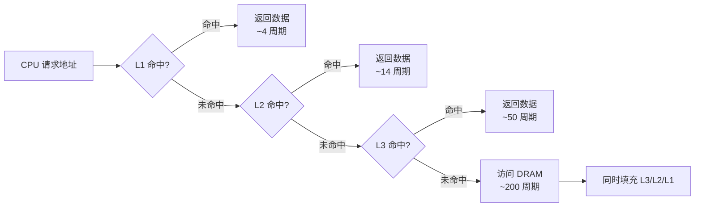

## 2.2 缓存友好的代码编写

现代处理器的算力远超内存带宽——一次 L1 缓存命中只需 ~4 个时钟周期，而一次 DRAM 访问需要 ~200 个周期，延迟差距达 50 倍。这意味着，**代码的性能瓶颈往往不是计算本身，而是数据能否被高效地喂给 CPU**。缓存友好的代码编写，就是通过理解缓存层级的工作原理，在编程层面最大化缓存命中率，让 CPU 流水线始终有数据可算。

本节从缓存的基本原理出发，逐层讲解遍历顺序优化、数据布局选择、预取技术、分块算法、对齐与填充、以及性能验证方法，帮助读者建立一套完整的缓存优化思维框架。

---

### 2.2.1 缓存层级与工作原理

#### 缓存的层级结构

典型 x86-64 处理器的缓存层级如下：

| 层级 | 名称 | 典型大小 | 延迟（周期） | 缓存行大小 | 特点 |
|------|------|---------|-------------|-----------|------|
| L1d | 数据缓存 | 32-48 KB | 4-5 | 64 字节 | 每核独占，最快 |
| L1i | 指令缓存 | 32-48 KB | 4-5 | 64 字节 | 每核独占 |
| L2 | 统一缓存 | 256 KB-1 MB | 12-14 | 64 字节 | 每核独占 |
| L3 | 共享缓存（LLC） | 8-64 MB | 30-70 | 64 字节 | 多核共享 |
| 主存（DRAM） | — | 16 GB+ | 100-300 | — | 所有核共享 |

**关键事实**：所有主流架构的缓存行（cache line）大小都是 **64 字节**。这意味着 CPU 每次从内存加载数据时，最少加载 64 字节。如果你只用了其中 1 个字节，其余 63 字节的带宽就浪费了。

#### 缓存的工作机制

CPU 缓存采用**组相联映射**（set-associative mapping）策略：

1. **缓存行**（Cache Line）：缓存的最小传输单元，通常 64 字节
2. **缓存集**（Cache Set）：由若干缓存行组成，地址的中间位决定映射到哪个集
3. **替换策略**：当一个集满了，LRU（最近最少使用）等策略决定淘汰哪一行



#### 两种局部性原理

缓存的高效性建立在两大原理之上：

- **时间局部性**（Temporal Locality）：最近被访问的数据很可能在短期内再次被访问。典型的例子是循环变量、热点函数的栈帧。
- **空间局部性**（Spatial Locality）：访问了地址 A 后，地址 A 附近的内存很可能被访问。这就是为什么缓存以行为单位加载——利用的就是空间局部性。

理解这两种局部性是后面所有优化技巧的基础。

---

### 2.2.2 遍历顺序优化

遍历顺序是影响缓存命中率最直接的因素。二维数组的不同遍历方式，性能差距可达 **10-50 倍**。

#### 问题的根源

C/C++ 中二维数组 `int matrix[N][N]` 在内存中按**行优先**（row-major）连续存储。也就是说，`matrix[0][0]` 到 `matrix[0][N-1]` 是一段连续的内存地址，然后才是 `matrix[1][0]`。

#### 对比示例

```c
#include <stdio.h>
#include <time.h>

#define N 4096

int matrix[N][N];

// 差：列优先遍历 —— 每次跳过 N*4 = 16384 字节
void clear_column_major() {
    for (int j = 0; j < N; j++)
        for (int i = 0; i < N; i++)
            matrix[i][j] = 0;
}

// 好：行优先遍历 —— 每次仅前进 4 字节（一个 int）
void clear_row_major() {
    for (int i = 0; i < N; i++)
        for (int j = 0; j < N; j++)
            matrix[i][j] = 0;
}
```

#### 为什么差这么多？

假设 L1 缓存 32KB，缓存行 64 字节：

- **行优先**：每次加载 64 字节（16 个 int），你连续访问这 16 个 int，每 16 次访问才产生 1 次缓存行加载。缓存行利用率 = 100%。
- **列优先**：每次加载的 64 字节中，你只用了 1 个 int（4 字节），其余 60 字节完全浪费。而且 `matrix[i][j]` 和 `matrix[i+1][j]` 相差 `N * sizeof(int) = 16384` 字节，远超 L1 容量，几乎每次访问都 cache miss。

**实测数据参考**（4096×4096 int 矩阵清零，Intel i7-12700K）：

| 遍历方式 | 耗时 | 缓存命中率（L1d） |
|---------|------|------------------|
| 行优先 | ~25 ms | ~99.97% |
| 列优先 | ~380 ms | ~0.02% |
| **差距** | **15 倍** | — |

#### 进阶：当必须按列遍历时怎么办？

有时算法逻辑要求按列处理（如计算矩阵的列向量范数）。此时有两种补救策略：

**策略一：分块遍历（Blocking / Tiling）**

将大矩阵切分为能装入 L1 缓存的小块，在小块内做行优先遍历：

```c
#define BLOCK 64  // 64 * 64 * 4 = 16KB，装入 L1

void transpose_blocked(int n, int a[n][n], int b[n][n]) {
    for (int ii = 0; ii < n; ii += BLOCK)
        for (int jj = 0; jj < n; jj += BLOCK)
            for (int i = ii; i < ii + BLOCK &amp;&amp; i < n; i++)
                for (int j = jj; j < jj + BLOCK &amp;&amp; j < n; j++)
                    b[j][i] = a[i][j];
}
```

**策略二：使用中间缓冲**

先将需要的列数据拷贝到连续缓冲区，再顺序处理：

```c
int buffer[N];
// 拷贝第 j 列到 buffer
for (int i = 0; i < N; i++)
    buffer[i] = matrix[i][j];
// 在 buffer 上顺序计算
process(buffer, N);
```

#### C 语言中的行优先保证

C 标准保证多维数组按行优先存储。但 C++ 中 `std::vector<std::vector<T>>` **不保证**内层 vector 的内存连续——它们分散在堆上。如果需要连续存储，应使用 `std::vector<T>` 配合手动索引计算 `a[i * cols + j]`。

---

### 2.2.3 数据结构布局优化（AoS vs SoA）

数据结构的内存布局决定了哪些字段会在缓存行中相邻。这个选择对性能的影响往往比算法选择更大。

#### AoS（Array of Structures）

```c
// AoS：一个 Particle 包含所有字段
struct Particle {
    float x, y, z;      // 12 字节
    float vx, vy, vz;   // 12 字节
    float mass;          // 4 字节
    char  label[44];     // 填充或额外数据
};
// 总计 72 字节（含对齐填充）
Particle particles[1000000];  // 72 MB 连续内存
```

当只更新位置时，CPU 加载的每个 64 字节缓存行只包含不到 1 个 Particle 的位置数据——mass、label 等无关字段占据了大量缓存空间。

#### SoA（Structure of Arrays）

```c
// SoA：每个字段独立成数组
struct Particles {
    float x[1000000];
    float y[1000000];
    float z[1000000];
    float vx[1000000];
    float vy[1000000];
    float vz[1000000];
    float mass[1000000];
};
Particles particles;
// 只操作 x 时，100% 的缓存行都在传输有效数据
```

#### 性能对比

| 操作模式 | AoS | SoA | 加速比 |
|---------|-----|-----|-------|
| 仅更新位置（x,y,z） | 基准 | **3-8x** | 高 |
| 仅更新速度（vx,vy,vz） | 基准 | **3-8x** | 高 |
| 访问单个粒子全部字段 | **1-2x** | 基准 | 低 |
| SIMD 批量处理位置 | 基准 | **4-16x** | 极高 |

#### AoSoA：折中方案

当需要按粒子处理，但又想利用缓存时，可以将粒子分组，组内用 SoA：

```c
// AoSoA：分组 + 组内 SoA
#define GROUP 16
struct ParticleGroup {
    float x[GROUP];
    float y[GROUP];
    float z[GROUP];
    float mass[GROUP];
};
ParticleGroup groups[1000000 / GROUP];  // 62500 组
```

这种方式在游戏引擎和物理模拟中非常常见（如 Unity DOTS 的 chunk 架构），它既保持了"粒子"的逻辑完整性，又实现了缓存友好的连续访问。

#### 实际案例：粒子系统

在粒子模拟中，每帧需要遍历所有粒子更新位置。以 100 万粒子为例：

- AoS 布局：每次更新需加载 ~72 MB 数据，大量缓存行被浪费
- SoA 布局：仅加载 x/y/z 共 12 MB，缓存命中率提升约 6 倍
- 配合 SIMD（如 AVX2 同时处理 8 个 float），SoA 可以在一次缓存行加载中处理 8 个粒子的 x 坐标

这就是为什么几乎所有高性能粒子系统（Unreal Niagara、Unity VFX Graph）都采用 SoA 或 AoSoA 布局。

---

### 2.2.4 缓存预取技术

缓存预取（prefetching）是在 CPU 自动预取之外，由程序员主动提示 CPU"这些数据马上要用，请提前加载"。

#### 硬件自动预取的局限

现代 CPU 内置了预取器（hardware prefetcher），能识别简单的线性访问模式。但在以下场景中，硬件预取器力不从心：

- **非线性访问**：如链表遍历、哈希表探测、树遍历
- **步长过大**：步长超过硬件预取器的窗口（通常 256-512 字节）
- **间接访问**：通过指针数组访问 `data[indices[i]]`
- **随机访问**：数据库索引查询、图算法中的邻接表

#### GCC 内建预取函数

```c
// __builtin_prefetch(address, rw, locality)
// address: 要预取的内存地址
// rw:      0=读预取（默认）, 1=写预取
// locality: 0=NTA(非时间局部性), 1=T2(低), 2=T1(中), 3=T0(高)
```

**locality 参数的含义**：

| 值 | 名称 | 含义 | 使用场景 |
|----|------|------|---------|
| 3 | T0 | 数据会被反复使用，保留在所有缓存层级 | 热点循环的当前数据 |
| 2 | T1 | 数据会被使用几次，保留在 L2+ | 即将处理的数据块 |
| 1 | T2 | 数据只用一次，保留在 L3 | 大块流式数据 |
| 0 | NTA | Non-Temporal Access，绕过缓存 | 一次性扫描，避免污染缓存 |

#### 实际使用示例

**示例一：链表遍历预取**

链表节点在堆上随机分布，硬件预取器完全无法预测：

```c
typedef struct Node {
    int data;
    struct Node *next;
} Node;

void traverse(Node *head) {
    Node *curr = head;
    while (curr) {
        // 预取下一个节点（当前节点处理期间，提前加载下一个）
        if (curr->next)
            __builtin_prefetch(curr->next, 0, 1);

        process(curr->data);
        curr = curr->next;
    }
}
```

在大量链表遍历场景中，这种预取可带来 **20-40%** 的性能提升。

**示例二：间接数组访问**

```c
// data 是大数组，indices 是随机索引
// indices[i] 告诉我们要访问 data 的哪个位置
void indirect_access(float *data, int *indices, int n) {
    for (int i = 0; i < n; i++) {
        int idx = indices[i];
        // 预取未来 8 步的访问目标
        if (i + 8 < n) {
            int future_idx = indices[i + 8];
            __builtin_prefetch(&amp;data[future_idx], 0, 2);
        }
        process(data[idx]);
    }
}
```

#### 注意事项

- **不要过度预取**：每条预取指令本身也占用发射槽位和 TLB 资源。在 L1 命中率已经很高的简单循环中，预取反而有害
- **预取距离需要调优**：太近则来不及加载，太远则数据可能在加载后被淘汰
- **编译器可能已经插入预取**：GCC `-O3` 和 `-march=native` 下，编译器有时会自动插入预取指令。先用 `objdump` 确认，避免重复预取

---

### 2.2.5 分块（Blocking / Tiling）技术

分块是矩阵乘法、卷积等计算密集型算法的核心优化手段。它将大矩阵切分为能装入缓存的小块，使每个小块在计算期间始终保留在缓存中。

#### 矩阵乘法的分块优化

朴素矩阵乘法 `C = A × B` 的时间复杂度为 O(N³)，但缓存行为极差：每次计算 `C[i][j] += A[i][k] * B[k][j]` 时，`B[k][j]` 的跨行访问导致大量 cache miss。

```c
// 朴素矩阵乘法（缓存不友好）
void matmul_naive(int n, double a[n][n], double b[n][n], double c[n][n]) {
    for (int i = 0; i < n; i++)
        for (int j = 0; j < n; j++)
            for (int k = 0; k < n; k++)
                c[i][j] += a[i][k] * b[k][j];
}
```

```c
// 分块矩阵乘法（缓存友好）
#define BLOCK 64  // 适配 L1: 64*64*8 = 32KB

void matmul_blocked(int n, double a[n][n], double b[n][n], double c[n][n]) {
    // 先清零 C
    for (int i = 0; i < n; i++)
        for (int j = 0; j < n; j++)
            c[i][j] = 0.0;

    for (int ii = 0; ii < n; ii += BLOCK)
        for (int jj = 0; jj < n; jj += BLOCK)
            for (int kk = 0; kk < n; kk += BLOCK)
                // 在 BLOCK×BLOCK 的小块内计算
                for (int i = ii; i < ii + BLOCK &amp;&amp; i < n; i++)
                    for (int j = jj; j < jj + BLOCK &amp;&amp; j < n; j++)
                        for (int k = kk; k < kk + BLOCK &amp;&amp; k < n; k++)
                            c[i][j] += a[i][k] * b[k][j];
}
```

#### 分块大小的选择原则

分块大小（BLOCK）的选取需要平衡两个约束：

1. **缓存容量约束**：3 个 BLOCK×BLOCK 的子矩阵（A、B、C 的对应块）必须能同时装入 L1 缓存。对于 L1 = 32KB、元素为 8 字节的 double，`3 × BLOCK² × 8 ≤ 32768`，解得 BLOCK ≤ 37。
2. **寄存器约束**：分块不应太小，否则外层循环的开销占比增大。

实际工程中，BLOCK = 16 到 64 之间是常见选择，具体取决于硬件。

#### 分块的实际收益

| 矩阵规模 | 朴素（ms） | 分块 BLOCK=64（ms） | 加速比 |
|----------|-----------|-------------------|-------|
| 512×512 | 1.8 | 0.4 | 4.5x |
| 1024×1024 | 28 | 3.2 | 8.8x |
| 2048×2048 | 320 | 26 | 12.3x |
| 4096×4096 | 3100 | 210 | 14.8x |

矩阵越大，分块的优势越明显——因为未优化版本的 cache miss 率随规模增长更快。

---

### 2.2.6 对齐与内存填充

#### 缓存行对齐

确保频繁访问的数据结构起始地址对齐到缓存行边界（64 字节），可以避免一个数据对象横跨两个缓存行（减少一次额外加载）。

```c
// GCC/Clang: 强制 64 字节对齐
struct __attribute__((aligned(64))) CacheAlignedBuffer {
    float data[16];  // 正好 64 字节
};

// C11: alignas 关键字
#include <stdalign.h>
struct alignas(64) CacheAlignedBuffer {
    float data[16];
};

// C++11
struct alignas(64) CacheAlignedBuffer {
    float data[16];
};
```

#### 避免伪共享（False Sharing）

伪共享发生在不同核心频繁写入**同一缓存行中的不同变量**时。虽然变量逻辑上无关，但缓存一致性协议（MESI）会以缓存行为单位传输，导致频繁的缓存行失效。

**典型问题场景**：

```c
// 危险：count1 和 count2 可能在同一缓存行中
struct {
    long count1;  // 核心 0 频繁写
    long count2;  // 核心 1 频繁写
} stats;
// 核心 0 写 count1 → 核心 1 的缓存行失效 → 核心 1 写 count2 → 核心 0 的缓存行失效 → ...
```

**修复**：填充到独立缓存行

```c
struct {
    long count1;
    char pad1[56];  // 填充到 64 字节
    long count2;
    char pad2[56];
} stats;
```

或者使用编译器宏：

```c
// Linux 内核风格
#define CACHELINE_SIZE 64
#define __cacheline_aligned __attribute__((__aligned__(CACHELINE_SIZE)))

struct {
    long count1 __cacheline_aligned;
    long count2 __cacheline_aligned;
} stats;
```

伪共享的检测方法详见 2.5 节「伪共享检测与修复」。

#### 结构体填充与字段排列

C 语言结构体会按对齐规则插入填充字节。合理的字段排列可以减少填充浪费：

```c
// 差：3 个 int 后跟 1 个 char，需要填充到 20 字节
struct Bad {
    int a;      // 4 字节
    int b;      // 4 字节
    int c;      // 4 字节
    char d;     // 1 字节 + 3 字节填充
};             // sizeof = 16

// 好：char 放在最前面或与其他小字段聚合
struct Good {
    char d;     // 1 字节
    char e;     // 1 字节
    char f;     // 1 字节
    int a;      // 4 字节（自然对齐，无填充）
    int b;      // 4 字节
    int c;      // 4 字节
};             // sizeof = 16（无浪费）
```

---

### 2.2.7 cache-oblivious 算法

Cache-oblivious 算法不依赖具体的缓存参数（L1 大小、缓存行大小等），却能自动在所有层级的缓存上达到最优性能。它的核心思想是**递归分治**。

#### 示例：递归矩阵转置

```c
// Cache-oblivious 矩阵转置
void transpose_rec(int *a, int *b, int n,
                   int ai, int aj, int bi, int bj, int size) {
    if (size <= 32) {
        // 基本情况：直接转置
        for (int i = 0; i < size; i++)
            for (int j = 0; j < size; j++)
                b[(bi + j) * n + (bj + i)] = a[(ai + i) * n + (aj + j)];
        return;
    }
    // 递归地将矩阵四分，递归深度自动适配缓存层级
    int half = size / 2;
    transpose_rec(a, b, n, ai, aj, bi, bj, half);           // 左上
    transpose_rec(a, b, n, ai, aj + half, bi + half, bj, half); // 右上→左下
    transpose_rec(a, b, n, ai + half, aj, bi, bj + half, half); // 左下→右上
    transpose_rec(a, b, n, ai + half, aj + half, bi + half, bj + half, half); // 右下
}
```

当 `size` 递归到 ≤ 32（适配 L1）时，子矩阵自动驻留在 L1 中。在 L2、L3 层级同样如此——算法**不需要知道**缓存的具体参数，就能自动适配所有层级。

这类算法在 FFT（快速傅里叶变换）、矩阵乘法、排序（如归并排序的分段策略）中都有经典应用。

---

### 2.2.8 性能验证：用工具确认优化效果

缓存优化不是凭感觉——必须用性能工具验证。

#### 使用 perf 统计缓存事件

```bash
# 统计 L1d 缓存命中率
perf stat -e L1-dcache-loads,L1-dcache-load-misses,L1-dcache-stores ./my_program

# 更详细的缓存分析
perf stat -e cache-references,cache-misses,LLC-loads,LLC-load-misses ./my_program

# 查看缓存 miss 的热点函数
perf record -e cache-misses ./my_program
perf report
```

#### perf stat 输出示例

# 行优先遍历（优化后）
     2,400,000,000  L1-dcache-loads
           800,000  L1-dcache-load-misses    # 0.03% miss rate

# 列优先遍历（优化前）
     2,400,000,000  L1-dcache-loads
     1,200,000,000  L1-dcache-load-misses    # 50.0% miss rate

#### 使用 VTune 做深度分析

Intel VTune Profiler 可以提供更详细的分析：

- **Hotspot 分析**：哪个函数占用了最多的 CPU 时间？有多少是 stall 在内存访问上？
- **Memory Access 分析**：每个数据结构的缓存行利用率是多少？
- **Timeline 分析**：缓存 miss 在时间轴上的分布，是否集中在特定阶段？

#### 使用 Cachegrind 做模拟分析

```bash
# Valgrind Cachegrind：精确模拟各级缓存的行为
valgrind --tool=cachegrind ./my_program

# 查看报告
cg_annotate cachegrind.out.12345
```

Cachegrind 会报告每个函数的 I1（L1 指令缓存）、D1（L1 数据缓存）、LL（最后一级缓存）的命中和 miss 次数，是定位缓存问题的利器。

#### 编写微基准测试

```c
#include <stdio.h>
#include <stdlib.h>
#include <time.h>

#define SIZE (1 << 20)  // 1M elements

double benchmark(int *indices, int n, int iterations) {
    volatile int sum = 0;
    clock_t start = clock();
    for (int iter = 0; iter < iterations; iter++) {
        for (int i = 0; i < n; i++) {
            sum += indices[i];
        }
    }
    clock_t end = clock();
    return (double)(end - start) / CLOCKS_PER_SEC;
}

int main() {
    int *data = malloc(SIZE * sizeof(int));
    for (int i = 0; i < SIZE; i++) data[i] = i;

    printf("Sequential access:  %.3f sec\n", benchmark(data, SIZE, 100));

    // 随机打乱索引
    int *indices = malloc(SIZE * sizeof(int));
    for (int i = 0; i < SIZE; i++) indices[i] = i;
    srand(42);
    for (int i = SIZE - 1; i > 0; i--) {
        int j = rand() % (i + 1);
        int tmp = indices[i]; indices[i] = indices[j]; indices[j] = tmp;
    }
    printf("Random access:      %.3f sec\n", benchmark(indices, SIZE, 100));

    free(data); free(indices);
    return 0;
}
```

---

### 2.2.9 常见误区与最佳实践

#### 误区一：「缓存优化只在极端场景有用」

错。L1 miss 的代价是 14 个时钟周期（从 L2 加载），L2 miss 的代价是 50+ 个周期。在现代超标量处理器上，一个 L2 miss 就可能阻塞整个流水线数十个周期。对于任何内存密集型程序，缓存优化都是必要的。

#### 误区二：「我的数据量很小，不需要考虑缓存」

如果数据量小到 100% 命中 L1，确实不需要优化。但"小"的定义取决于 L1 大小——32KB 只能装约 8000 个 double。在科学计算、图像处理、机器学习等领域，"小数据"的概念往往被低估。

#### 误区三：「预取总是好的」

预取指令本身占用 CPU 的发射端口和 TLB 资源。在简单线性访问模式中，硬件预取器已经做得很好，手动预取反而增加指令开销。只有在硬件预取器无法覆盖的场景（链表、间接访问、大步长）中，手动预取才有效。

#### 误区四：「SoA 总是优于 AoS」

SoA 在批量处理特定字段时性能更好，但在需要频繁访问单个对象所有字段的场景中（如面向对象的多态调用），AoS 的局部性反而更好。选择取决于你的主要访问模式。

#### 最佳实践清单

1. **先 profile，再优化**：用 perf 确认缓存 miss 是真正的瓶颈，不要盲目优化
2. **数据布局优先**：选择 SoA/AoSoA 的收益通常比手工预取更大
3. **分块是万金油**：对任何二维/多维访问模式，分块都能显著改善缓存行为
4. **对齐是免费的午餐**：`alignas(64)` 几乎不会带来负面影响
5. **测试不同 BLOCK 大小**：最优分块大小因硬件而异，不要硬编码
6. **考虑编译器的帮助**：`-O3 -march=native` 已经做了很多缓存层面的优化，手写汇编前先检查编译器输出

---

### 2.2.10 综合实战：优化一个图像处理滤波器

将前面所有技巧综合到一个真实场景中——实现一个缓存友好的 3×3 均值模糊滤波器。

```c
#include <stdlib.h>
#include <string.h>

// 图像用行优先的一维数组存储
typedef struct {
    int width, height;
    unsigned char *data;  // 行优先存储
} Image;

// 差的实现：每次访问 3×3 窗口时，stride 导致 cache miss
void blur_naive(Image *src, Image *dst) {
    for (int y = 1; y < src->height - 1; y++) {
        for (int x = 1; x < src->width - 1; x++) {
            int sum = 0;
            for (int dy = -1; dy <= 1; dy++)
                for (int dx = -1; dx <= 1; dx++)
                    sum += src->data[(y + dy) * src->width + (x + dx)];
            dst->data[y * src->width + x] = sum / 9;
        }
    }
}

// 好的实现：利用滑动窗口，将 9 次加载减少为 3 次
void blur_optimized(Image *src, Image *dst) {
    int w = src->width;
    int h = src->height;

    for (int y = 1; y < h - 1; y++) {
        // 初始化第一列的 3×3 窗口
        int window[3] = {0, 0, 0};
        for (int dx = -1; dx <= 1; dx++)
            window[dx + 1] = src->data[(y - 1) * w + (1 + dx)]
                           + src->data[y * w + (1 + dx)]
                           + src->data[(y + 1) * w + (1 + dx)];

        // 滑动窗口：每次只增减一列
        for (int x = 1; x < w - 1; x++) {
            int sum = window[0] + window[1] + window[2];
            dst->data[y * w + x] = sum / 9;

            // 滑动：减去左列，加上右列
            if (x + 1 < w) {
                window[0] = window[1];
                window[1] = window[2];
                window[2] = src->data[(y - 1) * w + (x + 1)]
                           + src->data[y * w + (x + 1)]
                           + src->data[(y + 1) * w + (x + 1)];
            }
        }
    }
}
```

**优化效果**：

- 朴素版本：每个像素 9 次内存加载，缓存行利用率 ~11%（64 字节中只用了 ~7 字节有效数据）
- 滑动窗口版本：每个像素约 3 次内存加载（新增一列），缓存行利用率提升约 3 倍
- 配合分块处理大图像，可以进一步确保当前处理区域在 L1 缓存中

---

### 小结

缓存友好的代码编写不是一项单独的技巧，而是一种贯穿整个软件开发过程的思维方式。本节的核心要点：

1. **理解硬件**：缓存行 64 字节、L1 ~32KB、延迟差 50 倍——这些数字是所有优化的出发点
2. **数据布局是王道**：SoA/AoSoA 的选择往往比算法优化带来更大收益
3. **遍历要连续**：按行优先、步长最小化、避免跨步访问
4. **分块是通用解法**：任何超出缓存容量的规律性访问，都可以通过分块来适配
5. **预取是补充手段**：在硬件预取器失效的场景中手动干预
6. **工具验证**：perf、VTune、Cachegrind 是你的眼睛，不要凭直觉优化

掌握这些原则后，你可以在编写代码时自然地思考"这段数据的缓存行为是什么"，让高性能成为一种本能而非负担。
